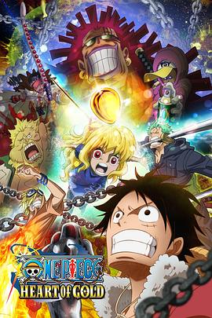
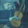

# 海贼王特别篇：黄金之心 (豆瓣)

**链接地址:** https://www.douban.com/doubanapp/dispatch?uri=/subject/26834930/interest/1065815340
**作者:** 
**获取时间:** 2025/8/28 22:41:45
**图片数量:** 46

---

## 原始HTML内容

  
    

    
    

    <link href="//img3.doubanio.com/dae/accounts/resources/ba98e9b/shire/bundle.css" rel="stylesheet" type="text/css">

  

    

  <a href="https://accounts.douban.com/passport/login?source=movie" class="nav-login" rel="nofollow">登录/注册</a>

    

  <a href="https://www.douban.com/doubanapp/app?channel=top-nav" class="lnk-doubanapp">下载豆瓣客户端</a>
  

    <a href="https://www.douban.com/doubanapp/app?channel=qipao" class="tip-link">豆瓣 6.0 全新发布</a>
    <a href="javascript: void 0;" class="tip-close">×</a>
  

  

    
豆瓣

    
扫码直接下载

    

      <a href="https://www.douban.com/doubanapp/redirect?channel=top-nav&amp;direct_dl=1&amp;download=iOS">iPhone</a>
      ·
      <a href="https://www.douban.com/doubanapp/redirect?channel=top-nav&amp;direct_dl=1&amp;download=Android" class="download-android">Android</a>
    

  

    

  <ul>
    <li class="">
      <a href="https://www.douban.com" target="_blank" data-moreurl-dict="{&quot;from&quot;:&quot;top-nav-click-main&quot;,&quot;uid&quot;:&quot;0&quot;}">豆瓣</a>
    </li>
    <li class="">
      <a href="https://book.douban.com" target="_blank" data-moreurl-dict="{&quot;from&quot;:&quot;top-nav-click-book&quot;,&quot;uid&quot;:&quot;0&quot;}">读书</a>
    </li>
    <li class="on">
      <a href="https://movie.douban.com" data-moreurl-dict="{&quot;from&quot;:&quot;top-nav-click-movie&quot;,&quot;uid&quot;:&quot;0&quot;}">电影</a>
    </li>
    <li class="">
      <a href="https://music.douban.com" target="_blank" data-moreurl-dict="{&quot;from&quot;:&quot;top-nav-click-music&quot;,&quot;uid&quot;:&quot;0&quot;}">音乐</a>
    </li>
    <li class="">
      <a href="https://www.douban.com/podcast/" target="_blank" data-moreurl-dict="{&quot;from&quot;:&quot;top-nav-click-podcast&quot;,&quot;uid&quot;:&quot;0&quot;}">播客</a>
    </li>
    <li class="">
      <a href="https://www.douban.com/location" target="_blank" data-moreurl-dict="{&quot;from&quot;:&quot;top-nav-click-location&quot;,&quot;uid&quot;:&quot;0&quot;}">同城</a>
    </li>
    <li class="">
      <a href="https://www.douban.com/group" target="_blank" data-moreurl-dict="{&quot;from&quot;:&quot;top-nav-click-group&quot;,&quot;uid&quot;:&quot;0&quot;}">小组</a>
    </li>
    <li class="">
      <a href="https://read.douban.com/?dcs=top-nav&amp;dcm=douban" target="_blank" data-moreurl-dict="{&quot;from&quot;:&quot;top-nav-click-read&quot;,&quot;uid&quot;:&quot;0&quot;}">阅读</a>
    </li>
    <li class="">
      <a href="https://fm.douban.com/?from_=shire_top_nav" target="_blank" data-moreurl-dict="{&quot;from&quot;:&quot;top-nav-click-fm&quot;,&quot;uid&quot;:&quot;0&quot;}">FM</a>
    </li>
    <li class="">
      <a href="https://time.douban.com/?dt_time_source=douban-web_top_nav" target="_blank" data-moreurl-dict="{&quot;from&quot;:&quot;top-nav-click-time&quot;,&quot;uid&quot;:&quot;0&quot;}">时间</a>
    </li>
    <li class="">
      <a href="https://market.douban.com/?utm_campaign=douban_top_nav&amp;utm_source=douban&amp;utm_medium=pc_web" target="_blank" data-moreurl-dict="{&quot;from&quot;:&quot;top-nav-click-market&quot;,&quot;uid&quot;:&quot;0&quot;}">豆品</a>
    </li>
  </ul>

  

    

    

    <link href="//img3.doubanio.com/dae/accounts/resources/ba98e9b/movie/bundle.css" rel="stylesheet" type="text/css">

  

  

    

      <a href="https://movie.douban.com">豆瓣电影</a>
    

    

      <form action="https://search.douban.com/movie/subject_search" method="get">
        <fieldset>
          <legend>搜索：</legend>
          <label for="inp-query">
          </label>
          
<input id="inp-query" name="search_text" size="22" maxlength="60" placeholder="搜索电影、电视剧、综艺、影人" value="">

          
<input type="submit" value="搜索">

          <input type="hidden" name="cat" value="1002">
        </fieldset>
      </form>
    

  

  

  

    

  <ul>
    <li><a href="https://movie.douban.com/cinema/nowplaying/">影讯&amp;购票</a>
    </li>
    <li><a href="https://movie.douban.com/explore">选电影</a>
    </li>
    <li><a href="https://movie.douban.com/tv/">选剧集</a>
    </li>
    <li><a href="https://movie.douban.com/chart">排行榜</a>
    </li>
    <li><a href="https://movie.douban.com/review/best/">影评</a>
    </li>
    <li><a href="https://movie.douban.com/annual/2024/?fullscreen=1&amp;dt_from=movie_navigation">2024年度榜单</a>
    </li>
    <li><a href="https://c9.douban.com/app/standbyme-2024/?autorotate=false&amp;fullscreen=true&amp;hidenav=true&amp;monitor_screenshot=true&amp;df_from=web_navigation" target="_blank">2024年度报告</a>
    </li>
  </ul>

    
  

    

    
    

        

        
    

        

    <h1>
        海贼王特别篇：黄金之心 ワンピース ~ハートオブ ゴールド~
            (2016)
    </h1>

        

            

            
            

                
    

        

            

                
                

    

                

        导演: <a href="https://www.douban.com/personage/27483848/" rel="v:directedBy">长峰达也</a> 
        编剧: <a href="https://www.douban.com/personage/27480467/">黑岩勉</a> / <a href="https://www.douban.com/personage/27220426/">尾田荣一郎</a> 
        主演: <a href="https://www.douban.com/personage/27222524/" rel="v:starring">田中真弓</a> / <a href="https://www.douban.com/personage/27239088/" rel="v:starring">冈村明美</a> / <a href="https://www.douban.com/personage/27243088/" rel="v:starring">中井和哉</a> / <a href="https://www.douban.com/personage/27224678/" rel="v:starring">山口胜平</a> / <a href="https://www.douban.com/personage/27231313/" rel="v:starring">平田广明</a> / <a href="https://www.douban.com/personage/27231134/" rel="v:starring">大谷育江</a> / <a href="https://www.douban.com/personage/27248242/" rel="v:starring">山口由里子</a> / <a href="https://www.douban.com/personage/27225783/" rel="v:starring">矢尾一树</a> / <a href="https://www.douban.com/personage/27336219/" rel="v:starring">长岛雄一</a> / <a href="https://www.douban.com/personage/27213887/" rel="v:starring">吉野裕行</a> / <a href="https://www.douban.com/personage/27256744/" rel="v:starring">关智一</a> / <a href="https://www.douban.com/personage/27357089/" rel="v:starring">铃木胜美</a> / <a href="https://www.douban.com/personage/27219412/" rel="v:starring">增谷康纪</a> / <a href="https://www.douban.com/personage/27229926/" rel="v:starring">水田山葵</a> / <a href="https://www.douban.com/personage/27417898/" rel="v:starring">大浦冬华</a> / <a href="https://www.douban.com/personage/30341230/" rel="v:starring">织田优成</a> / <a href="https://www.douban.com/personage/30471625/" rel="v:starring">田中一成</a> / <a href="https://www.douban.com/personage/27586886/" rel="v:starring">福原耕平</a> / <a href="https://www.douban.com/personage/30442457/" rel="v:starring">藤本隆弘</a> / <a href="https://www.douban.com/personage/30442473/" rel="v:starring">宫崎宽务</a> / <a href="https://www.douban.com/personage/27587934/" rel="v:starring">新井良平</a> / <a href="/subject_search?search_text=%E5%8D%83%E5%8F%B6%E4%BF%8A%E5%93%89" rel="v:starring">千叶俊哉</a> / <a href="/subject_search?search_text=%E4%BA%94%E5%91%B3%E6%B4%B8%E4%B8%80" rel="v:starring">五味洸一</a> / <a href="/subject_search?search_text=%E6%9C%8D%E9%83%A8%E6%83%B3%E4%B9%8B%E4%BB%8B" rel="v:starring">服部想之介</a> / <a href="/subject_search?search_text=%E8%9F%B9%E6%B1%9F%E4%BF%8A%E4%BB%8B" rel="v:starring">蟹江俊介</a> / <a href="https://www.douban.com/personage/27578699/" rel="v:starring">山路和弘</a> / <a href="https://www.douban.com/personage/27216799/" rel="v:starring">滨田岳</a> / <a href="https://www.douban.com/personage/27494970/" rel="v:starring">水原希子</a> / <a href="https://www.douban.com/personage/27481168/" rel="v:starring">滨边美波</a> / <a href="https://www.douban.com/personage/27217054/" rel="v:starring">涩川清彦</a> / <a href="https://www.douban.com/personage/27219941/" rel="v:starring">小栗旬</a> 
        类型: 动画 / 冒险 
        
        制片国家/地区: 日本 
        语言: 日语 
        上映日期: 2016-07-16 
        片长: 105分钟 
        又名: One Piece Heart of Gold 
        IMDb: tt6425816 

            

            
                

<link rel="stylesheet" href="https://img3.doubanio.com/cuphead/movie-static/download-output-image/index.7aaa3.css">

    

        

            

                豆瓣评分
            

          

            
            <a class="download-output-image" href="#">引用</a>
          

        

        

    <strong class="ll rating_num" property="v:average">7.3</strong>
    
    

        

        

                <a href="comments" class="rating_people">
                    7512人评价
                </a>
        

    

    
        

        
        
            5星
        
        

        20.9%
         
        

        

        
        
            4星
        
        

        31.4%
         
        

        

        
        
            3星
        
        

        39.3%
         
        

        

        
        
            2星
        
        

        6.9%
         
        

        

        
        
            1星
        
        

        1.4%
         
        

    

        

            好于 <a href="/typerank?type_name=动画&amp;type=25&amp;interval_id=60:50&amp;action=">59% 动画片</a> 
            好于 <a href="/typerank?type_name=冒险&amp;type=15&amp;interval_id=65:55&amp;action=">63% 冒险片</a> 
        

            
        

        
            

        
            <a href="https://www.douban.com/reason=collectwish&amp;ck=" rel="nofollow" class="j a_show_login colbutt ll" name="pbtn-26834930-wish">
                想看
            </a>
            <a href="https://www.douban.com/reason=collectcollect&amp;ck=" rel="nofollow" class="j a_show_login colbutt ll" name="pbtn-26834930-collect">
                看过
            </a>
        

            
    
    评价:
     

            
            
            
            
            
    
    <input id="n_rating" type="hidden" value="">
    

        

        

    <ul class="ul_subject_menu bicelink color_gray pt6 clearfix">
        
    
        
                
                  <li> 
    &nbsp;
        <a onclick="moreurl(this, {from:'mv_sbj_wr_cmnt_login'})" class="j a_show_login" href="https://www.douban.com/register?reason=review" rel="nofollow">写短评</a>
 </li>
                  <li> 
    
    &nbsp;
        <a onclick="moreurl(this, {from:'mv_sbj_wr_rv_login'})" class="j a_show_login" href="https://www.douban.com/register?reason=review" rel="nofollow">写影评</a>
 </li>
                    <li> 
   

   
    
    
    <a href="#" data-type="电影" data-url="https://movie.douban.com/subject/26834930/" data-desc="电影《海贼王特别篇：黄金之心 ワンピース ~ハートオブ ゴールド~》 (来自豆瓣) " data-title="电影《海贼王特别篇：黄金之心 ワンピース ~ハートオブ ゴールド~》 (来自豆瓣) " data-pic="https://img1.doubanio.com/view/photo/s_ratio_poster/public/p2619188110.jpeg" class="bn-sharing ">
        分享到
    </a> &nbsp;&nbsp;
    
    <link rel="stylesheet" href="https://img1.doubanio.com/f/vendors/e8a7261937da62636d22ca4c579efc4a4d759b1b/css/ui/dialog.css">
    
    
    

  </li>
            

    </ul>

    

        
            

<link rel="stylesheet" href="https://img3.doubanio.com/cuphead/movie-static/mod/share.ee737.css" type="text/css">

    

        
        <a href="/accounts/register?reason=recommend" class="j a_show_login lnk-sharing" share-id="26834930" data-mode="plain" data-name="海贼王特别篇：黄金之心 ワンピース ~ハートオブ ゴールド~‎ (2016)" data-type="movie" data-desc="导演 长峰达也 主演 田中真弓 / 冈村明美 / 日本 / 7.3分(7512评价)" data-href="https://movie.douban.com/subject/26834930/" data-image="https://img1.doubanio.com/view/photo/s_ratio_poster/public/p2619188110.jpg" data-properties="{}" data-redir="" data-text="" data-apikey="" data-curl="" data-count="10" data-object_kind="1002" data-object_id="26834930" data-target_type="rec" data-target_action="0" data-action_props="{&quot;subject_url&quot;:&quot;https:\/\/movie.douban.com\/subject\/26834930\/&quot;,&quot;subject_title&quot;:&quot;海贼王特别篇：黄金之心 ワンピース ~ハートオブ ゴールド~‎ (2016)&quot;}">推荐</a>

        
    

        

    

    

    

    
    
        
            
            
    <h2>
        <i>海贼王特别篇：黄金之心的剧情简介</i>
              · · · · · ·
    </h2>

            

                    
                        
                            
                                    　　《海贼王》为了纪念播出第17年，同时也为了今年夏天上映的电影版造势，决定在电影上映前于电视上播出SP《One Piece Heart of Gold》。另外，小栗旬将作为客串声优参与。
                                         
                                    　　本次的SP将围绕神秘的宝藏“Pure Gold”讲述一个关于亲子之间羁绊的融合了感动和冒险的故事。小栗旬将为被称为史上最凶恶的宝藏猎人配音，这是一个实力超群，可以自由操纵身体中锁链的角色。
                                         
                                    　　从前就是《海贼王》粉丝的小栗旬表示，曾经收到过一次配音的邀约，但当时他觉得自己并不适合那个人物，所以就婉拒了，而这次他觉得宝藏猎人的角色真是与自己很搭，终于遇到了合适的角色。对于人物角色，小栗旬也表示：“虽然他被称作是最凶恶的宝藏猎人，但对于宝藏充满纯粹的欲望和执着，从这一点上看，意外地对这个人物恨不起来。”
                                         
                                    　　《One Piece Heart of Gold》将于7月16日晚21点...
                            
                            <a href="javascript:void(0)" class="j a_show_full">(展开全部)</a>
                        
                        
                                　　《海贼王》为了纪念播出第17年，同时也为了今年夏天上映的电影版造势，决定在电影上映前于电视上播出SP《One Piece Heart of Gold》。另外，小栗旬将作为客串声优参与。
                                     
                                　　本次的SP将围绕神秘的宝藏“Pure Gold”讲述一个关于亲子之间羁绊的融合了感动和冒险的故事。小栗旬将为被称为史上最凶恶的宝藏猎人配音，这是一个实力超群，可以自由操纵身体中锁链的角色。
                                     
                                　　从前就是《海贼王》粉丝的小栗旬表示，曾经收到过一次配音的邀约，但当时他觉得自己并不适合那个人物，所以就婉拒了，而这次他觉得宝藏猎人的角色真是与自己很搭，终于遇到了合适的角色。对于人物角色，小栗旬也表示：“虽然他被称作是最凶恶的宝藏猎人，但对于宝藏充满纯粹的欲望和执着，从这一点上看，意外地对这个人物恨不起来。”
                                     
                                　　《One Piece Heart of Gold》将于7月16日晚21点在富士电视台播出。
                        
                        

                        

            

    

    

<link rel="stylesheet" href="https://img3.doubanio.com/cuphead/movie-static/celebrity/celebrities_section.610da.css">

  
    <h2>
        <i>海贼王特别篇：黄金之心的演职员</i>
              · · · · · ·
            
            (
                <a href="/subject/26834930/celebrities">全部 32</a>
            )
            
    </h2>

  <ul class="celebrities-list from-subject __oneline">
        
    
  
  <li class="celebrity">
    

  <a href="https://www.douban.com/personage/27483848/" title="长峰达也 Tatsuya Nagamine" class="">
      

    

  </a>

    

      <a href="https://www.douban.com/personage/27483848/" title="长峰达也 Tatsuya Nagamine" class="name">长峰达也</a>

      导演

    

  </li>

        
    
  
  <li class="celebrity">
    

  <a href="https://www.douban.com/personage/27222524/" title="田中真弓 Mayumi Tanaka" class="">
      

    

  </a>

    

      <a href="https://www.douban.com/personage/27222524/" title="田中真弓 Mayumi Tanaka" class="name">田中真弓</a>

      配音

    

  </li>

        
    
  
  <li class="celebrity">
    

  <a href="https://www.douban.com/personage/27239088/" title="冈村明美 Akemi Okamura" class="">
      

    

  </a>

    

      <a href="https://www.douban.com/personage/27239088/" title="冈村明美 Akemi Okamura" class="name">冈村明美</a>

      配音

    

  </li>

        
    
  
  <li class="celebrity">
    

  <a href="https://www.douban.com/personage/27243088/" title="中井和哉 Kazuya Nakai" class="">
      

    

  </a>

    

      <a href="https://www.douban.com/personage/27243088/" title="中井和哉 Kazuya Nakai" class="name">中井和哉</a>

      配音

    

  </li>

        
    
  
  <li class="celebrity">
    

  <a href="https://www.douban.com/personage/27224678/" title="山口胜平 Kappei Yamaguchi" class="">
      

    

  </a>

    

      <a href="https://www.douban.com/personage/27224678/" title="山口胜平 Kappei Yamaguchi" class="name">山口胜平</a>

      配音

    

  </li>

        
    
  
  <li class="celebrity">
    

  <a href="https://www.douban.com/personage/27231313/" title="平田广明 Hiroaki Hirata" class="">
      

    

  </a>

    

      <a href="https://www.douban.com/personage/27231313/" title="平田广明 Hiroaki Hirata" class="name">平田广明</a>

      配音

    

  </li>

  </ul>

    

<link rel="stylesheet" href="https://img1.doubanio.com/f/verify/a5bc0bc0aea4221d751bc4809fd4b0a1075ad25e/entry_creator/dist/author_subject/style.css">

    

    
        

<link rel="stylesheet" href="https://img1.doubanio.com/cuphead/movie-static/subject/photos_section.45abd.css">

    
    

        
    
    
    <h2>
        <i>海贼王特别篇：黄金之心的图片</i>
              · · · · · ·
            
            (
                <a href="https://movie.douban.com/subject/26834930/all_photos">图片257</a>&nbsp;·&nbsp;<a href="https://movie.douban.com/subject/26834930/mupload">添加</a>
            )
            
    </h2>

        <ul class="related-pic-bd  ">
                <li>
                    
                </li>
                <li>
                    
                </li>
                <li>
                    
                </li>
                <li>
                    
                </li>
                <li>
                    
                </li>
        </ul>
    

    

    

    
        

<link rel="stylesheet" href="https://img3.doubanio.com/cuphead/movie-static/subject/recommendations.61283.css">

    

    
        

    
    <link rel="stylesheet" href="https://img1.doubanio.com/f/vendors/d63a579a99fd372b4398731a279a1382e6eac71e/subject-comments/comments-section.css">

    

        

            
            
        <a class="comment_btn j a_show_login" href="https://www.douban.com/register?reason=review" rel="nofollow">
            我要写短评
        </a>

            
    <h2>
        <i>海贼王特别篇：黄金之心的短评</i>
              · · · · · ·
            
            (
                <a href="https://movie.douban.com/subject/26834930/comments?status=P">全部 1298 条</a>
            )
            
    </h2>

        

        

        

                
        

                        <a id="hot-comments-tab" href="comments" data-id="hot" class="on">热门</a>&nbsp;/&nbsp;
                        <a id="new-comments-tab" href="comments?sort=time" data-id="new" class="j a_show_login">最新</a>&nbsp;/&nbsp;
                        <a id="following-comments-tab" href="comments?sort=follows" data-id="following" class="j a_show_login">好友</a>
        

    

        

            
    

        
        

            
    
    

        <h3>
            
                    6

                    <input value="1064961167" type="hidden">
                    <a href="javascript:;" data-id="1064961167" class="j a_show_login" onclick="">有用</a>

                <!-- 删除短评 -->
            
            
                <a href="https://www.douban.com/people/new4new4/">Doublebitch</a>
                    看过
                    
                
                    2016-07-23 14:30:26
                
                
            
        </h3>
        

            
                完全没听出来宝藏猎人声优是建国
        

        

    

    

        

        
        

            
    
    

        <h3>
            
                    31

                    <input value="1068789020" type="hidden">
                    <a href="javascript:;" data-id="1068789020" class="j a_show_login" onclick="">有用</a>

                <!-- 删除短评 -->
            
            
                <a href="https://www.douban.com/people/Lost_Key/">Lost_Key</a>
                    看过
                    
                
                    2016-08-02 00:16:07
                
                
            
        </h3>
        

            
                强行编故事，强行战斗，无趣至极，换做是其他作品早就中途弃了，我为自己从头到尾不快进看完105分钟打五星
                
                
        

        

    

    

        

        
        

            
    
    

        <h3>
            
                    58

                    <input value="1063548621" type="hidden">
                    <a href="javascript:;" data-id="1063548621" class="j a_show_login" onclick="">有用</a>

                <!-- 删除短评 -->
            
            
                <a href="https://www.douban.com/people/72984075/">葛炮玫瑰</a>
                    看过
                    
                
                    2016-07-18 22:05:50
                
                
            
        </h3>
        

            
                对手明明废得跟渣一样还要假装打得难舍难分，恶心的一笔。两颗星给山治隐身偷窥女澡堂的梦想
        

        

    

    

        

        
        

            
    
    

        <h3>
            
                    3

                    <input value="1065590831" type="hidden">
                    <a href="javascript:;" data-id="1065590831" class="j a_show_login" onclick="">有用</a>

                <!-- 删除短评 -->
            
            
                <a href="https://www.douban.com/people/72972634/">最初的风r</a>
                    看过
                    
                
                    2016-07-24 14:55:30
                
                
            
        </h3>
        

            
                新人物真丑。没新意。
        

        

    

    

        

        
        

            
    
    

        <h3>
            
                    10

                    <input value="1108876524" type="hidden">
                    <a href="javascript:;" data-id="1108876524" class="j a_show_login" onclick="">有用</a>

                <!-- 删除短评 -->
            
            
                <a href="https://www.douban.com/people/joeyzzl/">吱吱吱</a>
                    看过
                    
                
                    2016-11-14 05:15:50
                
                
            
        </h3>
        

            
                觉得有点扯了。对手明明弱的渣，还那么多废话。Sanji女澡堂的梦想要守护。
        

        

    

    

        

                
                    &gt; <a href="comments?sort=new_score&amp;status=P">
                        更多短评
                            1298条
                    </a>
        

        

            

            

            

                <a class="qa" href="/help/opinion#t2-q0" target="_blank">为什么被折叠？</a>
                <a class="btn-unfold" href="#">有一些短评被折叠了</a>
                

                    评论被折叠，是因为发布这条评论的账号行为异常。评论仍可以被展开阅读，对发布人的账号不造成其他影响。如果认为有问题，可以<a href="https://help.douban.com/help/ask?category=movie">联系</a>豆瓣电影。
                

            

            

            

            
        

        

            
    

        

            你关注的人还没写过短评
        

        

    

    

            
            
        

    

<!--        此处是挂载其他页面，不是注释！不是注释！不是注释！-->
        

<link rel="stylesheet" href="https://img1.doubanio.com/misc/mixed_static/292deb5ae8f760a3.css">

    <section id="reviews-wrapper" class="reviews mod movie-content">
        <header>
            
                <a href="new_review" rel="nofollow" class="create-review comment_btn " data-isverify="False" data-verify-url="https://www.douban.com/accounts/phone/verify?redir=https://movie.douban.com/subject/26834930/new_review">
                    我要写影评
                </a>
            <h2>
                    海贼王特别篇：黄金之心的影评 · · · · · ·

                    ( <a href="reviews">全部 9 条</a> )
            </h2>
        </header>

            
            

                                <a href="javascript:;;" class="cur" data-sort="">热门</a>
            

            

            

        
    

            
    
    

        

            
    
    <header class="main-hd">
        

        <a href="https://www.douban.com/people/62598926/" class="name">承一诺守一生</a>
            

        2016-11-13 13:25:54

    </header>

            

                <h2><a href="https://movie.douban.com/review/8171012/">毫无诚意的特别篇</a></h2>

                

                    

                            
这篇影评可能有剧透

                        这个特别篇做的特马虎，根本就是是冲着糊弄观众而来的。 爸爸造出了纯金救了女儿却害死了妈妈，而且和女儿连同小岛一起被灯笼大鱼吞到了胃里。两人在大鱼的胃里失散，女儿下落不明生死不知，爸爸躲在大蜥蜴的巢穴里被蜥蜴妈妈养成了一只猪，两百多年在大鱼的胃里却不去找女儿（...

                        &nbsp;(<a href="javascript:;" id="toggle-8171012-copy" class="unfold" title="展开">展开</a>)
                    

                

                

                    

                

                

                    <a href="javascript:;" class="action-btn up" data-rid="8171012" title="有用">
                        
                        
                                15
                        
                    </a>
                    <a href="javascript:;" class="action-btn down" data-rid="8171012" title="没用">
                        
                        
                                2
                        
                    </a>
                    <a href="https://movie.douban.com/review/8171012/#comments" class="reply ">1回应</a>

                    <a href="javascript:;;" class="fold hidden">收起</a>
                

            

        

    

            
    
    

        

            
    
    <header class="main-hd">
        

        <a href="https://www.douban.com/people/sosovipp/" class="name">sosovipp</a>
            

        2016-10-13 21:43:33

    </header>

            

                <h2><a href="https://movie.douban.com/review/8128131/">语录</a></h2>

                

                    

                        奥尔加：本想从这狗屎一样的地方逃出去，没想到却被一群狗屎一样的家伙抓住了。  奥尔加（对CP0）：我可是比你还要贪婪几百倍呢！  尤奇穆拉：怎么可能在海上看不到敌舰呢？  田中先生：特索罗大人对纯金特别感兴趣呢。  娜奧米：我才不会犯那种让宝物石沉大海的错误呢！  赛柯...

                        &nbsp;(<a href="javascript:;" id="toggle-8128131-copy" class="unfold" title="展开">展开</a>)
                    

                

                

                    

                

                

                    <a href="javascript:;" class="action-btn up" data-rid="8128131" title="有用">
                        
                        
                                2
                        
                    </a>
                    <a href="javascript:;" class="action-btn down" data-rid="8128131" title="没用">
                        
                        
                                2
                        
                    </a>
                    <a href="https://movie.douban.com/review/8128131/#comments" class="reply ">0回应</a>

                    <a href="javascript:;;" class="fold hidden">收起</a>
                

            

        

    

            
    
    

        

            
    
    <header class="main-hd">
        

        <a href="https://www.douban.com/people/64225096/" class="name">无事公</a>
            

        2016-08-29 23:35:22

    </header>

            

                <h2><a href="https://movie.douban.com/review/8065461/">黄金之心</a></h2>

                

                    

                        这是我第一次给海盗路飞写影评吧？影响中看的路飞动画是相当的少，最少单集动画我就没怎么看见集，剧场版的话，印象中有过次一集嘛两集，或者只是短集的OVA？真的记不清了，总之这应该算是我第一次给海贼王的影评。给个8分吧。  说起与海贼王的缘份，必然会讲到火影。我的海贼...

                        &nbsp;(<a href="javascript:;" id="toggle-8065461-copy" class="unfold" title="展开">展开</a>)
                    

                

                

                    

                

                

                    <a href="javascript:;" class="action-btn up" data-rid="8065461" title="有用">
                        
                        
                        
                    </a>
                    <a href="javascript:;" class="action-btn down" data-rid="8065461" title="没用">
                        
                        
                                1
                        
                    </a>
                    <a href="https://movie.douban.com/review/8065461/#comments" class="reply ">0回应</a>

                    <a href="javascript:;;" class="fold hidden">收起</a>
                

            

        

    

            
    
    

        

            
    
    <header class="main-hd">
        

        <a href="https://www.douban.com/people/152177303/" class="name">floyd999999</a>
            

        2016-12-29 23:35:58

    </header>

            

                <h2><a href="https://movie.douban.com/review/8261781/">影评，海贼王特别篇：黄金之心，卖情怀</a></h2>

                

                    

                        ”海贼王特别篇：黄金之心“，就是看个情怀，毕竟这部动漫连载近20年了，面子还是要给一个，不过内容，也只能“呵呵”了，“民工漫”除了近期的柯南有所起色，其他基本上都陷入了无止尽的胡扯之中，如naruto，已经编不下去了，儿子都是中忍了，简直不能直视，圈钱的目的性不言...

                        &nbsp;(<a href="javascript:;" id="toggle-8261781-copy" class="unfold" title="展开">展开</a>)
                    

                

                

                    

                

                

                    <a href="javascript:;" class="action-btn up" data-rid="8261781" title="有用">
                        
                        
                        
                    </a>
                    <a href="javascript:;" class="action-btn down" data-rid="8261781" title="没用">
                        
                        
                        
                    </a>
                    <a href="https://movie.douban.com/review/8261781/#comments" class="reply ">0回应</a>

                    <a href="javascript:;;" class="fold hidden">收起</a>
                

            

        

    

            
    
    

        

            
    
    <header class="main-hd">
        

        <a href="https://www.douban.com/people/153638529/" class="name">小司机</a>
            

        2016-11-10 11:41:41

    </header>

            

                <h2><a href="https://movie.douban.com/review/8165524/">我可是要成为海贼王的男人，那些年 我们没忘记</a></h2>

                

                    

                        因为珍贵，所以珍惜，一刀不剪为情怀  发行量突破3亿册的人气漫画《航海王》，在世界范围内可称得上不可替代。在2015年6月正式被“吉尼斯世界记录”认定为“单一作者发行量最大的系列漫画”。而《航海王》动画片的推出，更以精良的制作，环环相扣的精彩剧情，俘获了数亿动漫粉...

                        &nbsp;(<a href="javascript:;" id="toggle-8165524-copy" class="unfold" title="展开">展开</a>)
                    

                

                

                    

                

                

                    <a href="javascript:;" class="action-btn up" data-rid="8165524" title="有用">
                        
                        
                        
                    </a>
                    <a href="javascript:;" class="action-btn down" data-rid="8165524" title="没用">
                        
                        
                        
                    </a>
                    <a href="https://movie.douban.com/review/8165524/#comments" class="reply ">0回应</a>

                    <a href="javascript:;;" class="fold hidden">收起</a>
                

            

        

    

            
    
    

        

            
    
    <header class="main-hd">
        

        <a href="https://www.douban.com/people/132966651/" class="name">可可</a>
            

        2016-10-05 00:50:47

    </header>

            

                <h2><a href="https://movie.douban.com/review/8115455/">黄金之虚，友谊之真</a></h2>

                

                    

                        事先声明，我并非海贼王骨灰粉，看的集数屈指可数。喜欢谈不上，看看可以接受的。也谈不上深刻了解。当电影看，仅此而已。  海贼王给我印象是，特别长，集数特别多。我就想啊，不就是个可以买下世界的宝藏吗，怎么就讲个没完没了呢。那些追寻宝藏的海盗团伙，有的可能都已经富...

                        &nbsp;(<a href="javascript:;" id="toggle-8115455-copy" class="unfold" title="展开">展开</a>)
                    

                

                

                    

                

                

                    <a href="javascript:;" class="action-btn up" data-rid="8115455" title="有用">
                        
                        
                                1
                        
                    </a>
                    <a href="javascript:;" class="action-btn down" data-rid="8115455" title="没用">
                        
                        
                                5
                        
                    </a>
                    <a href="https://movie.douban.com/review/8115455/#comments" class="reply ">1回应</a>

                    <a href="javascript:;;" class="fold hidden">收起</a>
                

            

        

    

        

                <a class="btn-unfold" href="#">有一些影评被折叠了</a>
                    <a class="qa" href="https://help.douban.com/opinion?app=movie#t1-q2">为什么被折叠？</a>
            
评论被折叠，是因为发布这条评论的帐号行为异常。评论仍可以被展开阅读，对发布人的账号不造成其他影响。如果认为有问题，可以<a href="https://help.douban.com/help/ask?category=movie">联系</a>豆瓣电影。

        

        

                
    
    

        

            
    
    <header class="main-hd">
        

        <a href="https://www.douban.com/people/4158185/" class="name">息啼H</a>
            

        2017-12-02 16:09:10

    </header>

            

                <h2><a href="https://movie.douban.com/review/8959247/">剧情温暖欢乐，反派刻画太弱</a></h2>

                

                    

                        电影感想： 1.神似卡修的200岁小女主…_(:Dゝ∠)_声优全程出戏，至少在本篇里要给个差评，那些语气词“哟”之类的听得尴尬症； 2.岛上父亲“帅脸”其实不好笑，但每次一渲染我都和路飞一起笑成狗……XD 3.反派宝藏猎人(小栗旬CV喵~)核心三人的刻画不满意，太弱！明明三人组每人...

                        &nbsp;(<a href="javascript:;" id="toggle-8959247-copy" class="unfold" title="展开">展开</a>)
                    

                

                

                    

                

                

                    <a href="javascript:;" class="action-btn up" data-rid="8959247" title="有用">
                        
                        
                        
                    </a>
                    <a href="javascript:;" class="action-btn down" data-rid="8959247" title="没用">
                        
                        
                        
                    </a>
                    <a href="https://movie.douban.com/review/8959247/#comments" class="reply ">0回应</a>

                    <a href="javascript:;;" class="fold hidden">收起</a>
                

            

        

    

                
    
    

        

            
    
    <header class="main-hd">
        

        <a href="https://www.douban.com/people/44990968/" class="name">臭P宝宝</a>
            

        2017-01-01 12:13:28

    </header>

            

                <h2><a href="https://movie.douban.com/review/8266455/">对手太渣，看点全无</a></h2>

                

                    

                        话说金州勇士与青岛双星迎来一场圣诞大战，你会不会去？去了之后看完有将是怎样的一种心情？ 其实就是看完《黄金之心》的心情……  对手实在太弱，根本拿不上台面，三大主力对阵时不费吹灰之力秒杀对手，完全是抛开实力依靠导演硬拖时间，以致根本展现不出草帽一伙的强大实力，...

                        &nbsp;(<a href="javascript:;" id="toggle-8266455-copy" class="unfold" title="展开">展开</a>)
                    

                

                

                    

                

                

                    <a href="javascript:;" class="action-btn up" data-rid="8266455" title="有用">
                        
                        
                        
                    </a>
                    <a href="javascript:;" class="action-btn down" data-rid="8266455" title="没用">
                        
                        
                        
                    </a>
                    <a href="https://movie.douban.com/review/8266455/#comments" class="reply ">0回应</a>

                    <a href="javascript:;;" class="fold hidden">收起</a>
                

            

        

    

                
    
    

        

            
    
    <header class="main-hd">
        

        <a href="https://www.douban.com/people/41653226/" class="name">ronan0153</a>
            

        2016-07-24 16:12:32

    </header>

            

                <h2><a href="https://movie.douban.com/review/8006112/">最后不错</a></h2>

                

                    

                          前段时间看了个评论说海贼王太长了已经没有什么看头。。。前段时间我也有这种感觉，不过最近去找山治，我又进入了状态，要慢下来看，细细看。   钱什么的无所谓，我对已经到手的财宝也不感兴趣。那些都是死了的东西，让人一点兴奋不起来。   是吗？   我是宝藏猎人，只会为发...

                        &nbsp;(<a href="javascript:;" id="toggle-8006112-copy" class="unfold" title="展开">展开</a>)
                    

                

                

                    

                

                

                    <a href="javascript:;" class="action-btn up" data-rid="8006112" title="有用">
                        
                        
                        
                    </a>
                    <a href="javascript:;" class="action-btn down" data-rid="8006112" title="没用">
                        
                        
                                5
                        
                    </a>
                    <a href="https://movie.douban.com/review/8006112/#comments" class="reply ">0回应</a>

                    <a href="javascript:;;" class="fold hidden">收起</a>
                

            

        

    

        

    

    <!-- COLLECTED JS -->
    <!-- COLLECTED CSS -->

    

    <link rel="stylesheet" href="https://img1.doubanio.com/f/zerkalo/88118a282439e312283e886ea4c3d3e9849a8fa4/css/review/editor/ng/setting_standalone.css">
    
    
    
    
    
    
    

                

                    &gt;
                        <a href="reviews">
                            更多影评
                                9篇
                        </a>
                

    </section>
<!-- COLLECTED JS -->

     

    
            

                    
                    

                            <a class="comment_btn j a_show_login" href="https://www.douban.com/register?reason=review" rel="nofollow">添加新讨论</a>
                        
    <h2>
        讨论区
         &nbsp; ·&nbsp; ·&nbsp; ·&nbsp; ·&nbsp; ·&nbsp; ·
    </h2>

                    

                    
  <table class="olt"><tbody><tr><td></td><td></td><td></td><td></td></tr>
        
        <tr>
          <td class="pl"><a href="https://movie.douban.com/subject/26834930/discussion/616398263/" title="配音">配音</a></td>
          <td class="pl">来自<a href="https://www.douban.com/people/200642699/">NARICES</a></td>
          <td class="pl"></td>
          <td class="pl">2019-08-17 01:15:39</td>
        </tr>
        
        <tr>
          <td class="pl"><a href="https://movie.douban.com/subject/26834930/discussion/615817664/" title="更多截图">更多截图</a></td>
          <td class="pl">来自<a href="https://www.douban.com/people/sosovipp/">sosovipp</a></td>
          <td class="pl"></td>
          <td class="pl">2018-10-12 16:19:35</td>
        </tr>
        
        <tr>
          <td class="pl"><a href="https://movie.douban.com/subject/26834930/discussion/614252591/" title="语录">语录</a></td>
          <td class="pl">来自<a href="https://www.douban.com/people/sosovipp/">sosovipp</a></td>
          <td class="pl"></td>
          <td class="pl">2016-10-13 21:27:40</td>
        </tr>
  </tbody></table>

                    

                        <a href="/subject/26834930/discussion/" rel="nofollow">
                            &gt; 去这部影片的讨论区（全部3条）
                        </a>
                    

            

    

            

            

                

    

        

    
    

    
    <h2>
        在哪儿看这部电影
            &nbsp;·&nbsp;·&nbsp;·&nbsp;·&nbsp;·&nbsp;·
    </h2>

    
    <ul class="bs">
                
                <li>
                        <a class="playBtn" data-pic="https://img1.doubanio.com/cuphead/movie-static/pics/video-iqiyi-new.png" data-cn="爱奇艺" data-source="9" data-impression-track="https://frodo.douban.com/rohirrim/video_tracking/impression?subject_id=26834930&amp;video_type=tv&amp;video_id=809864&amp;source=iqiyi&amp;user_id=&amp;bid=TE6IPl1hpQE&amp;platform=pc&amp;location=vendor_subject" data-click-track="https://frodo.douban.com/rohirrim/video_tracking/click?subject_id=26834930&amp;video_type=tv&amp;video_id=809864&amp;source=iqiyi&amp;user_id=&amp;bid=TE6IPl1hpQE&amp;platform=pc&amp;location=vendor_subject" href="javascript: void 0;">
                            爱奇艺
                        </a>
                    
                    
                        VIP免费观看
                    
                </li>

    </ul>

    <!-- douban ad begin -->
    

    <!-- douban ad end -->

    

    

    

    

    
        

    
    
    <h2>
        <i>以下片单推荐</i>
              · · · · · ·
            
            (
                <a href="https://movie.douban.com/subject/26834930/doulists">全部</a>
            )
            
    </h2>

    
    <ul>
            
                <li>
                    <a href="https://www.douban.com/doulist/1996883/" target="_blank">《One Piece》相关影像作品整理</a>
                    (汝就做吾的犬吧)
                </li>
            
                <li>
                    <a href="https://www.douban.com/doulist/38672145/" target="_blank">这些动画电影真好看（含剧场版及OVA）</a>
                    (UFO)
                </li>
            
                <li>
                    <a href="https://www.douban.com/doulist/800797/" target="_blank">海賊王 劇場OVA版</a>
                    (清川)
                </li>
            
                <li>
                    <a href="https://www.douban.com/doulist/42022263/" target="_blank">2016夏アニメ</a>
                    (不擅长)
                </li>
            
                <li>
                    <a href="https://www.douban.com/doulist/222206/" target="_blank">非电视上看的日本动画，我的看法~~（不断更新中）</a>
                    (joaz21)
                </li>
    </ul>

    
        

    
    
    <h2>
        <i>谁在看这部电影</i>
              · · · · · ·
    </h2>

    
    <ul>
            
            <li>
                
                

                    <a href="https://www.douban.com/people/289758635/">Lawtey</a>
                    

                        今天上午
                        看过
                        
    

                    

                

            </li>
            
            <li>
                
                

                    <a href="https://www.douban.com/people/289682840/">豆友BPbOxcZ9LA</a>
                    

                        今天上午
                        看过
                        

                    

                

            </li>
            
            <li>
                
                

                    <a href="https://www.douban.com/people/290931451/">豆友bab7c.1625</a>
                    

                        今天凌晨
                        想看
                        

                    

                

            </li>
    </ul>

    
    

        
            <a href="https://movie.douban.com/subject/26834930/comments?status=P">13649人看过</a>
                &nbsp;/&nbsp;
            <a href="https://movie.douban.com/subject/26834930/comments?status=F">1432人想看</a>
    

    

<!-- douban ad begin -->

<!-- douban ad end -->

     

    

订阅海贼王特别篇：黄金之心的评论:  
    <a href="https://movie.douban.com/feed/subject/26834930/reviews"> feed: rss 2.0</a>

            

            

                
    
<!-- douban ad begin -->

<!-- douban ad end -->

    <!-- douban ad begin -->
    

    <!-- douban ad end -->

            

        

    

        
    

            

        

    © 2005－2025 douban.com, all rights reserved 北京豆网科技有限公司

    <a href="https://www.douban.com/about">关于豆瓣</a>
    · <a href="https://www.douban.com/jobs">在豆瓣工作</a>
    · <a href="https://www.douban.com/about?topic=contactus">联系我们</a>
    · <a href="https://www.douban.com/about/legal">法律声明</a>
    
    · <a href="https://help.douban.com/?app=movie" target="_blank">帮助中心</a>
    · <a href="https://www.douban.com/doubanapp/">移动应用</a>

    

    

    <!-- COLLECTED JS -->
        
        
    <link rel="stylesheet" type="text/css" href="https://img1.doubanio.com/f/vendors/e8a7261937da62636d22ca4c579efc4a4d759b1b/css/ui/dialog.css">
    <link rel="stylesheet" type="text/css" href="https://img1.doubanio.com/cuphead/movie-static/mod/login_pop.b2f60.css">
    
    
    

    
    
    
    
    
    
    
    
    
    

    
    
    

    

    
  

      

    <!-- dae-web-movie--default-5f9cb85759-hbhtv-->

  

---

## 纯文本内容

var _body_start = new Date();

    
    

    

  
    

  登录/注册

    
  下载豆瓣客户端
  
    豆瓣 6.0 全新发布
    ×
  
  
    豆瓣
    扫码直接下载
    
      iPhone
      ·
      Android
    
  

    

  
    
      豆瓣
    
    
      读书
    
    
      电影
    
    
      音乐
    
    
      播客
    
    
      同城
    
    
      小组
    
    
      阅读
    
    
      FM
    
    
      时间
    
    
      豆品
    
  

  

  ;window._GLOBAL_NAV = {
    DOUBAN_URL: "https://www.douban.com",
    N_NEW_NOTIS: 0,
    N_NEW_DOUMAIL: 0
  };

    

    

    

  
  
    
      豆瓣电影
    
    
      
        
          搜索：
          
          
          
          
          
        
      
    
  
  
  
    

  
    影讯&购票
    
    选电影
    
    选剧集
    
    排行榜
    
    影评
    
    2024年度榜单
    
    2024年度报告
    
  

    
  

  <li data-link="{{= url}}">
            <a href="{{= url}}" onclick="moreurl(this, {from:'movie_search_sugg', query:'{{= keyword }}', subject_id:'{{= id}}', i: '{{= index}}', type: '{{= type}}'})">
            
            

                <em>{{= title}}</em>
                {{if year}}
                    {{= year}}
                {{/if}}
                {{if sub_title}}
                     {{= sub_title}}
                {{/if}}
                {{if address}}
                     {{= address}}
                {{/if}}
                {{if episode}}
                    {{if episode=="unknow"}}
                         集数未知
                    {{else}}
                         共{{= episode}}集
                    {{/if}}
                {{/if}}
            

        </a>
        </li>
  

    

    
    
        

        
    
        

    
        海贼王特别篇：黄金之心 ワンピース ~ハートオブ ゴールド~
            (2016)
    

        
            

            
            
                
    
        
            
                
                

    
        
   

                

        导演: 长峰达也
        编剧: 黑岩勉 / 尾田荣一郎
        主演: 田中真弓 / 冈村明美 / 中井和哉 / 山口胜平 / 平田广明 / 大谷育江 / 山口由里子 / 矢尾一树 / 长岛雄一 / 吉野裕行 / 关智一 / 铃木胜美 / 增谷康纪 / 水田山葵 / 大浦冬华 / 织田优成 / 田中一成 / 福原耕平 / 藤本隆弘 / 宫崎宽务 / 新井良平 / 千叶俊哉 / 五味洸一 / 服部想之介 / 蟹江俊介 / 山路和弘 / 滨田岳 / 水原希子 / 滨边美波 / 涩川清彦 / 小栗旬
        类型: 动画 / 冒险
        
        制片国家/地区: 日本
        语言: 日语
        上映日期: 2016-07-16
        片长: 105分钟
        又名: One Piece Heart of Gold
        IMDb: tt6425816

$(function(){
    var limit = 5
    $('#info .attrs').each(function() {
        var $list = $(this).find('a')
        var $attrs = $(this)

        if($list.length > limit) {
            $attrs.empty()
            $list.each(function(idx) {
                if (idx+1 === $list.length) {
                    $('').prepend($(this)).appendTo($attrs);
                } else {
                    $(' / ').prepend($(this)).appendTo($attrs);
                }
            })

            $attrs.append('<a href="javascript:;" class="more-attrs" title="显示更多">更多...</a>')
            $('.more-attrs').on('click', function() {
                $(this).parent().find('span').show()
                $(this).hide()
            })

            $attrs.find('span').slice(limit).hide()
        }
    })
})

            
            
                

    
        
            
                豆瓣评分
            
          
            
            引用
          
        
        

    7.3
    
    
        
        
                
                    7512人评价
                
        
    

    
        
        
        
            5星
        
        
        20.9%
        
        
        
        
        
            4星
        
        
        31.4%
        
        
        
        
        
            3星
        
        
        39.3%
        
        
        
        
        
            2星
        
        
        6.9%
        
        
        
        
        
            1星
        
        
        1.4%
        
        

    
        
            好于 59% 动画片
            好于 63% 冒险片
        

            
        
        
            

        
            
                想看
            
            
                看过
            
        
            
    
    评价:
     

            
            
        
            
            
        
            
            
        
            
            
        
            
            
        
    
    
    

        

        

    
        
    
        
                
                   
     
        写短评
 
                   
    
     
        写影评
 
                     
   

   
    
    
    
        分享到
       
    
    
    
    
    

  
            

    

    
        $(function(){
            $(".ul_subject_menu li.rec .bn-sharing").bind("click", function(){
                $.get("/blank?sbj_page_click=bn_sharing");
            });
        });
    

        
            

    
        
    <form class="movie-share" action="/j/share" method="POST">
        

            

                <textarea name="text" class="share-text" cols="72" data-mention-api="https://api.douban.com/shuo/in/complete?alt=xd&amp;callback=?"></textarea>
                <input type="hidden" name="target-id" value="26834930">
                <input type="hidden" name="target-type" value="0">
                <input type="hidden" name="title" value="海贼王特别篇：黄金之心 ワンピース ~ハートオブ ゴールド~‎ (2016)">
                <input type="hidden" name="desc" value="导演 长峰达也 主演 田中真弓 / 冈村明美 / 日本 / 7.3分(7512评价)">
                <input type="hidden" name="redir" value=""/>
                

            

            

                    
                <strong>海贼王特别篇：黄金之心 ワンピース ~ハートオブ ゴールド~‎ (2016)</strong>
                
导演 长峰达也 主演 田中真弓 / 冈村明美 / 日本 / 7.3分(7512评价)

                
&nbsp;

            

        

        

            

                

                140
                
                    <input type="submit" value="推荐" />
                
            

        

    </form>
    
    

        <ul>
            {{#users}}
            <li id="{{uid}}">
              {{{username}}}&nbsp;({{{uid}}})
            </li>
            {{/users}}
        </ul>
    

    

        
        推荐

        
            $(function() {
                $('.collect_btn', '#interest_sect_level').each(function() {
                    Douban.init_collect_btn(this);
                });
                $('html').delegate(".indent .rec-sec .lnk-sharing", "click", function() {
                    moreurl(this, {
                        from : 'mv_sbj_db_share'
                    });
                });
            });
        
    
        

    
    

    

    
    
        
            
            
    
        海贼王特别篇：黄金之心的剧情简介
              · · · · · ·
    

            
                    
                        
                            
                                    　　《海贼王》为了纪念播出第17年，同时也为了今年夏天上映的电影版造势，决定在电影上映前于电视上播出SP《One Piece Heart of Gold》。另外，小栗旬将作为客串声优参与。
                                        
                                    　　本次的SP将围绕神秘的宝藏“Pure Gold”讲述一个关于亲子之间羁绊的融合了感动和冒险的故事。小栗旬将为被称为史上最凶恶的宝藏猎人配音，这是一个实力超群，可以自由操纵身体中锁链的角色。
                                        
                                    　　从前就是《海贼王》粉丝的小栗旬表示，曾经收到过一次配音的邀约，但当时他觉得自己并不适合那个人物，所以就婉拒了，而这次他觉得宝藏猎人的角色真是与自己很搭，终于遇到了合适的角色。对于人物角色，小栗旬也表示：“虽然他被称作是最凶恶的宝藏猎人，但对于宝藏充满纯粹的欲望和执着，从这一点上看，意外地对这个人物恨不起来。”
                                        
                                    　　《One Piece Heart of Gold》将于7月16日晚21点...
                            
                            (展开全部)
                        
                        
                                　　《海贼王》为了纪念播出第17年，同时也为了今年夏天上映的电影版造势，决定在电影上映前于电视上播出SP《One Piece Heart of Gold》。另外，小栗旬将作为客串声优参与。
                                    
                                　　本次的SP将围绕神秘的宝藏“Pure Gold”讲述一个关于亲子之间羁绊的融合了感动和冒险的故事。小栗旬将为被称为史上最凶恶的宝藏猎人配音，这是一个实力超群，可以自由操纵身体中锁链的角色。
                                    
                                　　从前就是《海贼王》粉丝的小栗旬表示，曾经收到过一次配音的邀约，但当时他觉得自己并不适合那个人物，所以就婉拒了，而这次他觉得宝藏猎人的角色真是与自己很搭，终于遇到了合适的角色。对于人物角色，小栗旬也表示：“虽然他被称作是最凶恶的宝藏猎人，但对于宝藏充满纯粹的欲望和执着，从这一点上看，意外地对这个人物恨不起来。”
                                    
                                　　《One Piece Heart of Gold》将于7月16日晚21点在富士电视台播出。
                        
                        
                        

            

    

    

  
    
        海贼王特别篇：黄金之心的演职员
              · · · · · ·
            
            (
                全部 32
            )
            
    

  
        
    
  
  
    

  
      
    
  

    
      长峰达也

      导演

    
  

        
    
  
  
    

  
      
    
  

    
      田中真弓

      配音

    
  

        
    
  
  
    

  
      
    
  

    
      冈村明美

      配音

    
  

        
    
  
  
    

  
      
    
  

    
      中井和哉

      配音

    
  

        
    
  
  
    

  
      
    
  

    
      山口胜平

      配音

    
  

        
    
  
  
    

  
      
    
  

    
      平田广明

      配音

    
  

  

    

    

    var answerObj = {
      ISALL: 'False',
      TYPE: 'movie',
      SUBJECT_ID: '26834930',
      USER_ID: 'None'
    }

    
        

    
    
        
    
    
    
        海贼王特别篇：黄金之心的图片
              · · · · · ·
            
            (
                图片257 · 添加
            )
     ...

---

## 图片列表

-  (原始链接: https://img1.doubanio.com/view/photo/s_ratio_poster/public/p2619188110.jpg)
-  (原始链接: https://img2.doubanio.com/cuphead/movie-static/pics/reference.png)
-  (原始链接: https://img1.doubanio.com/f/vendors/2520c01967207a1735171056ec588c8c1257e5f8/pics/rating_icons/star_hollow_hover.png)
-  (原始链接: https://img1.doubanio.com/f/vendors/2520c01967207a1735171056ec588c8c1257e5f8/pics/rating_icons/star_hollow_hover.png)
-  (原始链接: https://img1.doubanio.com/f/vendors/2520c01967207a1735171056ec588c8c1257e5f8/pics/rating_icons/star_hollow_hover.png)
-  (原始链接: https://img1.doubanio.com/f/vendors/2520c01967207a1735171056ec588c8c1257e5f8/pics/rating_icons/star_hollow_hover.png)
-  (原始链接: https://img1.doubanio.com/f/vendors/2520c01967207a1735171056ec588c8c1257e5f8/pics/rating_icons/star_hollow_hover.png)
-  (原始链接: https://img9.doubanio.com/cuphead/movie-static/pics/short-comment.gif)
-  (原始链接: https://img1.doubanio.com/cuphead/movie-static/pics/add-review.gif)
-  (原始链接: https://img9.doubanio.com/view/photo/sqxs/public/p2368148724.jpg)
-  (原始链接: https://img1.doubanio.com/view/photo/sqxs/public/p2368148079.jpg)
-  (原始链接: https://img3.doubanio.com/view/photo/sqxs/public/p2368148007.jpg)
-  (原始链接: https://img2.doubanio.com/view/photo/sqxs/public/p2368148141.jpg)
-  (原始链接: https://img1.doubanio.com/view/photo/sqxs/public/p2368147909.jpg)
-  (原始链接: https://img1.doubanio.com/cuphead/movie-static/pics/comment/android.png)
-  (原始链接: https://img9.doubanio.com/icon/u62598926-6.jpg)
-  (原始链接: https://img1.doubanio.com/f/zerkalo/536fd337139250b5fb3cf9e79cb65c6193f8b20b/pics/up.png)
-  (原始链接: https://img1.doubanio.com/f/zerkalo/68849027911140623cf338c9845893c4566db851/pics/down.png)
-  (原始链接: https://img3.doubanio.com/icon/u53968282-2.jpg)
-  (原始链接: https://img1.doubanio.com/f/zerkalo/536fd337139250b5fb3cf9e79cb65c6193f8b20b/pics/up.png)
-  (原始链接: https://img1.doubanio.com/f/zerkalo/68849027911140623cf338c9845893c4566db851/pics/down.png)
-  (原始链接: https://img3.doubanio.com/icon/u64225096-2.jpg)
-  (原始链接: https://img1.doubanio.com/f/zerkalo/536fd337139250b5fb3cf9e79cb65c6193f8b20b/pics/up.png)
-  (原始链接: https://img1.doubanio.com/f/zerkalo/68849027911140623cf338c9845893c4566db851/pics/down.png)
-  (原始链接: https://img2.doubanio.com/icon/u152177303-1.jpg)
-  (原始链接: https://img1.doubanio.com/f/zerkalo/536fd337139250b5fb3cf9e79cb65c6193f8b20b/pics/up.png)
-  (原始链接: https://img1.doubanio.com/f/zerkalo/68849027911140623cf338c9845893c4566db851/pics/down.png)
-  (原始链接: https://img1.doubanio.com/icon/user_normal.jpg)
-  (原始链接: https://img1.doubanio.com/f/zerkalo/536fd337139250b5fb3cf9e79cb65c6193f8b20b/pics/up.png)
-  (原始链接: https://img1.doubanio.com/f/zerkalo/68849027911140623cf338c9845893c4566db851/pics/down.png)
-  (原始链接: https://img2.doubanio.com/icon/u132966651-1.jpg)
-  (原始链接: https://img1.doubanio.com/f/zerkalo/536fd337139250b5fb3cf9e79cb65c6193f8b20b/pics/up.png)
-  (原始链接: https://img1.doubanio.com/f/zerkalo/68849027911140623cf338c9845893c4566db851/pics/down.png)
-  (原始链接: https://img2.doubanio.com/icon/u4158185-11.jpg)
-  (原始链接: https://img1.doubanio.com/f/zerkalo/536fd337139250b5fb3cf9e79cb65c6193f8b20b/pics/up.png)
-  (原始链接: https://img1.doubanio.com/f/zerkalo/68849027911140623cf338c9845893c4566db851/pics/down.png)
-  (原始链接: https://img3.doubanio.com/icon/u44990968-2.jpg)
-  (原始链接: https://img1.doubanio.com/f/zerkalo/536fd337139250b5fb3cf9e79cb65c6193f8b20b/pics/up.png)
-  (原始链接: https://img1.doubanio.com/f/zerkalo/68849027911140623cf338c9845893c4566db851/pics/down.png)
-  (原始链接: https://img9.doubanio.com/icon/u41653226-15.jpg)
-  (原始链接: https://img1.doubanio.com/f/zerkalo/536fd337139250b5fb3cf9e79cb65c6193f8b20b/pics/up.png)
-  (原始链接: https://img1.doubanio.com/f/zerkalo/68849027911140623cf338c9845893c4566db851/pics/down.png)
-  (原始链接: https://img1.doubanio.com/cuphead/movie-static/pics/video-iqiyi-new.png)
-  (原始链接: https://img3.doubanio.com/icon/u289758635-3.jpg)
-  (原始链接: https://img2.doubanio.com/icon/u289682840-1.jpg)
-  (原始链接: https://img2.doubanio.com/icon/u290931451-1.jpg)
