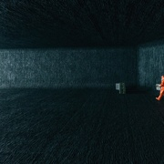
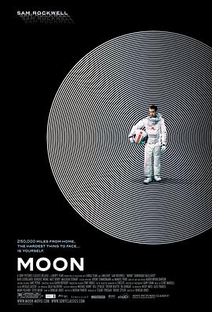
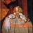
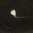

# 降临 (豆瓣)

**链接地址:** https://www.douban.com/doubanapp/dispatch?uri=/subject/21324900/interest/1074611733
**作者:** 
**获取时间:** 2025/8/28 22:35:38
**图片数量:** 57

---

## 原始HTML内容

  
    

    
    

    <link href="//img3.doubanio.com/dae/accounts/resources/ba98e9b/shire/bundle.css" rel="stylesheet" type="text/css">

  

    

  <a href="https://accounts.douban.com/passport/login?source=movie" class="nav-login" rel="nofollow">登录/注册</a>

    

  <a href="https://www.douban.com/doubanapp/app?channel=top-nav" class="lnk-doubanapp">下载豆瓣客户端</a>
  

    <a href="https://www.douban.com/doubanapp/app?channel=qipao" class="tip-link">豆瓣 6.0 全新发布</a>
    <a href="javascript: void 0;" class="tip-close">×</a>
  

  

    
豆瓣

    
扫码直接下载

    

      <a href="https://www.douban.com/doubanapp/redirect?channel=top-nav&amp;direct_dl=1&amp;download=iOS">iPhone</a>
      ·
      <a href="https://www.douban.com/doubanapp/redirect?channel=top-nav&amp;direct_dl=1&amp;download=Android" class="download-android">Android</a>
    

  

    

  <ul>
    <li class="">
      <a href="https://www.douban.com" target="_blank" data-moreurl-dict="{&quot;from&quot;:&quot;top-nav-click-main&quot;,&quot;uid&quot;:&quot;0&quot;}">豆瓣</a>
    </li>
    <li class="">
      <a href="https://book.douban.com" target="_blank" data-moreurl-dict="{&quot;from&quot;:&quot;top-nav-click-book&quot;,&quot;uid&quot;:&quot;0&quot;}">读书</a>
    </li>
    <li class="on">
      <a href="https://movie.douban.com" data-moreurl-dict="{&quot;from&quot;:&quot;top-nav-click-movie&quot;,&quot;uid&quot;:&quot;0&quot;}">电影</a>
    </li>
    <li class="">
      <a href="https://music.douban.com" target="_blank" data-moreurl-dict="{&quot;from&quot;:&quot;top-nav-click-music&quot;,&quot;uid&quot;:&quot;0&quot;}">音乐</a>
    </li>
    <li class="">
      <a href="https://www.douban.com/podcast/" target="_blank" data-moreurl-dict="{&quot;from&quot;:&quot;top-nav-click-podcast&quot;,&quot;uid&quot;:&quot;0&quot;}">播客</a>
    </li>
    <li class="">
      <a href="https://www.douban.com/location" target="_blank" data-moreurl-dict="{&quot;from&quot;:&quot;top-nav-click-location&quot;,&quot;uid&quot;:&quot;0&quot;}">同城</a>
    </li>
    <li class="">
      <a href="https://www.douban.com/group" target="_blank" data-moreurl-dict="{&quot;from&quot;:&quot;top-nav-click-group&quot;,&quot;uid&quot;:&quot;0&quot;}">小组</a>
    </li>
    <li class="">
      <a href="https://read.douban.com/?dcs=top-nav&amp;dcm=douban" target="_blank" data-moreurl-dict="{&quot;from&quot;:&quot;top-nav-click-read&quot;,&quot;uid&quot;:&quot;0&quot;}">阅读</a>
    </li>
    <li class="">
      <a href="https://fm.douban.com/?from_=shire_top_nav" target="_blank" data-moreurl-dict="{&quot;from&quot;:&quot;top-nav-click-fm&quot;,&quot;uid&quot;:&quot;0&quot;}">FM</a>
    </li>
    <li class="">
      <a href="https://time.douban.com/?dt_time_source=douban-web_top_nav" target="_blank" data-moreurl-dict="{&quot;from&quot;:&quot;top-nav-click-time&quot;,&quot;uid&quot;:&quot;0&quot;}">时间</a>
    </li>
    <li class="">
      <a href="https://market.douban.com/?utm_campaign=douban_top_nav&amp;utm_source=douban&amp;utm_medium=pc_web" target="_blank" data-moreurl-dict="{&quot;from&quot;:&quot;top-nav-click-market&quot;,&quot;uid&quot;:&quot;0&quot;}">豆品</a>
    </li>
  </ul>

  

    

    

    <link href="//img3.doubanio.com/dae/accounts/resources/ba98e9b/movie/bundle.css" rel="stylesheet" type="text/css">

  

  

    

      <a href="https://movie.douban.com">豆瓣电影</a>
    

    

      <form action="https://search.douban.com/movie/subject_search" method="get">
        <fieldset>
          <legend>搜索：</legend>
          <label for="inp-query">
          </label>
          
<input id="inp-query" name="search_text" size="22" maxlength="60" placeholder="搜索电影、电视剧、综艺、影人" value="">

          
<input type="submit" value="搜索">

          <input type="hidden" name="cat" value="1002">
        </fieldset>
      </form>
    

  

  

  

    

  <ul>
    <li><a href="https://movie.douban.com/cinema/nowplaying/">影讯&amp;购票</a>
    </li>
    <li><a href="https://movie.douban.com/explore">选电影</a>
    </li>
    <li><a href="https://movie.douban.com/tv/">选剧集</a>
    </li>
    <li><a href="https://movie.douban.com/chart">排行榜</a>
    </li>
    <li><a href="https://movie.douban.com/review/best/">影评</a>
    </li>
    <li><a href="https://movie.douban.com/annual/2024/?fullscreen=1&amp;dt_from=movie_navigation">2024年度榜单</a>
    </li>
    <li><a href="https://c9.douban.com/app/standbyme-2024/?autorotate=false&amp;fullscreen=true&amp;hidenav=true&amp;monitor_screenshot=true&amp;df_from=web_navigation" target="_blank">2024年度报告</a>
    </li>
  </ul>

    
  

    

    
    

        

        
    

        
        
            <!-- rank label begin -->
            <link rel="stylesheet" href="https://img1.doubanio.com/cuphead/movie-static/subject/rank_label.dda40.css">
            

                
                  No.30
                
              
                <a href="https://m.douban.com/subject_collection/ECDAO6XZI" target="_blank">美国科幻片榜</a>
              
            

            <!-- rank label end -->

    <h1>
        降临 Arrival
            (2016)
    </h1>

        

            

            
            

                
    

        

            

                
                

    

                

        导演: <a href="https://www.douban.com/personage/27234071/" rel="v:directedBy">丹尼斯·维伦纽瓦</a> 
        编剧: <a href="https://www.douban.com/personage/27544751/">埃里克·海瑟尔</a> / <a href="https://www.douban.com/personage/27547167/">姜峯楠</a> 
        主演: <a href="https://www.douban.com/personage/27228290/" rel="v:starring">艾米·亚当斯</a> / <a href="https://www.douban.com/personage/27219474/" rel="v:starring">杰瑞米·雷纳</a> / <a href="https://www.douban.com/personage/27259335/" rel="v:starring">福里斯特·惠特克</a> / <a href="https://www.douban.com/personage/27215100/" rel="v:starring">迈克尔·斯图巴</a> / <a href="https://www.douban.com/personage/27492319/" rel="v:starring">马泰</a> / <a href="https://www.douban.com/personage/27403703/" rel="v:starring">马克·奥布莱恩</a> / <a href="https://www.douban.com/personage/27283995/" rel="v:starring">乔·柯布登 </a> / <a href="https://www.douban.com/personage/27537850/" rel="v:starring">派特·凯利</a> / <a href="https://www.douban.com/personage/27554242/" rel="v:starring">娜塔莉·希波蒂</a> / <a href="https://www.douban.com/personage/27260549/" rel="v:starring">阮朴生</a> / <a href="https://www.douban.com/personage/27552897/" rel="v:starring">克里斯蒂安· 杰达</a> / <a href="https://www.douban.com/personage/27552896/" rel="v:starring">朱利安·凯西</a> 
        类型: 剧情 / 科幻 
        官方网站: <a href="http://www.arrivalmovie.com" rel="nofollow" target="_blank">www.arrivalmovie.com</a> 
        制片国家/地区: 美国 / 加拿大 
        语言: 英语 / 俄语 / 汉语普通话 
        上映日期: 2017-01-20(中国大陆) / 2016-09-01(威尼斯电影节) / 2016-11-11(美国) 
        片长: 116分钟 
        又名: 天煞异降(港) / 异星入境(台) / 你一生的故事 / 抵达 / 抵达者 / Story of Your Life 
        IMDb: tt2543164 

            

            
                

<link rel="stylesheet" href="https://img3.doubanio.com/cuphead/movie-static/download-output-image/index.7aaa3.css">

    

        

            

                豆瓣评分
            

          

            
            <a class="download-output-image" href="#">引用</a>
          

        

        

    <strong class="ll rating_num" property="v:average">7.8</strong>
    
    

        

        

                <a href="comments" class="rating_people">
                    509847人评价
                </a>
        

    

    
        

        
        
            5星
        
        

        23.5%
         
        

        

        
        
            4星
        
        

        47.7%
         
        

        

        
        
            3星
        
        

        25.0%
         
        

        

        
        
            2星
        
        

        3.1%
         
        

        

        
        
            1星
        
        

        0.7%
         
        

    

        

            好于 <a href="/typerank?type_name=剧情&amp;type=11&amp;interval_id=100:90&amp;action=">90% 剧情片</a> 
            好于 <a href="/typerank?type_name=科幻&amp;type=17&amp;interval_id=100:90&amp;action=">92% 科幻片</a> 
        

            
        

        
            

        
            <a href="https://www.douban.com/reason=collectwish&amp;ck=" rel="nofollow" class="j a_show_login colbutt ll" name="pbtn-21324900-wish">
                想看
            </a>
            <a href="https://www.douban.com/reason=collectcollect&amp;ck=" rel="nofollow" class="j a_show_login colbutt ll" name="pbtn-21324900-collect">
                看过
            </a>
        

            
    
    评价:
     

            
            
            
            
            
    
    <input id="n_rating" type="hidden" value="">
    

        

        

    <ul class="ul_subject_menu bicelink color_gray pt6 clearfix">
        
    
        
                
                  <li> 
    &nbsp;
        <a onclick="moreurl(this, {from:'mv_sbj_wr_cmnt_login'})" class="j a_show_login" href="https://www.douban.com/register?reason=review" rel="nofollow">写短评</a>
 </li>
                  <li> 
    
    &nbsp;
        <a onclick="moreurl(this, {from:'mv_sbj_wr_rv_login'})" class="j a_show_login" href="https://www.douban.com/register?reason=review" rel="nofollow">写影评</a>
 </li>
                    <li> 
   

   
    
    
    <a href="#" data-type="电影" data-url="https://movie.douban.com/subject/21324900/" data-desc="电影《降临 Arrival》 (来自豆瓣) " data-title="电影《降临 Arrival》 (来自豆瓣) " data-pic="https://img2.doubanio.com/view/photo/s_ratio_poster/public/p2411622421.jpeg" class="bn-sharing ">
        分享到
    </a> &nbsp;&nbsp;
    
    <link rel="stylesheet" href="https://img1.doubanio.com/f/vendors/e8a7261937da62636d22ca4c579efc4a4d759b1b/css/ui/dialog.css">
    
    
    

  </li>
            

    </ul>

    

        
            

<link rel="stylesheet" href="https://img3.doubanio.com/cuphead/movie-static/mod/share.ee737.css" type="text/css">

    

        
        <a href="/accounts/register?reason=recommend" class="j a_show_login lnk-sharing" share-id="21324900" data-mode="plain" data-name="降临 Arrival‎ (2016)" data-type="movie" data-desc="导演 丹尼斯·维伦纽瓦 主演 艾米·亚当斯 / 杰瑞米·雷纳 / 美国 / 加拿大 / 7.8分(509847评价)" data-href="https://movie.douban.com/subject/21324900/" data-image="https://img2.doubanio.com/view/photo/s_ratio_poster/public/p2411622421.jpg" data-properties="{}" data-redir="" data-text="" data-apikey="" data-curl="" data-count="10" data-object_kind="1002" data-object_id="21324900" data-target_type="rec" data-target_action="0" data-action_props="{&quot;subject_url&quot;:&quot;https:\/\/movie.douban.com\/subject\/21324900\/&quot;,&quot;subject_title&quot;:&quot;降临 Arrival‎ (2016)&quot;}">推荐</a>

        
    

        

    

    

    

    
    
        
            
            
    <h2>
        <i>降临的剧情简介</i>
              · · · · · ·
    </h2>

            

                    
                        
                                　　地球的上空突然出现了十二架贝壳状的不明飞行物，悬浮在十二个不同的国家的上空，外星人向人类发出了讯号，但人类却并不能够解读。美国军方找到了语言学家路易斯（艾米·亚当斯 Amy Adams 饰）和物理学家伊恩（杰瑞米·雷纳 Jeremy Renner 饰），希望两人能够合作破解外星人的语言之谜。
                                     
                                　　经过数次的接触，路易斯发现外星人使用了一种极为特殊的圆环状的文字，并逐渐了解了其中的奥妙。由于一直无法确定外星人来到地球的真正目的，中国、俄罗斯等四国决定对外星人发起进攻，美方亦决定放弃研究将全部人员撤离，在这个节骨眼上，路易斯终于明白了外星人的意图，利用外星人赋予她的特殊的“武器”，路易斯以一人之力改变了未来。
                        
                        <a href="https://movie.douban.com/help/movie#t0-qs">©豆瓣</a>
            

    

    

<link rel="stylesheet" href="https://img3.doubanio.com/cuphead/movie-static/celebrity/celebrities_section.610da.css">

  
    <h2>
        <i>降临的演职员</i>
              · · · · · ·
            
            (
                <a href="/subject/21324900/celebrities">全部 39</a>
            )
            
    </h2>

  <ul class="celebrities-list from-subject __oneline">
        
    
  
  <li class="celebrity">
    

  <a href="https://www.douban.com/personage/27234071/" title="丹尼斯·维伦纽瓦 Denis Villeneuve" class="has-account">
      

    

  </a>

    

      <a href="https://www.douban.com/personage/27234071/" title="丹尼斯·维伦纽瓦 Denis Villeneuve" class="name">丹尼斯·维伦纽瓦</a>

      导演

    

  </li>

        
    
  
  <li class="celebrity">
    

  <a href="https://www.douban.com/personage/27228290/" title="艾米·亚当斯 Amy Adams" class="">
      

    

  </a>

    

      <a href="https://www.douban.com/personage/27228290/" title="艾米·亚当斯 Amy Adams" class="name">艾米·亚当斯</a>

      饰 Louise Banks

    

  </li>

        
    
  
  <li class="celebrity">
    

  <a href="https://www.douban.com/personage/27219474/" title="杰瑞米·雷纳 Jeremy Renner" class="">
      

    

  </a>

    

      <a href="https://www.douban.com/personage/27219474/" title="杰瑞米·雷纳 Jeremy Renner" class="name">杰瑞米·雷纳</a>

      饰 Ian Donnelly

    

  </li>

        
    
  
  <li class="celebrity">
    

  <a href="https://www.douban.com/personage/27259335/" title="福里斯特·惠特克 Forest Whitaker" class="">
      

    

  </a>

    

      <a href="https://www.douban.com/personage/27259335/" title="福里斯特·惠特克 Forest Whitaker" class="name">福里斯特·惠特克</a>

      饰 Colonel Weber

    

  </li>

        
    
  
  <li class="celebrity">
    

  <a href="https://www.douban.com/personage/27215100/" title="迈克尔·斯图巴 Michael Stuhlbarg" class="">
      

    

  </a>

    

      <a href="https://www.douban.com/personage/27215100/" title="迈克尔·斯图巴 Michael Stuhlbarg" class="name">迈克尔·斯图巴</a>

      饰 Agent Halpern

    

  </li>

        
    
  
  <li class="celebrity">
    

  <a href="https://www.douban.com/personage/27492319/" title="马泰 Tzi Ma" class="">
      

    

  </a>

    

      <a href="https://www.douban.com/personage/27492319/" title="马泰 Tzi Ma" class="name">马泰</a>

      饰 General Shang

    

  </li>

  </ul>

    

<link rel="stylesheet" href="https://img1.doubanio.com/f/verify/a5bc0bc0aea4221d751bc4809fd4b0a1075ad25e/entry_creator/dist/author_subject/style.css">

    

    
        

<link rel="stylesheet" href="https://img1.doubanio.com/cuphead/movie-static/subject/photos_section.45abd.css">

    
    

        
    
    
    <h2>
        <i>降临的视频和图片</i>
              · · · · · ·
            
            (
                <a href="https://movie.douban.com/subject/21324900/trailer#trailer">预告片31</a>&nbsp;|&nbsp;<a href="https://movie.douban.com/subject/21324900/all_photos">图片908</a>&nbsp;·&nbsp;<a href="https://movie.douban.com/subject/21324900/mupload">添加</a>
            )
            
    </h2>

        <ul class="related-pic-bd  ">
                <li class="label-trailer">
                    <a class="related-pic-video" href="https://movie.douban.com/trailer/210754/#content" title="预告片" style="background-image:url(https://img9.doubanio.com/img/trailer/medium/2415229615.jpg)">
                        
预告片

                    </a>
                </li>
                <li>
                    
                </li>
                <li>
                    
                </li>
                <li>
                    
                </li>
                <li>
                    
                </li>
        </ul>
    

    

    

    

        
    <h2>
        <i>降临的获奖情况</i>
              · · · · · ·
            
            (
                <a href="https://movie.douban.com/subject/21324900/awards/">全部</a>
            )
            
    </h2>

    

        
        <ul class="award">
            <li>
                <a href="https://movie.douban.com/awards/Oscar/89/">第89届奥斯卡金像奖</a>
            </li>
            <li>最佳影片(提名)</li>
            <li><a href="https://www.douban.com/personage/27584267/" target="_blank">亚伦·莱德</a>&nbsp;/&nbsp;<a href="https://www.douban.com/personage/27211241/" target="_blank">大卫·林德</a>&nbsp;/&nbsp;<a href="https://www.douban.com/personage/27584266/" target="_blank">丹·列文</a>&nbsp;/&nbsp;<a href="https://www.douban.com/personage/27518214/" target="_blank">肖恩·利维</a></li>
        </ul>
        
        <ul class="award">
            <li>
                <a href="https://movie.douban.com/awards/venice/73/">第73届威尼斯电影节</a>
            </li>
            <li>主竞赛单元 金狮奖(提名)</li>
            <li><a href="https://www.douban.com/personage/27234071/" target="_blank">丹尼斯·维伦纽瓦</a></li>
        </ul>
        
        <ul class="award">
            <li>
                <a href="https://movie.douban.com/awards/golden-globes/74/">第74届金球奖</a>
            </li>
            <li>电影类 剧情片最佳女主角(提名)</li>
            <li><a href="https://www.douban.com/personage/27228290/" target="_blank">艾米·亚当斯</a></li>
        </ul>

    
        

<link rel="stylesheet" href="https://img3.doubanio.com/cuphead/movie-static/subject/recommendations.61283.css">

    

        
        
    <h2>
        <i>喜欢这部电影的人也喜欢</i>
              · · · · · ·
    </h2>

        
    
    

        <dl>
            <dt>
                
            </dt>
            <dd>
                <a href="https://movie.douban.com/subject/10512661/?from=subject-page">银翼杀手2049</a>
                8.3
            </dd>
        </dl>
        <dl>
            <dt>
                
            </dt>
            <dd>
                <a href="https://movie.douban.com/subject/2300586/?from=subject-page">这个男人来自地球</a>
                8.5
            </dd>
        </dl>
        <dl>
            <dt>
                
            </dt>
            <dd>
                <a href="https://movie.douban.com/subject/1292226/?from=subject-page">2001太空漫游</a>
                8.9
            </dd>
        </dl>
        <dl>
            <dt>
                
            </dt>
            <dd>
                <a href="https://movie.douban.com/subject/35575567/?from=subject-page">沙丘2</a>
                8.1
            </dd>
        </dl>
        <dl>
            <dt>
                
            </dt>
            <dd>
                <a href="https://movie.douban.com/subject/3006772/?from=subject-page">第九区</a>
                8.4
            </dd>
        </dl>
        <dl>
            <dt>
                
            </dt>
            <dd>
                <a href="https://movie.douban.com/subject/25864085/?from=subject-page">火星救援</a>
                8.5
            </dd>
        </dl>
        <dl>
            <dt>
                
            </dt>
            <dd>
                <a href="https://movie.douban.com/subject/1291843/?from=subject-page">黑客帝国</a>
                9.1
            </dd>
        </dl>
        <dl>
            <dt>
                
            </dt>
            <dd>
                <a href="https://movie.douban.com/subject/1889243/?from=subject-page">星际穿越</a>
                9.4
            </dd>
        </dl>
        <dl>
            <dt>
                
            </dt>
            <dd>
                <a href="https://movie.douban.com/subject/4746257/?from=subject-page">明日边缘</a>
                8.2
            </dd>
        </dl>
        <dl>
            <dt>
                
            </dt>
            <dd>
                <a href="https://movie.douban.com/subject/3073124/?from=subject-page">月球</a>
                8.5
            </dd>
        </dl>
    

    

    

    
        

    
    <link rel="stylesheet" href="https://img1.doubanio.com/f/vendors/d63a579a99fd372b4398731a279a1382e6eac71e/subject-comments/comments-section.css">

    

        

            
            
        <a class="comment_btn j a_show_login" href="https://www.douban.com/register?reason=review" rel="nofollow">
            我要写短评
        </a>

            
    <h2>
        <i>降临的短评</i>
              · · · · · ·
            
            (
                <a href="https://movie.douban.com/subject/21324900/comments?status=P">全部 153166 条</a>
            )
            
    </h2>

        

        

        

                
        

                        <a id="hot-comments-tab" href="comments" data-id="hot" class="on">热门</a>&nbsp;/&nbsp;
                        <a id="new-comments-tab" href="comments?sort=time" data-id="new" class="j a_show_login">最新</a>&nbsp;/&nbsp;
                        <a id="following-comments-tab" href="comments?sort=follows" data-id="following" class="j a_show_login">好友</a>
        

    

        

            
    

        
        

            
    
    

        <h3>
            
                    9469

                    <input value="1108898517" type="hidden">
                    <a href="javascript:;" data-id="1108898517" class="j a_show_login" onclick="">有用</a>

                <!-- 删除短评 -->
            
            
                <a href="https://www.douban.com/people/pigbigleg/">猪大腿</a>
                    看过
                    
                
                    2016-11-14 08:51:52
                
                
            
        </h3>
        

            
                “大豆价格将第三个月继续下跌。”
        

        

    

    

        

        
        

            
    
    

        <h3>
            
                    5622

                    <input value="1142040781" type="hidden">
                    <a href="javascript:;" data-id="1142040781" class="j a_show_login" onclick="">有用</a>

                <!-- 删除短评 -->
            
            
                <a href="https://www.douban.com/people/amoyi04/">筷喜旺</a>
                    看过
                    
                
                    2017-01-25 22:56:04
                
                
            
        </h3>
        

            
                Hannah，你知道吗，上海自来水来自海上。
        

        

    

    

        

        
        

            
    
    

        <h3>
            
                    12925

                    <input value="1136280985" type="hidden">
                    <a href="javascript:;" data-id="1136280985" class="j a_show_login" onclick="">有用</a>

                <!-- 删除短评 -->
            
            
                <a href="https://www.douban.com/people/2529003/">志大无胸</a>
                    看过
                    
                
                    2017-01-23 12:45:43
                
                
            
        </h3>
        

            
                商将军竟然能听懂女主说的中文，商将军才是了不起的语言奇才！
        

        

    

    

        

        
        

            
    
    

        <h3>
            
                    7089

                    <input value="1109707166" type="hidden">
                    <a href="javascript:;" data-id="1109707166" class="j a_show_login" onclick="">有用</a>

                <!-- 删除短评 -->
            
            
                <a href="https://www.douban.com/people/halfling/">Zipporah</a>
                    看过
                    
                
                    2016-11-16 11:53:53
                
                
            
        </h3>
        

            
                比小说更神棍，文艺版克苏鲁。外星人：我们来打... 中国人：打麻将啦！美国人：打仗啦！Louise：打字？外星人：打...打个招呼。美国人这次从中国人和毛子手里救下地球，表示维护世界和平还要靠我。
        

        

    

    

        

        
        

            
    
    

        <h3>
            
                    6183

                    <input value="1139594038" type="hidden">
                    <a href="javascript:;" data-id="1139594038" class="j a_show_login" onclick="">有用</a>

                <!-- 删除短评 -->
            
            
                <a href="https://www.douban.com/people/1233038/">frozenmoon</a>
                    看过
                    
                
                    2017-01-20 13:47:08
                
                
            
        </h3>
        

            
                特德-姜的这部小说并不适合被视觉化，但目前的处理确实深得原作的意境。外星人的语言犹如东方水墨的闲笔，如雾如烟，瞬间呈现一切意义旋即消散。它讲述了沟通与隔绝，我们都被困在某一种自以为是的文明和偏见之中，它呼吁沟通和交流，它拆解了时间。与其说它是科幻，不如说它更像哲学。
        

        

    

    

        

                
                    &gt; <a href="comments?sort=new_score&amp;status=P">
                        更多短评
                            153166条
                    </a>
        

        

            

            

            

                <a class="qa" href="/help/opinion#t2-q0" target="_blank">为什么被折叠？</a>
                <a class="btn-unfold" href="#">有一些短评被折叠了</a>
                

                    评论被折叠，是因为发布这条评论的账号行为异常。评论仍可以被展开阅读，对发布人的账号不造成其他影响。如果认为有问题，可以<a href="https://help.douban.com/help/ask?category=movie">联系</a>豆瓣电影。
                

            

            

            

            
        

        

            
    

        

            你关注的人还没写过短评
        

        

    

    

            
            
        

    

<!--        此处是挂载其他页面，不是注释！不是注释！不是注释！-->
        

<link rel="stylesheet" href="https://img1.doubanio.com/misc/mixed_static/292deb5ae8f760a3.css">

    <section id="reviews-wrapper" class="reviews mod movie-content">
        <header>
            
                <a href="new_review" rel="nofollow" class="create-review comment_btn " data-isverify="False" data-verify-url="https://www.douban.com/accounts/phone/verify?redir=https://movie.douban.com/subject/21324900/new_review">
                    我要写影评
                </a>
            <h2>
                    降临的影评 · · · · · ·

                    ( <a href="reviews">全部 3338 条</a> )
            </h2>
        </header>

            
            

                                <a href="javascript:;;" class="cur" data-sort="">热门</a>
            

            

            

        
    

            
    
    

        

            
    
    <header class="main-hd">
        

        <a href="https://www.douban.com/people/Hazel.eyes/" class="name">Mamula</a>
            

        2016-11-17 08:19:21

    </header>

            

                <h2><a href="https://movie.douban.com/review/8178580/">关于语言，意识和记忆的呓语</a></h2>

                

                    

                            
这篇影评可能有剧透

                        从没有一部电影如此准确地同时戳到了如此多我关心的主题。而这些主题本身就囊括了好多最初让我喜欢上语言学的原因。 这部电影讲的故事再简单不过——女主角学会了外星人不受时间维度控制的语言，于是用这门语言交流思考的时候自我意识就可以超越时间维度，从而能够感知从过去到...

                        &nbsp;(<a href="javascript:;" id="toggle-8178580-copy" class="unfold" title="展开">展开</a>)
                    

                

                

                    

                

                

                    <a href="javascript:;" class="action-btn up" data-rid="8178580" title="有用">
                        
                        
                                7276
                        
                    </a>
                    <a href="javascript:;" class="action-btn down" data-rid="8178580" title="没用">
                        
                        
                                401
                        
                    </a>
                    <a href="https://movie.douban.com/review/8178580/#comments" class="reply ">485回应</a>

                    <a href="javascript:;;" class="fold hidden">收起</a>
                

            

        

    

            
    
    

        

            
    
    <header class="main-hd">
        

        <a href="https://www.douban.com/people/movieater/" class="name">女神的秋裤</a>
            

        2017-01-21 01:29:11

    </header>

            

                <h2><a href="https://movie.douban.com/review/8303434/">打开时间，生于虚无——你并没有读懂《降临》的悲伤</a></h2>

                

                    

                        上一部让我看得起鸡皮疙瘩的电影还是《星际穿越》，然而那已经是两年前的事了。看了很多影评，语言学、费马原理让秋裤目不暇接，但几乎没有影评在真正讨论影片内核。作为一个语言专业学生和时空穿越的死粉，秋裤研究了两个深夜，初稿中也充斥着封闭类时曲线、诺维科夫自洽原则...

                        &nbsp;(<a href="javascript:;" id="toggle-8303434-copy" class="unfold" title="展开">展开</a>)
                    

                

                

                    

                

                

                    <a href="javascript:;" class="action-btn up" data-rid="8303434" title="有用">
                        
                        
                                8225
                        
                    </a>
                    <a href="javascript:;" class="action-btn down" data-rid="8303434" title="没用">
                        
                        
                                270
                        
                    </a>
                    <a href="https://movie.douban.com/review/8303434/#comments" class="reply ">591回应</a>

                    <a href="javascript:;;" class="fold hidden">收起</a>
                

            

        

    

            
    
    

        

            
    
    <header class="main-hd">
        

        <a href="https://www.douban.com/people/apple_jody/" class="name">李九弟Jody</a>
            

        2017-01-21 09:08:57

    </header>

            

                <h2><a href="https://movie.douban.com/review/8303599/">电影与原著的区别在哪里？为什么电影会进行这样的改编？（附女儿的一生故事）</a></h2>

                

                    

                        俄国诗人莱蒙托夫在《一只孤独的船》中写道：“一只船孤独的航行在海上，它既不寻求幸福，也不逃避幸福，它只是向前航行，底下是沉静碧蓝的大海，而头顶是金色的太阳。” （感谢豆友『谁也不是』的回复：莱蒙托夫的诗原名为《帆》，后经柴静和网友们的再加工变为上面这个版本。...

                        &nbsp;(<a href="javascript:;" id="toggle-8303599-copy" class="unfold" title="展开">展开</a>)
                    

                

                

                    

                

                

                    <a href="javascript:;" class="action-btn up" data-rid="8303599" title="有用">
                        
                        
                                2952
                        
                    </a>
                    <a href="javascript:;" class="action-btn down" data-rid="8303599" title="没用">
                        
                        
                                53
                        
                    </a>
                    <a href="https://movie.douban.com/review/8303599/#comments" class="reply ">181回应</a>

                    <a href="javascript:;;" class="fold hidden">收起</a>
                

            

        

    

            
    
    

        

            
    
    <header class="main-hd">
        

        <a href="https://www.douban.com/people/grinch/" class="name">大奇特(Grinch)</a>
            

        2016-09-01 19:55:44

    </header>

            

                <h2><a href="https://movie.douban.com/review/8068844/">因即是果，果即是因的语言体系</a></h2>

                

                    

                        《降临》改编自美国当代华裔科幻作家特德·姜的短篇《你一生的故事》，是以语言学取胜的科幻小说，曾荣获1998年星云奖。科幻的首要前提就是要先使整个设定令人信服，电影同原著一样，着重构建了第三类接触的对话体系，这套体系在小说中着笔墨太多。在电影中，它几乎也占满篇幅...

                        &nbsp;(<a href="javascript:;" id="toggle-8068844-copy" class="unfold" title="展开">展开</a>)
                    

                

                

                    

                

                

                    <a href="javascript:;" class="action-btn up" data-rid="8068844" title="有用">
                        
                        
                                1725
                        
                    </a>
                    <a href="javascript:;" class="action-btn down" data-rid="8068844" title="没用">
                        
                        
                                204
                        
                    </a>
                    <a href="https://movie.douban.com/review/8068844/#comments" class="reply ">147回应</a>

                    <a href="javascript:;;" class="fold hidden">收起</a>
                

            

        

    

            
    
    

        

            
    
    <header class="main-hd">
        

        <a href="https://www.douban.com/people/vitaminJ/" class="name">隔壁家的桃太太</a>
            

        2017-01-20 19:39:54

    </header>

            

                <h2><a href="https://movie.douban.com/review/8302739/">一生是寂寥的书</a></h2>

                

                    

                            
这篇影评可能有剧透

                        0、几处翻译捉虫 ○女儿求助被女主置之不理时，女主说：“如果你想要专业，打给你爸。”此处【专业】应为【科学用语】。 ○女主对女儿讲解姓名的时候，女主说：“这个名字是妈妈用心帮你取的。”此处纯错译，应为【它是对称的，正着读和倒着读一样。】 1、名字 艾米·亚当斯又...

                        &nbsp;(<a href="javascript:;" id="toggle-8302739-copy" class="unfold" title="展开">展开</a>)
                    

                

                

                    

                

                

                    <a href="javascript:;" class="action-btn up" data-rid="8302739" title="有用">
                        
                        
                                637
                        
                    </a>
                    <a href="javascript:;" class="action-btn down" data-rid="8302739" title="没用">
                        
                        
                                21
                        
                    </a>
                    <a href="https://movie.douban.com/review/8302739/#comments" class="reply ">66回应</a>

                    <a href="javascript:;;" class="fold hidden">收起</a>
                

            

        

    

            
    
    

        

            
    
    <header class="main-hd">
        

        <a href="https://www.douban.com/people/amilelee/" class="name">田废久必生</a>
            

        2017-01-20 21:34:23

    </header>

            

                <h2><a href="https://movie.douban.com/review/8302909/">《你一生的故事》正确改编之我见</a></h2>

                

                    

                            
这篇影评可能有剧透

                        1. 片名叫个“ARRIVAL”是怎么想的？与主题有啥关系？放在这有啥独特性（外星人来地球的片子是不是都可以叫《降临》）？本来用《The Story of Your Life》就挺好的，或者你想一个酷一点的名字啊，比如“Once upon a Time in the Future”啥的。 2. 不应该是硬科幻，应该是软科...

                        &nbsp;(<a href="javascript:;" id="toggle-8302909-copy" class="unfold" title="展开">展开</a>)
                    

                

                

                    

                

                

                    <a href="javascript:;" class="action-btn up" data-rid="8302909" title="有用">
                        
                        
                                521
                        
                    </a>
                    <a href="javascript:;" class="action-btn down" data-rid="8302909" title="没用">
                        
                        
                                104
                        
                    </a>
                    <a href="https://movie.douban.com/review/8302909/#comments" class="reply ">135回应</a>

                    <a href="javascript:;;" class="fold hidden">收起</a>
                

            

        

    

            
    
    

        

            
    
    <header class="main-hd">
        

        <a href="https://www.douban.com/people/Len./" class="name">Kaito</a>
            

        2017-01-20 21:41:01

    </header>

            

                <h2><a href="https://movie.douban.com/review/8302927/">七肢桶与恩纳·穆穆伊与爱手艺</a></h2>

                

                    

                        A. 乌洛波洛斯（Ouroboros） 在这部特德·姜原作（《你一生的故事》）改编的电影中，外星人（七肢桶）的文字被设计成了乌洛波洛斯式的符号。 从表面看，它的视觉化呈现确实非常外星人，但追根溯源，实际上却是非常人类思维的设计。 因为这样的外星人设定（时间对他们来说是非线...

                        &nbsp;(<a href="javascript:;" id="toggle-8302927-copy" class="unfold" title="展开">展开</a>)
                    

                

                

                    

                

                

                    <a href="javascript:;" class="action-btn up" data-rid="8302927" title="有用">
                        
                        
                                231
                        
                    </a>
                    <a href="javascript:;" class="action-btn down" data-rid="8302927" title="没用">
                        
                        
                                20
                        
                    </a>
                    <a href="https://movie.douban.com/review/8302927/#comments" class="reply ">14回应</a>

                    <a href="javascript:;;" class="fold hidden">收起</a>
                

            

        

    

            
    
    

        

            
    
    <header class="main-hd">
        

        <a href="https://www.douban.com/people/pinkonion/" class="name">水木丁</a>
            

        2017-01-22 10:20:30

    </header>

            

                <h2><a href="https://movie.douban.com/review/8305460/">文科生拯救地球！真是太爽了！</a></h2>

                

                    

                        昨天晚上去看了《降临》，在看电影之前，邦妮曾经给我力荐特德姜的原著小说，书还在我的购物单里，电影先上了我就先去看电影了，结果没想到把我看HIGH了，回家就立马去做了两件事，到亚马逊下单，到豆瓣给打五星。然后发了条微博：怎么说呢，文科生，特别是学外语的一定要去看...

                        &nbsp;(<a href="javascript:;" id="toggle-8305460-copy" class="unfold" title="展开">展开</a>)
                    

                

                

                    

                

                

                    <a href="javascript:;" class="action-btn up" data-rid="8305460" title="有用">
                        
                        
                                320
                        
                    </a>
                    <a href="javascript:;" class="action-btn down" data-rid="8305460" title="没用">
                        
                        
                                51
                        
                    </a>
                    <a href="https://movie.douban.com/review/8305460/#comments" class="reply ">62回应</a>

                    <a href="javascript:;;" class="fold hidden">收起</a>
                

            

        

    

            
    
    

        

            
    
    <header class="main-hd">
        

        <a href="https://www.douban.com/people/Januaryyi/" class="name">仲曰</a>
            

        2017-01-22 13:56:31

    </header>

            

                <h2><a href="https://movie.douban.com/review/8305827/">《降临》编剧自述：如何把不可能改编的小说改成神作</a></h2>

                

                    

                        从小我母亲就喜欢读书给我听，像所有母亲一样，不过她读的不是苏斯博士或贝兹·拜阿尔斯之类童书，而是海因莱因、布拉德伯里、阿西莫夫的科幻故事，那是些讲述新奇世界的故事，充满了新奇的想法和未来的无穷可能。这是我儿时的重要营养。不过在我成长的俄克拉荷马州，我也很早...

                        &nbsp;(<a href="javascript:;" id="toggle-8305827-copy" class="unfold" title="展开">展开</a>)
                    

                

                

                    

                

                

                    <a href="javascript:;" class="action-btn up" data-rid="8305827" title="有用">
                        
                        
                                223
                        
                    </a>
                    <a href="javascript:;" class="action-btn down" data-rid="8305827" title="没用">
                        
                        
                                9
                        
                    </a>
                    <a href="https://movie.douban.com/review/8305827/#comments" class="reply ">10回应</a>

                    <a href="javascript:;;" class="fold hidden">收起</a>
                

            

        

    

    

    <!-- COLLECTED JS -->
    <!-- COLLECTED CSS -->

    

    <link rel="stylesheet" href="https://img1.doubanio.com/f/zerkalo/88118a282439e312283e886ea4c3d3e9849a8fa4/css/review/editor/ng/setting_standalone.css">
    
    
    
    
    
    
    

                

                    &gt;
                        <a href="reviews">
                            更多影评
                                3338篇
                        </a>
                

    </section>
<!-- COLLECTED JS -->

     

    
            

                    
                    

                            <a class="comment_btn j a_show_login" href="https://www.douban.com/register?reason=review" rel="nofollow">添加新讨论</a>
                        
    <h2>
        讨论区
         &nbsp; ·&nbsp; ·&nbsp; ·&nbsp; ·&nbsp; ·&nbsp; ·
    </h2>

                    

                    
  <table class="olt"><tbody><tr><td></td><td></td><td></td><td></td></tr>
        
        <tr>
          <td class="pl"><a href="https://movie.douban.com/subject/21324900/discussion/614887298/" title="史上最难看垃圾电影，看尽小丑们的狂欢">史上最难看垃圾电影，看尽小丑们的狂欢</a></td>
          <td class="pl">来自<a href="https://www.douban.com/people/SHANGHAIJAJA/">エリック</a></td>
          <td class="pl">172 回应</td>
          <td class="pl">2025-08-28 15:23:43</td>
        </tr>
        
        <tr>
          <td class="pl"><a href="https://movie.douban.com/subject/21324900/discussion/637844467/" title="三体就已经够烂了，这电影比三体还烂">三体就已经够烂了，这电影比三体还烂</a></td>
          <td class="pl">来自<a href="https://www.douban.com/people/archdevil/">archdevil</a></td>
          <td class="pl">1 回应</td>
          <td class="pl">2025-08-24 10:51:43</td>
        </tr>
        
        <tr>
          <td class="pl"><a href="https://movie.douban.com/subject/21324900/discussion/637855019/" title="无标题">无标题</a></td>
          <td class="pl">来自<a href="https://www.douban.com/people/290524051/">喜欢米开朗基罗</a></td>
          <td class="pl"></td>
          <td class="pl">2025-08-24 10:49:48</td>
        </tr>
        
        <tr>
          <td class="pl"><a href="https://movie.douban.com/subject/21324900/discussion/637849174/" title="我商大将军才是男主">我商大将军才是男主</a></td>
          <td class="pl">来自<a href="https://www.douban.com/people/readytodie/">厚礼吉泽士</a></td>
          <td class="pl"></td>
          <td class="pl">2025-08-12 09:53:56</td>
        </tr>
        
        <tr>
          <td class="pl"><a href="https://movie.douban.com/subject/21324900/discussion/637543180/" title="男科学家是以什么样的心情离开妻女？">男科学家是以什么样的心情离开妻女？</a></td>
          <td class="pl">来自<a href="https://www.douban.com/people/121091913/">狂草真田Sanada</a></td>
          <td class="pl">2 回应</td>
          <td class="pl">2025-08-06 12:06:30</td>
        </tr>
  </tbody></table>

                    

                        <a href="/subject/21324900/discussion/" rel="nofollow">
                            &gt; 去这部影片的讨论区（全部614条）
                        </a>
                    

            

        
    
        
                
                    

    

        <h2>
                关于《降临》的问题
                · · · · · ·
            
                (<a href="https://movie.douban.com/subject/21324900/questions/?from=subject">
                    全部190个
                </a>)
            
        </h2>

        <!-- 
    
    <a class='j a_show_login comment_btn'
        href='https://movie.douban.com/subject/21324900/questions/ask/?from=subject'>我来提问</a>
 -->
    

    

        <ul>
            <li>
                
                    <a href="https://movie.douban.com/subject/21324900/questions/735965/?from=subject">
                        知道为什么神秘物种一直浸泡在雾中吗？
                    </a>
                
                
                    10人回答
                
            </li>
            <li>
                
                    <a href="https://movie.douban.com/subject/21324900/questions/732007/?from=subject">
                        在影片开头女主和女儿相处的片段里，为何从来没有出现她老公？
                    </a>
                
                
                    24人回答
                
            </li>
        </ul>

        
&gt;
            <a href="https://movie.douban.com/subject/21324900/questions/?from=subject">
                全部190个问题
            </a>
        

    

            

    

            

            

                

    

        

    
    

    
    <h2>
        在哪儿看这部电影
            &nbsp;·&nbsp;·&nbsp;·&nbsp;·&nbsp;·&nbsp;·
    </h2>

    
    <ul class="bs">
                
                <li>
                        <a class="playBtn" data-cn="腾讯视频" data-impression-track="https://frodo.douban.com/rohirrim/video_tracking/impression?subject_id=21324900&amp;video_type=movie&amp;video_id=317118&amp;source=qq&amp;user_id=&amp;bid=kydEMhWl4uY&amp;platform=pc&amp;location=vendor_subject" data-click-track="https://frodo.douban.com/rohirrim/video_tracking/click?subject_id=21324900&amp;video_type=movie&amp;video_id=317118&amp;source=qq&amp;user_id=&amp;bid=kydEMhWl4uY&amp;platform=pc&amp;location=vendor_subject" data-pic="https://img3.doubanio.com/cuphead/movie-static/pics/video-qq.png" href="https://www.douban.com/link2/?url=https%3A%2F%2Fv.qq.com%2Fx%2Fcover%2Fkbmpjffrp3gnc9f.html%3Fptag%3Dnewdouban.movie&amp;subtype=1&amp;type=online-video" target="_blank">
                        腾讯视频
                        </a>
                    
                    
                        VIP免费观看
                    
                </li>
                
                <li>
                        <a class="playBtn" data-cn="哔哩哔哩" data-impression-track="https://frodo.douban.com/rohirrim/video_tracking/impression?subject_id=21324900&amp;video_type=movie&amp;video_id=690417&amp;source=bilibili&amp;user_id=&amp;bid=kydEMhWl4uY&amp;platform=pc&amp;location=vendor_subject" data-click-track="https://frodo.douban.com/rohirrim/video_tracking/click?subject_id=21324900&amp;video_type=movie&amp;video_id=690417&amp;source=bilibili&amp;user_id=&amp;bid=kydEMhWl4uY&amp;platform=pc&amp;location=vendor_subject" data-pic="https://img9.doubanio.com/cuphead/movie-static/pics/video-bilibili.png" href="https://www.douban.com/link2/?url=https%3A%2F%2Fm.bilibili.com%2Fbangumi%2Fplay%2Fss29591%3Fbsource%3Ddoubanh5&amp;subtype=8&amp;type=online-video" target="_blank">
                        哔哩哔哩
                        </a>
                    
                    
                        VIP免费观看
                    
                </li>
                
                <li>
                        <a class="playBtn" data-cn="优酷视频" data-impression-track="https://frodo.douban.com/rohirrim/video_tracking/impression?subject_id=21324900&amp;video_type=movie&amp;video_id=735193&amp;source=youku&amp;user_id=&amp;bid=kydEMhWl4uY&amp;platform=pc&amp;location=vendor_subject" data-click-track="https://frodo.douban.com/rohirrim/video_tracking/click?subject_id=21324900&amp;video_type=movie&amp;video_id=735193&amp;source=youku&amp;user_id=&amp;bid=kydEMhWl4uY&amp;platform=pc&amp;location=vendor_subject" data-pic="https://img1.doubanio.com/cuphead/movie-static/pics/video-youku-new.png" href="https://www.douban.com/link2/?url=https%3A%2F%2Fm.youku.com%2Falipay_video%2Fid_6a58f9fb69ba11e6b16e.html%3Frefer%3Desfhz_operation.xuka.xj_00003036_000000_FNZfau_19010900&amp;subtype=3&amp;type=online-video&amp;link2key=2d4bb316ed" target="_blank">
                        优酷视频
                        </a>
                    
                    
                        VIP免费观看
                    
                </li>
                
                <li>
                        <a class="playBtn" data-cn="爱奇艺" data-impression-track="https://frodo.douban.com/rohirrim/video_tracking/impression?subject_id=21324900&amp;video_type=movie&amp;video_id=784406&amp;source=iqiyi&amp;user_id=&amp;bid=kydEMhWl4uY&amp;platform=pc&amp;location=vendor_subject" data-click-track="https://frodo.douban.com/rohirrim/video_tracking/click?subject_id=21324900&amp;video_type=movie&amp;video_id=784406&amp;source=iqiyi&amp;user_id=&amp;bid=kydEMhWl4uY&amp;platform=pc&amp;location=vendor_subject" data-pic="https://img1.doubanio.com/cuphead/movie-static/pics/video-iqiyi-new.png" href="https://www.douban.com/link2/?url=http%3A%2F%2Fwww.iqiyi.com%2Fv_19rr7pfcsc.html%3Fvfm%3Dm_331_dbdy%26fv%3D4904d94982104144a1548dd9040df241&amp;subtype=9&amp;type=online-video&amp;link2key=2d4bb316ed" target="_blank">
                        爱奇艺
                        </a>
                    
                    
                        VIP免费观看
                    
                </li>

    </ul>

    <!-- douban ad begin -->
    

    <!-- douban ad end -->

    

    

        
    <h2>
        本片原声正在播放
            &nbsp;·&nbsp;·&nbsp;·&nbsp;·&nbsp;·&nbsp;·
    </h2>

        <a target="_blank" href="https://music.douban.com/subject/26884047/">去豆瓣音乐收听</a>

    

    

    

    

    
        

    
    
    <h2>
        <i>以下片单推荐</i>
              · · · · · ·
            
            (
                <a href="https://movie.douban.com/subject/21324900/doulists">全部</a>
            )
            
    </h2>

    
    <ul>
            
                <li>
                    <a href="https://www.douban.com/doulist/64973/" target="_blank">曾经关于时空的豆列</a>
                    (L.L)
                </li>
            
                <li>
                    <a href="https://www.douban.com/doulist/240612/" target="_blank">IMDb科幻电影Top200</a>
                    (等一个人)
                </li>
            
                <li>
                    <a href="https://www.douban.com/doulist/30299/" target="_blank">豆瓣电影【口碑榜】2023-09-11 更新</a>
                    (影志)
                </li>
            
                <li>
                    <a href="https://www.douban.com/doulist/16002/" target="_blank">带你进入不正常的世界</a>
                    (DK小眼镜儿)
                </li>
            
                <li>
                    <a href="https://www.douban.com/doulist/11568/" target="_blank">【科幻】太空、外星人、时空、超能量</a>
                    (卡特兰)
                </li>
    </ul>

    
        

    
    
    <h2>
        <i>谁在看这部电影</i>
              · · · · · ·
    </h2>

    
    <ul>
            
            <li>
                
                

                    <a href="https://www.douban.com/people/Logostarcloudy/">Lumen</a>
                    

                        11分钟前
                        看过
                        

                    

                

            </li>
            
            <li>
                
                

                    <a href="https://www.douban.com/people/224993982/">FAVOR</a>
                    

                        49分钟前
                        想看
                        

                    

                

            </li>
            
            <li>
                
                

                    <a href="https://www.douban.com/people/222100655/">回忆录</a>
                    

                        1小时前
                        看过
                        
    

                    

                

            </li>
    </ul>

    
    

        
            <a href="https://movie.douban.com/subject/21324900/comments?status=P">736698人看过</a>
                &nbsp;/&nbsp;
            <a href="https://movie.douban.com/subject/21324900/comments?status=F">160569人想看</a>
    

    

<!-- douban ad begin -->

<!-- douban ad end -->

     

    

订阅降临的评论:  
    <a href="https://movie.douban.com/feed/subject/21324900/reviews"> feed: rss 2.0</a>

            

            

                
    
<!-- douban ad begin -->

<!-- douban ad end -->

    <!-- douban ad begin -->
    

    <!-- douban ad end -->

            

        

    

        
    

            

        

    © 2005－2025 douban.com, all rights reserved 北京豆网科技有限公司

    <a href="https://www.douban.com/about">关于豆瓣</a>
    · <a href="https://www.douban.com/jobs">在豆瓣工作</a>
    · <a href="https://www.douban.com/about?topic=contactus">联系我们</a>
    · <a href="https://www.douban.com/about/legal">法律声明</a>
    
    · <a href="https://help.douban.com/?app=movie" target="_blank">帮助中心</a>
    · <a href="https://www.douban.com/doubanapp/">移动应用</a>

    

    

    <!-- COLLECTED JS -->
        
        
    <link rel="stylesheet" type="text/css" href="https://img1.doubanio.com/f/vendors/e8a7261937da62636d22ca4c579efc4a4d759b1b/css/ui/dialog.css">
    <link rel="stylesheet" type="text/css" href="https://img1.doubanio.com/cuphead/movie-static/mod/login_pop.b2f60.css">
    
    
    

    
    
    
    
    
    
    
    
    
    

    
    
    

    

    
  

      

    <!-- dae-web-movie--default-5f9cb85759-4xbw4-->

  

---

## 纯文本内容

var _body_start = new Date();

    
    

    

  
    

  登录/注册

    
  下载豆瓣客户端
  
    豆瓣 6.0 全新发布
    ×
  
  
    豆瓣
    扫码直接下载
    
      iPhone
      ·
      Android
    
  

    

  
    
      豆瓣
    
    
      读书
    
    
      电影
    
    
      音乐
    
    
      播客
    
    
      同城
    
    
      小组
    
    
      阅读
    
    
      FM
    
    
      时间
    
    
      豆品
    
  

  

  ;window._GLOBAL_NAV = {
    DOUBAN_URL: "https://www.douban.com",
    N_NEW_NOTIS: 0,
    N_NEW_DOUMAIL: 0
  };

    

    

    

  
  
    
      豆瓣电影
    
    
      
        
          搜索：
          
          
          
          
          
        
      
    
  
  
  
    

  
    影讯&购票
    
    选电影
    
    选剧集
    
    排行榜
    
    影评
    
    2024年度榜单
    
    2024年度报告
    
  

    
  

  <li data-link="{{= url}}">
            <a href="{{= url}}" onclick="moreurl(this, {from:'movie_search_sugg', query:'{{= keyword }}', subject_id:'{{= id}}', i: '{{= index}}', type: '{{= type}}'})">
            
            

                <em>{{= title}}</em>
                {{if year}}
                    {{= year}}
                {{/if}}
                {{if sub_title}}
                     {{= sub_title}}
                {{/if}}
                {{if address}}
                     {{= address}}
                {{/if}}
                {{if episode}}
                    {{if episode=="unknow"}}
                         集数未知
                    {{else}}
                         共{{= episode}}集
                    {{/if}}
                {{/if}}
            

        </a>
        </li>
  

    

    
    
        

        
    
        
        
            
            
            
                
                  No.30
                
              
                美国科幻片榜
              
            
            

    
        降临 Arrival
            (2016)
    

        
            

            
            
                
    
        
            
                
                

    
        
   

                

        导演: 丹尼斯·维伦纽瓦
        编剧: 埃里克·海瑟尔 / 姜峯楠
        主演: 艾米·亚当斯 / 杰瑞米·雷纳 / 福里斯特·惠特克 / 迈克尔·斯图巴 / 马泰 / 马克·奥布莱恩 / 乔·柯布登  / 派特·凯利 / 娜塔莉·希波蒂 / 阮朴生 / 克里斯蒂安· 杰达 / 朱利安·凯西
        类型: 剧情 / 科幻
        官方网站: www.arrivalmovie.com
        制片国家/地区: 美国 / 加拿大
        语言: 英语 / 俄语 / 汉语普通话
        上映日期: 2017-01-20(中国大陆) / 2016-09-01(威尼斯电影节) / 2016-11-11(美国)
        片长: 116分钟
        又名: 天煞异降(港) / 异星入境(台) / 你一生的故事 / 抵达 / 抵达者 / Story of Your Life
        IMDb: tt2543164

$(function(){
    var limit = 5
    $('#info .attrs').each(function() {
        var $list = $(this).find('a')
        var $attrs = $(this)

        if($list.length > limit) {
            $attrs.empty()
            $list.each(function(idx) {
                if (idx+1 === $list.length) {
                    $('').prepend($(this)).appendTo($attrs);
                } else {
                    $(' / ').prepend($(this)).appendTo($attrs);
                }
            })

            $attrs.append('<a href="javascript:;" class="more-attrs" title="显示更多">更多...</a>')
            $('.more-attrs').on('click', function() {
                $(this).parent().find('span').show()
                $(this).hide()
            })

            $attrs.find('span').slice(limit).hide()
        }
    })
})

            
            
                

    
        
            
                豆瓣评分
            
          
            
            引用
          
        
        

    7.8
    
    
        
        
                
                    509847人评价
                
        
    

    
        
        
        
            5星
        
        
        23.5%
        
        
        
        
        
            4星
        
        
        47.7%
        
        
        
        
        
            3星
        
        
        25.0%
        
        
        
        
        
            2星
        
        
        3.1%
        
        
        
        
        
            1星
        
        
        0.7%
        
        

    
        
            好于 90% 剧情片
            好于 92% 科幻片
        

            
        
        
            

        
            
                想看
            
            
                看过
            
        
            
    
    评价:
     

            
            
        
            
            
        
            
            
        
            
            
        
            
            
        
    
    
    

        

        

    
        
    
        
                
                   
     
        写短评
 
                   
    
     
        写影评
 
                     
   

   
    
    
    
        分享到
       
    
    
    
    
    

  
            

    

    
        $(function(){
            $(".ul_subject_menu li.rec .bn-sharing").bind("click", function(){
                $.get("/blank?sbj_page_click=bn_sharing");
            });
        });
    

        
            

    
        
    <form class="movie-share" action="/j/share" method="POST">
        

            

                <textarea name="text" class="share-text" cols="72" data-mention-api="https://api.douban.com/shuo/in/complete?alt=xd&amp;callback=?"></textarea>
                <input type="hidden" name="target-id" value="21324900">
                <input type="hidden" name="target-type" value="0">
                <input type="hidden" name="title" value="降临 Arrival‎ (2016)">
                <input type="hidden" name="desc" value="导演 丹尼斯·维伦纽瓦 主演 艾米·亚当斯 / 杰瑞米·雷纳 / 美国 / 加拿大 / 7.8分(509847评价)">
                <input type="hidden" name="redir" value=""/>
                

            

            

                    
                <strong>降临 Arrival‎ (2016)</strong>
                
导演 丹尼斯·维伦纽瓦 主演 艾米·亚当斯 / 杰瑞米·雷纳 / 美国 / 加拿大 / 7.8分(509847评价)

                
&nbsp;

            

        

        

            

                

                140
                
                    <input type="submit" value="推荐" />
                
            

        

    </form>
    
    

        <ul>
            {{#users}}
            <li id="{{uid}}">
              {{{username}}}&nbsp;({{{uid}}})
            </li>
            {{/users}}
        </ul>
    

    

        
        推荐

        
            $(function() {
                $('.collect_btn', '#interest_sect_level').each(function() {
                    Douban.init_collect_btn(this);
                });
                $('html').delegate(".indent .rec-sec .lnk-sharing", "click", function() {
                    moreurl(this, {
                        from : 'mv_sbj_db_share'
                    });
                });
            });
        
    
        

    
    

    

    
    
        
            
            
    
        降临的剧情简介
              · · · · · ·
    

            
                    
                        
                                　　地球的上空突然出现了十二架贝壳状的不明飞行物，悬浮在十二个不同的国家的上空，外星人向人类发出了讯号，但人类却并不能够解读。美国军方找到了语言学家路易斯（艾米·亚当斯 Amy Adams 饰）和物理学家伊恩（杰瑞米·雷纳 Jeremy Renner 饰），希望两人能够合作破解外星人的语言之谜。
                                    
                                　　经过数次的接触，路易斯发现外星人使用了一种极为特殊的圆环状的文字，并逐渐了解了其中的奥妙。由于一直无法确定外星人来到地球的真正目的，中国、俄罗斯等四国决定对外星人发起进攻，美方亦决定放弃研究将全部人员撤离，在这个节骨眼上，路易斯终于明白了外星人的意图，利用外星人赋予她的特殊的“武器”，路易斯以一人之力改变了未来。
                        
                        ©豆瓣
            

    

    

  
    
        降临的演职员
              · · · · · ·
            
            (
                全部 39
            )
            
    

  
        
    
  
  
    

  
      
    
  

    
      丹尼斯·维伦纽瓦

      导演

    
  

        
    
  
  
    

  
      
    
  

    
      艾米·亚当斯

      饰 Louise Banks

    
  

        
    
  
  
    

  
      
    
  

    
      杰瑞米·雷纳

      饰 Ian Donnelly

    
  

        
    
  
  
    

  
      
    
  

    
      福里斯特·惠特克

      饰 Colonel Weber

    
  

        
    
  
  
    

  
      
    
  

    
      迈克尔·斯图巴

      饰 Agent Halpern

    
  

        
    
  
  
    

  
      
    
  

    
      马泰

      饰 General Shang

    
  

  

    

    

    var answerObj = {
      ISALL: 'False',
      TYPE: 'movie',
      SUBJECT_ID: '21324900',
      USER_ID: 'None'
    }

    
        

    
    
        
    
    
    
        降临的视频和图片
              · · · · · ·
            
            (
                预告片31 | 图片908 · 添加
            )
            
    

        
                
                    
                        预告片
                    
                
                
                    
                
                
                    
                
                
                    
                
                
                    
                
        
    

    

    

.award li { display: inline; margin-right: 5px }
.awards { margin-bottom: 20px }
.awards h2 { background: none; color: #000; font-size: 14px; padding-bottom: 5px; margin-bottom: 8px; border-bottom: 1px dashed #dddddd }
.awards .year { color: #666666; margin-left: -5px }
.mod { margin-bottom: 25px }
.mod .hd { margin-bottom: 10px }
.mod .hd h2 {margin:24px 0 3px 0}

    
        
    
        降临的获奖情况
              · · · · · ·...

---

## 图片列表

-  (原始链接: https://img2.doubanio.com/view/photo/s_ratio_poster/public/p2411622421.jpg)
-  (原始链接: https://img2.doubanio.com/cuphead/movie-static/pics/reference.png)
-  (原始链接: https://img1.doubanio.com/f/vendors/2520c01967207a1735171056ec588c8c1257e5f8/pics/rating_icons/star_hollow_hover.png)
-  (原始链接: https://img1.doubanio.com/f/vendors/2520c01967207a1735171056ec588c8c1257e5f8/pics/rating_icons/star_hollow_hover.png)
-  (原始链接: https://img1.doubanio.com/f/vendors/2520c01967207a1735171056ec588c8c1257e5f8/pics/rating_icons/star_hollow_hover.png)
-  (原始链接: https://img1.doubanio.com/f/vendors/2520c01967207a1735171056ec588c8c1257e5f8/pics/rating_icons/star_hollow_hover.png)
-  (原始链接: https://img1.doubanio.com/f/vendors/2520c01967207a1735171056ec588c8c1257e5f8/pics/rating_icons/star_hollow_hover.png)
-  (原始链接: https://img9.doubanio.com/cuphead/movie-static/pics/short-comment.gif)
-  (原始链接: https://img1.doubanio.com/cuphead/movie-static/pics/add-review.gif)
-  (原始链接: https://img1.doubanio.com/view/photo/sqxs/public/p2374369280.jpg)
-  (原始链接: https://img9.doubanio.com/view/photo/sqxs/public/p2395224204.jpg)
-  (原始链接: https://img1.doubanio.com/view/photo/sqxs/public/p2418824878.jpg)
-  (原始链接: https://img3.doubanio.com/view/photo/sqxs/public/p2391623623.jpg)
-  (原始链接: https://img1.doubanio.com/view/photo/s_ratio_poster/public/p2501864539.jpg)
-  (原始链接: https://img9.doubanio.com/view/photo/s_ratio_poster/public/p513303986.jpg)
-  (原始链接: https://img9.doubanio.com/view/photo/s_ratio_poster/public/p2560717825.jpg)
-  (原始链接: https://img9.doubanio.com/view/photo/s_ratio_poster/public/p2902227445.jpg)
-  (原始链接: https://img1.doubanio.com/view/photo/s_ratio_poster/public/p1086352249.jpg)
-  (原始链接: https://img3.doubanio.com/view/photo/s_ratio_poster/public/p2264592493.jpg)
-  (原始链接: https://img1.doubanio.com/view/photo/s_ratio_poster/public/p451926968.jpg)
-  (原始链接: https://img3.doubanio.com/view/photo/s_ratio_poster/public/p2614988097.jpg)
-  (原始链接: https://img1.doubanio.com/view/photo/s_ratio_poster/public/p2185073849.jpg)
-  (原始链接: https://img9.doubanio.com/view/photo/s_ratio_poster/public/p449399746.jpg)
-  (原始链接: https://img1.doubanio.com/icon/u3615401-8.jpg)
-  (原始链接: https://img1.doubanio.com/f/zerkalo/536fd337139250b5fb3cf9e79cb65c6193f8b20b/pics/up.png)
-  (原始链接: https://img1.doubanio.com/f/zerkalo/68849027911140623cf338c9845893c4566db851/pics/down.png)
-  (原始链接: https://img2.doubanio.com/icon/u124812731-41.jpg)
-  (原始链接: https://img1.doubanio.com/f/zerkalo/536fd337139250b5fb3cf9e79cb65c6193f8b20b/pics/up.png)
-  (原始链接: https://img1.doubanio.com/f/zerkalo/68849027911140623cf338c9845893c4566db851/pics/down.png)
-  (原始链接: https://img1.doubanio.com/icon/u64304532-10.jpg)
-  (原始链接: https://img1.doubanio.com/f/zerkalo/536fd337139250b5fb3cf9e79cb65c6193f8b20b/pics/up.png)
-  (原始链接: https://img1.doubanio.com/f/zerkalo/68849027911140623cf338c9845893c4566db851/pics/down.png)
-  (原始链接: https://img1.doubanio.com/icon/u1074463-108.jpg)
-  (原始链接: https://img1.doubanio.com/f/zerkalo/536fd337139250b5fb3cf9e79cb65c6193f8b20b/pics/up.png)
-  (原始链接: https://img1.doubanio.com/f/zerkalo/68849027911140623cf338c9845893c4566db851/pics/down.png)
-  (原始链接: https://img2.doubanio.com/icon/u58001384-141.jpg)
-  (原始链接: https://img1.doubanio.com/f/zerkalo/536fd337139250b5fb3cf9e79cb65c6193f8b20b/pics/up.png)
-  (原始链接: https://img1.doubanio.com/f/zerkalo/68849027911140623cf338c9845893c4566db851/pics/down.png)
-  (原始链接: https://img3.doubanio.com/icon/u47001390-12.jpg)
-  (原始链接: https://img1.doubanio.com/f/zerkalo/536fd337139250b5fb3cf9e79cb65c6193f8b20b/pics/up.png)
-  (原始链接: https://img1.doubanio.com/f/zerkalo/68849027911140623cf338c9845893c4566db851/pics/down.png)
-  (原始链接: https://img2.doubanio.com/icon/u1043499-101.jpg)
-  (原始链接: https://img1.doubanio.com/f/zerkalo/536fd337139250b5fb3cf9e79cb65c6193f8b20b/pics/up.png)
-  (原始链接: https://img1.doubanio.com/f/zerkalo/68849027911140623cf338c9845893c4566db851/pics/down.png)
-  (原始链接: https://img9.doubanio.com/icon/u1026712-84.jpg)
-  (原始链接: https://img1.doubanio.com/f/zerkalo/536fd337139250b5fb3cf9e79cb65c6193f8b20b/pics/up.png)
-  (原始链接: https://img1.doubanio.com/f/zerkalo/68849027911140623cf338c9845893c4566db851/pics/down.png)
-  (原始链接: https://img3.doubanio.com/icon/u33360778-63.jpg)
-  (原始链接: https://img1.doubanio.com/f/zerkalo/536fd337139250b5fb3cf9e79cb65c6193f8b20b/pics/up.png)
-  (原始链接: https://img1.doubanio.com/f/zerkalo/68849027911140623cf338c9845893c4566db851/pics/down.png)
-  (原始链接: https://img3.doubanio.com/cuphead/movie-static/pics/video-qq.png)
-  (原始链接: https://img9.doubanio.com/cuphead/movie-static/pics/video-bilibili.png)
-  (原始链接: https://img1.doubanio.com/cuphead/movie-static/pics/video-youku-new.png)
-  (原始链接: https://img1.doubanio.com/cuphead/movie-static/pics/video-iqiyi-new.png)
-  (原始链接: https://img9.doubanio.com/icon/u276484334-4.jpg)
-  (原始链接: https://img9.doubanio.com/icon/u224993982-14.jpg)
-  (原始链接: https://img3.doubanio.com/icon/u222100655-3.jpg)
