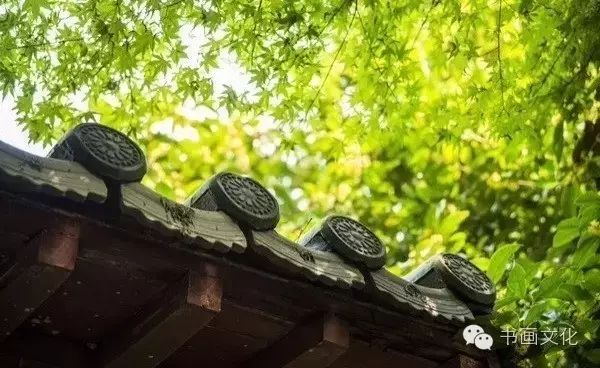
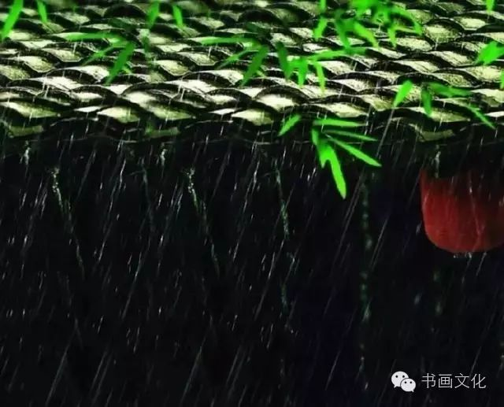
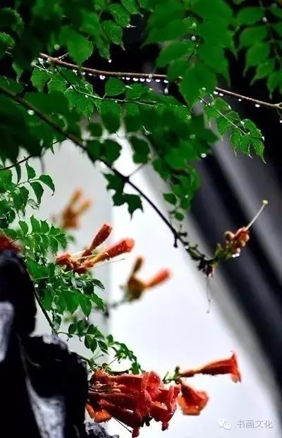

# 无标题

**链接地址:** http://mp.weixin.qq.com/s?__biz=MjM5ODY1MTAwMw==&mid=2651776682&idx=6&sn=4643c07b5c559266cabfaf8c49330476&chksm=bd3d33be8a4abaa81c149a4a1609716cfddd47044a70dca2da0e387d94fbfee2105ec9b0ddce&mpshare=1&scene=2&srcid=0322SpuEFGbEwnRKdYXpnAFG#rd
**作者:** 
**获取时间:** 2025/8/28 22:34:04
**图片数量:** 17

---

## 原始HTML内容

<h1 style="font-size: 14px; max-width: 100%; color: rgb(62, 62, 62); white-space: normal; text-align: justify; line-height: 20.47px; font-family: Arial; box-sizing: border-box !important; word-wrap: break-word !important; background-color: rgb(255, 255, 255);">
<strong style="max-width: 100%; line-height: 25.6px; color: rgb(136, 136, 136); font-family: 微软雅黑; font-size: 12px; box-sizing: border-box !important; word-wrap: break-word !important;">《书画文化》</strong>您关注的是最受欢迎的文艺公众号

传播：中国传统文化 | 艺术品收藏 | 茶道 | 文学 | 视觉

<qqmusic class="res_iframe qqmusic_iframe js_editor_qqmusic" scrolling="no" frameborder="0" musicid="107187243" mid="001DdbTH4THNHP" albumurl="/E/7/001idZeo1xPGE7.jpg" audiourl="http://ws.stream.qqmusic.qq.com/C100001DdbTH4THNHP.m4a?fromtag=46" music_name="琵琶语" commentid="2476541399" singer="林海&nbsp;-&nbsp;林海影视配乐精选" play_length="257000" src="/cgi-bin/readtemplate?t=tmpl/qqmusic_tmpl&amp;singer=%E6%9E%97%E6%B5%B7%20-%20%E6%9E%97%E6%B5%B7%E5%BD%B1%E8%A7%86%E9%85%8D%E4%B9%90%E7%B2%BE%E9%80%89&amp;music_name=%E7%90%B5%E7%90%B6%E8%AF%AD" style="max-width: 100%; box-sizing: border-box !important; word-wrap: break-word !important;"></qqmusic>
</h1>
<strong style="max-width: 100%; box-sizing: border-box !important; word-wrap: break-word !important;"> </strong>

<strong style="max-width: 100%; box-sizing: border-box !important; word-wrap: break-word !important;"> </strong>

<strong style="max-width: 100%; box-sizing: border-box !important; word-wrap: break-word !important;">古人云：三十而立，四十不惑，五十知天命。</strong> 

<strong style="max-width: 100%; box-sizing: border-box !important; word-wrap: break-word !important;"> </strong>

人到中年，颔首如春，低眉落花，浅笑如秋。在这起落间，心中却暗藏淡淡酸楚：是被青春抛弃的无奈，是被岁月洗尽铅华后的不舍。

 

 

 

不知觉间，皱纹已悄悄地爬上了我们的脸，书写下了岁月流逝的痕迹，它见证了我们所经历的一切风霜。

 

人到中年，宛若一盏清茶，淡然独醉，悄然独醒，一醒一醉间，便是人生。

 

 

 

<strong style="max-width: 100%; box-sizing: border-box !important; word-wrap: break-word !important;">有人说：童年是梦，少年是歌，青年是诗，中年是一部小说。</strong>

 

人到中年，此刻的心，已被岁月打磨圆润、通透，生命的光芒不再如年轻时候一样闪耀刺眼。

 

温和平静，精致淡雅，正如一本小说，平淡的语言，却叙述着含蓄深沉的情节。

 

 

 

<strong style="max-width: 100%; box-sizing: border-box !important; word-wrap: break-word !important;">人到中年，正是人生破茧成蝶的时刻。</strong>

 

这是一场不急不躁的蜕变，这种蜕变或许有些痛，但也是生命一直的坚持，一直的渴望，那份蜕变不为其他，只为自己。 

 

 

 

生命诞生的那一刻向世界证明我们来了；生命蜕变的那一刻，则证明我们成为了真正美丽的自己。

 

这样的一场证明，却无比的艰辛，有谁生命的诗卷上，没有一首含泪的诗呢？但我们的心，却一直向着太阳！

 

 

 

<strong style="max-width: 100%; box-sizing: border-box !important; word-wrap: break-word !important;">古语曰：人到中年万事休</strong>

 

人到中年，此时，我们不再羡慕谁，我们只想成为自己，把这个自己经营好就足够。

 

此刻的我们，手中紧紧握着一把伞，为自己遮风挡雨，为所爱的人撑起一片蓝天。

 

 

 

<strong style="max-width: 100%; box-sizing: border-box !important; word-wrap: break-word !important;">林肯说：超过四十岁的人，在自己的脸上一定挂着责任感。</strong>

 

人到中年，学会了选择，学会了担当，学会了放弃，少了焦躁和冲动，懂得了洞明世事，随遇而安。

 

人生的光阴不觉近半，中年就像人生的一道黄金分割点，思维和处事方式逐渐不同。这一切都是时光的打磨、岁月的锻造。

 

 

 

人到中年，情更真、爱更厚重、更深沉，不但是命运的驾手，更是自己灵魂的舵手。

 

把品尝过的辛味化作脸上的微笑，心里开着一朵处事不惊的淡然，开着一朵真诚以待的善良，也开着一朵风雨不改的慈悲。

 

 

 

<strong style="max-width: 100%; box-sizing: border-box !important; word-wrap: break-word !important;">人到中年，一个“悟”字便可道尽千言万语。</strong> 

<strong style="max-width: 100%; box-sizing: border-box !important; word-wrap: break-word !important;"> </strong>

此刻才明白，高处不胜寒，世事沧桑的无奈。所有踌躇彷徨，不若化作坚定的信念，努力过好当下的，挽留正当年。

 

 

 

人到中年，学会了笑看繁华万千。

 

人生俗事，淡然处之，用波澜不惊的坦然，看诸事顺其自然。学会感恩，无憾于心，无愧于情的做人，做事，不再奢求浮夸的梦，不再执着……

 

 

 

人到中年，渐渐品味到平淡的真正意义，淡淡的花很美，淡淡的天很蓝，淡淡的友情很真，淡淡的爱情很醉，淡淡的忧愁很清，淡淡的生活很美……

 

这种淡，是一种发自内心的净化，是一种无憾无悔的纯真。

 

 

 

 

人到中年，把青春的烈酒酿成了芬芳的清茗，唯心独醉，淡看世事浮沉，苦涩间伴有馨香。

 

茶清梦正好，清心往中年。一切顺其自然，一切脱俗，一切如幽深邈远的意境，静静品味淡雅的美。

 

 

 

人到中年，再回首时才发现：平平淡淡才是真……
<section label="Copyright © 2016 playhudong All Rights Reserved." donone="shifuMouseDownPayStyle('shifu_sig_024')" style="margin: 1em auto; max-width: 100%; color: rgb(62, 62, 62); font-size: 16px; line-height: 25.6px; white-space: normal; text-align: center; font-family: 微软雅黑; border: none; width: 20em; box-sizing: border-box !important; word-wrap: break-word !important; background-color: rgb(255, 255, 255);"><section style="max-width: 100%; box-sizing: border-box; width: 320px; word-wrap: break-word !important;"><section style="max-width: 100%; width: 320px; height: auto; overflow: hidden; box-sizing: border-box !important; word-wrap: break-word !important;"><section class="" style="margin-right: 1em; max-width: 100%; box-sizing: border-box; width: 8em; height: 8em; display: inline-block; border-radius: 50%; vertical-align: top; word-wrap: break-word !important; background-image: initial; background-attachment: initial; background-color: rgb(129, 191, 208); background-size: initial; background-origin: initial; background-clip: initial; background-position: initial; background-repeat: initial;"><section style="margin-top: 1em; max-width: 100%; width: 128px; box-sizing: border-box !important; word-wrap: break-word !important;">
<strong style="max-width: 100%; box-sizing: border-box !important; word-wrap: break-word !important;"> </strong>

<strong style="max-width: 100%; box-sizing: border-box !important; word-wrap: break-word !important;">名利场</strong>

<strong style="max-width: 100%; box-sizing: border-box !important; word-wrap: break-word !important;">Cityfocus</strong> 
</section></section><section style="max-width: 100%; box-sizing: border-box; color: rgb(255, 255, 255); width: 8em; display: inline-block; vertical-align: top; word-wrap: break-word !important;"> </section></section><section style="padding: 1em 0em 0em; max-width: 100%; width: 320px; font-size: 1em; box-sizing: border-box !important; word-wrap: break-word !important;">
<strong style="max-width: 100%; font-size: 1em; color: rgb(89, 89, 89); line-height: 25.6px; box-sizing: border-box !important; word-wrap: break-word !important;">长按二维码关注：浮华世界，名利场。</strong>
</section></section></section>
温馨提示：《书画文化》推广的内容如有侵权请您告知我们会在第一时间处理或撤销；互联网是一个资源共享的生态圈，我们崇尚分享。

其他平台转载请注明：(来源：书画文化 微信：Taizhouwenhua)。

---

## 纯文本内容

《书画文化》您关注的是最受欢迎的文艺公众号传播：中国传统文化 | 艺术品收藏 | 茶道 | 文学 | 视觉古人云：三十而立，四十不惑，五十知天命。人到中年，颔首如春，低眉落花，浅笑如秋。在这起落间，心中却暗藏淡淡酸楚：是被青春抛弃的无奈，是被岁月洗尽铅华后的不舍。不知觉间，皱纹已悄悄地爬上了我们的脸，书写下了岁月流逝的痕迹，它见证了我们所经历的一切风霜。人到中年，宛若一盏清茶，淡然独醉，悄然独醒，一醒一醉间，便是人生。有人说：童年是梦，少年是歌，青年是诗，中年是一部小说。人到中年，此刻的心，已被岁月打磨圆润、通透，生命的光芒不再如年轻时候一样闪耀刺眼。温和平静，精致淡雅，正如一本小说，平淡的语言，却叙述着含蓄深沉的情节。人到中年，正是人生破茧成蝶的时刻。这是一场不急不躁的蜕变，这种蜕变或许有些痛，但也是生命一直的坚持，一直的渴望，那份蜕变不为其他，只为自己。生命诞生的那一刻向世界证明我们来了；生命蜕变的那一刻，则证明我们成为了真正美丽的自己。这样的一场证明，却无比的艰辛，有谁生命的诗卷上，没有一首含泪的诗呢？但我们的心，却一直向着太阳！古语曰：人到中年万事休人到中年，此时，我们不再羡慕谁，我们只想成为自己，把这个自己经营好就足够。此刻的我们，手中紧紧握着一把伞，为自己遮风挡雨，为所爱的人撑起一片蓝天。林肯说：超过四十岁的人，在自己的脸上一定挂着责任感。人到中年，学会了选择，学会了担当，学会了放弃，少了焦躁和冲动，懂得了洞明世事，随遇而安。人生的光阴不觉近半，中年就像人生的一道黄金分割点，思维和处事方式逐渐不同。这一切都是时光的打磨、岁月的锻造。人到中年，情更真、爱更厚重、更深沉，不但是命运的驾手，更是自己灵魂的舵手。把品尝过的辛味化作脸上的微笑，心里开着一朵处事不惊的淡然，开着一朵真诚以待的善良，也开着一朵风雨不改的慈悲。人到中年，一个“悟”字便可道尽千言万语。此刻才明白，高处不胜寒，世事沧桑的无奈。所有踌躇彷徨，不若化作坚定的信念，努力过好当下的，挽留正当年。人到中年，学会了笑看繁华万千。人生俗事，淡然处之，用波澜不惊的坦然，看诸事顺其自然。学会感恩，无憾于心，无愧于情的做人，做事，不再奢求浮夸的梦，不再执着……人到中年，渐渐品味到平淡的真正意义，淡淡的花很美，淡淡的天很蓝，淡淡的友情很真，淡淡的爱情很醉，淡淡的忧愁很清，淡淡的生活很美……这种淡，是一种发自内心的净化，是一种无憾无悔的纯真。人到中年，把青春的烈酒酿成了芬芳的清茗，唯心独醉，淡看世事浮沉，苦涩间伴有馨香。茶清梦正好，清心往中年。一切顺其自然，一切脱俗，一切如幽深邈远的意境，静静品味淡雅的美。人到中年，再回首时才发现：平平淡淡才是真……名利场Cityfocus长按二维码关注：浮华世界，名利场。温馨提示：《书画文化》推广的内容如有侵权请您告知我们会在第一时间处理或撤销；互联网是一个资源共享的生态圈，我们崇尚分享。其他平台转载请注明：(来源：书画文化 微信：Taizhouwenhua)。

---

## 图片列表

-  (原始链接: http://mmbiz.qpic.cn/mmbiz/hmPGG7mRZjBAtZbYZc6h4OkyY6dj4yIGyXxOicm43hs2aluPhmvHzEUTPzKNepNrqlNwPr5Lq3ruwj1mreykzcA/640?wx_fmt=png)
-  (原始链接: http://mmbiz.qpic.cn/mmbiz_jpg/Sk2ObdN7rzHfcwx8icLNXClMMgh5V3GDztYDIWAvaIwGfyQbTO78ySDeDE6V37icOuxICkrr2olpTk4gmokkryCQ/640?wx_fmt=jpeg)
-  (原始链接: http://mmbiz.qpic.cn/mmbiz_jpg/Sk2ObdN7rzHfcwx8icLNXClMMgh5V3GDzGP5EglWFT3PHAclic7dvxqicpf3qBE9uGrvdotZulFviaNQFVX9IzA6icA/640?wx_fmt=jpeg)
-  (原始链接: http://mmbiz.qpic.cn/mmbiz_jpg/Sk2ObdN7rzHfcwx8icLNXClMMgh5V3GDz8D3yMXCBxdyY92KMocC29iaR2aGoYx93XUl4EWlBVeibPW0icBMGC7VLA/640?wx_fmt=jpeg)
-  (原始链接: http://mmbiz.qpic.cn/mmbiz_jpg/Sk2ObdN7rzHfcwx8icLNXClMMgh5V3GDz3cwUzv1DqPlZG1Rjvnvd90qgHsMcloqPKNArk9okgdygibAx3JtyxWg/640?wx_fmt=jpeg)
-  (原始链接: http://mmbiz.qpic.cn/mmbiz_jpg/Sk2ObdN7rzHfcwx8icLNXClMMgh5V3GDzvgQGhbOFyujNwae8eRS5aMsibMwQTY9iaz2IQEicV0FeQKKlICmg5Fj3g/640?wx_fmt=jpeg)
-  (原始链接: http://mmbiz.qpic.cn/mmbiz_jpg/Sk2ObdN7rzHfcwx8icLNXClMMgh5V3GDznLZtezTuwWNq20ufnAcLgsUncbytZMmbPxHKNGITwQ2Atg5AGmdricg/640?wx_fmt=jpeg)
-  (原始链接: http://mmbiz.qpic.cn/mmbiz_jpg/Sk2ObdN7rzHfcwx8icLNXClMMgh5V3GDzE3YsgibOW2cCyYQBVlU18OM10sB3wF6ZXVwWI56pXWtciaUFmibzjv0Jw/640?wx_fmt=jpeg)
-  (原始链接: http://mmbiz.qpic.cn/mmbiz_jpg/Sk2ObdN7rzHfcwx8icLNXClMMgh5V3GDzfSXibvicQoOQ1TYdhYXYzbZ5AjgsRULeEc3aPTN5sickvE7umfosuJmjQ/640?wx_fmt=jpeg)
-  (原始链接: http://mmbiz.qpic.cn/mmbiz_jpg/Sk2ObdN7rzHfcwx8icLNXClMMgh5V3GDzwCjrG7TXxkqNjSw3tVkzxRVfGM5D1U8kveHKZep2ticT4F8Un42Spxg/640?wx_fmt=jpeg)
-  (原始链接: http://mmbiz.qpic.cn/mmbiz_jpg/Sk2ObdN7rzHfcwx8icLNXClMMgh5V3GDzZj5C6wvSibibzvkfo3yPMnK3hg7O71h2sicDFhGrvUnGJCGJTMhLj7fFw/640?wx_fmt=jpeg)
-  (原始链接: http://mmbiz.qpic.cn/mmbiz_jpg/Sk2ObdN7rzHfcwx8icLNXClMMgh5V3GDzibObzx6kibVlnriaJfFRtVgtfnarDlXhwfgfWDVvuw28DAunoG6ibSETrw/640?wx_fmt=jpeg)
-  (原始链接: http://mmbiz.qpic.cn/mmbiz_jpg/Sk2ObdN7rzHfcwx8icLNXClMMgh5V3GDz8D3yMXCBxdyY92KMocC29iaR2aGoYx93XUl4EWlBVeibPW0icBMGC7VLA/640?wx_fmt=jpeg)
-  (原始链接: http://mmbiz.qpic.cn/mmbiz_jpg/Sk2ObdN7rzHfcwx8icLNXClMMgh5V3GDzlz9vicV2Tef2qjEOZCgYpfP6LY8oiaibUqOZ2QibcRfRbvib6kTCpOibXIRQ/640?wx_fmt=jpeg)
-  (原始链接: http://mmbiz.qpic.cn/mmbiz/Sk2ObdN7rzGuQKxksTF0VAiav3jXkuiabTFicjlRphTGicRmBW8ibHm0nPciaggqGK9VBhCgS97rzciaStRHxX7rHvvhQ/640?wx_fmt=jpeg)
-  (原始链接: http://mmbiz.qpic.cn/mmbiz/0oXaHWnKibUctNQK4IbV8fArvW22A72yhIbfRSAt8YEiaCTV5Fklqc5211Rj1RcjzH8S9icf7HMEQQmWbBuLwlLog/0/mmbizgif?wx_fmt=gif)
-  (原始链接: http://mmbiz.qpic.cn/mmbiz/0oXaHWnKibUctNQK4IbV8fArvW22A72yhIbfRSAt8YEiaCTV5Fklqc5211Rj1RcjzH8S9icf7HMEQQmWbBuLwlLog/0/mmbizgif?wx_fmt=gif)
