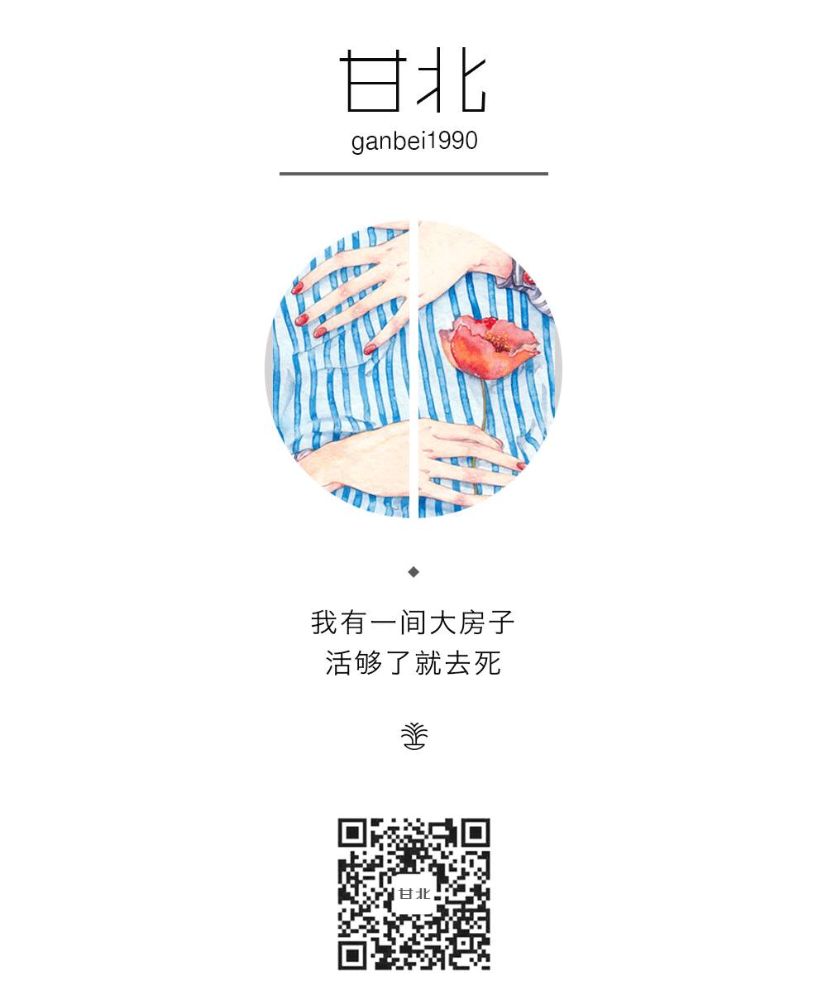

# 无标题

**链接地址:** http://mp.weixin.qq.com/s?__biz=MzI4NTU0MjYzOQ==&mid=2247483910&idx=1&sn=3b018b593b6219dc747bbe1ae25f12cd&chksm=ebebd386dc9c5a907beee1f2e8d411f7162b040acbda7f1b9ee9a7f5a575c50508b46b1e60b6&mpshare=1&scene=2&srcid=0406xpANrE57hc3smWWBNA5H#rd
**作者:** 甘北
**获取时间:** 2025/8/28 22:32:32
**图片数量:** 6

---

## 原始HTML内容

<qqmusic class="res_iframe qqmusic_iframe js_editor_qqmusic" scrolling="no" frameborder="0" musicid="715690" mid="001CSOFu2z5OGv" albumurl="/9/p/004F7Pb74MRz9p.jpg" audiourl="http://ws.stream.qqmusic.qq.com/C100001CSOFu2z5OGv.m4a?fromtag=46" music_name="我要的飞翔" commentid="954235541" singer="许飞&nbsp;-&nbsp;二十六度" play_length="242000" src="/cgi-bin/readtemplate?t=tmpl/qqmusic_tmpl&amp;singer=%E8%AE%B8%E9%A3%9E%20-%20%E4%BA%8C%E5%8D%81%E5%85%AD%E5%BA%A6&amp;music_name=%E6%88%91%E8%A6%81%E7%9A%84%E9%A3%9E%E7%BF%94"></qqmusic>

<strong>干得好不如嫁得好？</strong>

<strong>我呸！</strong>

 

 

同学今年28岁，还没有嫁人。

每回聚会都有那么两个没眼见力的，一脸同情地对她摇头：“女孩子嘛，干得好不如嫁得好，都这个年纪了，赶紧找个人嫁了才是正事。”

呵呵，也不看看自己的银行卡余额。

人家年薪二三十万，早几年房价还没涨起来，就已经买下了一套两居室，去年又买了一辆代步车，爱吃吃，爱喝喝，无聊就去自驾游，用得着你同情？

<strong>女孩子有一份事业有多爽？这么跟你说吧，爽！爆！了！</strong><strong></strong>

当你想买包，就可以买包，五千也好，一万也好，你要担心的，只是下个月吃不吃土，而不用因为花别人钱而愧疚，更不用看别人的眼色，等着男朋友在网上发帖骂你——败家女友买个包花了五千，该不该分手？

当你发现男友在外面勾搭女人，可以义无反顾地跟他分手，不用担心下个月交不交得起房租，不用担心明天能不能开饭，退一万步讲，哪怕情感上无法割舍，至少不用为了经济原因卑躬屈膝。

这是未婚的。假设你已婚，那就更爽了！

我一个已婚朋友，早两年因为要带孩子，辞职在家做了一段时间家庭主妇。那两年，她整个人都悲观了不少，原先豁达的性子，变得愁云惨淡的。

她跟我们讲，有一回，她想买一台空气净化器，上网看了价格，老公立马连声否决：“太贵了！太不实际了！”

这倒没什么，关键是婆婆，阴阳怪气地在一旁搭腔：“我们家XX赚几个钱也不容易，不能这么败了。”

天啊！她明明超级辛苦，天天带孩子累得像条狗，凭什么被说得好像吃闲饭一样？受不了这口闷气，等孩子送了幼儿园，她就重回职场，虽然工资不高，但足够她花销啊，不用伸手要钱的感觉别提多爽了。

<strong>对啊，就是这么现实，经济基础决定话语权，你能赚钱，老公就不敢小看你，婆婆就不敢刁难你。</strong><strong></strong>

<strong> </strong>

比经济独立更重要的是什么？

事业能带给你的安全感，是嫁给任何一个人都无法比拟的。

我有全职的家庭主妇朋友，老公很会赚钱，工资全部上交，可她还是没有安全感。为什么？朋友，你不逛天涯吗？有多少二十四孝老公，转过枪头就变成了翻脸无情的渣男？

<strong>找男人要安全感，朋友，你这是在赌博啊！</strong>安全感是什么？是你对最坏情况的预期，你想在感情中获得安全感，就要假设失去感情你还有什么可以抓住。

相信我，一份稳定的工作，绝对会成为你安全的着陆点。哪怕一觉醒来，那个男人把所有家当都卷跑了，你还能去财务预支两个月的工资，不用苦兮兮地流落街头不知所措。

更何况，除了安全感，工作还能带给我们满满的成就感。<strong>女人的个人价值，绝不止体现在结婚生孩子上，我们同样能出入职场，同样能改变世界。</strong>

就拿我开头提到的那位同学来说吧，她是一名心理咨询师，跟人合伙创建了一个心理咨询网站。她的团队，每年能帮助数千人走出心理困境，其中不乏抑郁症甚至有自杀倾向的人群。

她说，时常能收到客户发来的答谢短信，那些短信，她一条都舍不得删。那是一个人在低谷中不断奋战脱胎换骨的艰难历程，而这历程的每一步，都有她的心血和付出。

还有什么，比这更值得骄傲？

 

<strong>更何况，嫁得好是那么容易的吗？</strong>

你想嫁给何以琛，得先变成赵默笙，你想嫁给李大仁，得先变成程又青啊！

总有人跟你说“干得好不如嫁得好”，但他们不会告诉你，干得不好的，通常也嫁得不好。你想啥事不干就收获一枚全能老公，既能日赚斗金，又待你如珍如宝？

醒醒吧，大家都是成年人了，成年人的世界，从来都是等价交换的。现实生活中，没有任何一个富家少爷，会看上一无是处只会扇人耳光的灰姑娘。

嫁得好的有没有？有！买彩票还有人中五百万呢！但你有没有发现身边嫁得好的女人，本身都有过人之处？或是家世显赫，或是才华横溢，或是收入丰厚，或是外貌出众。

<strong>真的，如果你一门心思想要嫁得好，就更得努力工作了，这大概是平凡如你我，在择偶路上最实际的逆袭之路了。</strong><strong></strong>

好了，现在我来分析一下，为什么总有人在你努力工作时，兜头泼你一盆冷水？因为这个社会，根本不相信女人能够凭借自己的力量，获得想要的一切。

直到今日，董明珠女士的名字已经家喻户晓，还有投资人在公共场合宣扬不投资女性CEO。更多的人还在固执地相信，一个女人此生最大的成功，就是找到一个好男人，结婚生子再生子。

呵呵。

 

得了吧，谁都想嫁得好，我也想。

但我还有很强的自尊心，还不愿轻易地向现实低头，把自我的价值依附在一个男人身上。

他日觅得良人，希望我们是因为彼此欣赏、彼此吸引而结合，我们并肩而立，共同承担寒潮风雷，共同分享雾霭流岚，不攀附、不屈就。

<strong>是的，我嫁得很好，因为我值得。</strong>

 

（图片来源网络） 

.▼.

作者简介

作者简介：甘北，文艺女青年，我有一间大房子，活够了就去死。代表作《女人都不愿结婚了，男人却还想娶个保姆》。微博：甘北Lily，个人公众号：甘北（ID：ganbei1990）。

——————— &nbsp;▲&nbsp;———————

 

 
<section class="" data-source="bj.96weixin.com" style="max-width: 100%; color: rgb(62, 62, 62); font-size: 16px; line-height: 25.6px; white-space: normal; box-sizing: border-box !important; word-wrap: break-word !important; background-color: rgb(255, 255, 255);"></section>
 

“我长得美，爱更新就更新”

 

---

## 纯文本内容

干得好不如嫁得好？我呸！同学今年28岁，还没有嫁人。每回聚会都有那么两个没眼见力的，一脸同情地对她摇头：“女孩子嘛，干得好不如嫁得好，都这个年纪了，赶紧找个人嫁了才是正事。”呵呵，也不看看自己的银行卡余额。人家年薪二三十万，早几年房价还没涨起来，就已经买下了一套两居室，去年又买了一辆代步车，爱吃吃，爱喝喝，无聊就去自驾游，用得着你同情？女孩子有一份事业有多爽？这么跟你说吧，爽！爆！了！当你想买包，就可以买包，五千也好，一万也好，你要担心的，只是下个月吃不吃土，而不用因为花别人钱而愧疚，更不用看别人的眼色，等着男朋友在网上发帖骂你——败家女友买个包花了五千，该不该分手？当你发现男友在外面勾搭女人，可以义无反顾地跟他分手，不用担心下个月交不交得起房租，不用担心明天能不能开饭，退一万步讲，哪怕情感上无法割舍，至少不用为了经济原因卑躬屈膝。这是未婚的。假设你已婚，那就更爽了！我一个已婚朋友，早两年因为要带孩子，辞职在家做了一段时间家庭主妇。那两年，她整个人都悲观了不少，原先豁达的性子，变得愁云惨淡的。她跟我们讲，有一回，她想买一台空气净化器，上网看了价格，老公立马连声否决：“太贵了！太不实际了！”这倒没什么，关键是婆婆，阴阳怪气地在一旁搭腔：“我们家XX赚几个钱也不容易，不能这么败了。”天啊！她明明超级辛苦，天天带孩子累得像条狗，凭什么被说得好像吃闲饭一样？受不了这口闷气，等孩子送了幼儿园，她就重回职场，虽然工资不高，但足够她花销啊，不用伸手要钱的感觉别提多爽了。对啊，就是这么现实，经济基础决定话语权，你能赚钱，老公就不敢小看你，婆婆就不敢刁难你。比经济独立更重要的是什么？事业能带给你的安全感，是嫁给任何一个人都无法比拟的。我有全职的家庭主妇朋友，老公很会赚钱，工资全部上交，可她还是没有安全感。为什么？朋友，你不逛天涯吗？有多少二十四孝老公，转过枪头就变成了翻脸无情的渣男？找男人要安全感，朋友，你这是在赌博啊！安全感是什么？是你对最坏情况的预期，你想在感情中获得安全感，就要假设失去感情你还有什么可以抓住。相信我，一份稳定的工作，绝对会成为你安全的着陆点。哪怕一觉醒来，那个男人把所有家当都卷跑了，你还能去财务预支两个月的工资，不用苦兮兮地流落街头不知所措。更何况，除了安全感，工作还能带给我们满满的成就感。女人的个人价值，绝不止体现在结婚生孩子上，我们同样能出入职场，同样能改变世界。就拿我开头提到的那位同学来说吧，她是一名心理咨询师，跟人合伙创建了一个心理咨询网站。她的团队，每年能帮助数千人走出心理困境，其中不乏抑郁症甚至有自杀倾向的人群。她说，时常能收到客户发来的答谢短信，那些短信，她一条都舍不得删。那是一个人在低谷中不断奋战脱胎换骨的艰难历程，而这历程的每一步，都有她的心血和付出。还有什么，比这更值得骄傲？更何况，嫁得好是那么容易的吗？你想嫁给何以琛，得先变成赵默笙，你想嫁给李大仁，得先变成程又青啊！总有人跟你说“干得好不如嫁得好”，但他们不会告诉你，干得不好的，通常也嫁得不好。你想啥事不干就收获一枚全能老公，既能日赚斗金，又待你如珍如宝？醒醒吧，大家都是成年人了，成年人的世界，从来都是等价交换的。现实生活中，没有任何一个富家少爷，会看上一无是处只会扇人耳光的灰姑娘。嫁得好的有没有？有！买彩票还有人中五百万呢！但你有没有发现身边嫁得好的女人，本身都有过人之处？或是家世显赫，或是才华横溢，或是收入丰厚，或是外貌出众。真的，如果你一门心思想要嫁得好，就更得努力工作了，这大概是平凡如你我，在择偶路上最实际的逆袭之路了。好了，现在我来分析一下，为什么总有人在你努力工作时，兜头泼你一盆冷水？因为这个社会，根本不相信女人能够凭借自己的力量，获得想要的一切。直到今日，董明珠女士的名字已经家喻户晓，还有投资人在公共场合宣扬不投资女性CEO。更多的人还在固执地相信，一个女人此生最大的成功，就是找到一个好男人，结婚生子再生子。呵呵。得了吧，谁都想嫁得好，我也想。但我还有很强的自尊心，还不愿轻易地向现实低头，把自我的价值依附在一个男人身上。他日觅得良人，希望我们是因为彼此欣赏、彼此吸引而结合，我们并肩而立，共同承担寒潮风雷，共同分享雾霭流岚，不攀附、不屈就。是的，我嫁得很好，因为我值得。（图片来源网络）.▼.作者简介作者简介：甘北，文艺女青年，我有一间大房子，活够了就去死。代表作《女人都不愿结婚了，男人却还想娶个保姆》。微博：甘北Lily，个人公众号：甘北（ID：ganbei1990）。———————  ▲ ———————“我长得美，爱更新就更新”

---

## 图片列表

-  (原始链接: http://mmbiz.qpic.cn/mmbiz_png/Y77e8cFeqGBoXlPQ4RibWWdzbggjFuJ0LwJiaM5UMI7m5T5f9u8jKBhoW8zyLNKauTMkm465UF0ickDzozKIZP1qw/0?wx_fmt=png)
-  (原始链接: http://mmbiz.qpic.cn/mmbiz_jpg/Y77e8cFeqGBoXlPQ4RibWWdzbggjFuJ0Lj5tgEhJYtLMQNm9Nc2r3h97PPaj8q5PPfblFWy5QBsdj6bibhpicE6Gg/640?wx_fmt=jpeg)
-  (原始链接: http://mmbiz.qpic.cn/mmbiz_jpg/Y77e8cFeqGBoXlPQ4RibWWdzbggjFuJ0LrTqYF5TviaWDgWTRFUO20Cyt8cWGu82UBjyJcNkuBSAwagaTpSuib4UQ/0?)
-  (原始链接: http://mmbiz.qpic.cn/mmbiz_jpg/Y77e8cFeqGBoXlPQ4RibWWdzbggjFuJ0L4iaTnYJF2vCSYbaRFQcRSvfqC6JHFTJXOoibxhQpqib7SNicqEeldWsPoA/640?wx_fmt=jpeg)
-  (原始链接: http://mmbiz.qpic.cn/mmbiz_jpg/Y77e8cFeqGBoXlPQ4RibWWdzbggjFuJ0Ll0hx5DeiaDRhLrsYjEEsWyBqCvrPDYAokZ534mQbHcxbziaqulhoc8pA/640?wx_fmt=jpeg)
-  (原始链接: http://mmbiz.qpic.cn/mmbiz_png/Y77e8cFeqGBoXlPQ4RibWWdzbggjFuJ0L6TfiaZRn8LWYntX1iczREJeYT0d7TLAe4ficiaHt35cQgicyOOPKK6RzLKQ/0/mmbizgif?)
