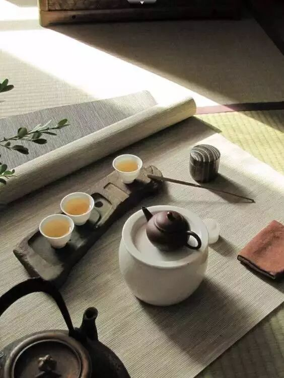
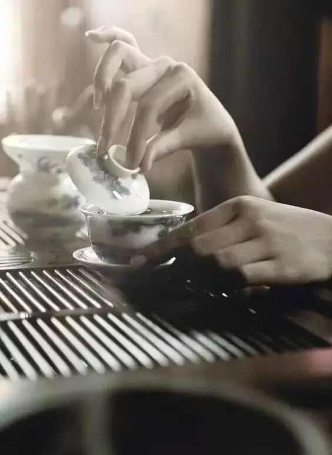
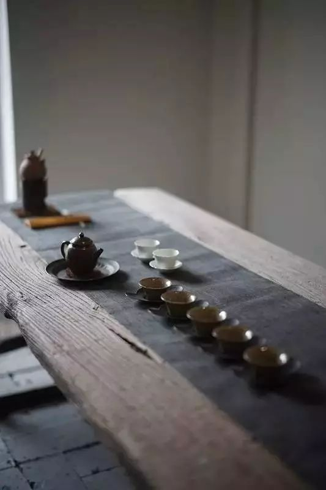
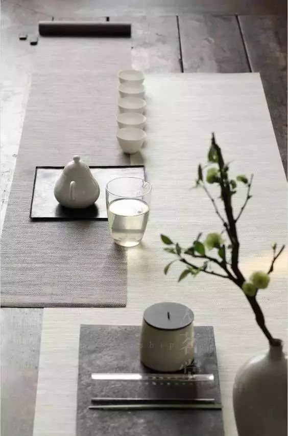
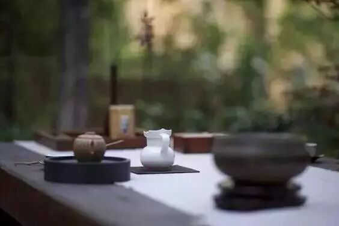

# 无标题

**链接地址:** http://mp.weixin.qq.com/s?__biz=MjM5ODY1MTAwMw==&mid=2651777585&idx=2&sn=0fae56c98682a34990c1552da687f373&chksm=bd3d3f258a4ab63375fa6a8d73fa56c18acae96f0b041c40f74d89b10028165b23acef01b69d&mpshare=1&scene=2&srcid=0430tYaJbV4Tx4gW6SLCt1tY#rd
**作者:** 
**获取时间:** 2025/8/28 22:31:37
**图片数量:** 10

---

## 原始HTML内容

<strong style="max-width: 100%; line-height: 25.6px; font-size: 12px; box-sizing: border-box !important; word-wrap: break-word !important;">《书画文化》</strong>您关注的是最受欢迎的文艺公众号

传播：中国传统文化&nbsp;| 艺术品收藏 | 茶道 | 文学 | 视觉

<qqmusic class="res_iframe qqmusic_iframe js_editor_qqmusic" scrolling="no" frameborder="0" musicid="580911" mid="0026ndh4003uFm" albumurl="/U/4/002R3CPt1RVeU4.jpg" audiourl="http://ws.stream.qqmusic.qq.com/C1000026ndh4003uFm.m4a?fromtag=46" music_name="渔舟唱晚" commentid="3220819213" singer="群星&nbsp;-&nbsp;中国民乐演奏系列2&nbsp;渔舟唱晚" play_length="390000" src="https://mp.weixin.qq.com/cgi-bin/readtemplate?t=tmpl/qqmusic_tmpl&amp;singer=%E7%BE%A4%E6%98%9F%20-%20%E4%B8%AD%E5%9B%BD%E6%B0%91%E4%B9%90%E6%BC%94%E5%A5%8F%E7%B3%BB%E5%88%972%20%E6%B8%94%E8%88%9F%E5%94%B1%E6%99%9A&amp;music_name=%E6%B8%94%E8%88%9F%E5%94%B1%E6%99%9A" style="max-width: 100%; width: 556px; box-sizing: border-box !important; word-wrap: break-word !important;"></qqmusic>

 

一壶茶，茶叶在水中跳舞，不论悲喜，不争朝夕，不叹时光。

 

与你喝茶，不谈世事牵挂，在这一杯茶里，有无限的前因，也不必深究，这一切仿佛早有安排，累世的缘分，拿起茶杯就好。

 

 

这一生的相遇，无论是在秋熟还是春芽。我在泡茶，你来喝茶，一起谈谈，城市的霓虹再绚烂，终究敌不过闲时剪短的灯花。

 

也是这一刻的安静，让人更珍惜这一刻的时间和人生，像在一个循环里，如茶的轮回。

 

 

杯中的茶由淡变浓，浮浮沉沉，聚聚散散，在每次喝茶过程中，内心都会平静地对待，用心泡，认真喝。

 

与爱茶的朋友一起喝茶，慢慢的品，把茶喝透为止，也是一个学习的过程，喝茶让人越喝越清心醒目，引发灵感，摒弃繁杂，重新出发。

 

 

茶是温暖的，与相知的人一起喝。

 

张爱玲说：与千万人之中，在时间的荒野里，没有早一步，没有晚一步，恰巧遇上了，然后轻轻的说一句：原来你也在这里！

 

 

爱茶之人为什么选择以茶为友，除了独饮，在千万人群中寻遇兴趣相同的朋友，用心交流不离不弃。约你来喝茶，只因为想你了，那样简单。

 

一起喝茶，心无杂念，不管我们走过多少年，不忘初心；能在一起喝茶的人，就好好珍惜；不负时光，不负人。

 

<section label="Copyright © 2016 playhudong All Rights Reserved." donone="shifuMouseDownPayStyle('shifu_sig_024')" style="margin: 1em auto; font-size: 16px; line-height: 25.6px; white-space: normal; max-width: 100%; color: rgb(62, 62, 62); border: none; width: 20em; box-sizing: border-box !important; word-wrap: break-word !important; background-color: rgb(255, 255, 255);"><section style="max-width: 100%; box-sizing: border-box; width: 320px; word-wrap: break-word !important;"><section style="max-width: 100%; width: 320px; height: auto; text-align: center; overflow: hidden; box-sizing: border-box !important; word-wrap: break-word !important;"><section class="" style="margin-right: 1em; max-width: 100%; box-sizing: border-box; width: 8em; height: 8em; display: inline-block; border-radius: 50%; vertical-align: top; word-wrap: break-word !important; background-image: initial; background-attachment: initial; background-color: rgb(129, 191, 208); background-size: initial; background-origin: initial; background-clip: initial; background-position: initial; background-repeat: initial;"><section style="margin-top: 1em; max-width: 100%; width: 128px; box-sizing: border-box !important; word-wrap: break-word !important;">
<strong style="max-width: 100%; box-sizing: border-box !important; word-wrap: break-word !important;"> </strong>

<strong style="max-width: 100%; box-sizing: border-box !important; word-wrap: break-word !important;">名利场</strong>

<strong style="max-width: 100%; box-sizing: border-box !important; word-wrap: break-word !important;">Cityfocus</strong> 
</section></section><section style="max-width: 100%; box-sizing: border-box; color: rgb(255, 255, 255); width: 8em; display: inline-block; vertical-align: top; word-wrap: break-word !important;"> </section></section><section style="padding: 1em 0em 0em; max-width: 100%; width: 320px; font-size: 1em; text-align: center; box-sizing: border-box !important; word-wrap: break-word !important;">
<strong style="max-width: 100%; font-size: 1em; color: rgb(89, 89, 89); line-height: 25.6px; box-sizing: border-box !important; word-wrap: break-word !important;">长按二维码关注：浮华世界，名利场。</strong>
</section></section></section>
温馨提示：《书画文化》推广的内容如有侵权请您告知我们会在第一时间处理或撤销；互联网是一个资源共享的生态圈，我们崇尚分享。

其他平台转载请注明：(来源：书画文化 微信：Taizhouwenhua)。

---

## 纯文本内容

《书画文化》您关注的是最受欢迎的文艺公众号传播：中国传统文化 | 艺术品收藏 | 茶道 | 文学 | 视觉一壶茶，茶叶在水中跳舞，不论悲喜，不争朝夕，不叹时光。与你喝茶，不谈世事牵挂，在这一杯茶里，有无限的前因，也不必深究，这一切仿佛早有安排，累世的缘分，拿起茶杯就好。这一生的相遇，无论是在秋熟还是春芽。我在泡茶，你来喝茶，一起谈谈，城市的霓虹再绚烂，终究敌不过闲时剪短的灯花。也是这一刻的安静，让人更珍惜这一刻的时间和人生，像在一个循环里，如茶的轮回。杯中的茶由淡变浓，浮浮沉沉，聚聚散散，在每次喝茶过程中，内心都会平静地对待，用心泡，认真喝。与爱茶的朋友一起喝茶，慢慢的品，把茶喝透为止，也是一个学习的过程，喝茶让人越喝越清心醒目，引发灵感，摒弃繁杂，重新出发。茶是温暖的，与相知的人一起喝。张爱玲说：与千万人之中，在时间的荒野里，没有早一步，没有晚一步，恰巧遇上了，然后轻轻的说一句：原来你也在这里！爱茶之人为什么选择以茶为友，除了独饮，在千万人群中寻遇兴趣相同的朋友，用心交流不离不弃。约你来喝茶，只因为想你了，那样简单。一起喝茶，心无杂念，不管我们走过多少年，不忘初心；能在一起喝茶的人，就好好珍惜；不负时光，不负人。名利场Cityfocus长按二维码关注：浮华世界，名利场。温馨提示：《书画文化》推广的内容如有侵权请您告知我们会在第一时间处理或撤销；互联网是一个资源共享的生态圈，我们崇尚分享。其他平台转载请注明：(来源：书画文化 微信：Taizhouwenhua)。

---

## 图片列表

-  (原始链接: http://mmbiz.qpic.cn/mmbiz/hmPGG7mRZjBAtZbYZc6h4OkyY6dj4yIGyXxOicm43hs2aluPhmvHzEUTPzKNepNrqlNwPr5Lq3ruwj1mreykzcA/640?)
-  (原始链接: http://mmbiz.qpic.cn/mmbiz_jpg/Sk2ObdN7rzHWIuuGqmqeRRPVVZ7mANqib2dPuYMfBiaLbUtc7ibZc9jQGrvOqZW0a6bmXPupWsksfyydZgKN9hQEw/0?wx_fmt=jpeg)
-  (原始链接: http://mmbiz.qpic.cn/mmbiz_jpg/Sk2ObdN7rzHWIuuGqmqeRRPVVZ7mANqibYDFKapGOZfQJITfW0iban3JF5qAONV1VpXgx8qHAmjC8OKqaffKeJug/0?wx_fmt=jpeg)
-  (原始链接: http://mmbiz.qpic.cn/mmbiz_jpg/Sk2ObdN7rzHWIuuGqmqeRRPVVZ7mANqibTQT7nQbYD7kEvkOc7oKo9Jia6CBVRRPgq9TzjgPS2aclFkqo7DUnmqA/0?wx_fmt=jpeg)
-  (原始链接: http://mmbiz.qpic.cn/mmbiz_jpg/Sk2ObdN7rzHWIuuGqmqeRRPVVZ7mANqibcuxSjcjH1FS3CPuicPtnSrbqeXduV0mFLiaZxeicJia628afcomtUjTuibw/0?wx_fmt=jpeg)
-  (原始链接: http://mmbiz.qpic.cn/mmbiz_jpg/Sk2ObdN7rzHWIuuGqmqeRRPVVZ7mANqibMXy0PENn8E7qyu4kS7TWtx0iat5oy8yY51Jd6BM1jlB6nGicfNFWML8Q/0?wx_fmt=jpeg)
-  (原始链接: http://mmbiz.qpic.cn/mmbiz_jpg/Sk2ObdN7rzHWIuuGqmqeRRPVVZ7mANqibwLJ9aymyjV9rxOia9wWh0JA2naHL8gCR4qaqbh1c90AjB3073hqETqA/0?wx_fmt=jpeg)
-  (原始链接: http://mmbiz.qpic.cn/mmbiz/Sk2ObdN7rzGuQKxksTF0VAiav3jXkuiabTFicjlRphTGicRmBW8ibHm0nPciaggqGK9VBhCgS97rzciaStRHxX7rHvvhQ/640?wx_fmt=jpeg)
-  (原始链接: http://mmbiz.qpic.cn/mmbiz/0oXaHWnKibUctNQK4IbV8fArvW22A72yhIbfRSAt8YEiaCTV5Fklqc5211Rj1RcjzH8S9icf7HMEQQmWbBuLwlLog/0/mmbizgif?wx_fmt=gif)
-  (原始链接: http://mmbiz.qpic.cn/mmbiz/0oXaHWnKibUctNQK4IbV8fArvW22A72yhIbfRSAt8YEiaCTV5Fklqc5211Rj1RcjzH8S9icf7HMEQQmWbBuLwlLog/0/mmbizgif?wx_fmt=gif)
