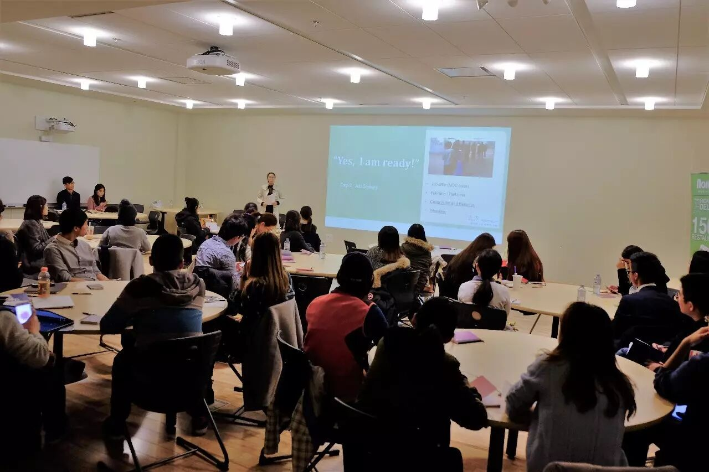
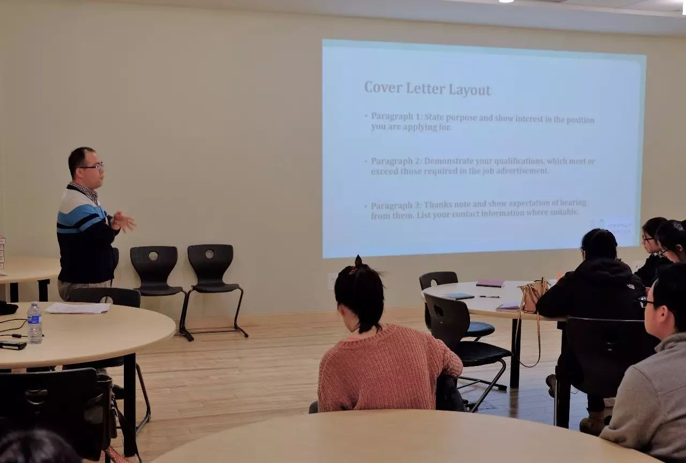
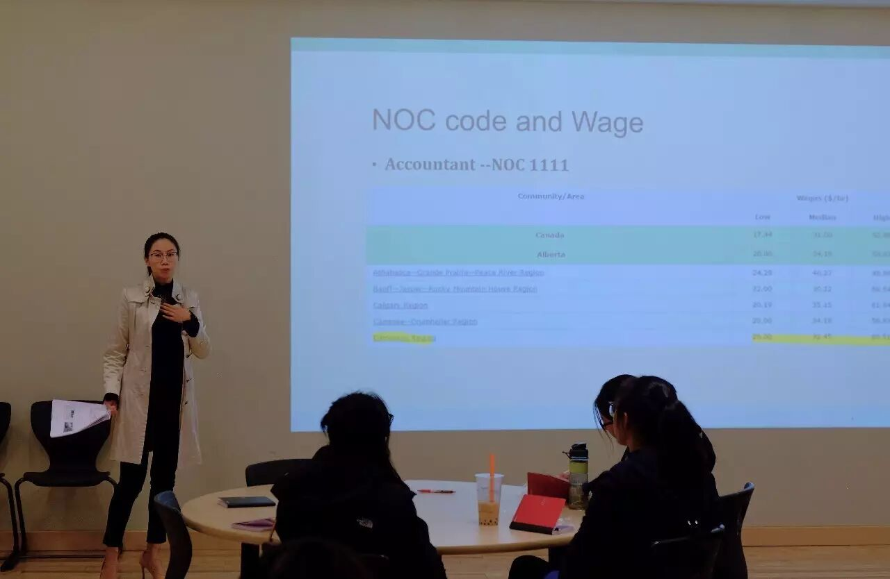

# 无标题

**链接地址:** http://mp.weixin.qq.com/s?__biz=MzU4MjAzMDcxNg==&mid=2247483694&idx=1&sn=9ccd8c930cb59413b0b82ea1d1a223d4&chksm=fdbfc53dcac84c2b21cb5a3f6b38f3ca3de06d1735c56c5d495fc0a5d9f73b28bde74f1cb92e&mpshare=1&scene=2&srcid=0509YzID7snlxsiZIvRGtvDf#rd
**作者:** 
**获取时间:** 2025/8/28 22:31:25
**图片数量:** 11

---

## 原始HTML内容

<section data-role="outer" label="Powered by 135editor.com" style="font-family:微软雅黑;font-size:16px;">

&nbsp; &nbsp;
【2017年毕业生求职就业讲座】&nbsp;&nbsp;&nbsp;&nbsp;

 

您知道毕业生近年来的就业形势吗？您了解加拿大本地的劳动法规吗？您知道如何申请毕业工作签证吗？您知道简历的重要性和面试技巧吗？您有规划过自己的职业生涯吗？为了帮助大家申请工作签证，了解相关的劳动法规，书写有个人特色的简历，顺利通过重重面试取得Job Offer，青橙留学移民 (Greenlimes Consulting Group)，为您举办毕业生求职就业讲座。
<section class="_135editor" data-tools="135编辑器" data-id="16401" style=" border-width: 0px; border-style: none; border-color: initial;  box-sizing: border-box; ">

</section>
 

【主要内容包括：】

 

第一部分：阿尔伯塔省就业形势分析和职业类别划分（NOC）。

 

第二部分：毕业生工作签证(PGWP)申请讲解

 

第三部分：求职简历写作，面试指导

 

第四部分：商科毕业生职业生涯规划（以及从业资格证，实用软件介绍）

 

讲座结束后，同学们现场自由提问，或分享自己的求职故事。
<section class="_135editor" data-tools="135编辑器" data-id="16401" style="border-width: 0px; border-style: none; border-color: initial; box-sizing: border-box;">

</section>
 

【讲座时间：】

2017年5月19日（周五）下午4：30-6：00

 

【地点：】

NAIT校园 11762 106 St NW, Edmonton, AB T5G 2R1 （教室待定）

 

【语言：】

中文普通话

 

【费用：】

本次讲座免费

 

讲座名额有限，请提前报名参加，讲座提供以下两种报名方式：

Email报名： info.jkang@gmail.com

微信报名： sherry_kang
<section class="_135editor" data-tools="135编辑器" data-id="16401" style="border-width: 0px; border-style: none; border-color: initial; box-sizing: border-box;">

</section>
 

这是早前在UA举行的求职系列讲座的照片

 

 

<section class="_135editor" data-tools="135编辑器" data-id="86357" style="border-width: 0px; border-style: none; border-color: initial; box-sizing: border-box;"><section style="text-align:center;"><section class="_135editor" data-tools="135编辑器" data-id="16401" style=" border-width: 0px; border-style: none; border-color: initial;  box-sizing: border-box; ">

想了解我们更多，请扫一扫下面二维码观看视频

 
</section></section></section></section>
&nbsp;&nbsp;&nbsp;&nbsp;&nbsp;

---

## 纯文本内容

【2017年毕业生求职就业讲座】    您知道毕业生近年来的就业形势吗？您了解加拿大本地的劳动法规吗？您知道如何申请毕业工作签证吗？您知道简历的重要性和面试技巧吗？您有规划过自己的职业生涯吗？为了帮助大家申请工作签证，了解相关的劳动法规，书写有个人特色的简历，顺利通过重重面试取得Job Offer，青橙留学移民 (Greenlimes Consulting Group)，为您举办毕业生求职就业讲座。【主要内容包括：】第一部分：阿尔伯塔省就业形势分析和职业类别划分（NOC）。第二部分：毕业生工作签证(PGWP)申请讲解第三部分：求职简历写作，面试指导第四部分：商科毕业生职业生涯规划（以及从业资格证，实用软件介绍）讲座结束后，同学们现场自由提问，或分享自己的求职故事。【讲座时间：】2017年5月19日（周五）下午4：30-6：00【地点：】NAIT校园 11762 106 St NW, Edmonton, AB T5G 2R1 （教室待定）【语言：】中文普通话【费用：】本次讲座免费讲座名额有限，请提前报名参加，讲座提供以下两种报名方式：Email报名： info.jkang@gmail.com微信报名： sherry_kang这是早前在UA举行的求职系列讲座的照片想了解我们更多，请扫一扫下面二维码观看视频

---

## 图片列表

-  (原始链接: http://mmbiz.qpic.cn/mmbiz_jpg/oK3ILNJYvFEf5Ie3kyqUXqORR33IyeIKpadujhNeGzgrwicDnhaXYSnXX8YKCTDSQY8xnEOamlt2197FCzBl0eQ/0?wx_fmt=jpeg)
-  (原始链接: http://mmbiz.qpic.cn/mmbiz/cZV2hRpuAPjEIibB1UYw1VMPzscNxReKZVxEh23qB9KgPqFq3uoyBy3M93PcFOunrvjkYVrtfvXMworbBuWAZ4A/0)
-  (原始链接: http://mmbiz.qpic.cn/mmbiz/cZV2hRpuAPjEIibB1UYw1VMPzscNxReKZVxEh23qB9KgPqFq3uoyBy3M93PcFOunrvjkYVrtfvXMworbBuWAZ4A/0)
-  (原始链接: http://mmbiz.qpic.cn/mmbiz/cZV2hRpuAPjEIibB1UYw1VMPzscNxReKZVxEh23qB9KgPqFq3uoyBy3M93PcFOunrvjkYVrtfvXMworbBuWAZ4A/0)
-  (原始链接: http://mmbiz.qpic.cn/mmbiz_jpg/oK3ILNJYvFEf5Ie3kyqUXqORR33IyeIKjiaDkgibVxrxVtFgEJ04EsJQ4BiafGQ6zYZcOV7jUSwh1ZB7zibdbhvbnQ/0?wx_fmt=jpeg)
-  (原始链接: http://mmbiz.qpic.cn/mmbiz_jpg/oK3ILNJYvFEf5Ie3kyqUXqORR33IyeIKicIF2UwJ89sDbU3e3nxbNT0Zb1kcf88uic7yzpfxHgVjVRROchKsiaWiaQ/0?wx_fmt=jpeg)
-  (原始链接: http://mmbiz.qpic.cn/mmbiz_jpg/oK3ILNJYvFEf5Ie3kyqUXqORR33IyeIKEhgZnRtIsB4OvibU5nXWBGDT4Gibhgmr2UeOjsWpZvBNODibegpj0RGcQ/0?wx_fmt=jpeg)
-  (原始链接: http://mmbiz.qpic.cn/mmbiz/cZV2hRpuAPjEIibB1UYw1VMPzscNxReKZVxEh23qB9KgPqFq3uoyBy3M93PcFOunrvjkYVrtfvXMworbBuWAZ4A/0)
-  (原始链接: http://mmbiz.qpic.cn/mmbiz_png/oK3ILNJYvFFewUGjicgx8kd5UUBWSZbeX4tYb1JSB5ldpULJLy1oW1R9QvSoW4qBo1SZ5M7ZxFsmEicQR0x3EDicg/0?wx_fmt=png)
-  (原始链接: http://mmbiz.qpic.cn/mmbiz_jpg/oK3ILNJYvFGhZ3DRrOmV1Bl46p7BV8kJXVkHbhFWwOH6iahIR26PT0mqAl4EBUBSzkGrVD9slp4zOrpUKJB4bFg/0?wx_fmt=jpeg)
-  (原始链接: http://mmbiz.qpic.cn/mmbiz_gif/oK3ILNJYvFEf5Ie3kyqUXqORR33IyeIKjqZd5UiciaUlbwaetsc0ibADnqsCCziazXrNVkxdY0B75rMf0SMfCOM67A/0?wx_fmt=gif)
