# 无标题

**链接地址:** http://mp.weixin.qq.com/s?__biz=MzI4MDYzMTA2OQ==&mid=100000003&idx=1&sn=aec61ab6699d0e5119d59fd44ee5cf55&chksm=6bb4c3715cc34a67946cf18e0dcef4ffab565b67b08357c3efd263c9fb05afca5fb4d66d0cc8&mpshare=1&scene=2&srcid=0327Sb9klDYuOSJ7Wkf735lD#rd
**作者:** Little Pastry
**获取时间:** 2025/8/28 22:29:11
**图片数量:** 24

---

## 原始HTML内容

 

预定须知

 

预定时间： 

每月25日开放下一月“普通类”蛋糕和“小点心”的预约

名额有限，订满即止

开始时间以掌柜发朋友圈为准

“定制类”蛋糕最早提前2个月接受预定，最晚提前一周确认订单

 

关于支付： 

本店支持转账预付或现金到付两种方式

若买方出现跑单情况，在下一次预定时支付成功后代表下单成功

 

关于造型和图片：

所有蛋糕均为纯手工制作，并且图片或存在色差问题

蛋糕的出品不会100%与图片相同

介意者请慎重考虑

 

关于送货和自取： 

本店每周日提供免费送货服务

如其余时间需要送货服务将加收$10

自取地点可选DT或UA Chopped Leaf

自取时间请与掌柜联系

 

&nbsp; &nbsp; &nbsp; &nbsp; &nbsp; &nbsp; &nbsp; &nbsp; &nbsp;菜单 Menu &nbsp; &nbsp; &nbsp; &nbsp; &nbsp; &nbsp; &nbsp; &nbsp;

 

普通蛋糕类

 

千层蛋糕 

Mille crepe cake

 

△

<strong>【口味】</strong>

蜂蜜奶油、焦糖奶油、巧克力可可、抹茶（可加红豆+$5）、港式奶茶、伯爵茶、提拉米苏

（根据季节变化，水果口味会做出相应调整，预定前请咨询） 

草莓、蓝莓、芒果、榴莲 

 

6寸$50 &nbsp; &nbsp; 8寸$80 &nbsp; &nbsp; 双拼口味+$10

Special order：酸奶千层 &nbsp; 6寸$60 &nbsp;8寸$90

 

 

裸蛋糕/奶油蛋糕

Naked cake

or

Fresh cream cake

 

△

<strong>【口味】</strong>

蜂蜜奶油、焦糖奶油、巧克力可可、抹茶（可加红豆+$5）、港式奶茶、伯爵茶、提拉米苏 、咸奥利奥

（根据季节变化，水果口味会做出相应调整，预定前请咨询） 

草莓、蓝莓、芒果、榴莲 

 

6寸$45 &nbsp; &nbsp; 8寸$75&nbsp;

 

 

双层乳酪蛋糕 

Double Fromage Cheese Cake

 

△

6寸$60 &nbsp; &nbsp; 8寸$90

 

 

双莓乳裸蛋糕

Berry curd naked cake

柠檬乳裸蛋糕 

Lemon curd naked cake

 

△

6寸$80 &nbsp; &nbsp; 8寸$110

（只可作为双层蛋糕的上层）

 

 

&nbsp;焦糖帝国 

Caramel Empore

 

△

6寸$80 &nbsp; &nbsp; 8寸$110

 

 

百宝箱

Treasure Box

 

△

6寸$80 &nbsp; &nbsp; 8寸$110

（酒精过敏请慎选）

 

 

定制蛋糕类

 

 

独角兽

Unicorn

 

△

<strong></strong>

口味参照普通类蛋糕

仅可选择裸蛋糕作蛋糕胚

 

6寸$110 &nbsp; &nbsp; 8寸$140

颜色可任意选择

（独角兽蛋糕内部采用加高夹层，量多于普通款蛋糕，预订时请斟酌选择尺寸）

 

 

鲜果蛋糕

Fresh fruit cake

 

 

△

<strong></strong>

口味参照普通类蛋糕

可选裸蛋糕或千层蛋糕作蛋糕胚

 

6寸$70 &nbsp; &nbsp;8寸$100

6寸双层$105 &nbsp; &nbsp;8寸双层$145

（如选用千层胚将加收$10）

 

 

韩式奶油裱花

Buttercream flower piping cake

 

△

口味参照普通类蛋糕

可选奶油蛋糕或千层蛋糕作蛋糕胚

 

6寸$90 &nbsp; 8寸$120

6寸双层$125 &nbsp; &nbsp;8寸双层$165

（如选用千层胚将加收$10）

 

 

韩式豆沙裱花

Bean paste flower piping cake

△

口味参照普通类蛋糕

可选奶油蛋糕或千层蛋糕作蛋糕胚

 

6寸$100 &nbsp; 8寸$130

6寸双层$135 &nbsp; &nbsp;8寸双层$175

（如选用千层胚将加收$10）

 

 

动物翻糖装饰/糖花装饰

Fondant animal

or

sugar flower

 

△

口味参照普通类蛋糕

可选奶油蛋糕或千层蛋糕作蛋糕胚

 

翻糖动物：小$20 大$40 &nbsp; 每只

糖花：$40 &nbsp;每朵

（此价格不包含蛋糕）

 

 

手绘蛋糕 

Sketching cake

 

△

口味参照普通类蛋糕

可选裸蛋糕或千层蛋糕作蛋糕胚

 

6寸$70 &nbsp; &nbsp;8寸$100

6寸双层$105 &nbsp; &nbsp;8寸双层$145

（如选用千层胚将加收$10）

 

滴落蛋糕

Drip cake 

 

△

口味参照普通类蛋糕

根据情况可选奶油胚或黄油霜胚

 

6寸$135 &nbsp; &nbsp; 8寸$165

颜色可任意选择

另有糖花或鲜花装饰选择，样式与价格请咨询掌柜

（蛋糕内部采用加高夹层，量多于普通款蛋糕，预订时请斟酌选择尺寸）

 

小点心 

 

法式罐蛋糕 

Jar cake 

 

△

<strong style="line-height: 25.6px;">【口味】</strong>

草莓覆盆子、巧克力提子

抹茶红豆、香橙芒果

 

$15 每个

 

传统提拉米苏 

Tiramisu

 

△

<strong style="line-height: 25.6px;">【口味】</strong>

原味、抹茶、豆乳

 

$15 每个

（两个起订）

 

 

软妹奶酪包

Cheese bread

 

△

<strong style="line-height: 25.6px;">【口味】</strong>

原味、可可、抹茶、榴莲

 

$30 &nbsp;每个

 

肉松海苔奶酪包

（可选辣/不辣）

 

$35 每个

 

鲜果奶油泡芙（大）

Fresh fruit puff pastry

 

△

<strong style="line-height: 25.6px;">【奶油口味】</strong>

蜂蜜奶油、焦糖奶油、巧克力可可、抹茶

（根据季节变化，水果口味会做出相应调整，预定前请咨询） 

草莓、蓝莓、芒果

（夹心鲜果随机采用应季水果）

 

$20 &nbsp;每份

（一份4个）

 

 

一口泡芙（小）

Mini puff pastry

 

△

<strong style="line-height: 25.6px;">【口味】</strong>

香草、蜂蜜奶油、焦糖奶油、巧克力可可、抹茶、港式奶茶、伯爵茶

（根据季节变化，水果口味会做出相应调整，预定前请咨询） 

草莓、蓝莓、芒果、榴莲

 

$25 &nbsp;每份

（一份12颗）

 

 

曲奇

Cookie

 

△

<strong style="line-height: 25.6px;">【口味】</strong>

甜：焦糖、椰香蔓越莓

咸：葱香、芝麻肉松

 

$15 每份

（一份 24块）

 

 

玛德琳

Madeleine

 

△

<strong style="line-height: 25.6px;">【口味】</strong>

原味、枫糖、焦糖、柠檬、香橙、蜂蜜柚子、红茶、伯爵茶、抹茶、巧克力

 

$20 每份

（一份 12颗）

 

 

酥饼

Flaky pastry

 

△

<strong style="line-height: 25.6px;">【口味】</strong>

咸：肉松麻薯蛋黄酥、鲜肉酥、梅菜肉酥

甜：红豆蛋黄酥、红豆肉松酥、绿豆奶黄酥、榴莲酥

 

$5 &nbsp;每个

（酥饼每月开订一次，仅供自取）

 

 

肉脯

Jerky

 

△

<strong style="line-height: 25.6px;">【口味】</strong>

猪肉：黑椒蜂蜜、蒜香蜂蜜、香辣五香

牛肉：黑椒蜂蜜、香辣

 

$20 &nbsp;每份

（一份采用1磅鲜肉制作）

 

※ 

 

---

## 纯文本内容

预定须知预定时间：每月25日开放下一月“普通类”蛋糕和“小点心”的预约名额有限，订满即止开始时间以掌柜发朋友圈为准“定制类”蛋糕最早提前2个月接受预定，最晚提前一周确认订单关于支付：本店支持转账预付或现金到付两种方式若买方出现跑单情况，在下一次预定时支付成功后代表下单成功关于造型和图片：所有蛋糕均为纯手工制作，并且图片或存在色差问题蛋糕的出品不会100%与图片相同介意者请慎重考虑关于送货和自取：本店每周日提供免费送货服务如其余时间需要送货服务将加收$10自取地点可选DT或UA Chopped Leaf自取时间请与掌柜联系                 菜单 Menu                普通蛋糕类千层蛋糕Mille crepe cake△【口味】蜂蜜奶油、焦糖奶油、巧克力可可、抹茶（可加红豆+$5）、港式奶茶、伯爵茶、提拉米苏（根据季节变化，水果口味会做出相应调整，预定前请咨询）草莓、蓝莓、芒果、榴莲6寸$50     8寸$80     双拼口味+$10Special order：酸奶千层   6寸$60  8寸$90裸蛋糕/奶油蛋糕Naked cakeorFresh cream cake△【口味】蜂蜜奶油、焦糖奶油、巧克力可可、抹茶（可加红豆+$5）、港式奶茶、伯爵茶、提拉米苏 、咸奥利奥（根据季节变化，水果口味会做出相应调整，预定前请咨询）草莓、蓝莓、芒果、榴莲6寸$45     8寸$75 双层乳酪蛋糕Double Fromage Cheese Cake△6寸$60     8寸$90双莓乳裸蛋糕Berry curd naked cake柠檬乳裸蛋糕Lemon curd naked cake△6寸$80     8寸$110（只可作为双层蛋糕的上层） 焦糖帝国Caramel Empore△6寸$80     8寸$110百宝箱Treasure Box△6寸$80     8寸$110（酒精过敏请慎选）定制蛋糕类独角兽Unicorn△口味参照普通类蛋糕仅可选择裸蛋糕作蛋糕胚6寸$110     8寸$140颜色可任意选择（独角兽蛋糕内部采用加高夹层，量多于普通款蛋糕，预订时请斟酌选择尺寸）鲜果蛋糕Fresh fruit cake△口味参照普通类蛋糕可选裸蛋糕或千层蛋糕作蛋糕胚6寸$70    8寸$1006寸双层$105    8寸双层$145（如选用千层胚将加收$10）韩式奶油裱花Buttercream flower piping cake△口味参照普通类蛋糕可选奶油蛋糕或千层蛋糕作蛋糕胚6寸$90   8寸$1206寸双层$125    8寸双层$165（如选用千层胚将加收$10）韩式豆沙裱花Bean paste flower piping cake△口味参照普通类蛋糕可选奶油蛋糕或千层蛋糕作蛋糕胚6寸$100   8寸$1306寸双层$135    8寸双层$175（如选用千层胚将加收$10）动物翻糖装饰/糖花装饰Fondant animalorsugar flower△口味参照普通类蛋糕可选奶油蛋糕或千层蛋糕作蛋糕胚翻糖动物：小$20 大$40   每只糖花：$40  每朵（此价格不包含蛋糕）手绘蛋糕Sketching cake△口味参照普通类蛋糕可选裸蛋糕或千层蛋糕作蛋糕胚6寸$70    8寸$1006寸双层$105    8寸双层$145（如选用千层胚将加收$10）滴落蛋糕Drip cake△口味参照普通类蛋糕根据情况可选奶油胚或黄油霜胚6寸$135     8寸$165颜色可任意选择另有糖花或鲜花装饰选择，样式与价格请咨询掌柜（蛋糕内部采用加高夹层，量多于普通款蛋糕，预订时请斟酌选择尺寸）小点心法式罐蛋糕Jar cake△【口味】草莓覆盆子、巧克力提子抹茶红豆、香橙芒果$15 每个传统提拉米苏Tiramisu△【口味】原味、抹茶、豆乳$15 每个（两个起订）软妹奶酪包Cheese bread△【口味】原味、可可、抹茶、榴莲$30  每个肉松海苔奶酪包（可选辣/不辣）$35 每个鲜果奶油泡芙（大）Fresh fruit puff pastry△【奶油口味】蜂蜜奶油、焦糖奶油、巧克力可可、抹茶（根据季节变化，水果口味会做出相应调整，预定前请咨询）草莓、蓝莓、芒果（夹心鲜果随机采用应季水果）$20  每份（一份4个）一口泡芙（小）Mini puff pastry△【口味】香草、蜂蜜奶油、焦糖奶油、巧克力可可、抹茶、港式奶茶、伯爵茶（根据季节变化，水果口味会做出相应调整，预定前请咨询）草莓、蓝莓、芒果、榴莲$25  每份（一份12颗）曲奇Cookie△【口味】甜：焦糖、椰香蔓越莓咸：葱香、芝麻肉松$15 每份（一份 24块）玛德琳Madeleine△【口味】原味、枫糖、焦糖、柠檬、香橙、蜂蜜柚子、红茶、伯爵茶、抹茶、巧克力$20 每份（一份 12颗）酥饼Flaky pastry△【口味】咸：肉松麻薯蛋黄酥、鲜肉酥、梅菜肉酥甜：红豆蛋黄酥、红豆肉松酥、绿豆奶黄酥、榴莲酥$5  每个（酥饼每月开订一次，仅供自取）肉脯Jerky△【口味】猪肉：黑椒蜂蜜、蒜香蜂蜜、香辣五香牛肉：黑椒蜂蜜、香辣$20  每份（一份采用1磅鲜肉制作）※

---

## 图片列表

- 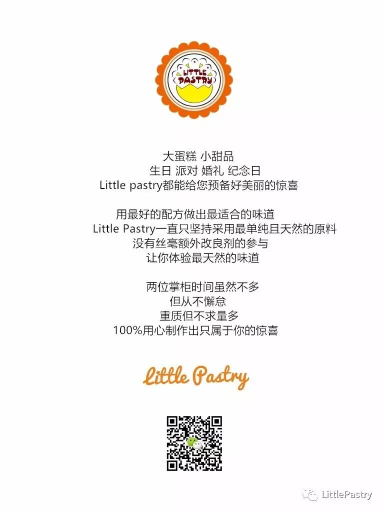 (原始链接: http://mmbiz.qpic.cn/mmbiz_jpg/KHSXL6Rd7BslXKKFF8eicUXvQHxdUKwFXrEj2f2aa0IibPL09biabfOx3oCLysAY6ZawmWgrBakX0I8GXO6bjYTdA/0?wx_fmt=jpeg)
- 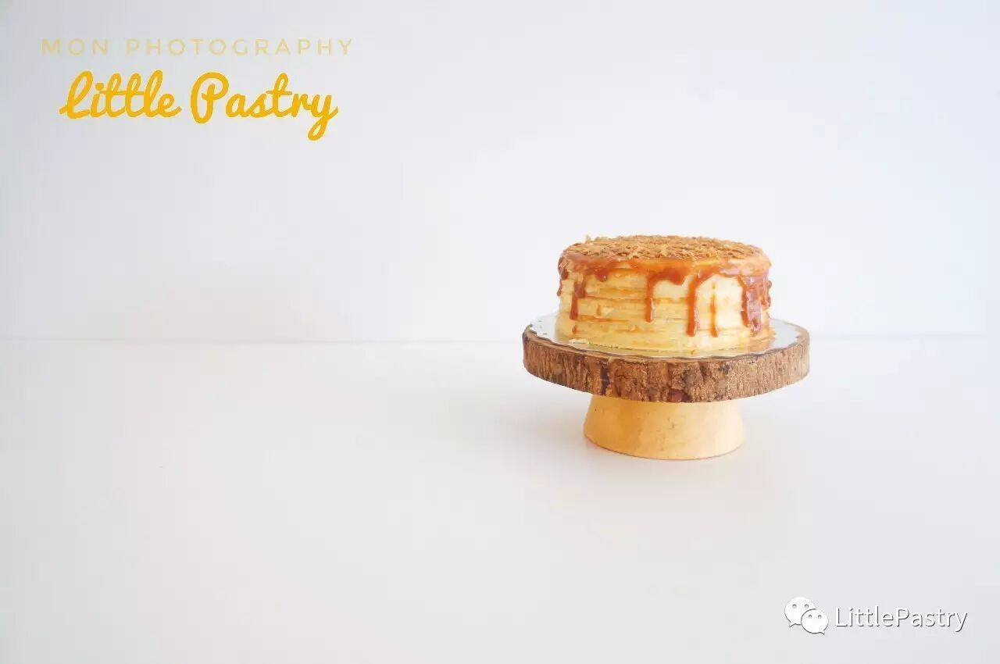 (原始链接: http://mmbiz.qpic.cn/mmbiz_jpg/KHSXL6Rd7BslXKKFF8eicUXvQHxdUKwFXKIqYMrcrRIHzaQW464I1CzSKV3ibAZYzY6Vh9YylSFPUzao6zTXeTwA/0?wx_fmt=jpeg)
- 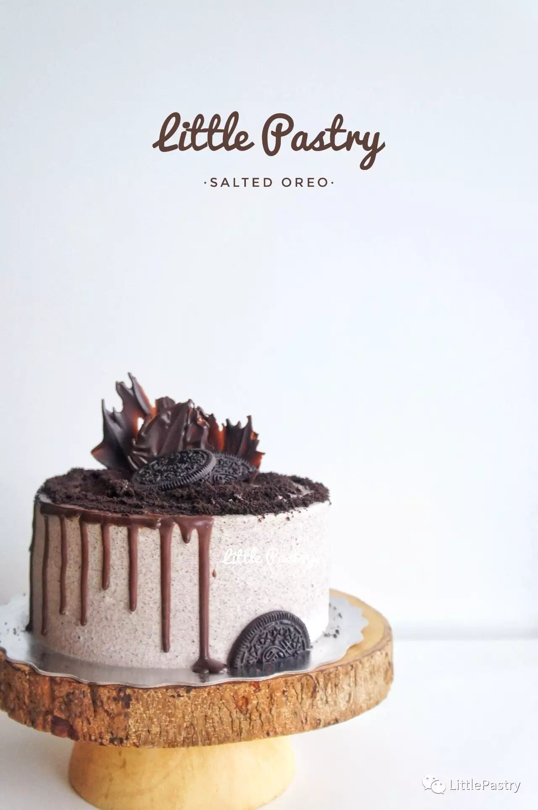 (原始链接: http://mmbiz.qpic.cn/mmbiz_jpg/KHSXL6Rd7Bt0jwoxKVYtLiabOcjoAYJiabeZGicHKZSKibEd6icdOZCQDwDwNdqE4pocNd8tABia7k7mia5EuMAp9xRyg/0?wx_fmt=jpeg)
- 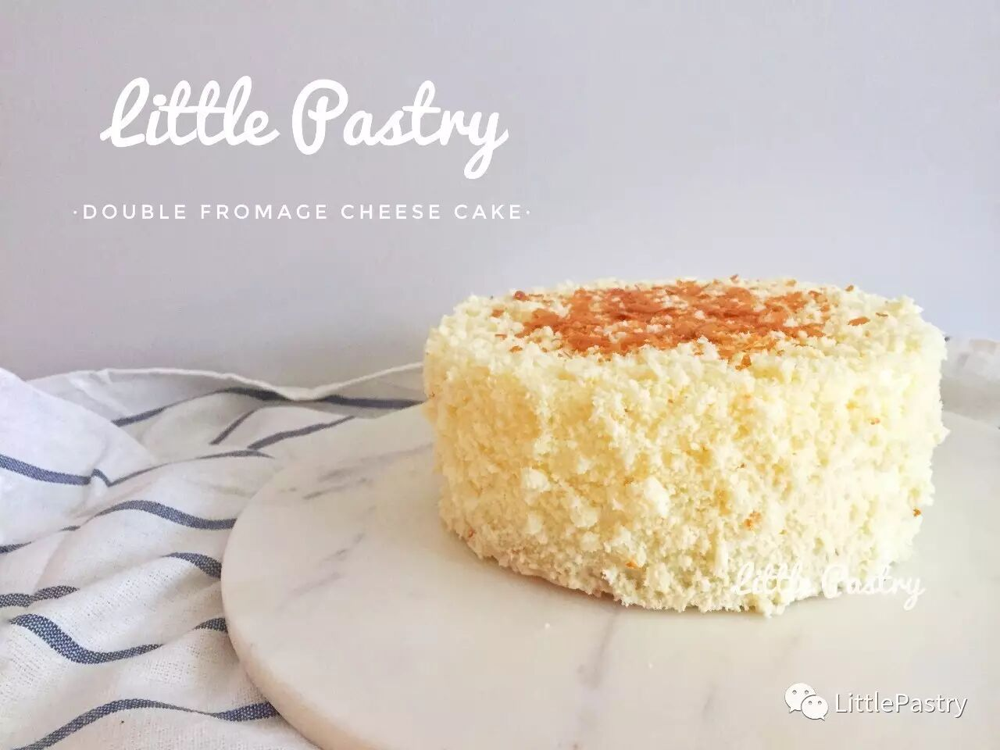 (原始链接: http://mmbiz.qpic.cn/mmbiz_jpg/KHSXL6Rd7Bt0jwoxKVYtLiabOcjoAYJiabQJ9naEtC3kxVXoUXeL0Mou6zWOia7QKaKzsZQDV3W3Yia58K6BibXGnYg/0?wx_fmt=jpeg)
- 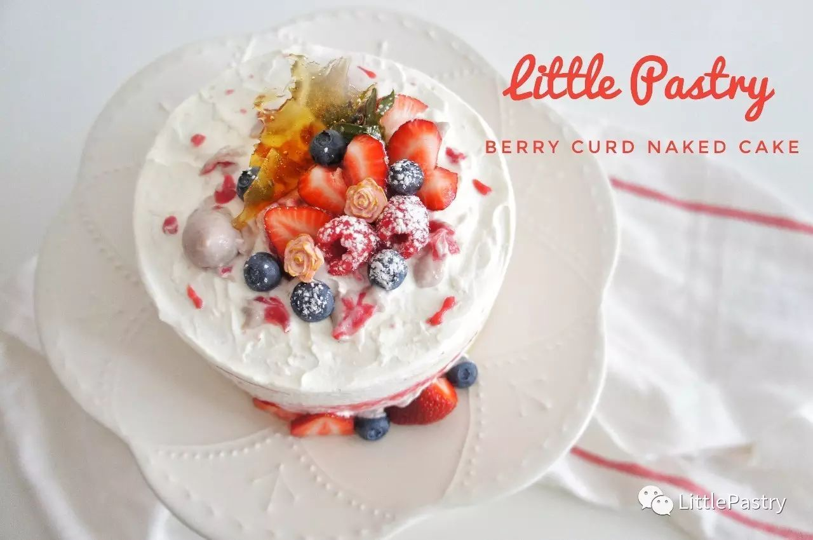 (原始链接: http://mmbiz.qpic.cn/mmbiz_jpg/KHSXL6Rd7BslXKKFF8eicUXvQHxdUKwFXf3aibqXECd0a3CH70qd46Db6heE1TYP1GerdSt0v8SImSEDkZuKS47w/0?wx_fmt=jpeg)
- 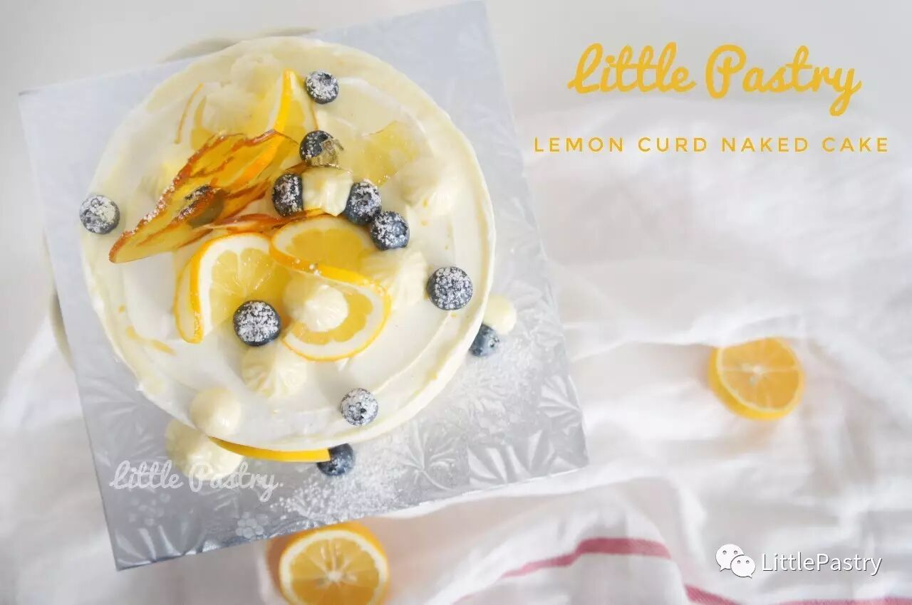 (原始链接: http://mmbiz.qpic.cn/mmbiz_jpg/KHSXL6Rd7BslXKKFF8eicUXvQHxdUKwFXlpicau7VYNQ6BKWKQNjT5FB1KxBImk2KZmGwdZy6Zf8enPZOby8MdpQ/0?wx_fmt=jpeg)
- 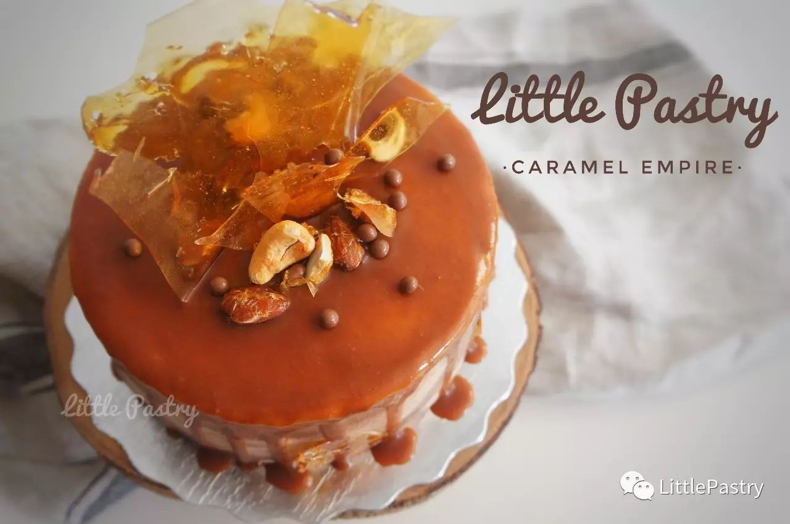 (原始链接: http://mmbiz.qpic.cn/mmbiz_jpg/KHSXL6Rd7Bt0jwoxKVYtLiabOcjoAYJiab3Fnzmj2JNsc0TZTfHwWs6KZOILMFjptTVnmYgd2zrdiccMTYDiaVibQhQ/0?wx_fmt=jpeg)
- 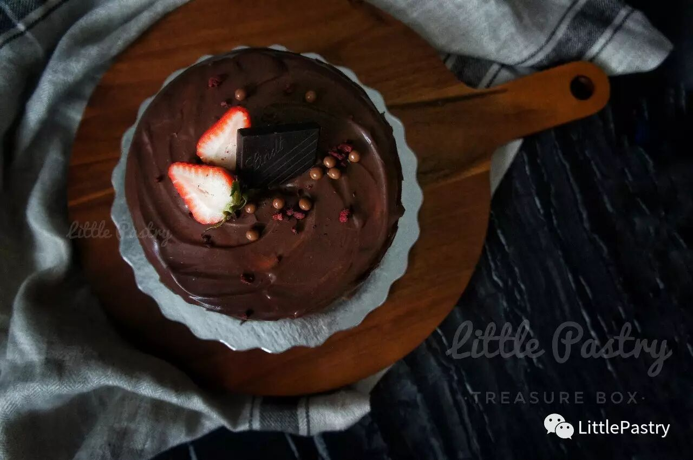 (原始链接: http://mmbiz.qpic.cn/mmbiz_jpg/KHSXL6Rd7Bt0jwoxKVYtLiabOcjoAYJiab6yvkkXKkCbyhPTeTEvTep5DENEmrF6HgOYLFuyktdjdIhcq7qfpbag/0?wx_fmt=jpeg)
- 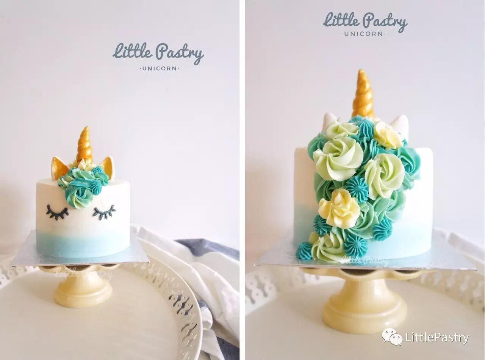 (原始链接: http://mmbiz.qpic.cn/mmbiz_jpg/KHSXL6Rd7BslXKKFF8eicUXvQHxdUKwFXwv8mC6mbfqmz1gHsuSYHw4zO3lJHiaOiaLWpj497rqeyEzPHmMIsALEg/0?wx_fmt=jpeg)
- 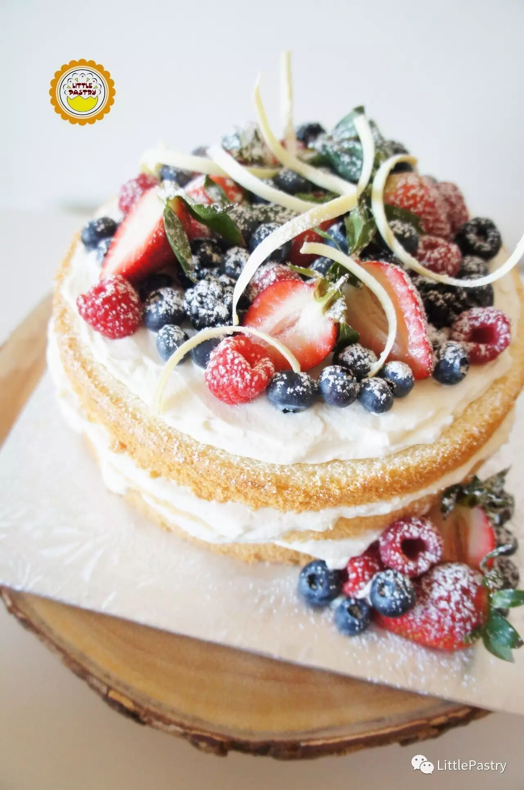 (原始链接: http://mmbiz.qpic.cn/mmbiz_jpg/KHSXL6Rd7BslXKKFF8eicUXvQHxdUKwFXib6JcrQ4FVLIHhNjSdApkwtibSJX0EfmJp1C6bKBR3ZY16jr9hKXIIMw/0?wx_fmt=jpeg)
- 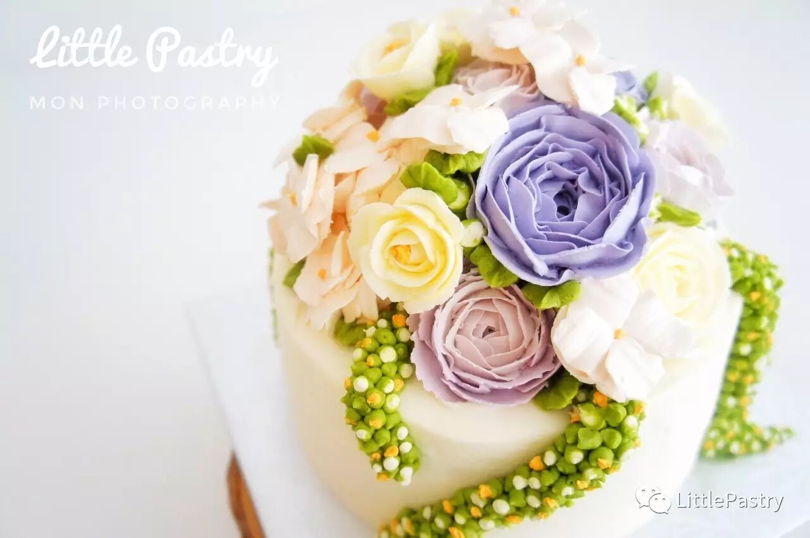 (原始链接: http://mmbiz.qpic.cn/mmbiz_jpg/KHSXL6Rd7BslXKKFF8eicUXvQHxdUKwFXDBibibQOaGmD4O31Rd1rFsYzuoMBW0Qz5ZXJia5Ge62n6VvCUicAjZ8PJw/0?wx_fmt=jpeg)
- 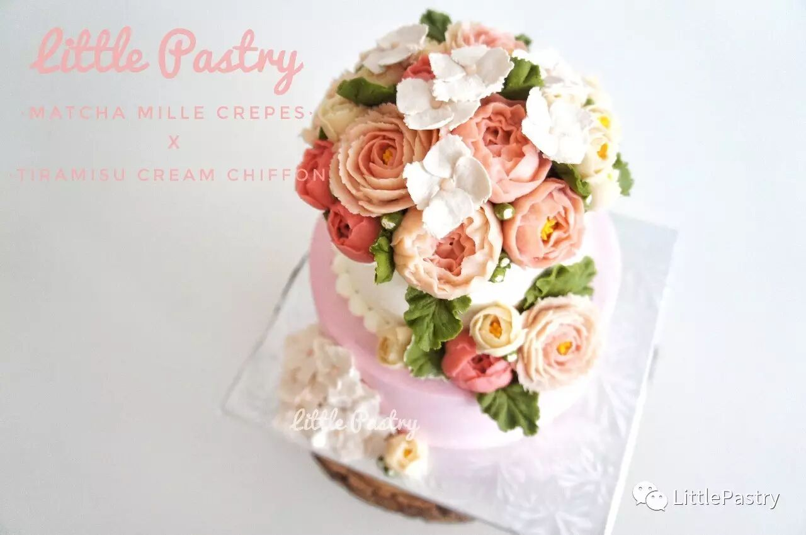 (原始链接: http://mmbiz.qpic.cn/mmbiz_jpg/KHSXL6Rd7BslXKKFF8eicUXvQHxdUKwFXDWEWvX2ibntHT0jvlzkg03Tz95RzGHu73XMFFfR3jubV6sR1Dia6bYyw/0?wx_fmt=jpeg)
- 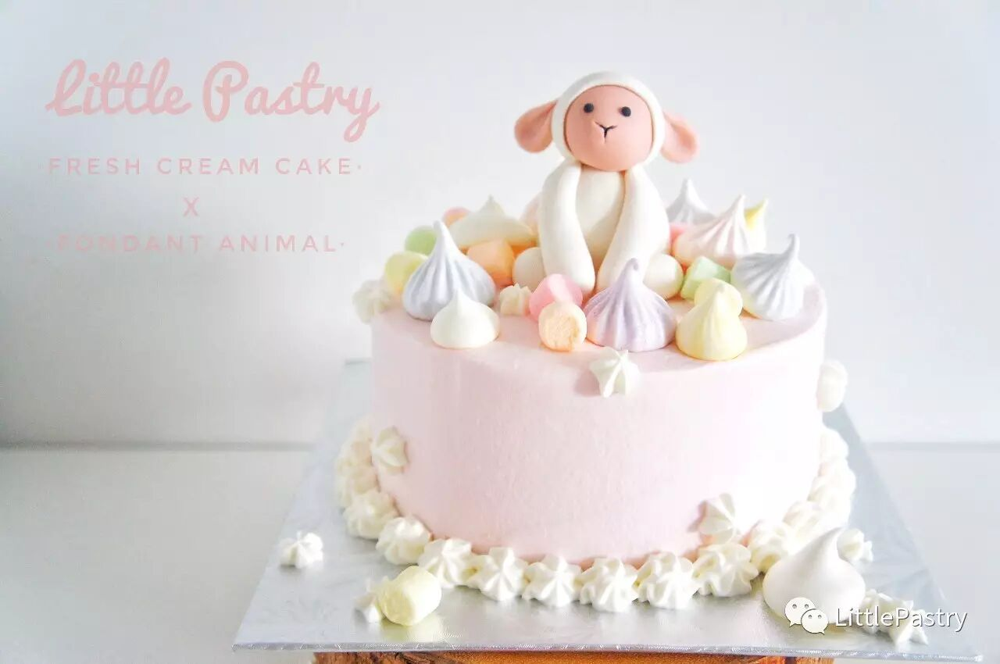 (原始链接: http://mmbiz.qpic.cn/mmbiz_jpg/KHSXL6Rd7BslXKKFF8eicUXvQHxdUKwFXZZgptTGAIKKXiaMiaLCLu9FhiaOTdtMeHqpf91XUwgDKywUSwCNd7HZxA/0?wx_fmt=jpeg)
- 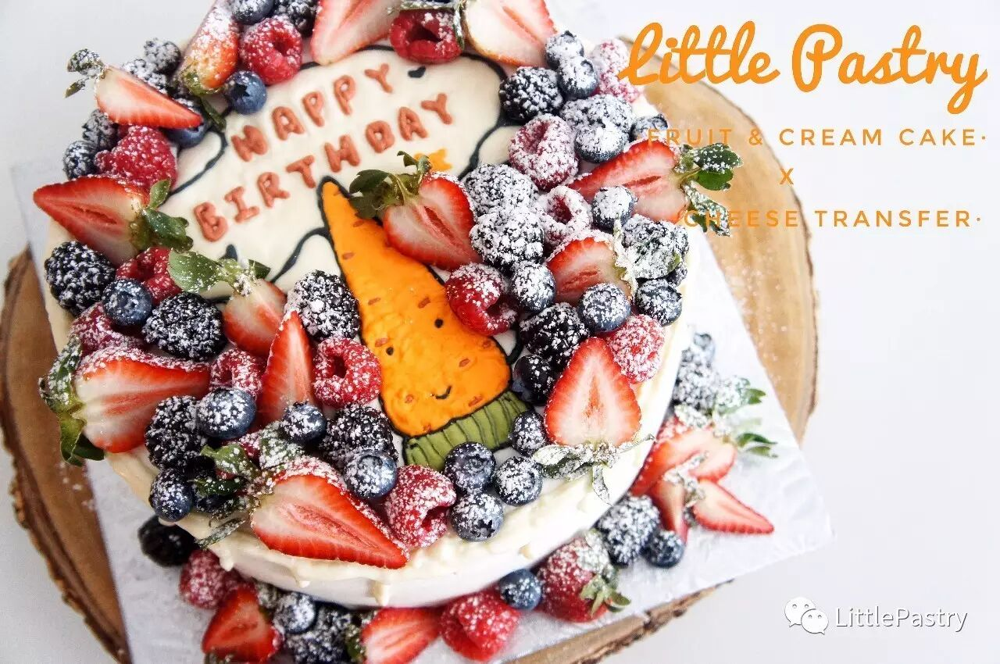 (原始链接: http://mmbiz.qpic.cn/mmbiz_jpg/KHSXL6Rd7BtbMwG2RSYY2HY7sJOPbj1NI7wpXia6cgJvuaSBdGza2xrNvK52iaJjj6xsuhxUw6an4113j1ibN0SOA/0?wx_fmt=jpeg)
- 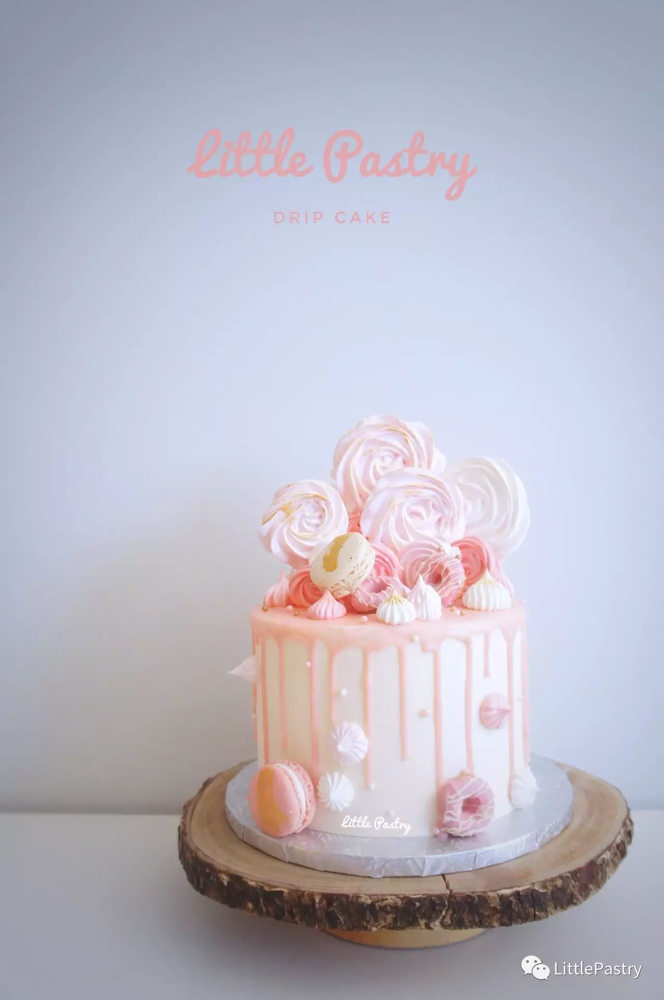 (原始链接: http://mmbiz.qpic.cn/mmbiz_jpg/KHSXL6Rd7BsKjA6m8T9sn3xbOI528aymVuuNLGS54twFrTsCWHHia0xfUNicfPqEOLbicHvO1RoNib1Mz1yZ0PDN6Q/0?wx_fmt=jpeg)
- 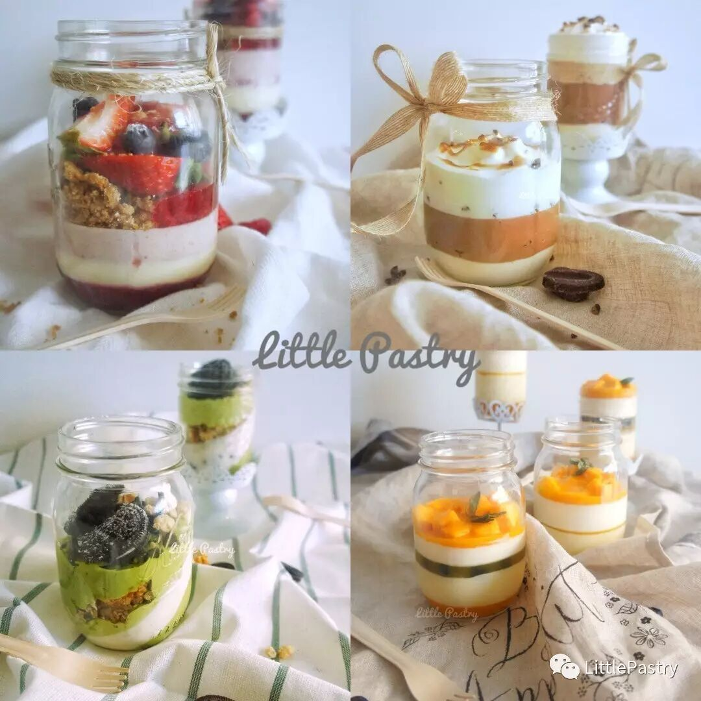 (原始链接: http://mmbiz.qpic.cn/mmbiz_jpg/KHSXL6Rd7BsKjA6m8T9sn3xbOI528aymiaX7GsCtV6zibHwaFSyxA9aiaKbfTibGwicbJ8vmFyDteyLSwCtXBkySySQ/0?wx_fmt=jpeg)
- 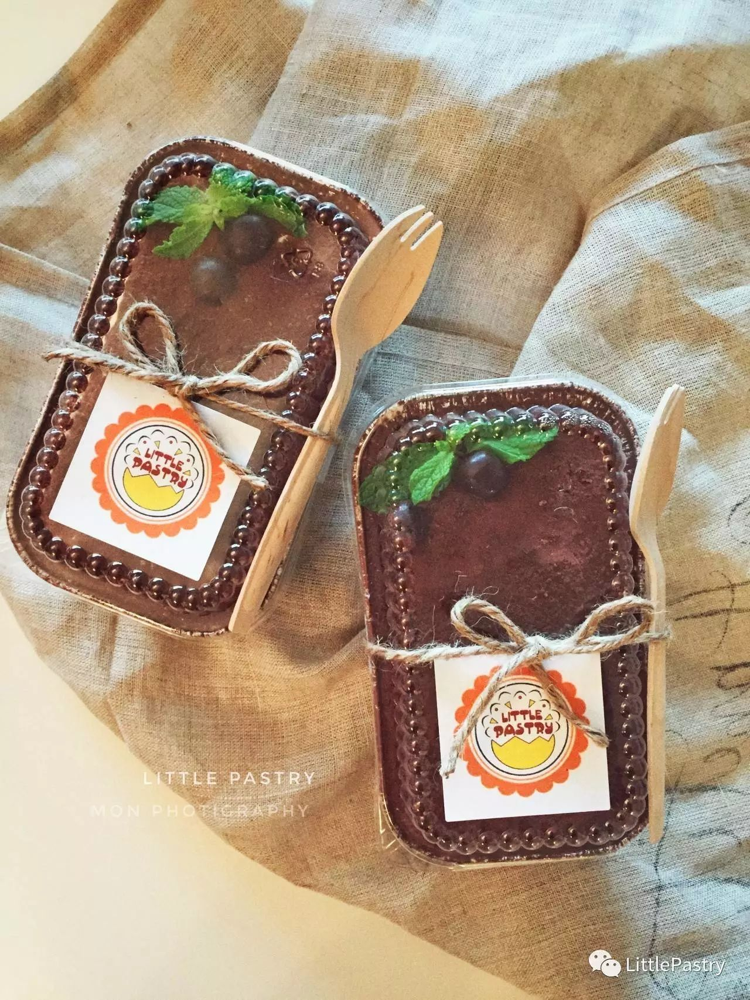 (原始链接: http://mmbiz.qpic.cn/mmbiz_jpg/KHSXL6Rd7BtbMwG2RSYY2HY7sJOPbj1NqkVhd64bEjQ9ficg49b1Xaq0nR5ZdeQcTahWkwCopic6ibBeysibZaTiclw/0?wx_fmt=jpeg)
- 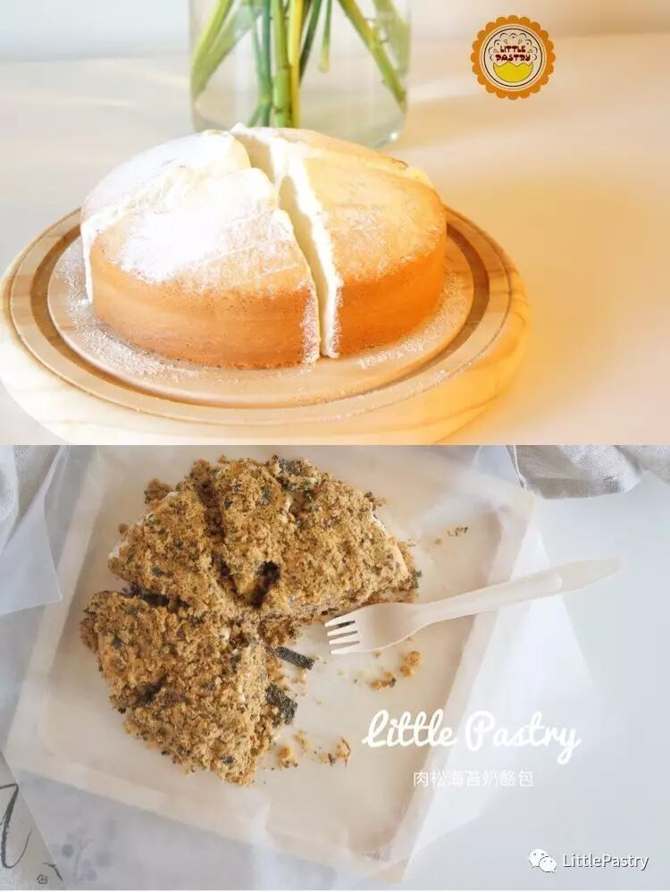 (原始链接: http://mmbiz.qpic.cn/mmbiz_jpg/KHSXL6Rd7BsczoPOI7WFXCqf9m8fibNJonk5lBhexicXia3f1ibydrSE4dLuDO2c2sCfIIlmBemrwToLaibhRaCU5mg/0?wx_fmt=jpeg)
- 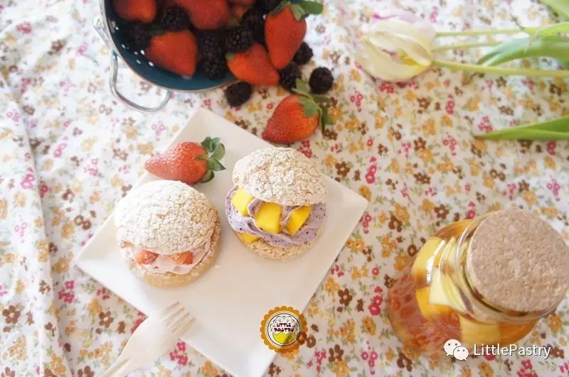 (原始链接: http://mmbiz.qpic.cn/mmbiz_jpg/KHSXL6Rd7BtbMwG2RSYY2HY7sJOPbj1N3PQ2E1SO0FN5X5eSEovI5J1oW7oVia7mKO5DzuL9en1rFR5gw7uN1TA/0?wx_fmt=jpeg)
- 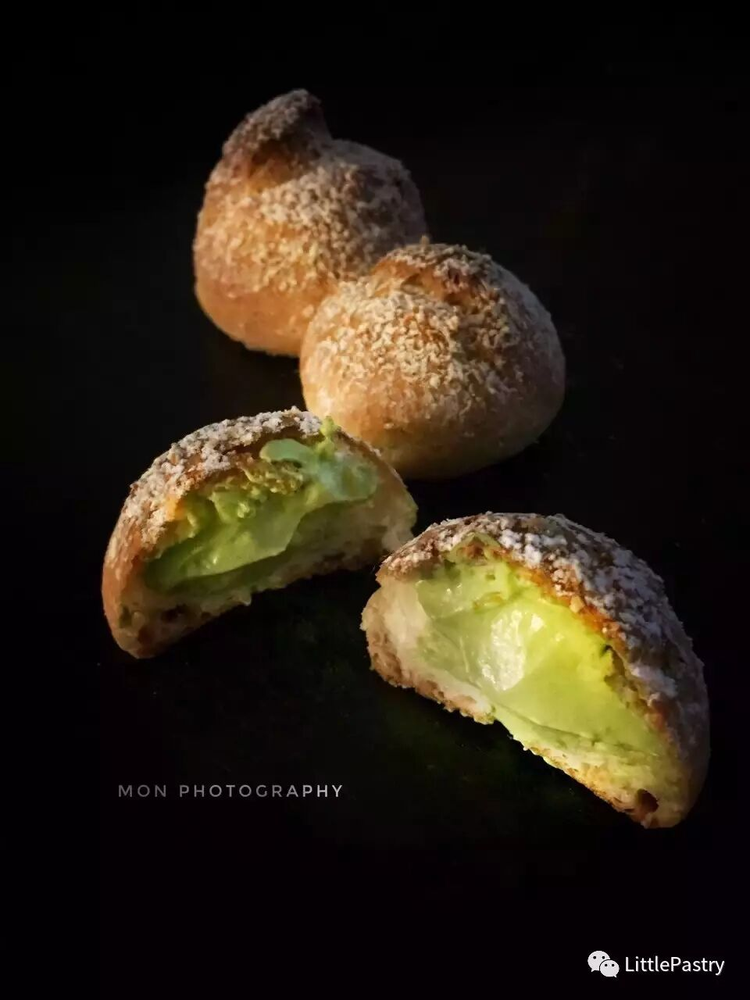 (原始链接: http://mmbiz.qpic.cn/mmbiz_jpg/KHSXL6Rd7BtbMwG2RSYY2HY7sJOPbj1NAbpuGW30u6NOTXT0lelrHKUCfgCq3pEUxhkw0WrQrkdxswStkvCE3g/0?wx_fmt=jpeg)
- 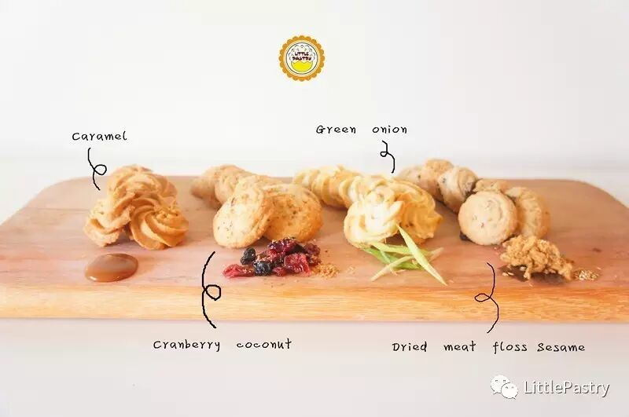 (原始链接: http://mmbiz.qpic.cn/mmbiz_jpg/KHSXL6Rd7BtbMwG2RSYY2HY7sJOPbj1Nm4mibC44ia6BiarbWxtibsluiciayticpd5uhHJ4sgGbj6zkeIpPticdy0RZjA/0?wx_fmt=jpeg)
- 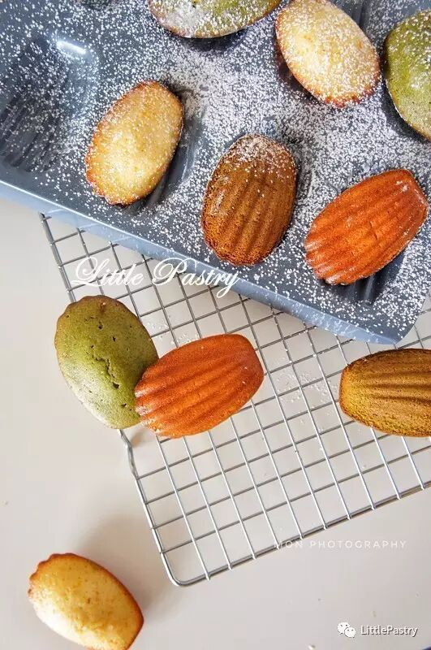 (原始链接: http://mmbiz.qpic.cn/mmbiz_jpg/KHSXL6Rd7BtbMwG2RSYY2HY7sJOPbj1NiaAziaR2LSN2XV94lugIecTt1vYicU83n7qdVibI7GfHib0AoWWSPJD8ROg/0?wx_fmt=jpeg)
- 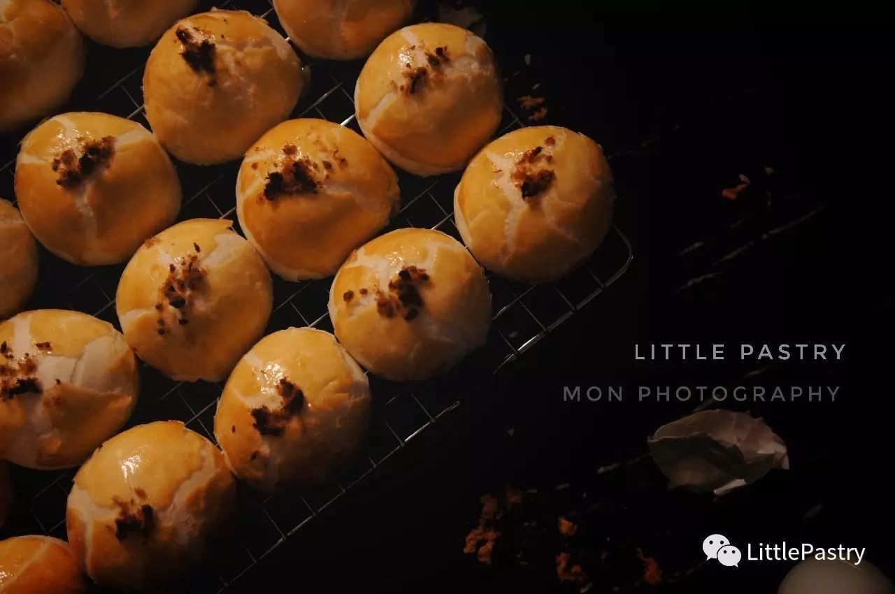 (原始链接: http://mmbiz.qpic.cn/mmbiz_jpg/KHSXL6Rd7BtbMwG2RSYY2HY7sJOPbj1N8a7TSAZyibH8icRI8Vag1Dh2XjJWBlX0S3aA9QCyksYYhL4Pgibl1BoYQ/0?wx_fmt=jpeg)
- 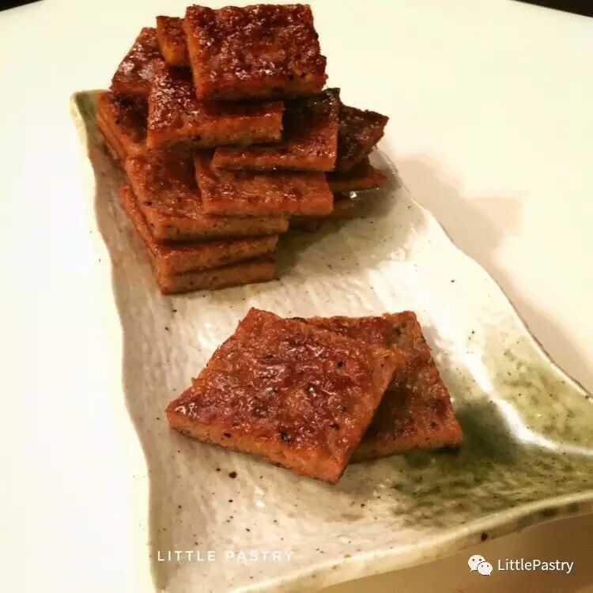 (原始链接: http://mmbiz.qpic.cn/mmbiz_jpg/KHSXL6Rd7BtbMwG2RSYY2HY7sJOPbj1NWicSJONKxkUZRPX4KpTwiblJAOeCicKoxDS2BCcc76PgDTyGKc31jhkKg/0?wx_fmt=jpeg)
