# 无标题

**链接地址:** http://mp.weixin.qq.com/s?__biz=MzI0MDQ0ODI0Ng==&mid=2247485216&idx=1&sn=0aa95185374b5df2b5f7c8293d427207&chksm=e91be0b9de6c69af063f473a9c567884bd01e295eb6937d19d8949820e0195d2445c7764a7b8&mpshare=1&scene=2&srcid=1003NcbE3W10qkMubXK3tbse#rd
**作者:** 爱吃
**获取时间:** 2025/8/28 22:26:32
**图片数量:** 52

---

## 原始HTML内容

<section style="background-color: rgb(255, 255, 255);box-sizing: border-box;"><section class="Powered-by-XIUMI V5" style="box-sizing: border-box;" powered-by="xiumi.us"><section class="" style="box-sizing: border-box;"><section class="" style="font-size: 12px;line-height: 2;letter-spacing: 1.5px;box-sizing: border-box;">
 

 

自从开了自动回复以后 发现好多小伙伴都在后台回复“中餐” 但是之前的分类比较多的是“泰餐”、“韩餐”、“甜品”等类的 于是 觉得是时候给屯里的中餐们来个分类大集合了！ 这一定是你在别的地方都没有见过的 史上最全的 爱屯中餐分类集锦 跟着它吃 妈妈再也不用担心我在屯里吃不到中餐了 此篇为上篇 主要是北方菜、川菜、湘菜、火锅和麻辣烫 &nbsp;下周还会有下篇哦
</section></section></section><section class="Powered-by-XIUMI V5" style="box-sizing: border-box;" powered-by="xiumi.us"><section class="" style="text-align: center;margin-top: 10px;margin-bottom: 10px;box-sizing: border-box;"></section></section><section class="Powered-by-XIUMI V5" style="box-sizing: border-box;" powered-by="xiumi.us"><section class="" style="box-sizing: border-box;"><section class="" style="box-sizing: border-box;">
 
</section></section></section><section class="Powered-by-XIUMI V5" style="box-sizing: border-box;" powered-by="xiumi.us"><section class="" style="margin-top: 10px;margin-bottom: 10px;text-align: center;box-sizing: border-box;"><section class="" style="background-color: rgb(249, 110, 87);color: rgb(255, 255, 255);padding-left: 8px;text-align: left;box-sizing: border-box;">
北方菜
</section><section class="" style="width: 15px;height: 15px;margin-top: -15px;margin-left: auto;box-sizing: border-box;"><section style="box-sizing: border-box;"><section style="width: 5px;height: 5px;float: left;background-color: rgb(249, 110, 87);box-sizing: border-box;"></section><section style="width: 5px;height: 5px;float: left;background-color: rgb(249, 110, 87);box-sizing: border-box;"></section><section style="width: 5px;height: 5px;float: left;background-color: rgb(254, 255, 255);box-sizing: border-box;"></section><section style="clear: both;box-sizing: border-box;"></section></section><section style="box-sizing: border-box;"><section style="width: 5px;height: 5px;float: left;background-color: rgb(249, 110, 87);box-sizing: border-box;"></section><section style="width: 5px;height: 5px;float: left;background-color: rgb(254, 255, 255);box-sizing: border-box;"></section><section style="width: 5px;height: 5px;float: left;background-color: rgb(249, 110, 87);box-sizing: border-box;"></section><section style="clear: both;box-sizing: border-box;"></section></section><section style="box-sizing: border-box;"><section style="width: 5px;height: 5px;float: left;background-color: rgb(254, 255, 255);box-sizing: border-box;"></section><section style="width: 5px;height: 5px;float: left;background-color: rgb(249, 110, 87);box-sizing: border-box;"></section><section style="width: 5px;height: 5px;float: left;background-color: rgb(254, 255, 255);box-sizing: border-box;"></section><section style="clear: both;box-sizing: border-box;"></section></section></section></section></section><section class="Powered-by-XIUMI V5" style="box-sizing: border-box;" powered-by="xiumi.us"><section class="" style="box-sizing: border-box;"><section class="" style="box-sizing: border-box;">
 
</section></section></section><section class="Powered-by-XIUMI V5" style="box-sizing: border-box;" powered-by="xiumi.us"><section class="" style="margin-top: 10px;margin-bottom: 10px;text-align: center;box-sizing: border-box;"><section class="" style="display: inline-block;vertical-align: middle;color: rgb(180, 160, 67);font-size: 14px;box-sizing: border-box;">
<strong style="box-sizing: border-box;">绿茶餐厅</strong>
</section><section class="" style="display: inline-block;vertical-align: top;box-sizing: border-box;"><section style="display: inline-block;vertical-align: middle;width: 0px;border-left: 1em solid rgb(255, 255, 255);transform: rotate(0deg);-webkit-transform: rotate(0deg);-moz-transform: rotate(0deg);-o-transform: rotate(0deg);border-top: 0.6em solid transparent !important;border-bottom: 0.6em solid transparent !important;box-sizing: border-box;"></section><section style="display: inline-block;vertical-align: middle;margin-left: -0.8em;width: 1.5em;height: 1.5em;border-radius: 50%;background-color: rgb(249, 110, 87);box-sizing: border-box;"></section></section></section></section><section class="Powered-by-XIUMI V5" style="box-sizing: border-box;" powered-by="xiumi.us"><section class="" style="box-sizing: border-box;"><section class="" style="font-size: 12px;line-height: 2.3;letter-spacing: 1.3px;box-sizing: border-box;">
绿茶餐厅在去年开业以来 就受朋友圈的各种好评 刚开业的时候大家都闻风而去 实在是火爆 后来等到没有那么人多不需要排队的时候小编去吃过几次 每次都觉得是真真儿的北方味道 铁锅炖鱼贴饼子绝对是必点 鱼很入味也没有腥味 鱼是活鱼 缺点就是刺太多了 饼子是玉米面饼子 越嚼越香 肘子也很好吃 入味并且够软 分量也不少&nbsp; 
</section></section></section><section class="Powered-by-XIUMI V5" style="box-sizing: border-box;" powered-by="xiumi.us"><section class="" style="text-align: center;margin-top: 10px;margin-bottom: 10px;box-sizing: border-box;"></section></section><section class="Powered-by-XIUMI V5" style="box-sizing: border-box;" powered-by="xiumi.us"><section class="" style="box-sizing: border-box;"><section class="" style="box-sizing: border-box;">
 
</section></section></section><section class="Powered-by-XIUMI V5" style="box-sizing: border-box;" powered-by="xiumi.us"><section class="" style="text-align: center;margin-top: 10px;margin-bottom: 10px;box-sizing: border-box;"></section></section><section class="Powered-by-XIUMI V5" style="box-sizing: border-box;" powered-by="xiumi.us"><section class="" style="box-sizing: border-box;"><section class="" style="box-sizing: border-box;">
 
</section></section></section><section class="Powered-by-XIUMI V5" style="box-sizing: border-box;" powered-by="xiumi.us"><section class="" style="text-align: center;margin-top: 10px;margin-bottom: 10px;box-sizing: border-box;"></section></section><section class="Powered-by-XIUMI V5" style="box-sizing: border-box;" powered-by="xiumi.us"><section class="" style="box-sizing: border-box;"><section class="" style="font-size: 12px;line-height: 2.3;letter-spacing: 1.3px;box-sizing: border-box;">
🔗：<a href="http://mp.weixin.qq.com/s?__biz=MzI0MDQ0ODI0Ng==&amp;mid=2247484204&amp;idx=1&amp;sn=08696373adcea3cbdb41adf9ff55d903&amp;chksm=e91be4b5de6c6da3d092e80ece89b5fc28248f950a510e5e62110d0bfd1968f92c63a0741c6a&amp;scene=21#wechat_redirect" target="_blank">屯屯里活捉一家东北菜馆儿 - 绿茶餐厅</a> 

地址：17304 105 Ave, NW, Edmonton

时间：Everyday 11:00-22:00

电话：780-481-2299

 
</section></section></section><section class="Powered-by-XIUMI V5" style="box-sizing: border-box;" powered-by="xiumi.us"><section class="" style="margin-top: 10px;margin-bottom: 10px;text-align: center;box-sizing: border-box;"><section class="" style="display: inline-block;vertical-align: top;box-sizing: border-box;"><section style="display: inline-block;vertical-align: middle;width: 1.5em;height: 1.5em;border-radius: 50%;background-color: rgb(249, 110, 87);box-sizing: border-box;"></section><section style="display: inline-block;vertical-align: middle;margin-left: -0.8em;width: 0px;border-right: 1em solid rgb(255, 255, 255);border-top: 0.6em solid transparent !important;border-bottom: 0.6em solid transparent !important;box-sizing: border-box;"></section></section><section class="" style="display: inline-block;vertical-align: middle;color: rgb(180, 160, 67);font-size: 14px;box-sizing: border-box;">
<strong style="box-sizing: border-box;">惠子云吞</strong>
</section></section></section><section class="Powered-by-XIUMI V5" style="box-sizing: border-box;" powered-by="xiumi.us"><section class="" style="box-sizing: border-box;"><section class="" style="font-size: 12px;line-height: 2.3;letter-spacing: 1.3px;box-sizing: border-box;">
可以说是屯里最早的东北菜了 老板是实实在在的东北人 东北烩菜是必点 肉炖的很烂很软 味道也足够 是很正宗的北方烩菜味道 云吞的馅够大 汤底虽然鲜香但是少了点浓厚 并且 上的一碟辣椒油 虽然没有很辣 但是 是真的好香 现在惠子云吞在南边也开店了 所以再也不用为了吃一顿饭跑到Sherwood Park啦 
</section></section></section><section class="Powered-by-XIUMI V5" style="box-sizing: border-box;" powered-by="xiumi.us"><section class="" style="text-align: center;margin-top: 10px;margin-bottom: 10px;box-sizing: border-box;"></section></section><section class="Powered-by-XIUMI V5" style="box-sizing: border-box;" powered-by="xiumi.us"><section class="" style="box-sizing: border-box;"><section class="" style="box-sizing: border-box;">
 
</section></section></section><section class="Powered-by-XIUMI V5" style="box-sizing: border-box;" powered-by="xiumi.us"><section class="" style="text-align: center;margin-top: 10px;margin-bottom: 10px;box-sizing: border-box;"></section></section><section class="Powered-by-XIUMI V5" style="box-sizing: border-box;" powered-by="xiumi.us"><section class="" style="box-sizing: border-box;"><section class="" style="font-size: 12px;line-height: 2.3;letter-spacing: 1.3px;box-sizing: border-box;">
 

地址：130 Broadway Blvd #100, Sherwood Park, AB

&nbsp; &nbsp; &nbsp; &nbsp; &nbsp;3338 Parsons Rd NW, Edmonton

时间：Mon-Thu 11:00-14:30, 16:00-21:00

&nbsp; &nbsp; &nbsp; &nbsp; &nbsp;Fri-Sat 11:00-21:00

&nbsp; &nbsp; &nbsp; &nbsp; &nbsp;Sun 16:00-21:00

电话：780-449-3688

 
</section></section></section><section class="Powered-by-XIUMI V5" style="box-sizing: border-box;" powered-by="xiumi.us"><section class="" style="margin-top: 10px;margin-bottom: 10px;text-align: center;box-sizing: border-box;"><section class="" style="display: inline-block;vertical-align: middle;color: rgb(180, 160, 67);line-height: 1.6;font-size: 14px;box-sizing: border-box;">
<strong style="box-sizing: border-box;">北平饭店</strong>
</section><section class="" style="display: inline-block;vertical-align: top;box-sizing: border-box;"><section style="display: inline-block;vertical-align: middle;width: 0px;border-left: 1em solid rgb(255, 255, 255);transform: rotate(0deg);-webkit-transform: rotate(0deg);-moz-transform: rotate(0deg);-o-transform: rotate(0deg);border-top: 0.6em solid transparent !important;border-bottom: 0.6em solid transparent !important;box-sizing: border-box;"></section><section style="display: inline-block;vertical-align: middle;margin-left: -0.8em;width: 1.5em;height: 1.5em;border-radius: 50%;background-color: rgb(249, 110, 87);box-sizing: border-box;"></section></section></section></section><section class="Powered-by-XIUMI V5" style="box-sizing: border-box;" powered-by="xiumi.us"><section class="" style="box-sizing: border-box;"><section class="" style="font-size: 12px;line-height: 2.3;letter-spacing: 1.3px;box-sizing: border-box;">
离大学最近的餐馆 相信很多人来吃的第一家餐厅就是北平 养育了多少Windsor的同学呀 刀削面和手撕包菜都是点的最多的菜 分量很大 并且 他家有北京烤鸭哦 最近他家还新上了牛蛙系列 可以尝一尝 
</section></section></section><section class="Powered-by-XIUMI V5" style="box-sizing: border-box;" powered-by="xiumi.us"><section class="" style="text-align: center;margin-top: 10px;margin-bottom: 10px;box-sizing: border-box;"></section></section><section class="Powered-by-XIUMI V5" style="box-sizing: border-box;" powered-by="xiumi.us"><section class="" style="box-sizing: border-box;"><section class="" style="box-sizing: border-box;">
 
</section></section></section><section class="Powered-by-XIUMI V5" style="box-sizing: border-box;" powered-by="xiumi.us"><section class="" style="text-align: center;margin-top: 10px;margin-bottom: 10px;box-sizing: border-box;"></section></section><section class="Powered-by-XIUMI V5" style="box-sizing: border-box;" powered-by="xiumi.us"><section class="" style="box-sizing: border-box;"><section class="" style="box-sizing: border-box;">
 
</section></section></section><section class="Powered-by-XIUMI V5" style="box-sizing: border-box;" powered-by="xiumi.us"><section class="" style="text-align: center;margin-top: 10px;margin-bottom: 10px;box-sizing: border-box;"></section></section><section class="Powered-by-XIUMI V5" style="box-sizing: border-box;" powered-by="xiumi.us"><section class="" style="box-sizing: border-box;"><section class="" style="font-size: 12px;line-height: 2.3;letter-spacing: 1.3px;box-sizing: border-box;">
 

地址：11044 82 Ave, NW, Edmonton

时间：Mon-Fri 11:30-22:30

&nbsp; &nbsp; &nbsp; &nbsp; &nbsp;Sat-Sun 16:30-22:30

电话：780-433-8494

（爱吃上可以点单哦）

 
</section></section></section><section class="Powered-by-XIUMI V5" style="box-sizing: border-box;" powered-by="xiumi.us"><section class="" style="margin-top: 10px;margin-bottom: 10px;text-align: center;box-sizing: border-box;"><section class="" style="display: inline-block;vertical-align: top;box-sizing: border-box;"><section style="display: inline-block;vertical-align: middle;width: 1.5em;height: 1.5em;border-radius: 50%;background-color: rgb(249, 110, 87);box-sizing: border-box;"></section><section style="display: inline-block;vertical-align: middle;margin-left: -0.8em;width: 0px;border-right: 1em solid rgb(255, 255, 255);border-top: 0.6em solid transparent !important;border-bottom: 0.6em solid transparent !important;box-sizing: border-box;"></section></section><section class="" style="display: inline-block;vertical-align: middle;color: rgb(180, 160, 67);font-size: 14px;box-sizing: border-box;">
<strong style="box-sizing: border-box;">北方夜 四季如春</strong>
</section></section></section><section class="Powered-by-XIUMI V5" style="box-sizing: border-box;" powered-by="xiumi.us"><section class="" style="box-sizing: border-box;"><section class="" style="font-size: 12px;line-height: 2.3;letter-spacing: 1.3px;box-sizing: border-box;">
以烩面最为出名的新新餐馆 菜单很有意思 什么“热血在沸腾” 、”二师兄的玉手“、”红灯区的鸡“之类的 必点菜一定是烩面 河南人吃了都说好 养生肘子也不错 锅烧脆皮肘褒贬不一 有人觉得很好吃 外焦里嫩 但也有人觉得肉不够味 面太多了 讲究咸鱼淡肉喜欢淡口儿的一定会喜欢这款&nbsp; 
</section></section></section><section class="Powered-by-XIUMI V5" style="box-sizing: border-box;" powered-by="xiumi.us"><section class="" style="text-align: center;margin-top: 10px;margin-bottom: 10px;box-sizing: border-box;"></section></section><section class="Powered-by-XIUMI V5" style="box-sizing: border-box;" powered-by="xiumi.us"><section class="" style="box-sizing: border-box;"><section class="" style="box-sizing: border-box;">
 
</section></section></section><section class="Powered-by-XIUMI V5" style="box-sizing: border-box;" powered-by="xiumi.us"><section class="" style="text-align: center;margin-top: 10px;margin-bottom: 10px;box-sizing: border-box;"></section></section><section class="Powered-by-XIUMI V5" style="box-sizing: border-box;" powered-by="xiumi.us"><section class="" style="box-sizing: border-box;"><section class="" style="box-sizing: border-box;">
 
</section></section></section><section class="Powered-by-XIUMI V5" style="box-sizing: border-box;" powered-by="xiumi.us"><section class="" style="text-align: center;margin-top: 10px;margin-bottom: 10px;box-sizing: border-box;"></section></section><section class="Powered-by-XIUMI V5" style="box-sizing: border-box;" powered-by="xiumi.us"><section class="" style="box-sizing: border-box;"><section class="" style="font-size: 12px;line-height: 2.3;letter-spacing: 1.3px;box-sizing: border-box;">
 

地址：6004 104 St, NW, Edmonton

时间：Sun-Thu 11:30-22:00

&nbsp; &nbsp; &nbsp; &nbsp; &nbsp; &nbsp;Fri-Sat 11:30-23:00

电话：780-439-6699

（爱吃上可以点单哦）

 
</section></section></section><section class="Powered-by-XIUMI V5" style="box-sizing: border-box;" powered-by="xiumi.us"><section class="" style="margin-top: 10px;margin-bottom: 10px;text-align: center;box-sizing: border-box;"><section class="" style="display: inline-block;vertical-align: middle;color: rgb(180, 160, 67);font-size: 14px;box-sizing: border-box;">
<strong style="box-sizing: border-box;">大秦面庄</strong>
</section><section class="" style="display: inline-block;vertical-align: top;box-sizing: border-box;"><section style="display: inline-block;vertical-align: middle;width: 0px;border-left: 1em solid rgb(255, 255, 255);transform: rotate(0deg);-webkit-transform: rotate(0deg);-moz-transform: rotate(0deg);-o-transform: rotate(0deg);border-top: 0.6em solid transparent !important;border-bottom: 0.6em solid transparent !important;box-sizing: border-box;"></section><section style="display: inline-block;vertical-align: middle;margin-left: -0.8em;width: 1.5em;height: 1.5em;border-radius: 50%;background-color: rgb(249, 110, 87);box-sizing: border-box;"></section></section></section></section><section class="Powered-by-XIUMI V5" style="box-sizing: border-box;" powered-by="xiumi.us"><section class="" style="box-sizing: border-box;"><section class="" style="font-size: 12px;line-height: 2.3;letter-spacing: 1.3px;box-sizing: border-box;">
屯子里的老住户们应该很不陌生了 每次到饭点儿的时候去都要排队 并且很任性 一周只有五天开门 并且八点半就早早关门了 大秦面庄当然是以面食为主 扯面、刀削面都很受欢迎 岐山臊子面点的最多 油泼扯面也很热门 面筋道有嚼劲 味道也很棒 酸汤水饺是我的最爱 但是不知道为什么 酸汤面就没有酸汤水饺那么味道浓 建议堂食 不然面会坨 
</section></section></section><section class="Powered-by-XIUMI V5" style="box-sizing: border-box;" powered-by="xiumi.us"><section class="" style="text-align: center;margin-top: 10px;margin-bottom: 10px;box-sizing: border-box;"></section></section><section class="Powered-by-XIUMI V5" style="box-sizing: border-box;" powered-by="xiumi.us"><section class="" style="box-sizing: border-box;"><section class="" style="box-sizing: border-box;">
 
</section></section></section><section class="Powered-by-XIUMI V5" style="box-sizing: border-box;" powered-by="xiumi.us"><section class="" style="text-align: center;margin-top: 10px;margin-bottom: 10px;box-sizing: border-box;"></section></section><section class="Powered-by-XIUMI V5" style="box-sizing: border-box;" powered-by="xiumi.us"><section class="" style="box-sizing: border-box;"><section class="" style="font-size: 12px;line-height: 2.3;letter-spacing: 1.3px;box-sizing: border-box;">
 

地址：3440 99 St, NW, Edmonton

时间：Mon-Tue Closed

&nbsp; &nbsp; &nbsp; &nbsp; &nbsp; &nbsp;Wed-Sun Noon-20:30

电话：780-439-8088

 
</section></section></section><section class="Powered-by-XIUMI V5" style="box-sizing: border-box;" powered-by="xiumi.us"><section class="" style="margin-top: 10px;margin-bottom: 10px;text-align: center;box-sizing: border-box;"><section class="" style="display: inline-block;vertical-align: top;box-sizing: border-box;"><section style="display: inline-block;vertical-align: middle;width: 1.5em;height: 1.5em;border-radius: 50%;background-color: rgb(249, 110, 87);box-sizing: border-box;"></section><section style="display: inline-block;vertical-align: middle;margin-left: -0.8em;width: 0px;border-right: 1em solid rgb(255, 255, 255);border-top: 0.6em solid transparent !important;border-bottom: 0.6em solid transparent !important;box-sizing: border-box;"></section></section><section class="" style="display: inline-block;vertical-align: middle;color: rgb(180, 160, 67);font-size: 14px;box-sizing: border-box;">
<strong style="box-sizing: border-box;">醉长安</strong>
</section></section></section><section class="Powered-by-XIUMI V5" style="box-sizing: border-box;" powered-by="xiumi.us"><section class="" style="box-sizing: border-box;"><section class="" style="font-size: 12px;line-height: 2.3;letter-spacing: 1.3px;box-sizing: border-box;">
自从今年开业以来 没有一天不火爆 以陕西菜为主 老板也是正宗陕西人 凉皮儿、新疆大盘鸡是必点 大盘鸡够味 配的裤带面也很有嚼劲 羊肉泡馍和南瓜粥也深受广大陕西人的喜爱&nbsp;
</section></section></section><section class="Powered-by-XIUMI V5" style="box-sizing: border-box;" powered-by="xiumi.us"><section class="" style="text-align: center;margin-top: 10px;margin-bottom: 10px;box-sizing: border-box;"></section></section><section class="Powered-by-XIUMI V5" style="box-sizing: border-box;" powered-by="xiumi.us"><section class="" style="box-sizing: border-box;"><section class="" style="box-sizing: border-box;">
 
</section></section></section><section class="Powered-by-XIUMI V5" style="box-sizing: border-box;" powered-by="xiumi.us"><section class="" style="text-align: center;margin-top: 10px;margin-bottom: 10px;box-sizing: border-box;"></section></section><section class="Powered-by-XIUMI V5" style="box-sizing: border-box;" powered-by="xiumi.us"><section class="" style="box-sizing: border-box;"><section class="" style="box-sizing: border-box;">
 
</section></section></section><section class="Powered-by-XIUMI V5" style="box-sizing: border-box;" powered-by="xiumi.us"><section class="" style="text-align: center;margin-top: 10px;margin-bottom: 10px;box-sizing: border-box;"></section></section><section class="Powered-by-XIUMI V5" style="box-sizing: border-box;" powered-by="xiumi.us"><section class="" style="box-sizing: border-box;"><section class="" style="font-size: 12px;line-height: 2.3;letter-spacing: 1.3px;box-sizing: border-box;">
 

地址：8715 109 St, NW, Edmonton

时间：Mon Closed

&nbsp; &nbsp; &nbsp; &nbsp; &nbsp;Tue-Sun 11:30-22:00

电话：587-499-9999

（爱吃上可以点单哦）

 
</section></section></section><section class="Powered-by-XIUMI V5" style="box-sizing: border-box;" powered-by="xiumi.us"><section class="" style="margin-top: 10px;margin-bottom: 10px;text-align: center;box-sizing: border-box;"><section class="" style="display: inline-block;vertical-align: middle;color: rgb(180, 160, 67);font-size: 14px;box-sizing: border-box;">
<strong style="box-sizing: border-box;">众品鑫</strong>
</section><section class="" style="display: inline-block;vertical-align: top;box-sizing: border-box;"><section style="display: inline-block;vertical-align: middle;width: 0px;border-left: 1em solid rgb(255, 255, 255);transform: rotate(0deg);-webkit-transform: rotate(0deg);-moz-transform: rotate(0deg);-o-transform: rotate(0deg);border-top: 0.6em solid transparent !important;border-bottom: 0.6em solid transparent !important;box-sizing: border-box;"></section><section style="display: inline-block;vertical-align: middle;margin-left: -0.8em;width: 1.5em;height: 1.5em;border-radius: 50%;background-color: rgb(249, 110, 87);box-sizing: border-box;"></section></section></section></section><section class="Powered-by-XIUMI V5" style="box-sizing: border-box;" powered-by="xiumi.us"><section class="" style="box-sizing: border-box;"><section class="" style="font-size: 12px;line-height: 2.3;letter-spacing: 1.3px;box-sizing: border-box;">
油条、豆腐脑儿是真爱了 周末早上点个外卖 油条泡在豆腐脑儿里直接有种回国的感觉了 除了这两样必点 手工大包子和水饺也是很喜欢了 三鲜水饺配上麻辣藕片的小凉菜 简直完美
</section></section></section><section class="Powered-by-XIUMI V5" style="box-sizing: border-box;" powered-by="xiumi.us"><section class="" style="text-align: center;margin-top: 10px;margin-bottom: 10px;box-sizing: border-box;"></section></section><section class="Powered-by-XIUMI V5" style="box-sizing: border-box;" powered-by="xiumi.us"><section class="" style="box-sizing: border-box;"><section class="" style="box-sizing: border-box;">
 
</section></section></section><section class="Powered-by-XIUMI V5" style="box-sizing: border-box;" powered-by="xiumi.us"><section class="" style="text-align: center;margin-top: 10px;margin-bottom: 10px;box-sizing: border-box;"></section></section><section class="Powered-by-XIUMI V5" style="box-sizing: border-box;" powered-by="xiumi.us"><section class="" style="box-sizing: border-box;"><section class="" style="box-sizing: border-box;">
 
</section></section></section><section class="Powered-by-XIUMI V5" style="box-sizing: border-box;" powered-by="xiumi.us"><section class="" style="text-align: center;margin-top: 10px;margin-bottom: 10px;box-sizing: border-box;"></section></section><section class="Powered-by-XIUMI V5" style="box-sizing: border-box;" powered-by="xiumi.us"><section class="" style="box-sizing: border-box;"><section class="" style="font-size: 12px;line-height: 2.3;letter-spacing: 1.3px;box-sizing: border-box;">
 

地址：10939 101 St, NW, Edmonton

时间：Mon 11:00-21:00

&nbsp; &nbsp; &nbsp; &nbsp; &nbsp;Tue Closed

&nbsp; &nbsp; &nbsp; &nbsp; &nbsp;Wed-Sun 11:00-21:00

电话：780-498-0988

（爱吃上可以点单哦） 

 
</section></section></section><section class="Powered-by-XIUMI V5" style="box-sizing: border-box;" powered-by="xiumi.us"><section class="" style="margin-top: 10px;margin-bottom: 10px;text-align: center;box-sizing: border-box;"><section class="" style="display: inline-block;vertical-align: top;box-sizing: border-box;"><section style="display: inline-block;vertical-align: middle;width: 1.5em;height: 1.5em;border-radius: 50%;background-color: rgb(249, 110, 87);box-sizing: border-box;"></section><section style="display: inline-block;vertical-align: middle;margin-left: -0.8em;width: 0px;border-right: 1em solid rgb(255, 255, 255);border-top: 0.6em solid transparent !important;border-bottom: 0.6em solid transparent !important;box-sizing: border-box;"></section></section><section class="" style="display: inline-block;vertical-align: middle;color: rgb(180, 160, 67);font-size: 14px;box-sizing: border-box;">
<strong style="box-sizing: border-box;">兰州手工拉面</strong>
</section></section></section><section class="Powered-by-XIUMI V5" style="box-sizing: border-box;" powered-by="xiumi.us"><section class="" style="box-sizing: border-box;"><section class="" style="font-size: 12px;line-height: 2.3;letter-spacing: 1.3px;box-sizing: border-box;">
全是北方面食！手拉面有炒的和汤面两种 除了常见的红烧牛肉拉面和兰州牛肉拉面外 还有咸水鸭拉面和猪蹄手拉面 而炒面的种类也不少 海鲜炒拉面和牛肉炒拉面都比较常点 还有各种小凉菜 和北方饺子、窝窝头哦
</section></section></section><section class="Powered-by-XIUMI V5" style="box-sizing: border-box;" powered-by="xiumi.us"><section class="" style="text-align: center;margin-top: 10px;margin-bottom: 10px;box-sizing: border-box;"></section></section><section class="Powered-by-XIUMI V5" style="box-sizing: border-box;" powered-by="xiumi.us"><section class="" style="box-sizing: border-box;"><section class="" style="box-sizing: border-box;">
 
</section></section></section><section class="Powered-by-XIUMI V5" style="box-sizing: border-box;" powered-by="xiumi.us"><section class="" style="text-align: center;margin-top: 10px;margin-bottom: 10px;box-sizing: border-box;"></section></section><section class="Powered-by-XIUMI V5" style="box-sizing: border-box;" powered-by="xiumi.us"><section class="" style="box-sizing: border-box;"><section class="" style="font-size: 12px;line-height: 2.3;letter-spacing: 1.3px;box-sizing: border-box;">
 

地址：10824 97 St, NW, Edmonton

时间：Mon 11:00-21:00

&nbsp; &nbsp; &nbsp; &nbsp; &nbsp;Tue Closed

&nbsp; &nbsp; &nbsp; &nbsp; &nbsp;Wed-Sun 11:00-21:00

电话：780-760-1110

（爱吃上可以点单哦）

</section></section></section><section class="Powered-by-XIUMI V5" style="box-sizing: border-box;" powered-by="xiumi.us"><section class="" style="margin-top: 10px;margin-bottom: 10px;text-align: center;box-sizing: border-box;"><section class="" style="display: inline-block;vertical-align: middle;color: rgb(180, 160, 67);font-size: 14px;box-sizing: border-box;">
<strong style="box-sizing: border-box;">麦香园</strong>
</section><section class="" style="display: inline-block;vertical-align: top;box-sizing: border-box;"><section style="display: inline-block;vertical-align: middle;width: 0px;border-left: 1em solid rgb(255, 255, 255);transform: rotate(0deg);-webkit-transform: rotate(0deg);-moz-transform: rotate(0deg);-o-transform: rotate(0deg);border-top: 0.6em solid transparent !important;border-bottom: 0.6em solid transparent !important;box-sizing: border-box;"></section><section style="display: inline-block;vertical-align: middle;margin-left: -0.8em;width: 1.5em;height: 1.5em;border-radius: 50%;background-color: rgb(249, 110, 87);box-sizing: border-box;"></section></section></section></section><section class="Powered-by-XIUMI V5" style="box-sizing: border-box;" powered-by="xiumi.us"><section class="" style="box-sizing: border-box;"><section class="" style="font-size: 12px;line-height: 2.3;color: rgb(60, 55, 38);letter-spacing: 1.3px;box-sizing: border-box;">
也是以北方面食闻名的一家餐馆 跟上一家不同的是 除了各种酸菜鱼面、大盘鸡面、酸汤肥牛面之类的 主打其实是饺子吧！ 好多种手工饺子哦 分类了羊肉、牛肉、猪肉、鸡肉和素馅 而每种分类下还有各种不同的馅 如果实在难决定 还有全家福饺子（每种馅都有一个）可以品尝 
</section></section></section><section class="Powered-by-XIUMI V5" style="box-sizing: border-box;" powered-by="xiumi.us"><section class="" style="text-align: center;margin-top: 10px;margin-bottom: 10px;box-sizing: border-box;"></section></section><section class="Powered-by-XIUMI V5" style="box-sizing: border-box;" powered-by="xiumi.us"><section class="" style="box-sizing: border-box;"><section class="" style="box-sizing: border-box;">
 
</section></section></section><section class="Powered-by-XIUMI V5" style="box-sizing: border-box;" powered-by="xiumi.us"><section class="" style="text-align: center;margin-top: 10px;margin-bottom: 10px;box-sizing: border-box;"></section></section><section class="Powered-by-XIUMI V5" style="box-sizing: border-box;" powered-by="xiumi.us"><section class="" style="box-sizing: border-box;"><section class="" style="font-size: 12px;line-height: 2.3;color: rgb(60, 55, 38);letter-spacing: 1.3px;box-sizing: border-box;">
 

地址：10703 103 St, NW, Edmonton

时间：Mon-Thu 11:30-20:30

&nbsp; &nbsp; &nbsp; &nbsp; &nbsp;Fri-Sat 11:30-21:00

&nbsp; &nbsp; &nbsp; &nbsp; &nbsp;Sun 11:30-20:30

电话：780-757-8166

（爱吃上可以点单哦）

 
</section></section></section><section class="Powered-by-XIUMI V5" style="box-sizing: border-box;" powered-by="xiumi.us"><section class="" style="margin-top: 10px;margin-bottom: 10px;text-align: center;box-sizing: border-box;"><section class="" style="display: inline-block;vertical-align: top;box-sizing: border-box;"><section style="display: inline-block;vertical-align: middle;width: 1.5em;height: 1.5em;border-radius: 50%;background-color: rgb(249, 110, 87);box-sizing: border-box;"></section><section style="display: inline-block;vertical-align: middle;margin-left: -0.8em;width: 0px;border-right: 1em solid rgb(255, 255, 255);border-top: 0.6em solid transparent !important;border-bottom: 0.6em solid transparent !important;box-sizing: border-box;"></section></section><section class="" style="display: inline-block;vertical-align: middle;color: rgb(180, 160, 67);font-size: 14px;box-sizing: border-box;">
<strong style="box-sizing: border-box;">煎饼果子</strong>
</section></section></section><section class="Powered-by-XIUMI V5" style="box-sizing: border-box;" powered-by="xiumi.us"><section class="" style="box-sizing: border-box;"><section class="" style="font-size: 12px;line-height: 2.3;color: rgb(60, 55, 38);letter-spacing: 1.3px;box-sizing: border-box;">
肯定都不陌生了！来自天津的煎饼果子 除了传统的加薄脆、加油条的煎饼果子 还有许多新式煎饼果子 比如加鸡柳、加牛肉等 除了煎饼果子 还有馄饨和豆腐脑儿和鸡翅供应哦
</section></section></section><section class="Powered-by-XIUMI V5" style="box-sizing: border-box;" powered-by="xiumi.us"><section class="" style="text-align: center;margin-top: 10px;margin-bottom: 10px;box-sizing: border-box;"></section></section><section class="Powered-by-XIUMI V5" style="box-sizing: border-box;" powered-by="xiumi.us"><section class="" style="box-sizing: border-box;"><section class="" style="box-sizing: border-box;">
 
</section></section></section><section class="Powered-by-XIUMI V5" style="box-sizing: border-box;" powered-by="xiumi.us"><section class="" style="text-align: center;margin-top: 10px;margin-bottom: 10px;box-sizing: border-box;"></section></section><section class="Powered-by-XIUMI V5" style="box-sizing: border-box;" powered-by="xiumi.us"><section class="" style="box-sizing: border-box;"><section class="" style="font-size: 12px;line-height: 2.3;color: rgb(60, 55, 38);letter-spacing: 1.3px;box-sizing: border-box;">
 

地址：10815 Jasper Ave, Edmonton

时间：Mon-Sat 11:00-21:00

&nbsp; &nbsp; &nbsp; &nbsp; &nbsp;Sun Noon-20:00

电话：780-250-7261

（爱吃上可以点单哦）

 
</section></section></section><section class="Powered-by-XIUMI V5" style="box-sizing: border-box;" powered-by="xiumi.us"><section class="" style="margin-top: 10px;margin-bottom: 10px;text-align: center;box-sizing: border-box;"><section class="" style="background-color: rgb(249, 110, 87);color: rgb(255, 255, 255);padding-left: 8px;text-align: left;box-sizing: border-box;">
川、湘菜
</section><section class="" style="width: 15px;height: 15px;margin-top: -15px;margin-left: auto;box-sizing: border-box;"><section style="box-sizing: border-box;"><section style="width: 5px;height: 5px;float: left;background-color: rgb(249, 110, 87);box-sizing: border-box;"></section><section style="width: 5px;height: 5px;float: left;background-color: rgb(249, 110, 87);box-sizing: border-box;"></section><section style="width: 5px;height: 5px;float: left;background-color: rgb(254, 255, 255);box-sizing: border-box;"></section><section style="clear: both;box-sizing: border-box;"></section></section><section style="box-sizing: border-box;"><section style="width: 5px;height: 5px;float: left;background-color: rgb(249, 110, 87);box-sizing: border-box;"></section><section style="width: 5px;height: 5px;float: left;background-color: rgb(254, 255, 255);box-sizing: border-box;"></section><section style="width: 5px;height: 5px;float: left;background-color: rgb(249, 110, 87);box-sizing: border-box;"></section><section style="clear: both;box-sizing: border-box;"></section></section><section style="box-sizing: border-box;"><section style="width: 5px;height: 5px;float: left;background-color: rgb(254, 255, 255);box-sizing: border-box;"></section><section style="width: 5px;height: 5px;float: left;background-color: rgb(249, 110, 87);box-sizing: border-box;"></section><section style="width: 5px;height: 5px;float: left;background-color: rgb(254, 255, 255);box-sizing: border-box;"></section><section style="clear: both;box-sizing: border-box;"></section></section></section></section></section><section class="Powered-by-XIUMI V5" style="box-sizing: border-box;" powered-by="xiumi.us"><section class="" style="box-sizing: border-box;"><section class="" style="box-sizing: border-box;">
 
</section></section></section><section class="Powered-by-XIUMI V5" style="box-sizing: border-box;" powered-by="xiumi.us"><section class="" style="margin-top: 10px;margin-bottom: 10px;text-align: center;box-sizing: border-box;"><section class="" style="display: inline-block;vertical-align: middle;color: rgb(180, 160, 67);font-size: 14px;box-sizing: border-box;">
<strong style="box-sizing: border-box;">Blue Willow</strong>
</section><section class="" style="display: inline-block;vertical-align: top;box-sizing: border-box;"><section style="display: inline-block;vertical-align: middle;width: 0px;border-left: 1em solid rgb(255, 255, 255);transform: rotate(0deg);-webkit-transform: rotate(0deg);-moz-transform: rotate(0deg);-o-transform: rotate(0deg);border-top: 0.6em solid transparent !important;border-bottom: 0.6em solid transparent !important;box-sizing: border-box;"></section><section style="display: inline-block;vertical-align: middle;margin-left: -0.8em;width: 1.5em;height: 1.5em;border-radius: 50%;background-color: rgb(249, 110, 87);box-sizing: border-box;"></section></section></section></section><section class="Powered-by-XIUMI V5" style="box-sizing: border-box;" powered-by="xiumi.us"><section class="" style="box-sizing: border-box;"><section class="" style="font-size: 12px;line-height: 2.3;letter-spacing: 1.3px;box-sizing: border-box;">
很有意思的一家餐馆 年代很久了 主要做老外和粤菜&nbsp; 但是去年竟然推出了单独的川菜菜单 吃过的人对它的评价褒贬不一 有人觉得味道还可以 但有人觉得不够辣 不够川菜的香辣味&nbsp;
</section></section></section><section class="Powered-by-XIUMI V5" style="box-sizing: border-box;" powered-by="xiumi.us"><section class="" style="text-align: center;margin-top: 10px;margin-bottom: 10px;box-sizing: border-box;"></section></section><section class="Powered-by-XIUMI V5" style="box-sizing: border-box;" powered-by="xiumi.us"><section class="" style="box-sizing: border-box;"><section class="" style="box-sizing: border-box;">
 
</section></section></section><section class="Powered-by-XIUMI V5" style="box-sizing: border-box;" powered-by="xiumi.us"><section class="" style="text-align: center;margin-top: 10px;margin-bottom: 10px;box-sizing: border-box;"></section></section><section class="Powered-by-XIUMI V5" style="box-sizing: border-box;" powered-by="xiumi.us"><section class="" style="box-sizing: border-box;"><section class="" style="font-size: 12px;line-height: 2.3;letter-spacing: 1.3px;box-sizing: border-box;">
 

地址：11107 103 Ave, NW, Edmonton

时间：Mon Closed

&nbsp; &nbsp; &nbsp; &nbsp; &nbsp; &nbsp;Tue-Fri 11:30-14:00, 16:30-22:00

&nbsp; &nbsp; &nbsp; &nbsp; &nbsp; &nbsp;Sat 16:30-22:00

&nbsp; &nbsp; &nbsp; &nbsp; &nbsp; &nbsp;Sun 16:00-21:00

电话：780-428-0584

 
</section></section></section><section class="Powered-by-XIUMI V5" style="box-sizing: border-box;" powered-by="xiumi.us"><section class="" style="margin-top: 10px;margin-bottom: 10px;text-align: center;box-sizing: border-box;"><section class="" style="display: inline-block;vertical-align: top;box-sizing: border-box;"><section style="display: inline-block;vertical-align: middle;width: 1.5em;height: 1.5em;border-radius: 50%;background-color: rgb(249, 110, 87);box-sizing: border-box;"></section><section style="display: inline-block;vertical-align: middle;margin-left: -0.8em;width: 0px;border-right: 1em solid rgb(255, 255, 255);border-top: 0.6em solid transparent !important;border-bottom: 0.6em solid transparent !important;box-sizing: border-box;"></section></section><section class="" style="display: inline-block;vertical-align: middle;color: rgb(180, 160, 67);font-size: 14px;box-sizing: border-box;">
<strong style="box-sizing: border-box;">老川味</strong>
</section></section></section><section class="Powered-by-XIUMI V5" style="box-sizing: border-box;" powered-by="xiumi.us"><section class="" style="box-sizing: border-box;"><section class="" style="font-size: 12px;line-height: 2.3;letter-spacing: 1.3px;box-sizing: border-box;">
屯里很老牌的川菜馆 是真的很辣了 四川人吃了都说辣的那种！水煮肉片很麻很辣 够味儿 不是只有干辣的那种辣 还有咸香味 水煮鱼是用活鱼而不是像其他餐馆用龙利鱼或者鳕鱼做的 所以是市价 还有牛蛙可以吃哦 
</section></section></section><section class="Powered-by-XIUMI V5" style="box-sizing: border-box;" powered-by="xiumi.us"><section class="" style="text-align: center;margin-top: 10px;margin-bottom: 10px;box-sizing: border-box;"></section></section><section class="Powered-by-XIUMI V5" style="box-sizing: border-box;" powered-by="xiumi.us"><section class="" style="box-sizing: border-box;"><section class="" style="box-sizing: border-box;">
 
</section></section></section><section class="Powered-by-XIUMI V5" style="box-sizing: border-box;" powered-by="xiumi.us"><section class="" style="text-align: center;margin-top: 10px;margin-bottom: 10px;box-sizing: border-box;"></section></section><section class="Powered-by-XIUMI V5" style="box-sizing: border-box;" powered-by="xiumi.us"><section class="" style="box-sizing: border-box;"><section class="" style="font-size: 12px;line-height: 2.3;letter-spacing: 1.3px;box-sizing: border-box;">
 

地址：10016 82 Ave, NW, Edmonton

时间：Mon 16:00-23:00

&nbsp; &nbsp; &nbsp; &nbsp; &nbsp;Tue Closed

&nbsp; &nbsp; &nbsp; &nbsp; &nbsp;Wed-Sun 16:00-23:00

电话：780-428-5468

（爱吃上可以点单哦）

 
</section></section></section><section class="Powered-by-XIUMI V5" style="box-sizing: border-box;" powered-by="xiumi.us"><section class="" style="margin-top: 10px;margin-bottom: 10px;text-align: center;box-sizing: border-box;"><section class="" style="display: inline-block;vertical-align: middle;color: rgb(180, 160, 67);font-size: 14px;box-sizing: border-box;">
<strong style="box-sizing: border-box;">麟泉阁</strong>
</section><section class="" style="display: inline-block;vertical-align: top;box-sizing: border-box;"><section style="display: inline-block;vertical-align: middle;width: 0px;border-left: 1em solid rgb(255, 255, 255);transform: rotate(0deg);-webkit-transform: rotate(0deg);-moz-transform: rotate(0deg);-o-transform: rotate(0deg);border-top: 0.6em solid transparent !important;border-bottom: 0.6em solid transparent !important;box-sizing: border-box;"></section><section style="display: inline-block;vertical-align: middle;margin-left: -0.8em;width: 1.5em;height: 1.5em;border-radius: 50%;background-color: rgb(249, 110, 87);box-sizing: border-box;"></section></section></section></section><section class="Powered-by-XIUMI V5" style="box-sizing: border-box;" powered-by="xiumi.us"><section class="" style="box-sizing: border-box;"><section class="" style="font-size: 12px;line-height: 2.3;letter-spacing: 1.3px;box-sizing: border-box;">
麟泉阁川粤轩 顾名思义就是粤菜和川菜 凉拌皮冻很好吃！ 水煮鱼是必点 够辣够香 京酱肉丝和四川回锅肉也不错 除了这些必点 还有老北京炒疙瘩、各类炒饭和煲仔饭供你选择哦
</section></section></section><section class="Powered-by-XIUMI V5" style="box-sizing: border-box;" powered-by="xiumi.us"><section class="" style="text-align: center;margin-top: 10px;margin-bottom: 10px;box-sizing: border-box;"></section></section><section class="Powered-by-XIUMI V5" style="box-sizing: border-box;" powered-by="xiumi.us"><section class="" style="box-sizing: border-box;"><section class="" style="font-size: 12px;line-height: 2.3;letter-spacing: 1.3px;box-sizing: border-box;">
 

地址：10425 100 Ave, NW, Edmonton

时间：Everyday 10:30-23:00

电话：780-413-8898

（爱吃上可以点单哦）

 
</section></section></section><section class="Powered-by-XIUMI V5" style="box-sizing: border-box;" powered-by="xiumi.us"><section class="" style="margin-top: 10px;margin-bottom: 10px;text-align: center;box-sizing: border-box;"><section class="" style="display: inline-block;vertical-align: top;box-sizing: border-box;"><section style="display: inline-block;vertical-align: middle;width: 1.5em;height: 1.5em;border-radius: 50%;background-color: rgb(249, 110, 87);box-sizing: border-box;"></section><section style="display: inline-block;vertical-align: middle;margin-left: -0.8em;width: 0px;border-right: 1em solid rgb(255, 255, 255);border-top: 0.6em solid transparent !important;border-bottom: 0.6em solid transparent !important;box-sizing: border-box;"></section></section><section class="" style="display: inline-block;vertical-align: middle;color: rgb(180, 160, 67);font-size: 14px;box-sizing: border-box;">
<strong style="box-sizing: border-box;">碗碗香</strong>
</section></section></section><section class="Powered-by-XIUMI V5" style="box-sizing: border-box;" powered-by="xiumi.us"><section class="" style="box-sizing: border-box;"><section class="" style="font-size: 12px;line-height: 2.3;letter-spacing: 1.3px;box-sizing: border-box;">
碗碗香最喜欢的川菜就是回锅肉和鱼香肉丝 酸菜鱼也不错 而疙瘩汤也很好喝 但京酱肉丝 味道是很好的 就有点分量少了 水煮鱼的味道也不错&nbsp; 
</section></section></section><section class="Powered-by-XIUMI V5" style="box-sizing: border-box;" powered-by="xiumi.us"><section class="" style="text-align: center;margin-top: 10px;margin-bottom: 10px;box-sizing: border-box;"></section></section><section class="Powered-by-XIUMI V5" style="box-sizing: border-box;" powered-by="xiumi.us"><section class="" style="box-sizing: border-box;"><section class="" style="font-size: 12px;line-height: 2.3;letter-spacing: 1.3px;box-sizing: border-box;">
 

地址：10933 23 Ave, NW, Edmonton

时间：Sun-Thu 16:00-22:00

&nbsp; &nbsp; &nbsp; &nbsp; &nbsp;Fri-Sat 16:00-23:30

电话：780-988-6633

（爱吃上可以点单哦）

 
</section></section></section><section class="Powered-by-XIUMI V5" style="box-sizing: border-box;" powered-by="xiumi.us"><section class="" style="margin-top: 10px;margin-bottom: 10px;text-align: center;box-sizing: border-box;"><section class="" style="display: inline-block;vertical-align: middle;color: rgb(180, 160, 67);font-size: 14px;box-sizing: border-box;">
<strong style="box-sizing: border-box;">三川</strong>
</section><section class="" style="display: inline-block;vertical-align: top;box-sizing: border-box;"><section style="display: inline-block;vertical-align: middle;width: 0px;border-left: 1em solid rgb(255, 255, 255);transform: rotate(0deg);-webkit-transform: rotate(0deg);-moz-transform: rotate(0deg);-o-transform: rotate(0deg);border-top: 0.6em solid transparent !important;border-bottom: 0.6em solid transparent !important;box-sizing: border-box;"></section><section style="display: inline-block;vertical-align: middle;margin-left: -0.8em;width: 1.5em;height: 1.5em;border-radius: 50%;background-color: rgb(249, 110, 87);box-sizing: border-box;"></section></section></section></section><section class="Powered-by-XIUMI V5" style="box-sizing: border-box;" powered-by="xiumi.us"><section class="" style="box-sizing: border-box;"><section class="" style="font-size: 12px;line-height: 2.3;letter-spacing: 1.3px;box-sizing: border-box;">
Whitemud Drive上的一家以陕西菜和川菜为主的餐馆 店面很小 麻辣牛肉和酸辣土豆丝都不错 夫妻肺片的味道也不错 但极个别时候有点腥味 红油凉皮和腊汁肉夹馍是必点
</section></section></section><section class="Powered-by-XIUMI V5" style="box-sizing: border-box;" powered-by="xiumi.us"><section class="" style="text-align: center;margin-top: 10px;margin-bottom: 10px;box-sizing: border-box;"></section></section><section class="Powered-by-XIUMI V5" style="box-sizing: border-box;" powered-by="xiumi.us"><section class="" style="box-sizing: border-box;"><section class="" style="box-sizing: border-box;">
 
</section></section></section><section class="Powered-by-XIUMI V5" style="box-sizing: border-box;" powered-by="xiumi.us"><section class="" style="text-align: center;margin-top: 10px;margin-bottom: 10px;box-sizing: border-box;"></section></section><section class="Powered-by-XIUMI V5" style="box-sizing: border-box;" powered-by="xiumi.us"><section class="" style="box-sizing: border-box;"><section class="" style="font-size: 12px;line-height: 2.3;letter-spacing: 1.3px;box-sizing: border-box;">
 

地址：4211 106 St, NW, Edmonton

 
</section></section></section><section class="Powered-by-XIUMI V5" style="box-sizing: border-box;" powered-by="xiumi.us"><section class="" style="margin-top: 10px;margin-bottom: 10px;text-align: center;box-sizing: border-box;"><section class="" style="display: inline-block;vertical-align: top;box-sizing: border-box;"><section style="display: inline-block;vertical-align: middle;width: 1.5em;height: 1.5em;border-radius: 50%;background-color: rgb(249, 110, 87);box-sizing: border-box;"></section><section style="display: inline-block;vertical-align: middle;margin-left: -0.8em;width: 0px;border-right: 1em solid rgb(255, 255, 255);border-top: 0.6em solid transparent !important;border-bottom: 0.6em solid transparent !important;box-sizing: border-box;"></section></section><section class="" style="display: inline-block;vertical-align: middle;color: rgb(180, 160, 67);font-size: 14px;box-sizing: border-box;">
<strong style="box-sizing: border-box;">家味食堂</strong>
</section></section></section><section class="Powered-by-XIUMI V5" style="box-sizing: border-box;" powered-by="xiumi.us"><section class="" style="box-sizing: border-box;"><section class="" style="font-size: 12px;line-height: 2.3;letter-spacing: 1.3px;box-sizing: border-box;">
上周刚刚新鲜开业的一家以湘菜为主的餐厅 现在的菜单还不是很固定 主要有招牌辣椒炒肉、孜然炒肉、雪里红烧肉等 等过一阵儿菜单更新固定了 给大家送上更新测评哦
</section></section></section><section class="Powered-by-XIUMI V5" style="box-sizing: border-box;" powered-by="xiumi.us"><section class="" style="text-align: center;margin-top: 10px;margin-bottom: 10px;box-sizing: border-box;"></section></section><section class="Powered-by-XIUMI V5" style="box-sizing: border-box;" powered-by="xiumi.us"><section class="" style="box-sizing: border-box;"><section class="" style="font-size: 12px;line-height: 2.3;letter-spacing: 1.3px;box-sizing: border-box;">
 

地址：10558 109St, NW, Edmonton

 
</section></section></section><section class="Powered-by-XIUMI V5" style="box-sizing: border-box;" powered-by="xiumi.us"><section class="" style="margin-top: 10px;margin-bottom: 10px;text-align: center;box-sizing: border-box;"><section class="" style="background-color: rgb(249, 110, 87);color: rgb(255, 255, 255);padding-left: 8px;text-align: left;box-sizing: border-box;">
火锅
</section><section class="" style="width: 15px;height: 15px;margin-top: -15px;margin-left: auto;box-sizing: border-box;"><section style="box-sizing: border-box;"><section style="width: 5px;height: 5px;float: left;background-color: rgb(249, 110, 87);box-sizing: border-box;"></section><section style="width: 5px;height: 5px;float: left;background-color: rgb(249, 110, 87);box-sizing: border-box;"></section><section style="width: 5px;height: 5px;float: left;background-color: rgb(254, 255, 255);box-sizing: border-box;"></section><section style="clear: both;box-sizing: border-box;"></section></section><section style="box-sizing: border-box;"><section style="width: 5px;height: 5px;float: left;background-color: rgb(249, 110, 87);box-sizing: border-box;"></section><section style="width: 5px;height: 5px;float: left;background-color: rgb(254, 255, 255);box-sizing: border-box;"></section><section style="width: 5px;height: 5px;float: left;background-color: rgb(249, 110, 87);box-sizing: border-box;"></section><section style="clear: both;box-sizing: border-box;"></section></section><section style="box-sizing: border-box;"><section style="width: 5px;height: 5px;float: left;background-color: rgb(254, 255, 255);box-sizing: border-box;"></section><section style="width: 5px;height: 5px;float: left;background-color: rgb(249, 110, 87);box-sizing: border-box;"></section><section style="width: 5px;height: 5px;float: left;background-color: rgb(254, 255, 255);box-sizing: border-box;"></section><section style="clear: both;box-sizing: border-box;"></section></section></section></section></section><section class="Powered-by-XIUMI V5" style="box-sizing: border-box;" powered-by="xiumi.us"><section class="" style="box-sizing: border-box;"><section class="" style="font-size: 12px;box-sizing: border-box;">
以下火锅均为自助形式：

 
</section></section></section><section class="Powered-by-XIUMI V5" style="box-sizing: border-box;" powered-by="xiumi.us"><section class="" style="margin-top: 10px;margin-bottom: 10px;text-align: center;box-sizing: border-box;"><section class="" style="display: inline-block;vertical-align: top;box-sizing: border-box;"><section style="display: inline-block;vertical-align: middle;width: 1.5em;height: 1.5em;border-radius: 50%;background-color: rgb(249, 110, 87);box-sizing: border-box;"></section><section style="display: inline-block;vertical-align: middle;margin-left: -0.8em;width: 0px;border-right: 1em solid rgb(255, 255, 255);border-top: 0.6em solid transparent !important;border-bottom: 0.6em solid transparent !important;box-sizing: border-box;"></section></section><section class="" style="display: inline-block;vertical-align: middle;color: rgb(180, 160, 67);font-size: 14px;box-sizing: border-box;">
<strong style="box-sizing: border-box;">重庆火锅</strong>
</section></section></section><section class="Powered-by-XIUMI V5" style="box-sizing: border-box;" powered-by="xiumi.us"><section class="" style="box-sizing: border-box;"><section class="" style="font-size: 12px;line-height: 2.3;letter-spacing: 1.3px;box-sizing: border-box;">
可以说是屯里目前最豪华的自助火锅了 九宫格牛油锅或者牛油小锅都是必点的 用料新鲜 菜和肉的品种很多 麻辣牛肉必须要试一下！相对于其他自助火锅来说 唯一的缺点就是贵 口味和环境都比其他自助火锅好很多
</section></section></section><section class="Powered-by-XIUMI V5" style="box-sizing: border-box;" powered-by="xiumi.us"><section class="" style="text-align: center;margin-top: 10px;margin-bottom: 10px;box-sizing: border-box;"></section></section><section class="Powered-by-XIUMI V5" style="box-sizing: border-box;" powered-by="xiumi.us"><section class="" style="box-sizing: border-box;"><section class="" style="font-size: 12px;line-height: 2.3;letter-spacing: 1.3px;box-sizing: border-box;">
 

地址：5420 Calgary Trail NW, Edmonton

时间：Sun-Thu 11:00-1:30

&nbsp; &nbsp; &nbsp; &nbsp; &nbsp; &nbsp;Fri-Sat 11:00-2:00

电话：780-758-8895

 
</section></section></section><section class="Powered-by-XIUMI V5" style="box-sizing: border-box;" powered-by="xiumi.us"><section class="" style="margin-top: 10px;margin-bottom: 10px;text-align: center;box-sizing: border-box;"><section class="" style="display: inline-block;vertical-align: middle;color: rgb(180, 160, 67);font-size: 14px;box-sizing: border-box;">
<strong style="box-sizing: border-box;">德记</strong>
</section><section class="" style="display: inline-block;vertical-align: top;box-sizing: border-box;"><section style="display: inline-block;vertical-align: middle;width: 0px;border-left: 1em solid rgb(255, 255, 255);transform: rotate(0deg);-webkit-transform: rotate(0deg);-moz-transform: rotate(0deg);-o-transform: rotate(0deg);border-top: 0.6em solid transparent !important;border-bottom: 0.6em solid transparent !important;box-sizing: border-box;"></section><section style="display: inline-block;vertical-align: middle;margin-left: -0.8em;width: 1.5em;height: 1.5em;border-radius: 50%;background-color: rgb(249, 110, 87);box-sizing: border-box;"></section></section></section></section><section class="Powered-by-XIUMI V5" style="box-sizing: border-box;" powered-by="xiumi.us"><section class="" style="box-sizing: border-box;"><section class="" style="font-size: 12px;line-height: 2.3;letter-spacing: 1.3px;box-sizing: border-box;">
离大学最近的火锅了 天气不冷的话可以吃完走回大学 就当消食了 最好提前预定 除了中国人 老外也很多 辣锅也没有很辣 反而不辣的清汤锅底味道更好 奶茶不错
</section></section></section><section class="Powered-by-XIUMI V5" style="box-sizing: border-box;" powered-by="xiumi.us"><section class="" style="text-align: center;margin-top: 10px;margin-bottom: 10px;box-sizing: border-box;"></section></section><section class="Powered-by-XIUMI V5" style="box-sizing: border-box;" powered-by="xiumi.us"><section class="" style="box-sizing: border-box;"><section class="" style="font-size: 12px;line-height: 2.3;letter-spacing: 1.3px;box-sizing: border-box;">
 
</section></section></section><section class="Powered-by-XIUMI V5" style="box-sizing: border-box;" powered-by="xiumi.us"><section class="" style="box-sizing: border-box;"><section class="" style="font-size: 12px;line-height: 2.3;letter-spacing: 1.3px;box-sizing: border-box;">
 

地址：7219 104 St, NW, Edmonton

时间：Sun-Thu 11:00-1:00

&nbsp; &nbsp; &nbsp; &nbsp; &nbsp;Fri-Sat 11:00-2:00

电话：780-989-0831

 
</section></section></section><section class="Powered-by-XIUMI V5" style="box-sizing: border-box;" powered-by="xiumi.us"><section class="" style="margin-top: 10px;margin-bottom: 10px;text-align: center;box-sizing: border-box;"><section class="" style="display: inline-block;vertical-align: top;box-sizing: border-box;"><section style="display: inline-block;vertical-align: middle;width: 1.5em;height: 1.5em;border-radius: 50%;background-color: rgb(249, 110, 87);box-sizing: border-box;"></section><section style="display: inline-block;vertical-align: middle;margin-left: -0.8em;width: 0px;border-right: 1em solid rgb(255, 255, 255);border-top: 0.6em solid transparent !important;border-bottom: 0.6em solid transparent !important;box-sizing: border-box;"></section></section><section class="" style="display: inline-block;vertical-align: middle;color: rgb(180, 160, 67);font-size: 14px;box-sizing: border-box;">
<strong style="box-sizing: border-box;">明火锅</strong>
</section></section></section><section class="Powered-by-XIUMI V5" style="box-sizing: border-box;" powered-by="xiumi.us"><section class="" style="box-sizing: border-box;"><section class="" style="line-height: 2.3;font-size: 12px;letter-spacing: 1.3px;box-sizing: border-box;">
据说是屯里第一家自助火锅 南边和downtown都有店 可以选择就近的就餐 店面比德记大 形式和德记差不多 都是点单自助的&nbsp; 
</section></section></section><section class="Powered-by-XIUMI V5" style="box-sizing: border-box;" powered-by="xiumi.us"><section class="" style="text-align: center;margin-top: 10px;margin-bottom: 10px;box-sizing: border-box;"></section></section><section class="Powered-by-XIUMI V5" style="box-sizing: border-box;" powered-by="xiumi.us"><section class="" style="box-sizing: border-box;"><section class="" style="line-height: 2.3;font-size: 12px;letter-spacing: 1.3px;box-sizing: border-box;">
 

地址：10412 63 Ave, NW, Edmonton

&nbsp; &nbsp; &nbsp; &nbsp; &nbsp;10586 100 St, NW, Edmonton

时间：Mon-Thu 11:00-1:30

&nbsp; &nbsp; &nbsp; &nbsp; &nbsp;Fri-Sun 11:00-2:30

（爱吃上可以点单哦）

 
</section></section></section><section class="Powered-by-XIUMI V5" style="box-sizing: border-box;" powered-by="xiumi.us"><section class="" style="margin-top: 10px;margin-bottom: 10px;text-align: center;box-sizing: border-box;"><section class="" style="display: inline-block;vertical-align: middle;color: rgb(180, 160, 67);font-size: 14px;box-sizing: border-box;">
<strong style="box-sizing: border-box;">97 Hotpot</strong>
</section><section class="" style="display: inline-block;vertical-align: top;box-sizing: border-box;"><section style="display: inline-block;vertical-align: middle;width: 0px;border-left: 1em solid rgb(255, 255, 255);transform: rotate(0deg);-webkit-transform: rotate(0deg);-moz-transform: rotate(0deg);-o-transform: rotate(0deg);border-top: 0.6em solid transparent !important;border-bottom: 0.6em solid transparent !important;box-sizing: border-box;"></section><section style="display: inline-block;vertical-align: middle;margin-left: -0.8em;width: 1.5em;height: 1.5em;border-radius: 50%;background-color: rgb(249, 110, 87);box-sizing: border-box;"></section></section></section></section><section class="Powered-by-XIUMI V5" style="box-sizing: border-box;" powered-by="xiumi.us"><section class="" style="box-sizing: border-box;"><section class="" style="font-size: 12px;line-height: 2.3;letter-spacing: 1.3px;box-sizing: border-box;">
Chinatown的一家火锅 对面就是lucky 97超市 比较便宜 但是总觉得有股淡淡的中药味 其他的和德记、明火锅差不多 
</section></section></section><section class="Powered-by-XIUMI V5" style="box-sizing: border-box;" powered-by="xiumi.us"><section class="" style="text-align: center;margin-top: 10px;margin-bottom: 10px;box-sizing: border-box;"></section></section><section class="Powered-by-XIUMI V5" style="box-sizing: border-box;" powered-by="xiumi.us"><section class="" style="box-sizing: border-box;"><section class="" style="font-size: 12px;line-height: 2.3;letter-spacing: 1.3px;box-sizing: border-box;">
 

地址：10602 97 St, NW, Edmonton

时间：Sun-Thu 11:00-Midnight

&nbsp; &nbsp; &nbsp; &nbsp; &nbsp; &nbsp;Fri-Sat 11:00-1:30

电话：587-521-1888

 
</section></section></section><section class="Powered-by-XIUMI V5" style="box-sizing: border-box;" powered-by="xiumi.us"><section class="" style="box-sizing: border-box;"><section class="" style="font-size: 12px;box-sizing: border-box;">
以下火锅均为点单形式：

 
</section></section></section><section class="Powered-by-XIUMI V5" style="box-sizing: border-box;" powered-by="xiumi.us"><section class="" style="margin-top: 10px;margin-bottom: 10px;text-align: center;box-sizing: border-box;"><section class="" style="display: inline-block;vertical-align: top;box-sizing: border-box;"><section style="display: inline-block;vertical-align: middle;width: 1.5em;height: 1.5em;border-radius: 50%;background-color: rgb(249, 110, 87);box-sizing: border-box;"></section><section style="display: inline-block;vertical-align: middle;margin-left: -0.8em;width: 0px;border-right: 1em solid rgb(255, 255, 255);border-top: 0.6em solid transparent !important;border-bottom: 0.6em solid transparent !important;box-sizing: border-box;"></section></section><section class="" style="display: inline-block;vertical-align: middle;color: rgb(180, 160, 67);font-size: 14px;box-sizing: border-box;">
<strong style="box-sizing: border-box;">麻辣鲜</strong>
</section></section></section><section class="Powered-by-XIUMI V5" style="box-sizing: border-box;" powered-by="xiumi.us"><section class="" style="box-sizing: border-box;"><section class="" style="font-size: 12px;line-height: 2.3;letter-spacing: 1.3px;box-sizing: border-box;">
屯里新开的点单式火锅 味道还不错 食材也够新鲜 锅底也比较香 算是屯里比较好吃的火锅 但是比较贵了 
</section></section></section><section class="Powered-by-XIUMI V5" style="box-sizing: border-box;" powered-by="xiumi.us"><section class="" style="text-align: center;margin-top: 10px;margin-bottom: 10px;box-sizing: border-box;"></section></section><section class="Powered-by-XIUMI V5" style="box-sizing: border-box;" powered-by="xiumi.us"><section class="" style="box-sizing: border-box;"><section class="" style="font-size: 12px;line-height: 2.3;letter-spacing: 1.3px;box-sizing: border-box;">
 

地址：3855 99 St, Edmonton AB

时间：Mon-Thu 5-10pm

&nbsp; &nbsp; &nbsp; &nbsp; &nbsp; &nbsp;Fri-Sat 12-11pm

&nbsp; &nbsp; &nbsp; &nbsp; &nbsp; &nbsp;Sun 12-10pm

电话：780-988-5966

 
</section></section></section><section class="Powered-by-XIUMI V5" style="box-sizing: border-box;" powered-by="xiumi.us"><section class="" style="margin-top: 10px;margin-bottom: 10px;text-align: center;box-sizing: border-box;"><section class="" style="display: inline-block;vertical-align: middle;color: rgb(180, 160, 67);font-size: 14px;box-sizing: border-box;">
<strong style="box-sizing: border-box;">四季火锅</strong>
</section><section class="" style="display: inline-block;vertical-align: top;box-sizing: border-box;"><section style="display: inline-block;vertical-align: middle;width: 0px;border-left: 1em solid rgb(255, 255, 255);transform: rotate(0deg);-webkit-transform: rotate(0deg);-moz-transform: rotate(0deg);-o-transform: rotate(0deg);border-top: 0.6em solid transparent !important;border-bottom: 0.6em solid transparent !important;box-sizing: border-box;"></section><section style="display: inline-block;vertical-align: middle;margin-left: -0.8em;width: 1.5em;height: 1.5em;border-radius: 50%;background-color: rgb(249, 110, 87);box-sizing: border-box;"></section></section></section></section><section class="Powered-by-XIUMI V5" style="box-sizing: border-box;" powered-by="xiumi.us"><section class="" style="box-sizing: border-box;"><section class="" style="font-size: 12px;line-height: 2.3;letter-spacing: 1.3px;box-sizing: border-box;">
位于century park的点单形式的火锅 主打是牛油锅 种类不少 肉也很新鲜 吃多少点多少 价格也比较合适 性价比很高
</section></section></section><section class="Powered-by-XIUMI V5" style="box-sizing: border-box;" powered-by="xiumi.us"><section class="" style="text-align: center;margin-top: 10px;margin-bottom: 10px;box-sizing: border-box;"></section></section><section class="Powered-by-XIUMI V5" style="box-sizing: border-box;" powered-by="xiumi.us"><section class="" style="box-sizing: border-box;"><section class="" style="box-sizing: border-box;">
 
</section></section></section><section class="Powered-by-XIUMI V5" style="box-sizing: border-box;" powered-by="xiumi.us"><section class="" style="text-align: center;margin-top: 10px;margin-bottom: 10px;box-sizing: border-box;"></section></section><section class="Powered-by-XIUMI V5" style="box-sizing: border-box;" powered-by="xiumi.us"><section class="" style="box-sizing: border-box;"><section class="" style="font-size: 12px;line-height: 2.3;letter-spacing: 1.3px;box-sizing: border-box;">
 

地址：10903 23 Ave, NW, #106, Edmonton

时间：Sun-Mon 11:30-21:30

&nbsp; &nbsp; &nbsp; &nbsp; &nbsp;Tue Closed

&nbsp; &nbsp; &nbsp; &nbsp; &nbsp;Wed-Thu 11:30-21:30

&nbsp; &nbsp; &nbsp; &nbsp; &nbsp;Fri-Sat&nbsp; 11:30-23:00

电话：780-395-9968

（马上就可以在爱吃上可以点单了哦）

 
</section></section></section><section class="Powered-by-XIUMI V5" style="box-sizing: border-box;" powered-by="xiumi.us"><section class="" style="margin-top: 10px;margin-bottom: 10px;text-align: center;box-sizing: border-box;"><section class="" style="display: inline-block;vertical-align: top;box-sizing: border-box;"><section style="display: inline-block;vertical-align: middle;width: 1.5em;height: 1.5em;border-radius: 50%;background-color: rgb(249, 110, 87);box-sizing: border-box;"></section><section style="display: inline-block;vertical-align: middle;margin-left: -0.8em;width: 0px;border-right: 1em solid rgb(255, 255, 255);border-top: 0.6em solid transparent !important;border-bottom: 0.6em solid transparent !important;box-sizing: border-box;"></section></section><section class="" style="display: inline-block;vertical-align: middle;color: rgb(180, 160, 67);font-size: 14px;box-sizing: border-box;">
<strong style="box-sizing: border-box;">刘一手</strong>
</section></section></section><section class="Powered-by-XIUMI V5" style="box-sizing: border-box;" powered-by="xiumi.us"><section class="" style="box-sizing: border-box;"><section class="" style="font-size: 12px;line-height: 2.3;letter-spacing: 1.3px;box-sizing: border-box;">
今年秋季就要开张的刘一手 屯里最值得期待的火锅了 在温哥华吃过的刘一手 锅底是很辣的 牛油也是很厚重的牛油 食材新鲜多样 除了贵挑不出别的毛病 
</section></section></section><section class="Powered-by-XIUMI V5" style="box-sizing: border-box;" powered-by="xiumi.us"><section class="" style="text-align: center;margin-top: 10px;margin-bottom: 10px;box-sizing: border-box;"></section></section><section class="Powered-by-XIUMI V5" style="box-sizing: border-box;" powered-by="xiumi.us"><section class="" style="box-sizing: border-box;"><section class="" style="box-sizing: border-box;">
 
</section></section></section><section class="Powered-by-XIUMI V5" style="box-sizing: border-box;" powered-by="xiumi.us"><section class="" style="text-align: center;margin-top: 10px;margin-bottom: 10px;box-sizing: border-box;"></section></section><section class="Powered-by-XIUMI V5" style="box-sizing: border-box;" powered-by="xiumi.us"><section class="" style="box-sizing: border-box;"><section class="" style="font-size: 12px;line-height: 2.3;letter-spacing: 1.3px;box-sizing: border-box;">
 

 
</section></section></section><section class="Powered-by-XIUMI V5" style="box-sizing: border-box;" powered-by="xiumi.us"><section class="" style="margin-top: 10px;margin-bottom: 10px;text-align: center;box-sizing: border-box;"><section class="" style="background-color: rgb(249, 110, 87);color: rgb(255, 255, 255);padding-left: 8px;text-align: left;box-sizing: border-box;">
麻辣香锅、麻辣烫
</section><section class="" style="width: 15px;height: 15px;margin-top: -15px;margin-left: auto;box-sizing: border-box;"><section style="box-sizing: border-box;"><section style="width: 5px;height: 5px;float: left;background-color: rgb(249, 110, 87);box-sizing: border-box;"></section><section style="width: 5px;height: 5px;float: left;background-color: rgb(249, 110, 87);box-sizing: border-box;"></section><section style="width: 5px;height: 5px;float: left;background-color: rgb(254, 255, 255);box-sizing: border-box;"></section><section style="clear: both;box-sizing: border-box;"></section></section><section style="box-sizing: border-box;"><section style="width: 5px;height: 5px;float: left;background-color: rgb(249, 110, 87);box-sizing: border-box;"></section><section style="width: 5px;height: 5px;float: left;background-color: rgb(254, 255, 255);box-sizing: border-box;"></section><section style="width: 5px;height: 5px;float: left;background-color: rgb(249, 110, 87);box-sizing: border-box;"></section><section style="clear: both;box-sizing: border-box;"></section></section><section style="box-sizing: border-box;"><section style="width: 5px;height: 5px;float: left;background-color: rgb(254, 255, 255);box-sizing: border-box;"></section><section style="width: 5px;height: 5px;float: left;background-color: rgb(249, 110, 87);box-sizing: border-box;"></section><section style="width: 5px;height: 5px;float: left;background-color: rgb(254, 255, 255);box-sizing: border-box;"></section><section style="clear: both;box-sizing: border-box;"></section></section></section></section></section><section class="Powered-by-XIUMI V5" style="box-sizing: border-box;" powered-by="xiumi.us"><section class="" style="box-sizing: border-box;"><section class="" style="box-sizing: border-box;">
 
</section></section></section><section class="Powered-by-XIUMI V5" style="box-sizing: border-box;" powered-by="xiumi.us"><section class="" style="margin-top: 10px;margin-bottom: 10px;text-align: center;box-sizing: border-box;"><section class="" style="display: inline-block;vertical-align: top;box-sizing: border-box;"><section style="display: inline-block;vertical-align: middle;width: 1.5em;height: 1.5em;border-radius: 50%;background-color: rgb(249, 110, 87);box-sizing: border-box;"></section><section style="display: inline-block;vertical-align: middle;margin-left: -0.8em;width: 0px;border-right: 1em solid rgb(255, 255, 255);border-top: 0.6em solid transparent !important;border-bottom: 0.6em solid transparent !important;box-sizing: border-box;"></section></section><section class="" style="display: inline-block;vertical-align: middle;color: rgb(180, 160, 67);font-size: 14px;box-sizing: border-box;">
<strong style="box-sizing: border-box;">市井</strong>
</section></section></section><section class="Powered-by-XIUMI V5" style="box-sizing: border-box;" powered-by="xiumi.us"><section class="" style="box-sizing: border-box;"><section class="" style="font-size: 12px;line-height: 2.3;letter-spacing: 1.3px;box-sizing: border-box;">
市井的麻辣香锅 可以说是很有国内的味道了 有的时候还有猪脑花供应哦 
</section></section></section><section class="Powered-by-XIUMI V5" style="box-sizing: border-box;" powered-by="xiumi.us"><section class="" style="text-align: center;margin-top: 10px;margin-bottom: 10px;box-sizing: border-box;"></section></section><section class="Powered-by-XIUMI V5" style="box-sizing: border-box;" powered-by="xiumi.us"><section class="" style="box-sizing: border-box;"><section class="" style="font-size: 12px;line-height: 2.3;letter-spacing: 1.3px;box-sizing: border-box;">
 

地址：9700 105 Ave, NW, #127, Edmonton

时间：Everyday 17:00-21:30

电话：780-707-7030

（爱吃上可以点单哦）

 
</section></section></section><section class="Powered-by-XIUMI V5" style="box-sizing: border-box;" powered-by="xiumi.us"><section class="" style="margin-top: 10px;margin-bottom: 10px;text-align: center;box-sizing: border-box;"><section class="" style="display: inline-block;vertical-align: middle;color: rgb(180, 160, 67);font-size: 14px;box-sizing: border-box;">
<strong style="box-sizing: border-box;">夹拣成除</strong>
</section><section class="" style="display: inline-block;vertical-align: top;box-sizing: border-box;"><section style="display: inline-block;vertical-align: middle;width: 0px;border-left: 1em solid rgb(255, 255, 255);transform: rotate(0deg);-webkit-transform: rotate(0deg);-moz-transform: rotate(0deg);-o-transform: rotate(0deg);border-top: 0.6em solid transparent !important;border-bottom: 0.6em solid transparent !important;box-sizing: border-box;"></section><section style="display: inline-block;vertical-align: middle;margin-left: -0.8em;width: 1.5em;height: 1.5em;border-radius: 50%;background-color: rgb(249, 110, 87);box-sizing: border-box;"></section></section></section></section><section class="Powered-by-XIUMI V5" style="box-sizing: border-box;" powered-by="xiumi.us"><section class="" style="box-sizing: border-box;"><section class="" style="font-size: 12px;line-height: 2.3;letter-spacing: 1.3px;box-sizing: border-box;">
选择很多的麻辣烫 每次都是一大盆就送过来了 有麻辣烫和麻辣拌 个人更喜欢麻辣拌 味道很好 加辣的话也够辣了 爱吃辣的不要错过 他家还有麻辣香锅哦
</section></section></section><section class="Powered-by-XIUMI V5" style="box-sizing: border-box;" powered-by="xiumi.us"><section class="" style="text-align: center;margin-top: 10px;margin-bottom: 10px;box-sizing: border-box;"></section></section><section class="Powered-by-XIUMI V5" style="box-sizing: border-box;" powered-by="xiumi.us"><section class="" style="box-sizing: border-box;"><section class="" style="font-size: 12px;line-height: 2.3;letter-spacing: 1.3px;box-sizing: border-box;">
 

地址：10636 98 St, NW, Edmonton 

时间：Mon 12-9pm

&nbsp; &nbsp; &nbsp; &nbsp; &nbsp;Tue Closed

&nbsp; &nbsp; &nbsp; &nbsp; &nbsp;Wed-Thu 12-9pm

&nbsp; &nbsp; &nbsp; &nbsp; &nbsp;Fri-Sun 12-10pm

（暂时关店 大学区新店十月份爱吃上线哦）

 
</section></section></section><section class="Powered-by-XIUMI V5" style="box-sizing: border-box;" powered-by="xiumi.us"><section class="" style="margin-top: 10px;margin-bottom: 10px;text-align: center;box-sizing: border-box;"><section class="" style="display: inline-block;vertical-align: top;box-sizing: border-box;"><section style="display: inline-block;vertical-align: middle;width: 1.5em;height: 1.5em;border-radius: 50%;background-color: rgb(249, 110, 87);box-sizing: border-box;"></section><section style="display: inline-block;vertical-align: middle;margin-left: -0.8em;width: 0px;border-right: 1em solid rgb(255, 255, 255);border-top: 0.6em solid transparent !important;border-bottom: 0.6em solid transparent !important;box-sizing: border-box;"></section></section><section class="" style="display: inline-block;vertical-align: middle;color: rgb(180, 160, 67);font-size: 14px;box-sizing: border-box;">
<strong style="box-sizing: border-box;">四季火锅</strong>
</section></section></section><section class="Powered-by-XIUMI V5" style="box-sizing: border-box;" powered-by="xiumi.us"><section class="" style="box-sizing: border-box;"><section class="" style="font-size: 12px;line-height: 2.3;letter-spacing: 1.3px;box-sizing: border-box;">
是的 就是上面出现过的那个火锅店 最近新推出了麻辣烫和麻辣拌哦 但和夹拣成除的自选形式不同的是 它是以更实惠和性价比高的套餐形式出来的&nbsp;
</section></section></section><section class="Powered-by-XIUMI V5" style="box-sizing: border-box;" powered-by="xiumi.us"><section class="" style="text-align: center;margin-top: 10px;margin-bottom: 10px;box-sizing: border-box;"></section></section><section class="Powered-by-XIUMI V5" style="box-sizing: border-box;" powered-by="xiumi.us"><section class="" style="box-sizing: border-box;"><section class="" style="font-size: 12px;line-height: 2.3;letter-spacing: 1.3px;box-sizing: border-box;">
 

地址：10903 23 Ave, NW, #106, Edmonton

时间：Sun-Mon 11:30-21:30

&nbsp; &nbsp; &nbsp; &nbsp; &nbsp;Tue Closed

&nbsp; &nbsp; &nbsp; &nbsp; &nbsp;Wed-Thu 11:30-21:30

&nbsp; &nbsp; &nbsp; &nbsp; &nbsp;Fri-Sat&nbsp; 11:30-23:00

电话：780-395-9968

（马上就可以爱吃上可以点单了哦） 

 
</section></section></section><section class="Powered-by-XIUMI V5" style="box-sizing: border-box;" powered-by="xiumi.us"><section class="" style="margin-top: 10px;margin-bottom: 10px;text-align: center;box-sizing: border-box;"><section class="" style="display: inline-block;vertical-align: middle;color: rgb(180, 160, 67);font-size: 14px;box-sizing: border-box;">
<strong style="box-sizing: border-box;">Yumioca</strong>
</section><section class="" style="display: inline-block;vertical-align: top;box-sizing: border-box;"><section style="display: inline-block;vertical-align: middle;width: 0px;border-left: 1em solid rgb(255, 255, 255);transform: rotate(0deg);-webkit-transform: rotate(0deg);-moz-transform: rotate(0deg);-o-transform: rotate(0deg);border-top: 0.6em solid transparent !important;border-bottom: 0.6em solid transparent !important;box-sizing: border-box;"></section><section style="display: inline-block;vertical-align: middle;margin-left: -0.8em;width: 1.5em;height: 1.5em;border-radius: 50%;background-color: rgb(249, 110, 87);box-sizing: border-box;"></section></section></section></section><section class="Powered-by-XIUMI V5" style="box-sizing: border-box;" powered-by="xiumi.us"><section class="" style="box-sizing: border-box;"><section class="" style="font-size: 12px;line-height: 2.3;letter-spacing: 1.3px;box-sizing: border-box;">
Calgary Trail上的Yumioca Bubble Tea也有麻辣烫供应哦 也是自选形式的麻辣烫 可以选加辣或者不加辣哦
</section></section></section><section class="Powered-by-XIUMI V5" style="box-sizing: border-box;" powered-by="xiumi.us"><section class="" style="text-align: center;margin-top: 10px;margin-bottom: 10px;box-sizing: border-box;"></section></section><section class="Powered-by-XIUMI V5" style="box-sizing: border-box;" powered-by="xiumi.us"><section class="" style="box-sizing: border-box;"><section class="" style="font-size: 12px;line-height: 2.3;letter-spacing: 1.3px;box-sizing: border-box;">
 

地址：5940 104 St, NW, Edmonton

时间：Sun-Mon 13:00-22:00

&nbsp; &nbsp; &nbsp; &nbsp; &nbsp;Tue Closed

&nbsp; &nbsp; &nbsp; &nbsp; &nbsp;Wed-Thu 13:00-22:00

&nbsp; &nbsp; &nbsp; &nbsp; &nbsp;Fri-Sat 13:00-23:00

电话：780-761-1577

 

 

 

（部分图片源于网络 如有侵权请联系删除）

 
</section></section></section><section class="Powered-by-XIUMI V5" style="box-sizing: border-box;" powered-by="xiumi.us"><section class="" style="box-sizing: border-box;"><section class="" style="display: inline-block;vertical-align: middle;width: 48%;box-sizing: border-box;"><section class="Powered-by-XIUMI V5" style="box-sizing: border-box;" powered-by="xiumi.us"><section class="" style="margin: 0.5em 0px;box-sizing: border-box;"><section style="border-top: 1px dotted rgb(23, 23, 20);box-sizing: border-box;" class=""></section></section></section></section><section class="" style="display: inline-block;vertical-align: middle;width: 4%;box-sizing: border-box;"><section class="Powered-by-XIUMI V5" style="box-sizing: border-box;" powered-by="xiumi.us"><section class="" style="text-align: center;margin-top: 10px;margin-bottom: 10px;box-sizing: border-box;"></section></section></section><section class="" style="display: inline-block;vertical-align: middle;width: 48%;box-sizing: border-box;"><section class="Powered-by-XIUMI V5" style="box-sizing: border-box;" powered-by="xiumi.us"><section class="" style="margin: 0.5em 0px;box-sizing: border-box;"><section style="border-top: 1px dotted rgb(23, 23, 20);box-sizing: border-box;" class=""></section></section></section></section></section></section><section class="Powered-by-XIUMI V5" style="box-sizing: border-box;" powered-by="xiumi.us"><section class="" style="box-sizing: border-box;"><section class="" style="font-size: 12px;line-height: 2.5;letter-spacing: 1.3px;box-sizing: border-box;">
小屯不仅故事多 吃的也不少 中餐集锦上篇就是这些啦 下篇将会有早茶、粤菜、上海菜、甜品等 敬请期待哦 如果你们还有什么想看的分类总结 不要忘了到后台来留言呀～ 

 

 
</section></section></section><section class="Powered-by-XIUMI V5" style="box-sizing: border-box;" powered-by="xiumi.us"><section class="" style="margin: 10px 0%;box-sizing: border-box;"><section class="" style="display: inline-block;width: 100%;vertical-align: top;border-color: rgba(255, 255, 255, 0);border-width: 1px;border-radius: 0px;border-style: none;background-image: url(&quot;http://mmbiz.qpic.cn/mmbiz_png/lD6nDpticToUYtCQqUVKUYMiaFzgZ5CibQnyosfDmPe773YzDGQeVhUDgh8O2NInictwicl2qBek6r9jRiaWNAEbebzw/0?wx_fmt=png&quot;);background-position: 23.2642% 100%;background-repeat: no-repeat;background-size: 129.076%;background-attachment: scroll;box-sizing: border-box;"><section class="Powered-by-XIUMI V5" style="box-sizing: border-box;" powered-by="xiumi.us"><section class="" style="box-sizing: border-box;"><section class="" style="display: inline-block;vertical-align: top;width: 50%;box-sizing: border-box;"><section class="Powered-by-XIUMI V5" style="box-sizing: border-box;" powered-by="xiumi.us"><section class="" style="margin: 0px 0%;box-sizing: border-box;"></section></section></section><section class="" style="display: inline-block;vertical-align: top;width: 50%;box-sizing: border-box;"><section class="Powered-by-XIUMI V5" style="box-sizing: border-box;" powered-by="xiumi.us"><section class="" style="text-align: right;margin: 0px 0%;box-sizing: border-box;"></section></section></section></section></section><section class="Powered-by-XIUMI V5" style="box-sizing: border-box;" powered-by="xiumi.us"><section class="" style="text-align: center;margin: -15px 0% 20px;box-sizing: border-box;"></section></section><section class="Powered-by-XIUMI V5" style="box-sizing: border-box;" powered-by="xiumi.us"><section class="" style="box-sizing: border-box;"><section class="" style="box-sizing: border-box;">
 
</section></section></section></section></section></section></section>

---

## 纯文本内容

自从开了自动回复以后 发现好多小伙伴都在后台回复“中餐” 但是之前的分类比较多的是“泰餐”、“韩餐”、“甜品”等类的 于是 觉得是时候给屯里的中餐们来个分类大集合了！ 这一定是你在别的地方都没有见过的 史上最全的 爱屯中餐分类集锦 跟着它吃 妈妈再也不用担心我在屯里吃不到中餐了 此篇为上篇 主要是北方菜、川菜、湘菜、火锅和麻辣烫  下周还会有下篇哦北方菜绿茶餐厅绿茶餐厅在去年开业以来 就受朋友圈的各种好评 刚开业的时候大家都闻风而去 实在是火爆 后来等到没有那么人多不需要排队的时候小编去吃过几次 每次都觉得是真真儿的北方味道 铁锅炖鱼贴饼子绝对是必点 鱼很入味也没有腥味 鱼是活鱼 缺点就是刺太多了 饼子是玉米面饼子 越嚼越香 肘子也很好吃 入味并且够软 分量也不少 🔗：屯屯里活捉一家东北菜馆儿 - 绿茶餐厅地址：17304 105 Ave, NW, Edmonton时间：Everyday 11:00-22:00电话：780-481-2299惠子云吞可以说是屯里最早的东北菜了 老板是实实在在的东北人 东北烩菜是必点 肉炖的很烂很软 味道也足够 是很正宗的北方烩菜味道 云吞的馅够大 汤底虽然鲜香但是少了点浓厚 并且 上的一碟辣椒油 虽然没有很辣 但是 是真的好香 现在惠子云吞在南边也开店了 所以再也不用为了吃一顿饭跑到Sherwood Park啦地址：130 Broadway Blvd #100, Sherwood Park, AB         3338 Parsons Rd NW, Edmonton时间：Mon-Thu 11:00-14:30, 16:00-21:00         Fri-Sat 11:00-21:00         Sun 16:00-21:00电话：780-449-3688北平饭店离大学最近的餐馆 相信很多人来吃的第一家餐厅就是北平 养育了多少Windsor的同学呀 刀削面和手撕包菜都是点的最多的菜 分量很大 并且 他家有北京烤鸭哦 最近他家还新上了牛蛙系列 可以尝一尝地址：11044 82 Ave, NW, Edmonton时间：Mon-Fri 11:30-22:30         Sat-Sun 16:30-22:30电话：780-433-8494（爱吃上可以点单哦）北方夜 四季如春以烩面最为出名的新新餐馆 菜单很有意思 什么“热血在沸腾” 、”二师兄的玉手“、”红灯区的鸡“之类的 必点菜一定是烩面 河南人吃了都说好 养生肘子也不错 锅烧脆皮肘褒贬不一 有人觉得很好吃 外焦里嫩 但也有人觉得肉不够味 面太多了 讲究咸鱼淡肉喜欢淡口儿的一定会喜欢这款 地址：6004 104 St, NW, Edmonton时间：Sun-Thu 11:30-22:00           Fri-Sat 11:30-23:00电话：780-439-6699（爱吃上可以点单哦）大秦面庄屯子里的老住户们应该很不陌生了 每次到饭点儿的时候去都要排队 并且很任性 一周只有五天开门 并且八点半就早早关门了 大秦面庄当然是以面食为主 扯面、刀削面都很受欢迎 岐山臊子面点的最多 油泼扯面也很热门 面筋道有嚼劲 味道也很棒 酸汤水饺是我的最爱 但是不知道为什么 酸汤面就没有酸汤水饺那么味道浓 建议堂食 不然面会坨地址：3440 99 St, NW, Edmonton时间：Mon-Tue Closed           Wed-Sun Noon-20:30电话：780-439-8088醉长安自从今年开业以来 没有一天不火爆 以陕西菜为主 老板也是正宗陕西人 凉皮儿、新疆大盘鸡是必点 大盘鸡够味 配的裤带面也很有嚼劲 羊肉泡馍和南瓜粥也深受广大陕西人的喜爱 地址：8715 109 St, NW, Edmonton时间：Mon Closed         Tue-Sun 11:30-22:00电话：587-499-9999（爱吃上可以点单哦）众品鑫油条、豆腐脑儿是真爱了 周末早上点个外卖 油条泡在豆腐脑儿里直接有种回国的感觉了 除了这两样必点 手工大包子和水饺也是很喜欢了 三鲜水饺配上麻辣藕片的小凉菜 简直完美地址：10939 101 St, NW, Edmonton时间：Mon 11:00-21:00         Tue Closed         Wed-Sun 11:00-21:00电话：780-498-0988（爱吃上可以点单哦）兰州手工拉面全是北方面食！手拉面有炒的和汤面两种 除了常见的红烧牛肉拉面和兰州牛肉拉面外 还有咸水鸭拉面和猪蹄手拉面 而炒面的种类也不少 海鲜炒拉面和牛肉炒拉面都比较常点 还有各种小凉菜 和北方饺子、窝窝头哦地址：10824 97 St, NW, Edmonton时间：Mon 11:00-21:00         Tue Closed         Wed-Sun 11:00-21:00电话：780-760-1110（爱吃上可以点单哦）麦香园也是以北方面食闻名的一家餐馆 跟上一家不同的是 除了各种酸菜鱼面、大盘鸡面、酸汤肥牛面之类的 主打其实是饺子吧！ 好多种手工饺子哦 分类了羊肉、牛肉、猪肉、鸡肉和素馅 而每种分类下还有各种不同的馅 如果实在难决定 还有全家福饺子（每种馅都有一个）可以品尝地址：10703 103 St, NW, Edmonton时间：Mon-Thu 11:30-20:30         Fri-Sat 11:30-21:00         Sun 11:30-20:30电话：780-757-8166（爱吃上可以点单哦）煎饼果子肯定都不陌生了！来自天津的煎饼果子 除了传统的加薄脆、加油条的煎饼果子 还有许多新式煎饼果子 比如加鸡柳、加牛肉等 除了煎饼果子 还有馄饨和豆腐脑儿和鸡翅供应哦地址：10815 Jasper Ave, Edmonton时间：Mon-Sat 11:00-21:00         Sun Noon-20:00电话：780-250-7261（爱吃上可以点单哦）川、湘菜Blue Willow很有意思的一家餐馆 年代很久了 主要做老外和粤菜  但是去年竟然推出了单独的川菜菜单 吃过的人对它的评价褒贬不一 有人觉得味道还可以 但有人觉得不够辣 不够川菜的香辣味 地址：11107 103 Ave, NW, Edmonton时间：Mon Closed           Tue-Fri 11:30-14:00, 16:30-22:00           Sat 16:30-22:00           Sun 16:00-21:00电话：780-428-0584老川味屯里很老牌的川菜馆 是真的很辣了 四川人吃了都说辣的那种！水煮肉片很麻很辣 够味儿 不是只有干辣的那种辣 还有咸香味 水煮鱼是用活鱼而不是像其他餐馆用龙利鱼或者鳕鱼做的 所以是市价 还有牛蛙可以吃哦地址：10016 82 Ave, NW, Edmonton时间：Mon 16:00-23:00         Tue Closed         Wed-Sun 16:00-23:00电话：780-428-5468（爱吃上可以点单哦）麟泉阁麟泉阁川粤轩 顾名思义就是粤菜和川菜 凉拌皮冻很好吃！ 水煮鱼是必点 够辣够香 京酱肉丝和四川回锅肉也不错 除了这些必点 还有老北京炒疙瘩、各类炒饭和煲仔饭供你选择哦地址：10425 100 Ave, NW, Edmonton时间：Everyday 10:30-23:00电话：780-413-8898（爱吃上可以点单哦）碗碗香碗碗香最喜欢的川菜就是回锅肉和鱼香肉丝 酸菜鱼也不错 而疙瘩汤也很好喝 但京酱肉丝 味道是很好的 就有点分量少了 水煮鱼的味道也不错 地址：10933 23 Ave, NW, Edmonton时间：Sun-Thu 16:00-22:00         Fri-Sat 16:00-23:30电话：780-988-6633（爱吃上可以点单哦）三川Whitemud Drive上的一家以陕西菜和川菜为主的餐馆 店面很小 麻辣牛肉和酸辣土豆丝都不错 夫妻肺片的味道也不错 但极个别时候有点腥味 红油凉皮和腊汁肉夹馍是必点地址：4211 106 St, NW, Edmonton家味食堂上周刚刚新鲜开业的一家以湘菜为主的餐厅 现在的菜单还不是很固定 主要有招牌辣椒炒肉、孜然炒肉、雪里红烧肉等 等过一阵儿菜单更新固定了 给大家送上更新测评哦地址：10558 109St, NW, Edmonton火锅以下火锅均为自助形式：重庆火锅可以说是屯里目前最豪华的自助火锅了 九宫格牛油锅或者牛油小锅都是必点的 用料新鲜 菜和肉的品种很多 麻辣牛肉必须要试一下！相对于其他自助火锅来说 唯一的缺点就是贵 口味和环境都比其他自助火锅好很多地址：5420 Calgary Trail NW, Edmonton时间：Sun-Thu 11:00-1:30           Fri-Sat 11:00-2:00电话：780-758-8895德记离大学最近的火锅了 天气不冷的话可以吃完走回大学 就当消食了 最好提前预定 除了中国人 老外也很多 辣锅也没有很辣 反而不辣的清汤锅底味道更好 奶茶不错地址：7219 104 St, NW, Edmonton时间：Sun-Thu 11:00-1:00         Fri-Sat 11:00-2:00电话：780-989-0831明火锅据说是屯里第一家自助火锅 南边和downtown都有店 可以选择就近的就餐 店面比德记大 形式和德记差不多 都是点单自助的 地址：10412 63 Ave, NW, Edmonton         10586 100 St, NW, Edmonton时间：Mon-Thu 11:00-1:30         Fri-Sun 11:00-2:30（爱吃上可以点单哦）97 HotpotChinatown的一家火锅 对面就是lucky 97超市 比较便宜 但是总觉得有股淡淡的中药味 其他的和德记、明火锅差不多地址：10602 97 St, NW, Edmonton时间：Sun-Thu 11:00-Midnight           Fri-Sat 11:00-1:30电话：587-521-1888以下火锅均为点单形式：麻辣鲜屯里新开的点单式火锅 味道还不错 食材也够新鲜 锅底也比较香 算是屯里比较好吃的火锅 但是比较贵了地址：3855 99 St, Edmonton AB时间：Mon-Thu 5-10pm           Fri-Sat 12-11pm           Sun 12-10pm电话：780-988-5966四季火锅位于century park的点单形式的火锅 主打是牛油锅 种类不少 肉也很新鲜 吃多少点多少 价格也比较合适 性价比很高地址：10903 23 Ave, NW, #106, Edmonton时间：Sun-Mon 11:30-21:30         Tue Closed         Wed-Thu 11:30-21:30         Fri-Sat  11:30-23:00电话：780-395-9968（马上就可以在爱吃上可以点单了哦）刘一手今年秋季就要开张的刘一手 屯里最值得期待的火锅了 在温哥华吃过的刘一手 锅底是很辣的 牛油也是很厚重的牛油 食材新鲜多样 除了贵挑不出别的毛病麻辣香锅、麻辣烫市井市井的麻辣香锅 可以说是很有国内的味道了 有的时候还有猪脑花供应哦地址：9700 105 Ave, NW, #127, Edmonton时间：Everyday 17:00-21:30电话：780-707-7030（爱吃上可以点单哦）夹拣成除选择很多的麻辣烫 每次都是一大盆就送过来了 有麻辣烫和麻辣拌 个人更喜欢麻辣拌 味道很好 加辣的话也够辣了 爱吃辣的不要错过 他家还有麻辣香锅哦地址：10636 98 St, NW, Edmonton时间：Mon 12-9pm         Tue Closed         Wed-Thu 12-9pm         Fri-Sun 12-10pm（暂时关店 大学区新店十月份爱吃上线哦）四季火锅是的 就是上面出现过的那个火锅店 最近新推出了麻辣烫和麻辣拌哦 但和夹拣成除的自选形式不同的是 它是以更实惠和性价比高的套餐形式出来的 地址：10903 23 Ave, NW, #106, Edmonton时间：Sun-Mon 11:30-21:30         Tue Closed         Wed-Thu 11:30-21:30         Fri-Sat  11:30-23:00电话：780-395-9968（马上就可以爱吃上可以点单了哦）YumiocaCalgary Trail上的Yumioca Bubble Tea也有麻辣烫供应哦 也是自选形式的麻辣烫 可以选加辣或者不加辣哦地址：5940 104 St, NW, Edmonton时间：Sun-Mon 13:00-22:00         Tue Closed         Wed-Thu 13:00-22:00         Fri-Sat 13:00-23:00电话：780-761-1577（部分图片源于网络 如有侵权请联系删除）小屯不仅故事多 吃的也不少 中餐集锦上篇就是这些啦 下篇将会有早茶、粤菜、上海菜、甜品等 敬请期待哦 如果你们还有什么想看的分类总结 不要忘了到后台来留言呀～

---

## 图片列表

-  (原始链接: http://mmbiz.qpic.cn/mmbiz_png/QESEUWeOToR1ric4jTAYwfWDgWth9rQML3kmGqcYqVfib5saibztLsEOhhMohXLHibRXta0HnENTVCXlYEIkMeVOoQ/0?wx_fmt=png)
-  (原始链接: http://mmbiz.qpic.cn/mmbiz_jpg/XA8n2XaESnQ3ib7bAUzYDaGHhxeiakxamYXD8DhuzxkvmVgxAjzzSzMd9HD1J8h1ElVTtU8OAqQGMNwnhb5GQlhw/0?wx_fmt=jpeg)
-  (原始链接: http://mmbiz.qpic.cn/mmbiz_jpg/XA8n2XaESnQ3ib7bAUzYDaGHhxeiakxamYPCfurP7fGNlodeobNEsmnsXUbN8M4L96z9ZO0FLibABV0RPT7ia5csKQ/0?wx_fmt=jpeg)
- 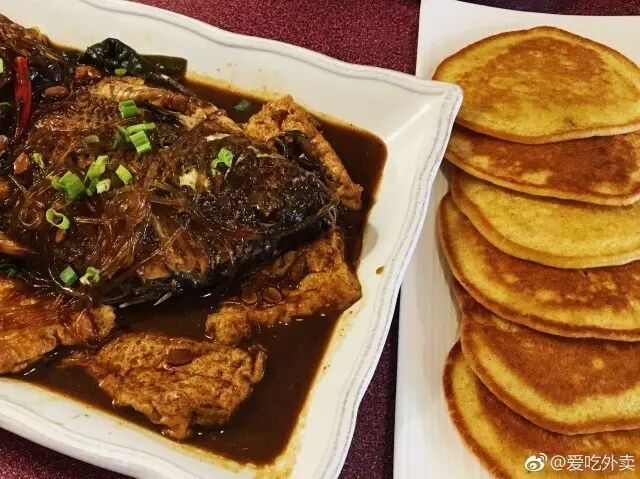 (原始链接: http://mmbiz.qpic.cn/mmbiz_jpg/XA8n2XaESnQ3ib7bAUzYDaGHhxeiakxamYM4Uexp1gzhlr3bARsHytG8sRstGTDC8EKPLcnWMia5CkABTqclf9Vow/0?wx_fmt=jpeg)
- 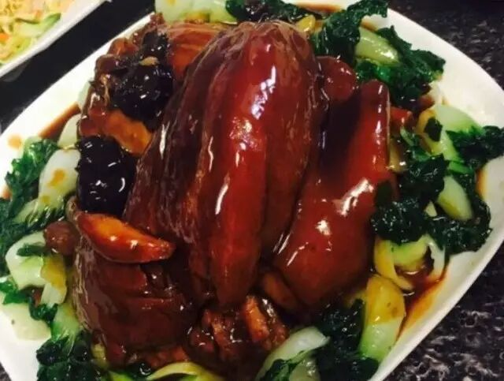 (原始链接: http://mmbiz.qpic.cn/mmbiz_jpg/XA8n2XaESnQ3ib7bAUzYDaGHhxeiakxamY3pfAOVebFRSPYmJtBz4icdYYQIanXHvia4G7UdicZBUsmJH9PewGzIkpw/0?wx_fmt=jpeg)
- 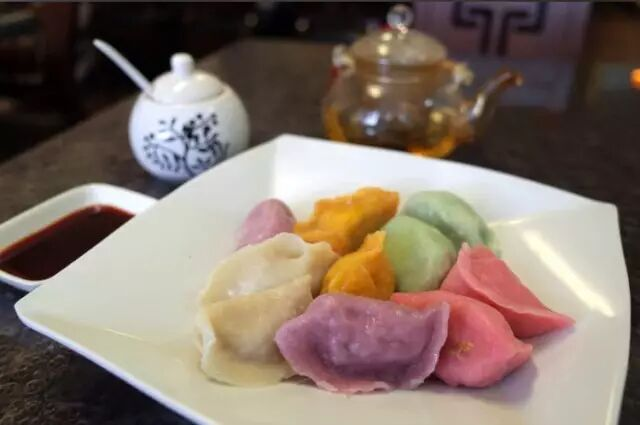 (原始链接: http://mmbiz.qpic.cn/mmbiz_jpg/XA8n2XaESnQ3ib7bAUzYDaGHhxeiakxamYr0DI6ics3dKnibav9KJXr28R9axuJwy3ia9zoiavZ7NZdicFPV3m38xtNOA/0?wx_fmt=jpeg)
- 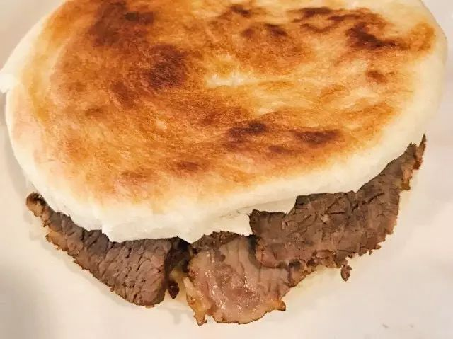 (原始链接: http://mmbiz.qpic.cn/mmbiz_jpg/XA8n2XaESnQ3ib7bAUzYDaGHhxeiakxamYahFnQiamRsicARLKx0JMRb2vFiauEEl930SK9n7ffOjSvQkztgaK0Zia1w/0?wx_fmt=jpeg)
-  (原始链接: http://mmbiz.qpic.cn/mmbiz_jpg/XA8n2XaESnQ3ib7bAUzYDaGHhxeiakxamYP9jGusAp4fruaAJTTEBJ7St0qMHdPQ37jskVD3zqhaCwRQhWXbjojg/0?wx_fmt=jpeg)
-  (原始链接: http://mmbiz.qpic.cn/mmbiz_jpg/XA8n2XaESnQ3ib7bAUzYDaGHhxeiakxamY9AWspxQbgHicSOE5vP2IncmeE0DTaBWwiadFkSPibtpzbxJbzv08YIxDw/0?wx_fmt=jpeg)
- 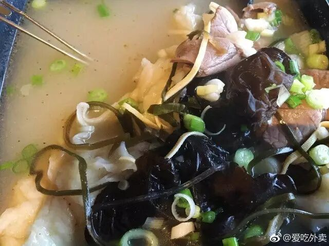 (原始链接: http://mmbiz.qpic.cn/mmbiz_jpg/XA8n2XaESnQ3ib7bAUzYDaGHhxeiakxamY2t7giaqvv7SNfl0OrJ4kHWoZuU6YMNnPhjIsV5ibf3WzCIVdxdprreYA/0?wx_fmt=jpeg)
- 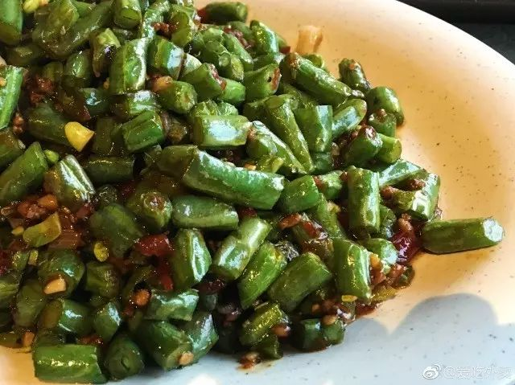 (原始链接: http://mmbiz.qpic.cn/mmbiz_jpg/XA8n2XaESnQ3ib7bAUzYDaGHhxeiakxamYQuqOaOTGJgTcDbDvKIMlg9vMMeKWYOgw4B1xaps9slibPFLOMDcyJQg/0?wx_fmt=jpeg)
- 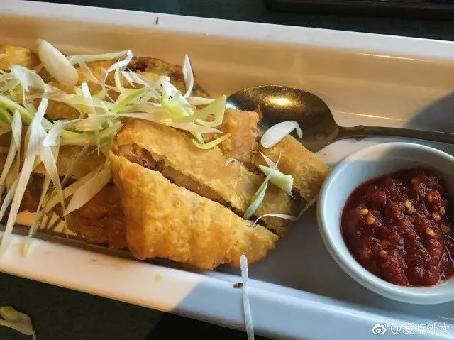 (原始链接: http://mmbiz.qpic.cn/mmbiz_jpg/XA8n2XaESnQ3ib7bAUzYDaGHhxeiakxamYIMN5juOaUjYMAx8ZeUQwSNvhWrVPkgfBicGvsHicFu2aOgfgFePxJUvQ/0?wx_fmt=jpeg)
- 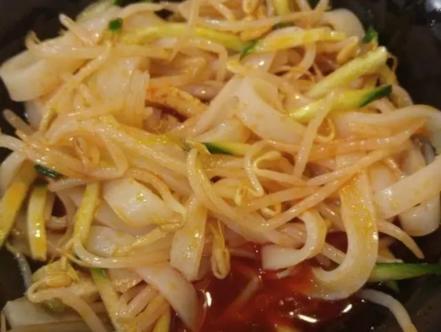 (原始链接: http://mmbiz.qpic.cn/mmbiz_jpg/XA8n2XaESnQ3ib7bAUzYDaGHhxeiakxamYqCVwB8887WKgYD9xVmntXPAb9ZTu2DznKUa5A1icoc6TVUxsr7ZsvNw/0?wx_fmt=jpeg)
-  (原始链接: http://mmbiz.qpic.cn/mmbiz_jpg/XA8n2XaESnQ3ib7bAUzYDaGHhxeiakxamYmsTnM9ia75ibOUDkG463HdI9nuQ4kDgIx4Yw6ZgaA0wiaElOVZia7hjdjw/0?wx_fmt=jpeg)
- 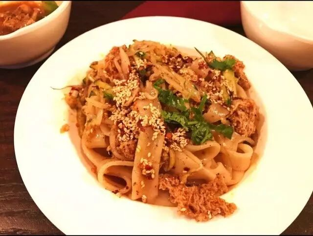 (原始链接: http://mmbiz.qpic.cn/mmbiz_jpg/XA8n2XaESnQ3ib7bAUzYDaGHhxeiakxamYtFclK3PT7NWjICMc3RDzltXFXEOnNnOric2jCe6p0pnticibyk7lrgpEQ/0?wx_fmt=jpeg)
- 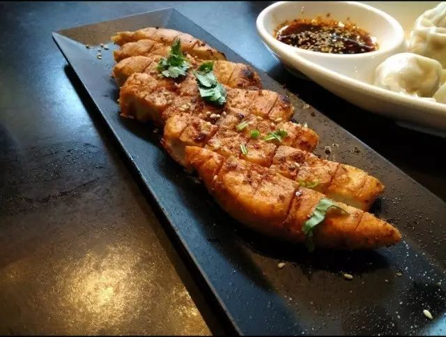 (原始链接: http://mmbiz.qpic.cn/mmbiz_jpg/XA8n2XaESnQ3ib7bAUzYDaGHhxeiakxamY8mJ3PHEklr3XTTkxEkK46xTY1pAibT3basFGyrFMeUWt9ZX7EYgyibzQ/0?wx_fmt=jpeg)
- 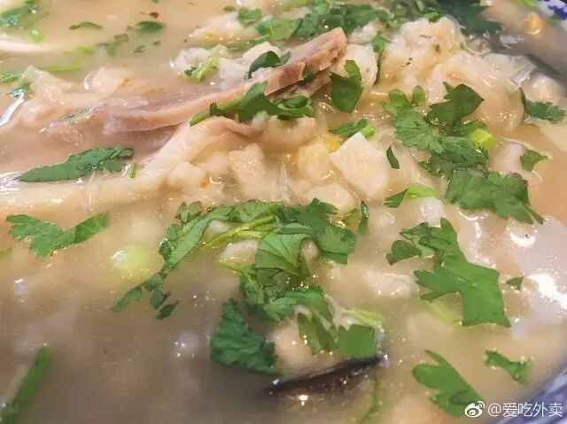 (原始链接: http://mmbiz.qpic.cn/mmbiz_jpg/XA8n2XaESnQ3ib7bAUzYDaGHhxeiakxamYyERIY1iaXYC9h2lnppzn8PnhU0Du3wnJIziaRNLoiaq579DtTmEh1pOXQ/0?wx_fmt=jpeg)
- 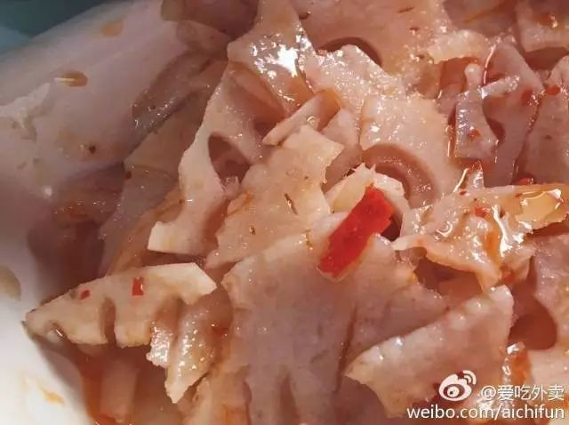 (原始链接: http://mmbiz.qpic.cn/mmbiz_jpg/XA8n2XaESnQ3ib7bAUzYDaGHhxeiakxamYDAcrAJHfgN1pk7Tn5pjc5vpbZib3t4z9xYskqH7dErg3GSpe8IDibJiaQ/0?wx_fmt=jpeg)
- 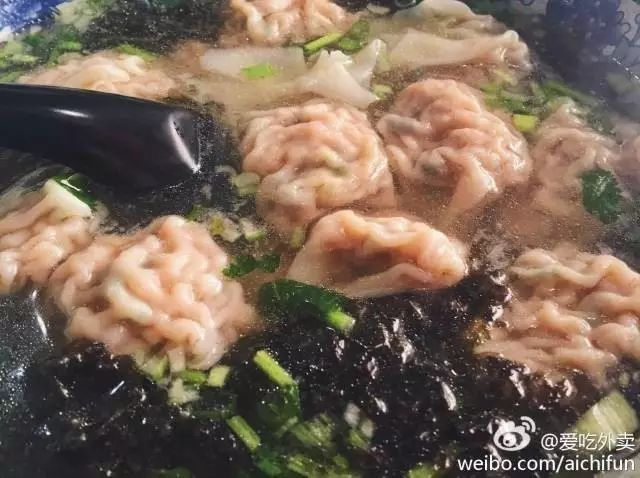 (原始链接: http://mmbiz.qpic.cn/mmbiz_jpg/XA8n2XaESnQ3ib7bAUzYDaGHhxeiakxamYBlkpox9mmyo8K7glU2Mf93mIGgnKKEtH4rsqqnJzHF3yGRuv4uxQkQ/0?wx_fmt=jpeg)
- 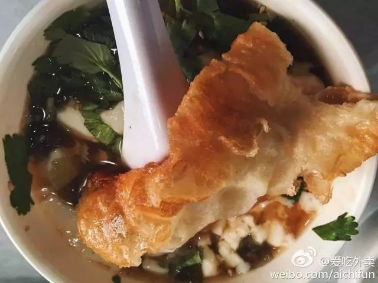 (原始链接: http://mmbiz.qpic.cn/mmbiz_jpg/XA8n2XaESnQ3ib7bAUzYDaGHhxeiakxamYB0L9pRxMgzu2vOFDHfkhy7icf46gXl3lMJClHL30tzlKE0LsgJtPaCA/0?wx_fmt=jpeg)
- 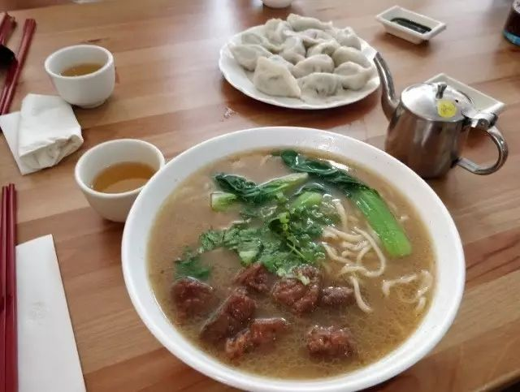 (原始链接: http://mmbiz.qpic.cn/mmbiz_jpg/XA8n2XaESnQ3ib7bAUzYDaGHhxeiakxamY7wzMoUicLTfx05zhe4QmA9wlHzVKlRhpB1SJ7HmKz6uGVUQ7VPqibvDg/0?wx_fmt=jpeg)
- 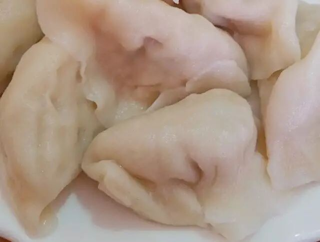 (原始链接: http://mmbiz.qpic.cn/mmbiz_jpg/XA8n2XaESnQ3ib7bAUzYDaGHhxeiakxamYZNH9GLHaNw1raGnAVTMkcV0pFvX9I0B7gYuDuuyg2hHbiaT0AaBoDPg/0?wx_fmt=jpeg)
- 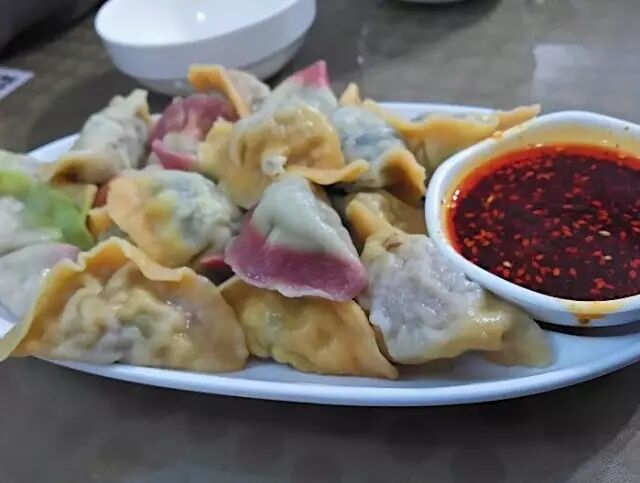 (原始链接: http://mmbiz.qpic.cn/mmbiz_jpg/XA8n2XaESnQ3ib7bAUzYDaGHhxeiakxamYRckzvKhNibicGn2V8AibYgWAsqrhahgMOSIPXARmYbeSWNiaNb3KKHzwAQ/0?wx_fmt=jpeg)
-  (原始链接: http://mmbiz.qpic.cn/mmbiz_jpg/XA8n2XaESnQ3ib7bAUzYDaGHhxeiakxamY4oyfGSKrrUKOjMdNgSKzIicGY3YpaT3iaia89p22mHCA7reFslpDyib7cQ/0?wx_fmt=jpeg)
- 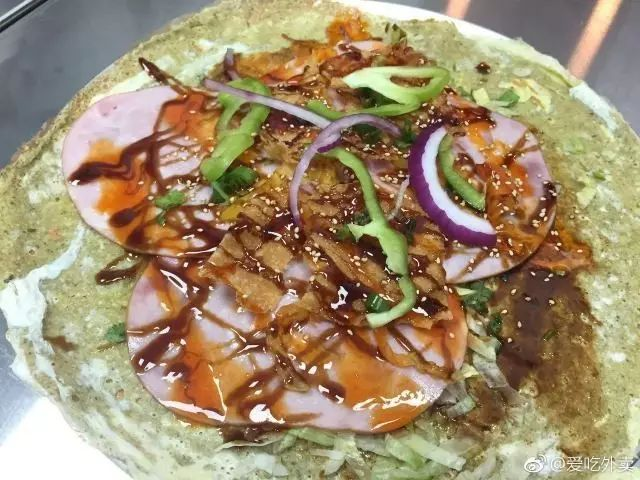 (原始链接: http://mmbiz.qpic.cn/mmbiz_jpg/XA8n2XaESnQ3ib7bAUzYDaGHhxeiakxamYDzPvriczLh2JJn8e52icgnIUPylgXV4M1EzfKBcUtlFT51CdIrxvZoZg/0?wx_fmt=jpeg)
- 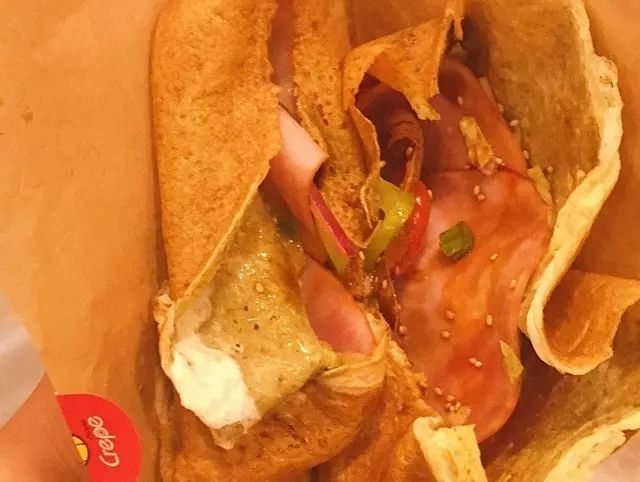 (原始链接: http://mmbiz.qpic.cn/mmbiz_jpg/XA8n2XaESnQ3ib7bAUzYDaGHhxeiakxamYzAchBzJI2kPiapYSGjfjcGibbzhfj0fkDWibEqbKt6gYBM9ialJ3c89EibA/0?wx_fmt=jpeg)
-  (原始链接: http://mmbiz.qpic.cn/mmbiz_jpg/XA8n2XaESnQ3ib7bAUzYDaGHhxeiakxamYBuYWvddDMichHzoh0ImMlskGoJyDeBsSgqaJR3GxpDl4UxTiaOoYMicibw/0?wx_fmt=jpeg)
- 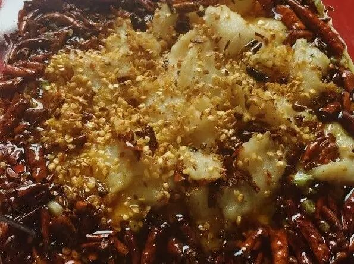 (原始链接: http://mmbiz.qpic.cn/mmbiz_jpg/XA8n2XaESnQ3ib7bAUzYDaGHhxeiakxamY9uevicBnttnn9tJ49zlIWqiakWzD8kZgX8mcnWaVL8bFL3Ea779exWibQ/0?wx_fmt=jpeg)
-  (原始链接: http://mmbiz.qpic.cn/mmbiz_jpg/XA8n2XaESnQ3ib7bAUzYDaGHhxeiakxamYP3G8DUfhAmA2c21sGbd6Liag6wh9CAymGSSTsKvDckoFJu5HRW1l9lQ/0?wx_fmt=jpeg)
- 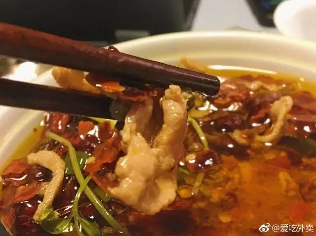 (原始链接: http://mmbiz.qpic.cn/mmbiz_jpg/XA8n2XaESnQ3ib7bAUzYDaGHhxeiakxamYHDo96NRice5gQxS6ibRmnCK5pU7SUOabgToHynX53TiaXQaKwcUXkam4Q/0?wx_fmt=jpeg)
- 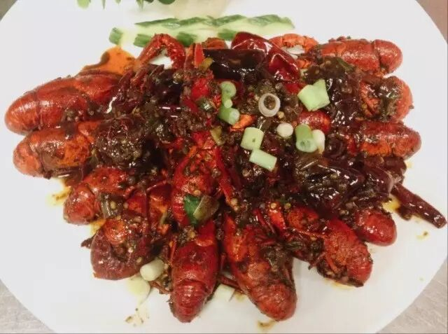 (原始链接: http://mmbiz.qpic.cn/mmbiz_jpg/XA8n2XaESnQ3ib7bAUzYDaGHhxeiakxamYV6ThhRaZwgiamOoVGYuP3sqCvbaNvtGicw30Q83z5UicuFI338kClnRgQ/0?wx_fmt=jpeg)
- 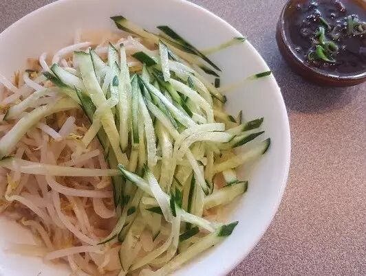 (原始链接: http://mmbiz.qpic.cn/mmbiz_jpg/XA8n2XaESnQ3ib7bAUzYDaGHhxeiakxamY1RkeKwIN2CntMzswgFENfFvzqGVZ2FDricQ0u5ATKEjIQntqBgSDCGQ/0?wx_fmt=jpeg)
- 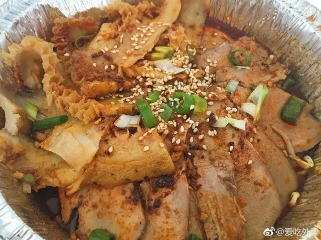 (原始链接: http://mmbiz.qpic.cn/mmbiz_jpg/XA8n2XaESnQ3ib7bAUzYDaGHhxeiakxamYkbm6QMS9YTZ7RHj4rY8vLLXpCMb9D4mjxG7SaGlfu4z7piayJYnXvrg/0?wx_fmt=jpeg)
- 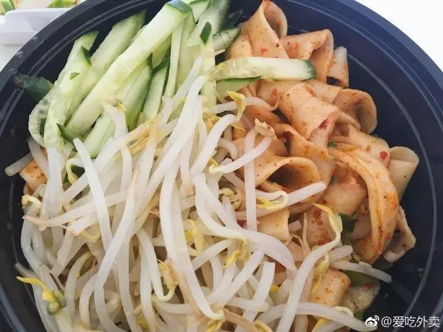 (原始链接: http://mmbiz.qpic.cn/mmbiz_jpg/XA8n2XaESnQ3ib7bAUzYDaGHhxeiakxamYa8b1jibTaGvAnU2RkBQCD6eia782jkdPuMeXibqKETBCmtW0dS52JeFCQ/0?wx_fmt=jpeg)
-  (原始链接: http://mmbiz.qpic.cn/mmbiz_jpg/XA8n2XaESnQ3ib7bAUzYDaGHhxeiakxamYhqY7n54OaibDTRxBqibctAqibxLHvU0ymDrqPpvemTsEO9M5M8UKERnfw/0?wx_fmt=jpeg)
- 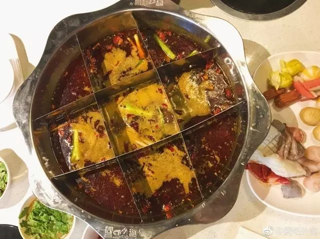 (原始链接: http://mmbiz.qpic.cn/mmbiz_jpg/XA8n2XaESnQ3ib7bAUzYDaGHhxeiakxamYlUdMZsbicRqJ4zKbakia5ZCN7MNadHmyD8qUibuwvzMc9icYbxibbX9CGbQ/0?wx_fmt=jpeg)
- 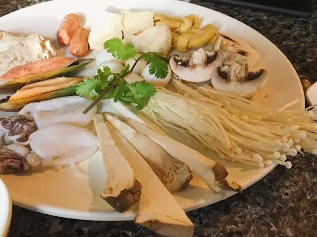 (原始链接: http://mmbiz.qpic.cn/mmbiz_jpg/XA8n2XaESnQ3ib7bAUzYDaGHhxeiakxamYAkYNYhicBtQhic1PvsoibETQ8KyYtwznFvl48sibaClzZZ8x2tVhDJZuHg/0?wx_fmt=jpeg)
- 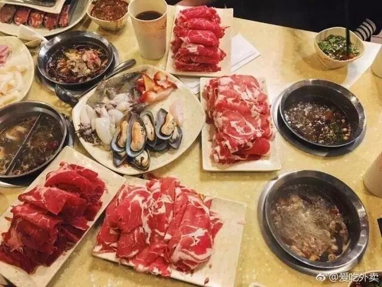 (原始链接: http://mmbiz.qpic.cn/mmbiz_jpg/XA8n2XaESnQ3ib7bAUzYDaGHhxeiakxamY7cT4iblM7DGVOrWR0WrZFWctBRT1Zf5t8q4p77LdAJpIXynXAFFgZeA/0?wx_fmt=jpeg)
- 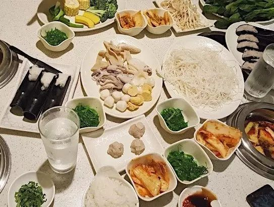 (原始链接: http://mmbiz.qpic.cn/mmbiz_jpg/XA8n2XaESnQ3ib7bAUzYDaGHhxeiakxamYWhsic9h1vY6wNDEYic6lnEicNPwpzhCO7H7Fu8RhAJf7YQMKAF8jG5ABA/0?wx_fmt=jpeg)
- 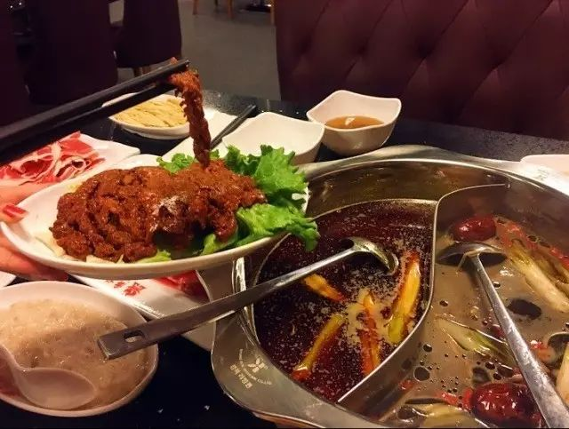 (原始链接: http://mmbiz.qpic.cn/mmbiz_jpg/XA8n2XaESnQ3ib7bAUzYDaGHhxeiakxamYt6KjuoRT8ZzWyMGJeJGRmQ74stBkHsJ1jBz5bJwzib9NWx4bh5keWyA/0?wx_fmt=jpeg)
- 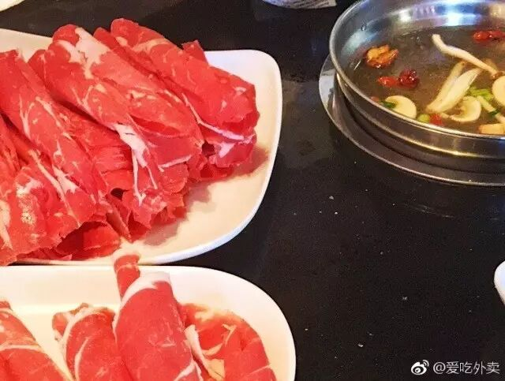 (原始链接: http://mmbiz.qpic.cn/mmbiz_jpg/XA8n2XaESnQ3ib7bAUzYDaGHhxeiakxamYM90icaU0PuTAs7epy5fj7KrOvw03DKNjmgcBhcnK6F85gqPHw7jt7Ig/0?wx_fmt=jpeg)
- 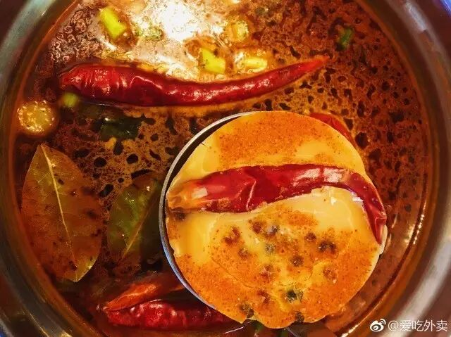 (原始链接: http://mmbiz.qpic.cn/mmbiz_jpg/XA8n2XaESnQ3ib7bAUzYDaGHhxeiakxamYqQ2E3yVBZyBVZeUSCOyTdct9yKFdXL89QC1T3A5Xp0mw4icPZP4L0FA/0?wx_fmt=jpeg)
-  (原始链接: http://mmbiz.qpic.cn/mmbiz_jpg/XA8n2XaESnQ3ib7bAUzYDaGHhxeiakxamYaEod2DoYRdQWLUH5sgTEdWvqd3PK06SuicYricvSpalzClo54lBuM4UQ/0?wx_fmt=jpeg)
- 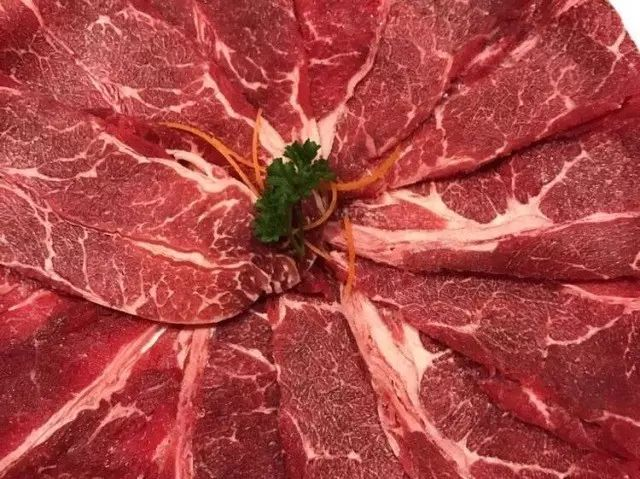 (原始链接: http://mmbiz.qpic.cn/mmbiz_jpg/XA8n2XaESnQ3ib7bAUzYDaGHhxeiakxamYyr2uaT0rBoib56xjoaK8ibiaCoUwrMEboAQuNticZejm59eiaEVTfwb3giaw/0?wx_fmt=jpeg)
- 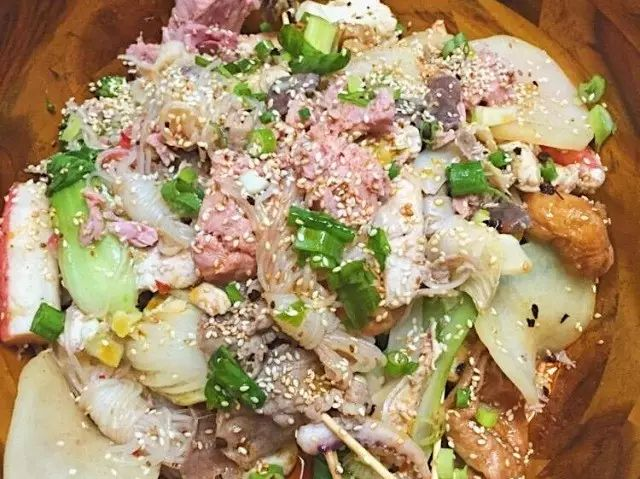 (原始链接: http://mmbiz.qpic.cn/mmbiz_jpg/XA8n2XaESnQ3ib7bAUzYDaGHhxeiakxamYVPnf5SaH1lgr1IzwIjzQt9lmpj4lZBJZmcVnjVsHe9sC5etGpUsialg/0?wx_fmt=jpeg)
-  (原始链接: http://mmbiz.qpic.cn/mmbiz_jpg/XA8n2XaESnQ3ib7bAUzYDaGHhxeiakxamY7m5wicibTpflJT3mJT94EXuZdcUCwLyy6ia4bkicBsRdyfHTYbDibVxfoyw/0?wx_fmt=jpeg)
-  (原始链接: http://mmbiz.qpic.cn/mmbiz_jpg/XA8n2XaESnQ3ib7bAUzYDaGHhxeiakxamYvTD0ZgW3o6M8djByMVGdfbHkibRiaEpaicVBOEQxT2ODX4ZpFlPPo84Kg/0?wx_fmt=jpeg)
-  (原始链接: http://mmbiz.qpic.cn/mmbiz_jpg/XA8n2XaESnQ3ib7bAUzYDaGHhxeiakxamY0TpM7O8DhjngRZdwdVkoU94QibicJwSfd2FbQmR7znxVL7EyFdTmcMrA/0?wx_fmt=jpeg)
-  (原始链接: http://mmbiz.qpic.cn/mmbiz_gif/A7Qy5Pr7fyB1u25Xcv5BVtCwUEMicdoGDvzyeaDbgcWqsJZibf2CSG1E6rDPEsKJrodx7MH8WX9R0S4ic0RL6Y2AQ/0?wx_fmt=gif)
-  (原始链接: http://mmbiz.qpic.cn/mmbiz_png/FTEqN5H8Laugwl1j6kxkJJ7Rvib9NfSXWldQus2Hic73PY4iab3vTNE9licm1gH2ic6xVZta3L9dsekkvGS2dQ8ao7A/0?wx_fmt=png)
-  (原始链接: http://mmbiz.qpic.cn/mmbiz_png/FTEqN5H8Laugwl1j6kxkJJ7Rvib9NfSXWriaCrqhFTQJWstCno1aICIoNPQtD27WxwtCFjf9gbQlXibJSBpjzz1nA/0?wx_fmt=png)
-  (原始链接: http://mmbiz.qpic.cn/mmbiz_jpg/XA8n2XaESnQ3ib7bAUzYDaGHhxeiakxamYkgRBv7ARSTUdVZBCbS5TcYm2WnnDsROySfevIDQgfTRhS0j8jU9nXw/0?wx_fmt=jpeg)
