# 无标题

**链接地址:** http://mp.weixin.qq.com/s?__biz=MzI0MDQ0ODI0Ng==&mid=2247485443&idx=1&sn=84a5947b3bcebac071018fca2874aafd&chksm=e91bef9ade6c668c7ef3fb7a50cbd7c6e2d53186b6b94b1217feb80eef9f0b9448ea4d17175a&mpshare=1&scene=2&srcid=1029OvLWfikWUQDwq9ILD6KT#rd
**作者:** 爱吃
**获取时间:** 2025/8/28 22:25:14
**图片数量:** 34

---

## 原始HTML内容

<section style="background-color: rgb(255, 255, 255);box-sizing: border-box;"><section class="Powered-by-XIUMI V5" style="box-sizing: border-box;" powered-by="xiumi.us"><section class="" style="box-sizing: border-box;"><section class="" style="display: inline-block;width: 100%;vertical-align: top;background-image: url(&quot;http://mmbiz.qpic.cn/mmbiz_png/HpSwp2cupTwxCHApaf6luiaP37EmFyaQQTbpteCEwwruMibMhiax1bMZ2fIibL0BGVF0CtaKicicPUVffQY2T0DTiaxibg/0/png&quot;);background-position: 0% 0%;background-repeat: repeat;background-size: 48.9055%;background-attachment: scroll;box-sizing: border-box;"><section class="Powered-by-XIUMI V5" style="box-sizing: border-box;" powered-by="xiumi.us"><section class="" style="box-sizing: border-box;"><section class="" style="display: inline-block;vertical-align: top;width: 75%;box-sizing: border-box;"><section class="Powered-by-XIUMI V5" style="box-sizing: border-box;" powered-by="xiumi.us"><section class="" style="margin: 0px 0%;box-sizing: border-box;"><section class="" style="display: inline-block;width: 100%;border-width: 1px;border-style: solid;border-color: transparent;padding: 10px;background-color: rgb(254, 255, 255);box-shadow: rgb(170, 170, 170) 0px 0px 10px;box-sizing: border-box;"><section class="Powered-by-XIUMI V5" style="box-sizing: border-box;" powered-by="xiumi.us"><section class="" style="margin-top: 10px;margin-bottom: 10px;box-sizing: border-box;"><section class="" style="display: inline-block;border-width: 2px;border-style: solid;border-color: rgb(105, 105, 105);padding: 0.1em 0.3em;color: rgb(105, 105, 105);font-size: 14px;letter-spacing: 1.5px;box-sizing: border-box;">
Whyte Ave
</section></section></section><section class="Powered-by-XIUMI V5" style="box-sizing: border-box;" powered-by="xiumi.us"><section class="" style="box-sizing: border-box;"><section class="" style="text-align: center;font-size: 12px;color: rgb(105, 105, 105);letter-spacing: 1px;line-height: 1.8;box-sizing: border-box;">
Whyte Ave (82 Ave) 可以说是大家最不陌生的一条街了 夏天的时候来来往往的人最多 戴着墨镜 坐在室外三两成群喝着小酒聊着天 除了肩负着“酒吧一条街”的盛名 Whyte Ave上还有很多值得一去的小店 街道的两旁也时常能看到街头卖艺和古香古色的老爷车
</section></section></section></section></section></section></section><section class="group-empty" style="display: inline-block;vertical-align: top;width: 25%;padding: 0px;box-sizing: border-box;">&nbsp;</section></section></section><section class="Powered-by-XIUMI V5" style="box-sizing: border-box;" powered-by="xiumi.us"><section class="" style="box-sizing: border-box;"><section class="" style="box-sizing: border-box;">
 
</section></section></section><section class="Powered-by-XIUMI V5" style="box-sizing: border-box;" powered-by="xiumi.us"><section class="" style="box-sizing: border-box;"><section class="" style="font-size: 12px;line-height: 2;letter-spacing: 1px;box-sizing: border-box;">
 
</section></section></section></section></section></section><section class="Powered-by-XIUMI V5" style="box-sizing: border-box;" powered-by="xiumi.us"><section class="" style="margin: 10px 0%;box-sizing: border-box;"><section class="" style="display: inline-block;vertical-align: bottom;width: 12%;box-sizing: border-box;"><section class="Powered-by-XIUMI V5" style="box-sizing: border-box;" powered-by="xiumi.us"><section class="" style="margin: 3px 0px;text-align: center;box-sizing: border-box;"><section class="" style="display: inline-block;border-width: 1px;border-style: solid;border-color: rgb(253, 198, 32);background-color: rgb(253, 198, 32);width: 1.8em;height: 1.8em;line-height: 1.8em;border-radius: 100%;margin-left: auto;margin-right: auto;font-size: 18px;color: rgb(0, 0, 0);box-sizing: border-box;">
01
</section></section></section></section><section class="" style="display: inline-block;vertical-align: bottom;width: 88%;box-sizing: border-box;"><section class="Powered-by-XIUMI V5" style="box-sizing: border-box;" powered-by="xiumi.us"><section class="" style="margin: 0px 0% 5px;box-sizing: border-box;"><section class="" style="display: inline-block;box-sizing: border-box;"><section class="" style="display: inline-block;vertical-align: bottom;border-bottom: 1px dashed rgb(175, 175, 175);margin-bottom: 0.25em;padding-left: 5px;padding-right: 5px;box-sizing: border-box;">
<strong style="box-sizing: border-box;">值 得 吃</strong>
</section><section style="display: inline-block;vertical-align: bottom;width: 0.5em;height: 0.5em;border-radius: 50%;background-color: rgb(253, 198, 32);box-sizing: border-box;"></section></section></section></section></section></section></section><section class="Powered-by-XIUMI V5" style="box-sizing: border-box;" powered-by="xiumi.us"><section class="" style="box-sizing: border-box;"><section class="" style="text-align: center;font-size: 12px;line-height: 2;letter-spacing: 1px;box-sizing: border-box;">
除了大家耳熟能详的中餐馆北平、老川味 还有两家吃雪冰的Seorak和Snowy Dessert 下面这些不是那么显眼的餐馆 也同样十分值得一试 
</section></section></section><section class="Powered-by-XIUMI V5" style="box-sizing: border-box;" powered-by="xiumi.us"><section class="" style="box-sizing: border-box;"><section class="" style="box-sizing: border-box;">
 
</section></section></section><section class="Powered-by-XIUMI V5" style="box-sizing: border-box;" powered-by="xiumi.us"><section class="" style="box-sizing: border-box;"><section class="" style="font-size: 14px;line-height: 2;letter-spacing: 2px;box-sizing: border-box;">
<strong style="box-sizing: border-box;">DADEO</strong> 
</section></section></section><section class="Powered-by-XIUMI V5" style="box-sizing: border-box;" powered-by="xiumi.us"><section class="" style="box-sizing: border-box;"><section class="" style="font-size: 12px;line-height: 2;letter-spacing: 1px;box-sizing: border-box;">
可以说是生蚝专门店了 小隐隐于Whyte Ave 店面很不起眼 但是做起生蚝来可以说是很不含糊了 与其他店中的half shell oyster不同的是 他家的生蚝是有一点微熟的 上面配有洋葱和菠菜 很多接受不了生吃的朋友可以尝试一下这个 保留了生蚝本身的鲜美 却又佐以了恰到好处的香料
</section></section></section><section class="Powered-by-XIUMI V5" style="box-sizing: border-box;" powered-by="xiumi.us"><section class="" style="text-align: center;margin-top: 10px;margin-bottom: 10px;box-sizing: border-box;"></section></section><section class="Powered-by-XIUMI V5" style="box-sizing: border-box;" powered-by="xiumi.us"><section class="" style="box-sizing: border-box;"><section class="" style="font-size: 12px;line-height: 2;letter-spacing: 1px;box-sizing: border-box;">
 

Fried oyster 也令人耳目一新 并没有想象中油炸的油腻感 外面是酥脆的面包屑 里面包裹着软软多汁的蚝
</section></section></section><section class="Powered-by-XIUMI V5" style="box-sizing: border-box;" powered-by="xiumi.us"><section class="" style="text-align: center;margin-top: 10px;margin-bottom: 10px;box-sizing: border-box;"></section></section><section class="Powered-by-XIUMI V5" style="box-sizing: border-box;" powered-by="xiumi.us"><section class="" style="box-sizing: border-box;"><section class="" style="font-size: 12px;line-height: 2;letter-spacing: 1px;box-sizing: border-box;">
 

Bloody Mary 和它的名字一样血色浪漫 新鲜生蚝浸泡在伏特加里 一个shot一个生蚝 刚烈又醇美 入口后有一丝腥味 但腥味转瞬即逝 生蚝的鲜美绽放出来 浓烈而迷人 
</section></section></section><section class="Powered-by-XIUMI V5" style="box-sizing: border-box;" powered-by="xiumi.us"><section class="" style="text-align: center;margin-top: 10px;margin-bottom: 10px;box-sizing: border-box;"></section></section><section class="Powered-by-XIUMI V5" style="box-sizing: border-box;" powered-by="xiumi.us"><section class="" style="box-sizing: border-box;"><section class="" style="box-sizing: border-box;">
 
</section></section></section><section class="Powered-by-XIUMI V5" style="box-sizing: border-box;" powered-by="xiumi.us"><section class="" style="box-sizing: border-box;"><section class="" style="line-height: 2;letter-spacing: 2px;box-sizing: border-box;">
<strong style="box-sizing: border-box;">Julio's Barrio Mexican Restaurant</strong>
</section></section></section><section class="Powered-by-XIUMI V5" style="box-sizing: border-box;" powered-by="xiumi.us"><section class="" style="box-sizing: border-box;"><section class="" style="font-size: 12px;line-height: 2;letter-spacing: 1px;box-sizing: border-box;">
很火的一家墨西哥餐厅 每到周五周末 门前必排起长队 夏天阳光好的时候 餐厅会把窗户打开 整个餐厅从外到里都洋溢着墨西哥热情阳光的感觉 到了墨西哥餐厅怎么能不尝试tacos 作为一个不怎么喜欢tacos的人 他家的tacos给的料很足 用料新鲜 并且可供选择的种类很多 而更吸引我的 是他家的酒&nbsp;
</section></section></section><section class="Powered-by-XIUMI V5" style="box-sizing: border-box;" powered-by="xiumi.us"><section class="" style="text-align: center;margin-top: 10px;margin-bottom: 10px;box-sizing: border-box;"></section></section><section class="Powered-by-XIUMI V5" style="box-sizing: border-box;" powered-by="xiumi.us"><section class="" style="box-sizing: border-box;"><section class="" style="font-size: 12px;line-height: 2;letter-spacing: 1px;box-sizing: border-box;">
 

相比于老外都喜欢的bulldog 个人更喜欢The Chihuahua 刚入口是新鲜的橘子汽水味儿的slush 然后酒精味开始在嘴里蔓延开来&nbsp; 毕竟上面插着一整瓶的Keiths White 所以 酒的后劲十足 好喝可不要贪杯哦 
</section></section></section><section class="Powered-by-XIUMI V5" style="box-sizing: border-box;" powered-by="xiumi.us"><section class="" style="text-align: center;margin-top: 10px;margin-bottom: 10px;box-sizing: border-box;"></section></section><section class="Powered-by-XIUMI V5" style="box-sizing: border-box;" powered-by="xiumi.us"><section class="" style="box-sizing: border-box;"><section class="" style="font-size: 12px;line-height: 2;letter-spacing: 1px;box-sizing: border-box;">
 

说完了食物和酒 来说说服务 服务是这个餐厅的一大诟病 因为没有预约 当时等了要一个小时 问服务员还有多久 每次的答案都是十五分钟🙄️ 于是就这么过了四五个15分钟&nbsp;
</section></section></section><section class="Powered-by-XIUMI V5" style="box-sizing: border-box;" powered-by="xiumi.us"><section class="" style="text-align: center;margin-top: 10px;margin-bottom: 10px;box-sizing: border-box;"></section></section><section class="Powered-by-XIUMI V5" style="box-sizing: border-box;" powered-by="xiumi.us"><section class="" style="box-sizing: border-box;"><section class="" style="font-size: 12px;line-height: 2;letter-spacing: 1px;box-sizing: border-box;">
 
</section></section></section><section class="Powered-by-XIUMI V5" style="box-sizing: border-box;" powered-by="xiumi.us"><section class="" style="box-sizing: border-box;"><section class="" style="box-sizing: border-box;">
 
</section></section></section><section class="Powered-by-XIUMI V5" style="box-sizing: border-box;" powered-by="xiumi.us"><section class="" style="box-sizing: border-box;"><section class="" style="line-height: 2;letter-spacing: 2px;box-sizing: border-box;">
<strong style="box-sizing: border-box;">Ampersand 27 </strong>
</section></section></section><section class="Powered-by-XIUMI V5" style="box-sizing: border-box;" powered-by="xiumi.us"><section class="" style="box-sizing: border-box;"><section class="" style="font-size: 12px;line-height: 2;letter-spacing: 1px;box-sizing: border-box;">
看装潢就觉得很loft 走精致风路线的餐厅 摆盘每一个都很精致 食材搭配的很有新意 烤三文鱼配上南瓜酱 三文鱼是腌过了的 咸味的三文鱼配上甜味的南瓜酱 也是别有一番风味 beef tataki虽然没什么新意 但也和面包搭配出了别致的造型
</section></section></section><section class="Powered-by-XIUMI V5" style="box-sizing: border-box;" powered-by="xiumi.us"><section class="" style="text-align: center;margin-top: 10px;margin-bottom: 10px;box-sizing: border-box;"></section></section><section class="Powered-by-XIUMI V5" style="box-sizing: border-box;" powered-by="xiumi.us"><section class="" style="box-sizing: border-box;"><section class="" style="font-size: 12px;line-height: 2;letter-spacing: 1px;box-sizing: border-box;">
 

要说缺点的话 就是腌制过的食材有些过咸&nbsp; 服务和环境都没得说 人均如果点酒的话六十左右
</section></section></section><section class="Powered-by-XIUMI V5" style="box-sizing: border-box;" powered-by="xiumi.us"><section class="" style="text-align: center;margin-top: 10px;margin-bottom: 10px;box-sizing: border-box;"></section></section><section class="Powered-by-XIUMI V5" style="box-sizing: border-box;" powered-by="xiumi.us"><section class="" style="box-sizing: border-box;"><section class="" style="box-sizing: border-box;">
 
</section></section></section><section class="Powered-by-XIUMI V5" style="box-sizing: border-box;" powered-by="xiumi.us"><section class="" style="text-align: center;margin-top: 10px;margin-bottom: 10px;box-sizing: border-box;"></section></section><section class="Powered-by-XIUMI V5" style="box-sizing: border-box;" powered-by="xiumi.us"><section class="" style="box-sizing: border-box;"><section class="" style="font-size: 12px;line-height: 2;letter-spacing: 1px;box-sizing: border-box;">
 
</section></section></section><section class="Powered-by-XIUMI V5" style="box-sizing: border-box;" powered-by="xiumi.us"><section class="" style="box-sizing: border-box;"><section class="" style="box-sizing: border-box;">
 
</section></section></section><section class="Powered-by-XIUMI V5" style="box-sizing: border-box;" powered-by="xiumi.us"><section class="" style="box-sizing: border-box;"><section class="" style="line-height: 2;letter-spacing: 2px;box-sizing: border-box;">
<strong style="box-sizing: border-box;">Cafe Mosaics</strong>
</section></section></section><section class="Powered-by-XIUMI V5" style="box-sizing: border-box;" powered-by="xiumi.us"><section class="" style="box-sizing: border-box;"><section class="" style="font-size: 12px;line-height: 2;letter-spacing: 1px;box-sizing: border-box;">
之前也介绍过这家餐厅了 素食主义的餐厅 有人喜欢有人恨 个人觉得 这家餐厅纯靠点单 点对了素食天堂 点不对味如白面 最喜欢的是豆腐鸡翅 外形是真的很像鸡翅了 但其实是用豆腐做的 外面炸的酥酥脆脆的 并且吃起来很像肉味了 而服务员推荐的“石锅拌饭” 半熟的香嫩鸡蛋 配上各种蔬菜的清口和土豆的绵密口感&nbsp; 
</section></section></section><section class="Powered-by-XIUMI V5" style="box-sizing: border-box;" powered-by="xiumi.us"><section class="" style="text-align: center;margin-top: 10px;margin-bottom: 10px;box-sizing: border-box;"></section></section><section class="Powered-by-XIUMI V5" style="box-sizing: border-box;" powered-by="xiumi.us"><section class="" style="box-sizing: border-box;"><section class="" style="font-size: 12px;line-height: 2;letter-spacing: 1px;box-sizing: border-box;">
 

值得一提的是 这里的服务员妹儿都是看起来走文艺挂的女青年 胳膊上还有很可爱的小兔子的纹身 并且人也很nice
</section></section></section><section class="Powered-by-XIUMI V5" style="box-sizing: border-box;" powered-by="xiumi.us"><section class="" style="text-align: center;margin-top: 10px;margin-bottom: 10px;box-sizing: border-box;"></section></section><section class="Powered-by-XIUMI V5" style="box-sizing: border-box;" powered-by="xiumi.us"><section class="" style="box-sizing: border-box;"><section class="" style="font-size: 12px;line-height: 2;letter-spacing: 1px;box-sizing: border-box;">
 
</section></section></section><section class="Powered-by-XIUMI V5" style="box-sizing: border-box;" powered-by="xiumi.us"><section class="" style="box-sizing: border-box;"><section class="" style="box-sizing: border-box;">
 
</section></section></section><section class="Powered-by-XIUMI V5" style="box-sizing: border-box;" powered-by="xiumi.us"><section class="" style="box-sizing: border-box;"><section class="" style="line-height: 2;letter-spacing: 2px;box-sizing: border-box;">
<strong style="box-sizing: border-box;">The Almanac</strong>
</section></section></section><section class="Powered-by-XIUMI V5" style="box-sizing: border-box;" powered-by="xiumi.us"><section class="" style="box-sizing: border-box;"><section class="" style="font-size: 12px;line-height: 2;letter-spacing: 1px;box-sizing: border-box;">
在之前的约会篇中也提到过的一家餐厅 走法式小清新风的路线 菜品少而精 每周的菜单都是只有一面A4纸 主打健康精致 loft风 有情调 
</section></section></section><section class="Powered-by-XIUMI V5" style="box-sizing: border-box;" powered-by="xiumi.us"><section class="" style="text-align: center;margin-top: 10px;margin-bottom: 10px;box-sizing: border-box;"></section></section><section class="Powered-by-XIUMI V5" style="box-sizing: border-box;" powered-by="xiumi.us"><section class="" style="box-sizing: border-box;"><section class="" style="font-size: 12px;line-height: 2;letter-spacing: 1px;box-sizing: border-box;">
 
</section></section></section><section class="Powered-by-XIUMI V5" style="box-sizing: border-box;" powered-by="xiumi.us"><section class="" style="text-align: center;margin-top: 10px;margin-bottom: 10px;box-sizing: border-box;"></section></section><section class="Powered-by-XIUMI V5" style="box-sizing: border-box;" powered-by="xiumi.us"><section class="" style="box-sizing: border-box;"><section class="" style="font-size: 12px;line-height: 2;letter-spacing: 1px;box-sizing: border-box;">
 

但是 虽然菜单上的菜少而精 但点餐的时候还要仔细研究一下 并且有些词是法语的 不然点上来的东西 虽然味道不差 但总觉得和想象的有出入 所以 一定要问好了服务员到底是什么菜！
</section></section></section><section class="Powered-by-XIUMI V5" style="box-sizing: border-box;" powered-by="xiumi.us"><section class="" style="text-align: center;margin-top: 10px;margin-bottom: 10px;box-sizing: border-box;"></section></section><section class="Powered-by-XIUMI V5" style="box-sizing: border-box;" powered-by="xiumi.us"><section class="" style="box-sizing: border-box;"><section class="" style="font-size: 12px;line-height: 2;letter-spacing: 1px;box-sizing: border-box;">
 
</section></section></section><section class="Powered-by-XIUMI V5" style="box-sizing: border-box;" powered-by="xiumi.us"><section class="" style="box-sizing: border-box;"><section class="" style="line-height: 2;letter-spacing: 2px;box-sizing: border-box;">
<strong style="box-sizing: border-box;">MEAT</strong>
</section></section></section><section class="Powered-by-XIUMI V5" style="box-sizing: border-box;" powered-by="xiumi.us"><section class="" style="box-sizing: border-box;"><section class="" style="font-size: 12px;line-height: 2;letter-spacing: 1px;box-sizing: border-box;">
虽然不在Whyte Ave的正两旁 但MEAT也可以说是Whyte Ave上最著名的食肉专门店了 无论天冷天热 门口都有很多人排队 味道确实很好 并且搭配的几种酱也各有千秋 每一种都有它自己的特色 菜单上各种肉类明争暗斗 总想争出个谁是肉类一霸 而甜品和sides的位置只有那么点点了
</section></section></section><section class="Powered-by-XIUMI V5" style="box-sizing: border-box;" powered-by="xiumi.us"><section class="" style="text-align: center;margin-top: 10px;margin-bottom: 10px;box-sizing: border-box;"></section></section><section class="Powered-by-XIUMI V5" style="box-sizing: border-box;" powered-by="xiumi.us"><section class="" style="box-sizing: border-box;"><section class="" style="font-size: 12px;line-height: 2;letter-spacing: 1px;box-sizing: border-box;">
 
</section></section></section><section class="Powered-by-XIUMI V5" style="box-sizing: border-box;" powered-by="xiumi.us"><section class="" style="text-align: center;margin-top: 10px;margin-bottom: 10px;box-sizing: border-box;"></section></section><section class="Powered-by-XIUMI V5" style="box-sizing: border-box;" powered-by="xiumi.us"><section class="" style="box-sizing: border-box;"><section class="" style="font-size: 12px;line-height: 2;letter-spacing: 1px;box-sizing: border-box;">
 

可是去了几次 发现有时候点同一种肉&nbsp; 但肉的口感和软硬程度还是有区别的&nbsp; 
</section></section></section><section class="Powered-by-XIUMI V5" style="box-sizing: border-box;" powered-by="xiumi.us"><section class="" style="text-align: center;margin-top: 10px;margin-bottom: 10px;box-sizing: border-box;"></section></section><section class="Powered-by-XIUMI V5" style="box-sizing: border-box;" powered-by="xiumi.us"><section class="" style="box-sizing: border-box;"><section class="" style="font-size: 12px;line-height: 2;letter-spacing: 1px;box-sizing: border-box;">
 
</section></section></section><section class="Powered-by-XIUMI V5" style="box-sizing: border-box;" powered-by="xiumi.us"><section class="" style="box-sizing: border-box;"><section class="" style="line-height: 2;letter-spacing: 2px;box-sizing: border-box;">
<strong style="box-sizing: border-box;">RE:GRUB</strong>
</section></section></section><section class="Powered-by-XIUMI V5" style="box-sizing: border-box;" powered-by="xiumi.us"><section class="" style="box-sizing: border-box;"><section class="" style="font-size: 12px;line-height: 2;letter-spacing: 2px;box-sizing: border-box;">
自己对自己的定位十分明确 milkshake和burger 一进店就是满墙的签名墙 菜单上一边是各种高颜值的milkshake 而另一边是old school burger
</section></section></section><section class="Powered-by-XIUMI V5" style="box-sizing: border-box;" powered-by="xiumi.us"><section class="" style="text-align: center;margin-top: 10px;margin-bottom: 10px;box-sizing: border-box;"></section></section><section class="Powered-by-XIUMI V5" style="box-sizing: border-box;" powered-by="xiumi.us"><section class="" style="box-sizing: border-box;"><section class="" style="font-size: 12px;line-height: 2;letter-spacing: 2px;box-sizing: border-box;">
 

burger的肉饼 牛肉烤的很嫩 并且很juicy 量很大 而milkshake就更是高颜值的明星产品了 很大一部分排队的人为的就是那一杯milkshake拍照再发ins或者朋友圈 而milkshake颜值在线 味道也很在线 没有大多数milkshake都甜到腻人的通病&nbsp; 口感也很绵密
</section></section></section><section class="Powered-by-XIUMI V5" style="box-sizing: border-box;" powered-by="xiumi.us"><section class="" style="text-align: center;margin-top: 10px;margin-bottom: 10px;box-sizing: border-box;"></section></section><section class="Powered-by-XIUMI V5" style="box-sizing: border-box;" powered-by="xiumi.us"><section class="" style="box-sizing: border-box;"><section class="" style="box-sizing: border-box;">
 
</section></section></section><section class="Powered-by-XIUMI V5" style="box-sizing: border-box;" powered-by="xiumi.us"><section class="" style="text-align: center;margin-top: 10px;margin-bottom: 10px;box-sizing: border-box;"></section></section><section class="Powered-by-XIUMI V5" style="box-sizing: border-box;" powered-by="xiumi.us"><section class="" style="box-sizing: border-box;"><section class="" style="font-size: 12px;line-height: 2;letter-spacing: 2px;box-sizing: border-box;">
 

 

 
</section></section></section><section class="Powered-by-XIUMI V5" style="box-sizing: border-box;" powered-by="xiumi.us"><section class="" style="text-align: right;margin: 10px 0%;box-sizing: border-box;"><section class="" style="display: inline-block;vertical-align: bottom;width: 88%;box-sizing: border-box;"><section class="Powered-by-XIUMI V5" style="box-sizing: border-box;" powered-by="xiumi.us"><section class="" style="margin: 0px 0% 5px;box-sizing: border-box;"><section class="" style="display: inline-block;box-sizing: border-box;"><section style="display: inline-block;vertical-align: bottom;width: 0.5em;height: 0.5em;border-radius: 50%;background-color: rgb(29, 74, 129);box-sizing: border-box;"></section><section class="" style="display: inline-block;vertical-align: bottom;border-bottom: 1px dashed rgb(175, 175, 175);margin-bottom: 0.25em;padding-left: 5px;padding-right: 5px;box-sizing: border-box;">
<strong style="box-sizing: border-box;">值 得 逛</strong>
</section></section></section></section></section><section class="" style="display: inline-block;vertical-align: bottom;width: 12%;box-sizing: border-box;"><section class="Powered-by-XIUMI V5" style="box-sizing: border-box;" powered-by="xiumi.us"><section class="" style="margin: 3px 0px;text-align: left;box-sizing: border-box;"><section class="" style="display: inline-block;border-width: 1px;border-style: solid;border-color: rgb(29, 74, 129);background-color: rgb(29, 74, 129);text-align: center;width: 1.8em;height: 1.8em;line-height: 1.8em;border-radius: 100%;margin-left: auto;margin-right: auto;font-size: 18px;color: rgb(255, 255, 255);box-sizing: border-box;">
02
</section></section></section></section></section></section><section class="Powered-by-XIUMI V5" style="box-sizing: border-box;" powered-by="xiumi.us"><section class="" style="box-sizing: border-box;"><section class="" style="font-size: 12px;line-height: 2;letter-spacing: 1px;box-sizing: border-box;">
吃饱喝足了 怎么可以不在Whyte上逛一逛 看看琳琅满目的各种小玩意儿 还有时不时能淘到宝的vintage店

 
</section></section></section><section class="Powered-by-XIUMI V5" style="box-sizing: border-box;" powered-by="xiumi.us"><section class="" style="box-sizing: border-box;"><section class="" style="line-height: 2;letter-spacing: 2px;box-sizing: border-box;">
<strong style="box-sizing: border-box;">Gravitypope</strong>
</section></section></section><section class="Powered-by-XIUMI V5" style="box-sizing: border-box;" powered-by="xiumi.us"><section class="" style="box-sizing: border-box;"><section class="" style="font-size: 12px;line-height: 2;letter-spacing: 1px;box-sizing: border-box;">
在Whyte Ave上有两家gravitypope 一家主打卖鞋 而另一家主打卖衣服 但是也有部分鞋子和包包 卖鞋的那家店 牌子种类很多 除了Adidas、Vans这些比较常规大众的鞋子 还有小白鞋common project 和Prada旗下专门做Oxford的Church's 等高端一些的牌子&nbsp;
</section></section></section><section class="Powered-by-XIUMI V5" style="box-sizing: border-box;" powered-by="xiumi.us"><section class="" style="text-align: center;margin-top: 10px;margin-bottom: 10px;box-sizing: border-box;"></section></section><section class="Powered-by-XIUMI V5" style="box-sizing: border-box;" powered-by="xiumi.us"><section class="" style="box-sizing: border-box;"><section class="" style="font-size: 12px;line-height: 2;letter-spacing: 1px;box-sizing: border-box;">
 
</section></section></section><section class="Powered-by-XIUMI V5" style="box-sizing: border-box;" powered-by="xiumi.us"><section class="" style="text-align: center;margin-top: 10px;margin-bottom: 10px;box-sizing: border-box;"></section></section><section class="Powered-by-XIUMI V5" style="box-sizing: border-box;" powered-by="xiumi.us"><section class="" style="box-sizing: border-box;"><section class="" style="font-size: 12px;line-height: 2;letter-spacing: 1px;box-sizing: border-box;">
 

而沿着Whyte Ave再往东走一段在Gateway blvd上的主打卖衣服的那家店 就更是五脏俱全了 除了Acne Studios、Alexander Wang、Comme des Garçon Play这些耳熟能详、购物网站上一定会看的牌子 还有Marni的包包和一些设计师款的鞋子 每次都能发现好东西
</section></section></section><section class="Powered-by-XIUMI V5" style="box-sizing: border-box;" powered-by="xiumi.us"><section class="" style="text-align: center;margin-top: 10px;margin-bottom: 10px;box-sizing: border-box;"></section></section><section class="Powered-by-XIUMI V5" style="box-sizing: border-box;" powered-by="xiumi.us"><section class="" style="box-sizing: border-box;"><section class="" style="font-size: 12px;line-height: 2;letter-spacing: 1px;box-sizing: border-box;">
 
</section></section></section><section class="Powered-by-XIUMI V5" style="box-sizing: border-box;" powered-by="xiumi.us"><section class="" style="box-sizing: border-box;"><section class="" style="line-height: 2;letter-spacing: 2px;box-sizing: border-box;">
<strong style="box-sizing: border-box;">Black Swan Antique &amp; Collectibles</strong>
</section></section></section><section class="Powered-by-XIUMI V5" style="box-sizing: border-box;" powered-by="xiumi.us"><section class="" style="box-sizing: border-box;"><section class="" style="font-size: 12px;line-height: 2;letter-spacing: 1px;box-sizing: border-box;">
在Whyte上的一家古着店 每次在微博上看到很多美妆博主都会到古着店淘Chanel、Gucci之类的都会觉得很惊喜 虽然这家店里没有vintage店Chanel（毕竟保存条件完好的vintage Chanel还是很稀贵的）但是有很多很精细的首饰、器皿 也有个别的vintage的包包和鞋子 
</section></section></section><section class="Powered-by-XIUMI V5" style="box-sizing: border-box;" powered-by="xiumi.us"><section class="" style="text-align: center;margin-top: 10px;margin-bottom: 10px;box-sizing: border-box;"></section></section><section class="Powered-by-XIUMI V5" style="box-sizing: border-box;" powered-by="xiumi.us"><section class="" style="box-sizing: border-box;"><section class="" style="font-size: 12px;line-height: 2;letter-spacing: 1px;box-sizing: border-box;">
 
</section></section></section><section class="Powered-by-XIUMI V5" style="box-sizing: border-box;" powered-by="xiumi.us"><section class="" style="text-align: center;margin-top: 10px;margin-bottom: 10px;box-sizing: border-box;"></section></section><section class="Powered-by-XIUMI V5" style="box-sizing: border-box;" powered-by="xiumi.us"><section class="" style="box-sizing: border-box;"><section class="" style="box-sizing: border-box;">
 
</section></section></section><section class="Powered-by-XIUMI V5" style="box-sizing: border-box;" powered-by="xiumi.us"><section class="" style="text-align: center;margin-top: 10px;margin-bottom: 10px;box-sizing: border-box;"></section></section><section class="Powered-by-XIUMI V5" style="box-sizing: border-box;" powered-by="xiumi.us"><section class="" style="box-sizing: border-box;"><section class="" style="font-size: 12px;line-height: 2;letter-spacing: 1px;box-sizing: border-box;">
其实Whyte Ave还有一家vintage店 但跟这家店比起来 更像是一家二手店 虽然橱窗里摆着jimmy choo和sw 但也都是很丑很旧了的 主要就是二手衣服 没有这个值得逛

 
</section></section></section><section class="Powered-by-XIUMI V5" style="box-sizing: border-box;" powered-by="xiumi.us"><section class="" style="box-sizing: border-box;"><section class="" style="line-height: 2;letter-spacing: 2px;box-sizing: border-box;">
<strong style="box-sizing: border-box;">When Pigs Fly</strong>
</section></section></section><section class="Powered-by-XIUMI V5" style="box-sizing: border-box;" powered-by="xiumi.us"><section class="" style="box-sizing: border-box;"><section class="" style="font-size: 12px;line-height: 2;letter-spacing: 1px;box-sizing: border-box;">
从店名到内容都十分有意思的一家店 点名就令人耳目一新 想看看里面究竟有什么稀奇古怪的小玩意儿 除了琳琅满目各式各样有趣的马克杯 还有很多明信片啊、蜡烛啊、牙膏啊之类的 mavis牙膏这里也有卖哦&nbsp; 
</section></section></section><section class="Powered-by-XIUMI V5" style="box-sizing: border-box;" powered-by="xiumi.us"><section class="" style="text-align: center;margin-top: 10px;margin-bottom: 10px;box-sizing: border-box;"></section></section><section class="Powered-by-XIUMI V5" style="box-sizing: border-box;" powered-by="xiumi.us"><section class="" style="box-sizing: border-box;"><section class="" style="font-size: 12px;line-height: 2;letter-spacing: 1px;box-sizing: border-box;">
 
</section></section></section><section class="Powered-by-XIUMI V5" style="box-sizing: border-box;" powered-by="xiumi.us"><section class="" style="text-align: center;margin-top: 10px;margin-bottom: 10px;box-sizing: border-box;"></section></section><section class="Powered-by-XIUMI V5" style="box-sizing: border-box;" powered-by="xiumi.us"><section class="" style="box-sizing: border-box;"><section class="" style="font-size: 12px;line-height: 2;letter-spacing: 1px;box-sizing: border-box;">
 

看来看去 很多18+的小摆件、杯子 都很有恶趣味 也可以作为增加生活乐趣的小礼物
</section></section></section><section class="Powered-by-XIUMI V5" style="box-sizing: border-box;" powered-by="xiumi.us"><section class="" style="text-align: center;margin-top: 10px;margin-bottom: 10px;box-sizing: border-box;"></section></section><section class="Powered-by-XIUMI V5" style="box-sizing: border-box;" powered-by="xiumi.us"><section class="" style="box-sizing: border-box;"><section class="" style="font-size: 12px;line-height: 2;letter-spacing: 1px;box-sizing: border-box;">
 

 

 

 

 

部分图片来源于网络
</section></section></section><section class="Powered-by-XIUMI V5" style="box-sizing: border-box;" powered-by="xiumi.us"><section class="" style="margin: 20px 0%;box-sizing: border-box;"><section class="" style="display: inline-block;vertical-align: top;width: 19%;box-sizing: border-box;"><section class="Powered-by-XIUMI V5" style="box-sizing: border-box;" powered-by="xiumi.us"><section class="" style="text-align: center;margin-top: 10px;margin-bottom: 10px;font-size: 21px;box-sizing: border-box;"><section class="" style="width: 3em;height: 3em;padding: 5px;display: inline-block;vertical-align: bottom;border-radius: 100%;background-color: rgb(254, 255, 255);box-shadow: rgb(160, 160, 160) 0px 0px 10px;box-sizing: border-box;"><section class="" style="width: 100%;height: 100%;border-radius: 100%;background-image: url(&quot;http://mmbiz.qpic.cn/mmbiz_png/UP8oZbwhibjaN4UlP6iaRR3fSr9UXHHwnfhGznmJSwI2dh16kAJUIUUUgqHmoJC3iaxPZqQH8Fb0rP9d0rFlL1cyA/0/png&quot;);background-position: center center;background-repeat: no-repeat;background-size: cover;box-sizing: border-box;"><section class="" style="width: 100%;height: 100%;overflow: hidden;box-sizing: border-box;">&nbsp;</section></section></section></section></section></section><section class="" style="display: inline-block;vertical-align: top;width: 24%;box-sizing: border-box;"><section class="Powered-by-XIUMI V5" style="box-sizing: border-box;" powered-by="xiumi.us"><section class="" style="margin: 28px 0% 8px;box-sizing: border-box;"><section class="" style="width: 0px;display: inline-block;vertical-align: middle;border-right: 1em solid transparent;border-top: 0.5em solid transparent !important;border-bottom: 0.5em solid transparent !important;box-sizing: border-box;"></section><section class="" style="width: 100%;margin: 0px -1.1em 0px -0.9em;border-bottom: 2px dotted rgba(63, 63, 63, 0.4);display: inline-block;vertical-align: middle;box-sizing: border-box;"></section></section></section></section><section class="" style="display: inline-block;vertical-align: top;width: 14%;box-sizing: border-box;"><section class="Powered-by-XIUMI V5" style="box-sizing: border-box;" powered-by="xiumi.us"><section class="" style="text-align: center;margin: 20px 0% 10px;font-size: 14px;box-sizing: border-box;"><section class="" style="width: 3em;height: 3em;padding: 5px;display: inline-block;vertical-align: bottom;border-radius: 100%;background-color: rgb(254, 255, 255);box-shadow: transparent 0px 0px 10px;box-sizing: border-box;"><section class="" style="width: 100%;height: 100%;border-radius: 100%;background-image: url(&quot;http://mmbiz.qpic.cn/mmbiz_gif/MgtIc1QutrHYib2xTUUAQL2q6fk67B43fkUR4kWPOn1KKJv3ulbRiat2GKDSjIia9qz3Km5g8UHU3LNoUM0j33Taw/0/gif&quot;);background-position: center center;background-repeat: no-repeat;background-size: cover;box-sizing: border-box;"></section></section></section></section></section><section class="" style="display: inline-block;vertical-align: top;width: 24%;box-sizing: border-box;"><section class="Powered-by-XIUMI V5" style="box-sizing: border-box;" powered-by="xiumi.us"><section class="" style="margin: 28px 0% 8px;box-sizing: border-box;"><section class="" style="width: 0px;display: inline-block;vertical-align: middle;border-right: 1em solid transparent;border-top: 0.5em solid transparent !important;border-bottom: 0.5em solid transparent !important;box-sizing: border-box;"></section><section class="" style="width: 100%;margin: 0px -1.1em 0px -0.9em;border-bottom: 2px dotted rgba(63, 63, 63, 0.4);display: inline-block;vertical-align: middle;box-sizing: border-box;"></section></section></section></section><section class="" style="display: inline-block;vertical-align: top;width: 19%;box-sizing: border-box;"><section class="Powered-by-XIUMI V5" style="box-sizing: border-box;" powered-by="xiumi.us"><section class="" style="text-align: center;margin-top: 10px;margin-bottom: 10px;font-size: 21px;box-sizing: border-box;"><section class="" style="width: 3em;height: 3em;padding: 5px;display: inline-block;vertical-align: bottom;border-radius: 100%;background-color: rgb(254, 255, 255);box-shadow: rgb(160, 160, 160) 0px 0px 10px;box-sizing: border-box;"><section class="" style="width: 100%;height: 100%;border-radius: 100%;background-image: url(&quot;http://mmbiz.qpic.cn/mmbiz_png/UP8oZbwhibjaN4UlP6iaRR3fSr9UXHHwnfXvQjbAcKHQ0AMMibt6BXP98FbEicfgw7BeHy7U6nickppNa5zasbjotJg/0/png&quot;);background-position: center center;background-repeat: no-repeat;background-size: cover;box-sizing: border-box;"><section class="" style="width: 100%;height: 100%;overflow: hidden;box-sizing: border-box;">&nbsp;</section></section></section></section></section></section></section></section><section class="Powered-by-XIUMI V5" style="box-sizing: border-box;" powered-by="xiumi.us"><section class="" style="box-sizing: border-box;"><section class="" style="font-size: 12px;line-height: 2;letter-spacing: 1.3px;box-sizing: border-box;">
想知道更多有趣的资讯、好玩儿的店面、以及更多美味 欢迎关注新浪微博@爱吃外卖 了解更多新鲜信息

 

如果你也想成为爱吃大家庭的一员挣取吃货基金：当小编、做司机 不要犹豫地联系我们吧

邮箱：info@aichi.ca

电话：613-777-9427
</section></section></section><section class="Powered-by-XIUMI V5" style="box-sizing: border-box;" powered-by="xiumi.us"><section class="" style="margin: 10px 0%;box-sizing: border-box;"><section class="" style="display: inline-block;width: 100%;vertical-align: top;box-sizing: border-box;"><section class="Powered-by-XIUMI V5" style="box-sizing: border-box;" powered-by="xiumi.us"><section class="" style="margin: 10px 0% 0px;text-align: right;font-size: 14px;transform: translate3d(-5px, 0px, 0px);-webkit-transform: translate3d(-5px, 0px, 0px);-moz-transform: translate3d(-5px, 0px, 0px);-o-transform: translate3d(-5px, 0px, 0px);box-sizing: border-box;"><section class="" style="display: inline-block;border-width: 2px;border-style: solid;border-color: rgb(0, 0, 0);padding: 0.1em 0.3em;background-color: rgb(0, 0, 0);color: rgb(255, 255, 255);line-height: 1.4;box-sizing: border-box;">
乐在爱吃
</section></section></section><section class="Powered-by-XIUMI V5" style="box-sizing: border-box;" powered-by="xiumi.us"><section class="" style="text-align: center;margin: 4px 0% 10px;box-sizing: border-box;"><section class="" style="display: inline-block;width: 95%;vertical-align: top;box-shadow: rgba(81, 81, 81, 0.54) 0px 0px 0px;border-color: rgb(0, 0, 0);border-width: 1px;border-radius: 0px;border-style: solid;box-sizing: border-box;"><section class="Powered-by-XIUMI V5" style="box-sizing: border-box;" powered-by="xiumi.us"><section class="" style="transform: translate3d(5px, 0px, 0px);-webkit-transform: translate3d(5px, 0px, 0px);-moz-transform: translate3d(5px, 0px, 0px);-o-transform: translate3d(5px, 0px, 0px);margin: -5px 0% 5px;box-sizing: border-box;"><section class="" style="display: inline-block;width: 100%;vertical-align: top;box-shadow: rgba(81, 81, 81, 0.54) 0px 0px 0px;background-color: rgba(255, 255, 255, 0.2);border-color: rgb(0, 0, 0);border-width: 1px;border-radius: 0px;border-style: solid;padding: 10px;box-sizing: border-box;"><section class="Powered-by-XIUMI V5" style="box-sizing: border-box;" powered-by="xiumi.us"><section class="" style="margin: 0px 0%;box-sizing: border-box;"><section class="" style="display: inline-block;vertical-align: bottom;width: 8%;box-sizing: border-box;"><section class="Powered-by-XIUMI V5" style="box-sizing: border-box;" powered-by="xiumi.us"><section class="" style="margin: 0px 0%;box-sizing: border-box;"></section></section></section><section class="" style="display: inline-block;vertical-align: bottom;width: 92%;padding: 0px 0px 0px 10px;box-sizing: border-box;"><section class="Powered-by-XIUMI V5" style="box-sizing: border-box;" powered-by="xiumi.us"><section class="" style="box-sizing: border-box;"><section class="" style="text-align: justify;font-size: 14px;line-height: 1.6;box-sizing: border-box;">
<strong style="box-sizing: border-box;">长按下方二维码关注我们</strong>
</section></section></section></section></section></section><section class="Powered-by-XIUMI V5" style="box-sizing: border-box;" powered-by="xiumi.us"><section class="" style="margin: 0px 0%;box-sizing: border-box;"><section class="" style="display: inline-block;vertical-align: middle;width: 50%;padding: 0px;box-sizing: border-box;"><section class="Powered-by-XIUMI V5" style="box-sizing: border-box;" powered-by="xiumi.us"><section class="" style="margin: 0px 0%;box-sizing: border-box;"></section></section></section><section class="" style="display: inline-block;vertical-align: middle;width: 50%;padding: 0px 5px;box-sizing: border-box;"><section class="Powered-by-XIUMI V5" style="box-sizing: border-box;" powered-by="xiumi.us"><section class="" style="margin: 10px 0%;box-sizing: border-box;"></section></section><section class="Powered-by-XIUMI V5" style="box-sizing: border-box;" powered-by="xiumi.us"><section class="" style="margin: 0px 0% 5px;box-sizing: border-box;"><section class="" style="font-size: 12px;line-height: 1.6;box-sizing: border-box;">
关注乐在爱吃

让生活乐在掌中
</section></section></section></section></section></section></section></section></section></section></section></section></section></section></section></section>

---

## 纯文本内容

Whyte AveWhyte Ave (82 Ave) 可以说是大家最不陌生的一条街了 夏天的时候来来往往的人最多 戴着墨镜 坐在室外三两成群喝着小酒聊着天 除了肩负着“酒吧一条街”的盛名 Whyte Ave上还有很多值得一去的小店 街道的两旁也时常能看到街头卖艺和古香古色的老爷车 01值 得 吃除了大家耳熟能详的中餐馆北平、老川味 还有两家吃雪冰的Seorak和Snowy Dessert 下面这些不是那么显眼的餐馆 也同样十分值得一试DADEO可以说是生蚝专门店了 小隐隐于Whyte Ave 店面很不起眼 但是做起生蚝来可以说是很不含糊了 与其他店中的half shell oyster不同的是 他家的生蚝是有一点微熟的 上面配有洋葱和菠菜 很多接受不了生吃的朋友可以尝试一下这个 保留了生蚝本身的鲜美 却又佐以了恰到好处的香料Fried oyster 也令人耳目一新 并没有想象中油炸的油腻感 外面是酥脆的面包屑 里面包裹着软软多汁的蚝Bloody Mary 和它的名字一样血色浪漫 新鲜生蚝浸泡在伏特加里 一个shot一个生蚝 刚烈又醇美 入口后有一丝腥味 但腥味转瞬即逝 生蚝的鲜美绽放出来 浓烈而迷人Julio's Barrio Mexican Restaurant很火的一家墨西哥餐厅 每到周五周末 门前必排起长队 夏天阳光好的时候 餐厅会把窗户打开 整个餐厅从外到里都洋溢着墨西哥热情阳光的感觉 到了墨西哥餐厅怎么能不尝试tacos 作为一个不怎么喜欢tacos的人 他家的tacos给的料很足 用料新鲜 并且可供选择的种类很多 而更吸引我的 是他家的酒 相比于老外都喜欢的bulldog 个人更喜欢The Chihuahua 刚入口是新鲜的橘子汽水味儿的slush 然后酒精味开始在嘴里蔓延开来  毕竟上面插着一整瓶的Keiths White 所以 酒的后劲十足 好喝可不要贪杯哦说完了食物和酒 来说说服务 服务是这个餐厅的一大诟病 因为没有预约 当时等了要一个小时 问服务员还有多久 每次的答案都是十五分钟🙄️ 于是就这么过了四五个15分钟 Ampersand 27看装潢就觉得很loft 走精致风路线的餐厅 摆盘每一个都很精致 食材搭配的很有新意 烤三文鱼配上南瓜酱 三文鱼是腌过了的 咸味的三文鱼配上甜味的南瓜酱 也是别有一番风味 beef tataki虽然没什么新意 但也和面包搭配出了别致的造型要说缺点的话 就是腌制过的食材有些过咸  服务和环境都没得说 人均如果点酒的话六十左右Cafe Mosaics之前也介绍过这家餐厅了 素食主义的餐厅 有人喜欢有人恨 个人觉得 这家餐厅纯靠点单 点对了素食天堂 点不对味如白面 最喜欢的是豆腐鸡翅 外形是真的很像鸡翅了 但其实是用豆腐做的 外面炸的酥酥脆脆的 并且吃起来很像肉味了 而服务员推荐的“石锅拌饭” 半熟的香嫩鸡蛋 配上各种蔬菜的清口和土豆的绵密口感 值得一提的是 这里的服务员妹儿都是看起来走文艺挂的女青年 胳膊上还有很可爱的小兔子的纹身 并且人也很niceThe Almanac在之前的约会篇中也提到过的一家餐厅 走法式小清新风的路线 菜品少而精 每周的菜单都是只有一面A4纸 主打健康精致 loft风 有情调但是 虽然菜单上的菜少而精 但点餐的时候还要仔细研究一下 并且有些词是法语的 不然点上来的东西 虽然味道不差 但总觉得和想象的有出入 所以 一定要问好了服务员到底是什么菜！MEAT虽然不在Whyte Ave的正两旁 但MEAT也可以说是Whyte Ave上最著名的食肉专门店了 无论天冷天热 门口都有很多人排队 味道确实很好 并且搭配的几种酱也各有千秋 每一种都有它自己的特色 菜单上各种肉类明争暗斗 总想争出个谁是肉类一霸 而甜品和sides的位置只有那么点点了可是去了几次 发现有时候点同一种肉  但肉的口感和软硬程度还是有区别的 RE:GRUB自己对自己的定位十分明确 milkshake和burger 一进店就是满墙的签名墙 菜单上一边是各种高颜值的milkshake 而另一边是old school burgerburger的肉饼 牛肉烤的很嫩 并且很juicy 量很大 而milkshake就更是高颜值的明星产品了 很大一部分排队的人为的就是那一杯milkshake拍照再发ins或者朋友圈 而milkshake颜值在线 味道也很在线 没有大多数milkshake都甜到腻人的通病  口感也很绵密值 得 逛02吃饱喝足了 怎么可以不在Whyte上逛一逛 看看琳琅满目的各种小玩意儿 还有时不时能淘到宝的vintage店Gravitypope在Whyte Ave上有两家gravitypope 一家主打卖鞋 而另一家主打卖衣服 但是也有部分鞋子和包包 卖鞋的那家店 牌子种类很多 除了Adidas、Vans这些比较常规大众的鞋子 还有小白鞋common project 和Prada旗下专门做Oxford的Church's 等高端一些的牌子 而沿着Whyte Ave再往东走一段在Gateway blvd上的主打卖衣服的那家店 就更是五脏俱全了 除了Acne Studios、Alexander Wang、Comme des Garçon Play这些耳熟能详、购物网站上一定会看的牌子 还有Marni的包包和一些设计师款的鞋子 每次都能发现好东西Black Swan Antique & Collectibles在Whyte上的一家古着店 每次在微博上看到很多美妆博主都会到古着店淘Chanel、Gucci之类的都会觉得很惊喜 虽然这家店里没有vintage店Chanel（毕竟保存条件完好的vintage Chanel还是很稀贵的）但是有很多很精细的首饰、器皿 也有个别的vintage的包包和鞋子其实Whyte Ave还有一家vintage店 但跟这家店比起来 更像是一家二手店 虽然橱窗里摆着jimmy choo和sw 但也都是很丑很旧了的 主要就是二手衣服 没有这个值得逛When Pigs Fly从店名到内容都十分有意思的一家店 点名就令人耳目一新 想看看里面究竟有什么稀奇古怪的小玩意儿 除了琳琅满目各式各样有趣的马克杯 还有很多明信片啊、蜡烛啊、牙膏啊之类的 mavis牙膏这里也有卖哦 看来看去 很多18+的小摆件、杯子 都很有恶趣味 也可以作为增加生活乐趣的小礼物部分图片来源于网络  想知道更多有趣的资讯、好玩儿的店面、以及更多美味 欢迎关注新浪微博@爱吃外卖 了解更多新鲜信息如果你也想成为爱吃大家庭的一员挣取吃货基金：当小编、做司机 不要犹豫地联系我们吧邮箱：info@aichi.ca电话：613-777-9427乐在爱吃长按下方二维码关注我们关注乐在爱吃让生活乐在掌中

---

## 图片列表

- 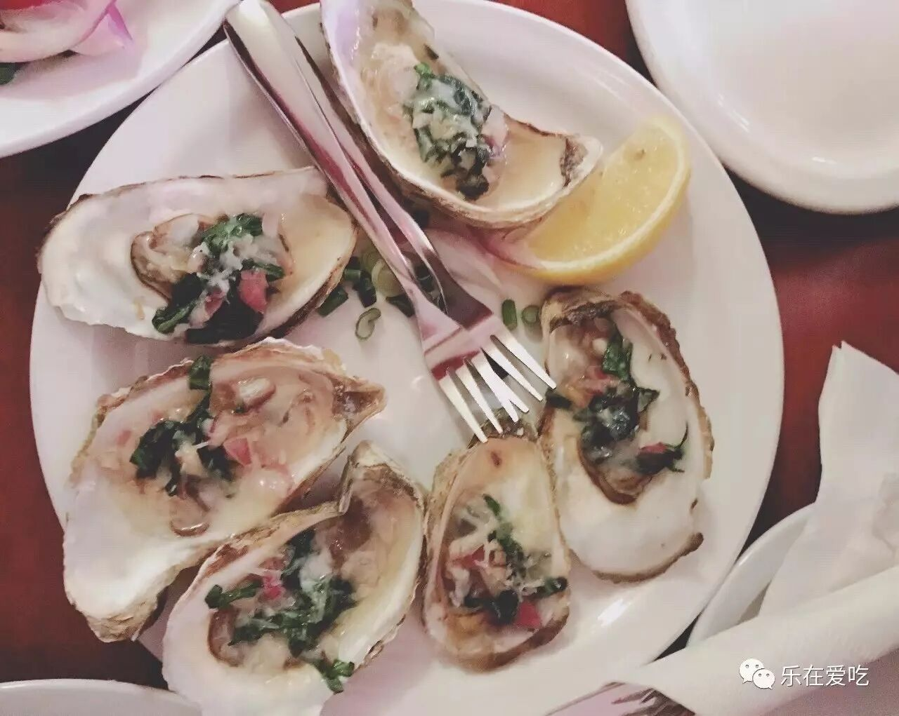 (原始链接: http://mmbiz.qpic.cn/mmbiz_jpg/XA8n2XaESnSbWMwslTlUVv0BnnwCgRDoicQdD2wBMjJeOJX4byDbVREZFibB6Coj0mx2QcMGOJRP6kGnxvsDIqUw/0/jpeg)
- 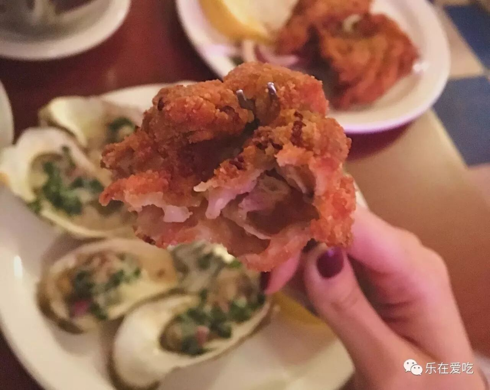 (原始链接: http://mmbiz.qpic.cn/mmbiz_jpg/XA8n2XaESnSbWMwslTlUVv0BnnwCgRDo2FGicIz7B89xX8KPHI3YwiaWSTkajYRRia2nnLtPmMYPPdicH5sANk8LTw/0/jpeg)
- 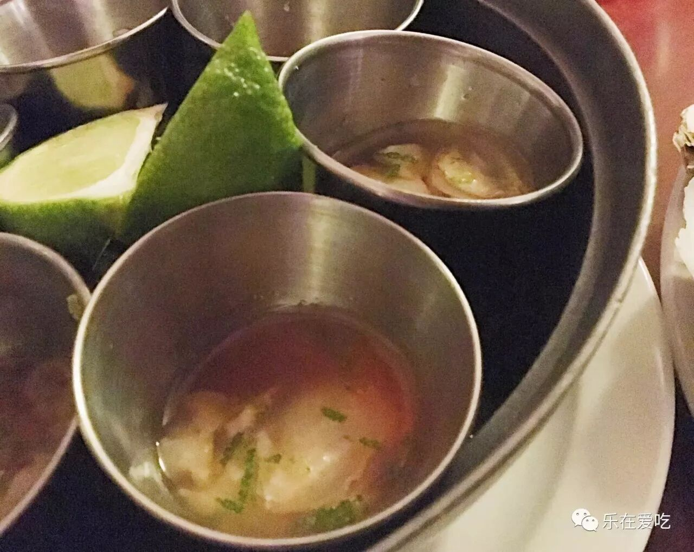 (原始链接: http://mmbiz.qpic.cn/mmbiz_jpg/XA8n2XaESnSbWMwslTlUVv0BnnwCgRDoawthkVzzIpOtPUuicEdge21jPHqCgHLHibuLkQHnGZgcvZsprWNveVEw/0/jpeg)
- 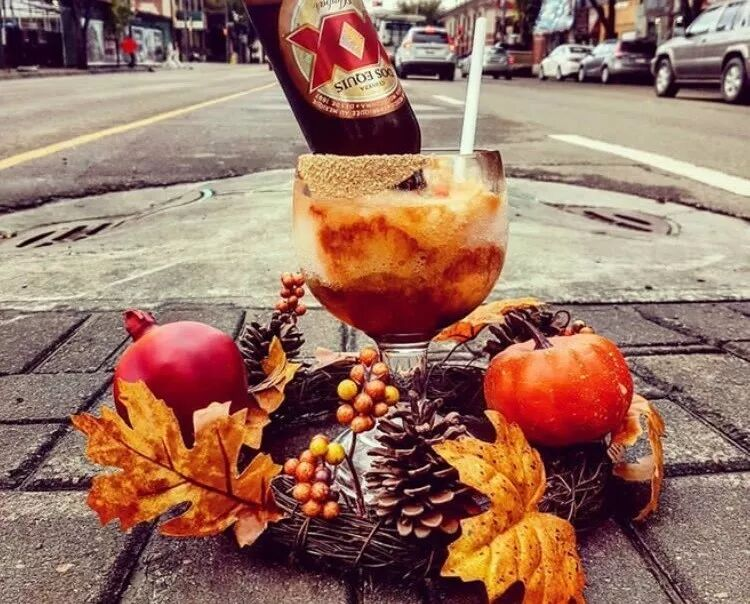 (原始链接: http://mmbiz.qpic.cn/mmbiz_jpg/XA8n2XaESnSbWMwslTlUVv0BnnwCgRDotGjMD8O1me78k0ECFUlrNTXtsIfl9E8uKZn2SxJdCb9YgkjyVNPDGQ/0/jpeg)
-  (原始链接: http://mmbiz.qpic.cn/mmbiz_jpg/XA8n2XaESnSbWMwslTlUVv0BnnwCgRDocGWBHXkpTvyFyvP73DUnDZibrzWE6HEickq23vyCiaIU7guwDGKGpL3oA/0/jpeg)
- 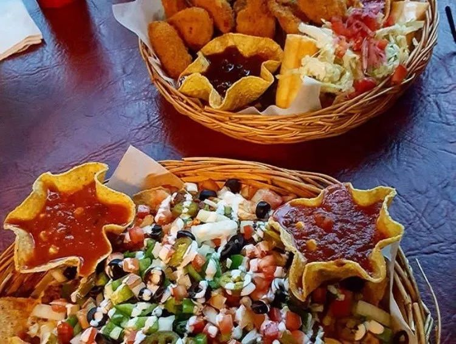 (原始链接: http://mmbiz.qpic.cn/mmbiz_jpg/XA8n2XaESnSbWMwslTlUVv0BnnwCgRDooHaE71VPKRFzBuW0w9hibhIxMGkTMxTbPSF8iav3jOHU8xkq9R2h4Z4Q/0/jpeg)
- 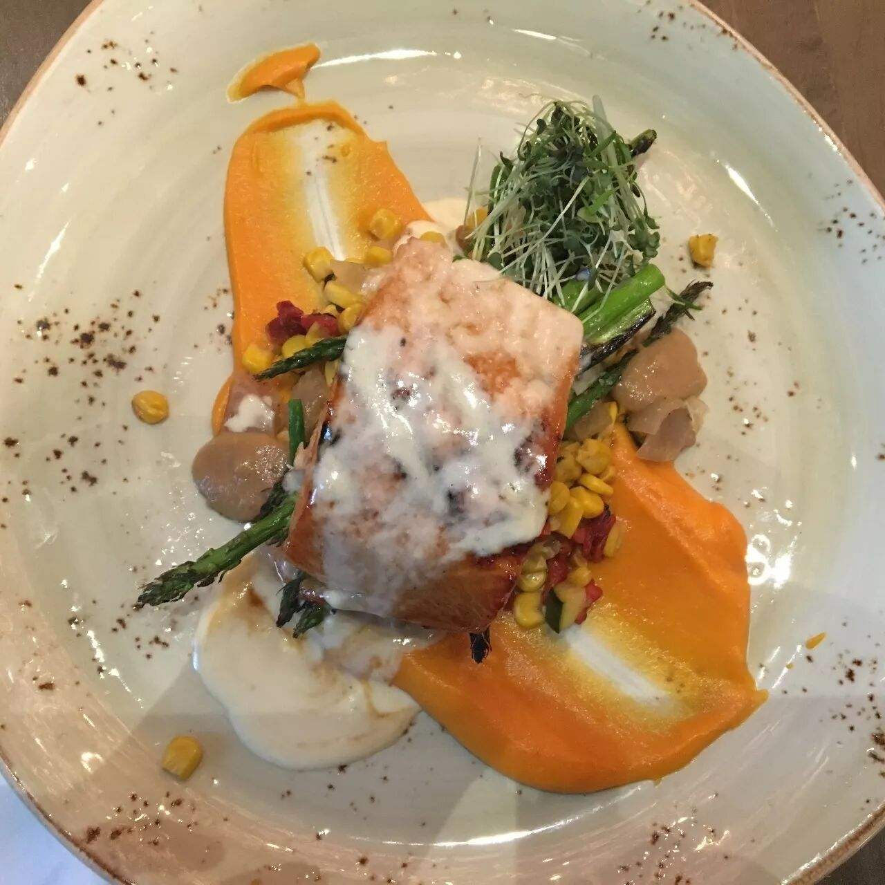 (原始链接: http://mmbiz.qpic.cn/mmbiz_jpg/XA8n2XaESnSbWMwslTlUVv0BnnwCgRDoOFNTXhic0Eqb1mZPicjUL8gFbibXWqv2ZCoUnL1j1GaZGTC5N7oOV92YA/0/jpeg)
- 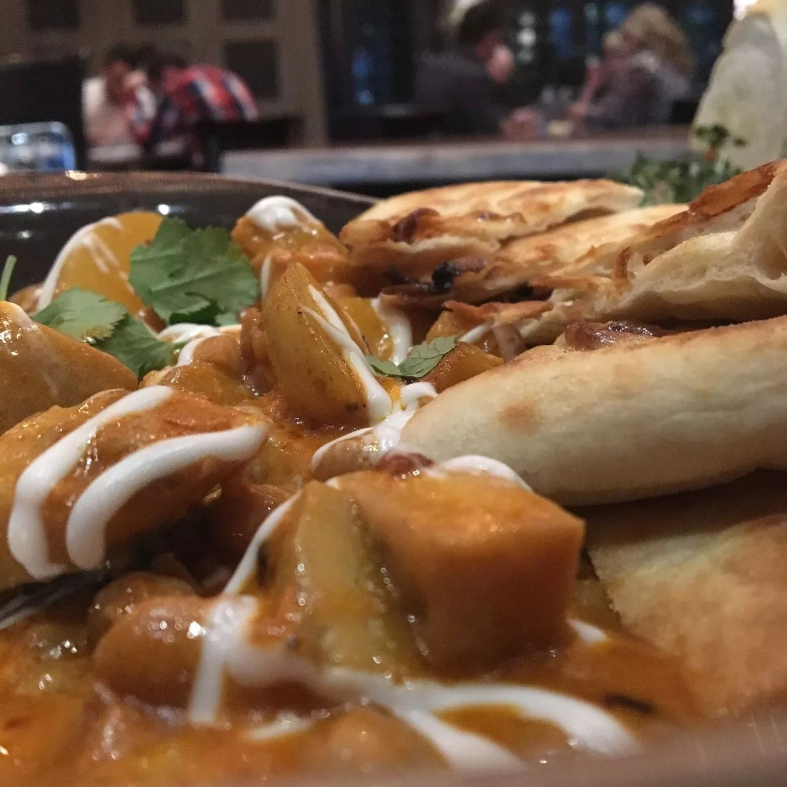 (原始链接: http://mmbiz.qpic.cn/mmbiz_jpg/XA8n2XaESnSbWMwslTlUVv0BnnwCgRDohKG4ubWe8pucXINcsHVWXfAsGp3p10n5oibdKA2n8bJicZrQUggkibrBA/0/jpeg)
- 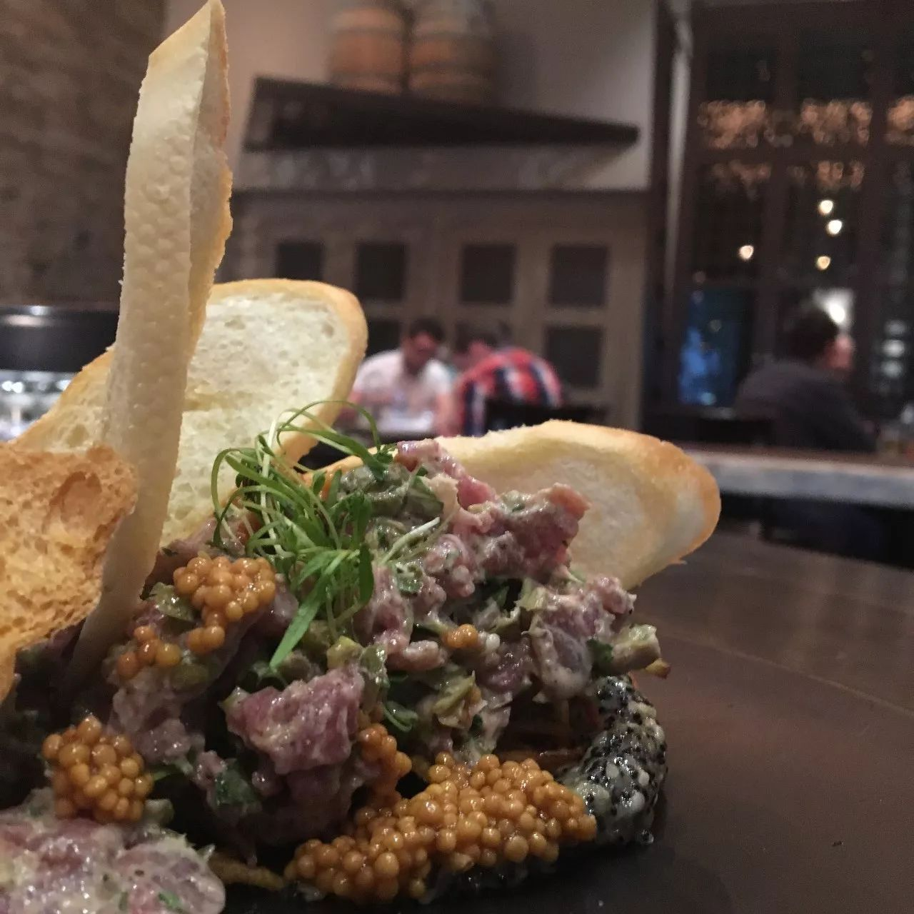 (原始链接: http://mmbiz.qpic.cn/mmbiz_jpg/XA8n2XaESnSbWMwslTlUVv0BnnwCgRDo5oTZCTg4nktfcYMQTUC2xyg3UPdChqQicOM2Iibdpwbzib7FwiarVzrqsQ/0/jpeg)
- 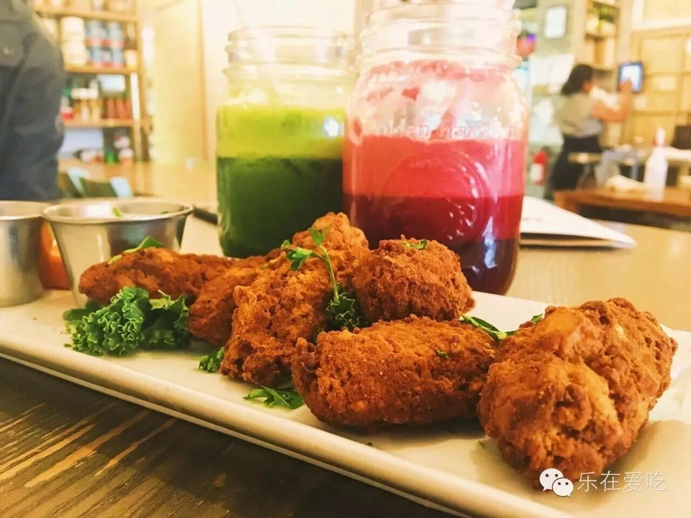 (原始链接: http://mmbiz.qpic.cn/mmbiz_jpg/XA8n2XaESnSbWMwslTlUVv0BnnwCgRDo1rkf4sOUS46Av1TcwgbZic8hA0OCYsncGtDRibxia9sZibEpyOVE3enzEA/0/jpeg)
- 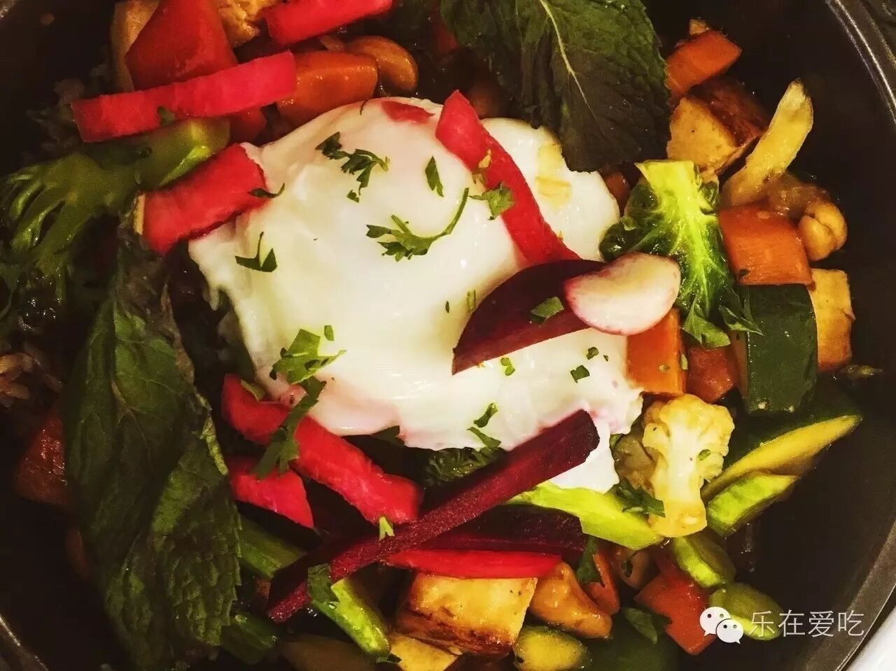 (原始链接: http://mmbiz.qpic.cn/mmbiz_jpg/XA8n2XaESnSbWMwslTlUVv0BnnwCgRDojIo9v2uCKauTu2KAXmObW1Tia0Ykg0A3sDribMUXeerwppnyjYVcuDyw/0/jpeg)
- 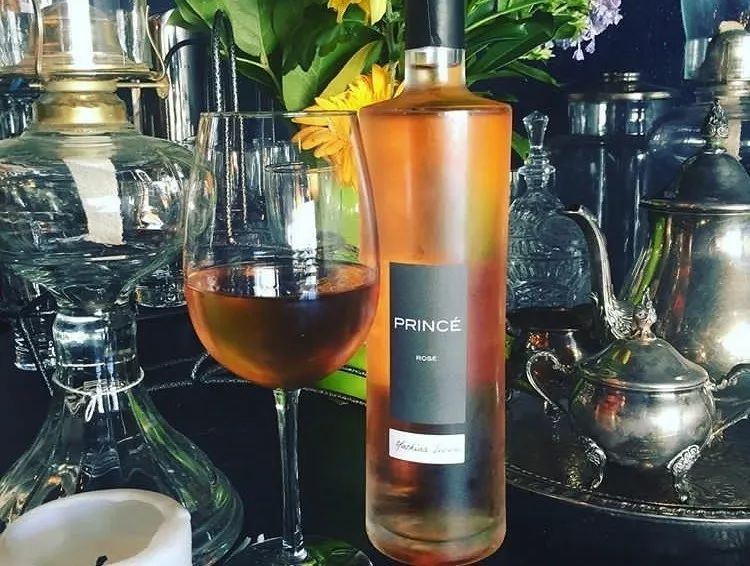 (原始链接: http://mmbiz.qpic.cn/mmbiz_jpg/XA8n2XaESnSbWMwslTlUVv0BnnwCgRDomfHnVKJ8TKvhYgRS2ichJyHEUwB9KPJP8xoRQxwTEylPaQEyrMHvKLQ/0/jpeg)
- 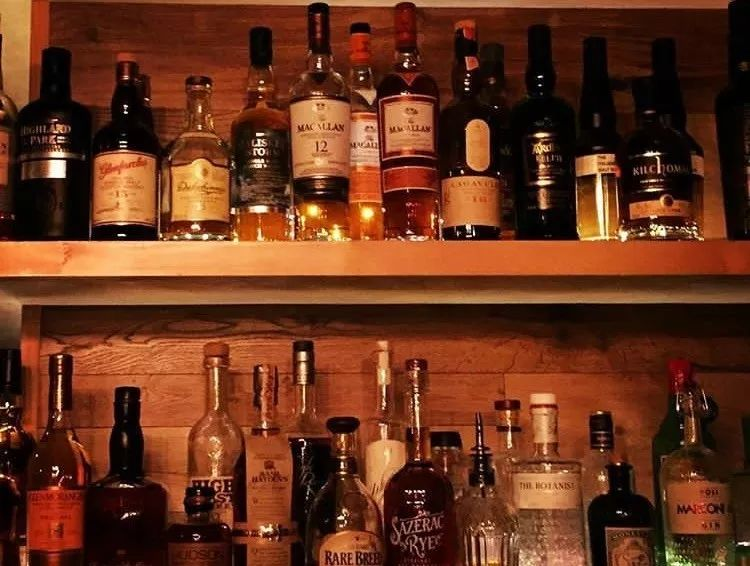 (原始链接: http://mmbiz.qpic.cn/mmbiz_jpg/XA8n2XaESnSbWMwslTlUVv0BnnwCgRDoxibBSzibeNn9ugygb9XOzld34caicrnqhOuRmVsYicwoLcuibj6EVNicRTsQ/0/jpeg)
- 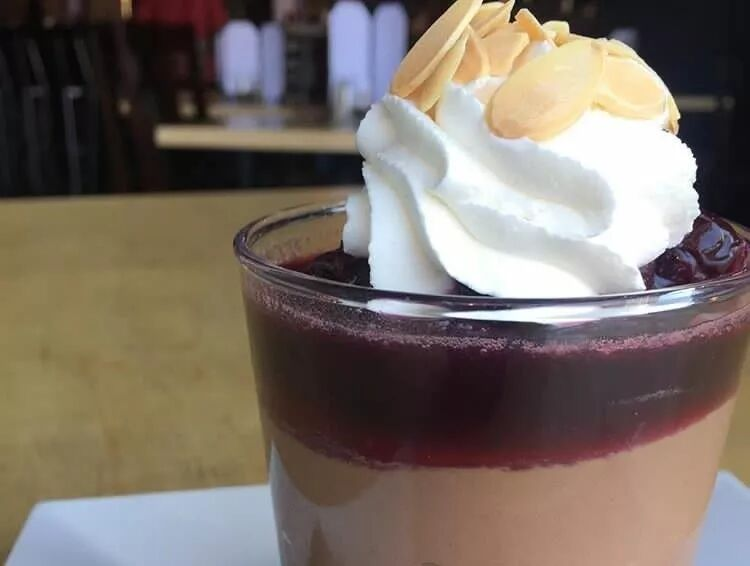 (原始链接: http://mmbiz.qpic.cn/mmbiz_jpg/XA8n2XaESnSbWMwslTlUVv0BnnwCgRDoIJCvqW13prGwh5KWjjaHXMkaXw7cf6cgpmV8mrvhC0XeQmwVeSO3PQ/0/jpeg)
- 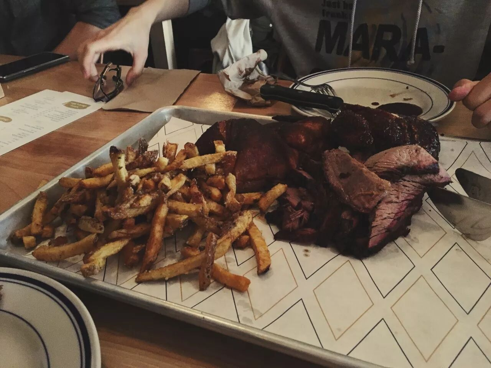 (原始链接: http://mmbiz.qpic.cn/mmbiz_jpg/XA8n2XaESnSbWMwslTlUVv0BnnwCgRDovsiaDx2UVzvP5pYTbpgibQbiaqTaibrDhQnZqby9csffTiaaNRbVcZl2ibkA/0/jpeg)
- 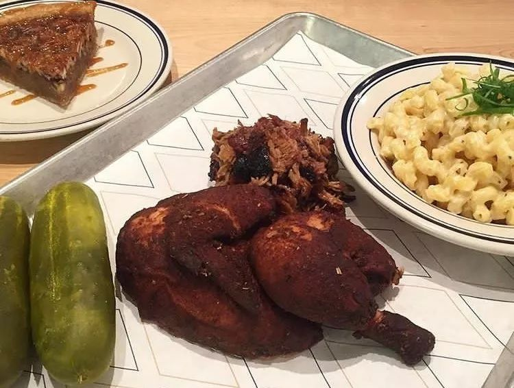 (原始链接: http://mmbiz.qpic.cn/mmbiz_jpg/XA8n2XaESnSbWMwslTlUVv0BnnwCgRDoWNuHKlZjFBrcE7T6oe23Gpe2eGTVXY9XbzwibjhbkED0gfaGWEf4Qrg/0/jpeg)
- 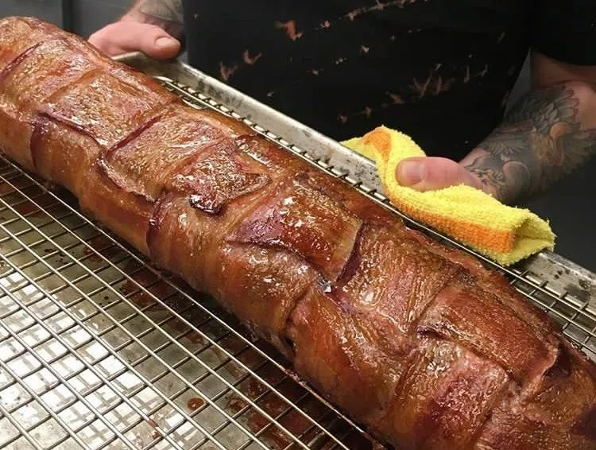 (原始链接: http://mmbiz.qpic.cn/mmbiz_jpg/XA8n2XaESnSbWMwslTlUVv0BnnwCgRDouye1sOp46NUEkG8IrszmhQVt1ibUej0fRgGmszxCL4LxHvibNmX5MS4Q/0/jpeg)
- 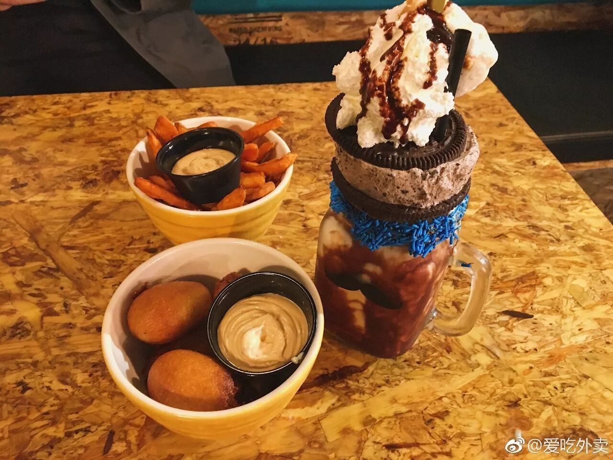 (原始链接: http://mmbiz.qpic.cn/mmbiz_jpg/XA8n2XaESnSbWMwslTlUVv0BnnwCgRDoVul6vpCxP0icFuMfjia0uOfCeZicc03qtAMxwugowIzo90P7SOk9qK5rg/0/jpeg)
- 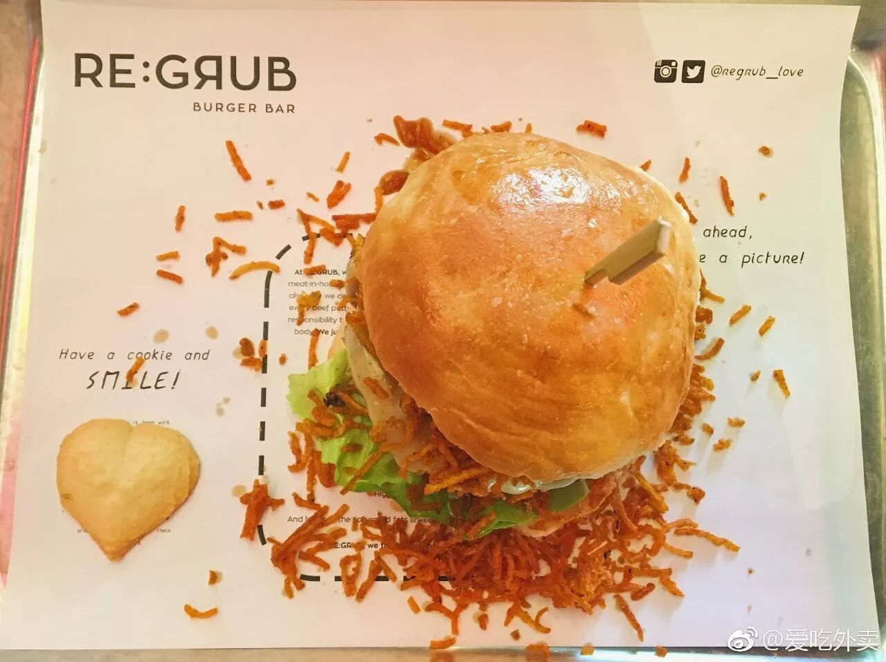 (原始链接: http://mmbiz.qpic.cn/mmbiz_jpg/XA8n2XaESnSbWMwslTlUVv0BnnwCgRDonWm2vrLoicpg2fBhJXledhccFpHrB27FVLP7mEZia9YhV2tO8Q67WWicw/0/jpeg)
- 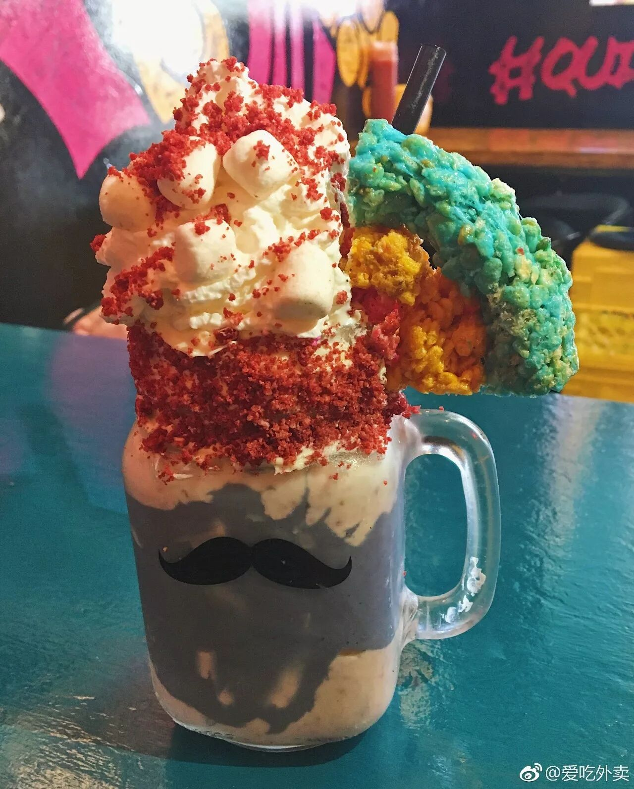 (原始链接: http://mmbiz.qpic.cn/mmbiz_jpg/XA8n2XaESnSbWMwslTlUVv0BnnwCgRDoH0csICJeYZcdQ54AhgWOgoRQ15LgxlV9MzZVPgpDAO1KDpB9VnMzoQ/0/jpeg)
- 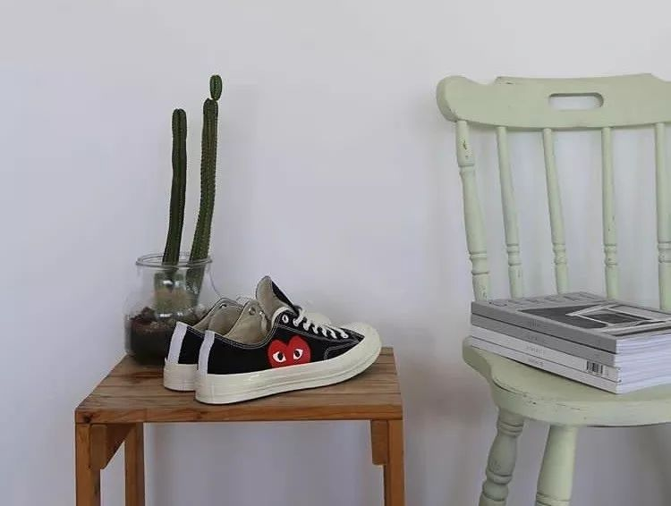 (原始链接: http://mmbiz.qpic.cn/mmbiz_jpg/XA8n2XaESnSbWMwslTlUVv0BnnwCgRDoFerXd1tssU4pibAamf1icv7via2s5B0e243BgBCXIu07lWYzYhDVEIQ3w/0/jpeg)
- 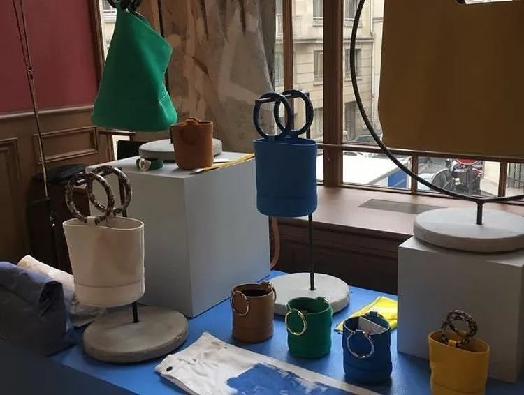 (原始链接: http://mmbiz.qpic.cn/mmbiz_jpg/XA8n2XaESnSbWMwslTlUVv0BnnwCgRDoMo5YibHjgVmsQGfPVRiasRDQwLHb7dTUGsR0769fKIRlH4lRpjdIJic8Q/0/jpeg)
- 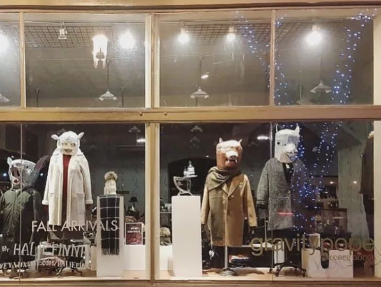 (原始链接: http://mmbiz.qpic.cn/mmbiz_jpg/XA8n2XaESnSbWMwslTlUVv0BnnwCgRDoYhs25aDNzj9B7uHkJia9yHblObibB6WIriaEJs5ed0nQS7IYWTOr4mELg/0/jpeg)
- 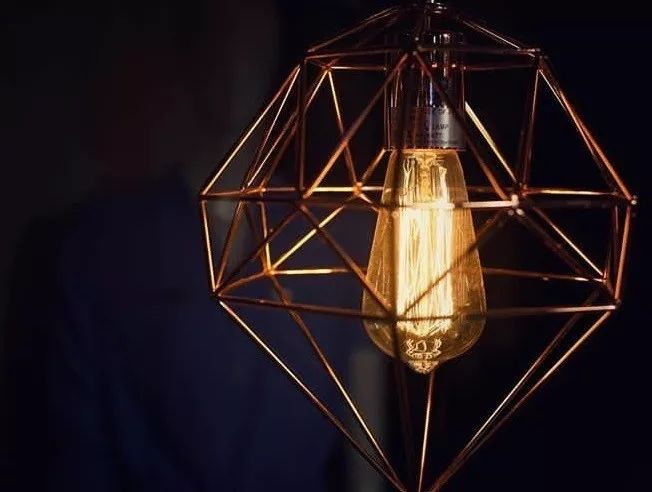 (原始链接: http://mmbiz.qpic.cn/mmbiz_jpg/XA8n2XaESnSbWMwslTlUVv0BnnwCgRDojxdIwR6WjwRgs3EuzhQcia2BVHsIm3xQD0QiatBLia8oxvPe7tehiaSpzQ/0/jpeg)
- 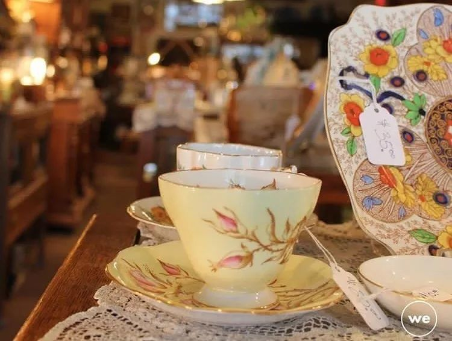 (原始链接: http://mmbiz.qpic.cn/mmbiz_jpg/XA8n2XaESnT1mia7YPKvshbiab5PGveKs5uvEsI1UcryicdrGCDcWDaJbPIibHHarAtibLaHl8Flf9dcJHNGEpcAWrg/0/jpeg)
- 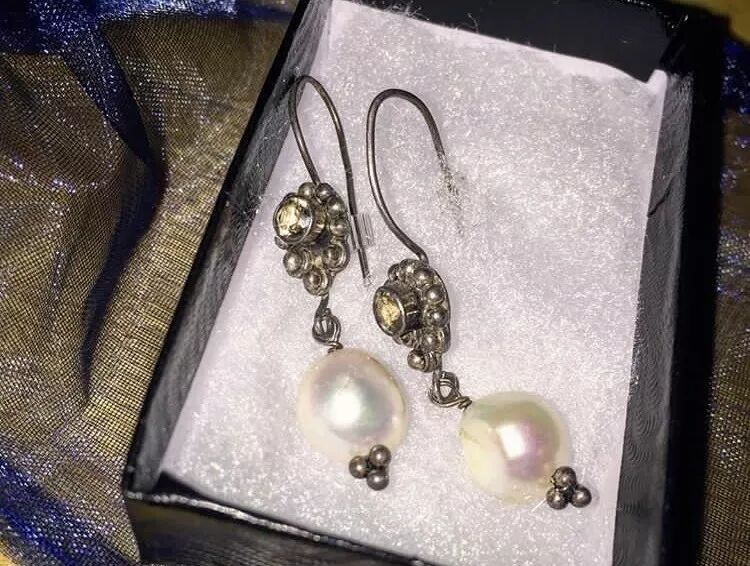 (原始链接: http://mmbiz.qpic.cn/mmbiz_jpg/XA8n2XaESnSbWMwslTlUVv0BnnwCgRDoicxo7pqbLqvoicTQFpyxLbJf6vjQIY8SZgRlO3wIwSK9ib0rVCaejUPAg/0/jpeg)
- 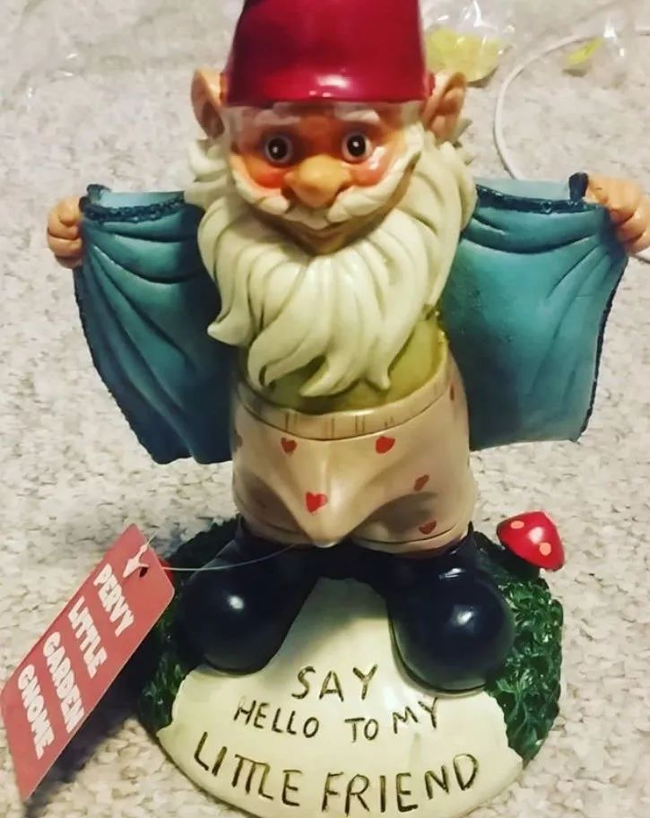 (原始链接: http://mmbiz.qpic.cn/mmbiz_jpg/XA8n2XaESnSbWMwslTlUVv0BnnwCgRDo3qzHiarE4OLVtQ8AR0mEGpHhJwfsaPiaaiaSZvx8ETjRs2xQcGlxCnMYw/0/jpeg)
- 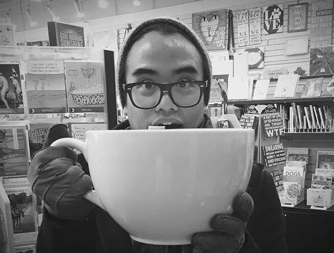 (原始链接: http://mmbiz.qpic.cn/mmbiz_jpg/XA8n2XaESnSbWMwslTlUVv0BnnwCgRDov0qEPngqb7IEAXYibXdcPMVMzvLXibu177reVGjkibiaSm0a9KcibJJfZng/0/jpeg)
- 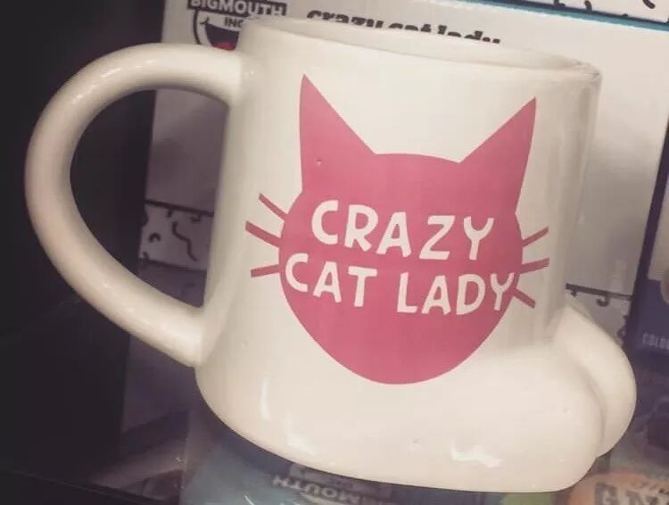 (原始链接: http://mmbiz.qpic.cn/mmbiz_jpg/XA8n2XaESnSbWMwslTlUVv0BnnwCgRDoWX1OngGSaXDPfSrdsXGGmZqn2DslyXj5icibnKGVtbsZgqaKqAaO5FKg/0/jpeg)
-  (原始链接: http://mmbiz.qpic.cn/mmbiz_png/UP8oZbwhibjaN4UlP6iaRR3fSr9UXHHwnfhGznmJSwI2dh16kAJUIUUUgqHmoJC3iaxPZqQH8Fb0rP9d0rFlL1cyA/0/png)
-  (原始链接: http://mmbiz.qpic.cn/mmbiz_png/UP8oZbwhibjaN4UlP6iaRR3fSr9UXHHwnfXvQjbAcKHQ0AMMibt6BXP98FbEicfgw7BeHy7U6nickppNa5zasbjotJg/0/png)
-  (原始链接: http://mmbiz.qpic.cn/mmbiz_png/FcfjbY3PNpmUgQzE5Vqbs9JQJRiaQSib0X0HHMrkxNxzXfeEHSZtvXwTgFd6C2SRz6ukV3iabvF9WIRDgutVbxZ4g/0/png)
-  (原始链接: http://mmbiz.qpic.cn/mmbiz_jpg/XA8n2XaESnT1mia7YPKvshbiab5PGveKs5pptjvvXevJdukSet5f6kcqHrYEfo3fiaLaHlful0SNIpiaSqXs3QH5jw/0/jpeg)
-  (原始链接: http://mmbiz.qpic.cn/mmbiz_png/GoRzy3JQC27UcX4qjREOxRiaRlHb4QTnkY1ibAEl1HwUibxTf1opwZZDgHv6BrhFFT0Eeoy6Z4HrWb2uXCYqMIYLQ/0/png)
