# 无标题

**链接地址:** http://mp.weixin.qq.com/s?__biz=MzI0NTU1MTkwNA==&mid=2247485122&idx=1&sn=65b76d67d437d7c22103b0b3be79cd3c&chksm=e94d808dde3a099b6c5933906e8751ac449d8d17a44e2a18b59074e0d7d85826c00e1ea46c24&mpshare=1&scene=2&srcid=11275tJ3MuaOD9OlGPK1ctr9#rd
**作者:** Joker
**获取时间:** 2025/8/28 22:22:26
**图片数量:** 72

---

## 原始HTML内容

于我来讲，对一座城市的记忆，多是靠街头美食撑起来的。

 

过去五年，前后三赴成都，短有一星期，长则一月多。七月手头事不多，加上桑拿天，食欲大减，故订票又去呆半月。

 

期间有三天在九寨沟，前脚离开后脚地震。愿逝者安息，生者如斯。

 

 

<strong>此篇美食指南里提到的饭馆，全是去不止一次，自己掏腰包的。</strong>再者，以大多店家的生意，也根本不用推广。

 

而我的标准，<strong>一看特色是否足。</strong>比如有不错的粤菜馆，但本地特色一般，即不写。

 

<strong>二看资历是否够老。</strong>动辄开五年十年的餐馆，至少是被周边民众认可的。过两年去，依然能找到以前的味道。

 

<strong>三看是否达到我舌头的合格线。</strong>贵餐厅得看主厨水准，在预算五六百或上千时，默认端上来的菜是被我挑剔的。但于人均三五十块的街头餐馆，我的合格线是调味和口感是否在合理范围内。

 

以下的二十多家餐馆，是在自己知道且喜欢的七八十家餐馆里挑出来，本次又特意去的，照片均为亲自拍摄。另写一家酒店，给游客们参考。

 

<strong>&gt;_&lt;</strong>

 

<strong>第一章，涮不够的火锅。</strong>

 

成都火锅太多，开遍大街小巷，多少年下来，也出咯一些大众喜欢的品牌。

小龙坎、大龙燚、蜀九香、川西坝子、麻辣空间，全去过。

 

偏爱的是<strong>大龙燚，</strong>锅底牛油混清油，辣味特别足。

 

 

但从锅底到食材全挑一遍，我会去<strong>龙森园。</strong>在琴台路，开够十年的火锅店，以清油锅底起家。是的，在老派人看来，牛油是重庆锅底，清油加各种药料才是成都的。如今也推出卤牛油底，味道不输别家的老油火锅。

 

 

卤牛油锅底可以拼一老汤锅，药料加得足但不违和，用来涮菌类和嫩牛肉特别棒。不得不提他家的黑毛肚和鸭肠，质量上乘且稳定，让人舒心。小酥肉味道不错，但肥肉有些偏多，有的一整条是肥肉。喜欢笋的人可以点一盘针笋，峨眉山特产。桌上的肉类是我每次必点，蘸料仅用香油和蒜末，顶多加一些香菜叶。

 

另外记住，鸭肠七上八下，涮十秒即可，黑毛肚下锅一分钟内捞出。

 

 

<strong>第二章，心心念的甜水面和豆花。</strong>

 

我于甜水面是有执念的，每次来得吃够五六家才罢休。

 

一碗甜水面，包罗着红糖和酱油的甜咸、四川特有的麻辣、芝麻和蒜的香，配上硬韧微咸的面条，入嘴难以言喻的满足。灵魂佐料是甜酱油，浅色酱油加红糖和多种香料小火熬的，各家有各家的配方。

 

自己在心里有排一二，若仅去一家，非张老二凉粉店，而是<strong>西大街的小谭豆花。</strong>

 

甜水面，甜酱油熬得略粘稠，红糖量偏大，撒花椒粉和芝麻粒，油辣味也十足。小谭豆花家的面条很出彩，粗细均匀，爽口而不僵硬，有韧劲微微黏牙。整体来讲，比较符合我的口味。

 

 

冰醉豆花是一绝，滑嫩爽口，微甜。

 

 

馓子豆花，可以理解为高配版咸豆腐脑，料足。

 

 

凉粉有些普通，可以接受。

 

 

海味面里有虾皮鱿鱼丝，不多的笋片和五花肉，混大量猪油，略腻。

 

 

小谭豆花也有分店，亲测不如总店稳定。

 

另一家是名声在外的<strong>洞子口张老二凉粉店，</strong>我的意思是，虽然他家有二三十年如一日的口味，但别抱太大期望。

 

我五年前第一次来张老二，五年后再来，依旧是粗细不均有些僵硬的面条，手滑撒的味精。甜酱油和辣椒油的味道一直在线，但在互联网的加持下，有些捧杀的意思咯。我不会让朋友专门来此吃一碗甜水面，怕他们失望。

 

 

黄凉粉蛮不错，可以来一碗。

 

 

下一家，<strong>小名堂担担甜水面红星路店。</strong>顺带提一嘴，这家的甜水面不错，钵钵鸡也地道。

 

甜水面，麻酱给得多，甜酱油偏稀。甜味醒人，辣味悠长。有趣的是，他家撒味精和张老二家一样手滑，面条也相似，略僵。

 

 

担担面一般，有些自砸招牌。红糖豆花比较地道，但略有糊味。

 

 

醪糟粉子我第一次在他家点，汤汁醇而甜，粉子软糯爽滑，小惊喜。

 

 

最后一家，<strong>玉带桥凉粉店。</strong>虽然叫玉带桥凉粉，但在宽窄巷子旁。放心，不是骗游客的名店，而是一被墙堵住有些难找的店。

 

甜酱油熬得很稠，呈果冻状，香料味足，店家也是费心费力咯。撒芝麻和花椒粉，底下铺红油，看不到味精什么的。面条略细，口感偏软但筋道，不黏牙。

 

 

他家的凉糕和凉粉全有碱水味但不至于苦，把控得不错。

 

 

 

<strong>第三章，略遗憾的串串店。</strong>

 

成都串串店遍布大街小巷，特别提醒一下，大多小串串店的竹签是回收的。

 

另外是心照不宣的，<strong>用老油。</strong>串串讲的就是底味，各种肉类加骨头日复一日地在底油中涮，把特有的鲜味煮进去，和卤水是一道理。卫生嘛，严格来讲，鲜有过关的。

 

你若图干净，吃不到足味的串串。而有名的串串，若肠胃不太强，第二天有得受。

 

我一直喜欢的四家串串店，<strong>钢管厂五区的结子串串、科大旁的山城风串串、川大后面的重庆森林</strong><strong>和北一环路边铁路新村里的彭记兔火锅串串。</strong>

 

之所以遗憾，一是未找到新的喜欢的串串店，二是因为钢管厂的串串被关咯，好像是被人举报用老油。他家的串串，底味特别足，明知道脏，竹签已经黑得不行，依旧会赶早来一顿。

 

<strong>重庆森林</strong>的钵钵鸡和冒脑花特别棒，这次去得太仓促，未拍照。

 

再就是<strong>山城风串串，</strong>直接上红锅，别点鸳鸯。

 

 

麻辣牛肉够嫩，小郡肝脆生生，另有软弹的兔肚和鲜黄辣丁。

 

 

记得点蛋炒饭，肯定会再来一碗。

 

<strong>彭记兔火锅串串</strong>该有20多年啦，店够破旧的，但每天爆满，多是本地人。上次去电扇坏咯，夏天围着火锅真和桑拿有一拼。他家的锅底够老，味自然也足。

 

鲜兔肉宽油炒后放锅底里煮，时间短的爽嫩，煮久的味足有嚼头。兔肉吃差不多可以去拿串串涮，兔腰一定得拿，然后牛肉和兔肚也不错，我自己喜欢加份苕粉。

 

再强调一遍，<strong>兔腰一定得拿。</strong>

 

这次也试咯两家新的串串店，均不大满意，暂且写上面三家吧。

 

 

<strong>第四章，不得不认的牛肉馆。</strong>

 

每次到成都，肯定来<strong>包家巷的皇城牛肉老店，</strong>而且不止一次。多年如一日的味道自不必讲，也喜欢老板的豪爽和亲切。

 

走到门口老板大声招呼一句，一位或两位，里面坐。然后我习惯回一句，谢谢。老板道，谢什么谢，赶紧坐，给你上我家的特色菜。对话，也一直未变。

 

粉蒸牛肉、肺片和清汤是一定有的，有时候也上盘小炒。是的，不点菜，老板安排。

 

粉蒸牛肉，加大量的芹菜叶和蒜末，裹粉均匀，牛肉软嫩有嚼头，火候拿捏得准。调味霸道，稍辣，微麻，略咸，拌饭一绝。

 

 

肺片特别爽嫩，配少量毛肚，加花生碎和芹菜，粗辣椒面重香不辣，似乎在二荆条和米椒的基础上加大比例的灯笼椒。

 

 

以上两道菜，真的是让我一直惦念，多少次也不厌。

 

萝卜牛肉略一般，萝卜虽多汁入味，但牛肉有些柴硬，不软烂。清汤里有加西红柿片，配芹菜，爽口，加分。

 

 

另一家也喜欢的牛肉店，<strong>在三桂前街，清真皇城坝牛肉馆。</strong>门面大不少，招牌的粉蒸牛肉在门口由专人做，但口味下滑咯。我去他家必点的，是葱蒸牛柳和番茄牛尾汤。

 

小葱牛柳，里脊肉腌入味上浆，过油后铺洋葱蒸，出锅撒大量葱花。牛柳爽口软嫩，嚼两口满嘴肉香。

 

 

番茄牛尾汤，番茄味足，酸甜口，牛尾软烂不缺嚼劲。汤底是提前熬的，上桌前再加大块番茄煮。

 

 

粉蒸牛肉不够嫩，调味也略咸。

 

 

肺片和包家巷的比，爽嫩程度差一些。

 

 

 

<strong>第五章，两代人的钟水饺。</strong>

 

第一次来82信箱吃水饺是三年前吧，彼时地图上搜不到，找大半天。如今呢，被各路美食号快吹上天咯。

 

这是一家二三十年的店，够老。婆婆从二十岁包水饺，一直包到六十多岁，脾气差，喜欢骂客人。但和张老二凉粉一样，有些捧杀咯。

 

 

我每次来，二两加一两和一碗凉面，有女孩的话，再煮二两即可。

 

水饺纯手工，老婆婆自己包。馅是肥瘦参半的猪肉，剁成蓉，稍有嚼劲。皮虽是手擀，但略厚。底料是菜籽油熬粗海椒面，加甜酱油和味精，配细细的蒜蓉，不加醋。 

 

 

是不错的水饺，但不至于封神。倒是我一好友为本地人，喜欢来，因为有小时候的味道。 

 

 

安安稳稳要一碗水饺，老婆婆真不至于凶你。另，凉面也很正。

 

 

长顺街三大封神的，海式包子，早不开咯；叶抄手，味道依旧，下一章讲；<strong>贺水饺，据传被小工接手咯，越来越差。</strong>

 

水饺的皮特厚，两边和中间垂直对折，看着大，但可以省不少馅料。搞不懂的是，猪肉也不是多贵，为什么不能把皮擀薄一点，多包些馅呢。

 

 

虽然调味稳定，但越来越不想专程跑一趟咯。

 

 

蒜泥白肉片提前片的放冷藏，口感不对。

 

 

和本地朋友来，他也一脸遗憾。

 

 

<strong>第六章，长顺街走出来的叶抄手。</strong>

 

刚提到的长顺街叶抄手，也是一家老店，因拆迁换地址，但招牌是立住咯，我每次必来。

 

有想去贺水饺的，不如来此点一碗红油抄手。

 

我喜欢他家的原汤抄手，汤是用猪骨和鸡架花时间熬的，难得。

 

 

抄手纵向对折包馅，再从两边折叠，一层皮一层馅，和云吞不一样。虽也讨巧省料，但因皮薄，不影响口味。

 

 

抄手以外也有粉蒸肉粉蒸排骨，口味一般。

 

 

 

<strong>第七章，依旧令人迷恋的锅盔。</strong>

 

曹家巷的明婷早不行咯，巷口的王记锅盔也搬到马鞍南路上，步行五六分钟。

 

锅盔内馅儿是小片的瘦肉加大量肥油，目测七成或更多。

 

 

面皮卷住肉馅再压扁，两面煎焦后放下面火炉烘烤收油。

 

 

入口外皮酥脆，里面因为肥油的缘故特别松软，麻味足微辣，肉片被一层一层夹着，嫩且多汁。

 

 

从曹家巷口到马鞍南路，多少年来，王记锅盔依旧让人迷恋。

 

他家的肥肠粉也不差，配一碗。

 

 

再走两步到马鞍北路，是有名的<strong>甘记肥肠粉。</strong>肥肠干净，但粉煮过头咯，调味仅是加油辣椒、盐和味精，真不怎么样。

 

 

 

<strong>第八章，十五年的蛋烘糕。</strong>

 

贺记蛋烘糕是一家族生意，起家是在文庙街，从四中毕业的人有感情在里头。贺爷爷年事已高，早歇着咯，如今打理的是一对年轻夫妇。

 

另一家，在小天中街，好像也是贺家人，用一块招牌。<strong>两家对比下来，我喜欢小天中街的。</strong>老板娘干十五年咯，动作特别麻利。出来的蛋烘糕，表皮焦脆，内里软和，蛋香扑鼻。

 

 

豇豆和肉松的必点，猪皮和怪味的卖得多。

 

 

我自己也喜欢山楂酱和芝麻糖的。

 

 

呃，手不是我的。

 

煎蛋烘糕用的是铜锅，导热快，易出焦层，但火候不容易掌握，得眼疾手快。老板娘同时用三口锅，技术真的是炉火纯青。

 

 

十五年的手艺，一个两块五，值得专程来一趟。

 

 

<strong>第九章，市井味十足的煎蛋面。</strong>

 

华兴街也走出不少老店，像雨田和自力，还有煎蛋面。雨田不多讲，越来越差，一年前来已经绕道咯。自力呢，做面的，也有水饺和抄手，偏一般。倒是<strong>华兴街煎蛋面，</strong>口味依旧能让我顺路来坐坐。

 

煎蛋面的汤是炝锅加番茄煮的，出锅前加味精，略寡淡。用的挂面，软绵绵的欠嚼劲。唯一加分的是煎蛋，外面煎到焦脆蛋黄依旧软嫩。蛋下面铺木耳菜，一种口感爽滑嚼着略黏的青菜，川渝地区喜欢拿来煮汤下面。

 

 

煎蛋以外，煮面操作简单，可能也是味道保留的原因。不必专程来，但路过的话，可以进去，来一碗从华兴街走出来的，市井味十足的煎蛋面。 

 

他家的凉糕别点，有苦味。

 

 

 

<strong>第十章，茶社与采耳。</strong>

 

成都人爱喝茶，特别是下午，喝茶听戏或聊天。<strong>在人民公园里有两家茶社，一家是鹤鸣，另一家叫少城苑。</strong>直接用大盖碗喝，一份十多二十块钱。

 

茶是一般，图一氛围。

 

<strong>鹤鸣</strong>似乎已有小一百年历史，差不多成一景点咯。人很多，本地的外地的全有，临着湖，景色不错。

 

 

<strong>但也因为人太多，我每次来，更爱去少城坐一坐。</strong>少城不太知名，人也少，茶与鹤鸣差不多。闹中有静，喝茶的同时可让师傅采耳。

 

 

采耳是一特有的营生，持证上岗，一般是家传或收徒。在宽窄巷子有不少采耳的摊位，因为人多，师傅们不怎么用心。即便在鹤鸣，也有因为生意多糊弄人的。

 

来少城会舒服一些，花一百块钱，让师傅认认真真掏二十多分钟，再给你拍打拍打背活动下颈椎和手臂。

 

 

我蛮尊重手艺人，因为一两年才来一趟，师傅靠谱，也愿意多花些钱。

 

 

<strong>第十一章，浅谈博舍酒店。</strong>

 

这次来成都共住过三家酒店，从八九百到两千多，最贵的是博舍。本不在计划内，但逛太古里的时候看到博舍老宅的门面，进去走一走，到大厅询问恰有房，即改到此处，也是想看看和北京瑜舍有什么不同。

 

 

第一天半夜回来的时候，拍一张夜景。

 

 

三天时间把下面的咖啡馆意大利餐厅和酒吧按摩店全去一遍，咖啡馆和餐厅水准在线，但谈不上有特色。谧寻也是老宅改的，环境清幽，按摩吧，倒一般。

 

<strong>对酒吧倒很满意，装修到位，也有特色，</strong>比如加花椒粉调的 Negroni 真是第一次喝。即使不住酒店，逛太古里也可来<strong>井酒吧</strong>坐坐。

 

 

酒店和大厅分开，地下一层即餐厅健身房和游泳池。住的90平米套房，有趣的是，客厅卧室洗漱间和厕所是相通的，又可用推拉门分开。

 

 

相比北京瑜舍的局促和简朴，博舍的空间和配置会让人轻松很多。

 

 

床上用品有些失望，放在两千多的酒店略普通。枕头蓬松度不够，睡一晚起来有些难受。

 

 

因为我脖颈僵，比较认枕头，家里用的一直是Cuddledown家的700或800蓬，在外住酒店的很少能遇到更舒服的。

 

 

洗漱间够宽敞，清洁产品和瑜舍一样，但淋浴头有些次，出水不均匀。

 

 

酒柜里的酒不怎么有诚意，喝的右边新西兰长相思，卖三百多，但也就一百来块的口味。

 

 

不太在乎价格的话，博舍是不错的酒店，很亲切，像进自己家一样，下次来依旧会住。<strong>但作为五星酒店，它是少一些刺激神经的让人感叹的东西，毕竟我花小五千块钱不仅仅是为舒舒服服睡两天。</strong>

 

另外，博舍出来有一家翠园，每天麻辣油腻可以换下口味。

 

 

 

<strong>第十二章，鸡爪和泡饭。</strong>

 

二孃鸡爪爪，离太古里不远，已经开分店咯，鸡爪和泡饭一直美味，可当夜宵。

 

鸡爪卤煮的时间精准，绵糯而不烂，底汤是粗辣椒面熬的红油，再放鲜米椒和小葱，足味。

 

 

泡饭有加鸡油，配香菇和鸡丝，汤头醇厚，调味恰当。

 

 

汤面用的是挂面，口感欠一些，略咸。

 

兔头肉有些稀松，不耐嚼，一般。

 

 

另提醒一下，他家的凉菜和小龙虾什么的不怎么样。

 

 

<strong>第十三章，蹄花面馆。</strong>

 

在成都，有一条东城根南街，开满各种老妈蹄花。我也不清楚老妈蹄花什么时候火的，到底因为哪家火的。上次把东城根南街吃一遍，认准13号的老妈蹄花，这次的第一天夜里即跑来。然后，很失望，有些凑合咯。

 

<strong>蹄花并不难做，就看你料足不足，肯不肯耐心熬。</strong>而端上来的蹄花，汤是够鲜，但猪蹄不够软烂，芸豆居然是硬的。

 

 

红糖糍粑依然不错，但以后估计不怎么来咯。

 

 

<strong>有的店自砸招牌，有的店却知道坚守，比如隆兴街的口味鲜面庄。</strong>开在居民楼下，十多年咯，这次去仅仅换咯一块不太脏的门头。

 

他家的蹄花是下足功夫的，猪蹄打横刀炖至少三小时，一挑即烂。芸豆估计和猪蹄一起炖到软绵，捞出备用，上桌前再加到碗里。另外，老派蹄花会加的海带丝，提鲜。

 

 

汤够鲜，肉够烂，能喝到绵绵的芸豆渣，一碗值得专程来吃的蹄花。蘸料是红油加豆豉和花生，配猪蹄不错。

 

招牌的口味鲜面，面条筋道，红油够香够辣。脆绍面也是特色，肉臊加葱油，微微辣，合我胃口。

 

 

他家的藕汤也可以，另我喜欢让老板凉拌一碟五花肉，片得均匀，口感软弹软弹的，调味也满意。

 

 

<strong>第十四章，两家老牌酒楼。</strong>

 

写得有些累，拿两家老牌酒楼结束吧。

 

老牌酒楼的意思呢，像北京的全聚德或东来顺，自己平日里不去，但喜欢请外地的朋友来。在某种意义上来讲，已经成为一座城市的烙印。

 

第一次来成都，朋友在红杏招待我。第二次来，是一群人，在大蓉和。他们各自的招牌菜，也像北京的烤鸭和涮羊肉，烙在人们心里。

 

因为历史原因，一品天下美食街以前是高端宴请的代名词，里面有三家老牌酒楼，文杏、红杏、大蓉和。文杏我一直未去，红杏与大蓉和因为已有不少连锁，每次来多少会去一两趟。

 

<strong>来的第二天晚饭即在红杏，</strong>点咯熟悉的鳝段粉丝、糊辣肉花、开水白菜、鸡豆花、豆汤饭，我特别喜欢的红糖锅盔，再加一碗冰粉。

 

 

鳝段粉丝是招牌菜，酸辣口，可按小份卖。糊辣肉花刀工在线，芡汁有些厚，油也多。这次的开水白菜有些不满意，高汤酒味明显，菜叶又偏老。鸡豆花和豆汤饭依旧好评，喜欢的红糖锅盔怎么也吃不腻。

 

第二次去是中午，点招牌的红杏鸡和樟茶鸭，水准在线，菌菇捞饭和担担面也可以。但想吐槽的是，为什么拿尖椒炒回锅肉。

 

 

<strong>临走的最后一餐在大蓉和，差不多是习惯啦。</strong>一是因为他家招牌的剁椒鱼头，叫开门红，拌盘面条寓意风调雨顺。二是很固定地喜欢他家三样菜，炒圆白菜，糯米蒸排骨，开水白菜。

 

 

炒圆白菜是一绝，加瑶柱丝和猪油渣急火短炒，端上桌依然烫嘴。

 

 

糯米排骨，排骨腌后和糯米蒸，调味恰当火候又精准，可直接当主食。

 

 

开水白菜高汤鲜活，用的菜心，每次来均不会失望，竹荪汤也美味。

 

 

然后，叫车去机场。

 

<strong>&gt;_&lt;</strong>

 

<strong>后记</strong>

 

北京从去年治理开墙打洞，封掉很多胡同里的餐馆和小店，老居民楼里多少年的杂货店也关咯。政策是惠民的，但多少有些遗憾。

 

此篇写到的一些餐馆，也开在居民楼里。比如82信箱歪婆婆的钟水饺，比如口味鲜，比如包家巷牛肉。像彭记兔火锅，搭棚卖二十多年。

 

这座城市不仅有为人乐道的悠闲，也有从上到下的包容。

 

老跟人笑称，有些味道落在成都，有生之年，只能一次次去找补回来。

 

 

<strong>知识有价，手留余香。</strong> 

 

 

<strong>欢迎转发。</strong>

---

## 纯文本内容

于我来讲，对一座城市的记忆，多是靠街头美食撑起来的。过去五年，前后三赴成都，短有一星期，长则一月多。七月手头事不多，加上桑拿天，食欲大减，故订票又去呆半月。期间有三天在九寨沟，前脚离开后脚地震。愿逝者安息，生者如斯。此篇美食指南里提到的饭馆，全是去不止一次，自己掏腰包的。再者，以大多店家的生意，也根本不用推广。而我的标准，一看特色是否足。比如有不错的粤菜馆，但本地特色一般，即不写。二看资历是否够老。动辄开五年十年的餐馆，至少是被周边民众认可的。过两年去，依然能找到以前的味道。三看是否达到我舌头的合格线。贵餐厅得看主厨水准，在预算五六百或上千时，默认端上来的菜是被我挑剔的。但于人均三五十块的街头餐馆，我的合格线是调味和口感是否在合理范围内。以下的二十多家餐馆，是在自己知道且喜欢的七八十家餐馆里挑出来，本次又特意去的，照片均为亲自拍摄。另写一家酒店，给游客们参考。>_<第一章，涮不够的火锅。成都火锅太多，开遍大街小巷，多少年下来，也出咯一些大众喜欢的品牌。小龙坎、大龙燚、蜀九香、川西坝子、麻辣空间，全去过。偏爱的是大龙燚，锅底牛油混清油，辣味特别足。但从锅底到食材全挑一遍，我会去龙森园。在琴台路，开够十年的火锅店，以清油锅底起家。是的，在老派人看来，牛油是重庆锅底，清油加各种药料才是成都的。如今也推出卤牛油底，味道不输别家的老油火锅。卤牛油锅底可以拼一老汤锅，药料加得足但不违和，用来涮菌类和嫩牛肉特别棒。不得不提他家的黑毛肚和鸭肠，质量上乘且稳定，让人舒心。小酥肉味道不错，但肥肉有些偏多，有的一整条是肥肉。喜欢笋的人可以点一盘针笋，峨眉山特产。桌上的肉类是我每次必点，蘸料仅用香油和蒜末，顶多加一些香菜叶。另外记住，鸭肠七上八下，涮十秒即可，黑毛肚下锅一分钟内捞出。第二章，心心念的甜水面和豆花。我于甜水面是有执念的，每次来得吃够五六家才罢休。一碗甜水面，包罗着红糖和酱油的甜咸、四川特有的麻辣、芝麻和蒜的香，配上硬韧微咸的面条，入嘴难以言喻的满足。灵魂佐料是甜酱油，浅色酱油加红糖和多种香料小火熬的，各家有各家的配方。自己在心里有排一二，若仅去一家，非张老二凉粉店，而是西大街的小谭豆花。甜水面，甜酱油熬得略粘稠，红糖量偏大，撒花椒粉和芝麻粒，油辣味也十足。小谭豆花家的面条很出彩，粗细均匀，爽口而不僵硬，有韧劲微微黏牙。整体来讲，比较符合我的口味。冰醉豆花是一绝，滑嫩爽口，微甜。馓子豆花，可以理解为高配版咸豆腐脑，料足。凉粉有些普通，可以接受。海味面里有虾皮鱿鱼丝，不多的笋片和五花肉，混大量猪油，略腻。小谭豆花也有分店，亲测不如总店稳定。另一家是名声在外的洞子口张老二凉粉店，我的意思是，虽然他家有二三十年如一日的口味，但别抱太大期望。我五年前第一次来张老二，五年后再来，依旧是粗细不均有些僵硬的面条，手滑撒的味精。甜酱油和辣椒油的味道一直在线，但在互联网的加持下，有些捧杀的意思咯。我不会让朋友专门来此吃一碗甜水面，怕他们失望。黄凉粉蛮不错，可以来一碗。下一家，小名堂担担甜水面红星路店。顺带提一嘴，这家的甜水面不错，钵钵鸡也地道。甜水面，麻酱给得多，甜酱油偏稀。甜味醒人，辣味悠长。有趣的是，他家撒味精和张老二家一样手滑，面条也相似，略僵。担担面一般，有些自砸招牌。红糖豆花比较地道，但略有糊味。醪糟粉子我第一次在他家点，汤汁醇而甜，粉子软糯爽滑，小惊喜。最后一家，玉带桥凉粉店。虽然叫玉带桥凉粉，但在宽窄巷子旁。放心，不是骗游客的名店，而是一被墙堵住有些难找的店。甜酱油熬得很稠，呈果冻状，香料味足，店家也是费心费力咯。撒芝麻和花椒粉，底下铺红油，看不到味精什么的。面条略细，口感偏软但筋道，不黏牙。他家的凉糕和凉粉全有碱水味但不至于苦，把控得不错。第三章，略遗憾的串串店。成都串串店遍布大街小巷，特别提醒一下，大多小串串店的竹签是回收的。另外是心照不宣的，用老油。串串讲的就是底味，各种肉类加骨头日复一日地在底油中涮，把特有的鲜味煮进去，和卤水是一道理。卫生嘛，严格来讲，鲜有过关的。你若图干净，吃不到足味的串串。而有名的串串，若肠胃不太强，第二天有得受。我一直喜欢的四家串串店，钢管厂五区的结子串串、科大旁的山城风串串、川大后面的重庆森林和北一环路边铁路新村里的彭记兔火锅串串。之所以遗憾，一是未找到新的喜欢的串串店，二是因为钢管厂的串串被关咯，好像是被人举报用老油。他家的串串，底味特别足，明知道脏，竹签已经黑得不行，依旧会赶早来一顿。重庆森林的钵钵鸡和冒脑花特别棒，这次去得太仓促，未拍照。再就是山城风串串，直接上红锅，别点鸳鸯。麻辣牛肉够嫩，小郡肝脆生生，另有软弹的兔肚和鲜黄辣丁。记得点蛋炒饭，肯定会再来一碗。彭记兔火锅串串该有20多年啦，店够破旧的，但每天爆满，多是本地人。上次去电扇坏咯，夏天围着火锅真和桑拿有一拼。他家的锅底够老，味自然也足。鲜兔肉宽油炒后放锅底里煮，时间短的爽嫩，煮久的味足有嚼头。兔肉吃差不多可以去拿串串涮，兔腰一定得拿，然后牛肉和兔肚也不错，我自己喜欢加份苕粉。再强调一遍，兔腰一定得拿。这次也试咯两家新的串串店，均不大满意，暂且写上面三家吧。第四章，不得不认的牛肉馆。每次到成都，肯定来包家巷的皇城牛肉老店，而且不止一次。多年如一日的味道自不必讲，也喜欢老板的豪爽和亲切。走到门口老板大声招呼一句，一位或两位，里面坐。然后我习惯回一句，谢谢。老板道，谢什么谢，赶紧坐，给你上我家的特色菜。对话，也一直未变。粉蒸牛肉、肺片和清汤是一定有的，有时候也上盘小炒。是的，不点菜，老板安排。粉蒸牛肉，加大量的芹菜叶和蒜末，裹粉均匀，牛肉软嫩有嚼头，火候拿捏得准。调味霸道，稍辣，微麻，略咸，拌饭一绝。肺片特别爽嫩，配少量毛肚，加花生碎和芹菜，粗辣椒面重香不辣，似乎在二荆条和米椒的基础上加大比例的灯笼椒。以上两道菜，真的是让我一直惦念，多少次也不厌。萝卜牛肉略一般，萝卜虽多汁入味，但牛肉有些柴硬，不软烂。清汤里有加西红柿片，配芹菜，爽口，加分。另一家也喜欢的牛肉店，在三桂前街，清真皇城坝牛肉馆。门面大不少，招牌的粉蒸牛肉在门口由专人做，但口味下滑咯。我去他家必点的，是葱蒸牛柳和番茄牛尾汤。小葱牛柳，里脊肉腌入味上浆，过油后铺洋葱蒸，出锅撒大量葱花。牛柳爽口软嫩，嚼两口满嘴肉香。番茄牛尾汤，番茄味足，酸甜口，牛尾软烂不缺嚼劲。汤底是提前熬的，上桌前再加大块番茄煮。粉蒸牛肉不够嫩，调味也略咸。肺片和包家巷的比，爽嫩程度差一些。第五章，两代人的钟水饺。第一次来82信箱吃水饺是三年前吧，彼时地图上搜不到，找大半天。如今呢，被各路美食号快吹上天咯。这是一家二三十年的店，够老。婆婆从二十岁包水饺，一直包到六十多岁，脾气差，喜欢骂客人。但和张老二凉粉一样，有些捧杀咯。我每次来，二两加一两和一碗凉面，有女孩的话，再煮二两即可。水饺纯手工，老婆婆自己包。馅是肥瘦参半的猪肉，剁成蓉，稍有嚼劲。皮虽是手擀，但略厚。底料是菜籽油熬粗海椒面，加甜酱油和味精，配细细的蒜蓉，不加醋。是不错的水饺，但不至于封神。倒是我一好友为本地人，喜欢来，因为有小时候的味道。安安稳稳要一碗水饺，老婆婆真不至于凶你。另，凉面也很正。长顺街三大封神的，海式包子，早不开咯；叶抄手，味道依旧，下一章讲；贺水饺，据传被小工接手咯，越来越差。水饺的皮特厚，两边和中间垂直对折，看着大，但可以省不少馅料。搞不懂的是，猪肉也不是多贵，为什么不能把皮擀薄一点，多包些馅呢。虽然调味稳定，但越来越不想专程跑一趟咯。蒜泥白肉片提前片的放冷藏，口感不对。和本地朋友来，他也一脸遗憾。第六章，长顺街走出来的叶抄手。刚提到的长顺街叶抄手，也是一家老店，因拆迁换地址，但招牌是立住咯，我每次必来。有想去贺水饺的，不如来此点一碗红油抄手。我喜欢他家的原汤抄手，汤是用猪骨和鸡架花时间熬的，难得。抄手纵向对折包馅，再从两边折叠，一层皮一层馅，和云吞不一样。虽也讨巧省料，但因皮薄，不影响口味。抄手以外也有粉蒸肉粉蒸排骨，口味一般。第七章，依旧令人迷恋的锅盔。曹家巷的明婷早不行咯，巷口的王记锅盔也搬到马鞍南路上，步行五六分钟。锅盔内馅儿是小片的瘦肉加大量肥油，目测七成或更多。面皮卷住肉馅再压扁，两面煎焦后放下面火炉烘烤收油。入口外皮酥脆，里面因为肥油的缘故特别松软，麻味足微辣，肉片被一层一层夹着，嫩且多汁。从曹家巷口到马鞍南路，多少年来，王记锅盔依旧让人迷恋。他家的肥肠粉也不差，配一碗。再走两步到马鞍北路，是有名的甘记肥肠粉。肥肠干净，但粉煮过头咯，调味仅是加油辣椒、盐和味精，真不怎么样。第八章，十五年的蛋烘糕。贺记蛋烘糕是一家族生意，起家是在文庙街，从四中毕业的人有感情在里头。贺爷爷年事已高，早歇着咯，如今打理的是一对年轻夫妇。另一家，在小天中街，好像也是贺家人，用一块招牌。两家对比下来，我喜欢小天中街的。老板娘干十五年咯，动作特别麻利。出来的蛋烘糕，表皮焦脆，内里软和，蛋香扑鼻。豇豆和肉松的必点，猪皮和怪味的卖得多。我自己也喜欢山楂酱和芝麻糖的。呃，手不是我的。煎蛋烘糕用的是铜锅，导热快，易出焦层，但火候不容易掌握，得眼疾手快。老板娘同时用三口锅，技术真的是炉火纯青。十五年的手艺，一个两块五，值得专程来一趟。第九章，市井味十足的煎蛋面。华兴街也走出不少老店，像雨田和自力，还有煎蛋面。雨田不多讲，越来越差，一年前来已经绕道咯。自力呢，做面的，也有水饺和抄手，偏一般。倒是华兴街煎蛋面，口味依旧能让我顺路来坐坐。煎蛋面的汤是炝锅加番茄煮的，出锅前加味精，略寡淡。用的挂面，软绵绵的欠嚼劲。唯一加分的是煎蛋，外面煎到焦脆蛋黄依旧软嫩。蛋下面铺木耳菜，一种口感爽滑嚼着略黏的青菜，川渝地区喜欢拿来煮汤下面。煎蛋以外，煮面操作简单，可能也是味道保留的原因。不必专程来，但路过的话，可以进去，来一碗从华兴街走出来的，市井味十足的煎蛋面。他家的凉糕别点，有苦味。第十章，茶社与采耳。成都人爱喝茶，特别是下午，喝茶听戏或聊天。在人民公园里有两家茶社，一家是鹤鸣，另一家叫少城苑。直接用大盖碗喝，一份十多二十块钱。茶是一般，图一氛围。鹤鸣似乎已有小一百年历史，差不多成一景点咯。人很多，本地的外地的全有，临着湖，景色不错。但也因为人太多，我每次来，更爱去少城坐一坐。少城不太知名，人也少，茶与鹤鸣差不多。闹中有静，喝茶的同时可让师傅采耳。采耳是一特有的营生，持证上岗，一般是家传或收徒。在宽窄巷子有不少采耳的摊位，因为人多，师傅们不怎么用心。即便在鹤鸣，也有因为生意多糊弄人的。来少城会舒服一些，花一百块钱，让师傅认认真真掏二十多分钟，再给你拍打拍打背活动下颈椎和手臂。我蛮尊重手艺人，因为一两年才来一趟，师傅靠谱，也愿意多花些钱。第十一章，浅谈博舍酒店。这次来成都共住过三家酒店，从八九百到两千多，最贵的是博舍。本不在计划内，但逛太古里的时候看到博舍老宅的门面，进去走一走，到大厅询问恰有房，即改到此处，也是想看看和北京瑜舍有什么不同。第一天半夜回来的时候，拍一张夜景。三天时间把下面的咖啡馆意大利餐厅和酒吧按摩店全去一遍，咖啡馆和餐厅水准在线，但谈不上有特色。谧寻也是老宅改的，环境清幽，按摩吧，倒一般。对酒吧倒很满意，装修到位，也有特色，比如加花椒粉调的 Negroni 真是第一次喝。即使不住酒店，逛太古里也可来井酒吧坐坐。酒店和大厅分开，地下一层即餐厅健身房和游泳池。住的90平米套房，有趣的是，客厅卧室洗漱间和厕所是相通的，又可用推拉门分开。相比北京瑜舍的局促和简朴，博舍的空间和配置会让人轻松很多。床上用品有些失望，放在两千多的酒店略普通。枕头蓬松度不够，睡一晚起来有些难受。因为我脖颈僵，比较认枕头，家里用的一直是Cuddledown家的700或800蓬，在外住酒店的很少能遇到更舒服的。洗漱间够宽敞，清洁产品和瑜舍一样，但淋浴头有些次，出水不均匀。酒柜里的酒不怎么有诚意，喝的右边新西兰长相思，卖三百多，但也就一百来块的口味。不太在乎价格的话，博舍是不错的酒店，很亲切，像进自己家一样，下次来依旧会住。但作为五星酒店，它是少一些刺激神经的让人感叹的东西，毕竟我花小五千块钱不仅仅是为舒舒服服睡两天。另外，博舍出来有一家翠园，每天麻辣油腻可以换下口味。第十二章，鸡爪和泡饭。二孃鸡爪爪，离太古里不远，已经开分店咯，鸡爪和泡饭一直美味，可当夜宵。鸡爪卤煮的时间精准，绵糯而不烂，底汤是粗辣椒面熬的红油，再放鲜米椒和小葱，足味。泡饭有加鸡油，配香菇和鸡丝，汤头醇厚，调味恰当。汤面用的是挂面，口感欠一些，略咸。兔头肉有些稀松，不耐嚼，一般。另提醒一下，他家的凉菜和小龙虾什么的不怎么样。第十三章，蹄花面馆。在成都，有一条东城根南街，开满各种老妈蹄花。我也不清楚老妈蹄花什么时候火的，到底因为哪家火的。上次把东城根南街吃一遍，认准13号的老妈蹄花，这次的第一天夜里即跑来。然后，很失望，有些凑合咯。蹄花并不难做，就看你料足不足，肯不肯耐心熬。而端上来的蹄花，汤是够鲜，但猪蹄不够软烂，芸豆居然是硬的。红糖糍粑依然不错，但以后估计不怎么来咯。有的店自砸招牌，有的店却知道坚守，比如隆兴街的口味鲜面庄。开在居民楼下，十多年咯，这次去仅仅换咯一块不太脏的门头。他家的蹄花是下足功夫的，猪蹄打横刀炖至少三小时，一挑即烂。芸豆估计和猪蹄一起炖到软绵，捞出备用，上桌前再加到碗里。另外，老派蹄花会加的海带丝，提鲜。汤够鲜，肉够烂，能喝到绵绵的芸豆渣，一碗值得专程来吃的蹄花。蘸料是红油加豆豉和花生，配猪蹄不错。招牌的口味鲜面，面条筋道，红油够香够辣。脆绍面也是特色，肉臊加葱油，微微辣，合我胃口。他家的藕汤也可以，另我喜欢让老板凉拌一碟五花肉，片得均匀，口感软弹软弹的，调味也满意。第十四章，两家老牌酒楼。写得有些累，拿两家老牌酒楼结束吧。老牌酒楼的意思呢，像北京的全聚德或东来顺，自己平日里不去，但喜欢请外地的朋友来。在某种意义上来讲，已经成为一座城市的烙印。第一次来成都，朋友在红杏招待我。第二次来，是一群人，在大蓉和。他们各自的招牌菜，也像北京的烤鸭和涮羊肉，烙在人们心里。因为历史原因，一品天下美食街以前是高端宴请的代名词，里面有三家老牌酒楼，文杏、红杏、大蓉和。文杏我一直未去，红杏与大蓉和因为已有不少连锁，每次来多少会去一两趟。来的第二天晚饭即在红杏，点咯熟悉的鳝段粉丝、糊辣肉花、开水白菜、鸡豆花、豆汤饭，我特别喜欢的红糖锅盔，再加一碗冰粉。鳝段粉丝是招牌菜，酸辣口，可按小份卖。糊辣肉花刀工在线，芡汁有些厚，油也多。这次的开水白菜有些不满意，高汤酒味明显，菜叶又偏老。鸡豆花和豆汤饭依旧好评，喜欢的红糖锅盔怎么也吃不腻。第二次去是中午，点招牌的红杏鸡和樟茶鸭，水准在线，菌菇捞饭和担担面也可以。但想吐槽的是，为什么拿尖椒炒回锅肉。临走的最后一餐在大蓉和，差不多是习惯啦。一是因为他家招牌的剁椒鱼头，叫开门红，拌盘面条寓意风调雨顺。二是很固定地喜欢他家三样菜，炒圆白菜，糯米蒸排骨，开水白菜。炒圆白菜是一绝，加瑶柱丝和猪油渣急火短炒，端上桌依然烫嘴。糯米排骨，排骨腌后和糯米蒸，调味恰当火候又精准，可直接当主食。开水白菜高汤鲜活，用的菜心，每次来均不会失望，竹荪汤也美味。然后，叫车去机场。>_<后记北京从去年治理开墙打洞，封掉很多胡同里的餐馆和小店，老居民楼里多少年的杂货店也关咯。政策是惠民的，但多少有些遗憾。此篇写到的一些餐馆，也开在居民楼里。比如82信箱歪婆婆的钟水饺，比如口味鲜，比如包家巷牛肉。像彭记兔火锅，搭棚卖二十多年。这座城市不仅有为人乐道的悠闲，也有从上到下的包容。老跟人笑称，有些味道落在成都，有生之年，只能一次次去找补回来。知识有价，手留余香。欢迎转发。

---

## 图片列表

-  (原始链接: https://mmbiz.qpic.cn/mmbiz_jpg/zEV5HrLLB8JcGUVgcFKMvJvnJdSYXEL9n9I12nsfLaQr4wyZI2qfvuyLaZXuEkdDORMRwc8ZE7NvXja7t0cULw/0?wx_fmt=jpeg)
- 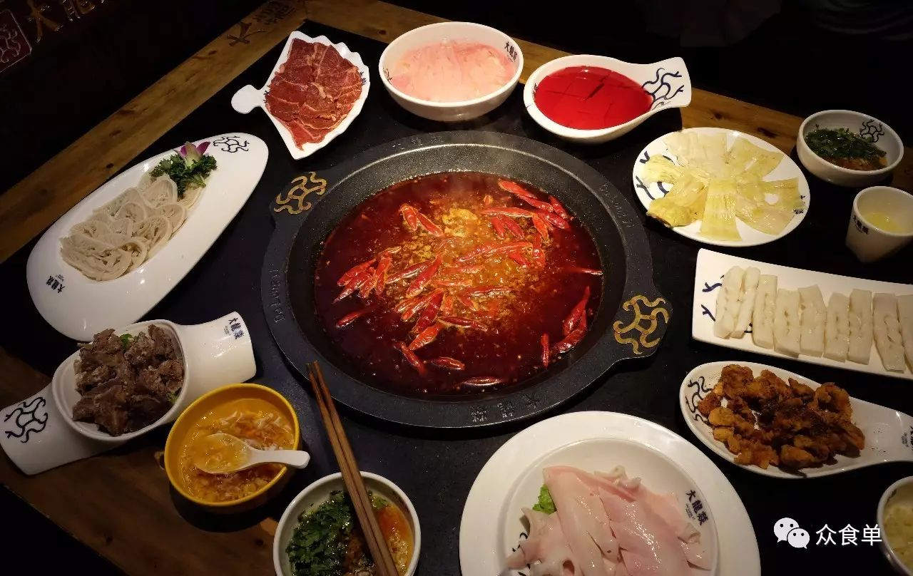 (原始链接: https://mmbiz.qpic.cn/mmbiz_jpg/zEV5HrLLB8JcGUVgcFKMvJvnJdSYXEL9yoayJFLUb6O8T1FYS9LH5sHZpkQynhyDMNe0CibDHJuHXlX4NU84ZiaA/0?wx_fmt=jpeg)
- 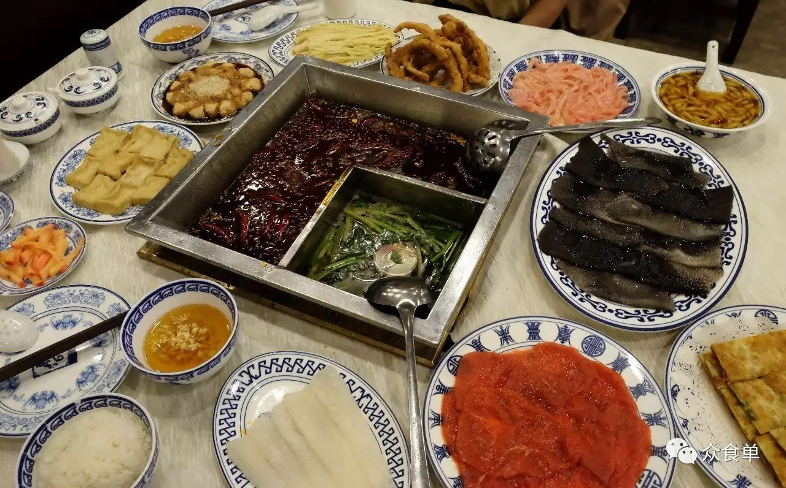 (原始链接: https://mmbiz.qpic.cn/mmbiz_jpg/zEV5HrLLB8JcGUVgcFKMvJvnJdSYXEL9K6xaHPekh8v6hDMOobRn6GS6oUtT41PBUsrbVpGplKzV0O7WJshwyw/0?wx_fmt=jpeg)
- 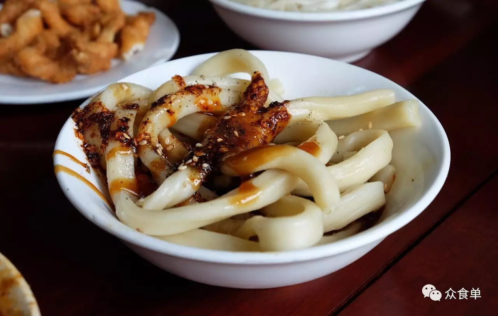 (原始链接: https://mmbiz.qpic.cn/mmbiz_jpg/zEV5HrLLB8JcGUVgcFKMvJvnJdSYXEL9mlMmqTfm2MDp3dBg1Rgacw8PbAYHO8nibemasuNS6JVxicOpjOicGoDDg/0?wx_fmt=jpeg)
- 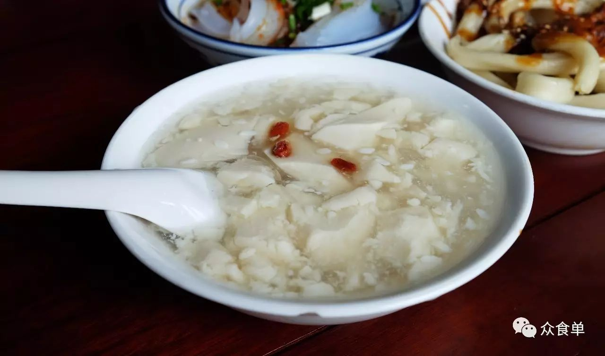 (原始链接: https://mmbiz.qpic.cn/mmbiz_jpg/zEV5HrLLB8JcGUVgcFKMvJvnJdSYXEL9fYYPCqeIF4nqBlnFI3T5c14QPh2dNmWAEwqhNh0mic3uvLfUchywxZg/0?wx_fmt=jpeg)
- 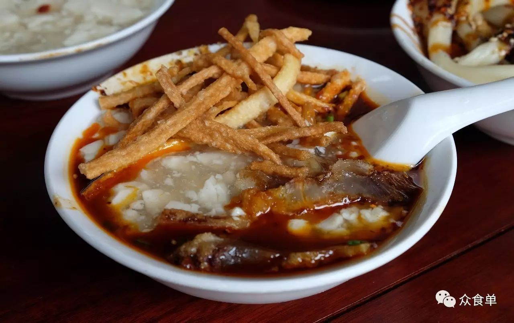 (原始链接: https://mmbiz.qpic.cn/mmbiz_jpg/zEV5HrLLB8JcGUVgcFKMvJvnJdSYXEL9ibR9VatnNQCEgbSViag0aReOWHvTvZRofMOzabGmIUIiawBdcCV6lYibWw/0?wx_fmt=jpeg)
- 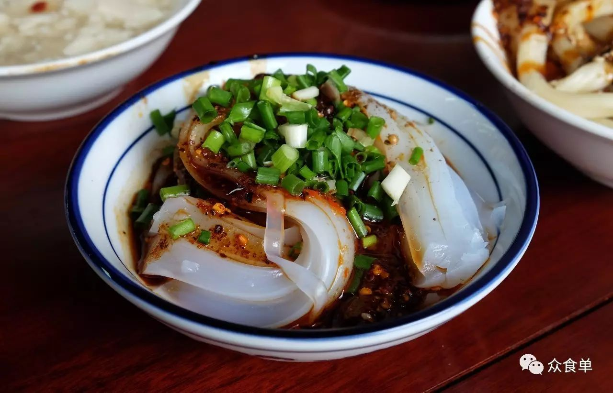 (原始链接: https://mmbiz.qpic.cn/mmbiz_jpg/zEV5HrLLB8JcGUVgcFKMvJvnJdSYXEL9A94ViaJIOndiaBWoq86yIEcyhgws7ztMDrahyMaKVoy2rFibVSknTFpAA/0?wx_fmt=jpeg)
- 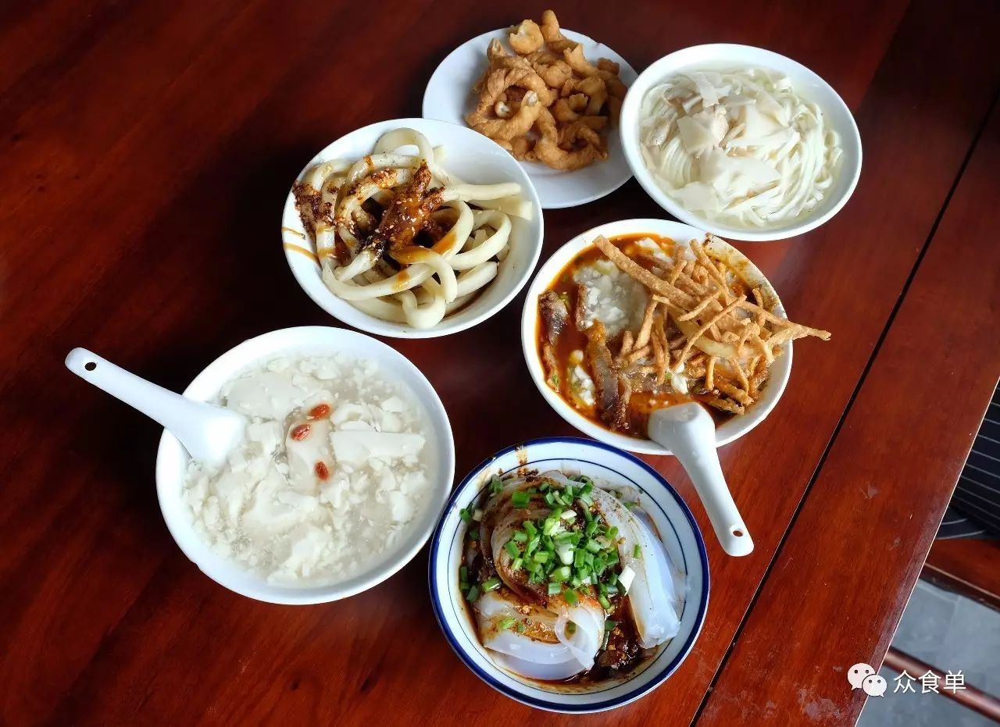 (原始链接: https://mmbiz.qpic.cn/mmbiz_jpg/zEV5HrLLB8JcGUVgcFKMvJvnJdSYXEL9cVZia7dUzxsTLW2pHfz4EfL1HZmpLQMruyY7t79Ry2R9lNqNJlChKIA/0?wx_fmt=jpeg)
- 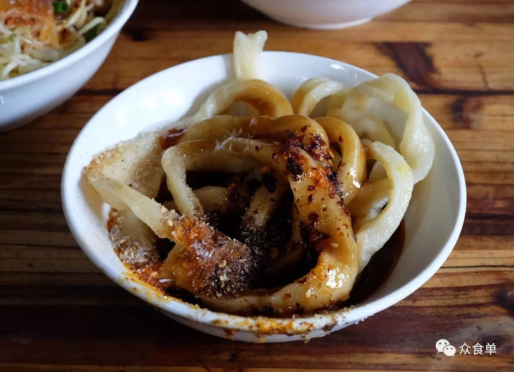 (原始链接: https://mmbiz.qpic.cn/mmbiz_jpg/zEV5HrLLB8JcGUVgcFKMvJvnJdSYXEL9s6nNVp4ibqn1ibX2BEb4Wov23ET3V1psq4ZCofz2yCfjzWqCj0pSUdDA/0?wx_fmt=jpeg)
- 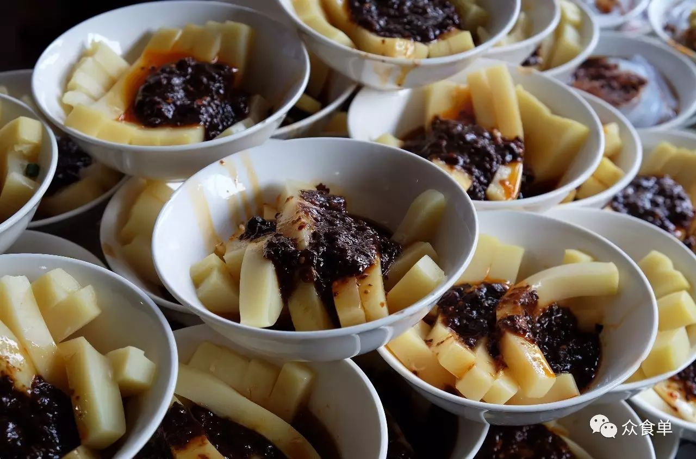 (原始链接: https://mmbiz.qpic.cn/mmbiz_jpg/zEV5HrLLB8JcGUVgcFKMvJvnJdSYXEL9KskFCpmSTPJXDp67icPt528TjtTGXMvPCia1e4lMPJ4dbsHcHFQvJh0Q/0?wx_fmt=jpeg)
- 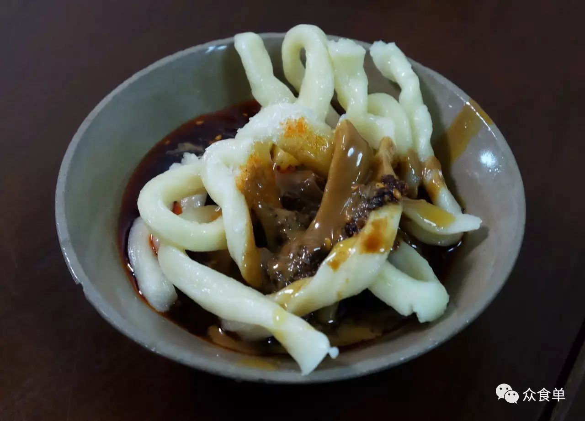 (原始链接: https://mmbiz.qpic.cn/mmbiz_jpg/zEV5HrLLB8JcGUVgcFKMvJvnJdSYXEL9GBtuyd5pzxMPGMFDFc3I3ib2TEyzribzgd5RINISgtAs6uX6cLTVlXXg/0?wx_fmt=jpeg)
- 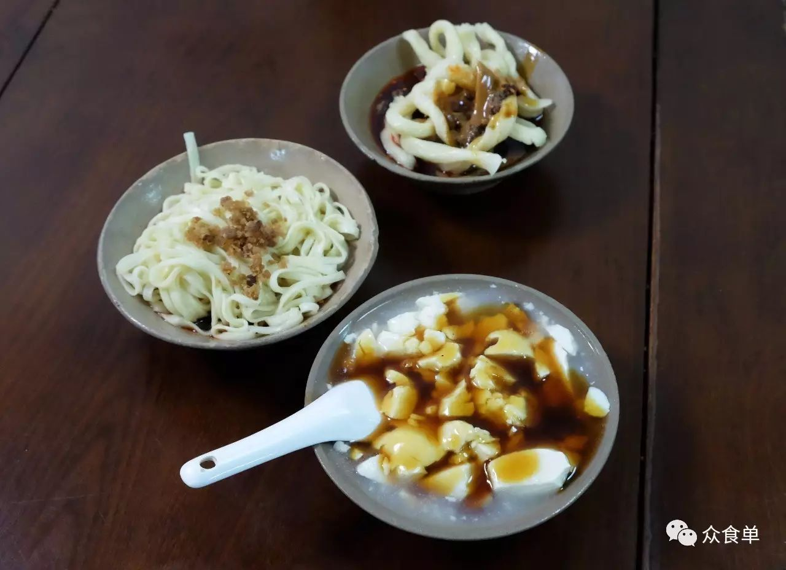 (原始链接: https://mmbiz.qpic.cn/mmbiz_jpg/zEV5HrLLB8JcGUVgcFKMvJvnJdSYXEL937h6We7ButCjKefYRMApIHNDEsyib8HR1ZrbVA3PE2ZXr0HRY0Up8vA/0?wx_fmt=jpeg)
- 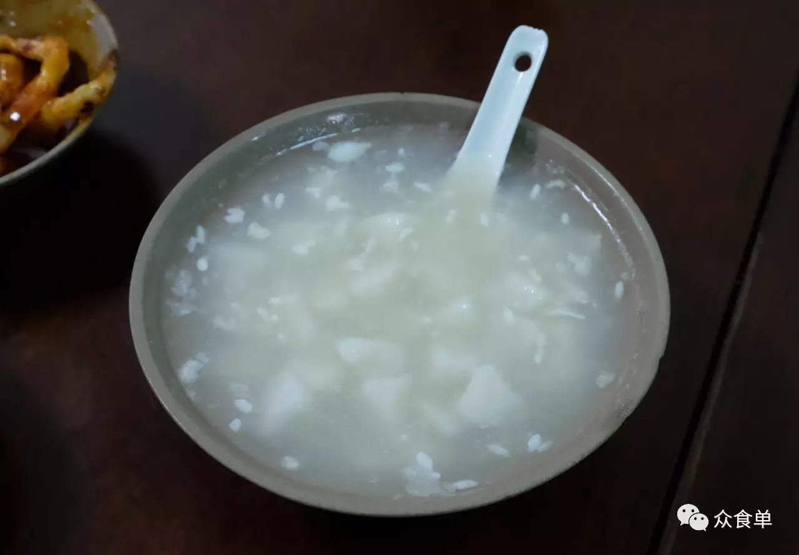 (原始链接: https://mmbiz.qpic.cn/mmbiz_jpg/zEV5HrLLB8JcGUVgcFKMvJvnJdSYXEL9MHMv7GNxciaduaOkFeIpvaRoBrOd8ZszA1YeHPAOukv86HfWTiav18Og/0?wx_fmt=jpeg)
- 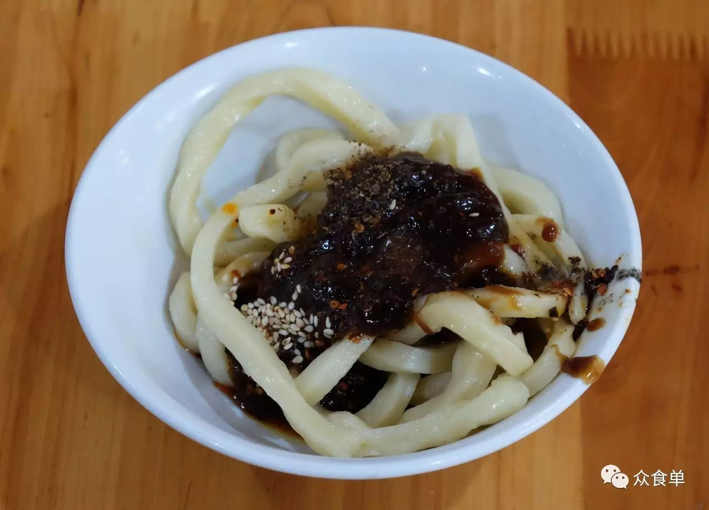 (原始链接: https://mmbiz.qpic.cn/mmbiz_jpg/zEV5HrLLB8JcGUVgcFKMvJvnJdSYXEL9CbtWFf3TXLOZYvKWoCnJt15gObDOB7gbMapicWoIXAtNNuG3BZZnv6w/0?wx_fmt=jpeg)
- 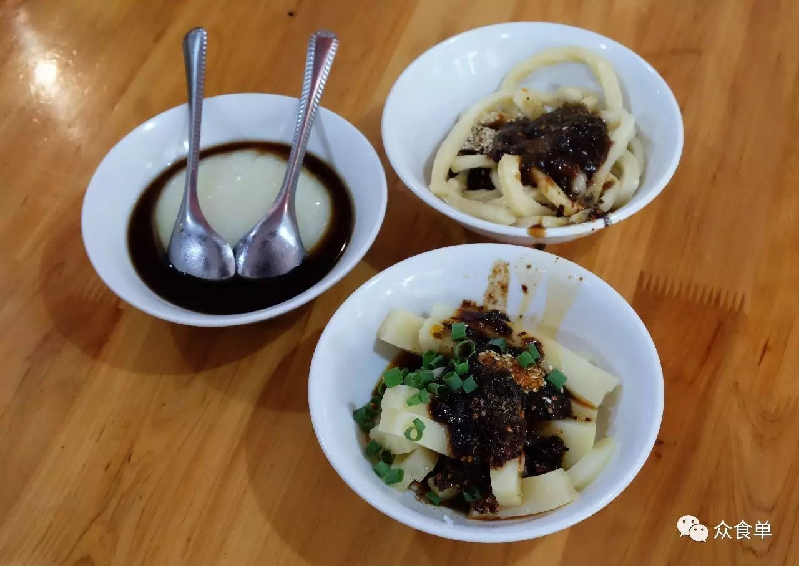 (原始链接: https://mmbiz.qpic.cn/mmbiz_jpg/zEV5HrLLB8JcGUVgcFKMvJvnJdSYXEL9qQ1oib2FvoicwKfZ67ybtAyMtFfZHVVsibIr1Nfj88hDULo0ZX1O0MnWA/0?wx_fmt=jpeg)
- 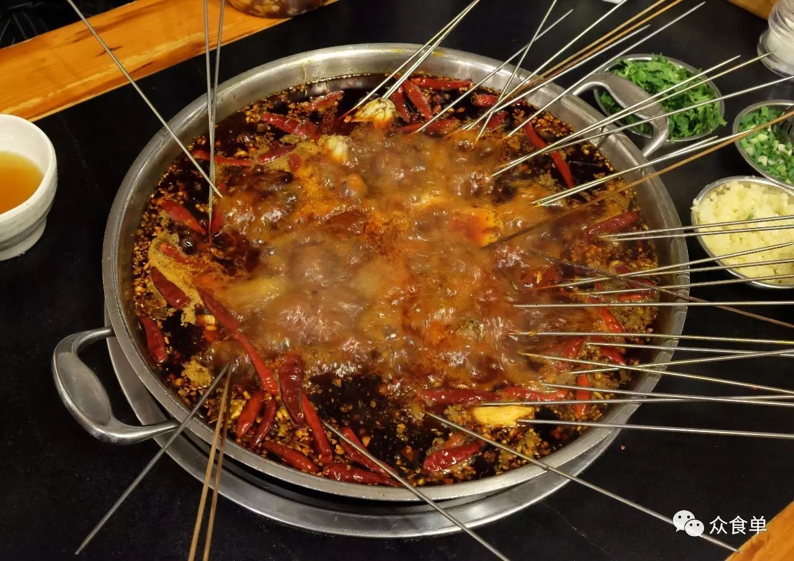 (原始链接: https://mmbiz.qpic.cn/mmbiz_jpg/zEV5HrLLB8JcGUVgcFKMvJvnJdSYXEL9ibvYN0VAx6yibNIbicEP23jH9jibg4gzobCkNDcVx0yNpgx7KB0oLrTR0w/0?wx_fmt=jpeg)
- 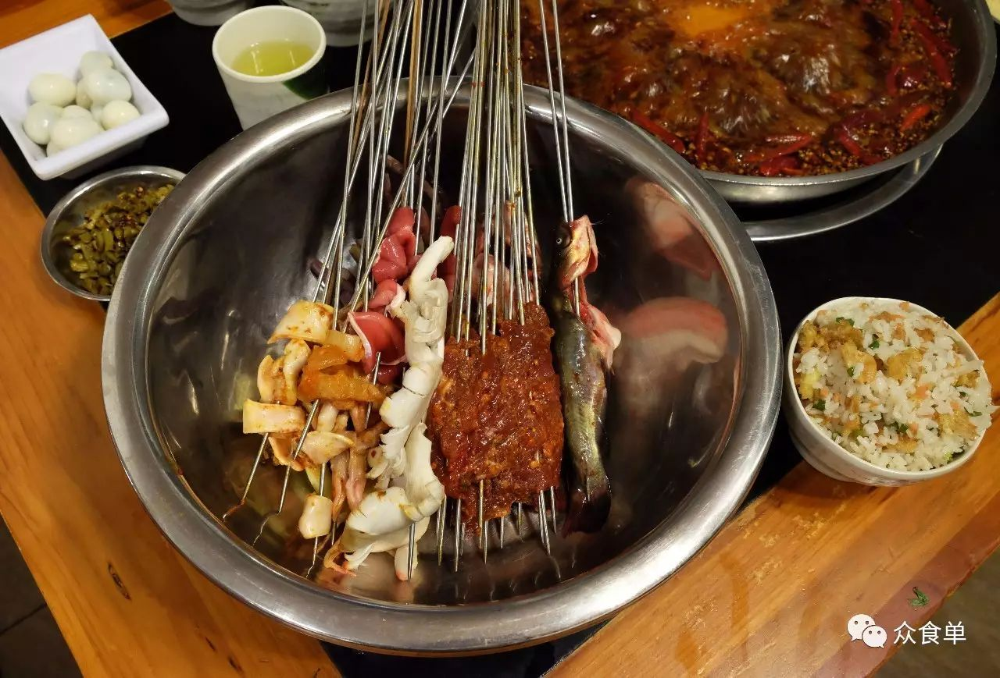 (原始链接: https://mmbiz.qpic.cn/mmbiz_jpg/zEV5HrLLB8JcGUVgcFKMvJvnJdSYXEL9PXdHzZhbsRiasoReXnoxNGAF0qJrxgKA47zqHblGBdBPtHJpbyDM1kg/0?wx_fmt=jpeg)
- 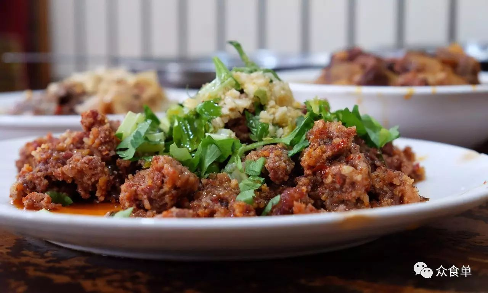 (原始链接: https://mmbiz.qpic.cn/mmbiz_jpg/zEV5HrLLB8JcGUVgcFKMvJvnJdSYXEL9iclbicTUVDRc8hDlObwr8QeibsScgGv2xFs7Y9q5icMO9clUso4EeGBujw/0?wx_fmt=jpeg)
- 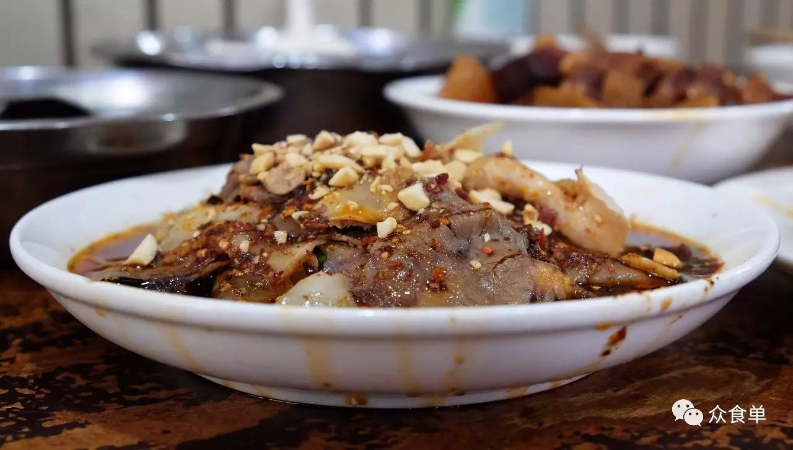 (原始链接: https://mmbiz.qpic.cn/mmbiz_jpg/zEV5HrLLB8JcGUVgcFKMvJvnJdSYXEL9dU4QuxKFwUlfl9A3kxtZLfibs4EB7xwe1j8r90tKRaGEcibxUQIymlXQ/0?wx_fmt=jpeg)
- 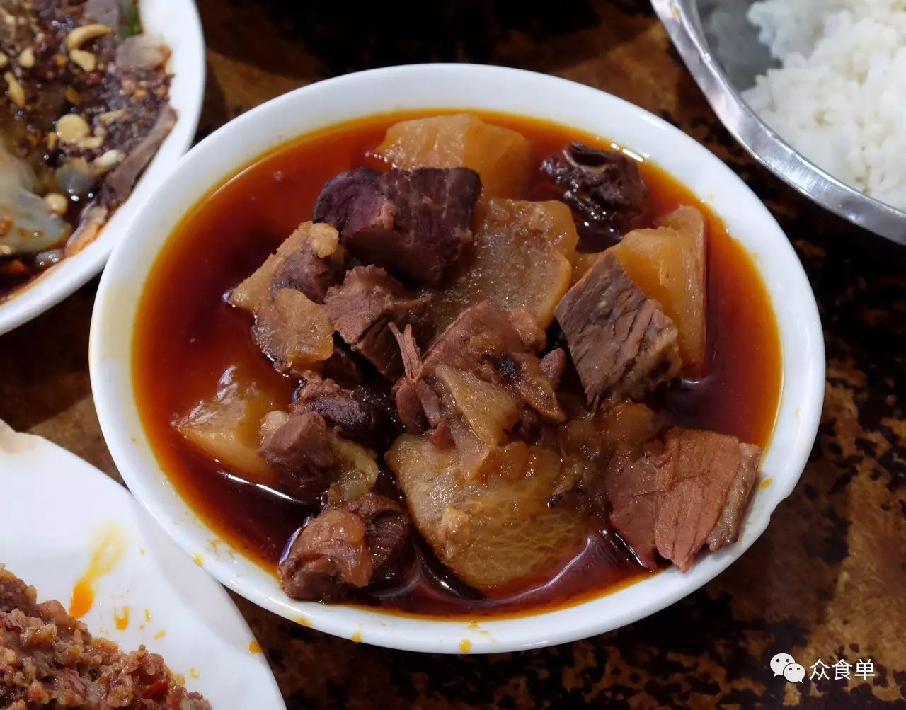 (原始链接: https://mmbiz.qpic.cn/mmbiz_jpg/zEV5HrLLB8JcGUVgcFKMvJvnJdSYXEL9PvEtm5T07zQjQkmDhDfEXth7Yx7dEfP3lTZWXjpDMGIOEuLNOPId6g/0?wx_fmt=jpeg)
- 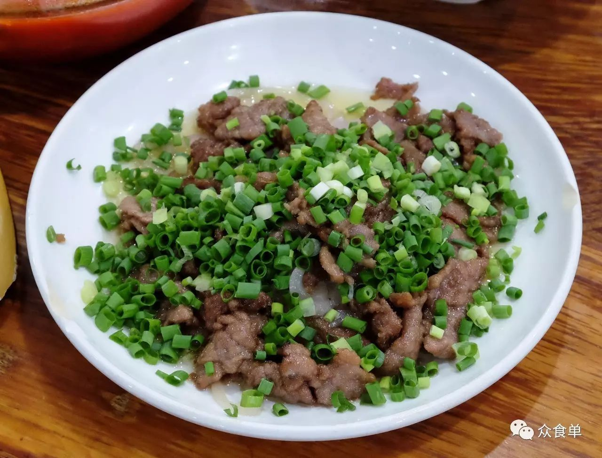 (原始链接: https://mmbiz.qpic.cn/mmbiz_jpg/zEV5HrLLB8JcGUVgcFKMvJvnJdSYXEL9RfM5qsCKjNjxaibAdPQ8cxQVBlvgQKCuP0XTPQc9pABtbTV5T0DP0sg/0?wx_fmt=jpeg)
- 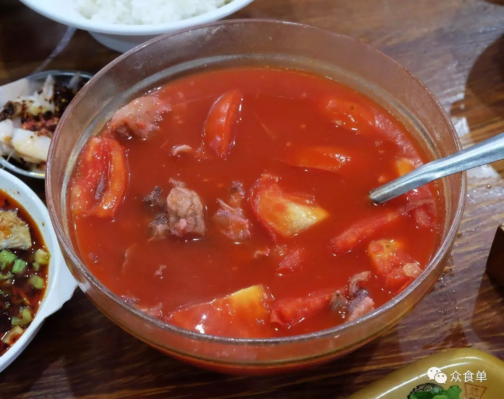 (原始链接: https://mmbiz.qpic.cn/mmbiz_jpg/zEV5HrLLB8JcGUVgcFKMvJvnJdSYXEL9rRxdxnc3pnprZae1ia2hZAqobnfVpPbHAsynC3GWNKARQKZkCF5leSw/0?wx_fmt=jpeg)
- 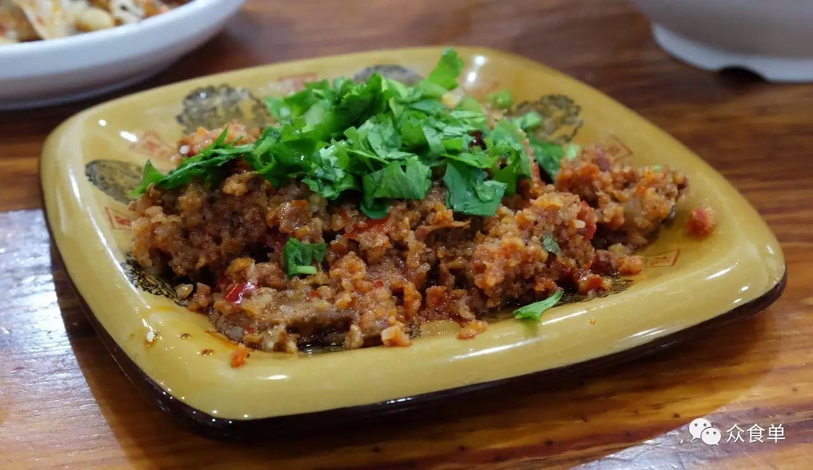 (原始链接: https://mmbiz.qpic.cn/mmbiz_jpg/zEV5HrLLB8JcGUVgcFKMvJvnJdSYXEL9PpTvxFLhqeEkKf0GVIdlHKdibTscjcJ8UY6DjbDzr9JBzEmGr0guYbg/0?wx_fmt=jpeg)
- 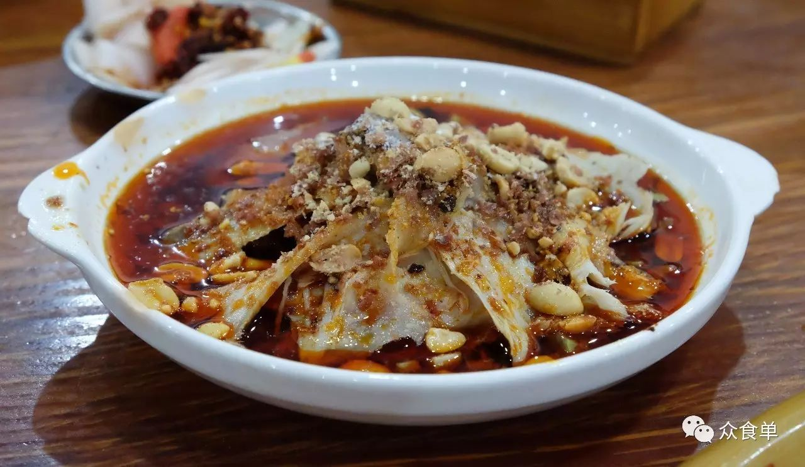 (原始链接: https://mmbiz.qpic.cn/mmbiz_jpg/zEV5HrLLB8JcGUVgcFKMvJvnJdSYXEL90hOKgX9cFStflcOeY6yfzibITZSfQSribvJDC151p8Vy6uXu02GicDd4w/0?wx_fmt=jpeg)
- 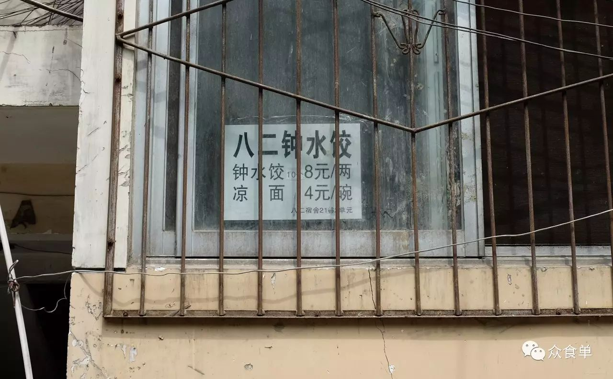 (原始链接: https://mmbiz.qpic.cn/mmbiz_jpg/zEV5HrLLB8JcGUVgcFKMvJvnJdSYXEL9FMqXelIhf3ywu49ygB3eevgyA0bcBq9IQBVHMnFb13tn4GU3iaHftrQ/0?wx_fmt=jpeg)
- 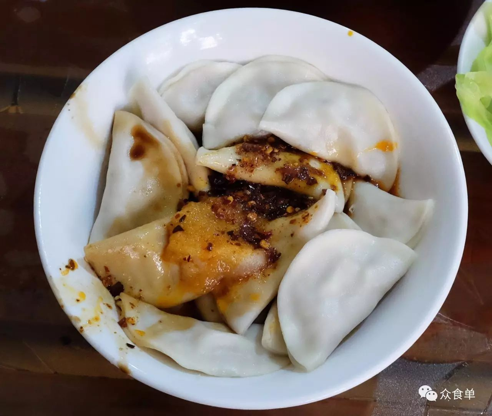 (原始链接: https://mmbiz.qpic.cn/mmbiz_jpg/zEV5HrLLB8JcGUVgcFKMvJvnJdSYXEL9axo6KOJv7Pn4MCnia9A2TPuf41WeQgtUDLNic3LUSM9MUYT5b9nkFJ0A/0?wx_fmt=jpeg)
- 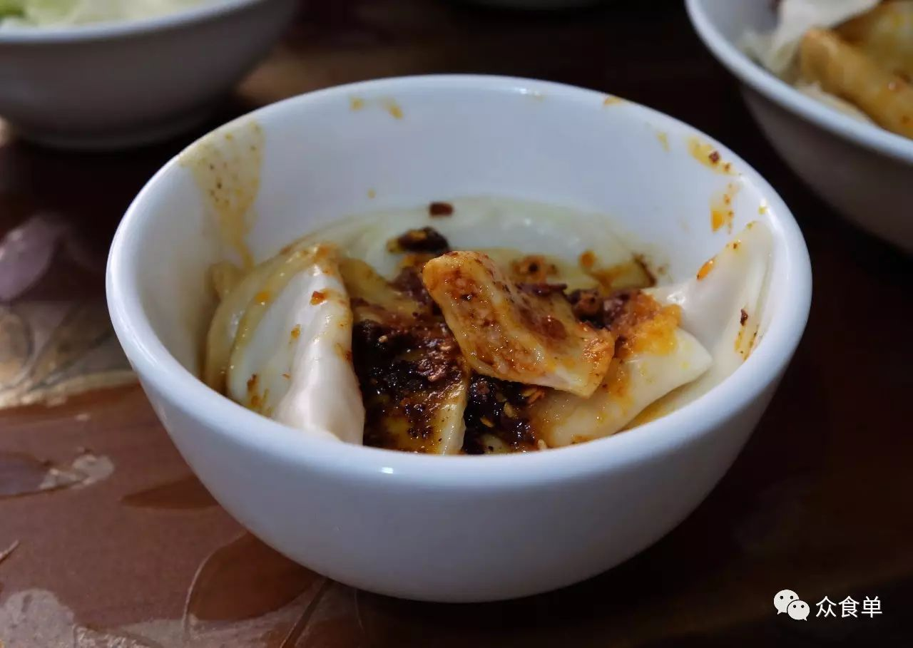 (原始链接: https://mmbiz.qpic.cn/mmbiz_jpg/zEV5HrLLB8JcGUVgcFKMvJvnJdSYXEL9OWDCVh85KYVHOy80LV1qPCCgJ68wdLBldI7s96wfBDDxM7fAwwhHzA/0?wx_fmt=jpeg)
- 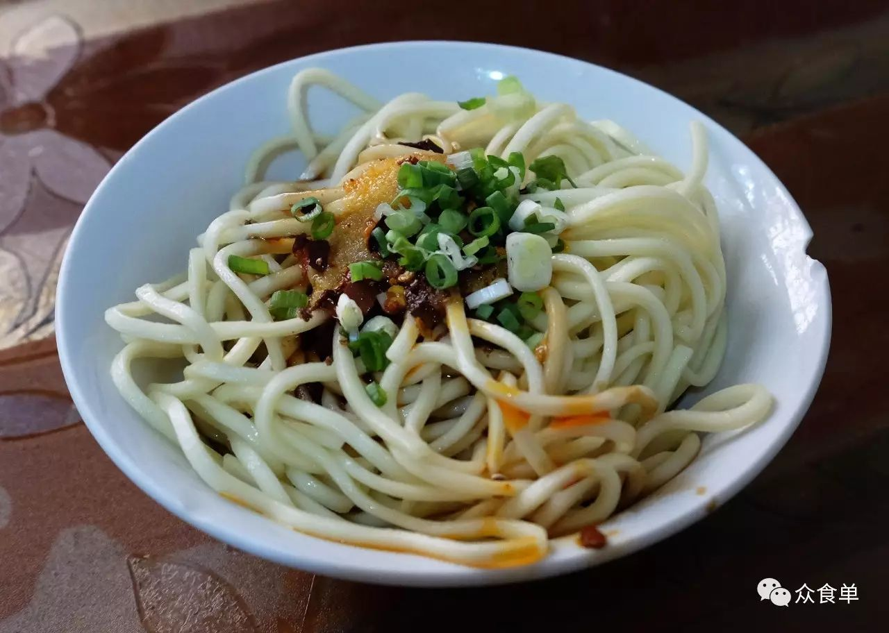 (原始链接: https://mmbiz.qpic.cn/mmbiz_jpg/zEV5HrLLB8JcGUVgcFKMvJvnJdSYXEL9bIia406xWPM9ibvsUJx1Rl4thP7a3rJia6ZX9Zp1cLOssNicXcF6u2ztTQ/0?wx_fmt=jpeg)
- 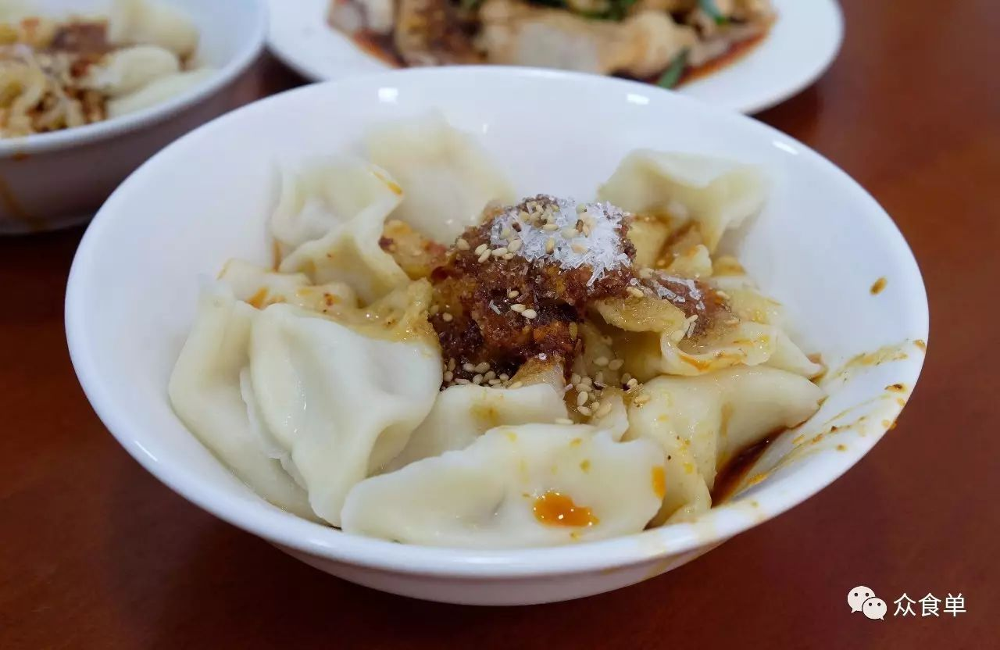 (原始链接: https://mmbiz.qpic.cn/mmbiz_jpg/zEV5HrLLB8JcGUVgcFKMvJvnJdSYXEL9QemuZet6UicK88QozDZoKy5SLib1BakwZAticQwKkcEL9nzXjwmCfckew/0?wx_fmt=jpeg)
- 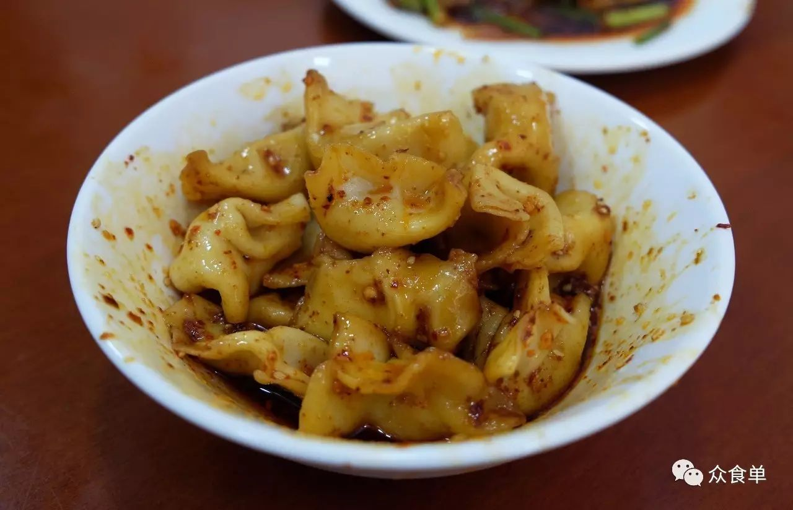 (原始链接: https://mmbiz.qpic.cn/mmbiz_jpg/zEV5HrLLB8JcGUVgcFKMvJvnJdSYXEL9zNQSJpm2W0uPDEByuhcicoctBsmgNEvcB7mwGn8uiboWZ7JF7HvY9XZA/0?wx_fmt=jpeg)
- 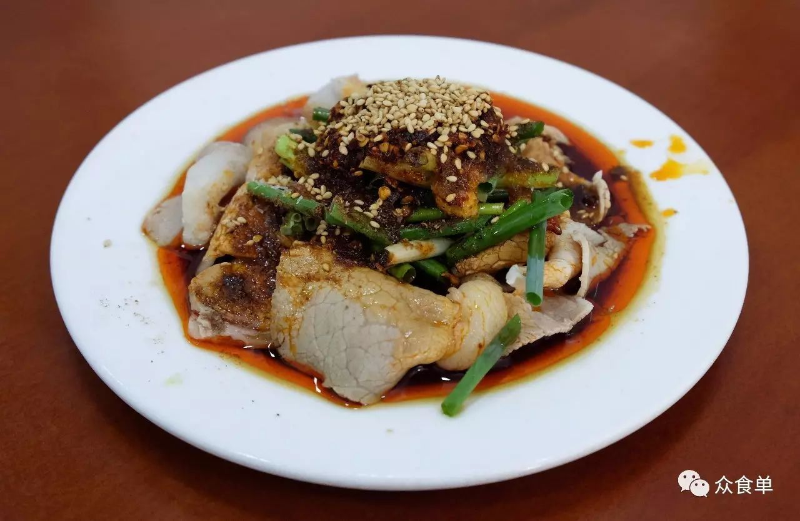 (原始链接: https://mmbiz.qpic.cn/mmbiz_jpg/zEV5HrLLB8JcGUVgcFKMvJvnJdSYXEL9iaGatnMu1CDKQpnDJT5GkibjeMgp44CZqsaiaKhfQnmHMwdIE4bPANArw/0?wx_fmt=jpeg)
- 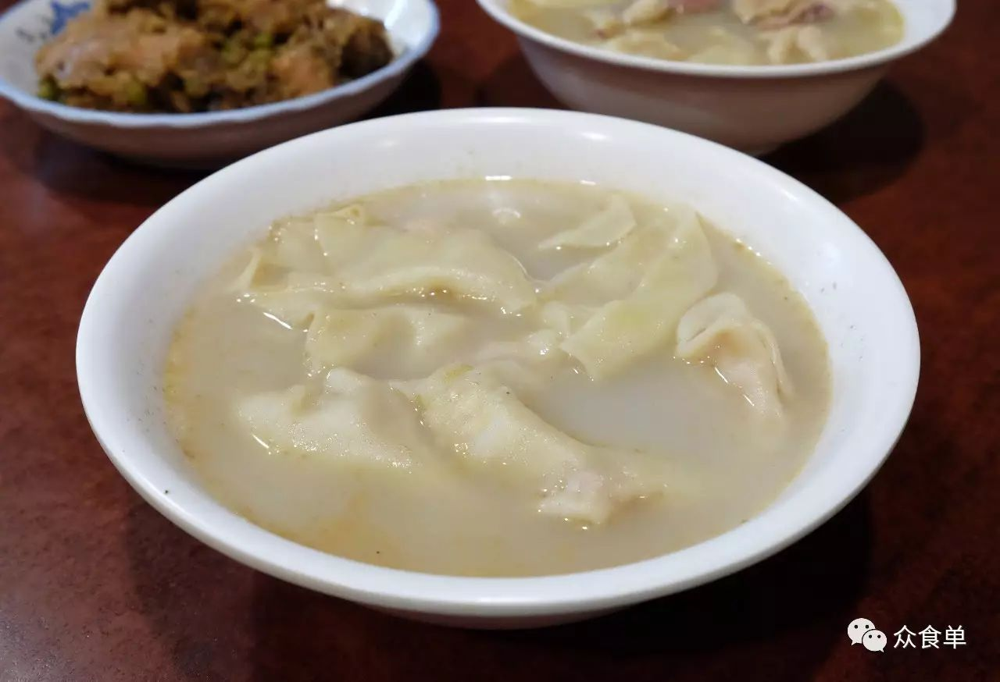 (原始链接: https://mmbiz.qpic.cn/mmbiz_jpg/zEV5HrLLB8Lvtp1EEic5BsuDhqycSdrBIMib5ibKnn8ylicaohanS9V50cjzVeJQMm0p9tyK7SibLp2XicShSHVZAEMg/0?wx_fmt=jpeg)
- 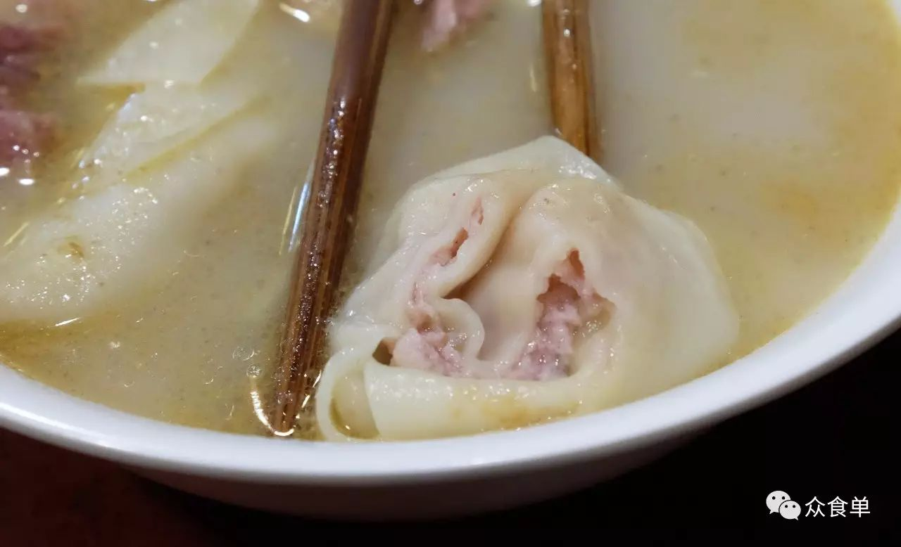 (原始链接: https://mmbiz.qpic.cn/mmbiz_jpg/zEV5HrLLB8Lvtp1EEic5BsuDhqycSdrBIyHloJtibLG18UkI86AX0c87u08KKIwPYe04gvsCoQst6HfS4uO9Bqlw/0?wx_fmt=jpeg)
- 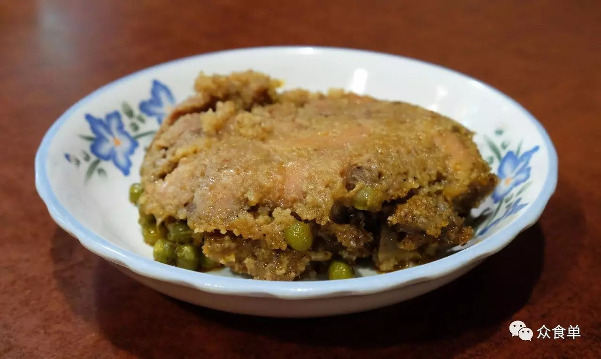 (原始链接: https://mmbiz.qpic.cn/mmbiz_jpg/zEV5HrLLB8Lvtp1EEic5BsuDhqycSdrBI6pgcrPUlib73yia70uZQGAwiasYpHO93lYmsaFVQjDMLFCWODfA3uOleA/0?wx_fmt=jpeg)
- 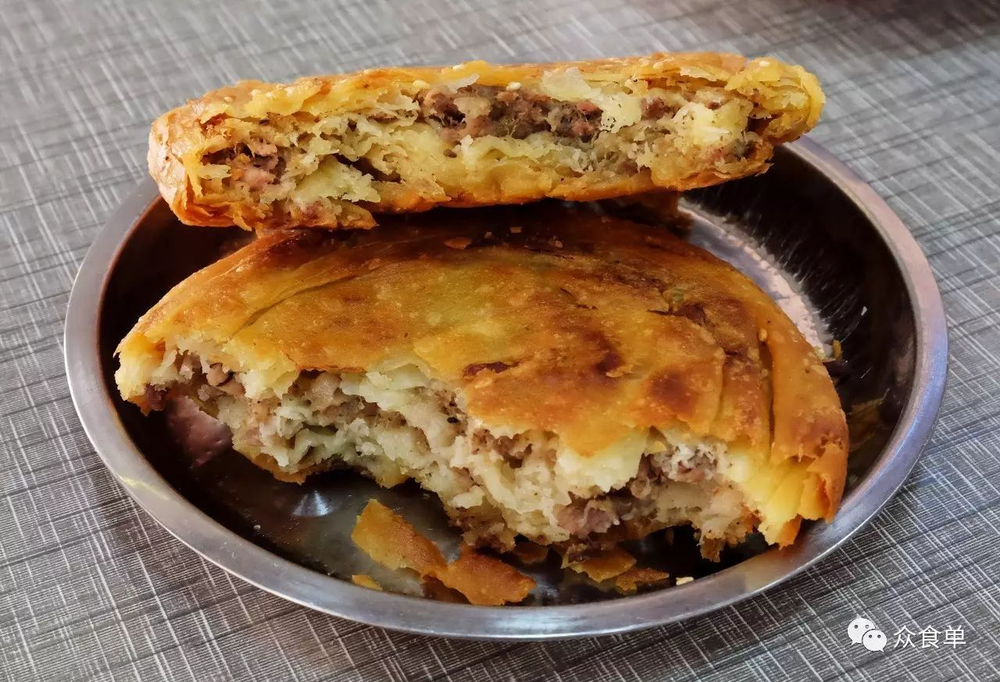 (原始链接: https://mmbiz.qpic.cn/mmbiz_jpg/zEV5HrLLB8Lvtp1EEic5BsuDhqycSdrBIXOjW2KMp2jO9SPnHPrnlkjY3tNdHMoWqGbje36Kh4Y2lt5e7Picu6ZQ/0?wx_fmt=jpeg)
- 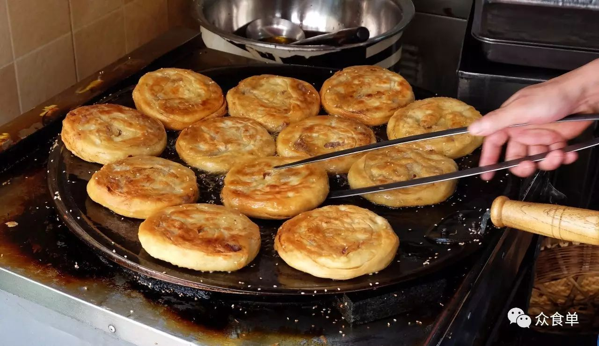 (原始链接: https://mmbiz.qpic.cn/mmbiz_jpg/zEV5HrLLB8Lvtp1EEic5BsuDhqycSdrBI9RmwnOhqhficJPvtcBFV4Vg20yu15icJCKzaVTUUSrr6hTuznH53ibaRQ/0?wx_fmt=jpeg)
- 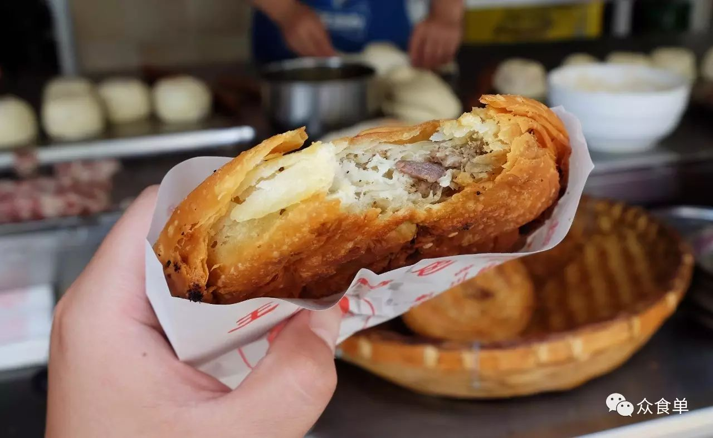 (原始链接: https://mmbiz.qpic.cn/mmbiz_jpg/zEV5HrLLB8Lvtp1EEic5BsuDhqycSdrBIgNcLMdfDLS5b5JKsTOKbkp8jc3Td0Iw0QAE5ia54DsArbVato6Pmf5A/0?wx_fmt=jpeg)
- 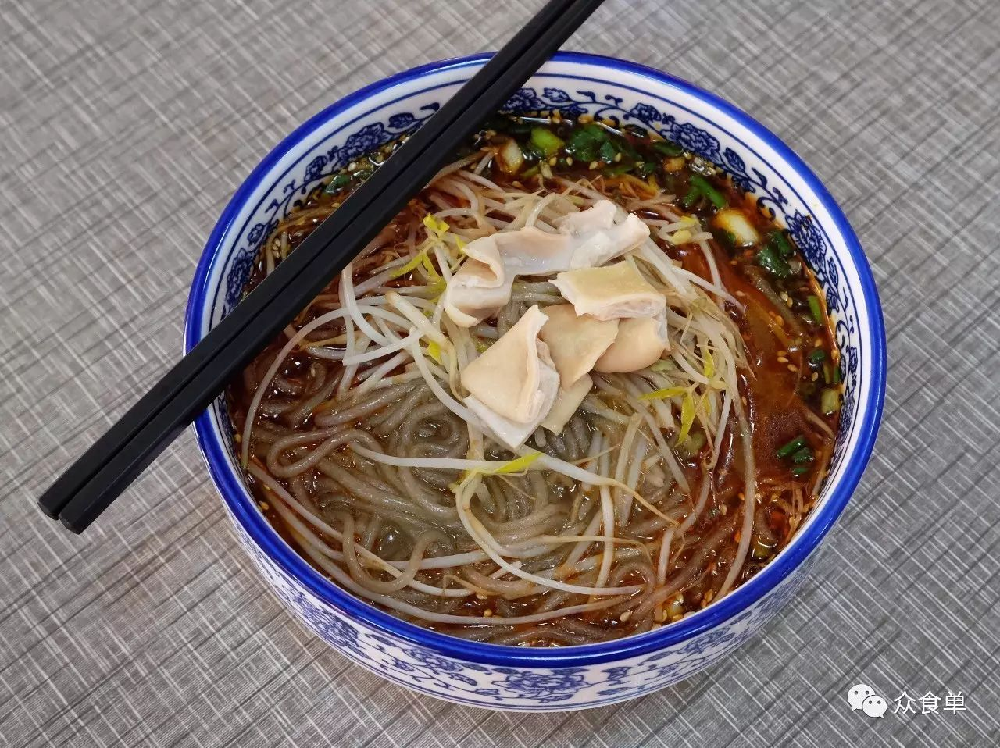 (原始链接: https://mmbiz.qpic.cn/mmbiz_jpg/zEV5HrLLB8Lvtp1EEic5BsuDhqycSdrBIlzcULAGjTs29zZiaibWKPhaBQMeH7buSjm9JIkjseUiakpHyVnPibE49pA/0?wx_fmt=jpeg)
- 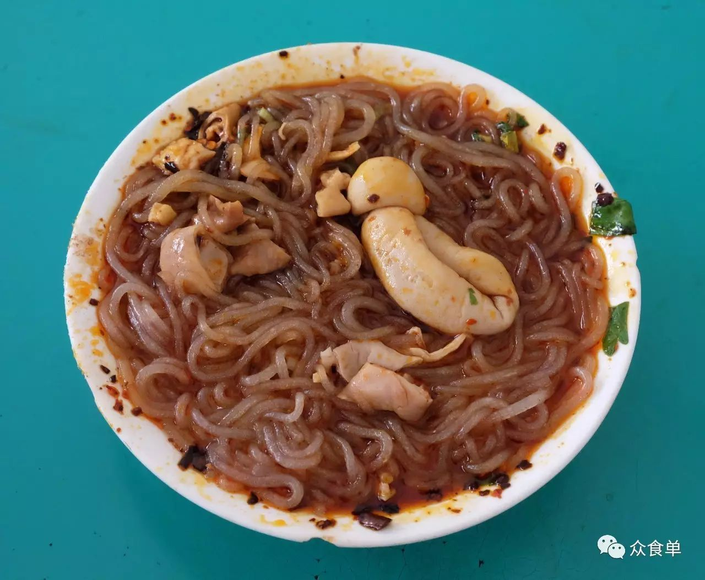 (原始链接: https://mmbiz.qpic.cn/mmbiz_jpg/zEV5HrLLB8Lvtp1EEic5BsuDhqycSdrBIAGuGLJNQU0CvjNabgfiaYiaNyItOicebRIz8ZZm0z0icUDJWze24ZB9e0A/0?wx_fmt=jpeg)
- 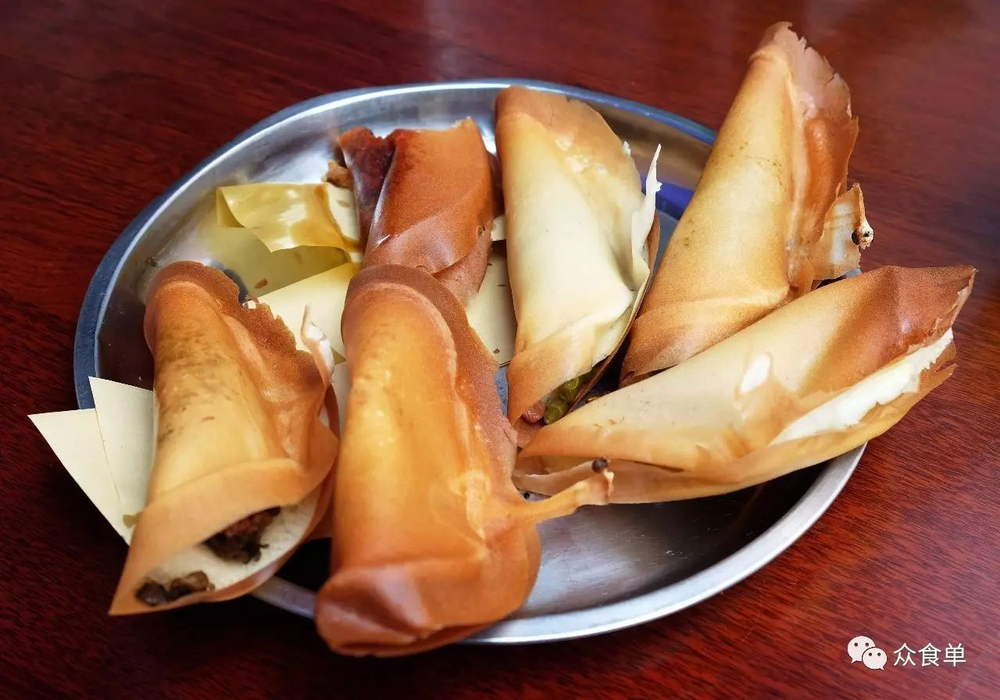 (原始链接: https://mmbiz.qpic.cn/mmbiz_jpg/zEV5HrLLB8Lvtp1EEic5BsuDhqycSdrBIZT2cI8h04ANDlcQv955WDG17NpGITowxybxymJicMsrFeHicxwg40kjw/0?wx_fmt=jpeg)
- 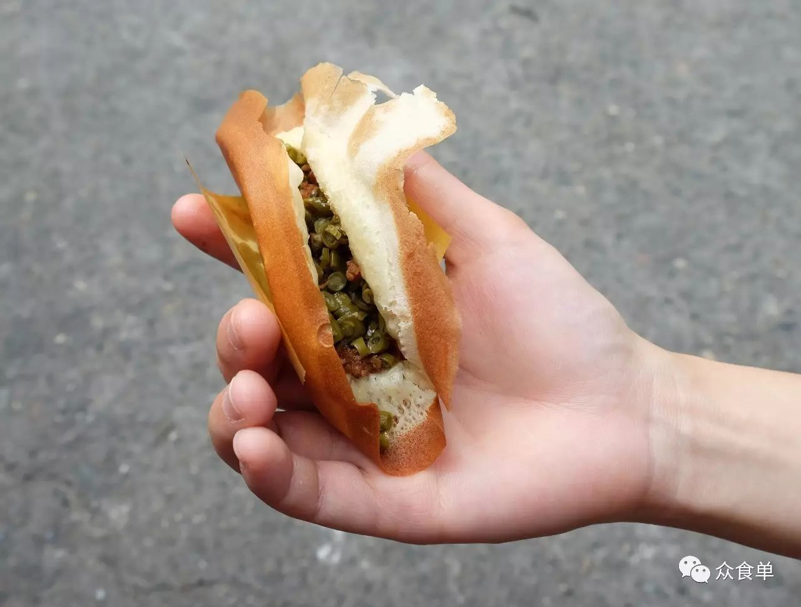 (原始链接: https://mmbiz.qpic.cn/mmbiz_jpg/zEV5HrLLB8Lvtp1EEic5BsuDhqycSdrBIMm1OeSj09FocLlXLdyp4vYM3QCm5RbMyB75UKsgVo9kuQsP0ibzicibgQ/0?wx_fmt=jpeg)
- 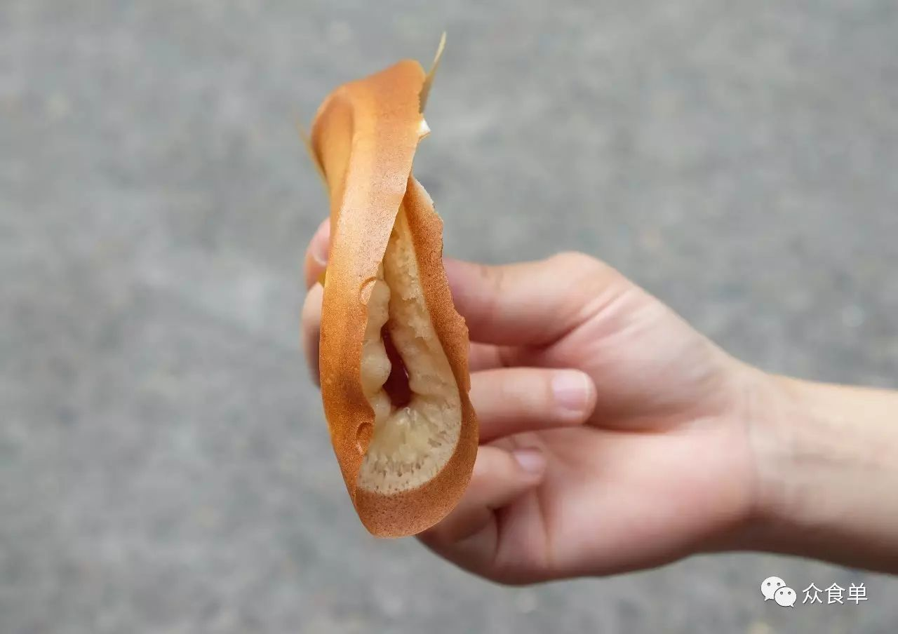 (原始链接: https://mmbiz.qpic.cn/mmbiz_jpg/zEV5HrLLB8Lvtp1EEic5BsuDhqycSdrBIfcrxvJ7cjLBz09mHbCHltCrKU66y9JZzz9Zy8ViclorriaeISsEicVUUA/0?wx_fmt=jpeg)
- 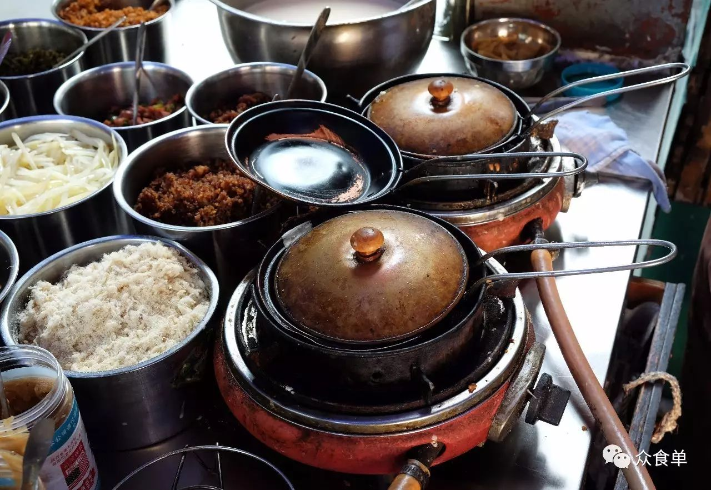 (原始链接: https://mmbiz.qpic.cn/mmbiz_jpg/zEV5HrLLB8Lvtp1EEic5BsuDhqycSdrBIeQiaB0enDhYasiczMSib1CscHHawFeZaQxpt3x3qBzXLmBMAicIv0vXrWA/0?wx_fmt=jpeg)
- 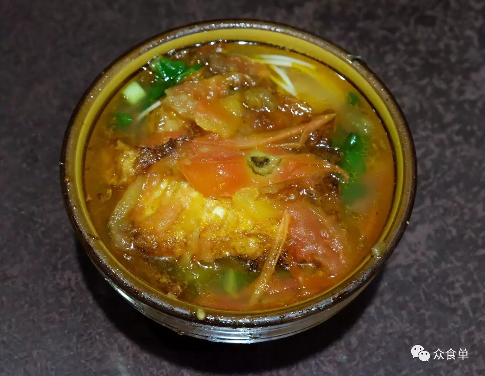 (原始链接: https://mmbiz.qpic.cn/mmbiz_jpg/zEV5HrLLB8Lvtp1EEic5BsuDhqycSdrBIwzQnmjibxlYnxfMrhDKibYygWuWPHyMCpOkHlibicgRxDf5jkecmtic7ibbA/0?wx_fmt=jpeg)
- 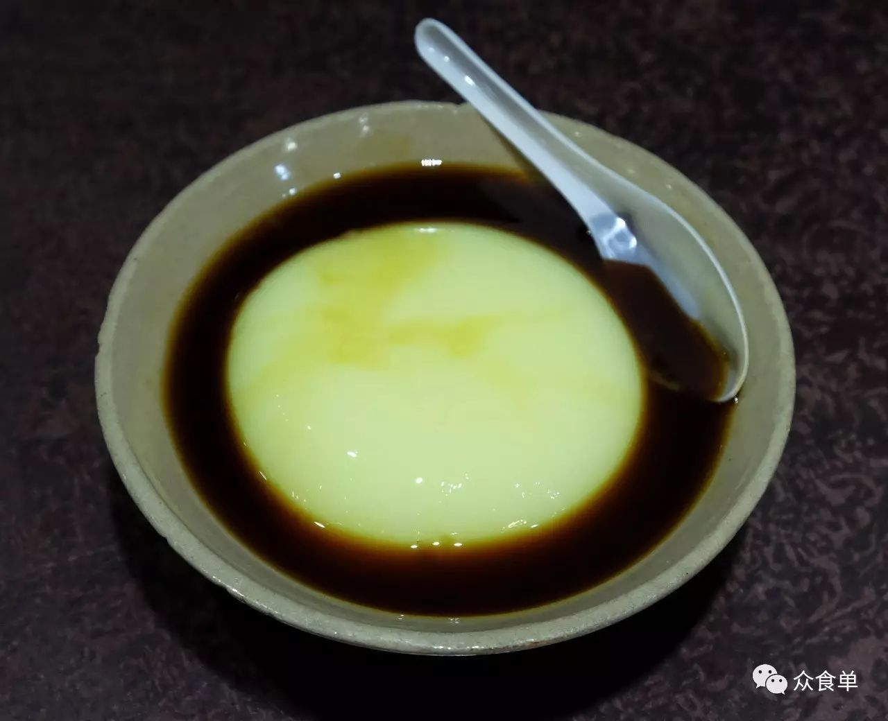 (原始链接: https://mmbiz.qpic.cn/mmbiz_jpg/zEV5HrLLB8Lvtp1EEic5BsuDhqycSdrBI3ibTSyptpmuobb4icXdCoU2ial9oDG0NJeuiciaSMdN1DSk4ibrlGGoicniazg/0?wx_fmt=jpeg)
- 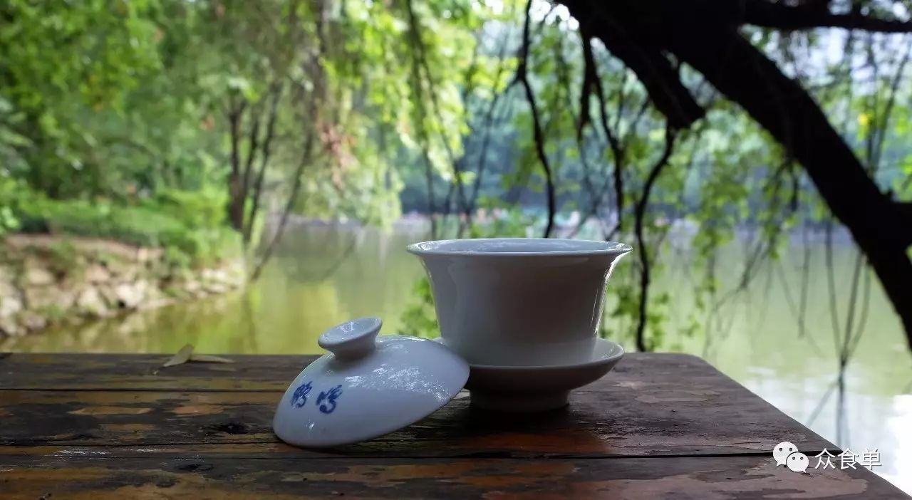 (原始链接: https://mmbiz.qpic.cn/mmbiz_jpg/zEV5HrLLB8Lvtp1EEic5BsuDhqycSdrBILWlnwskh1pnnjD8JuKnlazkyq79B8ptut5GicRk12cg2P6CgVXETxCg/0?wx_fmt=jpeg)
- 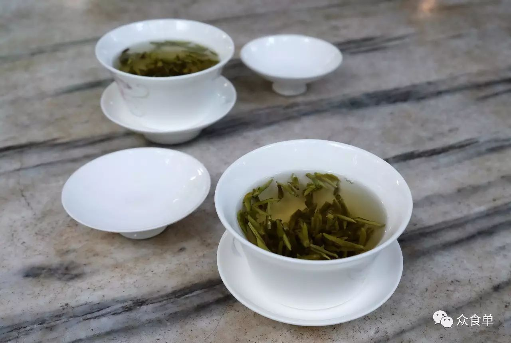 (原始链接: https://mmbiz.qpic.cn/mmbiz_jpg/zEV5HrLLB8Lvtp1EEic5BsuDhqycSdrBIRz48B2J4TVlibybK1xSLkGsWaK6FQBibYIZGsE0lYEPYrkjAE6mQNRdw/0?wx_fmt=jpeg)
- 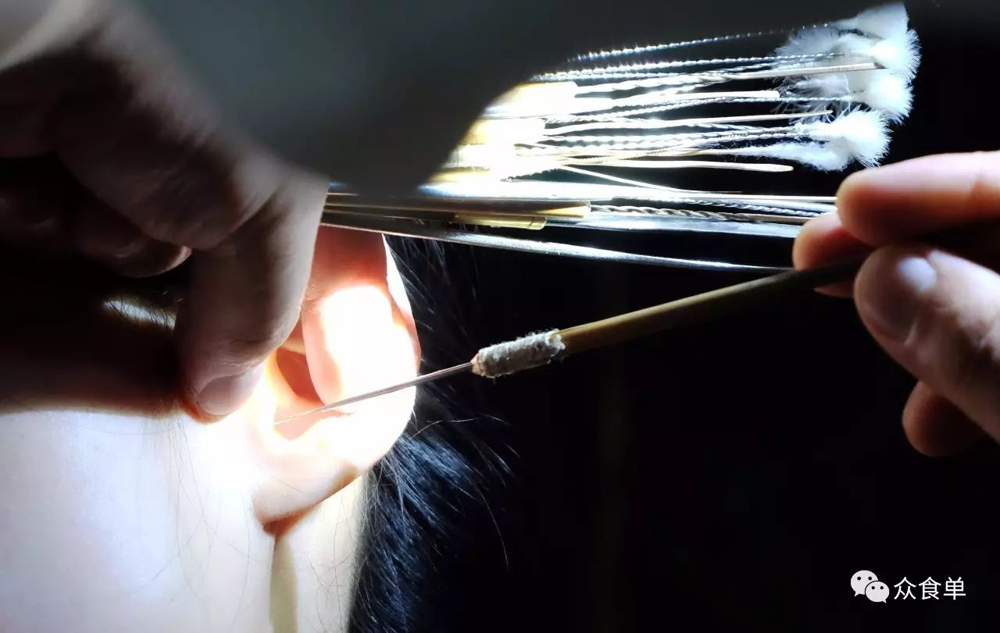 (原始链接: https://mmbiz.qpic.cn/mmbiz_jpg/zEV5HrLLB8Lvtp1EEic5BsuDhqycSdrBINXIibjlS3Bz49GtdV8dgZG7BiaOS76DFJxo86tibGTyqEwQ8QKXTmPvQg/0?wx_fmt=jpeg)
- 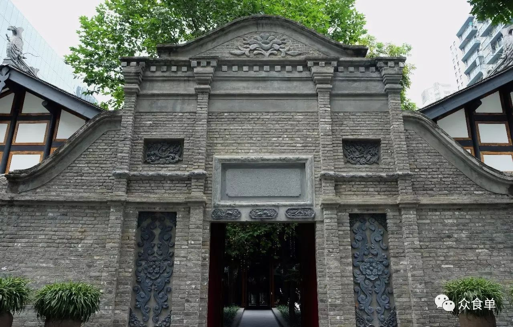 (原始链接: https://mmbiz.qpic.cn/mmbiz_jpg/zEV5HrLLB8Lvtp1EEic5BsuDhqycSdrBIWgZfhkO8X4vMfS2G1TrlSbxicvicVFNiah59nK0Gv133Hshzv7u98Hgsg/0?wx_fmt=jpeg)
- 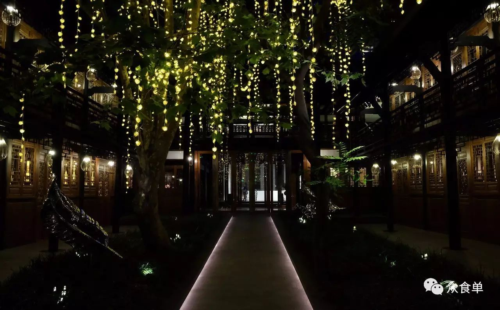 (原始链接: https://mmbiz.qpic.cn/mmbiz_jpg/zEV5HrLLB8Lvtp1EEic5BsuDhqycSdrBIgcJHN1Sda16LR6TvvrY8vQeLUJGGBVY82A5YNBXwBia3vlx5j2YReng/0?wx_fmt=jpeg)
- 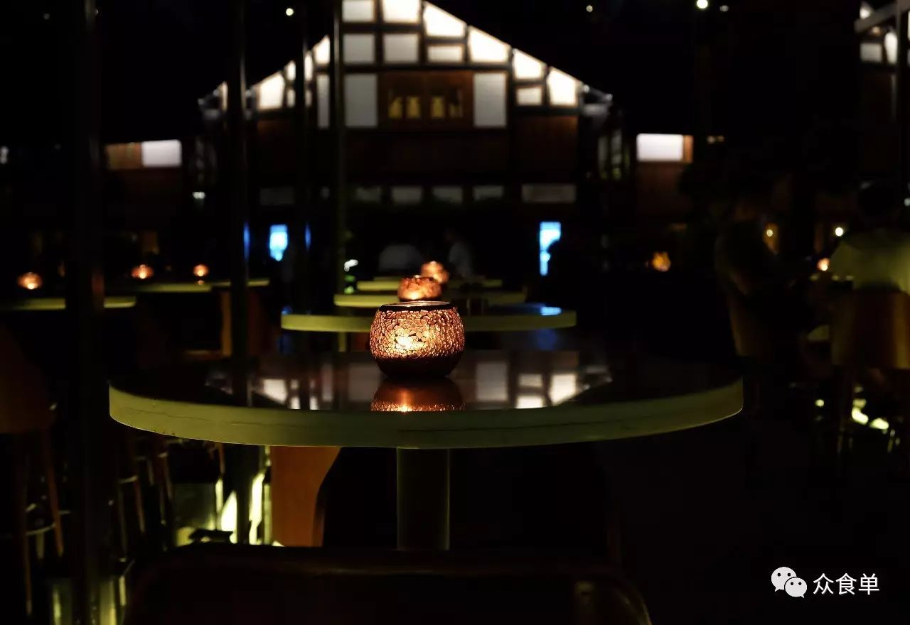 (原始链接: https://mmbiz.qpic.cn/mmbiz_jpg/zEV5HrLLB8Lvtp1EEic5BsuDhqycSdrBI1Q44ZaPR87J5nRdtzkDEXR8lrEeP9ibrPr6IvlFj5RnIVg4NYia05vnA/0?wx_fmt=jpeg)
- 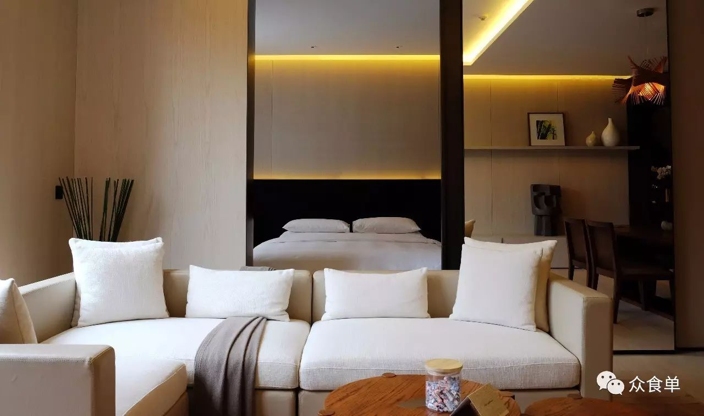 (原始链接: https://mmbiz.qpic.cn/mmbiz_jpg/zEV5HrLLB8Lvtp1EEic5BsuDhqycSdrBIYcaSNhBu05qziaUia672hNTiczaSBfQy1p7EUEfibdqoVe9yktmvb0VNHA/0?wx_fmt=jpeg)
- 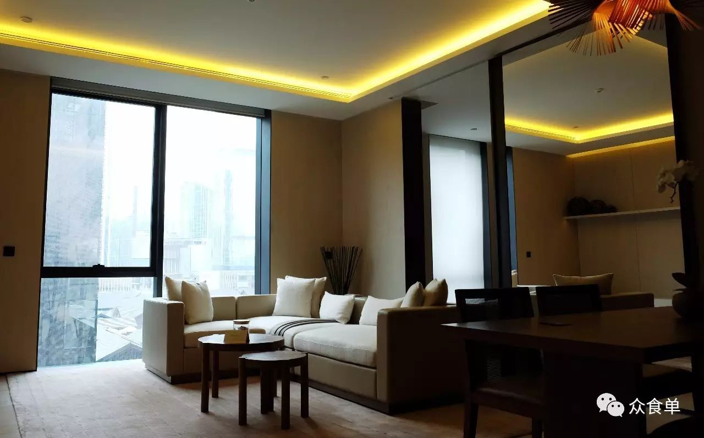 (原始链接: https://mmbiz.qpic.cn/mmbiz_jpg/zEV5HrLLB8Lvtp1EEic5BsuDhqycSdrBIXQcgQX0abwOneZicVQ3ibf8RSqZa3qQFnX0Iib3rzfxeViajT32wt6pKoA/0?wx_fmt=jpeg)
- 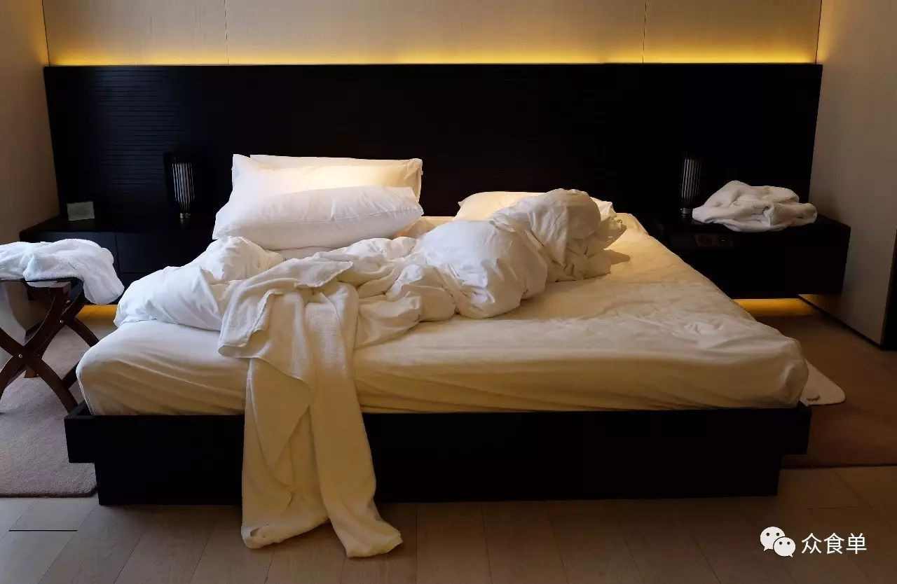 (原始链接: https://mmbiz.qpic.cn/mmbiz_jpg/zEV5HrLLB8Lvtp1EEic5BsuDhqycSdrBIM347eeVV8SGtqRBegPRDIg8jGuQJRRfsEt10kQKWB38Sy9gxmerlqw/0?wx_fmt=jpeg)
- 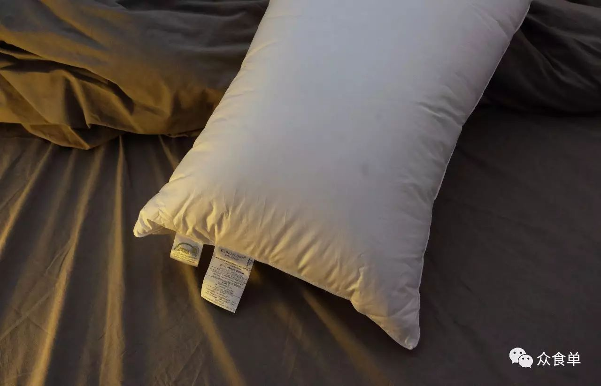 (原始链接: https://mmbiz.qpic.cn/mmbiz_jpg/zEV5HrLLB8Lvtp1EEic5BsuDhqycSdrBIr5KgA8ADeJRpUTvsnfkFjwvlbnhjhXQJxFjeEDar1vHseF4WcicZNlg/0?wx_fmt=jpeg)
- 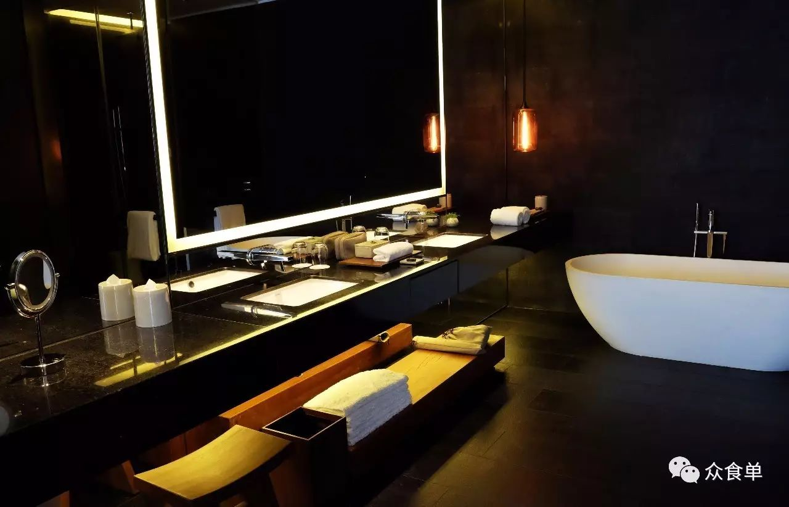 (原始链接: https://mmbiz.qpic.cn/mmbiz_jpg/zEV5HrLLB8Lvtp1EEic5BsuDhqycSdrBI3NC1UMskrbiamVfyrY0ZGIc5IgicicNwibVxTf7nWHaiayBMfk1fKW8eoCA/0?wx_fmt=jpeg)
-  (原始链接: https://mmbiz.qpic.cn/mmbiz_jpg/zEV5HrLLB8Lvtp1EEic5BsuDhqycSdrBIgJPqI7TjQ2k8jiaPrfqjGkicvByMtialFSrpXficgxFdB3O195W7FsFZCA/0?wx_fmt=jpeg)
- 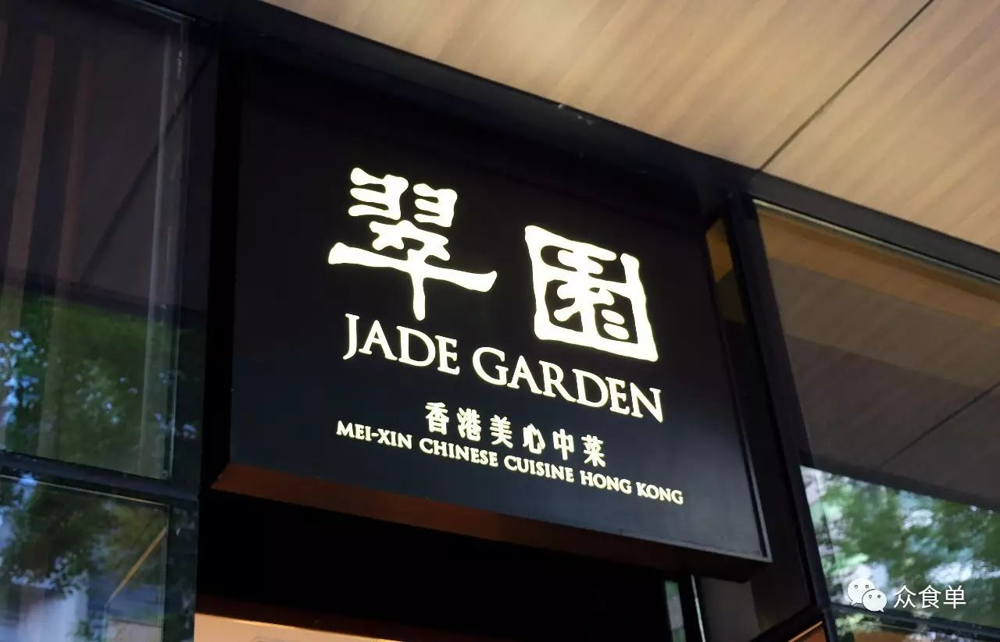 (原始链接: https://mmbiz.qpic.cn/mmbiz_jpg/zEV5HrLLB8Lvtp1EEic5BsuDhqycSdrBICgq4tMkeMWF595xvXKfV4OggAXWZSjEqRGfM9Tc465SfCb6SDbSDlg/0?wx_fmt=jpeg)
- 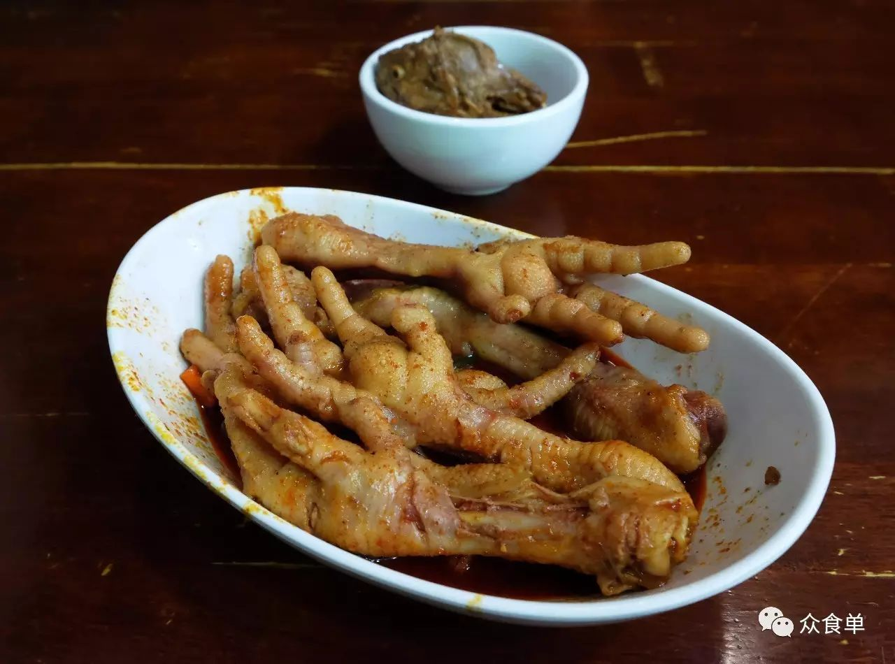 (原始链接: https://mmbiz.qpic.cn/mmbiz_jpg/zEV5HrLLB8Lvtp1EEic5BsuDhqycSdrBII4L1Dj6dicFuBia7wdSDufDdD5XjdbzOibTyibFC7kqI0KPgCcLqRC6ic1A/0?wx_fmt=jpeg)
- 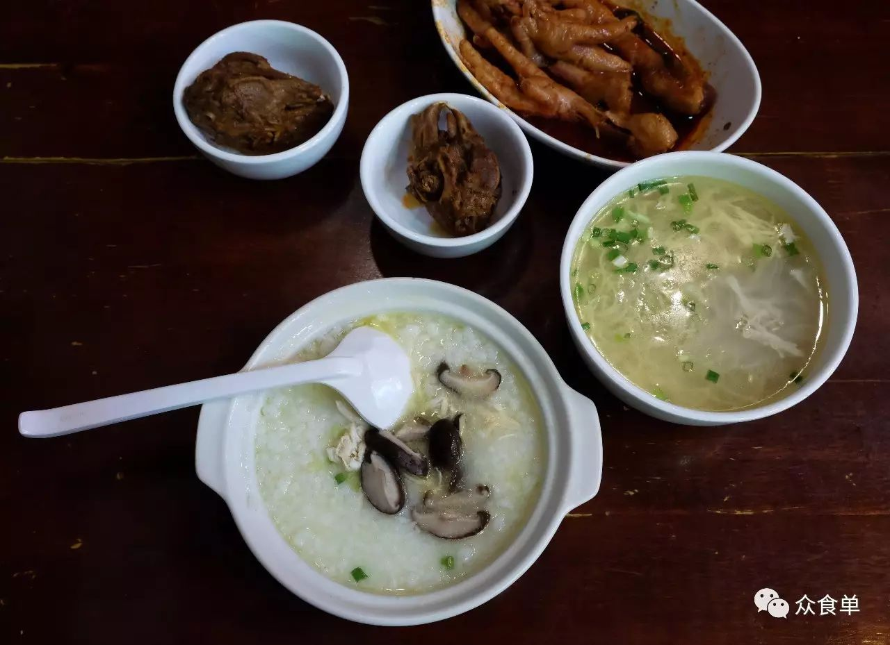 (原始链接: https://mmbiz.qpic.cn/mmbiz_jpg/zEV5HrLLB8Lvtp1EEic5BsuDhqycSdrBIicPeyLDaaXKMEhVeHficxsRmlaVqK7gKwoT1kpQGfCqcw9StqWawWIOw/0?wx_fmt=jpeg)
- 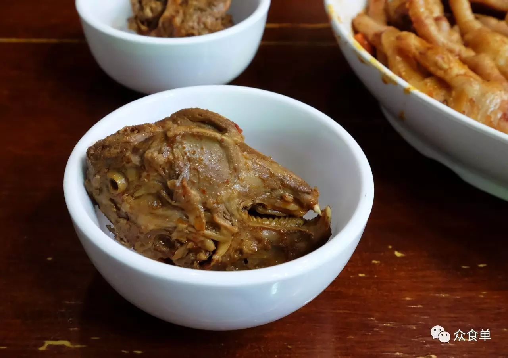 (原始链接: https://mmbiz.qpic.cn/mmbiz_jpg/zEV5HrLLB8Lvtp1EEic5BsuDhqycSdrBIpoQia0oUcf8KarSf1eOLOUrDVClzfpYjnTRO05STmlEvg8tlxheRQww/0?wx_fmt=jpeg)
- 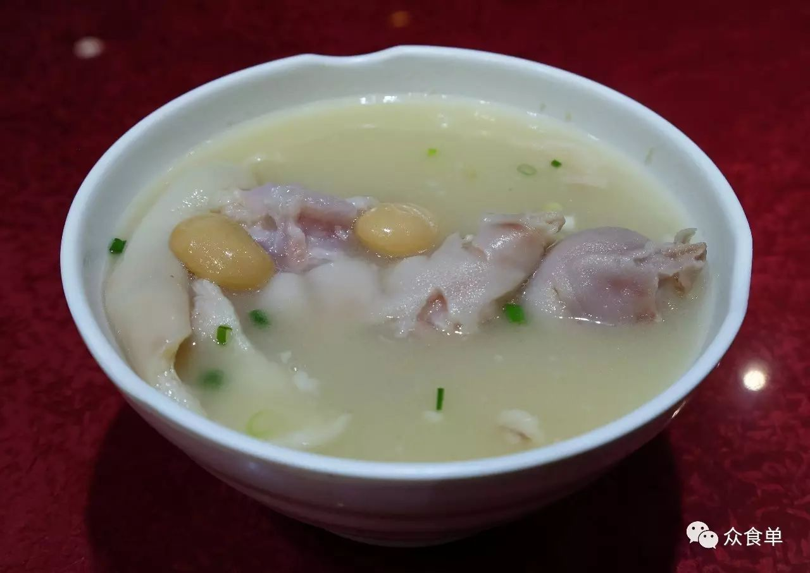 (原始链接: https://mmbiz.qpic.cn/mmbiz_jpg/zEV5HrLLB8Lvtp1EEic5BsuDhqycSdrBI2oCeJ8j9ebkqjicF6xFiaRUt2gwdwWt2ibxdYnbg6vUyaiaEf3lbfTOmqw/0?wx_fmt=jpeg)
- 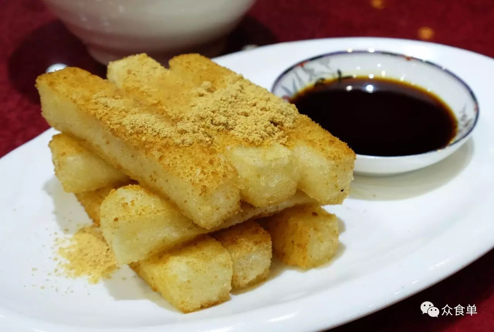 (原始链接: https://mmbiz.qpic.cn/mmbiz_jpg/zEV5HrLLB8Lvtp1EEic5BsuDhqycSdrBIrtg15psSUkIdCyfOSCOY5TSm9zvE8W9bsc6ME9IwnHSFWsbHMelXvA/0?wx_fmt=jpeg)
- 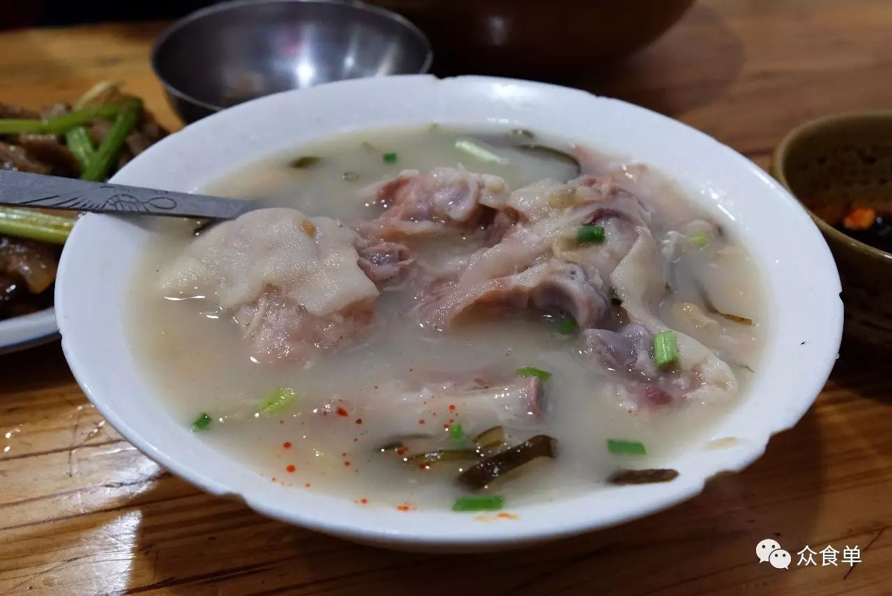 (原始链接: https://mmbiz.qpic.cn/mmbiz_jpg/zEV5HrLLB8Lvtp1EEic5BsuDhqycSdrBIV8ZqvNSLc2fTEasZkaolZnvaL4AYo5EWALp5ebibWOsGib9HUx2bZkrw/0?wx_fmt=jpeg)
- 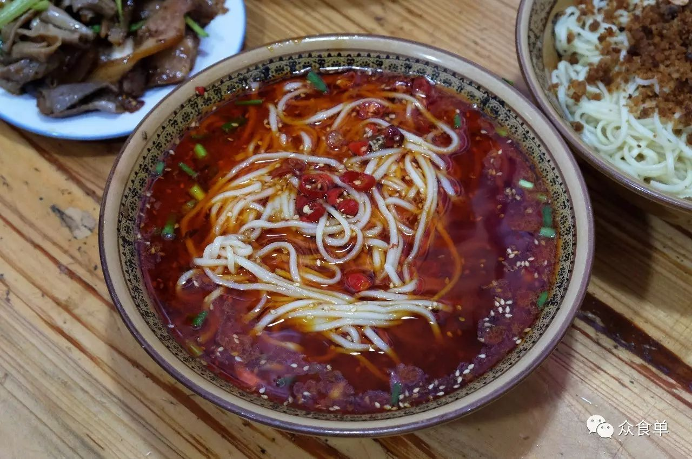 (原始链接: https://mmbiz.qpic.cn/mmbiz_jpg/zEV5HrLLB8Lvtp1EEic5BsuDhqycSdrBI11vj9QGVKfHaaMfcIlX1Q0Ez4SS4VraNJTEuNibPeNKSHtSeSTomuibg/0?wx_fmt=jpeg)
- 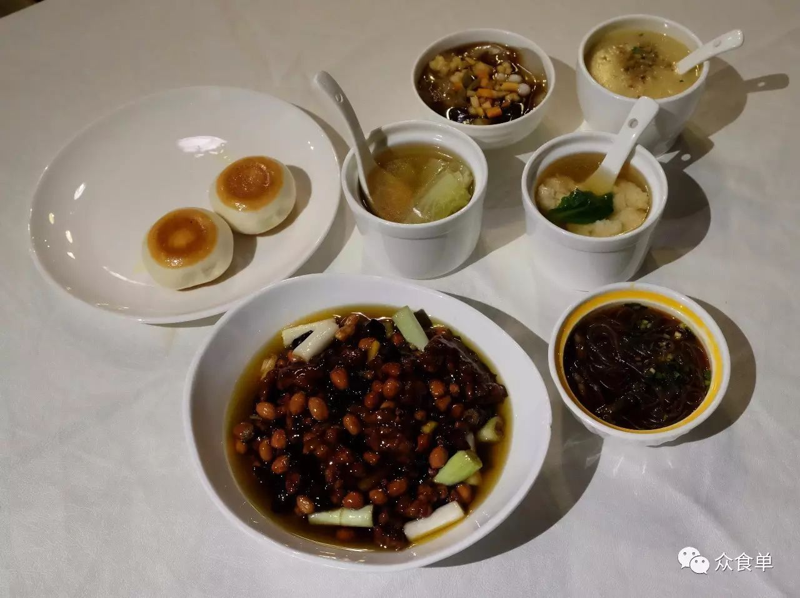 (原始链接: https://mmbiz.qpic.cn/mmbiz_jpg/zEV5HrLLB8Lvtp1EEic5BsuDhqycSdrBInFovutuZdcSpkbrMnLiaicHvMPFHBtj6WxFREJJS3wAEsOAO3X09UTnw/0?wx_fmt=jpeg)
- 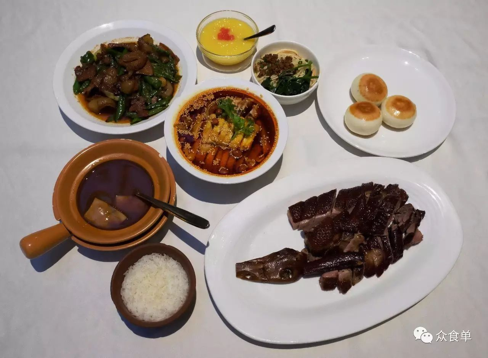 (原始链接: https://mmbiz.qpic.cn/mmbiz_jpg/zEV5HrLLB8Lvtp1EEic5BsuDhqycSdrBIUgwU97JzhUUv5twziakvgFRRLmhmL9uk9JV2icibN7ddiaWfCy9WaiaTgXw/0?wx_fmt=jpeg)
- 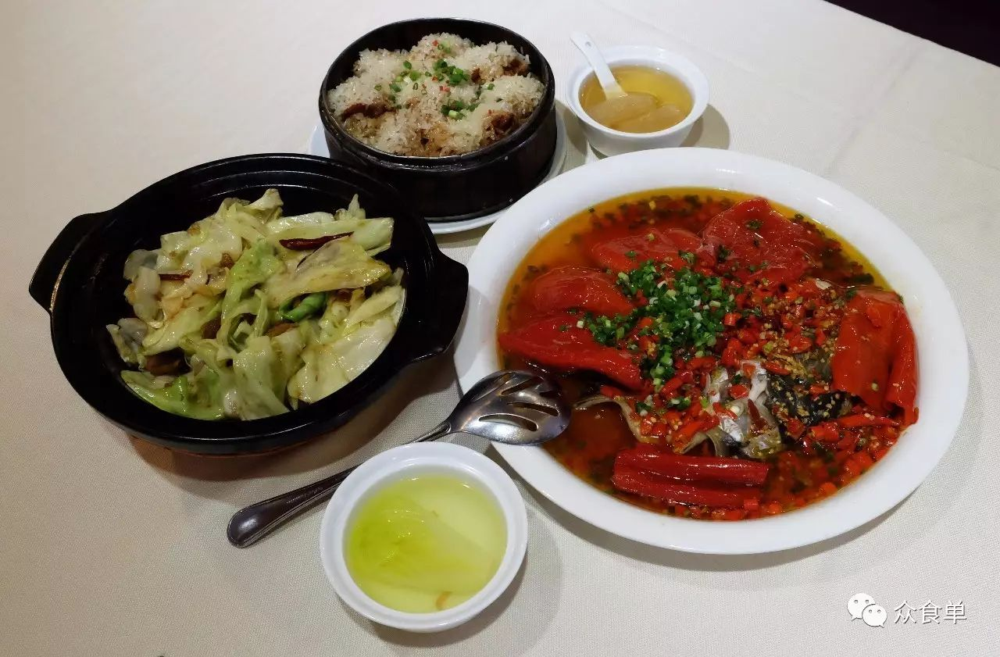 (原始链接: https://mmbiz.qpic.cn/mmbiz_jpg/zEV5HrLLB8Lvtp1EEic5BsuDhqycSdrBIvVG74yAMSicEiabZqeJ9x85Lpv7NZ8NMgWwsHS6wuvgxAPF80rETLbaA/0?wx_fmt=jpeg)
- 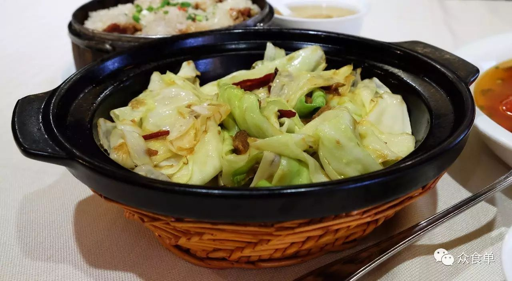 (原始链接: https://mmbiz.qpic.cn/mmbiz_jpg/zEV5HrLLB8Lvtp1EEic5BsuDhqycSdrBIJH7kHyE8UZxW2yXOTygCVGX2u2YGRWbFFta6NIiaWeIEyMjSuWeSTPQ/0?wx_fmt=jpeg)
- 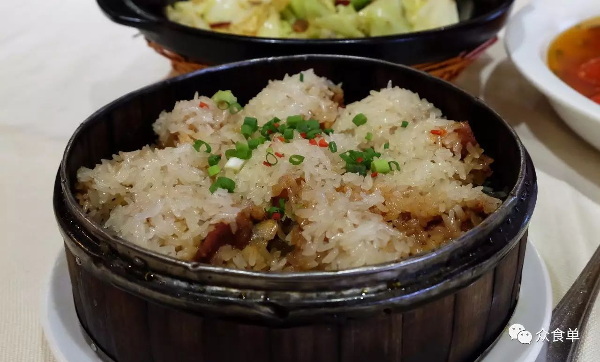 (原始链接: https://mmbiz.qpic.cn/mmbiz_jpg/zEV5HrLLB8Lvtp1EEic5BsuDhqycSdrBIkL27qtgPQ6joUJqrUkRQMzPPvKTbUElCetrOHt4Wsay300hP3uZFwA/0?wx_fmt=jpeg)
- 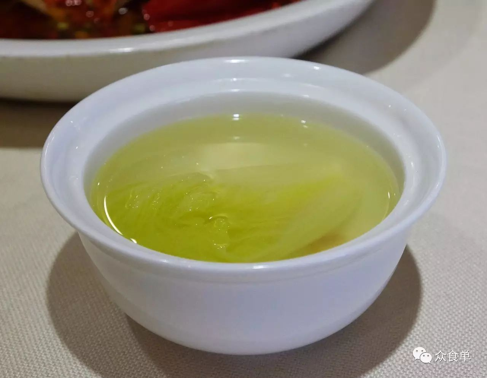 (原始链接: https://mmbiz.qpic.cn/mmbiz_jpg/zEV5HrLLB8Lvtp1EEic5BsuDhqycSdrBIz4L8g1zNwHAEkPFWnOu6UbRNjDkNMFA4a6RT3Cia5B7DZLnl0bBfWvw/0?wx_fmt=jpeg)
-  (原始链接: https://mmbiz.qpic.cn/mmbiz_jpg/zEV5HrLLB8Lvtp1EEic5BsuDhqycSdrBIPZxTaPkUTbRPY82SEYr1zsYlbH8MiaspVHSZLickWGsGfI5iaBI6S6Giag/0?wx_fmt=jpeg)
