# 无标题

**链接地址:** http://mp.weixin.qq.com/s?__biz=MjM5ODY1MTAwMw==&mid=2651779460&idx=1&sn=eaa6df7400a7a4db93980f2fe9908fb2&chksm=bd3d24908a4aad86a18de01f29fb694bd5e6375bd8dcefd1853233d2df5e6daf327a2ffcee45&mpshare=1&scene=2&srcid=1202vUih6fWm4oybXQTeWGp5#rd
**作者:** 
**获取时间:** 2025/8/28 22:21:37
**图片数量:** 23

---

## 原始HTML内容

<strong style="color: rgb(136, 136, 136);max-width: 100%;font-family: 微软雅黑;line-height: 25.6px;font-size: 12px;box-sizing: border-box !important;word-wrap: break-word !important;">《书画文化》</strong>您关注的是最受欢迎的文艺公众号 

传播：中国传统文化 | 艺术品收藏 | 茶道 | 文学 | 视觉

<qqmusic jumpurlkey="" albumid="004FuEIU3Cw1HZ" otherid="001aF6Ng0dsLK5" musictype="1" src="/cgi-bin/readtemplate?t=tmpl/qqmusic_tmpl&amp;singer=%E8%8C%83%E7%8E%AE%E7%90%AA%20-%20%E7%9C%9F%E5%96%84%E7%BE%8E&amp;music_name=%E9%82%A3%E4%BA%9B%E8%8A%B1%E5%84%BF&amp;albumurl=https%3A%2F%2Fy.gtimg.cn%2Fmusic%2Fphoto_new%2FT002R68x68M000004FuEIU3Cw1HZ.jpg&amp;musictype=1" play_length="318" singer="范玮琪&nbsp;-&nbsp;真善美" music_name="那些花儿" audiourl="http://ws.stream.qqmusic.qq.com/C100001aF6Ng0dsLK5.m4a?fromtag=46" albumurl="https://y.gtimg.cn/music/photo_new/T002R68x68M000004FuEIU3Cw1HZ.jpg" mid="001aF6Ng0dsLK5" musicid="102386036" frameborder="0" scrolling="no" class="res_iframe qqmusic_iframe js_editor_qqmusic"></qqmusic>
<h2 style="max-width: 100%;color: rgb(62, 62, 62);white-space: normal;background-color: rgb(255, 255, 255);text-align: center;box-sizing: border-box !important;word-wrap: break-word !important;"> </h2>
 

向往的生活，

究竟，长什么样？

 

 

寻一个人，安一处家，

种一树繁花，

然后，

花前月下，一辈子。

 

 

看天上云卷云舒，

看门前花开花落。

 

 

花做篱笆，诗意为墙。

静守流年，

嗅一院子的芬芳。

 

 

 

春夏秋冬，各自成景。

傍晚午后，读书喝茶。

把简单的日子，

过成一首美好的诗。

 

 

 

花开时，绚烂、惊艳；

花落时，浪漫、美妙。

每一天，

都应该学会让平淡的生活写满诗情。

 

 

在花香包围的地方，

开辟出一个美好的小角落。

有元气满满的早晨，

有惬意悠闲的午后，

还有花前月下，

畅聊人生的夜晚。

 

 

累了的时候，

就靠着软软的枕头静静躺会儿。

一觉醒来，

就会发现生活它还是如此美妙。

 

 

闲暇之时，门前种花。

疲倦之后，伴着花香安然入睡。

简单而精致，优雅而从容。

 

 

嗅一嗅清晨的花香，

数一数傍晚的落花。

热爱生活的人，

总是很花心。

 

 

爱春天时的繁花似锦，

花一开，就浪漫满屋。

连路人都忍不住驻足欣赏。

 

 

爱夏天时雨后的清新，

一场大雨，

把所有的烦恼和尘埃都冲涮，

只余绿叶、红花的干净味道。

 

 

等到了秋天和冬天，

花开的少了，

就把春夏珍藏起来的记忆重温，

再把秋冬的静谧藏心里。

 

 

每天匆匆忙忙，

感怀着生活的无趣。

是不是因为，

得到的和想要的早已经不一样？

 

 

人世间有时候会很喧闹，

会有拥挤，

唯有守着心的安宁，

守着一方向往的小天地，

生活才最简单、幸福。

 

 

心安处，即是家。

花草相伴的地方，

即最向往的家。

 

 

生活的恩典，是自己给的。

理想的生活，

还不知道哪天会来，

但一直在路上。

 

 

愿浮华过后，

我们都能以自己喜欢的方式，

共此一生。

 

想要一个院子，看花开花落一辈子。

 

<section label="Copyright © 2016 playhudong All Rights Reserved." donone="shifuMouseDownPayStyle('shifu_sig_024')" style="margin: 1em auto;max-width: 100%;color: rgb(62, 62, 62);font-size: 16px;white-space: normal;line-height: 25.6px;border-width: initial;border-style: none;border-color: initial;width: 20em;background-color: rgb(255, 255, 255);box-sizing: border-box !important;word-wrap: break-word !important;"><section style="max-width: 100%;box-sizing: border-box;width: 320px;word-wrap: break-word !important;"><section style="max-width: 100%;width: 320px;height: auto;text-align: center;overflow: hidden;box-sizing: border-box !important;word-wrap: break-word !important;"><section class="" style="margin-right: 1em;max-width: 100%;box-sizing: border-box;width: 8em;height: 8em;display: inline-block;border-radius: 50%;vertical-align: top;background-image: initial;background-attachment: initial;background-color: rgb(129, 191, 208);background-size: initial;background-origin: initial;background-clip: initial;background-position: initial;background-repeat: initial;word-wrap: break-word !important;"><section style="margin-top: 1em;max-width: 100%;width: 128px;box-sizing: border-box !important;word-wrap: break-word !important;">
<strong style="max-width: 100%;box-sizing: border-box !important;word-wrap: break-word !important;"> </strong>

<strong style="max-width: 100%;box-sizing: border-box !important;word-wrap: break-word !important;">名利场</strong>

<strong style="max-width: 100%;box-sizing: border-box !important;word-wrap: break-word !important;">Cityfocus</strong> 
</section></section><section style="max-width: 100%;box-sizing: border-box;color: rgb(255, 255, 255);width: 8em;display: inline-block;vertical-align: top;word-wrap: break-word !important;"> </section></section><section style="padding: 1em 0em 0em;max-width: 100%;width: 320px;font-size: 1em;text-align: center;box-sizing: border-box !important;word-wrap: break-word !important;">
<strong style="max-width: 100%;font-size: 1em;color: rgb(89, 89, 89);line-height: 25.6px;box-sizing: border-box !important;word-wrap: break-word !important;">长按二维码关注：浮华世界，名利场。</strong>
</section></section></section>
温馨提示：《书画文化》推广的内容如有侵权请您告知我们会在第一时间处理或撤销；互联网是一个资源共享的生态圈，我们崇尚分享。

其他平台转载请注明：(来源：书画文化 微信：Taizhouwenhua)。

---

## 纯文本内容

《书画文化》您关注的是最受欢迎的文艺公众号传播：中国传统文化 | 艺术品收藏 | 茶道 | 文学 | 视觉向往的生活，究竟，长什么样？寻一个人，安一处家，种一树繁花，然后，花前月下，一辈子。看天上云卷云舒，看门前花开花落。花做篱笆，诗意为墙。静守流年，嗅一院子的芬芳。春夏秋冬，各自成景。傍晚午后，读书喝茶。把简单的日子，过成一首美好的诗。花开时，绚烂、惊艳；花落时，浪漫、美妙。每一天，都应该学会让平淡的生活写满诗情。在花香包围的地方，开辟出一个美好的小角落。有元气满满的早晨，有惬意悠闲的午后，还有花前月下，畅聊人生的夜晚。累了的时候，就靠着软软的枕头静静躺会儿。一觉醒来，就会发现生活它还是如此美妙。闲暇之时，门前种花。疲倦之后，伴着花香安然入睡。简单而精致，优雅而从容。嗅一嗅清晨的花香，数一数傍晚的落花。热爱生活的人，总是很花心。爱春天时的繁花似锦，花一开，就浪漫满屋。连路人都忍不住驻足欣赏。爱夏天时雨后的清新，一场大雨，把所有的烦恼和尘埃都冲涮，只余绿叶、红花的干净味道。等到了秋天和冬天，花开的少了，就把春夏珍藏起来的记忆重温，再把秋冬的静谧藏心里。每天匆匆忙忙，感怀着生活的无趣。是不是因为，得到的和想要的早已经不一样？人世间有时候会很喧闹，会有拥挤，唯有守着心的安宁，守着一方向往的小天地，生活才最简单、幸福。心安处，即是家。花草相伴的地方，即最向往的家。生活的恩典，是自己给的。理想的生活，还不知道哪天会来，但一直在路上。愿浮华过后，我们都能以自己喜欢的方式，共此一生。想要一个院子，看花开花落一辈子。名利场Cityfocus长按二维码关注：浮华世界，名利场。温馨提示：《书画文化》推广的内容如有侵权请您告知我们会在第一时间处理或撤销；互联网是一个资源共享的生态圈，我们崇尚分享。其他平台转载请注明：(来源：书画文化 微信：Taizhouwenhua)。

---

## 图片列表

-  (原始链接: http://mmbiz.qpic.cn/mmbiz/hmPGG7mRZjBAtZbYZc6h4OkyY6dj4yIGyXxOicm43hs2aluPhmvHzEUTPzKNepNrqlNwPr5Lq3ruwj1mreykzcA/640?wx_fmt=png)
- 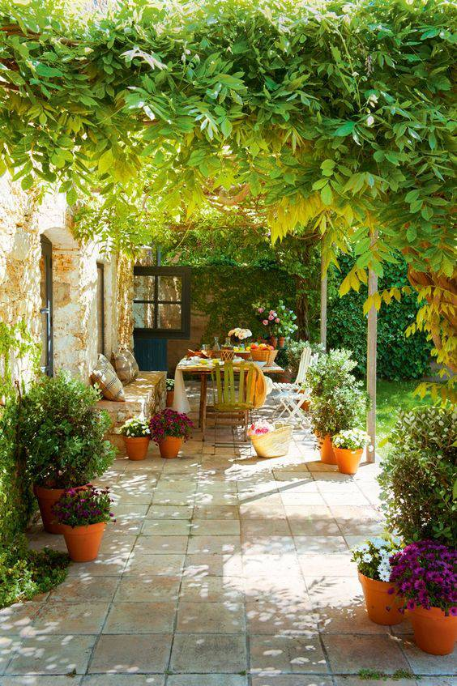 (原始链接: http://mmbiz.qpic.cn/mmbiz_png/zlam6vNGy5RtphQIuSnnkPWnrDNqAKakolsmHrUcer3wSknjiacOKnApfuP0eAzcFpDIBd47XA16IicB3K0sVHqQ/640?wx_fmt=png)
- 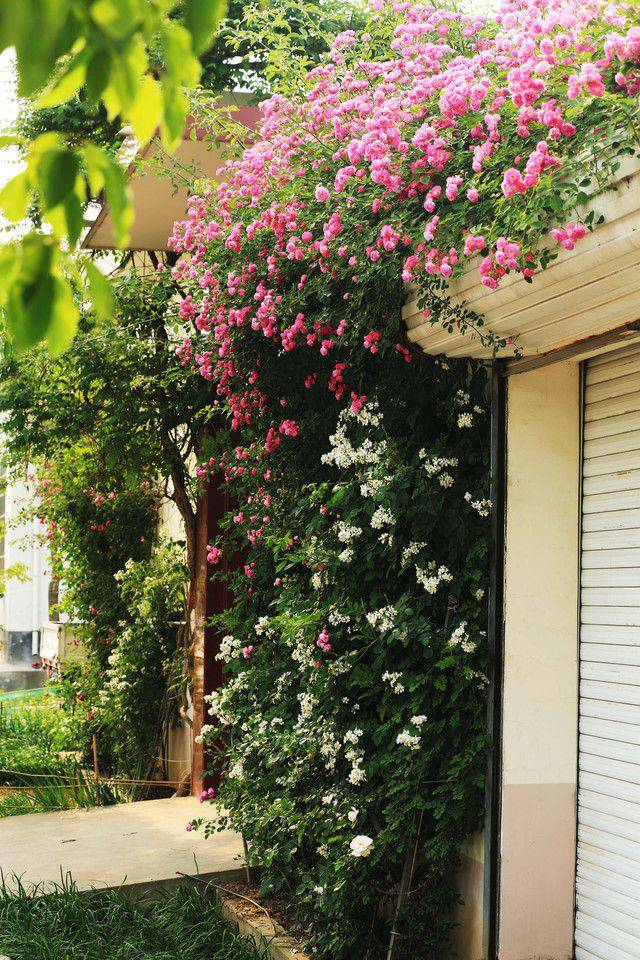 (原始链接: http://mmbiz.qpic.cn/mmbiz_png/zlam6vNGy5RtphQIuSnnkPWnrDNqAKakmJQ6dx9LTUUrFaXe2Z3t0Yah8gJefndt7F30rQagOES0zYBc4DXklA/640?wx_fmt=png)
- 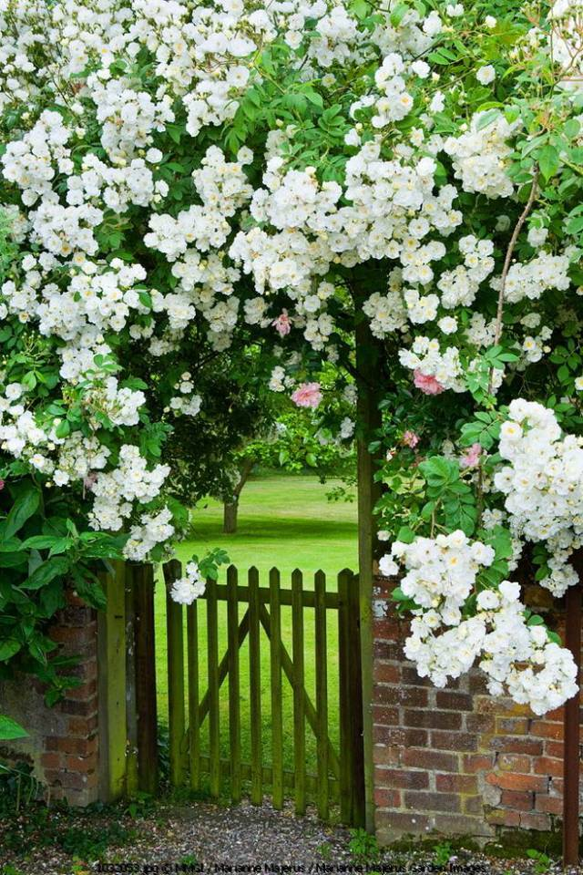 (原始链接: http://mmbiz.qpic.cn/mmbiz_png/zlam6vNGy5RtphQIuSnnkPWnrDNqAKakgghdw1bWFibqic3J4C66TOgkAyVlcDSicQ06xh6tkLbjiaS16UWNibrZuEA/640?wx_fmt=png)
- 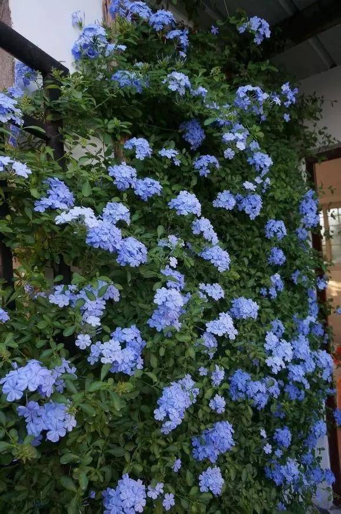 (原始链接: http://mmbiz.qpic.cn/mmbiz_png/zlam6vNGy5RtphQIuSnnkPWnrDNqAKak08UH8nUPmt1CcqTd2u9SzGecvXmIggjDjBfboz901RVC2wuHJYibI3A/640?wx_fmt=png)
- 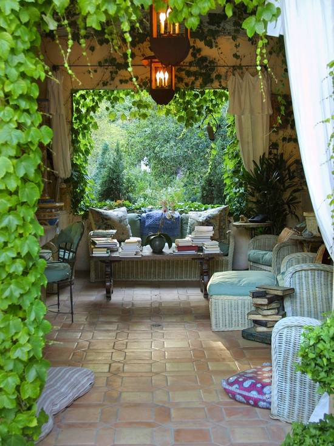 (原始链接: http://mmbiz.qpic.cn/mmbiz_png/zlam6vNGy5RtphQIuSnnkPWnrDNqAKakhdNRxAaeicTkd4NXHoSOxzJBJBdGUKdZGCRJMk4iap7FpLR7h9IpohZg/640?wx_fmt=png)
- 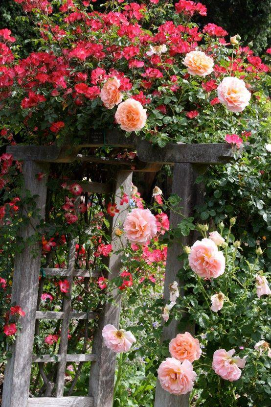 (原始链接: http://mmbiz.qpic.cn/mmbiz_png/zlam6vNGy5RtphQIuSnnkPWnrDNqAKakBWExaoZGSMJqOLO9DlRyw1mhHBSiarOOfyWG4noapmfhY49QXnuYzPQ/640?wx_fmt=png)
- 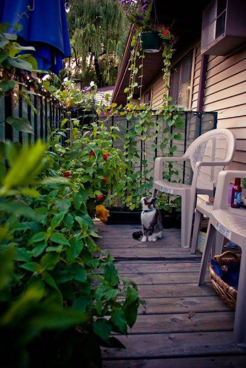 (原始链接: http://mmbiz.qpic.cn/mmbiz_png/zlam6vNGy5RtphQIuSnnkPWnrDNqAKak4PQEGbmnenXkmdgibyKLwj4cicmCMmDyg4UzwT3lKJCcmcllFQ28XIiaA/640?wx_fmt=png)
- 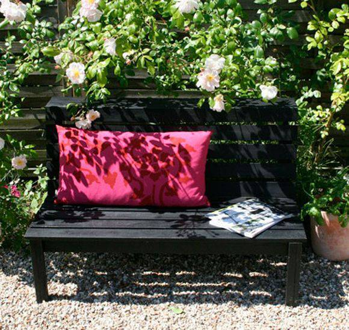 (原始链接: http://mmbiz.qpic.cn/mmbiz_png/zlam6vNGy5RtphQIuSnnkPWnrDNqAKak9Thb4L7ticj9Yic6aTbye6EpvwuwMptvmJaib85hadyCbmqkjichpgibAWw/640?wx_fmt=png)
- 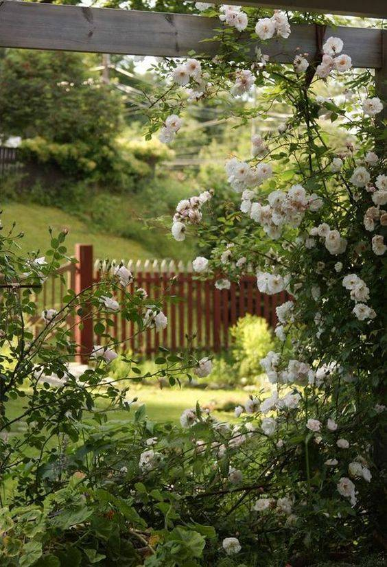 (原始链接: http://mmbiz.qpic.cn/mmbiz_png/zlam6vNGy5RtphQIuSnnkPWnrDNqAKakTKv08Uvw7SCvc6RA7yx8ia9Gv93icNWLzTJbKw9RDqGd5ZsDGfBwurGQ/640?wx_fmt=png)
- 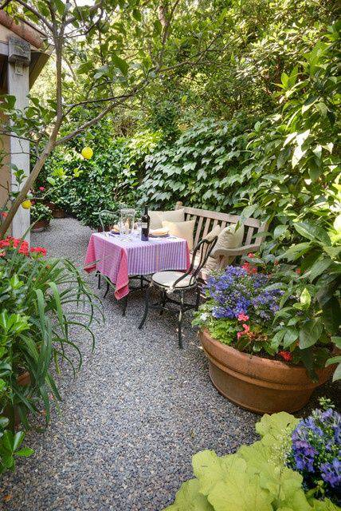 (原始链接: http://mmbiz.qpic.cn/mmbiz_png/zlam6vNGy5RtphQIuSnnkPWnrDNqAKakQSgibTTFH0XGLc4KqEITWicH70YNh6WjCZQgIKkmnickuPmDawB5P1vLA/640?wx_fmt=png)
- 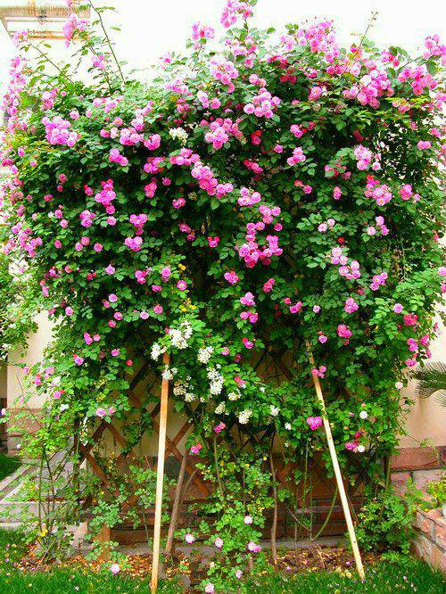 (原始链接: http://mmbiz.qpic.cn/mmbiz_png/zlam6vNGy5RtphQIuSnnkPWnrDNqAKakPqfD9oX4a7aPkY6fOS9ya58pgUfxiawRbYE8IrXpmUTibSlficWyg3DrA/640?wx_fmt=png)
- 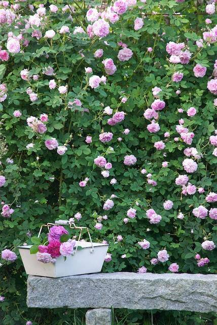 (原始链接: http://mmbiz.qpic.cn/mmbiz_png/zlam6vNGy5RtphQIuSnnkPWnrDNqAKakHvUA5GFaJ34af8WZAsTcPpF0Byn9FX3I8dBZ9Vs5QXYNS8niaEJFn1g/640?)
- 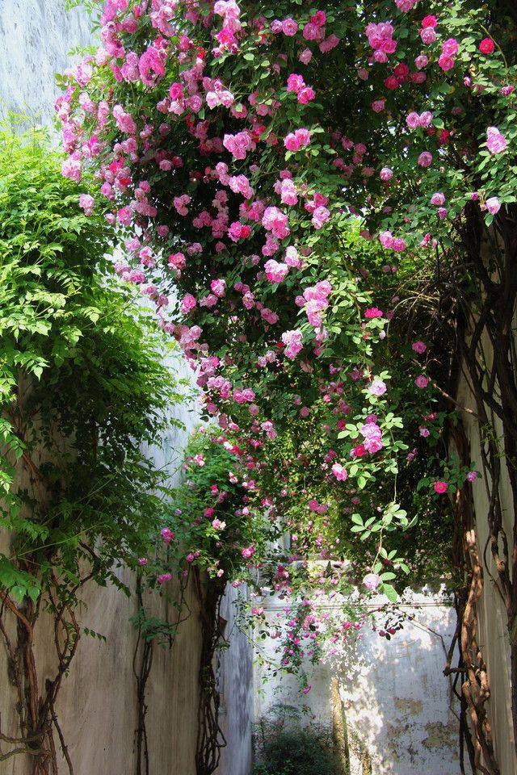 (原始链接: http://mmbiz.qpic.cn/mmbiz_png/zlam6vNGy5RtphQIuSnnkPWnrDNqAKak9KvEHUMWjFcAVlYSx8ErWhLibicDTYEVIzJHEI0aWwABthWs2ssZOWrw/640?wx_fmt=png)
- 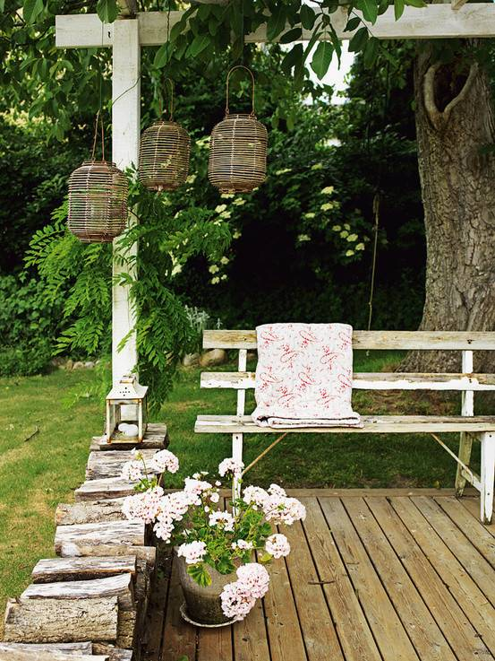 (原始链接: http://mmbiz.qpic.cn/mmbiz_png/zlam6vNGy5RtphQIuSnnkPWnrDNqAKakEK7ib4IpOIGsdgldUYBibCAOyLxvdJjbrtuWj1Uon33e8RdKIH5GSsKw/640?wx_fmt=png)
-  (原始链接: http://mmbiz.qpic.cn/mmbiz_png/zlam6vNGy5RtphQIuSnnkPWnrDNqAKakFxc9MhbdywviajbMPibBj2CdEyZWUZ230uQbqhSepu4icG8wfhAF9SfDA/640?wx_fmt=png)
- 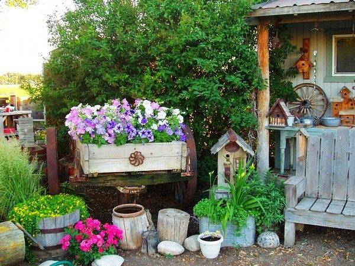 (原始链接: http://mmbiz.qpic.cn/mmbiz_png/zlam6vNGy5RtphQIuSnnkPWnrDNqAKak5VicfSPEgqotPUicWwkF5GaPSsicatJHm6aibbxHeKjZljTEjck6p1jEEA/640?wx_fmt=png)
- 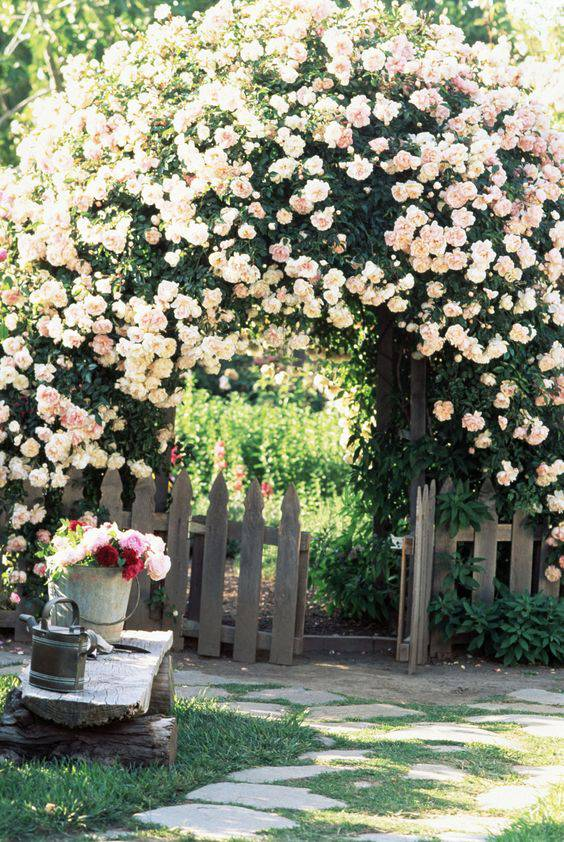 (原始链接: http://mmbiz.qpic.cn/mmbiz_png/zlam6vNGy5RtphQIuSnnkPWnrDNqAKakYuDuxFP4ee00iba0movpicdv4icnsh85WMYlw4iaDVGdZbXMKwZXFOyqSA/640?wx_fmt=png)
- 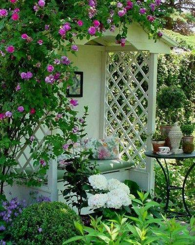 (原始链接: http://mmbiz.qpic.cn/mmbiz_png/zlam6vNGy5RtphQIuSnnkPWnrDNqAKakIgDWiciaRA2KUZmibn4M5uQlbTWo66IXFNmGokoIM32hLy3iccvLR5NBcw/640?wx_fmt=png)
-  (原始链接: http://mmbiz.qpic.cn/mmbiz_png/zlam6vNGy5RtphQIuSnnkPWnrDNqAKakjaTVtBxqS6u5cnh3d4R47rVZnWALzW717uz1yHEojiafgiafG6GJ6aMA/640?wx_fmt=png)
-  (原始链接: http://mmbiz.qpic.cn/mmbiz/Sk2ObdN7rzGuQKxksTF0VAiav3jXkuiabTFicjlRphTGicRmBW8ibHm0nPciaggqGK9VBhCgS97rzciaStRHxX7rHvvhQ/640?wx_fmt=jpeg)
-  (原始链接: http://mmbiz.qpic.cn/mmbiz/0oXaHWnKibUctNQK4IbV8fArvW22A72yhIbfRSAt8YEiaCTV5Fklqc5211Rj1RcjzH8S9icf7HMEQQmWbBuLwlLog/0/mmbizgif?wx_fmt=gif)
-  (原始链接: http://mmbiz.qpic.cn/mmbiz/0oXaHWnKibUctNQK4IbV8fArvW22A72yhIbfRSAt8YEiaCTV5Fklqc5211Rj1RcjzH8S9icf7HMEQQmWbBuLwlLog/0/mmbizgif?wx_fmt=gif)
