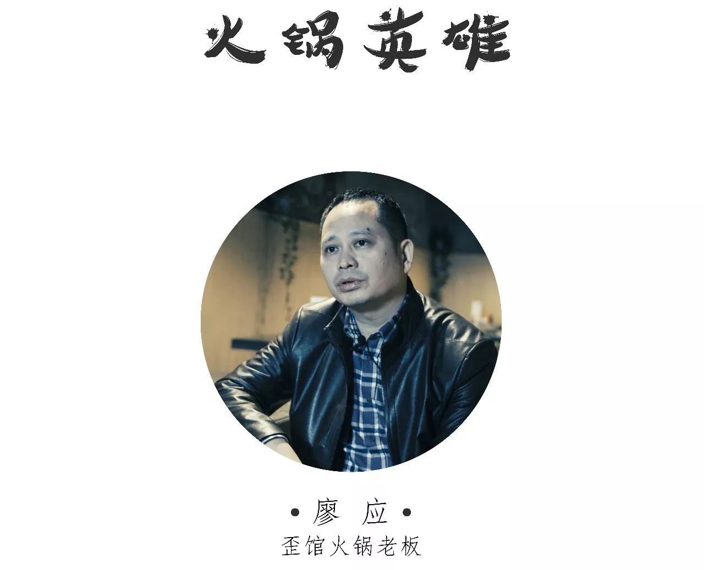
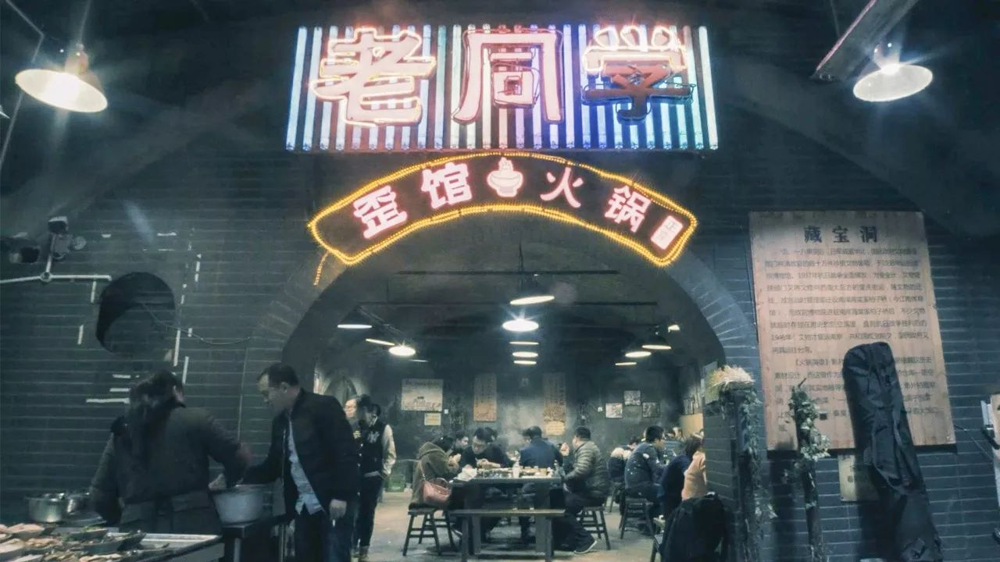
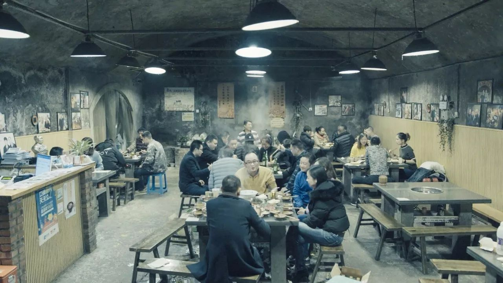
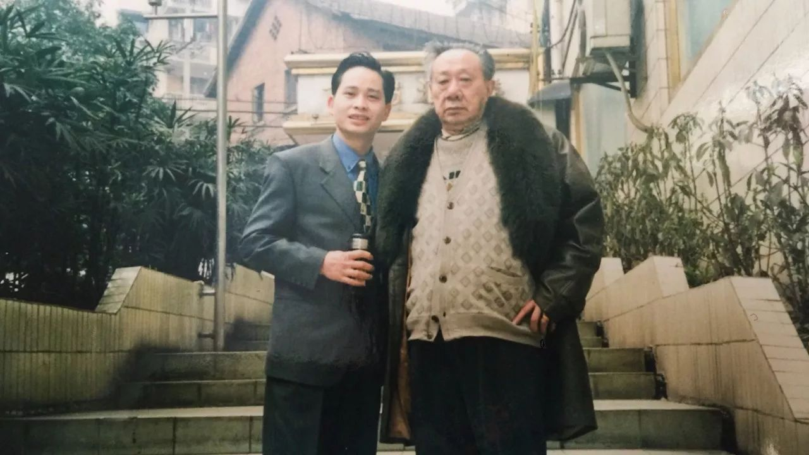
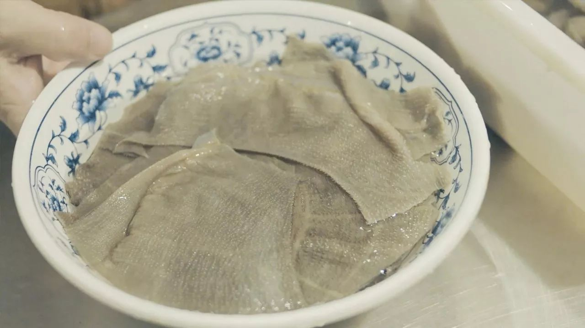
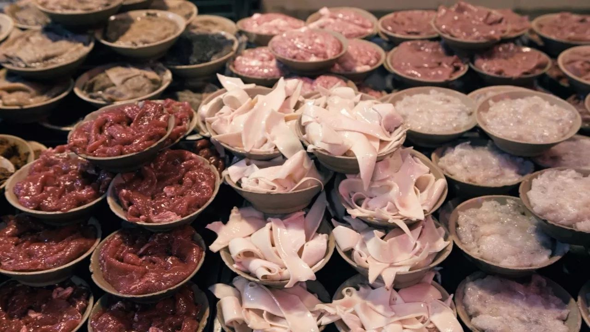
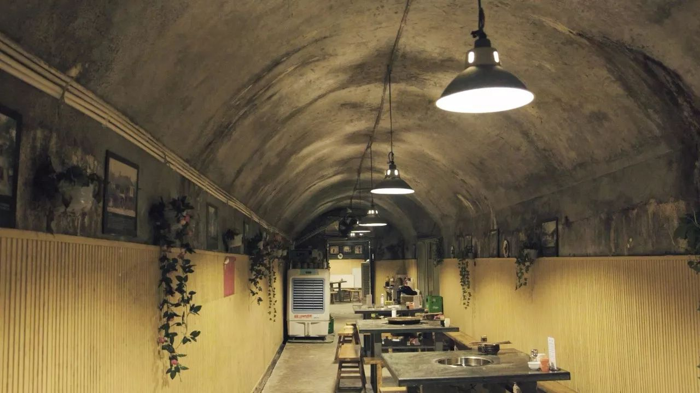

# 无标题

**链接地址:** http://mp.weixin.qq.com/s?__biz=MzI3NTE0MzUzNQ==&mid=2247485571&idx=1&sn=fac6959e5cab70f1010320074a4ee1be&chksm=eb080683dc7f8f953c7e91121c009af4e4077d0b8f59c0fd7efa21f854987cd965495c188f6b&mpshare=1&scene=2&srcid=0109gg8L0M8vU2bBIypam1Qc#rd
**作者:** 爱麻爱辣的
**获取时间:** 2025/8/28 22:20:46
**图片数量:** 11

---

## 原始HTML内容

<section class="xmteditor" style="display: none;" data-tools="新媒体管家" data-label="powered by xmt.cn"></section>
▲&nbsp;关注&nbsp;更重庆&nbsp;|&nbsp;二更旗下城市站

<mp-miniprogram class="miniprogram_element" data-miniprogram-appid="wxa8d5b78d14d218c0" data-miniprogram-path="pages/videodetail/videodetail?id=7102" data-miniprogram-nickname="二更视频" data-miniprogram-avatar="http://mmbiz.qpic.cn/mmbiz_png/yXZUJCgic3qQtGbiaLianHANGUyeQhSxrIG3vice7saqhcN7JhNnk777KKyCoicsF8e4Eq0qRnUDWKJW3VcIrDSYNPA/0?wx_fmt=png" data-miniprogram-title="火锅英雄" data-miniprogram-imageurl="http://mmbiz.qpic.cn/mmbiz_jpg/NiaccAWNu7Cj110U6mvcbNiaHOpGfYMicICa2qWakN4o5rTVhJSWNUnflfy5yPYhxK1QGeMu50jkkRf3JxlOib95tg/0?wx_fmt=jpeg"></mp-miniprogram>

 

 

自电影《火锅英雄》上映之后，重庆这家开在防空洞里的火锅店便火了，引得众人不远千里赶来一尝这别致的火锅。

很多人都说，店内生意如今这么火爆，全是因为这里是电影的实景拍摄地，老板廖应却不完全认同。他说，自家菜品站得住脚，才能留得住食客。他是川菜厨师，从业已有29年之久，师从鸳鸯火锅创始人陈志刚，自是做得一手好菜。

<strong style="color: rgb(62, 62, 62);max-width: 100%;font-size: 14px;line-height: 1.75em;box-sizing: border-box !important;overflow-wrap: break-word !important;"><strong style="max-width: 100%;box-sizing: border-box !important;overflow-wrap: break-word !important;"></strong></strong> 

<strong style="max-width: 100%;color: rgb(123, 12, 0);font-size: 14px;box-sizing: border-box !important;overflow-wrap: break-word !important;"><strong></strong></strong><strong style="max-width: 100%;color: rgb(123, 12, 0);font-size: 14px;box-sizing: border-box !important;overflow-wrap: break-word !important;"><strong>“做火锅要对得起自己的良心，</strong></strong>

<strong style="max-width: 100%;color: rgb(123, 12, 0);font-size: 14px;box-sizing: border-box !important;overflow-wrap: break-word !important;"><strong>要做到极致”</strong></strong>

<strong style="max-width: 100%;color: rgb(123, 12, 0);font-size: 14px;box-sizing: border-box !important;overflow-wrap: break-word !important;"></strong><strong style="max-width: 100%;font-size: 14px;line-height: 1.75em;box-sizing: border-box !important;overflow-wrap: break-word !important;"><strong style="max-width: 100%;box-sizing: border-box !important;overflow-wrap: break-word !important;"> </strong></strong>

<strong style="max-width: 100%;font-size: 14px;line-height: 1.75em;box-sizing: border-box !important;overflow-wrap: break-word !important;"><strong style="max-width: 100%;box-sizing: border-box !important;overflow-wrap: break-word !important;"></strong></strong>

一小时毛肚是店里的特色菜，因菜品新鲜而颇受众人欢迎，所谓“一小时”，是指一个钟头以前它还在牛肚子里面，现在就进了食客的胃了。

 

廖应犹记得，小的时候一到晚上，家家户户都提着煤油灯去防空洞，大人聊天，小孩嬉笑打闹。他将火锅店开在防空洞里，也是想重温儿时记忆。防空洞里没有信号，大家可以放下手机，认真吃饭。

其实，火锅在重庆极为普遍，人人都会做，但是越简单的东西就越难做到极致。廖应的梦想就是，将火锅做到极致。

 
<section label="Powered by 135editor.com" style="white-space: normal;max-width: 100%;line-height: 25.6px;letter-spacing: 1px;text-align: center;font-family: 微软雅黑;box-sizing: border-box !important;overflow-wrap: break-word !important;"><section data-id="2490" data-color="rgb(117, 117, 118)" data-custom="rgb(117, 117, 118)" style="max-width: 100%;border-width: 0px;border-style: none;border-color: currentcolor;box-sizing: border-box !important;overflow-wrap: break-word !important;"><section data-width="72%" style="margin: 5px auto;padding: 5px;max-width: 100%;border-width: 3px;border-style: solid;border-color: rgb(117, 117, 118);width: 400.31px;box-sizing: border-box !important;overflow-wrap: break-word !important;"><section data-bcless="lighten" style="padding: 15px;max-width: 100%;border-width: 1px;border-style: solid;border-color: rgb(168, 168, 169);box-sizing: border-box !important;overflow-wrap: break-word !important;">
<strong style="color: rgb(204, 0, 0);font-size: 15px;max-width: 100%;box-sizing: border-box !important;overflow-wrap: break-word !important;"><strong style="max-width: 100%;box-sizing: border-box !important;overflow-wrap: break-word !important;">▼今日互动▲</strong></strong> 

<strong data-filtered="filtered" style="max-width: 100%;box-sizing: border-box !important;overflow-wrap: break-word !important;"> </strong>

<strong>你还去过哪些明星去过的店铺？</strong>

<strong> </strong>

<strong style="max-width: 100%;font-size: 14px;line-height: 1.5em;box-sizing: border-box !important;overflow-wrap: break-word !important;">欢迎在底部留言评论并分享</strong>

<strong style="max-width: 100%;font-size: 14px;line-height: 1.5em;box-sizing: border-box !important;overflow-wrap: break-word !important;"> </strong>
</section></section></section></section>
 

<mp-miniprogram class="miniprogram_element" data-miniprogram-appid="wxa8d5b78d14d218c0" data-miniprogram-path="pages/videodetail/videodetail?id=6322" data-miniprogram-nickname="二更视频" data-miniprogram-avatar="http://mmbiz.qpic.cn/mmbiz_png/yXZUJCgic3qQtGbiaLianHANGUyeQhSxrIG3vice7saqhcN7JhNnk777KKyCoicsF8e4Eq0qRnUDWKJW3VcIrDSYNPA/0?wx_fmt=png" data-miniprogram-title="麻辣江湖，三十六道菜，十几年的江湖菜馆" data-miniprogram-imageurl="http://mmbiz.qpic.cn/mmbiz_jpg/NiaccAWNu7Cgr0G8Swms4G2jsFYiaibJkMqlV70g73qcUKpk0T5MEnRwye6tJ9gIBAFbIibyW9yJgG7gCJtvHsAtVA/0?wx_fmt=jpeg"></mp-miniprogram>

●&nbsp;关注&nbsp;更重庆&nbsp;|&nbsp;用影像洞悉人生&nbsp;●

▼爱生活，快来“写留言”

---

## 纯文本内容

▲ 关注 更重庆 | 二更旗下城市站自电影《火锅英雄》上映之后，重庆这家开在防空洞里的火锅店便火了，引得众人不远千里赶来一尝这别致的火锅。很多人都说，店内生意如今这么火爆，全是因为这里是电影的实景拍摄地，老板廖应却不完全认同。他说，自家菜品站得住脚，才能留得住食客。他是川菜厨师，从业已有29年之久，师从鸳鸯火锅创始人陈志刚，自是做得一手好菜。“做火锅要对得起自己的良心，要做到极致”一小时毛肚是店里的特色菜，因菜品新鲜而颇受众人欢迎，所谓“一小时”，是指一个钟头以前它还在牛肚子里面，现在就进了食客的胃了。廖应犹记得，小的时候一到晚上，家家户户都提着煤油灯去防空洞，大人聊天，小孩嬉笑打闹。他将火锅店开在防空洞里，也是想重温儿时记忆。防空洞里没有信号，大家可以放下手机，认真吃饭。其实，火锅在重庆极为普遍，人人都会做，但是越简单的东西就越难做到极致。廖应的梦想就是，将火锅做到极致。▼今日互动▲你还去过哪些明星去过的店铺？欢迎在底部留言评论并分享● 关注 更重庆 | 用影像洞悉人生 ●▼爱生活，快来“写留言”

---

## 图片列表

-  (原始链接: https://mmbiz.qpic.cn/mmbiz_jpg/NiaccAWNu7Cj110U6mvcbNiaHOpGfYMicICia7PJTWxibolibRKJbW5Ed7Z5e46Gnw7XIPbG3q9ibhfibjGn0mnwWuqRQg/?wx_fmt=jpeg)
-  (原始链接: https://mmbiz.qpic.cn/mmbiz_jpg/NiaccAWNu7Cj110U6mvcbNiaHOpGfYMicICFMgw5PUlh4AodBKA9vRdjqJajEicLvSdicSZuxoxBplibWG3Ovice3rxbA/?wx_fmt=jpeg)
-  (原始链接: https://mmbiz.qpic.cn/mmbiz_jpg/NiaccAWNu7Cj110U6mvcbNiaHOpGfYMicIC8g85VibpkicJrzicvKziam2QvaNFiaJwFTS9qMWzoSiaGXD2iaNEXMGtthUeg/?wx_fmt=jpeg)
-  (原始链接: https://mmbiz.qpic.cn/mmbiz_jpg/NiaccAWNu7Cj110U6mvcbNiaHOpGfYMicICMZc4yL8OFjOW9wr56p3Tfpt6HxQwv742uaNDvhsk4JBZictyBumQ57A/?wx_fmt=jpeg)
-  (原始链接: https://mmbiz.qpic.cn/mmbiz_jpg/NiaccAWNu7Cj110U6mvcbNiaHOpGfYMicICRnHNzUCcLde8WialVMtEhlebYwEXlK5qZdjbAyvStl1GFxWic8zDXkRw/?wx_fmt=jpeg)
-  (原始链接: http://mmbiz.qpic.cn/mmbiz_jpg/NiaccAWNu7CiaCojW2yRSzJ76Ywybj1UHHF24TLkm0iafqe0reQpptMUYOAo4SiabO70YsQmcGpLbPfpqCnpcFOia4w/?wx_fmt=jpeg)
-  (原始链接: http://mmbiz.qpic.cn/mmbiz_png/eDicWxMAPcsJsvuYrjQqKJrU8WleltO6ticJBicmpLDrtiaHGrd2z8CFx2uTNZMNQHs5jdncmGWhMeRgAWSVOC9zUg/640?)
-  (原始链接: https://mmbiz.qpic.cn/mmbiz_jpg/NiaccAWNu7Cj110U6mvcbNiaHOpGfYMicICKcmoBLqGVKlEbPPs0KgsLVibFnbc5eflgeZicWdlF88yQ5AY3IsILgmw/?wx_fmt=jpeg)
-  (原始链接: https://mmbiz.qpic.cn/mmbiz_jpg/NiaccAWNu7Cj110U6mvcbNiaHOpGfYMicICDtxFkP8xJX7tPeXZ6iaGzByLicB4zFCiariaiaslwOcROjYY8ibZa0ib0uuHw/?wx_fmt=jpeg)
-  (原始链接: https://mmbiz.qpic.cn/mmbiz_jpg/NiaccAWNu7Cj110U6mvcbNiaHOpGfYMicICEmiaia3JTia371ELX847m84kVbGPuosv2U8qib72kiaZ0PAunr1ycDehD6Q/?wx_fmt=jpeg)
-  (原始链接: https://mmbiz.qpic.cn/mmbiz_jpg/NiaccAWNu7CiaBalicbbRC9JoUPxxCl9V1YM30GOlRtDIu15icyctTUM3lQ9yfoSkmDVwH5Aib79CgI7pR9Z5icsbu6g/?wx_fmt=jpeg)
