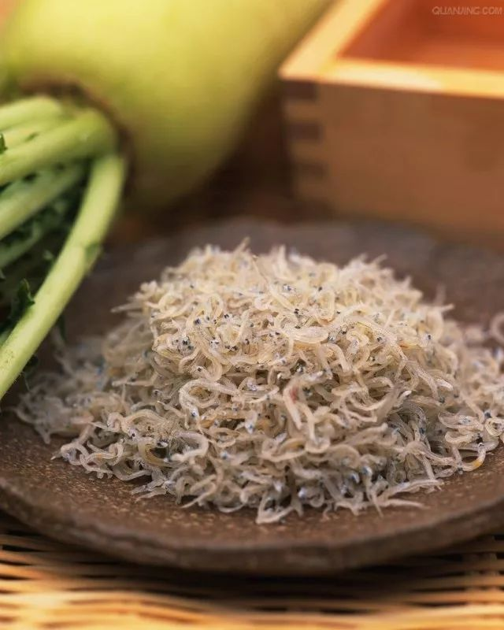

# 无标题

**链接地址:** http://mp.weixin.qq.com/s?__biz=MzI1MjA5Mzc3Mw==&mid=2653012817&idx=1&sn=41e4b481718d9905dda0ea067870e20c&chksm=f23d9773c54a1e658b86c00f3f7ab34d3ccfec3544aaf92ab4366d6e219a14ffca156c4985e3&mpshare=1&scene=2&srcid=0118tqcIWrVqhXLgED5QYgaj#rd
**作者:** 一个男人在流浪
**获取时间:** 2025/8/28 22:20:03
**图片数量:** 19

---

## 原始HTML内容

<mpvoice frameborder="0" class="res_iframe js_editor_audio audio_iframe" src="/cgi-bin/readtemplate?t=tmpl/audio_tmpl&amp;name=Green%20Day%20-%20Last%20Night%20On%20Earth%20(Album%20Version).mp3&amp;play_length=03:56" isaac2="1" low_size="433.37" source_size="433.4" high_size="1848.94" name="Green&nbsp;Day&nbsp;-&nbsp;Last&nbsp;Night&nbsp;On&nbsp;Earth&nbsp;(Album&nbsp;Version).mp3" play_length="236000" voice_encode_fileid="MzI1MjA5Mzc3M18yNjUzMDEyODE2"></mpvoice>

 
<section style="background-color: rgb(255, 255, 255);box-sizing: border-box;"><section class="Powered-by-XIUMI V5" style="box-sizing: border-box;" powered-by="xiumi.us"><section class="" style="margin-top: 10px;margin-bottom: 10px;text-align: right;line-height: 1;box-sizing: border-box;"><section class="" style="display: inline-block;vertical-align: top;line-height: 1.2;padding-right: 3px;font-size: 12px;box-sizing: border-box;">
快速查询码：83
</section><section class="" style="display: inline-block;vertical-align: top;box-sizing: border-box;">   </section></section></section><section class="Powered-by-XIUMI V5" style="box-sizing: border-box;" powered-by="xiumi.us"><section class="" style="transform: translate3d(0px, 0px, 0px);-webkit-transform: translate3d(0px, 0px, 0px);-moz-transform: translate3d(0px, 0px, 0px);-o-transform: translate3d(0px, 0px, 0px);text-align: center;margin: 10px 0%;box-sizing: border-box;"><section class="" style="display: inline-block;width: 95%;vertical-align: top;box-shadow: rgb(178, 185, 192) 1px 0px 10px;box-sizing: border-box;"><section class="Powered-by-XIUMI V5" style="box-sizing: border-box;" powered-by="xiumi.us"><section class="" style="box-sizing: border-box;"><section class="" style="text-align: left;box-sizing: border-box;">
 
</section></section></section><section class="Powered-by-XIUMI V5" style="box-sizing: border-box;" powered-by="xiumi.us"><section class="" style="margin-top: 10px;margin-bottom: 10px;font-size: 32px;box-sizing: border-box;"><section class="" style="box-shadow: rgba(159, 160, 160, 0.498039) 0px 0px 10px;width: 5.5em;height: 5.5em;padding: 8px;display: inline-block;vertical-align: top;border-radius: 100%;box-sizing: border-box;"><section style="box-shadow: rgba(0, 0, 0, 0.290196) 0px 0px 10px inset;padding: 8px;width: 100%;height: 100%;border-radius: 100%;box-sizing: border-box;"><section class="" style="width: 100%;height: 100%;border-radius: 100%;background-position: center center;background-repeat: no-repeat;background-size: cover;background-image: url(&quot;http://mmbiz.qpic.cn/mmbiz_jpg/oQwolSsB31hDsuW9sKZ6tQiaAZmf9Rr0wEgsbbiboyUwukwDCqWJk3wtW7yqtjyB6g4ZTdL36ibabEfvF8PI3gEtg/0?wx_fmt=jpeg&quot;);box-sizing: border-box;"><section class="" style="width: 100%;height: 100%;overflow: hidden;box-sizing: border-box;"></section></section></section></section></section></section><section class="Powered-by-XIUMI V5" style="box-sizing: border-box;" powered-by="xiumi.us"><section class="" style="margin-right: 0%;margin-left: 0%;box-sizing: border-box;"><section class="" style="color: rgb(133, 118, 106);font-size: 14px;letter-spacing: 1px;line-height: 1.6;box-sizing: border-box;">
 
</section></section></section><section class="Powered-by-XIUMI V5" powered-by="xiumi.us" style="box-sizing: border-box;"><section class="" style="margin: 10px 0%;box-sizing: border-box;"><section class="" style="text-align: left;color: rgb(13, 22, 37);letter-spacing: 0px;font-size: 14px;padding-right: 10px;padding-left: 10px;line-height: 1.8;box-sizing: border-box;">
最近几天，来自日本方面的消息称

本季日本鳗鲡的鳗苗遭遇严重鱼荒

日本国内外的捕获量只有去年同期的约1%

很可能出现史上最低水平

 

实际上

日本鳗鲡的减产早就不是新闻

从六十年代至今

野外捕捉的日本鳗鲡苗产量一直在迅速下滑

 

更不为人知的是

日本鳗鲡不仅是我们熟知的食材

也早就是一种濒危生物

用一个虽不准确，但更直观的比喻就是：

你的饭碗里躺着一只熊猫

 

为什么日本鳗鲡会走向濒危

为什么已经濒危但却依然被端上餐桌

而它又能在餐桌上存在多久

这就是今天要谈的话题
</section></section></section><section class="Powered-by-XIUMI V5" style="box-sizing: border-box;" powered-by="xiumi.us"><section class="" style="box-sizing: border-box;"><section class="" style="text-align: left;box-sizing: border-box;">
 
</section></section></section><section class="Powered-by-XIUMI V5" style="box-sizing: border-box;" powered-by="xiumi.us"><section class="" style="margin-top: 10px;margin-bottom: 10px;box-sizing: border-box;"><section class="" style="display: inline-block;width: 1.08em;height: 1.08em;border-radius: 50%;padding: 0.342em;border-width: 1px;border-style: dotted;border-color: rgb(142, 201, 101);background-color: rgb(254, 255, 255);box-sizing: border-box;"><section style="width: 100%;height: 100%;border-radius: 50%;background-color: rgb(142, 201, 101);box-sizing: border-box;"></section></section></section></section><section class="Powered-by-XIUMI V5" style="box-sizing: border-box;" powered-by="xiumi.us"><section class="" style="box-sizing: border-box;"><section class="" style="text-align: left;box-sizing: border-box;">
 
</section></section></section><section class="Powered-by-XIUMI V5" style="box-sizing: border-box;" powered-by="xiumi.us"><section class="" style="margin: 10px 0%;box-sizing: border-box;"><section class="" style="text-align: left;color: rgb(13, 22, 37);letter-spacing: 0px;font-size: 14px;padding-right: 10px;padding-left: 10px;line-height: 1.8;box-sizing: border-box;">
本回答共4660字

预计阅读时间8-10分钟

图片13张，请尽量连接WIFI

&nbsp;本文为“海鲜指南”公众号（seafood-guide）约稿谢绝转载

 

 
</section></section></section></section></section></section><section class="Powered-by-XIUMI V5" style="box-sizing: border-box;" powered-by="xiumi.us"><section class="" style="transform: translate3d(0px, 0px, 0px);-webkit-transform: translate3d(0px, 0px, 0px);-moz-transform: translate3d(0px, 0px, 0px);-o-transform: translate3d(0px, 0px, 0px);text-align: center;margin: 10px 0%;box-sizing: border-box;"><section class="" style="display: inline-block;width: 95%;vertical-align: top;box-shadow: rgb(178, 185, 192) 1px 0px 10px;box-sizing: border-box;"><section class="Powered-by-XIUMI V5" style="box-sizing: border-box;" powered-by="xiumi.us"><section class="" style="box-sizing: border-box;"><section class="" style="text-align: left;box-sizing: border-box;">
 
</section></section></section><section class="Powered-by-XIUMI V5" style="box-sizing: border-box;" powered-by="xiumi.us"><section class="" style="margin-right: 0%;margin-left: 0%;box-sizing: border-box;"><section class="" style="text-align: left;color: rgb(13, 22, 37);letter-spacing: 1px;line-height: 1.6;padding-right: 10px;padding-left: 10px;box-sizing: border-box;">
 

实际上，从12月日本开捕日本鳗鲡鱼苗开始，水产圈内关于鳗苗巨幅减产的信息早已发酵，但因为这个圈子距离普通百姓太远，一直没能引起关注。16号白天部分媒体的新闻，自然是引燃热点的导火索。为了引起大家对这件事的重视，鄙人在17号凌晨在知乎平台推了一把，没想到在带了一波大节奏……

 

上了大新闻的主角就是日本鳗鲡，也就是咱国内说的白鳝、河鳗，很多人都吃过，这几年日料风行，在稍微考究点的日料店里依然不难见到。

 
</section></section></section><section class="Powered-by-XIUMI V5" style="box-sizing: border-box;" powered-by="xiumi.us"><section class="" style="margin-top: 0.5em;margin-bottom: 0.5em;padding-left: 0.5em;padding-right: 0.5em;box-sizing: border-box;"><section class="" style="box-sizing: border-box;width: 100%;border-width: 4px;border-style: solid;border-color: white;box-shadow: rgb(102, 102, 102) 3.53553px 3.53553px 8px;display: inline-block;height: auto !important;overflow: hidden !important;"></section></section></section><section class="Powered-by-XIUMI V5" powered-by="xiumi.us" style="box-sizing: border-box;"><section class="" style="margin-right: 0%;margin-left: 0%;box-sizing: border-box;"><section class="" style="text-align: left;color: rgb(13, 22, 37);letter-spacing: 1px;line-height: 1.6;padding-right: 10px;padding-left: 10px;box-sizing: border-box;">
 

 

尽管是一种司空见惯的传统食材，但是实际上从2014年开始，日本鳗鲡就已经登上了IUCN濒危名单。造成日本鳗鲡走上濒危道路的原因，想想也就知道了。这种鱼是在海洋中出生，洄游到淡水河川中成长，快要性成熟的时候再返回海洋繁殖。而一方面，它的栖息地——东亚各国的河流——必然受到这里经济高度活跃所带来的开发性破坏，另一方面，这些国家在传统上就喜欢吃日本鳗鲡，人口又普遍较多，消耗量很大。

 

所以，日本鳗鲡的野生种群衰减的很快，早在几十年前就已经捉襟见肘无法满足市场需求了。

 

那么自然的，就会有人想到养殖。很多朋友看来，野生的不够就养殖，这似乎是天经地义的事情，但问题来了：

 

日本鳗鲡无法人工商业化繁育，养殖需要从野外捕捞幼苗，也就是说，日本鳗鲡的养殖也是完全依赖野生种群的。

 

要搞清楚为什么不能人工商业化繁育的问题，恐怕得从日本鳗鲡神秘的生活轨迹说起。

 

作为东亚地区独有的淡水鳗鲡物种，从中国、朝鲜半岛到日本的大小河流里，都经常能找到日本鳗鲡。很奇怪的是，如此常见的鱼，人们却不知道它们是如何繁殖的，也几乎分不出公母，我们只知道，秋季会有一些成年鳗鲡会顺流而下回到海里，自此就再也不会回来。而到了第二年，就会有小鳗鱼出现在河流里。这个现象不仅仅出现在日本鳗鲡身上，生活在欧洲的欧洲鳗鲡和北美的美洲鳗鲡也会这样神秘失踪并神秘的繁殖出下一代，而且和很多洄游到海里繁殖的生物不同（比如大闸蟹），在河流的入海口和近海，也不能发现繁殖的鳗鲡。

 

上世纪初的一次意外发现揭开了欧洲鳗鲡和美洲鳗鲡的繁殖之谜，学者们发现，这两种鳗鲡都会跨越大洋来到百慕大附近的马尾藻海繁殖，而这里距离欧洲鳗鲡的淡水故乡相隔超过5000公里！这次考察自然也启发了正在苦苦寻找日本鳗鲡繁殖地的亚洲学者，但直到90年之后，日本学者才大概发现了亚洲鳗鲡的繁殖地——马里亚纳海域。而最终到了2005年，在马里亚纳群岛南侧海域打捞上来几条刚刚孵化的鳗鲡幼苗，才最终确定了它们繁殖的精确位置。

 
</section></section></section><section class="Powered-by-XIUMI V5" style="box-sizing: border-box;" powered-by="xiumi.us"><section class="" style="margin-top: 0.5em;margin-bottom: 0.5em;padding-left: 0.5em;padding-right: 0.5em;box-sizing: border-box;"><section class="" style="box-sizing: border-box;width: 100%;border-width: 4px;border-style: solid;border-color: white;box-shadow: rgb(102, 102, 102) 3.53553px 3.53553px 8px;display: inline-block;height: auto !important;overflow: hidden !important;"></section></section></section><section class="Powered-by-XIUMI V5" style="box-sizing: border-box;" powered-by="xiumi.us"><section class="" style="box-sizing: border-box;"><section class="" style="display: inline-block;width: 100%;border-width: 0px 0px 0px 3px;border-style: solid;border-left-color: rgb(142, 201, 101);border-right-color: rgb(142, 201, 101);padding: 10px;box-sizing: border-box;"><section class="Powered-by-XIUMI V5" style="box-sizing: border-box;" powered-by="xiumi.us"><section class="" style="box-sizing: border-box;"><section class="" style="text-align: left;font-size: 14px;box-sizing: border-box;">
欧洲鳗鲡和美洲鳗鲡的漫长旅程
</section></section></section></section></section></section><section class="Powered-by-XIUMI V5" style="box-sizing: border-box;" powered-by="xiumi.us"><section class="" style="margin-right: 0%;margin-left: 0%;box-sizing: border-box;"><section class="" style="text-align: left;color: rgb(13, 22, 37);letter-spacing: 1px;line-height: 1.6;padding-right: 10px;padding-left: 10px;box-sizing: border-box;">
 

在这场漫长宏大的繁衍之路上，一定有什么东西刺激了成年鳗鲡的内分泌调节，继而导致它性成熟，并出现了性别分化，但这些刺激因子是我们现在依然未能掌握的。

 

也正是因为如此，在人工环境下养殖的鳗鱼，你就是养到天荒地老，它也不会进入性成熟。而为了刺激鳗鲡达到成熟，学者们也是用尽了办法，在1934年，就有法国学者使用人类孕妇的尿液来试图给欧洲鳗鲡催熟。到了60年代，日本学者给雄性鳗鲡（从野外捕捉的雄性）注射了人绒毛膜促性腺激素（HCG），成功促使它成熟并产生了精子，到了70年代，来自法国和日本的学者分别给雌性（野外捕捉的雌性）注射了鲑鱼和鲤鱼的脑垂体提取物（SPE），第一次在人工环境下完成了鳗鲡的性成熟。直到今天，要在人工环境下让鳗鲡性成熟，依然要采用类似的注射方式。（当然已经改进了很多，比如一开始发现直接注射激素容易导致卵无法受精，卵的质量也很差，就又优化了注射方式，比如加注DHP和维生素C/E，但是原理还是那个原理）

 

此外，鳗鲡这种鱼很奇怪，它的性别是后天生成的，而环境对性别的产生会产生明显影响。在自然环境下，鳗鲡大多都是雌性，但如果种群密度很高，那么就大多数变成雄性。显然，在人工环境下，鳗鲡几乎全都是汉子，要想获得足够的雌性鳗鱼，光场地投入就要不少。

 

<strong style="box-sizing: border-box;">不过，我们好歹有了精子和卵子，人工授精并成功孵化很快就被实现了，到了1976年的时候，人工孵化的鳗鱼苗已经能存活到14天，但也仅此而已。</strong>

 

为什么呢？

 

因为日本鳗鲡的鱼卵受精孵化之后，生出来的小鱼苗和我们印象中那种像蛇的鳗鲡完全不同，它更像一片透明的薄片柳叶，所以这个阶段的鳗鲡苗又被叫做柳叶体幼苗。它长这样：

 
</section></section></section><section class="Powered-by-XIUMI V5" style="box-sizing: border-box;" powered-by="xiumi.us"><section class="" style="margin-top: 0.5em;margin-bottom: 0.5em;padding-left: 0.5em;padding-right: 0.5em;box-sizing: border-box;"><section class="" style="box-sizing: border-box;width: 100%;border-width: 4px;border-style: solid;border-color: white;box-shadow: rgb(102, 102, 102) 3.53553px 3.53553px 8px;display: inline-block;height: auto !important;overflow: hidden !important;"></section></section></section><section class="Powered-by-XIUMI V5" style="box-sizing: border-box;" powered-by="xiumi.us"><section class="" style="margin-top: 0.5em;margin-bottom: 0.5em;padding-left: 0.5em;padding-right: 0.5em;box-sizing: border-box;"><section class="" style="box-sizing: border-box;width: 100%;border-width: 4px;border-style: solid;border-color: white;box-shadow: rgb(102, 102, 102) 0.2em 0.2em 0.5em;display: inline-block;height: auto !important;overflow: hidden !important;"></section></section></section><section class="Powered-by-XIUMI V5" style="box-sizing: border-box;" powered-by="xiumi.us"><section class="" style="box-sizing: border-box;"><section class="" style="display: inline-block;width: 100%;border-width: 0px 0px 0px 3px;border-style: solid;border-left-color: rgb(142, 201, 101);border-right-color: rgb(142, 201, 101);padding: 10px;box-sizing: border-box;"><section class="Powered-by-XIUMI V5" style="box-sizing: border-box;" powered-by="xiumi.us"><section class="" style="box-sizing: border-box;"><section class="" style="text-align: left;font-size: 14px;box-sizing: border-box;">
鳗鲡的柳叶体阶段就长这样
</section></section></section></section></section></section><section class="Powered-by-XIUMI V5" style="box-sizing: border-box;" powered-by="xiumi.us"><section class="" style="margin: 10px 0%;box-sizing: border-box;"><section class="" style="text-align: left;color: rgb(13, 22, 37);letter-spacing: 0px;padding-right: 10px;padding-left: 10px;line-height: 1.8;box-sizing: border-box;">
 

这个小家伙不仅长得奇怪，它的习性更奇怪。它有明显的吻，而且还有几颗尖牙，显然不是以滤食为生的。而它的上颌下颌并没有很强的咬合力，也不能闭合，那么它也不是靠直接吞咽为生的。后来在野外捕捉的柳叶体鳗苗体内发现了一些很奇怪的物质——<strong style="box-sizing: border-box;">海雪</strong>。

 

简单来说，海雪就是上层浮游生物的残骸和其他生物的排泄物混合而成的一些有机质为主体的碎屑，从目前来看，柳叶体鳗苗的食物就是它们，而到底是它能消化海雪，还是海雪里的细菌产生了多糖来喂养了柳叶体鳗苗，我们又不是很清楚。<strong style="box-sizing: border-box;">所以，人工是可以繁育孵化出柳叶体鳗苗，但是对不起，饭菜不合口，老子分分钟饿死给你看。</strong>

 

养过金鱼和热带鱼的朋友都知道，幼苗孵化之后，需要一些特殊的食物作为开口食物，比如热带鱼一般使用丰年虾卵。为了找到柳叶体鳗苗的开口食物，学者们可算了费劲了心思，尝试了多种可能，最终在2002年，日本水产养殖研究所的田中秀树（Hideki TANAKA）发现了一种混合食物可以被柳叶体鳗苗食用，而且吃了之后营养还可以，鳗苗会继续生长发育，这就是用白斑角鲨的卵黄，混合南极磷虾和一些维生素，喂给柳叶体鳗苗吃。（我猜田中秀树怕是养过金鱼吧，蛋黄是金鱼常用的幼苗开口食物）

 
</section></section></section><section class="Powered-by-XIUMI V5" style="box-sizing: border-box;" powered-by="xiumi.us"><section class="" style="margin-top: 0.5em;margin-bottom: 0.5em;padding-left: 0.5em;padding-right: 0.5em;box-sizing: border-box;"><section class="" style="box-sizing: border-box;width: 100%;border-width: 4px;border-style: solid;border-color: white;box-shadow: rgb(102, 102, 102) 0.2em 0.2em 0.5em;display: inline-block;height: auto !important;overflow: hidden !important;"></section></section></section><section class="Powered-by-XIUMI V5" style="box-sizing: border-box;" powered-by="xiumi.us"><section class="" style="box-sizing: border-box;"><section class="" style="display: inline-block;width: 100%;border-width: 0px 0px 0px 3px;border-style: solid;border-left-color: rgb(142, 201, 101);border-right-color: rgb(142, 201, 101);padding: 10px;box-sizing: border-box;"><section class="Powered-by-XIUMI V5" style="box-sizing: border-box;" powered-by="xiumi.us"><section class="" style="box-sizing: border-box;"><section class="" style="text-align: left;font-size: 14px;box-sizing: border-box;">
刚孵化的白斑角鲨：我招谁惹谁了？
</section></section></section></section></section></section><section class="Powered-by-XIUMI V5" style="box-sizing: border-box;" powered-by="xiumi.us"><section class="" style="margin: 10px 0%;box-sizing: border-box;"><section class="" style="text-align: left;color: rgb(13, 22, 37);letter-spacing: 0px;padding-right: 10px;padding-left: 10px;line-height: 1.8;box-sizing: border-box;">
 

然而问题又来了，由于柳叶体鳗苗的咬合力不行，这些食材必须干燥粉碎后做成糊糊状，这样小鳗苗就可以上去“叼”着吃，但是这种糊糊又会沾到养殖池子里，导致水质恶化，<strong style="box-sizing: border-box;">柳叶体鳗苗表示环境不卫生，老子分分钟死给你看。</strong>

 

田中秀树他们一开始是通过喂食之后马上换池子，然后对第一个池子进行全面冲刷来解决这个问题，这种方法费时费力倒也无所谓了，但是还有另一个问题：吃食物的时候，柳叶体鳗苗总是不可避免的要去叼那些粘在池子底或者墙壁上的糊糊，一不小心上颌或者下巴碰到池子壁上……<strong style="box-sizing: border-box;">哎呀好疼，老子分分钟畸形给你看。</strong>

 
</section></section></section><section class="Powered-by-XIUMI V5" style="box-sizing: border-box;" powered-by="xiumi.us"><section class="" style="margin-top: 0.5em;margin-bottom: 0.5em;padding-left: 0.5em;padding-right: 0.5em;box-sizing: border-box;"><section class="" style="box-sizing: border-box;width: 100%;border-width: 4px;border-style: solid;border-color: white;box-shadow: rgb(102, 102, 102) 3.53553px 3.53553px 8px;display: inline-block;height: auto !important;overflow: hidden !important;"></section></section></section><section class="Powered-by-XIUMI V5" style="box-sizing: border-box;" powered-by="xiumi.us"><section class="" style="box-sizing: border-box;"><section class="" style="display: inline-block;width: 100%;border-width: 0px 0px 0px 3px;border-style: solid;border-left-color: rgb(142, 201, 101);border-right-color: rgb(142, 201, 101);padding: 10px;box-sizing: border-box;"><section class="Powered-by-XIUMI V5" style="box-sizing: border-box;" powered-by="xiumi.us"><section class="" style="box-sizing: border-box;"><section class="" style="text-align: left;font-size: 14px;box-sizing: border-box;">
上下颌畸形的鳗苗
</section></section></section></section></section></section><section class="Powered-by-XIUMI V5" style="box-sizing: border-box;" powered-by="xiumi.us"><section class="" style="margin: 10px 0%;box-sizing: border-box;"><section class="" style="text-align: left;color: rgb(13, 22, 37);letter-spacing: 0px;padding-right: 10px;padding-left: 10px;line-height: 1.8;box-sizing: border-box;">
 

后来他们发现有一种专门培育浮游生物的养殖设备不错，可以解决这个问题，这个设备通过水流冲刷，可以保证食物和鱼苗始终悬浮在水流中间，既不会粘在壁上也不会撞伤这些大爷，这设备长这样：
</section></section></section><section class="Powered-by-XIUMI V5" style="box-sizing: border-box;" powered-by="xiumi.us"><section class="" style="box-sizing: border-box;"><section class="" style="text-align: left;box-sizing: border-box;">
 
</section></section></section><section class="Powered-by-XIUMI V5" style="box-sizing: border-box;" powered-by="xiumi.us"><section class="" style="margin-top: 0.5em;margin-bottom: 0.5em;padding-left: 0.5em;padding-right: 0.5em;box-sizing: border-box;"><section class="" style="box-sizing: border-box;width: 100%;border-width: 4px;border-style: solid;border-color: white;box-shadow: rgb(102, 102, 102) 3.53553px 3.53553px 8px;display: inline-block;height: auto !important;overflow: hidden !important;"></section></section></section><section class="Powered-by-XIUMI V5" style="box-sizing: border-box;" powered-by="xiumi.us"><section class="" style="box-sizing: border-box;"><section class="" style="text-align: left;box-sizing: border-box;">
 
</section></section></section><section class="Powered-by-XIUMI V5" style="box-sizing: border-box;" powered-by="xiumi.us"><section class="" style="margin: 10px 0%;box-sizing: border-box;"><section class="" style="text-align: left;color: rgb(13, 22, 37);letter-spacing: 0px;padding-right: 10px;padding-left: 10px;line-height: 1.8;box-sizing: border-box;">
如此看来，柳叶体鳗苗应该可以开心的成长了吧？

 

哪有那么简单！柳叶体只是鳗鲡发育的第一个阶段而已，十天之后，鳗鲡就要经历一次变态，变成依然是透明、但已经身形细长和爸爸妈妈们差不多的玻璃鳗。可想而知，人工环境下的柳叶体鳗苗并不配合，除了零散个体之外，大多数就是不变态。

 
</section></section></section><section class="Powered-by-XIUMI V5" style="box-sizing: border-box;" powered-by="xiumi.us"><section class="" style="margin-top: 0.5em;margin-bottom: 0.5em;padding-left: 0.5em;padding-right: 0.5em;box-sizing: border-box;"><section class="" style="box-sizing: border-box;width: 100%;border-width: 4px;border-style: solid;border-color: white;box-shadow: rgb(102, 102, 102) 0.2em 0.2em 0.5em;display: inline-block;height: auto !important;overflow: hidden !important;"></section></section></section><section class="Powered-by-XIUMI V5" style="box-sizing: border-box;" powered-by="xiumi.us"><section class="" style="box-sizing: border-box;"><section class="" style="display: inline-block;width: 100%;border-width: 0px 0px 0px 3px;border-style: solid;border-left-color: rgb(142, 201, 101);border-right-color: rgb(142, 201, 101);padding: 10px;box-sizing: border-box;"><section class="Powered-by-XIUMI V5" style="box-sizing: border-box;" powered-by="xiumi.us"><section class="" style="box-sizing: border-box;"><section class="" style="text-align: left;font-size: 14px;box-sizing: border-box;">
人工变态之后的玻璃鳗
</section></section></section></section></section></section><section class="Powered-by-XIUMI V5" style="box-sizing: border-box;" powered-by="xiumi.us"><section class="" style="margin: 10px 0%;box-sizing: border-box;"><section class="" style="text-align: left;color: rgb(13, 22, 37);letter-spacing: 0px;padding-right: 10px;padding-left: 10px;line-height: 1.8;box-sizing: border-box;">
 

显然，在柳叶体像玻璃鳗变态的过程中，肯定也有马里亚纳地区的某种特殊环境对它进行了刺激，然而我们也不知道。后来误打误撞发现了一种自然环境下可能并不会存在的现象：把海水盐度降低50%，并且停止喂食，就可以促使柳叶体变态了。（但是这个变态过程还是比野生的要晚很多，这显然说明降低海水盐度的方式并不是自然环境下引起鳗苗变态的方式，也从从一个侧面反映出人工苗的质量不如野生苗）

 

这一番折腾下来，鳗苗最后慢慢着色（不再透明），这就是人工养殖鳗鲡的时候从野外捕捉的鳗鲡苗——线鳗了。

 
</section></section></section><section class="Powered-by-XIUMI V5" style="box-sizing: border-box;" powered-by="xiumi.us"><section class="" style="margin-top: 0.5em;margin-bottom: 0.5em;padding-left: 0.5em;padding-right: 0.5em;box-sizing: border-box;"><section class="" style="box-sizing: border-box;width: 100%;border-width: 4px;border-style: solid;border-color: white;box-shadow: rgb(102, 102, 102) 3.53553px 3.53553px 8px;display: inline-block;height: auto !important;overflow: hidden !important;"></section></section></section><section class="Powered-by-XIUMI V5" style="box-sizing: border-box;" powered-by="xiumi.us"><section class="" style="box-sizing: border-box;"><section class="" style="display: inline-block;width: 100%;border-width: 0px 0px 0px 3px;border-style: solid;border-left-color: rgb(142, 201, 101);border-right-color: rgb(142, 201, 101);padding: 10px;box-sizing: border-box;"><section class="Powered-by-XIUMI V5" style="box-sizing: border-box;" powered-by="xiumi.us"><section class="" style="box-sizing: border-box;"><section class="" style="text-align: left;font-size: 14px;box-sizing: border-box;">
线鳗
</section></section></section></section></section></section><section class="Powered-by-XIUMI V5" style="box-sizing: border-box;" powered-by="xiumi.us"><section class="" style="box-sizing: border-box;"><section class="" style="text-align: left;padding-right: 10px;padding-left: 10px;box-sizing: border-box;">
 

哇，是不是好棒棒？日本鳗鲡的人工繁育被攻克了哎！

 

别急，看下账单吧：鱼卵孵化的时候失败了一批，柳叶体阶段饿死或畸形死了一批，变态阶段淘汰了一批，最后只有0.01%的鳗苗存活下来，每条活下来的鳗苗成本价100万日元（核人民币五万八，当年是核人民币七万五），这个价格还只是鳗苗，如果养殖过程中死掉一些，成本还得涨，一顿鳗鱼烧吃掉帝都四五环一平米，感受一下。

 
</section></section></section><section class="Powered-by-XIUMI V5" style="box-sizing: border-box;" powered-by="xiumi.us"><section class="" style="box-sizing: border-box;"><section class="" style="text-align: left;box-sizing: border-box;">
 
</section></section></section><section class="Powered-by-XIUMI V5" style="box-sizing: border-box;" powered-by="xiumi.us"><section class="" style="margin-top: 0.5em;margin-bottom: 0.5em;padding-left: 0.5em;padding-right: 0.5em;box-sizing: border-box;"><section class="" style="box-sizing: border-box;width: 100%;border-width: 4px;border-style: solid;border-color: white;box-shadow: rgb(102, 102, 102) 3.53553px 3.53553px 8px;display: inline-block;height: auto !important;overflow: hidden !important;"></section></section></section><section class="Powered-by-XIUMI V5" style="box-sizing: border-box;" powered-by="xiumi.us"><section class="" style="box-sizing: border-box;"><section class="" style="text-align: left;padding-right: 10px;padding-left: 10px;box-sizing: border-box;">
 

2010年，田中秀树团队又有新进展了，他们用这些人工繁育的第一代鳗鱼苗，培育出了第二代鳗鱼苗。但是从那之后7年了，再也没有相关的消息流出……或许从田中秀树的Paper里可以窥得一二：2010年3月26，他们从第一代鳗鱼苗成年个体里获得了25万颗卵，70%孵化成功，然而到了4月8号，还剩10万条，4月下旬，就还剩1万条……

 

所以说，日本鳗鲡的人工繁殖，技术上确实攻克了，但是从经济上来说，目前还没有实用性。（当然我们都希望学者们是在憋大招）

 

人工繁育还没有决定性的突破，但市场可不会管这么多。

 
</section></section></section><section class="Powered-by-XIUMI V5" style="box-sizing: border-box;" powered-by="xiumi.us"><section class="" style="box-sizing: border-box;"><section class="" style="text-align: left;box-sizing: border-box;">
 
</section></section></section><section class="Powered-by-XIUMI V5" style="box-sizing: border-box;" powered-by="xiumi.us"><section class="" style="margin-top: 0.5em;margin-bottom: 0.5em;box-sizing: border-box;"><section class="" style="max-width: 100%;vertical-align: middle;display: inline-block;box-shadow: rgb(0, 0, 0) 0px 0px 0px;overflow: hidden !important;box-sizing: border-box;"></section></section></section><section class="Powered-by-XIUMI V5" style="box-sizing: border-box;" powered-by="xiumi.us"><section class="" style="box-sizing: border-box;"><section class="" style="text-align: left;box-sizing: border-box;">
 
</section></section></section><section class="Powered-by-XIUMI V5" style="box-sizing: border-box;" powered-by="xiumi.us"><section class="" style="margin-top: 0.5em;margin-bottom: 0.5em;padding-left: 0.5em;padding-right: 0.5em;box-sizing: border-box;"><section class="" style="box-sizing: border-box;width: 100%;border-width: 4px;border-style: solid;border-color: white;box-shadow: rgb(102, 102, 102) 3.53553px 3.53553px 8px;display: inline-block;height: auto !important;overflow: hidden !important;"></section></section></section><section class="Powered-by-XIUMI V5" style="box-sizing: border-box;" powered-by="xiumi.us"><section class="" style="box-sizing: border-box;"><section class="" style="display: inline-block;width: 100%;border-width: 0px 0px 0px 3px;border-style: solid;border-left-color: rgb(142, 201, 101);border-right-color: rgb(142, 201, 101);padding: 10px;box-sizing: border-box;"><section class="Powered-by-XIUMI V5" style="box-sizing: border-box;" powered-by="xiumi.us"><section class="" style="box-sizing: border-box;"><section class="" style="text-align: left;font-size: 14px;box-sizing: border-box;">
日本鳗鲡的野外捕捞量持续下滑
</section></section></section></section></section></section><section class="Powered-by-XIUMI V5" style="box-sizing: border-box;" powered-by="xiumi.us"><section class="" style="margin-top: 0.5em;margin-bottom: 0.5em;padding-left: 0.5em;padding-right: 0.5em;box-sizing: border-box;"><section class="" style="box-sizing: border-box;width: 100%;border-width: 4px;border-style: solid;border-color: white;box-shadow: rgb(102, 102, 102) 3.53553px 3.53553px 8px;display: inline-block;height: auto !important;overflow: hidden !important;"></section></section></section><section class="Powered-by-XIUMI V5" style="box-sizing: border-box;" powered-by="xiumi.us"><section class="" style="box-sizing: border-box;"><section class="" style="display: inline-block;width: 100%;border-width: 0px 0px 0px 3px;border-style: solid;border-left-color: rgb(142, 201, 101);border-right-color: rgb(142, 201, 101);padding: 10px;box-sizing: border-box;"><section class="Powered-by-XIUMI V5" style="box-sizing: border-box;" powered-by="xiumi.us"><section class="" style="box-sizing: border-box;"><section class="" style="text-align: left;font-size: 14px;box-sizing: border-box;">
但是养殖量却不断暴增，而且远超以前野外捕捞的巅峰。这一方面是因为在人工饲养环境下，鳗鲡成长的更快，同时也不需要躲避天敌，存活率远超野外；也说有了充足的野外鱼苗供应，市场被快速激活壮大；但这种增长背后的，则是对野外种苗的巨大需求
</section></section></section></section></section></section><section class="Powered-by-XIUMI V5" style="box-sizing: border-box;" powered-by="xiumi.us"><section class="" style="box-sizing: border-box;"><section class="" style="text-align: left;padding-right: 10px;padding-left: 10px;box-sizing: border-box;">
 

虽然还没彻底攻克繁育难关，但日本鳗鲡的养殖早就十分成熟，无论是日本的静冈县，还是我国的福建广东海南，以及韩国，日本鳗鲡养殖快速发展，仅仅在我国，已经形成了一个年产值超百亿的重要产业。

 

我国贡献了世界上2/3的日本鳗鲡产量，而日本则以70%的份额成为了最大的日本鳗鲡消费市场。在日本，食用鳗鲡是重要的饮食文化组成，尤其是酷夏季节，日本人坚信吃鳗鱼可以防暑，仅仅一个节日之内短短几天就要消耗掉全球产量2成以上的鳗鲡。

 

为了满足越来越大的胃口，中国大陆、台湾和日本，每年都要大量的捕捞野生日本鳗鲡苗以供应鳗鱼养殖业使用。在台湾，每年的冬至是苗汛高峰，而在日本，这个高峰就出现在昨天——1月17日的黑夜大潮，而中国因为幅员辽阔，各海域苗汛到来的时期并不一致，南边的福建去年底就开始捕捞，北边的辽宁4月多才开始形成苗汛。

 

但很显然的，野生鳗鲡的数量本来就在减少，人们会捕捉它们吃掉，也会开发利用它们栖息生长的淡水河川，相应的，在马里亚纳繁殖出来的鳗苗肯定也变少了，而巨大的市场需求则刺激了鳗苗捕捞，这些越来越少的鳗苗被越来越多的捞起来、养大、吃掉，日本鳗鲡的种群规模，不可避免的走向崩盘。

 

实际上，这个问题引用的新闻，的确就是今年鳗苗苗汛的真实反映。日本是从上个月中旬开始捕捞鳗苗的，在一些传统的鳗苗产区，比如静冈县，12月份的渔获量只有184克，到1月10号也只捕捞到500克，而日本全国这一个多月的捕捞量大概在130公斤以内；台湾的情况更为糟糕，即便是往年苗汛最高的冬至，也没有出现成规模的苗群，截至目前也就捕捞了100公斤左右，而我国，从福建到浙江、江苏，到今天也就捕捞了不到500公斤。

 

要知道，在60年代，仅日本一国，一个捕捞季节就能捕到200吨鳗苗！而到了2013年，则衰减到了5吨（2013年是目前鳗苗数量最少的一年），今年的情况，恐怕比2013年还要糟糕：台湾专家估计，今年大陆、台湾和日本所有的捕捞量，可能也就能达到5吨。

 
</section></section></section><section class="Powered-by-XIUMI V5" style="box-sizing: border-box;" powered-by="xiumi.us"><section class="" style="margin-top: 0.5em;margin-bottom: 0.5em;padding-left: 0.5em;padding-right: 0.5em;box-sizing: border-box;"><section class="" style="box-sizing: border-box;width: 100%;border-width: 4px;border-style: solid;border-color: white;box-shadow: rgb(102, 102, 102) 0.2em 0.2em 0.5em;display: inline-block;height: auto !important;overflow: hidden !important;"></section></section></section><section class="Powered-by-XIUMI V5" style="box-sizing: border-box;" powered-by="xiumi.us"><section class="" style="box-sizing: border-box;"><section class="" style="display: inline-block;width: 100%;border-width: 0px 0px 0px 3px;border-style: solid;border-left-color: rgb(142, 201, 101);border-right-color: rgb(142, 201, 101);padding: 10px;box-sizing: border-box;"><section class="Powered-by-XIUMI V5" style="box-sizing: border-box;" powered-by="xiumi.us"><section class="" style="box-sizing: border-box;"><section class="" style="text-align: left;font-size: 14px;box-sizing: border-box;">
捕捞鳗苗的渔船
</section></section></section></section></section></section><section class="Powered-by-XIUMI V5" style="box-sizing: border-box;" powered-by="xiumi.us"><section class="" style="box-sizing: border-box;"><section class="" style="text-align: left;padding-right: 10px;padding-left: 10px;box-sizing: border-box;">
 

实际上，人们并不是不知道鳗苗资源的现状，但要做出改变谈何同意。经历了13年的鳗鱼苗枯竭之后，日本国内已经给养殖企业下了限额，购买鳗鱼苗不能超过一定的量。此外，由日本主导，中日韩等主要的鳗鱼养殖国也达成一致，在2014年以后捕捞的鳗苗数量不超过14年的80%，而在我国，捕捞鳗苗也需要凭许可证。

 

问题是，限额也好，如何去评估哪个量才是安全的？2014年的鳗苗产量是近些年来最高的，几乎达到了正常年份的3倍，按照14年的80%去计算，恐怕把现在所有的鳗苗都捞光也不会触及红线。

 

在更早的时候，欧洲鳗鲡已经一跃成为极度濒危物种：在西班牙等国，人们把鳗鱼苗当成美食（而不是长大的鳗鱼），就像我们吃小银鱼一样吃掉。——在短短几十年之内，它们数量下滑了90%。由于日本鳗鲡的种群规模下滑明显，2014年的时候，它也被列为了濒危物种。

 
</section></section></section><section class="Powered-by-XIUMI V5" style="box-sizing: border-box;" powered-by="xiumi.us"><section class="" style="box-sizing: border-box;"><section class="" style="text-align: left;box-sizing: border-box;">
 
</section></section></section><section class="Powered-by-XIUMI V5" style="box-sizing: border-box;" powered-by="xiumi.us"><section class="" style="margin-top: 0.5em;margin-bottom: 0.5em;padding-left: 0.5em;padding-right: 0.5em;box-sizing: border-box;"><section class="" style="box-sizing: border-box;width: 100%;border-width: 4px;border-style: solid;border-color: white;box-shadow: rgb(102, 102, 102) 3.53553px 3.53553px 8px;display: inline-block;height: auto !important;overflow: hidden !important;"></section></section></section><section class="Powered-by-XIUMI V5" style="box-sizing: border-box;" powered-by="xiumi.us"><section class="" style="box-sizing: border-box;"><section class="" style="display: inline-block;width: 100%;border-width: 0px 0px 0px 3px;border-style: solid;border-left-color: rgb(142, 201, 101);border-right-color: rgb(142, 201, 101);padding: 10px;box-sizing: border-box;"><section class="Powered-by-XIUMI V5" style="box-sizing: border-box;" powered-by="xiumi.us"><section class="" style="box-sizing: border-box;"><section class="" style="text-align: left;font-size: 14px;box-sizing: border-box;">
欧洲人食用的鳗鲡幼苗（干制品）
</section></section></section></section></section></section><section class="Powered-by-XIUMI V5" style="box-sizing: border-box;" powered-by="xiumi.us"><section class="" style="box-sizing: border-box;"><section class="" style="text-align: left;padding-right: 10px;padding-left: 10px;box-sizing: border-box;">
 

但日本鳗鲡目前并未进入《华盛顿公约》附录，根据公约要求，进入附录2的物种，需要经过许可才可以进行国际贸易，从16年开始，欧洲鳗鲡已经受到这条公约的约束。现在业内估计，在2019年的时候，公约参与国可能就会对日本鳗鲡的国际贸易进行约束。虽然作为最大的生产国和出口国的我们，以及最大消费国的日本很可能会申请保留（相当于搁置）这项决议。

 

但，日本鳗鲡的现状已经如此，迫使我们不得不做出改变。如果届时人工繁育依然没有取得实质性进展，而国际贸易又没有得到约束的话，恐怕日本鳗鲡的下场，又是黄胸鹀的一个重演。

 
</section></section></section><section class="Powered-by-XIUMI V5" style="box-sizing: border-box;" powered-by="xiumi.us"><section class="" style="box-sizing: border-box;"><section class="" style="text-align: left;padding-right: 10px;padding-left: 10px;box-sizing: border-box;">
 
</section></section></section><section class="Powered-by-XIUMI V5" style="box-sizing: border-box;" powered-by="xiumi.us"><section class="" style="margin-top: 10px;margin-bottom: 10px;box-sizing: border-box;"><section class="" style="width: 100%;transform: rotate(0deg);-webkit-transform: rotate(0deg);-moz-transform: rotate(0deg);-o-transform: rotate(0deg);box-sizing: border-box;"><section style="width: 50px;height: 4px;background-color: rgb(142, 201, 101);box-sizing: border-box;"></section></section><section class="" style="margin-top: -4px;padding: 10px;background-color: rgb(239, 239, 239);box-sizing: border-box;"><section class="Powered-by-XIUMI V5" style="box-sizing: border-box;" powered-by="xiumi.us"><section class="" style="box-sizing: border-box;"><section class="" style="text-align: left;font-size: 12px;box-sizing: border-box;">
《中国沿海日本鳗鲡幼苗群体鉴别研究》熊国强 等

《日本鳗鲡人工育苗及仔鱼饲料研究》梁旭方

《日本鳗鲡排卵的人工诱导》柳凌 等

《日本鳗鲡人工繁殖研究现状及存在问题》张森 等

《三种养殖模式下日本鳗鲡养成品的形质差异》王志铮 等

《中国东南沿海日本鳗鲡幼体的日龄及其孵化时间》郭弘艺 等

《日本鳗鲡人工催产后亲鱼恢复培养与再催产效果》 柳凌 等

《日、法的鳗鲡人工繁殖》刘学谦

《日本鳗鲡人工繁殖的研究进展》丘继新

《我国近年鳗鲡出口数量、单价以及与苗种投放量关系分析》樊海平

《江苏海域日本鳗鲡苗资源时空分布特征初步研究》张虎

《日本鳗鲡人工催产时机的优化及仔鱼行为和开口饵料的研究》刘登攀

《Genomic footprints of speciation in Atlantic eels (Anguilla anguilla and A. rostrata)》Magnusw.Jacobsen

《The European eel (Anguilla anguilla, Linnaeus), its Lifecycle, Evolution and Reproduction: A Literature Review》Vincent&nbsp;J.&nbsp;T.&nbsp;van&nbsp;Ginneken

《Spawning of eels near a seamount》塚本勝巳

《Seamounts, new moon and eel spawning: The search for the spawning site of the Japanese eel》塚本勝巳

《Oceanic spawning ecology of freshwater eels in the western North Pacific》塚本勝巳

《ウナギの人工種苗生産に関する研究》田中秀樹

</section></section></section></section></section></section><section class="Powered-by-XIUMI V5" style="box-sizing: border-box;" powered-by="xiumi.us"><section class="" style="box-sizing: border-box;"><section class="" style="text-align: left;box-sizing: border-box;">
 
</section></section></section></section></section></section><section class="Powered-by-XIUMI V5" style="box-sizing: border-box;" powered-by="xiumi.us"><section class="" style="transform: translate3d(0px, 0px, 0px);-webkit-transform: translate3d(0px, 0px, 0px);-moz-transform: translate3d(0px, 0px, 0px);-o-transform: translate3d(0px, 0px, 0px);text-align: center;margin: 10px 0%;box-sizing: border-box;"><section class="" style="display: inline-block;width: 95%;vertical-align: top;box-shadow: rgb(178, 185, 192) 1px 0px 10px;box-sizing: border-box;"><section class="Powered-by-XIUMI V5" style="box-sizing: border-box;" powered-by="xiumi.us"><section class="" style="margin-top: 10px;margin-bottom: 10px;font-size: 32px;box-sizing: border-box;"><section class="" style="box-shadow: rgba(159, 160, 160, 0.498039) 0px 0px 10px;width: 5.5em;height: 5.5em;padding: 8px;display: inline-block;vertical-align: top;border-radius: 100%;box-sizing: border-box;"><section style="box-shadow: rgba(0, 0, 0, 0.290196) 0px 0px 10px inset;padding: 8px;width: 100%;height: 100%;border-radius: 100%;box-sizing: border-box;"><section class="" style="width: 100%;height: 100%;border-radius: 100%;background-position: center center;background-repeat: no-repeat;background-size: cover;box-shadow: rgb(0, 0, 0) 0px 0px 0px;background-image: url(&quot;http://mmbiz.qpic.cn/mmbiz_png/oQwolSsB31hDsuW9sKZ6tQiaAZmf9Rr0wUwSxUnSCPfg8m2GQIv8vRIHnC7rjxgh5h812RyajgjmrUwYoMFCEfg/0?wx_fmt=png&quot;);box-sizing: border-box;"><section class="" style="width: 100%;height: 100%;overflow: hidden;box-sizing: border-box;"></section></section></section></section></section></section><section class="Powered-by-XIUMI V5" style="box-sizing: border-box;" powered-by="xiumi.us"><section class="" style="margin-right: 0%;margin-left: 0%;box-sizing: border-box;"><section class="" style="color: rgb(133, 118, 106);font-size: 14px;letter-spacing: 1px;line-height: 1.6;box-sizing: border-box;">
 
</section></section></section><section class="Powered-by-XIUMI V5" style="box-sizing: border-box;" powered-by="xiumi.us"><section class="" style="margin: 10px 0%;box-sizing: border-box;"><section class="" style="color: rgb(13, 22, 37);letter-spacing: 0px;padding-right: 10px;padding-left: 10px;line-height: 1.8;box-sizing: border-box;">
<strong style="box-sizing: border-box;">最后的话</strong>

 

那些说快没了赶紧去吃一顿的朋友啊

我有个想法：

你说等咱老了

坐在摇椅上晒太阳

回忆过往时光

孙辈过来问：

爷爷，我看书上说这鱼，怎么后来没了呢

你咋说？

“啊，爷爷奶奶看它快没了，寻思以后吃不到了，就赶紧跑去吃了个痛”？

 

咱老脸还要不要了……

 
</section></section></section></section></section></section><section class="Powered-by-XIUMI V5" style="box-sizing: border-box;" powered-by="xiumi.us"><section class="" style="box-sizing: border-box;"><section class="" style="box-sizing: border-box;">
 
</section></section></section><section class="Powered-by-XIUMI V5" style="box-sizing: border-box;" powered-by="xiumi.us"><section class="" style="margin: 80px 0% 10px;transform: translate3d(0px, 0px, 0px);-webkit-transform: translate3d(0px, 0px, 0px);-moz-transform: translate3d(0px, 0px, 0px);-o-transform: translate3d(0px, 0px, 0px);text-align: center;box-sizing: border-box;"><section class="" style="display: inline-block;width: 100%;vertical-align: top;background-color: rgb(222, 245, 253);padding-right: 10px;padding-bottom: 10px;padding-left: 10px;border-radius: 11px;border-width: 0px;border-style: none;border-color: rgb(62, 62, 62);box-shadow: rgb(0, 0, 0) 0px 0px 0px;box-sizing: border-box;"><section class="Powered-by-XIUMI V5" style="box-sizing: border-box;" powered-by="xiumi.us"><section class="" style="margin-top: -70px;margin-right: 0%;margin-left: 0%;box-sizing: border-box;"><section class="" style="max-width: 100%;vertical-align: middle;display: inline-block;width: 80%;border-color: rgb(144, 201, 224);border-width: 3px;border-radius: 0px;border-style: solid;overflow: hidden !important;box-sizing: border-box;"></section></section></section><section class="Powered-by-XIUMI V5" style="box-sizing: border-box;" powered-by="xiumi.us"><section class="" style="margin-top: 10px;margin-right: 0%;margin-left: 0%;box-sizing: border-box;"><section class="" style="font-size: 12px;color: rgb(68, 68, 68);padding-right: 15px;padding-left: 15px;line-height: 2;box-sizing: border-box;">
想陪你 &nbsp;听风 &nbsp;看海

在浩瀚星空下 &nbsp;遁入自然

我是“一个男人在流浪”

这是我的 &nbsp;漫步集
</section></section></section><section class="Powered-by-XIUMI V5" style="box-sizing: border-box;" powered-by="xiumi.us"><section class="" style="margin: 8px 0% 15px;box-sizing: border-box;"><section class="" style="background-color: rgb(0, 0, 0);height: 1px;box-sizing: border-box;"></section></section></section><section class="Powered-by-XIUMI V5" style="box-sizing: border-box;" powered-by="xiumi.us"><section class="" style="box-sizing: border-box;"><section class="" style="display: inline-block;vertical-align: middle;width: 35%;padding-right: 10px;box-sizing: border-box;"><section class="Powered-by-XIUMI V5" style="box-sizing: border-box;" powered-by="xiumi.us"><section class="" style="font-size: 27px;box-sizing: border-box;"><section class="" style="box-sizing: border-box;display: inline-block;vertical-align: top;width: 3em;height: 3em;margin: auto;border-radius: 100%;border-width: 1px;border-style: solid;border-color: rgb(0, 0, 0);background-position: center center;background-repeat: no-repeat;background-size: cover;background-image: url(&quot;http://mmbiz.qpic.cn/mmbiz_png/oQwolSsB31hDsuW9sKZ6tQiaAZmf9Rr0wUwSxUnSCPfg8m2GQIv8vRIHnC7rjxgh5h812RyajgjmrUwYoMFCEfg/0?wx_fmt=png&quot;);"><section class="" style="width: 100%;height: 100%;overflow: hidden;box-sizing: border-box;"></section></section></section></section></section><section class="" style="display: inline-block;vertical-align: middle;width: 65%;box-sizing: border-box;"><section class="Powered-by-XIUMI V5" style="box-sizing: border-box;" powered-by="xiumi.us"><section class="" style="margin-right: 0%;margin-left: 0%;box-sizing: border-box;"><section class="" style="text-align: left;color: rgb(189, 195, 199);box-sizing: border-box;">
<strong style="box-sizing: border-box;">漫步集</strong>

微信号 : yaketisi

邮箱：laolumanbu@126.com

新浪微博：@想变胖的流浪

知乎：一个男人在流浪

悟空问答：一个男人在流浪

百度百科&amp;TA说：一个男人在流浪

手百问答：想变胖的流浪

网易号：一个男人在流浪

 
</section></section></section></section></section></section><section class="Powered-by-XIUMI V5" style="box-sizing: border-box;" powered-by="xiumi.us"><section class="" style="box-sizing: border-box;"><section class="" style="text-align: left;box-sizing: border-box;">
 
</section></section></section></section></section></section></section>
 

---

## 纯文本内容

快速查询码：83   最近几天，来自日本方面的消息称本季日本鳗鲡的鳗苗遭遇严重鱼荒日本国内外的捕获量只有去年同期的约1%很可能出现史上最低水平实际上日本鳗鲡的减产早就不是新闻从六十年代至今野外捕捉的日本鳗鲡苗产量一直在迅速下滑更不为人知的是日本鳗鲡不仅是我们熟知的食材也早就是一种濒危生物用一个虽不准确，但更直观的比喻就是：你的饭碗里躺着一只熊猫为什么日本鳗鲡会走向濒危为什么已经濒危但却依然被端上餐桌而它又能在餐桌上存在多久这就是今天要谈的话题本回答共4660字预计阅读时间8-10分钟图片13张，请尽量连接WIFI 本文为“海鲜指南”公众号（seafood-guide）约稿谢绝转载实际上，从12月日本开捕日本鳗鲡鱼苗开始，水产圈内关于鳗苗巨幅减产的信息早已发酵，但因为这个圈子距离普通百姓太远，一直没能引起关注。16号白天部分媒体的新闻，自然是引燃热点的导火索。为了引起大家对这件事的重视，鄙人在17号凌晨在知乎平台推了一把，没想到在带了一波大节奏……上了大新闻的主角就是日本鳗鲡，也就是咱国内说的白鳝、河鳗，很多人都吃过，这几年日料风行，在稍微考究点的日料店里依然不难见到。尽管是一种司空见惯的传统食材，但是实际上从2014年开始，日本鳗鲡就已经登上了IUCN濒危名单。造成日本鳗鲡走上濒危道路的原因，想想也就知道了。这种鱼是在海洋中出生，洄游到淡水河川中成长，快要性成熟的时候再返回海洋繁殖。而一方面，它的栖息地——东亚各国的河流——必然受到这里经济高度活跃所带来的开发性破坏，另一方面，这些国家在传统上就喜欢吃日本鳗鲡，人口又普遍较多，消耗量很大。所以，日本鳗鲡的野生种群衰减的很快，早在几十年前就已经捉襟见肘无法满足市场需求了。那么自然的，就会有人想到养殖。很多朋友看来，野生的不够就养殖，这似乎是天经地义的事情，但问题来了：日本鳗鲡无法人工商业化繁育，养殖需要从野外捕捞幼苗，也就是说，日本鳗鲡的养殖也是完全依赖野生种群的。要搞清楚为什么不能人工商业化繁育的问题，恐怕得从日本鳗鲡神秘的生活轨迹说起。作为东亚地区独有的淡水鳗鲡物种，从中国、朝鲜半岛到日本的大小河流里，都经常能找到日本鳗鲡。很奇怪的是，如此常见的鱼，人们却不知道它们是如何繁殖的，也几乎分不出公母，我们只知道，秋季会有一些成年鳗鲡会顺流而下回到海里，自此就再也不会回来。而到了第二年，就会有小鳗鱼出现在河流里。这个现象不仅仅出现在日本鳗鲡身上，生活在欧洲的欧洲鳗鲡和北美的美洲鳗鲡也会这样神秘失踪并神秘的繁殖出下一代，而且和很多洄游到海里繁殖的生物不同（比如大闸蟹），在河流的入海口和近海，也不能发现繁殖的鳗鲡。上世纪初的一次意外发现揭开了欧洲鳗鲡和美洲鳗鲡的繁殖之谜，学者们发现，这两种鳗鲡都会跨越大洋来到百慕大附近的马尾藻海繁殖，而这里距离欧洲鳗鲡的淡水故乡相隔超过5000公里！这次考察自然也启发了正在苦苦寻找日本鳗鲡繁殖地的亚洲学者，但直到90年之后，日本学者才大概发现了亚洲鳗鲡的繁殖地——马里亚纳海域。而最终到了2005年，在马里亚纳群岛南侧海域打捞上来几条刚刚孵化的鳗鲡幼苗，才最终确定了它们繁殖的精确位置。欧洲鳗鲡和美洲鳗鲡的漫长旅程在这场漫长宏大的繁衍之路上，一定有什么东西刺激了成年鳗鲡的内分泌调节，继而导致它性成熟，并出现了性别分化，但这些刺激因子是我们现在依然未能掌握的。也正是因为如此，在人工环境下养殖的鳗鱼，你就是养到天荒地老，它也不会进入性成熟。而为了刺激鳗鲡达到成熟，学者们也是用尽了办法，在1934年，就有法国学者使用人类孕妇的尿液来试图给欧洲鳗鲡催熟。到了60年代，日本学者给雄性鳗鲡（从野外捕捉的雄性）注射了人绒毛膜促性腺激素（HCG），成功促使它成熟并产生了精子，到了70年代，来自法国和日本的学者分别给雌性（野外捕捉的雌性）注射了鲑鱼和鲤鱼的脑垂体提取物（SPE），第一次在人工环境下完成了鳗鲡的性成熟。直到今天，要在人工环境下让鳗鲡性成熟，依然要采用类似的注射方式。（当然已经改进了很多，比如一开始发现直接注射激素容易导致卵无法受精，卵的质量也很差，就又优化了注射方式，比如加注DHP和维生素C/E，但是原理还是那个原理）此外，鳗鲡这种鱼很奇怪，它的性别是后天生成的，而环境对性别的产生会产生明显影响。在自然环境下，鳗鲡大多都是雌性，但如果种群密度很高，那么就大多数变成雄性。显然，在人工环境下，鳗鲡几乎全都是汉子，要想获得足够的雌性鳗鱼，光场地投入就要不少。不过，我们好歹有了精子和卵子，人工授精并成功孵化很快就被实现了，到了1976年的时候，人工孵化的鳗鱼苗已经能存活到14天，但也仅此而已。为什么呢？因为日本鳗鲡的鱼卵受精孵化之后，生出来的小鱼苗和我们印象中那种像蛇的鳗鲡完全不同，它更像一片透明的薄片柳叶，所以这个阶段的鳗鲡苗又被叫做柳叶体幼苗。它长这样：鳗鲡的柳叶体阶段就长这样这个小家伙不仅长得奇怪，它的习性更奇怪。它有明显的吻，而且还有几颗尖牙，显然不是以滤食为生的。而它的上颌下颌并没有很强的咬合力，也不能闭合，那么它也不是靠直接吞咽为生的。后来在野外捕捉的柳叶体鳗苗体内发现了一些很奇怪的物质——海雪。简单来说，海雪就是上层浮游生物的残骸和其他生物的排泄物混合而成的一些有机质为主体的碎屑，从目前来看，柳叶体鳗苗的食物就是它们，而到底是它能消化海雪，还是海雪里的细菌产生了多糖来喂养了柳叶体鳗苗，我们又不是很清楚。所以，人工是可以繁育孵化出柳叶体鳗苗，但是对不起，饭菜不合口，老子分分钟饿死给你看。养过金鱼和热带鱼的朋友都知道，幼苗孵化之后，需要一些特殊的食物作为开口食物，比如热带鱼一般使用丰年虾卵。为了找到柳叶体鳗苗的开口食物，学者们可算了费劲了心思，尝试了多种可能，最终在2002年，日本水产养殖研究所的田中秀树（Hideki TANAKA）发现了一种混合食物可以被柳叶体鳗苗食用，而且吃了之后营养还可以，鳗苗会继续生长发育，这就是用白斑角鲨的卵黄，混合南极磷虾和一些维生素，喂给柳叶体鳗苗吃。（我猜田中秀树怕是养过金鱼吧，蛋黄是金鱼常用的幼苗开口食物）刚孵化的白斑角鲨：我招谁惹谁了？然而问题又来了，由于柳叶体鳗苗的咬合力不行，这些食材必须干燥粉碎后做成糊糊状，这样小鳗苗就可以上去“叼”着吃，但是这种糊糊又会沾到养殖池子里，导致水质恶化，柳叶体鳗苗表示环境不卫生，老子分分钟死给你看。田中秀树他们一开始是通过喂食之后马上换池子，然后对第一个池子进行全面冲刷来解决这个问题，这种方法费时费力倒也无所谓了，但是还有另一个问题：吃食物的时候，柳叶体鳗苗总是不可避免的要去叼那些粘在池子底或者墙壁上的糊糊，一不小心上颌或者下巴碰到池子壁上……哎呀好疼，老子分分钟畸形给你看。上下颌畸形的鳗苗后来他们发现有一种专门培育浮游生物的养殖设备不错，可以解决这个问题，这个设备通过水流冲刷，可以保证食物和鱼苗始终悬浮在水流中间，既不会粘在壁上也不会撞伤这些大爷，这设备长这样：如此看来，柳叶体鳗苗应该可以开心的成长了吧？哪有那么简单！柳叶体只是鳗鲡发育的第一个阶段而已，十天之后，鳗鲡就要经历一次变态，变成依然是透明、但已经身形细长和爸爸妈妈们差不多的玻璃鳗。可想而知，人工环境下的柳叶体鳗苗并不配合，除了零散个体之外，大多数就是不变态。人工变态之后的玻璃鳗显然，在柳叶体像玻璃鳗变态的过程中，肯定也有马里亚纳地区的某种特殊环境对它进行了刺激，然而我们也不知道。后来误打误撞发现了一种自然环境下可能并不会存在的现象：把海水盐度降低50%，并且停止喂食，就可以促使柳叶体变态了。（但是这个变态过程还是比野生的要晚很多，这显然说明降低海水盐度的方式并不是自然环境下引起鳗苗变态的方式，也从从一个侧面反映出人工苗的质量不如野生苗）这一番折腾下来，鳗苗最后慢慢着色（不再透明），这就是人工养殖鳗鲡的时候从野外捕捉的鳗鲡苗——线鳗了。线鳗哇，是不是好棒棒？日本鳗鲡的人工繁育被攻克了哎！别急，看下账单吧：鱼卵孵化的时候失败了一批，柳叶体阶段饿死或畸形死了一批，变态阶段淘汰了一批，最后只有0.01%的鳗苗存活下来，每条活下来的鳗苗成本价100万日元（核人民币五万八，当年是核人民币七万五），这个价格还只是鳗苗，如果养殖过程中死掉一些，成本还得涨，一顿鳗鱼烧吃掉帝都四五环一平米，感受一下。2010年，田中秀树团队又有新进展了，他们用这些人工繁育的第一代鳗鱼苗，培育出了第二代鳗鱼苗。但是从那之后7年了，再也没有相关的消息流出……或许从田中秀树的Paper里可以窥得一二：2010年3月26，他们从第一代鳗鱼苗成年个体里获得了25万颗卵，70%孵化成功，然而到了4月8号，还剩10万条，4月下旬，就还剩1万条……所以说，日本鳗鲡的人工繁殖，技术上确实攻克了，但是从经济上来说，目前还没有实用性。（当然我们都希望学者们是在憋大招）人工繁育还没有决定性的突破，但市场可不会管这么多。日本鳗鲡的野外捕捞量持续下滑但是养殖量却不断暴增，而且远超以前野外捕捞的巅峰。这一方面是因为在人工饲养环境下，鳗鲡成长的更快，同时也不需要躲避天敌，存活率远超野外；也说有了充足的野外鱼苗供应，市场被快速激活壮大；但这种增长背后的，则是对野外种苗的巨大需求虽然还没彻底攻克繁育难关，但日本鳗鲡的养殖早就十分成熟，无论是日本的静冈县，还是我国的福建广东海南，以及韩国，日本鳗鲡养殖快速发展，仅仅在我国，已经形成了一个年产值超百亿的重要产业。我国贡献了世界上2/3的日本鳗鲡产量，而日本则以70%的份额成为了最大的日本鳗鲡消费市场。在日本，食用鳗鲡是重要的饮食文化组成，尤其是酷夏季节，日本人坚信吃鳗鱼可以防暑，仅仅一个节日之内短短几天就要消耗掉全球产量2成以上的鳗鲡。为了满足越来越大的胃口，中国大陆、台湾和日本，每年都要大量的捕捞野生日本鳗鲡苗以供应鳗鱼养殖业使用。在台湾，每年的冬至是苗汛高峰，而在日本，这个高峰就出现在昨天——1月17日的黑夜大潮，而中国因为幅员辽阔，各海域苗汛到来的时期并不一致，南边的福建去年底就开始捕捞，北边的辽宁4月多才开始形成苗汛。但很显然的，野生鳗鲡的数量本来就在减少，人们会捕捉它们吃掉，也会开发利用它们栖息生长的淡水河川，相应的，在马里亚纳繁殖出来的鳗苗肯定也变少了，而巨大的市场需求则刺激了鳗苗捕捞，这些越来越少的鳗苗被越来越多的捞起来、养大、吃掉，日本鳗鲡的种群规模，不可避免的走向崩盘。实际上，这个问题引用的新闻，的确就是今年鳗苗苗汛的真实反映。日本是从上个月中旬开始捕捞鳗苗的，在一些传统的鳗苗产区，比如静冈县，12月份的渔获量只有184克，到1月10号也只捕捞到500克，而日本全国这一个多月的捕捞量大概在130公斤以内；台湾的情况更为糟糕，即便是往年苗汛最高的冬至，也没有出现成规模的苗群，截至目前也就捕捞了100公斤左右，而我国，从福建到浙江、江苏，到今天也就捕捞了不到500公斤。要知道，在60年代，仅日本一国，一个捕捞季节就能捕到200吨鳗苗！而到了2013年，则衰减到了5吨（2013年是目前鳗苗数量最少的一年），今年的情况，恐怕比2013年还要糟糕：台湾专家估计，今年大陆、台湾和日本所有的捕捞量，可能也就能达到5吨。捕捞鳗苗的渔船实际上，人们并不是不知道鳗苗资源的现状，但要做出改变谈何同意。经历了13年的鳗鱼苗枯竭之后，日本国内已经给养殖企业下了限额，购买鳗鱼苗不能超过一定的量。此外，由日本主导，中日韩等主要的鳗鱼养殖国也达成一致，在2014年以后捕捞的鳗苗数量不超过14年的80%，而在我国，捕捞鳗苗也需要凭许可证。问题是，限额也好，如何去评估哪个量才是安全的？2014年的鳗苗产量是近些年来最高的，几乎达到了正常年份的3倍，按照14年的80%去计算，恐怕把现在所有的鳗苗都捞光也不会触及红线。在更早的时候，欧洲鳗鲡已经一跃成为极度濒危物种：在西班牙等国，人们把鳗鱼苗当成美食（而不是长大的鳗鱼），就像我们吃小银鱼一样吃掉。——在短短几十年之内，它们数量下滑了90%。由于日本鳗鲡的种群规模下滑明显，2014年的时候，它也被列为了濒危物种。欧洲人食用的鳗鲡幼苗（干制品）但日本鳗鲡目前并未进入《华盛顿公约》附录，根据公约要求，进入附录2的物种，需要经过许可才可以进行国际贸易，从16年开始，欧洲鳗鲡已经受到这条公约的约束。现在业内估计，在2019年的时候，公约参与国可能就会对日本鳗鲡的国际贸易进行约束。虽然作为最大的生产国和出口国的我们，以及最大消费国的日本很可能会申请保留（相当于搁置）这项决议。但，日本鳗鲡的现状已经如此，迫使我们不得不做出改变。如果届时人工繁育依然没有取得实质性进展，而国际贸易又没有得到约束的话，恐怕日本鳗鲡的下场，又是黄胸鹀的一个重演。《中国沿海日本鳗鲡幼苗群体鉴别研究》熊国强 等《日本鳗鲡人工育苗及仔鱼饲料研究》梁旭方《日本鳗鲡排卵的人工诱导》柳凌 等《日本鳗鲡人工繁殖研究现状及存在问题》张森 等《三种养殖模式下日本鳗鲡养成品的形质差异》王志铮 等《中国东南沿海日本鳗鲡幼体的日龄及其孵化时间》郭弘艺 等《日本鳗鲡人工催产后亲鱼恢复培养与再催产效果》 柳凌 等《日、法的鳗鲡人工繁殖》刘学谦《日本鳗鲡人工繁殖的研究进展》丘继新《我国近年鳗鲡出口数量、单价以及与苗种投放量关系分析》樊海平《江苏海域日本鳗鲡苗资源时空分布特征初步研究》张虎《日本鳗鲡人工催产时机的优化及仔鱼行为和开口饵料的研究》刘登攀《Genomic footprints of speciation in Atlantic eels (Anguilla anguilla and A. rostrata)》Magnusw.Jacobsen《The European eel (Anguilla anguilla, Linnaeus), its Lifecycle, Evolution and Reproduction: A Literature Review》Vincent J. T. van Ginneken《Spawning of eels near a seamount》塚本勝巳《Seamounts, new moon and eel spawning: The search for the spawning site of the Japanese eel》塚本勝巳《Oceanic spawning ecology of freshwater eels in the western North Pacific》塚本勝巳《ウナギの人工種苗生産に関する研究》田中秀樹最后的话那些说快没了赶紧去吃一顿的朋友啊我有个想法：你说等咱老了坐在摇椅上晒太阳回忆过往时光孙辈过来问：爷爷，我看书上说这鱼，怎么后来没了呢你咋说？“啊，爷爷奶奶看它快没了，寻思以后吃不到了，就赶紧跑去吃了个痛”？咱老脸还要不要了……想陪你  听风  看海在浩瀚星空下  遁入自然我是“一个男人在流浪”这是我的  漫步集漫步集微信号 : yaketisi邮箱：laolumanbu@126.com新浪微博：@想变胖的流浪知乎：一个男人在流浪悟空问答：一个男人在流浪百度百科&TA说：一个男人在流浪手百问答：想变胖的流浪网易号：一个男人在流浪

---

## 图片列表

-  (原始链接: http://mmbiz.qpic.cn/mmbiz_jpg/oQwolSsB31hDsuW9sKZ6tQiaAZmf9Rr0wEgsbbiboyUwukwDCqWJk3wtW7yqtjyB6g4ZTdL36ibabEfvF8PI3gEtg/0?wx_fmt=jpeg)
-  (原始链接: http://mmbiz.qpic.cn/mmbiz_jpg/oQwolSsB31hDsuW9sKZ6tQiaAZmf9Rr0wYPgD5O8JrXW0hOqQwVduDb0Amic89kiaVRcKTKfxyXRXkibXsGfAT2ictg/0?wx_fmt=jpeg)
-  (原始链接: http://mmbiz.qpic.cn/mmbiz_jpg/oQwolSsB31hDsuW9sKZ6tQiaAZmf9Rr0wMNiaUSwkJ1TgDlBvicuicodAxOtr4BKh89PRHIdykDrY2BpQhG0MR3yRA/0?wx_fmt=jpeg)
-  (原始链接: http://mmbiz.qpic.cn/mmbiz_jpg/oQwolSsB31hDsuW9sKZ6tQiaAZmf9Rr0wKahfKPHCSKDVC4E5NewdZZpmhMuPrnyGcnOBbcA1qW11N1s5sRiaXbw/0?wx_fmt=jpeg)
-  (原始链接: http://mmbiz.qpic.cn/mmbiz_jpg/oQwolSsB31hDsuW9sKZ6tQiaAZmf9Rr0wksu05qFKEQia3wj970q5iap5bxfNvw9UyUzw07MwT8ibTvGaojFvOFjew/0?wx_fmt=jpeg)
-  (原始链接: http://mmbiz.qpic.cn/mmbiz_jpg/oQwolSsB31hDsuW9sKZ6tQiaAZmf9Rr0w4A1ibSzRnssdGjo8CoTYmsZx7WfWX1icAXKzEzCNqqKyojfCdLqOicKuQ/0?wx_fmt=jpeg)
-  (原始链接: http://mmbiz.qpic.cn/mmbiz_png/oQwolSsB31hDsuW9sKZ6tQiaAZmf9Rr0wiaRfeLNpkibKQOrDooWmcUv7l6EukkzFR5H9GfaTRWrCNk9In3NN4K2w/0?wx_fmt=png)
-  (原始链接: http://mmbiz.qpic.cn/mmbiz_jpg/oQwolSsB31hDsuW9sKZ6tQiaAZmf9Rr0w5T0oFCwY84LexxYvOSMicCpfeI6C2sqMDiczxIA6mSrItcMUHB7Cibib9A/0?wx_fmt=jpeg)
-  (原始链接: http://mmbiz.qpic.cn/mmbiz_jpg/oQwolSsB31hDsuW9sKZ6tQiaAZmf9Rr0wfy08iabOxwyzLwTaS7ibibMWW9WnBCJpCITnmVhe87sdXyWXD8OibAUVVg/0?wx_fmt=jpeg)
-  (原始链接: http://mmbiz.qpic.cn/mmbiz_jpg/oQwolSsB31hDsuW9sKZ6tQiaAZmf9Rr0wkknhUH97o4KOIfh4H292LIhqB8hbYBdso9DtEibmVSgXWCkz8kkQBcg/0?wx_fmt=jpeg)
-  (原始链接: http://mmbiz.qpic.cn/mmbiz_jpg/oQwolSsB31hDsuW9sKZ6tQiaAZmf9Rr0wAJk48ibZTbOQwiam4GeeDCGvtrC20XTibjpXweOYcAwm2rQZxG4X0pLXA/0?wx_fmt=jpeg)
-  (原始链接: http://mmbiz.qpic.cn/mmbiz_gif/oQwolSsB31hDsuW9sKZ6tQiaAZmf9Rr0wcNqcGMhCu8icbJUOyFgucEGuzwG86xvy0vwgo0Oic7rM99tuKFCj3amQ/0?wx_fmt=gif)
-  (原始链接: http://mmbiz.qpic.cn/mmbiz_png/oQwolSsB31hDsuW9sKZ6tQiaAZmf9Rr0wIgTEA2hMn2Qq58OkSE5pKnzCPERibVVZcZZiarUFPFaiazEU3YsoWuZwA/0?wx_fmt=png)
-  (原始链接: http://mmbiz.qpic.cn/mmbiz_png/oQwolSsB31hDsuW9sKZ6tQiaAZmf9Rr0wt5Vm0CpI5S0G2g5clNCEhp6Uts2UiapoZUr7iawNLjowzv1w2H5QTl9Q/0?wx_fmt=png)
-  (原始链接: http://mmbiz.qpic.cn/mmbiz_jpg/oQwolSsB31hDsuW9sKZ6tQiaAZmf9Rr0whCGCRpDS7uWEScibVPk7ypVQF4iaaAqSej9pibspupfiaicMDVKDvOiantcQ/0?wx_fmt=jpeg)
-  (原始链接: http://mmbiz.qpic.cn/mmbiz_jpg/oQwolSsB31hDsuW9sKZ6tQiaAZmf9Rr0ww6IIdUcQ3L4ibJh8BFfh6l1gbUyiaDiasDvQVTCrDGhIp8LdFo9wEf4wg/0?wx_fmt=jpeg)
-  (原始链接: http://mmbiz.qpic.cn/mmbiz_png/oQwolSsB31hDsuW9sKZ6tQiaAZmf9Rr0wUwSxUnSCPfg8m2GQIv8vRIHnC7rjxgh5h812RyajgjmrUwYoMFCEfg/0?wx_fmt=png)
-  (原始链接: http://mmbiz.qpic.cn/mmbiz_jpg/oQwolSsB31hDsuW9sKZ6tQiaAZmf9Rr0wR6dNpG542kFU96UcAUwJItBu6rQWEiaTbJLDpwg6f9Cibo0CoFNVjTdw/0?wx_fmt=jpeg)
-  (原始链接: http://mmbiz.qpic.cn/mmbiz_png/oQwolSsB31hDsuW9sKZ6tQiaAZmf9Rr0wUwSxUnSCPfg8m2GQIv8vRIHnC7rjxgh5h812RyajgjmrUwYoMFCEfg/0?wx_fmt=png)
