# 无标题

**链接地址:** http://mp.weixin.qq.com/s?__biz=MzAwNjgwNzg3NA==&mid=2649898668&idx=1&sn=21ba6bd52034b83f8ecd6e65260140db&chksm=83015681b476df975c5eaee53302b8b66295f459cf3ee84efdf3431c46a946c260ee69ab8b9d&mpshare=1&scene=2&srcid=0125GB1vqmLiATvnh6L4xDH9#rd
**作者:** KiKi
**获取时间:** 2025/8/28 22:19:02
**图片数量:** 32

---

## 原始HTML内容

 

 

带你发现最真实的澳大利亚

▼▼▼

 

<strong>城市 or 乡村，</strong>

<strong>你会更喜欢住在哪儿？</strong>

城市生活节奏快，

每个人每天都需要马不停蹄的做事，

工作机会多容易赚钱，但压力大，

稍有怠慢就会被社会所淘汰。

 

 

而乡村，

远离了大城市的繁华喧嚣， 

更多了一份宁静和自由，

更适合过陶渊明笔下

采菊东篱下，悠然见南山的心境。

 

 

塔斯马尼亚岛上有一位寿司大厨Masaaki，

他前半辈子住在日本大阪，

在他事业风生水起之时， 

他却选择了在澳洲小镇度过自己的后半生。

 

那里现代化并不发达，

也没有过多的高科技产品，

更多的是田园山水，

他不介意，

<strong>他的生活字典最重要的就是：老婆，</strong>

<strong>是个十足的宠妻狂魔！</strong>

 

 

Masaaki&nbsp;来自日本，今年46岁，

现居塔斯马尼亚小岛的一个偏僻的小镇，

<strong>开了一家自己的寿司店，</strong>

<strong>每天的工作内容就是做寿司、卖寿司。</strong>

一周七天，

但他只工作三天。

 

 

难道是生意不好？ 

并不是。

寿司店生意可以说是好到爆，

甚至有时候每天没开门就有20多人已经在排队，

只是这位大叔任性，

<strong>相比赚钱，</strong>

<strong>他更喜欢享受生活，更在意生活品质。</strong>

 

 

他说赚钱多少无所谓，

重要的是能让老婆Lucy开心，

尽量抽出更多的时间来陪老婆，

<strong>他希望每天都可以和老婆一起做饭、吃饭，</strong>

<strong>在他的人生信条里，</strong>

<strong>家庭大于天。</strong>

 

 

老婆喜欢什么他就去做什么，

不管在哪儿， 

只要能和老婆在一起就行。

 

 

他们每天的晚餐都是一起吃的，

有时候是Lucy 做西餐，

有时候是Masaaki 做日餐，

蔬菜都是自己家里种的，天然又健康。

 

 

两人还会一起去捞鱼，

然后回家一起做饭，

二人时光永远都不会腻。

 

 

好天气的时候，

他们还喜欢一起去徒步、野营...

只要一有时间，

就在家附近的靠河边的树林搭帐篷、捞鱼。

 

 

更难得的是，

<strong>无论生意再好，他都只愿开店三天，</strong>

只为抽出更多时间去陪老婆。

 

 

很虐单身狗有木有！

...

<section class="" data-tools="135编辑器" data-id="88696" style="font-size: 16px;white-space: normal;max-width: 100%;box-sizing: border-box;color: rgb(62, 62, 62);border: 0px none;word-wrap: break-word !important;"><section style="margin: 10px auto;max-width: 100%;text-align: center;box-sizing: border-box !important;word-wrap: break-word !important;"><section style="margin-bottom: -14px;max-width: 100%;box-sizing: border-box !important;word-wrap: break-word !important;"><section style="padding-right: 20px;padding-bottom: 5px;padding-left: 20px;max-width: 100%;box-sizing: border-box;display: inline-block;border-bottom-width: 1px;border-bottom-style: solid;border-color: rgb(117, 117, 118);word-wrap: break-word !important;"><section style="margin-bottom: -10px;padding-right: 10px;padding-bottom: 10px;padding-left: 10px;max-width: 100%;box-sizing: border-box;border-bottom-width: 1px;border-bottom-style: solid;border-color: rgb(117, 117, 118);word-wrap: break-word !important;">
他和她的故事
</section></section></section><section style="margin-right: auto;margin-left: auto;max-width: 100%;width: 20px;height: 20px;border-right-width: 1px;border-right-style: solid;border-color: rgb(117, 117, 118);border-bottom-width: 1px;border-bottom-style: solid;transform: rotate(45deg);box-sizing: border-box !important;word-wrap: break-word !important;"></section></section></section>
 

Masaaki&nbsp;出生于日本的一个小乡村，

18岁刚毕业就开始工作，

去了大阪，跟着寿司师傅做学徒，

学了五年，才做到了寿司大厨的身份，

后来这份工作一做就是23年。

 

 

照理说，

Masaaki&nbsp;是喜欢这份工作的，

他之所以做这份工作，也是因为迷恋。

在他12岁时候，

父亲带他去一家寿司店，

他觉得寿司店的大厨很酷，

自己也想成为这样的人，

这也是为什么他会在毕业后就去追梦。

 

 

可大阪是个生活节奏极快的城市，

他一周工作七天，

每天都做着同样的事情，

准备寿司材料，然后包寿司。

就算他的技术再娴熟没难度，

<strong>每天长时间面对高压又沉闷的工作环境，</strong>

<strong>他越来越感到疲倦，</strong>

<strong>很想试着去改变这样的现状。</strong>

 

 

熬到34岁那年，

Masaaki 很想去看看世界，

由于自己英语不好，就找了个老师来补习，

刚补了两个月，

他又因为工作太忙放弃补习，

<strong>英语是没时间学了，</strong>

<strong>但没想到的是，</strong>

<strong>他和老师的缘分也从此展开了。</strong>

 

 

他的英语老师Lucy来自塔斯马尼亚， 

因为机缘巧合，

两人发现彼此聊天特别投机，

而且兴趣爱好也志同道合，

<strong>他们的故事像浪漫电影里演的一样，</strong>

<strong>先是从英语补习开始，</strong>

<strong>渐渐的发展成了男女朋友的关系，</strong>

<strong>然后男主就和女主私奔，</strong>

<strong>两人一起回到了女主的家乡。</strong>

 

 

听着美好动情，

其中的酸楚和不被理解只有当事人才懂。

在日本，

很少有男生为了女生放弃一切，

更少有男生愿意跟着女生去到偏僻小镇生活，

<strong>Masaaki 的这种做法让身边人都很是费解，</strong>

<strong>甚至劝他不要这么做。</strong>

 

他心里是明白的：

这就是是他想要的生活，

无所谓他人怎么看。

 

 

随后，他随她来到了塔斯马尼亚，

<strong>他们所生活在塔州岛上极为偏僻的小镇，</strong>

<strong>这里只有一条主干道和两家超市，</strong>

<strong>镇上满打满算也就1400人左右，</strong>

加上Masaaki，一共就两个日本人，

他能找到老乡也是太不容易了。

 

 

镇上平时都是居民邻里间相互来往，

除了偶尔来这里旅游的游客，

小镇基本上与外界没什么交集，

更没有大城市的热闹与娱乐活动。

由于交通闭塞和环境偏僻， 

小镇居民生活的都属于自给自足型，

能吃的餐厅也有限，

吃来吃去都是那么几家。

 

 

既然生活在这里，

Masaaki 决定用自己的手艺来谋生，

镇上没有寿司店，

<strong>于是他选择在这里开了第一家寿司店， </strong>

<strong>可居民们之前都没见过寿司，</strong>

<strong>导致大家一开始既好奇又不敢轻易尝试。</strong>

 

 

什么是寿司？

什么是味增汤？

芥末是什么？

这家餐厅卖的这到底是啥？

食物样子看起来怪怪的，好吃不？

...

 

<strong>一开始刚营业，</strong>

<strong>他每天仅烧5碗米饭来做寿司，</strong>

<strong>都没有人来光顾，</strong>

他每晚的晚饭就是吃店里剩的寿司。

直到突然有一天，

寿司店前面排起了长队，

他自己都不知道发生了什么...

反正寿司店就是这么莫名其妙的火了！

 

 

也许是因为居民们发觉了美食新大陆，

也许是因为寿司真的是太好吃了，

也许是美食的好口碑越传越远，

<strong>现在他每天都要煮60碗米饭来做寿司，</strong>

<strong>比刚开业的时候，整整翻了12倍。</strong>

有人为了吃到寿司，提前3个星期开始预约，

还有人专门开车60多公里来店吃寿司的。

 

 

生意火爆，顾客源源不断，寿司供不应求，

很多人都会选择多开店多赚钱，

但Masaaki 依然我行我素， 

还是只开店三天，

周五到周日中午十一点半开店，

基本每天下午两三点就全部售光，

实际工作时间每天不超过五小时。

 

 

有人劝他既然生意这么好，多开几天店，

他觉得赚钱对他不是最重要的事，

他希望有足够时间来陪家人、做自己喜欢的事。 

嗯，钱摆在眼前，他不要。

 

<strong>相比日本，他表示更喜欢这里，</strong>

<strong>人好景好生活压力小，</strong>

<strong>更容易做自己喜欢的事情，</strong>

<strong>也更有自主选择权。</strong>

 

👇 

如果浪不大，他每天都会冲浪。 

 

 

没事就和朋友一起下海。

 

 

钓鱼也成了他人生一大乐趣。

 

 

此外，他家里还养了1只狗和11只母鸡，

菜园里种了许多蔬菜，

和老婆一起收菜都成了一种浪漫。

 

种菜不仅能自给自足，

又能给餐厅供货，让大家一起吃的开心。

就算是在日本乡村，

他说都很难像在塔斯马尼亚一样种菜养动物，

他自认为很幸福也很满足。

 

 

他说：

我觉得快乐就是，

你有自己的鸡蛋，自己的蔬菜，

吃好吃的食物，有自己的房子。

 

 

听完他的故事，

你也许会佩服他的勇气，

也会爱上他这种单纯又美好的生活方式，

毕竟不是所有人都愿意舍弃一切，从头来过。

<strong>这样的生活很澳洲！</strong>

<strong> </strong>

<h2 placeholder="请输入标题" style="max-width: 100%;color: rgb(62, 62, 62);white-space: normal;widows: 1;box-sizing: border-box !important;word-wrap: break-word !important;"><section label="Powered by 135editor.com" style="max-width: 100%;font-size: 18px;box-sizing: border-box !important;word-wrap: break-word !important;"><section data-id="1" style="max-width: 100%;box-sizing: border-box !important;word-wrap: break-word !important;"><section label="Powered by 135editor.com" style="max-width: 100%;box-sizing: border-box !important;word-wrap: break-word !important;"><section data-id="1" style="max-width: 100%;box-sizing: border-box !important;word-wrap: break-word !important;">
- End - 

 
</section></section></section></section></h2><section data-id="86516" data-tools="135编辑器" data-color="rgb(117, 117, 118)" data-custom="rgb(117, 117, 118)" style="max-width: 100%;box-sizing: border-box;color: rgb(62, 62, 62);white-space: normal;font-size: 18px;border-width: 0px;border-style: none;word-wrap: break-word !important;overflow-wrap: break-word !important;"><section style="margin-right: auto;margin-bottom: 10px;margin-left: auto;max-width: 100%;box-sizing: border-box;border-bottom-width: 1px;border-bottom-style: solid;border-bottom-color: rgb(221, 221, 221);word-wrap: break-word !important;overflow-wrap: break-word !important;">
<strong style="max-width: 100%;box-sizing: border-box !important;word-wrap: break-word !important;overflow-wrap: break-word !important;">推荐文章</strong>（点击可阅读）
</section></section>
在澳洲没吃过这些冰淇淋，夏天算是白过了！ 

<a href="http://mp.weixin.qq.com/s?__biz=MzAwNjgwNzg3NA==&amp;mid=2649898647&amp;idx=1&amp;sn=9d5296f69c04f4d78c1f8c3960a09d4c&amp;chksm=830156bab476dfacac95a89a5f6d4526a11b325e1ffeb5ffe1d2f1012fb1abaa035228943e43&amp;scene=21#wechat_redirect" target="_blank" style="text-decoration: underline;font-size: 12px;color: rgb(136, 136, 136);">华人回国可拿5年多次往返签证</a> 

<a href="http://mp.weixin.qq.com/s?__biz=MzAwNjgwNzg3NA==&amp;mid=2649898216&amp;idx=1&amp;sn=a474571f7da382462bf08eba042c76f9&amp;chksm=830154c5b476ddd3cc20647002c8f7df2645b3bd48c881210573843503789b05b89a2fc64e86&amp;scene=21#wechat_redirect" target="_blank" style="text-decoration: underline;font-size: 12px;color: rgb(136, 136, 136);">澳洲“最牛”工作，只要站着，每年就能赚18W澳币...</a> 

<a href="http://mp.weixin.qq.com/s?__biz=MzAwNjgwNzg3NA==&amp;mid=2649898552&amp;idx=1&amp;sn=393cf05ce6b4db823c77aa380fc9b47e&amp;chksm=83015615b476df03923c5045d598105fd1d5dfae7f12ce1fc0f954b5391bf7681bf61cb9a851&amp;scene=21#wechat_redirect" target="_blank" style="text-decoration: underline;font-size: 12px;color: rgb(136, 136, 136);">澳洲政府喊你来摘水果啦！一年内就能发家致富...</a>

<a href="http://mp.weixin.qq.com/s?__biz=MzAwNjgwNzg3NA==&amp;mid=2649898188&amp;idx=1&amp;sn=300efae3e95a867bc92938a5510867aa&amp;chksm=830154e1b476ddf708649232e6dde77768fd988579618ccde37ab6b5764ddfd6d49cd2a9e5be&amp;scene=21#wechat_redirect" target="_blank" style="text-decoration: underline;font-size: 12px;color: rgb(136, 136, 136);">澳洲华人学霸，父母是不懂英语的清洁工，全澳都感动</a> 

<a href="http://mp.weixin.qq.com/s?__biz=MzAwNjgwNzg3NA==&amp;mid=2649897692&amp;idx=1&amp;sn=3a7d7a3870e581f2ef1dd770ad8efd9e&amp;chksm=830152f1b476dbe731687194538b2bcab2a9573be256a1e246eebf3a0860e46012f8ec54fa17&amp;scene=21#wechat_redirect" target="_blank" style="text-decoration: underline;font-size: 12px;color: rgb(136, 136, 136);">澳洲水果只用超低的门票价，就能吃遍各大果园！</a> 

<a href="http://mp.weixin.qq.com/s?__biz=MzAwNjgwNzg3NA==&amp;mid=2649896435&amp;idx=2&amp;sn=78a29e2146c3c3cac511b8f911af38aa&amp;chksm=83015ddeb476d4c88605a8d3f2160a0e3374890225268d6a01c98d335bcc9b0693eb07f91869&amp;scene=21#wechat_redirect" target="_blank" style="text-decoration: underline;font-size: 12px;color: rgb(136, 136, 136);">入境澳洲，什么不能带？什么要申报？</a>

<a href="http://mp.weixin.qq.com/s?__biz=MzAwNjgwNzg3NA==&amp;mid=2649898637&amp;idx=1&amp;sn=b0111c0fd6c92705ef4cd35d2a70ae66&amp;chksm=830156a0b476dfb609434a1e1eb45c5f210eb96241270e8c5fab7986836f503cb53269338ff4&amp;scene=21#wechat_redirect" target="_blank" style="text-decoration: underline;font-size: 12px;color: rgb(136, 136, 136);">网络暴力逼死14岁小萝莉，父亲邀请“键盘侠”来参加葬礼</a> 

 

---

## 纯文本内容

带你发现最真实的澳大利亚▼▼▼城市 or 乡村，你会更喜欢住在哪儿？城市生活节奏快，每个人每天都需要马不停蹄的做事，工作机会多容易赚钱，但压力大，稍有怠慢就会被社会所淘汰。而乡村，远离了大城市的繁华喧嚣，更多了一份宁静和自由，更适合过陶渊明笔下采菊东篱下，悠然见南山的心境。塔斯马尼亚岛上有一位寿司大厨Masaaki，他前半辈子住在日本大阪，在他事业风生水起之时，他却选择了在澳洲小镇度过自己的后半生。那里现代化并不发达，也没有过多的高科技产品，更多的是田园山水，他不介意，他的生活字典最重要的就是：老婆，是个十足的宠妻狂魔！Masaaki 来自日本，今年46岁，现居塔斯马尼亚小岛的一个偏僻的小镇，开了一家自己的寿司店，每天的工作内容就是做寿司、卖寿司。一周七天，但他只工作三天。难道是生意不好？并不是。寿司店生意可以说是好到爆，甚至有时候每天没开门就有20多人已经在排队，只是这位大叔任性，相比赚钱，他更喜欢享受生活，更在意生活品质。他说赚钱多少无所谓，重要的是能让老婆Lucy开心，尽量抽出更多的时间来陪老婆，他希望每天都可以和老婆一起做饭、吃饭，在他的人生信条里，家庭大于天。老婆喜欢什么他就去做什么，不管在哪儿，只要能和老婆在一起就行。他们每天的晚餐都是一起吃的，有时候是Lucy 做西餐，有时候是Masaaki 做日餐，蔬菜都是自己家里种的，天然又健康。两人还会一起去捞鱼，然后回家一起做饭，二人时光永远都不会腻。好天气的时候，他们还喜欢一起去徒步、野营...只要一有时间，就在家附近的靠河边的树林搭帐篷、捞鱼。更难得的是，无论生意再好，他都只愿开店三天，只为抽出更多时间去陪老婆。很虐单身狗有木有！...他和她的故事Masaaki 出生于日本的一个小乡村，18岁刚毕业就开始工作，去了大阪，跟着寿司师傅做学徒，学了五年，才做到了寿司大厨的身份，后来这份工作一做就是23年。照理说，Masaaki 是喜欢这份工作的，他之所以做这份工作，也是因为迷恋。在他12岁时候，父亲带他去一家寿司店，他觉得寿司店的大厨很酷，自己也想成为这样的人，这也是为什么他会在毕业后就去追梦。可大阪是个生活节奏极快的城市，他一周工作七天，每天都做着同样的事情，准备寿司材料，然后包寿司。就算他的技术再娴熟没难度，每天长时间面对高压又沉闷的工作环境，他越来越感到疲倦，很想试着去改变这样的现状。熬到34岁那年，Masaaki 很想去看看世界，由于自己英语不好，就找了个老师来补习，刚补了两个月，他又因为工作太忙放弃补习，英语是没时间学了，但没想到的是，他和老师的缘分也从此展开了。他的英语老师Lucy来自塔斯马尼亚，因为机缘巧合，两人发现彼此聊天特别投机，而且兴趣爱好也志同道合，他们的故事像浪漫电影里演的一样，先是从英语补习开始，渐渐的发展成了男女朋友的关系，然后男主就和女主私奔，两人一起回到了女主的家乡。听着美好动情，其中的酸楚和不被理解只有当事人才懂。在日本，很少有男生为了女生放弃一切，更少有男生愿意跟着女生去到偏僻小镇生活，Masaaki 的这种做法让身边人都很是费解，甚至劝他不要这么做。他心里是明白的：这就是是他想要的生活，无所谓他人怎么看。随后，他随她来到了塔斯马尼亚，他们所生活在塔州岛上极为偏僻的小镇，这里只有一条主干道和两家超市，镇上满打满算也就1400人左右，加上Masaaki，一共就两个日本人，他能找到老乡也是太不容易了。镇上平时都是居民邻里间相互来往，除了偶尔来这里旅游的游客，小镇基本上与外界没什么交集，更没有大城市的热闹与娱乐活动。由于交通闭塞和环境偏僻，小镇居民生活的都属于自给自足型，能吃的餐厅也有限，吃来吃去都是那么几家。既然生活在这里，Masaaki 决定用自己的手艺来谋生，镇上没有寿司店，于是他选择在这里开了第一家寿司店，可居民们之前都没见过寿司，导致大家一开始既好奇又不敢轻易尝试。什么是寿司？什么是味增汤？芥末是什么？这家餐厅卖的这到底是啥？食物样子看起来怪怪的，好吃不？...一开始刚营业，他每天仅烧5碗米饭来做寿司，都没有人来光顾，他每晚的晚饭就是吃店里剩的寿司。直到突然有一天，寿司店前面排起了长队，他自己都不知道发生了什么...反正寿司店就是这么莫名其妙的火了！也许是因为居民们发觉了美食新大陆，也许是因为寿司真的是太好吃了，也许是美食的好口碑越传越远，现在他每天都要煮60碗米饭来做寿司，比刚开业的时候，整整翻了12倍。有人为了吃到寿司，提前3个星期开始预约，还有人专门开车60多公里来店吃寿司的。生意火爆，顾客源源不断，寿司供不应求，很多人都会选择多开店多赚钱，但Masaaki 依然我行我素，还是只开店三天，周五到周日中午十一点半开店，基本每天下午两三点就全部售光，实际工作时间每天不超过五小时。有人劝他既然生意这么好，多开几天店，他觉得赚钱对他不是最重要的事，他希望有足够时间来陪家人、做自己喜欢的事。嗯，钱摆在眼前，他不要。相比日本，他表示更喜欢这里，人好景好生活压力小，更容易做自己喜欢的事情，也更有自主选择权。👇如果浪不大，他每天都会冲浪。没事就和朋友一起下海。钓鱼也成了他人生一大乐趣。此外，他家里还养了1只狗和11只母鸡，菜园里种了许多蔬菜，和老婆一起收菜都成了一种浪漫。种菜不仅能自给自足，又能给餐厅供货，让大家一起吃的开心。就算是在日本乡村，他说都很难像在塔斯马尼亚一样种菜养动物，他自认为很幸福也很满足。他说：我觉得快乐就是，你有自己的鸡蛋，自己的蔬菜，吃好吃的食物，有自己的房子。听完他的故事，你也许会佩服他的勇气，也会爱上他这种单纯又美好的生活方式，毕竟不是所有人都愿意舍弃一切，从头来过。这样的生活很澳洲！- End -推荐文章（点击可阅读）在澳洲没吃过这些冰淇淋，夏天算是白过了！华人回国可拿5年多次往返签证澳洲“最牛”工作，只要站着，每年就能赚18W澳币...澳洲政府喊你来摘水果啦！一年内就能发家致富...澳洲华人学霸，父母是不懂英语的清洁工，全澳都感动澳洲水果只用超低的门票价，就能吃遍各大果园！入境澳洲，什么不能带？什么要申报？网络暴力逼死14岁小萝莉，父亲邀请“键盘侠”来参加葬礼

---

## 图片列表

-  (原始链接: https://mmbiz.qpic.cn/mmbiz_gif/icXyCmhlTrYO8ZHgiaDxwh1wfpy3RbMT9htegSZo2mpMtRTzibLmWAWYWFOBgoqL6AdCdHSUNj0sz7ialtwj5iaFtAQ/640?wx_fmt=gif)
-  (原始链接: https://mmbiz.qpic.cn/mmbiz_gif/icXyCmhlTrYPQ3cftfjxLQkOFaZ2H3Lv4rsTCIII0LmNrV8xdiaMVg6dVtExObRjYc4pic13wkKZSprdXRcNZoiaTg/640?wx_fmt=gif)
-  (原始链接: https://mmbiz.qpic.cn/mmbiz_gif/icXyCmhlTrYPQ3cftfjxLQkOFaZ2H3Lv40PSaCeO1HCPib9eAMKAvlWjUb7WJnBkgibYja9y1C9icfBwyJPTanwuWg/640?wx_fmt=gif)
- 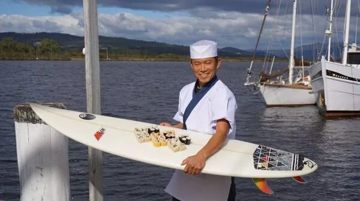 (原始链接: https://mmbiz.qpic.cn/mmbiz_jpg/icXyCmhlTrYOA4hLemVaPb5w8xEqibZIoQaeEUAibkw4lxYE6N4GRAtmgsMiaZzGTvuRLXaYrGbuuBnWIs1Hib7VPSQ/640?wx_fmt=jpeg)
- 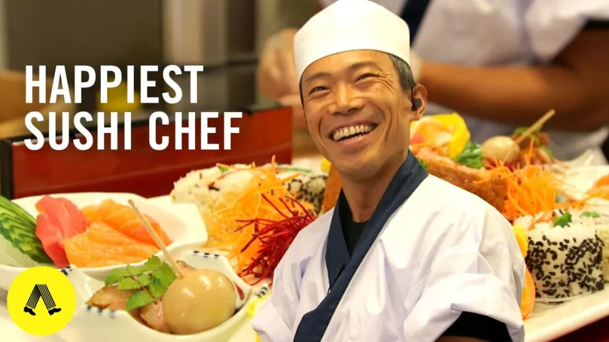 (原始链接: https://mmbiz.qpic.cn/mmbiz_jpg/icXyCmhlTrYOA4hLemVaPb5w8xEqibZIoQfWxFyXaUP52hia6A94phHwRIHoU4LTTqe5T9vrNOwNVJpkthsZx2VAg/640?wx_fmt=jpeg)
- 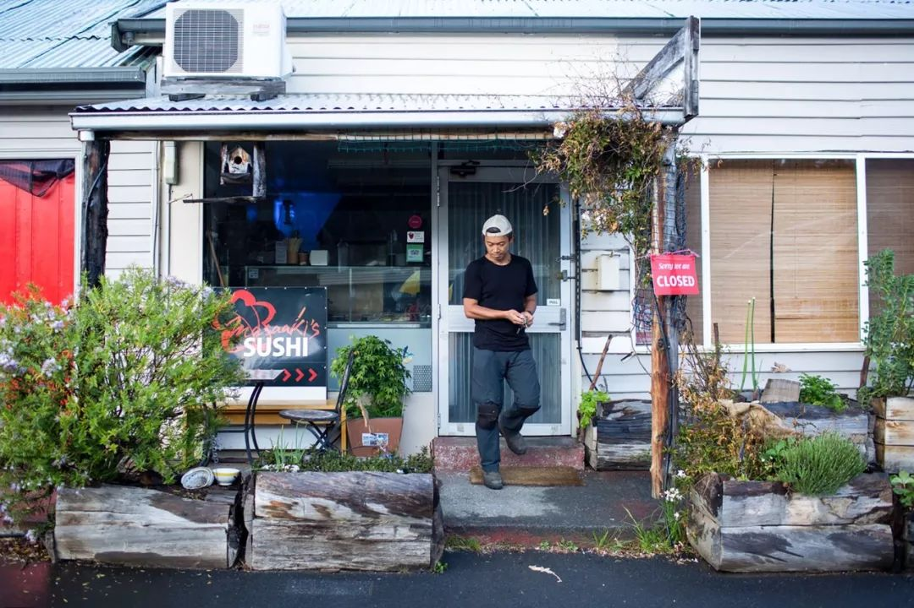 (原始链接: https://mmbiz.qpic.cn/mmbiz_jpg/VXm8w4GIZRoISxaKWTNKiaWxlNfFD6ibIZATYUkXeq0SsNgWWzfF1pibl6ib3x5KHtI2ZibiauIvkvZnP5piaD0kmp5wA/640?wx_fmt=jpeg)
-  (原始链接: https://mmbiz.qpic.cn/mmbiz_jpg/VXm8w4GIZRqgibCuSyonrreQXpeQcJDpXoGMTtibu2E3CuTbxZicWN6Bo9StIO3tIyDfkbxNYpvvSsyRJiaicEoEiaDg/640?wx_fmt=jpeg)
- 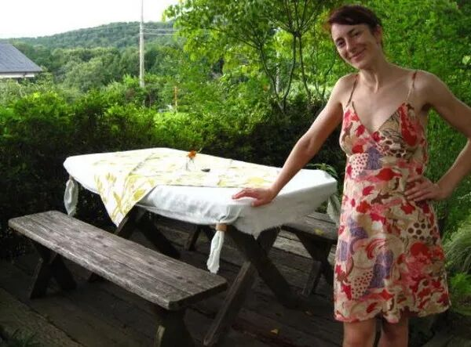 (原始链接: https://mmbiz.qpic.cn/mmbiz_jpg/icXyCmhlTrYPQ3cftfjxLQkOFaZ2H3Lv4pO6v8cuEzwOibL1cbrhgZQLBFu7dzwGqToqdJ4vY72O3o4ibYCUcXiaMA/640?wx_fmt=jpeg)
- 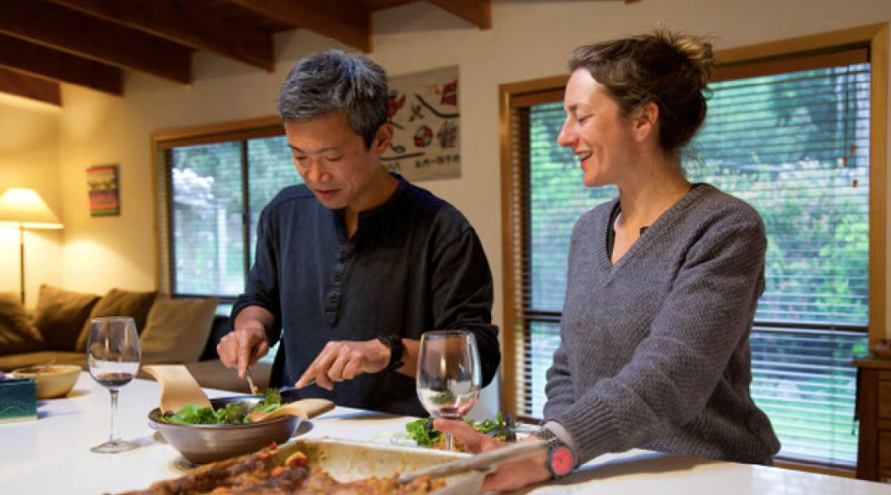 (原始链接: https://mmbiz.qpic.cn/mmbiz_png/icXyCmhlTrYOA4hLemVaPb5w8xEqibZIoQckbQm3eXoJwvbFlwX9WjAqZSVA8ZtbHibenSrohlfkZdVoWoypzkLjw/640?wx_fmt=png)
- 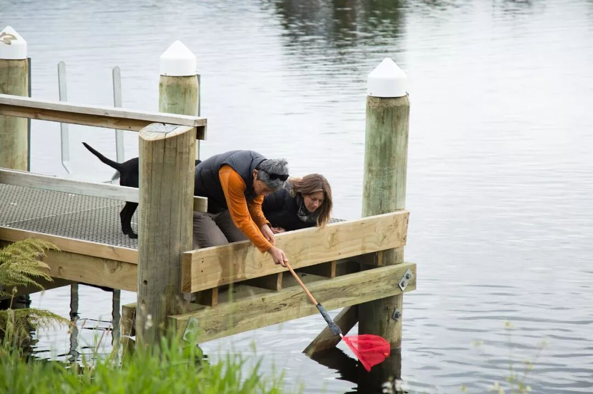 (原始链接: https://mmbiz.qpic.cn/mmbiz_jpg/VXm8w4GIZRoISxaKWTNKiaWxlNfFD6ibIZsntusibrqTydO6BYnMmyndkiaecVe0xGcwNkMcX1Yq4U9QIgvaTsdTkQ/640?wx_fmt=jpeg)
-  (原始链接: https://mmbiz.qpic.cn/mmbiz_jpg/icXyCmhlTrYOA4hLemVaPb5w8xEqibZIoQEtSBDs4y4AFnJvd32alPK8jzKdfsunG9cRowkvGIabgAUteO29dnzA/640?wx_fmt=jpeg)
- 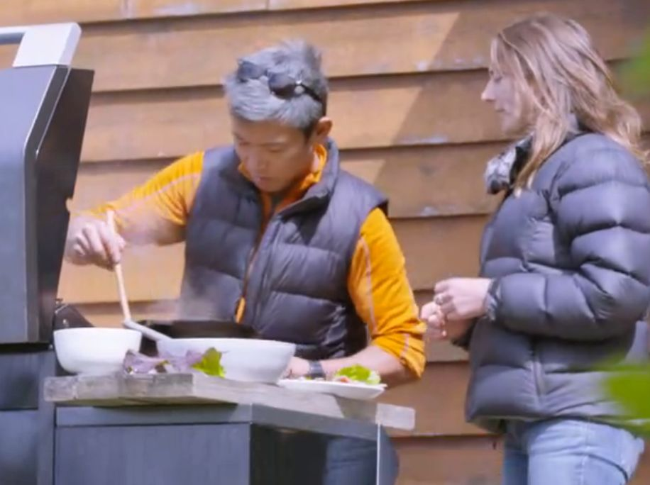 (原始链接: https://mmbiz.qpic.cn/mmbiz_png/icXyCmhlTrYOA4hLemVaPb5w8xEqibZIoQRYUSRzKeP37Us7ibiaX46sjdSBRYTwa9UJsSdaa7KcfQQnhT6JufDKqw/640?wx_fmt=png)
- 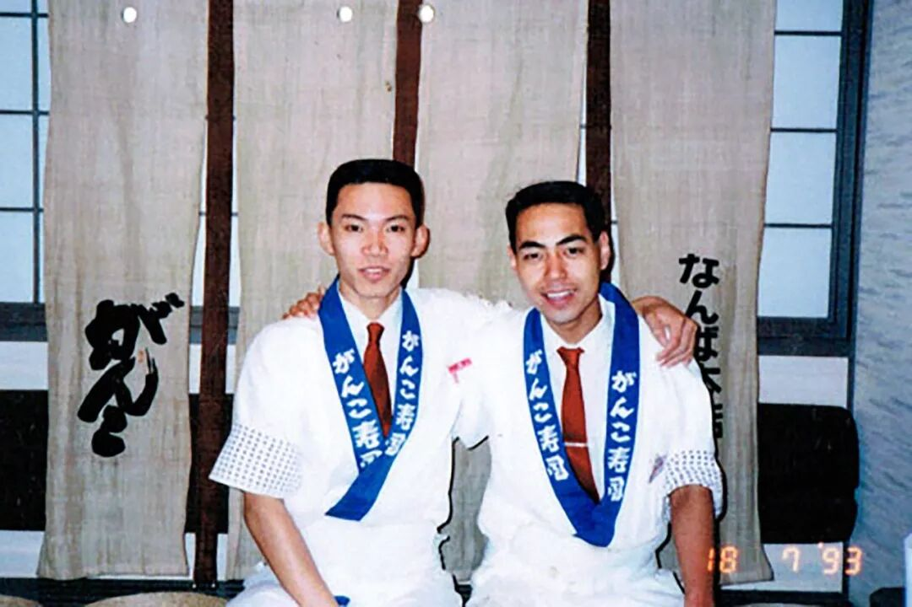 (原始链接: https://mmbiz.qpic.cn/mmbiz_jpg/VXm8w4GIZRoISxaKWTNKiaWxlNfFD6ibIZMIFHbYkIwmu6H0GiaTZN6GhPKiaCNjsjsfQQGQHryYE1Q2ysSkiawlQGg/640?wx_fmt=jpeg)
- 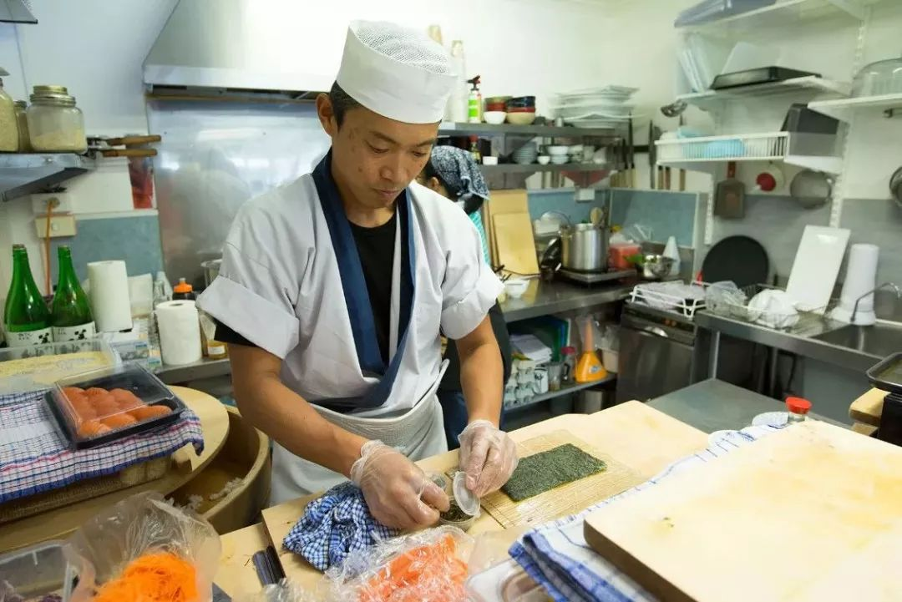 (原始链接: https://mmbiz.qpic.cn/mmbiz_jpg/icXyCmhlTrYOA4hLemVaPb5w8xEqibZIoQZWpO8nvTCXcXoDOLOXia81Ek8TaucicUzk1Wiaeo4BvW1p1w9u6dfyWOg/640?wx_fmt=jpeg)
-  (原始链接: https://mmbiz.qpic.cn/mmbiz_jpg/icXyCmhlTrYOA4hLemVaPb5w8xEqibZIoQR8x871iaXNe7uFBvSpMId3Odbwv0QyjdhVao3vovtX4tibZjOqQseicEg/640?wx_fmt=jpeg)
- 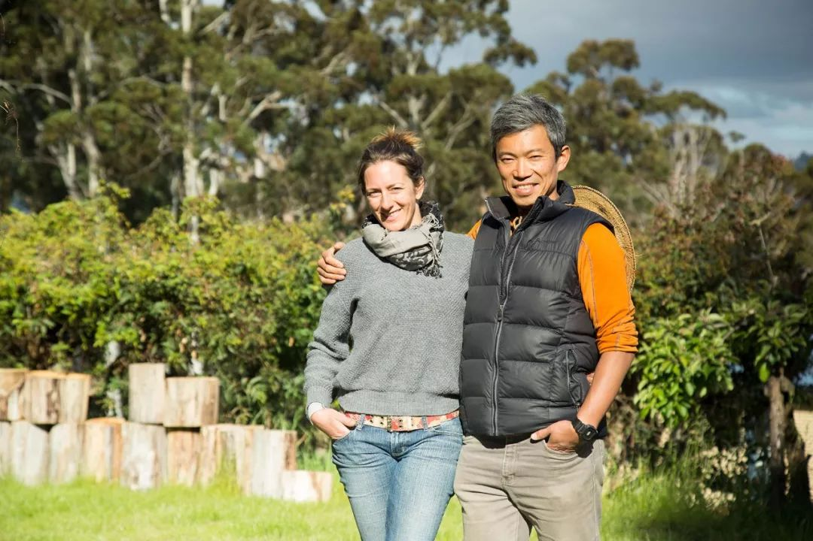 (原始链接: https://mmbiz.qpic.cn/mmbiz_jpg/VXm8w4GIZRoISxaKWTNKiaWxlNfFD6ibIZUCNtAyj5Aibkogf5Ivq7Nl0hmlP1DSGicHrKSiczBfdBApLWvfsYqIWTw/640?wx_fmt=jpeg)
- 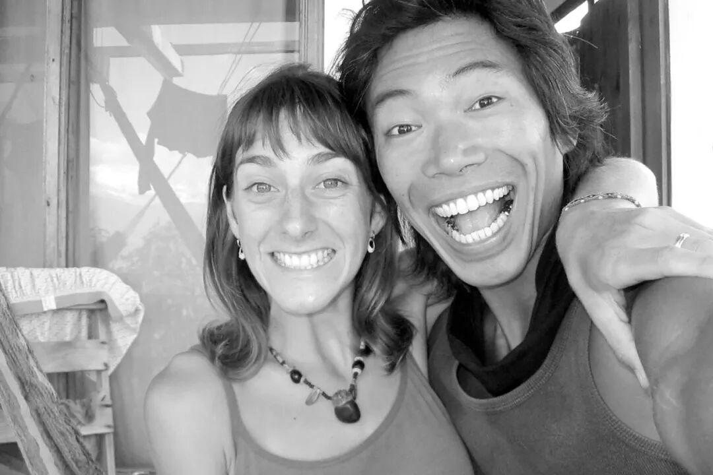 (原始链接: https://mmbiz.qpic.cn/mmbiz_jpg/VXm8w4GIZRoISxaKWTNKiaWxlNfFD6ibIZ9ADyS27dK5HZ3icGDOCdmljkeMgkHNcCgcU4ibH9L8V41addw6kngm8w/640?wx_fmt=jpeg)
- 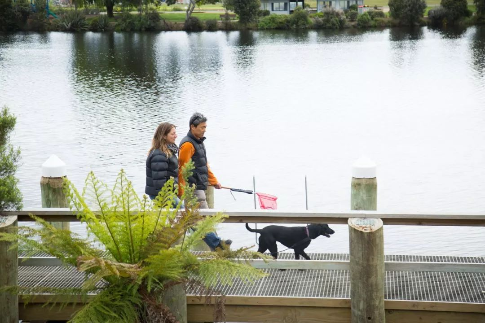 (原始链接: https://mmbiz.qpic.cn/mmbiz_jpg/VXm8w4GIZRoISxaKWTNKiaWxlNfFD6ibIZI7XsM632Dq7qSUoJIu1NKE9Fahe6rwEePCibsgicH9vg3QqtafSEQWpw/640?wx_fmt=jpeg)
- 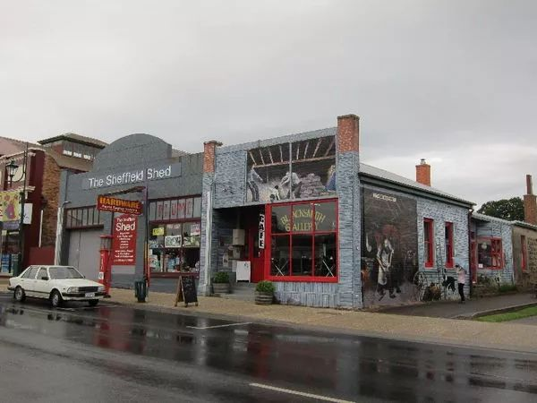 (原始链接: https://mmbiz.qpic.cn/mmbiz_jpg/icXyCmhlTrYPQ3cftfjxLQkOFaZ2H3Lv4Ejb3FRtOhiayh93UwQXxSXd3T8oy6yqZLQ8bnbdQ4Kv8F8ibib7CCaQEA/640?wx_fmt=jpeg)
- 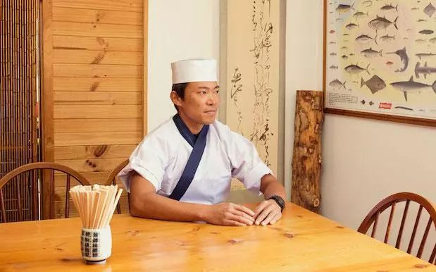 (原始链接: https://mmbiz.qpic.cn/mmbiz_jpg/icXyCmhlTrYOA4hLemVaPb5w8xEqibZIoQAjk0U2eOq75hHwRCUbnTgibyAjXfL1nCicicQjrpQ8wLxeeTXL8CgiczGQ/640?wx_fmt=jpeg)
- 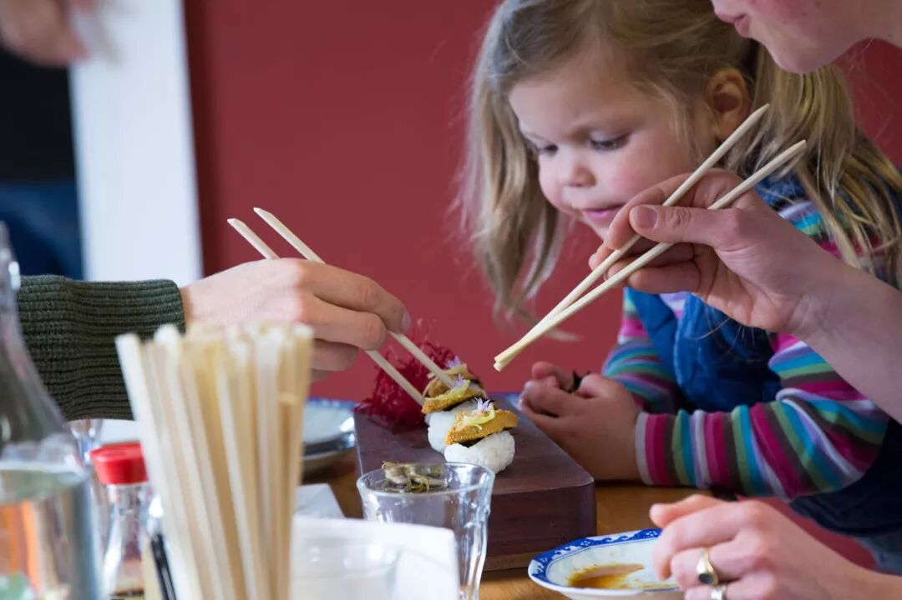 (原始链接: https://mmbiz.qpic.cn/mmbiz_jpg/VXm8w4GIZRoISxaKWTNKiaWxlNfFD6ibIZonPRVm4kiaicI1gRECTvME8aYXlEOshu7kMTmXNyPKIKhAdgNMFo42Jw/640?wx_fmt=jpeg)
- 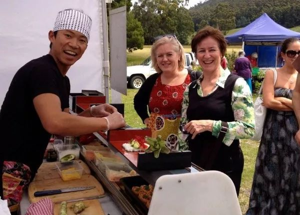 (原始链接: https://mmbiz.qpic.cn/mmbiz_jpg/icXyCmhlTrYOA4hLemVaPb5w8xEqibZIoQgrD782hV1Dl8iaW2iaNNPPic33CPF1ZOic6hGEXfV3AAWYn0uS1unZkAJg/640?wx_fmt=jpeg)
- 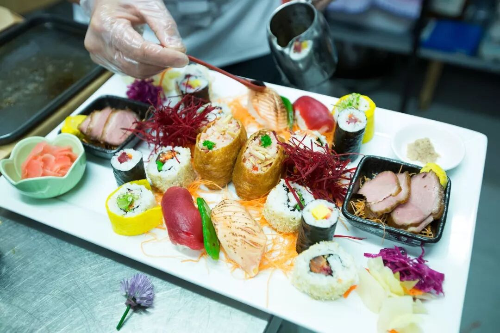 (原始链接: https://mmbiz.qpic.cn/mmbiz_jpg/VXm8w4GIZRoISxaKWTNKiaWxlNfFD6ibIZZ5cnnIXYt4mSncjroDPDSz3kBzh2iaQWz5tTHefW8w8Bo3thBrtVcqw/640?wx_fmt=jpeg)
-  (原始链接: https://mmbiz.qpic.cn/mmbiz_jpg/VXm8w4GIZRoISxaKWTNKiaWxlNfFD6ibIZo3kzh3Az6TSO9VSia5VIvY67MpuKW4rKOGsd1MjuyD85Gv3O3iaBGefA/640?wx_fmt=jpeg)
-  (原始链接: https://mmbiz.qpic.cn/mmbiz_jpg/VXm8w4GIZRoISxaKWTNKiaWxlNfFD6ibIZhOiaLugCJepvic2rPpOv6miatK6zlJdBEB6xFVHJOz2EFDu2b3coScmzw/640?wx_fmt=jpeg)
- 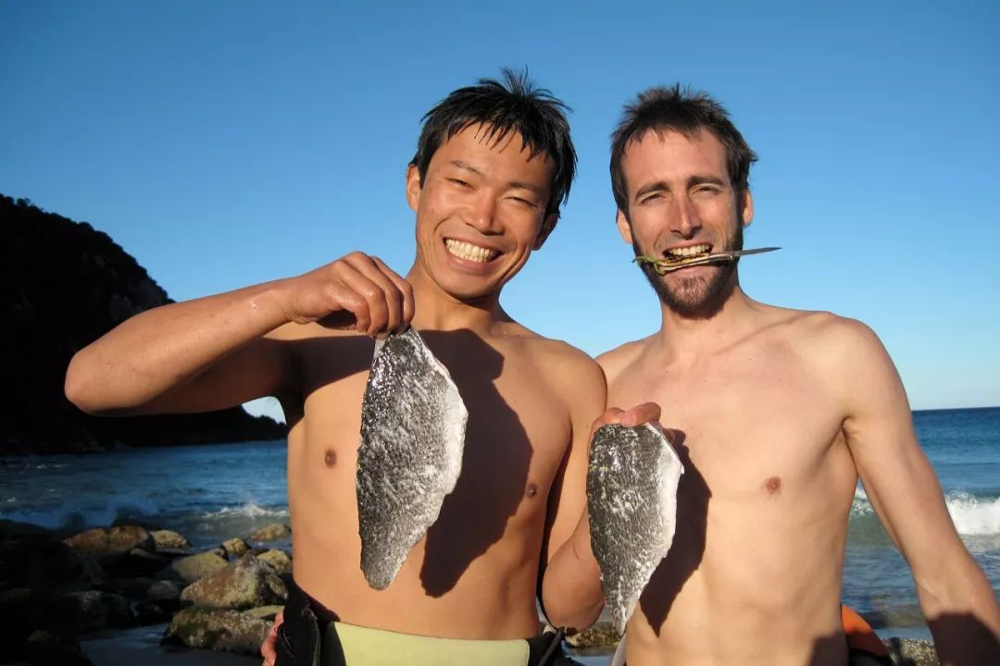 (原始链接: https://mmbiz.qpic.cn/mmbiz_jpg/VXm8w4GIZRoISxaKWTNKiaWxlNfFD6ibIZgqVpYia93TjE9UzdnCG9sUITogjiawYOVN3S1vmiaJPnWCGNFdJT2YTUw/640?wx_fmt=jpeg)
-  (原始链接: https://mmbiz.qpic.cn/mmbiz_jpg/VXm8w4GIZRoISxaKWTNKiaWxlNfFD6ibIZkc56PfusIB4COrWibYCmfRic8eb74d0JicDrrBIdia5WPcS02hXYBlnH1A/640?wx_fmt=jpeg)
- 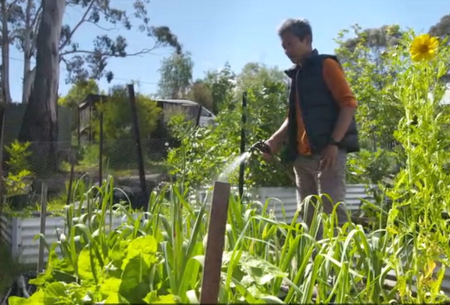 (原始链接: https://mmbiz.qpic.cn/mmbiz_png/icXyCmhlTrYOA4hLemVaPb5w8xEqibZIoQ7njP18beLfPFrfVeiay6feDoM2fuwic3ScMQm3CvQn9ubWoq8p45z3xw/640?wx_fmt=png)
- 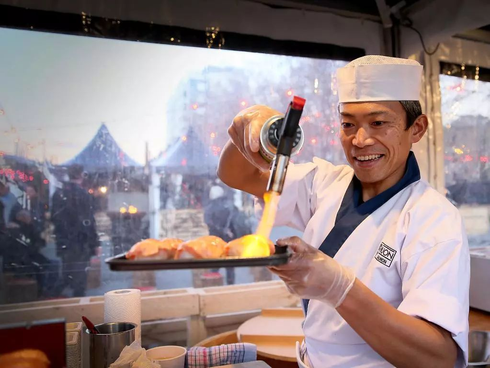 (原始链接: https://mmbiz.qpic.cn/mmbiz_jpg/icXyCmhlTrYPQ3cftfjxLQkOFaZ2H3Lv4Vn8MuG0wTVicxVia3Z3vo1wuMibsknU5fBhZo82FwLWA39j63Wfvo0MSg/640?wx_fmt=jpeg)
-  (原始链接: https://mmbiz.qpic.cn/mmbiz/roTNcRZ7FNqQujPTPOYQKUD1ULq3lt0iamiccKn7FfDxqn7Cr3ygOuxcRibanT5ibea6B05icTTJdGM2RUa9lP70f5A/640?wx_fmt=gif)
-  (原始链接: https://mmbiz.qpic.cn/mmbiz/6w7mNz2ibeRHMgGX8ric9XTFsc5lD3uw14ibicIvmED5U5HUkeK3m3k24iaQPbonrk5ziaoIO9pM9b70Eia2nLgNic2ZTA/640?wx_fmt=png)
-  (原始链接: https://mmbiz.qpic.cn/mmbiz_gif/icXyCmhlTrYO8ZHgiaDxwh1wfpy3RbMT9h2Vx6ZkraPn6SxM4ia4MDOV8ibnkoR1k1phia4CIia0uf7f6t67rztJHuSg/640?wx_fmt=gif)
