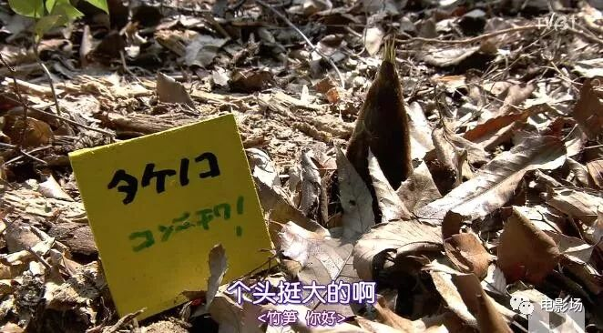
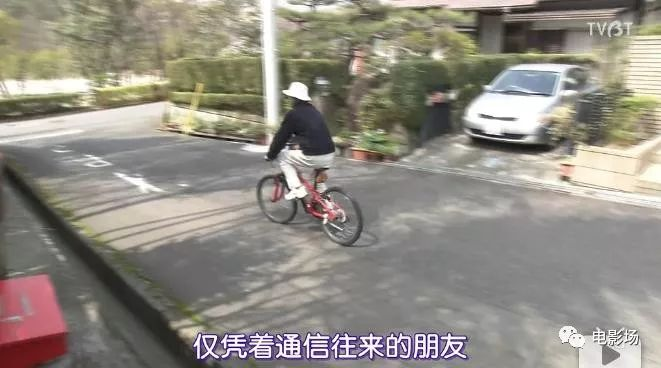
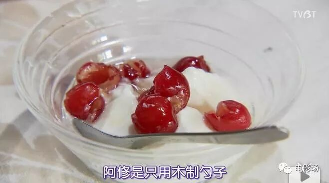

# 无标题

**链接地址:** http://mp.weixin.qq.com/s?__biz=MzA3NzQxNDY4Mw==&mid=2653756275&idx=1&sn=92f4f96d33b331119385d233637ff884&chksm=848bd307b3fc5a11043c86c343c371107b1ec11d7aa8a6bf1caf5611c28600680fb6840e2e0a&mpshare=1&scene=2&srcid=0225ixaCKO9dGfWGx3UBX5z1#rd
**作者:** 小梦
**获取时间:** 2025/8/28 22:16:45
**图片数量:** 122

---

## 原始HTML内容

 

偶然得知这部日本纪录片《人生果实》，

豆瓣评分高达9.3。

主人公是一对夫妻， 

90岁的津端修一和87岁的津端英子，

旁白配音是树木希林。

一看简介，这不就是高龄版的《小森林》吗？

 

一幢深居林间的小屋，位于日本高藏寺新城的一隅。一年四季景致万千，庭园栽植的上百种蔬果，经由其妻英子的巧手都成了道道佳肴。不论烹饪、裁缝、耕作，没有一样能难得倒她。他们的家居处处充满体贴与用心，印证建筑大师柯布西耶的名言「房子该是生活的藏宝盒」。&nbsp;

 

还没看，小嘿就毫无缘由地认定这是一部好片，

看完感触非常深：

人啊，看你自己想活成什么样子，和年龄无关。

只要能自己做，就要自己动手。

那么让我们来看看，

这部看似日常纪录片到底有什么吸引力？

（以下都是剧透，想看影片的同学直接拉到文末）

老爷爷和老奶奶生活在这里：

 

一大早起来，两人在菜园里劳作了一番后，

开始吃早餐， 

老爷爷喜欢日式早餐，

老奶奶却是西式早餐。

 

这是他们的庭院分布情况， 

看得出来很大一部分都是土地，房屋只占了一角。

老爷爷非常可爱， 

制作了很多醒目的黄色小木牌，

提示各种不同的蔬果。

 

收获了果实以后， 

老奶奶笑得像少女一样。

老爷爷曾经是日本住宅公团的首席建筑师，

他们的房子是模仿他尊敬的建筑家建造的木屋。

庭院的杂树林里，

有一个常年蓄水的瓦缸，

专门给小鸟们喝水休息。

老爷爷每天写信，

寄给一些长年通信的朋友，

每次骑脚踏车，

都像风一样的少年。

遇到好看的花开了，

爷爷还负责给奶奶拍照，

果然是真爱啊！

老奶奶回忆起他们的婚姻，

即使没有婚礼，

也是一脸笑容。

樱桃树的木牌上，

藏着的都是老爷爷的爱

老奶奶不仅擅长做日式料理，

更爱做各种西式甜点。

老奶奶对爷爷的爱，

体现在生活中的点点滴滴。

听她这么说，

真的好感动。

老爷爷的画同样满含深情。

177岁的两个人，

什么都自己动手做，

糊移门的纸，

晒梅干，

晒鱼干，

烤培根，

……

看到这里，

又觉得日本人果然拍什么都能拍成美食片啊！

两位老人回忆房子的建造，

和这个地区的发展，

老奶奶表示，

不管什么事，总是鼓励丈夫去尝试。

 

每个月，老奶奶去名古屋采购一次，

她愿意和人交往，

从信赖的人手中买食物。

老爷爷则经常寄充满谢意的信给这些店家。

 

老奶奶把家里的食物整理得井井有条，

就是为了能让老爷爷吃得满意。

两位老人受邀到台北签售，

他们的书《积存时间的生活》在台湾出版，

这是他们人生中第2 次海外旅行，

老爷爷在采访中说：

于我而言，她是最棒的女朋友。

老奶奶一脸娇羞。

这大概就是爱情最美好的样子。

对他们来说，

最宝贝的就是孙女花子，

老奶奶会做很多好吃的给她寄去，

老爷爷不仅做成长记录，

甚至给她做过一个木制的超大娃娃屋，

说到这些的时候，

两位老人开心极了。

他们对后代的想法就是，

要留给他们能够生产东西的地方，

要有足够的梦想和实现梦想的动手能力。

新年到了，

老奶奶织布，

老爷爷打年糕，

年糕送给邻居们，

上面的章都是“花子”的名字。

影片过半，

老爷爷毫无征兆地走了，

非常安详，

老奶奶对自己说，

“不可以哭。”

看到这里，小嘿泪目了。

老爷爷走后，

老奶奶每天还是给老爷爷做早饭。

一时之间，

虽然足够坚强，

但还是会感到空虚。

老奶奶把收货的果实，

收集起来，

精心打包寄给亲朋好友分享，

想让大家都品尝到老爷爷的心意。

在老爷爷的笔记中，

他写到关于家的感受：

“我觉得发自内心的感到自己家真好，

在这种安心感中度过每一天，

比什么都要美好，

请传承给下一代，

使他们过上充裕的生活。

比起金钱，人更重要”

 

老爷爷生前为一家精神病院免费设计了新项目， 

在设计理念中，

他写到：

“从能做的事情开始，

一点一滴，孜孜不倦，

积累时间，不紧不慢，”

对待这份最后的工作，

他写到：

“这对我来说是一生一次的幸福工作，

只要还活着，

就想要尽力做到最好。”

影片的最后，

老奶奶一个人，

仍然在菜园里辛勤的劳作。

老爷爷最后的设计建成了。

影片配上了建筑大师关于“家”和“自然”的理解。

“家应该是生活的百宝箱”——勒·柯布西耶

“所有的答案，都在伟大的自然界当中”——安东尼奥·高迪

“活得越久，人生就会愈加美好”——弗兰克·劳埃德·赖特

 

小嘿还搜索到了老爷爷和老奶奶出版的几本书：

《积存时间的生活》

《明天也是小春日和》

《每天都是小春日和》

 

目前这部纪录片在B站可看，

可回复关键词“人生果实”，小嘿发链接给你。 

 

本文原创，转载请联系授权。

---

## 纯文本内容

偶然得知这部日本纪录片《人生果实》，豆瓣评分高达9.3。主人公是一对夫妻，90岁的津端修一和87岁的津端英子，旁白配音是树木希林。一看简介，这不就是高龄版的《小森林》吗？一幢深居林间的小屋，位于日本高藏寺新城的一隅。一年四季景致万千，庭园栽植的上百种蔬果，经由其妻英子的巧手都成了道道佳肴。不论烹饪、裁缝、耕作，没有一样能难得倒她。他们的家居处处充满体贴与用心，印证建筑大师柯布西耶的名言「房子该是生活的藏宝盒」。 还没看，小嘿就毫无缘由地认定这是一部好片，看完感触非常深：人啊，看你自己想活成什么样子，和年龄无关。只要能自己做，就要自己动手。那么让我们来看看，这部看似日常纪录片到底有什么吸引力？（以下都是剧透，想看影片的同学直接拉到文末）老爷爷和老奶奶生活在这里：一大早起来，两人在菜园里劳作了一番后，开始吃早餐，老爷爷喜欢日式早餐，老奶奶却是西式早餐。这是他们的庭院分布情况，看得出来很大一部分都是土地，房屋只占了一角。老爷爷非常可爱，制作了很多醒目的黄色小木牌，提示各种不同的蔬果。收获了果实以后，老奶奶笑得像少女一样。老爷爷曾经是日本住宅公团的首席建筑师，他们的房子是模仿他尊敬的建筑家建造的木屋。庭院的杂树林里，有一个常年蓄水的瓦缸，专门给小鸟们喝水休息。老爷爷每天写信，寄给一些长年通信的朋友，每次骑脚踏车，都像风一样的少年。遇到好看的花开了，爷爷还负责给奶奶拍照，果然是真爱啊！老奶奶回忆起他们的婚姻，即使没有婚礼，也是一脸笑容。樱桃树的木牌上，藏着的都是老爷爷的爱老奶奶不仅擅长做日式料理，更爱做各种西式甜点。老奶奶对爷爷的爱，体现在生活中的点点滴滴。听她这么说，真的好感动。老爷爷的画同样满含深情。177岁的两个人，什么都自己动手做，糊移门的纸，晒梅干，晒鱼干，烤培根，……看到这里，又觉得日本人果然拍什么都能拍成美食片啊！两位老人回忆房子的建造，和这个地区的发展，老奶奶表示，不管什么事，总是鼓励丈夫去尝试。每个月，老奶奶去名古屋采购一次，她愿意和人交往，从信赖的人手中买食物。老爷爷则经常寄充满谢意的信给这些店家。老奶奶把家里的食物整理得井井有条，就是为了能让老爷爷吃得满意。两位老人受邀到台北签售，他们的书《积存时间的生活》在台湾出版，这是他们人生中第2 次海外旅行，老爷爷在采访中说：于我而言，她是最棒的女朋友。老奶奶一脸娇羞。这大概就是爱情最美好的样子。对他们来说，最宝贝的就是孙女花子，老奶奶会做很多好吃的给她寄去，老爷爷不仅做成长记录，甚至给她做过一个木制的超大娃娃屋，说到这些的时候，两位老人开心极了。他们对后代的想法就是，要留给他们能够生产东西的地方，要有足够的梦想和实现梦想的动手能力。新年到了，老奶奶织布，老爷爷打年糕，年糕送给邻居们，上面的章都是“花子”的名字。影片过半，老爷爷毫无征兆地走了，非常安详，老奶奶对自己说，“不可以哭。”看到这里，小嘿泪目了。老爷爷走后，老奶奶每天还是给老爷爷做早饭。一时之间，虽然足够坚强，但还是会感到空虚。老奶奶把收货的果实，收集起来，精心打包寄给亲朋好友分享，想让大家都品尝到老爷爷的心意。在老爷爷的笔记中，他写到关于家的感受：“我觉得发自内心的感到自己家真好，在这种安心感中度过每一天，比什么都要美好，请传承给下一代，使他们过上充裕的生活。比起金钱，人更重要”老爷爷生前为一家精神病院免费设计了新项目，在设计理念中，他写到：“从能做的事情开始，一点一滴，孜孜不倦，积累时间，不紧不慢，”对待这份最后的工作，他写到：“这对我来说是一生一次的幸福工作，只要还活着，就想要尽力做到最好。”影片的最后，老奶奶一个人，仍然在菜园里辛勤的劳作。老爷爷最后的设计建成了。影片配上了建筑大师关于“家”和“自然”的理解。“家应该是生活的百宝箱”——勒·柯布西耶“所有的答案，都在伟大的自然界当中”——安东尼奥·高迪“活得越久，人生就会愈加美好”——弗兰克·劳埃德·赖特小嘿还搜索到了老爷爷和老奶奶出版的几本书：《积存时间的生活》《明天也是小春日和》《每天都是小春日和》目前这部纪录片在B站可看，可回复关键词“人生果实”，小嘿发链接给你。本文原创，转载请联系授权。

---

## 图片列表

-  (原始链接: https://mmbiz.qpic.cn/mmbiz_png/pwWwopEv4Okg10mETibxtibU5I1DfqAB6YWVibp0NwajUcPfmB2FYEAz227EKhr67YItuBfIGj4HGjV6C7iagWD2Og/640?wx_fmt=png)
-  (原始链接: https://mmbiz.qpic.cn/mmbiz/Njia94oe3lCnaPC68xdGeDKoUEoW8Ddgqj4az8ffGqHWG6WQl6p3865p9w97c8jXC0HADMLtQOicqdYegs1IMHMw/640?wx_fmt=other)
-  (原始链接: https://mmbiz.qpic.cn/mmbiz_jpg/Njia94oe3lCnaPC68xdGeDKoUEoW8Ddgq7W3QFN7mnzrpzOA57K4FicO9gVamUSibXYdgD3dzLI1Cm5fm31Cbbkiag/640?wx_fmt=jpeg)
-  (原始链接: https://mmbiz.qpic.cn/mmbiz_jpg/Njia94oe3lCnaPC68xdGeDKoUEoW8DdgqsewLK2rYQ7yqp71rBxM6H1xicMXpMoaDxdyBqNPVTjg3bEdTictVTFqA/640?wx_fmt=jpeg)
-  (原始链接: https://mmbiz.qpic.cn/mmbiz_jpg/Njia94oe3lCnaPC68xdGeDKoUEoW8DdgqnxFWyhWe1Tnqy06lPbxBiab2w4jF6CNE80jgV7DbKjOJUsJiccTNr04A/640?wx_fmt=jpeg)
-  (原始链接: https://mmbiz.qpic.cn/mmbiz_jpg/Njia94oe3lCnaPC68xdGeDKoUEoW8DdgqlJgF4v1ibV3IA2ZSGMaLRSicFAKAnJMxk2dnf23iaQn1PGPb7e5WEUIOQ/640?wx_fmt=jpeg)
-  (原始链接: https://mmbiz.qpic.cn/mmbiz_jpg/Njia94oe3lCnaPC68xdGeDKoUEoW8DdgqPInqRAc0x2jLltCMgaMt1MH8bNdgibbzLj1MpiaNbeWYI6qm8MA5KtGg/640?wx_fmt=jpeg)
-  (原始链接: https://mmbiz.qpic.cn/mmbiz_jpg/Njia94oe3lCnaPC68xdGeDKoUEoW8DdgqgKCDxMZzqjfF3AkVRTRetbnJyaO2kbQVJUiaxg7ia6v5dGlKjYVgCmhg/640?wx_fmt=jpeg)
-  (原始链接: https://mmbiz.qpic.cn/mmbiz_jpg/Njia94oe3lCnaPC68xdGeDKoUEoW8DdgqicRfyk6LJ6SpbzdIPczmXbsgUHDzKpSK7Qo5F5pI4CMPwjVkIgsdbtQ/640?wx_fmt=jpeg)
-  (原始链接: https://mmbiz.qpic.cn/mmbiz_jpg/Njia94oe3lCnaPC68xdGeDKoUEoW8DdgqueG7O6ZUiaFhibvQmdCcaHp7RicbSWlNIhzq2Xm89c9AAt11OKBNolYEg/640?wx_fmt=jpeg)
-  (原始链接: https://mmbiz.qpic.cn/mmbiz_jpg/Njia94oe3lCnaPC68xdGeDKoUEoW8Ddgq1oibictpIjdRzP8fzZ0W8hK6WBxtJPvX4r2LbKufCK8o6eK97BgJzw8g/640?wx_fmt=jpeg)
-  (原始链接: https://mmbiz.qpic.cn/mmbiz_jpg/Njia94oe3lCnaPC68xdGeDKoUEoW8Ddgq3XWwsSqKHKbaczoYqUsjyYkuTo0MP7P1qQhCQWhu6jZwHslhFStzhA/640?wx_fmt=jpeg)
-  (原始链接: https://mmbiz.qpic.cn/mmbiz_jpg/Njia94oe3lCnaPC68xdGeDKoUEoW8DdgqtUSecFyv3F9s5uEccnWLq28F7USpLmTyYEKOGEXfDibPXssJmGTEYHw/640?wx_fmt=jpeg)
-  (原始链接: https://mmbiz.qpic.cn/mmbiz_jpg/Njia94oe3lCnaPC68xdGeDKoUEoW8DdgqtvCLVJdDAu6HEUCBuR2PeCZSrrWWrwQRiaMSdT7bJd0TptDO4SuCKBg/640?wx_fmt=jpeg)
-  (原始链接: https://mmbiz.qpic.cn/mmbiz_jpg/Njia94oe3lCnaPC68xdGeDKoUEoW8DdgqtiaqpQ7rHF7WPNO5Rhibia7XfiblQDjfYN1HvAJl41ibR9OWCA1cjbnUibdw/640?wx_fmt=jpeg)
-  (原始链接: https://mmbiz.qpic.cn/mmbiz_jpg/Njia94oe3lCnaPC68xdGeDKoUEoW8Ddgq2GXe4sXt8ucmazBlNuo7VphLtC1Rmy2Yslka6bvcx0Tz0mfEme0DcQ/640?wx_fmt=jpeg)
-  (原始链接: https://mmbiz.qpic.cn/mmbiz_jpg/Njia94oe3lCnaPC68xdGeDKoUEoW8DdgqOykelnaTr9PpfjbeISwicsUvMQqhnvKHxK1wKH8J9x3OY1ibbwo24ExQ/640?wx_fmt=jpeg)
-  (原始链接: https://mmbiz.qpic.cn/mmbiz_jpg/Njia94oe3lCnaPC68xdGeDKoUEoW8DdgqzhVVv8LglSN3KhdicPdWxDUUZueODngOj3IjFHFyjRuiaeNg7WO1by8g/640?wx_fmt=jpeg)
-  (原始链接: https://mmbiz.qpic.cn/mmbiz_jpg/Njia94oe3lCnaPC68xdGeDKoUEoW8DdgqtZ2Pzp9JWvUyiaqgGAN3tcGFtec60t9Avrq3Y38jBJChWeQI1E9USRw/640?wx_fmt=jpeg)
-  (原始链接: https://mmbiz.qpic.cn/mmbiz_jpg/Njia94oe3lCnaPC68xdGeDKoUEoW8DdgqQ8DzAonnYXbXHojwMyGQAiaFicaOoc4Gl5OoRAXsqPlvIkq6VXe3rFicg/640?wx_fmt=jpeg)
-  (原始链接: https://mmbiz.qpic.cn/mmbiz_jpg/Njia94oe3lCnaPC68xdGeDKoUEoW8DdgqHxlos1tYia3oZmJ1mClKC9uPXgu7m3crtClTSApxoXbHibc64jVoDjmg/640?wx_fmt=jpeg)
-  (原始链接: https://mmbiz.qpic.cn/mmbiz_jpg/Njia94oe3lCnaPC68xdGeDKoUEoW8DdgqyEIS1M1VO108rq1LKmcia40fBJ7h8ALmJcgymM2tibKrfAMDZXZpu8Rg/640?wx_fmt=jpeg)
-  (原始链接: https://mmbiz.qpic.cn/mmbiz_jpg/Njia94oe3lCnaPC68xdGeDKoUEoW8Ddgq13FWtuia4wHeLTzmJGz0ILlSswbdNGNDThbJCPy5HQX9RApQzgLrpsA/640?wx_fmt=jpeg)
-  (原始链接: https://mmbiz.qpic.cn/mmbiz_jpg/Njia94oe3lCnaPC68xdGeDKoUEoW8DdgqWCxC2hcKXGV2EHHYvPuBLqibKfb8Ursct8bGfvbIia7M1yO3XUHwVlNA/640?wx_fmt=jpeg)
-  (原始链接: https://mmbiz.qpic.cn/mmbiz_jpg/Njia94oe3lCnaPC68xdGeDKoUEoW8DdgqdDdTbRJfUbTsLpNPwHXj52fMiaFQcxghHTMP6zibibXkj08qfpiclPRbibg/640?wx_fmt=jpeg)
-  (原始链接: https://mmbiz.qpic.cn/mmbiz_jpg/Njia94oe3lCnaPC68xdGeDKoUEoW8Ddgq5bDXh0MHe9GibJN4TTjgPLBzoEOX2OgPzTY88FI5RtJPtIcYhicT5qaA/640?wx_fmt=jpeg)
-  (原始链接: https://mmbiz.qpic.cn/mmbiz_jpg/Njia94oe3lCnaPC68xdGeDKoUEoW8DdgqzB9zzOsdZ64NtxV9jAibsEZIRjvQo1JcsX3kUzuicWsDFCawSpq5yp9Q/640?wx_fmt=jpeg)
-  (原始链接: https://mmbiz.qpic.cn/mmbiz_jpg/Njia94oe3lCnaPC68xdGeDKoUEoW8DdgqciaXxMZDEBukMqty27nOgT6WWTXJAGtoSRoZN3WRySUcWj55tWdzhBw/640?wx_fmt=jpeg)
-  (原始链接: https://mmbiz.qpic.cn/mmbiz_jpg/Njia94oe3lCnaPC68xdGeDKoUEoW8DdgqLh7B918Nc0vjwJ3Bmb5AibukSoxRzPmibVIVMITK1TR16MVHicDbw08Ag/640?wx_fmt=jpeg)
-  (原始链接: https://mmbiz.qpic.cn/mmbiz_jpg/Njia94oe3lCnaPC68xdGeDKoUEoW8DdgqnBflGhqwt6otcsr0WLtegc23BSjIhu1qmiayIsqY0iafKYH4pdfic4Sgg/640?wx_fmt=jpeg)
-  (原始链接: https://mmbiz.qpic.cn/mmbiz_jpg/Njia94oe3lCnaPC68xdGeDKoUEoW8DdgqXA7YhzLZRocXnlGo475kM5KFq3xYa5NicH6Rl9kUhdyOTgdr26LDWuQ/640?wx_fmt=jpeg)
-  (原始链接: https://mmbiz.qpic.cn/mmbiz_jpg/Njia94oe3lCnaPC68xdGeDKoUEoW8DdgqcibDcXNS8riaFk4PYFia26wxZ2b1rMmRiashmj0InLlFyMyCt6vBicJZfibg/640?wx_fmt=jpeg)
-  (原始链接: https://mmbiz.qpic.cn/mmbiz_jpg/Njia94oe3lCnaPC68xdGeDKoUEoW8Ddgq0w5COBWJCqJvDegjQNWyANPXibGKfyemOnF8xbUFNaQaBfoboDUwK9g/640?wx_fmt=jpeg)
-  (原始链接: https://mmbiz.qpic.cn/mmbiz_jpg/Njia94oe3lCnaPC68xdGeDKoUEoW8DdgqTlcEfDGoFxvpamXC05ibjjiazWlp0DbIZ0nMZNL5weBcQgICmQkNR6sQ/640?wx_fmt=jpeg)
-  (原始链接: https://mmbiz.qpic.cn/mmbiz_jpg/Njia94oe3lCnaPC68xdGeDKoUEoW8DdgqdyF4l1rmiaLO884AWQaedHLqFATDWian0FCnXhA6kEJPB4hkibcagsqjw/640?wx_fmt=jpeg)
-  (原始链接: https://mmbiz.qpic.cn/mmbiz_jpg/Njia94oe3lCnaPC68xdGeDKoUEoW8DdgqumNMJSETngdjpVSodBcBEhwCL9PbIAtzIlgfbcucS6bOtgVC53UbAg/640?wx_fmt=jpeg)
-  (原始链接: https://mmbiz.qpic.cn/mmbiz_jpg/Njia94oe3lCnaPC68xdGeDKoUEoW8DdgqVQcFDz74gGqriaO8BuzYDPHAmeNJzrJB33TibyNFbliaeLrQ4pREPmgwA/640?wx_fmt=jpeg)
-  (原始链接: https://mmbiz.qpic.cn/mmbiz_jpg/Njia94oe3lCnaPC68xdGeDKoUEoW8Ddgqr1icMI2ianHpgF6dmHdb98YGRPybGxiaBlLw8xyD9124D0JTjictXydrNg/640?wx_fmt=jpeg)
-  (原始链接: https://mmbiz.qpic.cn/mmbiz_jpg/Njia94oe3lCnaPC68xdGeDKoUEoW8DdgqCV2s5xPOeiaFUiblJmgvzsmbVdicPQWntJVAJMZOXdHMmwJyA6RQLicoYg/640?wx_fmt=jpeg)
-  (原始链接: https://mmbiz.qpic.cn/mmbiz_jpg/Njia94oe3lCnaPC68xdGeDKoUEoW8DdgqIGYkibEm8nicHRl71iaVNy0rkfJMWuxibPVuEpDAzxS7b0fgyAa8WEsiaGQ/640?wx_fmt=jpeg)
-  (原始链接: https://mmbiz.qpic.cn/mmbiz_jpg/Njia94oe3lCnaPC68xdGeDKoUEoW8DdgqOoXXUTE4HNc4I0wU7EBfbmCWM4NKV6a0Ie6xxfDLKwU5hRNibB5GlicA/640?wx_fmt=jpeg)
-  (原始链接: https://mmbiz.qpic.cn/mmbiz_jpg/Njia94oe3lCnaPC68xdGeDKoUEoW8Ddgqzrmnm4plgjsnZvnySmXZ0WVrRu9E76M1f30qxSboF0FgdHzGXCm8Wg/640?wx_fmt=jpeg)
-  (原始链接: https://mmbiz.qpic.cn/mmbiz_jpg/Njia94oe3lCnaPC68xdGeDKoUEoW8Ddgq96RpxVq0oYlJ1ibGh2JSCGvT5Imk0x2yvlyM2TfyZicqLYOXt9anJ8ibg/640?wx_fmt=jpeg)
-  (原始链接: https://mmbiz.qpic.cn/mmbiz_jpg/Njia94oe3lCnaPC68xdGeDKoUEoW8DdgqbU9tAoruZH3ECgbtWzu0a6bNsEcriaNdKeDsyIhvpVsDNss1VHhKm2g/640?wx_fmt=jpeg)
-  (原始链接: https://mmbiz.qpic.cn/mmbiz_jpg/Njia94oe3lCnaPC68xdGeDKoUEoW8Ddgqz9m2l91Rk3ibZn7UVIk0nK2b2jyhTv3nQaYJtN21ucq5FSx33yOZqQQ/640?wx_fmt=jpeg)
-  (原始链接: https://mmbiz.qpic.cn/mmbiz_jpg/Njia94oe3lCnaPC68xdGeDKoUEoW8DdgqzAhKnd7MVX1XbvPZXvBadQhxoV04r4T98ianBWvtDE9FlAt5ajR21Yg/640?wx_fmt=jpeg)
-  (原始链接: https://mmbiz.qpic.cn/mmbiz_jpg/Njia94oe3lCnaPC68xdGeDKoUEoW8DdgqgATrXLHBujlQBFDPiarcL7I1YNHicZEIjlrTHjVrsVSrqYuibic9R0P78g/640?wx_fmt=jpeg)
-  (原始链接: https://mmbiz.qpic.cn/mmbiz_jpg/Njia94oe3lCnaPC68xdGeDKoUEoW8Ddgql9uwID3HFgQeyQicclZArllVNDdXic6Txicblg3Iiala0u3gEfDIGGrW2Q/640?wx_fmt=jpeg)
-  (原始链接: https://mmbiz.qpic.cn/mmbiz_jpg/Njia94oe3lCnaPC68xdGeDKoUEoW8DdgqicQ4lCaGbHUELxVibp3okp5XCNEO0G4sjj1DICL1EEl4rq2hg1pAzQwA/640?wx_fmt=jpeg)
-  (原始链接: https://mmbiz.qpic.cn/mmbiz_jpg/Njia94oe3lCnaPC68xdGeDKoUEoW8Ddgq8ym1PJzEzjFglsxrEUjCGp7gcn7kzRDLibLOjaPPiaMfdMoib4enHyPHQ/640?wx_fmt=jpeg)
-  (原始链接: https://mmbiz.qpic.cn/mmbiz_jpg/Njia94oe3lCnaPC68xdGeDKoUEoW8Ddgq1c9tqneeZjro5Siax5uHRSLhUUUosznUddZgCvREqSXyTBJjKxDT07w/640?wx_fmt=jpeg)
-  (原始链接: https://mmbiz.qpic.cn/mmbiz_jpg/Njia94oe3lCnaPC68xdGeDKoUEoW8Ddgq9mSQppSwhbSFenEgbaTzyicpl9Oxhq8E3rw32DuyMic10ZsOqwTMbhPQ/640?wx_fmt=jpeg)
-  (原始链接: https://mmbiz.qpic.cn/mmbiz_jpg/Njia94oe3lCnaPC68xdGeDKoUEoW8Ddgqib7ibCeswDDz4evFBujgcBURNBt9oB9zichkOrib4ZNVDEQ2jdTLfsicJ5g/640?wx_fmt=jpeg)
-  (原始链接: https://mmbiz.qpic.cn/mmbiz_jpg/Njia94oe3lCnaPC68xdGeDKoUEoW8DdgqboxChX6fLLA0zpyTPaTfmhneJKEEwQ3Vbh9d768KcpETAobR58UYKw/640?wx_fmt=jpeg)
-  (原始链接: https://mmbiz.qpic.cn/mmbiz_jpg/Njia94oe3lCnaPC68xdGeDKoUEoW8DdgqtIw79mpB4DWhEBLOHqRgLj7ia2emcnZ8jR75U4iclp8kezvawqNtFvow/640?wx_fmt=jpeg)
-  (原始链接: https://mmbiz.qpic.cn/mmbiz_jpg/Njia94oe3lCnaPC68xdGeDKoUEoW8Ddgqf8jGoTLsmicwDnn1DyoDNxVTPfqtZXzbmKStB4r33F5zNicaNooiaQk4Q/640?wx_fmt=jpeg)
-  (原始链接: https://mmbiz.qpic.cn/mmbiz_jpg/Njia94oe3lCnaPC68xdGeDKoUEoW8DdgqrAwVQRzoEw7qHG8H1TUaVmo87Ov4EnKicLnzmo5yFmS4kHAsFuGSr4Q/640?wx_fmt=jpeg)
-  (原始链接: https://mmbiz.qpic.cn/mmbiz_jpg/Njia94oe3lCnaPC68xdGeDKoUEoW8DdgqEoHrHkCoowoIEtStfTON3bk7A8ibKvtlwQhqe1GoTQWNo4iafc5HgjvA/640?wx_fmt=jpeg)
-  (原始链接: https://mmbiz.qpic.cn/mmbiz_jpg/Njia94oe3lCnaPC68xdGeDKoUEoW8DdgqusiallNKetE7RJ1qMxBQNxqAaom2SOyJxuskDg4BS3mRvrYTVRSyWUw/640?wx_fmt=jpeg)
-  (原始链接: https://mmbiz.qpic.cn/mmbiz_jpg/Njia94oe3lCnaPC68xdGeDKoUEoW8Ddgqm2CO95lTVMgZpB9dSuAIF57VQciaA6tqKicM8gjEVicnEXDlpv4fm2NBA/640?wx_fmt=jpeg)
-  (原始链接: https://mmbiz.qpic.cn/mmbiz_jpg/Njia94oe3lCnaPC68xdGeDKoUEoW8DdgqBuXleakPcw65EyRbrZ0f678hd7LOMO3ribcYr4mmrPchBibtHWiaHCzKg/640?wx_fmt=jpeg)
-  (原始链接: https://mmbiz.qpic.cn/mmbiz_jpg/Njia94oe3lCnaPC68xdGeDKoUEoW8DdgqCsh32WHW0KwmKDSNSyjCiavk0T1Ua8h5brufm4FJPgaqhAXSppxGwQQ/640?wx_fmt=jpeg)
-  (原始链接: https://mmbiz.qpic.cn/mmbiz_jpg/Njia94oe3lCnaPC68xdGeDKoUEoW8DdgqDlGVq0pJFVboiaReO5bXa1UCYxudzVEvYj9mPHJ1my9J7KVXQ67QxeA/640?wx_fmt=jpeg)
-  (原始链接: https://mmbiz.qpic.cn/mmbiz_jpg/Njia94oe3lCnaPC68xdGeDKoUEoW8DdgqIrUfXBH2T0TDnUmBMWInSLwicpwSNS69vkXic7d99JdRGJgoYNerVibtw/640?wx_fmt=jpeg)
-  (原始链接: https://mmbiz.qpic.cn/mmbiz_jpg/Njia94oe3lCnaPC68xdGeDKoUEoW8DdgqwncUMr77sKL0Mx10l4sI9GAria3KUH44CG2UicsUs2oOfbNibotPq50cQ/640?wx_fmt=jpeg)
-  (原始链接: https://mmbiz.qpic.cn/mmbiz_jpg/Njia94oe3lCnaPC68xdGeDKoUEoW8DdgqTTh6ibuBsRS1xiaQNMia1PnyuBxyfrDrbyRFhUlImmkcYliace6biaUAxIw/640?wx_fmt=jpeg)
-  (原始链接: https://mmbiz.qpic.cn/mmbiz_jpg/Njia94oe3lCnaPC68xdGeDKoUEoW8Ddgqd1qzJqgSgojyvNCBwicH2MdtxHEEhvMIZLMib3kx2CQZknib3g6I0icG1g/640?wx_fmt=jpeg)
-  (原始链接: https://mmbiz.qpic.cn/mmbiz_jpg/Njia94oe3lCnaPC68xdGeDKoUEoW8DdgqU095YAuv6t13eFiaxSQNLjRMbKzOiauj74hKE7q0iaDlUC51t7c4L3FCg/640?wx_fmt=jpeg)
-  (原始链接: https://mmbiz.qpic.cn/mmbiz_jpg/Njia94oe3lCnaPC68xdGeDKoUEoW8DdgqwIp4O43yTSqFM3ueFfDEJmLV2xTx9HZmNh6CyuIVn8hqhjkLRh7SlA/640?wx_fmt=jpeg)
-  (原始链接: https://mmbiz.qpic.cn/mmbiz_jpg/Njia94oe3lCnaPC68xdGeDKoUEoW8DdgqHz8qicYsltBmUKKoxic3Pz0GM7ElRm0AEvf16muu6zGTjA9fc7oqSKOA/640?wx_fmt=jpeg)
-  (原始链接: https://mmbiz.qpic.cn/mmbiz_jpg/Njia94oe3lCnaPC68xdGeDKoUEoW8Ddgqibe3raYnLTpDicbsia7wHTn1aTmGKzuJkUeJAUK8rm8P5g0ZplQ6icoJpw/640?wx_fmt=jpeg)
-  (原始链接: https://mmbiz.qpic.cn/mmbiz_jpg/Njia94oe3lCnaPC68xdGeDKoUEoW8DdgqzL1tNc4wkDDDvOSrZtHrLzvRwgcSWlTQmwXLdLs5cn7YPIlkxvopkQ/640?wx_fmt=jpeg)
-  (原始链接: https://mmbiz.qpic.cn/mmbiz_jpg/Njia94oe3lCnaPC68xdGeDKoUEoW8DdgqWCxhIicpiaeiaG0N5dwXaXMhlhtS3xwxppnwMB6lZJnx215IVNlGiaUuvQ/640?wx_fmt=jpeg)
-  (原始链接: https://mmbiz.qpic.cn/mmbiz_jpg/Njia94oe3lCnaPC68xdGeDKoUEoW8DdgqV7icEFibUBNs5f67NRU9z4llOh9h3iartn5VzdZK2lAOWxTOMXsibic7oJg/640?wx_fmt=jpeg)
-  (原始链接: https://mmbiz.qpic.cn/mmbiz_jpg/Njia94oe3lCnaPC68xdGeDKoUEoW8DdgqhnHXzolFKGXGocx0ibGEJcjwsd7BLkYSsHJTf2xuWSXeBc87ias0ylCA/640?wx_fmt=jpeg)
-  (原始链接: https://mmbiz.qpic.cn/mmbiz_jpg/Njia94oe3lCnaPC68xdGeDKoUEoW8DdgqlVMibXgZoB6UTt7iaXroyFWePons5pMibRGGmpJiaEYMej7es1kC4UvpsA/640?wx_fmt=jpeg)
-  (原始链接: https://mmbiz.qpic.cn/mmbiz_jpg/Njia94oe3lCnaPC68xdGeDKoUEoW8DdgqTfRptmnfqTZC9b0Ta9oUazTRGOcPicutYm9ZwG1s5Z0aZg6vuv1d7Kw/640?wx_fmt=jpeg)
-  (原始链接: https://mmbiz.qpic.cn/mmbiz_jpg/Njia94oe3lCnaPC68xdGeDKoUEoW8DdgqhYdcZnL9gJZYA3HVyo6C1q9cZDKLOrn3xQJZ4EricUXGpmVPQsbY20w/640?wx_fmt=jpeg)
-  (原始链接: https://mmbiz.qpic.cn/mmbiz_jpg/Njia94oe3lCnaPC68xdGeDKoUEoW8DdgqtLD3tZ0HPB4ZYu0OE3icXd4plcJx8H3ibJ9EeulxsORbfanDIhOzumIA/640?wx_fmt=jpeg)
-  (原始链接: https://mmbiz.qpic.cn/mmbiz_jpg/Njia94oe3lCnaPC68xdGeDKoUEoW8DdgqNeWibOzBIsiaianp2dkUvARfABfARoTe6TxFo7FBibOXS9IYrXrI7fqxew/640?wx_fmt=jpeg)
-  (原始链接: https://mmbiz.qpic.cn/mmbiz_jpg/Njia94oe3lCnaPC68xdGeDKoUEoW8Ddgqod8T6tX4kR3h3Doro1yGJkx4n1D3Lv2HduGwksr6MZA8A24znnewIw/640?wx_fmt=jpeg)
-  (原始链接: https://mmbiz.qpic.cn/mmbiz_jpg/Njia94oe3lCnaPC68xdGeDKoUEoW8DdgqUznnviciaJLX68BWic8nX2ic4WcwlGrECvhTsvibBibSPICqpf0D0D1DBSwQ/640?wx_fmt=jpeg)
-  (原始链接: https://mmbiz.qpic.cn/mmbiz_jpg/Njia94oe3lCnaPC68xdGeDKoUEoW8DdgqEyjFOjEkEsfqZFtnHL9Khp0gvjiaVJsTS0l6al5xloDYwMdkSLoacibw/640?wx_fmt=jpeg)
-  (原始链接: https://mmbiz.qpic.cn/mmbiz_jpg/Njia94oe3lCnaPC68xdGeDKoUEoW8DdgqAnrPUjrj2HyaOQgZumLhic9Xy2UQqpbSicS3uS1yDAUn79qM7uZsVBFw/640?wx_fmt=jpeg)
-  (原始链接: https://mmbiz.qpic.cn/mmbiz_jpg/Njia94oe3lCnaPC68xdGeDKoUEoW8DdgqFZC6rjgEFe4Ddx7wEmibVIHy4cNTyE599O4YvnJerw06nd6rnEIr6Mw/640?wx_fmt=jpeg)
-  (原始链接: https://mmbiz.qpic.cn/mmbiz_jpg/Njia94oe3lCnaPC68xdGeDKoUEoW8DdgqWqJ1SKasuCnIQX9IUGlSFKnJFJLaTYqCANaibMPq2BCGOy57dmIrC1A/640?wx_fmt=jpeg)
-  (原始链接: https://mmbiz.qpic.cn/mmbiz_jpg/Njia94oe3lCnaPC68xdGeDKoUEoW8DdgqoXSNp8WW5ZWwCwibRwIA5yrFQzlbXFw57mKc9CWQ3aqf8BV9Vb2HtbA/640?wx_fmt=jpeg)
-  (原始链接: https://mmbiz.qpic.cn/mmbiz_jpg/Njia94oe3lCnaPC68xdGeDKoUEoW8DdgqgaQYZ4bFtWoHlDFcs9ibLL0P6l3EERGZbFR7hYUTUVXqAX8bNph6TxA/640?wx_fmt=jpeg)
-  (原始链接: https://mmbiz.qpic.cn/mmbiz_jpg/Njia94oe3lCnaPC68xdGeDKoUEoW8DdgqhZN3zysOTvHLRqWb4fUgzaLnrobypauLMv0B1sG8DiaFeiaGOtNJhiaLw/640?wx_fmt=jpeg)
-  (原始链接: https://mmbiz.qpic.cn/mmbiz_jpg/Njia94oe3lCnaPC68xdGeDKoUEoW8DdgqUdswLoV6gxDQ2lrbQ9YYGgbdwicTCicbVia0jwhoicKqFahEZfnkAxlfLw/640?wx_fmt=jpeg)
-  (原始链接: https://mmbiz.qpic.cn/mmbiz_jpg/Njia94oe3lCnaPC68xdGeDKoUEoW8DdgqXBpc22icnDvhCBErD5GtvGSCwKo3NjbkThlcsDONPhaxNvq24QhGhvA/640?wx_fmt=jpeg)
-  (原始链接: https://mmbiz.qpic.cn/mmbiz_jpg/Njia94oe3lCnaPC68xdGeDKoUEoW8Ddgqic4YoAsg7oNo1k5FZD5943uMH2hxMooGKUdYHnLRZAeE4jSWkXdTdlA/640?wx_fmt=jpeg)
-  (原始链接: https://mmbiz.qpic.cn/mmbiz_jpg/Njia94oe3lCnaPC68xdGeDKoUEoW8DdgqSrSk1VPUBjWR1KpG5mXS9mJCo9VuSJRQtWAhSHEKQ9qaAdI8Yf1jag/640?wx_fmt=jpeg)
-  (原始链接: https://mmbiz.qpic.cn/mmbiz_jpg/Njia94oe3lCnaPC68xdGeDKoUEoW8Ddgq8QTETsykV6Ej8cOQM2J0DSDwLMQic48wAsVDSj0Hu22qpZLSwA1icAoA/640?wx_fmt=jpeg)
-  (原始链接: https://mmbiz.qpic.cn/mmbiz_jpg/Njia94oe3lCnaPC68xdGeDKoUEoW8Ddgq4ZXkbvMRiciaGhcwYBUJVHgM0tftxvPTjuIVKZCdbrqFoP3M4P82MyYg/640?wx_fmt=jpeg)
-  (原始链接: https://mmbiz.qpic.cn/mmbiz_jpg/Njia94oe3lCnaPC68xdGeDKoUEoW8DdgqlCf6EUwUWrlfYuWJv8hLeHtM74KmJ2n3PYkibUntMVlpAmiahkSYpC7w/640?wx_fmt=jpeg)
-  (原始链接: https://mmbiz.qpic.cn/mmbiz_jpg/Njia94oe3lCnaPC68xdGeDKoUEoW8DdgqoYiaVsjkzQWrAMdzkFZLCvhEdSE9I0OXpULVUxQYjlmDEYHIOduk8EQ/640?wx_fmt=jpeg)
-  (原始链接: https://mmbiz.qpic.cn/mmbiz_jpg/Njia94oe3lCnaPC68xdGeDKoUEoW8DdgqWp8xibKD1CvqoBbcCNtia6YqXIf4L5MyiaklZCVXQ3kFYUGXmibSZkWISA/640?wx_fmt=jpeg)
-  (原始链接: https://mmbiz.qpic.cn/mmbiz_jpg/Njia94oe3lCnaPC68xdGeDKoUEoW8DdgqiczwTkYq7duNYTARTXw2iao602JRJoQaDAGTE1LWx5ZqhLic6Xs8R1vLg/640?wx_fmt=jpeg)
-  (原始链接: https://mmbiz.qpic.cn/mmbiz_jpg/Njia94oe3lCnaPC68xdGeDKoUEoW8DdgqqicYqHWV1eLKxDiay0nlF0Y9tM9y2ibiaLtgUgQ6V6LA3urKbV1iaHXvlZQ/640?wx_fmt=jpeg)
-  (原始链接: https://mmbiz.qpic.cn/mmbiz_jpg/Njia94oe3lCnaPC68xdGeDKoUEoW8DdgqKZ12RoUYmAWtJg6LQNrB2ibt9J5UYmzFMq1BcFLFjqRtcCQpASl01LA/640?wx_fmt=jpeg)
-  (原始链接: https://mmbiz.qpic.cn/mmbiz_jpg/Njia94oe3lCnaPC68xdGeDKoUEoW8DdgqRKFdibyBwqusqn3BzicibN0iczbcW7nsJRSs9Vw187XHIVic147pCHCZlhg/640?wx_fmt=jpeg)
-  (原始链接: https://mmbiz.qpic.cn/mmbiz_jpg/Njia94oe3lCnaPC68xdGeDKoUEoW8DdgqENGxMzmicBH2HKibZIiaYqhmvXP3Sb5KZMp7nLPazj5apLYicibJO075gWA/640?wx_fmt=jpeg)
-  (原始链接: https://mmbiz.qpic.cn/mmbiz_jpg/Njia94oe3lCnaPC68xdGeDKoUEoW8DdgqFdYhuzWlmKhfTOjSU898edv5cYZESvuGiaSIhc90D8GyKD1SLibVXb3g/640?wx_fmt=jpeg)
-  (原始链接: https://mmbiz.qpic.cn/mmbiz_jpg/Njia94oe3lCnaPC68xdGeDKoUEoW8Ddgqzf2Vf4g97kFxfoM9djrMEG9OqgUUTjJujCm6SRs8tOW1qj8uU0Dyvg/640?wx_fmt=jpeg)
-  (原始链接: https://mmbiz.qpic.cn/mmbiz_jpg/Njia94oe3lCnaPC68xdGeDKoUEoW8DdgqRqhwTrHKVciapLQEGmbriagIV4L7WicEG1XKVrnE0lTFCXPmGFSILpmxg/640?wx_fmt=jpeg)
-  (原始链接: https://mmbiz.qpic.cn/mmbiz_jpg/Njia94oe3lCnaPC68xdGeDKoUEoW8DdgqpNOmHv1kal7b5ibsUAiar3XlPX3OticHrfTctFqSicK6D5VE3CfKbfGVKQ/640?wx_fmt=jpeg)
-  (原始链接: https://mmbiz.qpic.cn/mmbiz_jpg/Njia94oe3lCnaPC68xdGeDKoUEoW8DdgqUOZllDNQAYn2qyoDCcJOn07jw6WGhicOoibuvwCMdIPgIk9qpbkJw7og/640?wx_fmt=jpeg)
-  (原始链接: https://mmbiz.qpic.cn/mmbiz_jpg/Njia94oe3lCnaPC68xdGeDKoUEoW8DdgqWbc4mJUwMicgRYJYtVCnPYZ9eKGrkgIGPLahnGDhO1anhrb4TkNQUaw/640?wx_fmt=jpeg)
-  (原始链接: https://mmbiz.qpic.cn/mmbiz_jpg/Njia94oe3lCnaPC68xdGeDKoUEoW8DdgqaK2hMtaD6xpNibScBibRZjcibnwnpzLiaxZ1Iuxh3VSExPMw7kpf69jxSw/640?wx_fmt=jpeg)
-  (原始链接: https://mmbiz.qpic.cn/mmbiz_jpg/Njia94oe3lCnaPC68xdGeDKoUEoW8DdgqcLPGCttBj3tJa1e5XywoSrWbVJfLPdUH7yBkHFaraVck9YtGiaDlZ8A/640?wx_fmt=jpeg)
-  (原始链接: https://mmbiz.qpic.cn/mmbiz_jpg/Njia94oe3lCnaPC68xdGeDKoUEoW8DdgqHKORPPRyzPa9OpEfp9icxqrXRCxN2qtk5n3s5uthSnGyARY9YW2KGFA/640?wx_fmt=jpeg)
-  (原始链接: https://mmbiz.qpic.cn/mmbiz_jpg/Njia94oe3lCnaPC68xdGeDKoUEoW8DdgqXlREeG806aiaCjf7k9UT61icg8NPiawLknCaic96wSibFGu1FNnMjicxmBwQ/640?wx_fmt=jpeg)
-  (原始链接: https://mmbiz.qpic.cn/mmbiz_jpg/Njia94oe3lCnaPC68xdGeDKoUEoW8DdgqSHCed84BDdwLgckH7vxJPiasS5zKfeuZ7JJkb6yJrp2vIeQ4kicFfHvg/640?wx_fmt=jpeg)
-  (原始链接: https://mmbiz.qpic.cn/mmbiz_jpg/Njia94oe3lCnaPC68xdGeDKoUEoW8DdgqDACZLUofpYZ7K7gmYcibrZd1sBvdDn8xMdpqETkJEo8nFPic8OE9SghQ/640?wx_fmt=jpeg)
-  (原始链接: https://mmbiz.qpic.cn/mmbiz_jpg/Njia94oe3lCnaPC68xdGeDKoUEoW8Ddgq5iar9AHar6D3LetqibfJoLmvBcwaVz3b3eXBoe7xZLZovicYibzk5SMynQ/640?wx_fmt=jpeg)
-  (原始链接: https://mmbiz.qpic.cn/mmbiz_jpg/Njia94oe3lCnaPC68xdGeDKoUEoW8DdgqpNCxUpYw8um2bibtsptgs9Aicqq26zj8REN54VqwiaOMgQeJS7NyOJPZA/640?wx_fmt=jpeg)
-  (原始链接: https://mmbiz.qpic.cn/mmbiz_jpg/Njia94oe3lCnaPC68xdGeDKoUEoW8DdgqLNUS8EiaTz13UICQogtWuCnBNCy1QsRvK84hWsT4tPWFE5Xrdrn8WCA/640?wx_fmt=jpeg)
-  (原始链接: https://mmbiz.qpic.cn/mmbiz_jpg/Njia94oe3lCnaPC68xdGeDKoUEoW8DdgqsicoNv18OPIBbjsE5P93sT26Vou8okN4T8UeHMicbRDhLLwzXyAxbwkA/640?wx_fmt=jpeg)
-  (原始链接: https://mmbiz.qpic.cn/mmbiz_jpg/Njia94oe3lCnaPC68xdGeDKoUEoW8DdgqNq9xTfKovtsWCKPlnicuk7PCw31ib1alzU7BOa9gTPhB818nfaTErlJA/640?wx_fmt=jpeg)
-  (原始链接: https://mmbiz.qpic.cn/mmbiz_jpg/Njia94oe3lCnaPC68xdGeDKoUEoW8DdgqRsTt4LObrhNiaoDWXRoce0lKgmZuY7Y6wpdJNkIXpA0dlmz2mFn9SyQ/640?wx_fmt=jpeg)
-  (原始链接: https://mmbiz.qpic.cn/mmbiz_png/pwWwopEv4Okg10mETibxtibU5I1DfqAB6YmjiaibIlFQ6ywGx4ibdrZmkwr9wydg3ibl99b4ekLZOrnSnsZl39DiaaChw/640?wx_fmt=png)
