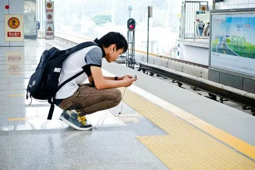

# 无标题

**链接地址:** http://mp.weixin.qq.com/s?__biz=MjM5OTA0Mzc2MA==&mid=2651325789&idx=3&sn=2d6f6528d98f8fb85eaf6f788a9c0de4&chksm=bd3dd2828a4a5b94d56bd0751c39587dc28b28900fd2653918bb85067a5454185ad74a55d06f&mpshare=1&scene=2&srcid=0225maH158PSjUleEP4bLjkD#rd
**作者:** 
**获取时间:** 2025/8/28 22:14:43
**图片数量:** 3

---

## 原始HTML内容

参考消息网2月25日报道德媒称，这几天正值中国新春佳节，家家团聚在一起共享家宴，欢声笑语。而恰恰在这段时间，越来越多的年轻人却希望从传统的大集体生活中抽身。他们希望享受清静——不只是片刻，而是永远的安宁。 

 

据德国《商报》网站2月22日报道，疯狂的是，他们现在自己形成了一个非正式的大群体，甚至创造出一个自己的经济分支：孤独经济。他们受过良好教育，年轻而且喜欢买买买——不过请让他们独来独往。服务行业不得不为此作出调整。如今中国很多商场里设有单人迷你KTV，全国已有大约2万个，而且今年数量至少翻番。健身房也开始提供单人间，为顾客屏蔽来自他人的汗味、噪声和无聊搭讪。而在诸如地铁这种无法独处的地方，可以靠智能手机和耳机维护自己的一人世界。

 

报道称，独来独往者们合租房屋，但各自生活，在厨房沏茶也不必询问室友是否也想来一杯。

 

报道称，一款日本最新手游中的旅行青蛙是这些“独行侠”们最亲密的朋友。玩家靠收获院子里的三叶草为青蛙购买食物和用品，使它能不断独自踏上旅途。而青蛙的旅行地点是玩家无法决定的。它会不时发回明信片。

 

尽管尚无中文版，仍有将近1000万中国玩家在短短两周时间内下载了这款游戏。微博上“旅行青蛙”话题点击率达到3亿次。

 

报道称，独行者们喜欢这款游戏，也因为它反映了慢条斯理的“佛系”生活方式。一些玩家甚至在青蛙回家后留下激动的泪水。因此，孤独生活并非最高智慧。旅行青蛙如同一个优秀的文学形象体现出问题的两面性：渴望孤独和孤独之痛。（编译/焦宇）

 

资料图片：2012年7月18日，在北京地铁立水桥站，一名年轻人在候车期间查看手机。新华社发

 
<section style="max-width: 100%;box-sizing: border-box;color: rgb(62, 62, 62);font-size: 16px;line-height: 25.6px;white-space: normal;letter-spacing: 1px;word-wrap: break-word !important;overflow-wrap: break-word !important;background-color: rgb(255, 255, 255);"><section style="padding: 10px;max-width: 100%;box-sizing: border-box;border: 1px solid rgb(192, 200, 209);width: 555.55px;display: inline-block;box-shadow: rgb(170, 170, 170) 0px 0px 10px;word-wrap: break-word !important;overflow-wrap: break-word !important;background-color: rgb(250, 250, 239);"><section style="max-width: 100%;box-sizing: border-box;word-wrap: break-word !important;overflow-wrap: break-word !important;"><section style="max-width: 100%;box-sizing: border-box;word-wrap: break-word !important;overflow-wrap: break-word !important;"><section style="max-width: 100%;box-sizing: border-box;color: rgb(51, 51, 51);word-wrap: break-word !important;overflow-wrap: break-word !important;"><section style="max-width: 100%;box-sizing: border-box;word-wrap: break-word !important;overflow-wrap: break-word !important;">注意：现在公众号有置顶功能了，大家把微信更新到最新版本，点开“腾讯财经”公众号，点“置顶公众号”键，就可以将我们置顶了。此外，您还可以将腾讯财经添加到桌面，这样，您就可以第一时间发现我们。</section></section></section></section></section></section>
 

来源：参考消息

<strong style="max-width: 100%;color: rgb(84, 141, 212);box-sizing: border-box !important;word-wrap: break-word !important;overflow-wrap: break-word !important;"><strong style="max-width: 100%;box-sizing: border-box !important;word-wrap: break-word !important;overflow-wrap: break-word !important;"><strong style="max-width: 100%;box-sizing: border-box !important;word-wrap: break-word !important;overflow-wrap: break-word !important;"><strong style="max-width: 100%;color: rgb(84, 141, 212);box-sizing: border-box !important;word-wrap: break-word !important;overflow-wrap: break-word !important;"><strong style="max-width: 100%;box-sizing: border-box !important;word-wrap: break-word !important;overflow-wrap: break-word !important;"><strong style="max-width: 100%;box-sizing: border-box !important;word-wrap: break-word !important;overflow-wrap: break-word !important;"><strong style="max-width: 100%;color: rgb(84, 141, 212);box-sizing: border-box !important;word-wrap: break-word !important;overflow-wrap: break-word !important;"><strong style="max-width: 100%;box-sizing: border-box !important;word-wrap: break-word !important;overflow-wrap: break-word !important;"><strong style="max-width: 100%;box-sizing: border-box !important;word-wrap: break-word !important;overflow-wrap: break-word !important;"></strong></strong></strong></strong></strong></strong></strong></strong></strong><strong style="max-width: 100%;color: rgb(84, 141, 212);box-sizing: border-box !important;word-wrap: break-word !important;overflow-wrap: break-word !important;"><strong style="max-width: 100%;box-sizing: border-box !important;word-wrap: break-word !important;overflow-wrap: break-word !important;">觉得不错，欢迎扫描二维码关注并点赞鼓励↓↓↓</strong></strong><strong style="max-width: 100%;color: rgb(84, 141, 212);line-height: 25.6px;box-sizing: border-box !important;word-wrap: break-word !important;overflow-wrap: break-word !important;"><strong style="max-width: 100%;box-sizing: border-box !important;word-wrap: break-word !important;overflow-wrap: break-word !important;">别忘记置顶公号哦！</strong></strong>

---

## 纯文本内容

参考消息网2月25日报道德媒称，这几天正值中国新春佳节，家家团聚在一起共享家宴，欢声笑语。而恰恰在这段时间，越来越多的年轻人却希望从传统的大集体生活中抽身。他们希望享受清静——不只是片刻，而是永远的安宁。据德国《商报》网站2月22日报道，疯狂的是，他们现在自己形成了一个非正式的大群体，甚至创造出一个自己的经济分支：孤独经济。他们受过良好教育，年轻而且喜欢买买买——不过请让他们独来独往。服务行业不得不为此作出调整。如今中国很多商场里设有单人迷你KTV，全国已有大约2万个，而且今年数量至少翻番。健身房也开始提供单人间，为顾客屏蔽来自他人的汗味、噪声和无聊搭讪。而在诸如地铁这种无法独处的地方，可以靠智能手机和耳机维护自己的一人世界。报道称，独来独往者们合租房屋，但各自生活，在厨房沏茶也不必询问室友是否也想来一杯。报道称，一款日本最新手游中的旅行青蛙是这些“独行侠”们最亲密的朋友。玩家靠收获院子里的三叶草为青蛙购买食物和用品，使它能不断独自踏上旅途。而青蛙的旅行地点是玩家无法决定的。它会不时发回明信片。尽管尚无中文版，仍有将近1000万中国玩家在短短两周时间内下载了这款游戏。微博上“旅行青蛙”话题点击率达到3亿次。报道称，独行者们喜欢这款游戏，也因为它反映了慢条斯理的“佛系”生活方式。一些玩家甚至在青蛙回家后留下激动的泪水。因此，孤独生活并非最高智慧。旅行青蛙如同一个优秀的文学形象体现出问题的两面性：渴望孤独和孤独之痛。（编译/焦宇）资料图片：2012年7月18日，在北京地铁立水桥站，一名年轻人在候车期间查看手机。新华社发注意：现在公众号有置顶功能了，大家把微信更新到最新版本，点开“腾讯财经”公众号，点“置顶公众号”键，就可以将我们置顶了。此外，您还可以将腾讯财经添加到桌面，这样，您就可以第一时间发现我们。来源：参考消息觉得不错，欢迎扫描二维码关注并点赞鼓励↓↓↓别忘记置顶公号哦！

---

## 图片列表

-  (原始链接: https://mmbiz.qpic.cn/mmbiz/CydH7uRRAX4xss52IrBXu6UibtDwOeD4gyqOpLVEZZHrq8CmccvaaqZibZiaG1Zupsasy8dI8MWrxWn7iaiaNgDp85w/640?wx_fmt=gif)
-  (原始链接: https://mmbiz.qpic.cn/mmbiz_jpg/Jp34LnMTxysc2ic3OtmnuMIWiaoW1OIC2icJbWNtl9eVymyHNGv5sKITmvuPmic4jvhia8ia2KprlMWibYe2pvMW46LQw/640?wx_fmt=jpeg)
-  (原始链接: http://mmbiz.qpic.cn/mmbiz/Jp34LnMTxyuKdml7NrOI3uLBykcE2QpohCW6uSwGrSgcX7I1WqDJVQurqic5Gye3dnFdkSO9micO29Nuq5e7ZTnw/640?wx_fmt=jpeg)
