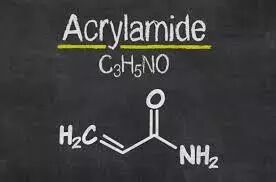
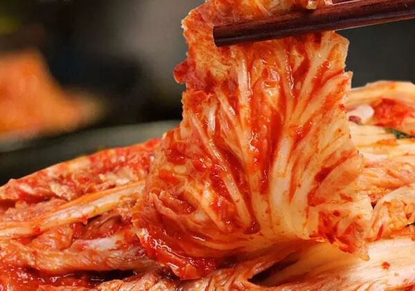
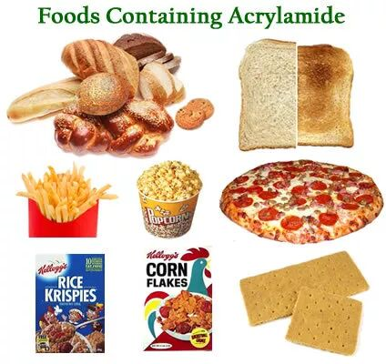
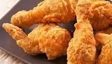
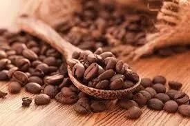

# 无标题

**链接地址:** http://mp.weixin.qq.com/s?__biz=MzI0MDQ0ODI0Ng==&mid=2247485684&idx=1&sn=8090ac62d1ddc63d268b3422a2822e8c&chksm=e91bef6dde6c667b703d74766b6a6bb8b199c3e8e3acdb279a63e0c17ad7027e4a70e53986c2&mpshare=1&scene=2&srcid=0405xR9qQOOvrae6qvDc5COq#rd
**作者:** 奥腻
**获取时间:** 2025/8/28 22:07:50
**图片数量:** 8

---

## 原始HTML内容

<section style="background-color: rgb(255, 255, 255);box-sizing: border-box;"><section class="Powered-by-XIUMI V5" style="box-sizing: border-box;" powered-by="xiumi.us"><section class="" style="text-align: center;box-sizing: border-box;"><section class="" style="max-width: 100%;vertical-align: middle;display: inline-block;overflow: hidden !important;box-sizing: border-box;"></section></section></section><section class="Powered-by-XIUMI V5" style="box-sizing: border-box;" powered-by="xiumi.us"><section class="" style="margin: 10px 0%;box-sizing: border-box;"><section class="" style="display: inline-block;width: 100%;vertical-align: top;background-image: url(&quot;https://mmbiz.qpic.cn/mmbiz_jpg/XA8n2XaESnSl0YGMOWKibktceedzCGoxW2pJ4ASgBkLhecwFC0ZzBibWRIKAWprc1aSu2mia90SWVm3u5KaSXPM8g/640?wx_fmt=jpeg&quot;);background-position: 51.0827% -9.4556%;background-repeat: repeat;background-size: 107.915%;background-attachment: scroll;padding: 10px;box-sizing: border-box;"><section class="Powered-by-XIUMI V5" style="box-sizing: border-box;" powered-by="xiumi.us"><section class="" style="box-sizing: border-box;"><section class="" style="text-align: justify;font-size: 15px;line-height: 1.8;padding-right: 20px;padding-left: 20px;box-sizing: border-box;">
最近一条美国加州法官下令，星巴克等必须在饮品上贴“致癌”警示的消息刷爆朋友圈和微博。各种辟谣的声音也是立刻站了出来。对！这次怼的对象是一种叫丙烯酰胺Acrylamide的化学物质。简单的来讲就是这货：
</section></section></section></section></section></section><section class="Powered-by-XIUMI V5" style="box-sizing: border-box;" powered-by="xiumi.us"><section class="" style="text-align: center;margin-top: 10px;margin-bottom: 10px;box-sizing: border-box;"><section class="" style="max-width: 100%;vertical-align: middle;display: inline-block;overflow: hidden !important;box-sizing: border-box;"></section></section></section><section class="Powered-by-XIUMI V5" style="box-sizing: border-box;" powered-by="xiumi.us"><section class="" style="margin: 10px 0%;box-sizing: border-box;"><section class="" style="display: inline-block;width: 100%;vertical-align: top;background-image: url(&quot;https://mmbiz.qpic.cn/mmbiz_jpg/XA8n2XaESnSl0YGMOWKibktceedzCGoxW2pJ4ASgBkLhecwFC0ZzBibWRIKAWprc1aSu2mia90SWVm3u5KaSXPM8g/640?wx_fmt=jpeg&quot;);background-position: 51.0827% -9.4556%;background-repeat: repeat;background-size: 107.915%;background-attachment: scroll;padding: 10px;box-sizing: border-box;"><section class="Powered-by-XIUMI V5" style="box-sizing: border-box;" powered-by="xiumi.us"><section class="" style="box-sizing: border-box;"><section class="" style="text-align: justify;font-size: 15px;line-height: 1.8;padding-right: 20px;padding-left: 20px;box-sizing: border-box;">
这东西很早前被国际癌症协会IARC定为二类致癌物质但是到底什么是二类致癌物？

致癌物分5个等级
</section></section></section></section></section></section><section class="Powered-by-XIUMI V5" style="box-sizing: border-box;" powered-by="xiumi.us"><section class="" style="margin: 15px 0%;text-align: center;box-sizing: border-box;"><section class="" style="box-sizing: border-box;"><section style="width: 20px;height: 20px;background-color: rgb(249, 174, 165);box-sizing: border-box;"></section><section style="clear: both;box-sizing: border-box;"></section><section style="margin-top: -10px;margin-bottom: -10px;padding-right: 10px;padding-left: 10px;display: inline-block;vertical-align: top;width: 100%;box-sizing: border-box;"><section class="" style="border-width: 2px;border-style: solid;border-color: rgba(255, 255, 255, 0);padding: 10px;background-color: rgba(246, 212, 218, 0.58);box-sizing: border-box;"><section class="Powered-by-XIUMI V5" style="box-sizing: border-box;" powered-by="xiumi.us"><section class="" style="box-sizing: border-box;"><section class="" style="text-align: justify;font-size: 15px;color: rgb(110, 110, 110);line-height: 1.8;box-sizing: border-box;">
1类：有足够的证据证明它们对人类致癌，而且能从人类对这些物质的接触观察到与癌症有关的生理变化

2类：二类分为2A和2B

2A：对人体致癌的可能性较高的物质或混合物，在动物实验中发现充分的致癌性证据。对人体虽有理论上的致癌性，而实验性的证据有限。没错我们这次抨击的重点丙烯酰胺就是这一个分级的。

2B：对人体致癌的可能性较低的物质或混合物，在动物实验中发现的致癌性证据尚不充分，对人体的致癌性的证据有限。用以归类相比二类A致癌可能性较低的物质

3类：尚未归类的物质，简单的来说就是信息不足无法判断的

4类：这一类就是2类反过来，研究证明可能不致癌的
</section></section></section></section></section><section style="width: 20px;height: 20px;float: right;background-color: rgb(249, 174, 165);box-sizing: border-box;"></section><section style="clear: both;box-sizing: border-box;"></section></section></section></section><section class="Powered-by-XIUMI V5" style="box-sizing: border-box;" powered-by="xiumi.us"><section class="" style="margin-top: 0.5em;margin-bottom: 0.5em;box-sizing: border-box;"><section class="" style="background-color: rgb(160, 160, 160);height: 1px;box-sizing: border-box;"></section></section></section><section class="Powered-by-XIUMI V5" style="box-sizing: border-box;" powered-by="xiumi.us"><section class="" style="margin: 15px 0%;box-sizing: border-box;"><section class="" style="display: inline-block;vertical-align: top;width: 15%;padding-right: 1px;padding-left: 1px;box-sizing: border-box;"><section class="Powered-by-XIUMI V5" style="box-sizing: border-box;" powered-by="xiumi.us"><section class="" style="margin-right: 0%;margin-bottom: 10px;margin-left: 0%;text-align: center;font-size: 18px;box-sizing: border-box;"><section class="" style="display: inline-block;vertical-align: top;border-left: 1px solid rgb(160, 160, 160);border-right: 1px solid rgb(160, 160, 160);padding-right: 5px;padding-left: 5px;color: rgb(249, 110, 87);box-sizing: border-box;">
但是你知道吗？

 
</section></section></section></section><section class="" style="display: inline-block;vertical-align: top;width: 85%;box-sizing: border-box;"><section class="Powered-by-XIUMI V5" style="box-sizing: border-box;" powered-by="xiumi.us"><section class="" style="box-sizing: border-box;"><section class="" style="text-align: justify;color: rgb(102, 102, 102);font-size: 15px;line-height: 1.8;box-sizing: border-box;">
被分为1类致癌物的有一百余种然而被分为4类的只有一种。看起来很危险对不对，感觉我们时时刻刻都生活在被致癌的恐惧中对不对？

对啊，这就是事实啊！那么多的化学成分在你熟知它名字之前你已经接触它们很多年了。比如说手机辐射，汽油，甚至是泡菜都被归类为2类致癌物（2B）。感到害怕了吗？
</section></section></section></section></section></section><section class="Powered-by-XIUMI V5" style="box-sizing: border-box;" powered-by="xiumi.us"><section class="" style="text-align: center;box-sizing: border-box;"><section class="" style="max-width: 100%;vertical-align: middle;display: inline-block;overflow: hidden !important;box-sizing: border-box;"></section></section></section><section class="Powered-by-XIUMI V5" style="box-sizing: border-box;" powered-by="xiumi.us"><section class="" style="margin-top: 0.5em;margin-bottom: 0.5em;box-sizing: border-box;"><section class="" style="background-color: rgb(160, 160, 160);height: 1px;box-sizing: border-box;"></section></section></section><section class="Powered-by-XIUMI V5" style="box-sizing: border-box;" powered-by="xiumi.us"><section class="" style="margin-top: 10px;margin-bottom: 10px;box-sizing: border-box;"><section class="" style="max-width: 100%;vertical-align: middle;display: inline-block;width: 40%;overflow: hidden !important;box-sizing: border-box;"><svg xmlns="http://www.w3.org/2000/svg" x="0px" y="0px" viewBox="0 0 200.1 23.9" style="vertical-align: middle;max-width: 100%;box-sizing: border-box;" width="100%"><path style="box-sizing: border-box;" d="M7,13l88.1,0c2.7,0,4.8,2,4.8,4.4c0,2.4-2.2,4.4-4.8,4.4H36.8v2h58.3c3.9,0,7-2.9,7-6.5  c0-3.6-3.2-6.5-7-6.5l-78.4,0c-2.7,0-4.8-2-4.8-4.4c0-2.4,2.2-4.4,4.8-4.4L200.1,2V0L7,0.1C3.2,0.1,0,3,0,6.5S3.2,13,7,13z M7,2.1  h4.6c-1.2,1.2-1.9,2.7-1.9,4.4c0,1.7,0.7,3.3,1.9,4.4H7c-2.7,0-4.8-2-4.8-4.4C2.2,4.1,4.4,2.1,7,2.1z" fill="rgb(171, 171, 171)"></path></svg></section></section></section><section class="Powered-by-XIUMI V5" style="box-sizing: border-box;" powered-by="xiumi.us"><section class="" style="text-align: center;margin: 10px 0%;box-sizing: border-box;"><section class="" style="display: inline-block;width: 240px;height: 160px;vertical-align: top;overflow: hidden;background-position: 50% 50%;background-repeat: no-repeat;background-size: contain;background-attachment: scroll;background-image: url(&quot;https://mmbiz.qpic.cn/mmbiz_png/XA8n2XaESnSl0YGMOWKibktceedzCGoxWPmljDB2HhyDucTgtqL9Z7coYVA01cy298iavIvTiamIckwugFHkwOpkQ/640?wx_fmt=png&quot;);box-sizing: border-box;"><section class="Powered-by-XIUMI V5" style="box-sizing: border-box;" powered-by="xiumi.us"><section class="" style="box-sizing: border-box;"><section class="" style="text-align: left;box-sizing: border-box;">
 
</section></section></section><section class="Powered-by-XIUMI V5" style="transform: rotateZ(3.13deg);-webkit-transform: rotateZ(3.13deg);-moz-transform: rotateZ(3.13deg);-o-transform: rotateZ(3.13deg);box-sizing: border-box;" powered-by="xiumi.us"><section class="" style="margin-top: 20px;margin-right: 0%;margin-left: 0%;box-sizing: border-box;"><section class="" style="text-align: justify;font-size: 15px;padding-right: 15px;padding-left: 15px;box-sizing: border-box;">
那生活在这样的世界为什么我还活着？！是因为我们的身体太强了吗？

 
</section></section></section></section></section></section><section class="Powered-by-XIUMI V5" style="box-sizing: border-box;" powered-by="xiumi.us"><section class="" style="margin: 10px 0%;box-sizing: border-box;"><section class="" style="display: inline-block;width: 100%;vertical-align: top;background-image: url(&quot;https://mmbiz.qpic.cn/mmbiz_jpg/XA8n2XaESnSl0YGMOWKibktceedzCGoxW2pJ4ASgBkLhecwFC0ZzBibWRIKAWprc1aSu2mia90SWVm3u5KaSXPM8g/640?wx_fmt=jpeg&quot;);background-position: 51.0827% -9.4556%;background-repeat: repeat;background-size: 107.915%;background-attachment: scroll;padding: 10px;box-sizing: border-box;"><section class="Powered-by-XIUMI V5" style="box-sizing: border-box;" powered-by="xiumi.us"><section class="" style="box-sizing: border-box;"><section class="" style="text-align: justify;font-size: 15px;line-height: 1.8;padding-right: 20px;padding-left: 20px;box-sizing: border-box;">
这么说也对，绝大多数微量的毒素是可以被肝脏解决的。不过你如果敢大剂量的试一试，我保证你都活不到你查出癌症的那一天┑(￣Д ￣)┍

还有就是，癌症是个慢性的病，通过科学很难快速判定该物质是否与癌症有关。很多情况出现症状是往往不足以证明致癌。癌症协会的分类是要讲求道理的，就像1类致癌物，必须能讲出个所以然为什么最后致癌了才能被归类的。这些大量研究不是一时半会儿能有数据的。所以简单的来讲，一个物质被不被堆到2类致癌物还要看它的热度。一个没人研究的剧毒恐怕永远都只是三类

这还没完，请保持微笑，那些你觉得非常有毒的苏丹红，糖精，有机铅化合物还都只是3类呢！
</section></section></section></section></section></section><section class="Powered-by-XIUMI V5" style="box-sizing: border-box;" powered-by="xiumi.us"><section class="" style="text-align: right;margin-top: 10px;margin-bottom: 10px;box-sizing: border-box;"><section class="" style="max-width: 100%;vertical-align: middle;display: inline-block;width: 40%;overflow: hidden !important;box-sizing: border-box;"><svg xmlns="http://www.w3.org/2000/svg" x="0px" y="0px" viewBox="0 0 200 24.8" style="vertical-align: middle;max-width: 100%;box-sizing: border-box;" width="100%"><path style="box-sizing: border-box;" d="M193,11.3l-88.1,0c-2.7,0-4.8-2.1-4.8-4.6c0-2.5,2.2-4.6,4.8-4.6h58.3V0h-58.3c-3.9,0-7,3-7,6.7  c0,3.7,3.2,6.7,7,6.7l78.4,0c2.7,0,4.8,2.1,4.8,4.6c0,2.5-2.2,4.6-4.8,4.6L0,22.7v2.1l193-0.1c3.9,0,7-3,7-6.7S196.9,11.3,193,11.3z   M193,22.6h-4.6c1.2-1.2,1.9-2.8,1.9-4.6c0-1.8-0.7-3.4-1.9-4.6h4.6c2.7,0,4.8,2.1,4.8,4.6C197.8,20.5,195.6,22.6,193,22.6z" fill="rgb(171, 171, 171)"></path></svg></section></section></section><section class="Powered-by-XIUMI V5" style="box-sizing: border-box;" powered-by="xiumi.us"><section class="" style="margin-top: 0.5em;margin-bottom: 0.5em;box-sizing: border-box;"><section style="border-top: 1px dotted rgb(255, 202, 0);box-sizing: border-box;" class=""></section></section></section><section class="Powered-by-XIUMI V5" style="box-sizing: border-box;" powered-by="xiumi.us"><section class="" style="text-align: center;box-sizing: border-box;"><section class="" style="display: inline-block;width: 100%;vertical-align: top;padding: 10px 20px;background-image: url(&quot;https://mmbiz.qpic.cn/mmbiz_jpg/XA8n2XaESnSl0YGMOWKibktceedzCGoxW72xXDpOYxGexxj97uLQe4gibBo1poEUbaEWdm5VtXy1PVP1feVHgz0A/640?wx_fmt=jpeg&quot;);background-position: 0% 0%;background-repeat: repeat;background-size: auto;background-attachment: scroll;box-sizing: border-box;"><section class="Powered-by-XIUMI V5" style="box-sizing: border-box;" powered-by="xiumi.us"><section class="" style="box-sizing: border-box;"><section class="" style="text-align: left;box-sizing: border-box;">
再来讲讲我们的主角丙烯酰胺吧
</section></section></section><section class="Powered-by-XIUMI V5" style="box-sizing: border-box;" powered-by="xiumi.us"><section class="" style="margin-top: 10px;margin-bottom: 10px;box-sizing: border-box;"><section class="" style="max-width: 100%;vertical-align: middle;display: inline-block;overflow: hidden !important;box-sizing: border-box;"></section></section></section><section class="Powered-by-XIUMI V5" style="box-sizing: border-box;" powered-by="xiumi.us"><section class="" style="box-sizing: border-box;"><section class="" style="text-align: justify;font-size: 15px;color: rgb(61, 62, 66);line-height: 1.8;box-sizing: border-box;">
再来讲讲我们的主角丙烯酰胺吧，读过无数别家公众号报道的你大概也都知道它是个啥了吧？说白了就是蛋白质和碳水化合物在“高温”（120°C）环境下发生的自然化学反应也就是说基本上所有加工食品都要中枪。

这可怕吗？每天我们都在吃它。
</section></section></section></section></section></section><section class="Powered-by-XIUMI V5" style="box-sizing: border-box;" powered-by="xiumi.us"><section class="" style="margin-top: 10px;margin-bottom: 10px;box-sizing: border-box;"><section class="" style="max-width: 100%;vertical-align: middle;display: inline-block;width: 40%;overflow: hidden !important;box-sizing: border-box;"><svg xmlns="http://www.w3.org/2000/svg" x="0px" y="0px" viewBox="0 0 200.1 23.9" style="vertical-align: middle;max-width: 100%;box-sizing: border-box;" width="100%"><path style="box-sizing: border-box;" d="M7,13l88.1,0c2.7,0,4.8,2,4.8,4.4c0,2.4-2.2,4.4-4.8,4.4H36.8v2h58.3c3.9,0,7-2.9,7-6.5  c0-3.6-3.2-6.5-7-6.5l-78.4,0c-2.7,0-4.8-2-4.8-4.4c0-2.4,2.2-4.4,4.8-4.4L200.1,2V0L7,0.1C3.2,0.1,0,3,0,6.5S3.2,13,7,13z M7,2.1  h4.6c-1.2,1.2-1.9,2.7-1.9,4.4c0,1.7,0.7,3.3,1.9,4.4H7c-2.7,0-4.8-2-4.8-4.4C2.2,4.1,4.4,2.1,7,2.1z" fill="rgb(171, 171, 171)"></path></svg></section></section></section><section class="Powered-by-XIUMI V5" style="box-sizing: border-box;" powered-by="xiumi.us"><section class="" style="text-align: center;margin: 10px 0%;box-sizing: border-box;"><section class="" style="display: inline-block;width: 240px;height: 160px;vertical-align: top;overflow: hidden;background-position: 50% 50%;background-repeat: no-repeat;background-size: contain;background-attachment: scroll;box-shadow: rgb(0, 0, 0) 0px 0px 0px;background-image: url(&quot;https://mmbiz.qpic.cn/mmbiz_png/XA8n2XaESnSl0YGMOWKibktceedzCGoxWPmljDB2HhyDucTgtqL9Z7coYVA01cy298iavIvTiamIckwugFHkwOpkQ/640?wx_fmt=png&quot;);box-sizing: border-box;"><section class="Powered-by-XIUMI V5" style="box-sizing: border-box;" powered-by="xiumi.us"><section class="" style="box-sizing: border-box;"><section class="" style="text-align: left;box-sizing: border-box;">
 
</section></section></section><section class="Powered-by-XIUMI V5" style="transform: rotateZ(3.13deg);-webkit-transform: rotateZ(3.13deg);-moz-transform: rotateZ(3.13deg);-o-transform: rotateZ(3.13deg);box-sizing: border-box;" powered-by="xiumi.us"><section class="" style="margin-top: 20px;margin-right: 0%;margin-left: 0%;box-sizing: border-box;"><section class="" style="text-align: justify;font-size: 15px;padding-right: 15px;padding-left: 15px;box-sizing: border-box;">
如果是这样，全世界的食品监管部门都是傻子吗？让大家吃致癌物？！
</section></section></section></section></section></section><section class="Powered-by-XIUMI V5" style="box-sizing: border-box;" powered-by="xiumi.us"><section class="" style="margin: 10px 0%;box-sizing: border-box;"><section class="" style="display: inline-block;width: 100%;vertical-align: top;background-image: url(&quot;https://mmbiz.qpic.cn/mmbiz_jpg/XA8n2XaESnSl0YGMOWKibktceedzCGoxW2pJ4ASgBkLhecwFC0ZzBibWRIKAWprc1aSu2mia90SWVm3u5KaSXPM8g/640?wx_fmt=jpeg&quot;);background-position: 51.0827% -9.4556%;background-repeat: repeat;background-size: 107.915%;background-attachment: scroll;padding: 10px;box-sizing: border-box;"><section class="Powered-by-XIUMI V5" style="box-sizing: border-box;" powered-by="xiumi.us"><section class="" style="box-sizing: border-box;"><section class="" style="text-align: justify;font-size: 15px;line-height: 1.8;padding-right: 20px;padding-left: 20px;box-sizing: border-box;">
这不是阴谋论也不是因为大企业垄断，只是因为它无法避免。什么叫无法避免？就是科学家也很犯愁，这东西我不添加也会出现，我想办法也去不掉。和肉类加工食品中的亚硝酸盐的处境差不多 （亚硝酸盐是，吃了致癌，然而不添加会高风险食物中毒）所以它也很尴尬啊。
</section></section></section></section></section></section><section class="Powered-by-XIUMI V5" style="box-sizing: border-box;" powered-by="xiumi.us"><section class="" style="margin: 10px 0%;box-sizing: border-box;"><section class="" style="display: inline-block;vertical-align: middle;width: 50%;padding: 5px;border-width: 0px;box-shadow: rgb(0, 0, 0) 0px 0px 0px;box-sizing: border-box;"><section class="Powered-by-XIUMI V5" style="box-sizing: border-box;" powered-by="xiumi.us"><section class="" style="margin-top: 0.5em;margin-bottom: 0.5em;box-sizing: border-box;"><section style="border-top: 1px dashed rgb(72, 72, 72);box-sizing: border-box;" class=""></section></section></section><section class="Powered-by-XIUMI V5" style="box-sizing: border-box;" powered-by="xiumi.us"><section class="" style="box-sizing: border-box;"><section class="" style="text-align: center;font-size: 12px;box-sizing: border-box;">
这些都是高丙烯酰胺的食物 
</section></section></section><section class="Powered-by-XIUMI V5" style="box-sizing: border-box;" powered-by="xiumi.us"><section class="" style="text-align: center;margin-top: 10px;margin-bottom: 10px;box-sizing: border-box;"><section class="" style="max-width: 100%;vertical-align: middle;display: inline-block;overflow: hidden !important;box-sizing: border-box;"></section></section></section></section><section class="" style="display: inline-block;vertical-align: middle;width: 50%;padding: 5px;box-sizing: border-box;"><section class="Powered-by-XIUMI V5" style="box-sizing: border-box;" powered-by="xiumi.us"><section class="" style="text-align: center;margin-top: 10px;margin-bottom: 10px;box-sizing: border-box;"><section class="" style="max-width: 100%;vertical-align: middle;display: inline-block;overflow: hidden !important;box-sizing: border-box;"></section></section></section><section class="Powered-by-XIUMI V5" style="box-sizing: border-box;" powered-by="xiumi.us"><section class="" style="box-sizing: border-box;"><section class="" style="text-align: center;font-size: 12px;box-sizing: border-box;">
你觉得我们逃得掉吗？ 
</section></section></section><section class="Powered-by-XIUMI V5" style="box-sizing: border-box;" powered-by="xiumi.us"><section class="" style="margin-top: 0.5em;margin-bottom: 0.5em;box-sizing: border-box;"><section style="border-top: 1px dashed rgb(72, 72, 72);box-sizing: border-box;" class=""></section></section></section></section></section></section><section class="Powered-by-XIUMI V5" style="box-sizing: border-box;" powered-by="xiumi.us"><section class="" style="text-align: right;margin-top: 10px;margin-bottom: 10px;box-sizing: border-box;"><section class="" style="max-width: 100%;vertical-align: middle;display: inline-block;width: 40%;overflow: hidden !important;box-sizing: border-box;"><svg xmlns="http://www.w3.org/2000/svg" x="0px" y="0px" viewBox="0 0 200 24.8" style="vertical-align: middle;max-width: 100%;box-sizing: border-box;" width="100%"><path style="box-sizing: border-box;" d="M193,11.3l-88.1,0c-2.7,0-4.8-2.1-4.8-4.6c0-2.5,2.2-4.6,4.8-4.6h58.3V0h-58.3c-3.9,0-7,3-7,6.7  c0,3.7,3.2,6.7,7,6.7l78.4,0c2.7,0,4.8,2.1,4.8,4.6c0,2.5-2.2,4.6-4.8,4.6L0,22.7v2.1l193-0.1c3.9,0,7-3,7-6.7S196.9,11.3,193,11.3z   M193,22.6h-4.6c1.2-1.2,1.9-2.8,1.9-4.6c0-1.8-0.7-3.4-1.9-4.6h4.6c2.7,0,4.8,2.1,4.8,4.6C197.8,20.5,195.6,22.6,193,22.6z" fill="rgb(171, 171, 171)"></path></svg></section></section></section><section class="Powered-by-XIUMI V5" style="box-sizing: border-box;" powered-by="xiumi.us"><section class="" style="text-align: center;margin: 10px 0%;box-sizing: border-box;"><section class="" style="display: inline-block;width: 240px;height: 160px;vertical-align: top;overflow: hidden;background-position: 50% 50%;background-repeat: no-repeat;background-size: contain;background-attachment: scroll;background-image: url(&quot;https://mmbiz.qpic.cn/mmbiz_png/XA8n2XaESnSl0YGMOWKibktceedzCGoxWPmljDB2HhyDucTgtqL9Z7coYVA01cy298iavIvTiamIckwugFHkwOpkQ/640?wx_fmt=png&quot;);box-sizing: border-box;"><section class="Powered-by-XIUMI V5" style="box-sizing: border-box;" powered-by="xiumi.us"><section class="" style="box-sizing: border-box;"><section class="" style="text-align: left;box-sizing: border-box;">
 
</section></section></section><section class="Powered-by-XIUMI V5" style="transform: rotateZ(3.13deg);-webkit-transform: rotateZ(3.13deg);-moz-transform: rotateZ(3.13deg);-o-transform: rotateZ(3.13deg);box-sizing: border-box;" powered-by="xiumi.us"><section class="" style="margin-top: 20px;margin-right: 0%;margin-left: 0%;box-sizing: border-box;"><section class="" style="text-align: justify;font-size: 15px;padding-right: 15px;padding-left: 15px;box-sizing: border-box;">
所以这个癌症协会分类到底靠不靠谱啊？
</section></section></section></section></section></section><section class="Powered-by-XIUMI V5" style="box-sizing: border-box;" powered-by="xiumi.us"><section class="" style="margin: 10px 0%;box-sizing: border-box;"><section class="" style="display: inline-block;width: 100%;vertical-align: top;background-image: url(&quot;https://mmbiz.qpic.cn/mmbiz_jpg/XA8n2XaESnSl0YGMOWKibktceedzCGoxW2pJ4ASgBkLhecwFC0ZzBibWRIKAWprc1aSu2mia90SWVm3u5KaSXPM8g/640?wx_fmt=jpeg&quot;);background-position: 51.0827% -9.4556%;background-repeat: repeat;background-size: 107.915%;background-attachment: scroll;padding: 10px;box-sizing: border-box;"><section class="Powered-by-XIUMI V5" style="box-sizing: border-box;" powered-by="xiumi.us"><section class="" style="box-sizing: border-box;"><section class="" style="text-align: justify;font-size: 15px;line-height: 1.8;padding-right: 20px;padding-left: 20px;box-sizing: border-box;">
额……人家是国际癌症协会……分类还是很科学的……

只不过呢我觉得一个科学的认知更重要，不是说今天我们热议丙烯酰胺它就有毒，不被讨论的就没毒。而且致癌这东西不像食物中毒，不是非黑即白立竿见影的，科学总得慢慢来的。但是没有一个基础的科学认知可是致命的，人总不能一直生活在舆论的引导下。可能有人今天说这个不能吃，明天又说那个吃了包治百病。
</section></section></section></section></section></section><section class="Powered-by-XIUMI V5" style="box-sizing: border-box;" powered-by="xiumi.us"><section class="" style="margin: 15px 0%;text-align: center;box-sizing: border-box;"><section class="" style="box-sizing: border-box;"><section style="width: 20px;height: 20px;background-color: rgb(249, 174, 165);box-sizing: border-box;"></section><section style="clear: both;box-sizing: border-box;"></section><section style="margin-top: -10px;margin-bottom: -10px;padding-right: 10px;padding-left: 10px;display: inline-block;vertical-align: top;width: 100%;box-sizing: border-box;"><section class="" style="border-width: 1px;border-style: solid;border-color: rgba(255, 255, 255, 0);padding: 10px;background-color: rgba(246, 212, 218, 0.58);box-sizing: border-box;"><section class="Powered-by-XIUMI V5" style="box-sizing: border-box;" powered-by="xiumi.us"><section class="" style="margin-right: 0%;margin-bottom: 10px;margin-left: 0%;box-sizing: border-box;"><section class="" style="max-width: 100%;vertical-align: middle;display: inline-block;overflow: hidden !important;box-sizing: border-box;"></section></section></section><section class="Powered-by-XIUMI V5" style="box-sizing: border-box;" powered-by="xiumi.us"><section class="" style="box-sizing: border-box;"><section class="" style="text-align: justify;font-size: 15px;color: rgb(110, 110, 110);line-height: 1.8;box-sizing: border-box;">
所以忽悠了你们这么久，我其实想说的并不是吃或者不吃，这种跟风话题说了没有意义。有些东西确实是有风险却无法避免的，但是到底哪些风险你觉得还能接受，哪些风险是底线得每个人自己判断。

但是现在的很多文章为了表达观点给读者提供的知识往往都是很有局限的，不够客观。我提倡大家如果有兴趣的话可以多看看营养学大佬的文章，多问问身边的专业人士，不要盲目跟风，特别是食品安全这种敏感话题。这样的乖宝宝我才愿意给他讲更多的科普小知识啦~
</section></section></section></section></section><section style="width: 20px;height: 20px;float: right;background-color: rgb(249, 174, 165);box-sizing: border-box;"></section><section style="clear: both;box-sizing: border-box;"></section></section></section></section><section class="Powered-by-XIUMI V5" style="box-sizing: border-box;" powered-by="xiumi.us"><section class="" style="text-align: center;margin: 10px 0%;box-sizing: border-box;"><section class="" style="display: inline-block;width: 260px;height: 60px;vertical-align: top;overflow: hidden;background-position: 50% 50%;background-repeat: no-repeat;background-size: contain;background-attachment: scroll;background-image: url(&quot;https://mmbiz.qpic.cn/mmbiz_png/XA8n2XaESnSl0YGMOWKibktceedzCGoxW5icic916anLr1JXiaNyELmiaJF9XxoU7e9PVWIMxbvHM2Evv4yEBk8XBPg/640?wx_fmt=png&quot;);box-sizing: border-box;"><section class="Powered-by-XIUMI V5" style="box-sizing: border-box;" powered-by="xiumi.us"><section class="" style="margin-top: 15px;margin-right: 0%;margin-left: 0%;box-sizing: border-box;"><section class="" style="box-sizing: border-box;">
不要让短浅的见识成为真正的毒瘤！
</section></section></section></section></section></section><section class="Powered-by-XIUMI V5" style="box-sizing: border-box;" powered-by="xiumi.us"><section class="" style="margin-right: 0%;margin-left: 0%;box-sizing: border-box;"><section class="" style="display: inline-block;vertical-align: middle;width: 80%;box-sizing: border-box;"><section class="Powered-by-XIUMI V5" style="box-sizing: border-box;" powered-by="xiumi.us"><section class="" style="margin-top: 10px;margin-bottom: 10px;text-align: center;box-sizing: border-box;"><section class="" style="display: inline-block;box-sizing: border-box;"><section style="max-width: 100%;font-size: 0px;padding-bottom: 3px;box-sizing: border-box;"><section style="display: inline-block;vertical-align: middle;box-sizing: border-box;"><section style="width: 5px;height: 1px;background-color: rgb(217, 217, 217);box-sizing: border-box;"></section><section style="width: 1px;height: 5px;margin-top: -3px;margin-right: auto;margin-left: auto;background-color: rgb(217, 217, 217);box-sizing: border-box;"></section></section><section style="margin-top: -1px;margin-right: -5px;margin-left: -5px;width: 100%;display: inline-block;vertical-align: middle;padding-right: 8px;padding-left: 8px;box-sizing: border-box;"><section style="width: 100%;height: 1px;background-color: rgb(217, 217, 217);box-sizing: border-box;"></section></section><section style="display: inline-block;vertical-align: middle;box-sizing: border-box;"><section style="width: 5px;height: 1px;background-color: rgb(217, 217, 217);box-sizing: border-box;"></section><section style="width: 1px;height: 5px;margin-top: -3px;margin-right: auto;margin-left: auto;background-color: rgb(217, 217, 217);box-sizing: border-box;"></section></section></section><section class="" style="padding-left: 15px;padding-right: 15px;color: rgb(161, 161, 161);box-sizing: border-box;">
想听关于什么别的方面的小科普可以给我留言，我以后慢慢讲给你们听。么么哒~
</section><section style="max-width: 100%;font-size: 0px;box-sizing: border-box;"><section style="display: inline-block;vertical-align: middle;box-sizing: border-box;"><section style="width: 5px;height: 1px;background-color: rgb(217, 217, 217);box-sizing: border-box;"></section><section style="width: 1px;height: 5px;margin-top: -3px;margin-right: auto;margin-left: auto;background-color: rgb(217, 217, 217);box-sizing: border-box;"></section></section><section style="margin-top: -1px;margin-right: -5px;margin-left: -5px;width: 100%;display: inline-block;vertical-align: middle;padding-right: 8px;padding-left: 8px;box-sizing: border-box;"><section style="width: 100%;height: 1px;background-color: rgb(217, 217, 217);box-sizing: border-box;"></section></section><section style="display: inline-block;vertical-align: middle;box-sizing: border-box;"><section style="width: 5px;height: 1px;background-color: rgb(217, 217, 217);box-sizing: border-box;"></section><section style="width: 1px;height: 5px;margin-top: -3px;margin-right: auto;margin-left: auto;background-color: rgb(217, 217, 217);box-sizing: border-box;"></section></section></section></section></section></section></section><section class="" style="display: inline-block;vertical-align: middle;width: 20%;box-sizing: border-box;"><section class="Powered-by-XIUMI V5" style="box-sizing: border-box;" powered-by="xiumi.us"><section class="" style="text-align: center;margin: -10px 0% 10px;box-sizing: border-box;"><section class="" style="max-width: 100%;vertical-align: middle;display: inline-block;width: 100%;overflow: hidden !important;box-sizing: border-box;"></section></section></section></section></section></section></section>
 

---

## 纯文本内容

最近一条美国加州法官下令，星巴克等必须在饮品上贴“致癌”警示的消息刷爆朋友圈和微博。各种辟谣的声音也是立刻站了出来。对！这次怼的对象是一种叫丙烯酰胺Acrylamide的化学物质。简单的来讲就是这货：这东西很早前被国际癌症协会IARC定为二类致癌物质但是到底什么是二类致癌物？致癌物分5个等级1类：有足够的证据证明它们对人类致癌，而且能从人类对这些物质的接触观察到与癌症有关的生理变化2类：二类分为2A和2B2A：对人体致癌的可能性较高的物质或混合物，在动物实验中发现充分的致癌性证据。对人体虽有理论上的致癌性，而实验性的证据有限。没错我们这次抨击的重点丙烯酰胺就是这一个分级的。2B：对人体致癌的可能性较低的物质或混合物，在动物实验中发现的致癌性证据尚不充分，对人体的致癌性的证据有限。用以归类相比二类A致癌可能性较低的物质3类：尚未归类的物质，简单的来说就是信息不足无法判断的4类：这一类就是2类反过来，研究证明可能不致癌的但是你知道吗？被分为1类致癌物的有一百余种然而被分为4类的只有一种。看起来很危险对不对，感觉我们时时刻刻都生活在被致癌的恐惧中对不对？对啊，这就是事实啊！那么多的化学成分在你熟知它名字之前你已经接触它们很多年了。比如说手机辐射，汽油，甚至是泡菜都被归类为2类致癌物（2B）。感到害怕了吗？那生活在这样的世界为什么我还活着？！是因为我们的身体太强了吗？这么说也对，绝大多数微量的毒素是可以被肝脏解决的。不过你如果敢大剂量的试一试，我保证你都活不到你查出癌症的那一天┑(￣Д ￣)┍还有就是，癌症是个慢性的病，通过科学很难快速判定该物质是否与癌症有关。很多情况出现症状是往往不足以证明致癌。癌症协会的分类是要讲求道理的，就像1类致癌物，必须能讲出个所以然为什么最后致癌了才能被归类的。这些大量研究不是一时半会儿能有数据的。所以简单的来讲，一个物质被不被堆到2类致癌物还要看它的热度。一个没人研究的剧毒恐怕永远都只是三类这还没完，请保持微笑，那些你觉得非常有毒的苏丹红，糖精，有机铅化合物还都只是3类呢！再来讲讲我们的主角丙烯酰胺吧再来讲讲我们的主角丙烯酰胺吧，读过无数别家公众号报道的你大概也都知道它是个啥了吧？说白了就是蛋白质和碳水化合物在“高温”（120°C）环境下发生的自然化学反应也就是说基本上所有加工食品都要中枪。这可怕吗？每天我们都在吃它。如果是这样，全世界的食品监管部门都是傻子吗？让大家吃致癌物？！这不是阴谋论也不是因为大企业垄断，只是因为它无法避免。什么叫无法避免？就是科学家也很犯愁，这东西我不添加也会出现，我想办法也去不掉。和肉类加工食品中的亚硝酸盐的处境差不多 （亚硝酸盐是，吃了致癌，然而不添加会高风险食物中毒）所以它也很尴尬啊。这些都是高丙烯酰胺的食物你觉得我们逃得掉吗？所以这个癌症协会分类到底靠不靠谱啊？额……人家是国际癌症协会……分类还是很科学的……只不过呢我觉得一个科学的认知更重要，不是说今天我们热议丙烯酰胺它就有毒，不被讨论的就没毒。而且致癌这东西不像食物中毒，不是非黑即白立竿见影的，科学总得慢慢来的。但是没有一个基础的科学认知可是致命的，人总不能一直生活在舆论的引导下。可能有人今天说这个不能吃，明天又说那个吃了包治百病。所以忽悠了你们这么久，我其实想说的并不是吃或者不吃，这种跟风话题说了没有意义。有些东西确实是有风险却无法避免的，但是到底哪些风险你觉得还能接受，哪些风险是底线得每个人自己判断。但是现在的很多文章为了表达观点给读者提供的知识往往都是很有局限的，不够客观。我提倡大家如果有兴趣的话可以多看看营养学大佬的文章，多问问身边的专业人士，不要盲目跟风，特别是食品安全这种敏感话题。这样的乖宝宝我才愿意给他讲更多的科普小知识啦~不要让短浅的见识成为真正的毒瘤！想听关于什么别的方面的小科普可以给我留言，我以后慢慢讲给你们听。么么哒~

---

## 图片列表

-  (原始链接: https://mmbiz.qpic.cn/mmbiz_jpg/XA8n2XaESnSl0YGMOWKibktceedzCGoxWhiaEubDgnicdj4PrFJE30msqeHmrlQQD8eCajLmMqLU4baW6TibrhLgqQ/640?wx_fmt=jpeg)
-  (原始链接: https://mmbiz.qpic.cn/mmbiz_jpg/XA8n2XaESnSl0YGMOWKibktceedzCGoxWYv7cEItEkarvmkicgt0lwfNr5IZDZluSWxaxwibh3apgRA2PR0qoJeVg/640?wx_fmt=jpeg)
-  (原始链接: https://mmbiz.qpic.cn/mmbiz_jpg/XA8n2XaESnSl0YGMOWKibktceedzCGoxWRoiarXIh4UJXW3NNUYlOJDp5YMVkNibticE6mKK8jSB5zyQdPZlhoPoIQ/640?wx_fmt=jpeg)
-  (原始链接: https://mmbiz.qpic.cn/mmbiz_jpg/XA8n2XaESnSl0YGMOWKibktceedzCGoxWA2qpRQlCSna8qZKjCdnnbPmibiahYLlTOSjLmyACaic7JyrYqTG8sibDVA/640?wx_fmt=jpeg)
-  (原始链接: https://mmbiz.qpic.cn/mmbiz_jpg/XA8n2XaESnSl0YGMOWKibktceedzCGoxWshuZxbHoBG30MOg4qDoJnSmChRMKu1ico6fzicJVibic9UJead03WicFxzw/640?wx_fmt=jpeg)
-  (原始链接: https://mmbiz.qpic.cn/mmbiz_jpg/XA8n2XaESnSl0YGMOWKibktceedzCGoxWUlR6fv3hfQaHM5eX3PnofAMV87n3fDsL8tl5Oicia1ibwGX7uOQnYhDibA/640?wx_fmt=jpeg)
-  (原始链接: https://mmbiz.qpic.cn/mmbiz_jpg/XA8n2XaESnSl0YGMOWKibktceedzCGoxW6RbA9AvnSb2ZzXRiaxZw0BHPsWNiag1TIPUTtwibdsC3gIOu5mCXhjYEQ/640?wx_fmt=jpeg)
-  (原始链接: https://mmbiz.qpic.cn/mmbiz_gif/XA8n2XaESnSl0YGMOWKibktceedzCGoxW3bkZc0Ijuy3Vx0DbfKdibQXzUOSTNANSNBbibzHydy5nTNmSGj2rBxUw/640?wx_fmt=gif)
