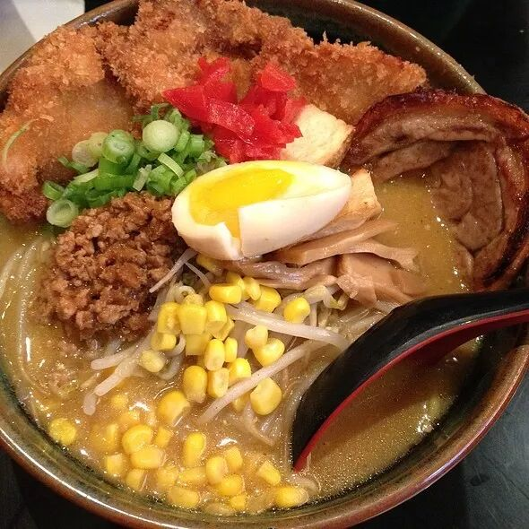
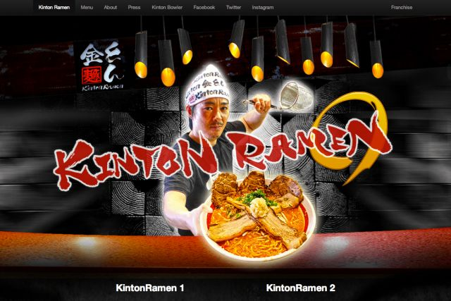
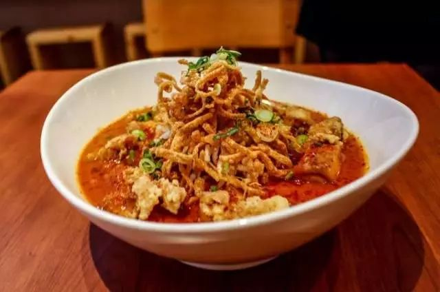
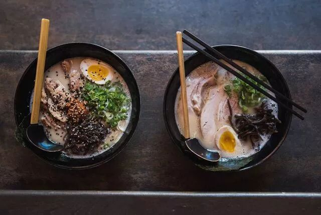
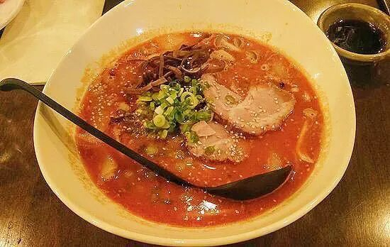

# 无标题

**链接地址:** http://mp.weixin.qq.com/s?__biz=MzI0MDQ0ODI0Ng==&mid=2247485687&idx=1&sn=838f1e5dee886f0f7f35cf2e070215de&chksm=e91bef6ede6c6678265419bff7bd10984ac172358db61fe65e9ac7aee64cbf3d8c2d73e1b3cc&mpshare=1&scene=2&srcid=0407SPaemduU89baMydg12i8#rd
**作者:** 奥腻
**获取时间:** 2025/8/28 22:07:34
**图片数量:** 8

---

## 原始HTML内容

<section style="background-color: rgb(255, 255, 255);box-sizing: border-box;"><section class="Powered-by-XIUMI V5" style="box-sizing: border-box;" powered-by="xiumi.us"><section class="" style="margin: 10px 0%;box-sizing: border-box;"><section class="" style="display: inline-block;width: 100%;vertical-align: top;padding: 2px 3px;background-image: url(&quot;https://mmbiz.qpic.cn/mmbiz_gif/XA8n2XaESnSSHak1MCEicf2FJQj9rzmZka3XucKKAO04tMJQShDbAXu7ftkPaSZLgUEO7TZkUUNwKYnk9Zh1dNw/640?wx_fmt=gif&quot;);background-position: 0% 0%;background-repeat: repeat-y;background-size: 100.733%;background-attachment: scroll;line-height: 1.6;box-sizing: border-box;"><section class="Powered-by-XIUMI V5" style="box-sizing: border-box;" powered-by="xiumi.us"><section class="" style="margin: 1px 0%;text-align: center;box-sizing: border-box;"><section class="" style="display: inline-block;width: 100%;border-width: 1px;border-style: solid;border-color: transparent;padding: 10px;background-color: rgb(254, 255, 255);box-sizing: border-box;"><section class="Powered-by-XIUMI V5" style="box-sizing: border-box;" powered-by="xiumi.us"><section class="" style="box-sizing: border-box;"><section class="" style="text-align: left;box-sizing: border-box;">
要说蒙特利尔的拉面哪里最火，那肯定是中国城的兰州拉面，每次去都要排队到门口。但是这期的主题是日式拉面。虽然蒙特利尔的没有多伦多那么多有名的连锁拉面馆，但是我们拉面馆也都是颇具特色的。
</section></section></section></section></section></section></section></section></section><section class="Powered-by-XIUMI V5" style="box-sizing: border-box;" powered-by="xiumi.us"><section class="" style="margin-top: 10px;margin-bottom: 10px;text-align: center;box-sizing: border-box;"><section class="" style="width: 80%;height: 3em;line-height: 3.2em;background-image: url(&quot;https://mmbiz.qpic.cn/mmbiz_png/XA8n2XaESnSSHak1MCEicf2FJQj9rzmZkXmCF3BENLDdDpFrMkcuUjLayGSMLZJsaRLbxXTeibmezhN3chh2ElRw/640?wx_fmt=png&quot;);background-position: 50% 50%;background-repeat: no-repeat;background-size: contain;display: inline-block;box-sizing: border-box;"><section class="" style="font-size: 18px;box-sizing: border-box;">
首先来说说downtown的面馆
</section></section></section></section><section class="Powered-by-XIUMI V5" style="box-sizing: border-box;" powered-by="xiumi.us"><section class="" style="margin: 10px 0%;box-sizing: border-box;"><section class="" style="display: inline-block;vertical-align: top;width: 60%;padding-right: 5px;box-sizing: border-box;"><section class="Powered-by-XIUMI V5" style="box-sizing: border-box;" powered-by="xiumi.us"><section class="" style="text-align: center;margin-top: 10px;margin-bottom: 10px;font-size: 32px;box-sizing: border-box;"><section class="" style="max-width: 100%;vertical-align: middle;display: inline-block;width: 100%;overflow: hidden !important;box-sizing: border-box;"></section></section></section></section><section class="" style="display: inline-block;vertical-align: top;width: 40%;padding-left: 5px;box-sizing: border-box;"><section class="Powered-by-XIUMI V5" style="box-sizing: border-box;" powered-by="xiumi.us"><section class="" style="margin: -3px 0% 10px;transform: translate3d(-10px, 0px, 0px);-webkit-transform: translate3d(-10px, 0px, 0px);-moz-transform: translate3d(-10px, 0px, 0px);-o-transform: translate3d(-10px, 0px, 0px);box-sizing: border-box;"><section class="" style="display: inline-block;width: 120px;height: 115px;vertical-align: top;overflow: hidden;background-position: 50% 50%;background-repeat: no-repeat;background-size: contain;background-attachment: scroll;background-image: url(&quot;https://mmbiz.qpic.cn/mmbiz_png/XA8n2XaESnSSHak1MCEicf2FJQj9rzmZkfJFp22bAWlzCtSPw8q0FoAFJbnl8Q5d34LMH8EHUSRibaaqRVGup6hg/640?wx_fmt=png&quot;);box-sizing: border-box;"><section class="Powered-by-XIUMI V5" style="box-sizing: border-box;" powered-by="xiumi.us"><section class="" style="margin-top: 85px;margin-right: 0%;margin-left: 0%;box-sizing: border-box;"><section class="tn-yzk-fuid-text-19830-1522301449749" style="text-align: center;line-height: 1.3;font-size: 21px;box-sizing: border-box;">
<strong style="box-sizing: border-box;">Misoya</strong>
</section></section></section></section></section></section><section class="Powered-by-XIUMI V5" style="box-sizing: border-box;" powered-by="xiumi.us"><section class="" style="box-sizing: border-box;"><section class="" style="text-align: justify;box-sizing: border-box;">
<strong style="box-sizing: border-box;">地址：</strong>
</section></section></section><section class="Powered-by-XIUMI V5" style="box-sizing: border-box;" powered-by="xiumi.us"><section class="" style="margin-right: 0%;margin-left: 0%;box-sizing: border-box;"><section class="" style="text-align: justify;font-size: 12px;box-sizing: border-box;">
2065A Bishop Montréal, QC&nbsp;

H3G 2E8

 
</section></section></section></section></section></section><section class="Powered-by-XIUMI V5" style="box-sizing: border-box;" powered-by="xiumi.us"><section class="" style="margin-top: 10px;margin-bottom: 10px;box-sizing: border-box;"><section class="" style="margin-left: auto;transform: rotate(0deg);-webkit-transform: rotate(0deg);-moz-transform: rotate(0deg);-o-transform: rotate(0deg);margin-bottom: -6px;width: 0px;border-bottom: 3px solid rgb(89, 99, 176);border-left: 3px solid rgb(89, 99, 176);border-top: 3px solid rgb(255, 255, 255) !important;border-right: 3px solid rgb(255, 255, 255) !important;box-sizing: border-box;"></section><section class="" style="border-right: 6px solid rgb(247, 188, 0);border-bottom: 6px solid rgb(247, 188, 0);border-top-color: rgb(247, 188, 0);border-left-color: rgb(247, 188, 0);box-sizing: border-box;"><section class="" style="background-color: rgb(245, 245, 245);padding: 10px;box-sizing: border-box;"><section class="Powered-by-XIUMI V5" style="box-sizing: border-box;" powered-by="xiumi.us"><section class="" style="box-sizing: border-box;"><section class="" style="box-sizing: border-box;">
先来讲一家老店，Misoya是一个位于downtown的半地下餐厅，在我最初来到蒙特利尔的时候，拉面店还没有在downtown遍地开花的时候这家店就在哪里来。这是一家味噌屋拉面连锁店，老板和厨师都是日本人，就连盛面条用的碗，都是日本制造的传统挂釉的大陶碗拉面。口味正宗分量十足，其中咖喱拉面算是我每次去都会想吃的。

<strong style="box-sizing: border-box;">吐槽：</strong>这家店唯一的问题就是太咸了，每次吃完都要喝很多水。
</section></section></section></section></section><section class="" style="transform: rotate(0deg);-webkit-transform: rotate(0deg);-moz-transform: rotate(0deg);-o-transform: rotate(0deg);margin-top: -6px;width: 0px;border-top: 3px solid rgb(89, 99, 176);border-right: 3px solid rgb(89, 99, 176);border-bottom: 3px solid rgb(255, 255, 255) !important;border-left: 3px solid rgb(255, 255, 255) !important;box-sizing: border-box;"></section></section></section><section class="Powered-by-XIUMI V5" style="box-sizing: border-box;" powered-by="xiumi.us"><section class="" style="text-align: center;margin: 10px 0%;box-sizing: border-box;"><section class="" style="display: inline-block;width: 120px;height: 120px;vertical-align: top;overflow: hidden;background-position: 50% 50%;background-repeat: no-repeat;background-size: contain;background-attachment: scroll;box-shadow: rgb(0, 0, 0) 0px 0px 0px;background-image: url(&quot;https://mmbiz.qpic.cn/mmbiz_png/XA8n2XaESnSSHak1MCEicf2FJQj9rzmZkfJFp22bAWlzCtSPw8q0FoAFJbnl8Q5d34LMH8EHUSRibaaqRVGup6hg/640?wx_fmt=png&quot;);box-sizing: border-box;"><section class="Powered-by-XIUMI V5" style="box-sizing: border-box;" powered-by="xiumi.us"><section class="" style="margin-top: 85px;margin-right: 0%;margin-left: 0%;box-sizing: border-box;"><section class="tn-yzk-fuid-text-19830-1522301449749" style="line-height: 1.3;font-size: 14px;box-sizing: border-box;">
<strong style="box-sizing: border-box;">Kinton</strong>

 
</section></section></section></section></section></section><section class="Powered-by-XIUMI V5" style="box-sizing: border-box;" powered-by="xiumi.us"><section class="" style="text-align: center;margin-top: 0.5em;margin-bottom: 0.5em;padding-left: 0.5em;padding-right: 0.5em;box-sizing: border-box;"><section class="" style="box-sizing: border-box;width: 100%;box-shadow: rgb(102, 102, 102) 3.53553px 3.53553px 8px;display: inline-block;height: auto !important;overflow: hidden !important;border-color: white;"></section></section></section><section class="Powered-by-XIUMI V5" style="box-sizing: border-box;" powered-by="xiumi.us"><section class="" style="box-sizing: border-box;"><section class="" style="box-sizing: border-box;">
<strong style="box-sizing: border-box;">地址：</strong>&nbsp;1211 Rue Bishop, Montréal, QC&nbsp;

H3G 2E2
</section></section></section><section class="Powered-by-XIUMI V5" style="box-sizing: border-box;" powered-by="xiumi.us"><section class="" style="margin-top: 10px;margin-bottom: 10px;box-sizing: border-box;"><section class="" style="transform: rotate(0deg);-webkit-transform: rotate(0deg);-moz-transform: rotate(0deg);-o-transform: rotate(0deg);margin-bottom: -6px;width: 0px;border-right: 3px solid rgb(246, 192, 20);border-bottom: 3px solid rgb(246, 192, 20);border-top: 3px solid rgb(255, 255, 255) !important;border-left: 3px solid rgb(255, 255, 255) !important;box-sizing: border-box;"></section><section class="" style="border-left: 6px solid rgb(94, 102, 173);border-bottom: 6px solid rgb(94, 102, 173);border-top-color: rgb(94, 102, 173);border-right-color: rgb(94, 102, 173);box-sizing: border-box;"><section class="" style="background-color: rgb(245, 245, 245);padding: 10px;box-sizing: border-box;"><section class="Powered-by-XIUMI V5" style="box-sizing: border-box;" powered-by="xiumi.us"><section class="" style="box-sizing: border-box;"><section class="" style="box-sizing: border-box;">
这家连锁店相信大家都不陌生，是这几年才开来蒙特利尔的新的拉面店，店里装修风格十分现代，相比上一家来讲这家拉面就更富有创新性，经常会有新口味的拉面，和饮品推出。作者最喜欢的是周一特供炸鸡拉面！！！另外他家的sake鸡尾酒也很值得尝试，味道很不错！

<strong style="box-sizing: border-box;">吐槽：</strong>他家辣的spicy ramen通常都是红汤，辣椒+蒜泥提供辣味，香辣爽口，但是有时候会吃到绿汤的拉面，辣度会突然上升好几个等级，让人望而却步
</section></section></section></section></section><section class="" style="margin-left: auto;margin-top: -6px;width: 0px;border-top: 3px solid rgb(246, 192, 20);border-left: 3px solid rgb(246, 192, 20);border-right: 3px solid rgb(255, 255, 255) !important;border-bottom: 3px solid rgb(255, 255, 255) !important;box-sizing: border-box;"></section></section></section><section class="Powered-by-XIUMI V5" style="box-sizing: border-box;" powered-by="xiumi.us"><section class="" style="text-align: center;margin: 10px 0%;box-sizing: border-box;"><section class="" style="display: inline-block;width: 120px;height: 120px;vertical-align: top;overflow: hidden;background-position: 50% 50%;background-repeat: no-repeat;background-size: contain;background-attachment: scroll;background-image: url(&quot;https://mmbiz.qpic.cn/mmbiz_png/XA8n2XaESnSSHak1MCEicf2FJQj9rzmZkBRFXBDIZbfQuiaoOW9cGt8GTWIjtte4Z9EWJKNAPh4gnROEFNQ0g2sA/640?wx_fmt=png&quot;);box-sizing: border-box;"><section class="Powered-by-XIUMI V5" style="box-sizing: border-box;" powered-by="xiumi.us"><section class="" style="margin-top: 85px;margin-right: 0%;margin-left: 0%;box-sizing: border-box;"><section class="tn-yzk-fuid-text-19830-1522301449749" style="line-height: 1.3;font-size: 21px;box-sizing: border-box;">
<strong style="box-sizing: border-box;">Ichifuku</strong>
</section></section></section></section></section></section><section class="Powered-by-XIUMI V5" style="box-sizing: border-box;" powered-by="xiumi.us"><section class="" style="margin: 10px 0%;box-sizing: border-box;"><section class="" style="display: inline-block;vertical-align: top;width: 40%;padding-right: 5px;box-sizing: border-box;"><section class="Powered-by-XIUMI V5" style="box-sizing: border-box;" powered-by="xiumi.us"><section class="" style="margin: 10px 0%;box-sizing: border-box;"><section class="" style="text-align: right;font-size: 14px;box-sizing: border-box;">
<strong style="box-sizing: border-box;">地址：</strong>

1925 Rue Sainte-Catherine O, Montreal, QC H3H 1M3
</section></section></section></section><section class="" style="display: inline-block;vertical-align: top;width: 60%;padding-left: 5px;box-sizing: border-box;"><section class="Powered-by-XIUMI V5" style="box-sizing: border-box;" powered-by="xiumi.us"><section class="" style="text-align: center;margin-top: 10px;margin-bottom: 10px;box-sizing: border-box;"><section class="" style="max-width: 100%;vertical-align: middle;display: inline-block;overflow: hidden !important;box-sizing: border-box;"></section></section></section></section></section></section><section class="Powered-by-XIUMI V5" style="box-sizing: border-box;" powered-by="xiumi.us"><section class="" style="margin-top: 10px;margin-bottom: 10px;box-sizing: border-box;"><section class="" style="transform: rotate(0deg);-webkit-transform: rotate(0deg);-moz-transform: rotate(0deg);-o-transform: rotate(0deg);margin-bottom: -6px;width: 0px;border-right: 3px solid rgb(179, 220, 192);border-bottom: 3px solid rgb(179, 220, 192);border-top: 3px solid rgb(255, 255, 255) !important;border-left: 3px solid rgb(255, 255, 255) !important;box-sizing: border-box;"></section><section class="" style="border-right: 6px solid rgb(193, 124, 186);border-top: 6px solid rgb(193, 124, 186);border-bottom-color: rgb(193, 124, 186);border-left-color: rgb(193, 124, 186);box-sizing: border-box;"><section class="" style="background-color: rgb(245, 245, 245);padding: 10px;box-sizing: border-box;"><section class="Powered-by-XIUMI V5" style="box-sizing: border-box;" powered-by="xiumi.us"><section class="" style="box-sizing: border-box;"><section class="" style="box-sizing: border-box;">
这家店也算很新的拉面店了，门口摆着一个做拉面的机器，有师傅现做现卖，绝地新鲜，也很有观赏性。

店内很小，只有一排桌子和一排吧台。这家店最大的特色就是他们家的火山拉面。除了辣之外这碗拉面用料也很讲究，豚骨加鸡肉的汤头配上炸鸡真的是十分满足（没错有是炸鸡(*/ω＼*)，不过炸鸡做的好吃真的很加分啊）

<strong style="box-sizing: border-box;">吐槽：</strong>他们家最大的槽点就是汤头的浓度，经常吃着吃着汤面会吃成拌面的感觉。因为汤实在太浓，即使是小小的一碗，我从未吃完过。

 
</section></section></section></section></section><section class="" style="margin-left: auto;margin-top: -6px;width: 0px;border-top: 3px solid rgb(179, 220, 192);border-left: 3px solid rgb(179, 220, 192);border-right: 3px solid rgb(255, 255, 255) !important;border-bottom: 3px solid rgb(255, 255, 255) !important;box-sizing: border-box;"></section></section></section><section class="Powered-by-XIUMI V5" style="box-sizing: border-box;" powered-by="xiumi.us"><section class="" style="margin-top: 10px;margin-bottom: 10px;text-align: center;box-sizing: border-box;"><section class="" style="width: 80%;height: 3em;line-height: 3.2em;background-image: url(&quot;https://mmbiz.qpic.cn/mmbiz_png/XA8n2XaESnSSHak1MCEicf2FJQj9rzmZkXmCF3BENLDdDpFrMkcuUjLayGSMLZJsaRLbxXTeibmezhN3chh2ElRw/640?wx_fmt=png&quot;);background-position: 50% 50%;background-repeat: no-repeat;background-size: contain;display: inline-block;box-sizing: border-box;"><section class="" style="font-size: 18px;box-sizing: border-box;">
其他地区的拉面
</section></section></section></section><section class="Powered-by-XIUMI V5" style="box-sizing: border-box;" powered-by="xiumi.us"><section class="" style="margin: 10px 0%;box-sizing: border-box;"><section class="" style="display: inline-block;width: 100%;vertical-align: top;padding: 2px 3px;background-image: url(&quot;https://mmbiz.qpic.cn/mmbiz_gif/XA8n2XaESnSSHak1MCEicf2FJQj9rzmZka3XucKKAO04tMJQShDbAXu7ftkPaSZLgUEO7TZkUUNwKYnk9Zh1dNw/640?wx_fmt=gif&quot;);background-position: 0% 0%;background-repeat: repeat-y;background-size: 100.733%;background-attachment: scroll;line-height: 1.6;box-sizing: border-box;"><section class="Powered-by-XIUMI V5" style="box-sizing: border-box;" powered-by="xiumi.us"><section class="" style="margin: 1px 0%;text-align: center;box-sizing: border-box;"><section class="" style="display: inline-block;width: 100%;border-width: 1px;border-style: solid;border-color: transparent;padding: 10px;background-color: rgb(254, 255, 255);box-sizing: border-box;"><section class="Powered-by-XIUMI V5" style="box-sizing: border-box;" powered-by="xiumi.us"><section class="" style="box-sizing: border-box;"><section class="" style="text-align: left;box-sizing: border-box;">
Downtown去年又接二连三的开了好几家拉面，比如说熊本，种类繁多却缺乏吸引我的点。并没有真正让我心动的满分拉面(ಥ﹏ಥ)

除了downtown的拉面之外，其实很多其他的地方也值得探访：

（以下来自于作者的一个吃遍全城的小伙伴的实力推荐）
</section></section></section></section></section></section></section></section></section><section class="Powered-by-XIUMI V5" style="box-sizing: border-box;" powered-by="xiumi.us"><section class="" style="margin-top: 0.5em;margin-bottom: 0.5em;box-sizing: border-box;"><section style="border-top: 1px dashed rgb(255, 202, 0);box-sizing: border-box;" class=""></section></section></section><section class="Powered-by-XIUMI V5" style="box-sizing: border-box;" powered-by="xiumi.us"><section class="" style="margin-top: 8px;margin-right: 0%;margin-left: 0%;text-align: center;box-sizing: border-box;"><section class="" style="display: inline-block;vertical-align: middle;box-sizing: border-box;"><section style="width: 6px;height: 6px;display: inline-block;vertical-align: middle;border-radius: 100%;background-color: rgb(227, 180, 134);box-sizing: border-box;"></section><section class="" style="display: inline-block;vertical-align: middle;font-size: 21px;padding-right: 5px;padding-left: 5px;color: rgb(60, 102, 77);box-sizing: border-box;">
<strong style="letter-spacing: 0px;box-sizing: border-box;">Yokato Yokabai Ramen</strong> 
</section><section style="display: inline-block;vertical-align: middle;width: 6px;height: 6px;border-radius: 100%;background-color: rgb(227, 180, 134);box-sizing: border-box;"></section></section></section></section><section class="Powered-by-XIUMI V5" style="box-sizing: border-box;" powered-by="xiumi.us"><section class="" style="text-align: center;margin-right: 0%;margin-bottom: 10px;margin-left: 0%;box-sizing: border-box;"><section class="" style="max-width: 100%;vertical-align: middle;display: inline-block;width: 50%;overflow: hidden !important;box-sizing: border-box;"></section></section></section><section class="Powered-by-XIUMI V5" style="box-sizing: border-box;" powered-by="xiumi.us"><section class="" style="text-align: center;margin-top: 10px;margin-bottom: 10px;box-sizing: border-box;"><section class="" style="max-width: 100%;vertical-align: middle;display: inline-block;overflow: hidden !important;box-sizing: border-box;"></section></section></section><section class="Powered-by-XIUMI V5" style="box-sizing: border-box;" powered-by="xiumi.us"><section class="" style="margin-top: 10px;margin-bottom: 10px;box-sizing: border-box;"><section class="" style="border-width: 3px;border-style: solid;border-color: black;padding: 3px;box-sizing: border-box;"><section class="" style="border-color: rgb(128, 128, 128);border-width: 1px;border-style: solid;padding: 10px;box-sizing: border-box;"><section class="Powered-by-XIUMI V5" style="box-sizing: border-box;" powered-by="xiumi.us"><section class="" style="box-sizing: border-box;"><section class="" style="text-align: center;box-sizing: border-box;">
<strong style="box-sizing: border-box;">地址</strong>：4185 Drolet, Montreal, QC&nbsp;

H2W 2L5

这家拉面店在yelp上有500多条评价，基本上都很不错。再看下menu，虽然只有豚骨和鸡肉味增的拉面，但是评价都很高

<strong style="box-sizing: border-box;">评价：</strong>“这家很不错！”
</section></section></section></section></section></section></section><section class="Powered-by-XIUMI V5" style="box-sizing: border-box;" powered-by="xiumi.us"><section class="" style="margin-top: 0.5em;margin-bottom: 0.5em;box-sizing: border-box;"><section style="border-top: 1px dashed rgb(255, 202, 0);box-sizing: border-box;" class=""></section></section></section><section class="Powered-by-XIUMI V5" style="box-sizing: border-box;" powered-by="xiumi.us"><section class="" style="margin-top: 8px;margin-right: 0%;margin-left: 0%;text-align: center;box-sizing: border-box;"><section class="" style="display: inline-block;vertical-align: middle;box-sizing: border-box;"><section style="width: 6px;height: 6px;display: inline-block;vertical-align: middle;border-radius: 100%;background-color: rgb(227, 180, 134);box-sizing: border-box;"></section><section class="" style="display: inline-block;vertical-align: middle;font-size: 19px;padding-right: 5px;padding-left: 5px;color: rgb(60, 102, 77);box-sizing: border-box;">
Izakaya Kabocha
</section><section style="display: inline-block;vertical-align: middle;width: 6px;height: 6px;border-radius: 100%;background-color: rgb(227, 180, 134);box-sizing: border-box;"></section></section></section></section><section class="Powered-by-XIUMI V5" style="box-sizing: border-box;" powered-by="xiumi.us"><section class="" style="text-align: center;margin-right: 0%;margin-bottom: 10px;margin-left: 0%;box-sizing: border-box;"><section class="" style="max-width: 100%;vertical-align: middle;display: inline-block;width: 50%;overflow: hidden !important;box-sizing: border-box;"></section></section></section><section class="Powered-by-XIUMI V5" style="box-sizing: border-box;" powered-by="xiumi.us"><section class="" style="text-align: center;margin-top: 10px;margin-bottom: 10px;box-sizing: border-box;"><section class="" style="max-width: 100%;vertical-align: middle;display: inline-block;overflow: hidden !important;box-sizing: border-box;"></section></section></section><section class="Powered-by-XIUMI V5" style="box-sizing: border-box;" powered-by="xiumi.us"><section class="" style="margin-top: 10px;margin-bottom: 10px;box-sizing: border-box;"><section class="" style="border-width: 3px;border-style: solid;border-color: black;padding: 3px;box-sizing: border-box;"><section class="" style="border-color: rgb(128, 128, 128);border-width: 1px;border-style: dashed;padding: 10px;box-sizing: border-box;"><section class="Powered-by-XIUMI V5" style="box-sizing: border-box;" powered-by="xiumi.us"><section class="" style="box-sizing: border-box;"><section class="" style="text-align: center;box-sizing: border-box;">
<strong style="box-sizing: border-box;">地址：</strong> 3627 Boul St-Laurent, Montréal, QC H2X 2V5

&nbsp;&nbsp;&nbsp;&nbsp;&nbsp;&nbsp;&nbsp;&nbsp;这家虽然是居酒屋但是也提供拉面和拌饭等主食。虽然不是营业重点，但是拉面的种类还是很丰富的，除了牛肉和猪肉之外，刺身拉面sashimi ramen和炒面yakisoba也值得一试

<strong style="box-sizing: border-box;">评价：</strong>“虽然是居酒屋

但是专门来吃拉面也不错！”
</section></section></section></section></section></section></section><section class="Powered-by-XIUMI V5" style="box-sizing: border-box;" powered-by="xiumi.us"><section class="" style="margin-top: 10px;margin-bottom: 10px;text-align: center;box-sizing: border-box;"><section class="" style="display: inline-block;vertical-align: top;box-sizing: border-box;"><section style="display: inline-block;vertical-align: top;line-height: 1em;box-sizing: border-box;"><section style="width: 0px;margin-right: -0.5em;display: inline-block;vertical-align: top;border-top: 1em solid rgb(255, 126, 145);border-left: 0.65em solid transparent;border-right: 0.65em solid transparent;box-sizing: border-box;"></section><section style="width: 0px;display: inline-block;vertical-align: top;border-bottom: 1em solid rgb(255, 230, 232);border-left: 0.65em solid transparent;border-right: 0.65em solid transparent;box-sizing: border-box;"></section></section><section class="" style="display: inline-block;vertical-align: top;line-height: 1em;padding-left: 6px;padding-right: 6px;font-size: 18px;box-sizing: border-box;">
看到这里大家应该都饿了

 
</section><section style="display: inline-block;vertical-align: top;line-height: 1em;box-sizing: border-box;"><section style="width: 0px;display: inline-block;vertical-align: top;margin-right: -0.5em;border-bottom: 1em solid rgb(255, 126, 145);border-left: 0.65em solid transparent;border-right: 0.65em solid transparent;box-sizing: border-box;"></section><section style="width: 0px;display: inline-block;vertical-align: top;border-top: 1em solid rgb(255, 230, 232);border-left: 0.65em solid transparent;border-right: 0.65em solid transparent;box-sizing: border-box;"></section></section></section></section></section><section class="Powered-by-XIUMI V5" style="box-sizing: border-box;" powered-by="xiumi.us"><section class="" style="text-align: center;margin: 10px 0%;box-sizing: border-box;"><section class="" style="display: inline-block;width: 240px;height: 160px;vertical-align: top;overflow: hidden;background-position: 50% 50%;background-repeat: no-repeat;background-size: contain;background-attachment: scroll;background-image: url(&quot;https://mmbiz.qpic.cn/mmbiz_png/XA8n2XaESnSSHak1MCEicf2FJQj9rzmZk1rIgOiaO0Y1bfWSIGlg8Td5BtWiaxaLBCLtUOSqSt67rm9icTl8f0Ocsw/640?wx_fmt=png&quot;);box-sizing: border-box;"><section class="Powered-by-XIUMI V5" style="box-sizing: border-box;" powered-by="xiumi.us"><section class="" style="box-sizing: border-box;"><section class="" style="text-align: left;box-sizing: border-box;">
 
</section></section></section><section class="Powered-by-XIUMI V5" style="transform: rotateZ(3.13deg);-webkit-transform: rotateZ(3.13deg);-moz-transform: rotateZ(3.13deg);-o-transform: rotateZ(3.13deg);box-sizing: border-box;" powered-by="xiumi.us"><section class="" style="margin-top: 20px;margin-right: 0%;margin-left: 0%;box-sizing: border-box;"><section class="" style="text-align: justify;font-size: 15px;padding-right: 15px;padding-left: 15px;box-sizing: border-box;">
おぉ！相棒、ラーメン食いに行こうぜぇ! （哥们儿咱们一起去吃拉面吧）

 
</section></section></section></section></section></section><section class="Powered-by-XIUMI V5" style="box-sizing: border-box;" powered-by="xiumi.us"><section class="" style="text-align: center;margin-top: 10px;margin-bottom: 10px;box-sizing: border-box;"><section class="" style="max-width: 100%;vertical-align: middle;display: inline-block;overflow: hidden !important;box-sizing: border-box;"></section></section></section></section>
 

---

## 纯文本内容

要说蒙特利尔的拉面哪里最火，那肯定是中国城的兰州拉面，每次去都要排队到门口。但是这期的主题是日式拉面。虽然蒙特利尔的没有多伦多那么多有名的连锁拉面馆，但是我们拉面馆也都是颇具特色的。首先来说说downtown的面馆Misoya地址：2065A Bishop Montréal, QC H3G 2E8先来讲一家老店，Misoya是一个位于downtown的半地下餐厅，在我最初来到蒙特利尔的时候，拉面店还没有在downtown遍地开花的时候这家店就在哪里来。这是一家味噌屋拉面连锁店，老板和厨师都是日本人，就连盛面条用的碗，都是日本制造的传统挂釉的大陶碗拉面。口味正宗分量十足，其中咖喱拉面算是我每次去都会想吃的。吐槽：这家店唯一的问题就是太咸了，每次吃完都要喝很多水。Kinton地址： 1211 Rue Bishop, Montréal, QC H3G 2E2这家连锁店相信大家都不陌生，是这几年才开来蒙特利尔的新的拉面店，店里装修风格十分现代，相比上一家来讲这家拉面就更富有创新性，经常会有新口味的拉面，和饮品推出。作者最喜欢的是周一特供炸鸡拉面！！！另外他家的sake鸡尾酒也很值得尝试，味道很不错！吐槽：他家辣的spicy ramen通常都是红汤，辣椒+蒜泥提供辣味，香辣爽口，但是有时候会吃到绿汤的拉面，辣度会突然上升好几个等级，让人望而却步Ichifuku地址：1925 Rue Sainte-Catherine O, Montreal, QC H3H 1M3这家店也算很新的拉面店了，门口摆着一个做拉面的机器，有师傅现做现卖，绝地新鲜，也很有观赏性。店内很小，只有一排桌子和一排吧台。这家店最大的特色就是他们家的火山拉面。除了辣之外这碗拉面用料也很讲究，豚骨加鸡肉的汤头配上炸鸡真的是十分满足（没错有是炸鸡(*/ω＼*)，不过炸鸡做的好吃真的很加分啊）吐槽：他们家最大的槽点就是汤头的浓度，经常吃着吃着汤面会吃成拌面的感觉。因为汤实在太浓，即使是小小的一碗，我从未吃完过。其他地区的拉面Downtown去年又接二连三的开了好几家拉面，比如说熊本，种类繁多却缺乏吸引我的点。并没有真正让我心动的满分拉面(ಥ﹏ಥ)除了downtown的拉面之外，其实很多其他的地方也值得探访：（以下来自于作者的一个吃遍全城的小伙伴的实力推荐）Yokato Yokabai Ramen地址：4185 Drolet, Montreal, QC H2W 2L5这家拉面店在yelp上有500多条评价，基本上都很不错。再看下menu，虽然只有豚骨和鸡肉味增的拉面，但是评价都很高评价：“这家很不错！”Izakaya Kabocha地址： 3627 Boul St-Laurent, Montréal, QC H2X 2V5        这家虽然是居酒屋但是也提供拉面和拌饭等主食。虽然不是营业重点，但是拉面的种类还是很丰富的，除了牛肉和猪肉之外，刺身拉面sashimi ramen和炒面yakisoba也值得一试评价：“虽然是居酒屋但是专门来吃拉面也不错！”看到这里大家应该都饿了おぉ！相棒、ラーメン食いに行こうぜぇ! （哥们儿咱们一起去吃拉面吧）

---

## 图片列表

-  (原始链接: https://mmbiz.qpic.cn/mmbiz_jpg/XA8n2XaESnSSHak1MCEicf2FJQj9rzmZk11ckDyy4hDwpWHurt3bcTbZMLmJ6Xz72dEBJRaTjYrXib7zagicD6jDg/640?wx_fmt=jpeg)
-  (原始链接: https://mmbiz.qpic.cn/mmbiz_png/XA8n2XaESnSSHak1MCEicf2FJQj9rzmZktvwzYVHia6lLGGjfk3JkdIUypUJ7ac2F5WM7MS9pp9Zpmd3gbsTibJLA/640?wx_fmt=png)
-  (原始链接: https://mmbiz.qpic.cn/mmbiz_jpg/XA8n2XaESnSSHak1MCEicf2FJQj9rzmZk6dhT2iceiaEzTjBx3rsJjJmMCrGGLTpzQXtM3BqXGNHkLh8XbGCx1eZQ/640?wx_fmt=jpeg)
-  (原始链接: https://mmbiz.qpic.cn/mmbiz_png/XA8n2XaESnSSHak1MCEicf2FJQj9rzmZka4LlbJicD1hFLB30IG4s64d8FRnbcRT8iaicrm1ms2T7xFwF7JARtxUDQ/640?wx_fmt=png)
-  (原始链接: https://mmbiz.qpic.cn/mmbiz_jpg/XA8n2XaESnSSHak1MCEicf2FJQj9rzmZk7ORwWj4j8ibC2VBJ1X085GeFXns0S4QTsHHnfz3AEXuGLaOnc0n6kUg/640?wx_fmt=jpeg)
-  (原始链接: https://mmbiz.qpic.cn/mmbiz_png/XA8n2XaESnSSHak1MCEicf2FJQj9rzmZka4LlbJicD1hFLB30IG4s64d8FRnbcRT8iaicrm1ms2T7xFwF7JARtxUDQ/640?wx_fmt=png)
-  (原始链接: https://mmbiz.qpic.cn/mmbiz_jpg/XA8n2XaESnSSHak1MCEicf2FJQj9rzmZkLicwMGbzXwicheqfAdjusc7Sz2tFwoFy75ATBbrbryvctHbkV9DVTa0Q/640?wx_fmt=jpeg)
-  (原始链接: https://mmbiz.qpic.cn/mmbiz_jpg/XA8n2XaESnSSHak1MCEicf2FJQj9rzmZk3BiaBWnrDibiaYUpCzRNNBSWyLRlxnjzFg732M25TKUyaSasCsFURiaxyg/640?wx_fmt=jpeg)
