# 无标题

**链接地址:** http://mp.weixin.qq.com/s?__biz=MzI0MDQ0ODI0Ng==&mid=2247485692&idx=1&sn=0b824f4cfaa185f5151cf9a105ee7d75&chksm=e91bef65de6c6673f1beb59affb93035e3ad875e7f2bb6e8e06d876636932516b0db4b1d662f&mpshare=1&scene=2&srcid=0408RgF2zinNxF14H9Wn0Nuu#rd
**作者:** 食悦君
**获取时间:** 2025/8/28 22:07:22
**图片数量:** 77

---

## 原始HTML内容

<section style="background-color: rgb(255, 255, 255);box-sizing: border-box;"><section class="Powered-by-XIUMI V5" style="box-sizing: border-box;" powered-by="xiumi.us"><section class="" style="margin-top: 10px;margin-bottom: 10px;text-align: center;font-size: 10px;box-sizing: border-box;"><section class="" style="display: inline-block;box-sizing: border-box;"><section style="width: 5.6em;height: 5.6em;margin: 1.2em auto;padding: 0.28em;border-width: 1px;border-style: solid;transform: rotate(45deg);-webkit-transform: rotate(45deg);-moz-transform: rotate(45deg);-o-transform: rotate(45deg);border-color: rgb(89, 94, 36);box-sizing: border-box;"><section style="width: 5em;height: 5em;overflow: hidden;box-sizing: border-box;"><section style="transform: rotate(-45deg);-webkit-transform: rotate(-45deg);-moz-transform: rotate(-45deg);-o-transform: rotate(-45deg);box-sizing: border-box;"><section class="" style="width: 7em;height: 7em;margin: -1em;background-position: center center;background-repeat: no-repeat;background-size: cover;background-image: url(&quot;https://mmbiz.qpic.cn/mmbiz_jpg/XA8n2XaESnTM448oYZGdVwfZg9xEA9ShTAlafW5z252fibx3exGhrmmP4UqET8eFKQYQJciaUcyf6eT8mnlbMXGg/640?wx_fmt=jpeg&quot;);box-sizing: border-box;max-width: 150% !important;"><section class="" style="width: 100%;height: 100%;overflow: hidden;box-sizing: border-box;"></section></section></section></section></section></section></section></section><section class="Powered-by-XIUMI V5" style="box-sizing: border-box;" powered-by="xiumi.us"><section class="" style="margin-top: 0.5em;margin-bottom: 0.5em;text-align: center;box-sizing: border-box;"><section class="" style="width: 10px;height: 10px;margin-left: auto;border-top: 1px solid rgb(14, 63, 39);border-right: 1px solid rgb(14, 63, 39);box-sizing: border-box;"></section><section class="" style="margin-top: -5px;margin-bottom: -5px;padding-right: 5px;padding-left: 10px;box-sizing: border-box;"><section class="" style="border-width: 1px;border-style: solid;border-color: rgb(255, 255, 255);padding: 10px;box-sizing: border-box;"><section class="Powered-by-XIUMI V5" style="box-sizing: border-box;" powered-by="xiumi.us"><section class="" style="box-sizing: border-box;"><section class="" style="font-size: 14px;color: rgb(152, 157, 107);letter-spacing: 1.5px;line-height: 2;box-sizing: border-box;">
<strong style="box-sizing: border-box;">贵</strong>
</section></section></section></section></section><section class="" style="width: 50px;height: 20px;margin-top: -10px;box-sizing: border-box;"><section style="width: 1px;height: 20px;margin-left: 5px;margin-bottom: -6px;background-color: rgb(14, 63, 39);box-sizing: border-box;"></section><section style="width: 50px;height: 1px;background-color: rgb(14, 63, 39);box-sizing: border-box;"></section></section></section></section><section class="Powered-by-XIUMI V5" style="box-sizing: border-box;" powered-by="xiumi.us"><section class="" style="margin: 20px 0% 10px;box-sizing: border-box;"><section class="" style="font-size: 14px;color: rgb(152, 157, 107);letter-spacing: 1px;line-height: 2;box-sizing: border-box;">
提到爱城最贵的餐厅，大多数人可能心里都没个概念。是360度无死角盘旋在爱城夜空的旋转餐厅La Ronde吗？是装修奢华复古的老牌牛排店Hardware Grill吗？还是备受美食家推崇来自有机牧场的新晋网红RGE RD？都不是。去年夏天横空出世的一家餐厅打破了这个格局，以门票<strong style="box-sizing: border-box;">160CAD</strong>还不包酒水的高昂价格一骑绝尘，迅速踩上了舆论的风口浪尖。
</section></section></section><section class="Powered-by-XIUMI V5" style="box-sizing: border-box;" powered-by="xiumi.us"><section class="" style="margin-top: 10px;margin-bottom: 10px;text-align: center;font-size: 10px;box-sizing: border-box;"><section class="" style="display: inline-block;box-sizing: border-box;"><section style="width: 5.6em;height: 5.6em;margin: 1.2em auto;padding: 0.28em;border-width: 1px;border-style: solid;transform: rotate(45deg);-webkit-transform: rotate(45deg);-moz-transform: rotate(45deg);-o-transform: rotate(45deg);border-color: rgb(89, 94, 36);box-sizing: border-box;"><section style="width: 5em;height: 5em;overflow: hidden;box-sizing: border-box;"><section style="transform: rotate(-45deg);-webkit-transform: rotate(-45deg);-moz-transform: rotate(-45deg);-o-transform: rotate(-45deg);box-sizing: border-box;"><section class="" style="width: 7em;height: 7em;margin: -1em;background-position: center center;background-repeat: no-repeat;background-size: cover;background-image: url(&quot;https://mmbiz.qpic.cn/mmbiz_jpg/XA8n2XaESnTM448oYZGdVwfZg9xEA9ShVcjnyysAdgFPVct2vLNfRKaTFTuTMfibPoC12JIvMj6esxvLRaribs0A/640?wx_fmt=jpeg&quot;);box-sizing: border-box;max-width: 150% !important;"><section class="" style="width: 100%;height: 100%;overflow: hidden;box-sizing: border-box;"></section></section></section></section></section></section></section></section><section class="Powered-by-XIUMI V5" style="box-sizing: border-box;" powered-by="xiumi.us"><section class="" style="margin-top: 0.5em;margin-bottom: 0.5em;text-align: center;box-sizing: border-box;"><section class="" style="width: 10px;height: 10px;margin-left: auto;border-top: 1px solid rgb(14, 63, 39);border-right: 1px solid rgb(14, 63, 39);box-sizing: border-box;"></section><section class="" style="margin-top: -5px;margin-bottom: -5px;padding-right: 5px;padding-left: 10px;box-sizing: border-box;"><section class="" style="border-width: 1px;border-style: solid;border-color: rgb(255, 255, 255);padding: 10px;box-sizing: border-box;"><section class="Powered-by-XIUMI V5" style="box-sizing: border-box;" powered-by="xiumi.us"><section class="" style="box-sizing: border-box;"><section class="" style="font-size: 14px;color: rgb(152, 157, 107);letter-spacing: 1.5px;line-height: 2;box-sizing: border-box;">
<strong style="box-sizing: border-box;">怪</strong>
</section></section></section></section></section><section class="" style="width: 50px;height: 20px;margin-top: -10px;box-sizing: border-box;"><section style="width: 1px;height: 20px;margin-left: 5px;margin-bottom: -6px;background-color: rgb(14, 63, 39);box-sizing: border-box;"></section><section style="width: 50px;height: 1px;background-color: rgb(14, 63, 39);box-sizing: border-box;"></section></section></section></section><section class="Powered-by-XIUMI V5" style="box-sizing: border-box;" powered-by="xiumi.us"><section class="" style="margin: 20px 0% 10px;box-sizing: border-box;"><section class="" style="font-size: 14px;color: rgb(152, 157, 107);letter-spacing: 1px;line-height: 2;box-sizing: border-box;">
光是高昂的价格并不足以制造众多的话题。这家餐厅引人瞩目的点还在于它的“怪”。一次只接待最多12名客人。提前买票，不退不补。不能点餐，主厨给你做什么你吃什么，不许挑食。迟到了还不让进。不打广告，也不接受小费。脾气这么古怪，怕是没人去吧？错，食悦君我可是提前了一个月才定上位！
</section></section></section><section class="Powered-by-XIUMI V5" style="box-sizing: border-box;" powered-by="xiumi.us"><section class="" style="margin-top: 10px;margin-bottom: 10px;text-align: center;font-size: 10px;box-sizing: border-box;"><section class="" style="display: inline-block;box-sizing: border-box;"><section style="width: 5.6em;height: 5.6em;margin: 1.2em auto;padding: 0.28em;border-width: 1px;border-style: solid;transform: rotate(45deg);-webkit-transform: rotate(45deg);-moz-transform: rotate(45deg);-o-transform: rotate(45deg);border-color: rgb(89, 94, 36);box-sizing: border-box;"><section style="width: 5em;height: 5em;overflow: hidden;box-sizing: border-box;"><section style="transform: rotate(-45deg);-webkit-transform: rotate(-45deg);-moz-transform: rotate(-45deg);-o-transform: rotate(-45deg);box-sizing: border-box;"><section class="" style="width: 7em;height: 7em;margin: -1em;background-position: center center;background-repeat: no-repeat;background-size: cover;background-image: url(&quot;https://mmbiz.qpic.cn/mmbiz_jpg/XA8n2XaESnTM448oYZGdVwfZg9xEA9ShTj1gmeu2M2af3LYO7UibrFiaFnLj27QUeywkTLzPXo2HUDPYHLtaib5TA/640?wx_fmt=jpeg&quot;);box-sizing: border-box;max-width: 150% !important;"><section class="" style="width: 100%;height: 100%;overflow: hidden;box-sizing: border-box;"></section></section></section></section></section></section></section></section><section class="Powered-by-XIUMI V5" style="box-sizing: border-box;" powered-by="xiumi.us"><section class="" style="margin-top: 0.5em;margin-bottom: 0.5em;text-align: center;box-sizing: border-box;"><section class="" style="width: 10px;height: 10px;margin-left: auto;border-top: 1px solid rgb(14, 63, 39);border-right: 1px solid rgb(14, 63, 39);box-sizing: border-box;"></section><section class="" style="margin-top: -5px;margin-bottom: -5px;padding-right: 5px;padding-left: 10px;box-sizing: border-box;"><section class="" style="border-width: 1px;border-style: solid;border-color: rgb(255, 255, 255);padding: 10px;box-sizing: border-box;"><section class="Powered-by-XIUMI V5" style="box-sizing: border-box;" powered-by="xiumi.us"><section class="" style="box-sizing: border-box;"><section class="" style="font-size: 14px;color: rgb(152, 157, 107);letter-spacing: 1.5px;line-height: 2;box-sizing: border-box;">
<strong style="box-sizing: border-box;">誉</strong>
</section></section></section></section></section><section class="" style="width: 50px;height: 20px;margin-top: -10px;box-sizing: border-box;"><section style="width: 1px;height: 20px;margin-left: 5px;margin-bottom: -6px;background-color: rgb(14, 63, 39);box-sizing: border-box;"></section><section style="width: 50px;height: 1px;background-color: rgb(14, 63, 39);box-sizing: border-box;"></section></section></section></section><section class="Powered-by-XIUMI V5" style="box-sizing: border-box;" powered-by="xiumi.us"><section class="" style="margin: 20px 0% 10px;box-sizing: border-box;"><section class="" style="font-size: 14px;color: rgb(152, 157, 107);letter-spacing: 1px;line-height: 2;box-sizing: border-box;">
这么一听难免让人心理犯嘀咕，这样奇葩的餐厅肯定只是为了炒作噱头，好吃不了。然而开业仅三个月即斩获Air Canada评选的加拿大十佳新餐厅的头衔，并在Google上维持着4.9/5的超高评价！相信手机前的你看到这里也对这家餐厅产生了无限的好奇！一顿人均200+的餐厅到底长啥样？到底值不值？这就让悦食君带你一起去揭开这家名为“<strong style="box-sizing: border-box;">Alder Room</strong>”的实验餐厅的神秘面纱。
</section></section></section><section class="Powered-by-XIUMI V5" style="box-sizing: border-box;" powered-by="xiumi.us"><section class="" style="margin-top: 10px;margin-bottom: 10px;text-align: center;box-sizing: border-box;"><section class="" style="width: 80%;height: 3em;line-height: 3.2em;background-image: url(&quot;https://mmbiz.qpic.cn/mmbiz_png/XA8n2XaESnTM448oYZGdVwfZg9xEA9ShmG7gSZzpPhAiaGoA7zBDHPCjN6wbfic81Z6b4Wia3nPrXjqsuVLR8Xqpw/640?wx_fmt=png&quot;);background-position: 50% 50%;background-repeat: no-repeat;background-size: contain;display: inline-block;box-sizing: border-box;"><section class="" style="font-size: 18px;color: rgb(89, 94, 36);box-sizing: border-box;">
<strong style="box-sizing: border-box;">Alder Room</strong>
</section></section></section></section><section class="Powered-by-XIUMI V5" style="box-sizing: border-box;" powered-by="xiumi.us"><section class="" style="margin-top: 10px;margin-bottom: 10px;box-sizing: border-box;"><section class="" style="max-width: 50%;vertical-align: middle;float: left;display: inline-block;overflow: hidden !important;box-sizing: border-box;"></section><section class="" style="clear: both;box-sizing: border-box;"></section><section class="" style="width: 100%;float: left;box-sizing: border-box;"><section class="Powered-by-XIUMI V5" style="box-sizing: border-box;" powered-by="xiumi.us"><section class="" style="text-align: center;margin-right: 0%;margin-bottom: -1px;margin-left: 0%;box-sizing: border-box;"><section class="" style="max-width: 100%;vertical-align: middle;display: inline-block;overflow: hidden !important;box-sizing: border-box;"></section></section></section></section><section class="" style="max-width: 50%;vertical-align: middle;float: right;display: inline-block;overflow: hidden !important;box-sizing: border-box;"></section><section class="" style="clear: both;box-sizing: border-box;"></section></section></section><section class="Powered-by-XIUMI V5" style="box-sizing: border-box;" powered-by="xiumi.us"><section class="" style="margin: 20px 0% 10px;box-sizing: border-box;"><section class="" style="font-size: 14px;color: rgb(152, 157, 107);letter-spacing: 1px;line-height: 2;box-sizing: border-box;">
Alder Room位于Jasper Ave和104 ST的交叉口。熟悉爱城美食地图的小伙伴们肯定对这片区域不会陌生，无数口味清奇价格高昂的神秘小店就比邻屹立于这个爱城美食逼格最高的十字路口。食悦君辛辛苦苦积攒了半年的搬砖积蓄才舍得去开一顿荤。160刀啊！能吃多少顿麦当劳巨无霸汉堡呢！而且这个B都装了，总不好意思别人喝酒你喝白开水吧？顺便给自己再弄个饮料套餐。因为对自己酒量的不自信，选择了酒精和果汁混合的套组，这样60刀就又没有了。还没算上税。此刻食悦君心情如图。
</section></section></section><section class="Powered-by-XIUMI V5" style="box-sizing: border-box;" powered-by="xiumi.us"><section class="" style="text-align: center;margin-top: 10px;margin-bottom: 10px;box-sizing: border-box;"><section class="" style="max-width: 100%;vertical-align: middle;display: inline-block;overflow: hidden !important;box-sizing: border-box;"></section></section></section><section class="Powered-by-XIUMI V5" style="box-sizing: border-box;" powered-by="xiumi.us"><section class="" style="margin: 20px 0% 10px;box-sizing: border-box;"><section class="" style="font-size: 14px;color: rgb(152, 157, 107);letter-spacing: 1px;line-height: 2;box-sizing: border-box;">
对于在这个地理位置抢车位这件事情，食悦君也是很不自信的。于是提前了十五分钟到场。店里灯光昏暗迷离，装修风格极度简约，几乎看不到什么多余的装饰品。房顶上悬挂着风干食材，房间的角落堆着取火用的桦木，企图营造一点生活化的家庭感。一圈椅子围着两个木矮桌，是客人品尝点心和探讨用餐心得的区域，而吧台的十一张椅子才是今晚享用正餐的主场。
</section></section></section><section class="Powered-by-XIUMI V5" style="box-sizing: border-box;" powered-by="xiumi.us"><section class="" style="margin-top: 10px;margin-bottom: 10px;box-sizing: border-box;"><section class="" style="max-width: 50%;vertical-align: middle;float: left;display: inline-block;overflow: hidden !important;box-sizing: border-box;"></section><section class="" style="clear: both;box-sizing: border-box;"></section><section class="" style="width: 100%;float: left;box-sizing: border-box;"><section class="Powered-by-XIUMI V5" style="box-sizing: border-box;" powered-by="xiumi.us"><section class="" style="text-align: center;margin-right: 0%;margin-bottom: -1px;margin-left: 0%;box-sizing: border-box;"><section class="" style="max-width: 100%;vertical-align: middle;display: inline-block;overflow: hidden !important;box-sizing: border-box;"></section></section></section></section><section class="" style="max-width: 50%;vertical-align: middle;float: right;display: inline-block;overflow: hidden !important;box-sizing: border-box;"></section><section class="" style="clear: both;box-sizing: border-box;"></section></section></section><section class="Powered-by-XIUMI V5" style="box-sizing: border-box;" powered-by="xiumi.us"><section class="" style="margin: 20px 0% 10px;box-sizing: border-box;"><section class="" style="font-size: 14px;color: rgb(152, 157, 107);letter-spacing: 1px;line-height: 2;box-sizing: border-box;">
本以早到会没事干杵着看风景，或是跟等位食客尬聊。没想到贴心的主厨大人已经为大家安排好了餐前零嘴风干腊肠，腌渍小土豆和一杯气泡酒。今晚奇妙的用餐体验已经开始。而后续事实证明，这才是能否填饱肚子的关键。
</section></section></section><section class="Powered-by-XIUMI V5" style="box-sizing: border-box;" powered-by="xiumi.us"><section class="" style="margin-top: 10px;margin-bottom: 10px;box-sizing: border-box;"><section class="" style="max-width: 50%;vertical-align: middle;float: left;display: inline-block;overflow: hidden !important;box-sizing: border-box;"></section><section class="" style="clear: both;box-sizing: border-box;"></section><section class="" style="width: 100%;float: left;box-sizing: border-box;"><section class="Powered-by-XIUMI V5" style="box-sizing: border-box;" powered-by="xiumi.us"><section class="" style="text-align: center;margin-right: 0%;margin-bottom: -1px;margin-left: 0%;box-sizing: border-box;"><section class="" style="max-width: 100%;vertical-align: middle;display: inline-block;overflow: hidden !important;box-sizing: border-box;"></section></section></section></section><section class="" style="max-width: 50%;vertical-align: middle;float: right;display: inline-block;overflow: hidden !important;box-sizing: border-box;"></section><section class="" style="clear: both;box-sizing: border-box;"></section></section></section><section class="Powered-by-XIUMI V5" style="box-sizing: border-box;" powered-by="xiumi.us"><section class="" style="margin: 20px 0% 10px;box-sizing: border-box;"><section class="" style="font-size: 14px;color: rgb(152, 157, 107);letter-spacing: 1px;line-height: 2;box-sizing: border-box;">
7：00钟准时，所有的食客均已就位。老板Staley，也同时作为今晚的服务生和调酒师，走出来做了一个简短的餐前陈述，旋即端出了共17道餐点的前5样开胃菜。
</section></section></section><section class="Powered-by-XIUMI V5" style="box-sizing: border-box;" powered-by="xiumi.us"><section class="" style="margin-top: 10px;margin-bottom: 10px;box-sizing: border-box;"><section class="" style="max-width: 50%;vertical-align: middle;float: left;display: inline-block;overflow: hidden !important;box-sizing: border-box;"></section><section class="" style="clear: both;box-sizing: border-box;"></section><section class="" style="width: 100%;float: left;box-sizing: border-box;"><section class="Powered-by-XIUMI V5" style="box-sizing: border-box;" powered-by="xiumi.us"><section class="" style="text-align: center;margin-right: 0%;margin-bottom: -1px;margin-left: 0%;box-sizing: border-box;"><section class="" style="max-width: 100%;vertical-align: middle;display: inline-block;overflow: hidden !important;box-sizing: border-box;"></section></section></section></section><section class="" style="max-width: 50%;vertical-align: middle;float: right;display: inline-block;overflow: hidden !important;box-sizing: border-box;"></section><section class="" style="clear: both;box-sizing: border-box;"></section></section></section><section class="Powered-by-XIUMI V5" style="box-sizing: border-box;" powered-by="xiumi.us"><section class="" style="margin: 20px 0% 10px;box-sizing: border-box;"><section class="" style="font-size: 14px;color: rgb(152, 157, 107);letter-spacing: 1px;line-height: 2;box-sizing: border-box;">
看着这端上来的料理成色，食悦君心中不免响起一首《凉凉》，预感今晚将会是一场与黑暗料理界的殊死搏斗。酥炸洋姜的口感类似于软绵的炸芋仔。2年风干火腿毫无处理，真的不是猴子从safeway派来糊弄事儿的？腌渍黄豆角的酸倒是恰到好处，配合嘎嘣脆的口感，这开胃的程度都快赶上四川泡菜了；插着树枝的猛火烤制小土豆除了自己种植的噱头，想问问老板端这样的前菜上来，良心真的不会痛吗？
</section></section></section><section class="Powered-by-XIUMI V5" style="box-sizing: border-box;" powered-by="xiumi.us"><section class="" style="margin-top: 10px;margin-bottom: 10px;box-sizing: border-box;"><section class="" style="max-width: 50%;vertical-align: middle;float: left;display: inline-block;overflow: hidden !important;box-sizing: border-box;"></section><section class="" style="clear: both;box-sizing: border-box;"></section><section class="" style="width: 100%;float: left;box-sizing: border-box;"><section class="Powered-by-XIUMI V5" style="box-sizing: border-box;" powered-by="xiumi.us"><section class="" style="text-align: center;margin-right: 0%;margin-bottom: -1px;margin-left: 0%;box-sizing: border-box;"><section class="" style="max-width: 100%;vertical-align: middle;display: inline-block;overflow: hidden !important;box-sizing: border-box;"></section></section></section></section><section class="" style="max-width: 50%;vertical-align: middle;float: right;display: inline-block;overflow: hidden !important;box-sizing: border-box;"></section><section class="" style="clear: both;box-sizing: border-box;"></section></section></section><section class="Powered-by-XIUMI V5" style="box-sizing: border-box;" powered-by="xiumi.us"><section class="" style="margin: 20px 0% 10px;box-sizing: border-box;"><section class="" style="font-size: 14px;color: rgb(152, 157, 107);letter-spacing: 1px;line-height: 2;box-sizing: border-box;">
这几道前菜里面唯一能让人提起点兴趣的就是那个看起来乌漆嘛黑一坨的暗黑物质：装盘在木炭上的海草汁腌渍鹌鹑蛋包裹烤焦的蔬菜灰，再撒几粒调味海盐。不敢说味道如何让人惊艳过舌不忘，这暗黑的颜值首先给人留下深刻印象，倒是让食客对今晚的正餐开始报以某种另类的期待。
</section></section></section><section class="Powered-by-XIUMI V5" style="box-sizing: border-box;" powered-by="xiumi.us"><section class="" style="margin-top: 10px;margin-bottom: 10px;box-sizing: border-box;"><section class="" style="max-width: 50%;vertical-align: middle;float: left;display: inline-block;overflow: hidden !important;box-sizing: border-box;"></section><section class="" style="clear: both;box-sizing: border-box;"></section><section class="" style="width: 100%;float: left;box-sizing: border-box;"><section class="Powered-by-XIUMI V5" style="box-sizing: border-box;" powered-by="xiumi.us"><section class="" style="text-align: center;margin-right: 0%;margin-bottom: -1px;margin-left: 0%;box-sizing: border-box;"><section class="" style="max-width: 100%;vertical-align: middle;display: inline-block;overflow: hidden !important;box-sizing: border-box;"></section></section></section></section><section class="" style="max-width: 50%;vertical-align: middle;float: right;display: inline-block;overflow: hidden !important;box-sizing: border-box;"></section><section class="" style="clear: both;box-sizing: border-box;"></section></section></section><section class="Powered-by-XIUMI V5" style="box-sizing: border-box;" powered-by="xiumi.us"><section class="" style="margin: 20px 0% 10px;box-sizing: border-box;"><section class="" style="font-size: 14px;color: rgb(152, 157, 107);letter-spacing: 1px;line-height: 2;box-sizing: border-box;">
享用开胃前餐的同时伴随着十一位食客的尬聊，大家激烈地讨论着食物滋味带来的惊(chong）喜（ji），用可以被压成表情包的夸张的颜艺掩饰着内心的失望。随后期盼已久的正餐时刻来临，我们被邀请坐上了围绕开放式厨房的十一张吧台椅。干净整洁的现代化的厨房明火挂炉烤箱炸炉工具一应俱全。各种食材安静整齐的安置在角落。
</section></section></section><section class="Powered-by-XIUMI V5" style="box-sizing: border-box;" powered-by="xiumi.us"><section class="" style="margin-top: 10px;margin-bottom: 10px;box-sizing: border-box;"><section class="" style="max-width: 50%;vertical-align: middle;float: left;display: inline-block;overflow: hidden !important;box-sizing: border-box;"></section><section class="" style="clear: both;box-sizing: border-box;"></section><section class="" style="width: 100%;float: left;box-sizing: border-box;"><section class="Powered-by-XIUMI V5" style="box-sizing: border-box;" powered-by="xiumi.us"><section class="" style="text-align: center;margin-right: 0%;margin-bottom: -1px;margin-left: 0%;box-sizing: border-box;"><section class="" style="max-width: 100%;vertical-align: middle;display: inline-block;overflow: hidden !important;box-sizing: border-box;"></section></section></section></section><section class="" style="max-width: 50%;vertical-align: middle;float: right;display: inline-block;overflow: hidden !important;box-sizing: border-box;"></section><section class="" style="clear: both;box-sizing: border-box;"></section></section></section><section class="Powered-by-XIUMI V5" style="box-sizing: border-box;" powered-by="xiumi.us"><section class="" style="margin: 20px 0% 10px;box-sizing: border-box;"><section class="" style="font-size: 14px;color: rgb(152, 157, 107);letter-spacing: 1px;line-height: 2;box-sizing: border-box;">
主厨Sim已经开始有条不紊的处理起第一道菜肴所需要使用的食材。娴熟的动作，利落的刀法和整洁的食材摆放让围坐在吧台边的食客们看得聚精会神，甚至忘记去聆听老板的介绍。这样有机会直接观看主厨烹调过程的用餐体验非常时尚有代入感，让食客在等餐的过程种不会感到乏闷无聊，对今晚上桌的菜色多一份珍视，也多一份期待。
</section></section></section><section class="Powered-by-XIUMI V5" style="box-sizing: border-box;" powered-by="xiumi.us"><section class="" style="margin-top: 10px;margin-bottom: 10px;box-sizing: border-box;"><section class="" style="max-width: 50%;vertical-align: middle;float: left;display: inline-block;overflow: hidden !important;box-sizing: border-box;"></section><section class="" style="clear: both;box-sizing: border-box;"></section><section class="" style="width: 100%;float: left;box-sizing: border-box;"><section class="Powered-by-XIUMI V5" style="box-sizing: border-box;" powered-by="xiumi.us"><section class="" style="text-align: center;margin-right: 0%;margin-bottom: -1px;margin-left: 0%;box-sizing: border-box;"><section class="" style="max-width: 100%;vertical-align: middle;display: inline-block;overflow: hidden !important;box-sizing: border-box;"></section></section></section></section><section class="" style="max-width: 50%;vertical-align: middle;float: right;display: inline-block;overflow: hidden !important;box-sizing: border-box;"></section><section class="" style="clear: both;box-sizing: border-box;"></section></section></section><section class="Powered-by-XIUMI V5" style="box-sizing: border-box;" powered-by="xiumi.us"><section class="" style="margin: 20px 0% 10px;box-sizing: border-box;"><section class="" style="font-size: 14px;color: rgb(152, 157, 107);letter-spacing: 1px;line-height: 2;text-align: center;box-sizing: border-box;">
“对于真正的饕客来说，观看厨师做菜的过程，也是一种享受。”
</section></section></section><section class="Powered-by-XIUMI V5" style="box-sizing: border-box;" powered-by="xiumi.us"><section class="" style="margin-top: 10px;margin-bottom: 10px;box-sizing: border-box;"><section class="" style="max-width: 50%;vertical-align: middle;float: left;display: inline-block;overflow: hidden !important;box-sizing: border-box;"></section><section class="" style="clear: both;box-sizing: border-box;"></section><section class="" style="width: 100%;float: left;box-sizing: border-box;"><section class="Powered-by-XIUMI V5" style="box-sizing: border-box;" powered-by="xiumi.us"><section class="" style="text-align: center;margin-right: 0%;margin-bottom: -1px;margin-left: 0%;box-sizing: border-box;"><section class="" style="max-width: 100%;vertical-align: middle;display: inline-block;overflow: hidden !important;box-sizing: border-box;"></section></section></section></section><section class="" style="max-width: 50%;vertical-align: middle;float: right;display: inline-block;overflow: hidden !important;box-sizing: border-box;"></section><section class="" style="clear: both;box-sizing: border-box;"></section></section></section><section class="Powered-by-XIUMI V5" style="box-sizing: border-box;" powered-by="xiumi.us"><section class="" style="margin: 20px 0% 10px;box-sizing: border-box;"><section class="" style="font-size: 14px;color: rgb(152, 157, 107);letter-spacing: 1px;line-height: 2;box-sizing: border-box;">
第一道菜端上来是个惊喜。鲜甜的带子刺身浇上莳萝油调拌的黄油奶酪，用爽口酸脆的芹菜醋汁腌渍黄瓜片和芥兰头搭配凸显出了极为鲜美润滑的口感。口味考究，层次丰富。给今晚的大餐开了个还算不错的头。
</section></section></section><section class="Powered-by-XIUMI V5" style="box-sizing: border-box;" powered-by="xiumi.us"><section class="" style="margin-top: 10px;margin-bottom: 10px;box-sizing: border-box;"><section class="" style="max-width: 50%;vertical-align: middle;float: left;display: inline-block;overflow: hidden !important;box-sizing: border-box;"></section><section class="" style="clear: both;box-sizing: border-box;"></section><section class="" style="width: 100%;float: left;box-sizing: border-box;"><section class="Powered-by-XIUMI V5" style="box-sizing: border-box;" powered-by="xiumi.us"><section class="" style="text-align: center;margin-right: 0%;margin-bottom: -1px;margin-left: 0%;box-sizing: border-box;"><section class="" style="max-width: 100%;vertical-align: middle;display: inline-block;overflow: hidden !important;box-sizing: border-box;"></section></section></section></section><section class="" style="max-width: 50%;vertical-align: middle;float: right;display: inline-block;overflow: hidden !important;box-sizing: border-box;"></section><section class="" style="clear: both;box-sizing: border-box;"></section></section></section><section class="Powered-by-XIUMI V5" style="box-sizing: border-box;" powered-by="xiumi.us"><section class="" style="margin: 20px 0% 10px;box-sizing: border-box;"><section class="" style="font-size: 14px;color: rgb(152, 157, 107);letter-spacing: 1px;line-height: 2;box-sizing: border-box;">
随即驶入暗黑的篇章：炖到软烂的甜菜根和糖渍蓝莓在颜色，口感和口味上都过于相近。没有嚼头也没有层次。风干接骨木花朵若有似无的清香到是能隐约被舌尖触碰感知，但芫荽根调和的奶油凌冽的味觉刺激又瞬间让刚才苦心营造的美好小清新剧情荡然无存消失得无影无踪。芫荽知道是什么吗？俗名：香菜。亲，感受一下这股霸道？自酿樱桃红茶酒的口味略微惊喜，让人有一种晚餐已经进入了品尝甜品阶段的错觉。
</section></section></section><section class="Powered-by-XIUMI V5" style="box-sizing: border-box;" powered-by="xiumi.us"><section class="" style="margin-top: 10px;margin-bottom: 10px;box-sizing: border-box;"><section class="" style="max-width: 50%;vertical-align: middle;float: left;display: inline-block;overflow: hidden !important;box-sizing: border-box;"></section><section class="" style="clear: both;box-sizing: border-box;"></section><section class="" style="width: 100%;float: left;box-sizing: border-box;"><section class="Powered-by-XIUMI V5" style="box-sizing: border-box;" powered-by="xiumi.us"><section class="" style="text-align: center;margin-right: 0%;margin-bottom: -1px;margin-left: 0%;box-sizing: border-box;"><section class="" style="max-width: 100%;vertical-align: middle;display: inline-block;overflow: hidden !important;box-sizing: border-box;"></section></section></section></section><section class="" style="max-width: 50%;vertical-align: middle;float: right;display: inline-block;overflow: hidden !important;box-sizing: border-box;"></section><section class="" style="clear: both;box-sizing: border-box;"></section></section></section><section class="Powered-by-XIUMI V5" style="box-sizing: border-box;" powered-by="xiumi.us"><section class="" style="margin: 20px 0% 10px;box-sizing: border-box;"><section class="" style="font-size: 14px;color: rgb(152, 157, 107);letter-spacing: 1px;line-height: 2;box-sizing: border-box;">
接下来的这道菜稍微抚慰到了倍受惊吓的食客们遭受创伤的内心。蒸得柔软化渣的胡桃南瓜上撒满烘烤过的焦糖核桃仁酥，搭配甘醇米酒麹调和后的淡奶油。这道菜的口味搭配非常讨喜直观，是一个不会出错万年成立的combo，并没有实验料理该有的食材和口味反应碰撞后的火花。搭配清爽青苹果蔬菜果汁酒倒是颇让人惊喜，让这道甜蜜到有些油腻的菜色显得没有那么俗气。
</section></section></section><section class="Powered-by-XIUMI V5" style="box-sizing: border-box;" powered-by="xiumi.us"><section class="" style="margin-top: 10px;margin-bottom: 10px;box-sizing: border-box;"><section class="" style="max-width: 50%;vertical-align: middle;float: left;display: inline-block;overflow: hidden !important;box-sizing: border-box;"></section><section class="" style="clear: both;box-sizing: border-box;"></section><section class="" style="width: 100%;float: left;box-sizing: border-box;"><section class="Powered-by-XIUMI V5" style="box-sizing: border-box;" powered-by="xiumi.us"><section class="" style="text-align: center;margin-right: 0%;margin-bottom: -1px;margin-left: 0%;box-sizing: border-box;"><section class="" style="max-width: 100%;vertical-align: middle;display: inline-block;overflow: hidden !important;box-sizing: border-box;"></section></section></section></section><section class="" style="max-width: 50%;vertical-align: middle;float: right;display: inline-block;overflow: hidden !important;box-sizing: border-box;"></section><section class="" style="clear: both;box-sizing: border-box;"></section></section></section><section class="Powered-by-XIUMI V5" style="box-sizing: border-box;" powered-by="xiumi.us"><section class="" style="margin: 20px 0% 10px;box-sizing: border-box;"><section class="" style="font-size: 14px;color: rgb(152, 157, 107);letter-spacing: 1px;line-height: 2;box-sizing: border-box;">
然后，请屏住呼吸和我一起迎接今晚黑暗料理界的至尊王者，一朵不知道为什么会开在菜单上的奇葩：碳烤紫甘蓝。老板自我感觉良好的介绍了整个制作过程：将一整颗紫甘蓝包起来丢到火里烤n个小时捞出来。追求的从外皮酥脆一勺勺挖到内芯已被自身水蒸气煮熟后的绵软的那种口感的过度。然鹅，悲催的现实是：紫甘蓝的外皮已经被烤成了黑炭！咬下去不是酥脆，而是满口的焦糊！内芯虽然绵软，但是没有经过调味就像在咬一坨浸湿的棉花！这道菜对于我来说，就是“负分滚出”的节奏。而且其他客人大多没有完成这道料理，说明它是真的“有毒”。
</section></section></section><section class="Powered-by-XIUMI V5" style="box-sizing: border-box;" powered-by="xiumi.us"><section class="" style="margin-top: 10px;margin-bottom: 10px;box-sizing: border-box;"><section class="" style="max-width: 50%;vertical-align: middle;float: left;display: inline-block;overflow: hidden !important;box-sizing: border-box;"></section><section class="" style="clear: both;box-sizing: border-box;"></section><section class="" style="width: 100%;float: left;box-sizing: border-box;"><section class="Powered-by-XIUMI V5" style="box-sizing: border-box;" powered-by="xiumi.us"><section class="" style="text-align: center;margin-right: 0%;margin-bottom: -1px;margin-left: 0%;box-sizing: border-box;"><section class="" style="max-width: 100%;vertical-align: middle;display: inline-block;overflow: hidden !important;box-sizing: border-box;"></section></section></section></section><section class="" style="max-width: 50%;vertical-align: middle;float: right;display: inline-block;overflow: hidden !important;box-sizing: border-box;"></section><section class="" style="clear: both;box-sizing: border-box;"></section></section></section><section class="Powered-by-XIUMI V5" style="box-sizing: border-box;" powered-by="xiumi.us"><section class="" style="margin: 20px 0% 10px;box-sizing: border-box;"><section class="" style="font-size: 14px;color: rgb(152, 157, 107);letter-spacing: 1px;line-height: 2;box-sizing: border-box;">
经历了上一道菜的黑暗，这道烤猪腩可以说是上帝派来拯救饥饿食客们的天使。许多在坐的客人来不及拍好照片就把它扫个精光，因为主厨大大终于好心赏我们块正常的肉吃了！36小时文火烤制的猪腩肉撒上青番茄酱和野葱花。摆盘色彩虽没什么可圈可点，但口味上也没毛病可挑。不知是不是吃的太快，这道菜吃完竟回想不起任何心得。
</section></section></section><section class="Powered-by-XIUMI V5" style="box-sizing: border-box;" powered-by="xiumi.us"><section class="" style="margin-top: 10px;margin-bottom: 10px;box-sizing: border-box;"><section class="" style="max-width: 50%;vertical-align: middle;float: left;display: inline-block;overflow: hidden !important;box-sizing: border-box;"></section><section class="" style="clear: both;box-sizing: border-box;"></section><section class="" style="width: 100%;float: left;box-sizing: border-box;"><section class="Powered-by-XIUMI V5" style="box-sizing: border-box;" powered-by="xiumi.us"><section class="" style="text-align: center;margin-right: 0%;margin-bottom: -1px;margin-left: 0%;box-sizing: border-box;"><section class="" style="max-width: 100%;vertical-align: middle;display: inline-block;overflow: hidden !important;box-sizing: border-box;"></section></section></section></section><section class="" style="max-width: 50%;vertical-align: middle;float: right;display: inline-block;overflow: hidden !important;box-sizing: border-box;"></section><section class="" style="clear: both;box-sizing: border-box;"></section></section></section><section class="Powered-by-XIUMI V5" style="box-sizing: border-box;" powered-by="xiumi.us"><section class="" style="margin: 20px 0% 10px;box-sizing: border-box;"><section class="" style="font-size: 14px;color: rgb(152, 157, 107);letter-spacing: 1px;line-height: 2;box-sizing: border-box;">
最后的一道正餐烤鸭胸，一想起就就让我火冒三丈！那块比食指还要纤细的鸭胸肉就像一块毫无灵魂的死物一样静静沉睡在餐盘中，没有鸭肉特有的腥膻，也没有鸭肉该有的纤维感和肉香。糖浆的滋味无法渗透到肉里，像一块塑料和一滩积水一样毫无联系的依偎在一起。干瘪咬不动的干莓果和冰冷味同嚼蜡的鸡油菌，把这道本该掀起整晚高潮的主菜的鲜美盈润彻底抹杀。
</section></section></section><section class="Powered-by-XIUMI V5" style="box-sizing: border-box;" powered-by="xiumi.us"><section class="" style="margin-top: 10px;margin-bottom: 10px;box-sizing: border-box;"><section class="" style="max-width: 50%;vertical-align: middle;float: left;display: inline-block;overflow: hidden !important;box-sizing: border-box;"></section><section class="" style="clear: both;box-sizing: border-box;"></section><section class="" style="width: 100%;float: left;box-sizing: border-box;"><section class="Powered-by-XIUMI V5" style="box-sizing: border-box;" powered-by="xiumi.us"><section class="" style="text-align: center;margin-right: 0%;margin-bottom: -1px;margin-left: 0%;box-sizing: border-box;"><section class="" style="max-width: 100%;vertical-align: middle;display: inline-block;overflow: hidden !important;box-sizing: border-box;"></section></section></section></section><section class="" style="max-width: 50%;vertical-align: middle;float: right;display: inline-block;overflow: hidden !important;box-sizing: border-box;"></section><section class="" style="clear: both;box-sizing: border-box;"></section></section></section><section class="Powered-by-XIUMI V5" style="box-sizing: border-box;" powered-by="xiumi.us"><section class="" style="margin: 20px 0% 10px;box-sizing: border-box;"><section class="" style="font-size: 14px;color: rgb(152, 157, 107);letter-spacing: 1px;line-height: 2;box-sizing: border-box;">
是的，主菜的章节就这样戛然而止，可以说毫无防备的就进入了甜品的尾声。比起“意犹未尽”，我更想用“惊魂未定”来描述当下的感受。接着服务生端上了覆盖在焦糖洋姜片下的香草冰淇淋。零星撒落的烤菰米粒粉末散发出那种谷物特有的清香，提升了这道本质再普通不过的甜品的境界。
</section></section></section><section class="Powered-by-XIUMI V5" style="box-sizing: border-box;" powered-by="xiumi.us"><section class="" style="margin-top: 10px;margin-bottom: 10px;box-sizing: border-box;"><section class="" style="max-width: 50%;vertical-align: middle;float: left;display: inline-block;overflow: hidden !important;box-sizing: border-box;"></section><section class="" style="clear: both;box-sizing: border-box;"></section><section class="" style="width: 100%;float: left;box-sizing: border-box;"><section class="Powered-by-XIUMI V5" style="box-sizing: border-box;" powered-by="xiumi.us"><section class="" style="text-align: center;margin-right: 0%;margin-bottom: -1px;margin-left: 0%;box-sizing: border-box;"><section class="" style="max-width: 100%;vertical-align: middle;display: inline-block;overflow: hidden !important;box-sizing: border-box;"></section></section></section></section><section class="" style="max-width: 50%;vertical-align: middle;float: right;display: inline-block;overflow: hidden !important;box-sizing: border-box;"></section><section class="" style="clear: both;box-sizing: border-box;"></section></section></section><section class="Powered-by-XIUMI V5" style="box-sizing: border-box;" powered-by="xiumi.us"><section class="" style="margin: 20px 0% 10px;box-sizing: border-box;"><section class="" style="font-size: 14px;color: rgb(152, 157, 107);letter-spacing: 1px;line-height: 2;box-sizing: border-box;">
接下来端上的第二道冰淇淋…等等，What？又是冰淇淋，甜品的形式都不需要改变一下吗？咸娟珊牛奶冰淇淋佐以老板亲自采集的枫糖浆，简单精致，但难抵口味枯燥带来的无趣。好在老板一路绘声绘色给食客们不厌其烦地讲述了些食材从种植采摘到制作的故事，不然真的很难相信此刻摆放在我们面前的食物是如此珍贵得来不易。
</section></section></section><section class="Powered-by-XIUMI V5" style="box-sizing: border-box;" powered-by="xiumi.us"><section class="" style="margin-top: 10px;margin-bottom: 10px;box-sizing: border-box;"><section class="" style="max-width: 50%;vertical-align: middle;float: left;display: inline-block;overflow: hidden !important;box-sizing: border-box;"></section><section class="" style="clear: both;box-sizing: border-box;"></section><section class="" style="width: 100%;float: left;box-sizing: border-box;"><section class="Powered-by-XIUMI V5" style="box-sizing: border-box;" powered-by="xiumi.us"><section class="" style="text-align: center;margin-right: 0%;margin-bottom: -1px;margin-left: 0%;box-sizing: border-box;"><section class="" style="max-width: 100%;vertical-align: middle;display: inline-block;overflow: hidden !important;box-sizing: border-box;"></section></section></section></section><section class="" style="max-width: 50%;vertical-align: middle;float: right;display: inline-block;overflow: hidden !important;box-sizing: border-box;"></section><section class="" style="clear: both;box-sizing: border-box;"></section></section></section><section class="Powered-by-XIUMI V5" style="box-sizing: border-box;" powered-by="xiumi.us"><section class="" style="margin: 20px 0% 10px;box-sizing: border-box;"><section class="" style="font-size: 14px;color: rgb(152, 157, 107);letter-spacing: 1px;line-height: 2;box-sizing: border-box;">
享用完甜品，今晚在吧台边的正餐部分就“圆满”的画上了句号。食客们一副没有吃饱（而且真的没有吃饱）的样子坐回了沙发，兴奋的讨论着今晚品尝过的菜肴带给大家的惊喜（吓）。这时老板没有直接拿出刷卡机让客人交钱走人，而是奉上了一连四道的“餐后甜点后的甜点”让客人享用：蜂蜜焦糖巧克力软糖，Amaro香料甜苦酒口味的卡纳蕾蛋糕，还有用砂糖腌制了三天的有机草莓……就像跌进了蜜罐的醉汉，令人窒息的糖分甜到人神志不清，每颗味觉细胞都在糖浆中咆哮，呼喊等待着救世主烤胡桃南瓜片那爽脆清淡口感的洗礼。
</section></section></section><section class="Powered-by-XIUMI V5" style="box-sizing: border-box;" powered-by="xiumi.us"><section class="" style="margin-top: 10px;margin-bottom: 10px;box-sizing: border-box;"><section class="" style="max-width: 50%;vertical-align: middle;float: left;display: inline-block;overflow: hidden !important;box-sizing: border-box;"></section><section class="" style="clear: both;box-sizing: border-box;"></section><section class="" style="width: 100%;float: left;box-sizing: border-box;"><section class="Powered-by-XIUMI V5" style="box-sizing: border-box;" powered-by="xiumi.us"><section class="" style="text-align: center;margin-right: 0%;margin-bottom: -1px;margin-left: 0%;box-sizing: border-box;"><section class="" style="max-width: 100%;vertical-align: middle;display: inline-block;overflow: hidden !important;box-sizing: border-box;"></section></section></section></section><section class="" style="max-width: 50%;vertical-align: middle;float: right;display: inline-block;overflow: hidden !important;box-sizing: border-box;"></section><section class="" style="clear: both;box-sizing: border-box;"></section></section></section><section class="Powered-by-XIUMI V5" style="box-sizing: border-box;" powered-by="xiumi.us"><section class="" style="margin: 20px 0% 10px;box-sizing: border-box;"><section class="" style="font-size: 14px;color: rgb(152, 157, 107);letter-spacing: 1px;line-height: 2;box-sizing: border-box;">
最后，老板递给我们每位用餐者一枚装有今日菜单的信封。所有的食客都是在抽出信封的一刹那才了解到今天我们到底吃了些什么。菜单上标注了用餐的日期，简单罗列了每道菜所使用的原料。然后，留下了大段的空白供每位用餐者细细回味。
</section></section></section><section class="Powered-by-XIUMI V5" style="box-sizing: border-box;" powered-by="xiumi.us"><section class="" style="margin-top: 10px;margin-bottom: 10px;box-sizing: border-box;"><section class="" style="max-width: 50%;vertical-align: middle;float: left;display: inline-block;overflow: hidden !important;box-sizing: border-box;"></section><section class="" style="clear: both;box-sizing: border-box;"></section><section class="" style="width: 100%;float: left;box-sizing: border-box;"><section class="Powered-by-XIUMI V5" style="box-sizing: border-box;" powered-by="xiumi.us"><section class="" style="text-align: center;margin-right: 0%;margin-bottom: -1px;margin-left: 0%;box-sizing: border-box;"><section class="" style="max-width: 100%;vertical-align: middle;display: inline-block;overflow: hidden !important;box-sizing: border-box;"></section></section></section></section><section class="" style="max-width: 50%;vertical-align: middle;float: right;display: inline-block;overflow: hidden !important;box-sizing: border-box;"></section><section class="" style="clear: both;box-sizing: border-box;"></section></section></section><section class="Powered-by-XIUMI V5" style="box-sizing: border-box;" powered-by="xiumi.us"><section class="" style="margin: 20px 0% 10px;box-sizing: border-box;"><section class="" style="font-size: 14px;color: rgb(152, 157, 107);letter-spacing: 1px;line-height: 2;box-sizing: border-box;">
看到我铺满整篇的吐槽，你或许会认为这是一次极其糟糕的用餐体验。实则不尽然。这样新颖的创作理念和用餐方式能在土屯子这个地方生根发芽，让我这种屯子里的老吃货感到十分欣慰。虽说和RGE RD这种主打本地有机食材自产自销的概念不谋而合，但将食物制作的过程艺术化，并有专人讲解的用餐环境还是有着其革新的意义。 惊叹于老板对于食材和酒饮丰富的了解认知，无论客人提出多么不可思议的问题都能侃侃而谈周道的答复。3个小时整的用餐周期没有等待的无聊，却充满了视觉和味觉的双重期待。服务的细节和节奏都处理的非常完美，小到餐具的选择摆放，大到每道菜上桌的速度频率都有着极好的把控。甚至连厕所的洗手液都选择了50多刀一瓶的顶级名牌产品。可见两位老板在这些细节上的良苦用心。
</section></section></section><section class="Powered-by-XIUMI V5" style="box-sizing: border-box;" powered-by="xiumi.us"><section class="" style="margin-top: 10px;margin-bottom: 10px;box-sizing: border-box;"><section class="" style="max-width: 50%;vertical-align: middle;float: left;display: inline-block;overflow: hidden !important;box-sizing: border-box;"></section><section class="" style="clear: both;box-sizing: border-box;"></section><section class="" style="width: 100%;float: left;box-sizing: border-box;"><section class="Powered-by-XIUMI V5" style="box-sizing: border-box;" powered-by="xiumi.us"><section class="" style="text-align: center;margin-right: 0%;margin-bottom: -1px;margin-left: 0%;box-sizing: border-box;"><section class="" style="max-width: 100%;vertical-align: middle;display: inline-block;overflow: hidden !important;box-sizing: border-box;"></section></section></section></section><section class="" style="max-width: 50%;vertical-align: middle;float: right;display: inline-block;overflow: hidden !important;box-sizing: border-box;"></section><section class="" style="clear: both;box-sizing: border-box;"></section></section></section><section class="Powered-by-XIUMI V5" style="box-sizing: border-box;" powered-by="xiumi.us"><section class="" style="margin: 20px 0% 10px;box-sizing: border-box;"><section class="" style="font-size: 14px;color: rgb(152, 157, 107);letter-spacing: 1px;line-height: 2;box-sizing: border-box;">
同时我也十分理解在气候和地理原因限制下，坚持发挥应季食材的秉性并能以完美的方式驾驭而呈现给各位食客是多么的困难。餐厅起步的第一年难保食材的数量和种类足够撑得起一共十七道菜肴的选材。相信到了春夏随着食材的丰富，Alder Room也会改朝换代，推出令人期待缤纷绚烂的春夏菜单。看着图上的这道菜肴，是不是和黑暗画风的冬季菜单相比完全不像出自同一位厨师的手笔？
</section></section></section><section class="Powered-by-XIUMI V5" style="box-sizing: border-box;" powered-by="xiumi.us"><section class="" style="margin-top: 10px;margin-bottom: 10px;box-sizing: border-box;"><section class="" style="max-width: 50%;vertical-align: middle;float: left;display: inline-block;overflow: hidden !important;box-sizing: border-box;"></section><section class="" style="clear: both;box-sizing: border-box;"></section><section class="" style="width: 100%;float: left;box-sizing: border-box;"><section class="Powered-by-XIUMI V5" style="box-sizing: border-box;" powered-by="xiumi.us"><section class="" style="text-align: center;margin-right: 0%;margin-bottom: -1px;margin-left: 0%;box-sizing: border-box;"><section class="" style="max-width: 100%;vertical-align: middle;display: inline-block;overflow: hidden !important;box-sizing: border-box;"></section></section></section></section><section class="" style="max-width: 50%;vertical-align: middle;float: right;display: inline-block;overflow: hidden !important;box-sizing: border-box;"></section><section class="" style="clear: both;box-sizing: border-box;"></section></section></section><section class="Powered-by-XIUMI V5" style="box-sizing: border-box;" powered-by="xiumi.us"><section class="" style="margin: 20px 0% 10px;box-sizing: border-box;"><section class="" style="font-size: 14px;color: rgb(152, 157, 107);letter-spacing: 1px;line-height: 2;box-sizing: border-box;">
吃完这顿饭，被问得最多的问题就是：“值吗”？这真是一个拷问灵魂深处的好问题。如果说不值，那岂不是承认自己跟个冤大头一样活活被宰了200多刀？要是觉得值，真让我说出个吃了啥山珍海味的稀奇玩意儿倒也没有，更别说还有几道让人想要拨打妖妖灵报警的黑暗料理了。但是食悦君认为吧，这种以体验为主的实验料理你不能以单纯的价格和口味去评判。这用餐过程带给你的冲击感和灵感才是它价值最集中的体现。
</section></section></section><section class="Powered-by-XIUMI V5" style="box-sizing: border-box;" powered-by="xiumi.us"><section class="" style="margin-top: 10px;margin-bottom: 10px;box-sizing: border-box;"><section class="" style="max-width: 50%;vertical-align: middle;float: left;display: inline-block;overflow: hidden !important;box-sizing: border-box;"></section><section class="" style="clear: both;box-sizing: border-box;"></section><section class="" style="width: 100%;float: left;box-sizing: border-box;"><section class="Powered-by-XIUMI V5" style="box-sizing: border-box;" powered-by="xiumi.us"><section class="" style="text-align: center;margin-right: 0%;margin-bottom: -1px;margin-left: 0%;box-sizing: border-box;"><section class="" style="max-width: 100%;vertical-align: middle;display: inline-block;overflow: hidden !important;box-sizing: border-box;"></section></section></section></section><section class="" style="max-width: 50%;vertical-align: middle;float: right;display: inline-block;overflow: hidden !important;box-sizing: border-box;"></section><section class="" style="clear: both;box-sizing: border-box;"></section></section></section><section class="Powered-by-XIUMI V5" style="box-sizing: border-box;" powered-by="xiumi.us"><section class="" style="margin: 20px 0% 10px;box-sizing: border-box;"><section class="" style="font-size: 14px;color: rgb(152, 157, 107);letter-spacing: 1px;line-height: 2;box-sizing: border-box;">
对于钱多没处花，又想体验一下不一样的用餐体验的同学们，食悦君还是真诚地向你们推荐这家饭店。不适宜约会，不适宜聚会，更不适宜宴请，但极其适合发朋友圈儿。爱屯小红人儿们，你，值得拥有！
</section></section></section><section class="Powered-by-XIUMI V5" style="box-sizing: border-box;" powered-by="xiumi.us"><section class="" style="margin-top: 10px;margin-bottom: 10px;box-sizing: border-box;"><section class="" style="padding-left: 2em;box-sizing: border-box;"><section class="" style="width: 100%;display: inline-block;overflow: hidden !important;box-sizing: border-box;"></section></section><section class="" style="transform: rotate(0.1deg);-webkit-transform: rotate(0.1deg);-moz-transform: rotate(0.1deg);-o-transform: rotate(0.1deg);box-sizing: border-box;"><section style="width: 4.5em;height: 4.5em;margin-bottom: -1.2em;margin-top: -2.3em;border-width: 2px;border-style: solid;border-color: rgb(125, 106, 96);box-sizing: border-box;"></section><section style="width: 100%;box-sizing: border-box;"><section class="" style="float: left;padding: 5px;margin-left: 3em;line-height: 1;margin-right: 5px;background-color: rgb(125, 106, 96);box-sizing: border-box;"><section class="Powered-by-XIUMI V5" style="box-sizing: border-box;" powered-by="xiumi.us"><section class="" style="box-sizing: border-box;"><section class="" style="font-size: 24px;color: rgb(255, 255, 255);box-sizing: border-box;">
Alder Room
</section></section></section></section><section class="" style="padding-top: 5px;box-sizing: border-box;min-height: 4.5em !important;"><section class="Powered-by-XIUMI V5" style="box-sizing: border-box;" powered-by="xiumi.us"><section class="" style="text-align: center;box-sizing: border-box;"><section class="" style="text-align: justify;font-size: 14px;color: rgb(91, 143, 76);letter-spacing: 1px;padding-right: 10px;padding-left: 10px;box-sizing: border-box;">
 

 

📞7802443635

📍10328 Jasper Ave

🗓Tue/Wed/Thr/Fri/Sat

🎫&nbsp;https://alderroom.ca
</section></section></section></section><section style="clear: both;box-sizing: border-box;"></section></section></section></section></section><section class="Powered-by-XIUMI V5" style="box-sizing: border-box;" powered-by="xiumi.us"><section class="" style="margin-top: 10px;margin-bottom: 10px;box-sizing: border-box;"><section class="" style="max-width: 50%;vertical-align: middle;float: left;display: inline-block;overflow: hidden !important;box-sizing: border-box;"></section><section class="" style="clear: both;box-sizing: border-box;"></section><section class="" style="width: 100%;float: left;box-sizing: border-box;"><section class="Powered-by-XIUMI V5" style="box-sizing: border-box;" powered-by="xiumi.us"><section class="" style="text-align: center;margin-right: 0%;margin-bottom: -1px;margin-left: 0%;box-sizing: border-box;"><section class="" style="max-width: 100%;vertical-align: middle;display: inline-block;overflow: hidden !important;box-sizing: border-box;"></section></section></section></section><section class="" style="max-width: 50%;vertical-align: middle;float: right;display: inline-block;overflow: hidden !important;box-sizing: border-box;"></section></section></section><section class="Powered-by-XIUMI V5" style="box-sizing: border-box;" powered-by="xiumi.us"><section class="" style="margin: 20px 0% 10px;box-sizing: border-box;"><section class="" style="font-size: 14px;color: rgb(152, 157, 107);letter-spacing: 1px;line-height: 2;box-sizing: border-box;">
另外，这家店也推出中午的random snacks party和价值$100的阉割版matinee menu。食悦君有了前车之鉴不敢贸然前往，还请小伙伴们勇敢尝试后告知。定位和买票都是在官方网站，其他信息请锁定官方ins。

 

<a href="http://mp.weixin.qq.com/s?__biz=MzI0MDQ0ODI0Ng==&amp;mid=2247484701&amp;idx=1&amp;sn=dd29e8d0755341abc8ac936682a6fefb&amp;chksm=e91be284de6c6b92d9ef09a4dc1d613a0919e213036065c3691188d06146ee8d30306e3293c7&amp;scene=21#wechat_redirect" target="_blank">【戳】文章中提到过两次的网红RGE RD，性价比更高更好吃，确定不要了解一下？</a>

 
</section></section></section><section class="Powered-by-XIUMI V5" style="box-sizing: border-box;" powered-by="xiumi.us"><section class="" style="margin: 10px 0%;text-align: center;box-sizing: border-box;"><section class="" style="display: inline-block;vertical-align: top;overflow: hidden;height: 90px;width: 96%;border-style: solid;border-width: 0px;border-radius: 5px;border-color: rgb(164, 197, 244);padding-right: 10px;padding-left: 10px;box-shadow: rgb(133, 134, 135) 0px 0px 0px;box-sizing: border-box;"><section class="Powered-by-XIUMI V5" style="box-sizing: border-box;" powered-by="xiumi.us"><section class="" style="box-sizing: border-box;"><section class="" style="display: inline-block;vertical-align: middle;width: 23%;box-shadow: rgb(0, 0, 0) 0px 0px 0px;box-sizing: border-box;"><section class="Powered-by-XIUMI V5" style="box-sizing: border-box;" powered-by="xiumi.us"><section class="" style="margin-top: 10px;margin-bottom: 10px;font-size: 13px;box-sizing: border-box;"><section class="" style="width: 5em;height: 5em;display: inline-block;border-radius: 100%;transform: rotate(0deg);-webkit-transform: rotate(0deg);-moz-transform: rotate(0deg);-o-transform: rotate(0deg);padding: 3px;background-image: linear-gradient(-45deg, rgb(255, 97, 171) 0%, rgb(132, 246, 224) 100%);box-sizing: border-box;"><section class="" style="width: 100%;height: 100%;border-radius: 100%;background-position: center center;background-repeat: no-repeat;background-size: cover;box-shadow: rgb(0, 0, 0) 0px 0px 0px;background-image: url(&quot;https://mmbiz.qpic.cn/mmbiz_png/XA8n2XaESnTM448oYZGdVwfZg9xEA9ShacqguicicOU6NFMjTZN9EhTApTbJ0tY8gS96fojKcymnB28FdJKnZTaw/640?wx_fmt=png&quot;);box-sizing: border-box;"><section class="" style="width: 100%;height: 100%;overflow: hidden;box-sizing: border-box;"></section></section></section></section></section></section><section class="" style="display: inline-block;vertical-align: middle;width: 57%;box-shadow: rgb(0, 0, 0) 0px 0px 0px;padding-right: 10px;padding-left: 10px;box-sizing: border-box;"><section class="Powered-by-XIUMI V5" style="box-sizing: border-box;" powered-by="xiumi.us"><section class="" style="box-sizing: border-box;"><section class="" style="text-align: left;box-sizing: border-box;">
<strong style="box-sizing: border-box;">食悦foodjoy</strong>
</section></section></section><section class="Powered-by-XIUMI V5" style="box-sizing: border-box;" powered-by="xiumi.us"><section class="" style="box-sizing: border-box;"><section class="tn-yzk-fuid-text-98718-1517277466565" style="text-align: justify;font-size: 12px;color: rgb(72, 72, 72);box-sizing: border-box;">
公众号ID：food__joy 
</section></section></section></section><section class="" style="display: inline-block;vertical-align: middle;width: 20%;box-shadow: rgb(0, 0, 0) 0px 0px 0px;border-color: rgb(113, 215, 0);border-width: 0px;border-radius: 0px;border-style: none;box-sizing: border-box;"><section class="Powered-by-XIUMI V5" style="box-sizing: border-box;" powered-by="xiumi.us"><section class="" style="margin-top: 0.5em;margin-bottom: 0.5em;box-sizing: border-box;"><section class="" style="display: inline-block;border-radius: 5px;padding-right: 0.75em;padding-left: 0.75em;border-width: 1px;border-style: solid;border-color: rgb(89, 94, 36);background-color: rgb(254, 255, 255);color: rgb(152, 157, 107);line-height: 1.9;font-size: 14px;box-sizing: border-box;">
关注
</section></section></section></section></section></section></section><section class="" style="font-size: 0px;box-sizing: border-box;"> </section></section></section><section class="Powered-by-XIUMI V5" style="box-sizing: border-box;" powered-by="xiumi.us"><section class="" style="box-sizing: border-box;"><section class="" style="font-size: 12px;text-align: center;box-sizing: border-box;">
食悦，与你分享美食的喜悦。
</section></section></section></section>
 

---

## 纯文本内容

贵提到爱城最贵的餐厅，大多数人可能心里都没个概念。是360度无死角盘旋在爱城夜空的旋转餐厅La Ronde吗？是装修奢华复古的老牌牛排店Hardware Grill吗？还是备受美食家推崇来自有机牧场的新晋网红RGE RD？都不是。去年夏天横空出世的一家餐厅打破了这个格局，以门票160CAD还不包酒水的高昂价格一骑绝尘，迅速踩上了舆论的风口浪尖。怪光是高昂的价格并不足以制造众多的话题。这家餐厅引人瞩目的点还在于它的“怪”。一次只接待最多12名客人。提前买票，不退不补。不能点餐，主厨给你做什么你吃什么，不许挑食。迟到了还不让进。不打广告，也不接受小费。脾气这么古怪，怕是没人去吧？错，食悦君我可是提前了一个月才定上位！誉这么一听难免让人心理犯嘀咕，这样奇葩的餐厅肯定只是为了炒作噱头，好吃不了。然而开业仅三个月即斩获Air Canada评选的加拿大十佳新餐厅的头衔，并在Google上维持着4.9/5的超高评价！相信手机前的你看到这里也对这家餐厅产生了无限的好奇！一顿人均200+的餐厅到底长啥样？到底值不值？这就让悦食君带你一起去揭开这家名为“Alder Room”的实验餐厅的神秘面纱。Alder RoomAlder Room位于Jasper Ave和104 ST的交叉口。熟悉爱城美食地图的小伙伴们肯定对这片区域不会陌生，无数口味清奇价格高昂的神秘小店就比邻屹立于这个爱城美食逼格最高的十字路口。食悦君辛辛苦苦积攒了半年的搬砖积蓄才舍得去开一顿荤。160刀啊！能吃多少顿麦当劳巨无霸汉堡呢！而且这个B都装了，总不好意思别人喝酒你喝白开水吧？顺便给自己再弄个饮料套餐。因为对自己酒量的不自信，选择了酒精和果汁混合的套组，这样60刀就又没有了。还没算上税。此刻食悦君心情如图。对于在这个地理位置抢车位这件事情，食悦君也是很不自信的。于是提前了十五分钟到场。店里灯光昏暗迷离，装修风格极度简约，几乎看不到什么多余的装饰品。房顶上悬挂着风干食材，房间的角落堆着取火用的桦木，企图营造一点生活化的家庭感。一圈椅子围着两个木矮桌，是客人品尝点心和探讨用餐心得的区域，而吧台的十一张椅子才是今晚享用正餐的主场。本以早到会没事干杵着看风景，或是跟等位食客尬聊。没想到贴心的主厨大人已经为大家安排好了餐前零嘴风干腊肠，腌渍小土豆和一杯气泡酒。今晚奇妙的用餐体验已经开始。而后续事实证明，这才是能否填饱肚子的关键。7：00钟准时，所有的食客均已就位。老板Staley，也同时作为今晚的服务生和调酒师，走出来做了一个简短的餐前陈述，旋即端出了共17道餐点的前5样开胃菜。看着这端上来的料理成色，食悦君心中不免响起一首《凉凉》，预感今晚将会是一场与黑暗料理界的殊死搏斗。酥炸洋姜的口感类似于软绵的炸芋仔。2年风干火腿毫无处理，真的不是猴子从safeway派来糊弄事儿的？腌渍黄豆角的酸倒是恰到好处，配合嘎嘣脆的口感，这开胃的程度都快赶上四川泡菜了；插着树枝的猛火烤制小土豆除了自己种植的噱头，想问问老板端这样的前菜上来，良心真的不会痛吗？这几道前菜里面唯一能让人提起点兴趣的就是那个看起来乌漆嘛黑一坨的暗黑物质：装盘在木炭上的海草汁腌渍鹌鹑蛋包裹烤焦的蔬菜灰，再撒几粒调味海盐。不敢说味道如何让人惊艳过舌不忘，这暗黑的颜值首先给人留下深刻印象，倒是让食客对今晚的正餐开始报以某种另类的期待。享用开胃前餐的同时伴随着十一位食客的尬聊，大家激烈地讨论着食物滋味带来的惊(chong）喜（ji），用可以被压成表情包的夸张的颜艺掩饰着内心的失望。随后期盼已久的正餐时刻来临，我们被邀请坐上了围绕开放式厨房的十一张吧台椅。干净整洁的现代化的厨房明火挂炉烤箱炸炉工具一应俱全。各种食材安静整齐的安置在角落。主厨Sim已经开始有条不紊的处理起第一道菜肴所需要使用的食材。娴熟的动作，利落的刀法和整洁的食材摆放让围坐在吧台边的食客们看得聚精会神，甚至忘记去聆听老板的介绍。这样有机会直接观看主厨烹调过程的用餐体验非常时尚有代入感，让食客在等餐的过程种不会感到乏闷无聊，对今晚上桌的菜色多一份珍视，也多一份期待。“对于真正的饕客来说，观看厨师做菜的过程，也是一种享受。”第一道菜端上来是个惊喜。鲜甜的带子刺身浇上莳萝油调拌的黄油奶酪，用爽口酸脆的芹菜醋汁腌渍黄瓜片和芥兰头搭配凸显出了极为鲜美润滑的口感。口味考究，层次丰富。给今晚的大餐开了个还算不错的头。随即驶入暗黑的篇章：炖到软烂的甜菜根和糖渍蓝莓在颜色，口感和口味上都过于相近。没有嚼头也没有层次。风干接骨木花朵若有似无的清香到是能隐约被舌尖触碰感知，但芫荽根调和的奶油凌冽的味觉刺激又瞬间让刚才苦心营造的美好小清新剧情荡然无存消失得无影无踪。芫荽知道是什么吗？俗名：香菜。亲，感受一下这股霸道？自酿樱桃红茶酒的口味略微惊喜，让人有一种晚餐已经进入了品尝甜品阶段的错觉。接下来的这道菜稍微抚慰到了倍受惊吓的食客们遭受创伤的内心。蒸得柔软化渣的胡桃南瓜上撒满烘烤过的焦糖核桃仁酥，搭配甘醇米酒麹调和后的淡奶油。这道菜的口味搭配非常讨喜直观，是一个不会出错万年成立的combo，并没有实验料理该有的食材和口味反应碰撞后的火花。搭配清爽青苹果蔬菜果汁酒倒是颇让人惊喜，让这道甜蜜到有些油腻的菜色显得没有那么俗气。然后，请屏住呼吸和我一起迎接今晚黑暗料理界的至尊王者，一朵不知道为什么会开在菜单上的奇葩：碳烤紫甘蓝。老板自我感觉良好的介绍了整个制作过程：将一整颗紫甘蓝包起来丢到火里烤n个小时捞出来。追求的从外皮酥脆一勺勺挖到内芯已被自身水蒸气煮熟后的绵软的那种口感的过度。然鹅，悲催的现实是：紫甘蓝的外皮已经被烤成了黑炭！咬下去不是酥脆，而是满口的焦糊！内芯虽然绵软，但是没有经过调味就像在咬一坨浸湿的棉花！这道菜对于我来说，就是“负分滚出”的节奏。而且其他客人大多没有完成这道料理，说明它是真的“有毒”。经历了上一道菜的黑暗，这道烤猪腩可以说是上帝派来拯救饥饿食客们的天使。许多在坐的客人来不及拍好照片就把它扫个精光，因为主厨大大终于好心赏我们块正常的肉吃了！36小时文火烤制的猪腩肉撒上青番茄酱和野葱花。摆盘色彩虽没什么可圈可点，但口味上也没毛病可挑。不知是不是吃的太快，这道菜吃完竟回想不起任何心得。最后的一道正餐烤鸭胸，一想起就就让我火冒三丈！那块比食指还要纤细的鸭胸肉就像一块毫无灵魂的死物一样静静沉睡在餐盘中，没有鸭肉特有的腥膻，也没有鸭肉该有的纤维感和肉香。糖浆的滋味无法渗透到肉里，像一块塑料和一滩积水一样毫无联系的依偎在一起。干瘪咬不动的干莓果和冰冷味同嚼蜡的鸡油菌，把这道本该掀起整晚高潮的主菜的鲜美盈润彻底抹杀。是的，主菜的章节就这样戛然而止，可以说毫无防备的就进入了甜品的尾声。比起“意犹未尽”，我更想用“惊魂未定”来描述当下的感受。接着服务生端上了覆盖在焦糖洋姜片下的香草冰淇淋。零星撒落的烤菰米粒粉末散发出那种谷物特有的清香，提升了这道本质再普通不过的甜品的境界。接下来端上的第二道冰淇淋…等等，What？又是冰淇淋，甜品的形式都不需要改变一下吗？咸娟珊牛奶冰淇淋佐以老板亲自采集的枫糖浆，简单精致，但难抵口味枯燥带来的无趣。好在老板一路绘声绘色给食客们不厌其烦地讲述了些食材从种植采摘到制作的故事，不然真的很难相信此刻摆放在我们面前的食物是如此珍贵得来不易。享用完甜品，今晚在吧台边的正餐部分就“圆满”的画上了句号。食客们一副没有吃饱（而且真的没有吃饱）的样子坐回了沙发，兴奋的讨论着今晚品尝过的菜肴带给大家的惊喜（吓）。这时老板没有直接拿出刷卡机让客人交钱走人，而是奉上了一连四道的“餐后甜点后的甜点”让客人享用：蜂蜜焦糖巧克力软糖，Amaro香料甜苦酒口味的卡纳蕾蛋糕，还有用砂糖腌制了三天的有机草莓……就像跌进了蜜罐的醉汉，令人窒息的糖分甜到人神志不清，每颗味觉细胞都在糖浆中咆哮，呼喊等待着救世主烤胡桃南瓜片那爽脆清淡口感的洗礼。最后，老板递给我们每位用餐者一枚装有今日菜单的信封。所有的食客都是在抽出信封的一刹那才了解到今天我们到底吃了些什么。菜单上标注了用餐的日期，简单罗列了每道菜所使用的原料。然后，留下了大段的空白供每位用餐者细细回味。看到我铺满整篇的吐槽，你或许会认为这是一次极其糟糕的用餐体验。实则不尽然。这样新颖的创作理念和用餐方式能在土屯子这个地方生根发芽，让我这种屯子里的老吃货感到十分欣慰。虽说和RGE RD这种主打本地有机食材自产自销的概念不谋而合，但将食物制作的过程艺术化，并有专人讲解的用餐环境还是有着其革新的意义。 惊叹于老板对于食材和酒饮丰富的了解认知，无论客人提出多么不可思议的问题都能侃侃而谈周道的答复。3个小时整的用餐周期没有等待的无聊，却充满了视觉和味觉的双重期待。服务的细节和节奏都处理的非常完美，小到餐具的选择摆放，大到每道菜上桌的速度频率都有着极好的把控。甚至连厕所的洗手液都选择了50多刀一瓶的顶级名牌产品。可见两位老板在这些细节上的良苦用心。同时我也十分理解在气候和地理原因限制下，坚持发挥应季食材的秉性并能以完美的方式驾驭而呈现给各位食客是多么的困难。餐厅起步的第一年难保食材的数量和种类足够撑得起一共十七道菜肴的选材。相信到了春夏随着食材的丰富，Alder Room也会改朝换代，推出令人期待缤纷绚烂的春夏菜单。看着图上的这道菜肴，是不是和黑暗画风的冬季菜单相比完全不像出自同一位厨师的手笔？吃完这顿饭，被问得最多的问题就是：“值吗”？这真是一个拷问灵魂深处的好问题。如果说不值，那岂不是承认自己跟个冤大头一样活活被宰了200多刀？要是觉得值，真让我说出个吃了啥山珍海味的稀奇玩意儿倒也没有，更别说还有几道让人想要拨打妖妖灵报警的黑暗料理了。但是食悦君认为吧，这种以体验为主的实验料理你不能以单纯的价格和口味去评判。这用餐过程带给你的冲击感和灵感才是它价值最集中的体现。对于钱多没处花，又想体验一下不一样的用餐体验的同学们，食悦君还是真诚地向你们推荐这家饭店。不适宜约会，不适宜聚会，更不适宜宴请，但极其适合发朋友圈儿。爱屯小红人儿们，你，值得拥有！Alder Room📞7802443635📍10328 Jasper Ave🗓Tue/Wed/Thr/Fri/Sat🎫 https://alderroom.ca另外，这家店也推出中午的random snacks party和价值$100的阉割版matinee menu。食悦君有了前车之鉴不敢贸然前往，还请小伙伴们勇敢尝试后告知。定位和买票都是在官方网站，其他信息请锁定官方ins。【戳】文章中提到过两次的网红RGE RD，性价比更高更好吃，确定不要了解一下？食悦foodjoy公众号ID：food__joy关注 食悦，与你分享美食的喜悦。

---

## 图片列表

- 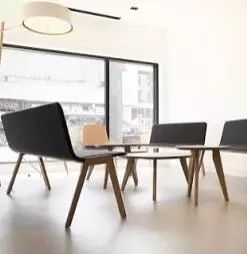 (原始链接: https://mmbiz.qpic.cn/mmbiz_jpg/XA8n2XaESnTM448oYZGdVwfZg9xEA9ShTAlafW5z252fibx3exGhrmmP4UqET8eFKQYQJciaUcyf6eT8mnlbMXGg/640?wx_fmt=jpeg)
- 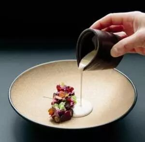 (原始链接: https://mmbiz.qpic.cn/mmbiz_jpg/XA8n2XaESnTM448oYZGdVwfZg9xEA9ShVcjnyysAdgFPVct2vLNfRKaTFTuTMfibPoC12JIvMj6esxvLRaribs0A/640?wx_fmt=jpeg)
- 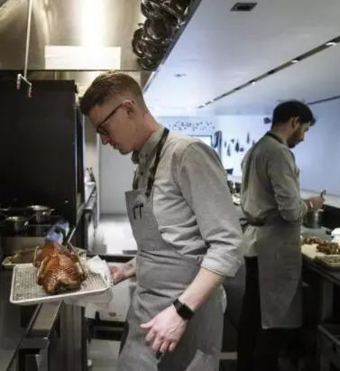 (原始链接: https://mmbiz.qpic.cn/mmbiz_jpg/XA8n2XaESnTM448oYZGdVwfZg9xEA9ShTj1gmeu2M2af3LYO7UibrFiaFnLj27QUeywkTLzPXo2HUDPYHLtaib5TA/640?wx_fmt=jpeg)
-  (原始链接: https://mmbiz.qpic.cn/mmbiz_png/XA8n2XaESnTM448oYZGdVwfZg9xEA9ShqVRTHQU25mH9Z0D3UEySRVGH30KT7JYMBuuKgVkV1RpeoYqFOMgNYw/640?wx_fmt=png)
- 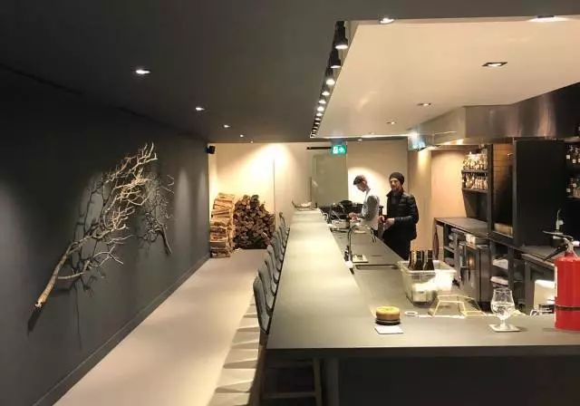 (原始链接: https://mmbiz.qpic.cn/mmbiz_jpg/XA8n2XaESnTM448oYZGdVwfZg9xEA9ShNepzXcHMLf9SqPbibYCgOmvgSLJRyY1sR3iaYicLQk6DD1Iv9cteblafQ/640?wx_fmt=jpeg)
-  (原始链接: https://mmbiz.qpic.cn/mmbiz_png/XA8n2XaESnTM448oYZGdVwfZg9xEA9ShoBKYN4MV2hcIt0WlluQ9oZHVHKUEiaJRuAHNnIGEswbCccCoibSVTpsw/640?wx_fmt=png)
-  (原始链接: https://mmbiz.qpic.cn/mmbiz_gif/XA8n2XaESnTM448oYZGdVwfZg9xEA9ShENQ9PoQaHMYSicrtNuGUCvIYDNEJBOklsPjibGb4JXz0MPWTHHicgfIVw/640?wx_fmt=gif)
-  (原始链接: https://mmbiz.qpic.cn/mmbiz_png/XA8n2XaESnTM448oYZGdVwfZg9xEA9ShqVRTHQU25mH9Z0D3UEySRVGH30KT7JYMBuuKgVkV1RpeoYqFOMgNYw/640?wx_fmt=png)
- 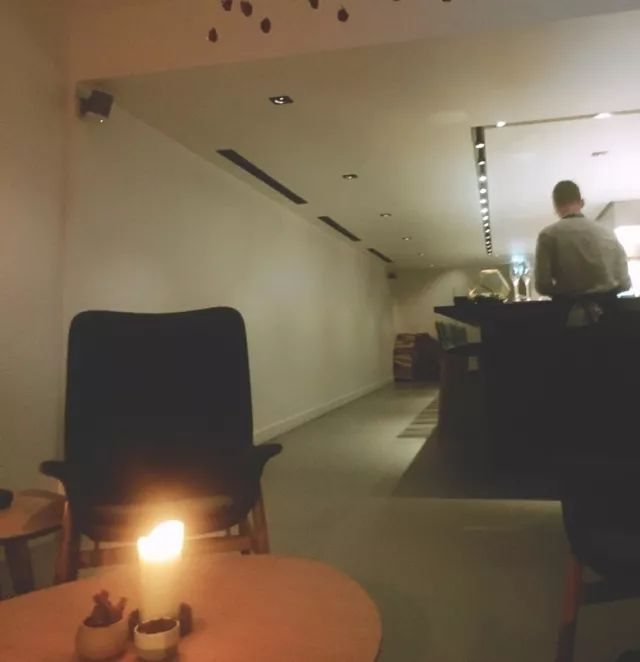 (原始链接: https://mmbiz.qpic.cn/mmbiz_jpg/XA8n2XaESnTM448oYZGdVwfZg9xEA9ShCYMwkglNVFdkmZj17mUf8jiaMUOuPy2zB9RXvtZyg6PMucqPNmia3AcQ/640?wx_fmt=jpeg)
-  (原始链接: https://mmbiz.qpic.cn/mmbiz_png/XA8n2XaESnTM448oYZGdVwfZg9xEA9ShoBKYN4MV2hcIt0WlluQ9oZHVHKUEiaJRuAHNnIGEswbCccCoibSVTpsw/640?wx_fmt=png)
-  (原始链接: https://mmbiz.qpic.cn/mmbiz_png/XA8n2XaESnTM448oYZGdVwfZg9xEA9ShqVRTHQU25mH9Z0D3UEySRVGH30KT7JYMBuuKgVkV1RpeoYqFOMgNYw/640?wx_fmt=png)
- 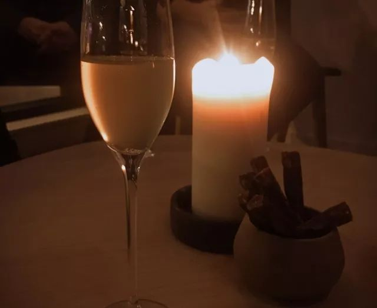 (原始链接: https://mmbiz.qpic.cn/mmbiz_jpg/XA8n2XaESnTM448oYZGdVwfZg9xEA9Sh3RBiasEXbBWQiaRk3OicWP4iaxV5Q5JMIjANLtxoOyPWCuMYdu6mjgeR8A/640?wx_fmt=jpeg)
-  (原始链接: https://mmbiz.qpic.cn/mmbiz_png/XA8n2XaESnTM448oYZGdVwfZg9xEA9ShoBKYN4MV2hcIt0WlluQ9oZHVHKUEiaJRuAHNnIGEswbCccCoibSVTpsw/640?wx_fmt=png)
-  (原始链接: https://mmbiz.qpic.cn/mmbiz_png/XA8n2XaESnTM448oYZGdVwfZg9xEA9ShqVRTHQU25mH9Z0D3UEySRVGH30KT7JYMBuuKgVkV1RpeoYqFOMgNYw/640?wx_fmt=png)
- 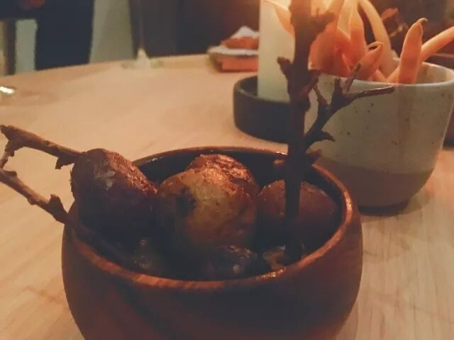 (原始链接: https://mmbiz.qpic.cn/mmbiz_jpg/XA8n2XaESnTM448oYZGdVwfZg9xEA9ShMTvkOJlMpecnbZuOtRia5eHh9cY4XLLXZiaWsGgdtVSb6NJibhJfZZ5aA/640?wx_fmt=jpeg)
-  (原始链接: https://mmbiz.qpic.cn/mmbiz_png/XA8n2XaESnTM448oYZGdVwfZg9xEA9ShoBKYN4MV2hcIt0WlluQ9oZHVHKUEiaJRuAHNnIGEswbCccCoibSVTpsw/640?wx_fmt=png)
-  (原始链接: https://mmbiz.qpic.cn/mmbiz_png/XA8n2XaESnTM448oYZGdVwfZg9xEA9ShqVRTHQU25mH9Z0D3UEySRVGH30KT7JYMBuuKgVkV1RpeoYqFOMgNYw/640?wx_fmt=png)
- 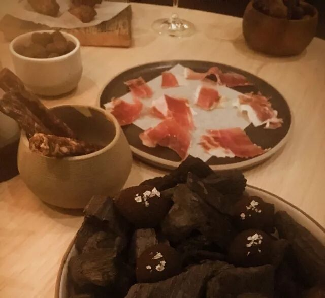 (原始链接: https://mmbiz.qpic.cn/mmbiz_jpg/XA8n2XaESnTM448oYZGdVwfZg9xEA9ShxiblXhIibaGzo5HWG8tYAVD9jy1QJiaB9RhAAGZhhHSFl4SQggkicXNnaA/640?wx_fmt=jpeg)
-  (原始链接: https://mmbiz.qpic.cn/mmbiz_png/XA8n2XaESnTM448oYZGdVwfZg9xEA9ShoBKYN4MV2hcIt0WlluQ9oZHVHKUEiaJRuAHNnIGEswbCccCoibSVTpsw/640?wx_fmt=png)
-  (原始链接: https://mmbiz.qpic.cn/mmbiz_png/XA8n2XaESnTM448oYZGdVwfZg9xEA9ShqVRTHQU25mH9Z0D3UEySRVGH30KT7JYMBuuKgVkV1RpeoYqFOMgNYw/640?wx_fmt=png)
- 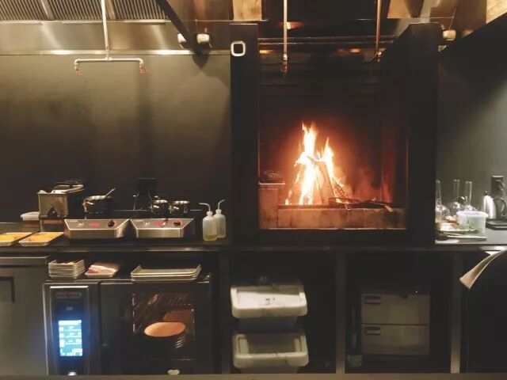 (原始链接: https://mmbiz.qpic.cn/mmbiz_jpg/XA8n2XaESnTM448oYZGdVwfZg9xEA9Shck57FqnmlnUGytKwWZsZMoe8uiavX76YWG8fWlnekfWqzQ87fx80vxA/640?wx_fmt=jpeg)
-  (原始链接: https://mmbiz.qpic.cn/mmbiz_png/XA8n2XaESnTM448oYZGdVwfZg9xEA9ShoBKYN4MV2hcIt0WlluQ9oZHVHKUEiaJRuAHNnIGEswbCccCoibSVTpsw/640?wx_fmt=png)
-  (原始链接: https://mmbiz.qpic.cn/mmbiz_png/XA8n2XaESnTM448oYZGdVwfZg9xEA9ShqVRTHQU25mH9Z0D3UEySRVGH30KT7JYMBuuKgVkV1RpeoYqFOMgNYw/640?wx_fmt=png)
- 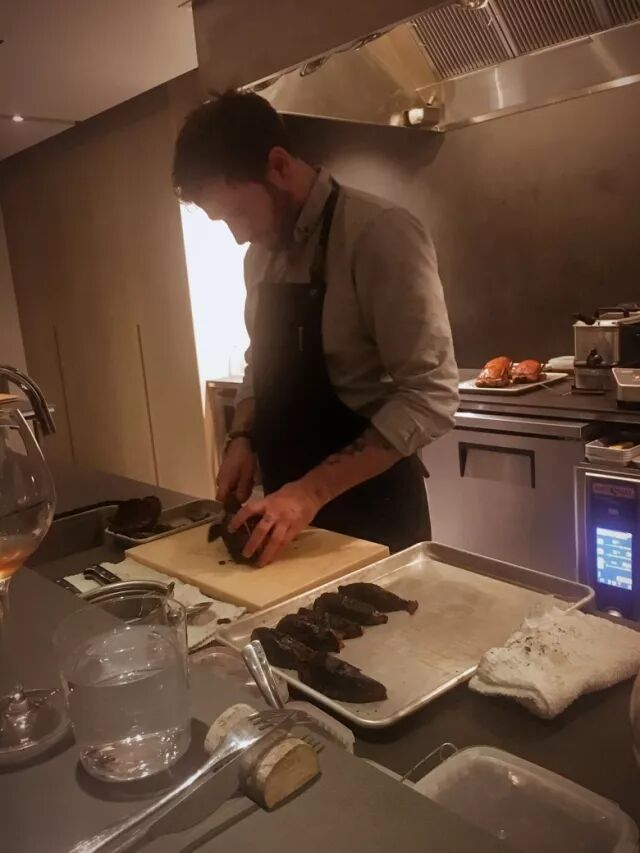 (原始链接: https://mmbiz.qpic.cn/mmbiz_jpg/XA8n2XaESnTM448oYZGdVwfZg9xEA9ShicnickNU3aF7aVApJFBpm145K1UHypYJiazNXrZU6n7ibNVAhViaBTVjXicw/640?wx_fmt=jpeg)
-  (原始链接: https://mmbiz.qpic.cn/mmbiz_png/XA8n2XaESnTM448oYZGdVwfZg9xEA9ShoBKYN4MV2hcIt0WlluQ9oZHVHKUEiaJRuAHNnIGEswbCccCoibSVTpsw/640?wx_fmt=png)
-  (原始链接: https://mmbiz.qpic.cn/mmbiz_png/XA8n2XaESnTM448oYZGdVwfZg9xEA9ShqVRTHQU25mH9Z0D3UEySRVGH30KT7JYMBuuKgVkV1RpeoYqFOMgNYw/640?wx_fmt=png)
- 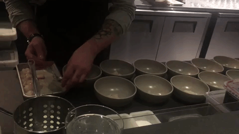 (原始链接: https://mmbiz.qpic.cn/mmbiz_gif/XA8n2XaESnTM448oYZGdVwfZg9xEA9ShgiclgHMDLNFDGZCyzYtlV0j3fpIzmj2FiaoyrgwT0MSXQxoRZoS8Tlww/640?wx_fmt=gif)
-  (原始链接: https://mmbiz.qpic.cn/mmbiz_png/XA8n2XaESnTM448oYZGdVwfZg9xEA9ShoBKYN4MV2hcIt0WlluQ9oZHVHKUEiaJRuAHNnIGEswbCccCoibSVTpsw/640?wx_fmt=png)
-  (原始链接: https://mmbiz.qpic.cn/mmbiz_png/XA8n2XaESnTM448oYZGdVwfZg9xEA9ShqVRTHQU25mH9Z0D3UEySRVGH30KT7JYMBuuKgVkV1RpeoYqFOMgNYw/640?wx_fmt=png)
- 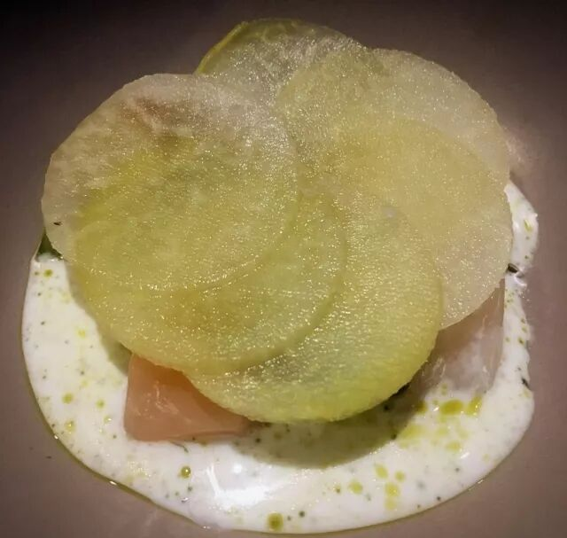 (原始链接: https://mmbiz.qpic.cn/mmbiz_jpg/XA8n2XaESnTM448oYZGdVwfZg9xEA9Shd8VZZ1YJpQ6jW50LJdj7ZibYuNUK1iaTmf86bZSvIiclxIS1c7rUicaLUg/640?wx_fmt=jpeg)
-  (原始链接: https://mmbiz.qpic.cn/mmbiz_png/XA8n2XaESnTM448oYZGdVwfZg9xEA9ShoBKYN4MV2hcIt0WlluQ9oZHVHKUEiaJRuAHNnIGEswbCccCoibSVTpsw/640?wx_fmt=png)
-  (原始链接: https://mmbiz.qpic.cn/mmbiz_png/XA8n2XaESnTM448oYZGdVwfZg9xEA9ShqVRTHQU25mH9Z0D3UEySRVGH30KT7JYMBuuKgVkV1RpeoYqFOMgNYw/640?wx_fmt=png)
- 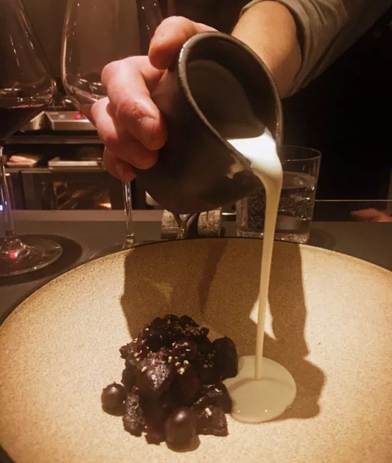 (原始链接: https://mmbiz.qpic.cn/mmbiz_jpg/XA8n2XaESnTM448oYZGdVwfZg9xEA9ShYAMJvVskUFZABOp1nicAialboEOww7WSCPvG98l78LFlZxXl8nV8gzfw/640?wx_fmt=jpeg)
-  (原始链接: https://mmbiz.qpic.cn/mmbiz_png/XA8n2XaESnTM448oYZGdVwfZg9xEA9ShoBKYN4MV2hcIt0WlluQ9oZHVHKUEiaJRuAHNnIGEswbCccCoibSVTpsw/640?wx_fmt=png)
-  (原始链接: https://mmbiz.qpic.cn/mmbiz_png/XA8n2XaESnTM448oYZGdVwfZg9xEA9ShqVRTHQU25mH9Z0D3UEySRVGH30KT7JYMBuuKgVkV1RpeoYqFOMgNYw/640?wx_fmt=png)
- 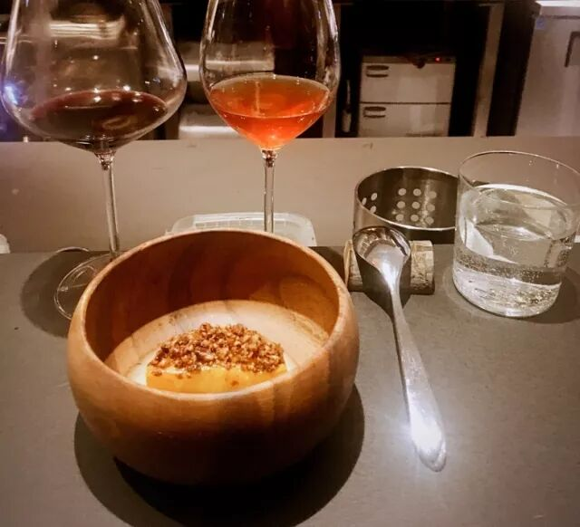 (原始链接: https://mmbiz.qpic.cn/mmbiz_jpg/XA8n2XaESnTM448oYZGdVwfZg9xEA9ShH7rCXOicT0ARX3ticfeJlcH3xoJuavarhJa2cBGE4Vg9IOQicgNrolLOg/640?wx_fmt=jpeg)
-  (原始链接: https://mmbiz.qpic.cn/mmbiz_png/XA8n2XaESnTM448oYZGdVwfZg9xEA9ShoBKYN4MV2hcIt0WlluQ9oZHVHKUEiaJRuAHNnIGEswbCccCoibSVTpsw/640?wx_fmt=png)
-  (原始链接: https://mmbiz.qpic.cn/mmbiz_png/XA8n2XaESnTM448oYZGdVwfZg9xEA9ShqVRTHQU25mH9Z0D3UEySRVGH30KT7JYMBuuKgVkV1RpeoYqFOMgNYw/640?wx_fmt=png)
- 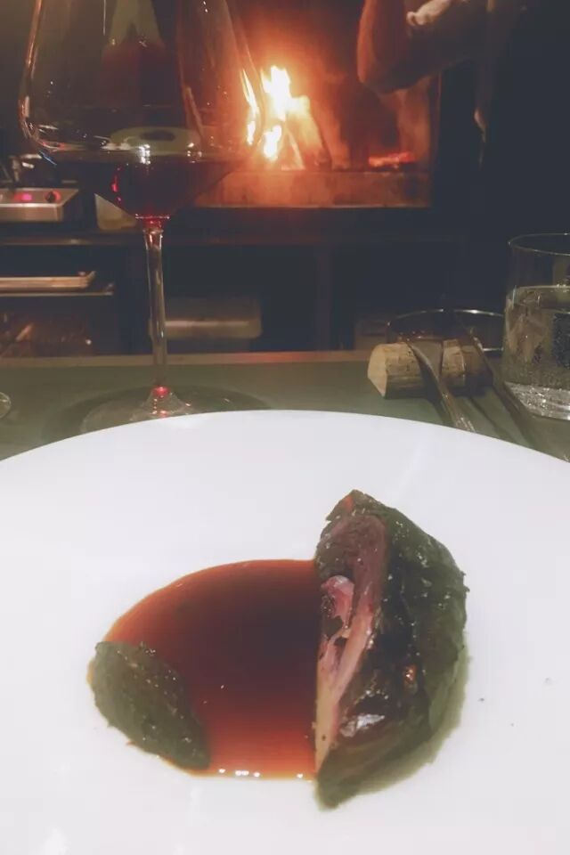 (原始链接: https://mmbiz.qpic.cn/mmbiz_jpg/XA8n2XaESnTM448oYZGdVwfZg9xEA9ShibxwqVicGN0U4IqfXOG1OGbibSOrHoHvl5EmaJIzMXSYwprTXPpv5S2Yg/640?wx_fmt=jpeg)
-  (原始链接: https://mmbiz.qpic.cn/mmbiz_png/XA8n2XaESnTM448oYZGdVwfZg9xEA9ShoBKYN4MV2hcIt0WlluQ9oZHVHKUEiaJRuAHNnIGEswbCccCoibSVTpsw/640?wx_fmt=png)
-  (原始链接: https://mmbiz.qpic.cn/mmbiz_png/XA8n2XaESnTM448oYZGdVwfZg9xEA9ShqVRTHQU25mH9Z0D3UEySRVGH30KT7JYMBuuKgVkV1RpeoYqFOMgNYw/640?wx_fmt=png)
- 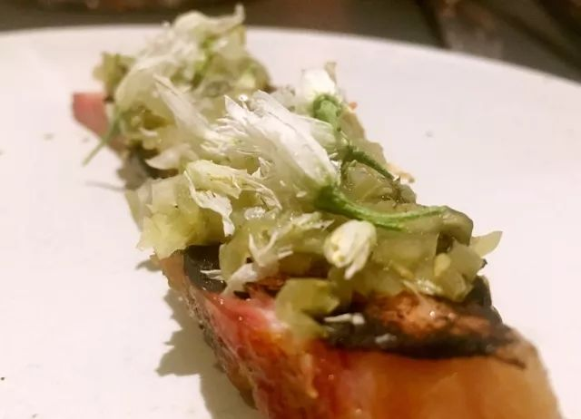 (原始链接: https://mmbiz.qpic.cn/mmbiz_jpg/XA8n2XaESnTM448oYZGdVwfZg9xEA9ShkibCeRZSwK0XR70icIVbLScKKCC7S6jn2ukqUMqYV4eribgTURyuCK7Tw/640?wx_fmt=jpeg)
-  (原始链接: https://mmbiz.qpic.cn/mmbiz_png/XA8n2XaESnTM448oYZGdVwfZg9xEA9ShoBKYN4MV2hcIt0WlluQ9oZHVHKUEiaJRuAHNnIGEswbCccCoibSVTpsw/640?wx_fmt=png)
-  (原始链接: https://mmbiz.qpic.cn/mmbiz_png/XA8n2XaESnTM448oYZGdVwfZg9xEA9ShqVRTHQU25mH9Z0D3UEySRVGH30KT7JYMBuuKgVkV1RpeoYqFOMgNYw/640?wx_fmt=png)
- 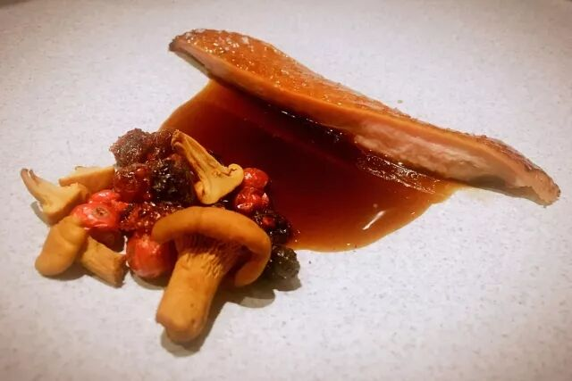 (原始链接: https://mmbiz.qpic.cn/mmbiz_jpg/XA8n2XaESnTM448oYZGdVwfZg9xEA9SheiaR5pTUSyQFMX7VLuibic5vZIQcatyy0SZRKpn5P1vic7KW7rTT4qws5w/640?wx_fmt=jpeg)
-  (原始链接: https://mmbiz.qpic.cn/mmbiz_png/XA8n2XaESnTM448oYZGdVwfZg9xEA9ShoBKYN4MV2hcIt0WlluQ9oZHVHKUEiaJRuAHNnIGEswbCccCoibSVTpsw/640?wx_fmt=png)
-  (原始链接: https://mmbiz.qpic.cn/mmbiz_png/XA8n2XaESnTM448oYZGdVwfZg9xEA9ShqVRTHQU25mH9Z0D3UEySRVGH30KT7JYMBuuKgVkV1RpeoYqFOMgNYw/640?wx_fmt=png)
- 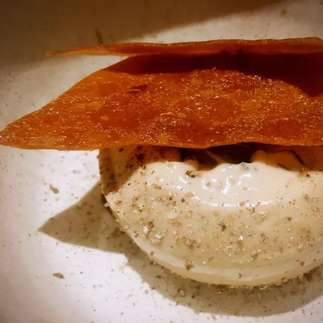 (原始链接: https://mmbiz.qpic.cn/mmbiz_jpg/XA8n2XaESnTM448oYZGdVwfZg9xEA9ShKjoqXpA1qu5qyhJHmeHFjxxgMlicZms8u9ydanwH5qXsyib1esraykYw/640?wx_fmt=jpeg)
-  (原始链接: https://mmbiz.qpic.cn/mmbiz_png/XA8n2XaESnTM448oYZGdVwfZg9xEA9ShoBKYN4MV2hcIt0WlluQ9oZHVHKUEiaJRuAHNnIGEswbCccCoibSVTpsw/640?wx_fmt=png)
-  (原始链接: https://mmbiz.qpic.cn/mmbiz_png/XA8n2XaESnTM448oYZGdVwfZg9xEA9ShqVRTHQU25mH9Z0D3UEySRVGH30KT7JYMBuuKgVkV1RpeoYqFOMgNYw/640?wx_fmt=png)
- 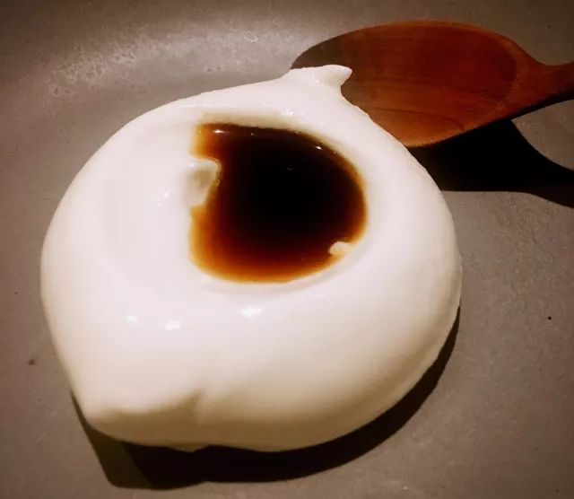 (原始链接: https://mmbiz.qpic.cn/mmbiz_jpg/XA8n2XaESnTM448oYZGdVwfZg9xEA9ShS0zjlEO1zwHpiaZNQWoJ1Bat2p4XYcyhBKtNiaXHssWsJcyAonDaxBOg/640?wx_fmt=jpeg)
-  (原始链接: https://mmbiz.qpic.cn/mmbiz_png/XA8n2XaESnTM448oYZGdVwfZg9xEA9ShoBKYN4MV2hcIt0WlluQ9oZHVHKUEiaJRuAHNnIGEswbCccCoibSVTpsw/640?wx_fmt=png)
-  (原始链接: https://mmbiz.qpic.cn/mmbiz_png/XA8n2XaESnTM448oYZGdVwfZg9xEA9ShqVRTHQU25mH9Z0D3UEySRVGH30KT7JYMBuuKgVkV1RpeoYqFOMgNYw/640?wx_fmt=png)
- 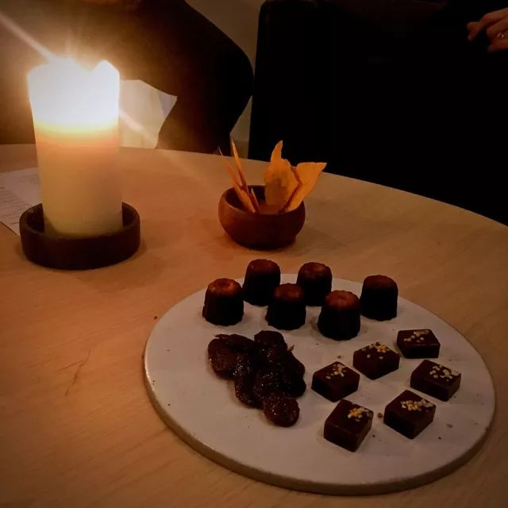 (原始链接: https://mmbiz.qpic.cn/mmbiz_jpg/XA8n2XaESnTM448oYZGdVwfZg9xEA9ShAiaCMDs2msZWGdpNR3Nia4ZoiaSrdjmDXTZUyq64Cws30gnKaPibNbI77Q/640?wx_fmt=jpeg)
-  (原始链接: https://mmbiz.qpic.cn/mmbiz_png/XA8n2XaESnTM448oYZGdVwfZg9xEA9ShoBKYN4MV2hcIt0WlluQ9oZHVHKUEiaJRuAHNnIGEswbCccCoibSVTpsw/640?wx_fmt=png)
-  (原始链接: https://mmbiz.qpic.cn/mmbiz_png/XA8n2XaESnTM448oYZGdVwfZg9xEA9ShqVRTHQU25mH9Z0D3UEySRVGH30KT7JYMBuuKgVkV1RpeoYqFOMgNYw/640?wx_fmt=png)
- 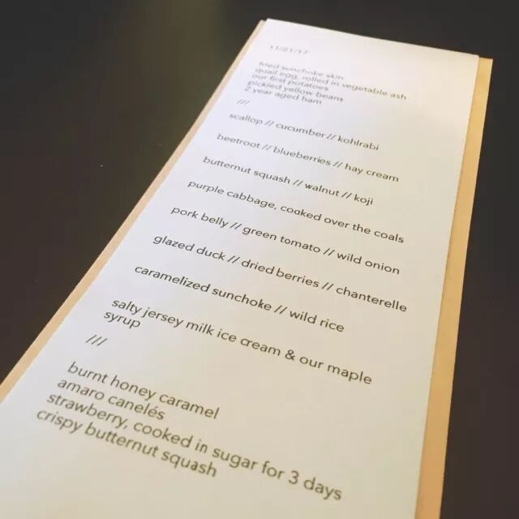 (原始链接: https://mmbiz.qpic.cn/mmbiz_jpg/XA8n2XaESnTM448oYZGdVwfZg9xEA9ShKTOhO17nI0ghAq7N4dicpnmtQictBFFKbXFCRGN6NIgQyvLLRZicEzx6w/640?wx_fmt=jpeg)
-  (原始链接: https://mmbiz.qpic.cn/mmbiz_png/XA8n2XaESnTM448oYZGdVwfZg9xEA9ShoBKYN4MV2hcIt0WlluQ9oZHVHKUEiaJRuAHNnIGEswbCccCoibSVTpsw/640?wx_fmt=png)
-  (原始链接: https://mmbiz.qpic.cn/mmbiz_png/XA8n2XaESnTM448oYZGdVwfZg9xEA9ShqVRTHQU25mH9Z0D3UEySRVGH30KT7JYMBuuKgVkV1RpeoYqFOMgNYw/640?wx_fmt=png)
- 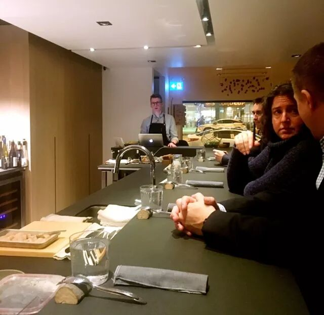 (原始链接: https://mmbiz.qpic.cn/mmbiz_jpg/XA8n2XaESnTM448oYZGdVwfZg9xEA9ShSHU9RJL7icnbtibjF7waD36qk3JtqByG09SfyuibzibAib4brKibaE7nWoVg/640?wx_fmt=jpeg)
-  (原始链接: https://mmbiz.qpic.cn/mmbiz_png/XA8n2XaESnTM448oYZGdVwfZg9xEA9ShoBKYN4MV2hcIt0WlluQ9oZHVHKUEiaJRuAHNnIGEswbCccCoibSVTpsw/640?wx_fmt=png)
-  (原始链接: https://mmbiz.qpic.cn/mmbiz_png/XA8n2XaESnTM448oYZGdVwfZg9xEA9ShqVRTHQU25mH9Z0D3UEySRVGH30KT7JYMBuuKgVkV1RpeoYqFOMgNYw/640?wx_fmt=png)
- 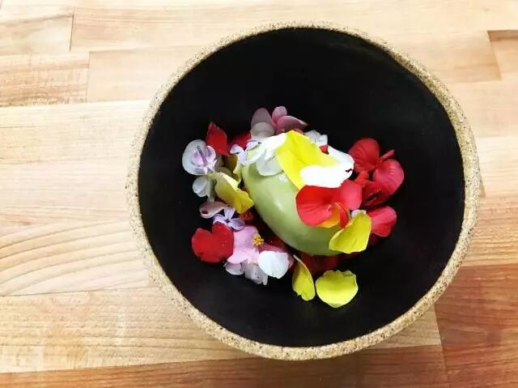 (原始链接: https://mmbiz.qpic.cn/mmbiz_jpg/XA8n2XaESnTM448oYZGdVwfZg9xEA9ShMog5rzw9a0xdIpiaBhLOq7pkDaMaqpgrzatb6639XZicsohwFnv7YVBA/640?wx_fmt=jpeg)
-  (原始链接: https://mmbiz.qpic.cn/mmbiz_png/XA8n2XaESnTM448oYZGdVwfZg9xEA9ShoBKYN4MV2hcIt0WlluQ9oZHVHKUEiaJRuAHNnIGEswbCccCoibSVTpsw/640?wx_fmt=png)
-  (原始链接: https://mmbiz.qpic.cn/mmbiz_png/XA8n2XaESnTM448oYZGdVwfZg9xEA9ShqVRTHQU25mH9Z0D3UEySRVGH30KT7JYMBuuKgVkV1RpeoYqFOMgNYw/640?wx_fmt=png)
-  (原始链接: https://mmbiz.qpic.cn/mmbiz_gif/XA8n2XaESnTM448oYZGdVwfZg9xEA9SheykWfI4xS9L82ngN4uR5aft3WOHOU2pYtelxS9dyd0m6yHE0yic5z7Q/640?wx_fmt=gif)
-  (原始链接: https://mmbiz.qpic.cn/mmbiz_png/XA8n2XaESnTM448oYZGdVwfZg9xEA9ShoBKYN4MV2hcIt0WlluQ9oZHVHKUEiaJRuAHNnIGEswbCccCoibSVTpsw/640?wx_fmt=png)
-  (原始链接: https://mmbiz.qpic.cn/mmbiz_png/XA8n2XaESnTM448oYZGdVwfZg9xEA9ShqVRTHQU25mH9Z0D3UEySRVGH30KT7JYMBuuKgVkV1RpeoYqFOMgNYw/640?wx_fmt=png)
-  (原始链接: https://mmbiz.qpic.cn/mmbiz_jpg/XA8n2XaESnTM448oYZGdVwfZg9xEA9ShiamX8zQ5ghI9IfE5MpibQNu3AoHJJ0F4lTLIkucmxB2IhXM2JlKduibdQ/640?wx_fmt=jpeg)
-  (原始链接: https://mmbiz.qpic.cn/mmbiz_png/XA8n2XaESnTM448oYZGdVwfZg9xEA9ShoBKYN4MV2hcIt0WlluQ9oZHVHKUEiaJRuAHNnIGEswbCccCoibSVTpsw/640?wx_fmt=png)
- 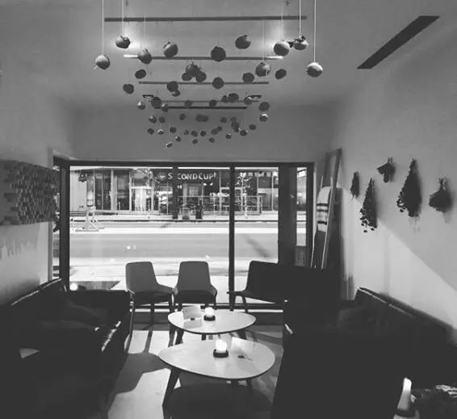 (原始链接: https://mmbiz.qpic.cn/mmbiz_jpg/XA8n2XaESnTM448oYZGdVwfZg9xEA9ShBOia1FicCwKM7EFsuchVlIKqvrlIyq5HKRPTrMMd7sfz1ZfCIuqeVjaA/640?wx_fmt=jpeg)
-  (原始链接: https://mmbiz.qpic.cn/mmbiz_png/XA8n2XaESnTM448oYZGdVwfZg9xEA9ShqVRTHQU25mH9Z0D3UEySRVGH30KT7JYMBuuKgVkV1RpeoYqFOMgNYw/640?wx_fmt=png)
- 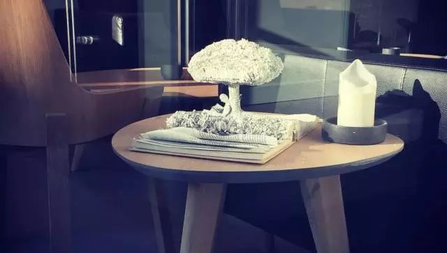 (原始链接: https://mmbiz.qpic.cn/mmbiz_jpg/XA8n2XaESnTM448oYZGdVwfZg9xEA9Sh9rmibvbmp9QibOnZiaVkovzFIILpmswT8q6KlQnicgd6qgeJwicibm3U0WDg/640?wx_fmt=jpeg)
-  (原始链接: https://mmbiz.qpic.cn/mmbiz_png/XA8n2XaESnTM448oYZGdVwfZg9xEA9ShoBKYN4MV2hcIt0WlluQ9oZHVHKUEiaJRuAHNnIGEswbCccCoibSVTpsw/640?wx_fmt=png)
- 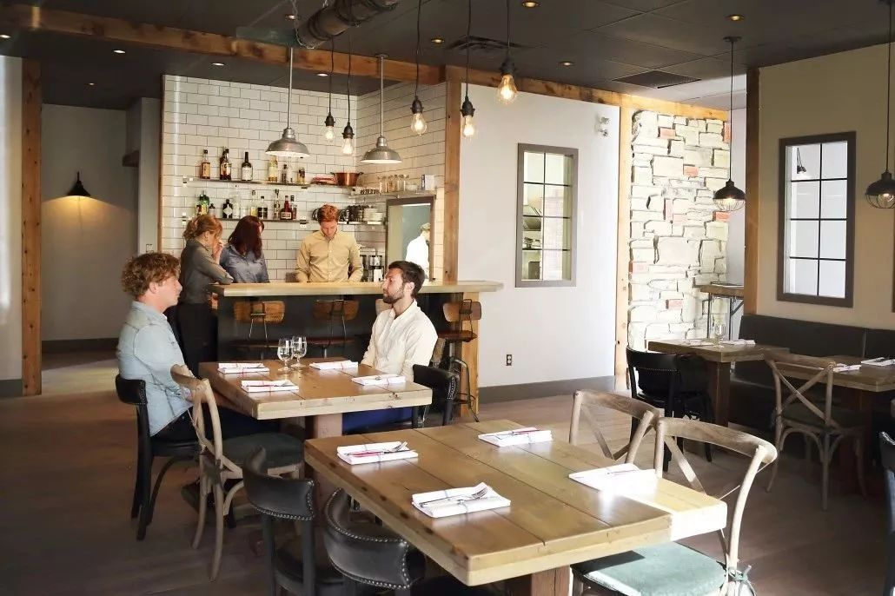 (原始链接: https://mmbiz.qpic.cn/mmbiz_jpg/XA8n2XaESnTM448oYZGdVwfZg9xEA9ShZvXx8tSTGTHuLjn0N6Jwn6zC84blpUylXp8WEyCF5Bxkviay65oPYrw/640?wx_fmt=jpeg)
- 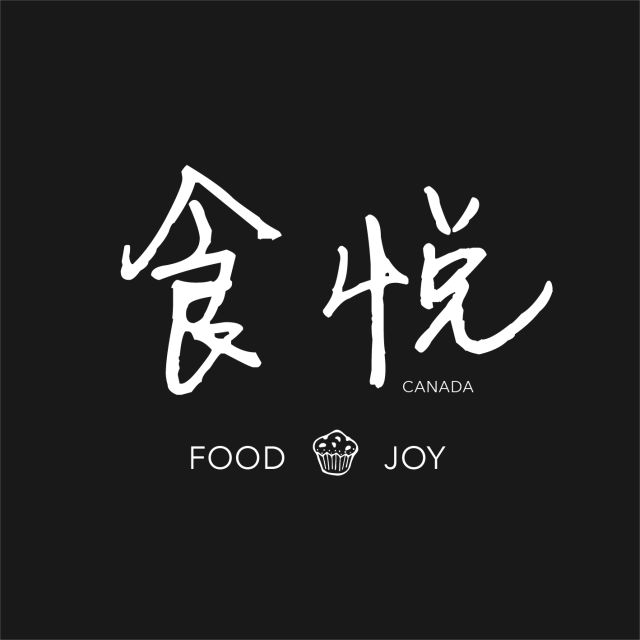 (原始链接: https://mmbiz.qpic.cn/mmbiz_png/XA8n2XaESnTM448oYZGdVwfZg9xEA9ShacqguicicOU6NFMjTZN9EhTApTbJ0tY8gS96fojKcymnB28FdJKnZTaw/640?wx_fmt=png)
-  (原始链接: https://mmbiz.qpic.cn/mmbiz_jpg/XA8n2XaESnTM448oYZGdVwfZg9xEA9ShdQEiaiaY68tGa2scx7B9qbQ5vsrTRsZk3aPx5laJSEBOf06vM4FuibdMg/640?wx_fmt=jpeg)
