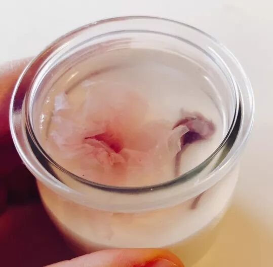
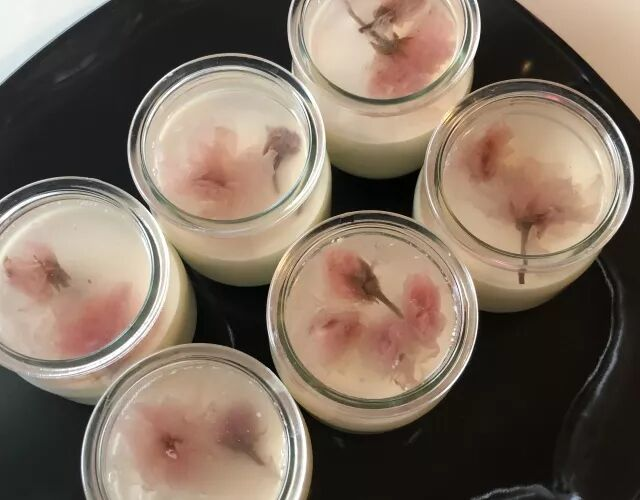
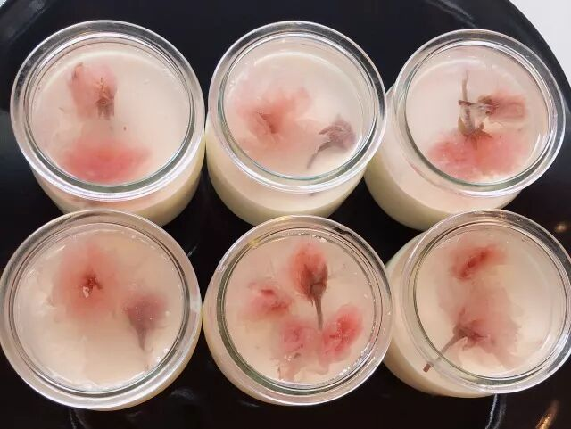
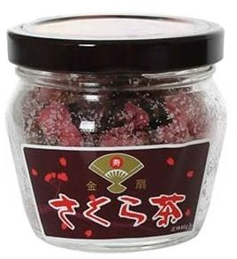
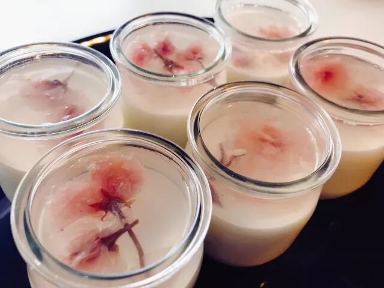
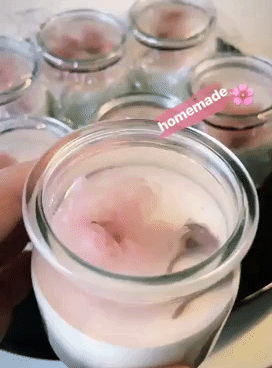

# 无标题

**链接地址:** http://mp.weixin.qq.com/s?__biz=MzI0MDQ0ODI0Ng==&mid=2247485699&idx=1&sn=9540147968c1060435a6e11ecf28146e&chksm=e91bee9ade6c678c4e1e69b4d87f0808727cdb643d53ad100f230009e6fd6c5fec2cf799d996&mpshare=1&scene=2&srcid=04112QhRIOVnlC1kFqu82OQa#rd
**作者:** 心灵手巧的蘑菇
**获取时间:** 2025/8/28 22:06:43
**图片数量:** 26

---

## 原始HTML内容

<section style="background-color: rgb(255, 255, 255);box-sizing: border-box;"><section class="Powered-by-XIUMI V5" style="box-sizing: border-box;" powered-by="xiumi.us"><section class="" style="margin: 10px 0%;box-sizing: border-box;"><section class="" style="display: inline-block;width: 100%;vertical-align: top;background-position: 300% 16.782%;background-repeat: repeat;background-size: 100.078%;background-attachment: scroll;line-height: 1.6;letter-spacing: 0px;padding: 10px;background-image: url(&quot;https://mmbiz.qpic.cn/mmbiz_gif/XA8n2XaESnSuhJnO1l0fa0Z4BicOvXewnYNFTZUlwbBhgdEDlstGQRSOxduO25J7YvOIfiaV5DpNavhgRh4jcMGw/640?wx_fmt=gif&quot;);box-sizing: border-box;"><section class="Powered-by-XIUMI V5" style="box-sizing: border-box;" powered-by="xiumi.us"><section class="" style="text-align: center;margin-right: 0%;margin-left: 0%;opacity: 0.8;box-sizing: border-box;"><section class="" style="max-width: 100%;vertical-align: middle;display: inline-block;overflow: hidden !important;box-sizing: border-box;"></section></section></section><section class="Powered-by-XIUMI V5" style="box-sizing: border-box;" powered-by="xiumi.us"><section class="" style="margin: -20px 0% 10px;transform: translate3d(-1px, 0px, 0px);-webkit-transform: translate3d(-1px, 0px, 0px);-moz-transform: translate3d(-1px, 0px, 0px);-o-transform: translate3d(-1px, 0px, 0px);box-sizing: border-box;"><section class="" style="max-width: 100%;vertical-align: middle;display: inline-block;width: 45%;overflow: hidden !important;box-sizing: border-box;"></section></section></section><section class="Powered-by-XIUMI V5" style="box-sizing: border-box;" powered-by="xiumi.us"><section class="" style="box-sizing: border-box;"><section class="tn-yzk-fuid-text-88443-1523392617105" style="color: rgb(193, 120, 117);text-align: justify;font-size: 14px;line-height: 1.8;letter-spacing: 2.5px;box-sizing: border-box;">
三月初四月末，是传统的樱花赏花季。然而寒冷的“挨得猛冻”似乎很不给面子。朋友圈已被日本和温哥华的小伙伴们刷屏，看她们站在春日灿烂的樱花树下拍照留念真是羡慕。爱城的气候让观赏樱花成为一种奢望。然而，想要把樱花吃进嘴里，食悦今天就可以满足你！这次不仅带来最简单详尽的Q萌樱花布丁的Recipe分享，更有春日福利送出哦~
</section></section></section></section></section></section><section class="Powered-by-XIUMI V5" style="box-sizing: border-box;" powered-by="xiumi.us"><section class="" style="text-align: center;margin-top: 10px;margin-bottom: 10px;box-sizing: border-box;"><section class="" style="max-width: 100%;vertical-align: middle;display: inline-block;width: 10%;overflow: hidden !important;box-sizing: border-box;"></section></section></section><section class="Powered-by-XIUMI V5" style="box-sizing: border-box;" powered-by="xiumi.us"><section class="" style="margin: 15px 0%;text-align: center;box-sizing: border-box;"><section class="" style="box-sizing: border-box;"><section style="float: right;width: 20px;height: 20px;background-color: rgb(249, 174, 165);box-sizing: border-box;"></section><section style="clear: both;box-sizing: border-box;"></section><section style="margin-top: -10px;margin-bottom: -10px;padding-right: 10px;padding-left: 10px;display: inline-block;vertical-align: top;width: 100%;box-sizing: border-box;"><section class="" style="border-width: 2px;border-style: solid;border-color: rgba(255, 255, 255, 0);background-color: rgba(246, 212, 218, 0.58);box-sizing: border-box;"><section class="Powered-by-XIUMI V5" style="box-sizing: border-box;" powered-by="xiumi.us"><section class="" style="margin-right: 0%;margin-left: 0%;box-sizing: border-box;"><section class="" style="max-width: 100%;vertical-align: middle;display: inline-block;border-width: 0px;box-shadow: rgb(0, 0, 0) 0px 0px 0px;overflow: hidden !important;box-sizing: border-box;"></section></section></section></section></section><section style="width: 20px;height: 20px;background-color: rgb(249, 174, 165);box-sizing: border-box;"></section><section style="clear: both;box-sizing: border-box;"></section></section></section></section><section class="Powered-by-XIUMI V5" style="box-sizing: border-box;" powered-by="xiumi.us"><section class="" style="margin-top: 10px;margin-bottom: 10px;text-align: center;box-sizing: border-box;"><section class="" style="display: inline-block;vertical-align: middle;text-align: left;box-sizing: border-box;"><section style="width: 6.5em;box-sizing: border-box;"><section class="" style="max-width: 100%;display: inline-block;overflow: hidden !important;box-sizing: border-box;"></section></section><section class="tn-yzk-fuid-text-10539-1523392612248" style="font-size: 14px;line-height: 2;text-align: center;color: rgb(193, 120, 117);letter-spacing: 2.5px;box-sizing: border-box;">
喏，是不是美的忘记了窗外的温度？
</section><section style="width: 6.5em;margin-left: auto;box-sizing: border-box;"><section class="" style="max-width: 100%;display: inline-block;overflow: hidden !important;box-sizing: border-box;"></section></section></section></section></section><section class="Powered-by-XIUMI V5" style="box-sizing: border-box;" powered-by="xiumi.us"><section class="" style="margin: 15px 0%;text-align: center;box-sizing: border-box;"><section class="" style="box-sizing: border-box;"><section style="width: 20px;height: 20px;background-color: rgb(249, 174, 165);box-sizing: border-box;"></section><section style="clear: both;box-sizing: border-box;"></section><section style="margin-top: -10px;margin-bottom: -10px;padding-right: 10px;padding-left: 10px;display: inline-block;vertical-align: top;width: 100%;box-sizing: border-box;"><section class="" style="border-width: 2px;border-style: solid;border-color: rgba(255, 255, 255, 0);padding: 10px;background-color: rgba(246, 212, 218, 0.58);box-sizing: border-box;"><section class="Powered-by-XIUMI V5" style="box-sizing: border-box;" powered-by="xiumi.us"><section class="" style="margin-right: 0%;margin-bottom: 10px;margin-left: 0%;box-sizing: border-box;"><section class="" style="max-width: 100%;vertical-align: middle;display: inline-block;overflow: hidden !important;box-sizing: border-box;"></section></section></section><section class="Powered-by-XIUMI V5" style="box-sizing: border-box;" powered-by="xiumi.us"><section class="" style="margin: 10px 0%;box-sizing: border-box;"><section class="tn-yzk-fuid-text-95815-1523392608149" style="text-align: justify;font-size: 14px;color: rgb(193, 120, 117);line-height: 1.8;letter-spacing: 2.5px;padding-right: 10px;padding-left: 10px;box-sizing: border-box;">
<strong style="box-sizing: border-box;">樱花布丁</strong>

看起来很可爱对不对？而且意外的十分简单哦！无需烤箱，无需搅拌器！在爱屯这么个物资匮乏的地方也能百分百成功！用最基本的原料和几个小步骤就能做出颜值高味道好的樱花布丁哦！
</section></section></section></section></section><section style="width: 20px;height: 20px;float: right;background-color: rgb(249, 174, 165);box-sizing: border-box;"></section><section style="clear: both;box-sizing: border-box;"></section></section></section></section><section class="Powered-by-XIUMI V5" style="box-sizing: border-box;" powered-by="xiumi.us"><section class="" style="margin: 15px 0%;text-align: center;box-sizing: border-box;"><section class="" style="box-sizing: border-box;"><section style="width: 20px;height: 20px;background-color: rgb(249, 174, 165);box-sizing: border-box;"></section><section style="clear: both;box-sizing: border-box;"></section><section style="margin-top: -10px;margin-bottom: -10px;padding-right: 10px;padding-left: 10px;display: inline-block;vertical-align: top;width: 100%;box-sizing: border-box;"><section class="" style="border-width: 2px;border-style: solid;border-color: rgba(255, 255, 255, 0);padding: 10px;background-color: rgba(246, 212, 218, 0.58);box-sizing: border-box;"><section class="Powered-by-XIUMI V5" style="box-sizing: border-box;" powered-by="xiumi.us"><section class="" style="margin-right: 0%;margin-bottom: 10px;margin-left: 0%;box-sizing: border-box;"><section class="" style="max-width: 100%;vertical-align: middle;display: inline-block;overflow: hidden !important;box-sizing: border-box;"></section></section></section><section class="Powered-by-XIUMI V5" style="box-sizing: border-box;" powered-by="xiumi.us"><section class="" style="margin-top: 10px;margin-right: 0%;margin-left: 0%;box-sizing: border-box;"><section class="tn-yzk-fuid-text-38435-1523392603014" style="font-size: 14px;text-align: justify;line-height: 1.8;padding-right: 10px;padding-left: 10px;color: rgb(164, 114, 112);letter-spacing: 2.5px;box-sizing: border-box;">
<strong style="box-sizing: border-box;">材料</strong>

盐渍樱花，牛奶，whipping cream，吉利丁粉，糖和香草精 （在楼下的Sobeys都可以买到哦！）
</section></section></section><section class="Powered-by-XIUMI V5" style="box-sizing: border-box;" powered-by="xiumi.us"><section class="" style="box-sizing: border-box;text-align: center;"><section class="" style="display: inline-block;width: 100%;vertical-align: top;overflow: hidden;height: 135px;box-sizing: border-box;"><section class="Powered-by-XIUMI V5" style="box-sizing: border-box;" powered-by="xiumi.us"><section class="" style="margin-right: 0%;margin-left: 0%;text-align: left;box-sizing: border-box;"><section class="" style="display: inline-block;border-width: 2px;border-style: solid;border-color: rgb(251, 249, 249);padding: 0.1em 0.3em;color: rgb(62, 62, 62);line-height: 1.5;letter-spacing: 2.5px;font-size: 14px;box-sizing: border-box;">
🛍盐渍樱花购买 - HOMMI日本直邮
</section></section></section><section class="Powered-by-XIUMI V5" style="box-sizing: border-box;" powered-by="xiumi.us"><section class="" style="margin-top: 10px;margin-bottom: 10px;box-sizing: border-box;"><section class="" style="max-width: 100%;vertical-align: middle;display: inline-block;width: 28%;overflow: hidden !important;box-sizing: border-box;"></section></section></section></section><section class="" style="font-size: 0px;box-sizing: border-box;"> </section></section></section></section></section><section style="width: 20px;height: 20px;float: right;background-color: rgb(249, 174, 165);box-sizing: border-box;"></section><section style="clear: both;box-sizing: border-box;"></section></section></section></section><section class="Powered-by-XIUMI V5" style="box-sizing: border-box;" powered-by="xiumi.us"><section class="" style="margin: 15px 0%;text-align: center;box-sizing: border-box;"><section class="" style="box-sizing: border-box;"><section style="width: 20px;height: 20px;background-color: rgb(249, 174, 165);box-sizing: border-box;"></section><section style="clear: both;box-sizing: border-box;"></section><section style="margin-top: -10px;margin-bottom: -10px;padding-right: 10px;padding-left: 10px;display: inline-block;vertical-align: top;width: 100%;box-sizing: border-box;"><section class="" style="border-width: 2px;border-style: solid;border-color: rgba(255, 255, 255, 0);padding: 10px;background-color: rgba(246, 212, 218, 0.58);box-sizing: border-box;"><section class="Powered-by-XIUMI V5" style="box-sizing: border-box;" powered-by="xiumi.us"><section class="" style="margin-right: 0%;margin-bottom: 10px;margin-left: 0%;box-sizing: border-box;"><section class="" style="max-width: 100%;vertical-align: middle;display: inline-block;overflow: hidden !important;box-sizing: border-box;"></section></section></section><section class="Powered-by-XIUMI V5" style="box-sizing: border-box;" powered-by="xiumi.us"><section class="" style="box-sizing: border-box;"><section class="tn-yzk-fuid-text-11751-1523392587603" style="text-align: justify;font-size: 14px;color: rgb(193, 120, 117);line-height: 1.8;letter-spacing: 2.5px;box-sizing: border-box;">
<strong style="box-sizing: border-box;">手动开花！</strong>

☑180ml奶+5/8tsp吉利丁粉，让她们安静地和睦相处10分钟。

☑ 加热到吉利丁粉溶解。不要烧到沸腾哦！关火，搅搅~ 

☑加入1/2tsp香草精，4tsp糖，2cup whipping cream。再搅搅~

☑锅放冰水里迅速降温到10摄氏度。

☑装瓶。冷藏4个小时以上。奶冻部分就做好啦。

☑用凉水过一遍盐渍樱花抖掉盐。小火煮开水，冒小泡泡就得关火，抓着花梗，旋转跳跃我不停歇~看！开花了！

☑混合1/2tsp糖+1/2tsp吉利丁粉+1cup水。

☑&nbsp;轻轻倒入奶冻上面，放入樱花。冷藏四小时以上。就可以享受樱花在舌尖的绽放啦~
</section></section></section></section></section><section style="width: 20px;height: 20px;float: right;background-color: rgb(249, 174, 165);box-sizing: border-box;"></section><section style="clear: both;box-sizing: border-box;"></section></section></section></section><section class="Powered-by-XIUMI V5" style="box-sizing: border-box;" powered-by="xiumi.us"><section class="" style="margin: 15px 0%;text-align: center;box-sizing: border-box;"><section class="" style="box-sizing: border-box;"><section style="width: 20px;height: 20px;background-color: rgb(249, 174, 165);box-sizing: border-box;"></section><section style="clear: both;box-sizing: border-box;"></section><section style="margin-top: -10px;margin-bottom: -10px;padding-right: 10px;padding-left: 10px;display: inline-block;vertical-align: top;width: 100%;box-sizing: border-box;"><section class="" style="border-width: 2px;border-style: solid;border-color: rgba(255, 255, 255, 0);padding: 10px;background-color: rgba(246, 212, 218, 0.58);box-sizing: border-box;"><section class="Powered-by-XIUMI V5" style="box-sizing: border-box;" powered-by="xiumi.us"><section class="" style="margin-right: 0%;margin-bottom: 10px;margin-left: 0%;box-sizing: border-box;"><section class="" style="max-width: 100%;vertical-align: middle;display: inline-block;overflow: hidden !important;box-sizing: border-box;"></section></section></section><section class="Powered-by-XIUMI V5" style="box-sizing: border-box;" powered-by="xiumi.us"><section class="" style="margin: 10px 0%;box-sizing: border-box;"><section class="tn-yzk-fuid-text-79736-1523392598056" style="text-align: justify;font-size: 14px;color: rgb(193, 120, 117);line-height: 1.8;letter-spacing: 2.5px;padding-right: 10px;padding-left: 10px;box-sizing: border-box;">
在这里要唠叨几句，<strong style="box-sizing: border-box;">盐渍樱花</strong>在使用前一定要事先处理哦！不然直接吃或者放进甜品都会咸到你肾衰，也会影响甜品的味道。盐渍樱花一罐的单价不低，但是买来可以保存使用很久，而且可以在很多不同的甜品中使用。实在买不到樱花的小伙伴可以用水果，玫瑰花等你喜欢的食材代替。颜值和口味一样棒棒哒~
</section></section></section></section></section><section style="width: 20px;height: 20px;float: right;background-color: rgb(249, 174, 165);box-sizing: border-box;"></section><section style="clear: both;box-sizing: border-box;"></section></section></section></section><section class="Powered-by-XIUMI V5" style="box-sizing: border-box;" powered-by="xiumi.us"><section class="" style="margin: 15px 0%;text-align: center;box-sizing: border-box;"><section class="" style="box-sizing: border-box;"><section style="float: right;width: 20px;height: 20px;background-color: rgb(249, 174, 165);box-sizing: border-box;"></section><section style="clear: both;box-sizing: border-box;"></section><section style="margin-top: -10px;margin-bottom: -10px;padding-right: 10px;padding-left: 10px;display: inline-block;vertical-align: top;width: 100%;box-sizing: border-box;"><section class="" style="border-width: 2px;border-style: solid;border-color: rgba(255, 255, 255, 0);background-color: rgba(246, 212, 218, 0.58);box-sizing: border-box;"><section class="Powered-by-XIUMI V5" style="box-sizing: border-box;" powered-by="xiumi.us"><section class="" style="margin-right: 0%;margin-left: 0%;box-sizing: border-box;"><section class="" style="max-width: 100%;vertical-align: middle;display: inline-block;border-width: 0px;box-shadow: rgb(0, 0, 0) 0px 0px 0px;width: 100%;overflow: hidden !important;box-sizing: border-box;"></section></section></section></section></section><section style="width: 20px;height: 20px;background-color: rgb(249, 174, 165);box-sizing: border-box;"></section><section style="clear: both;box-sizing: border-box;"></section></section></section></section><section class="Powered-by-XIUMI V5" style="box-sizing: border-box;" powered-by="xiumi.us"><section class="" style="margin-top: 10px;margin-bottom: 10px;text-align: center;box-sizing: border-box;"><section class="" style="display: inline-block;vertical-align: middle;text-align: left;box-sizing: border-box;"><section style="width: 6.5em;margin-left: auto;box-sizing: border-box;"><section class="" style="max-width: 100%;display: inline-block;overflow: hidden !important;box-sizing: border-box;"></section></section><section class="tn-yzk-fuid-text-82615-1523393104317" style="line-height: 1.8;text-align: center;font-size: 14px;color: rgb(193, 120, 117);letter-spacing: 2.5px;box-sizing: border-box;">
这个比例做出来的布丁~duai~duai~的哦~轻轻摇晃，樱花就像是在透明的布丁里翩翩起舞呢~
</section><section style="width: 6.5em;box-sizing: border-box;"><section class="" style="max-width: 100%;display: inline-block;overflow: hidden !important;box-sizing: border-box;"></section></section></section></section></section><section class="Powered-by-XIUMI V5" style="box-sizing: border-box;" powered-by="xiumi.us"><section class="" style="margin: 15px 0%;text-align: center;box-sizing: border-box;"><section class="" style="box-sizing: border-box;"><section style="float: right;width: 20px;height: 20px;background-color: rgb(249, 174, 165);box-sizing: border-box;"></section><section style="clear: both;box-sizing: border-box;"></section><section style="margin-top: -10px;margin-bottom: -10px;padding-right: 10px;padding-left: 10px;display: inline-block;vertical-align: top;width: 100%;box-sizing: border-box;"><section class="" style="border-width: 2px;border-style: solid;border-color: rgba(255, 255, 255, 0);background-color: rgba(246, 212, 218, 0.58);box-sizing: border-box;"><section class="Powered-by-XIUMI V5" style="box-sizing: border-box;" powered-by="xiumi.us"><section class="" style="margin-top: 10px;margin-bottom: 10px;box-sizing: border-box;"><section class="" style="max-width: 100%;vertical-align: middle;display: inline-block;width: 100%;overflow: hidden !important;box-sizing: border-box;"></section></section></section></section></section><section style="width: 20px;height: 20px;background-color: rgb(249, 174, 165);box-sizing: border-box;"></section><section style="clear: both;box-sizing: border-box;"></section></section></section></section><section class="Powered-by-XIUMI V5" style="box-sizing: border-box;" powered-by="xiumi.us"><section class="" style="box-sizing: border-box;"><section class="tn-yzk-fuid-text-53391-1523393487534" style="font-size: 14px;color: rgb(193, 120, 117);letter-spacing: 2.5px;box-sizing: border-box;">
不管放什么滤镜都美到窒息~可以换用不同的容器装装看，颜值和口味都在线~
</section></section></section><section class="Powered-by-XIUMI V5" style="box-sizing: border-box;" powered-by="xiumi.us"><section class="" style="box-sizing: border-box;"><section class="" style="display: inline-block;width: 70%;vertical-align: bottom;box-sizing: border-box;"><section class="Powered-by-XIUMI V5" style="box-sizing: border-box;" powered-by="xiumi.us"><section class="" style="margin-right: 0%;margin-left: 0%;box-sizing: border-box;"><section class="" style="max-width: 100%;vertical-align: middle;display: inline-block;width: 100%;overflow: hidden !important;box-sizing: border-box;"></section></section></section></section></section></section><section class="Powered-by-XIUMI V5" style="box-sizing: border-box;" powered-by="xiumi.us"><section class="" style="text-align: center;margin: -5px 0% -60px;box-sizing: border-box;"><section class="" style="display: inline-block;vertical-align: top;width: 20%;box-sizing: border-box;"><section class="Powered-by-XIUMI V5" style="box-sizing: border-box;" powered-by="xiumi.us"><section class="" style="margin-top: 10px;margin-bottom: 10px;text-align: right;font-size: 21px;box-sizing: border-box;"><section class="" style="padding: 3px;border-width: 1px;border-style: solid;border-color: rgb(247, 222, 223);display: inline-block;box-sizing: border-box;"><section class="tn-yzk-fuid-text-72570-1523393492939" style="padding: 0.1em 0.3em;background-color: rgb(247, 222, 223);color: rgb(122, 98, 103);font-size: 18px;box-sizing: border-box;">
<strong style="box-sizing: border-box;">福利</strong>

 
</section></section></section></section></section><section class="" style="display: inline-block;vertical-align: top;width: 20%;box-sizing: border-box;"><section class="Powered-by-XIUMI V5" style="box-sizing: border-box;" powered-by="xiumi.us"><section class="" style="margin: 40px 0% 10px;text-align: left;transform: translate3d(-1px, 0px, 0px);-webkit-transform: translate3d(-1px, 0px, 0px);-moz-transform: translate3d(-1px, 0px, 0px);-o-transform: translate3d(-1px, 0px, 0px);font-size: 21px;box-sizing: border-box;"><section class="" style="padding: 3px;border-width: 1px;border-style: solid;border-color: rgb(247, 222, 223);display: inline-block;box-sizing: border-box;"><section class="tn-yzk-fuid-text-81309-1523393497436" style="padding: 0.1em 0.3em;background-color: rgb(247, 222, 223);color: rgb(122, 98, 103);font-size: 18px;box-sizing: border-box;">
<strong style="box-sizing: border-box;">时间</strong>

 
</section></section></section></section></section></section></section><section class="Powered-by-XIUMI V5" style="box-sizing: border-box;" powered-by="xiumi.us"><section class="" style="text-align: right;box-sizing: border-box;"><section class="" style="display: inline-block;width: 90%;vertical-align: bottom;box-sizing: border-box;"><section class="Powered-by-XIUMI V5" style="box-sizing: border-box;" powered-by="xiumi.us"><section class="" style="text-align: center;margin-right: 0%;margin-bottom: 10px;margin-left: 0%;box-sizing: border-box;"><section class="" style="max-width: 100%;vertical-align: middle;display: inline-block;overflow: hidden !important;box-sizing: border-box;"></section></section></section></section></section></section><section class="Powered-by-XIUMI V5" style="box-sizing: border-box;" powered-by="xiumi.us"><section class="" style="margin: 10px 0%;box-sizing: border-box;"><section class="" style="display: inline-block;width: 100%;vertical-align: top;background-image: url(&quot;https://mmbiz.qpic.cn/mmbiz_jpg/XA8n2XaESnSuhJnO1l0fa0Z4BicOvXewnhW9Zf94hW1Gx1eE6fzMGLlFVSBl5JEwiaPkxIcazrEDvX0KQZlNTmRQ/640?wx_fmt=jpeg&quot;);background-position: 51.0827% -9.4556%;background-repeat: repeat;background-size: 107.915%;background-attachment: scroll;padding: 10px;box-sizing: border-box;"><section class="Powered-by-XIUMI V5" style="box-sizing: border-box;" powered-by="xiumi.us"><section class="" style="box-sizing: border-box;"><section class="tn-yzk-fuid-text-91679-1523394064684" style="font-size: 14px;text-align: justify;line-height: 1.8;padding-right: 10px;padding-left: 10px;color: rgb(122, 98, 103);letter-spacing: 2.5px;box-sizing: border-box;">
心动了吗？想不想吃？如果你像食悦一样想吃又懒得动手，就来参加我们的免费品尝福利活动吧！参与的方式非常简单：

<strong style="box-sizing: border-box;">关注食悦的微信公众号</strong>

<strong style="box-sizing: border-box;">并在这篇文章下面留言</strong>

就有机会获得一份免费的“樱花布丁”哦！我们会在4月20日爱城时间晚上十点整从我们的微博和微信公众号一共抽取<strong style="box-sizing: border-box;">五名</strong>幸运儿来和食悦一起分享品尝樱花布丁的喜悦！
</section></section></section></section></section></section><section class="Powered-by-XIUMI V5" style="box-sizing: border-box;" powered-by="xiumi.us"><section class="" style="margin: 30px 0% 10px;text-align: center;box-sizing: border-box;"><section class="" style="display: inline-block;vertical-align: top;background-image: url(&quot;https://mmbiz.qpic.cn/mmbiz_png/XA8n2XaESnSuhJnO1l0fa0Z4BicOvXewnX34ebfzmzGkk5S6RsyibpTvABJhZuHunPdPRfncoPArMlodUjnV64EA/640?wx_fmt=png&quot;);background-position: 0% -6.7368%;background-repeat: repeat;background-size: 125.882%;background-attachment: scroll;width: 85%;padding: 10px;box-shadow: rgba(0, 0, 0, 0.38) 1.73205px 1px 10px;box-sizing: border-box;"><section class="Powered-by-XIUMI V5" style="transform: rotateZ(343.73deg);-webkit-transform: rotateZ(343.73deg);-moz-transform: rotateZ(343.73deg);-o-transform: rotateZ(343.73deg);box-sizing: border-box;" powered-by="xiumi.us"><section class="" style="text-align: left;margin: -50px 0% 30px;transform: translate3d(-30px, 0px, 0px);-webkit-transform: translate3d(-30px, 0px, 0px);-moz-transform: translate3d(-30px, 0px, 0px);-o-transform: translate3d(-30px, 0px, 0px);box-sizing: border-box;"><section class="" style="transform: rotate(0deg);-webkit-transform: rotate(0deg);-moz-transform: rotate(0deg);-o-transform: rotate(0deg);display: inline-block;width: 40%;overflow: hidden !important;box-sizing: border-box;"></section></section></section><section class="Powered-by-XIUMI V5" style="box-sizing: border-box;" powered-by="xiumi.us"><section class="" style="margin-top: 10px;margin-right: 0%;margin-left: 0%;box-sizing: border-box;"><section class="tn-yzk-fuid-text-37409-1523395905317" style="font-size: 14px;color: rgb(193, 120, 117);text-align: justify;line-height: 1.8;padding-right: 20px;padding-left: 20px;box-sizing: border-box;">
特别感谢心灵手巧的“蘑菇”小姐为本文提供素材和福利~♥
</section></section></section><section class="Powered-by-XIUMI V5" style="transform: rotateZ(6.38deg);-webkit-transform: rotateZ(6.38deg);-moz-transform: rotateZ(6.38deg);-o-transform: rotateZ(6.38deg);box-sizing: border-box;" powered-by="xiumi.us"><section class="" style="text-align: right;margin: -40px 0% 20px;transform: translate3d(-20px, 0px, 0px);-webkit-transform: translate3d(-20px, 0px, 0px);-moz-transform: translate3d(-20px, 0px, 0px);-o-transform: translate3d(-20px, 0px, 0px);box-sizing: border-box;"><section class="" style="max-width: 100%;vertical-align: middle;display: inline-block;width: 15%;overflow: hidden !important;box-sizing: border-box;"></section></section></section></section></section></section><section class="Powered-by-XIUMI V5" style="box-sizing: border-box;" powered-by="xiumi.us"><section class="" style="text-align: center;margin-top: 10px;margin-bottom: 10px;box-sizing: border-box;"><section class="" style="max-width: 100%;vertical-align: middle;display: inline-block;width: 10%;overflow: hidden !important;box-sizing: border-box;"></section></section></section><section class="Powered-by-XIUMI V5" style="box-sizing: border-box;" powered-by="xiumi.us"><section class="" style="margin: 10px 0%;box-sizing: border-box;"><section class="" style="display: inline-block;width: 100%;vertical-align: top;background-position: 300% 16.782%;background-repeat: repeat;background-size: 100.078%;background-attachment: scroll;line-height: 1.6;letter-spacing: 0px;padding: 10px;background-image: url(&quot;https://mmbiz.qpic.cn/mmbiz_gif/XA8n2XaESnSuhJnO1l0fa0Z4BicOvXewnYNFTZUlwbBhgdEDlstGQRSOxduO25J7YvOIfiaV5DpNavhgRh4jcMGw/640?wx_fmt=gif&quot;);box-sizing: border-box;"><section class="Powered-by-XIUMI V5" style="box-sizing: border-box;" powered-by="xiumi.us"><section class="" style="text-align: center;margin-right: 0%;margin-left: 0%;opacity: 0.8;box-sizing: border-box;"><section class="" style="max-width: 100%;vertical-align: middle;display: inline-block;overflow: hidden !important;box-sizing: border-box;"></section></section></section><section class="Powered-by-XIUMI V5" style="box-sizing: border-box;" powered-by="xiumi.us"><section class="" style="margin: -20px 0% 10px;transform: translate3d(-1px, 0px, 0px);-webkit-transform: translate3d(-1px, 0px, 0px);-moz-transform: translate3d(-1px, 0px, 0px);-o-transform: translate3d(-1px, 0px, 0px);box-sizing: border-box;"><section class="" style="max-width: 100%;vertical-align: middle;display: inline-block;width: 45%;overflow: hidden !important;box-sizing: border-box;"></section></section></section><section class="Powered-by-XIUMI V5" style="box-sizing: border-box;" powered-by="xiumi.us"><section class="" style="box-sizing: border-box;"><section class="tn-yzk-fuid-text-58075-1523394559883" style="color: rgb(164, 114, 112);text-align: justify;font-size: 14px;letter-spacing: 2.5px;box-sizing: border-box;">
<a href="http://mp.weixin.qq.com/s?__biz=MzI0MDQ0ODI0Ng==&amp;mid=2247485681&amp;idx=1&amp;sn=2f6b0bd8cd6b20dce610b8236a0ceaa4&amp;chksm=e91bef68de6c667e25fed9b3c7dfa514694fab70e30d9df0c67089d5b6e9d8986cbf52b26dd3&amp;scene=21#wechat_redirect" target="_blank">【戳】没看过瘾？更多新奇好玩的🌸樱花限定🌸美食在等着你！</a>
</section></section></section></section></section></section><section class="Powered-by-XIUMI V5" style="box-sizing: border-box;" powered-by="xiumi.us"><section class="" style="text-align: center;margin-top: 10px;margin-bottom: 10px;box-sizing: border-box;"><section class="" style="max-width: 100%;vertical-align: middle;display: inline-block;width: 10%;overflow: hidden !important;box-sizing: border-box;"></section></section></section><section class="Powered-by-XIUMI V5" style="box-sizing: border-box;" powered-by="xiumi.us"><section class="" style="text-align: center;margin: 10px 0%;box-sizing: border-box;"><section class="" style="max-width: 100%;vertical-align: middle;display: inline-block;box-shadow: rgb(0, 0, 0) 0px 0px 0px;overflow: hidden !important;box-sizing: border-box;"></section></section></section><section class="Powered-by-XIUMI V5" style="box-sizing: border-box;" powered-by="xiumi.us"><section class="" style="margin-top: -60px;margin-right: 0%;margin-left: 0%;box-sizing: border-box;"><section class="" style="display: inline-block;width: 100%;vertical-align: top;padding-right: 15px;padding-left: 15px;box-sizing: border-box;"><section class="Powered-by-XIUMI V5" style="box-sizing: border-box;" powered-by="xiumi.us"><section class="" style="margin-right: 0%;margin-left: 0%;box-sizing: border-box;"><section class="" style="display: inline-block;vertical-align: top;width: 38.2%;box-shadow: rgb(0, 0, 0) 0px 0px 0px;box-sizing: border-box;"><section class="Powered-by-XIUMI V5" style="box-sizing: border-box;" powered-by="xiumi.us"><section class="" style="font-size: 35px;text-align: center;box-sizing: border-box;"><section class="" style="box-sizing: border-box;margin: auto;width: 3em;height: 3em;vertical-align: top;background-position: center center;background-repeat: no-repeat;background-size: cover;display: inline-block;border-style: solid;border-width: 3px;border-radius: 0px;border-color: rgb(255, 255, 255);box-shadow: rgb(124, 126, 129) 0.615661px 0.788011px 10px;background-image: url(&quot;https://mmbiz.qpic.cn/mmbiz_jpg/XA8n2XaESnSuhJnO1l0fa0Z4BicOvXewn4lVJMUzZtDauOAsDnIpStSDnDkJvRiaicFibM82MH6W3H0SwqyaVzeWuw/640?wx_fmt=jpeg&quot;);"><section class="" style="width: 100%;height: 100%;overflow: hidden;box-sizing: border-box;"></section></section></section></section></section><section class="" style="display: inline-block;vertical-align: top;width: 61.8%;padding-left: 10px;border-width: 0px;box-shadow: rgb(0, 0, 0) 0px 0px 0px;box-sizing: border-box;"><section class="Powered-by-XIUMI V5" style="box-sizing: border-box;" powered-by="xiumi.us"><section class="" style="text-align: center;margin: 50px 0% 10px;box-sizing: border-box;"><section class="" style="display: inline-block;vertical-align: top;padding-right: 8px;padding-left: 8px;border-bottom-left-radius: 0.5em;border-bottom-right-radius: 0.5em;background-color: rgb(242, 186, 201);color: rgb(255, 255, 255);box-sizing: border-box;">
食悦foodjoy
</section></section></section><section class="Powered-by-XIUMI V5" style="box-sizing: border-box;" powered-by="xiumi.us"><section class="" style="box-sizing: border-box;"><section class="" style="text-align: center;font-size: 14px;color: rgb(193, 120, 117);letter-spacing: 2.5px;box-sizing: border-box;">
一起分享美食的喜悦
</section></section></section></section></section></section></section></section></section></section>
 

---

## 纯文本内容

三月初四月末，是传统的樱花赏花季。然而寒冷的“挨得猛冻”似乎很不给面子。朋友圈已被日本和温哥华的小伙伴们刷屏，看她们站在春日灿烂的樱花树下拍照留念真是羡慕。爱城的气候让观赏樱花成为一种奢望。然而，想要把樱花吃进嘴里，食悦今天就可以满足你！这次不仅带来最简单详尽的Q萌樱花布丁的Recipe分享，更有春日福利送出哦~喏，是不是美的忘记了窗外的温度？樱花布丁看起来很可爱对不对？而且意外的十分简单哦！无需烤箱，无需搅拌器！在爱屯这么个物资匮乏的地方也能百分百成功！用最基本的原料和几个小步骤就能做出颜值高味道好的樱花布丁哦！材料盐渍樱花，牛奶，whipping cream，吉利丁粉，糖和香草精 （在楼下的Sobeys都可以买到哦！）🛍盐渍樱花购买 - HOMMI日本直邮 手动开花！☑180ml奶+5/8tsp吉利丁粉，让她们安静地和睦相处10分钟。☑ 加热到吉利丁粉溶解。不要烧到沸腾哦！关火，搅搅~☑加入1/2tsp香草精，4tsp糖，2cup whipping cream。再搅搅~☑锅放冰水里迅速降温到10摄氏度。☑装瓶。冷藏4个小时以上。奶冻部分就做好啦。☑用凉水过一遍盐渍樱花抖掉盐。小火煮开水，冒小泡泡就得关火，抓着花梗，旋转跳跃我不停歇~看！开花了！☑混合1/2tsp糖+1/2tsp吉利丁粉+1cup水。☑ 轻轻倒入奶冻上面，放入樱花。冷藏四小时以上。就可以享受樱花在舌尖的绽放啦~在这里要唠叨几句，盐渍樱花在使用前一定要事先处理哦！不然直接吃或者放进甜品都会咸到你肾衰，也会影响甜品的味道。盐渍樱花一罐的单价不低，但是买来可以保存使用很久，而且可以在很多不同的甜品中使用。实在买不到樱花的小伙伴可以用水果，玫瑰花等你喜欢的食材代替。颜值和口味一样棒棒哒~这个比例做出来的布丁~duai~duai~的哦~轻轻摇晃，樱花就像是在透明的布丁里翩翩起舞呢~不管放什么滤镜都美到窒息~可以换用不同的容器装装看，颜值和口味都在线~福利时间心动了吗？想不想吃？如果你像食悦一样想吃又懒得动手，就来参加我们的免费品尝福利活动吧！参与的方式非常简单：关注食悦的微信公众号并在这篇文章下面留言就有机会获得一份免费的“樱花布丁”哦！我们会在4月20日爱城时间晚上十点整从我们的微博和微信公众号一共抽取五名幸运儿来和食悦一起分享品尝樱花布丁的喜悦！特别感谢心灵手巧的“蘑菇”小姐为本文提供素材和福利~♥【戳】没看过瘾？更多新奇好玩的🌸樱花限定🌸美食在等着你！食悦foodjoy一起分享美食的喜悦

---

## 图片列表

-  (原始链接: https://mmbiz.qpic.cn/mmbiz_gif/XA8n2XaESnSuhJnO1l0fa0Z4BicOvXewnbZKjW0jnGqficviaJXKgYamMUwXzHibYDhgK3q9kQ9rffusujPxprDhGQ/640?wx_fmt=gif)
-  (原始链接: https://mmbiz.qpic.cn/mmbiz_png/XA8n2XaESnSuhJnO1l0fa0Z4BicOvXewnZAnm7KMj725xCtsNZqAwU62x4OmDxnIhMKZeWmurMrTb1ibxOJwriaicA/640?wx_fmt=png)
-  (原始链接: https://mmbiz.qpic.cn/mmbiz_png/XA8n2XaESnSuhJnO1l0fa0Z4BicOvXewniaYUHCZRpWAJvag5EnfOr8JAjRR3xJfafecXNmuAtKN3ctgLs3IVzsg/640?wx_fmt=png)
-  (原始链接: https://mmbiz.qpic.cn/mmbiz_jpg/XA8n2XaESnSuhJnO1l0fa0Z4BicOvXewneSlho9eOicbg9BZXib01n6Dbhbq1EgfYPWoGIc3onzh0icmB7vPsBAeFw/640?wx_fmt=jpeg)
-  (原始链接: https://mmbiz.qpic.cn/mmbiz_png/XA8n2XaESnSuhJnO1l0fa0Z4BicOvXewnZAnm7KMj725xCtsNZqAwU62x4OmDxnIhMKZeWmurMrTb1ibxOJwriaicA/640?wx_fmt=png)
-  (原始链接: https://mmbiz.qpic.cn/mmbiz_png/XA8n2XaESnSuhJnO1l0fa0Z4BicOvXewnpEYNlpB42yjVyFDxwIEpLicsQNg2GAicVe5YIywgBNNqFNEnibVvYawMw/640?wx_fmt=png)
-  (原始链接: https://mmbiz.qpic.cn/mmbiz_jpg/XA8n2XaESnSuhJnO1l0fa0Z4BicOvXewncwm4mCsvel8Sic3p5EzqU4hWmJXG0iaBGgE5LyOo3clzTTrzDc2C7mDg/640?wx_fmt=jpeg)
-  (原始链接: https://mmbiz.qpic.cn/mmbiz_jpg/XA8n2XaESnSuhJnO1l0fa0Z4BicOvXewnpU6FabvaHT8HvSLLSeS1CzRJ3MoEiatx2W48Eey3foicfrEFD4xS5YIg/640?wx_fmt=jpeg)
-  (原始链接: https://mmbiz.qpic.cn/mmbiz_png/XA8n2XaESnSuhJnO1l0fa0Z4BicOvXewnplD6ia4fZsic9YG8nK7heQR2PCfb0JlNCFycSyzMKKsiahMSGHebFCtjQ/640?wx_fmt=png)
-  (原始链接: https://mmbiz.qpic.cn/mmbiz_png/XA8n2XaESnSuhJnO1l0fa0Z4BicOvXewnBwLpCibOa8Wukb9P3UoDqfzXNRHP1ibnwR659HubBibefl9LExlCd11Gg/640?wx_fmt=png)
-  (原始链接: https://mmbiz.qpic.cn/mmbiz_jpg/XA8n2XaESnSuhJnO1l0fa0Z4BicOvXewnABK4KiaTCLQOtDTfwmc7EhAfMCW0j5crxnNAUxJuQEicScVWiaTQKBJBw/640?wx_fmt=jpeg)
-  (原始链接: https://mmbiz.qpic.cn/mmbiz_jpg/XA8n2XaESnSuhJnO1l0fa0Z4BicOvXewniaxqbRKtwNH8kr9NPHMjOwIQmr4y0APQOtYzm4LQJznjILV2UNJkX7A/640?wx_fmt=jpeg)
-  (原始链接: https://mmbiz.qpic.cn/mmbiz_gif/XA8n2XaESnSuhJnO1l0fa0Z4BicOvXewnZib6ICzAibTEehibHjDrwpWYPic64dtOIeTAicRLiazY88ZGicoCkhYLmxFug/640?wx_fmt=gif)
-  (原始链接: https://mmbiz.qpic.cn/mmbiz_png/XA8n2XaESnSuhJnO1l0fa0Z4BicOvXewnpEYNlpB42yjVyFDxwIEpLicsQNg2GAicVe5YIywgBNNqFNEnibVvYawMw/640?wx_fmt=png)
-  (原始链接: https://mmbiz.qpic.cn/mmbiz_png/XA8n2XaESnSuhJnO1l0fa0Z4BicOvXewnZAnm7KMj725xCtsNZqAwU62x4OmDxnIhMKZeWmurMrTb1ibxOJwriaicA/640?wx_fmt=png)
-  (原始链接: https://mmbiz.qpic.cn/mmbiz_jpg/XA8n2XaESnSuhJnO1l0fa0Z4BicOvXewnCA0ice4rQAxUwOUVYzbDGwe5SqozPUNnwza3AlD7TjBNWtAmoCcveEA/640?wx_fmt=jpeg)
-  (原始链接: https://mmbiz.qpic.cn/mmbiz_png/XA8n2XaESnSuhJnO1l0fa0Z4BicOvXewntO8IPGXpEpCn87CzYLSM9X1bicSan7icLZqdEuS82JFGic7R6lzzibOWmw/640?wx_fmt=png)
-  (原始链接: https://mmbiz.qpic.cn/mmbiz_png/XA8n2XaESnSuhJnO1l0fa0Z4BicOvXewnVO9tlSxyIuKgBribcN9T8bvh3d2ichPibaY2ZhUkg2p46Yz4smwbmWTAQ/640?wx_fmt=png)
-  (原始链接: https://mmbiz.qpic.cn/mmbiz_png/XA8n2XaESnSuhJnO1l0fa0Z4BicOvXewnMMDiaFK5pib4iasibEQkggANaaTpQibtRuYLibb70XM4weL8o6oG6AoaDvsg/640?wx_fmt=png)
-  (原始链接: https://mmbiz.qpic.cn/mmbiz_gif/XA8n2XaESnSuhJnO1l0fa0Z4BicOvXewnsiaNVFGdU5icAavwr5oy3RYf7ZsWVALNmmTIGR0ibalhiaLyowBBUg6iagA/640?wx_fmt=gif)
-  (原始链接: https://mmbiz.qpic.cn/mmbiz_png/XA8n2XaESnSuhJnO1l0fa0Z4BicOvXewniaYUHCZRpWAJvag5EnfOr8JAjRR3xJfafecXNmuAtKN3ctgLs3IVzsg/640?wx_fmt=png)
-  (原始链接: https://mmbiz.qpic.cn/mmbiz_jpg/XA8n2XaESnSuhJnO1l0fa0Z4BicOvXewndOwjlXVf19P37sSJcOqC8Z3wJhOB98y2AibJtawflFX3J3bW2VsSOCA/640?wx_fmt=jpeg)
-  (原始链接: https://mmbiz.qpic.cn/mmbiz_png/XA8n2XaESnSuhJnO1l0fa0Z4BicOvXewnZAnm7KMj725xCtsNZqAwU62x4OmDxnIhMKZeWmurMrTb1ibxOJwriaicA/640?wx_fmt=png)
-  (原始链接: https://mmbiz.qpic.cn/mmbiz_png/XA8n2XaESnSuhJnO1l0fa0Z4BicOvXewniaYUHCZRpWAJvag5EnfOr8JAjRR3xJfafecXNmuAtKN3ctgLs3IVzsg/640?wx_fmt=png)
-  (原始链接: https://mmbiz.qpic.cn/mmbiz_jpg/XA8n2XaESnSuhJnO1l0fa0Z4BicOvXewnbnb6cibOtpzcHib73XeiaRD858E3Os50AWicciawsOGcHmrueYUpT4fwqcQ/640?wx_fmt=jpeg)
-  (原始链接: https://mmbiz.qpic.cn/mmbiz_jpg/XA8n2XaESnSuhJnO1l0fa0Z4BicOvXewn4lVJMUzZtDauOAsDnIpStSDnDkJvRiaicFibM82MH6W3H0SwqyaVzeWuw/640?wx_fmt=jpeg)
