# 无标题

**链接地址:** http://mp.weixin.qq.com/s?__biz=MzI0MDQ0ODI0Ng==&mid=2247485708&idx=1&sn=a6d0aaeb60b7b17f1dc2a93d6c40eabd&chksm=e91bee95de6c6783b7103cc127aa0165e1151dad9d9d5f3ca1909ec72ad12eb22c60dc64a51c&mpshare=1&scene=2&srcid=0414SXYY5rT4B0nIyT6euwPx#rd
**作者:** 肉食悦
**获取时间:** 2025/8/28 22:05:40
**图片数量:** 47

---

## 原始HTML内容

<section style="background-color: rgb(255, 255, 255);box-sizing: border-box;"><section class="Powered-by-XIUMI V5" style="box-sizing: border-box;" powered-by="xiumi.us"><section class="" style="text-align: center;margin-top: 10px;margin-bottom: 10px;box-sizing: border-box;"><section class="" style="max-width: 100%;vertical-align: middle;display: inline-block;overflow: hidden !important;box-sizing: border-box;"></section></section></section><section class="Powered-by-XIUMI V5" style="box-sizing: border-box;" powered-by="xiumi.us"><section class="" style="margin-top: 10px;margin-bottom: 10px;box-sizing: border-box;"><section class="" style="transform: rotate(0deg);-webkit-transform: rotate(0deg);-moz-transform: rotate(0deg);-o-transform: rotate(0deg);padding: 10px;margin-left: 1em;margin-right: 1em;background-color: rgb(250, 243, 227);box-sizing: border-box;"><section class="Powered-by-XIUMI V5" style="box-sizing: border-box;" powered-by="xiumi.us"><section class="" style="text-align: center;margin-right: 0%;margin-left: 0%;box-sizing: border-box;"><section class="" style="max-width: 100%;vertical-align: middle;display: inline-block;overflow: hidden !important;box-sizing: border-box;"></section></section></section></section><section class="" style="width: 100%;padding-top: 1em;margin-top: -1em;border-radius: 0.5em 0.5em 1em 1em;background-color: rgba(247, 131, 9, 0.66);box-sizing: border-box;"><section class="" style="width: 100%;border-radius: 0px 0px 0.5em 0.5em;padding: 10px;font-size: 18px;text-align: center;color: rgb(255, 255, 255);letter-spacing: 2px;background-color: rgb(236, 126, 51);box-sizing: border-box;">
金主大大，请开始您的表演！
</section></section></section></section><section class="Powered-by-XIUMI V5" style="box-sizing: border-box;" powered-by="xiumi.us"><section class="" style="text-align: center;margin-top: 10px;margin-bottom: 10px;box-sizing: border-box;"><section class="" style="max-width: 100%;vertical-align: middle;display: inline-block;overflow: hidden !important;box-sizing: border-box;"></section></section></section><section class="Powered-by-XIUMI V5" style="box-sizing: border-box;" powered-by="xiumi.us"><section class="" style="text-align: center;margin-top: 10px;margin-bottom: 10px;box-sizing: border-box;"><section class="" style="max-width: 100%;vertical-align: middle;display: inline-block;border-style: dashed;border-width: 2px;border-radius: 0px;border-color: rgba(141, 151, 154, 0.34);box-shadow: rgba(113, 178, 202, 0.44) -1.14715px 1.6383px 7px;width: 95%;overflow: hidden !important;box-sizing: border-box;"></section></section></section><section class="Powered-by-XIUMI V5" style="box-sizing: border-box;" powered-by="xiumi.us"><section class="" style="margin: 10px 0%;box-sizing: border-box;"><section class="" style="display: inline-block;width: 100%;vertical-align: top;background-image: url(&quot;https://mmbiz.qpic.cn/mmbiz_jpg/XA8n2XaESnTmicQ66UtloHdPmFsBJAicwYDibZjRkJFSfsqVMdoibbw4ehGyraqWatOPKujUia3ibZhIq7DtCPnP0VWA/640?wx_fmt=jpeg&quot;);background-position: 51.0827% -9.4556%;background-repeat: repeat;background-size: 107.915%;background-attachment: scroll;padding: 10px;box-shadow: rgb(0, 0, 0) 0px 0px 0px;box-sizing: border-box;"><section class="Powered-by-XIUMI V5" style="box-sizing: border-box;" powered-by="xiumi.us"><section class="" style="box-sizing: border-box;"><section class="" style="font-size: 15px;text-align: justify;line-height: 1.8;padding-right: 20px;padding-left: 20px;color: rgba(62, 62, 62, 0.66);letter-spacing: 1px;box-sizing: border-box;">
<strong style="box-sizing: border-box;">前两天逛ins的时候，突然蹦出来了这么一个广告。新开的韩式烤肉？嗯（若有所思）……这个城市有特色的韩式烤肉不少。但是好意思说自己“premium”还没见过。当时肉食悦的内心活动如下：</strong>
</section></section></section></section></section></section><section class="Powered-by-XIUMI V5" style="box-sizing: border-box;" powered-by="xiumi.us"><section class="" style="text-align: center;margin-top: 10px;margin-bottom: 10px;box-sizing: border-box;"><section class="" style="max-width: 100%;vertical-align: middle;display: inline-block;border-style: dashed;border-width: 2px;border-radius: 0px;border-color: rgba(141, 151, 154, 0.34);box-shadow: rgba(113, 178, 202, 0.44) -1.14715px 1.6383px 7px;width: 95%;overflow: hidden !important;box-sizing: border-box;"></section></section></section><section class="Powered-by-XIUMI V5" style="box-sizing: border-box;" powered-by="xiumi.us"><section class="" style="margin: 10px 0%;box-sizing: border-box;"><section class="" style="display: inline-block;width: 100%;vertical-align: top;background-image: url(&quot;https://mmbiz.qpic.cn/mmbiz_jpg/XA8n2XaESnTmicQ66UtloHdPmFsBJAicwYDibZjRkJFSfsqVMdoibbw4ehGyraqWatOPKujUia3ibZhIq7DtCPnP0VWA/640?wx_fmt=jpeg&quot;);background-position: 51.0827% -9.4556%;background-repeat: repeat;background-size: 107.915%;background-attachment: scroll;padding: 10px;box-shadow: rgb(0, 0, 0) 0px 0px 0px;box-sizing: border-box;"><section class="Powered-by-XIUMI V5" style="box-sizing: border-box;" powered-by="xiumi.us"><section class="" style="box-sizing: border-box;"><section class="" style="text-align: justify;font-size: 15px;line-height: 1.8;padding-right: 20px;padding-left: 20px;color: rgba(62, 62, 62, 0.66);letter-spacing: 1px;box-sizing: border-box;">
<strong style="box-sizing: border-box;">然后没过几天，刷ins看到自己一直关注的美食大V们已经抢先尝鲜了一番，并Po了这样的图上来：</strong>
</section></section></section></section></section></section><section class="Powered-by-XIUMI V5" style="box-sizing: border-box;" powered-by="xiumi.us"><section class="" style="text-align: center;margin-top: 10px;margin-bottom: 10px;box-sizing: border-box;"><section class="" style="max-width: 100%;vertical-align: middle;display: inline-block;border-style: dashed;border-width: 2px;border-radius: 0px;border-color: rgba(141, 151, 154, 0.34);box-shadow: rgba(113, 178, 202, 0.44) -1.14715px 1.6383px 7px;width: 95%;overflow: hidden !important;box-sizing: border-box;"></section></section></section><section class="Powered-by-XIUMI V5" style="box-sizing: border-box;" powered-by="xiumi.us"><section class="" style="margin: 10px 0%;box-sizing: border-box;"><section class="" style="display: inline-block;width: 100%;vertical-align: top;background-image: url(&quot;https://mmbiz.qpic.cn/mmbiz_jpg/XA8n2XaESnTmicQ66UtloHdPmFsBJAicwYDibZjRkJFSfsqVMdoibbw4ehGyraqWatOPKujUia3ibZhIq7DtCPnP0VWA/640?wx_fmt=jpeg&quot;);background-position: 51.0827% -9.4556%;background-repeat: repeat;background-size: 107.915%;background-attachment: scroll;padding: 10px;box-shadow: rgb(0, 0, 0) 0px 0px 0px;box-sizing: border-box;"><section class="Powered-by-XIUMI V5" style="box-sizing: border-box;" powered-by="xiumi.us"><section class="" style="box-sizing: border-box;"><section class="" style="text-align: justify;font-size: 15px;line-height: 1.8;padding-right: 20px;padding-left: 20px;color: rgba(62, 62, 62, 0.66);letter-spacing: 1px;box-sizing: border-box;">
<strong style="box-sizing: border-box;">诶嘿？好像是肉食悦的菜，哦不，是肉食悦的肉哦~~~期待值瞬间就飙高高了！这阵势，这摆盘！吃个石锅盖饭都能吃出满汉全席的既视感！不行，难以忽视肚子里馋虫们饥饿的咆哮！随即约上了两位好友准备前去一探究竟！</strong>
</section></section></section></section></section></section><section class="Powered-by-XIUMI V5" style="box-sizing: border-box;" powered-by="xiumi.us"><section class="" style="text-align: center;margin-top: 10px;margin-bottom: 10px;box-sizing: border-box;"><section class="" style="max-width: 100%;vertical-align: middle;display: inline-block;border-style: dashed;border-width: 2px;border-radius: 0px;border-color: rgba(141, 151, 154, 0.34);box-shadow: rgba(113, 178, 202, 0.44) -1.14715px 1.6383px 7px;width: 95%;overflow: hidden !important;box-sizing: border-box;"></section></section></section><section class="Powered-by-XIUMI V5" style="box-sizing: border-box;" powered-by="xiumi.us"><section class="" style="margin: 10px 0%;box-sizing: border-box;"><section class="" style="display: inline-block;width: 100%;vertical-align: top;background-image: url(&quot;https://mmbiz.qpic.cn/mmbiz_jpg/XA8n2XaESnTmicQ66UtloHdPmFsBJAicwYDibZjRkJFSfsqVMdoibbw4ehGyraqWatOPKujUia3ibZhIq7DtCPnP0VWA/640?wx_fmt=jpeg&quot;);background-position: 51.0827% -9.4556%;background-repeat: repeat;background-size: 107.915%;background-attachment: scroll;padding: 10px;box-shadow: rgb(0, 0, 0) 0px 0px 0px;box-sizing: border-box;"><section class="Powered-by-XIUMI V5" style="box-sizing: border-box;" powered-by="xiumi.us"><section class="" style="box-sizing: border-box;"><section class="" style="text-align: justify;font-size: 15px;line-height: 1.8;padding-right: 20px;padding-left: 20px;color: rgba(62, 62, 62, 0.66);letter-spacing: 1px;box-sizing: border-box;">
<strong style="box-sizing: border-box;">巧的是，刚刚计划去吃的瞬间，就收到了来自ins的消息：baekjeong已加您为好友。现在的营销号已经如此人性化的做到可以洞察人心的地步了吗？择日不如撞日，就今天吧！</strong>
</section></section></section></section></section></section><section class="Powered-by-XIUMI V5" style="box-sizing: border-box;" powered-by="xiumi.us"><section class="" style="margin: 10px 0%;box-sizing: border-box;"><section class="" style="display: inline-block;width: 100%;vertical-align: top;overflow-x: auto;overflow-y: hidden;box-sizing: border-box;-webkit-overflow-scrolling: touch;"><section style="width: 100%;min-width: 100%;max-width: 100% !important;box-sizing: border-box;"><section class="Powered-by-XIUMI V5" style="display: inline-block;width: 100%;vertical-align: top;box-sizing: border-box;" powered-by="xiumi.us"><section class="" style="margin-right: 0%;margin-left: 0%;box-sizing: border-box;"><section class="" style="display: inline-block;vertical-align: top;width: 20%;box-sizing: border-box;"><section class="Powered-by-XIUMI V5" style="box-sizing: border-box;" powered-by="xiumi.us"><section class="" style="font-size: 21px;box-sizing: border-box;"><section class="" style="box-sizing: border-box;margin: auto;width: 3em;height: 3em;vertical-align: top;background-position: 0% 0%;background-repeat: no-repeat;background-size: 100%;display: inline-block;background-image: url(&quot;https://mmbiz.qpic.cn/mmbiz_png/XA8n2XaESnTmicQ66UtloHdPmFsBJAicwY5xBUkGRuaekiceKVEHZ0nAIEDibicNHtdrCxsHXeTveeu9kV02XnN7nGw/640?wx_fmt=png&quot;);"><section class="" style="width: 100%;height: 100%;overflow: hidden;box-sizing: border-box;"></section></section></section></section></section><section class="" style="display: inline-block;vertical-align: top;width: 80%;padding-left: 10px;line-height: 2;box-sizing: border-box;"><section class="Powered-by-XIUMI V5" style="box-sizing: border-box;" powered-by="xiumi.us"><section class="" style="box-sizing: border-box;"><section class="" style="color: rgb(94, 126, 163);box-sizing: border-box;">
<strong style="box-sizing: border-box;">食悦foodjoy</strong>
</section></section></section><section class="Powered-by-XIUMI V5" style="box-sizing: border-box;" powered-by="xiumi.us"><section class="" style="box-sizing: border-box;"><section class="" style="text-align: justify;font-size: 14px;line-height: 1.8;box-sizing: border-box;">
感觉享受到了国内”海底捞“般的服务！这家韩式烤肉也太赞了吧！五颗星！给他打爆国际长途！！！
</section></section></section><section class="Powered-by-XIUMI V5" style="box-sizing: border-box;" powered-by="xiumi.us"><section class="" style="margin-right: 0%;margin-left: 0%;box-sizing: border-box;"><section class="" style="display: inline-block;vertical-align: top;width: 33.33%;letter-spacing: 0px;padding-right: 3px;padding-left: 3px;line-height: 0;box-sizing: border-box;"><section class="Powered-by-XIUMI V5" style="box-sizing: border-box;" powered-by="xiumi.us"><section class="" style="text-align: center;margin-top: 10px;margin-right: 0%;margin-left: 0%;box-sizing: border-box;"><section class="" style="max-width: 100%;vertical-align: middle;display: inline-block;overflow: hidden !important;box-sizing: border-box;"></section></section></section><section class="Powered-by-XIUMI V5" style="box-sizing: border-box;" powered-by="xiumi.us"><section class="" style="text-align: center;margin-top: 6px;margin-right: 0%;margin-left: 0%;box-sizing: border-box;"><section class="" style="max-width: 100%;vertical-align: middle;display: inline-block;overflow: hidden !important;box-sizing: border-box;"></section></section></section><section class="Powered-by-XIUMI V5" style="box-sizing: border-box;" powered-by="xiumi.us"><section class="" style="text-align: center;margin-top: 6px;margin-right: 0%;margin-left: 0%;box-sizing: border-box;"><section class="" style="max-width: 100%;vertical-align: middle;display: inline-block;overflow: hidden !important;box-sizing: border-box;"></section></section></section></section><section class="" style="display: inline-block;vertical-align: top;width: 33.33%;padding-right: 3px;padding-left: 3px;line-height: 0;box-sizing: border-box;"><section class="Powered-by-XIUMI V5" style="box-sizing: border-box;" powered-by="xiumi.us"><section class="" style="text-align: center;margin-top: 10px;margin-right: 0%;margin-left: 0%;box-sizing: border-box;"><section class="" style="max-width: 100%;vertical-align: middle;display: inline-block;overflow: hidden !important;box-sizing: border-box;"></section></section></section><section class="Powered-by-XIUMI V5" style="box-sizing: border-box;" powered-by="xiumi.us"><section class="" style="text-align: center;margin-top: 6px;margin-right: 0%;margin-left: 0%;box-sizing: border-box;"><section class="" style="max-width: 100%;vertical-align: middle;display: inline-block;overflow: hidden !important;box-sizing: border-box;"></section></section></section><section class="Powered-by-XIUMI V5" style="box-sizing: border-box;" powered-by="xiumi.us"><section class="" style="text-align: center;margin-top: 6px;margin-right: 0%;margin-left: 0%;box-sizing: border-box;"><section class="" style="max-width: 100%;vertical-align: middle;display: inline-block;overflow: hidden !important;box-sizing: border-box;"></section></section></section></section><section class="" style="display: inline-block;vertical-align: top;width: 33.33%;padding-right: 3px;padding-left: 3px;line-height: 0;box-sizing: border-box;"><section class="Powered-by-XIUMI V5" style="box-sizing: border-box;" powered-by="xiumi.us"><section class="" style="text-align: center;margin-top: 10px;margin-right: 0%;margin-left: 0%;box-sizing: border-box;"><section class="" style="max-width: 100%;vertical-align: middle;display: inline-block;overflow: hidden !important;box-sizing: border-box;"></section></section></section><section class="Powered-by-XIUMI V5" style="box-sizing: border-box;" powered-by="xiumi.us"><section class="" style="text-align: center;margin-top: 6px;margin-right: 0%;margin-left: 0%;box-sizing: border-box;"><section class="" style="max-width: 100%;vertical-align: middle;display: inline-block;overflow: hidden !important;box-sizing: border-box;"></section></section></section><section class="Powered-by-XIUMI V5" style="box-sizing: border-box;" powered-by="xiumi.us"><section class="" style="text-align: center;margin-top: 6px;margin-right: 0%;margin-left: 0%;box-sizing: border-box;"><section class="" style="max-width: 100%;vertical-align: middle;display: inline-block;overflow: hidden !important;box-sizing: border-box;"></section></section></section></section></section></section><section class="Powered-by-XIUMI V5" style="box-sizing: border-box;" powered-by="xiumi.us"><section class="" style="margin-top: 10px;margin-right: 0%;margin-left: 0%;box-sizing: border-box;"><section class="" style="display: inline-block;vertical-align: top;width: 89%;box-sizing: border-box;"><section class="Powered-by-XIUMI V5" style="box-sizing: border-box;" powered-by="xiumi.us"><section class="" style="margin-right: 0%;margin-left: 0%;box-sizing: border-box;"><section class="" style="font-size: 14px;color: rgb(157, 164, 176);box-sizing: border-box;">
66分钟前
</section></section></section></section><section class="" style="display: inline-block;vertical-align: top;width: 11%;box-sizing: border-box;"><section class="Powered-by-XIUMI V5" style="box-sizing: border-box;" powered-by="xiumi.us"><section class="" style="text-align: right;margin-top: -6px;margin-right: 0%;margin-left: 0%;box-sizing: border-box;"><section class="" style="width: 85%;display: inline-block;vertical-align: middle;overflow: hidden !important;box-sizing: border-box;"></section></section></section></section></section></section><section class="Powered-by-XIUMI V5" style="box-sizing: border-box;" powered-by="xiumi.us"><section class="" style="box-sizing: border-box;"><section class="" style="display: inline-block;width: 100%;vertical-align: top;box-sizing: border-box;"><section class="Powered-by-XIUMI V5" style="box-sizing: border-box;" powered-by="xiumi.us"><section class="" style="margin-right: 0%;margin-bottom: -2px;margin-left: 0%;line-height: 0.8;transform: translate3d(18px, 0px, 0px);font-size: 14px;box-sizing: border-box;"><section class="" style="width: 0px;display: inline-block;border-bottom: 0.8em solid rgb(239, 239, 247);border-left: 0.7em solid transparent !important;border-right: 0.7em solid transparent !important;box-sizing: border-box;"></section></section></section><section class="Powered-by-XIUMI V5" style="box-sizing: border-box;" powered-by="xiumi.us"><section class="" style="margin-right: 0%;margin-left: 0%;box-sizing: border-box;"><section class="" style="display: inline-block;width: 100%;border-width: 1px;border-style: solid;border-color: transparent;padding: 2px 5px;background-color: rgb(239, 239, 247);box-sizing: border-box;"><section class="Powered-by-XIUMI V5" style="box-sizing: border-box;" powered-by="xiumi.us"><section class="" style="margin-top: 0.5em;margin-bottom: 0.5em;box-sizing: border-box;"><section class="" style="float: left;text-align: right;width: 11%;padding-right: 5px;line-height: 1.6;box-sizing: border-box;"><section class="Powered-by-XIUMI V5" style="box-sizing: border-box;" powered-by="xiumi.us"><section class="" style="margin-top: -6px;margin-right: 0%;margin-left: 0%;text-align: center;box-sizing: border-box;"><section class="" style="width: 69%;display: inline-block;vertical-align: middle;overflow: hidden !important;box-sizing: border-box;"></section></section></section></section><section class="" style="box-sizing: border-box;"><section class="Powered-by-XIUMI V5" style="box-sizing: border-box;" powered-by="xiumi.us"><section class="" style="margin-right: 0%;margin-left: 0%;box-sizing: border-box;"><section class="" style="text-align: justify;line-height: 1.6;font-size: 14px;color: rgb(114, 150, 188);box-sizing: border-box;">
小燕紫儿，琪琪7♥，稻草，大李子，此名称已被占用，Jackie C，旺旺，❀小梵，葡萄尔，我爱吃火锅，芋头π，不瘦二十斤不改名，落地成盒，十尘，周小芳，网red锋，tony老师不剪发，湿人，东东，张三，求不挂科，天气不错☀，蔡徐坤是我的，ii，羯，小松，妈妈，新乡一霸，豆逗，王pp
</section></section></section><section class="Powered-by-XIUMI V5" style="box-sizing: border-box;" powered-by="xiumi.us"><section class="" style="margin: 5px 0%;box-sizing: border-box;"><section class="" style="text-align: justify;line-height: 1.6;font-size: 14px;color: rgb(114, 150, 188);box-sizing: border-box;">
大李子：这是哪家啊？

不瘦二十斤不改名：好吃吗？

维维维🐴：看起来就很有食欲啊！

求不挂科：听说人均很贵啊？

外贸原单一比一：在哪里呀？

湿人：听说服务员长得巨美？

ii：是自助吗？

LPQ：真那么好吃吗？说，拿了多少广告费！

妈妈：都多胖了还吃啊！

阿汈：是新开的那家吗？听说很贵啊！还没去过，值吗？

豆逗：吃好吃的又不带我！
</section></section></section></section><section class="" style="clear: both;box-sizing: border-box;"></section></section></section></section></section></section></section></section></section></section></section></section></section></section></section></section><section class="Powered-by-XIUMI V5" style="box-sizing: border-box;" powered-by="xiumi.us"><section class="" style="margin: 10px 0%;box-sizing: border-box;"><section class="" style="display: inline-block;width: 100%;vertical-align: top;background-image: url(&quot;https://mmbiz.qpic.cn/mmbiz_jpg/XA8n2XaESnTmicQ66UtloHdPmFsBJAicwYDibZjRkJFSfsqVMdoibbw4ehGyraqWatOPKujUia3ibZhIq7DtCPnP0VWA/640?wx_fmt=jpeg&quot;);background-position: 51.0827% -9.4556%;background-repeat: repeat;background-size: 107.915%;background-attachment: scroll;padding: 10px;box-shadow: rgb(0, 0, 0) 0px 0px 0px;box-sizing: border-box;"><section class="Powered-by-XIUMI V5" style="box-sizing: border-box;" powered-by="xiumi.us"><section class="" style="box-sizing: border-box;"><section class="" style="text-align: justify;font-size: 15px;line-height: 1.8;padding-right: 20px;padding-left: 20px;color: rgba(62, 62, 62, 0.66);letter-spacing: 1px;box-sizing: border-box;">
<strong style="box-sizing: border-box;">吃完回来，食悦发了这么一条朋友圈。你们来感受一下这个画风？一家烤肉店的点赞和留言人数比食悦自己发九宫格自拍的回应人数都多！(╯▔皿▔)╯看来对这家韩国烤肉感兴趣的大有人在啊！那今天食悦就来满足你们的好奇心，为大家献上这场肉食爱好者的狂欢！</strong>
</section></section></section></section></section></section><section class="Powered-by-XIUMI V5" style="box-sizing: border-box;" powered-by="xiumi.us"><section class="" style="text-align: center;margin-top: 10px;margin-bottom: 10px;box-sizing: border-box;"><section class="" style="max-width: 100%;vertical-align: middle;display: inline-block;overflow: hidden !important;box-sizing: border-box;"></section></section></section><section class="Powered-by-XIUMI V5" style="box-sizing: border-box;" powered-by="xiumi.us"><section class="" style="text-align: center;box-sizing: border-box;"><section class="" style="display: inline-block;width: 260px;height: 110px;vertical-align: top;overflow: hidden;background-position: 50% 50%;background-repeat: no-repeat;background-size: contain;background-attachment: scroll;background-image: url(&quot;https://mmbiz.qpic.cn/mmbiz_png/XA8n2XaESnTmicQ66UtloHdPmFsBJAicwYYWG8houkqNsoopQ7FBWeI52r0UJNeH2G9VLU5cjRN1BeWD8aicFk7gQ/640?wx_fmt=png&quot;);box-sizing: border-box;"><section class="Powered-by-XIUMI V5" style="box-sizing: border-box;" powered-by="xiumi.us"><section class="" style="margin-top: 40px;margin-right: 0%;margin-left: 0%;box-sizing: border-box;"><section class="" style="font-size: 18px;color: rgb(247, 228, 9);box-sizing: border-box;">
&nbsp;Baekjeong Korean BBQ&nbsp;
</section></section></section></section></section></section><section class="Powered-by-XIUMI V5" style="box-sizing: border-box;" powered-by="xiumi.us"><section class="" style="margin-right: 0%;margin-left: 0%;box-sizing: border-box;"><section class="" style="display: inline-block;width: 100%;vertical-align: top;background-position: 0% 0%;background-repeat: repeat;background-size: 68.3688%;background-attachment: scroll;border-width: 0px;box-shadow: rgb(0, 0, 0) 0px 0px 0px;background-image: url(&quot;https://mmbiz.qpic.cn/mmbiz_png/XA8n2XaESnTmicQ66UtloHdPmFsBJAicwYaYhThtKqwdhxubfUrmfpyWZVzLxtlnpEZ01HIOCmbGX0yHEIlPNauA/640?wx_fmt=png&quot;);box-sizing: border-box;"><section class="Powered-by-XIUMI V5" style="box-sizing: border-box;" powered-by="xiumi.us"><section class="" style="box-sizing: border-box;"><section class="" style="display: inline-block;width: 100%;vertical-align: top;padding: 15px;box-shadow: rgb(0, 0, 0) 0px 0px 0px;box-sizing: border-box;"><section class="Powered-by-XIUMI V5" style="box-sizing: border-box;" powered-by="xiumi.us"><section class="" style="text-align: center;margin-top: 0.5em;margin-bottom: 0.5em;padding-left: 0.5em;padding-right: 0.5em;box-sizing: border-box;"><section class="" style="box-sizing: border-box;width: 100%;border-width: 4px;border-style: solid;border-color: white;box-shadow: rgb(102, 102, 102) 3.53553px 3.53553px 8px;display: inline-block;height: auto !important;overflow: hidden !important;"></section></section></section><section class="Powered-by-XIUMI V5" style="box-sizing: border-box;" powered-by="xiumi.us"><section class="" style="box-sizing: border-box;"><section class="" style="font-size: 14px;color: rgba(62, 62, 62, 0.66);letter-spacing: 2px;line-height: 1.8;box-sizing: border-box;">
Baekjeong Korean BBQ House位于交通要道Calgray Trail和23Ave的交叉口附近。过去是一家名为Kobe的日料，食悦去饕过，没有什么特色。这个地理位置食悦早就预言过会发展成为埃德蒙顿的“<strong style="box-sizing: border-box;">腐败街</strong>”，吃完烤肉再喝个Coco唱个Echo。是吧，食悦都帮饭醉团伙们规划好了活动行程。
</section></section></section><section class="Powered-by-XIUMI V5" style="box-sizing: border-box;" powered-by="xiumi.us"><section class="" style="text-align: center;margin-top: 0.5em;margin-bottom: 0.5em;padding-left: 0.5em;padding-right: 0.5em;box-sizing: border-box;"><section class="" style="box-sizing: border-box;width: 100%;border-width: 4px;border-style: solid;border-color: white;box-shadow: rgb(102, 102, 102) 0.2em 0.2em 0.5em;display: inline-block;height: auto !important;overflow: hidden !important;"></section></section></section><section class="Powered-by-XIUMI V5" style="box-sizing: border-box;" powered-by="xiumi.us"><section class="" style="box-sizing: border-box;"><section class="" style="font-size: 14px;color: rgba(62, 62, 62, 0.66);letter-spacing: 2px;line-height: 1.8;box-sizing: border-box;">
餐厅前停车场<strong style="box-sizing: border-box;">大</strong><strong style="box-sizing: border-box;">批免费车位</strong>很是方便。一进入餐厅扑面而来的烤肉香气让一整天没吃饭就为了耗着晚上来一口的食悦口水立马就滴答下来。宽敞的的等位区和迎宾台让人好感度飙升。木制装修古香古色很有韩式风韵。大部分桌子都被围栏木栅隔成了一个个独立的区域，私密性非常好。
</section></section></section><section class="Powered-by-XIUMI V5" style="box-sizing: border-box;" powered-by="xiumi.us"><section class="" style="text-align: center;margin-top: 0.5em;margin-bottom: 0.5em;padding-left: 0.5em;padding-right: 0.5em;box-sizing: border-box;"><section class="" style="box-sizing: border-box;width: 100%;border-width: 4px;border-style: solid;border-color: white;box-shadow: rgb(102, 102, 102) 0.2em 0.2em 0.5em;display: inline-block;height: auto !important;overflow: hidden !important;"></section></section></section><section class="Powered-by-XIUMI V5" style="box-sizing: border-box;" powered-by="xiumi.us"><section class="" style="box-sizing: border-box;"><section class="" style="font-size: 14px;color: rgba(62, 62, 62, 0.66);letter-spacing: 2px;line-height: 1.8;box-sizing: border-box;">
韩式风情的装饰品比比皆是。非常具有名族特色。食悦忙着吃喝没来得及给大家照到细节。你们可以去店内感受一下店主的用心。
</section></section></section><section class="Powered-by-XIUMI V5" style="box-sizing: border-box;" powered-by="xiumi.us"><section class="" style="text-align: center;margin-top: 0.5em;margin-bottom: 0.5em;padding-left: 0.5em;padding-right: 0.5em;box-sizing: border-box;"><section class="" style="box-sizing: border-box;width: 100%;border-width: 4px;border-style: solid;border-color: white;box-shadow: rgb(102, 102, 102) 0.2em 0.2em 0.5em;display: inline-block;height: auto !important;overflow: hidden !important;"></section></section></section><section class="Powered-by-XIUMI V5" style="box-sizing: border-box;" powered-by="xiumi.us"><section class="" style="box-sizing: border-box;"><section class="" style="font-size: 14px;color: rgba(62, 62, 62, 0.66);letter-spacing: 2px;line-height: 1.8;box-sizing: border-box;">
为了解决小包间带来的难以招呼服务员的问题，特别贴心的安装了<strong style="box-sizing: border-box;">呼叫器</strong>。各种餐具调味料整洁干净的陈列在每张桌面上，方便取用。细节的把控非常用心。
</section></section></section><section class="Powered-by-XIUMI V5" style="box-sizing: border-box;" powered-by="xiumi.us"><section class="" style="text-align: center;margin-top: 0.5em;margin-bottom: 0.5em;padding-left: 0.5em;padding-right: 0.5em;box-sizing: border-box;"><section class="" style="box-sizing: border-box;width: 100%;border-width: 4px;border-style: solid;border-color: white;box-shadow: rgb(102, 102, 102) 3.53553px 3.53553px 8px;display: inline-block;height: auto !important;overflow: hidden !important;"></section></section></section><section class="Powered-by-XIUMI V5" style="box-sizing: border-box;" powered-by="xiumi.us"><section class="" style="box-sizing: border-box;"><section class="" style="font-size: 14px;color: rgba(62, 62, 62, 0.66);letter-spacing: 2px;line-height: 1.8;box-sizing: border-box;">
坐下来翻阅菜单。食悦立刻被他们的用心震撼到了。菜单设计十分精美，简易好懂。<strong style="box-sizing: border-box;">使用韩文，英语和中文三种语言书写</strong>，极大程度的照顾了我们中国顾客的感受。每一款菜都配置了拍摄<strong style="box-sizing: border-box;">精美的图片</strong>，而不是从网上随便扒点图丢上去凑数。还使用卡通动物形象标注了对应的区域，是我们这些点餐只看眼缘的吃货们的福音！不过选择困难的小伙伴们，就帮不了你们了╮(╯▽╰)╭。
</section></section></section><section class="Powered-by-XIUMI V5" style="box-sizing: border-box;" powered-by="xiumi.us"><section class="" style="text-align: center;margin-top: 0.5em;margin-bottom: 0.5em;padding-left: 0.5em;padding-right: 0.5em;box-sizing: border-box;"><section class="" style="box-sizing: border-box;width: 100%;border-width: 4px;border-style: solid;border-color: white;box-shadow: rgb(102, 102, 102) 0.2em 0.2em 0.5em;display: inline-block;height: auto !important;overflow: hidden !important;"></section></section></section><section class="Powered-by-XIUMI V5" style="box-sizing: border-box;" powered-by="xiumi.us"><section class="" style="box-sizing: border-box;"><section class="" style="font-size: 14px;color: rgba(62, 62, 62, 0.66);letter-spacing: 2px;line-height: 1.8;box-sizing: border-box;">
点完餐还没<strong style="box-sizing: border-box;">三分钟</strong>，食悦本想在店内转悠两圈拍拍自拍，还没来得及掏出相机，温柔的韩国阿姨就<strong style="box-sizing: border-box;">把前菜端上来了</strong>…通常新开的餐厅食悦总是会第一时间打卡报道，所以很能够理解大多数餐厅前期面对激增客流量会有束手无策忙不过来的情况。然而，在Baekjeong，不存在的。
</section></section></section><section class="Powered-by-XIUMI V5" style="box-sizing: border-box;" powered-by="xiumi.us"><section class="" style="text-align: center;margin-top: 0.5em;margin-bottom: 0.5em;padding-left: 0.5em;padding-right: 0.5em;box-sizing: border-box;"><section class="" style="box-sizing: border-box;width: 100%;border-width: 4px;border-style: solid;border-color: white;box-shadow: rgb(102, 102, 102) 0.2em 0.2em 0.5em;display: inline-block;height: auto !important;overflow: hidden !important;"></section></section></section><section class="Powered-by-XIUMI V5" style="box-sizing: border-box;" powered-by="xiumi.us"><section class="" style="box-sizing: border-box;"><section class="" style="font-size: 14px;color: rgba(62, 62, 62, 0.66);letter-spacing: 2px;line-height: 1.8;box-sizing: border-box;">
蔬菜沙拉，凉拌豆芽菜，凉拌洋葱，辣白菜，还有配烤肉用的生菜蘸酱。大大小小的碗碗碟碟不出一分钟都被安置好在桌面上。而且这些<strong style="box-sizing: border-box;">小菜生菜蘸酱都是可以refill</strong>的哦！食悦和小伙伴掏出相机“咔咔”一顿开光的功夫，今天的主角“肉”也上桌了！ 
</section></section></section><section class="Powered-by-XIUMI V5" style="box-sizing: border-box;" powered-by="xiumi.us"><section class="" style="text-align: center;margin-top: 0.5em;margin-bottom: 0.5em;padding-left: 0.5em;padding-right: 0.5em;box-sizing: border-box;"><section class="" style="box-sizing: border-box;width: 100%;border-width: 4px;border-style: solid;border-color: white;box-shadow: rgb(102, 102, 102) 3.53553px 3.53553px 8px;display: inline-block;height: auto !important;overflow: hidden !important;"></section></section></section><section class="Powered-by-XIUMI V5" style="box-sizing: border-box;" powered-by="xiumi.us"><section class="" style="box-sizing: border-box;"><section class="" style="font-size: 14px;color: rgba(62, 62, 62, 0.66);letter-spacing: 2px;line-height: 1.8;box-sizing: border-box;">
食悦和小伙伴们一共三人，属于食量中等型。所以先尝试了C1双人牛肉套餐。一盘子四种牛肉端上来看起来分量超大，我们还在担心会不会吃不完。但是吃到后面发现之前的担心是多余的！别看这么大一盘子肉，烤一烤就缩得不到一半了！俩妹子都可能吃不饱啊！！！
</section></section></section><section class="Powered-by-XIUMI V5" style="box-sizing: border-box;" powered-by="xiumi.us"><section class="" style="text-align: center;margin-top: 0.5em;margin-bottom: 0.5em;padding-left: 0.5em;padding-right: 0.5em;box-sizing: border-box;"><section class="" style="box-sizing: border-box;width: 100%;border-width: 4px;border-style: solid;border-color: white;box-shadow: rgb(102, 102, 102) 3.53553px 3.53553px 8px;display: inline-block;height: auto !important;overflow: hidden !important;"></section></section></section><section class="Powered-by-XIUMI V5" style="box-sizing: border-box;" powered-by="xiumi.us"><section class="" style="box-sizing: border-box;"><section class="" style="font-size: 14px;color: rgba(62, 62, 62, 0.66);letter-spacing: 2px;line-height: 1.8;box-sizing: border-box;">
顾不上好好拍照了，七手八脚的把肉掀到炉子上开烤！不得不说<strong style="box-sizing: border-box;">这里的服务好到跟海底捞有得一拼</strong>！韩国服务员小哥哥小姐姐说话细声细语，脸上永远带着笑意。按完电铃不出十秒准会出现在你的周围，回应你的各种无理要求，还会帮你调整火力，安排烤肉的位置，甚至主动拿小剪刀耐心地帮你把肉块剪成一口一个的bite size！就差喂你吃了！
</section></section></section><section class="Powered-by-XIUMI V5" style="box-sizing: border-box;" powered-by="xiumi.us"><section class="" style="text-align: center;margin-top: 0.5em;margin-bottom: 0.5em;padding-left: 0.5em;padding-right: 0.5em;box-sizing: border-box;"><section class="" style="box-sizing: border-box;width: 100%;border-width: 4px;border-style: solid;border-color: white;box-shadow: rgb(102, 102, 102) 0.2em 0.2em 0.5em;display: inline-block;height: auto !important;overflow: hidden !important;"></section></section></section><section class="Powered-by-XIUMI V5" style="box-sizing: border-box;" powered-by="xiumi.us"><section class="" style="box-sizing: border-box;"><section class="" style="font-size: 14px;color: rgba(62, 62, 62, 0.66);letter-spacing: 2px;line-height: 1.8;box-sizing: border-box;">
<strong style="box-sizing: border-box;">而且这些韩国小哥哥和小姐姐，</strong>

<strong style="box-sizing: border-box;">都长得</strong>

巨 好 看
</section></section></section><section class="Powered-by-XIUMI V5" style="box-sizing: border-box;" powered-by="xiumi.us"><section class="" style="text-align: center;margin-top: 0.5em;margin-bottom: 0.5em;padding-left: 0.5em;padding-right: 0.5em;box-sizing: border-box;"><section class="" style="box-sizing: border-box;width: 100%;border-width: 4px;border-style: solid;border-color: white;box-shadow: rgb(102, 102, 102) 0.2em 0.2em 0.5em;display: inline-block;height: auto !important;overflow: hidden !important;"></section></section></section><section class="Powered-by-XIUMI V5" style="box-sizing: border-box;" powered-by="xiumi.us"><section class="" style="box-sizing: border-box;"><section class="" style="font-size: 14px;color: rgba(62, 62, 62, 0.66);letter-spacing: 2px;line-height: 1.8;box-sizing: border-box;">
食悦也很想不要脸地拉着他们合照啊，但是当时我的心已经被这些更加好看的烤肉们吸引了。接下来，我少讲点话。你们尽可能的通过一串动图来get一下它们的颜值，同时脑补一下烤肉在烤盘上滋滋作响的声音和那股让人难以抗拒过齿不忘的肉香。
</section></section></section><section class="Powered-by-XIUMI V5" style="box-sizing: border-box;" powered-by="xiumi.us"><section class="" style="text-align: center;margin-top: 0.5em;margin-bottom: 0.5em;padding-left: 0.5em;padding-right: 0.5em;box-sizing: border-box;"><section class="" style="box-sizing: border-box;width: 100%;border-width: 4px;border-style: solid;border-color: white;box-shadow: rgb(102, 102, 102) 0.2em 0.2em 0.5em;display: inline-block;height: auto !important;overflow: hidden !important;"></section></section></section><section class="Powered-by-XIUMI V5" style="box-sizing: border-box;" powered-by="xiumi.us"><section class="" style="box-sizing: border-box;"><section class="" style="font-size: 14px;color: rgba(62, 62, 62, 0.66);letter-spacing: 2px;line-height: 1.8;box-sizing: border-box;">
<strong style="box-sizing: border-box;">薄片牛前胸肉</strong>在烤盘上翻滚几圈就熟了，配上他们家<strong style="box-sizing: border-box;">秘制的芥末酱油和酸甜辣酱</strong>。好吃到暴风哭泣。 
</section></section></section><section class="Powered-by-XIUMI V5" style="box-sizing: border-box;" powered-by="xiumi.us"><section class="" style="text-align: center;margin-top: 0.5em;margin-bottom: 0.5em;padding-left: 0.5em;padding-right: 0.5em;box-sizing: border-box;"><section class="" style="box-sizing: border-box;width: 100%;border-width: 4px;border-style: solid;border-color: white;box-shadow: rgb(102, 102, 102) 0.2em 0.2em 0.5em;display: inline-block;height: auto !important;overflow: hidden !important;"></section></section></section><section class="Powered-by-XIUMI V5" style="box-sizing: border-box;" powered-by="xiumi.us"><section class="" style="box-sizing: border-box;"><section class="" style="font-size: 14px;color: rgba(62, 62, 62, 0.66);letter-spacing: 2px;line-height: 1.8;box-sizing: border-box;">
“旋转跳跃，我不停歇~”<strong style="box-sizing: border-box;">Prime Rib Eye Steak</strong>，五成熟刚刚好。尽情感受鲜嫩肉汁在口中的迸发吧！
</section></section></section><section class="Powered-by-XIUMI V5" style="box-sizing: border-box;" powered-by="xiumi.us"><section class="" style="text-align: center;margin-top: 0.5em;margin-bottom: 0.5em;padding-left: 0.5em;padding-right: 0.5em;box-sizing: border-box;"><section class="" style="box-sizing: border-box;width: 100%;border-width: 4px;border-style: solid;border-color: white;box-shadow: rgb(102, 102, 102) 0.2em 0.2em 0.5em;display: inline-block;height: auto !important;overflow: hidden !important;"></section></section></section><section class="Powered-by-XIUMI V5" style="box-sizing: border-box;" powered-by="xiumi.us"><section class="" style="box-sizing: border-box;"><section class="" style="font-size: 14px;color: rgba(62, 62, 62, 0.66);letter-spacing: 2px;line-height: 1.8;box-sizing: border-box;">
肥瘦均匀，油花丰富的<strong style="box-sizing: border-box;">Short Rib</strong>，烤到双面焦黄酥脆会更好吃哟~滋滋滋~特别选用的<strong style="box-sizing: border-box;">不粘烤盘</strong>不用涂油更健康，也不用吃到一半换盘子。
</section></section></section><section class="Powered-by-XIUMI V5" style="box-sizing: border-box;" powered-by="xiumi.us"><section class="" style="text-align: center;margin-top: 0.5em;margin-bottom: 0.5em;padding-left: 0.5em;padding-right: 0.5em;box-sizing: border-box;"><section class="" style="box-sizing: border-box;width: 100%;border-width: 4px;border-style: solid;border-color: white;box-shadow: rgb(102, 102, 102) 0.2em 0.2em 0.5em;display: inline-block;height: auto !important;overflow: hidden !important;"></section></section></section><section class="Powered-by-XIUMI V5" style="box-sizing: border-box;" powered-by="xiumi.us"><section class="" style="box-sizing: border-box;"><section class="" style="font-size: 14px;color: rgba(62, 62, 62, 0.66);letter-spacing: 2px;line-height: 1.8;box-sizing: border-box;">
食悦最爱的<strong style="box-sizing: border-box;">五花肉</strong>！带皮的吃起来才更香！猪肉比较难进酱，配一点点粗粒海盐吃起来那口感就像飞入天堂！
</section></section></section><section class="Powered-by-XIUMI V5" style="box-sizing: border-box;" powered-by="xiumi.us"><section class="" style="text-align: center;margin-top: 0.5em;margin-bottom: 0.5em;padding-left: 0.5em;padding-right: 0.5em;box-sizing: border-box;"><section class="" style="box-sizing: border-box;width: 100%;border-width: 4px;border-style: solid;border-color: white;box-shadow: rgb(102, 102, 102) 0.2em 0.2em 0.5em;display: inline-block;height: auto !important;overflow: hidden !important;"></section></section></section><section class="Powered-by-XIUMI V5" style="box-sizing: border-box;" powered-by="xiumi.us"><section class="" style="box-sizing: border-box;"><section class="" style="font-size: 14px;color: rgba(62, 62, 62, 0.66);letter-spacing: 2px;line-height: 1.8;box-sizing: border-box;">
<strong style="box-sizing: border-box;">泡菜汤</strong>虽有点淡，但里面有很多肉，并没有因为是随餐附带而糊弄了事。端上来的时候沸腾着还冒着锅气，食悦忍不住把脸埋进去做了个泡菜味的蒸汽美容。<strong style="box-sizing: border-box;">蒸蛋</strong>火候有点过了，不够滑嫩有焦糊感，不喜欢。
</section></section></section><section class="Powered-by-XIUMI V5" style="box-sizing: border-box;" powered-by="xiumi.us"><section class="" style="text-align: center;margin-top: 0.5em;margin-bottom: 0.5em;padding-left: 0.5em;padding-right: 0.5em;box-sizing: border-box;"><section class="" style="box-sizing: border-box;width: 100%;border-width: 4px;border-style: solid;border-color: white;box-shadow: rgb(102, 102, 102) 0.2em 0.2em 0.5em;display: inline-block;height: auto !important;overflow: hidden !important;"></section></section></section><section class="Powered-by-XIUMI V5" style="box-sizing: border-box;" powered-by="xiumi.us"><section class="" style="box-sizing: border-box;"><section class="" style="font-size: 14px;color: rgba(62, 62, 62, 0.66);letter-spacing: 2px;line-height: 1.8;box-sizing: border-box;">
套餐特意没有将牛肉和猪肉掺在一起，就是为了鼓励顾客额外加点，也是心机。感觉不够吃后加的带皮五花肉，用小木砧板端上来十分别致。还特意做了一字改刀让表面更容易煎出焦黄酥脆的口感。看起来三大块分量十足到了烤盘上瞬间就有化掉了。<strong style="box-sizing: border-box;">一份$28的价格吃起来确实有点肉痛</strong>。
</section></section></section><section class="Powered-by-XIUMI V5" style="box-sizing: border-box;" powered-by="xiumi.us"><section class="" style="text-align: center;margin-top: 0.5em;margin-bottom: 0.5em;padding-left: 0.5em;padding-right: 0.5em;box-sizing: border-box;"><section class="" style="box-sizing: border-box;width: 100%;border-width: 4px;border-style: solid;border-color: white;box-shadow: rgb(102, 102, 102) 3.53553px 3.53553px 8px;display: inline-block;height: auto !important;overflow: hidden !important;"></section></section></section><section class="Powered-by-XIUMI V5" style="box-sizing: border-box;" powered-by="xiumi.us"><section class="" style="box-sizing: border-box;"><section class="" style="font-size: 14px;color: rgba(62, 62, 62, 0.66);letter-spacing: 2px;line-height: 1.8;box-sizing: border-box;">
人均$40+居然没有吃饱。食悦觉得自己食量已经算小的啦(lll￢ω￢)。食量稍大的男生来这里想要吃得尽兴会爆上80甚至100刀也不是不可能。意犹未尽的找韩国小哥哥问甜品，他说目前还没有正式的甜品menu，但是给食悦和小伙伴们拿了几个<strong style="box-sizing: border-box;">韩国养乐多</strong>过来~呜呜呜~欧巴你对我怎么这么好~
</section></section></section><section class="Powered-by-XIUMI V5" style="box-sizing: border-box;" powered-by="xiumi.us"><section class="" style="text-align: center;margin-top: 0.5em;margin-bottom: 0.5em;padding-left: 0.5em;padding-right: 0.5em;box-sizing: border-box;"><section class="" style="box-sizing: border-box;width: 100%;border-width: 4px;border-style: solid;border-color: white;box-shadow: rgb(102, 102, 102) 0.2em 0.2em 0.5em;display: inline-block;height: auto !important;overflow: hidden !important;"></section></section></section><section class="Powered-by-XIUMI V5" style="box-sizing: border-box;" powered-by="xiumi.us"><section class="" style="box-sizing: border-box;"><section class="" style="font-size: 14px;color: rgba(62, 62, 62, 0.66);letter-spacing: 2px;line-height: 1.8;box-sizing: border-box;">
吃完饭不到6：30PM，门口已经开始<strong style="box-sizing: border-box;">排队等位</strong>。所以推荐想要前往尝鲜的小伙伴们尽可能事先定个位。这次用餐体验食悦还是很满意的。这家店无论是口味和品质都如同他所宣传的一样在爱城绝对算得上是顶尖的！然而真正让人感动的是这家店对于细节的把控，让他从一众只是甘于现状地平淡操持着其小本买卖的商家中跳脱出来。所以即使吃下来那么贵，我也没有一种“被宰了”的感觉。其实屯子根本就不缺乏高端消费市场，缺乏的是这个市场所期望达到的服务品质，所以这家店开业不到十天就火爆了屯子的美食圈也并非没有道理。
</section></section></section><section class="Powered-by-XIUMI V5" style="box-sizing: border-box;" powered-by="xiumi.us"><section class="" style="text-align: center;margin-top: 0.5em;margin-bottom: 0.5em;padding-left: 0.5em;padding-right: 0.5em;box-sizing: border-box;"><section class="" style="box-sizing: border-box;width: 100%;border-width: 4px;border-style: solid;border-color: white;box-shadow: rgb(102, 102, 102) 0.2em 0.2em 0.5em;display: inline-block;height: auto !important;overflow: hidden !important;"></section></section></section><section class="Powered-by-XIUMI V5" style="box-sizing: border-box;" powered-by="xiumi.us"><section class="" style="box-sizing: border-box;"><section class="" style="font-size: 14px;color: rgba(62, 62, 62, 0.66);letter-spacing: 2px;line-height: 1.8;box-sizing: border-box;">
最后食悦给大家几条用餐建议吧。首先这家店还是比较适合<strong style="box-sizing: border-box;">多人聚餐</strong>，这样可以多尝试一下菜单上的诸如牛舌，猪内脏和秘制鸭腿这样的特色菜，也不至于人均消费飙太高。另外这家店是<strong style="box-sizing: border-box;">没有All You Can Eat</strong>的，不用饿到扶墙才去吃。他们家<strong style="box-sizing: border-box;">看上去分量虽然蛮大，但是真得不禁吃</strong>。你就算按着人均50到80点也不至于会浪费。还有就是通风设备还需要改进，<strong style="box-sizing: border-box;">吃完身上烧烤味道</strong>还是很重的。 
</section></section></section><section class="Powered-by-XIUMI V5" style="box-sizing: border-box;" powered-by="xiumi.us"><section class="" style="text-align: center;margin-top: 0.5em;margin-bottom: 0.5em;padding-left: 0.5em;padding-right: 0.5em;box-sizing: border-box;"><section class="" style="box-sizing: border-box;width: 100%;border-width: 12px;border-style: solid;border-color: white;display: inline-block;box-shadow: rgb(102, 102, 102) 0.2em 0.2em 0.5em;height: auto !important;overflow: hidden !important;"></section></section></section><section class="Powered-by-XIUMI V5" style="box-sizing: border-box;" powered-by="xiumi.us"><section class="" style="box-sizing: border-box;"><section class="" style="font-size: 14px;color: rgba(62, 62, 62, 0.66);letter-spacing: 2px;line-height: 1.8;box-sizing: border-box;">
最后食悦在这里祝愿各位肉食爱好者们，每天都有好胃口。吃得开心，吃得愉快啦!
</section></section></section></section></section></section></section></section></section><section class="Powered-by-XIUMI V5" style="box-sizing: border-box;" powered-by="xiumi.us"><section class="" style="transform: translate3d(0px, 0px, 0px);-webkit-transform: translate3d(0px, 0px, 0px);-moz-transform: translate3d(0px, 0px, 0px);-o-transform: translate3d(0px, 0px, 0px);text-align: center;margin: 45px 0% 10px;box-sizing: border-box;"><section class="" style="display: inline-block;width: 90%;vertical-align: top;box-shadow: rgb(153, 166, 171) 0px 0px 5px;background-color: rgb(254, 255, 255);border-width: 0px;border-radius: 6px;border-style: none;border-color: rgb(62, 62, 62);padding: 10px;box-sizing: border-box;"><section class="Powered-by-XIUMI V5" style="box-sizing: border-box;" powered-by="xiumi.us"><section class="" style="margin: -10px 0% 10px;line-height: 0.8;box-sizing: border-box;"><section class="" style="width: 0px;display: inline-block;border-bottom: 0.8em solid rgb(255, 255, 255);border-left: 0.7em solid transparent !important;border-right: 0.7em solid transparent !important;box-sizing: border-box;"></section></section></section><section class="Powered-by-XIUMI V5" style="box-sizing: border-box;" powered-by="xiumi.us"><section class="" style="margin-top: 0.5em;margin-bottom: 0.5em;padding-left: 0.5em;padding-right: 0.5em;box-sizing: border-box;"><section class="" style="box-sizing: border-box;width: 100%;border-width: 4px;border-style: solid;border-color: white;box-shadow: rgb(102, 102, 102) 3.53553px 3.53553px 8px;display: inline-block;height: auto !important;overflow: hidden !important;"></section></section></section><section class="Powered-by-XIUMI V5" style="box-sizing: border-box;" powered-by="xiumi.us"><section class="" style="margin: 10px 0%;box-sizing: border-box;"><section class="tn-yzk-fuid-text-35654-1520996388305" style="font-size: 14px;text-align: justify;padding-right: 10px;padding-left: 10px;color: rgb(110, 110, 110);letter-spacing: 0px;line-height: 1.8;box-sizing: border-box;">
<strong style="box-sizing: border-box;">Baekjeong Korean BBQ House</strong>

📍 2874 Calgary Trail NW, Edmonton, AB&nbsp;

📞&nbsp;(587) 524-4335

🗓 Mon - Sun

⏰ 16：30 - 22：00
</section></section></section></section></section></section><section class="Powered-by-XIUMI V5" style="box-sizing: border-box;" powered-by="xiumi.us"><section class="" style="text-align: center;margin-top: 10px;margin-bottom: 10px;box-sizing: border-box;"><section class="" style="max-width: 100%;vertical-align: middle;display: inline-block;overflow: hidden !important;box-sizing: border-box;"></section></section></section><section class="Powered-by-XIUMI V5" style="box-sizing: border-box;" powered-by="xiumi.us"><section class="" style="margin-top: 0.5em;margin-bottom: 0.5em;box-sizing: border-box;"></section></section><section class="Powered-by-XIUMI V5" style="box-sizing: border-box;" powered-by="xiumi.us"><section class="" style="margin-top: 0.5em;margin-bottom: 0.5em;text-align: center;box-sizing: border-box;"><section class="" style="border-width: 1px;border-style: solid;border-color: rgb(204, 204, 204);box-shadow: rgb(204, 204, 204) 1px 1px 5px;display: inline-block;width: 100%;box-sizing: border-box;"><section class="" style="max-width: 100%;display: inline-block;box-shadow: rgb(0, 0, 0) 0px 0px 0px;overflow: hidden !important;box-sizing: border-box;"></section><section style="width: 100%;height: 1em;margin-top: -0.92em;box-sizing: border-box;"><section style="width: 45%;height: 1em;display: inline-block;vertical-align: top;background-color: rgb(254, 255, 255);box-sizing: border-box;"></section><section style="width: 0px;margin: auto;display: inline-block;vertical-align: top;border-left: 0.8em solid rgb(255, 255, 255);border-right: 0.8em solid rgb(255, 255, 255);border-bottom: 0.8em solid white;border-top: 0.55em solid transparent !important;box-sizing: border-box;"></section><section style="width: 45%;height: 1em;display: inline-block;vertical-align: top;background-color: rgb(254, 255, 255);box-sizing: border-box;"></section></section><section style="width: 100%;margin-top: -1em;box-sizing: border-box;"><section style="width: 10%;height: 1em;display: inline-block;vertical-align: top;background-color: rgb(254, 255, 255);box-sizing: border-box;"></section><section style="width: 10%;height: 1em;margin-left: 80%;display: inline-block;vertical-align: top;background-color: rgb(254, 255, 255);box-sizing: border-box;"></section></section><section class="" style="margin-top: -0.6em;padding: 10px;box-sizing: border-box;"><section class="Powered-by-XIUMI V5" style="box-sizing: border-box;" powered-by="xiumi.us"><section class="" style="box-sizing: border-box;"><section class="" style="font-size: 14px;color: rgba(62, 62, 62, 0.66);letter-spacing: 2px;box-sizing: border-box;">
嫌贵？

<a href="http://mp.weixin.qq.com/s?__biz=MzI0MDQ0ODI0Ng==&amp;mid=2247484944&amp;idx=1&amp;sn=1261b834e4aee0b0ece0a1dd96c09585&amp;chksm=e91be189de6c689fa52a407579eb7883cd47811c8620b9ad1012b9e3b2adb76ee402c3d64168&amp;scene=21#wechat_redirect" target="_blank">【戳】小编用十斤的体重作为代价吃遍全城，为你奉上<strong style="box-sizing: border-box;">十九家</strong>爱城最具特色的韩国料理测评！</a>
</section></section></section></section></section></section></section><section class="Powered-by-XIUMI V5" style="box-sizing: border-box;" powered-by="xiumi.us"><section class="" style="text-align: center;margin: 10px 0%;box-sizing: border-box;"><section class="" style="max-width: 100%;vertical-align: middle;display: inline-block;overflow: hidden !important;box-sizing: border-box;"></section></section></section><section class="Powered-by-XIUMI V5" style="box-sizing: border-box;" powered-by="xiumi.us"><section class="" style="margin-top: -60px;margin-right: 0%;margin-left: 0%;box-sizing: border-box;"><section class="" style="display: inline-block;width: 100%;vertical-align: top;padding-right: 15px;padding-left: 15px;box-sizing: border-box;"><section class="Powered-by-XIUMI V5" style="box-sizing: border-box;" powered-by="xiumi.us"><section class="" style="margin-right: 0%;margin-left: 0%;box-sizing: border-box;"><section class="" style="display: inline-block;vertical-align: top;width: 38.2%;box-shadow: rgb(0, 0, 0) 0px 0px 0px;box-sizing: border-box;"><section class="Powered-by-XIUMI V5" style="box-sizing: border-box;" powered-by="xiumi.us"><section class="" style="font-size: 35px;text-align: center;box-sizing: border-box;"><section class="" style="box-sizing: border-box;margin: auto;width: 3em;height: 3em;vertical-align: top;background-position: center center;background-repeat: no-repeat;background-size: cover;display: inline-block;border-style: solid;border-width: 3px;border-radius: 0px;border-color: rgb(255, 255, 255);box-shadow: rgb(124, 126, 129) 0.615661px 0.788011px 10px;background-image: url(&quot;https://mmbiz.qpic.cn/mmbiz_jpg/XA8n2XaESnTmicQ66UtloHdPmFsBJAicwYXtfhQtJyich92RoibwFN8xbEOfP473rm661l0TcnQNYDicUC5Er9VAFLQ/640?wx_fmt=jpeg&quot;);"><section class="" style="width: 100%;height: 100%;overflow: hidden;box-sizing: border-box;"></section></section></section></section></section><section class="" style="display: inline-block;width: 61.8%;padding-left: 10px;vertical-align: top;border-width: 0px;box-shadow: rgb(0, 0, 0) 0px 0px 0px;box-sizing: border-box;"><section class="Powered-by-XIUMI V5" style="box-sizing: border-box;" powered-by="xiumi.us"><section class="" style="text-align: center;margin: 50px 0% 10px;box-sizing: border-box;"><section class="" style="display: inline-block;vertical-align: top;padding-right: 8px;padding-left: 8px;border-bottom-left-radius: 0.5em;border-bottom-right-radius: 0.5em;color: rgb(255, 255, 255);background-color: rgb(58, 22, 21);box-sizing: border-box;">
Hi，金主大大
</section></section></section><section class="Powered-by-XIUMI V5" style="box-sizing: border-box;" powered-by="xiumi.us"><section class="" style="box-sizing: border-box;"><section class="" style="text-align: justify;font-size: 14px;color: rgb(58, 22, 21);box-sizing: border-box;">
<strong style="box-sizing: border-box;">👆上面👆这个位置我看不错，走过路过广告植入要不要了解一下？</strong>
</section></section></section></section></section></section></section></section></section></section>
 

---

## 纯文本内容

金主大大，请开始您的表演！前两天逛ins的时候，突然蹦出来了这么一个广告。新开的韩式烤肉？嗯（若有所思）……这个城市有特色的韩式烤肉不少。但是好意思说自己“premium”还没见过。当时肉食悦的内心活动如下：然后没过几天，刷ins看到自己一直关注的美食大V们已经抢先尝鲜了一番，并Po了这样的图上来：诶嘿？好像是肉食悦的菜，哦不，是肉食悦的肉哦~~~期待值瞬间就飙高高了！这阵势，这摆盘！吃个石锅盖饭都能吃出满汉全席的既视感！不行，难以忽视肚子里馋虫们饥饿的咆哮！随即约上了两位好友准备前去一探究竟！巧的是，刚刚计划去吃的瞬间，就收到了来自ins的消息：baekjeong已加您为好友。现在的营销号已经如此人性化的做到可以洞察人心的地步了吗？择日不如撞日，就今天吧！食悦foodjoy感觉享受到了国内”海底捞“般的服务！这家韩式烤肉也太赞了吧！五颗星！给他打爆国际长途！！！66分钟前小燕紫儿，琪琪7♥，稻草，大李子，此名称已被占用，Jackie C，旺旺，❀小梵，葡萄尔，我爱吃火锅，芋头π，不瘦二十斤不改名，落地成盒，十尘，周小芳，网red锋，tony老师不剪发，湿人，东东，张三，求不挂科，天气不错☀，蔡徐坤是我的，ii，羯，小松，妈妈，新乡一霸，豆逗，王pp大李子：这是哪家啊？不瘦二十斤不改名：好吃吗？维维维🐴：看起来就很有食欲啊！求不挂科：听说人均很贵啊？外贸原单一比一：在哪里呀？湿人：听说服务员长得巨美？ii：是自助吗？LPQ：真那么好吃吗？说，拿了多少广告费！妈妈：都多胖了还吃啊！阿汈：是新开的那家吗？听说很贵啊！还没去过，值吗？豆逗：吃好吃的又不带我！吃完回来，食悦发了这么一条朋友圈。你们来感受一下这个画风？一家烤肉店的点赞和留言人数比食悦自己发九宫格自拍的回应人数都多！(╯▔皿▔)╯看来对这家韩国烤肉感兴趣的大有人在啊！那今天食悦就来满足你们的好奇心，为大家献上这场肉食爱好者的狂欢！ Baekjeong Korean BBQ Baekjeong Korean BBQ House位于交通要道Calgray Trail和23Ave的交叉口附近。过去是一家名为Kobe的日料，食悦去饕过，没有什么特色。这个地理位置食悦早就预言过会发展成为埃德蒙顿的“腐败街”，吃完烤肉再喝个Coco唱个Echo。是吧，食悦都帮饭醉团伙们规划好了活动行程。餐厅前停车场大批免费车位很是方便。一进入餐厅扑面而来的烤肉香气让一整天没吃饭就为了耗着晚上来一口的食悦口水立马就滴答下来。宽敞的的等位区和迎宾台让人好感度飙升。木制装修古香古色很有韩式风韵。大部分桌子都被围栏木栅隔成了一个个独立的区域，私密性非常好。韩式风情的装饰品比比皆是。非常具有名族特色。食悦忙着吃喝没来得及给大家照到细节。你们可以去店内感受一下店主的用心。为了解决小包间带来的难以招呼服务员的问题，特别贴心的安装了呼叫器。各种餐具调味料整洁干净的陈列在每张桌面上，方便取用。细节的把控非常用心。坐下来翻阅菜单。食悦立刻被他们的用心震撼到了。菜单设计十分精美，简易好懂。使用韩文，英语和中文三种语言书写，极大程度的照顾了我们中国顾客的感受。每一款菜都配置了拍摄精美的图片，而不是从网上随便扒点图丢上去凑数。还使用卡通动物形象标注了对应的区域，是我们这些点餐只看眼缘的吃货们的福音！不过选择困难的小伙伴们，就帮不了你们了╮(╯▽╰)╭。点完餐还没三分钟，食悦本想在店内转悠两圈拍拍自拍，还没来得及掏出相机，温柔的韩国阿姨就把前菜端上来了…通常新开的餐厅食悦总是会第一时间打卡报道，所以很能够理解大多数餐厅前期面对激增客流量会有束手无策忙不过来的情况。然而，在Baekjeong，不存在的。蔬菜沙拉，凉拌豆芽菜，凉拌洋葱，辣白菜，还有配烤肉用的生菜蘸酱。大大小小的碗碗碟碟不出一分钟都被安置好在桌面上。而且这些小菜生菜蘸酱都是可以refill的哦！食悦和小伙伴掏出相机“咔咔”一顿开光的功夫，今天的主角“肉”也上桌了！食悦和小伙伴们一共三人，属于食量中等型。所以先尝试了C1双人牛肉套餐。一盘子四种牛肉端上来看起来分量超大，我们还在担心会不会吃不完。但是吃到后面发现之前的担心是多余的！别看这么大一盘子肉，烤一烤就缩得不到一半了！俩妹子都可能吃不饱啊！！！顾不上好好拍照了，七手八脚的把肉掀到炉子上开烤！不得不说这里的服务好到跟海底捞有得一拼！韩国服务员小哥哥小姐姐说话细声细语，脸上永远带着笑意。按完电铃不出十秒准会出现在你的周围，回应你的各种无理要求，还会帮你调整火力，安排烤肉的位置，甚至主动拿小剪刀耐心地帮你把肉块剪成一口一个的bite size！就差喂你吃了！而且这些韩国小哥哥和小姐姐，都长得巨 好 看食悦也很想不要脸地拉着他们合照啊，但是当时我的心已经被这些更加好看的烤肉们吸引了。接下来，我少讲点话。你们尽可能的通过一串动图来get一下它们的颜值，同时脑补一下烤肉在烤盘上滋滋作响的声音和那股让人难以抗拒过齿不忘的肉香。薄片牛前胸肉在烤盘上翻滚几圈就熟了，配上他们家秘制的芥末酱油和酸甜辣酱。好吃到暴风哭泣。“旋转跳跃，我不停歇~”Prime Rib Eye Steak，五成熟刚刚好。尽情感受鲜嫩肉汁在口中的迸发吧！肥瘦均匀，油花丰富的Short Rib，烤到双面焦黄酥脆会更好吃哟~滋滋滋~特别选用的不粘烤盘不用涂油更健康，也不用吃到一半换盘子。食悦最爱的五花肉！带皮的吃起来才更香！猪肉比较难进酱，配一点点粗粒海盐吃起来那口感就像飞入天堂！泡菜汤虽有点淡，但里面有很多肉，并没有因为是随餐附带而糊弄了事。端上来的时候沸腾着还冒着锅气，食悦忍不住把脸埋进去做了个泡菜味的蒸汽美容。蒸蛋火候有点过了，不够滑嫩有焦糊感，不喜欢。套餐特意没有将牛肉和猪肉掺在一起，就是为了鼓励顾客额外加点，也是心机。感觉不够吃后加的带皮五花肉，用小木砧板端上来十分别致。还特意做了一字改刀让表面更容易煎出焦黄酥脆的口感。看起来三大块分量十足到了烤盘上瞬间就有化掉了。一份$28的价格吃起来确实有点肉痛。人均$40+居然没有吃饱。食悦觉得自己食量已经算小的啦(lll￢ω￢)。食量稍大的男生来这里想要吃得尽兴会爆上80甚至100刀也不是不可能。意犹未尽的找韩国小哥哥问甜品，他说目前还没有正式的甜品menu，但是给食悦和小伙伴们拿了几个韩国养乐多过来~呜呜呜~欧巴你对我怎么这么好~吃完饭不到6：30PM，门口已经开始排队等位。所以推荐想要前往尝鲜的小伙伴们尽可能事先定个位。这次用餐体验食悦还是很满意的。这家店无论是口味和品质都如同他所宣传的一样在爱城绝对算得上是顶尖的！然而真正让人感动的是这家店对于细节的把控，让他从一众只是甘于现状地平淡操持着其小本买卖的商家中跳脱出来。所以即使吃下来那么贵，我也没有一种“被宰了”的感觉。其实屯子根本就不缺乏高端消费市场，缺乏的是这个市场所期望达到的服务品质，所以这家店开业不到十天就火爆了屯子的美食圈也并非没有道理。最后食悦给大家几条用餐建议吧。首先这家店还是比较适合多人聚餐，这样可以多尝试一下菜单上的诸如牛舌，猪内脏和秘制鸭腿这样的特色菜，也不至于人均消费飙太高。另外这家店是没有All You Can Eat的，不用饿到扶墙才去吃。他们家看上去分量虽然蛮大，但是真得不禁吃。你就算按着人均50到80点也不至于会浪费。还有就是通风设备还需要改进，吃完身上烧烤味道还是很重的。最后食悦在这里祝愿各位肉食爱好者们，每天都有好胃口。吃得开心，吃得愉快啦!Baekjeong Korean BBQ House📍 2874 Calgary Trail NW, Edmonton, AB 📞 (587) 524-4335🗓 Mon - Sun⏰ 16：30 - 22：00嫌贵？【戳】小编用十斤的体重作为代价吃遍全城，为你奉上十九家爱城最具特色的韩国料理测评！Hi，金主大大👆上面👆这个位置我看不错，走过路过广告植入要不要了解一下？

---

## 图片列表

-  (原始链接: https://mmbiz.qpic.cn/mmbiz_gif/XA8n2XaESnTmicQ66UtloHdPmFsBJAicwYGEicvjicMNkjwEdwdykpf0L0fewR2MNia4uGlIGDnoBGHibxcRlHdxIulA/640?wx_fmt=gif)
-  (原始链接: https://mmbiz.qpic.cn/mmbiz_jpg/XA8n2XaESnTmicQ66UtloHdPmFsBJAicwYdvYtrpkjS0feOedBr5tRk6icJVdBIlVhBhw2Mc7F22s5Pmg9EPBRHYA/640?wx_fmt=jpeg)
-  (原始链接: https://mmbiz.qpic.cn/mmbiz_gif/XA8n2XaESnTmicQ66UtloHdPmFsBJAicwYGEicvjicMNkjwEdwdykpf0L0fewR2MNia4uGlIGDnoBGHibxcRlHdxIulA/640?wx_fmt=gif)
- 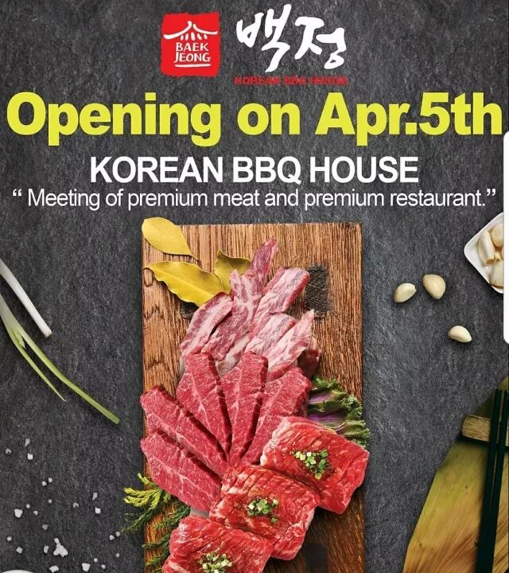 (原始链接: https://mmbiz.qpic.cn/mmbiz_jpg/XA8n2XaESnTmicQ66UtloHdPmFsBJAicwYHj3nACbZP7gBksSRBciacPGmPE6f5KpXDF4fczaUGuJEBQ5mavpmwfw/640?wx_fmt=jpeg)
-  (原始链接: https://mmbiz.qpic.cn/mmbiz_gif/XA8n2XaESnTmicQ66UtloHdPmFsBJAicwYSTcwBg42HEqZsR38k5tfibxDxPGIe2wmHXZ8aDkU10YicEvKwfvicNo9Q/640?wx_fmt=gif)
- 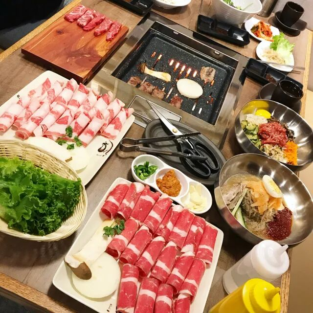 (原始链接: https://mmbiz.qpic.cn/mmbiz_jpg/XA8n2XaESnTmicQ66UtloHdPmFsBJAicwYyhwRSeZs7XChRtCTDaYsT8SdWic2GMNOa4V5lFOrKJP4B7uuGEibejtA/640?wx_fmt=jpeg)
-  (原始链接: https://mmbiz.qpic.cn/mmbiz_gif/XA8n2XaESnTmicQ66UtloHdPmFsBJAicwYfNkcE6HWOF95AqrAD0oIoHSr6FTeQy2pbZE56scTy6RAE6ZVoXfnQQ/640?wx_fmt=gif)
- 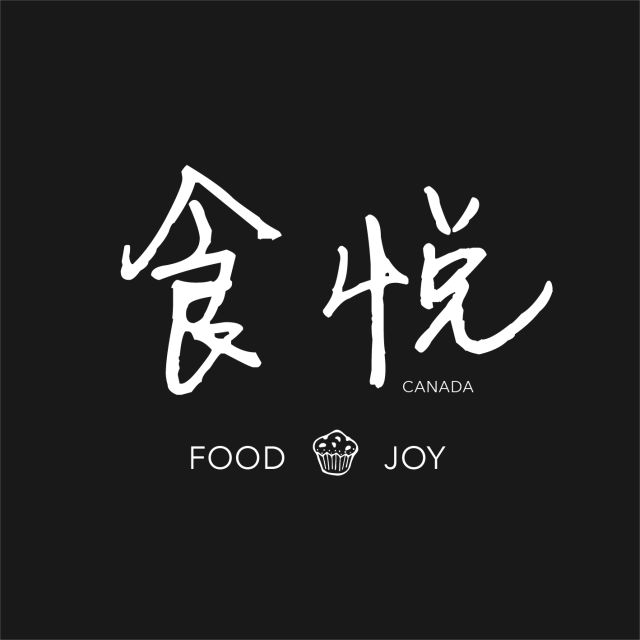 (原始链接: https://mmbiz.qpic.cn/mmbiz_png/XA8n2XaESnTmicQ66UtloHdPmFsBJAicwY5xBUkGRuaekiceKVEHZ0nAIEDibicNHtdrCxsHXeTveeu9kV02XnN7nGw/640?wx_fmt=png)
- 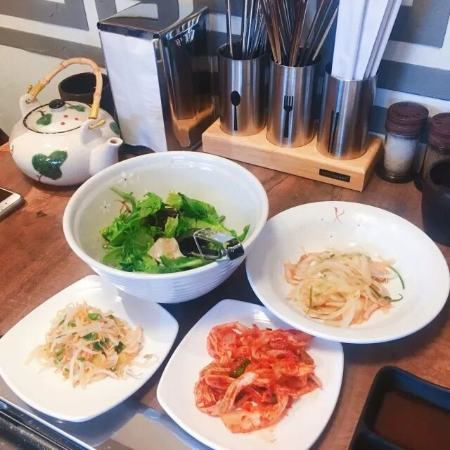 (原始链接: https://mmbiz.qpic.cn/mmbiz_jpg/XA8n2XaESnTmicQ66UtloHdPmFsBJAicwYfklaSRuPTtdxtqey5YyKBXGspSbGbmbNyYsbHDta6JdvqTDfBN0FWg/640?wx_fmt=jpeg)
-  (原始链接: https://mmbiz.qpic.cn/mmbiz_jpg/XA8n2XaESnTmicQ66UtloHdPmFsBJAicwYGnYZRodCWeDOSJJL5PDhDU9bc6via0G2Qpn1Tkm3T9wrVk1htIero4w/640?wx_fmt=jpeg)
- 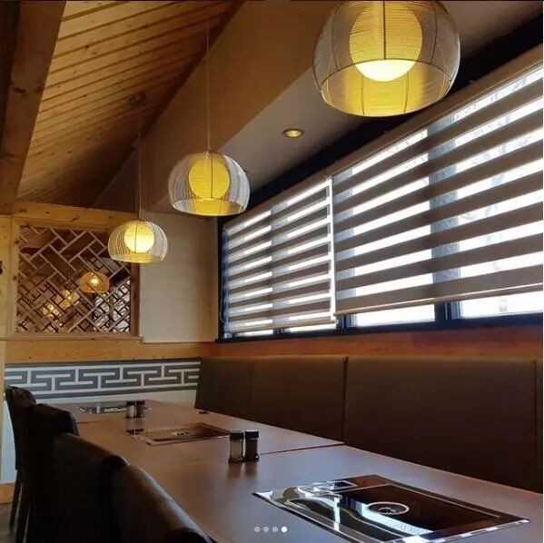 (原始链接: https://mmbiz.qpic.cn/mmbiz_jpg/XA8n2XaESnTmicQ66UtloHdPmFsBJAicwYFY7qbnBrF51Dlduia2PsXLEkhXo0piaBrJmzn05cjp7DbxnaQWd8gWicg/640?wx_fmt=jpeg)
- 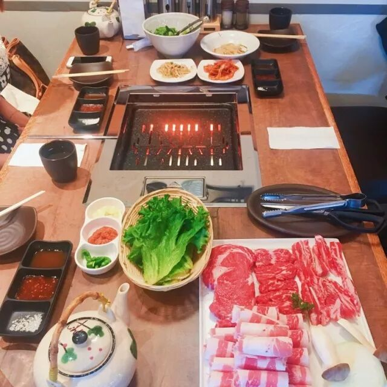 (原始链接: https://mmbiz.qpic.cn/mmbiz_jpg/XA8n2XaESnTmicQ66UtloHdPmFsBJAicwY0GnEGdlseCcDaLAGicfIYVN5ibcTM9XQWkeD6XCQJA3UicBJPANUyQiajw/640?wx_fmt=jpeg)
- 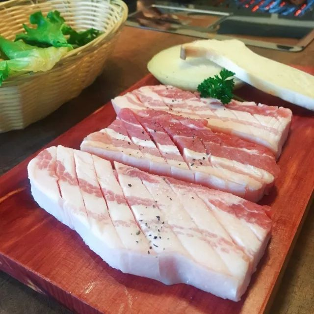 (原始链接: https://mmbiz.qpic.cn/mmbiz_jpg/XA8n2XaESnTmicQ66UtloHdPmFsBJAicwYzWPjxribMBctDFtKt9jHRkm5SfJDJNciauK3wyJZpDyhP4Ox5QmO8Z7w/640?wx_fmt=jpeg)
- 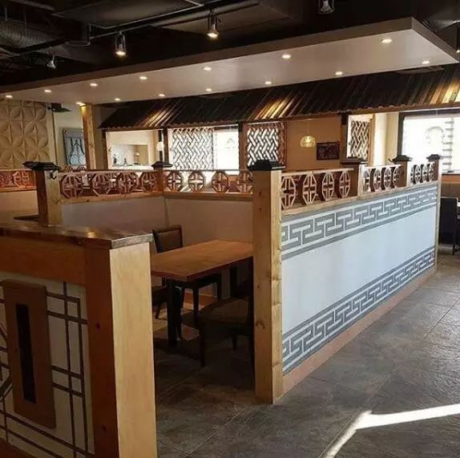 (原始链接: https://mmbiz.qpic.cn/mmbiz_jpg/XA8n2XaESnTmicQ66UtloHdPmFsBJAicwYicXdba4RS9QjpgRcbdGPqxlZW5pTic6HYNjZteEILmQzPkjgibmjBqV8Q/640?wx_fmt=jpeg)
- 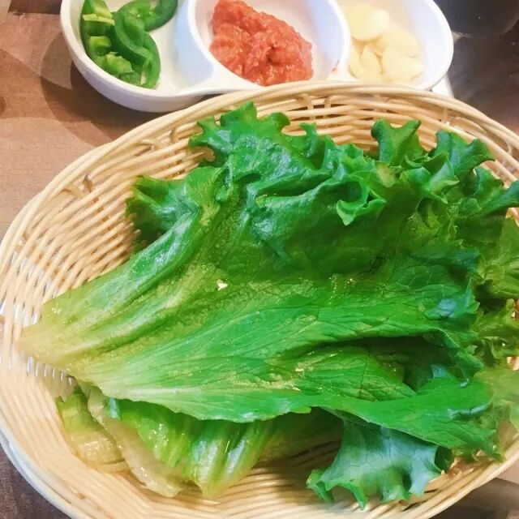 (原始链接: https://mmbiz.qpic.cn/mmbiz_jpg/XA8n2XaESnTmicQ66UtloHdPmFsBJAicwYa0Jia9ia42rhjyefibs9qdH9ZrJ8bnKGB1nFiboD0jVyc7xpKzktgEjkIQ/640?wx_fmt=jpeg)
- 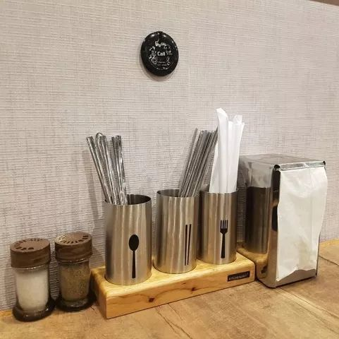 (原始链接: https://mmbiz.qpic.cn/mmbiz_jpg/XA8n2XaESnTmicQ66UtloHdPmFsBJAicwYGT1TGQ9ZhTbpTHZpIOKbicoFEDsua3FFfM9dKLTickdS586Eickjyn8cQ/640?wx_fmt=jpeg)
- 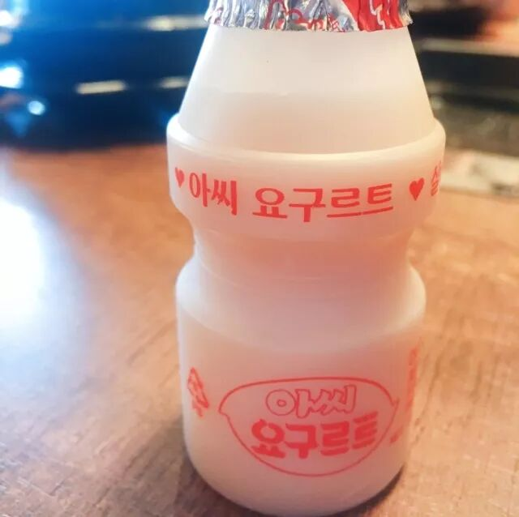 (原始链接: https://mmbiz.qpic.cn/mmbiz_jpg/XA8n2XaESnTmicQ66UtloHdPmFsBJAicwYe3N9dMQIoK2qTy8qicnJic8G09qVIWjUS0j8p0rRtyPucfgnC13Ql8rg/640?wx_fmt=jpeg)
-  (原始链接: https://mmbiz.qpic.cn/mmbiz_png/XA8n2XaESnTmicQ66UtloHdPmFsBJAicwYOibMx7LFjupqtUGeKpEf4ic08udCM8Omsh0H9r8xMelB9kLXqAuwX2mg/640?wx_fmt=png)
-  (原始链接: https://mmbiz.qpic.cn/mmbiz_png/XA8n2XaESnTmicQ66UtloHdPmFsBJAicwYDNZ9YglIzAWuwJorUZ3ibFJZW9jB8TTERx9TTUn4sqbLuCFppLmjA5w/640?wx_fmt=png)
-  (原始链接: https://mmbiz.qpic.cn/mmbiz_png/XA8n2XaESnTmicQ66UtloHdPmFsBJAicwYbkl45cKdVK2hl6BFOukdkuWueraibcbRl0sVw6fPYMAGicUu2ZWpM2Xg/640?wx_fmt=png)
-  (原始链接: https://mmbiz.qpic.cn/mmbiz_jpg/XA8n2XaESnTmicQ66UtloHdPmFsBJAicwYomdLsiacahdI5yf72MNfgMX3gMW3wmjxAHOaIJjywpdfpwBx1u15gxw/640?wx_fmt=jpeg)
- 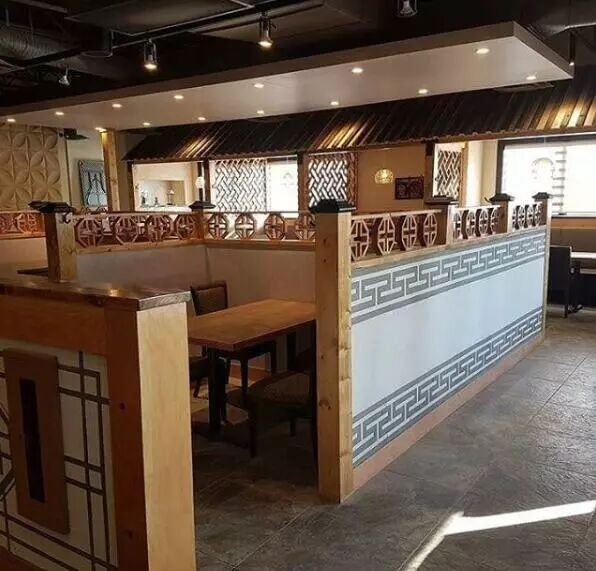 (原始链接: https://mmbiz.qpic.cn/mmbiz_jpg/XA8n2XaESnTmicQ66UtloHdPmFsBJAicwYnWnLIXJKE1zic3XicX6aLWvibIfMzTOAgURicv2HoKNtI4kunksJA40BOQ/640?wx_fmt=jpeg)
- 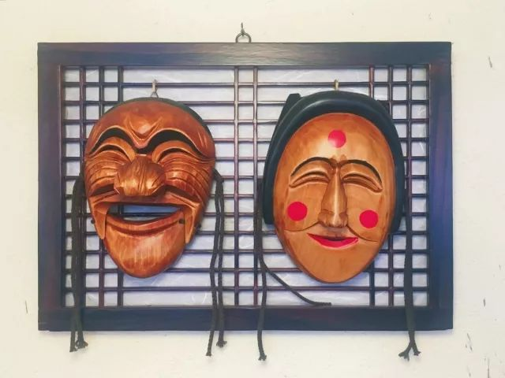 (原始链接: https://mmbiz.qpic.cn/mmbiz_jpg/XA8n2XaESnTmicQ66UtloHdPmFsBJAicwYO2pYBibYqXxiasK1Uh5VVIbfU1VpOzvM6Kwiblt86nFdicsmvqHwaw3GpA/640?wx_fmt=jpeg)
- 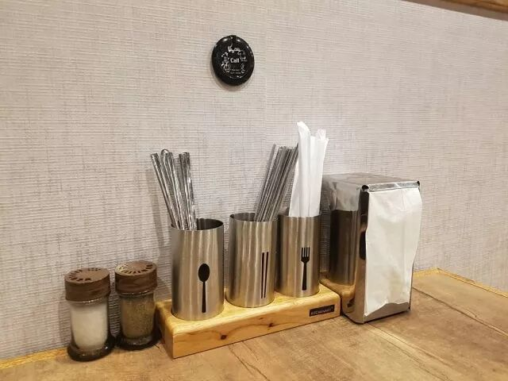 (原始链接: https://mmbiz.qpic.cn/mmbiz_jpg/XA8n2XaESnTmicQ66UtloHdPmFsBJAicwYoHE7XS2Gwh19VPzJg0p6eQnc7QqH1HRfOk5n2t1zSa9lw3ibOD61OEw/640?wx_fmt=jpeg)
- 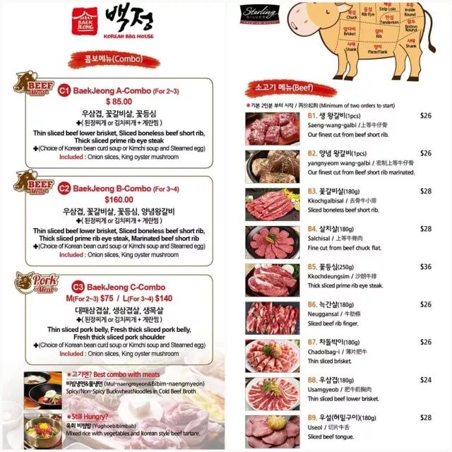 (原始链接: https://mmbiz.qpic.cn/mmbiz_jpg/XA8n2XaESnTmicQ66UtloHdPmFsBJAicwYywDS6h9iavtDn7k9CWZgWA2TqnGcLwkxJYRBHZvF9oUamic00sJnXjvg/640?wx_fmt=jpeg)
-  (原始链接: https://mmbiz.qpic.cn/mmbiz_jpg/XA8n2XaESnTmicQ66UtloHdPmFsBJAicwYfklaSRuPTtdxtqey5YyKBXGspSbGbmbNyYsbHDta6JdvqTDfBN0FWg/640?wx_fmt=jpeg)
-  (原始链接: https://mmbiz.qpic.cn/mmbiz_jpg/XA8n2XaESnTmicQ66UtloHdPmFsBJAicwYa0Jia9ia42rhjyefibs9qdH9ZrJ8bnKGB1nFiboD0jVyc7xpKzktgEjkIQ/640?wx_fmt=jpeg)
- 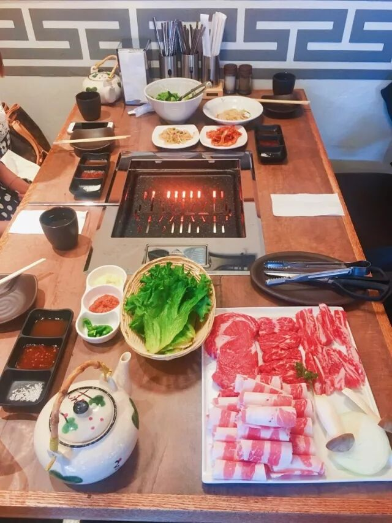 (原始链接: https://mmbiz.qpic.cn/mmbiz_jpg/XA8n2XaESnTmicQ66UtloHdPmFsBJAicwYeNZBmwnFBXbHA7wGBCupwyj6wYdq5CDenu7Ds1xKxlAntymXAT2HRA/640?wx_fmt=jpeg)
- 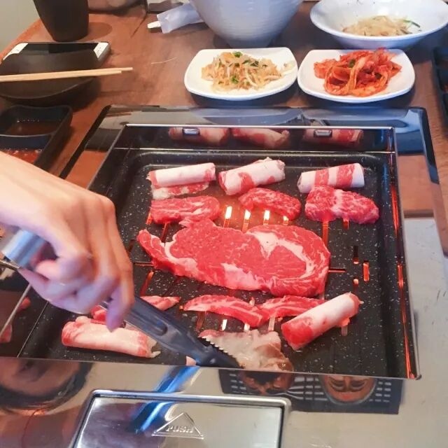 (原始链接: https://mmbiz.qpic.cn/mmbiz_jpg/XA8n2XaESnTmicQ66UtloHdPmFsBJAicwYGnYZRodCWeDOSJJL5PDhDU9bc6via0G2Qpn1Tkm3T9wrVk1htIero4w/640?wx_fmt=jpeg)
-  (原始链接: https://mmbiz.qpic.cn/mmbiz_gif/XA8n2XaESnTmicQ66UtloHdPmFsBJAicwYPyRZKDORic946ad5THiaViaricSSsGJDgrEw1U7gibqdSyaFVmbGL8f70Wg/640?wx_fmt=gif)
- 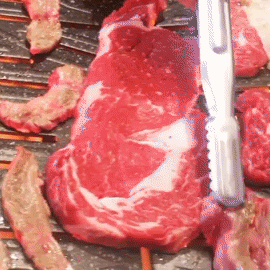 (原始链接: https://mmbiz.qpic.cn/mmbiz_gif/XA8n2XaESnTmicQ66UtloHdPmFsBJAicwYnuv3YicGMQZL2icLnNcwB7icUl00hp1yYkoxI2B81uPUOBrGmHtINrnHg/640?wx_fmt=gif)
- 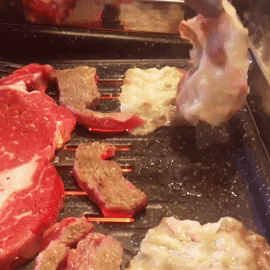 (原始链接: https://mmbiz.qpic.cn/mmbiz_gif/XA8n2XaESnTmicQ66UtloHdPmFsBJAicwYJwno5QILOegLt8iaxzUWACaYR8g7wuW8RzWzA4Ly2KAucpKN2yC5ia2Q/640?wx_fmt=gif)
- 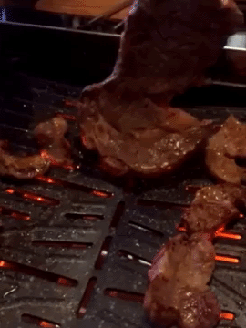 (原始链接: https://mmbiz.qpic.cn/mmbiz_gif/XA8n2XaESnTmicQ66UtloHdPmFsBJAicwYickANNbODPiarcmJvXEJicicOPaqenBl01cqU35FNkvuqZGicia5co8DwDPQ/640?wx_fmt=gif)
- 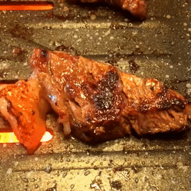 (原始链接: https://mmbiz.qpic.cn/mmbiz_gif/XA8n2XaESnTmicQ66UtloHdPmFsBJAicwYQSQGIFYmpNIeTwlTpIHrRoxQUxFrT0iaw93hmRAjxQVGX0ice51zE3fg/640?wx_fmt=gif)
- 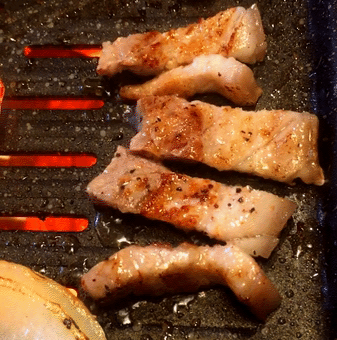 (原始链接: https://mmbiz.qpic.cn/mmbiz_gif/XA8n2XaESnTmicQ66UtloHdPmFsBJAicwYd1lKoHsta65hNl40Y3ZicyQtET85y29rTqdOhaib0CYvaf9b4YonMY7A/640?wx_fmt=gif)
-  (原始链接: https://mmbiz.qpic.cn/mmbiz_gif/XA8n2XaESnTmicQ66UtloHdPmFsBJAicwYbq5icHwAyPibkOA8TyRRRQgtriaIntobMickFFBu0BnicFGLPVx5DzQsq4g/640?wx_fmt=gif)
-  (原始链接: https://mmbiz.qpic.cn/mmbiz_jpg/XA8n2XaESnTmicQ66UtloHdPmFsBJAicwYzWPjxribMBctDFtKt9jHRkm5SfJDJNciauK3wyJZpDyhP4Ox5QmO8Z7w/640?wx_fmt=jpeg)
- 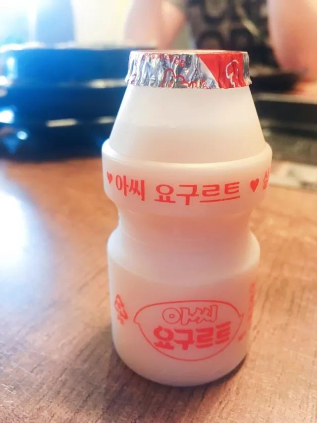 (原始链接: https://mmbiz.qpic.cn/mmbiz_jpg/XA8n2XaESnTmicQ66UtloHdPmFsBJAicwYX2v8LaYu0icNib6KlEfAq0wIpOF6D4AxwiblibFqx8B7So3nUsicllHdJeA/640?wx_fmt=jpeg)
- 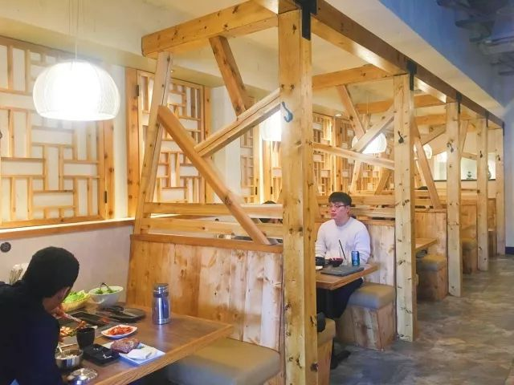 (原始链接: https://mmbiz.qpic.cn/mmbiz_jpg/XA8n2XaESnTmicQ66UtloHdPmFsBJAicwY7tL3I9zxcQ2Xct0zlxMpOC63mNkaozicELCEErlv6lY91q8dm3nxIGg/640?wx_fmt=jpeg)
- 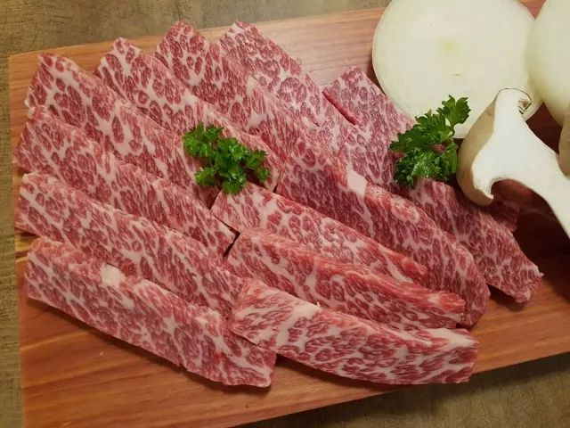 (原始链接: https://mmbiz.qpic.cn/mmbiz_jpg/XA8n2XaESnTmicQ66UtloHdPmFsBJAicwYOtKLeR7wnksCiarYyC4Eg3ibYR3cwtXSoZqdeViacOhrCibiaGnwvbhmKDQ/640?wx_fmt=jpeg)
-  (原始链接: https://mmbiz.qpic.cn/mmbiz_gif/XA8n2XaESnTmicQ66UtloHdPmFsBJAicwYcFMsLRb9PYn40VxFKMANecFKzUeAsy4ea3q2ib0sNV9WtKiawybKPJcQ/640?wx_fmt=gif)
-  (原始链接: https://mmbiz.qpic.cn/mmbiz_jpg/XA8n2XaESnTmicQ66UtloHdPmFsBJAicwYSng4wfvSVvD9enp7bpt1XbPQiajD0nz9vACnFibicrrD8kiahl3HX713gA/640?wx_fmt=jpeg)
-  (原始链接: https://mmbiz.qpic.cn/mmbiz_gif/XA8n2XaESnTmicQ66UtloHdPmFsBJAicwYC9LvZGrk9LFhIbVoGfbMic5mhNkdmV4DCic53hjNTYK0cwBZXAu3mOEw/640?wx_fmt=gif)
-  (原始链接: https://mmbiz.qpic.cn/mmbiz_png/XA8n2XaESnTmicQ66UtloHdPmFsBJAicwYEOtbZI2iampbeEqtFdEXQIVIzWOjzkEDfQXID0JDiay975tky5sEw1qA/640?wx_fmt=png)
- 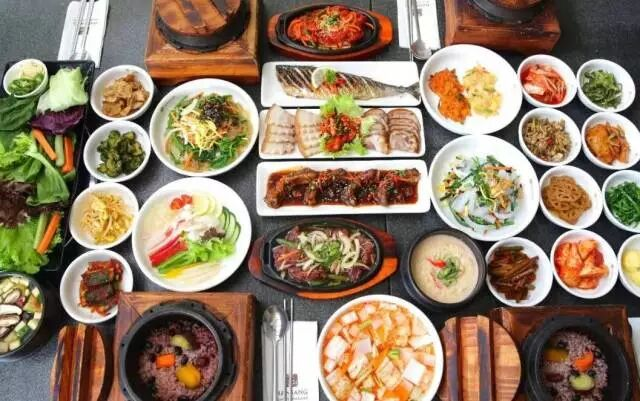 (原始链接: https://mmbiz.qpic.cn/mmbiz_jpg/XA8n2XaESnTmicQ66UtloHdPmFsBJAicwYyYgibeVPx2xA2rmS1PM6DG3Whd6N4Ll3s9uMSYhL4XichTJTgsTj83Kw/640?wx_fmt=jpeg)
- 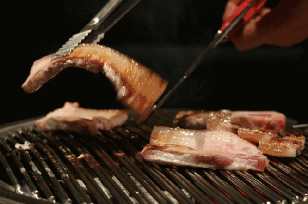 (原始链接: https://mmbiz.qpic.cn/mmbiz_gif/XA8n2XaESnTmicQ66UtloHdPmFsBJAicwYKMmficUYn0FD5PoqXk9C1ib4r9tbeKk3oshRdCNbTzT68J4GqwFd93vQ/640?wx_fmt=gif)
-  (原始链接: https://mmbiz.qpic.cn/mmbiz_jpg/XA8n2XaESnTmicQ66UtloHdPmFsBJAicwYXtfhQtJyich92RoibwFN8xbEOfP473rm661l0TcnQNYDicUC5Er9VAFLQ/640?wx_fmt=jpeg)
