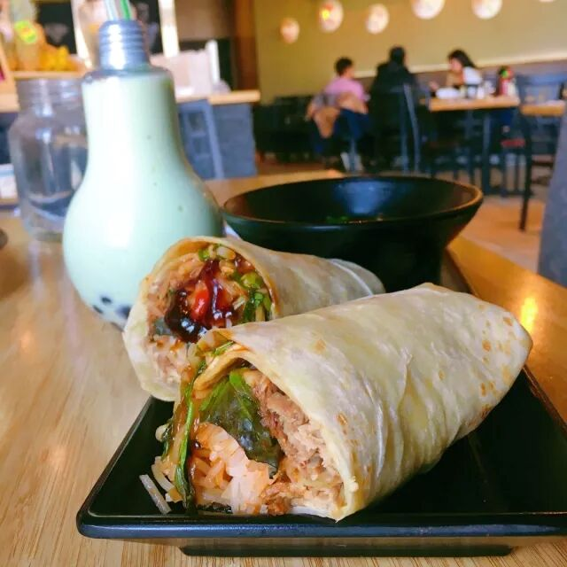

# 无标题

**链接地址:** http://mp.weixin.qq.com/s?__biz=MzI0MDQ0ODI0Ng==&mid=2247485717&idx=1&sn=93eb65562f40def5c11055ab5cd7721d&chksm=e91bee8cde6c679a8a948a10eec0e766672a2aff62c94fcf83c1c896ae943733509556e361bc&mpshare=1&scene=2&srcid=0417Q4MO01CE7lICQrkl9sbp#rd
**作者:** 食老悦
**获取时间:** 2025/8/28 22:04:21
**图片数量:** 33

---

## 原始HTML内容

<section style="background-color: rgb(255, 255, 255);box-sizing: border-box;"><section class="Powered-by-XIUMI V5" style="box-sizing: border-box;" powered-by="xiumi.us"><section class="" style="text-align: center;margin-top: 10px;margin-bottom: 10px;box-sizing: border-box;"><section class="" style="max-width: 100%;vertical-align: middle;display: inline-block;overflow: hidden !important;box-sizing: border-box;"></section></section></section><section class="Powered-by-XIUMI V5" style="box-sizing: border-box;" powered-by="xiumi.us"><section class="" style="margin-top: 10px;margin-bottom: 10px;box-sizing: border-box;"><section class="" style="transform: rotate(0deg);-webkit-transform: rotate(0deg);-moz-transform: rotate(0deg);-o-transform: rotate(0deg);padding: 10px;margin-left: 1em;margin-right: 1em;background-color: rgb(250, 243, 227);box-sizing: border-box;"><section class="Powered-by-XIUMI V5" style="box-sizing: border-box;" powered-by="xiumi.us"><section class="" style="text-align: center;margin-right: 0%;margin-left: 0%;box-sizing: border-box;"><section class="" style="max-width: 100%;vertical-align: middle;display: inline-block;overflow: hidden !important;box-sizing: border-box;"></section></section></section></section><section class="" style="width: 100%;padding-top: 1em;margin-top: -1em;border-radius: 0.5em 0.5em 1em 1em;background-color: rgba(247, 131, 9, 0.66);box-sizing: border-box;"><section class="" style="width: 100%;border-radius: 0px 0px 0.5em 0.5em;background-color: rgb(236, 126, 51);padding: 10px;font-size: 18px;text-align: center;color: rgb(255, 255, 255);letter-spacing: 2px;box-sizing: border-box;">
金主大大，请开始您的表演！
</section></section></section></section><section class="Powered-by-XIUMI V5" style="box-sizing: border-box;" powered-by="xiumi.us"><section class="" style="text-align: center;margin-top: 10px;margin-bottom: 10px;box-sizing: border-box;"><section class="" style="max-width: 100%;vertical-align: middle;display: inline-block;overflow: hidden !important;box-sizing: border-box;"></section></section></section><section class="Powered-by-XIUMI V5" style="box-sizing: border-box;" powered-by="xiumi.us"><section class="" style="text-align: center;margin-top: 10px;margin-bottom: 10px;box-sizing: border-box;"><section class="" style="max-width: 100%;vertical-align: middle;display: inline-block;overflow: hidden !important;box-sizing: border-box;"></section></section></section><section class="Powered-by-XIUMI V5" style="box-sizing: border-box;" powered-by="xiumi.us"><section class="" style="margin: 8px 0%;box-sizing: border-box;"><section class="" style="display: inline-block;vertical-align: top;width: 38%;box-sizing: border-box;"><section class="Powered-by-XIUMI V5" style="box-sizing: border-box;" powered-by="xiumi.us"><section class="" style="font-size: 10px;text-align: center;box-sizing: border-box;"><section class="" style="overflow: hidden;vertical-align: top;display: inline-block;box-sizing: border-box;"><section style="width: 1px;height: 20px;margin-left: 50%;background-color: rgb(102, 102, 102);box-sizing: border-box;"></section><section class="" style="border-width: 1px;border-style: solid;border-color: rgb(102, 102, 102);background-color: rgb(254, 255, 255);width: 1.8em;height: 1.8em;line-height: 1.8em;border-radius: 100%;margin-left: auto;margin-right: auto;font-size: 12px;box-sizing: border-box;">
食
</section></section></section></section><section class="Powered-by-XIUMI V5" style="box-sizing: border-box;" powered-by="xiumi.us"><section class="" style="font-size: 10px;margin-top: 3px;margin-bottom: 3px;text-align: center;box-sizing: border-box;"><section class="" style="display: inline-block;border-width: 1px;border-style: solid;border-color: rgb(102, 102, 102);background-color: rgb(254, 255, 255);width: 1.8em;height: 1.8em;line-height: 1.8em;border-radius: 100%;margin-left: auto;margin-right: auto;font-size: 12px;box-sizing: border-box;">
老
</section></section></section><section class="Powered-by-XIUMI V5" style="box-sizing: border-box;" powered-by="xiumi.us"><section class="" style="font-size: 10px;margin-top: 3px;margin-bottom: 3px;text-align: center;box-sizing: border-box;"><section class="" style="display: inline-block;border-width: 1px;border-style: solid;border-color: rgb(102, 102, 102);background-color: rgb(254, 255, 255);width: 1.8em;height: 1.8em;line-height: 1.8em;border-radius: 100%;margin-left: auto;margin-right: auto;font-size: 12px;box-sizing: border-box;">
悦
</section></section></section></section><section class="" style="display: inline-block;vertical-align: top;width: 61%;box-sizing: border-box;"><section class="Powered-by-XIUMI V5" style="box-sizing: border-box;" powered-by="xiumi.us"><section class="" style="box-sizing: border-box;"><section class="" style="font-size: 14px;color: rgba(62, 62, 62, 0.66);box-sizing: border-box;"><section style="box-sizing: border-box;"> 
吃河粉就玉米卷，

喝着最in的“灯泡奶茶”，

参与最吸睛的“大胃王挑战”，

玩到凌晨四点也不歇。

原来你是这样的

<strong style="box-sizing: border-box;">西贡小姐</strong>

<strong style="box-sizing: border-box;"> </strong>
</section></section></section></section></section></section></section><section class="Powered-by-XIUMI V5" style="box-sizing: border-box;" powered-by="xiumi.us"><section class="" style="margin: 10px 0%;box-sizing: border-box;"><section class="" style="display: inline-block;width: 100%;vertical-align: top;box-sizing: border-box;"><section class="Powered-by-XIUMI V5" style="box-sizing: border-box;" powered-by="xiumi.us"><section class="" style="margin-right: 0%;margin-left: 0%;box-sizing: border-box;"><section class="" style="display: inline-block;vertical-align: top;width: 40%;box-sizing: border-box;"><section class="Powered-by-XIUMI V5" style="box-sizing: border-box;" powered-by="xiumi.us"><section class="" style="margin-top: 0.5em;margin-bottom: 0.5em;box-sizing: border-box;"><section class="" style="background-color: rgb(90, 148, 86);height: 1px;box-sizing: border-box;"></section></section></section></section><section class="" style="display: inline-block;vertical-align: top;width: 20%;box-sizing: border-box;"><section class="Powered-by-XIUMI V5" style="box-sizing: border-box;" powered-by="xiumi.us"><section class="" style="margin-top: -10px;margin-right: 0%;margin-left: 0%;text-align: center;font-size: 10px;box-sizing: border-box;"><section class="" style="display: inline-block;box-sizing: border-box;"><section class="" style="background-color: rgb(89, 94, 36);width: 1.6em;height: 1.6em;line-height: 1.6em;border-radius: 100%;margin-left: auto;margin-right: auto;font-size: 12px;color: rgb(255, 255, 255);box-sizing: border-box;">
1
</section><section style="width: 0px;margin-top: -0.76em;border-bottom: 0.8em solid rgb(89, 94, 36);border-left: 0.8em solid transparent !important;border-right: 0.5em solid transparent !important;box-sizing: border-box;"></section></section></section></section></section><section class="" style="display: inline-block;vertical-align: top;width: 40%;box-sizing: border-box;"><section class="Powered-by-XIUMI V5" style="box-sizing: border-box;" powered-by="xiumi.us"><section class="" style="margin-top: 0.5em;margin-bottom: 0.5em;box-sizing: border-box;"><section class="" style="background-color: rgb(90, 148, 86);height: 1px;box-sizing: border-box;"></section></section></section></section></section></section><section class="Powered-by-XIUMI V5" style="box-sizing: border-box;" powered-by="xiumi.us"><section class="" style="margin-top: -4px;margin-right: 0%;margin-left: 0%;box-sizing: border-box;"><section class="" style="text-align: center;color: rgba(62, 62, 62, 0.66);letter-spacing: 2px;box-sizing: border-box;">
<strong style="box-sizing: border-box;">越南河粉</strong>
</section></section></section></section></section></section><section class="Powered-by-XIUMI V5" style="box-sizing: border-box;" powered-by="xiumi.us"><section class="" style="text-align: center;margin-top: 0.5em;margin-bottom: 0.5em;padding-left: 0.5em;padding-right: 0.5em;box-sizing: border-box;"><section class="" style="box-sizing: border-box;width: 100%;box-shadow: rgb(102, 102, 102) 3.53553px 3.53553px 8px;display: inline-block;height: auto !important;overflow: hidden !important;border-color: white;"></section></section></section><section class="Powered-by-XIUMI V5" style="box-sizing: border-box;" powered-by="xiumi.us"><section class="" style="box-sizing: border-box;"><section class="" style="box-sizing: border-box;">
 
</section></section></section><section class="Powered-by-XIUMI V5" style="box-sizing: border-box;" powered-by="xiumi.us"><section class="" style="box-sizing: border-box;"><section class="" style="text-align: justify;font-size: 14px;color: rgba(62, 62, 62, 0.66);letter-spacing: 2px;padding-right: 10px;padding-left: 10px;box-sizing: border-box;">
去年冬天，Whyte Ave附近开了一家新的越南河粉。这本不是什么新鲜事。越南河粉，是2006年食老悦刚刚抵达加拿大下了飞机吃的第一样食物。说来好笑，这个城市越南人没多少，但我们却拥有多如牛毛的越南河粉店。越南河粉以它易于被接受的温和味道轻松地入侵了西人的餐桌，也抚慰了怀念国内牛肉面苦于找不到替代品的食老悦的胃。多少个失恋的夜晚和宿醉的清晨，都是越南河粉这位大兄dei在陪伴着我。
</section></section></section><section class="Powered-by-XIUMI V5" style="box-sizing: border-box;" powered-by="xiumi.us"><section class="" style="box-sizing: border-box;"><section class="" style="box-sizing: border-box;">
 
</section></section></section><section class="Powered-by-XIUMI V5" style="box-sizing: border-box;" powered-by="xiumi.us"><section class="" style="text-align: center;margin-top: 0.5em;margin-bottom: 0.5em;padding-left: 0.5em;padding-right: 0.5em;box-sizing: border-box;"><section class="" style="box-sizing: border-box;width: 100%;box-shadow: rgb(102, 102, 102) 3.53553px 3.53553px 8px;display: inline-block;height: auto !important;overflow: hidden !important;border-color: white;"></section></section></section><section class="Powered-by-XIUMI V5" style="box-sizing: border-box;" powered-by="xiumi.us"><section class="" style="box-sizing: border-box;"><section class="" style="box-sizing: border-box;">
 
</section></section></section><section class="Powered-by-XIUMI V5" style="box-sizing: border-box;" powered-by="xiumi.us"><section class="" style="box-sizing: border-box;"><section class="" style="text-align: justify;color: rgba(62, 62, 62, 0.66);font-size: 14px;line-height: 1.6;letter-spacing: 2px;padding-right: 10px;padding-left: 10px;box-sizing: border-box;">
每个老屯民，都至少有一家，坐下菜单都不用看，就可以说出自己要吃“No.44, regular size”的越南河粉店。甚至，你都不需要说。老板娘会连你不放豆芽菜的习惯都记着。每家越南河粉店安静本分的熬着自己肆意挥洒着味精的汤头，不做广告，也不搞花样。反正都是这些来了又来的老主顾。直到这位远道而来神秘人物的出现，打破了这种相安无事的销售原则。开业仅几个月就把自己折腾成了“<strong style="box-sizing: border-box;">爱城第一的越南河粉店</strong>”。
</section></section></section><section class="Powered-by-XIUMI V5" style="box-sizing: border-box;" powered-by="xiumi.us"><section class="" style="box-sizing: border-box;"><section class="" style="box-sizing: border-box;">
 
</section></section></section><section class="Powered-by-XIUMI V5" style="box-sizing: border-box;" powered-by="xiumi.us"><section class="" style="text-align: center;margin-top: 0.5em;margin-bottom: 0.5em;padding-left: 0.5em;padding-right: 0.5em;box-sizing: border-box;"><section class="" style="box-sizing: border-box;width: 100%;box-shadow: rgb(102, 102, 102) 3.53553px 3.53553px 8px;display: inline-block;height: auto !important;overflow: hidden !important;border-color: white;"></section></section></section><section class="Powered-by-XIUMI V5" style="box-sizing: border-box;" powered-by="xiumi.us"><section class="" style="box-sizing: border-box;"><section class="" style="box-sizing: border-box;">
 
</section></section></section><section class="Powered-by-XIUMI V5" style="box-sizing: border-box;" powered-by="xiumi.us"><section class="" style="box-sizing: border-box;"><section class="" style="text-align: justify;color: rgba(62, 62, 62, 0.66);font-size: 14px;line-height: 1.6;letter-spacing: 2px;padding-right: 10px;padding-left: 10px;box-sizing: border-box;">
对于这种号称自己“第一”的餐厅，食老悦是一贯持“呵呵”态度的。但是直到网上爆出了所谓的“<strong style="box-sizing: border-box;">网红灯泡奶茶</strong>”的图片，食老悦突然对这家店开始有了点兴趣。灯泡奶茶其实也不是很稀奇的玩意儿了，国内多年前就玩过的噱头。不过我感兴趣的点在于：一家越南粉儿店不老老实实地卖自己的味精粉儿，搞什么灯泡奶茶呢？上网查了一下评价和菜单，决定还是去会一会这个“第一”。吃完回来，我对他“第一”的头衔无话可说。<strong style="box-sizing: border-box;">我承认，确实第一，但不是味道。</strong>

 
</section></section></section><section class="Powered-by-XIUMI V5" style="box-sizing: border-box;" powered-by="xiumi.us"><section class="" style="box-sizing: border-box;"><section class="" style="box-sizing: border-box;">
 
</section></section></section><section class="Powered-by-XIUMI V5" style="box-sizing: border-box;" powered-by="xiumi.us"><section class="" style="margin-right: 0%;margin-left: 0%;box-sizing: border-box;"><section class="" style="display: inline-block;vertical-align: top;width: 40%;box-sizing: border-box;"><section class="Powered-by-XIUMI V5" style="box-sizing: border-box;" powered-by="xiumi.us"><section class="" style="margin-top: 0.5em;margin-bottom: 0.5em;box-sizing: border-box;"><section class="" style="background-color: rgb(90, 148, 86);height: 1px;box-sizing: border-box;"></section></section></section></section><section class="" style="display: inline-block;vertical-align: top;width: 20%;box-sizing: border-box;"><section class="Powered-by-XIUMI V5" style="box-sizing: border-box;" powered-by="xiumi.us"><section class="" style="margin-top: -10px;margin-right: 0%;margin-left: 0%;text-align: center;font-size: 10px;box-sizing: border-box;"><section class="" style="display: inline-block;box-sizing: border-box;"><section class="" style="background-color: rgb(89, 94, 36);width: 1.6em;height: 1.6em;line-height: 1.6em;border-radius: 100%;margin-left: auto;margin-right: auto;font-size: 12px;color: rgb(255, 255, 255);box-sizing: border-box;">
2
</section><section style="width: 0px;margin-top: -0.76em;border-bottom: 0.8em solid rgb(89, 94, 36);border-left: 0.8em solid transparent !important;border-right: 0.5em solid transparent !important;box-sizing: border-box;"></section></section></section></section></section><section class="" style="display: inline-block;vertical-align: top;width: 40%;box-shadow: rgb(0, 0, 0) 0px 0px 0px;box-sizing: border-box;"><section class="Powered-by-XIUMI V5" style="box-sizing: border-box;" powered-by="xiumi.us"><section class="" style="margin-top: 0.5em;margin-bottom: 0.5em;box-sizing: border-box;"><section class="" style="background-color: rgb(90, 148, 86);height: 1px;box-sizing: border-box;"></section></section></section></section></section></section><section class="Powered-by-XIUMI V5" style="box-sizing: border-box;" powered-by="xiumi.us"><section class="" style="margin-top: -4px;margin-right: 0%;margin-left: 0%;box-sizing: border-box;"><section class="" style="text-align: center;color: rgba(62, 62, 62, 0.66);letter-spacing: 2px;box-sizing: border-box;">
<strong style="box-sizing: border-box;">西贡小姐</strong>
</section></section></section><section class="Powered-by-XIUMI V5" style="box-sizing: border-box;" powered-by="xiumi.us"><section class="" style="text-align: center;margin-top: 0.5em;margin-bottom: 0.5em;padding-left: 0.5em;padding-right: 0.5em;box-sizing: border-box;"><section class="" style="box-sizing: border-box;width: 100%;box-shadow: rgb(102, 102, 102) 3.53553px 3.53553px 8px;display: inline-block;height: auto !important;overflow: hidden !important;border-color: white;"></section></section></section><section class="Powered-by-XIUMI V5" style="box-sizing: border-box;" powered-by="xiumi.us"><section class="" style="box-sizing: border-box;"><section class="" style="box-sizing: border-box;">
 
</section></section></section><section class="Powered-by-XIUMI V5" style="box-sizing: border-box;" powered-by="xiumi.us"><section class="" style="box-sizing: border-box;"><section class="" style="text-align: justify;color: rgba(62, 62, 62, 0.66);font-size: 14px;line-height: 1.6;letter-spacing: 2px;padding-right: 10px;padding-left: 10px;box-sizing: border-box;">
“Miss Saigon”这个店名来源于《西贡小姐》这部讲述一个越南女子与美国士兵之间悲剧爱情故事的经典百老汇舞台剧。为什么要提到这个文化背景呢？因为这部分内容可能是这家定位自己为“Asian Culture Transcriber”（<strong style="box-sizing: border-box;">亚洲文化传述者</strong>）的饭店想要传递给每一位用餐者的信息之一。他们甚至把这些内容装裱精美地影印在了他们制作精良的菜单上。
</section></section></section><section class="Powered-by-XIUMI V5" style="box-sizing: border-box;" powered-by="xiumi.us"><section class="" style="box-sizing: border-box;"><section class="" style="box-sizing: border-box;">
 
</section></section></section><section class="Powered-by-XIUMI V5" style="box-sizing: border-box;" powered-by="xiumi.us"><section class="" style="text-align: center;margin-top: 0.5em;margin-bottom: 0.5em;padding-left: 0.5em;padding-right: 0.5em;box-sizing: border-box;"><section class="" style="box-sizing: border-box;width: 100%;box-shadow: rgb(102, 102, 102) 0.2em 0.2em 0.5em;display: inline-block;height: auto !important;overflow: hidden !important;border-color: white;"></section></section></section><section class="Powered-by-XIUMI V5" style="box-sizing: border-box;" powered-by="xiumi.us"><section class="" style="box-sizing: border-box;"><section class="" style="box-sizing: border-box;">
 
</section></section></section><section class="Powered-by-XIUMI V5" style="box-sizing: border-box;" powered-by="xiumi.us"><section class="" style="box-sizing: border-box;"><section class="" style="text-align: justify;color: rgba(62, 62, 62, 0.66);font-size: 14px;line-height: 1.6;letter-spacing: 2px;padding-right: 10px;padding-left: 10px;box-sizing: border-box;">
一家越南河粉店都需要在菜单上这样下功夫了吗？过去或许不用，但是西贡小姐成为了第一个这样做的人。翻阅这家店的菜单着实是一种享受。里面从河粉的起源发展，讲到越南的名胜古迹，甚至还原了越南当今社会的种种，给我这种对越南除了河粉几乎一无所知的吃瓜群众上了鲜活的一课。看完整本菜单都花了20分钟，用新get的姿势填饱了饥肠。
</section></section></section><section class="Powered-by-XIUMI V5" style="box-sizing: border-box;" powered-by="xiumi.us"><section class="" style="box-sizing: border-box;"><section class="" style="box-sizing: border-box;">
 
</section></section></section><section class="Powered-by-XIUMI V5" style="box-sizing: border-box;" powered-by="xiumi.us"><section class="" style="margin-right: 0%;margin-left: 0%;box-sizing: border-box;"><section class="" style="display: inline-block;vertical-align: top;width: 40%;box-sizing: border-box;"><section class="Powered-by-XIUMI V5" style="box-sizing: border-box;" powered-by="xiumi.us"><section class="" style="margin-top: 0.5em;margin-bottom: 0.5em;box-sizing: border-box;"><section class="" style="background-color: rgb(90, 148, 86);height: 1px;box-sizing: border-box;"></section></section></section></section><section class="" style="display: inline-block;vertical-align: top;width: 20%;box-sizing: border-box;"><section class="Powered-by-XIUMI V5" style="box-sizing: border-box;" powered-by="xiumi.us"><section class="" style="margin-top: -10px;margin-right: 0%;margin-left: 0%;text-align: center;font-size: 10px;box-sizing: border-box;"><section class="" style="display: inline-block;box-sizing: border-box;"><section class="" style="background-color: rgb(89, 94, 36);width: 1.6em;height: 1.6em;line-height: 1.6em;border-radius: 100%;margin-left: auto;margin-right: auto;font-size: 12px;color: rgb(255, 255, 255);box-sizing: border-box;">
3
</section><section style="width: 0px;margin-top: -0.76em;border-bottom: 0.8em solid rgb(89, 94, 36);border-left: 0.8em solid transparent !important;border-right: 0.5em solid transparent !important;box-sizing: border-box;"></section></section></section></section></section><section class="" style="display: inline-block;vertical-align: top;width: 40%;box-sizing: border-box;"><section class="Powered-by-XIUMI V5" style="box-sizing: border-box;" powered-by="xiumi.us"><section class="" style="margin-top: 0.5em;margin-bottom: 0.5em;box-sizing: border-box;"><section class="" style="background-color: rgb(90, 148, 86);height: 1px;box-sizing: border-box;"></section></section></section></section></section></section><section class="Powered-by-XIUMI V5" style="box-sizing: border-box;" powered-by="xiumi.us"><section class="" style="margin-top: -4px;margin-right: 0%;margin-left: 0%;box-sizing: border-box;"><section class="" style="text-align: center;color: rgba(62, 62, 62, 0.66);letter-spacing: 2px;box-sizing: border-box;">
<strong style="box-sizing: border-box;">灯泡奶茶</strong>
</section></section></section><section class="Powered-by-XIUMI V5" style="box-sizing: border-box;" powered-by="xiumi.us"><section class="" style="box-sizing: border-box;"><section class="" style="display: inline-block;vertical-align: top;width: 60%;border-width: 0px;box-sizing: border-box;"><section class="Powered-by-XIUMI V5" style="box-sizing: border-box;" powered-by="xiumi.us"><section class="" style="text-align: center;margin: 15px 0% 10px;box-sizing: border-box;"><section class="" style="max-width: 100%;vertical-align: middle;display: inline-block;overflow: hidden !important;box-sizing: border-box;"></section></section></section></section><section class="" style="display: inline-block;vertical-align: top;width: 40%;padding-left: 5px;box-sizing: border-box;"><section class="Powered-by-XIUMI V5" style="box-sizing: border-box;" powered-by="xiumi.us"><section class="" style="box-sizing: border-box;"><section class="" style="text-align: right;line-height: 1.4;letter-spacing: 2px;box-sizing: border-box;">
<strong style="box-sizing: border-box;">Vietnamese Avocado Smoothie</strong>
</section></section></section><section class="Powered-by-XIUMI V5" style="box-sizing: border-box;" powered-by="xiumi.us"><section class="" style="box-sizing: border-box;"><section class="" style="text-align: right;font-size: 12px;box-sizing: border-box;">
50% Sweet
</section></section></section><section class="Powered-by-XIUMI V5" style="box-sizing: border-box;" powered-by="xiumi.us"><section class="" style="margin: 20px 0% 10px;transform: translate3d(-40px, 0px, 0px);-webkit-transform: translate3d(-40px, 0px, 0px);-moz-transform: translate3d(-40px, 0px, 0px);-o-transform: translate3d(-40px, 0px, 0px);box-sizing: border-box;"><section class="" style="max-width: 100%;vertical-align: middle;display: inline-block;border-color: rgb(255, 255, 255);border-width: 4px;border-radius: 0px;border-style: solid;width: 100%;overflow: hidden !important;box-sizing: border-box;"></section></section></section></section></section></section><section class="Powered-by-XIUMI V5" style="box-sizing: border-box;" powered-by="xiumi.us"><section class="" style="box-sizing: border-box;"><section class="" style="box-sizing: border-box;">
 
</section></section></section><section class="Powered-by-XIUMI V5" style="box-sizing: border-box;" powered-by="xiumi.us"><section class="" style="box-sizing: border-box;"><section class="" style="text-align: justify;color: rgba(62, 62, 62, 0.66);font-size: 14px;line-height: 1.6;letter-spacing: 2px;padding-right: 10px;padding-left: 10px;box-sizing: border-box;">
和灯泡奶茶的烩面会面确实是此行的目的之一。想来其灯泡的名称不仅来源于造型的相近，基座里LED灯发出的荧光让它在夜幕的笼罩下看起来更为神秘诱惑。来越南饭店不可错过的就是他们所谓的“comfort food”——<strong style="box-sizing: border-box;">鲜榨牛油果奶昔</strong>。第一次喝觉得甜腻过了头，后来学会只加一半炼乳的操作才感受到了来自世界的善意。在牛奶轻盈润滑的口感之上浓郁的牛油果香得以凸显，来自植物的脂肪对身体更加健康。
</section></section></section><section class="Powered-by-XIUMI V5" style="box-sizing: border-box;" powered-by="xiumi.us"><section class="" style="box-sizing: border-box;"><section class="" style="box-sizing: border-box;">
 
</section></section></section><section class="Powered-by-XIUMI V5" style="box-sizing: border-box;" powered-by="xiumi.us"><section class="" style="margin-right: 0%;margin-left: 0%;box-sizing: border-box;"><section class="" style="display: inline-block;vertical-align: top;width: 40%;box-sizing: border-box;"><section class="Powered-by-XIUMI V5" style="box-sizing: border-box;" powered-by="xiumi.us"><section class="" style="margin-top: 0.5em;margin-bottom: 0.5em;box-sizing: border-box;"><section class="" style="background-color: rgb(90, 148, 86);height: 1px;box-sizing: border-box;"></section></section></section></section><section class="" style="display: inline-block;vertical-align: top;width: 20%;box-sizing: border-box;"><section class="Powered-by-XIUMI V5" style="box-sizing: border-box;" powered-by="xiumi.us"><section class="" style="margin-top: -10px;margin-right: 0%;margin-left: 0%;text-align: center;font-size: 10px;box-sizing: border-box;"><section class="" style="display: inline-block;box-sizing: border-box;"><section class="" style="background-color: rgb(89, 94, 36);width: 1.6em;height: 1.6em;line-height: 1.6em;border-radius: 100%;margin-left: auto;margin-right: auto;font-size: 12px;color: rgb(255, 255, 255);box-sizing: border-box;">
4
</section><section style="width: 0px;margin-top: -0.76em;border-bottom: 0.8em solid rgb(89, 94, 36);border-left: 0.8em solid transparent !important;border-right: 0.5em solid transparent !important;box-sizing: border-box;"></section></section></section></section></section><section class="" style="display: inline-block;vertical-align: top;width: 40%;box-sizing: border-box;"><section class="Powered-by-XIUMI V5" style="box-sizing: border-box;" powered-by="xiumi.us"><section class="" style="margin-top: 0.5em;margin-bottom: 0.5em;box-sizing: border-box;"><section class="" style="background-color: rgb(90, 148, 86);height: 1px;box-sizing: border-box;"></section></section></section></section></section></section><section class="Powered-by-XIUMI V5" style="box-sizing: border-box;" powered-by="xiumi.us"><section class="" style="margin-top: -4px;margin-right: 0%;margin-left: 0%;box-sizing: border-box;"><section class="" style="text-align: center;color: rgba(62, 62, 62, 0.66);letter-spacing: 2px;box-sizing: border-box;">
<strong style="box-sizing: border-box;">Phorrito</strong>
</section></section></section><section class="Powered-by-XIUMI V5" style="box-sizing: border-box;" powered-by="xiumi.us"><section class="" style="text-align: center;margin-top: 0.5em;margin-bottom: 0.5em;padding-left: 0.5em;padding-right: 0.5em;box-sizing: border-box;"><section class="" style="box-sizing: border-box;width: 100%;box-shadow: rgb(102, 102, 102) 3.53553px 3.53553px 8px;display: inline-block;height: auto !important;overflow: hidden !important;border-color: white;"></section></section></section><section class="Powered-by-XIUMI V5" style="box-sizing: border-box;" powered-by="xiumi.us"><section class="" style="box-sizing: border-box;"><section class="" style="box-sizing: border-box;">
 
</section></section></section><section class="Powered-by-XIUMI V5" style="box-sizing: border-box;" powered-by="xiumi.us"><section class="" style="box-sizing: border-box;"><section class="" style="text-align: justify;color: rgba(62, 62, 62, 0.66);font-size: 14px;line-height: 1.6;letter-spacing: 2px;padding-right: 10px;padding-left: 10px;box-sizing: border-box;">
说起来这次探访西贡小姐最主要的目的，是尝试一下这个名叫“<strong style="box-sizing: border-box;">Phorrito</strong>”的新奇食物。从名字和相貌上看，大概可以猜到这就是越南河粉和墨西哥卷的后裔。这款菜的爹妈在北美国家当地人的圈子里被接纳度还是挺高的，所以会繁衍出这样的后代并不奇怪。毕竟就连越南河粉自身，都是在20世纪初被法国殖民者带来的菜肴Pot-Au-Feu（Pot on the Fire）所影响而演变来的。

 
</section></section></section><section class="Powered-by-XIUMI V5" style="box-sizing: border-box;" powered-by="xiumi.us"><section class="" style="text-align: center;margin-top: 0.5em;margin-bottom: 0.5em;padding-left: 0.5em;padding-right: 0.5em;box-sizing: border-box;"><section class="" style="box-sizing: border-box;width: 100%;box-shadow: rgb(102, 102, 102) 0.2em 0.2em 0.5em;display: inline-block;height: auto !important;overflow: hidden !important;border-color: white;"></section></section></section><section class="Powered-by-XIUMI V5" style="box-sizing: border-box;" powered-by="xiumi.us"><section class="" style="box-sizing: border-box;"><section class="" style="box-sizing: border-box;">
 
</section></section></section><section class="Powered-by-XIUMI V5" style="box-sizing: border-box;" powered-by="xiumi.us"><section class="" style="box-sizing: border-box;"><section class="" style="text-align: justify;color: rgba(62, 62, 62, 0.66);font-size: 14px;line-height: 1.6;letter-spacing: 2px;padding-right: 10px;padding-left: 10px;box-sizing: border-box;">
从他们的官方主页上就可以看出这家餐馆对这道菜的宣传力度之大，甚至邀请了专业的团队为其拍摄制作影片。而其味道却并不能说让我多么惊艳。玉米卷饼包裹从汤汁中抽离出来的河粉，牛肉，辣椒酱，罗勒叶和一些米饭，基本组成了这道菜的全部。其滋味很好脑补。不过配送的越南牛丸汤在某种程度上解决了粉卷干涩口感带来的单调。果然河粉的灵魂还是那一碗饱含深情的味精汤！
</section></section></section><section class="Powered-by-XIUMI V5" style="box-sizing: border-box;" powered-by="xiumi.us"><section class="" style="box-sizing: border-box;"><section class="" style="box-sizing: border-box;">
 
</section></section></section><section class="Powered-by-XIUMI V5" style="box-sizing: border-box;" powered-by="xiumi.us"><section class="" style="text-align: center;margin-top: 0.5em;margin-bottom: 0.5em;padding-left: 0.5em;padding-right: 0.5em;box-sizing: border-box;"><section class="" style="box-sizing: border-box;width: 100%;box-shadow: rgb(102, 102, 102) 0.2em 0.2em 0.5em;display: inline-block;height: auto !important;overflow: hidden !important;border-color: white;"></section></section></section><section class="Powered-by-XIUMI V5" style="box-sizing: border-box;" powered-by="xiumi.us"><section class="" style="box-sizing: border-box;"><section class="" style="box-sizing: border-box;">
 
</section></section></section><section class="Powered-by-XIUMI V5" style="box-sizing: border-box;" powered-by="xiumi.us"><section class="" style="box-sizing: border-box;"><section class="" style="text-align: justify;color: rgba(62, 62, 62, 0.66);font-size: 14px;line-height: 1.6;letter-spacing: 2px;padding-right: 10px;padding-left: 10px;box-sizing: border-box;">
随手写了个食评tag他们，还被挂在官方ins首页去展首览示众。老板真是深谙营销之道哇。
</section></section></section><section class="Powered-by-XIUMI V5" style="box-sizing: border-box;" powered-by="xiumi.us"><section class="" style="box-sizing: border-box;"><section class="" style="box-sizing: border-box;">
 
</section></section></section><section class="Powered-by-XIUMI V5" style="box-sizing: border-box;" powered-by="xiumi.us"><section class="" style="text-align: center;margin-top: 0.5em;margin-bottom: 0.5em;padding-left: 0.5em;padding-right: 0.5em;box-sizing: border-box;"><section class="" style="box-sizing: border-box;width: 100%;box-shadow: rgb(102, 102, 102) 0.2em 0.2em 0.5em;display: inline-block;height: auto !important;overflow: hidden !important;border-color: white;"></section></section></section><section class="Powered-by-XIUMI V5" style="box-sizing: border-box;" powered-by="xiumi.us"><section class="" style="box-sizing: border-box;"><section class="" style="box-sizing: border-box;">
 
</section></section></section><section class="Powered-by-XIUMI V5" style="box-sizing: border-box;" powered-by="xiumi.us"><section class="" style="box-sizing: border-box;"><section class="" style="text-align: justify;color: rgba(62, 62, 62, 0.66);font-size: 14px;line-height: 1.6;letter-spacing: 2px;padding-right: 10px;padding-left: 10px;box-sizing: border-box;">
说到这里就不得不毫无痕迹的强势给自己插入一波广告了：

 

<strong style="box-sizing: border-box;">食悦在instagram的官方账号号“foodjoy.canada”已经开始营业。</strong>

 

我们在上面传播最火热的美食八卦，为您第一时间播报爱屯的网红打卡机位，并和一线商家进行最赤裸的商业互舔。让您永远抓住时代的脉搏，走在潮流的尖端。前排互fo找个好位置吃瓜乘凉，万一哪天我们火出破屯儿走向世界了呢？

 
</section></section></section><section class="Powered-by-XIUMI V5" style="box-sizing: border-box;" powered-by="xiumi.us"><section class="" style="text-align: center;margin: 10px 0%;box-sizing: border-box;"><section class="" style="display: inline-block;vertical-align: top;width: 50%;border-style: solid;border-width: 1px;border-radius: 0px;border-color: rgb(62, 62, 62);box-shadow: rgb(0, 0, 0) 0px 0px 0px;box-sizing: border-box;"><section class="Powered-by-XIUMI V5" style="box-sizing: border-box;" powered-by="xiumi.us"><section class="" style="margin: 15px 0%;transform: translate3d(10px, 0px, 0px);-webkit-transform: translate3d(10px, 0px, 0px);-moz-transform: translate3d(10px, 0px, 0px);-o-transform: translate3d(10px, 0px, 0px);box-sizing: border-box;"><section class="" style="display: inline-block;width: 100%;vertical-align: top;background-color: rgb(254, 255, 255);box-shadow: rgb(160, 160, 160) 0px 0px 3px;border-style: none;border-width: 1px;border-radius: 0px;border-color: rgb(225, 225, 225);box-sizing: border-box;"><section class="Powered-by-XIUMI V5" style="box-sizing: border-box;" powered-by="xiumi.us"><section class="" style="margin: 15px 0% 10px;box-sizing: border-box;"><section class="" style="text-align: justify;letter-spacing: 1px;font-size: 14px;box-sizing: border-box;">
<strong style="box-sizing: border-box;">foodjoy.canada</strong>
</section></section></section><section class="Powered-by-XIUMI V5" style="box-sizing: border-box;" powered-by="xiumi.us"><section class="" style="margin-right: 0%;margin-bottom: 15px;margin-left: 0%;box-sizing: border-box;"><section class="" style="display: inline-block;width: 90%;vertical-align: top;box-shadow: rgb(0, 0, 0) 0px 0px 0px;background-color: rgb(160, 160, 160);box-sizing: border-box;"><section class="Powered-by-XIUMI V5" style="box-sizing: border-box;" powered-by="xiumi.us"><section class="" style="margin: 2px 0%;box-sizing: border-box;"><section class="" style="color: rgb(255, 255, 255);letter-spacing: 1px;font-size: 12px;box-sizing: border-box;">
关注我们的instagram
</section></section></section></section></section></section></section></section></section></section><section class="" style="display: inline-block;vertical-align: top;width: 50%;padding-right: 10px;padding-left: 15px;box-sizing: border-box;"><section class="Powered-by-XIUMI V5" style="box-sizing: border-box;" powered-by="xiumi.us"><section class="" style="margin-right: 0%;margin-left: 0%;box-sizing: border-box;"><section class="" style="max-width: 100%;vertical-align: middle;display: inline-block;box-shadow: rgb(0, 0, 0) 0px 0px 0px;width: 100%;overflow: hidden !important;box-sizing: border-box;"></section></section></section></section></section></section><section class="Powered-by-XIUMI V5" style="box-sizing: border-box;" powered-by="xiumi.us"><section class="" style="box-sizing: border-box;"><section class="" style="box-sizing: border-box;">
 
</section></section></section><section class="Powered-by-XIUMI V5" style="box-sizing: border-box;" powered-by="xiumi.us"><section class="" style="margin-right: 0%;margin-left: 0%;box-sizing: border-box;"><section class="" style="display: inline-block;vertical-align: top;width: 40%;box-sizing: border-box;"><section class="Powered-by-XIUMI V5" style="box-sizing: border-box;" powered-by="xiumi.us"><section class="" style="margin-top: 0.5em;margin-bottom: 0.5em;box-sizing: border-box;"><section class="" style="background-color: rgb(90, 148, 86);height: 1px;box-sizing: border-box;"></section></section></section></section><section class="" style="display: inline-block;vertical-align: top;width: 20%;box-sizing: border-box;"><section class="Powered-by-XIUMI V5" style="box-sizing: border-box;" powered-by="xiumi.us"><section class="" style="margin-top: -10px;margin-right: 0%;margin-left: 0%;text-align: center;font-size: 10px;box-sizing: border-box;"><section class="" style="display: inline-block;box-sizing: border-box;"><section class="" style="background-color: rgb(89, 94, 36);width: 1.6em;height: 1.6em;line-height: 1.6em;border-radius: 100%;margin-left: auto;margin-right: auto;font-size: 12px;color: rgb(255, 255, 255);box-sizing: border-box;">
5
</section><section style="width: 0px;margin-top: -0.76em;border-bottom: 0.8em solid rgb(89, 94, 36);border-left: 0.8em solid transparent !important;border-right: 0.5em solid transparent !important;box-sizing: border-box;"></section></section></section></section></section><section class="" style="display: inline-block;vertical-align: top;width: 40%;box-sizing: border-box;"><section class="Powered-by-XIUMI V5" style="box-sizing: border-box;" powered-by="xiumi.us"><section class="" style="margin-top: 0.5em;margin-bottom: 0.5em;box-sizing: border-box;"><section class="" style="background-color: rgb(90, 148, 86);height: 1px;box-sizing: border-box;"></section></section></section></section></section></section><section class="Powered-by-XIUMI V5" style="box-sizing: border-box;" powered-by="xiumi.us"><section class="" style="margin-top: -4px;margin-right: 0%;margin-left: 0%;box-sizing: border-box;"><section class="" style="text-align: center;color: rgba(62, 62, 62, 0.66);letter-spacing: 2px;box-sizing: border-box;">
<strong style="box-sizing: border-box;">不可错过的</strong>
</section></section></section><section class="Powered-by-XIUMI V5" style="box-sizing: border-box;" powered-by="xiumi.us"><section class="" style="text-align: center;margin-top: 0.5em;margin-bottom: 0.5em;padding-left: 0.5em;padding-right: 0.5em;box-sizing: border-box;"><section class="" style="box-sizing: border-box;width: 100%;box-shadow: rgb(102, 102, 102) 3.53553px 3.53553px 8px;display: inline-block;height: auto !important;overflow: hidden !important;border-color: white;"></section></section></section><section class="Powered-by-XIUMI V5" style="box-sizing: border-box;" powered-by="xiumi.us"><section class="" style="box-sizing: border-box;"><section class="" style="box-sizing: border-box;">
 
</section></section></section><section class="Powered-by-XIUMI V5" style="box-sizing: border-box;" powered-by="xiumi.us"><section class="" style="box-sizing: border-box;"><section class="" style="text-align: justify;color: rgba(62, 62, 62, 0.66);font-size: 14px;line-height: 1.6;letter-spacing: 2px;padding-right: 10px;padding-left: 10px;box-sizing: border-box;">
这家店还有一个特色就是“素食者友好”。虽说食悦的关注者中素食者寥寥无几，但食悦必须要夸一句这家餐厅在这些细节上的用心。不仅菜单上明显标注了过敏源，素食，和辣度等标识，还特意为素食者准备了很多依照他们的口味和喜好制作的菜肴。
</section></section></section><section class="Powered-by-XIUMI V5" style="box-sizing: border-box;" powered-by="xiumi.us"><section class="" style="box-sizing: border-box;"><section class="" style="box-sizing: border-box;">
 
</section></section></section><section class="Powered-by-XIUMI V5" style="box-sizing: border-box;" powered-by="xiumi.us"><section class="" style="text-align: center;margin-top: 0.5em;margin-bottom: 0.5em;padding-left: 0.5em;padding-right: 0.5em;box-sizing: border-box;"><section class="" style="box-sizing: border-box;width: 100%;box-shadow: rgb(102, 102, 102) 0.2em 0.2em 0.5em;display: inline-block;height: auto !important;overflow: hidden !important;border-color: white;"></section></section></section><section class="Powered-by-XIUMI V5" style="box-sizing: border-box;" powered-by="xiumi.us"><section class="" style="box-sizing: border-box;"><section class="" style="text-align: center;color: rgba(62, 62, 62, 0.66);font-size: 14px;line-height: 1.6;letter-spacing: 2px;padding-right: 10px;padding-left: 10px;box-sizing: border-box;">
用豆制品和各类蔬菜为素食者特制的越南河粉
</section></section></section><section class="Powered-by-XIUMI V5" style="box-sizing: border-box;" powered-by="xiumi.us"><section class="" style="box-sizing: border-box;"><section class="" style="box-sizing: border-box;">
 
</section></section></section><section class="Powered-by-XIUMI V5" style="box-sizing: border-box;" powered-by="xiumi.us"><section class="" style="text-align: center;margin-top: 0.5em;margin-bottom: 0.5em;padding-left: 0.5em;padding-right: 0.5em;box-sizing: border-box;"><section class="" style="box-sizing: border-box;width: 100%;box-shadow: rgb(102, 102, 102) 0.2em 0.2em 0.5em;display: inline-block;height: auto !important;overflow: hidden !important;border-color: white;"></section></section></section><section class="Powered-by-XIUMI V5" style="box-sizing: border-box;" powered-by="xiumi.us"><section class="" style="box-sizing: border-box;"><section class="" style="text-align: center;color: rgba(62, 62, 62, 0.66);font-size: 14px;line-height: 1.6;letter-spacing: 2px;padding-right: 10px;padding-left: 10px;box-sizing: border-box;">
肉食爱好者们不可错过的牛排套餐
</section></section></section><section class="Powered-by-XIUMI V5" style="box-sizing: border-box;" powered-by="xiumi.us"><section class="" style="box-sizing: border-box;"><section class="" style="box-sizing: border-box;">
 
</section></section></section><section class="Powered-by-XIUMI V5" style="box-sizing: border-box;" powered-by="xiumi.us"><section class="" style="text-align: center;margin-top: 0.5em;margin-bottom: 0.5em;padding-left: 0.5em;padding-right: 0.5em;box-sizing: border-box;"><section class="" style="box-sizing: border-box;width: 100%;box-shadow: rgb(102, 102, 102) 0.2em 0.2em 0.5em;display: inline-block;height: auto !important;overflow: hidden !important;border-color: white;"></section></section></section><section class="Powered-by-XIUMI V5" style="box-sizing: border-box;" powered-by="xiumi.us"><section class="" style="box-sizing: border-box;"><section class="" style="text-align: justify;color: rgba(62, 62, 62, 0.66);font-size: 14px;line-height: 1.6;letter-spacing: 2px;padding-right: 10px;padding-left: 10px;box-sizing: border-box;">
饮用水是用清爽的柠檬和黄瓜调制的，有夏天洗过澡后微风吹过的清新感。
</section></section></section><section class="Powered-by-XIUMI V5" style="box-sizing: border-box;" powered-by="xiumi.us"><section class="" style="box-sizing: border-box;"><section class="" style="box-sizing: border-box;">
 
</section></section></section><section class="Powered-by-XIUMI V5" style="box-sizing: border-box;" powered-by="xiumi.us"><section class="" style="text-align: center;margin-top: 0.5em;margin-bottom: 0.5em;padding-left: 0.5em;padding-right: 0.5em;box-sizing: border-box;"><section class="" style="box-sizing: border-box;width: 100%;box-shadow: rgb(102, 102, 102) 0.2em 0.2em 0.5em;display: inline-block;height: auto !important;overflow: hidden !important;border-color: white;"></section></section></section><section class="Powered-by-XIUMI V5" style="box-sizing: border-box;" powered-by="xiumi.us"><section class="" style="box-sizing: border-box;"><section class="" style="text-align: justify;color: rgba(62, 62, 62, 0.66);font-size: 14px;line-height: 1.6;letter-spacing: 2px;padding-right: 10px;padding-left: 10px;box-sizing: border-box;">
椰子炒饭评价很高，卖相也很好，但因为吃得太饱了没机会点。丰富的虾仁，鱿鱼和海贝用清香的椰奶炒制，用一块炸藕片装点。口味新奇，充满东南亚特色。希望下次路过的时候能进去试一试吧！
</section></section></section><section class="Powered-by-XIUMI V5" style="box-sizing: border-box;" powered-by="xiumi.us"><section class="" style="box-sizing: border-box;"><section class="" style="box-sizing: border-box;">
 
</section></section></section><section class="Powered-by-XIUMI V5" style="box-sizing: border-box;" powered-by="xiumi.us"><section class="" style="margin-right: 0%;margin-left: 0%;box-sizing: border-box;"><section class="" style="display: inline-block;vertical-align: top;width: 40%;box-sizing: border-box;"><section class="Powered-by-XIUMI V5" style="box-sizing: border-box;" powered-by="xiumi.us"><section class="" style="margin-top: 0.5em;margin-bottom: 0.5em;box-sizing: border-box;"><section class="" style="background-color: rgb(90, 148, 86);height: 1px;box-sizing: border-box;"></section></section></section></section><section class="" style="display: inline-block;vertical-align: top;width: 20%;box-sizing: border-box;"><section class="Powered-by-XIUMI V5" style="box-sizing: border-box;" powered-by="xiumi.us"><section class="" style="margin-top: -10px;margin-right: 0%;margin-left: 0%;text-align: center;font-size: 10px;box-sizing: border-box;"><section class="" style="display: inline-block;box-sizing: border-box;"><section class="" style="background-color: rgb(89, 94, 36);width: 1.6em;height: 1.6em;line-height: 1.6em;border-radius: 100%;margin-left: auto;margin-right: auto;font-size: 12px;color: rgb(255, 255, 255);box-sizing: border-box;">
6
</section><section style="width: 0px;margin-top: -0.76em;border-bottom: 0.8em solid rgb(89, 94, 36);border-left: 0.8em solid transparent !important;border-right: 0.5em solid transparent !important;box-sizing: border-box;"></section></section></section></section></section><section class="" style="display: inline-block;vertical-align: top;width: 40%;box-shadow: rgb(0, 0, 0) 0px 0px 0px;box-sizing: border-box;"><section class="Powered-by-XIUMI V5" style="box-sizing: border-box;" powered-by="xiumi.us"><section class="" style="margin-top: 0.5em;margin-bottom: 0.5em;box-sizing: border-box;"><section class="" style="background-color: rgb(90, 148, 86);height: 1px;box-sizing: border-box;"></section></section></section></section></section></section><section class="Powered-by-XIUMI V5" style="box-sizing: border-box;" powered-by="xiumi.us"><section class="" style="margin-top: -4px;margin-right: 0%;margin-left: 0%;box-sizing: border-box;"><section class="" style="text-align: center;color: rgba(62, 62, 62, 0.66);letter-spacing: 2px;box-sizing: border-box;">
<strong style="box-sizing: border-box;">大胃王比赛</strong>
</section></section></section><section class="Powered-by-XIUMI V5" style="box-sizing: border-box;" powered-by="xiumi.us"><section class="" style="text-align: center;margin-top: 0.5em;margin-bottom: 0.5em;padding-left: 0.5em;padding-right: 0.5em;box-sizing: border-box;"><section class="" style="box-sizing: border-box;width: 100%;box-shadow: rgb(102, 102, 102) 0.2em 0.2em 0.5em;display: inline-block;height: auto !important;overflow: hidden !important;border-color: white;"></section></section></section><section class="Powered-by-XIUMI V5" style="box-sizing: border-box;" powered-by="xiumi.us"><section class="" style="box-sizing: border-box;"><section class="" style="box-sizing: border-box;">
 
</section></section></section><section class="Powered-by-XIUMI V5" style="box-sizing: border-box;" powered-by="xiumi.us"><section class="" style="box-sizing: border-box;"><section class="" style="text-align: justify;color: rgba(62, 62, 62, 0.66);font-size: 14px;line-height: 1.6;letter-spacing: 2px;padding-right: 10px;padding-left: 10px;box-sizing: border-box;">
前面卖了个关子。说到底食老悦认为这家店能排得上“<strong style="box-sizing: border-box;">爱屯第一</strong>”的是啥呢？我看就是这<strong style="box-sizing: border-box;">碗口的直径</strong>了。西贡小姐为用餐者贴心地设计了几种大小不同的分量。小鸟胃或是暴食兽在这里都能满足胃口。甚至，他们还为<strong style="box-sizing: border-box;">大胃王</strong>卡比兽们准备了奖励挑战！
</section></section></section><section class="Powered-by-XIUMI V5" style="box-sizing: border-box;" powered-by="xiumi.us"><section class="" style="box-sizing: border-box;"><section class="" style="box-sizing: border-box;">
 
</section></section></section><section class="Powered-by-XIUMI V5" style="box-sizing: border-box;" powered-by="xiumi.us"><section class="" style="text-align: center;margin-top: 0.5em;margin-bottom: 0.5em;padding-left: 0.5em;padding-right: 0.5em;box-sizing: border-box;"><section class="" style="box-sizing: border-box;width: 100%;box-shadow: rgb(102, 102, 102) 0.2em 0.2em 0.5em;display: inline-block;height: auto !important;overflow: hidden !important;border-color: white;"></section></section></section><section class="Powered-by-XIUMI V5" style="box-sizing: border-box;" powered-by="xiumi.us"><section class="" style="box-sizing: border-box;"><section class="" style="box-sizing: border-box;">
 
</section></section></section><section class="Powered-by-XIUMI V5" style="box-sizing: border-box;" powered-by="xiumi.us"><section class="" style="box-sizing: border-box;"><section class="" style="text-align: justify;color: rgba(62, 62, 62, 0.66);font-size: 14px;line-height: 1.6;letter-spacing: 2px;padding-right: 10px;padding-left: 10px;box-sizing: border-box;">
看着这个手和碗的对比你们就能get到这个碗口大小已经赛咱家脸盆儿了吧！足足<strong style="box-sizing: border-box;">2磅的肉加2磅的粉儿，还有4升的汤</strong>！虽说挑战规则不要求挑战者把汤喝掉，但吃到底儿的时候，粉儿已经把汤都吸了个饱。
</section></section></section><section class="Powered-by-XIUMI V5" style="box-sizing: border-box;" powered-by="xiumi.us"><section class="" style="box-sizing: border-box;"><section class="" style="box-sizing: border-box;">
 
</section></section></section><section class="Powered-by-XIUMI V5" style="box-sizing: border-box;" powered-by="xiumi.us"><section class="" style="text-align: center;margin-top: 0.5em;margin-bottom: 0.5em;padding-left: 0.5em;padding-right: 0.5em;box-sizing: border-box;"><section class="" style="box-sizing: border-box;width: 100%;box-shadow: rgb(102, 102, 102) 0.2em 0.2em 0.5em;display: inline-block;height: auto !important;overflow: hidden !important;border-color: white;"></section></section></section><section class="Powered-by-XIUMI V5" style="box-sizing: border-box;" powered-by="xiumi.us"><section class="" style="box-sizing: border-box;"><section class="" style="box-sizing: border-box;">
 
</section></section></section><section class="Powered-by-XIUMI V5" style="box-sizing: border-box;" powered-by="xiumi.us"><section class="" style="box-sizing: border-box;"><section class="" style="text-align: justify;color: rgba(62, 62, 62, 0.66);font-size: 14px;line-height: 1.6;letter-spacing: 2px;padding-right: 10px;padding-left: 10px;box-sizing: border-box;">
这个挑战的奖励就是在西贡小姐可以<strong style="box-sizing: border-box;">半价吃一年的饭</strong>，外加名字会被记录进入”<strong style="box-sizing: border-box;">名人堂</strong>“。到目前为止挑战成功的就两位，失败的倒是很多。
</section></section></section><section class="Powered-by-XIUMI V5" style="box-sizing: border-box;" powered-by="xiumi.us"><section class="" style="box-sizing: border-box;"><section class="" style="box-sizing: border-box;">
 
</section></section></section><section class="Powered-by-XIUMI V5" style="box-sizing: border-box;" powered-by="xiumi.us"><section class="" style="text-align: center;margin-top: 0.5em;margin-bottom: 0.5em;padding-left: 0.5em;padding-right: 0.5em;box-sizing: border-box;"><section class="" style="box-sizing: border-box;width: 100%;box-shadow: rgb(102, 102, 102) 3.53553px 3.53553px 8px;display: inline-block;height: auto !important;overflow: hidden !important;border-color: white;"></section></section></section><section class="Powered-by-XIUMI V5" style="box-sizing: border-box;" powered-by="xiumi.us"><section class="" style="box-sizing: border-box;"><section class="" style="box-sizing: border-box;">
 
</section></section></section><section class="Powered-by-XIUMI V5" style="box-sizing: border-box;" powered-by="xiumi.us"><section class="" style="box-sizing: border-box;"><section class="" style="text-align: justify;color: rgba(62, 62, 62, 0.66);font-size: 14px;line-height: 1.6;letter-spacing: 2px;padding-right: 10px;padding-left: 10px;box-sizing: border-box;">
食老悦运气不错，去的时候正好赶上几个老头老太太组团参加这个”河粉挑战“。虽说组团参加不能获得任何奖励，但看他们一个个吃得美滋滋的，想必很是享受这种和家人朋友一起分享美食的经历吧。其中一个奶奶兴高采烈的告诉我：“<strong style="box-sizing: border-box;">这是我们最喜欢的越南粉餐厅了！我们几乎每个星期都来。来过这里就再也没有去过别的越南粉餐厅了</strong>！”本以为这种理念新潮的餐厅只会吸引追赶潮流的年轻人，没想到也会受到其他年龄层人的肯定。周日的下午人头攒动，中年夫妇拖家带口，外卖小哥来来去去，可见生意是真得不错。
</section></section></section><section class="Powered-by-XIUMI V5" style="box-sizing: border-box;" powered-by="xiumi.us"><section class="" style="box-sizing: border-box;"><section class="" style="box-sizing: border-box;">
 
</section></section></section><section class="Powered-by-XIUMI V5" style="box-sizing: border-box;" powered-by="xiumi.us"><section class="" style="margin-right: 0%;margin-left: 0%;box-sizing: border-box;"><section class="" style="display: inline-block;vertical-align: top;width: 40%;box-sizing: border-box;"><section class="Powered-by-XIUMI V5" style="box-sizing: border-box;" powered-by="xiumi.us"><section class="" style="margin-top: 0.5em;margin-bottom: 0.5em;box-sizing: border-box;"><section class="" style="background-color: rgb(90, 148, 86);height: 1px;box-sizing: border-box;"></section></section></section></section><section class="" style="display: inline-block;vertical-align: top;width: 20%;box-sizing: border-box;"><section class="Powered-by-XIUMI V5" style="box-sizing: border-box;" powered-by="xiumi.us"><section class="" style="margin-top: -10px;margin-right: 0%;margin-left: 0%;text-align: center;font-size: 10px;box-sizing: border-box;"><section class="" style="display: inline-block;box-sizing: border-box;"><section class="" style="background-color: rgb(89, 94, 36);width: 1.6em;height: 1.6em;line-height: 1.6em;border-radius: 100%;margin-left: auto;margin-right: auto;font-size: 12px;color: rgb(255, 255, 255);box-sizing: border-box;">
7
</section><section style="width: 0px;margin-top: -0.76em;border-bottom: 0.8em solid rgb(89, 94, 36);border-left: 0.8em solid transparent !important;border-right: 0.5em solid transparent !important;box-sizing: border-box;"></section></section></section></section></section><section class="" style="display: inline-block;vertical-align: top;width: 40%;box-sizing: border-box;"><section class="Powered-by-XIUMI V5" style="box-sizing: border-box;" powered-by="xiumi.us"><section class="" style="margin-top: 0.5em;margin-bottom: 0.5em;box-sizing: border-box;"><section class="" style="background-color: rgb(90, 148, 86);height: 1px;box-sizing: border-box;"></section></section></section></section></section></section><section class="Powered-by-XIUMI V5" style="box-sizing: border-box;" powered-by="xiumi.us"><section class="" style="margin-top: -4px;margin-right: 0%;margin-left: 0%;box-sizing: border-box;"><section class="" style="text-align: center;color: rgba(62, 62, 62, 0.66);letter-spacing: 2px;box-sizing: border-box;">
<strong style="box-sizing: border-box;">High到凌晨</strong>
</section></section></section><section class="Powered-by-XIUMI V5" style="box-sizing: border-box;" powered-by="xiumi.us"><section class="" style="text-align: center;margin-top: 0.5em;margin-bottom: 0.5em;padding-left: 0.5em;padding-right: 0.5em;box-sizing: border-box;"><section class="" style="box-sizing: border-box;width: 100%;box-shadow: rgb(102, 102, 102) 3.53553px 3.53553px 8px;display: inline-block;height: auto !important;overflow: hidden !important;border-color: white;"></section></section></section><section class="Powered-by-XIUMI V5" style="box-sizing: border-box;" powered-by="xiumi.us"><section class="" style="box-sizing: border-box;"><section class="" style="box-sizing: border-box;">
 
</section></section></section><section class="Powered-by-XIUMI V5" style="box-sizing: border-box;" powered-by="xiumi.us"><section class="" style="box-sizing: border-box;"><section class="" style="text-align: justify;color: rgba(62, 62, 62, 0.66);font-size: 14px;line-height: 1.6;letter-spacing: 2px;padding-right: 10px;padding-left: 10px;box-sizing: border-box;">
最后值得一提的是，这家店<strong style="box-sizing: border-box;">周五周六居然营业到凌晨四点</strong>！你们都懂屯里知名越南河粉店不是冬天全家休假仨月，就是今天心情不好不开门的任性画风。每天八点多就急着回家老婆孩子热炕头的店比比皆是。要知道越南河粉在它的老家，可是标准的早午餐啊！能够满足各位周末在Whyte Ave浪到凌晨还能有地方喝口汤的劳模，可能只有咱西贡小姐了吧？
</section></section></section><section class="Powered-by-XIUMI V5" style="box-sizing: border-box;" powered-by="xiumi.us"><section class="" style="box-sizing: border-box;"><section class="" style="box-sizing: border-box;">
 
</section></section></section><section class="Powered-by-XIUMI V5" style="box-sizing: border-box;" powered-by="xiumi.us"><section class="" style="margin-right: 0%;margin-left: 0%;box-sizing: border-box;"><section class="" style="display: inline-block;vertical-align: top;width: 40%;box-sizing: border-box;"><section class="Powered-by-XIUMI V5" style="box-sizing: border-box;" powered-by="xiumi.us"><section class="" style="margin-top: 0.5em;margin-bottom: 0.5em;box-sizing: border-box;"><section class="" style="background-color: rgb(90, 148, 86);height: 1px;box-sizing: border-box;"></section></section></section></section><section class="" style="display: inline-block;vertical-align: top;width: 20%;box-sizing: border-box;"><section class="Powered-by-XIUMI V5" style="box-sizing: border-box;" powered-by="xiumi.us"><section class="" style="margin-top: -10px;margin-right: 0%;margin-left: 0%;text-align: center;font-size: 10px;box-sizing: border-box;"><section class="" style="display: inline-block;box-sizing: border-box;"><section class="" style="background-color: rgb(89, 94, 36);width: 1.6em;height: 1.6em;line-height: 1.6em;border-radius: 100%;margin-left: auto;margin-right: auto;font-size: 12px;color: rgb(255, 255, 255);box-sizing: border-box;">
8
</section><section style="width: 0px;margin-top: -0.76em;border-bottom: 0.8em solid rgb(89, 94, 36);border-left: 0.8em solid transparent !important;border-right: 0.5em solid transparent !important;box-sizing: border-box;"></section></section></section></section></section><section class="" style="display: inline-block;vertical-align: top;width: 40%;box-sizing: border-box;"><section class="Powered-by-XIUMI V5" style="box-sizing: border-box;" powered-by="xiumi.us"><section class="" style="margin-top: 0.5em;margin-bottom: 0.5em;box-sizing: border-box;"><section class="" style="background-color: rgb(90, 148, 86);height: 1px;box-sizing: border-box;"></section></section></section></section></section></section><section class="Powered-by-XIUMI V5" style="box-sizing: border-box;" powered-by="xiumi.us"><section class="" style="box-sizing: border-box;"><section class="" style="color: rgba(62, 62, 62, 0.66);text-align: center;letter-spacing: 2px;box-sizing: border-box;">
<strong style="box-sizing: border-box;">日常唠叨</strong>
</section></section></section><section class="Powered-by-XIUMI V5" style="box-sizing: border-box;" powered-by="xiumi.us"><section class="" style="text-align: center;margin-top: 0.5em;margin-bottom: 0.5em;padding-left: 0.5em;padding-right: 0.5em;box-sizing: border-box;"><section class="" style="box-sizing: border-box;width: 100%;box-shadow: rgb(102, 102, 102) 3.53553px 3.53553px 8px;display: inline-block;height: auto !important;overflow: hidden !important;border-color: white;"></section></section></section><section class="Powered-by-XIUMI V5" style="box-sizing: border-box;" powered-by="xiumi.us"><section class="" style="box-sizing: border-box;"><section class="" style="box-sizing: border-box;">
 
</section></section></section><section class="Powered-by-XIUMI V5" style="box-sizing: border-box;" powered-by="xiumi.us"><section class="" style="box-sizing: border-box;"><section class="" style="text-align: justify;color: rgba(62, 62, 62, 0.66);font-size: 14px;line-height: 1.6;letter-spacing: 2px;padding-right: 10px;padding-left: 10px;box-sizing: border-box;">
最后听食老悦把主题升华一下吧。今天写这家饭店的目的不在于闭眼吹他的粉儿有多好吃。食老悦喜欢这家店的点在于经营者并没有拘泥于越南河粉的那种典型家庭式小作坊的格局，勇敢地跳脱出来做了一些新鲜大胆的尝试，也展现了对于越南文化的人文关怀。他们没有守着这个稳定的产业糊弄了事，而是在细节上苦下功夫，设身处地的为顾客着想。所以他们的努力才能够被群众发现和认可。这不仅是一个商家得以成功经营的根本，也是刺激推动整个市场良性发展进步的动力。所以，<strong style="box-sizing: border-box;">食老悦的这个第一，给了他们的用心</strong>。
</section></section></section><section class="Powered-by-XIUMI V5" style="box-sizing: border-box;" powered-by="xiumi.us"><section class="" style="box-sizing: border-box;"><section class="" style="box-sizing: border-box;">
 
</section></section></section><section class="Powered-by-XIUMI V5" style="box-sizing: border-box;" powered-by="xiumi.us"><section class="" style="text-align: center;margin-top: 10px;margin-bottom: 10px;box-sizing: border-box;"><section class="" style="max-width: 100%;vertical-align: middle;display: inline-block;overflow: hidden !important;box-sizing: border-box;"></section></section></section><section class="Powered-by-XIUMI V5" style="box-sizing: border-box;" powered-by="xiumi.us"><section class="" style="margin: 10px 0%;box-sizing: border-box;"><section class="" style="display: inline-block;width: 100%;vertical-align: top;padding: 10px;box-sizing: border-box;"><section class="Powered-by-XIUMI V5" style="box-sizing: border-box;" powered-by="xiumi.us"><section class="" style="margin-top: 10px;margin-bottom: 10px;text-align: center;box-sizing: border-box;"><section class="" style="width: 100%;box-sizing: border-box;"><section class="" style="border-bottom: 2px solid rgb(255, 202, 0);display: inline-block;vertical-align: top;padding-left: 5px;padding-right: 5px;margin-bottom: -1px;color: rgb(100, 100, 100);box-sizing: border-box;">
<strong style="box-sizing: border-box;">Miss Saigon&nbsp;Vietnamese Noodle House&nbsp;</strong>
</section><section style="border-bottom: 1px solid rgb(160, 160, 160);width: 100%;box-sizing: border-box;"></section></section></section></section><section class="Powered-by-XIUMI V5" style="box-sizing: border-box;" powered-by="xiumi.us"><section class="" style="text-align: center;margin-top: 10px;margin-bottom: 10px;box-sizing: border-box;"><section class="" style="max-width: 100%;vertical-align: middle;display: inline-block;overflow: hidden !important;box-sizing: border-box;"></section></section></section><section class="Powered-by-XIUMI V5" style="box-sizing: border-box;" powered-by="xiumi.us"><section class="" style="box-sizing: border-box;"><section class="" style="font-size: 14px;line-height: 1.8;letter-spacing: 1px;padding-right: 15px;padding-left: 15px;box-sizing: border-box;">
📞 (780) 249-2220

📍&nbsp;10355 78 Ave NW, Edmonton, AB

🗓 SUN - THR 11:00–00:00&nbsp; &nbsp;&nbsp;

&nbsp; &nbsp; &nbsp;FRI - SAT 11:00–04:00&nbsp; &nbsp;&nbsp;
</section></section></section></section></section></section><section class="Powered-by-XIUMI V5" style="box-sizing: border-box;" powered-by="xiumi.us"><section class="" style="text-align: center;margin-top: 10px;margin-bottom: 10px;box-sizing: border-box;"><section class="" style="max-width: 100%;vertical-align: middle;display: inline-block;overflow: hidden !important;box-sizing: border-box;"></section></section></section><section class="Powered-by-XIUMI V5" style="box-sizing: border-box;" powered-by="xiumi.us"><section class="" style="margin-top: 10px;margin-bottom: 10px;text-align: center;box-sizing: border-box;"><section class="" style="display: inline-block;vertical-align: middle;padding-left: 6px;box-sizing: border-box;"><section style="margin-left: -6px;margin-bottom: -9px;border-left: 2px solid rgb(13, 0, 21);border-top: 2px solid rgb(13, 0, 21);height: 16px;width: 16px;border-right-color: rgb(13, 0, 21);border-bottom-color: rgb(13, 0, 21);box-sizing: border-box;"></section><section class="" style="background-color: rgb(193, 120, 117);padding-right: 6px;padding-left: 6px;font-size: 15px;color: rgb(255, 255, 255);box-sizing: border-box;">
<strong style="box-sizing: border-box;">请继续在我们公众号姿势的海洋中遨游</strong>
</section></section></section></section><section class="Powered-by-XIUMI V5" style="box-sizing: border-box;" powered-by="xiumi.us"><section class="" style="margin: 10px 0%;box-sizing: border-box;"><section class="" style="display: inline-block;width: 100%;vertical-align: top;background-position: 6.5203% 48.4742%;background-repeat: repeat;background-size: 101.825%;background-attachment: scroll;padding: 30px;background-image: url(&quot;https://mmbiz.qpic.cn/mmbiz_gif/XA8n2XaESnTPkPD1Ef0zKadBE2KFCe1ZumfRRuicfj0RI1BHfGzkLyTWqMKCziavjfv4iaa33jUxtSXhT5icjE7UfA/640?wx_fmt=gif&quot;);box-sizing: border-box;"><section class="Powered-by-XIUMI V5" style="box-sizing: border-box;" powered-by="xiumi.us"><section class="" style="box-sizing: border-box;"><section class="" style="display: inline-block;width: 100%;vertical-align: top;padding: 10px;border-width: 0px;border-radius: 0px;border-style: none;border-color: rgb(62, 62, 62);box-sizing: border-box;"><section class="Powered-by-XIUMI V5" style="box-sizing: border-box;" powered-by="xiumi.us"><section class="" style="box-sizing: border-box;"><section class="" style="text-align: center;color: rgb(251, 249, 249);box-sizing: border-box;">
<a href="http://mp.weixin.qq.com/s?__biz=MzI0MDQ0ODI0Ng==&amp;mid=2247485262&amp;idx=1&amp;sn=13d1cd01f7db0c221785032330c95315&amp;chksm=e91be0d7de6c69c1691f60f58bbe77c27316568346e36dbd6d27a04d39932d758e946916e3a0&amp;scene=21#wechat_redirect" target="_blank"><strong style="box-sizing: border-box;">人人都吃过Thai Express，</strong></a>

<a href="http://mp.weixin.qq.com/s?__biz=MzI0MDQ0ODI0Ng==&amp;mid=2247485262&amp;idx=1&amp;sn=13d1cd01f7db0c221785032330c95315&amp;chksm=e91be0d7de6c69c1691f60f58bbe77c27316568346e36dbd6d27a04d39932d758e946916e3a0&amp;scene=21#wechat_redirect" target="_blank"><strong style="box-sizing: border-box;">这几家泰餐你听说过吗？</strong></a>
</section></section></section></section></section></section></section></section></section><section class="Powered-by-XIUMI V5" style="box-sizing: border-box;" powered-by="xiumi.us"><section class="" style="margin: 10px 0%;box-sizing: border-box;"><section class="" style="display: inline-block;width: 100%;vertical-align: top;background-position: 88.7694% 36.2648%;background-repeat: repeat;background-size: 99.4751%;background-attachment: scroll;padding: 30px;background-image: url(&quot;https://mmbiz.qpic.cn/mmbiz_gif/XA8n2XaESnTPkPD1Ef0zKadBE2KFCe1ZIxNDLITqV0wzpbaJr9Mt0KNFbb6tSBeLnM3JGcAiawoBoGNyC9QGg5g/640?wx_fmt=gif&quot;);box-sizing: border-box;"><section class="Powered-by-XIUMI V5" style="box-sizing: border-box;" powered-by="xiumi.us"><section class="" style="box-sizing: border-box;"><section class="" style="display: inline-block;width: 100%;vertical-align: top;padding: 10px;border-width: 0px;border-radius: 0px;border-style: none;border-color: rgb(62, 62, 62);box-sizing: border-box;"><section class="Powered-by-XIUMI V5" style="box-sizing: border-box;" powered-by="xiumi.us"><section class="" style="box-sizing: border-box;"><section class="" style="text-align: center;color: rgb(251, 249, 249);box-sizing: border-box;">
<a href="http://mp.weixin.qq.com/s?__biz=MzI0MDQ0ODI0Ng==&amp;mid=2247485443&amp;idx=2&amp;sn=06d470a1ced86621a456864cc3ec4684&amp;chksm=e91bef9ade6c668c47649d9da5720c7d03fb43aea5e9a45b1e968bdf8e56c313b83b7429eef2&amp;scene=21#wechat_redirect" target="_blank"><strong style="box-sizing: border-box;">全面揭秘</strong><strong style="box-sizing: border-box;">周杰伦</strong><strong style="box-sizing: border-box;">&nbsp;</strong></a>

<a href="http://mp.weixin.qq.com/s?__biz=MzI0MDQ0ODI0Ng==&amp;mid=2247485443&amp;idx=2&amp;sn=06d470a1ced86621a456864cc3ec4684&amp;chksm=e91bef9ade6c668c47649d9da5720c7d03fb43aea5e9a45b1e968bdf8e56c313b83b7429eef2&amp;scene=21#wechat_redirect" target="_blank"><strong style="box-sizing: border-box;">屯民心中最资深的奶茶店</strong></a>
</section></section></section></section></section></section></section></section></section><section class="Powered-by-XIUMI V5" style="box-sizing: border-box;" powered-by="xiumi.us"><section class="" style="margin: 10px 0%;box-sizing: border-box;"><section class="" style="display: inline-block;width: 100%;vertical-align: top;background-position: 54.5856% 39.3144%;background-repeat: repeat;background-size: 101.825%;background-attachment: scroll;padding: 30px;background-image: url(&quot;https://mmbiz.qpic.cn/mmbiz_gif/XA8n2XaESnTPkPD1Ef0zKadBE2KFCe1Zv56c8icDEE0oJhMhOcQaYibAUkFJ8qmqydicyD1DyiaDNUyVHBSGB3hGhA/640?wx_fmt=gif&quot;);box-sizing: border-box;"><section class="Powered-by-XIUMI V5" style="box-sizing: border-box;" powered-by="xiumi.us"><section class="" style="box-sizing: border-box;"><section class="" style="display: inline-block;width: 100%;vertical-align: top;padding: 10px;border-width: 0px;border-radius: 0px;border-style: none;border-color: rgb(62, 62, 62);box-sizing: border-box;"><section class="Powered-by-XIUMI V5" style="box-sizing: border-box;" powered-by="xiumi.us"><section class="" style="box-sizing: border-box;"><section class="" style="text-align: center;color: rgb(251, 249, 249);box-sizing: border-box;">
<a href="http://mp.weixin.qq.com/s?__biz=MzI0MDQ0ODI0Ng==&amp;mid=2247485091&amp;idx=1&amp;sn=3709186f2f687d6384e5bda0b5415ebd&amp;chksm=e91be13ade6c682c5b6167d1dbcdc41b00f8da219a0e48ac99c8e2c4695244e98aeb6a2d39dd&amp;scene=21#wechat_redirect" target="_blank"><strong style="box-sizing: border-box;">细数屯儿里那些</strong></a>

<a href="http://mp.weixin.qq.com/s?__biz=MzI0MDQ0ODI0Ng==&amp;mid=2247485091&amp;idx=1&amp;sn=3709186f2f687d6384e5bda0b5415ebd&amp;chksm=e91be13ade6c682c5b6167d1dbcdc41b00f8da219a0e48ac99c8e2c4695244e98aeb6a2d39dd&amp;scene=21#wechat_redirect" target="_blank"><strong style="box-sizing: border-box;">慰籍人心的“深夜食堂”</strong></a>
</section></section></section></section></section></section></section></section></section><section class="Powered-by-XIUMI V5" style="box-sizing: border-box;" powered-by="xiumi.us"><section class="" style="text-align: center;margin-top: 10px;margin-bottom: 10px;box-sizing: border-box;"><section class="" style="max-width: 100%;vertical-align: middle;display: inline-block;overflow: hidden !important;box-sizing: border-box;"></section></section></section><section class="Powered-by-XIUMI V5" style="box-sizing: border-box;" powered-by="xiumi.us"><section class="" style="margin-top: 0.5em;margin-bottom: 0.5em;box-sizing: border-box;"><section class="" style="display: inline-block;vertical-align: top;width: 20%;box-sizing: border-box;"><section class="Powered-by-XIUMI V5" style="box-sizing: border-box;" powered-by="xiumi.us"><section class="" style="text-align: center;box-sizing: border-box;"><section class="" style="max-width: 100%;vertical-align: middle;display: inline-block;overflow: hidden !important;box-sizing: border-box;"></section></section></section></section><section class="" style="display: inline-block;vertical-align: top;width: 80%;padding-right: 10px;padding-left: 10px;box-sizing: border-box;"><section class="Powered-by-XIUMI V5" style="box-sizing: border-box;" powered-by="xiumi.us"><section class="" style="box-sizing: border-box;"><section class="" style="box-sizing: border-box;">
食悦foodjoy
</section></section></section><section class="Powered-by-XIUMI V5" style="box-sizing: border-box;" powered-by="xiumi.us"><section class="" style="box-sizing: border-box;"><section class="" style="width: 0px;border-right: 10px solid rgb(251, 249, 249);display: inline-block;margin-top: 1em;vertical-align: top;border-top: 6px solid transparent !important;border-bottom: 6px solid transparent !important;box-sizing: border-box;"></section><section class="" style="display: inline-block;vertical-align: middle;background-color: rgb(251, 249, 249);padding: 8px;border-radius: 0.5em;box-shadow: rgb(0, 0, 0) 0px 0px 0px;max-width: 90% !important;box-sizing: border-box;"><section class="Powered-by-XIUMI V5" style="box-sizing: border-box;" powered-by="xiumi.us"><section class="" style="box-sizing: border-box;"><section class="" style="font-size: 14px;box-sizing: border-box;">
金主大大，你准备啥时候投放广告啊？最近涨粉儿有点凶，广告可能要涨价了！
</section></section></section></section></section></section></section></section></section><section class="Powered-by-XIUMI V5" style="box-sizing: border-box;" powered-by="xiumi.us"><section class="" style="margin-top: 0.5em;margin-bottom: 0.5em;box-sizing: border-box;"><section class="" style="display: inline-block;vertical-align: top;width: 80%;text-align: right;padding-right: 10px;padding-left: 10px;box-sizing: border-box;"><section class="Powered-by-XIUMI V5" style="box-sizing: border-box;" powered-by="xiumi.us"><section class="" style="box-sizing: border-box;"><section class="" style="box-sizing: border-box;">
金主大大
</section></section></section><section class="Powered-by-XIUMI V5" style="box-sizing: border-box;" powered-by="xiumi.us"><section class="" style="box-sizing: border-box;"><section class="" style="display: inline-block;vertical-align: middle;background-color: rgb(78, 240, 90);padding: 8px;border-radius: 0.5em;max-width: 90% !important;box-sizing: border-box;"><section class="Powered-by-XIUMI V5" style="box-sizing: border-box;" powered-by="xiumi.us"><section class="" style="box-sizing: border-box;"><section class="" style="text-align: left;font-size: 14px;box-sizing: border-box;">
就今天吧！现在就给你打一个亿！
</section></section></section></section><section class="" style="width: 0px;border-left: 10px solid rgb(78, 240, 90);display: inline-block;margin-top: 1em;vertical-align: top;border-top: 6px solid transparent !important;border-bottom: 6px solid transparent !important;box-sizing: border-box;"></section></section></section></section><section class="" style="display: inline-block;vertical-align: top;width: 20%;box-sizing: border-box;"><section class="Powered-by-XIUMI V5" style="box-sizing: border-box;" powered-by="xiumi.us"><section class="" style="text-align: center;box-sizing: border-box;"><section class="" style="max-width: 100%;vertical-align: middle;display: inline-block;overflow: hidden !important;box-sizing: border-box;"></section></section></section></section></section></section></section>
 

---

## 纯文本内容

金主大大，请开始您的表演！食老悦吃河粉就玉米卷，喝着最in的“灯泡奶茶”，参与最吸睛的“大胃王挑战”，玩到凌晨四点也不歇。原来你是这样的西贡小姐1越南河粉去年冬天，Whyte Ave附近开了一家新的越南河粉。这本不是什么新鲜事。越南河粉，是2006年食老悦刚刚抵达加拿大下了飞机吃的第一样食物。说来好笑，这个城市越南人没多少，但我们却拥有多如牛毛的越南河粉店。越南河粉以它易于被接受的温和味道轻松地入侵了西人的餐桌，也抚慰了怀念国内牛肉面苦于找不到替代品的食老悦的胃。多少个失恋的夜晚和宿醉的清晨，都是越南河粉这位大兄dei在陪伴着我。每个老屯民，都至少有一家，坐下菜单都不用看，就可以说出自己要吃“No.44, regular size”的越南河粉店。甚至，你都不需要说。老板娘会连你不放豆芽菜的习惯都记着。每家越南河粉店安静本分的熬着自己肆意挥洒着味精的汤头，不做广告，也不搞花样。反正都是这些来了又来的老主顾。直到这位远道而来神秘人物的出现，打破了这种相安无事的销售原则。开业仅几个月就把自己折腾成了“爱城第一的越南河粉店”。对于这种号称自己“第一”的餐厅，食老悦是一贯持“呵呵”态度的。但是直到网上爆出了所谓的“网红灯泡奶茶”的图片，食老悦突然对这家店开始有了点兴趣。灯泡奶茶其实也不是很稀奇的玩意儿了，国内多年前就玩过的噱头。不过我感兴趣的点在于：一家越南粉儿店不老老实实地卖自己的味精粉儿，搞什么灯泡奶茶呢？上网查了一下评价和菜单，决定还是去会一会这个“第一”。吃完回来，我对他“第一”的头衔无话可说。我承认，确实第一，但不是味道。2西贡小姐“Miss Saigon”这个店名来源于《西贡小姐》这部讲述一个越南女子与美国士兵之间悲剧爱情故事的经典百老汇舞台剧。为什么要提到这个文化背景呢？因为这部分内容可能是这家定位自己为“Asian Culture Transcriber”（亚洲文化传述者）的饭店想要传递给每一位用餐者的信息之一。他们甚至把这些内容装裱精美地影印在了他们制作精良的菜单上。一家越南河粉店都需要在菜单上这样下功夫了吗？过去或许不用，但是西贡小姐成为了第一个这样做的人。翻阅这家店的菜单着实是一种享受。里面从河粉的起源发展，讲到越南的名胜古迹，甚至还原了越南当今社会的种种，给我这种对越南除了河粉几乎一无所知的吃瓜群众上了鲜活的一课。看完整本菜单都花了20分钟，用新get的姿势填饱了饥肠。3灯泡奶茶Vietnamese Avocado Smoothie50% Sweet和灯泡奶茶的烩面会面确实是此行的目的之一。想来其灯泡的名称不仅来源于造型的相近，基座里LED灯发出的荧光让它在夜幕的笼罩下看起来更为神秘诱惑。来越南饭店不可错过的就是他们所谓的“comfort food”——鲜榨牛油果奶昔。第一次喝觉得甜腻过了头，后来学会只加一半炼乳的操作才感受到了来自世界的善意。在牛奶轻盈润滑的口感之上浓郁的牛油果香得以凸显，来自植物的脂肪对身体更加健康。4Phorrito说起来这次探访西贡小姐最主要的目的，是尝试一下这个名叫“Phorrito”的新奇食物。从名字和相貌上看，大概可以猜到这就是越南河粉和墨西哥卷的后裔。这款菜的爹妈在北美国家当地人的圈子里被接纳度还是挺高的，所以会繁衍出这样的后代并不奇怪。毕竟就连越南河粉自身，都是在20世纪初被法国殖民者带来的菜肴Pot-Au-Feu（Pot on the Fire）所影响而演变来的。从他们的官方主页上就可以看出这家餐馆对这道菜的宣传力度之大，甚至邀请了专业的团队为其拍摄制作影片。而其味道却并不能说让我多么惊艳。玉米卷饼包裹从汤汁中抽离出来的河粉，牛肉，辣椒酱，罗勒叶和一些米饭，基本组成了这道菜的全部。其滋味很好脑补。不过配送的越南牛丸汤在某种程度上解决了粉卷干涩口感带来的单调。果然河粉的灵魂还是那一碗饱含深情的味精汤！随手写了个食评tag他们，还被挂在官方ins首页去展首览示众。老板真是深谙营销之道哇。说到这里就不得不毫无痕迹的强势给自己插入一波广告了：食悦在instagram的官方账号号“foodjoy.canada”已经开始营业。我们在上面传播最火热的美食八卦，为您第一时间播报爱屯的网红打卡机位，并和一线商家进行最赤裸的商业互舔。让您永远抓住时代的脉搏，走在潮流的尖端。前排互fo找个好位置吃瓜乘凉，万一哪天我们火出破屯儿走向世界了呢？foodjoy.canada关注我们的instagram5不可错过的这家店还有一个特色就是“素食者友好”。虽说食悦的关注者中素食者寥寥无几，但食悦必须要夸一句这家餐厅在这些细节上的用心。不仅菜单上明显标注了过敏源，素食，和辣度等标识，还特意为素食者准备了很多依照他们的口味和喜好制作的菜肴。用豆制品和各类蔬菜为素食者特制的越南河粉肉食爱好者们不可错过的牛排套餐饮用水是用清爽的柠檬和黄瓜调制的，有夏天洗过澡后微风吹过的清新感。椰子炒饭评价很高，卖相也很好，但因为吃得太饱了没机会点。丰富的虾仁，鱿鱼和海贝用清香的椰奶炒制，用一块炸藕片装点。口味新奇，充满东南亚特色。希望下次路过的时候能进去试一试吧！6大胃王比赛前面卖了个关子。说到底食老悦认为这家店能排得上“爱屯第一”的是啥呢？我看就是这碗口的直径了。西贡小姐为用餐者贴心地设计了几种大小不同的分量。小鸟胃或是暴食兽在这里都能满足胃口。甚至，他们还为大胃王卡比兽们准备了奖励挑战！看着这个手和碗的对比你们就能get到这个碗口大小已经赛咱家脸盆儿了吧！足足2磅的肉加2磅的粉儿，还有4升的汤！虽说挑战规则不要求挑战者把汤喝掉，但吃到底儿的时候，粉儿已经把汤都吸了个饱。这个挑战的奖励就是在西贡小姐可以半价吃一年的饭，外加名字会被记录进入”名人堂“。到目前为止挑战成功的就两位，失败的倒是很多。食老悦运气不错，去的时候正好赶上几个老头老太太组团参加这个”河粉挑战“。虽说组团参加不能获得任何奖励，但看他们一个个吃得美滋滋的，想必很是享受这种和家人朋友一起分享美食的经历吧。其中一个奶奶兴高采烈的告诉我：“这是我们最喜欢的越南粉餐厅了！我们几乎每个星期都来。来过这里就再也没有去过别的越南粉餐厅了！”本以为这种理念新潮的餐厅只会吸引追赶潮流的年轻人，没想到也会受到其他年龄层人的肯定。周日的下午人头攒动，中年夫妇拖家带口，外卖小哥来来去去，可见生意是真得不错。7High到凌晨最后值得一提的是，这家店周五周六居然营业到凌晨四点！你们都懂屯里知名越南河粉店不是冬天全家休假仨月，就是今天心情不好不开门的任性画风。每天八点多就急着回家老婆孩子热炕头的店比比皆是。要知道越南河粉在它的老家，可是标准的早午餐啊！能够满足各位周末在Whyte Ave浪到凌晨还能有地方喝口汤的劳模，可能只有咱西贡小姐了吧？8日常唠叨最后听食老悦把主题升华一下吧。今天写这家饭店的目的不在于闭眼吹他的粉儿有多好吃。食老悦喜欢这家店的点在于经营者并没有拘泥于越南河粉的那种典型家庭式小作坊的格局，勇敢地跳脱出来做了一些新鲜大胆的尝试，也展现了对于越南文化的人文关怀。他们没有守着这个稳定的产业糊弄了事，而是在细节上苦下功夫，设身处地的为顾客着想。所以他们的努力才能够被群众发现和认可。这不仅是一个商家得以成功经营的根本，也是刺激推动整个市场良性发展进步的动力。所以，食老悦的这个第一，给了他们的用心。Miss Saigon Vietnamese Noodle House 📞 (780) 249-2220📍 10355 78 Ave NW, Edmonton, AB🗓 SUN - THR 11:00–00:00         FRI - SAT 11:00–04:00    请继续在我们公众号姿势的海洋中遨游人人都吃过Thai Express，这几家泰餐你听说过吗？全面揭秘周杰伦 屯民心中最资深的奶茶店细数屯儿里那些慰籍人心的“深夜食堂”食悦foodjoy金主大大，你准备啥时候投放广告啊？最近涨粉儿有点凶，广告可能要涨价了！金主大大就今天吧！现在就给你打一个亿！

---

## 图片列表

-  (原始链接: https://mmbiz.qpic.cn/mmbiz_gif/XA8n2XaESnTPkPD1Ef0zKadBE2KFCe1Z3T5EsicFBhKGC23KosR4guiagq9XfcqEISeYyfSia9nEqvLWDIiaRvPyEg/640?wx_fmt=gif)
-  (原始链接: https://mmbiz.qpic.cn/mmbiz_jpg/XA8n2XaESnTPkPD1Ef0zKadBE2KFCe1Z2iaMibSERP9MmUNUPaP47o3VwDRhO4yBwaVuCLCWAN3C1icfRMFrKGGvQ/640?wx_fmt=jpeg)
-  (原始链接: https://mmbiz.qpic.cn/mmbiz_gif/XA8n2XaESnTPkPD1Ef0zKadBE2KFCe1Z3T5EsicFBhKGC23KosR4guiagq9XfcqEISeYyfSia9nEqvLWDIiaRvPyEg/640?wx_fmt=gif)
-  (原始链接: https://mmbiz.qpic.cn/mmbiz_jpg/XA8n2XaESnTPkPD1Ef0zKadBE2KFCe1ZmDewdKLanS7mhaqNCPJiapafRpfaSq0cXWZvAaCaMIjL9xkd9RFZEqA/640?wx_fmt=jpeg)
-  (原始链接: https://mmbiz.qpic.cn/mmbiz_png/XA8n2XaESnTPkPD1Ef0zKadBE2KFCe1ZxA25MmwmQwnCK04LNpSuOAUyLuScFOSib0IsNfhADp8INqZd8lTx0rQ/640?wx_fmt=png)
-  (原始链接: https://mmbiz.qpic.cn/mmbiz_jpg/XA8n2XaESnTPkPD1Ef0zKadBE2KFCe1Z1HGAmXCRsupNfUtiatXP8xLrl63Q87UtI73YwJfibGr1af8ucx76XYsA/640?wx_fmt=jpeg)
-  (原始链接: https://mmbiz.qpic.cn/mmbiz_jpg/XA8n2XaESnTPkPD1Ef0zKadBE2KFCe1Z7fMEovfjuTwKKPiaZzFgz4ibZnxQnP9iagv0GBXW1wgicSJKLhnM2pEVHw/640?wx_fmt=jpeg)
-  (原始链接: https://mmbiz.qpic.cn/mmbiz_jpg/XA8n2XaESnTPkPD1Ef0zKadBE2KFCe1ZQ00mWrZwpfOrdPsQ1Ovj38N12Ee6tQia1dtdoSjb2lf3I2icUjE9gQ2Q/640?wx_fmt=jpeg)
-  (原始链接: https://mmbiz.qpic.cn/mmbiz_jpg/XA8n2XaESnTPkPD1Ef0zKadBE2KFCe1ZicrlfpQwbQA3jAI4RJ3Qy1ssaiaHcomZnJl22oibvmptIA2qHq1Z2wP1w/640?wx_fmt=jpeg)
-  (原始链接: https://mmbiz.qpic.cn/mmbiz_jpg/XA8n2XaESnTPkPD1Ef0zKadBE2KFCe1ZO5BrZSBKia3BEO3n8NYKg595ibkUhBk5aOlpvbIGJEgJ6bThwjH7DXnw/640?wx_fmt=jpeg)
-  (原始链接: https://mmbiz.qpic.cn/mmbiz_jpg/XA8n2XaESnTPkPD1Ef0zKadBE2KFCe1Zh55u3KBUUkEw5qiaDLkoHJY0hA9W0XpicmXYK2VshVXFjz81xniamfibqw/640?wx_fmt=jpeg)
-  (原始链接: https://mmbiz.qpic.cn/mmbiz_jpg/XA8n2XaESnTPkPD1Ef0zKadBE2KFCe1Zr6Ukg8gicuHwlGEicLRomfVTY3zpWib9zjrSsYFPicick6SicK79bPwo470A/640?wx_fmt=jpeg)
-  (原始链接: https://mmbiz.qpic.cn/mmbiz_jpg/XA8n2XaESnTPkPD1Ef0zKadBE2KFCe1ZusBibibFEicficTURWgZ4wneVcqXTIYBX8QsfQ4jwA9uK7Mvns9bymXGWA/640?wx_fmt=jpeg)
-  (原始链接: https://mmbiz.qpic.cn/mmbiz_jpg/XA8n2XaESnTPkPD1Ef0zKadBE2KFCe1Zsicfu20l3O6jYzFFVUHcbviaynoiaibdrKdiczjicZF9wBwdSW8JCXkYlUgA/640?wx_fmt=jpeg)
-  (原始链接: https://mmbiz.qpic.cn/mmbiz_jpg/XA8n2XaESnTPkPD1Ef0zKadBE2KFCe1ZzPvUrpDiaMyQsNNDbgHwiaMibpWrSEJYUtsL6CEU9yC6tuvOicqrLnQ6kw/640?wx_fmt=jpeg)
-  (原始链接: https://mmbiz.qpic.cn/mmbiz_png/XA8n2XaESnTPkPD1Ef0zKadBE2KFCe1ZRe59Ie37Sj4dUH92e4VrJhq08KHsZ1lfezHBZKONWr3GVKyaf9ocvg/640?wx_fmt=png)
-  (原始链接: https://mmbiz.qpic.cn/mmbiz_jpg/XA8n2XaESnTPkPD1Ef0zKadBE2KFCe1ZibPgC1XFmdaTP9aqPQPeJdsMgLKiaUfQNDhDoefTDCAQuBVWV3nWHxww/640?wx_fmt=jpeg)
-  (原始链接: https://mmbiz.qpic.cn/mmbiz_jpg/XA8n2XaESnTPkPD1Ef0zKadBE2KFCe1ZCL2OOwMw5DNeRUo5Gf1xMPIoDnEwvB8zFjH2xYicSib3soTJswgWHJBg/640?wx_fmt=jpeg)
-  (原始链接: https://mmbiz.qpic.cn/mmbiz_jpg/XA8n2XaESnTPkPD1Ef0zKadBE2KFCe1ZqC4ib8PvAl6hafCYMRsXl9qicv3P51UEZQGgKERqS2U3JplMJXyLqPSw/640?wx_fmt=jpeg)
-  (原始链接: https://mmbiz.qpic.cn/mmbiz_jpg/XA8n2XaESnTPkPD1Ef0zKadBE2KFCe1ZNdok7xLoDN9Go6kLZvicHNAUplT4TTu4UODkQawmnjSutgMNHPvWKoA/640?wx_fmt=jpeg)
-  (原始链接: https://mmbiz.qpic.cn/mmbiz_jpg/XA8n2XaESnTPkPD1Ef0zKadBE2KFCe1ZjN1JGEZWeicxXpJcJ7V3vPrlWIdOmw0bTdkQQfLx9XS9NIcBeAdW7Bw/640?wx_fmt=jpeg)
-  (原始链接: https://mmbiz.qpic.cn/mmbiz_jpg/XA8n2XaESnTPkPD1Ef0zKadBE2KFCe1ZzgzrwgTbyLLhCMQTqwEVz3XbmkXv26QnHWXl6iaETAbPAGjd8qh8ibog/640?wx_fmt=jpeg)
-  (原始链接: https://mmbiz.qpic.cn/mmbiz_jpg/XA8n2XaESnTPkPD1Ef0zKadBE2KFCe1Z00bI5OHCYA06LOyXh2Wc9OgNwgLicx3XvKHT5VsNicexOicSfJziaQnnFw/640?wx_fmt=jpeg)
-  (原始链接: https://mmbiz.qpic.cn/mmbiz_jpg/XA8n2XaESnTPkPD1Ef0zKadBE2KFCe1ZN3MgO4deUucwzJp7xr2EDFQkvjv6amJ0gkkOCYgbFb3vkqeTt6OzWg/640?wx_fmt=jpeg)
-  (原始链接: https://mmbiz.qpic.cn/mmbiz_jpg/XA8n2XaESnTPkPD1Ef0zKadBE2KFCe1Z6DeIfsmApnTyf4XMaCiaUlFJAQ33KTibwM8R5UXJEichERiaIMMicsZvPtw/640?wx_fmt=jpeg)
-  (原始链接: https://mmbiz.qpic.cn/mmbiz_jpg/XA8n2XaESnTPkPD1Ef0zKadBE2KFCe1ZODtsYVSBiaKdGfEziaOiaMYZd1F6jhrJNTGwRSsJ0eKDhaoDcewDwwjLg/640?wx_fmt=jpeg)
-  (原始链接: https://mmbiz.qpic.cn/mmbiz_gif/XA8n2XaESnTPkPD1Ef0zKadBE2KFCe1ZzUhMYPTMpcXvBUtuacIQRq4RmyfGnTLNkAEE6v6I5s40XGMMiaibwITQ/640?wx_fmt=gif)
-  (原始链接: https://mmbiz.qpic.cn/mmbiz_png/XA8n2XaESnTPkPD1Ef0zKadBE2KFCe1ZetvZtQn03590ibNSibh42k4osTjFY25ib6a6OssfcYNee1pNjJ4pHth5g/640?wx_fmt=png)
-  (原始链接: https://mmbiz.qpic.cn/mmbiz_jpg/XA8n2XaESnTPkPD1Ef0zKadBE2KFCe1ZKnVruhblBaElia6licoWbJQSRaIeRqyXBFwAU4qqyOOlne1mC9kwP7GQ/640?wx_fmt=jpeg)
-  (原始链接: https://mmbiz.qpic.cn/mmbiz_png/XA8n2XaESnTPkPD1Ef0zKadBE2KFCe1ZetvZtQn03590ibNSibh42k4osTjFY25ib6a6OssfcYNee1pNjJ4pHth5g/640?wx_fmt=png)
-  (原始链接: https://mmbiz.qpic.cn/mmbiz_png/XA8n2XaESnTPkPD1Ef0zKadBE2KFCe1ZDe2NatxRXo8A9ibefe6PZ7PgKXo0sYVmSc6sXocb2DLrGRYRc4u6czQ/640?wx_fmt=png)
-  (原始链接: https://mmbiz.qpic.cn/mmbiz_jpg/XA8n2XaESnTPkPD1Ef0zKadBE2KFCe1ZO7U9638YkNia8OzDICBBuECFibKSa9TBRF1s0dxaj4nJClxy2f4o2NXw/640?wx_fmt=jpeg)
-  (原始链接: https://mmbiz.qpic.cn/mmbiz_jpg/XA8n2XaESnTPkPD1Ef0zKadBE2KFCe1ZLcGgevWNia9g8Cf9m8fqBf2vjXnZ2VZtI0DGib2wAh3icU4TUT5cK8nKQ/640?wx_fmt=jpeg)
