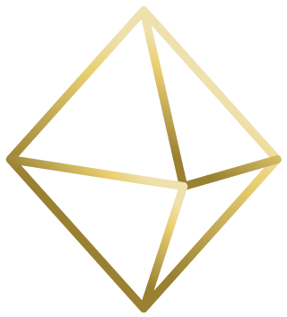

# 无标题

**链接地址:** http://mp.weixin.qq.com/s?__biz=MzI0MDQ0ODI0Ng==&mid=2247485740&idx=1&sn=e9c9bc3cabd7fa77690b33edb59c8ab8&chksm=e91beeb5de6c67a3874be5cd6497d6013c59b22640b3c414e63eafcb4064602cdacfe4822d61&mpshare=1&scene=2&srcid=0426b5NEIn5gOulAx5VcwaAA#rd
**作者:** 食老悦
**获取时间:** 2025/8/28 22:00:30
**图片数量:** 44

---

## 原始HTML内容

<section style="background-color: rgb(255, 255, 255);box-sizing: border-box;"><section class="Powered-by-XIUMI V5" style="box-sizing: border-box;" powered-by="xiumi.us"><section class="" style="text-align: center;box-sizing: border-box;"><section class="" style="display: inline-block;width: 98%;vertical-align: top;box-shadow: rgba(177, 160, 254, 0.39) 2.82843px 2.82843px 4px;border-color: rgba(169, 169, 169, 0.53);border-width: 4px;border-radius: 4px;border-style: outset;box-sizing: border-box;"><section class="Powered-by-XIUMI V5" style="box-sizing: border-box;" powered-by="xiumi.us"><section class="" style="box-sizing: border-box;"><section class="" style="display: inline-block;vertical-align: bottom;width: 33.33%;box-sizing: border-box;"><section class="Powered-by-XIUMI V5" style="box-sizing: border-box;" powered-by="xiumi.us"><section class="" style="margin-right: 0%;margin-left: 0%;box-sizing: border-box;"><section class="" style="max-width: 100%;vertical-align: middle;display: inline-block;overflow: hidden !important;box-sizing: border-box;"></section></section></section><section class="Powered-by-XIUMI V5" style="box-sizing: border-box;" powered-by="xiumi.us"><section class="" style="margin-right: 0%;margin-left: 0%;box-sizing: border-box;"><section class="" style="max-width: 100%;vertical-align: middle;display: inline-block;overflow: hidden !important;box-sizing: border-box;"></section></section></section></section><section class="" style="display: inline-block;vertical-align: bottom;width: 33.33%;box-sizing: border-box;"><section class="Powered-by-XIUMI V5" style="box-sizing: border-box;" powered-by="xiumi.us"><section class="" style="box-sizing: border-box;"><section class="" style="font-size: 12px;color: rgb(114, 113, 113);box-sizing: border-box;">
<strong style="box-sizing: border-box;">倾</strong><strong style="box-sizing: border-box;">诚</strong><strong style="letter-spacing: 0px;box-sizing: border-box;">为您服务！</strong> 
</section></section></section><section class="Powered-by-XIUMI V5" style="box-sizing: border-box;" powered-by="xiumi.us"><section class="" style="box-sizing: border-box;"><section class="" style="display: inline-block;width: 100%;vertical-align: top;overflow-x: auto;overflow-y: hidden;box-sizing: border-box;-webkit-overflow-scrolling: touch;"><section style="width: 300%;min-width: 100%;max-width: 300% !important;box-sizing: border-box;"><section class="Powered-by-XIUMI V5" style="display: inline-block;width: 33.3333%;vertical-align: top;box-sizing: border-box;" powered-by="xiumi.us"><section class="" style="text-align: right;margin-right: 0%;margin-left: 0%;box-sizing: border-box;"><section class="" style="max-width: 100%;vertical-align: middle;display: inline-block;overflow: hidden !important;box-sizing: border-box;"></section></section></section><section class="Powered-by-XIUMI V5" style="display: inline-block;width: 33.3333%;vertical-align: top;box-sizing: border-box;" powered-by="xiumi.us"><section class="" style="margin-right: 0%;margin-left: 0%;box-sizing: border-box;"><section class="" style="max-width: 100%;vertical-align: middle;display: inline-block;overflow: hidden !important;box-sizing: border-box;"></section></section></section><section class="Powered-by-XIUMI V5" style="display: inline-block;width: 33.3333%;vertical-align: top;box-sizing: border-box;" powered-by="xiumi.us"><section class="" style="text-align: left;margin-right: 0%;margin-left: 0%;box-sizing: border-box;"><section class="" style="max-width: 100%;vertical-align: middle;display: inline-block;overflow: hidden !important;box-sizing: border-box;"></section></section></section></section></section></section></section><section class="Powered-by-XIUMI V5" style="box-sizing: border-box;" powered-by="xiumi.us"><section class="" style="margin-right: 0%;margin-left: 0%;box-sizing: border-box;"><section class="" style="max-width: 100%;vertical-align: middle;display: inline-block;overflow: hidden !important;box-sizing: border-box;"></section></section></section></section><section class="" style="display: inline-block;vertical-align: bottom;width: 33.33%;box-sizing: border-box;"><section class="Powered-by-XIUMI V5" style="box-sizing: border-box;" powered-by="xiumi.us"><section class="" style="margin-right: 0%;margin-left: 0%;box-sizing: border-box;"><section class="" style="max-width: 100%;vertical-align: middle;display: inline-block;box-shadow: rgb(0, 0, 0) 0px 0px 0px;overflow: hidden !important;box-sizing: border-box;"></section></section></section><section class="Powered-by-XIUMI V5" style="box-sizing: border-box;" powered-by="xiumi.us"><section class="" style="margin-right: 0%;margin-left: 0%;box-sizing: border-box;"><section class="" style="max-width: 100%;vertical-align: middle;display: inline-block;width: 80%;overflow: hidden !important;box-sizing: border-box;"></section></section></section><section class="Powered-by-XIUMI V5" style="box-sizing: border-box;" powered-by="xiumi.us"><section class="" style="margin-right: 0%;margin-left: 0%;box-sizing: border-box;"><section class="" style="display: inline-block;border-width: 2px;border-style: solid;border-color: rgba(0, 0, 0, 0);padding: 0.1em 0.3em;color: rgb(62, 62, 62);line-height: 1.5;letter-spacing: 0px;font-size: 10px;box-sizing: border-box;">
长按二维码

获得更多资讯
</section></section></section></section></section></section></section></section></section><section class="Powered-by-XIUMI V5" style="box-sizing: border-box;" powered-by="xiumi.us"><section class="" style="margin-top: 10px;margin-bottom: 10px;box-sizing: border-box;"><section class="" style="padding-top: 2px;padding-bottom: 2px;box-sizing: border-box;"><section style="height: 4px;transform: rotate(0deg);-webkit-transform: rotate(0deg);-moz-transform: rotate(0deg);-o-transform: rotate(0deg);float: left;margin-top: -3px;background-color: rgb(254, 255, 255);box-sizing: border-box;"><section style="width: 4px;height: 4px;border-radius: 100%;float: left;background-color: rgba(227, 170, 78, 0.94);box-sizing: border-box;"></section><section style="width: 4px;height: 4px;border-radius: 100%;margin-left: 0.5em;float: left;background-color: rgba(227, 170, 78, 0.94);box-sizing: border-box;"></section><section style="width: 4px;height: 4px;border-radius: 100%;margin-left: 0.5em;float: left;background-color: rgba(227, 170, 78, 0.94);box-sizing: border-box;"></section><section style="width: 4px;height: 4px;border-radius: 100%;margin-left: 0.5em;float: left;background-color: rgba(227, 170, 78, 0.94);box-sizing: border-box;"></section><section style="width: 4px;height: 4px;border-radius: 100%;margin-left: 0.5em;float: left;background-color: rgba(227, 170, 78, 0.94);box-sizing: border-box;"></section></section><section style="border-top: 1px solid rgba(227, 170, 78, 0.94);margin-top: -2px;border-right-color: rgba(227, 170, 78, 0.94);border-bottom-color: rgba(227, 170, 78, 0.94);border-left-color: rgba(227, 170, 78, 0.94);box-sizing: border-box;"></section><section class="" style="width: 100%;padding: 10px;box-sizing: border-box;"><section class="Powered-by-XIUMI V5" style="box-sizing: border-box;" powered-by="xiumi.us"><section class="" style="box-sizing: border-box;"><section class="" style="text-align: center;letter-spacing: 2px;line-height: 1;box-sizing: border-box;">
<strong style="box-sizing: border-box;">置顶广告专区</strong> 

<strong style="box-sizing: border-box;">金主大大的广告不仅可以看，还可以“玩”。</strong>

<strong style="box-sizing: border-box;">滑动箭头解锁更多信息哦~</strong>
</section></section></section></section><section style="width: 100%;text-align: right;box-sizing: border-box;"><section style="height: 4px;margin-top: -2px;float: right;transform: rotate(0deg);-webkit-transform: rotate(0deg);-moz-transform: rotate(0deg);-o-transform: rotate(0deg);background-color: rgb(254, 255, 255);box-sizing: border-box;"><section style="width: 4px;height: 4px;border-radius: 100%;float: left;background-color: rgba(227, 170, 78, 0.94);box-sizing: border-box;"></section><section style="width: 4px;height: 4px;border-radius: 100%;margin-left: 0.5em;float: left;background-color: rgba(227, 170, 78, 0.94);box-sizing: border-box;"></section><section style="width: 4px;height: 4px;border-radius: 100%;margin-left: 0.5em;float: left;background-color: rgba(227, 170, 78, 0.94);box-sizing: border-box;"></section><section style="width: 4px;height: 4px;border-radius: 100%;margin-left: 0.5em;float: left;background-color: rgba(227, 170, 78, 0.94);box-sizing: border-box;"></section><section style="width: 4px;height: 4px;border-radius: 100%;margin-left: 0.5em;float: left;background-color: rgba(227, 170, 78, 0.94);box-sizing: border-box;"></section></section><section style="clear: both;box-sizing: border-box;"></section><section style="border-top: 1px solid rgba(227, 170, 78, 0.94);margin-top: -2px;margin-bottom: 2px;border-right-color: rgba(227, 170, 78, 0.94);border-bottom-color: rgba(227, 170, 78, 0.94);border-left-color: rgba(227, 170, 78, 0.94);box-sizing: border-box;"></section></section></section></section></section><section class="Powered-by-XIUMI V5" style="box-sizing: border-box;" powered-by="xiumi.us"><section class="" style="box-sizing: border-box;"><section class="" style="box-sizing: border-box;">
 
</section></section></section><section class="Powered-by-XIUMI V5" style="box-sizing: border-box;" powered-by="xiumi.us"><section class="" style="margin-top: 10px;margin-bottom: 10px;text-align: center;box-sizing: border-box;"><section class="" style="display: inline-block;box-sizing: border-box;"> <section class="" style="margin: 0.2em 0.5em -1.8em;padding-right: 5px;padding-left: 5px;box-sizing: border-box;">
序
</section> </section></section></section><section class="Powered-by-XIUMI V5" style="box-sizing: border-box;" powered-by="xiumi.us"><section class="" style="box-sizing: border-box;"><section class="" style="box-sizing: border-box;">
 
</section></section></section><section class="Powered-by-XIUMI V5" style="box-sizing: border-box;" powered-by="xiumi.us"><section class="" style="margin: 10px 0%;box-sizing: border-box;"><section class="" style="text-align: justify;font-size: 15px;line-height: 1.8;padding-right: 15px;padding-left: 15px;color: rgb(62, 62, 62);letter-spacing: 2px;box-sizing: border-box;">
这可能是我写过”质量“最差的推文了。图片模糊不清毫无美感，信息凌乱缺失难辨真伪，就连基础的文笔也没有经过太多推敲。但这却是我这段日子以来写得最感动的一篇文章。虽然不是每位读者都和我有着相同的经历，但希望你们可以在这篇文章中找到共鸣，将这些美食带给你们的美好的回忆永远珍藏在心里。
</section></section></section><section class="Powered-by-XIUMI V5" style="box-sizing: border-box;" powered-by="xiumi.us"><section class="" style="box-sizing: border-box;"><section class="" style="box-sizing: border-box;">
 
</section></section></section><section class="Powered-by-XIUMI V5" style="box-sizing: border-box;" powered-by="xiumi.us"><section class="" style="box-sizing: border-box;"><section class="" style="box-sizing: border-box;">
<qqmusic class="res_iframe qqmusic_iframe js_editor_qqmusic" scrolling="no" frameborder="0" musicid="4830481" mid="003WgIMf3cZfLm" albumurl="https://y.gtimg.cn/music/photo_new/T002R68x68M000003EsZjm0EF94J.jpg" audiourl="http://isure.stream.qqmusic.qq.com/C200003WgIMf3cZfLm.m4a?guid=2000001731&amp;vkey=E8A53AD832D63C8874C2A3AF61E32005A591FB21B3D95ACFFC530592FE990FD149DCC053F339834DFD7AD5974D5A1D62D1C2311A373E42D0&amp;uin=&amp;fromtag=50" music_name="那些年" singer="胡夏&nbsp;-&nbsp;燃点" play_length="369" src="/cgi-bin/readtemplate?t=tmpl/qqmusic_tmpl&amp;singer=%E8%83%A1%E5%A4%8F%20-%20%E7%87%83%E7%82%B9&amp;music_name=%E9%82%A3%E4%BA%9B%E5%B9%B4&amp;albumurl=https%3A%2F%2Fy.gtimg.cn%2Fmusic%2Fphoto_new%2FT002R68x68M000003EsZjm0EF94J.jpg&amp;musictype=1" musictype="1" otherid="003WgIMf3cZfLm" albumid="003EsZjm0EF94J" jumpurlkey=""></qqmusic>
</section></section></section><section class="Powered-by-XIUMI V5" style="box-sizing: border-box;" powered-by="xiumi.us"><section class="" style="margin-top: 10px;margin-bottom: 10px;text-align: center;box-sizing: border-box;"><section class="" style="display: inline-block;vertical-align: middle;box-sizing: border-box;"><section class="" style="max-width: 100%;display: inline-block;vertical-align: bottom;width: 1.6em;overflow: hidden !important;box-sizing: border-box;"></section><section class="" style="display: inline-block;vertical-align: bottom;padding-left: 5px;padding-right: 5px;line-height: 1.2em;margin-bottom: 2px;font-size: 18px;color: rgb(62, 62, 62);box-sizing: border-box;">
<strong style="box-sizing: border-box;">那些年陪我们一起走过的爱屯餐厅</strong>
</section><section class="" style="max-width: 100%;display: inline-block;vertical-align: bottom;width: 1.6em;overflow: hidden !important;box-sizing: border-box;"></section></section></section></section><section class="Powered-by-XIUMI V5" style="box-sizing: border-box;" powered-by="xiumi.us"><section class="" style="box-sizing: border-box;"><section class="" style="box-sizing: border-box;">
 
</section></section></section><section class="Powered-by-XIUMI V5" style="box-sizing: border-box;" powered-by="xiumi.us"><section class="" style="margin-top: 0.5em;margin-bottom: 0.5em;text-align: center;box-sizing: border-box;"><section class="" style="border-width: 1px;border-style: solid;border-color: rgb(204, 204, 204);box-shadow: rgb(204, 204, 204) 1px 1px 5px;display: inline-block;width: 100%;box-sizing: border-box;"><section class="" style="max-width: 100%;display: inline-block;overflow: hidden !important;box-sizing: border-box;"></section><section style="width: 100%;height: 1em;margin-top: -0.92em;box-sizing: border-box;"><section style="width: 45%;height: 1em;display: inline-block;vertical-align: top;background-color: rgb(254, 255, 255);box-sizing: border-box;"></section><section style="width: 0px;margin: auto;display: inline-block;vertical-align: top;border-left: 0.8em solid rgb(255, 255, 255);border-right: 0.8em solid rgb(255, 255, 255);border-bottom: 0.8em solid white;border-top: 0.55em solid transparent !important;box-sizing: border-box;"></section><section style="width: 45%;height: 1em;display: inline-block;vertical-align: top;background-color: rgb(254, 255, 255);box-sizing: border-box;"></section></section><section style="width: 100%;margin-top: -1em;box-sizing: border-box;"><section style="width: 10%;height: 1em;display: inline-block;vertical-align: top;background-color: rgb(254, 255, 255);box-sizing: border-box;"></section><section style="width: 10%;height: 1em;margin-left: 80%;display: inline-block;vertical-align: top;background-color: rgb(254, 255, 255);box-sizing: border-box;"></section></section><section class="" style="margin-top: -0.6em;padding: 10px;box-sizing: border-box;"><section class="Powered-by-XIUMI V5" style="box-sizing: border-box;" powered-by="xiumi.us"><section class="" style="box-sizing: border-box;"><section class="" style="font-size: 14px;color: rgba(62, 62, 62, 0.66);box-sizing: border-box;">
“危险动作，切勿模仿。”——李晨
</section></section></section></section></section></section></section><section class="Powered-by-XIUMI V5" style="box-sizing: border-box;" powered-by="xiumi.us"><section class="" style="box-sizing: border-box;"><section class="" style="box-sizing: border-box;">
 
</section></section></section><section class="Powered-by-XIUMI V5" style="box-sizing: border-box;" powered-by="xiumi.us"><section class="" style="margin: 10px 0%;box-sizing: border-box;"><section class="" style="text-align: justify;font-size: 15px;line-height: 1.8;padding-right: 15px;padding-left: 15px;color: rgb(62, 62, 62);letter-spacing: 2px;box-sizing: border-box;">
四月，是一个喜悦的时节。爱城漫长的冬季结束，迎来了春天第一缕温暖的阳光。考完试的你们终于可以放松心情，暂时逃避学业的压力，回国和亲朋好友团聚。同时也有一些同学已经完成了最后的一门大学考试，顺利为自己在加拿大的学习生活画上了完美句点。回首在屯子生活的这几年，那些有美食相伴着你走过的点点滴滴是不是还鲜活地跳动在脑袋里？如果一些小细节已经变得模糊不清，不妨跟食悦一起来这篇文章里搜索这些美好的回忆。
</section></section></section><section class="Powered-by-XIUMI V5" style="box-sizing: border-box;" powered-by="xiumi.us"><section class="" style="box-sizing: border-box;"><section class="" style="box-sizing: border-box;">
 
</section></section></section><section class="Powered-by-XIUMI V5" style="box-sizing: border-box;" powered-by="xiumi.us"><section class="" style="margin-top: 10px;margin-bottom: 10px;text-align: center;box-sizing: border-box;"><section class="" style="width: 80%;height: 3em;line-height: 3.2em;background-image: url(&quot;https://mmbiz.qpic.cn/mmbiz_png/XA8n2XaESnSenPD9Y1HnicEHT7GCV4o6KVicVv3OzorSo7TP4adE6jVFrGK6aBHchIjwdE7Vewc7pmbbdOMLiaUibg/640?wx_fmt=png&quot;);background-position: 50% 50%;background-repeat: no-repeat;background-size: contain;display: inline-block;box-sizing: border-box;"><section class="" style="box-sizing: border-box;">
<strong style="box-sizing: border-box;">UA篇</strong>
</section></section></section></section><section class="Powered-by-XIUMI V5" style="box-sizing: border-box;" powered-by="xiumi.us"><section class="" style="box-sizing: border-box;"><section class="" style="box-sizing: border-box;">
 
</section></section></section><section class="Powered-by-XIUMI V5" style="box-sizing: border-box;" powered-by="xiumi.us"><section class="" style="margin-top: 0.5em;margin-bottom: 0.5em;text-align: center;box-sizing: border-box;"><section class="" style="border-width: 1px;border-style: solid;border-color: rgb(204, 204, 204);box-shadow: rgb(204, 204, 204) 1px 1px 5px;display: inline-block;width: 100%;box-sizing: border-box;"><section class="" style="max-width: 100%;display: inline-block;overflow: hidden !important;box-sizing: border-box;"></section><section style="width: 100%;height: 1em;margin-top: -0.92em;box-sizing: border-box;"><section style="width: 45%;height: 1em;display: inline-block;vertical-align: top;background-color: rgb(254, 255, 255);box-sizing: border-box;"></section><section style="width: 0px;margin: auto;display: inline-block;vertical-align: top;border-left: 0.8em solid rgb(255, 255, 255);border-right: 0.8em solid rgb(255, 255, 255);border-bottom: 0.8em solid white;border-top: 0.55em solid transparent !important;box-sizing: border-box;"></section><section style="width: 45%;height: 1em;display: inline-block;vertical-align: top;background-color: rgb(254, 255, 255);box-sizing: border-box;"></section></section><section style="width: 100%;margin-top: -1em;box-sizing: border-box;"><section style="width: 10%;height: 1em;display: inline-block;vertical-align: top;background-color: rgb(254, 255, 255);box-sizing: border-box;"></section><section style="width: 10%;height: 1em;margin-left: 80%;display: inline-block;vertical-align: top;background-color: rgb(254, 255, 255);box-sizing: border-box;"></section></section><section class="" style="margin-top: -0.6em;padding: 10px;box-sizing: border-box;"><section class="Powered-by-XIUMI V5" style="box-sizing: border-box;" powered-by="xiumi.us"><section class="" style="box-sizing: border-box;"><section class="" style="text-align: justify;font-size: 14px;color: rgba(62, 62, 62, 0.66);box-sizing: border-box;">
HUB Mall，UA最大的“美食枢纽”，齐聚了全世界十几个国家的美食。是一栋集学生食堂，宿舍，商场，办事处等多功能于一体的综合楼。照片出处：HUB Mall google page。
</section></section></section></section></section></section></section><section class="Powered-by-XIUMI V5" style="box-sizing: border-box;" powered-by="xiumi.us"><section class="" style="box-sizing: border-box;"><section class="" style="box-sizing: border-box;">
 
</section></section></section><section class="Powered-by-XIUMI V5" style="box-sizing: border-box;" powered-by="xiumi.us"><section class="" style="margin: 10px 0%;box-sizing: border-box;"><section class="" style="text-align: justify;font-size: 15px;line-height: 1.8;padding-right: 15px;padding-left: 15px;color: rgb(62, 62, 62);letter-spacing: 2px;box-sizing: border-box;">
看着上面那条尴尬溢出屏幕的简介，大家是不是心里翻了一万个白眼？标题党说起来好听的“世界十几个国家的美食”，对于我们中国胃来说无非就是Hoho，<strong style="box-sizing: border-box;">韩国餐</strong>和<strong style="box-sizing: border-box;">Edo</strong>这几家了。在这上几年学该是把这Kimchi&nbsp;Jjigae和Teriyaki Beef早就吃到吐了吧？但是我保证毕业几年以后你总会有那么一天想要重返校园，再去吃一次这些曾经抚慰了你焦躁备考情绪，舒缓了你巨大学习压力的套餐呢。
</section></section></section><section class="Powered-by-XIUMI V5" style="box-sizing: border-box;" powered-by="xiumi.us"><section class="" style="box-sizing: border-box;"><section class="" style="box-sizing: border-box;">
 
</section></section></section><section class="Powered-by-XIUMI V5" style="box-sizing: border-box;" powered-by="xiumi.us"><section class="" style="margin-top: 0.5em;margin-bottom: 0.5em;text-align: center;box-sizing: border-box;"><section class="" style="border-width: 1px;border-style: solid;border-color: rgb(204, 204, 204);box-shadow: rgb(204, 204, 204) 1px 1px 5px;display: inline-block;width: 100%;box-sizing: border-box;"><section class="" style="max-width: 100%;display: inline-block;overflow: hidden !important;box-sizing: border-box;"></section><section style="width: 100%;height: 1em;margin-top: -0.92em;box-sizing: border-box;"><section style="width: 45%;height: 1em;display: inline-block;vertical-align: top;background-color: rgb(254, 255, 255);box-sizing: border-box;"></section><section style="width: 0px;margin: auto;display: inline-block;vertical-align: top;border-left: 0.8em solid rgb(255, 255, 255);border-right: 0.8em solid rgb(255, 255, 255);border-bottom: 0.8em solid white;border-top: 0.55em solid transparent !important;box-sizing: border-box;"></section><section style="width: 45%;height: 1em;display: inline-block;vertical-align: top;background-color: rgb(254, 255, 255);box-sizing: border-box;"></section></section><section style="width: 100%;margin-top: -1em;box-sizing: border-box;"><section style="width: 10%;height: 1em;display: inline-block;vertical-align: top;background-color: rgb(254, 255, 255);box-sizing: border-box;"></section><section style="width: 10%;height: 1em;margin-left: 80%;display: inline-block;vertical-align: top;background-color: rgb(254, 255, 255);box-sizing: border-box;"></section></section><section class="" style="margin-top: -0.6em;padding: 10px;box-sizing: border-box;"><section class="Powered-by-XIUMI V5" style="box-sizing: border-box;" powered-by="xiumi.us"><section class="" style="box-sizing: border-box;"><section class="" style="text-align: justify;font-size: 14px;color: rgba(62, 62, 62, 0.66);box-sizing: border-box;">
2010年的Hoho，菜单还是简单的白底绿字，那个爱看报纸爱买彩票的老板爷爷看起来还很年轻。图片出处：Chukwuma M. from Yelp
</section></section></section></section></section></section></section><section class="Powered-by-XIUMI V5" style="box-sizing: border-box;" powered-by="xiumi.us"><section class="" style="box-sizing: border-box;"><section class="" style="box-sizing: border-box;">
 
</section></section></section><section class="Powered-by-XIUMI V5" style="box-sizing: border-box;" powered-by="xiumi.us"><section class="" style="margin: 10px 0%;box-sizing: border-box;"><section class="" style="text-align: justify;font-size: 15px;line-height: 1.8;padding-right: 15px;padding-left: 15px;color: rgb(62, 62, 62);letter-spacing: 2px;box-sizing: border-box;">
说到HUB，就不能不提<strong style="box-sizing: border-box;">Hoho</strong>。UA容纳了数量庞大的华人学生和教职员工，却只有的起区区一家（看起来最接近的）华人餐馆。这样的供求比例让Hoho成为了集万千宠爱于一身的一枝独秀。高峰期的排队，小饭堂里的拥挤，专心听隔壁桌的学生吐槽着自己Econ101的Prof有多变态，甚至错过了老板娘在小喇叭里无数遍吼叫的<strong style="box-sizing: border-box;">“屎浇排骨饭”</strong>。再加上牛腩菜饭，麻婆豆腐饭和椒盐石斑饭，一学期不集齐这四颗龙珠，期末都不好意思召唤4.0的GPA。
</section></section></section><section class="Powered-by-XIUMI V5" style="box-sizing: border-box;" powered-by="xiumi.us"><section class="" style="box-sizing: border-box;"><section class="" style="box-sizing: border-box;">
 
</section></section></section><section class="Powered-by-XIUMI V5" style="box-sizing: border-box;" powered-by="xiumi.us"><section class="" style="margin-top: 0.5em;margin-bottom: 0.5em;text-align: center;box-sizing: border-box;"><section class="" style="border-width: 1px;border-style: solid;border-color: rgb(204, 204, 204);box-shadow: rgb(204, 204, 204) 1px 1px 5px;display: inline-block;width: 100%;box-sizing: border-box;"><section class="" style="max-width: 100%;display: inline-block;overflow: hidden !important;box-sizing: border-box;"></section><section style="width: 100%;height: 1em;margin-top: -0.92em;box-sizing: border-box;"><section style="width: 45%;height: 1em;display: inline-block;vertical-align: top;background-color: rgb(254, 255, 255);box-sizing: border-box;"></section><section style="width: 0px;margin: auto;display: inline-block;vertical-align: top;border-left: 0.8em solid rgb(255, 255, 255);border-right: 0.8em solid rgb(255, 255, 255);border-bottom: 0.8em solid white;border-top: 0.55em solid transparent !important;box-sizing: border-box;"></section><section style="width: 45%;height: 1em;display: inline-block;vertical-align: top;background-color: rgb(254, 255, 255);box-sizing: border-box;"></section></section><section style="width: 100%;margin-top: -1em;box-sizing: border-box;"><section style="width: 10%;height: 1em;display: inline-block;vertical-align: top;background-color: rgb(254, 255, 255);box-sizing: border-box;"></section><section style="width: 10%;height: 1em;margin-left: 80%;display: inline-block;vertical-align: top;background-color: rgb(254, 255, 255);box-sizing: border-box;"></section></section><section class="" style="margin-top: -0.6em;padding: 10px;box-sizing: border-box;"><section class="Powered-by-XIUMI V5" style="box-sizing: border-box;" powered-by="xiumi.us"><section class="" style="box-sizing: border-box;"><section class="" style="text-align: justify;font-size: 14px;color: rgba(62, 62, 62, 0.66);box-sizing: border-box;">
ETLC Tim Hortons的日常。一到课间饭点，长达三十多米的队伍已经排到Pizza 73的门口。为了买一杯咖啡上课迟到是常有的事。大家最喜欢的Ice Capp也是经常买不到的。图片出处：Nicholas Y. from Foursquares
</section></section></section></section></section></section></section><section class="Powered-by-XIUMI V5" style="box-sizing: border-box;" powered-by="xiumi.us"><section class="" style="box-sizing: border-box;"><section class="" style="box-sizing: border-box;">
 
</section></section></section><section class="Powered-by-XIUMI V5" style="box-sizing: border-box;" powered-by="xiumi.us"><section class="" style="margin: 10px 0%;box-sizing: border-box;"><section class="" style="text-align: justify;font-size: 15px;line-height: 1.8;padding-right: 15px;padding-left: 15px;color: rgb(62, 62, 62);letter-spacing: 2px;box-sizing: border-box;">
然而Hoho的队伍并非最长的。Cameron的<strong style="box-sizing: border-box;">Starbucks</strong>，ETLC的<strong style="box-sizing: border-box;">Tim Hortons</strong>还有SUB的<strong style="box-sizing: border-box;">Subway</strong>，很多同学应该都体验过排队半小时，吃饭三分钟的酸爽快感。然而时间似乎并没有那么难熬，因为总会有并肩作战的小伙伴陪着你等待。喝完这杯咖啡，我才有动力去继续“借鉴”同学的作业；啃完这口三明治，我才有精神去继续“效仿”大牛的Paper。
</section></section></section><section class="Powered-by-XIUMI V5" style="box-sizing: border-box;" powered-by="xiumi.us"><section class="" style="box-sizing: border-box;"><section class="" style="box-sizing: border-box;">
 
</section></section></section><section class="Powered-by-XIUMI V5" style="box-sizing: border-box;" powered-by="xiumi.us"><section class="" style="margin-top: 10px;margin-bottom: 10px;text-align: center;box-sizing: border-box;"><section class="" style="width: 80%;height: 3em;line-height: 3.2em;background-image: url(&quot;https://mmbiz.qpic.cn/mmbiz_png/XA8n2XaESnSenPD9Y1HnicEHT7GCV4o6KVicVv3OzorSo7TP4adE6jVFrGK6aBHchIjwdE7Vewc7pmbbdOMLiaUibg/640?wx_fmt=png&quot;);background-position: 50% 50%;background-repeat: no-repeat;background-size: contain;display: inline-block;box-sizing: border-box;"><section class="" style="box-sizing: border-box;">
<strong style="box-sizing: border-box;">川菜篇</strong>
</section></section></section></section><section class="Powered-by-XIUMI V5" style="box-sizing: border-box;" powered-by="xiumi.us"><section class="" style="box-sizing: border-box;"><section class="" style="box-sizing: border-box;">
 
</section></section></section><section class="Powered-by-XIUMI V5" style="box-sizing: border-box;" powered-by="xiumi.us"><section class="" style="margin-top: 0.5em;margin-bottom: 0.5em;text-align: center;box-sizing: border-box;"><section class="" style="border-width: 1px;border-style: solid;border-color: rgb(204, 204, 204);box-shadow: rgb(204, 204, 204) 1px 1px 5px;display: inline-block;width: 100%;box-sizing: border-box;"><section class="" style="max-width: 100%;display: inline-block;overflow: hidden !important;box-sizing: border-box;"></section><section style="width: 100%;height: 1em;margin-top: -0.92em;box-sizing: border-box;"><section style="width: 45%;height: 1em;display: inline-block;vertical-align: top;background-color: rgb(254, 255, 255);box-sizing: border-box;"></section><section style="width: 0px;margin: auto;display: inline-block;vertical-align: top;border-left: 0.8em solid rgb(255, 255, 255);border-right: 0.8em solid rgb(255, 255, 255);border-bottom: 0.8em solid white;border-top: 0.55em solid transparent !important;box-sizing: border-box;"></section><section style="width: 45%;height: 1em;display: inline-block;vertical-align: top;background-color: rgb(254, 255, 255);box-sizing: border-box;"></section></section><section style="width: 100%;margin-top: -1em;box-sizing: border-box;"><section style="width: 10%;height: 1em;display: inline-block;vertical-align: top;background-color: rgb(254, 255, 255);box-sizing: border-box;"></section><section style="width: 10%;height: 1em;margin-left: 80%;display: inline-block;vertical-align: top;background-color: rgb(254, 255, 255);box-sizing: border-box;"></section></section><section class="" style="margin-top: -0.6em;padding: 10px;box-sizing: border-box;"><section class="Powered-by-XIUMI V5" style="box-sizing: border-box;" powered-by="xiumi.us"><section class="" style="box-sizing: border-box;"><section class="" style="text-align: justify;font-size: 14px;color: rgba(62, 62, 62, 0.66);box-sizing: border-box;">
老“老川味”的老菜单，这个物价现在看起来是不是极其良心？图片出处：老川味人人小站 （没错，就是人人这个复古的网站！）
</section></section></section></section></section></section></section><section class="Powered-by-XIUMI V5" style="box-sizing: border-box;" powered-by="xiumi.us"><section class="" style="box-sizing: border-box;"><section class="" style="box-sizing: border-box;">
 
</section></section></section><section class="Powered-by-XIUMI V5" style="box-sizing: border-box;" powered-by="xiumi.us"><section class="" style="margin: 10px 0%;box-sizing: border-box;"><section class="" style="text-align: justify;font-size: 15px;line-height: 1.8;padding-right: 15px;padding-left: 15px;color: rgb(62, 62, 62);letter-spacing: 2px;box-sizing: border-box;">
食悦2008年刚到屯儿里下了飞机的第一件事儿就是打听哪里有好吃的川菜馆。前辈们都说最正宗的还属<strong style="box-sizing: border-box;">老川味</strong>。过去的老川味在如今的食尚面家那个位置。农村红绿花布袄装修风格特别接地气。和小伙伴们坐<strong style="box-sizing: border-box;">9路公交车</strong>去吃弹牙的凉拌面和需要提前预定的香辣蟹，那是逢年过节考试拿A才有的待遇。在漫长的一个小时等菜过程中我们也没闲着，男生激情澎湃的研究着<strong style="box-sizing: border-box;">LOL</strong>的英雄，女生七嘴八舌的点评着<strong style="box-sizing: border-box;">《非诚勿扰》</strong>的嘉宾。现在的老川味已经搬到离学生们更近的Whyte Ave，十五分钟内上菜的速度倒是让我不习惯了起来😂。
</section></section></section><section class="Powered-by-XIUMI V5" style="box-sizing: border-box;" powered-by="xiumi.us"><section class="" style="box-sizing: border-box;"><section class="" style="box-sizing: border-box;">
 
</section></section></section><section class="Powered-by-XIUMI V5" style="box-sizing: border-box;" powered-by="xiumi.us"><section class="" style="margin-top: 0.5em;margin-bottom: 0.5em;text-align: center;box-sizing: border-box;"><section class="" style="border-width: 1px;border-style: solid;border-color: rgb(204, 204, 204);box-shadow: rgb(204, 204, 204) 1px 1px 5px;display: inline-block;width: 100%;box-sizing: border-box;"><section class="" style="max-width: 100%;display: inline-block;overflow: hidden !important;box-sizing: border-box;"></section><section style="width: 100%;height: 1em;margin-top: -0.92em;box-sizing: border-box;"><section style="width: 45%;height: 1em;display: inline-block;vertical-align: top;background-color: rgb(254, 255, 255);box-sizing: border-box;"></section><section style="width: 0px;margin: auto;display: inline-block;vertical-align: top;border-left: 0.8em solid rgb(255, 255, 255);border-right: 0.8em solid rgb(255, 255, 255);border-bottom: 0.8em solid white;border-top: 0.55em solid transparent !important;box-sizing: border-box;"></section><section style="width: 45%;height: 1em;display: inline-block;vertical-align: top;background-color: rgb(254, 255, 255);box-sizing: border-box;"></section></section><section style="width: 100%;margin-top: -1em;box-sizing: border-box;"><section style="width: 10%;height: 1em;display: inline-block;vertical-align: top;background-color: rgb(254, 255, 255);box-sizing: border-box;"></section><section style="width: 10%;height: 1em;margin-left: 80%;display: inline-block;vertical-align: top;background-color: rgb(254, 255, 255);box-sizing: border-box;"></section></section><section class="" style="margin-top: -0.6em;padding: 10px;box-sizing: border-box;"><section class="Powered-by-XIUMI V5" style="box-sizing: border-box;" powered-by="xiumi.us"><section class="" style="box-sizing: border-box;"><section class="" style="text-align: justify;font-size: 14px;color: rgba(62, 62, 62, 0.66);box-sizing: border-box;">
2013年蜀香门地的外卖送餐信息。这配色真是相当青春了。图片出处：蜀香门地人人小站 （没错，还是人人这个复古的网站！）
</section></section></section></section></section></section></section><section class="Powered-by-XIUMI V5" style="box-sizing: border-box;" powered-by="xiumi.us"><section class="" style="box-sizing: border-box;"><section class="" style="box-sizing: border-box;">
 
</section></section></section><section class="Powered-by-XIUMI V5" style="box-sizing: border-box;" powered-by="xiumi.us"><section class="" style="margin: 10px 0%;box-sizing: border-box;"><section class="" style="text-align: justify;font-size: 15px;line-height: 1.8;padding-right: 15px;padding-left: 15px;color: rgb(62, 62, 62);letter-spacing: 2px;box-sizing: border-box;">
当时的另一家川菜就是<strong style="box-sizing: border-box;">蜀香门地</strong>了。从地铁站走到蜀香门地（现在的桃乐鱼汤米线）要穿过整个阴森的Chinatown，所以不是三五结伴根本不敢去吃。还记得蜀香门地里面挂着一副巨大的<strong style="box-sizing: border-box;">中国国旗</strong>，每次特别喜气的老板娘都会热情地过来问：“今天要吃点啥儿”。这让当年刚到加拿大留学的我找到了<strong style="box-sizing: border-box;">回家的感觉</strong>。蜀香门地一度是我最常光顾的中餐馆，地三鲜，<strong style="box-sizing: border-box;">大盘儿鸡</strong>和<strong style="box-sizing: border-box;">陶锅沸腾鱼</strong>都是记忆中不会消逝的美好回忆。虽然现在蜀香门地已经结业了，但这些美味的菜肴在星马印里的北方夜换了个名字继续陪伴我们。
</section></section></section><section class="Powered-by-XIUMI V5" style="box-sizing: border-box;" powered-by="xiumi.us"><section class="" style="box-sizing: border-box;"><section class="" style="box-sizing: border-box;">
 
</section></section></section><section class="Powered-by-XIUMI V5" style="box-sizing: border-box;" powered-by="xiumi.us"><section class="" style="margin-top: 0.5em;margin-bottom: 0.5em;text-align: center;box-sizing: border-box;"><section class="" style="border-width: 1px;border-style: solid;border-color: rgb(204, 204, 204);box-shadow: rgb(204, 204, 204) 1px 1px 5px;display: inline-block;width: 100%;box-sizing: border-box;"><section class="" style="max-width: 100%;display: inline-block;overflow: hidden !important;box-sizing: border-box;"></section><section style="width: 100%;height: 1em;margin-top: -0.92em;box-sizing: border-box;"><section style="width: 45%;height: 1em;display: inline-block;vertical-align: top;background-color: rgb(254, 255, 255);box-sizing: border-box;"></section><section style="width: 0px;margin: auto;display: inline-block;vertical-align: top;border-left: 0.8em solid rgb(255, 255, 255);border-right: 0.8em solid rgb(255, 255, 255);border-bottom: 0.8em solid white;border-top: 0.55em solid transparent !important;box-sizing: border-box;"></section><section style="width: 45%;height: 1em;display: inline-block;vertical-align: top;background-color: rgb(254, 255, 255);box-sizing: border-box;"></section></section><section style="width: 100%;margin-top: -1em;box-sizing: border-box;"><section style="width: 10%;height: 1em;display: inline-block;vertical-align: top;background-color: rgb(254, 255, 255);box-sizing: border-box;"></section><section style="width: 10%;height: 1em;margin-left: 80%;display: inline-block;vertical-align: top;background-color: rgb(254, 255, 255);box-sizing: border-box;"></section></section><section class="" style="margin-top: -0.6em;padding: 10px;box-sizing: border-box;"><section class="Powered-by-XIUMI V5" style="box-sizing: border-box;" powered-by="xiumi.us"><section class="" style="box-sizing: border-box;"><section class="" style="text-align: justify;font-size: 14px;color: rgba(62, 62, 62, 0.66);box-sizing: border-box;">
2016年的金四川的名气不用多说，迁店于dt新址不甚久即传出结业消息就伤透了广大屯民的心。不过半年的等待并没有白费，如今的重庆火锅正以更加丰富多彩活力迸发的姿态带给我们更多的惊喜。图片出处：google map
</section></section></section></section></section></section></section><section class="Powered-by-XIUMI V5" style="box-sizing: border-box;" powered-by="xiumi.us"><section class="" style="box-sizing: border-box;"><section class="" style="box-sizing: border-box;">
 
</section></section></section><section class="Powered-by-XIUMI V5" style="box-sizing: border-box;" powered-by="xiumi.us"><section class="" style="margin: 10px 0%;box-sizing: border-box;"><section class="" style="text-align: justify;font-size: 15px;line-height: 1.8;padding-right: 15px;padding-left: 15px;color: rgb(62, 62, 62);letter-spacing: 2px;box-sizing: border-box;">
再晚几年出来留学的同学们就比较享福了，2010年开始屯子里就相继开业了许多川菜馆。刚开始的<strong style="box-sizing: border-box;">满江红</strong>，也就是俗称的“鸟巢”，以一锅‘江湖馋嘴鱼“俘获了我的心（胃）；后来换成了<strong style="box-sizing: border-box;">麟泉阁</strong>，又爱上了他家的肉丝炒饼。再到后来的<strong style="box-sizing: border-box;">金四川</strong>的尖椒风暴鸡，是我点过外卖最多的商家。接着有醉长安和云之南，富有特色品质升级的优质中餐馆越来越多。现在的顾客可能不会像当年的我们一样对一两家餐厅如此着迷，但真要说出特别喜欢的，相信每个人心里都还是有个答案。
</section></section></section><section class="Powered-by-XIUMI V5" style="box-sizing: border-box;" powered-by="xiumi.us"><section class="" style="box-sizing: border-box;"><section class="" style="box-sizing: border-box;">
 
</section></section></section><section class="Powered-by-XIUMI V5" style="box-sizing: border-box;" powered-by="xiumi.us"><section class="" style="margin-top: 10px;margin-bottom: 10px;text-align: center;box-sizing: border-box;"><section class="" style="width: 80%;height: 3em;line-height: 3.2em;background-image: url(&quot;https://mmbiz.qpic.cn/mmbiz_png/XA8n2XaESnSenPD9Y1HnicEHT7GCV4o6KVicVv3OzorSo7TP4adE6jVFrGK6aBHchIjwdE7Vewc7pmbbdOMLiaUibg/640?wx_fmt=png&quot;);background-position: 50% 50%;background-repeat: no-repeat;background-size: contain;display: inline-block;box-sizing: border-box;"><section class="" style="box-sizing: border-box;">
<strong style="box-sizing: border-box;">粤菜篇</strong>
</section></section></section></section><section class="Powered-by-XIUMI V5" style="box-sizing: border-box;" powered-by="xiumi.us"><section class="" style="box-sizing: border-box;"><section class="" style="box-sizing: border-box;">
 
</section></section></section><section class="Powered-by-XIUMI V5" style="box-sizing: border-box;" powered-by="xiumi.us"><section class="" style="box-sizing: border-box;"><section class="" style="box-sizing: border-box;">
 
</section></section></section><section class="Powered-by-XIUMI V5" style="box-sizing: border-box;" powered-by="xiumi.us"><section class="" style="margin-top: 0.5em;margin-bottom: 0.5em;text-align: center;box-sizing: border-box;"><section class="" style="border-width: 1px;border-style: solid;border-color: rgb(204, 204, 204);box-shadow: rgb(204, 204, 204) 1px 1px 5px;display: inline-block;width: 100%;box-sizing: border-box;"><section class="" style="max-width: 100%;display: inline-block;overflow: hidden !important;box-sizing: border-box;"></section><section style="width: 100%;height: 1em;margin-top: -0.92em;box-sizing: border-box;"><section style="width: 45%;height: 1em;display: inline-block;vertical-align: top;background-color: rgb(254, 255, 255);box-sizing: border-box;"></section><section style="width: 0px;margin: auto;display: inline-block;vertical-align: top;border-left: 0.8em solid rgb(255, 255, 255);border-right: 0.8em solid rgb(255, 255, 255);border-bottom: 0.8em solid white;border-top: 0.55em solid transparent !important;box-sizing: border-box;"></section><section style="width: 45%;height: 1em;display: inline-block;vertical-align: top;background-color: rgb(254, 255, 255);box-sizing: border-box;"></section></section><section style="width: 100%;margin-top: -1em;box-sizing: border-box;"><section style="width: 10%;height: 1em;display: inline-block;vertical-align: top;background-color: rgb(254, 255, 255);box-sizing: border-box;"></section><section style="width: 10%;height: 1em;margin-left: 80%;display: inline-block;vertical-align: top;background-color: rgb(254, 255, 255);box-sizing: border-box;"></section></section><section class="" style="margin-top: -0.6em;padding: 10px;box-sizing: border-box;"><section class="Powered-by-XIUMI V5" style="box-sizing: border-box;" powered-by="xiumi.us"><section class="" style="box-sizing: border-box;"><section class="" style="text-align: justify;font-size: 14px;color: rgba(62, 62, 62, 0.66);box-sizing: border-box;">
门庭若市的潮楼早茶，等位时间不长，也就半个多小时吧😅。图片出处：Kristin K. from Yelp
</section></section></section></section></section></section></section><section class="Powered-by-XIUMI V5" style="box-sizing: border-box;" powered-by="xiumi.us"><section class="" style="box-sizing: border-box;"><section class="" style="box-sizing: border-box;">
 
</section></section></section><section class="Powered-by-XIUMI V5" style="box-sizing: border-box;" powered-by="xiumi.us"><section class="" style="margin: 10px 0%;box-sizing: border-box;"><section class="" style="text-align: justify;font-size: 15px;line-height: 1.8;padding-right: 15px;padding-left: 15px;color: rgb(62, 62, 62);letter-spacing: 2px;box-sizing: border-box;">
在北方长大的食悦本来没有喝<strong style="box-sizing: border-box;">早茶</strong>的习惯。来了不久居然变成那个每周日都会提议：“走，去<strong style="box-sizing: border-box;">潮楼</strong>喝个早茶”人。因为刚来时这个城市的粤菜占中餐比例太大，再加上身边讲粤语的小伙伴又多，所以被他们带着，吃着吃着就习惯了。水晶虾饺，萝卜糕，肠粉，凤爪，排骨饭…这些口味清淡健康的食物作为日常餐饮负担最小。就这样一个无辣不欢的“好吃狗儿”被调教成一个滴辣不占的佛系青年。
</section></section></section><section class="Powered-by-XIUMI V5" style="box-sizing: border-box;" powered-by="xiumi.us"><section class="" style="box-sizing: border-box;"><section class="" style="box-sizing: border-box;">
 
</section></section></section><section class="Powered-by-XIUMI V5" style="box-sizing: border-box;" powered-by="xiumi.us"><section class="" style="margin-top: 0.5em;margin-bottom: 0.5em;text-align: center;box-sizing: border-box;"><section class="" style="border-width: 1px;border-style: solid;border-color: rgb(204, 204, 204);box-shadow: rgb(204, 204, 204) 1px 1px 5px;display: inline-block;width: 100%;box-sizing: border-box;"><section class="" style="max-width: 100%;display: inline-block;overflow: hidden !important;box-sizing: border-box;"></section><section style="width: 100%;height: 1em;margin-top: -0.92em;box-sizing: border-box;"><section style="width: 45%;height: 1em;display: inline-block;vertical-align: top;background-color: rgb(254, 255, 255);box-sizing: border-box;"></section><section style="width: 0px;margin: auto;display: inline-block;vertical-align: top;border-left: 0.8em solid rgb(255, 255, 255);border-right: 0.8em solid rgb(255, 255, 255);border-bottom: 0.8em solid white;border-top: 0.55em solid transparent !important;box-sizing: border-box;"></section><section style="width: 45%;height: 1em;display: inline-block;vertical-align: top;background-color: rgb(254, 255, 255);box-sizing: border-box;"></section></section><section style="width: 100%;margin-top: -1em;box-sizing: border-box;"><section style="width: 10%;height: 1em;display: inline-block;vertical-align: top;background-color: rgb(254, 255, 255);box-sizing: border-box;"></section><section style="width: 10%;height: 1em;margin-left: 80%;display: inline-block;vertical-align: top;background-color: rgb(254, 255, 255);box-sizing: border-box;"></section></section><section class="" style="margin-top: -0.6em;padding: 10px;box-sizing: border-box;"><section class="Powered-by-XIUMI V5" style="box-sizing: border-box;" powered-by="xiumi.us"><section class="" style="box-sizing: border-box;"><section class="" style="text-align: justify;font-size: 14px;color: rgba(62, 62, 62, 0.66);box-sizing: border-box;">
营业到凌晨四点的大家乐，是屯民们真正的“深夜食堂”。图片出处：Jonny M. from Yelp
</section></section></section></section></section></section></section><section class="Powered-by-XIUMI V5" style="box-sizing: border-box;" powered-by="xiumi.us"><section class="" style="box-sizing: border-box;"><section class="" style="box-sizing: border-box;">
 
</section></section></section><section class="Powered-by-XIUMI V5" style="box-sizing: border-box;" powered-by="xiumi.us"><section class="" style="margin: 10px 0%;box-sizing: border-box;"><section class="" style="text-align: justify;font-size: 15px;line-height: 1.8;padding-right: 15px;padding-left: 15px;color: rgb(62, 62, 62);letter-spacing: 2px;box-sizing: border-box;">
在各大外卖软件风行之前，这个城市的外卖业务还需亲自打电话去跟店家确认。而留学生们”吃到吐“的<strong style="box-sizing: border-box;">大家乐</strong>绝对是当时外卖业务的霸主。<strong style="box-sizing: border-box;">土豆牛腩饭</strong>，<strong style="box-sizing: border-box;">蜜桃虾</strong>和冻奶茶是我每次点大家乐的标配。学生时代日夜颠倒熬夜赶due的时候很多，营业到凌晨四点的大家乐才是我的亲爹。深夜的大家乐是一个神奇的存在，喝得醉醺醺的吵闹酒鬼，加班到后半夜的公司职员还有带着小情人在外幽会的中年大叔…深夜是一个人类心理最脆弱疲惫渴望安抚的时段，于是各种悲欢离合人间狗血在这里轮流上演，如同电视剧般的精彩。
</section></section></section><section class="Powered-by-XIUMI V5" style="box-sizing: border-box;" powered-by="xiumi.us"><section class="" style="box-sizing: border-box;"><section class="" style="box-sizing: border-box;">
 
</section></section></section><section class="Powered-by-XIUMI V5" style="box-sizing: border-box;" powered-by="xiumi.us"><section class="" style="margin-top: 10px;margin-bottom: 10px;text-align: center;box-sizing: border-box;"><section class="" style="width: 80%;height: 3em;line-height: 3.2em;background-image: url(&quot;https://mmbiz.qpic.cn/mmbiz_png/XA8n2XaESnSenPD9Y1HnicEHT7GCV4o6KVicVv3OzorSo7TP4adE6jVFrGK6aBHchIjwdE7Vewc7pmbbdOMLiaUibg/640?wx_fmt=png&quot;);background-position: 50% 50%;background-repeat: no-repeat;background-size: contain;display: inline-block;box-sizing: border-box;"><section class="" style="box-sizing: border-box;">
<strong style="box-sizing: border-box;">火锅篇</strong>
</section></section></section></section><section class="Powered-by-XIUMI V5" style="box-sizing: border-box;" powered-by="xiumi.us"><section class="" style="box-sizing: border-box;"><section class="" style="box-sizing: border-box;">
 
</section></section></section><section class="Powered-by-XIUMI V5" style="box-sizing: border-box;" powered-by="xiumi.us"><section class="" style="margin-top: 0.5em;margin-bottom: 0.5em;text-align: center;box-sizing: border-box;"><section class="" style="border-width: 1px;border-style: solid;border-color: rgb(204, 204, 204);box-shadow: rgb(204, 204, 204) 1px 1px 5px;display: inline-block;width: 100%;box-sizing: border-box;"><section class="" style="max-width: 100%;display: inline-block;overflow: hidden !important;box-sizing: border-box;"></section><section style="width: 100%;height: 1em;margin-top: -0.92em;box-sizing: border-box;"><section style="width: 45%;height: 1em;display: inline-block;vertical-align: top;background-color: rgb(254, 255, 255);box-sizing: border-box;"></section><section style="width: 0px;margin: auto;display: inline-block;vertical-align: top;border-left: 0.8em solid rgb(255, 255, 255);border-right: 0.8em solid rgb(255, 255, 255);border-bottom: 0.8em solid white;border-top: 0.55em solid transparent !important;box-sizing: border-box;"></section><section style="width: 45%;height: 1em;display: inline-block;vertical-align: top;background-color: rgb(254, 255, 255);box-sizing: border-box;"></section></section><section style="width: 100%;margin-top: -1em;box-sizing: border-box;"><section style="width: 10%;height: 1em;display: inline-block;vertical-align: top;background-color: rgb(254, 255, 255);box-sizing: border-box;"></section><section style="width: 10%;height: 1em;margin-left: 80%;display: inline-block;vertical-align: top;background-color: rgb(254, 255, 255);box-sizing: border-box;"></section></section><section class="" style="margin-top: -0.6em;padding: 10px;box-sizing: border-box;"><section class="Powered-by-XIUMI V5" style="box-sizing: border-box;" powered-by="xiumi.us"><section class="" style="box-sizing: border-box;"><section class="" style="text-align: justify;font-size: 14px;color: rgba(62, 62, 62, 0.66);box-sizing: border-box;">
四宝火锅和隔壁的barcode KTV，是当年我们吃喝玩乐一条龙的地方，虽然条件简陋，但也时给我们留下最多美好回忆的地方。图片出处：google map
</section></section></section></section></section></section></section><section class="Powered-by-XIUMI V5" style="box-sizing: border-box;" powered-by="xiumi.us"><section class="" style="box-sizing: border-box;"><section class="" style="box-sizing: border-box;">
 
</section></section></section><section class="Powered-by-XIUMI V5" style="box-sizing: border-box;" powered-by="xiumi.us"><section class="" style="margin: 10px 0%;box-sizing: border-box;"><section class="" style="text-align: justify;font-size: 15px;line-height: 1.8;padding-right: 15px;padding-left: 15px;color: rgb(62, 62, 62);letter-spacing: 2px;box-sizing: border-box;">
说到爱屯美食，就不能不提<strong style="box-sizing: border-box;">火锅</strong>。爱屯因寒冷气候和漫长冬天造就了一个极其适于火锅繁衍成长的土壤，被戏称为加拿大的“火锅之都”。而十年前的爱屯，实际上也只有<strong style="box-sizing: border-box;">四宝</strong>，也就是如今的众品鑫这样一家华人经营的火锅店。一桌子小留学生围着一个小铜锅有说有笑的抢着那几片还没煮熟的肉，烟雾的白气都模糊了厚厚的眼镜片儿。毕竟这是咱当时唯一可以吃到火锅的地方。
</section></section></section><section class="Powered-by-XIUMI V5" style="box-sizing: border-box;" powered-by="xiumi.us"><section class="" style="box-sizing: border-box;"><section class="" style="box-sizing: border-box;">
 
</section></section></section><section class="Powered-by-XIUMI V5" style="box-sizing: border-box;" powered-by="xiumi.us"><section class="" style="margin-top: 0.5em;margin-bottom: 0.5em;text-align: center;box-sizing: border-box;"><section class="" style="border-width: 1px;border-style: solid;border-color: rgb(204, 204, 204);box-shadow: rgb(204, 204, 204) 1px 1px 5px;display: inline-block;width: 100%;box-sizing: border-box;"><section class="" style="max-width: 100%;display: inline-block;overflow: hidden !important;box-sizing: border-box;"></section><section style="width: 100%;height: 1em;margin-top: -0.92em;box-sizing: border-box;"><section style="width: 45%;height: 1em;display: inline-block;vertical-align: top;background-color: rgb(254, 255, 255);box-sizing: border-box;"></section><section style="width: 0px;margin: auto;display: inline-block;vertical-align: top;border-left: 0.8em solid rgb(255, 255, 255);border-right: 0.8em solid rgb(255, 255, 255);border-bottom: 0.8em solid white;border-top: 0.55em solid transparent !important;box-sizing: border-box;"></section><section style="width: 45%;height: 1em;display: inline-block;vertical-align: top;background-color: rgb(254, 255, 255);box-sizing: border-box;"></section></section><section style="width: 100%;margin-top: -1em;box-sizing: border-box;"><section style="width: 10%;height: 1em;display: inline-block;vertical-align: top;background-color: rgb(254, 255, 255);box-sizing: border-box;"></section><section style="width: 10%;height: 1em;margin-left: 80%;display: inline-block;vertical-align: top;background-color: rgb(254, 255, 255);box-sizing: border-box;"></section></section><section class="" style="margin-top: -0.6em;padding: 10px;box-sizing: border-box;"><section class="Powered-by-XIUMI V5" style="box-sizing: border-box;" powered-by="xiumi.us"><section class="" style="box-sizing: border-box;"><section class="" style="text-align: justify;font-size: 14px;color: rgba(62, 62, 62, 0.66);box-sizing: border-box;">
明火锅dt店的开业在当年的华人美食圈的热度可以说是现象级的。前无古人后无来者。其火爆程度宛若2005年的那届超女。图片出处：明火锅 google page
</section></section></section></section></section></section></section><section class="Powered-by-XIUMI V5" style="box-sizing: border-box;" powered-by="xiumi.us"><section class="" style="box-sizing: border-box;"><section class="" style="box-sizing: border-box;">
 
</section></section></section><section class="Powered-by-XIUMI V5" style="box-sizing: border-box;" powered-by="xiumi.us"><section class="" style="margin: 10px 0%;box-sizing: border-box;"><section class="" style="text-align: justify;font-size: 15px;line-height: 1.8;padding-right: 15px;padding-left: 15px;color: rgb(62, 62, 62);letter-spacing: 2px;box-sizing: border-box;">
然而<strong style="box-sizing: border-box;">明火锅</strong>的横空出世，将这个城市对于火锅的热情和期待都推到了顶点。一人一锅的形式不仅更加卫生，也大大提高了用餐效率和自由度。于是明火锅就以迅雷不及掩耳之势火了起来。打电话去定了位依然在门口<strong style="box-sizing: border-box;">排队一个小时</strong>在开业初期也十分常见，周末晚上往往门口排队的人比店里进餐的人都多。如今的明火锅依然人气不减，还被本地生活类杂志《Avenue》评选进入了<strong style="box-sizing: border-box;">爱城最佳宵夜餐厅的第三名</strong>，可见它在西人圈的影响力也不可小觑。
</section></section></section><section class="Powered-by-XIUMI V5" style="box-sizing: border-box;" powered-by="xiumi.us"><section class="" style="box-sizing: border-box;"><section class="" style="box-sizing: border-box;">
 
</section></section></section><section class="Powered-by-XIUMI V5" style="box-sizing: border-box;" powered-by="xiumi.us"><section class="" style="margin-top: 0.5em;margin-bottom: 0.5em;text-align: center;box-sizing: border-box;"><section class="" style="border-width: 1px;border-style: solid;border-color: rgb(204, 204, 204);box-shadow: rgb(204, 204, 204) 1px 1px 5px;display: inline-block;width: 100%;box-sizing: border-box;"><section class="" style="max-width: 100%;display: inline-block;overflow: hidden !important;box-sizing: border-box;"></section><section style="width: 100%;height: 1em;margin-top: -0.92em;box-sizing: border-box;"><section style="width: 45%;height: 1em;display: inline-block;vertical-align: top;background-color: rgb(254, 255, 255);box-sizing: border-box;"></section><section style="width: 0px;margin: auto;display: inline-block;vertical-align: top;border-left: 0.8em solid rgb(255, 255, 255);border-right: 0.8em solid rgb(255, 255, 255);border-bottom: 0.8em solid white;border-top: 0.55em solid transparent !important;box-sizing: border-box;"></section><section style="width: 45%;height: 1em;display: inline-block;vertical-align: top;background-color: rgb(254, 255, 255);box-sizing: border-box;"></section></section><section style="width: 100%;margin-top: -1em;box-sizing: border-box;"><section style="width: 10%;height: 1em;display: inline-block;vertical-align: top;background-color: rgb(254, 255, 255);box-sizing: border-box;"></section><section style="width: 10%;height: 1em;margin-left: 80%;display: inline-block;vertical-align: top;background-color: rgb(254, 255, 255);box-sizing: border-box;"></section></section><section class="" style="margin-top: -0.6em;padding: 10px;box-sizing: border-box;"><section class="Powered-by-XIUMI V5" style="box-sizing: border-box;" powered-by="xiumi.us"><section class="" style="box-sizing: border-box;"><section class="" style="text-align: justify;font-size: 14px;color: rgba(62, 62, 62, 0.66);box-sizing: border-box;">
2013年的锅居，在现在刘一手所在的位置。不知为何多年以后回想起来对它家记忆最深刻的居然是那个到处都是Hello Kitty的女厕所。这也算是美好回忆的一部分吧。🤣 图片出处：Urban Shabu Facebook
</section></section></section></section></section></section></section><section class="Powered-by-XIUMI V5" style="box-sizing: border-box;" powered-by="xiumi.us"><section class="" style="box-sizing: border-box;"><section class="" style="box-sizing: border-box;">
 
</section></section></section><section class="Powered-by-XIUMI V5" style="box-sizing: border-box;" powered-by="xiumi.us"><section class="" style="margin: 10px 0%;box-sizing: border-box;"><section class="" style="text-align: justify;font-size: 15px;line-height: 1.8;padding-right: 15px;padding-left: 15px;color: rgb(62, 62, 62);letter-spacing: 2px;box-sizing: border-box;">
明火锅的成功也启发了众多商家去发掘这样运营模式的巨大商机。让顾客自己烹煮食材的步骤可以有效的节省人力开支，也可以减少用餐高峰期后厨堆单压力。后来爱屯的火锅事业欣欣向荣，火锅店越开越多：<strong style="box-sizing: border-box;">97涮涮</strong>，<strong style="box-sizing: border-box;">锅居</strong>还有<strong style="box-sizing: border-box;">德记</strong>，等等。每个单拎出来食老悦都能顺着回忆再接着码它个一万八千字呢。
</section></section></section><section class="Powered-by-XIUMI V5" style="box-sizing: border-box;" powered-by="xiumi.us"><section class="" style="box-sizing: border-box;"><section class="" style="box-sizing: border-box;">
 
</section></section></section><section class="Powered-by-XIUMI V5" style="box-sizing: border-box;" powered-by="xiumi.us"><section class="" style="margin-top: 10px;margin-bottom: 10px;text-align: center;box-sizing: border-box;"><section class="" style="width: 80%;height: 3em;line-height: 3.2em;background-image: url(&quot;https://mmbiz.qpic.cn/mmbiz_png/XA8n2XaESnSenPD9Y1HnicEHT7GCV4o6KVicVv3OzorSo7TP4adE6jVFrGK6aBHchIjwdE7Vewc7pmbbdOMLiaUibg/640?wx_fmt=png&quot;);background-position: 50% 50%;background-repeat: no-repeat;background-size: contain;display: inline-block;box-sizing: border-box;"><section class="" style="box-sizing: border-box;">
<strong style="box-sizing: border-box;">奶茶篇</strong>
</section></section></section></section><section class="Powered-by-XIUMI V5" style="box-sizing: border-box;" powered-by="xiumi.us"><section class="" style="box-sizing: border-box;"><section class="" style="box-sizing: border-box;">
 
</section></section></section><section class="Powered-by-XIUMI V5" style="box-sizing: border-box;" powered-by="xiumi.us"><section class="" style="margin-top: 0.5em;margin-bottom: 0.5em;text-align: center;box-sizing: border-box;"><section class="" style="border-width: 1px;border-style: solid;border-color: rgb(204, 204, 204);box-shadow: rgb(204, 204, 204) 1px 1px 5px;display: inline-block;width: 100%;box-sizing: border-box;"><section class="" style="max-width: 100%;display: inline-block;overflow: hidden !important;box-sizing: border-box;"></section><section style="width: 100%;height: 1em;margin-top: -0.92em;box-sizing: border-box;"><section style="width: 45%;height: 1em;display: inline-block;vertical-align: top;background-color: rgb(254, 255, 255);box-sizing: border-box;"></section><section style="width: 0px;margin: auto;display: inline-block;vertical-align: top;border-left: 0.8em solid rgb(255, 255, 255);border-right: 0.8em solid rgb(255, 255, 255);border-bottom: 0.8em solid white;border-top: 0.55em solid transparent !important;box-sizing: border-box;"></section><section style="width: 45%;height: 1em;display: inline-block;vertical-align: top;background-color: rgb(254, 255, 255);box-sizing: border-box;"></section></section><section style="width: 100%;margin-top: -1em;box-sizing: border-box;"><section style="width: 10%;height: 1em;display: inline-block;vertical-align: top;background-color: rgb(254, 255, 255);box-sizing: border-box;"></section><section style="width: 10%;height: 1em;margin-left: 80%;display: inline-block;vertical-align: top;background-color: rgb(254, 255, 255);box-sizing: border-box;"></section></section><section class="" style="margin-top: -0.6em;padding: 10px;box-sizing: border-box;"><section class="Powered-by-XIUMI V5" style="box-sizing: border-box;" powered-by="xiumi.us"><section class="" style="box-sizing: border-box;"><section class="" style="text-align: justify;font-size: 14px;color: rgba(62, 62, 62, 0.66);box-sizing: border-box;">
2010年Whyte Ave上的台湾奶茶，也就是现在的赤炸。那些寄卖的小首饰手机壳早已不见了踪影，但书架上积了尘的厚重微积分课本还在思念着没有怎么宠幸过它的主人。图片出处：Alex from Zomato
</section></section></section></section></section></section></section><section class="Powered-by-XIUMI V5" style="box-sizing: border-box;" powered-by="xiumi.us"><section class="" style="box-sizing: border-box;"><section class="" style="box-sizing: border-box;">
 
</section></section></section><section class="Powered-by-XIUMI V5" style="box-sizing: border-box;" powered-by="xiumi.us"><section class="" style="margin: 10px 0%;box-sizing: border-box;"><section class="" style="text-align: justify;font-size: 15px;line-height: 1.8;padding-right: 15px;padding-left: 15px;color: rgb(62, 62, 62);letter-spacing: 2px;box-sizing: border-box;">
说起奶茶的在加拿大的风行并不只是这几年的事。Dream Tea这样广受加拿大本地人喜爱的老牌珍珠奶茶店早就在屯子里扎了根。2010年开始，伴随着三国杀等桌游的流行，<strong style="box-sizing: border-box;">台湾奶茶</strong>这样非传统冰沙的台式奶茶店在屯子里迅速的崛起，成为小留学生们饭后课余最常去消遣娱乐的地方。一到周末走进店里，便能听到此起彼伏的“杀！”和“闪！”。打牌的间隙不时去抓一颗<strong style="box-sizing: border-box;">盐酥鸡</strong>或刨两口招牌的<strong style="box-sizing: border-box;">卤肉饭</strong>塞进嘴里。
</section></section></section><section class="Powered-by-XIUMI V5" style="box-sizing: border-box;" powered-by="xiumi.us"><section class="" style="box-sizing: border-box;"><section class="" style="box-sizing: border-box;">
 
</section></section></section><section class="Powered-by-XIUMI V5" style="box-sizing: border-box;" powered-by="xiumi.us"><section class="" style="margin-top: 0.5em;margin-bottom: 0.5em;text-align: center;box-sizing: border-box;"><section class="" style="border-width: 1px;border-style: solid;border-color: rgb(204, 204, 204);box-shadow: rgb(204, 204, 204) 1px 1px 5px;display: inline-block;width: 100%;box-sizing: border-box;"><section class="" style="max-width: 100%;display: inline-block;overflow: hidden !important;box-sizing: border-box;"></section><section style="width: 100%;height: 1em;margin-top: -0.92em;box-sizing: border-box;"><section style="width: 45%;height: 1em;display: inline-block;vertical-align: top;background-color: rgb(254, 255, 255);box-sizing: border-box;"></section><section style="width: 0px;margin: auto;display: inline-block;vertical-align: top;border-left: 0.8em solid rgb(255, 255, 255);border-right: 0.8em solid rgb(255, 255, 255);border-bottom: 0.8em solid white;border-top: 0.55em solid transparent !important;box-sizing: border-box;"></section><section style="width: 45%;height: 1em;display: inline-block;vertical-align: top;background-color: rgb(254, 255, 255);box-sizing: border-box;"></section></section><section style="width: 100%;margin-top: -1em;box-sizing: border-box;"><section style="width: 10%;height: 1em;display: inline-block;vertical-align: top;background-color: rgb(254, 255, 255);box-sizing: border-box;"></section><section style="width: 10%;height: 1em;margin-left: 80%;display: inline-block;vertical-align: top;background-color: rgb(254, 255, 255);box-sizing: border-box;"></section></section><section class="" style="margin-top: -0.6em;padding: 10px;box-sizing: border-box;"><section class="Powered-by-XIUMI V5" style="box-sizing: border-box;" powered-by="xiumi.us"><section class="" style="box-sizing: border-box;"><section class="" style="text-align: left;font-size: 14px;color: rgba(62, 62, 62, 0.66);box-sizing: border-box;">
Gama奶盖绿茶上的抹茶G字Logo是当年刷爆朋友圈的第一批网红。到现在我依然留存着他家的积分卡，可惜已经过了兑换期。图片出处：travelingguy.com
</section></section></section></section></section></section></section><section class="Powered-by-XIUMI V5" style="box-sizing: border-box;" powered-by="xiumi.us"><section class="" style="box-sizing: border-box;"><section class="" style="box-sizing: border-box;">
 
</section></section></section><section class="Powered-by-XIUMI V5" style="box-sizing: border-box;" powered-by="xiumi.us"><section class="" style="margin: 10px 0%;box-sizing: border-box;"><section class="" style="text-align: justify;font-size: 15px;line-height: 1.8;padding-right: 15px;padding-left: 15px;color: rgb(62, 62, 62);letter-spacing: 2px;box-sizing: border-box;">
记忆最深刻的就是<strong style="box-sizing: border-box;">Gama</strong>的横空出世，可以说在那个夏天霸占了我朋友圈的屏幕。一个<strong style="box-sizing: border-box;">绿色G字</strong>Logo十分亮眼。第一次喝这个"First one in Canada”的时候被咸味的奶盖吓了一跳，还以为是老板放错了调味料。后来越喝越能感受到这甜咸苦三味搭配的绝妙平衡，然后一个人在那个夏天痛痛快快地喝光了三张积分卡。那时的Gama还在Whyte Ave的马路另一边，在深巷里一家格局奇怪的小店中边卖衣服边卖<strong style="box-sizing: border-box;">车轮饼</strong>。书架上摆着数不尽的《海贼王》漫画还有那些新奇的来自台湾的小玩意。
</section></section></section><section class="Powered-by-XIUMI V5" style="box-sizing: border-box;" powered-by="xiumi.us"><section class="" style="box-sizing: border-box;"><section class="" style="box-sizing: border-box;">
 
</section></section></section><section class="Powered-by-XIUMI V5" style="box-sizing: border-box;" powered-by="xiumi.us"><section class="" style="margin-top: 0.5em;margin-bottom: 0.5em;text-align: center;box-sizing: border-box;"><section class="" style="border-width: 1px;border-style: solid;border-color: rgb(204, 204, 204);box-shadow: rgb(204, 204, 204) 1px 1px 5px;display: inline-block;width: 100%;box-sizing: border-box;"><section class="" style="max-width: 100%;display: inline-block;overflow: hidden !important;box-sizing: border-box;"></section><section style="width: 100%;height: 1em;margin-top: -0.92em;box-sizing: border-box;"><section style="width: 45%;height: 1em;display: inline-block;vertical-align: top;background-color: rgb(254, 255, 255);box-sizing: border-box;"></section><section style="width: 0px;margin: auto;display: inline-block;vertical-align: top;border-left: 0.8em solid rgb(255, 255, 255);border-right: 0.8em solid rgb(255, 255, 255);border-bottom: 0.8em solid white;border-top: 0.55em solid transparent !important;box-sizing: border-box;"></section><section style="width: 45%;height: 1em;display: inline-block;vertical-align: top;background-color: rgb(254, 255, 255);box-sizing: border-box;"></section></section><section style="width: 100%;margin-top: -1em;box-sizing: border-box;"><section style="width: 10%;height: 1em;display: inline-block;vertical-align: top;background-color: rgb(254, 255, 255);box-sizing: border-box;"></section><section style="width: 10%;height: 1em;margin-left: 80%;display: inline-block;vertical-align: top;background-color: rgb(254, 255, 255);box-sizing: border-box;"></section></section><section class="" style="margin-top: -0.6em;padding: 10px;box-sizing: border-box;"><section class="Powered-by-XIUMI V5" style="box-sizing: border-box;" powered-by="xiumi.us"><section class="" style="box-sizing: border-box;"><section class="" style="text-align: justify;font-size: 14px;color: rgba(62, 62, 62, 0.66);box-sizing: border-box;">
这面涂鸦了天使翅膀的墙和对面的身高墙，是当时很多人打卡Teapsy的绝佳机位。图片出处：Kheye Bernardo fromTeapsy google home page
</section></section></section></section></section></section></section><section class="Powered-by-XIUMI V5" style="box-sizing: border-box;" powered-by="xiumi.us"><section class="" style="box-sizing: border-box;"><section class="" style="box-sizing: border-box;">
 
</section></section></section><section class="Powered-by-XIUMI V5" style="box-sizing: border-box;" powered-by="xiumi.us"><section class="" style="margin: 10px 0%;box-sizing: border-box;"><section class="" style="text-align: justify;font-size: 15px;line-height: 1.8;padding-right: 15px;padding-left: 15px;color: rgb(62, 62, 62);letter-spacing: 2px;box-sizing: border-box;">
后来<strong style="box-sizing: border-box;">Teapsy</strong>也开了。点一杯长脖子的<strong style="box-sizing: border-box;">烧仙草奶茶</strong>，在可以晃的<strong style="box-sizing: border-box;">秋千椅</strong>上悠啊悠，再掏出限量粉色的美颜<strong style="box-sizing: border-box;">CasioTr自拍神器</strong>咔咔一顿狂拍，是当时小仙女们下午茶的首选之地。然后随着Coco，贡茶，日出茶太这样国内巨型IP的入驻，爱屯奶茶市场竞争越来越激烈，喝奶茶也变成了当时的热门##。感觉前年的夏天大家不是在抓<strong style="box-sizing: border-box;">Pokemon</strong>就是在喝奶茶，不然就是在奶茶店撒花抓Pokemon。
</section></section></section><section class="Powered-by-XIUMI V5" style="box-sizing: border-box;" powered-by="xiumi.us"><section class="" style="box-sizing: border-box;"><section class="" style="box-sizing: border-box;">
 
</section></section></section><section class="Powered-by-XIUMI V5" style="box-sizing: border-box;" powered-by="xiumi.us"><section class="" style="margin-top: 10px;margin-bottom: 10px;text-align: center;box-sizing: border-box;"><section class="" style="width: 80%;height: 3em;line-height: 3.2em;background-image: url(&quot;https://mmbiz.qpic.cn/mmbiz_png/XA8n2XaESnSenPD9Y1HnicEHT7GCV4o6KVicVv3OzorSo7TP4adE6jVFrGK6aBHchIjwdE7Vewc7pmbbdOMLiaUibg/640?wx_fmt=png&quot;);background-position: 50% 50%;background-repeat: no-repeat;background-size: contain;display: inline-block;box-sizing: border-box;"><section class="" style="box-sizing: border-box;">
<strong style="box-sizing: border-box;">夜生活篇</strong>
</section></section></section></section><section class="Powered-by-XIUMI V5" style="box-sizing: border-box;" powered-by="xiumi.us"><section class="" style="box-sizing: border-box;"><section class="" style="box-sizing: border-box;">
 
</section></section></section><section class="Powered-by-XIUMI V5" style="box-sizing: border-box;" powered-by="xiumi.us"><section class="" style="margin-top: 0.5em;margin-bottom: 0.5em;text-align: center;box-sizing: border-box;"><section class="" style="border-width: 1px;border-style: solid;border-color: rgb(204, 204, 204);box-shadow: rgb(204, 204, 204) 1px 1px 5px;display: inline-block;width: 100%;box-sizing: border-box;"><section class="" style="max-width: 100%;display: inline-block;overflow: hidden !important;box-sizing: border-box;"></section><section style="width: 100%;height: 1em;margin-top: -0.92em;box-sizing: border-box;"><section style="width: 45%;height: 1em;display: inline-block;vertical-align: top;background-color: rgb(254, 255, 255);box-sizing: border-box;"></section><section style="width: 0px;margin: auto;display: inline-block;vertical-align: top;border-left: 0.8em solid rgb(255, 255, 255);border-right: 0.8em solid rgb(255, 255, 255);border-bottom: 0.8em solid white;border-top: 0.55em solid transparent !important;box-sizing: border-box;"></section><section style="width: 45%;height: 1em;display: inline-block;vertical-align: top;background-color: rgb(254, 255, 255);box-sizing: border-box;"></section></section><section style="width: 100%;margin-top: -1em;box-sizing: border-box;"><section style="width: 10%;height: 1em;display: inline-block;vertical-align: top;background-color: rgb(254, 255, 255);box-sizing: border-box;"></section><section style="width: 10%;height: 1em;margin-left: 80%;display: inline-block;vertical-align: top;background-color: rgb(254, 255, 255);box-sizing: border-box;"></section></section><section class="" style="margin-top: -0.6em;padding: 10px;box-sizing: border-box;"><section class="Powered-by-XIUMI V5" style="box-sizing: border-box;" powered-by="xiumi.us"><section class="" style="box-sizing: border-box;"><section class="" style="text-align: justify;font-size: 14px;color: rgba(62, 62, 62, 0.66);box-sizing: border-box;">
2013年7月26日，诺亚新鲜出锅的第一份麻辣小龙虾。
</section></section></section></section></section></section></section><section class="Powered-by-XIUMI V5" style="box-sizing: border-box;" powered-by="xiumi.us"><section class="" style="box-sizing: border-box;"><section class="" style="box-sizing: border-box;">
 
</section></section></section><section class="Powered-by-XIUMI V5" style="box-sizing: border-box;" powered-by="xiumi.us"><section class="" style="margin: 10px 0%;box-sizing: border-box;"><section class="" style="text-align: justify;font-size: 15px;line-height: 1.8;padding-right: 15px;padding-left: 15px;color: rgb(62, 62, 62);letter-spacing: 2px;box-sizing: border-box;">
10年前，屯子里只有两家<strong style="box-sizing: border-box;">KTV</strong>。一家DT的Barcode还有一家就是在现在大秦面庄那里的Laser。当时的Laser对于没有车的我们就是那“诗和远方”中“远方”。后来才有的<strong style="box-sizing: border-box;">诺亚方舟</strong>以“当时”最先进的设备和曲库，外加<strong style="box-sizing: border-box;">煎饼果子</strong>这些这边根本吃不到的小吃瞬间攻占了小留学生的市场。
</section></section></section><section class="Powered-by-XIUMI V5" style="box-sizing: border-box;" powered-by="xiumi.us"><section class="" style="box-sizing: border-box;"><section class="" style="box-sizing: border-box;">
 
</section></section></section><section class="Powered-by-XIUMI V5" style="box-sizing: border-box;" powered-by="xiumi.us"><section class="" style="margin-top: 0.5em;margin-bottom: 0.5em;text-align: center;box-sizing: border-box;"><section class="" style="border-width: 1px;border-style: solid;border-color: rgb(204, 204, 204);box-shadow: rgb(204, 204, 204) 1px 1px 5px;display: inline-block;width: 100%;box-sizing: border-box;"><section class="" style="max-width: 100%;display: inline-block;overflow: hidden !important;box-sizing: border-box;"></section><section style="width: 100%;height: 1em;margin-top: -0.92em;box-sizing: border-box;"><section style="width: 45%;height: 1em;display: inline-block;vertical-align: top;background-color: rgb(254, 255, 255);box-sizing: border-box;"></section><section style="width: 0px;margin: auto;display: inline-block;vertical-align: top;border-left: 0.8em solid rgb(255, 255, 255);border-right: 0.8em solid rgb(255, 255, 255);border-bottom: 0.8em solid white;border-top: 0.55em solid transparent !important;box-sizing: border-box;"></section><section style="width: 45%;height: 1em;display: inline-block;vertical-align: top;background-color: rgb(254, 255, 255);box-sizing: border-box;"></section></section><section style="width: 100%;margin-top: -1em;box-sizing: border-box;"><section style="width: 10%;height: 1em;display: inline-block;vertical-align: top;background-color: rgb(254, 255, 255);box-sizing: border-box;"></section><section style="width: 10%;height: 1em;margin-left: 80%;display: inline-block;vertical-align: top;background-color: rgb(254, 255, 255);box-sizing: border-box;"></section></section><section class="" style="margin-top: -0.6em;padding: 10px;box-sizing: border-box;"><section class="Powered-by-XIUMI V5" style="box-sizing: border-box;" powered-by="xiumi.us"><section class="" style="box-sizing: border-box;"><section class="" style="text-align: justify;font-size: 14px;color: rgba(62, 62, 62, 0.66);box-sizing: border-box;">
沸点可能是这个世界上男厕所离女厕所最遥远的KTV了。2013年的冬天，老板亲手给“御姐团”小姐姐们制作的秘制烤鱼。
</section></section></section></section></section></section></section><section class="Powered-by-XIUMI V5" style="box-sizing: border-box;" powered-by="xiumi.us"><section class="" style="box-sizing: border-box;"><section class="" style="box-sizing: border-box;">
 
</section></section></section><section class="Powered-by-XIUMI V5" style="box-sizing: border-box;" powered-by="xiumi.us"><section class="" style="margin: 10px 0%;box-sizing: border-box;"><section class="" style="text-align: justify;font-size: 15px;line-height: 1.8;padding-right: 15px;padding-left: 15px;color: rgb(62, 62, 62);letter-spacing: 2px;box-sizing: border-box;">
KTV不仅是唱歌的地方，也是比拼<strong style="box-sizing: border-box;">宵夜</strong>花样的精彩战场。诺亚的麻小，<strong style="box-sizing: border-box;">沸点</strong>的烤鱼，<strong style="box-sizing: border-box;">Barcode</strong>的烤冷面，<strong style="box-sizing: border-box;">烧酒屋</strong>的日式烤串，还有<strong style="box-sizing: border-box;">好声音</strong>的鸭脖……纵使这些KTV永远都不肯更换下陷的旧沙发，永远都不填充厕所的卫生纸，永远都不清洗骰盅里的轩尼诗酒渍，也永远都懒得更新早已过时的曲库……但我们还是会每个周末的晚上10点准时出现在那些被我们欢声和泪水充斥的包房里，用最放纵的姿态肆意挥洒着<strong style="box-sizing: border-box;">转瞬即逝的青春</strong>。
</section></section></section><section class="Powered-by-XIUMI V5" style="box-sizing: border-box;" powered-by="xiumi.us"><section class="" style="box-sizing: border-box;"><section class="" style="box-sizing: border-box;">
 
</section></section></section><section class="Powered-by-XIUMI V5" style="box-sizing: border-box;" powered-by="xiumi.us"><section class="" style="margin-top: 10px;margin-bottom: 10px;text-align: center;box-sizing: border-box;"><section class="" style="width: 80%;height: 3em;line-height: 3.2em;background-image: url(&quot;https://mmbiz.qpic.cn/mmbiz_png/XA8n2XaESnSenPD9Y1HnicEHT7GCV4o6KVicVv3OzorSo7TP4adE6jVFrGK6aBHchIjwdE7Vewc7pmbbdOMLiaUibg/640?wx_fmt=png&quot;);background-position: 50% 50%;background-repeat: no-repeat;background-size: contain;display: inline-block;box-sizing: border-box;"><section class="" style="box-sizing: border-box;">
<strong style="box-sizing: border-box;">陪伴是最长情的告白</strong>
</section></section></section></section><section class="Powered-by-XIUMI V5" style="box-sizing: border-box;" powered-by="xiumi.us"><section class="" style="box-sizing: border-box;"><section class="" style="box-sizing: border-box;">
 
</section></section></section><section class="Powered-by-XIUMI V5" style="box-sizing: border-box;" powered-by="xiumi.us"><section class="" style="margin-top: 0.5em;margin-bottom: 0.5em;text-align: center;box-sizing: border-box;"><section class="" style="border-width: 1px;border-style: solid;border-color: rgb(204, 204, 204);box-shadow: rgb(204, 204, 204) 1px 1px 5px;display: inline-block;width: 100%;box-sizing: border-box;"><section class="" style="max-width: 100%;display: inline-block;overflow: hidden !important;box-sizing: border-box;"></section><section style="width: 100%;height: 1em;margin-top: -0.92em;box-sizing: border-box;"><section style="width: 45%;height: 1em;display: inline-block;vertical-align: top;background-color: rgb(254, 255, 255);box-sizing: border-box;"></section><section style="width: 0px;margin: auto;display: inline-block;vertical-align: top;border-left: 0.8em solid rgb(255, 255, 255);border-right: 0.8em solid rgb(255, 255, 255);border-bottom: 0.8em solid white;border-top: 0.55em solid transparent !important;box-sizing: border-box;"></section><section style="width: 45%;height: 1em;display: inline-block;vertical-align: top;background-color: rgb(254, 255, 255);box-sizing: border-box;"></section></section><section style="width: 100%;margin-top: -1em;box-sizing: border-box;"><section style="width: 10%;height: 1em;display: inline-block;vertical-align: top;background-color: rgb(254, 255, 255);box-sizing: border-box;"></section><section style="width: 10%;height: 1em;margin-left: 80%;display: inline-block;vertical-align: top;background-color: rgb(254, 255, 255);box-sizing: border-box;"></section></section><section class="" style="margin-top: -0.6em;padding: 10px;box-sizing: border-box;"><section class="Powered-by-XIUMI V5" style="box-sizing: border-box;" powered-by="xiumi.us"><section class="" style="box-sizing: border-box;"><section class="" style="text-align: justify;font-size: 14px;color: rgba(62, 62, 62, 0.66);box-sizing: border-box;">
陈北记，是我在屯子里吃的第一顿中餐。坐标Whyte Ave附近，对刚来加拿大没有车的留学生来说十分方便。如今更有新鲜“盐帮菜”阿细味道的入驻，滋味和选择都更加丰富。图片出处：Haida Laas, Buddy restaurant google page.
</section></section></section></section></section></section></section><section class="Powered-by-XIUMI V5" style="box-sizing: border-box;" powered-by="xiumi.us"><section class="" style="box-sizing: border-box;"><section class="" style="box-sizing: border-box;">
 
</section></section></section><section class="Powered-by-XIUMI V5" style="box-sizing: border-box;" powered-by="xiumi.us"><section class="" style="margin: 10px 0%;box-sizing: border-box;"><section class="" style="text-align: justify;font-size: 15px;color: rgb(62, 62, 62);letter-spacing: 2px;line-height: 1.8;padding-right: 15px;padding-left: 15px;box-sizing: border-box;">
这些文章中点名“夸奖”的商家，其中很大一部分并没有什么系统的推广宣传，他们甚至在各大美食APP上的评价低得一塌糊涂，想写篇推广文都找不出几张好照片儿。在我们追求那些装修花哨格调高雅的加拿大Top100，爱城前三的排名的同时，是这些可能永远都不会出现在榜单上的商家日复一日兢兢业业地给我们炒那些塞满青椒洋葱胡萝卜的盒饭来填饱我们的饥肠。 
</section></section></section><section class="Powered-by-XIUMI V5" style="box-sizing: border-box;" powered-by="xiumi.us"><section class="" style="box-sizing: border-box;"><section class="" style="box-sizing: border-box;">
 
</section></section></section><section class="Powered-by-XIUMI V5" style="box-sizing: border-box;" powered-by="xiumi.us"><section class="" style="margin-top: 0.5em;margin-bottom: 0.5em;text-align: center;box-sizing: border-box;"><section class="" style="border-width: 1px;border-style: solid;border-color: rgb(204, 204, 204);box-shadow: rgb(204, 204, 204) 1px 1px 5px;display: inline-block;width: 100%;box-sizing: border-box;"><section class="" style="max-width: 100%;display: inline-block;overflow: hidden !important;box-sizing: border-box;"></section><section style="width: 100%;height: 1em;margin-top: -0.92em;box-sizing: border-box;"><section style="width: 45%;height: 1em;display: inline-block;vertical-align: top;background-color: rgb(254, 255, 255);box-sizing: border-box;"></section><section style="width: 0px;margin: auto;display: inline-block;vertical-align: top;border-left: 0.8em solid rgb(255, 255, 255);border-right: 0.8em solid rgb(255, 255, 255);border-bottom: 0.8em solid white;border-top: 0.55em solid transparent !important;box-sizing: border-box;"></section><section style="width: 45%;height: 1em;display: inline-block;vertical-align: top;background-color: rgb(254, 255, 255);box-sizing: border-box;"></section></section><section style="width: 100%;margin-top: -1em;box-sizing: border-box;"><section style="width: 10%;height: 1em;display: inline-block;vertical-align: top;background-color: rgb(254, 255, 255);box-sizing: border-box;"></section><section style="width: 10%;height: 1em;margin-left: 80%;display: inline-block;vertical-align: top;background-color: rgb(254, 255, 255);box-sizing: border-box;"></section></section><section class="" style="margin-top: -0.6em;padding: 10px;box-sizing: border-box;"><section class="Powered-by-XIUMI V5" style="box-sizing: border-box;" powered-by="xiumi.us"><section class="" style="box-sizing: border-box;"><section class="" style="text-align: justify;font-size: 14px;color: rgba(62, 62, 62, 0.66);box-sizing: border-box;">
大秦面庄开业的那个冬天，大家还都在用陌陌。凉皮，肉夹馍，羊肉泡馍这些国内常见的小吃在加拿大的小城市显得尤其稀有珍贵。是别的城市过来游玩的小伙伴点名要光顾的饭店。图片出处：restaurant guru 大秦面庄 home page
</section></section></section></section></section></section></section><section class="Powered-by-XIUMI V5" style="box-sizing: border-box;" powered-by="xiumi.us"><section class="" style="box-sizing: border-box;"><section class="" style="box-sizing: border-box;">
 
</section></section></section><section class="Powered-by-XIUMI V5" style="box-sizing: border-box;" powered-by="xiumi.us"><section class="" style="margin: 10px 0%;box-sizing: border-box;"><section class="" style="text-align: justify;font-size: 15px;color: rgb(62, 62, 62);letter-spacing: 2px;line-height: 1.8;padding-right: 15px;padding-left: 15px;box-sizing: border-box;">
写到这里，我想对爱屯的餐饮和相关产业从业者们由衷的道一声感谢，鞠一个躬。虽然平日里我们各种吐槽菜味道淡，分量少，送餐慢，服务差……但口嫌体直，吐槽完我们还不是老老实实地在天天给你们送钱（等等，我到底是在感谢谁？）。感谢你们起早贪黑不辞辛苦的辛勤劳作养育了我们一届又一届的留学生，陪伴着我们从懵懂稚嫩的学生一步一个脚印的走入社会成为优秀的人才。 
</section></section></section><section class="Powered-by-XIUMI V5" style="box-sizing: border-box;" powered-by="xiumi.us"><section class="" style="box-sizing: border-box;"><section class="" style="box-sizing: border-box;">
 
</section></section></section><section class="Powered-by-XIUMI V5" style="box-sizing: border-box;" powered-by="xiumi.us"><section class="" style="margin-top: 0.5em;margin-bottom: 0.5em;text-align: center;box-sizing: border-box;"><section class="" style="border-width: 1px;border-style: solid;border-color: rgb(204, 204, 204);box-shadow: rgb(204, 204, 204) 1px 1px 5px;display: inline-block;width: 100%;box-sizing: border-box;"><section class="" style="max-width: 100%;display: inline-block;overflow: hidden !important;box-sizing: border-box;"></section><section style="width: 100%;height: 1em;margin-top: -0.92em;box-sizing: border-box;"><section style="width: 45%;height: 1em;display: inline-block;vertical-align: top;background-color: rgb(254, 255, 255);box-sizing: border-box;"></section><section style="width: 0px;margin: auto;display: inline-block;vertical-align: top;border-left: 0.8em solid rgb(255, 255, 255);border-right: 0.8em solid rgb(255, 255, 255);border-bottom: 0.8em solid white;border-top: 0.55em solid transparent !important;box-sizing: border-box;"></section><section style="width: 45%;height: 1em;display: inline-block;vertical-align: top;background-color: rgb(254, 255, 255);box-sizing: border-box;"></section></section><section style="width: 100%;margin-top: -1em;box-sizing: border-box;"><section style="width: 10%;height: 1em;display: inline-block;vertical-align: top;background-color: rgb(254, 255, 255);box-sizing: border-box;"></section><section style="width: 10%;height: 1em;margin-left: 80%;display: inline-block;vertical-align: top;background-color: rgb(254, 255, 255);box-sizing: border-box;"></section></section><section class="" style="margin-top: -0.6em;padding: 10px;box-sizing: border-box;"><section class="Powered-by-XIUMI V5" style="box-sizing: border-box;" powered-by="xiumi.us"><section class="" style="box-sizing: border-box;"><section class="" style="text-align: justify;font-size: 14px;color: rgba(62, 62, 62, 0.66);box-sizing: border-box;">
被大家吐槽的最多，也是吃得最多的北平。住在Windsor的那几年，这就是我的食堂。图片出处：google map
</section></section></section></section></section></section></section><section class="Powered-by-XIUMI V5" style="box-sizing: border-box;" powered-by="xiumi.us"><section class="" style="box-sizing: border-box;"><section class="" style="box-sizing: border-box;">
 
</section></section></section><section class="Powered-by-XIUMI V5" style="box-sizing: border-box;" powered-by="xiumi.us"><section class="" style="box-sizing: border-box;"><section class="" style="box-sizing: border-box;">
考完的最后一场考试是学生生涯的句点，而拿到毕业信的同时也是新生活的开始。今后的你们可能会离开屯子，去往更大更好的城市发展。
</section></section></section><section class="Powered-by-XIUMI V5" style="box-sizing: border-box;" powered-by="xiumi.us"><section class="" style="box-sizing: border-box;"><section class="" style="box-sizing: border-box;">
 
</section></section></section><section class="Powered-by-XIUMI V5" style="box-sizing: border-box;" powered-by="xiumi.us"><section class="" style="text-align: center;margin-top: 0.5em;margin-bottom: 0.5em;padding-left: 0.5em;padding-right: 0.5em;box-sizing: border-box;"><section class="" style="box-sizing: border-box;width: 100%;box-shadow: rgb(102, 102, 102) 3.53553px 3.53553px 8px;display: inline-block;height: auto !important;overflow: hidden !important;border-color: white;"></section></section></section><section class="Powered-by-XIUMI V5" style="box-sizing: border-box;" powered-by="xiumi.us"><section class="" style="box-sizing: border-box;"><section class="" style="box-sizing: border-box;">
 

或许今天还是明天，你们就会取消对食悦这个公众号的关注。

 

或许今天还是明天，你们就再也不会吃到陪伴你们的这些餐馆。

 

或许今天还是明天，你们就会离开在这个城市一同学习生活的人儿们。 
</section></section></section><section class="Powered-by-XIUMI V5" style="box-sizing: border-box;" powered-by="xiumi.us"><section class="" style="box-sizing: border-box;"><section class="" style="box-sizing: border-box;">
 
</section></section></section><section class="Powered-by-XIUMI V5" style="box-sizing: border-box;" powered-by="xiumi.us"><section class="" style="text-align: center;margin-top: 0.5em;margin-bottom: 0.5em;padding-left: 0.5em;padding-right: 0.5em;box-sizing: border-box;"><section class="" style="box-sizing: border-box;width: 100%;box-shadow: rgb(102, 102, 102) 0.2em 0.2em 0.5em;display: inline-block;height: auto !important;overflow: hidden !important;border-color: white;"></section></section></section><section class="Powered-by-XIUMI V5" style="box-sizing: border-box;" powered-by="xiumi.us"><section class="" style="box-sizing: border-box;"><section class="" style="box-sizing: border-box;">
 
</section></section></section><section class="Powered-by-XIUMI V5" style="box-sizing: border-box;" powered-by="xiumi.us"><section class="" style="margin: 10px 0%;box-sizing: border-box;"><section class="" style="text-align: justify;font-size: 15px;color: rgb(62, 62, 62);letter-spacing: 2px;line-height: 1.8;padding-right: 15px;padding-left: 15px;box-sizing: border-box;">
<strong style="box-sizing: border-box;">但是请不要忘记：</strong>

 

那些陪着你一起在Cameron深夜通宵赶due吃鱼香肉丝盖饭的<strong style="box-sizing: border-box;">战友</strong>们；

 

那些陪你们坐在HUB宿舍的地上一起追番剧聊八卦打狼人杀喝奶茶的<strong style="box-sizing: border-box;">死党</strong>们；

 

那些陪你坐LRT转公交再走路去你喜欢的餐厅等位冻到耳朵发红的<strong style="box-sizing: border-box;">弟兄</strong>们；

 

那些陪你冬天零下二十几度也光腿穿裙子只为了下午茶拍照好看的<strong style="box-sizing: border-box;">姐妹</strong>们；

 

那些课间不惜上课迟到也要排队购买星巴克咖啡送她的<strong style="box-sizing: border-box;">姑娘</strong>；

 

还有那些彻夜欢歌时拿瓶Heineken坐在角落里不言不语的<strong style="box-sizing: border-box;">小伙儿</strong>……
</section></section></section><section class="Powered-by-XIUMI V5" style="box-sizing: border-box;" powered-by="xiumi.us"><section class="" style="box-sizing: border-box;"><section class="" style="box-sizing: border-box;">
 
</section></section></section><section class="Powered-by-XIUMI V5" style="box-sizing: border-box;" powered-by="xiumi.us"><section class="" style="text-align: center;margin-top: 0.5em;margin-bottom: 0.5em;padding-left: 0.5em;padding-right: 0.5em;box-sizing: border-box;"><section class="" style="box-sizing: border-box;width: 100%;box-shadow: rgb(102, 102, 102) 3.53553px 3.53553px 8px;display: inline-block;height: auto !important;overflow: hidden !important;border-color: white;"></section></section></section><section class="Powered-by-XIUMI V5" style="box-sizing: border-box;" powered-by="xiumi.us"><section class="" style="box-sizing: border-box;"><section class="" style="box-sizing: border-box;">
 
</section></section></section><section class="Powered-by-XIUMI V5" style="box-sizing: border-box;" powered-by="xiumi.us"><section class="" style="margin: 10px 0%;box-sizing: border-box;"><section class="" style="text-align: justify;font-size: 15px;color: rgb(62, 62, 62);letter-spacing: 2px;line-height: 1.8;padding-right: 15px;padding-left: 15px;box-sizing: border-box;">
希望你们都能将这几年来在屯子里与美食相伴的学习生活的美好回忆珍惜收藏。但愿它们会一直陪伴着你去遇见<strong style="box-sizing: border-box;">更广阔的天地</strong>，<strong style="box-sizing: border-box;">更珍贵的机会</strong>和<strong style="box-sizing: border-box;">更美好的事</strong>和<strong style="box-sizing: border-box;">人</strong>。

 

这算是你们和食悦，<strong style="box-sizing: border-box;">“平行时空下的约定”</strong>吧！
</section></section></section><section class="Powered-by-XIUMI V5" style="box-sizing: border-box;" powered-by="xiumi.us"><section class="" style="box-sizing: border-box;"><section class="" style="box-sizing: border-box;">
 
</section></section></section><section class="Powered-by-XIUMI V5" style="box-sizing: border-box;" powered-by="xiumi.us"><section class="" style="text-align: center;margin-top: 0.5em;margin-bottom: 0.5em;padding-left: 0.5em;padding-right: 0.5em;box-sizing: border-box;"><section class="" style="box-sizing: border-box;width: 100%;display: inline-block;height: auto !important;overflow: hidden !important;border-color: white;box-shadow: rgb(102, 102, 102) 3.53553px 3.53553px 8px;"></section></section></section><section class="Powered-by-XIUMI V5" style="box-sizing: border-box;" powered-by="xiumi.us"><section class="" style="box-sizing: border-box;"><section class="" style="box-sizing: border-box;">
 
</section></section></section><section class="Powered-by-XIUMI V5" style="box-sizing: border-box;" powered-by="xiumi.us"><section class="" style="box-sizing: border-box;"><section class="" style="width: 2.5em;box-sizing: border-box;"> </section><section class="" style="width: 100%;padding-left: 2.5em;margin-top: -12px;margin-bottom: 12px;box-sizing: border-box;"><section style="width: 100%;height: 5px;background-image: linear-gradient(to right, rgb(255, 255, 255) 0%, rgb(128, 128, 128) 100%);box-sizing: border-box;"></section></section></section></section><section class="Powered-by-XIUMI V5" style="box-sizing: border-box;" powered-by="xiumi.us"><section class="" style="box-sizing: border-box;"><section class="" style="box-sizing: border-box;">
 
</section></section></section><section class="Powered-by-XIUMI V5" style="box-sizing: border-box;" powered-by="xiumi.us"><section class="" style="margin-top: 10px;margin-bottom: 10px;text-align: center;box-sizing: border-box;"><section class="" style="display: inline-block;vertical-align: middle;box-sizing: border-box;"><section class="" style="max-width: 100%;display: inline-block;vertical-align: bottom;width: 8%;overflow: hidden !important;box-sizing: border-box;"></section><section class="" style="display: inline-block;vertical-align: bottom;padding-left: 5px;padding-right: 5px;line-height: 1.2em;margin-bottom: 2px;color: rgba(62, 62, 62, 0.66);letter-spacing: 2px;box-sizing: border-box;">
<strong style="box-sizing: border-box;">继续阅读</strong>
</section><section class="" style="max-width: 100%;display: inline-block;vertical-align: bottom;width: 8%;overflow: hidden !important;box-sizing: border-box;"></section></section></section></section><section class="Powered-by-XIUMI V5" style="box-sizing: border-box;" powered-by="xiumi.us"><section class="" style="margin: 10px 0%;box-sizing: border-box;"><section class="" style="display: inline-block;width: 100%;vertical-align: top;background-position: 102.651% 62.2843%;background-repeat: repeat;background-size: 101.825%;background-attachment: scroll;padding: 30px;box-shadow: rgb(0, 0, 0) 0px 0px 0px;background-image: url(&quot;https://mmbiz.qpic.cn/mmbiz_jpg/XA8n2XaESnSenPD9Y1HnicEHT7GCV4o6K3PdGDIgOjA4RibkoFgghhUPgAOAh6aicdSDL9nHABib8ia6qhmDMTwboibA/640?wx_fmt=jpeg&quot;);box-sizing: border-box;"><section class="Powered-by-XIUMI V5" style="box-sizing: border-box;" powered-by="xiumi.us"><section class="" style="box-sizing: border-box;"><section class="" style="display: inline-block;width: 100%;vertical-align: top;padding: 10px;border-width: 0px;border-radius: 0px;border-style: none;border-color: rgb(62, 62, 62);box-sizing: border-box;"><section class="Powered-by-XIUMI V5" style="box-sizing: border-box;" powered-by="xiumi.us"><section class="" style="box-sizing: border-box;"><section class="" style="text-align: center;color: rgb(251, 249, 249);box-sizing: border-box;">
<a href="https://mp.weixin.qq.com/s?__biz=MzI0MDQ0ODI0Ng==&amp;mid=2247483927&amp;idx=1&amp;sn=c545dcffd7d64574a34ec8cf54c6ba08&amp;chksm=e91be58ede6c6c9865349b9b3a12814c7d71b8a059b384d065c25a23f33e465d382c4c2e932e&amp;scene=21#wechat_redirect" target="_blank" style="text-shadow: rgb(0, 0, 0) 2px 0px 2px;box-sizing: border-box;color: rgb(255, 255, 255);text-decoration: underline;"><strong style="box-sizing: border-box;">天下无不散的筵席之</strong></a>

<a href="https://mp.weixin.qq.com/s?__biz=MzI0MDQ0ODI0Ng==&amp;mid=2247483927&amp;idx=1&amp;sn=c545dcffd7d64574a34ec8cf54c6ba08&amp;chksm=e91be58ede6c6c9865349b9b3a12814c7d71b8a059b384d065c25a23f33e465d382c4c2e932e&amp;scene=21#wechat_redirect" target="_blank" style="text-shadow: rgb(0, 0, 0) 2px 0px 2px;box-sizing: border-box;color: rgb(255, 255, 255);text-decoration: underline;"><strong style="box-sizing: border-box;">人在宴不在的“金四川”</strong></a>
</section></section></section></section></section></section></section></section></section><section class="Powered-by-XIUMI V5" style="box-sizing: border-box;" powered-by="xiumi.us"><section class="" style="margin: 10px 0%;box-sizing: border-box;"><section class="" style="display: inline-block;width: 100%;vertical-align: top;background-position: 102.651% 62.2843%;background-repeat: repeat;background-size: 101.825%;background-attachment: scroll;padding: 30px;background-image: url(&quot;https://mmbiz.qpic.cn/mmbiz_jpg/XA8n2XaESnSenPD9Y1HnicEHT7GCV4o6Km6EMwqSTaO7iagfricpsxbBkuVUbChftBA9HhZQMrgMiaAWia6hG36FrFA/640?wx_fmt=jpeg&quot;);box-sizing: border-box;"><section class="Powered-by-XIUMI V5" style="box-sizing: border-box;" powered-by="xiumi.us"><section class="" style="box-sizing: border-box;"><section class="" style="display: inline-block;width: 100%;vertical-align: top;padding: 10px;border-width: 0px;border-radius: 0px;border-style: none;border-color: rgb(62, 62, 62);box-sizing: border-box;"><section class="Powered-by-XIUMI V5" style="box-sizing: border-box;" powered-by="xiumi.us"><section class="" style="box-sizing: border-box;"><section class="" style="text-align: center;color: rgb(251, 249, 249);box-sizing: border-box;">
<a href="https://mp.weixin.qq.com/s?__biz=MzI0MDQ0ODI0Ng==&amp;mid=2247485216&amp;idx=1&amp;sn=0aa95185374b5df2b5f7c8293d427207&amp;chksm=e91be0b9de6c69af063f473a9c567884bd01e295eb6937d19d8949820e0195d2445c7764a7b8&amp;scene=21#wechat_redirect" target="_blank" style="text-shadow: rgb(0, 0, 0) 2px 0px 2px;box-sizing: border-box;color: rgb(255, 255, 255);text-decoration: underline;"><strong style="box-sizing: border-box;">【年度巨献】</strong></a>

<a href="https://mp.weixin.qq.com/s?__biz=MzI0MDQ0ODI0Ng==&amp;mid=2247485216&amp;idx=1&amp;sn=0aa95185374b5df2b5f7c8293d427207&amp;chksm=e91be0b9de6c69af063f473a9c567884bd01e295eb6937d19d8949820e0195d2445c7764a7b8&amp;scene=21#wechat_redirect" target="_blank" style="text-shadow: rgb(0, 0, 0) 2px 0px 2px;box-sizing: border-box;color: rgb(255, 255, 255);text-decoration: underline;"><strong style="box-sizing: border-box;">爱屯中餐分类大盘点【上】</strong></a>
</section></section></section></section></section></section></section></section></section><section class="Powered-by-XIUMI V5" style="box-sizing: border-box;" powered-by="xiumi.us"><section class="" style="margin: 10px 0%;box-sizing: border-box;"><section class="" style="display: inline-block;width: 100%;vertical-align: top;background-position: 102.651% 62.2843%;background-repeat: repeat;background-size: 101.825%;background-attachment: scroll;padding: 30px;box-shadow: rgb(0, 0, 0) 0px 0px 0px;background-image: url(&quot;https://mmbiz.qpic.cn/mmbiz_jpg/XA8n2XaESnSenPD9Y1HnicEHT7GCV4o6KG3ia0mkamAB5FOB5LmF4UXib1iaKOpFtxK09US6ibXdkjGtOicibKTzSWpkQ/640?wx_fmt=jpeg&quot;);box-sizing: border-box;"><section class="Powered-by-XIUMI V5" style="box-sizing: border-box;" powered-by="xiumi.us"><section class="" style="box-sizing: border-box;"><section class="" style="display: inline-block;width: 100%;vertical-align: top;padding: 10px;border-width: 0px;border-radius: 0px;border-style: none;border-color: rgb(62, 62, 62);box-sizing: border-box;"><section class="Powered-by-XIUMI V5" style="box-sizing: border-box;" powered-by="xiumi.us"><section class="" style="box-sizing: border-box;"><section class="" style="text-align: center;color: rgb(251, 249, 249);box-sizing: border-box;">
<a href="https://mp.weixin.qq.com/s?__biz=MzI0MDQ0ODI0Ng==&amp;mid=2247485341&amp;idx=1&amp;sn=a196fa5a33fb3aaf633adc2aced1b722&amp;chksm=e91be004de6c6912cdfe01ee90200375e0f1d5170629ef4b62d76d1313a67769a719e220e4c6&amp;scene=21#wechat_redirect" target="_blank" style="text-shadow: rgb(0, 0, 0) 2px 0px 2px;box-sizing: border-box;color: rgb(255, 255, 255);text-decoration: underline;"><strong style="box-sizing: border-box;">【年度巨献】</strong></a>

<a href="https://mp.weixin.qq.com/s?__biz=MzI0MDQ0ODI0Ng==&amp;mid=2247485341&amp;idx=1&amp;sn=a196fa5a33fb3aaf633adc2aced1b722&amp;chksm=e91be004de6c6912cdfe01ee90200375e0f1d5170629ef4b62d76d1313a67769a719e220e4c6&amp;scene=21#wechat_redirect" target="_blank" style="text-shadow: rgb(0, 0, 0) 2px 0px 2px;box-sizing: border-box;color: rgb(255, 255, 255);text-decoration: underline;"><strong style="box-sizing: border-box;">爱屯中餐分类大盘点【下】</strong></a>
</section></section></section></section></section></section></section></section></section><section class="Powered-by-XIUMI V5" style="box-sizing: border-box;" powered-by="xiumi.us"><section class="" style="box-sizing: border-box;"><section class="" style="box-sizing: border-box;">
 
</section></section></section><section class="Powered-by-XIUMI V5" style="box-sizing: border-box;" powered-by="xiumi.us"><section class="" style="margin-top: 10px;margin-bottom: 10px;text-align: center;box-sizing: border-box;"><section class="" style="display: inline-block;vertical-align: middle;box-sizing: border-box;"><section class="" style="max-width: 100%;display: inline-block;vertical-align: bottom;width: 8%;overflow: hidden !important;box-sizing: border-box;"></section><section class="" style="display: inline-block;vertical-align: bottom;padding-left: 5px;padding-right: 5px;line-height: 1.2em;margin-bottom: 2px;color: rgba(62, 62, 62, 0.66);letter-spacing: 2px;box-sizing: border-box;">
<strong style="box-sizing: border-box;">继续关注</strong>
</section><section class="" style="max-width: 100%;display: inline-block;vertical-align: bottom;width: 8%;overflow: hidden !important;box-sizing: border-box;"></section></section></section></section><section class="Powered-by-XIUMI V5" style="box-sizing: border-box;" powered-by="xiumi.us"><section class="" style="text-align: center;margin: 10px 0%;box-sizing: border-box;"><section class="" style="max-width: 100%;vertical-align: middle;display: inline-block;border-width: 0px;box-shadow: rgb(0, 0, 0) 0px 0px 0px;overflow: hidden !important;box-sizing: border-box;"></section></section></section><section class="Powered-by-XIUMI V5" style="box-sizing: border-box;" powered-by="xiumi.us"><section class="" style="margin-top: -60px;margin-right: 0%;margin-left: 0%;box-sizing: border-box;"><section class="" style="display: inline-block;width: 100%;vertical-align: top;padding-right: 15px;padding-left: 15px;box-sizing: border-box;"><section class="Powered-by-XIUMI V5" style="box-sizing: border-box;" powered-by="xiumi.us"><section class="" style="margin-right: 0%;margin-left: 0%;box-sizing: border-box;"><section class="" style="display: inline-block;vertical-align: top;width: 38.2%;box-shadow: rgb(0, 0, 0) 0px 0px 0px;box-sizing: border-box;"><section class="Powered-by-XIUMI V5" style="box-sizing: border-box;" powered-by="xiumi.us"><section class="" style="font-size: 35px;text-align: center;box-sizing: border-box;"><section class="" style="box-sizing: border-box;margin: auto;width: 3em;height: 3em;vertical-align: top;background-position: center center;background-repeat: no-repeat;background-size: cover;display: inline-block;border-style: solid;border-width: 2px;border-radius: 0px;border-color: rgb(255, 255, 255);box-shadow: rgb(124, 126, 129) 0.615661px 0.788011px 10px;background-image: url(&quot;https://mmbiz.qpic.cn/mmbiz_jpg/XA8n2XaESnSenPD9Y1HnicEHT7GCV4o6KWkcuiciaSWibEDySfp4UEZmprEgLEXmtBoxy1TES41UfsAFAYEPlNJ3tA/640?wx_fmt=jpeg&quot;);"><section class="" style="width: 100%;height: 100%;overflow: hidden;box-sizing: border-box;"></section></section></section></section></section><section class="" style="display: inline-block;vertical-align: top;width: 61.8%;padding-left: 10px;border-width: 0px;box-shadow: rgb(0, 0, 0) 0px 0px 0px;box-sizing: border-box;"><section class="Powered-by-XIUMI V5" style="box-sizing: border-box;" powered-by="xiumi.us"><section class="" style="text-align: center;margin: 50px 0% 10px;box-sizing: border-box;"><section class="" style="display: inline-block;vertical-align: top;padding-right: 8px;padding-left: 8px;border-bottom-left-radius: 0.5em;border-bottom-right-radius: 0.5em;background-color: rgba(247, 131, 9, 0.66);color: rgb(255, 255, 255);box-sizing: border-box;">
食悦foodjoy
</section></section></section><section class="Powered-by-XIUMI V5" style="box-sizing: border-box;" powered-by="xiumi.us"><section class="" style="box-sizing: border-box;"><section class="" style="text-align: center;font-size: 14px;color: rgb(124, 126, 129);box-sizing: border-box;">
喜欢这篇文章的话请多点赞评论收藏转发哦~😘&nbsp;
</section></section></section></section></section></section></section></section></section><section class="Powered-by-XIUMI V5" style="box-sizing: border-box;" powered-by="xiumi.us"><section class="" style="margin-top: 10px;margin-right: 0%;margin-left: 0%;box-sizing: border-box;"><section class="" style="display: inline-block;vertical-align: bottom;width: 12%;box-sizing: border-box;"><section class="Powered-by-XIUMI V5" style="transform: rotateZ(300deg);-webkit-transform: rotateZ(300deg);-moz-transform: rotateZ(300deg);-o-transform: rotateZ(300deg);box-sizing: border-box;" powered-by="xiumi.us"><section class="" style="text-align: center;margin-right: 0%;margin-left: 0%;box-sizing: border-box;"><section class="" style="max-width: 100%;vertical-align: middle;display: inline-block;width: 80%;overflow: hidden !important;box-sizing: border-box;"></section></section></section></section><section class="" style="display: inline-block;vertical-align: bottom;width: 88%;padding-left: 10px;box-sizing: border-box;"><section class="Powered-by-XIUMI V5" style="box-sizing: border-box;" powered-by="xiumi.us"><section class="" style="box-sizing: border-box;"><section class="" style="font-size: 14px;color: rgba(62, 62, 62, 0.66);box-sizing: border-box;">
没有pick到你喜欢的餐厅？不如在下面留言跟我们一起分享你在爱屯的美食回忆。
</section></section></section></section></section></section></section>
 

---

## 纯文本内容

倾诚为您服务！长按二维码获得更多资讯置顶广告专区金主大大的广告不仅可以看，还可以“玩”。滑动箭头解锁更多信息哦~ 序 这可能是我写过”质量“最差的推文了。图片模糊不清毫无美感，信息凌乱缺失难辨真伪，就连基础的文笔也没有经过太多推敲。但这却是我这段日子以来写得最感动的一篇文章。虽然不是每位读者都和我有着相同的经历，但希望你们可以在这篇文章中找到共鸣，将这些美食带给你们的美好的回忆永远珍藏在心里。那些年陪我们一起走过的爱屯餐厅“危险动作，切勿模仿。”——李晨四月，是一个喜悦的时节。爱城漫长的冬季结束，迎来了春天第一缕温暖的阳光。考完试的你们终于可以放松心情，暂时逃避学业的压力，回国和亲朋好友团聚。同时也有一些同学已经完成了最后的一门大学考试，顺利为自己在加拿大的学习生活画上了完美句点。回首在屯子生活的这几年，那些有美食相伴着你走过的点点滴滴是不是还鲜活地跳动在脑袋里？如果一些小细节已经变得模糊不清，不妨跟食悦一起来这篇文章里搜索这些美好的回忆。UA篇HUB Mall，UA最大的“美食枢纽”，齐聚了全世界十几个国家的美食。是一栋集学生食堂，宿舍，商场，办事处等多功能于一体的综合楼。照片出处：HUB Mall google page。看着上面那条尴尬溢出屏幕的简介，大家是不是心里翻了一万个白眼？标题党说起来好听的“世界十几个国家的美食”，对于我们中国胃来说无非就是Hoho，韩国餐和Edo这几家了。在这上几年学该是把这Kimchi Jjigae和Teriyaki Beef早就吃到吐了吧？但是我保证毕业几年以后你总会有那么一天想要重返校园，再去吃一次这些曾经抚慰了你焦躁备考情绪，舒缓了你巨大学习压力的套餐呢。2010年的Hoho，菜单还是简单的白底绿字，那个爱看报纸爱买彩票的老板爷爷看起来还很年轻。图片出处：Chukwuma M. from Yelp说到HUB，就不能不提Hoho。UA容纳了数量庞大的华人学生和教职员工，却只有的起区区一家（看起来最接近的）华人餐馆。这样的供求比例让Hoho成为了集万千宠爱于一身的一枝独秀。高峰期的排队，小饭堂里的拥挤，专心听隔壁桌的学生吐槽着自己Econ101的Prof有多变态，甚至错过了老板娘在小喇叭里无数遍吼叫的“屎浇排骨饭”。再加上牛腩菜饭，麻婆豆腐饭和椒盐石斑饭，一学期不集齐这四颗龙珠，期末都不好意思召唤4.0的GPA。ETLC Tim Hortons的日常。一到课间饭点，长达三十多米的队伍已经排到Pizza 73的门口。为了买一杯咖啡上课迟到是常有的事。大家最喜欢的Ice Capp也是经常买不到的。图片出处：Nicholas Y. from Foursquares然而Hoho的队伍并非最长的。Cameron的Starbucks，ETLC的Tim Hortons还有SUB的Subway，很多同学应该都体验过排队半小时，吃饭三分钟的酸爽快感。然而时间似乎并没有那么难熬，因为总会有并肩作战的小伙伴陪着你等待。喝完这杯咖啡，我才有动力去继续“借鉴”同学的作业；啃完这口三明治，我才有精神去继续“效仿”大牛的Paper。川菜篇老“老川味”的老菜单，这个物价现在看起来是不是极其良心？图片出处：老川味人人小站 （没错，就是人人这个复古的网站！）食悦2008年刚到屯儿里下了飞机的第一件事儿就是打听哪里有好吃的川菜馆。前辈们都说最正宗的还属老川味。过去的老川味在如今的食尚面家那个位置。农村红绿花布袄装修风格特别接地气。和小伙伴们坐9路公交车去吃弹牙的凉拌面和需要提前预定的香辣蟹，那是逢年过节考试拿A才有的待遇。在漫长的一个小时等菜过程中我们也没闲着，男生激情澎湃的研究着LOL的英雄，女生七嘴八舌的点评着《非诚勿扰》的嘉宾。现在的老川味已经搬到离学生们更近的Whyte Ave，十五分钟内上菜的速度倒是让我不习惯了起来😂。2013年蜀香门地的外卖送餐信息。这配色真是相当青春了。图片出处：蜀香门地人人小站 （没错，还是人人这个复古的网站！）当时的另一家川菜就是蜀香门地了。从地铁站走到蜀香门地（现在的桃乐鱼汤米线）要穿过整个阴森的Chinatown，所以不是三五结伴根本不敢去吃。还记得蜀香门地里面挂着一副巨大的中国国旗，每次特别喜气的老板娘都会热情地过来问：“今天要吃点啥儿”。这让当年刚到加拿大留学的我找到了回家的感觉。蜀香门地一度是我最常光顾的中餐馆，地三鲜，大盘儿鸡和陶锅沸腾鱼都是记忆中不会消逝的美好回忆。虽然现在蜀香门地已经结业了，但这些美味的菜肴在星马印里的北方夜换了个名字继续陪伴我们。2016年的金四川的名气不用多说，迁店于dt新址不甚久即传出结业消息就伤透了广大屯民的心。不过半年的等待并没有白费，如今的重庆火锅正以更加丰富多彩活力迸发的姿态带给我们更多的惊喜。图片出处：google map再晚几年出来留学的同学们就比较享福了，2010年开始屯子里就相继开业了许多川菜馆。刚开始的满江红，也就是俗称的“鸟巢”，以一锅‘江湖馋嘴鱼“俘获了我的心（胃）；后来换成了麟泉阁，又爱上了他家的肉丝炒饼。再到后来的金四川的尖椒风暴鸡，是我点过外卖最多的商家。接着有醉长安和云之南，富有特色品质升级的优质中餐馆越来越多。现在的顾客可能不会像当年的我们一样对一两家餐厅如此着迷，但真要说出特别喜欢的，相信每个人心里都还是有个答案。粤菜篇门庭若市的潮楼早茶，等位时间不长，也就半个多小时吧😅。图片出处：Kristin K. from Yelp在北方长大的食悦本来没有喝早茶的习惯。来了不久居然变成那个每周日都会提议：“走，去潮楼喝个早茶”人。因为刚来时这个城市的粤菜占中餐比例太大，再加上身边讲粤语的小伙伴又多，所以被他们带着，吃着吃着就习惯了。水晶虾饺，萝卜糕，肠粉，凤爪，排骨饭…这些口味清淡健康的食物作为日常餐饮负担最小。就这样一个无辣不欢的“好吃狗儿”被调教成一个滴辣不占的佛系青年。营业到凌晨四点的大家乐，是屯民们真正的“深夜食堂”。图片出处：Jonny M. from Yelp在各大外卖软件风行之前，这个城市的外卖业务还需亲自打电话去跟店家确认。而留学生们”吃到吐“的大家乐绝对是当时外卖业务的霸主。土豆牛腩饭，蜜桃虾和冻奶茶是我每次点大家乐的标配。学生时代日夜颠倒熬夜赶due的时候很多，营业到凌晨四点的大家乐才是我的亲爹。深夜的大家乐是一个神奇的存在，喝得醉醺醺的吵闹酒鬼，加班到后半夜的公司职员还有带着小情人在外幽会的中年大叔…深夜是一个人类心理最脆弱疲惫渴望安抚的时段，于是各种悲欢离合人间狗血在这里轮流上演，如同电视剧般的精彩。火锅篇四宝火锅和隔壁的barcode KTV，是当年我们吃喝玩乐一条龙的地方，虽然条件简陋，但也时给我们留下最多美好回忆的地方。图片出处：google map说到爱屯美食，就不能不提火锅。爱屯因寒冷气候和漫长冬天造就了一个极其适于火锅繁衍成长的土壤，被戏称为加拿大的“火锅之都”。而十年前的爱屯，实际上也只有四宝，也就是如今的众品鑫这样一家华人经营的火锅店。一桌子小留学生围着一个小铜锅有说有笑的抢着那几片还没煮熟的肉，烟雾的白气都模糊了厚厚的眼镜片儿。毕竟这是咱当时唯一可以吃到火锅的地方。明火锅dt店的开业在当年的华人美食圈的热度可以说是现象级的。前无古人后无来者。其火爆程度宛若2005年的那届超女。图片出处：明火锅 google page然而明火锅的横空出世，将这个城市对于火锅的热情和期待都推到了顶点。一人一锅的形式不仅更加卫生，也大大提高了用餐效率和自由度。于是明火锅就以迅雷不及掩耳之势火了起来。打电话去定了位依然在门口排队一个小时在开业初期也十分常见，周末晚上往往门口排队的人比店里进餐的人都多。如今的明火锅依然人气不减，还被本地生活类杂志《Avenue》评选进入了爱城最佳宵夜餐厅的第三名，可见它在西人圈的影响力也不可小觑。2013年的锅居，在现在刘一手所在的位置。不知为何多年以后回想起来对它家记忆最深刻的居然是那个到处都是Hello Kitty的女厕所。这也算是美好回忆的一部分吧。🤣 图片出处：Urban Shabu Facebook明火锅的成功也启发了众多商家去发掘这样运营模式的巨大商机。让顾客自己烹煮食材的步骤可以有效的节省人力开支，也可以减少用餐高峰期后厨堆单压力。后来爱屯的火锅事业欣欣向荣，火锅店越开越多：97涮涮，锅居还有德记，等等。每个单拎出来食老悦都能顺着回忆再接着码它个一万八千字呢。奶茶篇2010年Whyte Ave上的台湾奶茶，也就是现在的赤炸。那些寄卖的小首饰手机壳早已不见了踪影，但书架上积了尘的厚重微积分课本还在思念着没有怎么宠幸过它的主人。图片出处：Alex from Zomato说起奶茶的在加拿大的风行并不只是这几年的事。Dream Tea这样广受加拿大本地人喜爱的老牌珍珠奶茶店早就在屯子里扎了根。2010年开始，伴随着三国杀等桌游的流行，台湾奶茶这样非传统冰沙的台式奶茶店在屯子里迅速的崛起，成为小留学生们饭后课余最常去消遣娱乐的地方。一到周末走进店里，便能听到此起彼伏的“杀！”和“闪！”。打牌的间隙不时去抓一颗盐酥鸡或刨两口招牌的卤肉饭塞进嘴里。Gama奶盖绿茶上的抹茶G字Logo是当年刷爆朋友圈的第一批网红。到现在我依然留存着他家的积分卡，可惜已经过了兑换期。图片出处：travelingguy.com记忆最深刻的就是Gama的横空出世，可以说在那个夏天霸占了我朋友圈的屏幕。一个绿色G字Logo十分亮眼。第一次喝这个"First one in Canada”的时候被咸味的奶盖吓了一跳，还以为是老板放错了调味料。后来越喝越能感受到这甜咸苦三味搭配的绝妙平衡，然后一个人在那个夏天痛痛快快地喝光了三张积分卡。那时的Gama还在Whyte Ave的马路另一边，在深巷里一家格局奇怪的小店中边卖衣服边卖车轮饼。书架上摆着数不尽的《海贼王》漫画还有那些新奇的来自台湾的小玩意。这面涂鸦了天使翅膀的墙和对面的身高墙，是当时很多人打卡Teapsy的绝佳机位。图片出处：Kheye Bernardo fromTeapsy google home page后来Teapsy也开了。点一杯长脖子的烧仙草奶茶，在可以晃的秋千椅上悠啊悠，再掏出限量粉色的美颜CasioTr自拍神器咔咔一顿狂拍，是当时小仙女们下午茶的首选之地。然后随着Coco，贡茶，日出茶太这样国内巨型IP的入驻，爱屯奶茶市场竞争越来越激烈，喝奶茶也变成了当时的热门##。感觉前年的夏天大家不是在抓Pokemon就是在喝奶茶，不然就是在奶茶店撒花抓Pokemon。夜生活篇2013年7月26日，诺亚新鲜出锅的第一份麻辣小龙虾。10年前，屯子里只有两家KTV。一家DT的Barcode还有一家就是在现在大秦面庄那里的Laser。当时的Laser对于没有车的我们就是那“诗和远方”中“远方”。后来才有的诺亚方舟以“当时”最先进的设备和曲库，外加煎饼果子这些这边根本吃不到的小吃瞬间攻占了小留学生的市场。沸点可能是这个世界上男厕所离女厕所最遥远的KTV了。2013年的冬天，老板亲手给“御姐团”小姐姐们制作的秘制烤鱼。KTV不仅是唱歌的地方，也是比拼宵夜花样的精彩战场。诺亚的麻小，沸点的烤鱼，Barcode的烤冷面，烧酒屋的日式烤串，还有好声音的鸭脖……纵使这些KTV永远都不肯更换下陷的旧沙发，永远都不填充厕所的卫生纸，永远都不清洗骰盅里的轩尼诗酒渍，也永远都懒得更新早已过时的曲库……但我们还是会每个周末的晚上10点准时出现在那些被我们欢声和泪水充斥的包房里，用最放纵的姿态肆意挥洒着转瞬即逝的青春。陪伴是最长情的告白陈北记，是我在屯子里吃的第一顿中餐。坐标Whyte Ave附近，对刚来加拿大没有车的留学生来说十分方便。如今更有新鲜“盐帮菜”阿细味道的入驻，滋味和选择都更加丰富。图片出处：Haida Laas, Buddy restaurant google page.这些文章中点名“夸奖”的商家，其中很大一部分并没有什么系统的推广宣传，他们甚至在各大美食APP上的评价低得一塌糊涂，想写篇推广文都找不出几张好照片儿。在我们追求那些装修花哨格调高雅的加拿大Top100，爱城前三的排名的同时，是这些可能永远都不会出现在榜单上的商家日复一日兢兢业业地给我们炒那些塞满青椒洋葱胡萝卜的盒饭来填饱我们的饥肠。大秦面庄开业的那个冬天，大家还都在用陌陌。凉皮，肉夹馍，羊肉泡馍这些国内常见的小吃在加拿大的小城市显得尤其稀有珍贵。是别的城市过来游玩的小伙伴点名要光顾的饭店。图片出处：restaurant guru 大秦面庄 home page写到这里，我想对爱屯的餐饮和相关产业从业者们由衷的道一声感谢，鞠一个躬。虽然平日里我们各种吐槽菜味道淡，分量少，送餐慢，服务差……但口嫌体直，吐槽完我们还不是老老实实地在天天给你们送钱（等等，我到底是在感谢谁？）。感谢你们起早贪黑不辞辛苦的辛勤劳作养育了我们一届又一届的留学生，陪伴着我们从懵懂稚嫩的学生一步一个脚印的走入社会成为优秀的人才。被大家吐槽的最多，也是吃得最多的北平。住在Windsor的那几年，这就是我的食堂。图片出处：google map考完的最后一场考试是学生生涯的句点，而拿到毕业信的同时也是新生活的开始。今后的你们可能会离开屯子，去往更大更好的城市发展。或许今天还是明天，你们就会取消对食悦这个公众号的关注。或许今天还是明天，你们就再也不会吃到陪伴你们的这些餐馆。或许今天还是明天，你们就会离开在这个城市一同学习生活的人儿们。但是请不要忘记：那些陪着你一起在Cameron深夜通宵赶due吃鱼香肉丝盖饭的战友们；那些陪你们坐在HUB宿舍的地上一起追番剧聊八卦打狼人杀喝奶茶的死党们；那些陪你坐LRT转公交再走路去你喜欢的餐厅等位冻到耳朵发红的弟兄们；那些陪你冬天零下二十几度也光腿穿裙子只为了下午茶拍照好看的姐妹们；那些课间不惜上课迟到也要排队购买星巴克咖啡送她的姑娘；还有那些彻夜欢歌时拿瓶Heineken坐在角落里不言不语的小伙儿……希望你们都能将这几年来在屯子里与美食相伴的学习生活的美好回忆珍惜收藏。但愿它们会一直陪伴着你去遇见更广阔的天地，更珍贵的机会和更美好的事和人。这算是你们和食悦，“平行时空下的约定”吧！ 继续阅读天下无不散的筵席之人在宴不在的“金四川”【年度巨献】爱屯中餐分类大盘点【上】【年度巨献】爱屯中餐分类大盘点【下】继续关注食悦foodjoy喜欢这篇文章的话请多点赞评论收藏转发哦~😘 没有pick到你喜欢的餐厅？不如在下面留言跟我们一起分享你在爱屯的美食回忆。

---

## 图片列表

-  (原始链接: https://mmbiz.qpic.cn/mmbiz_gif/XA8n2XaESnSenPD9Y1HnicEHT7GCV4o6K231XusaiaENl8riaRWN8UAZeeFrPMdSoE6vsMwPCFrOX83LrIclabPZQ/640?wx_fmt=gif)
-  (原始链接: https://mmbiz.qpic.cn/mmbiz_png/XA8n2XaESnSenPD9Y1HnicEHT7GCV4o6KUwLgGF12ZO6693srpTjBkekmwvFyoD9pafAPEk1dWu3Lic1N0QjrlNg/640?wx_fmt=png)
-  (原始链接: https://mmbiz.qpic.cn/mmbiz_gif/XA8n2XaESnSenPD9Y1HnicEHT7GCV4o6KwcibQQaRSLeZ3GPFF5S31YqIEM0QAhcichyYUpP5gu1PGiaaLBCn2cibSA/640?wx_fmt=gif)
-  (原始链接: https://mmbiz.qpic.cn/mmbiz_png/XA8n2XaESnSenPD9Y1HnicEHT7GCV4o6KCL2hLsNGibMk3G3w4O0vx6aFLbWJLu1cpaWF2ZwOmz7zgZFf2jmticGA/640?wx_fmt=gif)
-  (原始链接: https://mmbiz.qpic.cn/mmbiz_png/XA8n2XaESnSenPD9Y1HnicEHT7GCV4o6KSKbibEvTO65bp8pxHsmkpuJB21Micdgl13ABXHou7dGtm4dBPbPcF3sA/640?wx_fmt=gif)
-  (原始链接: https://mmbiz.qpic.cn/mmbiz_jpg/XA8n2XaESnSenPD9Y1HnicEHT7GCV4o6KsZM32YqRoQIZgOe7FST2ZI2N37DzgsFDwrRCFfRNLBUmL0eDYZSl9g/640?wx_fmt=jpeg)
-  (原始链接: https://mmbiz.qpic.cn/mmbiz_png/XA8n2XaESnSenPD9Y1HnicEHT7GCV4o6KWOmnmLgX4OydeP7ribysNiae2KRaYewNlrx69JIiaDf8BicSRNVAJyAib1g/640?wx_fmt=png)
-  (原始链接: https://mmbiz.qpic.cn/mmbiz_jpg/XA8n2XaESnSenPD9Y1HnicEHT7GCV4o6Kgy5fTfjnxmKLHypgicBNQbiaunBUklaic0e2Qa9xJr385pxV7InWrqOXw/640?wx_fmt=jpeg)
-  (原始链接: https://mmbiz.qpic.cn/mmbiz_png/XA8n2XaESnSenPD9Y1HnicEHT7GCV4o6K9byFH6DCz12VeZCic1V9R5QzibWQbW5zvMwgPlAibQUC9dibdRPddL8r5Q/640?wx_fmt=png)
-  (原始链接: https://mmbiz.qpic.cn/mmbiz_png/XA8n2XaESnSenPD9Y1HnicEHT7GCV4o6K2ibuSBIPWKUAMdJu2dMt7FbkkXxVG3wxibRMUxpicVibavDYRpnbwEFCJg/640?wx_fmt=png)
-  (原始链接: https://mmbiz.qpic.cn/mmbiz_png/XA8n2XaESnSenPD9Y1HnicEHT7GCV4o6Ka7Kib99VMyrq3goAxLHJlztTKicBSEBqA2rX4riaQQhh5JJCc6sgJniaWQ/640?wx_fmt=png)
-  (原始链接: https://mmbiz.qpic.cn/mmbiz_png/XA8n2XaESnSenPD9Y1HnicEHT7GCV4o6KTCfXBSSPfzyiaOicwLicFl1GKtEJr0WcmVbcja9OnUf34ZphOyg0KdiaIQ/640?wx_fmt=png)
-  (原始链接: https://mmbiz.qpic.cn/mmbiz_jpg/XA8n2XaESnSenPD9Y1HnicEHT7GCV4o6Kl4ibmecicDnGLS6HLF2ID9SF7fbUyE0Msgwicnubpic5dRZbqrhf3fsE4Q/640?wx_fmt=jpeg)
-  (原始链接: https://mmbiz.qpic.cn/mmbiz_jpg/XA8n2XaESnSenPD9Y1HnicEHT7GCV4o6KE1yXcXGt7ga7x63icbosv5gygHGQTNpJj08bE9JAoz78ls5OdTfP5Wg/640?wx_fmt=jpeg)
-  (原始链接: https://mmbiz.qpic.cn/mmbiz_jpg/XA8n2XaESnSenPD9Y1HnicEHT7GCV4o6KiawLgtleZcLsWG6JBicYicHydCv9gpEL8IzXEsyYHAibf9IKy002ZY0sEA/640?wx_fmt=jpeg)
-  (原始链接: https://mmbiz.qpic.cn/mmbiz_jpg/XA8n2XaESnSenPD9Y1HnicEHT7GCV4o6K6gC3rSPQEVGcwIr2PvwcncriajWfgVHebLEwHxOpr8ic7OicxONsI5sPA/640?wx_fmt=jpeg)
-  (原始链接: https://mmbiz.qpic.cn/mmbiz_jpg/XA8n2XaESnSenPD9Y1HnicEHT7GCV4o6KUyxxJ1TFgFjMibx8O25O2rSmm9uKXFROynWKicYibUhwEx6Ug8qp4rHxw/640?wx_fmt=jpeg)
-  (原始链接: https://mmbiz.qpic.cn/mmbiz_jpg/XA8n2XaESnSenPD9Y1HnicEHT7GCV4o6KeGUXn7kJPDI9bWVKDDIAic65GiafUasDrzzfEoiaaAcn9tndTglXlwqfQ/640?wx_fmt=jpeg)
-  (原始链接: https://mmbiz.qpic.cn/mmbiz_jpg/XA8n2XaESnSenPD9Y1HnicEHT7GCV4o6Kw4hAxaOlKHHU6aXl581VHRBtIgo4kGS65jImSUklDXiauSaC6J6zJYg/640?wx_fmt=jpeg)
-  (原始链接: https://mmbiz.qpic.cn/mmbiz_jpg/XA8n2XaESnSenPD9Y1HnicEHT7GCV4o6KIBhSpsrA7TGgqdKjjOYaHEQGM6lgJWdvQphaVJ8FeB7pKtndt6tOlw/640?wx_fmt=jpeg)
-  (原始链接: https://mmbiz.qpic.cn/mmbiz_jpg/XA8n2XaESnSenPD9Y1HnicEHT7GCV4o6KrCZtagygYx6L4kybE5W15SPgFK1Zlg7QdfwE6Ot73iaUV8vbCWv7LWA/640?wx_fmt=jpeg)
-  (原始链接: https://mmbiz.qpic.cn/mmbiz_jpg/XA8n2XaESnSenPD9Y1HnicEHT7GCV4o6KdgPFmoZGBzUjLKSqnSltsuFCFYeHicqbicKlnJJbhpLhkFZC6SkBFCIA/640?wx_fmt=jpeg)
-  (原始链接: https://mmbiz.qpic.cn/mmbiz_jpg/XA8n2XaESnSenPD9Y1HnicEHT7GCV4o6KjweG5f1wcjVTtk4vhRPbg7kiabk1ic8qU8FT9bqjncVWvLAotLJRRxag/640?wx_fmt=jpeg)
-  (原始链接: https://mmbiz.qpic.cn/mmbiz_jpg/XA8n2XaESnSenPD9Y1HnicEHT7GCV4o6Kk3ARdAiaK9LnXsictz7gytbynCU3VcjYNDxnQWZDu5ejk3xVvq6ydRsA/640?wx_fmt=jpeg)
-  (原始链接: https://mmbiz.qpic.cn/mmbiz_jpg/XA8n2XaESnSenPD9Y1HnicEHT7GCV4o6K2ab1LEOPWT2WBcJt4B8FCDhOvLq59RXZib9entruc9WRx9GBsPOEFZg/640?wx_fmt=jpeg)
-  (原始链接: https://mmbiz.qpic.cn/mmbiz_jpg/XA8n2XaESnSenPD9Y1HnicEHT7GCV4o6KKwbp0XD9VubJGqicHY5btIZazuuDslOWVjowibBLvxRMGLkOSnsicXKjw/640?wx_fmt=jpeg)
-  (原始链接: https://mmbiz.qpic.cn/mmbiz_jpg/XA8n2XaESnSenPD9Y1HnicEHT7GCV4o6KgBWxh6kn9Bib3phlqqTYzQcw0icibZWWQb2ywrurGgzsKvMYR9hNBf11g/640?wx_fmt=jpeg)
-  (原始链接: https://mmbiz.qpic.cn/mmbiz_jpg/XA8n2XaESnSenPD9Y1HnicEHT7GCV4o6KFlmdicuU4wLapUPWej0ITHmZrP7783e2ZoAA7Vw6lNL0VBwGrv8NT4Q/640?wx_fmt=jpeg)
-  (原始链接: https://mmbiz.qpic.cn/mmbiz_jpg/XA8n2XaESnSenPD9Y1HnicEHT7GCV4o6KlkQGYicWibTiaX1nzyu8lOyBTVGPKaxKBXb9dwlUfUAF6uDEglt6hTGWg/640?wx_fmt=jpeg)
-  (原始链接: https://mmbiz.qpic.cn/mmbiz_jpg/XA8n2XaESnSenPD9Y1HnicEHT7GCV4o6KQNLXnEFgiarXnmhjuKnjchrCVcEKia8AzKLm5O7vOtdNTI4zRGicyCX1Q/640?wx_fmt=jpeg)
-  (原始链接: https://mmbiz.qpic.cn/mmbiz_jpg/XA8n2XaESnSenPD9Y1HnicEHT7GCV4o6KTBtR0XB4AcG7uvoO3icQ5WBVJrRm9xhicxticgvSR76desRiaXebKyDAMA/640?wx_fmt=jpeg)
-  (原始链接: https://mmbiz.qpic.cn/mmbiz_jpg/XA8n2XaESnSenPD9Y1HnicEHT7GCV4o6KH98FkweoR4KDJn28icRibicWz0CnTdEVQTTThQq7UqhK1veCYuQGsc1ug/640?wx_fmt=jpeg)
-  (原始链接: https://mmbiz.qpic.cn/mmbiz_jpg/XA8n2XaESnSenPD9Y1HnicEHT7GCV4o6KrtvCkUic6x1Na2bLw5ic6licFDc6DPMQ0DaMia1ByTUeF1UMugUvvibiaRjA/640?wx_fmt=jpeg)
-  (原始链接: https://mmbiz.qpic.cn/mmbiz_jpg/XA8n2XaESnSenPD9Y1HnicEHT7GCV4o6K4SDTBuibTZzLsZo9NjSGaSQib8mJ4FJFYJ7iaUeia8L9uFQZN2icBse6ia0A/640?wx_fmt=jpeg)
-  (原始链接: https://mmbiz.qpic.cn/mmbiz_jpg/XA8n2XaESnSenPD9Y1HnicEHT7GCV4o6KYwiaSsWf35kmGYOHy0SibtBvmpypP7icfsrF2ON3N1VMQwgSZmnKJAXsg/640?wx_fmt=jpeg)
-  (原始链接: https://mmbiz.qpic.cn/mmbiz_jpg/XA8n2XaESnSenPD9Y1HnicEHT7GCV4o6KUUxMty8MjUYR9sTQZ4V7lT1dRlGibpTkqord8WzYpe1FSHPx7E8bswA/640?wx_fmt=jpeg)
-  (原始链接: https://mmbiz.qpic.cn/mmbiz_png/XA8n2XaESnSenPD9Y1HnicEHT7GCV4o6K3nmqH3Ty8kYqdd0n3cIwROcOrGMVVEAiaLF2lddX1ggMiaicfrH7SyEkg/640?wx_fmt=png)
-  (原始链接: https://mmbiz.qpic.cn/mmbiz_png/XA8n2XaESnSenPD9Y1HnicEHT7GCV4o6Ka118OAYxFKBFGU1fXgicuY0S3pD6BfxrgcDe9u3LsnqZZTsNiclCDHew/640?wx_fmt=png)
-  (原始链接: https://mmbiz.qpic.cn/mmbiz_png/XA8n2XaESnSenPD9Y1HnicEHT7GCV4o6Ka118OAYxFKBFGU1fXgicuY0S3pD6BfxrgcDe9u3LsnqZZTsNiclCDHew/640?wx_fmt=png)
-  (原始链接: https://mmbiz.qpic.cn/mmbiz_png/XA8n2XaESnSenPD9Y1HnicEHT7GCV4o6Ka118OAYxFKBFGU1fXgicuY0S3pD6BfxrgcDe9u3LsnqZZTsNiclCDHew/640?wx_fmt=png)
-  (原始链接: https://mmbiz.qpic.cn/mmbiz_png/XA8n2XaESnSenPD9Y1HnicEHT7GCV4o6Ka118OAYxFKBFGU1fXgicuY0S3pD6BfxrgcDe9u3LsnqZZTsNiclCDHew/640?wx_fmt=png)
-  (原始链接: https://mmbiz.qpic.cn/mmbiz_gif/XA8n2XaESnSenPD9Y1HnicEHT7GCV4o6KcXuVlSqQrVDz8jiaX8FiaV5FHkS0cS6TaqicLYXJcdictJy8qmXF3iblicBA/640?wx_fmt=gif)
-  (原始链接: https://mmbiz.qpic.cn/mmbiz_jpg/XA8n2XaESnSenPD9Y1HnicEHT7GCV4o6KWkcuiciaSWibEDySfp4UEZmprEgLEXmtBoxy1TES41UfsAFAYEPlNJ3tA/640?wx_fmt=jpeg)
-  (原始链接: https://mmbiz.qpic.cn/mmbiz_gif/XA8n2XaESnSenPD9Y1HnicEHT7GCV4o6KsQRyghHz1LI9D9BGDrqUnO2IHUWFnwUFicNrGr1vDQcGO87OibBGky9Q/640?wx_fmt=gif)
