# 无标题

**链接地址:** http://mp.weixin.qq.com/s?__biz=MzI0MDQ0ODI0Ng==&mid=2247485770&idx=1&sn=e173eba438d2487466cb4c3cc26554dd&chksm=e91beed3de6c67c54ff94e88b8f7c01687d51e0e0db4426978b08a8e100353bbf180ace53b21&mpshare=1&scene=2&srcid=050909HzI5OupUL8Py2Vpwvr#rd
**作者:** Nina
**获取时间:** 2025/8/28 21:57:09
**图片数量:** 64

---

## 原始HTML内容

<section style="box-sizing: border-box;"><section class="Powered-by-XIUMI V5" style="box-sizing: border-box;" powered-by="xiumi.us"><section class="" style="text-align: center;box-sizing: border-box;"><section class="" style="display: inline-block;width: 98%;vertical-align: top;box-shadow: rgba(177, 160, 254, 0.39) 2.82843px 2.82843px 4px;border-color: rgba(169, 169, 169, 0.53);border-width: 4px;border-radius: 4px;border-style: outset;box-sizing: border-box;"><section class="Powered-by-XIUMI V5" style="box-sizing: border-box;" powered-by="xiumi.us"><section class="" style="box-sizing: border-box;"><section class="" style="display: inline-block;vertical-align: bottom;width: 33.33%;box-sizing: border-box;"><section class="Powered-by-XIUMI V5" style="box-sizing: border-box;" powered-by="xiumi.us"><section class="" style="margin-right: 0%;margin-left: 0%;box-sizing: border-box;"><section class="" style="max-width: 100%;vertical-align: middle;display: inline-block;overflow: hidden !important;box-sizing: border-box;"></section></section></section><section class="Powered-by-XIUMI V5" style="box-sizing: border-box;" powered-by="xiumi.us"><section class="" style="margin-right: 0%;margin-left: 0%;box-sizing: border-box;"><section class="" style="max-width: 100%;vertical-align: middle;display: inline-block;overflow: hidden !important;box-sizing: border-box;"></section></section></section></section><section class="" style="display: inline-block;vertical-align: bottom;width: 33.33%;box-sizing: border-box;"><section class="Powered-by-XIUMI V5" style="box-sizing: border-box;" powered-by="xiumi.us"><section class="" style="box-sizing: border-box;"><section class="" style="font-size: 12px;color: rgb(114, 113, 113);box-sizing: border-box;">
<strong style="box-sizing: border-box;">倾</strong><strong style="box-sizing: border-box;">诚</strong><strong style="letter-spacing: 0px;box-sizing: border-box;">为您服务！</strong> 
</section></section></section><section class="Powered-by-XIUMI V5" style="box-sizing: border-box;" powered-by="xiumi.us"><section class="" style="box-sizing: border-box;"><section class="" style="display: inline-block;width: 100%;vertical-align: top;overflow-x: auto;overflow-y: hidden;box-sizing: border-box;-webkit-overflow-scrolling: touch;"><section style="width: 300%;min-width: 100%;max-width: 300% !important;box-sizing: border-box;"><section class="Powered-by-XIUMI V5" style="display: inline-block;width: 33.3333%;vertical-align: top;box-sizing: border-box;" powered-by="xiumi.us"><section class="" style="text-align: right;margin-right: 0%;margin-left: 0%;box-sizing: border-box;"><section class="" style="max-width: 100%;vertical-align: middle;display: inline-block;overflow: hidden !important;box-sizing: border-box;"></section></section></section><section class="Powered-by-XIUMI V5" style="display: inline-block;width: 33.3333%;vertical-align: top;box-sizing: border-box;" powered-by="xiumi.us"><section class="" style="margin-right: 0%;margin-left: 0%;box-sizing: border-box;"><section class="" style="max-width: 100%;vertical-align: middle;display: inline-block;overflow: hidden !important;box-sizing: border-box;"></section></section></section><section class="Powered-by-XIUMI V5" style="display: inline-block;width: 33.3333%;vertical-align: top;box-sizing: border-box;" powered-by="xiumi.us"><section class="" style="text-align: left;margin-right: 0%;margin-left: 0%;box-sizing: border-box;"><section class="" style="max-width: 100%;vertical-align: middle;display: inline-block;overflow: hidden !important;box-sizing: border-box;"></section></section></section></section></section></section></section><section class="Powered-by-XIUMI V5" style="box-sizing: border-box;" powered-by="xiumi.us"><section class="" style="margin-right: 0%;margin-left: 0%;box-sizing: border-box;"><section class="" style="max-width: 100%;vertical-align: middle;display: inline-block;overflow: hidden !important;box-sizing: border-box;"></section></section></section></section><section class="" style="display: inline-block;vertical-align: bottom;width: 33.33%;box-sizing: border-box;"><section class="Powered-by-XIUMI V5" style="box-sizing: border-box;" powered-by="xiumi.us"><section class="" style="margin-right: 0%;margin-left: 0%;box-sizing: border-box;"><section class="" style="max-width: 100%;vertical-align: middle;display: inline-block;box-shadow: rgb(0, 0, 0) 0px 0px 0px;overflow: hidden !important;box-sizing: border-box;"></section></section></section><section class="Powered-by-XIUMI V5" style="box-sizing: border-box;" powered-by="xiumi.us"><section class="" style="margin-right: 0%;margin-left: 0%;box-sizing: border-box;"><section class="" style="max-width: 100%;vertical-align: middle;display: inline-block;width: 80%;overflow: hidden !important;box-sizing: border-box;"></section></section></section><section class="Powered-by-XIUMI V5" style="box-sizing: border-box;" powered-by="xiumi.us"><section class="" style="margin-right: 0%;margin-left: 0%;box-sizing: border-box;"><section class="" style="display: inline-block;border-width: 2px;border-style: solid;border-color: rgba(0, 0, 0, 0);padding: 0.1em 0.3em;color: rgb(62, 62, 62);line-height: 1.5;letter-spacing: 0px;font-size: 10px;box-sizing: border-box;">
长按二维码

获得更多资讯
</section></section></section></section></section></section></section></section></section><section class="Powered-by-XIUMI V5" style="box-sizing: border-box;" powered-by="xiumi.us"><section class="" style="margin-top: 10px;margin-bottom: 10px;box-sizing: border-box;"><section class="" style="padding-top: 2px;padding-bottom: 2px;box-sizing: border-box;"><section style="height: 4px;transform: rotate(0deg);-webkit-transform: rotate(0deg);-moz-transform: rotate(0deg);-o-transform: rotate(0deg);float: left;margin-top: -3px;background-color: rgb(255, 255, 255);box-sizing: border-box;"><section style="width: 4px;height: 4px;border-radius: 100%;float: left;background-color: rgba(227, 170, 78, 0.94);box-sizing: border-box;"></section><section style="width: 4px;height: 4px;border-radius: 100%;margin-left: 0.5em;float: left;background-color: rgba(227, 170, 78, 0.94);box-sizing: border-box;"></section><section style="width: 4px;height: 4px;border-radius: 100%;margin-left: 0.5em;float: left;background-color: rgba(227, 170, 78, 0.94);box-sizing: border-box;"></section><section style="width: 4px;height: 4px;border-radius: 100%;margin-left: 0.5em;float: left;background-color: rgba(227, 170, 78, 0.94);box-sizing: border-box;"></section><section style="width: 4px;height: 4px;border-radius: 100%;margin-left: 0.5em;float: left;background-color: rgba(227, 170, 78, 0.94);box-sizing: border-box;"></section></section><section style="border-top: 1px solid rgba(227, 170, 78, 0.94);margin-top: -2px;border-right-color: rgba(227, 170, 78, 0.94);border-bottom-color: rgba(227, 170, 78, 0.94);border-left-color: rgba(227, 170, 78, 0.94);box-sizing: border-box;"></section><section class="" style="width: 100%;padding: 10px;box-sizing: border-box;"><section class="Powered-by-XIUMI V5" style="box-sizing: border-box;" powered-by="xiumi.us"><section class="" style="box-sizing: border-box;"><section class="" style="text-align: center;letter-spacing: 2px;line-height: 1;box-sizing: border-box;">
<strong style="box-sizing: border-box;">置顶广告专区</strong> 

<strong style="box-sizing: border-box;">金主大大的广告不仅可以看，还可以“玩”。</strong>

<strong style="box-sizing: border-box;">滑动箭头解锁更多信息哦~</strong>
</section></section></section></section><section style="width: 100%;text-align: right;box-sizing: border-box;"><section style="height: 4px;margin-top: -2px;float: right;transform: rotate(0deg);-webkit-transform: rotate(0deg);-moz-transform: rotate(0deg);-o-transform: rotate(0deg);background-color: rgb(255, 255, 255);box-sizing: border-box;"><section style="width: 4px;height: 4px;border-radius: 100%;float: left;background-color: rgba(227, 170, 78, 0.94);box-sizing: border-box;"></section><section style="width: 4px;height: 4px;border-radius: 100%;margin-left: 0.5em;float: left;background-color: rgba(227, 170, 78, 0.94);box-sizing: border-box;"></section><section style="width: 4px;height: 4px;border-radius: 100%;margin-left: 0.5em;float: left;background-color: rgba(227, 170, 78, 0.94);box-sizing: border-box;"></section><section style="width: 4px;height: 4px;border-radius: 100%;margin-left: 0.5em;float: left;background-color: rgba(227, 170, 78, 0.94);box-sizing: border-box;"></section><section style="width: 4px;height: 4px;border-radius: 100%;margin-left: 0.5em;float: left;background-color: rgba(227, 170, 78, 0.94);box-sizing: border-box;"></section></section><section style="clear: both;box-sizing: border-box;"></section><section style="border-top: 1px solid rgba(227, 170, 78, 0.94);margin-top: -2px;margin-bottom: 2px;border-right-color: rgba(227, 170, 78, 0.94);border-bottom-color: rgba(227, 170, 78, 0.94);border-left-color: rgba(227, 170, 78, 0.94);box-sizing: border-box;"></section></section></section></section></section><section class="Powered-by-XIUMI V5" style="box-sizing: border-box;" powered-by="xiumi.us"><section class="" style="margin-top: 0.5em;margin-bottom: 0.5em;text-align: center;box-sizing: border-box;"> <section class="" style="padding: 0.5em;box-sizing: border-box;"><section class="Powered-by-XIUMI V5" style="box-sizing: border-box;" powered-by="xiumi.us"><section class="" style="box-sizing: border-box;"><section class="" style="color: rgb(42, 52, 58);font-size: 14px;letter-spacing: 2px;box-sizing: border-box;">
不要错过文章底部的超精彩Vlog哦！
</section></section></section></section> </section></section><section class="Powered-by-XIUMI V5" style="box-sizing: border-box;" powered-by="xiumi.us"><section class="" style="margin: 10px 0%;box-sizing: border-box;"><section class="" style="display: inline-block;width: 100%;vertical-align: top;padding: 2px 3px;background-image: url(&quot;https://mmbiz.qpic.cn/mmbiz_gif/XA8n2XaESnTkTKKDWv5OQZCrJeic5vakEMSGOyAnxCYcDC1FmEuibzJOYMLPTYSQwDP2FKqfeuHOEzut8ia3K77kQ/640?wx_fmt=gif&quot;);background-position: 0% 0%;background-repeat: repeat-y;background-size: 100.733%;background-attachment: scroll;line-height: 1.6;box-sizing: border-box;"><section class="Powered-by-XIUMI V5" style="box-sizing: border-box;" powered-by="xiumi.us"><section class="" style="margin: 1px 0%;text-align: center;box-sizing: border-box;"><section class="" style="display: inline-block;width: 100%;border-width: 1px;border-style: solid;border-color: rgba(255, 255, 255, 0.58);padding: 10px;background-color: rgba(255, 255, 255, 0.58);box-shadow: rgb(0, 0, 0) 0px 0px 0px;box-sizing: border-box;"><section class="Powered-by-XIUMI V5" style="box-sizing: border-box;" powered-by="xiumi.us"><section class="" style="box-sizing: border-box;"><section class="" style="display: inline-block;width: 100%;vertical-align: top;padding-right: 20px;padding-left: 20px;background-position: 0% 19.3333%;background-repeat: no-repeat;background-size: 100%;background-attachment: scroll;background-image: url(&quot;https://mmbiz.qpic.cn/mmbiz_jpg/XA8n2XaESnTkTKKDWv5OQZCrJeic5vakE85qX1sE9vsLuQVD9XD4dTibHV9y6YQjHd6WYRVticJOXficMxVQhLkebA/640?wx_fmt=jpeg&quot;);box-sizing: border-box;"><section class="Powered-by-XIUMI V5" style="box-sizing: border-box;" powered-by="xiumi.us"><section class="" style="margin: 20px 0%;box-sizing: border-box;"><section class="" style="border-width: 5px;border-style: solid;border-color: rgb(255, 255, 255);padding: 10px;width: 100%;box-sizing: border-box;"><section class="Powered-by-XIUMI V5" style="box-sizing: border-box;" powered-by="xiumi.us"><section class="" style="box-sizing: border-box;"><section class="" style="color: rgba(255, 255, 255, 0.91);line-height: 1.6;letter-spacing: 0px;box-sizing: border-box;">
<strong style="box-sizing: border-box;"> </strong>

<strong style="box-sizing: border-box;">Dinner with Canada's Top Chef</strong>

<strong style="box-sizing: border-box;"> </strong>
</section></section></section><section class="Powered-by-XIUMI V5" style="box-sizing: border-box;" powered-by="xiumi.us"><section class="" style="box-sizing: border-box;"><section class="" style="text-align: left;line-height: 1;box-sizing: border-box;">
<strong style="box-sizing: border-box;">@ Shaw Conference Centre YEG</strong>

<strong style="box-sizing: border-box;">May 6th, 2018 Sunday</strong>

 
</section></section></section></section></section></section></section></section></section><section class="Powered-by-XIUMI V5" style="box-sizing: border-box;" powered-by="xiumi.us"><section class="" style="box-sizing: border-box;"><section class="" style="text-align: left;box-sizing: border-box;">
 
</section></section></section><section class="Powered-by-XIUMI V5" style="box-sizing: border-box;" powered-by="xiumi.us"><section class="" style="box-sizing: border-box;"><section class="" style="text-align: justify;font-size: 14px;letter-spacing: 1px;padding-right: 10px;padding-left: 10px;line-height: 1.6;box-sizing: border-box;">
每个季度一次的<strong style="box-sizing: border-box;">Dinner with Canada's Top Chefs</strong>的春季活动于2018年5月6日在埃德蒙顿的Shaw Conference Centre如期隆重举行。这次由明星主厨<strong style="box-sizing: border-box;">Serge Belair</strong>带领他的28人团队为60多名宾客献上了由7道精美的餐点组成的华丽盛宴。食悦作为<strong style="box-sizing: border-box;">唯一华人媒体</strong>十分荣幸地参与报道这次活动。没有亲临现场的你千万不要错过这次爱屯美食家们的聚会狂欢，快跟着食悦一起看下去吧！ 
</section></section></section><section class="Powered-by-XIUMI V5" style="box-sizing: border-box;" powered-by="xiumi.us"><section class="" style="box-sizing: border-box;"><section class="" style="text-align: left;box-sizing: border-box;">
 
</section></section></section><section class="Powered-by-XIUMI V5" style="box-sizing: border-box;" powered-by="xiumi.us"><section class="" style="margin-top: 10px;margin-bottom: 10px;box-sizing: border-box;"><section class="" style="display: inline-block;vertical-align: middle;box-sizing: border-box;"><section class="" style="max-width: 100%;display: inline-block;vertical-align: bottom;width: 8%;overflow: hidden !important;box-sizing: border-box;"></section><section class="tn-yzk-fuid-text-71096-1517891349303" style="display: inline-block;vertical-align: bottom;padding-left: 5px;padding-right: 5px;line-height: 1.2em;margin-bottom: 2px;font-size: 18px;color: rgb(255, 0, 90);box-sizing: border-box;">
<strong style="box-sizing: border-box;">入场</strong>
</section><section class="" style="max-width: 100%;display: inline-block;vertical-align: bottom;width: 8%;overflow: hidden !important;box-sizing: border-box;"></section></section></section></section><section class="Powered-by-XIUMI V5" style="box-sizing: border-box;" powered-by="xiumi.us"><section class="" style="margin-top: 0.5em;margin-bottom: 0.5em;padding-left: 0.5em;padding-right: 0.5em;box-sizing: border-box;"><section class="" style="box-sizing: border-box;width: 100%;border-width: 4px;border-style: solid;border-color: white;box-shadow: rgb(102, 102, 102) 3.53553px 3.53553px 8px;display: inline-block;height: auto !important;overflow: hidden !important;"></section></section></section><section class="Powered-by-XIUMI V5" style="box-sizing: border-box;" powered-by="xiumi.us"><section class="" style="box-sizing: border-box;"><section class="" style="text-align: left;box-sizing: border-box;">
 
</section></section></section><section class="Powered-by-XIUMI V5" style="box-sizing: border-box;" powered-by="xiumi.us"><section class="" style="box-sizing: border-box;"><section class="" style="text-align: justify;font-size: 14px;letter-spacing: 1px;padding-right: 10px;padding-left: 10px;line-height: 1.6;box-sizing: border-box;">
这次活动的举办场地原定是深埋在埃德蒙顿地标建筑玻璃金字塔Shaw Conference Centre底下的厨房内部。是一场边看穿着整洁厨师袍的主厨们在案台上忙活，边和美食家们品评佳肴的<strong style="box-sizing: border-box;">专业型活动</strong>。 
</section></section></section><section class="Powered-by-XIUMI V5" style="box-sizing: border-box;" powered-by="xiumi.us"><section class="" style="box-sizing: border-box;"><section class="" style="text-align: left;box-sizing: border-box;">
 
</section></section></section><section class="Powered-by-XIUMI V5" style="box-sizing: border-box;" powered-by="xiumi.us"><section class="" style="margin-top: 0.5em;margin-bottom: 0.5em;padding-left: 0.5em;padding-right: 0.5em;box-sizing: border-box;"><section class="" style="box-sizing: border-box;width: 100%;border-width: 4px;border-style: solid;border-color: white;box-shadow: rgb(102, 102, 102) 3.53553px 3.53553px 8px;display: inline-block;height: auto !important;overflow: hidden !important;"></section></section></section><section class="Powered-by-XIUMI V5" style="box-sizing: border-box;" powered-by="xiumi.us"><section class="" style="box-sizing: border-box;"><section class="" style="text-align: left;box-sizing: border-box;">
 
</section></section></section><section class="Powered-by-XIUMI V5" style="box-sizing: border-box;" powered-by="xiumi.us"><section class="" style="box-sizing: border-box;"><section class="" style="text-align: justify;font-size: 14px;letter-spacing: 1px;padding-right: 10px;padding-left: 10px;line-height: 1.6;box-sizing: border-box;">
但今年入春速度太快，一不留神夏天的脚步已经悄悄来临。舒适的气温和晴朗的好天气促使活动主办方将场地挪到了拥有绝佳视野的临河餐厅部门<strong style="box-sizing: border-box;">Riverview Room</strong>。这个用餐场地极其宽敞透亮，用来接待这61位宾客绰绰有余。 
</section></section></section><section class="Powered-by-XIUMI V5" style="box-sizing: border-box;" powered-by="xiumi.us"><section class="" style="box-sizing: border-box;"><section class="" style="text-align: left;box-sizing: border-box;">
 
</section></section></section><section class="Powered-by-XIUMI V5" style="box-sizing: border-box;" powered-by="xiumi.us"><section class="" style="margin-top: 0.5em;margin-bottom: 0.5em;padding-left: 0.5em;padding-right: 0.5em;box-sizing: border-box;"><section class="" style="box-sizing: border-box;width: 100%;border-width: 4px;border-style: solid;border-color: white;box-shadow: rgb(102, 102, 102) 3.53553px 3.53553px 8px;display: inline-block;height: auto !important;overflow: hidden !important;"></section></section></section><section class="Powered-by-XIUMI V5" style="box-sizing: border-box;" powered-by="xiumi.us"><section class="" style="box-sizing: border-box;"><section class="" style="text-align: left;box-sizing: border-box;">
 
</section></section></section><section class="Powered-by-XIUMI V5" style="box-sizing: border-box;" powered-by="xiumi.us"><section class="" style="box-sizing: border-box;"><section class="" style="text-align: justify;font-size: 14px;letter-spacing: 1px;padding-right: 10px;padding-left: 10px;line-height: 1.6;box-sizing: border-box;">
宾客的座位被安置在长桌的两侧，深色实木桌椅和祖母绿的餐巾搭配复古典雅。多种颜色组合的郁金香花瓶点亮了春天活泼轻松的色彩。复杂的餐具和杯具（嗯？）被擦得锃亮已各就各位。写有每位顾客名字的标牌和今日的菜单被安放在桌面，一切都看起来让人<strong style="box-sizing: border-box;">满怀期待</strong>。 
</section></section></section><section class="Powered-by-XIUMI V5" style="box-sizing: border-box;" powered-by="xiumi.us"><section class="" style="box-sizing: border-box;"><section class="" style="text-align: left;box-sizing: border-box;">
 
</section></section></section><section class="Powered-by-XIUMI V5" style="box-sizing: border-box;" powered-by="xiumi.us"><section class="" style="margin-top: 0.5em;margin-bottom: 0.5em;padding-left: 0.5em;padding-right: 0.5em;box-sizing: border-box;"><section class="" style="box-sizing: border-box;width: 100%;border-width: 4px;border-style: solid;border-color: white;box-shadow: rgb(102, 102, 102) 3.53553px 3.53553px 8px;display: inline-block;height: auto !important;overflow: hidden !important;"></section></section></section><section class="Powered-by-XIUMI V5" style="box-sizing: border-box;" powered-by="xiumi.us"><section class="" style="box-sizing: border-box;"><section class="" style="text-align: left;box-sizing: border-box;">
 
</section></section></section><section class="Powered-by-XIUMI V5" style="box-sizing: border-box;" powered-by="xiumi.us"><section class="" style="box-sizing: border-box;"><section class="" style="text-align: justify;font-size: 14px;letter-spacing: 1px;padding-right: 10px;padding-left: 10px;line-height: 1.6;box-sizing: border-box;">
移步露台和拥有下沉式花园的庭院，温柔流淌着的北萨河河谷美景一览无余尽收眼底。现代化的Muttard植物园和新建的Waterdale大桥都雄伟浩然地矗立在对岸和我们隔河相望。小露台上人头攒动，大家听着音乐人弹着悠扬的木吉他，喝着香槟，兴高采烈地相互诉说着<strong style="box-sizing: border-box;">对今晚盛宴的期待</strong>。 
</section></section></section><section class="Powered-by-XIUMI V5" style="box-sizing: border-box;" powered-by="xiumi.us"><section class="" style="box-sizing: border-box;"><section class="" style="text-align: left;box-sizing: border-box;">
 
</section></section></section><section class="Powered-by-XIUMI V5" style="box-sizing: border-box;" powered-by="xiumi.us"><section class="" style="box-sizing: border-box;"><section class="" style="text-align: left;box-sizing: border-box;">
 
</section></section></section><section class="Powered-by-XIUMI V5" style="box-sizing: border-box;" powered-by="xiumi.us"><section class="" style="transform: translate3d(-5px, 0px, 0px);-webkit-transform: translate3d(-5px, 0px, 0px);-moz-transform: translate3d(-5px, 0px, 0px);-o-transform: translate3d(-5px, 0px, 0px);margin: 15px 0% 10px;box-sizing: border-box;"><section class="" style="display: inline-block;width: 85%;vertical-align: top;box-shadow: rgba(81, 81, 81, 0.54) 0px 0px 3px;background-color: rgb(255, 255, 255);box-sizing: border-box;"><section class="Powered-by-XIUMI V5" style="box-sizing: border-box;" powered-by="xiumi.us"><section class="" style="transform: translate3d(5px, 0px, 0px);-webkit-transform: translate3d(5px, 0px, 0px);-moz-transform: translate3d(5px, 0px, 0px);-o-transform: translate3d(5px, 0px, 0px);margin: -5px 0% 5px;box-sizing: border-box;"><section class="" style="display: inline-block;width: 100%;vertical-align: top;box-shadow: rgba(81, 81, 81, 0.54) 0px 0px 3px;background-color: rgb(254, 255, 255);box-sizing: border-box;"><section class="Powered-by-XIUMI V5" style="box-sizing: border-box;" powered-by="xiumi.us"><section class="" style="transform: translate3d(5px, 0px, 0px);-webkit-transform: translate3d(5px, 0px, 0px);-moz-transform: translate3d(5px, 0px, 0px);-o-transform: translate3d(5px, 0px, 0px);margin: -5px 0% 5px;box-sizing: border-box;"><section class="" style="display: inline-block;width: 100%;vertical-align: top;box-shadow: rgba(81, 81, 81, 0.54) 0px 0px 3px;background-color: rgb(255, 255, 255);letter-spacing: 0px;padding: 8px;box-sizing: border-box;"><section class="Powered-by-XIUMI V5" style="box-sizing: border-box;" powered-by="xiumi.us"><section class="" style="box-sizing: border-box;"><section class="" style="display: inline-block;width: 100%;vertical-align: top;overflow-x: auto;overflow-y: hidden;box-shadow: rgb(0, 0, 0) 0px 0px 0px;box-sizing: border-box;-webkit-overflow-scrolling: touch;"><section style="width: 400%;min-width: 100%;max-width: 400% !important;box-sizing: border-box;"><section class="Powered-by-XIUMI V5" style="display: inline-block;width: 25%;vertical-align: top;box-sizing: border-box;" powered-by="xiumi.us"><section class="" style="margin-right: 0%;margin-left: 0%;box-sizing: border-box;"><section class="" style="max-width: 100%;vertical-align: middle;display: inline-block;box-shadow: rgb(0, 0, 0) 0px 0px 0px;overflow: hidden !important;box-sizing: border-box;"></section></section></section><section class="Powered-by-XIUMI V5" style="display: inline-block;width: 25%;vertical-align: top;box-sizing: border-box;" powered-by="xiumi.us"><section class="" style="margin-right: 0%;margin-left: 0%;box-sizing: border-box;"><section class="" style="max-width: 100%;vertical-align: middle;display: inline-block;overflow: hidden !important;box-sizing: border-box;"></section></section></section><section class="Powered-by-XIUMI V5" style="display: inline-block;width: 25%;vertical-align: top;box-sizing: border-box;" powered-by="xiumi.us"><section class="" style="margin-right: 0%;margin-left: 0%;box-sizing: border-box;"><section class="" style="max-width: 100%;vertical-align: middle;display: inline-block;overflow: hidden !important;box-sizing: border-box;"></section></section></section><section class="Powered-by-XIUMI V5" style="display: inline-block;width: 25%;vertical-align: top;box-sizing: border-box;" powered-by="xiumi.us"><section class="" style="margin-right: 0%;margin-left: 0%;box-sizing: border-box;"><section class="" style="max-width: 100%;vertical-align: middle;display: inline-block;overflow: hidden !important;box-sizing: border-box;"></section></section></section></section></section></section></section><section class="Powered-by-XIUMI V5" style="box-sizing: border-box;" powered-by="xiumi.us"><section class="" style="margin-top: 5px;margin-right: 0%;margin-left: 0%;box-sizing: border-box;"><section class="" style="font-size: 12px;color: rgba(81, 81, 81, 0.54);box-sizing: border-box;">
&lt;&lt; &nbsp;滑动查看下一张图片 &nbsp;&gt;&gt;
</section></section></section></section></section></section></section></section></section></section></section></section><section class="Powered-by-XIUMI V5" style="box-sizing: border-box;" powered-by="xiumi.us"><section class="" style="box-sizing: border-box;"><section class="" style="text-align: left;box-sizing: border-box;">
 
</section></section></section><section class="Powered-by-XIUMI V5" style="box-sizing: border-box;" powered-by="xiumi.us"><section class="" style="box-sizing: border-box;"><section class="" style="text-align: justify;font-size: 14px;letter-spacing: 1px;padding-right: 10px;padding-left: 10px;line-height: 1.6;box-sizing: border-box;">
服务生会端着<strong style="box-sizing: border-box;">精致的小点心</strong>在阳台上走动。蛋饼包烟熏鸭胸肉，芥末三文鱼鞑靼蛋卷，牛油果柠檬萝卜塔，灯烤猪五花……这些小点心都贴心地做成了非常可爱一口一个的mini size，每种风味丰富十分有冲击力。单写这些诚意十足的小点心我都可以写一篇文章出来。每个都尝一遍已经吃了个半饱，快不知如何应对接下来的七道大餐。 
</section></section></section><section class="Powered-by-XIUMI V5" style="box-sizing: border-box;" powered-by="xiumi.us"><section class="" style="box-sizing: border-box;"><section class="" style="text-align: left;box-sizing: border-box;">
 
</section></section></section><section class="Powered-by-XIUMI V5" style="box-sizing: border-box;" powered-by="xiumi.us"><section class="" style="margin-top: 0.5em;margin-bottom: 0.5em;padding-left: 0.5em;padding-right: 0.5em;box-sizing: border-box;"><section class="" style="box-sizing: border-box;width: 100%;border-width: 4px;border-style: solid;border-color: white;box-shadow: rgb(102, 102, 102) 3.53553px 3.53553px 8px;display: inline-block;height: auto !important;overflow: hidden !important;"></section></section></section><section class="Powered-by-XIUMI V5" style="box-sizing: border-box;" powered-by="xiumi.us"><section class="" style="box-sizing: border-box;"><section class="" style="text-align: left;box-sizing: border-box;">
 
</section></section></section><section class="Powered-by-XIUMI V5" style="box-sizing: border-box;" powered-by="xiumi.us"><section class="" style="box-sizing: border-box;"><section class="" style="font-size: 14px;color: rgba(62, 62, 62, 0.72);text-align: justify;letter-spacing: 1px;padding-right: 10px;padding-left: 10px;line-height: 1.6;box-sizing: border-box;">
这些小点心比我的指甲盖大不了多少，但是<strong style="box-sizing: border-box;">滋味非常丰富</strong>。一口下去就像咬开了一颗包含整个宇宙精华的奇妙胶囊，所有的小星星小怪兽都在舌尖汹涌地横冲直撞。 
</section></section></section><section class="Powered-by-XIUMI V5" style="box-sizing: border-box;" powered-by="xiumi.us"><section class="" style="box-sizing: border-box;"><section class="" style="text-align: left;box-sizing: border-box;">
 
</section></section></section><section class="Powered-by-XIUMI V5" style="box-sizing: border-box;" powered-by="xiumi.us"><section class="" style="margin-top: 10px;margin-bottom: 10px;box-sizing: border-box;"><section class="" style="display: inline-block;vertical-align: middle;box-sizing: border-box;"><section class="" style="max-width: 100%;display: inline-block;vertical-align: bottom;width: 8%;overflow: hidden !important;box-sizing: border-box;"></section><section class="tn-yzk-fuid-text-71096-1517891349303" style="display: inline-block;vertical-align: bottom;padding-left: 5px;padding-right: 5px;line-height: 1.2em;margin-bottom: 2px;font-size: 18px;color: rgb(15, 14, 14);box-sizing: border-box;">
<strong style="box-sizing: border-box;">就位</strong>
</section><section class="" style="max-width: 100%;display: inline-block;vertical-align: bottom;width: 8%;overflow: hidden !important;box-sizing: border-box;"></section></section></section></section><section class="Powered-by-XIUMI V5" style="box-sizing: border-box;" powered-by="xiumi.us"><section class="" style="margin-top: 0.5em;margin-bottom: 0.5em;padding-left: 0.5em;padding-right: 0.5em;box-sizing: border-box;"><section class="" style="box-sizing: border-box;width: 100%;border-width: 4px;border-style: solid;border-color: white;box-shadow: rgb(102, 102, 102) 3.53553px 3.53553px 8px;display: inline-block;height: auto !important;overflow: hidden !important;"></section></section></section><section class="Powered-by-XIUMI V5" style="box-sizing: border-box;" powered-by="xiumi.us"><section class="" style="box-sizing: border-box;"><section class="" style="text-align: left;box-sizing: border-box;">
 
</section></section></section><section class="Powered-by-XIUMI V5" style="box-sizing: border-box;" powered-by="xiumi.us"><section class="" style="box-sizing: border-box;"><section class="" style="text-align: justify;font-size: 14px;letter-spacing: 1px;padding-right: 10px;padding-left: 10px;line-height: 1.6;box-sizing: border-box;">
六点钟准时入座。宾客们根据自己被安排的座位做好。食悦非常幸运地被安排在了<strong style="box-sizing: border-box;">最靠近演讲台的媒体位</strong>，也同时可以照全整张长桌宾客的进餐活动。非常感谢活动的主办方<strong style="box-sizing: border-box;">Shaw Conference Center</strong>的贴心照顾。 
</section></section></section><section class="Powered-by-XIUMI V5" style="box-sizing: border-box;" powered-by="xiumi.us"><section class="" style="box-sizing: border-box;"><section class="" style="text-align: left;box-sizing: border-box;">
 
</section></section></section><section class="Powered-by-XIUMI V5" style="box-sizing: border-box;" powered-by="xiumi.us"><section class="" style="margin-top: 0.5em;margin-bottom: 0.5em;padding-left: 0.5em;padding-right: 0.5em;box-sizing: border-box;"><section class="" style="box-sizing: border-box;width: 100%;border-width: 4px;border-style: solid;border-color: white;box-shadow: rgb(102, 102, 102) 3.53553px 3.53553px 8px;display: inline-block;height: auto !important;overflow: hidden !important;"></section></section></section><section class="Powered-by-XIUMI V5" style="box-sizing: border-box;" powered-by="xiumi.us"><section class="" style="box-sizing: border-box;"><section class="" style="text-align: left;box-sizing: border-box;">
 
</section></section></section><section class="Powered-by-XIUMI V5" style="box-sizing: border-box;" powered-by="xiumi.us"><section class="" style="box-sizing: border-box;"><section class="" style="font-size: 14px;color: rgba(62, 62, 62, 0.72);text-align: justify;letter-spacing: 1px;padding-right: 10px;padding-left: 10px;line-height: 1.6;box-sizing: border-box;">
本次的宴会的菜单。显示了六道菜的主要原料和做法，第<strong style="box-sizing: border-box;">七道菜</strong>是惊喜，会在接下来的文章里揭晓。 
</section></section></section><section class="Powered-by-XIUMI V5" style="box-sizing: border-box;" powered-by="xiumi.us"><section class="" style="box-sizing: border-box;"><section class="" style="text-align: left;box-sizing: border-box;">
 
</section></section></section><section class="Powered-by-XIUMI V5" style="box-sizing: border-box;" powered-by="xiumi.us"><section class="" style="margin-top: 0.5em;margin-bottom: 0.5em;padding-left: 0.5em;padding-right: 0.5em;box-sizing: border-box;"><section class="" style="box-sizing: border-box;width: 100%;border-width: 4px;border-style: solid;border-color: white;box-shadow: rgb(102, 102, 102) 3.53553px 3.53553px 8px;display: inline-block;height: auto !important;overflow: hidden !important;"></section></section></section><section class="Powered-by-XIUMI V5" style="box-sizing: border-box;" powered-by="xiumi.us"><section class="" style="box-sizing: border-box;"><section class="" style="text-align: left;box-sizing: border-box;">
 
</section></section></section><section class="Powered-by-XIUMI V5" style="box-sizing: border-box;" powered-by="xiumi.us"><section class="" style="box-sizing: border-box;"><section class="" style="text-align: justify;font-size: 14px;letter-spacing: 1px;padding-right: 10px;padding-left: 10px;line-height: 1.6;box-sizing: border-box;">
在等待开饭的同时，服务生贴心地端着盛满餐前面包的菜板让各位宾客取用。面包的口感非常扎实有嚼劲，麦香和芝麻的香味得以在咀嚼间极好地融合。抹一点自制的松软淡黄油，咸香种透出一丝甘甜的韵味。 
</section></section></section><section class="Powered-by-XIUMI V5" style="box-sizing: border-box;" powered-by="xiumi.us"><section class="" style="box-sizing: border-box;"><section class="" style="text-align: left;box-sizing: border-box;">
 
</section></section></section><section class="Powered-by-XIUMI V5" style="box-sizing: border-box;" powered-by="xiumi.us"><section class="" style="margin-top: 0.5em;margin-bottom: 0.5em;padding-left: 0.5em;padding-right: 0.5em;box-sizing: border-box;"><section class="" style="box-sizing: border-box;width: 100%;border-width: 4px;border-style: solid;border-color: white;box-shadow: rgb(102, 102, 102) 3.53553px 3.53553px 8px;display: inline-block;height: auto !important;overflow: hidden !important;"></section></section></section><section class="Powered-by-XIUMI V5" style="box-sizing: border-box;" powered-by="xiumi.us"><section class="" style="box-sizing: border-box;"><section class="" style="text-align: left;box-sizing: border-box;">
 
</section></section></section><section class="Powered-by-XIUMI V5" style="box-sizing: border-box;" powered-by="xiumi.us"><section class="" style="box-sizing: border-box;"><section class="" style="text-align: justify;font-size: 14px;letter-spacing: 1px;padding-right: 10px;padding-left: 10px;line-height: 1.6;box-sizing: border-box;">
每道菜上菜前，行政主厨Serge Belair都会热情地介绍这道菜的主创厨师，并亲自生动地给宾客介绍这些菜的<strong style="box-sizing: border-box;">创作灵感</strong>和<strong style="box-sizing: border-box;">制作过程</strong>。他是一位十分有个人魅力的主厨。夸张幽默的言行时常逗得宾客哈哈大笑。 
</section></section></section><section class="Powered-by-XIUMI V5" style="box-sizing: border-box;" powered-by="xiumi.us"><section class="" style="box-sizing: border-box;"><section class="" style="text-align: left;box-sizing: border-box;">
 
</section></section></section><section class="Powered-by-XIUMI V5" style="box-sizing: border-box;" powered-by="xiumi.us"><section class="" style="margin-top: 10px;margin-bottom: 10px;box-sizing: border-box;"><section class="" style="display: inline-block;vertical-align: middle;box-sizing: border-box;"><section class="" style="max-width: 100%;display: inline-block;vertical-align: bottom;width: 8%;overflow: hidden !important;box-sizing: border-box;"></section><section class="tn-yzk-fuid-text-71096-1517891349303" style="display: inline-block;vertical-align: bottom;padding-left: 5px;padding-right: 5px;line-height: 1.2em;margin-bottom: 2px;font-size: 18px;color: rgb(15, 14, 14);box-sizing: border-box;">
<strong style="box-sizing: border-box;">开吃</strong>
</section><section class="" style="max-width: 100%;display: inline-block;vertical-align: bottom;width: 8%;overflow: hidden !important;box-sizing: border-box;"></section></section></section></section><section class="Powered-by-XIUMI V5" style="box-sizing: border-box;" powered-by="xiumi.us"><section class="" style="margin-top: 1em;margin-bottom: 1em;box-sizing: border-box;"><section class="" style="margin-bottom: -1.85em;box-sizing: border-box;"><section style="height: 0.3em;margin-top: 0.3em;background-color: rgb(159, 163, 174);box-sizing: border-box;"></section><section style="height: 0.3em;margin-top: 0.3em;background-color: rgb(159, 163, 174);box-sizing: border-box;"></section><section style="height: 0.3em;margin-top: 0.3em;background-color: rgb(159, 163, 174);box-sizing: border-box;"></section></section><section class="" style="display: inline-block;vertical-align: bottom;line-height: 2.3em;background-color: rgb(255, 179, 179);color: rgb(255, 255, 255);padding-left: 15px;padding-right: 15px;min-height: 2.3em !important;box-sizing: border-box;">
<strong style="box-sizing: border-box;">1st Course</strong>
</section></section></section><section class="Powered-by-XIUMI V5" style="box-sizing: border-box;" powered-by="xiumi.us"><section class="" style="margin-top: 0.5em;margin-bottom: 0.5em;padding-left: 0.5em;padding-right: 0.5em;box-sizing: border-box;"><section class="" style="box-sizing: border-box;width: 100%;border-width: 4px;border-style: solid;border-color: white;box-shadow: rgb(102, 102, 102) 3.53553px 3.53553px 8px;display: inline-block;height: auto !important;overflow: hidden !important;"></section></section></section><section class="Powered-by-XIUMI V5" style="box-sizing: border-box;" powered-by="xiumi.us"><section class="" style="box-sizing: border-box;"><section class="" style="text-align: justify;font-size: 12px;letter-spacing: 0px;padding-right: 10px;padding-left: 10px;line-height: 1.6;box-sizing: border-box;">
Cured Foie Gras with Foie gras cremeux with pinot gris meringues, field strawberry and pain d' epice 

Paired with Gehringer Pinot Gris
</section></section></section><section class="Powered-by-XIUMI V5" style="box-sizing: border-box;" powered-by="xiumi.us"><section class="" style="box-sizing: border-box;"><section class="" style="text-align: left;box-sizing: border-box;">
 
</section></section></section><section class="Powered-by-XIUMI V5" style="box-sizing: border-box;" powered-by="xiumi.us"><section class="" style="margin-top: 0.5em;margin-bottom: 0.5em;padding-left: 0.5em;padding-right: 0.5em;box-sizing: border-box;"><section class="" style="box-sizing: border-box;width: 100%;border-width: 4px;border-style: solid;border-color: white;box-shadow: rgb(102, 102, 102) 3.53553px 3.53553px 8px;display: inline-block;height: auto !important;overflow: hidden !important;"></section></section></section><section class="Powered-by-XIUMI V5" style="box-sizing: border-box;" powered-by="xiumi.us"><section class="" style="box-sizing: border-box;"><section class="" style="text-align: left;box-sizing: border-box;">
 
</section></section></section><section class="Powered-by-XIUMI V5" style="box-sizing: border-box;" powered-by="xiumi.us"><section class="" style="box-sizing: border-box;"><section class="" style="text-align: justify;font-size: 14px;letter-spacing: 1px;padding-right: 10px;padding-left: 10px;line-height: 1.6;box-sizing: border-box;">
第一道菜就是奢侈的<strong style="box-sizing: border-box;">鹅肝酱</strong>。将鹅肝和奶油黄油调和搭配灰皮诺风味的蛋白糖霜，再用自然风干草莓的清甜中和一点鹅肝的油腻。滋味细腻柔和如沐春风；摆盘写意，仿佛舞台中央浪漫缠绵的双人舞。搭配的是同款灰皮诺白葡萄酒，轻微酸涩的口感仿佛划过唇间的天鹅绒。 
</section></section></section><section class="Powered-by-XIUMI V5" style="box-sizing: border-box;" powered-by="xiumi.us"><section class="" style="box-sizing: border-box;"><section class="" style="text-align: left;box-sizing: border-box;">
 
</section></section></section><section class="Powered-by-XIUMI V5" style="box-sizing: border-box;" powered-by="xiumi.us"><section class="" style="margin-top: 1em;margin-bottom: 1em;box-sizing: border-box;"><section class="" style="margin-bottom: -1.85em;box-sizing: border-box;"><section style="height: 0.3em;margin-top: 0.3em;background-color: rgb(159, 163, 174);box-sizing: border-box;"></section><section style="height: 0.3em;margin-top: 0.3em;background-color: rgb(159, 163, 174);box-sizing: border-box;"></section><section style="height: 0.3em;margin-top: 0.3em;background-color: rgb(159, 163, 174);box-sizing: border-box;"></section></section><section class="" style="display: inline-block;vertical-align: bottom;line-height: 2.3em;background-color: rgb(255, 179, 179);color: rgb(255, 255, 255);padding-left: 15px;padding-right: 15px;min-height: 2.3em !important;box-sizing: border-box;">
<strong style="box-sizing: border-box;">2st Course</strong>
</section></section></section><section class="Powered-by-XIUMI V5" style="box-sizing: border-box;" powered-by="xiumi.us"><section class="" style="margin-top: 0.5em;margin-bottom: 0.5em;padding-left: 0.5em;padding-right: 0.5em;box-sizing: border-box;"><section class="" style="box-sizing: border-box;width: 100%;border-width: 4px;border-style: solid;border-color: white;box-shadow: rgb(102, 102, 102) 3.53553px 3.53553px 8px;display: inline-block;height: auto !important;overflow: hidden !important;"></section></section></section><section class="Powered-by-XIUMI V5" style="box-sizing: border-box;" powered-by="xiumi.us"><section class="" style="box-sizing: border-box;"><section class="" style="font-size: 12px;text-align: left;letter-spacing: 0px;padding-right: 10px;padding-left: 10px;line-height: 1.6;box-sizing: border-box;">
Lobster press with tarragon green pea agnolotti, lobster roe veloute, lemon aioli and saffron rice crisp 

Paired with: Chablisienne Cru Fourchaume
</section></section></section><section class="Powered-by-XIUMI V5" style="box-sizing: border-box;" powered-by="xiumi.us"><section class="" style="box-sizing: border-box;"><section class="" style="text-align: left;box-sizing: border-box;">
 
</section></section></section><section class="Powered-by-XIUMI V5" style="box-sizing: border-box;" powered-by="xiumi.us"><section class="" style="margin-top: 0.5em;margin-bottom: 0.5em;padding-left: 0.5em;padding-right: 0.5em;box-sizing: border-box;"><section class="" style="box-sizing: border-box;width: 100%;border-width: 4px;border-style: solid;border-color: white;box-shadow: rgb(102, 102, 102) 3.53553px 3.53553px 8px;display: inline-block;height: auto !important;overflow: hidden !important;"></section></section></section><section class="Powered-by-XIUMI V5" style="box-sizing: border-box;" powered-by="xiumi.us"><section class="" style="box-sizing: border-box;"><section class="" style="text-align: left;box-sizing: border-box;">
 
</section></section></section><section class="Powered-by-XIUMI V5" style="box-sizing: border-box;" powered-by="xiumi.us"><section class="" style="box-sizing: border-box;"><section class="" style="text-align: justify;font-size: 14px;letter-spacing: 1px;padding-right: 10px;padding-left: 10px;line-height: 1.6;box-sizing: border-box;">
第二道<strong style="box-sizing: border-box;">龙虾</strong>是宾客们公认当晚最好吃的菜。豌豆龙蒿意大利饺有一股浓郁扑鼻的香料气息，配合龙虾籽奶油酱的温润柔滑像舌尖上演奏着的美妙协奏曲。蒜蓉和柠檬特制的米脆饼特别加入了藏红花香料，滋味强劲入口不忘，重新洗牌你对味觉概念的认知。细细品味其丰富多重的滋味，不得不感叹这样对不同食材混搭的无限创意，即使对在座饱尝玉盘珍馐的食客们来说，也是巨大的冲击。 
</section></section></section><section class="Powered-by-XIUMI V5" style="box-sizing: border-box;" powered-by="xiumi.us"><section class="" style="box-sizing: border-box;"><section class="" style="text-align: left;box-sizing: border-box;">
 
</section></section></section><section class="Powered-by-XIUMI V5" style="box-sizing: border-box;" powered-by="xiumi.us"><section class="" style="margin-top: 0.5em;margin-bottom: 0.5em;padding-left: 0.5em;padding-right: 0.5em;box-sizing: border-box;"><section class="" style="box-sizing: border-box;width: 100%;border-width: 4px;border-style: solid;border-color: white;box-shadow: rgb(102, 102, 102) 0.2em 0.2em 0.5em;display: inline-block;height: auto !important;overflow: hidden !important;"></section></section></section><section class="Powered-by-XIUMI V5" style="box-sizing: border-box;" powered-by="xiumi.us"><section class="" style="box-sizing: border-box;"><section class="" style="text-align: left;box-sizing: border-box;">
 
</section></section></section><section class="Powered-by-XIUMI V5" style="box-sizing: border-box;" powered-by="xiumi.us"><section class="" style="box-sizing: border-box;"><section class="" style="text-align: justify;font-size: 14px;letter-spacing: 1px;padding-right: 10px;padding-left: 10px;line-height: 1.6;box-sizing: border-box;">
表面的<strong style="box-sizing: border-box;">可</strong><strong style="box-sizing: border-box;">食用金箔</strong>凸显出这道菜食材的昂贵。叉子插进龙虾紧致肉质的同时可以直接感受到它的Q弹多汁。龙虾的本身并没有经过特殊的调味，将食材本味原始的呈现是对它美味至高无上的褒扬。自然散发出饱含来自深海的鲜美，无需多言。 
</section></section></section><section class="Powered-by-XIUMI V5" style="box-sizing: border-box;" powered-by="xiumi.us"><section class="" style="box-sizing: border-box;"><section class="" style="text-align: left;box-sizing: border-box;">
 
</section></section></section><section class="Powered-by-XIUMI V5" style="box-sizing: border-box;" powered-by="xiumi.us"><section class="" style="margin-top: 1em;margin-bottom: 1em;box-sizing: border-box;"><section class="" style="margin-bottom: -1.85em;box-sizing: border-box;"><section style="height: 0.3em;margin-top: 0.3em;background-color: rgb(159, 163, 174);box-sizing: border-box;"></section><section style="height: 0.3em;margin-top: 0.3em;background-color: rgb(159, 163, 174);box-sizing: border-box;"></section><section style="height: 0.3em;margin-top: 0.3em;background-color: rgb(159, 163, 174);box-sizing: border-box;"></section></section><section class="" style="display: inline-block;vertical-align: bottom;line-height: 2.3em;background-color: rgb(255, 179, 179);color: rgb(255, 255, 255);padding-left: 15px;padding-right: 15px;min-height: 2.3em !important;box-sizing: border-box;">
<strong style="box-sizing: border-box;">Paired Wines</strong>
</section></section></section><section class="Powered-by-XIUMI V5" style="box-sizing: border-box;" powered-by="xiumi.us"><section class="" style="margin-top: 0.5em;margin-bottom: 0.5em;padding-left: 0.5em;padding-right: 0.5em;box-sizing: border-box;"><section class="" style="box-sizing: border-box;width: 100%;border-width: 4px;border-style: solid;border-color: white;box-shadow: rgb(102, 102, 102) 0.2em 0.2em 0.5em;display: inline-block;height: auto !important;overflow: hidden !important;"></section></section></section><section class="Powered-by-XIUMI V5" style="box-sizing: border-box;" powered-by="xiumi.us"><section class="" style="box-sizing: border-box;"><section class="" style="text-align: left;box-sizing: border-box;">
 
</section></section></section><section class="Powered-by-XIUMI V5" style="box-sizing: border-box;" powered-by="xiumi.us"><section class="" style="box-sizing: border-box;"><section class="" style="text-align: justify;font-size: 14px;letter-spacing: 1px;padding-right: 10px;padding-left: 10px;line-height: 1.6;box-sizing: border-box;">
每道菜都会搭配<strong style="box-sizing: border-box;">不同的酒饮</strong>。第二道龙虾搭配的是酒体更加甘甜清爽的勃艮第白葡萄酒。服务生会在上菜前及时的撤走已喝完的酒杯，并斟上新的酒饮。服务得非常体贴。
</section></section></section><section class="Powered-by-XIUMI V5" style="box-sizing: border-box;" powered-by="xiumi.us"><section class="" style="box-sizing: border-box;"><section class="" style="text-align: left;box-sizing: border-box;">
 
</section></section></section><section class="Powered-by-XIUMI V5" style="box-sizing: border-box;" powered-by="xiumi.us"><section class="" style="margin-top: 0.5em;margin-bottom: 0.5em;padding-left: 0.5em;padding-right: 0.5em;box-sizing: border-box;"><section class="" style="box-sizing: border-box;width: 100%;border-width: 4px;border-style: solid;border-color: white;box-shadow: rgb(102, 102, 102) 3.53553px 3.53553px 8px;display: inline-block;height: auto !important;overflow: hidden !important;"></section></section></section><section class="Powered-by-XIUMI V5" style="box-sizing: border-box;" powered-by="xiumi.us"><section class="" style="box-sizing: border-box;"><section class="" style="text-align: left;box-sizing: border-box;">
 
</section></section></section><section class="Powered-by-XIUMI V5" style="box-sizing: border-box;" powered-by="xiumi.us"><section class="" style="box-sizing: border-box;"><section class="" style="text-align: justify;font-size: 14px;letter-spacing: 1px;padding-right: 10px;padding-left: 10px;line-height: 1.6;box-sizing: border-box;">
略带肉桂凌冽风味的气泡酒，是之后cheese board的配搭。杯中气泡映射着流光溢彩在杯中氤氲升腾，此时的宾客们已进入<strong style="box-sizing: border-box;">微醺</strong>的阶段，笑声和话语都更加随性轻松起来。 
</section></section></section><section class="Powered-by-XIUMI V5" style="box-sizing: border-box;" powered-by="xiumi.us"><section class="" style="box-sizing: border-box;"><section class="" style="text-align: left;box-sizing: border-box;">
 
</section></section></section><section class="Powered-by-XIUMI V5" style="box-sizing: border-box;" powered-by="xiumi.us"><section class="" style="margin-top: 1em;margin-bottom: 1em;box-sizing: border-box;"><section class="" style="margin-bottom: -1.85em;box-sizing: border-box;"><section style="height: 0.3em;margin-top: 0.3em;background-color: rgb(159, 163, 174);box-sizing: border-box;"></section><section style="height: 0.3em;margin-top: 0.3em;background-color: rgb(159, 163, 174);box-sizing: border-box;"></section><section style="height: 0.3em;margin-top: 0.3em;background-color: rgb(159, 163, 174);box-sizing: border-box;"></section></section><section class="" style="display: inline-block;vertical-align: bottom;line-height: 2.3em;background-color: rgb(255, 179, 179);color: rgb(255, 255, 255);padding-left: 15px;padding-right: 15px;min-height: 2.3em !important;box-sizing: border-box;">
<strong style="box-sizing: border-box;">Sorbet</strong>
</section></section></section><section class="Powered-by-XIUMI V5" style="box-sizing: border-box;" powered-by="xiumi.us"><section class="" style="margin-top: 0.5em;margin-bottom: 0.5em;padding-left: 0.5em;padding-right: 0.5em;box-sizing: border-box;"><section class="" style="box-sizing: border-box;width: 100%;border-width: 4px;border-style: solid;border-color: white;box-shadow: rgb(102, 102, 102) 3.53553px 3.53553px 8px;display: inline-block;height: auto !important;overflow: hidden !important;"></section></section></section><section class="Powered-by-XIUMI V5" style="box-sizing: border-box;" powered-by="xiumi.us"><section class="" style="box-sizing: border-box;"><section class="" style="font-size: 12px;color: rgba(62, 62, 62, 0.72);text-align: justify;letter-spacing: 0px;padding-right: 10px;padding-left: 10px;line-height: 1.6;box-sizing: border-box;">
SCC honey rose sorbet 
</section></section></section><section class="Powered-by-XIUMI V5" style="box-sizing: border-box;" powered-by="xiumi.us"><section class="" style="box-sizing: border-box;"><section class="" style="text-align: left;box-sizing: border-box;">
 
</section></section></section><section class="Powered-by-XIUMI V5" style="box-sizing: border-box;" powered-by="xiumi.us"><section class="" style="margin-top: 0.5em;margin-bottom: 0.5em;padding-left: 0.5em;padding-right: 0.5em;box-sizing: border-box;"><section class="" style="box-sizing: border-box;width: 100%;border-width: 4px;border-style: solid;border-color: white;box-shadow: rgb(102, 102, 102) 3.53553px 3.53553px 8px;display: inline-block;height: auto !important;overflow: hidden !important;"></section></section></section><section class="Powered-by-XIUMI V5" style="box-sizing: border-box;" powered-by="xiumi.us"><section class="" style="box-sizing: border-box;"><section class="" style="text-align: left;box-sizing: border-box;">
 
</section></section></section><section class="Powered-by-XIUMI V5" style="box-sizing: border-box;" powered-by="xiumi.us"><section class="" style="box-sizing: border-box;"><section class="" style="font-size: 14px;color: rgba(62, 62, 62, 0.72);text-align: justify;letter-spacing: 1px;padding-right: 10px;padding-left: 10px;line-height: 1.6;box-sizing: border-box;">
第三道菜上桌时引起了当场女生们惊喜的尖叫。她的<strong style="box-sizing: border-box;">颜值</strong>已经很好地说明了原因。蛋白糖霜制作的精美花瓣和底衬都是可以食用的。中间承托的一小颗球状玫瑰柠檬口味冻糕的酸甜冰凉口感巧妙地重启了宾客的味蕾，以备迎接今晚的主菜。
</section></section></section><section class="Powered-by-XIUMI V5" style="box-sizing: border-box;" powered-by="xiumi.us"><section class="" style="box-sizing: border-box;"><section class="" style="text-align: left;box-sizing: border-box;">
 
</section></section></section><section class="Powered-by-XIUMI V5" style="box-sizing: border-box;" powered-by="xiumi.us"><section class="" style="margin-top: 1em;margin-bottom: 1em;box-sizing: border-box;"><section class="" style="margin-bottom: -1.85em;box-sizing: border-box;"><section style="height: 0.3em;margin-top: 0.3em;background-color: rgb(159, 163, 174);box-sizing: border-box;"></section><section style="height: 0.3em;margin-top: 0.3em;background-color: rgb(159, 163, 174);box-sizing: border-box;"></section><section style="height: 0.3em;margin-top: 0.3em;background-color: rgb(159, 163, 174);box-sizing: border-box;"></section></section><section class="" style="display: inline-block;vertical-align: bottom;line-height: 2.3em;background-color: rgb(255, 179, 179);color: rgb(255, 255, 255);padding-left: 15px;padding-right: 15px;min-height: 2.3em !important;box-sizing: border-box;">
<strong style="box-sizing: border-box;">Main Course</strong>
</section></section></section><section class="Powered-by-XIUMI V5" style="box-sizing: border-box;" powered-by="xiumi.us"><section class="" style="margin-top: 0.5em;margin-bottom: 0.5em;padding-left: 0.5em;padding-right: 0.5em;box-sizing: border-box;"><section class="" style="box-sizing: border-box;width: 100%;border-width: 4px;border-style: solid;border-color: white;box-shadow: rgb(102, 102, 102) 3.53553px 3.53553px 8px;display: inline-block;height: auto !important;overflow: hidden !important;"></section></section></section><section class="Powered-by-XIUMI V5" style="box-sizing: border-box;" powered-by="xiumi.us"><section class="" style="box-sizing: border-box;"><section class="" style="text-align: justify;font-size: 12px;letter-spacing: 0px;padding-right: 10px;padding-left: 10px;line-height: 1.6;box-sizing: border-box;">
Spring lamb wellington with mint ricotta stuffed morels, asparagus, scallion geland lamb reduction 

Paired with: J Lohr South Ridge Syrah
</section></section></section><section class="Powered-by-XIUMI V5" style="box-sizing: border-box;" powered-by="xiumi.us"><section class="" style="box-sizing: border-box;"><section class="" style="text-align: left;box-sizing: border-box;">
 
</section></section></section><section class="Powered-by-XIUMI V5" style="box-sizing: border-box;" powered-by="xiumi.us"><section class="" style="margin-top: 0.5em;margin-bottom: 0.5em;padding-left: 0.5em;padding-right: 0.5em;box-sizing: border-box;"><section class="" style="box-sizing: border-box;width: 100%;border-width: 4px;border-style: solid;border-color: white;box-shadow: rgb(102, 102, 102) 3.53553px 3.53553px 8px;display: inline-block;height: auto !important;overflow: hidden !important;"></section></section></section><section class="Powered-by-XIUMI V5" style="box-sizing: border-box;" powered-by="xiumi.us"><section class="" style="box-sizing: border-box;"><section class="" style="text-align: left;box-sizing: border-box;">
 
</section></section></section><section class="Powered-by-XIUMI V5" style="box-sizing: border-box;" powered-by="xiumi.us"><section class="" style="box-sizing: border-box;"><section class="" style="font-size: 14px;color: rgba(62, 62, 62, 0.72);text-align: justify;letter-spacing: 1px;padding-right: 10px;padding-left: 10px;line-height: 1.6;box-sizing: border-box;">
终于迎来了万众期待的主菜<strong style="box-sizing: border-box;">惠林顿小羊排</strong>。蓬松酥脆的黄油芝士酥皮包裹着蒜蓉罗勒酱风味浓郁。里面的一小块珍贵的well done小羊羔肉可能是我拍照太久的原因已经全部冷掉。肉汁和柔嫩的口感全部流失了，所以咬起来比较柴瘦。而且用羊汤浓缩出的棕色酱汁有点咸腻，再加上装饰用的点点海盐颗粒，对我来说过于重口。
</section></section></section><section class="Powered-by-XIUMI V5" style="box-sizing: border-box;" powered-by="xiumi.us"><section class="" style="box-sizing: border-box;"><section class="" style="text-align: left;box-sizing: border-box;">
 
</section></section></section><section class="Powered-by-XIUMI V5" style="box-sizing: border-box;" powered-by="xiumi.us"><section class="" style="margin-top: 0.5em;margin-bottom: 0.5em;padding-left: 0.5em;padding-right: 0.5em;box-sizing: border-box;"><section class="" style="box-sizing: border-box;width: 100%;border-width: 4px;border-style: solid;border-color: white;box-shadow: rgb(102, 102, 102) 3.53553px 3.53553px 8px;display: inline-block;height: auto !important;overflow: hidden !important;"></section></section></section><section class="Powered-by-XIUMI V5" style="box-sizing: border-box;" powered-by="xiumi.us"><section class="" style="box-sizing: border-box;"><section class="" style="text-align: left;box-sizing: border-box;">
 
</section></section></section><section class="Powered-by-XIUMI V5" style="box-sizing: border-box;" powered-by="xiumi.us"><section class="" style="box-sizing: border-box;"><section class="" style="text-align: justify;font-size: 14px;letter-spacing: 1px;padding-right: 10px;padding-left: 10px;line-height: 1.6;box-sizing: border-box;">
不过围绕在周围的<strong style="box-sizing: border-box;">羊肚菌</strong>我非常喜欢。塞着滋味清甜的ricotta淡奶芝士的膏体透出微微清新薄荷味，用黄油滚动着煎两圈，羊肚菌柔韧脆爽的口感和极致浓郁的菌香都得以完美的烘托，是口感极其丰富均衡甚至抢了主角风采的可口配菜。 
</section></section></section><section class="Powered-by-XIUMI V5" style="box-sizing: border-box;" powered-by="xiumi.us"><section class="" style="box-sizing: border-box;"><section class="" style="text-align: left;box-sizing: border-box;">
 
</section></section></section><section class="Powered-by-XIUMI V5" style="box-sizing: border-box;" powered-by="xiumi.us"><section class="" style="margin-top: 0.5em;margin-bottom: 0.5em;padding-left: 0.5em;padding-right: 0.5em;box-sizing: border-box;"><section class="" style="box-sizing: border-box;width: 100%;border-width: 4px;border-style: solid;border-color: white;box-shadow: rgb(102, 102, 102) 3.53553px 3.53553px 8px;display: inline-block;height: auto !important;overflow: hidden !important;"></section></section></section><section class="Powered-by-XIUMI V5" style="box-sizing: border-box;" powered-by="xiumi.us"><section class="" style="box-sizing: border-box;"><section class="" style="text-align: justify;font-size: 12px;letter-spacing: 0px;padding-right: 10px;padding-left: 10px;line-height: 1.6;box-sizing: border-box;">
映射着金色灯光的惠灵顿小羊排，是这场奢华盛宴的主角。 
</section></section></section><section class="Powered-by-XIUMI V5" style="box-sizing: border-box;" powered-by="xiumi.us"><section class="" style="box-sizing: border-box;"><section class="" style="text-align: left;box-sizing: border-box;">
 
</section></section></section><section class="Powered-by-XIUMI V5" style="box-sizing: border-box;" powered-by="xiumi.us"><section class="" style="margin-top: 1em;margin-bottom: 1em;box-sizing: border-box;"><section class="" style="margin-bottom: -1.85em;box-sizing: border-box;"><section style="height: 0.3em;margin-top: 0.3em;background-color: rgb(159, 163, 174);box-sizing: border-box;"></section><section style="height: 0.3em;margin-top: 0.3em;background-color: rgb(159, 163, 174);box-sizing: border-box;"></section><section style="height: 0.3em;margin-top: 0.3em;background-color: rgb(159, 163, 174);box-sizing: border-box;"></section></section><section class="" style="display: inline-block;vertical-align: bottom;line-height: 2.3em;background-color: rgb(255, 179, 179);color: rgb(255, 255, 255);padding-left: 15px;padding-right: 15px;min-height: 2.3em !important;box-sizing: border-box;">
<strong style="box-sizing: border-box;">Cheese Course</strong>
</section></section></section><section class="Powered-by-XIUMI V5" style="box-sizing: border-box;" powered-by="xiumi.us"><section class="" style="margin-top: 0.5em;margin-bottom: 0.5em;padding-left: 0.5em;padding-right: 0.5em;box-sizing: border-box;"><section class="" style="box-sizing: border-box;width: 100%;border-width: 4px;border-style: solid;border-color: white;box-shadow: rgb(102, 102, 102) 3.53553px 3.53553px 8px;display: inline-block;height: auto !important;overflow: hidden !important;"></section></section></section><section class="Powered-by-XIUMI V5" style="box-sizing: border-box;" powered-by="xiumi.us"><section class="" style="box-sizing: border-box;"><section class="" style="text-align: justify;font-size: 12px;letter-spacing: 0px;padding-right: 10px;padding-left: 10px;line-height: 1.6;box-sizing: border-box;">
Textures of artisan cheeses with assorted garnishes and accompaniments&nbsp; 

Paired with Canella Prosecco
</section></section></section><section class="Powered-by-XIUMI V5" style="box-sizing: border-box;" powered-by="xiumi.us"><section class="" style="box-sizing: border-box;"><section class="" style="text-align: left;box-sizing: border-box;">
 
</section></section></section><section class="Powered-by-XIUMI V5" style="box-sizing: border-box;" powered-by="xiumi.us"><section class="" style="margin-top: 0.5em;margin-bottom: 0.5em;padding-left: 0.5em;padding-right: 0.5em;box-sizing: border-box;"><section class="" style="box-sizing: border-box;width: 100%;border-width: 4px;border-style: solid;border-color: white;box-shadow: rgb(102, 102, 102) 3.53553px 3.53553px 8px;display: inline-block;height: auto !important;overflow: hidden !important;"></section></section></section><section class="Powered-by-XIUMI V5" style="box-sizing: border-box;" powered-by="xiumi.us"><section class="" style="box-sizing: border-box;"><section class="" style="text-align: left;box-sizing: border-box;">
 
</section></section></section><section class="Powered-by-XIUMI V5" style="box-sizing: border-box;" powered-by="xiumi.us"><section class="" style="box-sizing: border-box;"><section class="" style="text-align: justify;font-size: 14px;letter-spacing: 1px;padding-right: 10px;padding-left: 10px;line-height: 1.6;box-sizing: border-box;">
还没有从主菜丰满富绰的饱足感中醒来，四款不同风味的<strong style="box-sizing: border-box;">芝士</strong>又承载着极高的期待被端上桌来。传统焦糖坚果搭配出的浓郁厚重回味悠长，被酥脆焦香轻柔曼妙的芝士冰淇淋冲刷；千层酥皮的芝士球包裹清甜甘冽马奶葡萄的醇香刚在口中散开，最后又被酸橙酱渍芝士奶昔的柔情蜜意所融化。品尝芝士的过程是一场华丽的黑魔法，是各种食材口味和烹饪方法的极其随性的混搭，古怪甚至癫狂，有时又刚好成立得让人不可思议。 
</section></section></section><section class="Powered-by-XIUMI V5" style="box-sizing: border-box;" powered-by="xiumi.us"><section class="" style="box-sizing: border-box;"><section class="" style="text-align: left;box-sizing: border-box;">
 
</section></section></section><section class="Powered-by-XIUMI V5" style="box-sizing: border-box;" powered-by="xiumi.us"><section class="" style="margin-top: 0.5em;margin-bottom: 0.5em;padding-left: 0.5em;padding-right: 0.5em;box-sizing: border-box;"><section class="" style="box-sizing: border-box;width: 100%;border-width: 4px;border-style: solid;border-color: white;box-shadow: rgb(102, 102, 102) 3.53553px 3.53553px 8px;display: inline-block;height: auto !important;overflow: hidden !important;"></section></section></section><section class="Powered-by-XIUMI V5" style="box-sizing: border-box;" powered-by="xiumi.us"><section class="" style="box-sizing: border-box;"><section class="" style="text-align: left;box-sizing: border-box;">
 
</section></section></section><section class="Powered-by-XIUMI V5" style="box-sizing: border-box;" powered-by="xiumi.us"><section class="" style="box-sizing: border-box;"><section class="" style="text-align: justify;font-size: 14px;letter-spacing: 1px;padding-right: 10px;padding-left: 10px;line-height: 1.6;box-sizing: border-box;">
团队的厨师们在工作间训练有素有条不紊的为宾客们准备每一道餐点。观看他们工作的过程是这次进餐内容的一部分，也是每一位真正的美食爱好者绝不会错过的享受。
</section></section></section><section class="Powered-by-XIUMI V5" style="box-sizing: border-box;" powered-by="xiumi.us"><section class="" style="box-sizing: border-box;"><section class="" style="text-align: left;box-sizing: border-box;">
 
</section></section></section><section class="Powered-by-XIUMI V5" style="box-sizing: border-box;" powered-by="xiumi.us"><section class="" style="margin-top: 1em;margin-bottom: 1em;box-sizing: border-box;"><section class="" style="margin-bottom: -1.85em;box-sizing: border-box;"><section style="height: 0.3em;margin-top: 0.3em;background-color: rgb(159, 163, 174);box-sizing: border-box;"></section><section style="height: 0.3em;margin-top: 0.3em;background-color: rgb(159, 163, 174);box-sizing: border-box;"></section><section style="height: 0.3em;margin-top: 0.3em;background-color: rgb(159, 163, 174);box-sizing: border-box;"></section></section><section class="" style="display: inline-block;vertical-align: bottom;line-height: 2.3em;background-color: rgb(255, 179, 179);color: rgb(255, 255, 255);padding-left: 15px;padding-right: 15px;min-height: 2.3em !important;box-sizing: border-box;">
<strong style="box-sizing: border-box;">Dessert</strong>
</section></section></section><section class="Powered-by-XIUMI V5" style="box-sizing: border-box;" powered-by="xiumi.us"><section class="" style="margin-top: 0.5em;margin-bottom: 0.5em;padding-left: 0.5em;padding-right: 0.5em;box-sizing: border-box;"><section class="" style="box-sizing: border-box;width: 100%;border-width: 4px;border-style: solid;border-color: white;box-shadow: rgb(102, 102, 102) 3.53553px 3.53553px 8px;display: inline-block;height: auto !important;overflow: hidden !important;"></section></section></section><section class="Powered-by-XIUMI V5" style="box-sizing: border-box;" powered-by="xiumi.us"><section class="" style="box-sizing: border-box;"><section class="" style="font-size: 12px;text-align: left;letter-spacing: 0px;padding-right: 10px;padding-left: 10px;line-height: 1.6;box-sizing: border-box;">
Fusion of mango guava and coconut&nbsp; with white chocolate mousse, toasted coconut frozen yogurt and warm tropical fruits fritter 

Paired with Mission Hill Reserve Vidal Icewine
</section></section></section><section class="Powered-by-XIUMI V5" style="box-sizing: border-box;" powered-by="xiumi.us"><section class="" style="box-sizing: border-box;"><section class="" style="text-align: left;box-sizing: border-box;">
 
</section></section></section><section class="Powered-by-XIUMI V5" style="box-sizing: border-box;" powered-by="xiumi.us"><section class="" style="margin-top: 0.5em;margin-bottom: 0.5em;padding-left: 0.5em;padding-right: 0.5em;box-sizing: border-box;"><section class="" style="box-sizing: border-box;width: 100%;border-width: 4px;border-style: solid;border-color: white;box-shadow: rgb(102, 102, 102) 3.53553px 3.53553px 8px;display: inline-block;height: auto !important;overflow: hidden !important;"></section></section></section><section class="Powered-by-XIUMI V5" style="box-sizing: border-box;" powered-by="xiumi.us"><section class="" style="box-sizing: border-box;"><section class="" style="text-align: left;box-sizing: border-box;">
 
</section></section></section><section class="Powered-by-XIUMI V5" style="box-sizing: border-box;" powered-by="xiumi.us"><section class="" style="box-sizing: border-box;"><section class="" style="text-align: justify;font-size: 14px;letter-spacing: 1px;padding-right: 10px;padding-left: 10px;line-height: 1.6;box-sizing: border-box;">
<strong style="box-sizing: border-box;">甜品</strong>的灵感来源似乎是一场来自热带岛屿<strong style="box-sizing: border-box;">马戏团</strong>的好戏。“炮筒”选用了芒果，番石榴和椰奶布丁制作，作为“引线”的抹茶巧克力和超迷你小雏菊花朵都是可以食用。“炮弹”是一咬开就会爆出熔岩巧克力酱的热炸fritter；甚至连“炮火”都使用了超薄的风干菠萝片来做装饰。这份生动活泼的甜品杰作出自华人厨师Jason Wang之手，细节完美到震撼人心。将各种食材巧妙地融会贯通合理排布在一起，让人觉得好吃之余忍不住想要挖根刨底地一探究竟。是全场讨论度最高的一道菜。 
</section></section></section><section class="Powered-by-XIUMI V5" style="box-sizing: border-box;" powered-by="xiumi.us"><section class="" style="box-sizing: border-box;"><section class="" style="text-align: left;box-sizing: border-box;">
 
</section></section></section><section class="Powered-by-XIUMI V5" style="box-sizing: border-box;" powered-by="xiumi.us"><section class="" style="margin-top: 0.5em;margin-bottom: 0.5em;padding-left: 0.5em;padding-right: 0.5em;box-sizing: border-box;"><section class="" style="box-sizing: border-box;width: 100%;border-width: 4px;border-style: solid;border-color: white;box-shadow: rgb(102, 102, 102) 3.53553px 3.53553px 8px;display: inline-block;height: auto !important;overflow: hidden !important;"></section></section></section><section class="Powered-by-XIUMI V5" style="box-sizing: border-box;" powered-by="xiumi.us"><section class="" style="box-sizing: border-box;"><section class="" style="text-align: left;box-sizing: border-box;">
 
</section></section></section><section class="Powered-by-XIUMI V5" style="box-sizing: border-box;" powered-by="xiumi.us"><section class="" style="box-sizing: border-box;"><section class="" style="text-align: justify;font-size: 14px;letter-spacing: 1px;padding-right: 10px;padding-left: 10px;line-height: 1.6;box-sizing: border-box;">
<strong style="box-sizing: border-box;">餐后甜点</strong>的意义不在于饱腹。它为一次美妙的用餐经历画上完美的句点，承载着每位对食物充满热爱的人们对于一顿“好饭”定义性的期待。它让人感受到<strong style="box-sizing: border-box;">满足</strong>和<strong style="box-sizing: border-box;">宠爱</strong>。 
</section></section></section><section class="Powered-by-XIUMI V5" style="box-sizing: border-box;" powered-by="xiumi.us"><section class="" style="box-sizing: border-box;"><section class="" style="text-align: left;box-sizing: border-box;">
 
</section></section></section><section class="Powered-by-XIUMI V5" style="box-sizing: border-box;" powered-by="xiumi.us"><section class="" style="margin-top: 1em;margin-bottom: 1em;box-sizing: border-box;"><section class="" style="margin-bottom: -1.85em;box-sizing: border-box;"><section style="height: 0.3em;margin-top: 0.3em;background-color: rgb(159, 163, 174);box-sizing: border-box;"></section><section style="height: 0.3em;margin-top: 0.3em;background-color: rgb(159, 163, 174);box-sizing: border-box;"></section><section style="height: 0.3em;margin-top: 0.3em;background-color: rgb(159, 163, 174);box-sizing: border-box;"></section></section><section class="" style="display: inline-block;vertical-align: bottom;line-height: 2.3em;background-color: rgb(255, 179, 179);color: rgb(255, 255, 255);padding-left: 15px;padding-right: 15px;min-height: 2.3em !important;box-sizing: border-box;">
<strong style="box-sizing: border-box;">餐后甜点的餐后甜点</strong>
</section></section></section><section class="Powered-by-XIUMI V5" style="box-sizing: border-box;" powered-by="xiumi.us"><section class="" style="margin-top: 0.5em;margin-bottom: 0.5em;padding-left: 0.5em;padding-right: 0.5em;box-sizing: border-box;"><section class="" style="box-sizing: border-box;width: 100%;border-width: 4px;border-style: solid;border-color: white;box-shadow: rgb(102, 102, 102) 3.53553px 3.53553px 8px;display: inline-block;height: auto !important;overflow: hidden !important;"></section></section></section><section class="Powered-by-XIUMI V5" style="box-sizing: border-box;" powered-by="xiumi.us"><section class="" style="box-sizing: border-box;"><section class="" style="text-align: left;box-sizing: border-box;">
 
</section></section></section><section class="Powered-by-XIUMI V5" style="box-sizing: border-box;" powered-by="xiumi.us"><section class="" style="box-sizing: border-box;"><section class="" style="text-align: justify;font-size: 14px;letter-spacing: 1px;padding-right: 10px;padding-left: 10px;line-height: 1.6;box-sizing: border-box;">
就在我们天真地以为这场活动已经接近尾声的时候，周围突然又响起了女孩们惊喜的尖叫。转头一看，我也差点叫了出来。哇，也太精美了吧！用蛋白霜脆制作的精美绝伦的鸟笼和蝴蝶容器中盛放的是<strong style="box-sizing: border-box;">新一轮的小糕点</strong>。 
</section></section></section><section class="Powered-by-XIUMI V5" style="box-sizing: border-box;" powered-by="xiumi.us"><section class="" style="box-sizing: border-box;"><section class="" style="text-align: left;box-sizing: border-box;">
 
</section></section></section><section class="Powered-by-XIUMI V5" style="box-sizing: border-box;" powered-by="xiumi.us"><section class="" style="margin-top: 0.5em;margin-bottom: 0.5em;padding-left: 0.5em;padding-right: 0.5em;box-sizing: border-box;"><section class="" style="box-sizing: border-box;width: 100%;border-width: 4px;border-style: solid;border-color: white;box-shadow: rgb(102, 102, 102) 3.53553px 3.53553px 8px;display: inline-block;height: auto !important;overflow: hidden !important;"></section></section></section><section class="Powered-by-XIUMI V5" style="box-sizing: border-box;" powered-by="xiumi.us"><section class="" style="box-sizing: border-box;"><section class="" style="text-align: left;box-sizing: border-box;">
 
</section></section></section><section class="Powered-by-XIUMI V5" style="box-sizing: border-box;" powered-by="xiumi.us"><section class="" style="box-sizing: border-box;"><section class="" style="text-align: justify;font-size: 14px;letter-spacing: 1px;padding-right: 10px;padding-left: 10px;line-height: 1.6;box-sizing: border-box;">
可惜大家真得吃得太撑，已经连装甜品的那个胃都用完了。所以拍完了照片就很少有宾客再将魔爪伸向这些鸟笼中囚禁的可爱小点心们了。随手抓了一个<strong style="box-sizing: border-box;">泡芙</strong>球，浓厚的坚果焦糖奶油饱满扎实地在口中爆开。如果不是吃了一顿这么饱足的大餐，我应该能一口气吃它十个八个。 
</section></section></section><section class="Powered-by-XIUMI V5" style="box-sizing: border-box;" powered-by="xiumi.us"><section class="" style="box-sizing: border-box;"><section class="" style="text-align: left;box-sizing: border-box;">
 
</section></section></section><section class="Powered-by-XIUMI V5" style="box-sizing: border-box;" powered-by="xiumi.us"><section class="" style="margin-top: 0.5em;margin-bottom: 0.5em;padding-left: 0.5em;padding-right: 0.5em;box-sizing: border-box;"><section class="" style="box-sizing: border-box;width: 100%;border-width: 4px;border-style: solid;border-color: white;box-shadow: rgb(102, 102, 102) 3.53553px 3.53553px 8px;display: inline-block;height: auto !important;overflow: hidden !important;"></section></section></section><section class="Powered-by-XIUMI V5" style="box-sizing: border-box;" powered-by="xiumi.us"><section class="" style="box-sizing: border-box;"><section class="" style="text-align: left;box-sizing: border-box;">
 
</section></section></section><section class="Powered-by-XIUMI V5" style="box-sizing: border-box;" powered-by="xiumi.us"><section class="" style="box-sizing: border-box;"><section class="" style="text-align: justify;font-size: 14px;letter-spacing: 1px;padding-right: 10px;padding-left: 10px;line-height: 1.6;box-sizing: border-box;">
纵使是搭配甜品饮用的咖啡，也从细节中体现出了巧思。用棕糖做的精致<strong style="box-sizing: border-box;">冰晶棒棒糖</strong>直接放进咖啡杯中和牛奶一起搅拌，看棒棒糖慢慢融化，和温暖的咖啡融为一体，为这个原本枯燥的步骤增添了几份乐趣。
</section></section></section><section class="Powered-by-XIUMI V5" style="box-sizing: border-box;" powered-by="xiumi.us"><section class="" style="box-sizing: border-box;"><section class="" style="text-align: left;box-sizing: border-box;">
 
</section></section></section><section class="Powered-by-XIUMI V5" style="box-sizing: border-box;" powered-by="xiumi.us"><section class="" style="margin-top: 10px;margin-bottom: 10px;box-sizing: border-box;"><section class="" style="display: inline-block;vertical-align: middle;box-sizing: border-box;"><section class="" style="max-width: 100%;display: inline-block;vertical-align: bottom;width: 8%;overflow: hidden !important;box-sizing: border-box;"></section><section class="tn-yzk-fuid-text-71096-1517891349303" style="display: inline-block;vertical-align: bottom;padding-left: 5px;padding-right: 5px;line-height: 1.2em;margin-bottom: 2px;font-size: 18px;color: rgb(15, 14, 14);box-sizing: border-box;">
<strong style="box-sizing: border-box;">Kitchen Tour</strong>
</section><section class="" style="max-width: 100%;display: inline-block;vertical-align: bottom;width: 8%;overflow: hidden !important;box-sizing: border-box;"></section></section></section></section><section class="Powered-by-XIUMI V5" style="box-sizing: border-box;" powered-by="xiumi.us"><section class="" style="margin-top: 0.5em;margin-bottom: 0.5em;padding-left: 0.5em;padding-right: 0.5em;box-sizing: border-box;"><section class="" style="box-sizing: border-box;width: 100%;border-width: 4px;border-style: solid;border-color: white;box-shadow: rgb(102, 102, 102) 3.53553px 3.53553px 8px;display: inline-block;height: auto !important;overflow: hidden !important;"></section></section></section><section class="Powered-by-XIUMI V5" style="box-sizing: border-box;" powered-by="xiumi.us"><section class="" style="box-sizing: border-box;"><section class="" style="text-align: left;box-sizing: border-box;">
 
</section></section></section><section class="Powered-by-XIUMI V5" style="box-sizing: border-box;" powered-by="xiumi.us"><section class="" style="box-sizing: border-box;"><section class="" style="text-align: justify;font-size: 14px;letter-spacing: 1px;padding-right: 10px;padding-left: 10px;line-height: 1.6;box-sizing: border-box;">
用餐结束后，食悦有幸和嘉宾们一起被邀请前往Shaw Conference Center的华丽有如宫殿般的地下厨房<strong style="box-sizing: border-box;">参观</strong>。Serge Belair热情地向我们介绍了厨房中各种贵重庞大的机械设施的用途，并向我们展示了一些珍贵食材从运输到加工的过程。具体细节我就不在这里透露了，还请之后参与活动的各位慢慢去咀嚼体会。 
</section></section></section><section class="Powered-by-XIUMI V5" style="box-sizing: border-box;" powered-by="xiumi.us"><section class="" style="box-sizing: border-box;"><section class="" style="text-align: left;box-sizing: border-box;">
 
</section></section></section><section class="Powered-by-XIUMI V5" style="box-sizing: border-box;" powered-by="xiumi.us"><section class="" style="margin-top: 0.5em;margin-bottom: 0.5em;padding-left: 0.5em;padding-right: 0.5em;box-sizing: border-box;"><section class="" style="box-sizing: border-box;width: 100%;border-width: 4px;border-style: solid;border-color: white;box-shadow: rgb(102, 102, 102) 3.53553px 3.53553px 8px;display: inline-block;height: auto !important;overflow: hidden !important;"></section></section></section><section class="Powered-by-XIUMI V5" style="box-sizing: border-box;" powered-by="xiumi.us"><section class="" style="box-sizing: border-box;"><section class="" style="text-align: left;box-sizing: border-box;">
 
</section></section></section><section class="Powered-by-XIUMI V5" style="box-sizing: border-box;" powered-by="xiumi.us"><section class="" style="box-sizing: border-box;"><section class="" style="font-size: 14px;color: rgba(62, 62, 62, 0.72);text-align: justify;letter-spacing: 1px;padding-right: 10px;padding-left: 10px;line-height: 1.6;box-sizing: border-box;">
短短半小时的参观于我而言是一次意义深刻的<strong style="box-sizing: border-box;">宝贵旅程</strong>。在和许多餐饮从业者的谈话中深受触动和鼓舞。这座城市的餐饮文化正是通过这些前辈们不懈的努力和创造而越发蓬勃向上欣欣向荣。是平凡而伟大的他们将深情灌溉将心血倾注在这些质朴的食材上，才得以让我们这些普通的食客在品尝食物的过程中体验到味觉的喜悦和艺术的享受。
</section></section></section><section class="Powered-by-XIUMI V5" style="box-sizing: border-box;" powered-by="xiumi.us"><section class="" style="box-sizing: border-box;"><section class="" style="text-align: left;box-sizing: border-box;">
 
</section></section></section><section class="Powered-by-XIUMI V5" style="box-sizing: border-box;" powered-by="xiumi.us"><section class="" style="margin-top: 0.5em;margin-bottom: 0.5em;padding-left: 0.5em;padding-right: 0.5em;box-sizing: border-box;"><section class="" style="box-sizing: border-box;width: 100%;border-width: 4px;border-style: solid;border-color: white;box-shadow: rgb(102, 102, 102) 3.53553px 3.53553px 8px;display: inline-block;height: auto !important;overflow: hidden !important;"></section></section></section><section class="Powered-by-XIUMI V5" style="box-sizing: border-box;" powered-by="xiumi.us"><section class="" style="box-sizing: border-box;"><section class="" style="font-size: 12px;letter-spacing: 0px;padding-right: 10px;padding-left: 10px;line-height: 1.6;box-sizing: border-box;">
来自Gruger Family Fungi农场特供的有机粉色蚝菇 
</section></section></section><section class="Powered-by-XIUMI V5" style="box-sizing: border-box;" powered-by="xiumi.us"><section class="" style="box-sizing: border-box;"><section class="" style="text-align: left;box-sizing: border-box;">
 
</section></section></section><section class="Powered-by-XIUMI V5" style="box-sizing: border-box;" powered-by="xiumi.us"><section class="" style="box-sizing: border-box;"><section class="" style="text-align: justify;font-size: 14px;letter-spacing: 1px;padding-right: 10px;padding-left: 10px;line-height: 1.6;box-sizing: border-box;">
另外，食悦也有幸收到来自Gruger Family Fungi公司的邀请，以他们为范例在今后为大家特别报道阿尔伯塔本地的现代化农户是如何种植，采收和销售自己的产品。如果你对蘑菇或者是对农产品贸易感兴趣，都请留意我们之后的推文哦！ 
</section></section></section><section class="Powered-by-XIUMI V5" style="box-sizing: border-box;" powered-by="xiumi.us"><section class="" style="box-sizing: border-box;"><section class="" style="text-align: left;box-sizing: border-box;">
 
</section></section></section><section class="Powered-by-XIUMI V5" style="box-sizing: border-box;" powered-by="xiumi.us"><section class="" style="margin-top: 10px;margin-bottom: 10px;box-sizing: border-box;"><section class="" style="display: inline-block;vertical-align: middle;box-sizing: border-box;"><section class="" style="max-width: 100%;display: inline-block;vertical-align: bottom;width: 8%;overflow: hidden !important;box-sizing: border-box;"></section><section class="tn-yzk-fuid-text-71096-1517891349303" style="display: inline-block;vertical-align: bottom;padding-left: 5px;padding-right: 5px;line-height: 1.2em;margin-bottom: 2px;font-size: 18px;color: rgb(15, 14, 14);box-sizing: border-box;">
<strong style="box-sizing: border-box;">精彩Vlog不要错过</strong>
</section><section class="" style="max-width: 100%;display: inline-block;vertical-align: bottom;width: 8%;overflow: hidden !important;box-sizing: border-box;"></section></section></section></section><section class="Powered-by-XIUMI V5" style="box-sizing: border-box;" powered-by="xiumi.us"><section class="" style="box-sizing: border-box;"><section class="" style="text-align: left;box-sizing: border-box;">
<iframe class="video_iframe" data-vidtype="2" allowfullscreen="" frameborder="0" data-ratio="1.7666666666666666" data-w="848" data-src="https://v.qq.com/iframe/preview.html?vid=f06475wjphf&amp;width=500&amp;height=375&amp;auto=0"></iframe> 
</section></section></section><section class="Powered-by-XIUMI V5" style="box-sizing: border-box;" powered-by="xiumi.us"><section class="" style="margin-top: 0.5em;margin-bottom: 0.5em;box-sizing: border-box;"><section class="" style="max-width: 100%;vertical-align: middle;display: inline-block;overflow: hidden !important;box-sizing: border-box;"></section></section></section><section class="Powered-by-XIUMI V5" style="box-sizing: border-box;" powered-by="xiumi.us"><section class="" style="margin-top: 0.5em;margin-bottom: 0.5em;padding-left: 0.5em;padding-right: 0.5em;box-sizing: border-box;"><section class="" style="box-sizing: border-box;width: 100%;border-width: 4px;border-style: solid;border-color: white;box-shadow: rgb(102, 102, 102) 3.53553px 3.53553px 8px;display: inline-block;height: auto !important;overflow: hidden !important;"></section></section></section><section class="Powered-by-XIUMI V5" style="box-sizing: border-box;" powered-by="xiumi.us"><section class="" style="box-sizing: border-box;"><section class="" style="text-align: left;box-sizing: border-box;">
 
</section></section></section><section class="Powered-by-XIUMI V5" style="box-sizing: border-box;" powered-by="xiumi.us"><section class="" style="box-sizing: border-box;"><section class="" style="text-align: justify;font-size: 14px;letter-spacing: 1px;padding-right: 10px;padding-left: 10px;line-height: 1.6;box-sizing: border-box;">
这次活动的票价是<strong style="box-sizing: border-box;">150CAD+税</strong>，食悦认为还是很值的的。特别选用应季食材将春天花朵的主题很好的结合在了作品中，为宾客们带来极致味觉视觉享受和心灵的震撼。这是个不容错过的机会，特别是对西餐感兴趣的你们，在享受美食的的同时可以和来自社会各个领域的美食爱好者们一起交流心得体验。食悦也会在今后的新浪微博 <strong style="box-sizing: border-box;">@食悦</strong> 的推文里预告下次活动的时间地点和票价，感兴趣的同学可以和食悦一同报名前往。 
</section></section></section><section class="Powered-by-XIUMI V5" style="box-sizing: border-box;" powered-by="xiumi.us"><section class="" style="box-sizing: border-box;"><section class="" style="text-align: left;box-sizing: border-box;">
 
</section></section></section><section class="Powered-by-XIUMI V5" style="box-sizing: border-box;" powered-by="xiumi.us"><section class="" style="margin: 10px 0%;box-sizing: border-box;"><section class="" style="display: inline-block;vertical-align: middle;width: 40%;padding-right: 10px;box-sizing: border-box;"><section class="Powered-by-XIUMI V5" style="box-sizing: border-box;" powered-by="xiumi.us"><section class="" style="font-size: 6px;margin-right: 0%;margin-left: 0%;text-align: right;box-sizing: border-box;"><section class="" style="display: inline-block;text-align: center;width: 1.8em;height: 1.8em;line-height: 1.8em;border-radius: 100%;margin-left: auto;margin-right: auto;color: transparent;border-width: 1px;border-style: solid;border-color: rgba(255, 255, 255, 0);background-color: rgba(177, 160, 254, 0.53);box-sizing: border-box;">
1
</section></section></section></section><section class="" style="display: inline-block;vertical-align: middle;width: 20%;box-sizing: border-box;"><section class="Powered-by-XIUMI V5" style="box-sizing: border-box;" powered-by="xiumi.us"><section class="" style="margin-right: 0%;margin-left: 0%;font-size: 21px;box-sizing: border-box;"><section class="" style="display: inline-block;width: 2.5em;height: 2.5em;line-height: 2.5em;border-radius: 100%;margin-left: auto;margin-right: auto;color: rgb(255, 255, 240);background-color: rgb(241, 171, 168);box-sizing: border-box;">
<strong style="box-sizing: border-box;">END</strong>
</section></section></section></section><section class="" style="display: inline-block;vertical-align: middle;width: 40%;padding-left: 10px;box-sizing: border-box;"><section class="Powered-by-XIUMI V5" style="box-sizing: border-box;" powered-by="xiumi.us"><section class="" style="font-size: 6px;margin-right: 0%;margin-left: 0%;text-align: left;box-sizing: border-box;"><section class="" style="display: inline-block;text-align: center;width: 1.8em;height: 1.8em;line-height: 1.8em;border-radius: 100%;margin-left: auto;margin-right: auto;color: transparent;border-width: 1px;border-style: solid;border-color: rgba(255, 255, 255, 0);background-color: rgba(177, 160, 254, 0.53);box-sizing: border-box;">
1
</section></section></section></section></section></section></section></section></section></section></section></section><section class="Powered-by-XIUMI V5" style="box-sizing: border-box;" powered-by="xiumi.us"><section class="" style="box-sizing: border-box;"><section class="" style="box-sizing: border-box;">
 
</section></section></section><section class="Powered-by-XIUMI V5" style="box-sizing: border-box;" powered-by="xiumi.us"><section class="" style="margin-top: 0.5em;margin-bottom: 0.5em;box-sizing: border-box;"><section class="" style="max-width: 100%;vertical-align: middle;display: inline-block;border-width: 0px;overflow: hidden !important;box-sizing: border-box;"></section></section></section><section class="Powered-by-XIUMI V5" style="box-sizing: border-box;" powered-by="xiumi.us"><section class="" style="margin: 10px 0%;box-sizing: border-box;"><section class="" style="display: inline-block;width: 100%;vertical-align: top;background-position: 54.5856% 67.5663%;background-repeat: repeat;background-size: 101.825%;background-attachment: scroll;padding: 30px;box-shadow: rgb(0, 0, 0) 0px 0px 0px;background-image: url(&quot;https://mmbiz.qpic.cn/mmbiz_jpg/XA8n2XaESnTkTKKDWv5OQZCrJeic5vakE7pia5t1baJeV3ZicSE2t3XKBRpjAibrUPcP6jLviaN3ony2tToApubGuUg/640?wx_fmt=jpeg&quot;);box-sizing: border-box;"><section class="Powered-by-XIUMI V5" style="box-sizing: border-box;" powered-by="xiumi.us"><section class="" style="box-sizing: border-box;"><section class="" style="display: inline-block;width: 100%;vertical-align: top;padding: 10px;border-width: 0px;border-radius: 0px;border-style: none;border-color: rgb(62, 62, 62);box-sizing: border-box;"><section class="Powered-by-XIUMI V5" style="box-sizing: border-box;" powered-by="xiumi.us"><section class="" style="box-sizing: border-box;"><section class="" style="text-align: center;color: rgb(251, 249, 249);box-sizing: border-box;">
<a href="https://mp.weixin.qq.com/s?__biz=MzI0MDQ0ODI0Ng==&amp;mid=2247485692&amp;idx=1&amp;sn=0b824f4cfaa185f5151cf9a105ee7d75&amp;chksm=e91bef65de6c6673f1beb59affb93035e3ad875e7f2bb6e8e06d876636932516b0db4b1d662f&amp;scene=21#wechat_redirect" target="_blank"><strong style="box-sizing: border-box;">人均$200+？！</strong></a>

<a href="https://mp.weixin.qq.com/s?__biz=MzI0MDQ0ODI0Ng==&amp;mid=2247485692&amp;idx=1&amp;sn=0b824f4cfaa185f5151cf9a105ee7d75&amp;chksm=e91bef65de6c6673f1beb59affb93035e3ad875e7f2bb6e8e06d876636932516b0db4b1d662f&amp;scene=21#wechat_redirect" target="_blank"><strong style="box-sizing: border-box;">爱城最接近米其林的餐厅是它？</strong></a>
</section></section></section></section></section></section></section></section></section><section class="Powered-by-XIUMI V5" style="box-sizing: border-box;" powered-by="xiumi.us"><section class="" style="margin: 10px 0%;box-sizing: border-box;"><section class="" style="display: inline-block;width: 100%;vertical-align: top;background-position: 102.651% 62.2843%;background-repeat: repeat;background-size: 101.825%;background-attachment: scroll;padding: 30px;background-image: url(&quot;https://mmbiz.qpic.cn/mmbiz_jpg/XA8n2XaESnTkTKKDWv5OQZCrJeic5vakEicFpDMZ2n8cRVHQibarHZ0jfQ6J2YTtGxCpsicLr526StlVnAgjibKfQ2w/640?wx_fmt=jpeg&quot;);box-sizing: border-box;"><section class="Powered-by-XIUMI V5" style="box-sizing: border-box;" powered-by="xiumi.us"><section class="" style="box-sizing: border-box;"><section class="" style="display: inline-block;width: 100%;vertical-align: top;padding: 10px;border-width: 0px;border-radius: 0px;border-style: none;border-color: rgb(62, 62, 62);box-sizing: border-box;"><section class="Powered-by-XIUMI V5" style="box-sizing: border-box;" powered-by="xiumi.us"><section class="" style="box-sizing: border-box;"><section class="" style="text-align: center;color: rgb(251, 249, 249);box-sizing: border-box;">
<a href="https://mp.weixin.qq.com/s?__biz=MzI0MDQ0ODI0Ng==&amp;mid=2247484701&amp;idx=1&amp;sn=dd29e8d0755341abc8ac936682a6fefb&amp;chksm=e91be284de6c6b92d9ef09a4dc1d613a0919e213036065c3691188d06146ee8d30306e3293c7&amp;scene=21#wechat_redirect" target="_blank"><strong style="box-sizing: border-box;">爱城NO.1居然这样！</strong></a>

<a href="https://mp.weixin.qq.com/s?__biz=MzI0MDQ0ODI0Ng==&amp;mid=2247484701&amp;idx=1&amp;sn=dd29e8d0755341abc8ac936682a6fefb&amp;chksm=e91be284de6c6b92d9ef09a4dc1d613a0919e213036065c3691188d06146ee8d30306e3293c7&amp;scene=21#wechat_redirect" target="_blank"><strong style="box-sizing: border-box;">来自吃货的RGE RD测评！</strong></a>
</section></section></section></section></section></section></section></section></section><section class="Powered-by-XIUMI V5" style="box-sizing: border-box;" powered-by="xiumi.us"><section class="" style="margin: 10px 0%;box-sizing: border-box;"><section class="" style="display: inline-block;width: 100%;vertical-align: top;background-position: 22.5421% 42.1231%;background-repeat: repeat;background-size: 101.825%;background-attachment: scroll;padding: 30px;background-image: url(&quot;https://mmbiz.qpic.cn/mmbiz_jpg/XA8n2XaESnTkTKKDWv5OQZCrJeic5vakEsN82zqwpr6EtKMXVia3NLEH6KLYibCs6iajyVibbPvc4l73j7VAfDgWFjg/640?wx_fmt=jpeg&quot;);box-sizing: border-box;"><section class="Powered-by-XIUMI V5" style="box-sizing: border-box;" powered-by="xiumi.us"><section class="" style="box-sizing: border-box;"><section class="" style="display: inline-block;width: 100%;vertical-align: top;padding: 10px;border-width: 0px;border-radius: 0px;border-style: none;border-color: rgb(62, 62, 62);box-sizing: border-box;"><section class="Powered-by-XIUMI V5" style="box-sizing: border-box;" powered-by="xiumi.us"><section class="" style="box-sizing: border-box;"><section class="" style="text-align: center;color: rgb(251, 249, 249);box-sizing: border-box;">
<a href="https://mp.weixin.qq.com/s?__biz=MzI0MDQ0ODI0Ng==&amp;mid=2247484557&amp;idx=2&amp;sn=566b470c6de1407bb394df34563ea1c8&amp;chksm=e91be314de6c6a0229f716f7818aba1887a146a4db642fcebdef0768fd6b7a6f9601151ddf60&amp;scene=21#wechat_redirect" target="_blank"><strong style="box-sizing: border-box;">小资情调！</strong></a>

<a href="https://mp.weixin.qq.com/s?__biz=MzI0MDQ0ODI0Ng==&amp;mid=2247484557&amp;idx=2&amp;sn=566b470c6de1407bb394df34563ea1c8&amp;chksm=e91be314de6c6a0229f716f7818aba1887a146a4db642fcebdef0768fd6b7a6f9601151ddf60&amp;scene=21#wechat_redirect" target="_blank"><strong style="box-sizing: border-box;">Lux Steakhouse &amp; Bar 94</strong></a>
</section></section></section></section></section></section></section></section></section><section class="Powered-by-XIUMI V5" style="box-sizing: border-box;" powered-by="xiumi.us"><section class="" style="margin-top: 0.5em;margin-bottom: 0.5em;box-sizing: border-box;"><section class="" style="max-width: 100%;vertical-align: middle;display: inline-block;overflow: hidden !important;box-sizing: border-box;"></section></section></section><section class="Powered-by-XIUMI V5" style="box-sizing: border-box;" powered-by="xiumi.us"><section class="" style="margin: 10px 0%;box-sizing: border-box;"><section class="" style="display: inline-block;width: 100%;vertical-align: top;background-color: rgb(255, 255, 255);padding: 15px;border-color: rgb(204, 204, 204);border-width: 0px;border-radius: 0px;border-style: solid;box-sizing: border-box;"><section class="Powered-by-XIUMI V5" style="box-sizing: border-box;" powered-by="xiumi.us"><section class="" style="text-align: center;margin-right: 0%;margin-bottom: 10px;margin-left: 0%;box-sizing: border-box;"><section class="" style="max-width: 100%;vertical-align: middle;display: inline-block;box-shadow: rgb(0, 0, 0) 0px 0px 0px;overflow: hidden !important;box-sizing: border-box;"></section></section></section><section class="Powered-by-XIUMI V5" style="box-sizing: border-box;" powered-by="xiumi.us"><section class="" style="box-sizing: border-box;"><section class="" style="display: inline-block;vertical-align: middle;width: 35%;border-right: 1px solid rgb(62, 62, 62);border-top-right-radius: 0px;box-sizing: border-box;"><section class="Powered-by-XIUMI V5" style="box-sizing: border-box;" powered-by="xiumi.us"><section class="" style="text-align: center;margin-right: 0%;margin-left: 0%;box-sizing: border-box;"><section class="" style="max-width: 100%;vertical-align: middle;display: inline-block;border-width: 0px;overflow: hidden !important;box-sizing: border-box;"></section></section></section></section><section class="" style="display: inline-block;vertical-align: middle;width: 65%;box-shadow: rgb(0, 0, 0) 0px 0px 0px;padding-left: 5px;box-sizing: border-box;"><section class="Powered-by-XIUMI V5" style="box-sizing: border-box;" powered-by="xiumi.us"><section class="" style="box-sizing: border-box;"><section class="" style="text-align: justify;font-size: 12px;color: rgba(62, 62, 62, 0.72);box-sizing: border-box;">
“上帝让人必须吃饭才能生存。因此他用食欲促使人们开饭，并用吃饭带来的快乐作为给人类的奖赏。”
</section></section></section><section class="Powered-by-XIUMI V5" style="box-sizing: border-box;" powered-by="xiumi.us"><section class="" style="margin-top: 0.5em;margin-bottom: 0.5em;box-sizing: border-box;"><section class="" style="background-color: rgb(153, 166, 171);height: 1px;box-sizing: border-box;"></section></section></section><section class="Powered-by-XIUMI V5" style="box-sizing: border-box;" powered-by="xiumi.us"><section class="" style="box-sizing: border-box;"><section class="" style="text-align: center;color: rgba(62, 62, 62, 0.72);box-sizing: border-box;">
<strong style="box-sizing: border-box;">食悦 foodjoy </strong>
</section></section></section></section></section></section></section></section></section></section>
 

---

## 纯文本内容

倾诚为您服务！长按二维码获得更多资讯置顶广告专区金主大大的广告不仅可以看，还可以“玩”。滑动箭头解锁更多信息哦~ 不要错过文章底部的超精彩Vlog哦！ Dinner with Canada's Top Chef@ Shaw Conference Centre YEGMay 6th, 2018 Sunday每个季度一次的Dinner with Canada's Top Chefs的春季活动于2018年5月6日在埃德蒙顿的Shaw Conference Centre如期隆重举行。这次由明星主厨Serge Belair带领他的28人团队为60多名宾客献上了由7道精美的餐点组成的华丽盛宴。食悦作为唯一华人媒体十分荣幸地参与报道这次活动。没有亲临现场的你千万不要错过这次爱屯美食家们的聚会狂欢，快跟着食悦一起看下去吧！入场这次活动的举办场地原定是深埋在埃德蒙顿地标建筑玻璃金字塔Shaw Conference Centre底下的厨房内部。是一场边看穿着整洁厨师袍的主厨们在案台上忙活，边和美食家们品评佳肴的专业型活动。但今年入春速度太快，一不留神夏天的脚步已经悄悄来临。舒适的气温和晴朗的好天气促使活动主办方将场地挪到了拥有绝佳视野的临河餐厅部门Riverview Room。这个用餐场地极其宽敞透亮，用来接待这61位宾客绰绰有余。宾客的座位被安置在长桌的两侧，深色实木桌椅和祖母绿的餐巾搭配复古典雅。多种颜色组合的郁金香花瓶点亮了春天活泼轻松的色彩。复杂的餐具和杯具（嗯？）被擦得锃亮已各就各位。写有每位顾客名字的标牌和今日的菜单被安放在桌面，一切都看起来让人满怀期待。移步露台和拥有下沉式花园的庭院，温柔流淌着的北萨河河谷美景一览无余尽收眼底。现代化的Muttard植物园和新建的Waterdale大桥都雄伟浩然地矗立在对岸和我们隔河相望。小露台上人头攒动，大家听着音乐人弹着悠扬的木吉他，喝着香槟，兴高采烈地相互诉说着对今晚盛宴的期待。<<  滑动查看下一张图片  >>服务生会端着精致的小点心在阳台上走动。蛋饼包烟熏鸭胸肉，芥末三文鱼鞑靼蛋卷，牛油果柠檬萝卜塔，灯烤猪五花……这些小点心都贴心地做成了非常可爱一口一个的mini size，每种风味丰富十分有冲击力。单写这些诚意十足的小点心我都可以写一篇文章出来。每个都尝一遍已经吃了个半饱，快不知如何应对接下来的七道大餐。这些小点心比我的指甲盖大不了多少，但是滋味非常丰富。一口下去就像咬开了一颗包含整个宇宙精华的奇妙胶囊，所有的小星星小怪兽都在舌尖汹涌地横冲直撞。就位六点钟准时入座。宾客们根据自己被安排的座位做好。食悦非常幸运地被安排在了最靠近演讲台的媒体位，也同时可以照全整张长桌宾客的进餐活动。非常感谢活动的主办方Shaw Conference Center的贴心照顾。本次的宴会的菜单。显示了六道菜的主要原料和做法，第七道菜是惊喜，会在接下来的文章里揭晓。在等待开饭的同时，服务生贴心地端着盛满餐前面包的菜板让各位宾客取用。面包的口感非常扎实有嚼劲，麦香和芝麻的香味得以在咀嚼间极好地融合。抹一点自制的松软淡黄油，咸香种透出一丝甘甜的韵味。每道菜上菜前，行政主厨Serge Belair都会热情地介绍这道菜的主创厨师，并亲自生动地给宾客介绍这些菜的创作灵感和制作过程。他是一位十分有个人魅力的主厨。夸张幽默的言行时常逗得宾客哈哈大笑。开吃1st CourseCured Foie Gras with Foie gras cremeux with pinot gris meringues, field strawberry and pain d' epicePaired with Gehringer Pinot Gris第一道菜就是奢侈的鹅肝酱。将鹅肝和奶油黄油调和搭配灰皮诺风味的蛋白糖霜，再用自然风干草莓的清甜中和一点鹅肝的油腻。滋味细腻柔和如沐春风；摆盘写意，仿佛舞台中央浪漫缠绵的双人舞。搭配的是同款灰皮诺白葡萄酒，轻微酸涩的口感仿佛划过唇间的天鹅绒。2st CourseLobster press with tarragon green pea agnolotti, lobster roe veloute, lemon aioli and saffron rice crispPaired with: Chablisienne Cru Fourchaume第二道龙虾是宾客们公认当晚最好吃的菜。豌豆龙蒿意大利饺有一股浓郁扑鼻的香料气息，配合龙虾籽奶油酱的温润柔滑像舌尖上演奏着的美妙协奏曲。蒜蓉和柠檬特制的米脆饼特别加入了藏红花香料，滋味强劲入口不忘，重新洗牌你对味觉概念的认知。细细品味其丰富多重的滋味，不得不感叹这样对不同食材混搭的无限创意，即使对在座饱尝玉盘珍馐的食客们来说，也是巨大的冲击。表面的可食用金箔凸显出这道菜食材的昂贵。叉子插进龙虾紧致肉质的同时可以直接感受到它的Q弹多汁。龙虾的本身并没有经过特殊的调味，将食材本味原始的呈现是对它美味至高无上的褒扬。自然散发出饱含来自深海的鲜美，无需多言。Paired Wines每道菜都会搭配不同的酒饮。第二道龙虾搭配的是酒体更加甘甜清爽的勃艮第白葡萄酒。服务生会在上菜前及时的撤走已喝完的酒杯，并斟上新的酒饮。服务得非常体贴。略带肉桂凌冽风味的气泡酒，是之后cheese board的配搭。杯中气泡映射着流光溢彩在杯中氤氲升腾，此时的宾客们已进入微醺的阶段，笑声和话语都更加随性轻松起来。SorbetSCC honey rose sorbet第三道菜上桌时引起了当场女生们惊喜的尖叫。她的颜值已经很好地说明了原因。蛋白糖霜制作的精美花瓣和底衬都是可以食用的。中间承托的一小颗球状玫瑰柠檬口味冻糕的酸甜冰凉口感巧妙地重启了宾客的味蕾，以备迎接今晚的主菜。Main CourseSpring lamb wellington with mint ricotta stuffed morels, asparagus, scallion geland lamb reductionPaired with: J Lohr South Ridge Syrah终于迎来了万众期待的主菜惠林顿小羊排。蓬松酥脆的黄油芝士酥皮包裹着蒜蓉罗勒酱风味浓郁。里面的一小块珍贵的well done小羊羔肉可能是我拍照太久的原因已经全部冷掉。肉汁和柔嫩的口感全部流失了，所以咬起来比较柴瘦。而且用羊汤浓缩出的棕色酱汁有点咸腻，再加上装饰用的点点海盐颗粒，对我来说过于重口。不过围绕在周围的羊肚菌我非常喜欢。塞着滋味清甜的ricotta淡奶芝士的膏体透出微微清新薄荷味，用黄油滚动着煎两圈，羊肚菌柔韧脆爽的口感和极致浓郁的菌香都得以完美的烘托，是口感极其丰富均衡甚至抢了主角风采的可口配菜。映射着金色灯光的惠灵顿小羊排，是这场奢华盛宴的主角。Cheese CourseTextures of artisan cheeses with assorted garnishes and accompaniments Paired with Canella Prosecco还没有从主菜丰满富绰的饱足感中醒来，四款不同风味的芝士又承载着极高的期待被端上桌来。传统焦糖坚果搭配出的浓郁厚重回味悠长，被酥脆焦香轻柔曼妙的芝士冰淇淋冲刷；千层酥皮的芝士球包裹清甜甘冽马奶葡萄的醇香刚在口中散开，最后又被酸橙酱渍芝士奶昔的柔情蜜意所融化。品尝芝士的过程是一场华丽的黑魔法，是各种食材口味和烹饪方法的极其随性的混搭，古怪甚至癫狂，有时又刚好成立得让人不可思议。团队的厨师们在工作间训练有素有条不紊的为宾客们准备每一道餐点。观看他们工作的过程是这次进餐内容的一部分，也是每一位真正的美食爱好者绝不会错过的享受。DessertFusion of mango guava and coconut  with white chocolate mousse, toasted coconut frozen yogurt and warm tropical fruits fritterPaired with Mission Hill Reserve Vidal Icewine甜品的灵感来源似乎是一场来自热带岛屿马戏团的好戏。“炮筒”选用了芒果，番石榴和椰奶布丁制作，作为“引线”的抹茶巧克力和超迷你小雏菊花朵都是可以食用。“炮弹”是一咬开就会爆出熔岩巧克力酱的热炸fritter；甚至连“炮火”都使用了超薄的风干菠萝片来做装饰。这份生动活泼的甜品杰作出自华人厨师Jason Wang之手，细节完美到震撼人心。将各种食材巧妙地融会贯通合理排布在一起，让人觉得好吃之余忍不住想要挖根刨底地一探究竟。是全场讨论度最高的一道菜。餐后甜点的意义不在于饱腹。它为一次美妙的用餐经历画上完美的句点，承载着每位对食物充满热爱的人们对于一顿“好饭”定义性的期待。它让人感受到满足和宠爱。餐后甜点的餐后甜点就在我们天真地以为这场活动已经接近尾声的时候，周围突然又响起了女孩们惊喜的尖叫。转头一看，我也差点叫了出来。哇，也太精美了吧！用蛋白霜脆制作的精美绝伦的鸟笼和蝴蝶容器中盛放的是新一轮的小糕点。可惜大家真得吃得太撑，已经连装甜品的那个胃都用完了。所以拍完了照片就很少有宾客再将魔爪伸向这些鸟笼中囚禁的可爱小点心们了。随手抓了一个泡芙球，浓厚的坚果焦糖奶油饱满扎实地在口中爆开。如果不是吃了一顿这么饱足的大餐，我应该能一口气吃它十个八个。纵使是搭配甜品饮用的咖啡，也从细节中体现出了巧思。用棕糖做的精致冰晶棒棒糖直接放进咖啡杯中和牛奶一起搅拌，看棒棒糖慢慢融化，和温暖的咖啡融为一体，为这个原本枯燥的步骤增添了几份乐趣。Kitchen Tour用餐结束后，食悦有幸和嘉宾们一起被邀请前往Shaw Conference Center的华丽有如宫殿般的地下厨房参观。Serge Belair热情地向我们介绍了厨房中各种贵重庞大的机械设施的用途，并向我们展示了一些珍贵食材从运输到加工的过程。具体细节我就不在这里透露了，还请之后参与活动的各位慢慢去咀嚼体会。短短半小时的参观于我而言是一次意义深刻的宝贵旅程。在和许多餐饮从业者的谈话中深受触动和鼓舞。这座城市的餐饮文化正是通过这些前辈们不懈的努力和创造而越发蓬勃向上欣欣向荣。是平凡而伟大的他们将深情灌溉将心血倾注在这些质朴的食材上，才得以让我们这些普通的食客在品尝食物的过程中体验到味觉的喜悦和艺术的享受。来自Gruger Family Fungi农场特供的有机粉色蚝菇另外，食悦也有幸收到来自Gruger Family Fungi公司的邀请，以他们为范例在今后为大家特别报道阿尔伯塔本地的现代化农户是如何种植，采收和销售自己的产品。如果你对蘑菇或者是对农产品贸易感兴趣，都请留意我们之后的推文哦！精彩Vlog不要错过这次活动的票价是150CAD+税，食悦认为还是很值的的。特别选用应季食材将春天花朵的主题很好的结合在了作品中，为宾客们带来极致味觉视觉享受和心灵的震撼。这是个不容错过的机会，特别是对西餐感兴趣的你们，在享受美食的的同时可以和来自社会各个领域的美食爱好者们一起交流心得体验。食悦也会在今后的新浪微博 @食悦 的推文里预告下次活动的时间地点和票价，感兴趣的同学可以和食悦一同报名前往。1END1人均$200+？！爱城最接近米其林的餐厅是它？爱城NO.1居然这样！来自吃货的RGE RD测评！小资情调！Lux Steakhouse & Bar 94“上帝让人必须吃饭才能生存。因此他用食欲促使人们开饭，并用吃饭带来的快乐作为给人类的奖赏。”食悦 foodjoy

---

## 图片列表

-  (原始链接: https://mmbiz.qpic.cn/mmbiz_gif/XA8n2XaESnTkTKKDWv5OQZCrJeic5vakELia7h3ACJvXV9VKWhF0GvEHGXzIWapzTMYqEGm3tb05ohzcD2eBoQAQ/640?wx_fmt=gif)
-  (原始链接: https://mmbiz.qpic.cn/mmbiz_png/XA8n2XaESnTkTKKDWv5OQZCrJeic5vakEcia8sQtexwiaWTYgV25rRY4icRkCt5K2N6dBU34VXxnwggPCNJaK3kGEw/640?wx_fmt=png)
- 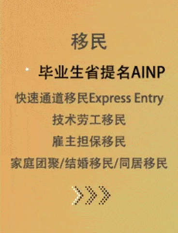 (原始链接: https://mmbiz.qpic.cn/mmbiz_gif/XA8n2XaESnTkTKKDWv5OQZCrJeic5vakEUfYTDW0iavQUicUC6Lndvx8E91M7JCF48a38JNGgCdkOWZt41FbaKBcA/640?wx_fmt=gif)
- 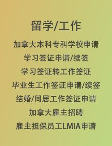 (原始链接: https://mmbiz.qpic.cn/mmbiz_png/XA8n2XaESnTkTKKDWv5OQZCrJeic5vakEkGkUu9NmbiaX1Gqwz4euQzRtOupTO8DBU79oyPK07EzzwJd5G8yhcyg/640?wx_fmt=gif)
-  (原始链接: https://mmbiz.qpic.cn/mmbiz_png/XA8n2XaESnTkTKKDWv5OQZCrJeic5vakEzJLVMoZ3B9WeVcANdDJFhClic6NpJibPs6sRSHENBBNdic9TAV9kPTQ4A/640?wx_fmt=gif)
-  (原始链接: https://mmbiz.qpic.cn/mmbiz_jpg/XA8n2XaESnTkTKKDWv5OQZCrJeic5vakEricFibmwwgqYFyF6IozJicUqkAkwPVAVoBNnDppAwP14kMsChVTN9Awww/640?wx_fmt=jpeg)
-  (原始链接: https://mmbiz.qpic.cn/mmbiz_png/XA8n2XaESnTkTKKDWv5OQZCrJeic5vakEg3NugHSDibu1weUC1VLW2ZXUY4basPGEaUgicO8n2W3hugRRzz1pxTicA/640?wx_fmt=png)
-  (原始链接: https://mmbiz.qpic.cn/mmbiz_jpg/XA8n2XaESnTkTKKDWv5OQZCrJeic5vakEnibkiaIqpKlcn76VIFK12XEgAL5VTsCCKzGicwadV8HfJAo9W8lT8Zbiaw/640?wx_fmt=jpeg)
-  (原始链接: https://mmbiz.qpic.cn/mmbiz_png/XA8n2XaESnTkTKKDWv5OQZCrJeic5vakELRVvkUJwY5ibKpKhsg2Fq5a3V97ibibwoj3sD9onweWxSy24sibflZddVw/640?wx_fmt=png)
-  (原始链接: https://mmbiz.qpic.cn/mmbiz_png/XA8n2XaESnTkTKKDWv5OQZCrJeic5vakEYoxW2QicrFUJaoh7bbgS4ibSICf4QzAWZBnFnezb6V1ib4IibK9InwicA5A/640?wx_fmt=png)
-  (原始链接: https://mmbiz.qpic.cn/mmbiz_png/XA8n2XaESnTkTKKDWv5OQZCrJeic5vakE3ZibE3POu3DJeq3Yqibziaq2Ao0V2uJtacPY8syJF9b9a9Y6qEWoP29zg/640?wx_fmt=png)
-  (原始链接: https://mmbiz.qpic.cn/mmbiz_png/XA8n2XaESnTkTKKDWv5OQZCrJeic5vakEnVz1O88cwcMPFS1wZibGmtCeniarn8JdvCJelJjOU7YgZljJgFZibaR6Q/640?wx_fmt=png)
-  (原始链接: https://mmbiz.qpic.cn/mmbiz_jpg/XA8n2XaESnTkTKKDWv5OQZCrJeic5vakEFAViauRW2xYTOBVJWNPjQgOYaiaFO5DsOptnUia5urRYF7K66UGlmrxibQ/640?wx_fmt=jpeg)
- 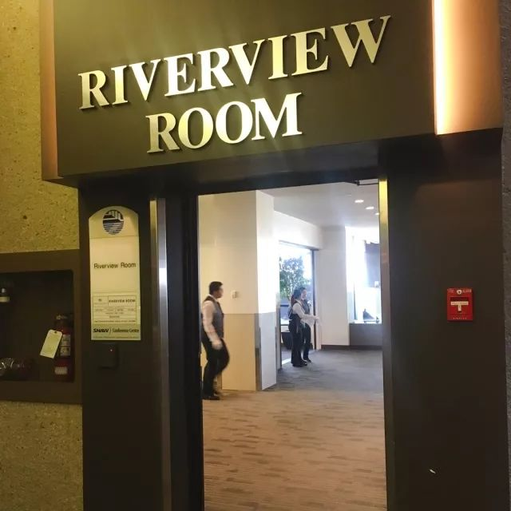 (原始链接: https://mmbiz.qpic.cn/mmbiz_jpg/XA8n2XaESnTkTKKDWv5OQZCrJeic5vakE45H5BzU7iaSt72UWhDRiaRwy48c8rTzeiad88U0F7C3k6c5gZH3vAgM0g/640?wx_fmt=jpeg)
- 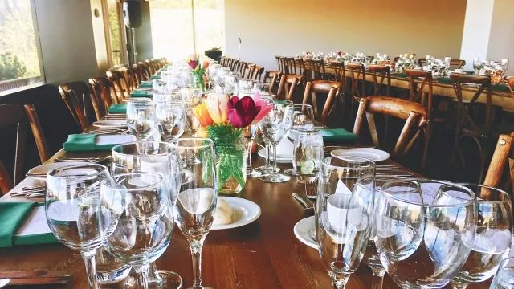 (原始链接: https://mmbiz.qpic.cn/mmbiz_jpg/XA8n2XaESnTkTKKDWv5OQZCrJeic5vakEI3tCTNqF0TM8RzodjwvZN2cIrOnKUTic8Tklsq3xz9nrfibpR4UNAMow/640?wx_fmt=jpeg)
-  (原始链接: https://mmbiz.qpic.cn/mmbiz_jpg/XA8n2XaESnTkTKKDWv5OQZCrJeic5vakE192uraHLDOa4AmzbXNrFTWH1z37BiaQhSYqxwCxSF8SEavlxyaN7DCw/640?wx_fmt=jpeg)
- 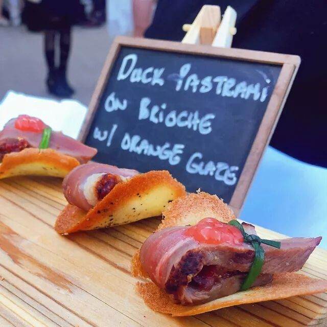 (原始链接: https://mmbiz.qpic.cn/mmbiz_jpg/XA8n2XaESnTkTKKDWv5OQZCrJeic5vakE3tia9fXYicyy9bzbQFl8cwKUcJROH6vRTNWDaDTcZu6fkaYwXoZlytIQ/640?wx_fmt=jpeg)
- 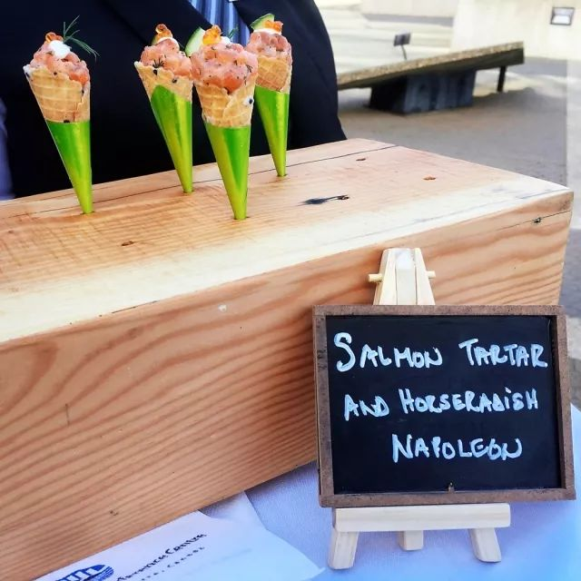 (原始链接: https://mmbiz.qpic.cn/mmbiz_jpg/XA8n2XaESnTkTKKDWv5OQZCrJeic5vakEbhrGfA7yewa4cjorcfWdefGDStNeKcxugW25C7WpwRqn9elbFQ3iabA/640?wx_fmt=jpeg)
- 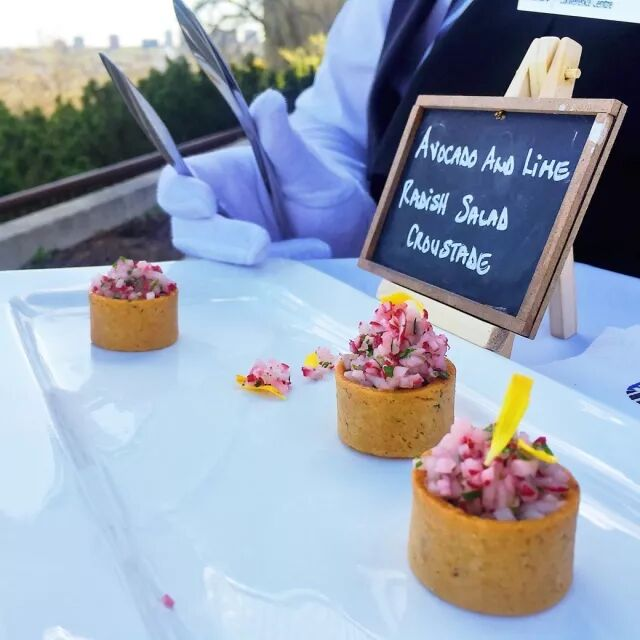 (原始链接: https://mmbiz.qpic.cn/mmbiz_jpg/XA8n2XaESnTkTKKDWv5OQZCrJeic5vakEiaLjG8k12vpnq8DG1eBUyehZ6icInib6eo8vPSINexoFcE3SxG93ElIEA/640?wx_fmt=jpeg)
- 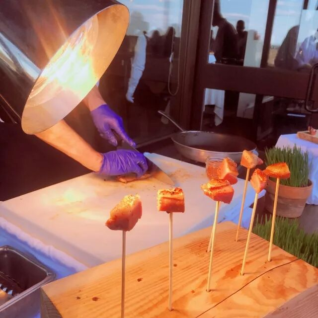 (原始链接: https://mmbiz.qpic.cn/mmbiz_jpg/XA8n2XaESnTkTKKDWv5OQZCrJeic5vakEkEwyeFibXlfaFKibWFiatDNy4GlpV0NQpMAD2bV4Zj8ucxia2hMcj10E1w/640?wx_fmt=jpeg)
- 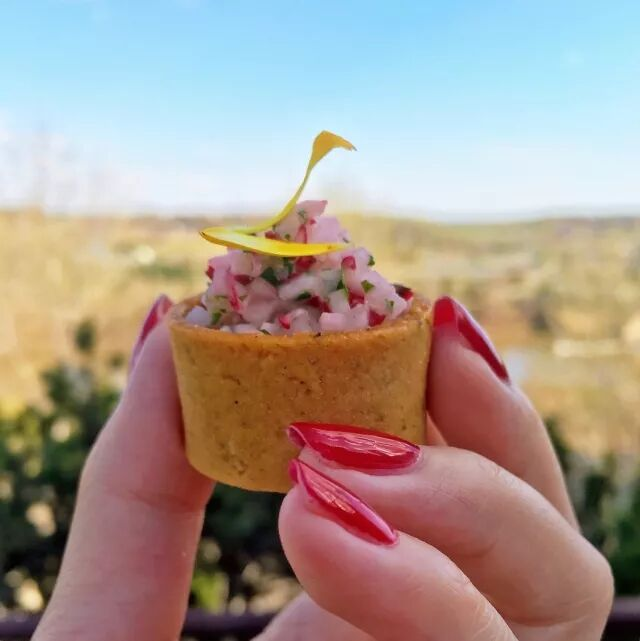 (原始链接: https://mmbiz.qpic.cn/mmbiz_jpg/XA8n2XaESnTkTKKDWv5OQZCrJeic5vakEKP9409289vKAf4XtoSQNY6bVTG9Nb1mYXgqjz9wZ5NuwYoXxWBSq8A/640?wx_fmt=jpeg)
-  (原始链接: https://mmbiz.qpic.cn/mmbiz_png/XA8n2XaESnTkTKKDWv5OQZCrJeic5vakE3ZibE3POu3DJeq3Yqibziaq2Ao0V2uJtacPY8syJF9b9a9Y6qEWoP29zg/640?wx_fmt=png)
-  (原始链接: https://mmbiz.qpic.cn/mmbiz_png/XA8n2XaESnTkTKKDWv5OQZCrJeic5vakEnVz1O88cwcMPFS1wZibGmtCeniarn8JdvCJelJjOU7YgZljJgFZibaR6Q/640?wx_fmt=png)
- 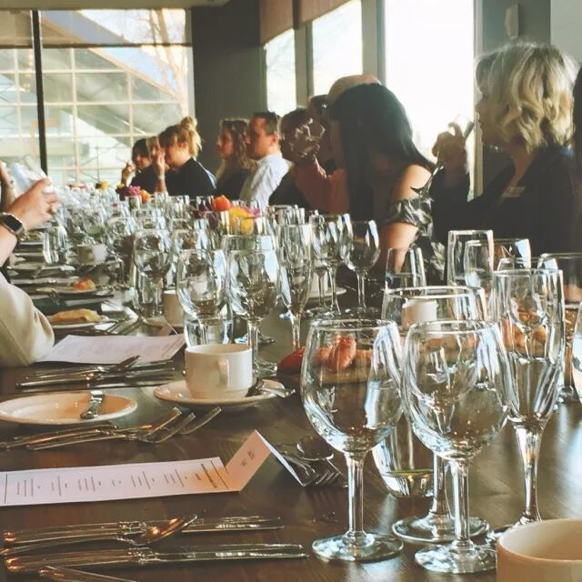 (原始链接: https://mmbiz.qpic.cn/mmbiz_jpg/XA8n2XaESnTkTKKDWv5OQZCrJeic5vakEPU1kabkuPMibhhK9MCygDfQKz4Jsvo06sZPxzl1yeoqHkXzaN4rvSTw/640?wx_fmt=jpeg)
- 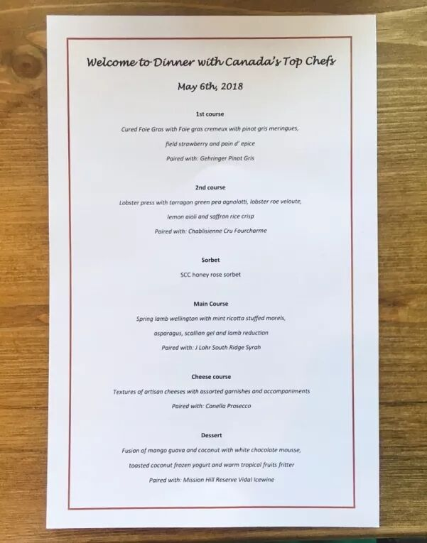 (原始链接: https://mmbiz.qpic.cn/mmbiz_jpg/XA8n2XaESnTkTKKDWv5OQZCrJeic5vakEYORmr60t0g1OZlfNm8BwzqKlT1WgzfPr9LYqUcQpRf8unxOAgwzsibw/640?wx_fmt=jpeg)
- 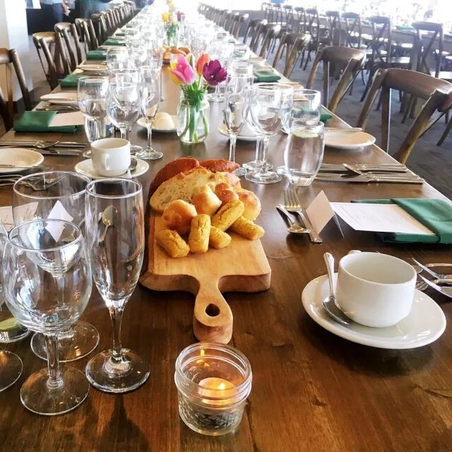 (原始链接: https://mmbiz.qpic.cn/mmbiz_jpg/XA8n2XaESnTkTKKDWv5OQZCrJeic5vakE12IOF8icfH2kLmuB3iavia2MlhnERic4GHuicBYzjkFWLyXfSIId5IiaaJ2A/640?wx_fmt=jpeg)
- 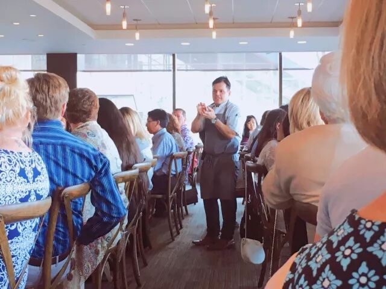 (原始链接: https://mmbiz.qpic.cn/mmbiz_jpg/XA8n2XaESnTkTKKDWv5OQZCrJeic5vakEoibIKaqib7ChdZyUpQK8YAx2YIb7EdcXIF8UDrbMJCr8suT4cbKFrauA/640?wx_fmt=jpeg)
-  (原始链接: https://mmbiz.qpic.cn/mmbiz_png/XA8n2XaESnTkTKKDWv5OQZCrJeic5vakE3ZibE3POu3DJeq3Yqibziaq2Ao0V2uJtacPY8syJF9b9a9Y6qEWoP29zg/640?wx_fmt=png)
-  (原始链接: https://mmbiz.qpic.cn/mmbiz_png/XA8n2XaESnTkTKKDWv5OQZCrJeic5vakEnVz1O88cwcMPFS1wZibGmtCeniarn8JdvCJelJjOU7YgZljJgFZibaR6Q/640?wx_fmt=png)
- 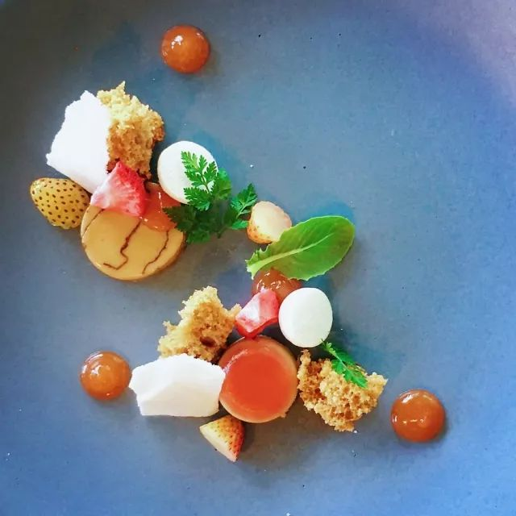 (原始链接: https://mmbiz.qpic.cn/mmbiz_jpg/XA8n2XaESnTkTKKDWv5OQZCrJeic5vakEpOd39sJWCed67w9pSRBt1bzibbEKJicAUNErvMREYicaeydv4QUJTty6w/640?wx_fmt=jpeg)
- 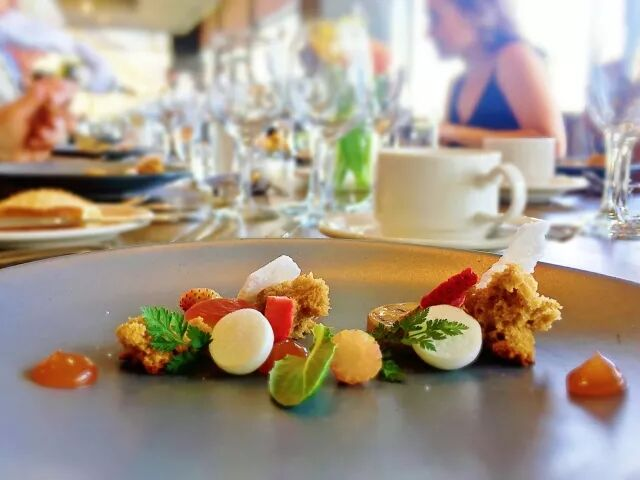 (原始链接: https://mmbiz.qpic.cn/mmbiz_jpg/XA8n2XaESnTkTKKDWv5OQZCrJeic5vakEh131SGgnvMOIBZk6up2nTFb2nbStuNUgPHoHjhGqchhYyGpicY5bJng/640?wx_fmt=jpeg)
- 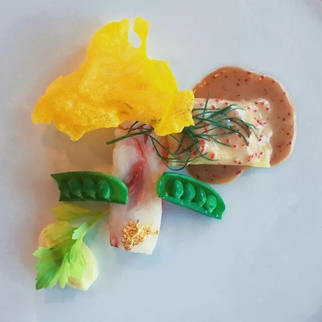 (原始链接: https://mmbiz.qpic.cn/mmbiz_jpg/XA8n2XaESnTkTKKDWv5OQZCrJeic5vakEUj9Mo4FjYkOxCHlnRg9ib4c88NvwlQXLYPVc5a9Es4HEicdoTgcxGauw/640?wx_fmt=jpeg)
- 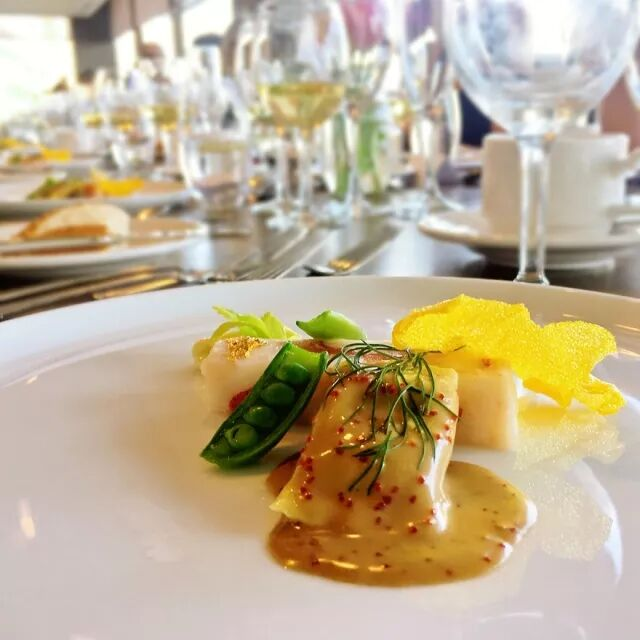 (原始链接: https://mmbiz.qpic.cn/mmbiz_jpg/XA8n2XaESnTkTKKDWv5OQZCrJeic5vakERHHoajZyVn6Ro3FiaBccPcEoEkCChqVpQTDJKcVqXmG8vZGc4SZDYWg/640?wx_fmt=jpeg)
- 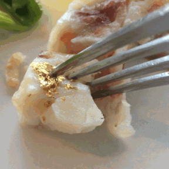 (原始链接: https://mmbiz.qpic.cn/mmbiz_gif/XA8n2XaESnTkTKKDWv5OQZCrJeic5vakEv21oicWaLHTs3U9XEmCibweTzVUibX9FcI3QqxzEup23vBK4e7zqADlGg/640?wx_fmt=gif)
-  (原始链接: https://mmbiz.qpic.cn/mmbiz_gif/XA8n2XaESnTkTKKDWv5OQZCrJeic5vakEcSIgFCsHBIgMNPAJwFVp9bX1AzLNw5qyXPfDNNW8MsGIQ4WsohLqow/640?wx_fmt=gif)
-  (原始链接: https://mmbiz.qpic.cn/mmbiz_jpg/XA8n2XaESnTkTKKDWv5OQZCrJeic5vakEJX6Iyyib5xhmb8iasVoZ7pzRibJw8BviawhITpVbs0xiaSShLdl6Yt4JOOA/640?wx_fmt=jpeg)
- 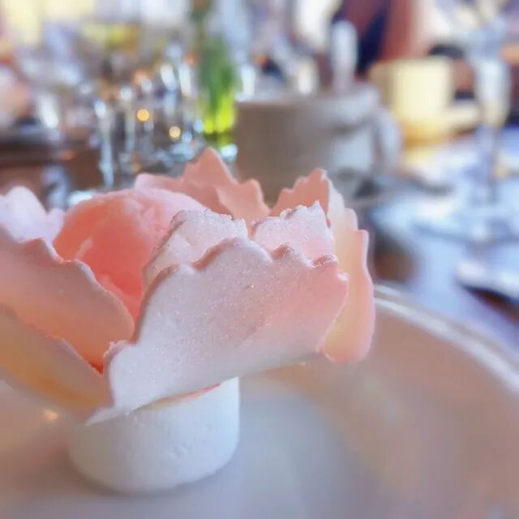 (原始链接: https://mmbiz.qpic.cn/mmbiz_jpg/XA8n2XaESnTkTKKDWv5OQZCrJeic5vakE85qX1sE9vsLuQVD9XD4dTibHV9y6YQjHd6WYRVticJOXficMxVQhLkebA/640?wx_fmt=jpeg)
- 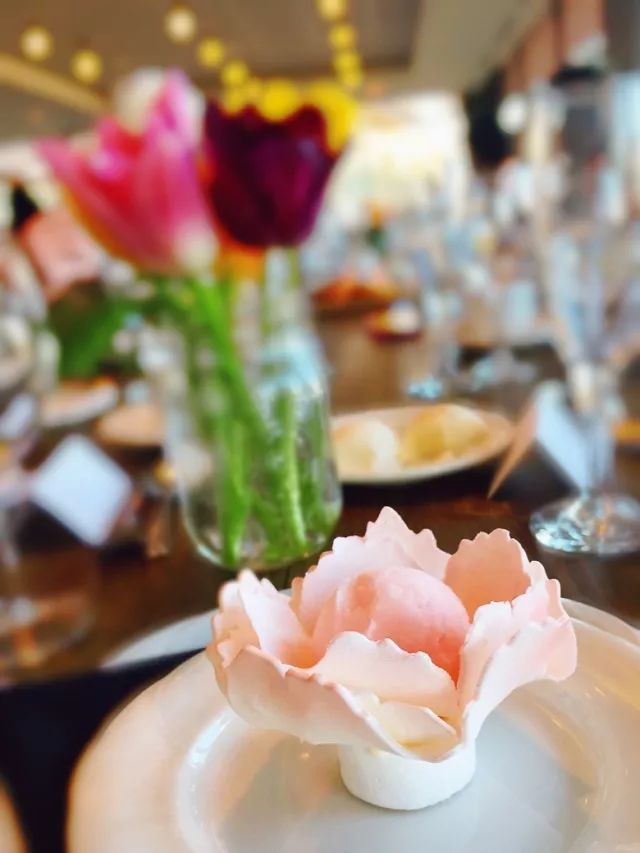 (原始链接: https://mmbiz.qpic.cn/mmbiz_jpg/XA8n2XaESnTkTKKDWv5OQZCrJeic5vakEABiaVChFEuW7ibd7R94SUJn9WicXdY0KjVkHeBgcCSYiaQy8YRiciantToQg/640?wx_fmt=jpeg)
- 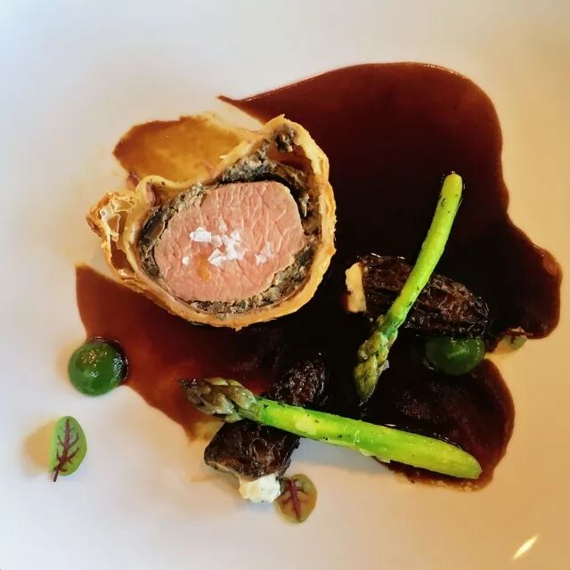 (原始链接: https://mmbiz.qpic.cn/mmbiz_jpg/XA8n2XaESnTkTKKDWv5OQZCrJeic5vakE4axX3hrIoHNllXtDNYYEMaJgenxndZq6rqlERhKZ09FbdDicibyQEMyQ/640?wx_fmt=jpeg)
- 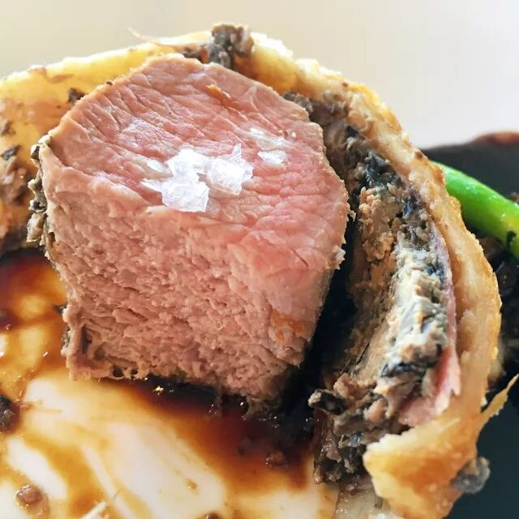 (原始链接: https://mmbiz.qpic.cn/mmbiz_jpg/XA8n2XaESnTkTKKDWv5OQZCrJeic5vakE4Ne6GX7fHABFdo0iauOBwQfAk07fSUrZiaSgKmKrVSHXWQBZOBkWFWDQ/640?wx_fmt=jpeg)
- 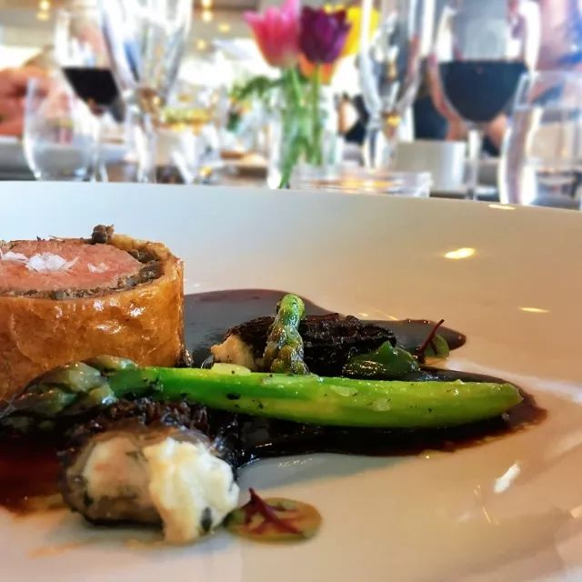 (原始链接: https://mmbiz.qpic.cn/mmbiz_jpg/XA8n2XaESnTkTKKDWv5OQZCrJeic5vakE8BrWtucdy4uUeHvHAhT4qKhveVdkibicgw3Kiciag8iag5h99ficmMhR1vMw/640?wx_fmt=jpeg)
- 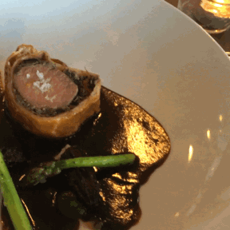 (原始链接: https://mmbiz.qpic.cn/mmbiz_gif/XA8n2XaESnTkTKKDWv5OQZCrJeic5vakEUWA320Pj1KV1hbME3RaEKxt4sOzNIwNem43cMC2ysu5dz7UOjuibvXg/640?wx_fmt=gif)
- 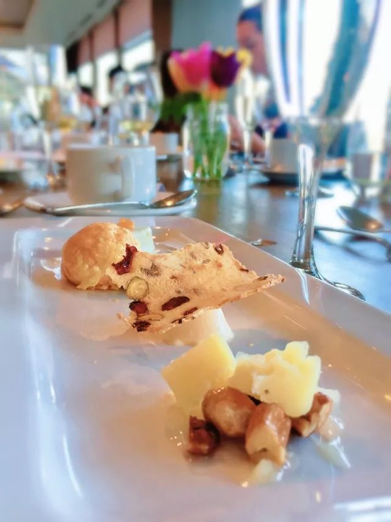 (原始链接: https://mmbiz.qpic.cn/mmbiz_jpg/XA8n2XaESnTkTKKDWv5OQZCrJeic5vakEmtKgR1IyDQRR6wPh6U3gHmjt7NicA3FcoyKj8HTu1clf2Exm7pqWBaA/640?wx_fmt=jpeg)
- 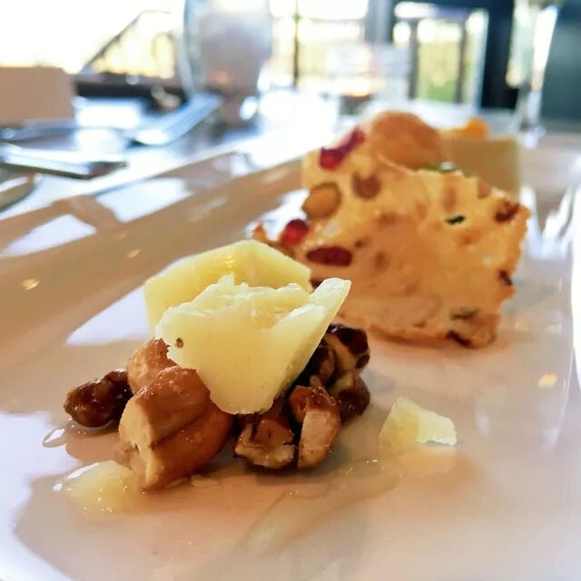 (原始链接: https://mmbiz.qpic.cn/mmbiz_jpg/XA8n2XaESnTkTKKDWv5OQZCrJeic5vakEICx1SZLJBzO5kfgXbKd2iamJm6yAMG46Kn8NtXRcqcfu86GwmgyAibJg/640?wx_fmt=jpeg)
- 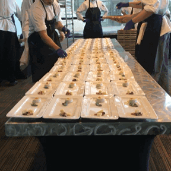 (原始链接: https://mmbiz.qpic.cn/mmbiz_gif/XA8n2XaESnTkTKKDWv5OQZCrJeic5vakEgpurVHTL8CurNK7mmovsY2EYlF11nOFF2yH0EicTumxXtPb4dJPaibJA/640?wx_fmt=gif)
- 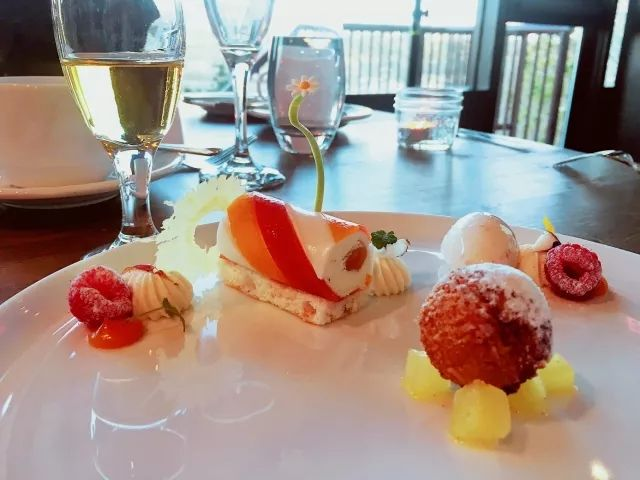 (原始链接: https://mmbiz.qpic.cn/mmbiz_jpg/XA8n2XaESnTkTKKDWv5OQZCrJeic5vakEMTk5AbFlbicnVr9FRXEJbweYBwn88icGiciahshchkIkzxoJr2rhxfiaZBw/640?wx_fmt=jpeg)
- 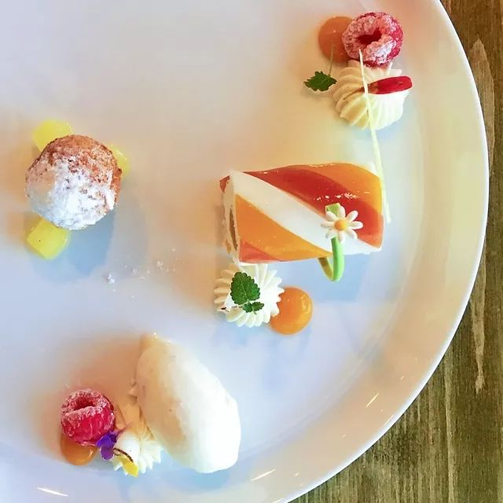 (原始链接: https://mmbiz.qpic.cn/mmbiz_jpg/XA8n2XaESnTkTKKDWv5OQZCrJeic5vakEuDZ2D4cqyJ0ibQTZgicuEoW4N7ibicGOiaP97atQFvPFhkOkicOCOicbNoXaQ/640?wx_fmt=jpeg)
- 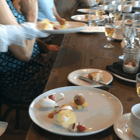 (原始链接: https://mmbiz.qpic.cn/mmbiz_gif/XA8n2XaESnTkTKKDWv5OQZCrJeic5vakE0YEszs34wPxaVbkcqt3UPvib2AhrFicC6ebX5ERWsPW0ahH48Iaiahb8g/640?wx_fmt=gif)
- 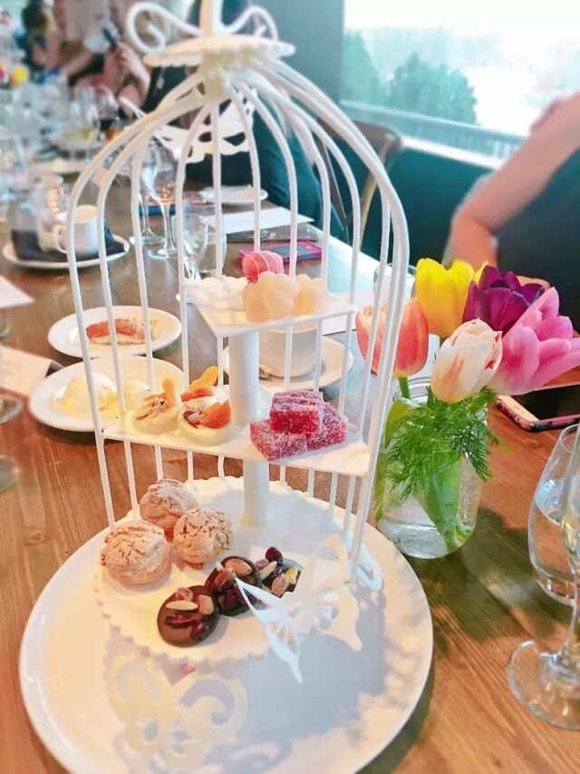 (原始链接: https://mmbiz.qpic.cn/mmbiz_jpg/XA8n2XaESnTkTKKDWv5OQZCrJeic5vakEaiaBaibIeiaSGgUFbyQtQPA6Tibic6LbvMiaIHtmiajfshFtZic8eaCqjOSpzA/640?wx_fmt=jpeg)
- 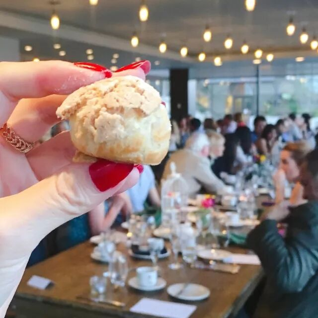 (原始链接: https://mmbiz.qpic.cn/mmbiz_jpg/XA8n2XaESnTkTKKDWv5OQZCrJeic5vakElsbD9Afojpkgwr3uwF77JcfHVibicbt6Valp96jgrXblIRr3kr5wSiccQ/640?wx_fmt=jpeg)
- 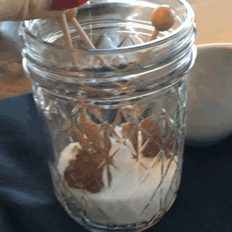 (原始链接: https://mmbiz.qpic.cn/mmbiz_gif/XA8n2XaESnTkTKKDWv5OQZCrJeic5vakEMrB6YyZjbtdlfwLPtkhufp5cEibO6lhfHF8dlib0s1o1ZMbNzPC5xNaQ/640?wx_fmt=gif)
-  (原始链接: https://mmbiz.qpic.cn/mmbiz_png/XA8n2XaESnTkTKKDWv5OQZCrJeic5vakE3ZibE3POu3DJeq3Yqibziaq2Ao0V2uJtacPY8syJF9b9a9Y6qEWoP29zg/640?wx_fmt=png)
-  (原始链接: https://mmbiz.qpic.cn/mmbiz_png/XA8n2XaESnTkTKKDWv5OQZCrJeic5vakEnVz1O88cwcMPFS1wZibGmtCeniarn8JdvCJelJjOU7YgZljJgFZibaR6Q/640?wx_fmt=png)
- 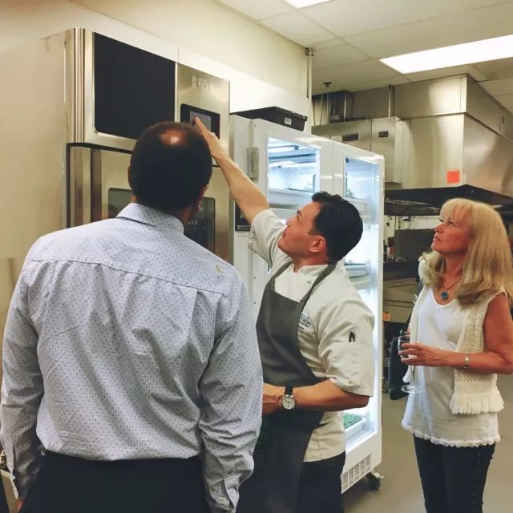 (原始链接: https://mmbiz.qpic.cn/mmbiz_jpg/XA8n2XaESnTkTKKDWv5OQZCrJeic5vakEBjOWq4pib9Rhib5JukCeic5s3xFzb5g3ZpY9pKrfqnX711uxdEOZqvN0w/640?wx_fmt=jpeg)
- 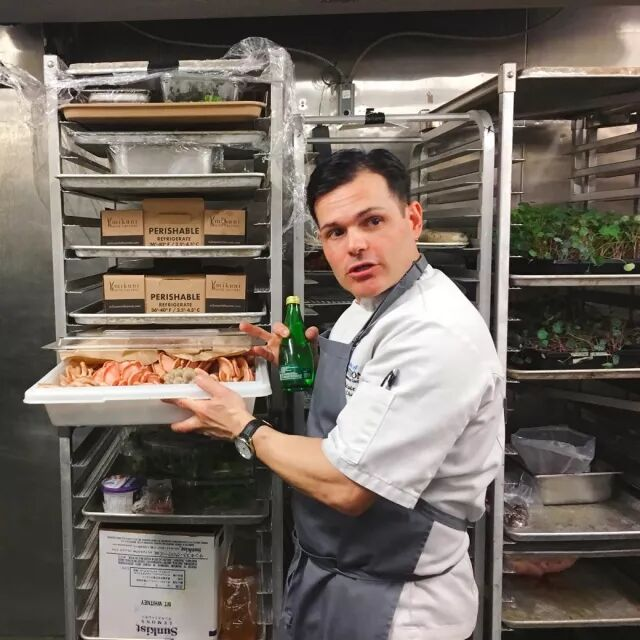 (原始链接: https://mmbiz.qpic.cn/mmbiz_jpg/XA8n2XaESnTkTKKDWv5OQZCrJeic5vakESmdhvgEicF0FJFGfjYgDgc6aoSRGlK1GRpvMticnT5LKBaI2SJV4Fs1A/640?wx_fmt=jpeg)
- 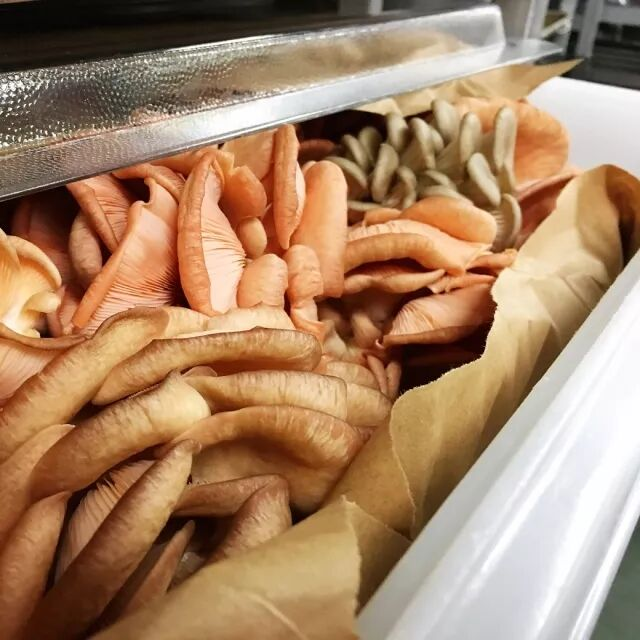 (原始链接: https://mmbiz.qpic.cn/mmbiz_jpg/XA8n2XaESnTkTKKDWv5OQZCrJeic5vakEPBI4xLSTxKldmicBdZPRDpeNHRcNrVZcDIDyQWibKYtYHXibE90cYXdwQ/640?wx_fmt=jpeg)
-  (原始链接: https://mmbiz.qpic.cn/mmbiz_png/XA8n2XaESnTkTKKDWv5OQZCrJeic5vakE3ZibE3POu3DJeq3Yqibziaq2Ao0V2uJtacPY8syJF9b9a9Y6qEWoP29zg/640?wx_fmt=png)
-  (原始链接: https://mmbiz.qpic.cn/mmbiz_png/XA8n2XaESnTkTKKDWv5OQZCrJeic5vakEnVz1O88cwcMPFS1wZibGmtCeniarn8JdvCJelJjOU7YgZljJgFZibaR6Q/640?wx_fmt=png)
-  (原始链接: https://mmbiz.qpic.cn/mmbiz_png/XA8n2XaESnTkTKKDWv5OQZCrJeic5vakEEZIIhLrD7HoxZpMWv2PUcddjwOI80hPf4UQMeAFQXl3sGZr0D6EYcg/640?wx_fmt=png)
- 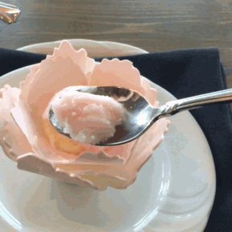 (原始链接: https://mmbiz.qpic.cn/mmbiz_gif/XA8n2XaESnTkTKKDWv5OQZCrJeic5vakE5eZibIt23apjoNEIBhQFo0vXS8MsptAZcu1ZXHYv7fIVSzoZfAowcSw/640?wx_fmt=gif)
-  (原始链接: https://mmbiz.qpic.cn/mmbiz_png/XA8n2XaESnTkTKKDWv5OQZCrJeic5vakExTEFyFiaS1ARibnspqa91JibIROFrc43zoM7MhGFqtg7HSJJ05kdv9aRw/640?wx_fmt=png)
-  (原始链接: https://mmbiz.qpic.cn/mmbiz_png/XA8n2XaESnTkTKKDWv5OQZCrJeic5vakEEZIIhLrD7HoxZpMWv2PUcddjwOI80hPf4UQMeAFQXl3sGZr0D6EYcg/640?wx_fmt=png)
- 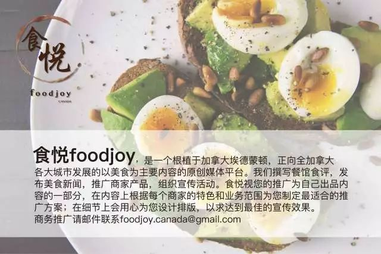 (原始链接: https://mmbiz.qpic.cn/mmbiz_jpg/XA8n2XaESnTkTKKDWv5OQZCrJeic5vakEFk5bWAZIhWtHC86JBqHpLzXQosDUpnHg5ic6icLzHosq9oCXFcvLc6rA/640?wx_fmt=jpeg)
-  (原始链接: https://mmbiz.qpic.cn/mmbiz_jpg/XA8n2XaESnTkTKKDWv5OQZCrJeic5vakEaffkgfiazqM6E7QdicFXODicuTYicoKeeQPlnDuhHasW9OCCZJUPQJR0ow/640?wx_fmt=jpeg)
