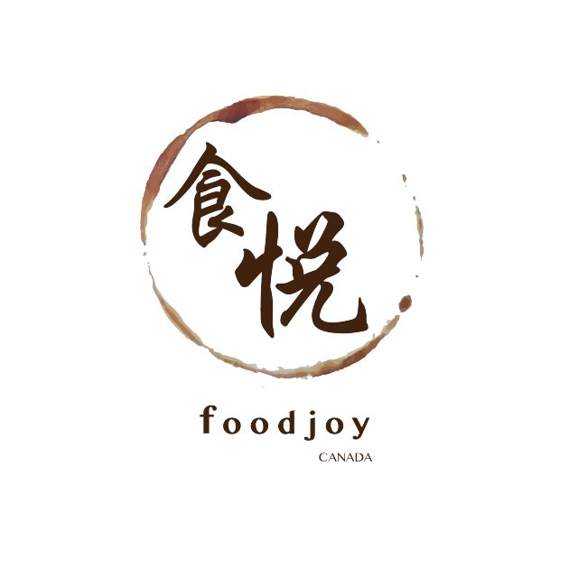

# 无标题

**链接地址:** http://mp.weixin.qq.com/s?__biz=MzI0MDQ0ODI0Ng==&mid=2247485774&idx=2&sn=1c4a900cdaa88f666058f592354e3c82&chksm=e91beed7de6c67c17b5ac0ad7ba25c4d0652ea4f66fcd741b5bc83967ce91d4928a1acc0bf0d&mpshare=1&scene=2&srcid=0510RYud0uML0auNHf97NvYq#rd
**作者:** 食悦
**获取时间:** 2025/8/28 21:55:28
**图片数量:** 4

---

## 原始HTML内容

<section style="box-sizing: border-box;"><section class="Powered-by-XIUMI V5" style="box-sizing: border-box;" powered-by="xiumi.us"><section class="" style="text-align: center;margin-top: 10px;margin-bottom: 10px;box-sizing: border-box;"><section class="" style="max-width: 100%;vertical-align: middle;display: inline-block;overflow: hidden !important;box-sizing: border-box;"></section></section></section><section class="Powered-by-XIUMI V5" style="box-sizing: border-box;" powered-by="xiumi.us"><section class="" style="box-sizing: border-box;"><section class="" style="box-sizing: border-box;">
 
</section></section></section><section class="Powered-by-XIUMI V5" style="box-sizing: border-box;" powered-by="xiumi.us"><section class="" style="margin: 10px 0%;box-sizing: border-box;"><section class="" style="text-align: justify;line-height: 1.7;font-size: 14px;color: rgb(123, 150, 105);padding-right: 10px;padding-left: 10px;letter-spacing: 1px;box-sizing: border-box;">
这段日子以来，被群众们问到最多的问题就是：“

辻利茶铺，到底什么时候开啊？”

“抱歉，食悦也不知道啊……”

 

然而，这个问题从今天起有了答案，那便是：

 

<strong style="box-sizing: border-box;">2018年5月16日（周三）</strong>

 

然而食悦要说的可不仅是这个挤破头排一个小时长队都不一定能买到一颗Tsujiri抹茶冰淇淋的日子。因为关注食悦的粉丝们，你们中有<strong style="box-sizing: border-box;">一位幸运儿</strong>会和食悦一起被<strong style="box-sizing: border-box;">特邀参加</strong>

 

<strong style="box-sizing: border-box;">20</strong><strong style="box-sizing: border-box;">18年5月14日（周一）</strong> 

<strong style="box-sizing: border-box;">辻利茶铺开业媒体见面会</strong>

 

这次活动中，你可以听辻利茶铺的内部官员为你亲自介绍这家拥有超过150年悠久历史的抹茶焙茶甜品店的灿烂文化，并<strong style="box-sizing: border-box;">免费</strong>试吃其最流行的<strong style="box-sizing: border-box;">10种</strong>商品！想要比别的小伙伴们更早一步get到菜单上有什么值得期待的新品吗？不要错过这个机会！一起来加入这次激动人心的活动吧！

 
</section></section></section><section class="Powered-by-XIUMI V5" style="box-sizing: border-box;" powered-by="xiumi.us"><section class="" style="text-align: center;margin-top: 10px;margin-bottom: 10px;box-sizing: border-box;"><section class="" style="max-width: 100%;vertical-align: middle;display: inline-block;overflow: hidden !important;box-sizing: border-box;"></section></section></section><section class="Powered-by-XIUMI V5" style="box-sizing: border-box;" powered-by="xiumi.us"><section class="" style="margin: 10px 0%;box-sizing: border-box;"><section class="" style="text-align: justify;line-height: 1.7;font-size: 14px;color: rgb(123, 150, 105);padding-right: 10px;padding-left: 10px;letter-spacing: 1px;box-sizing: border-box;">
 

<strong style="box-sizing: border-box;">参与活动方法</strong><strong style="box-sizing: border-box;">：</strong>

 

<strong style="box-sizing: border-box;">微博或者微信私信你的</strong>

<strong style="box-sizing: border-box;">instagram账号给食悦</strong> 

（因为我们需要和辻利茶铺在insta上互动哦！）

 

只要你<strong style="box-sizing: border-box;">热爱美食，乐于分享</strong>，就很有可能被食悦的幸运之箭射中哦！

 

<strong style="box-sizing: border-box;">你需要做什么？</strong>

<strong style="box-sizing: border-box;">“来。吃。”</strong>

哈哈哈，是不是很简单？ 

 

这次活动可以拍照，也欢迎你把你的作品和感想发送到社交平台上和大伙儿们一起分享。另外你还可以参与食悦和辻利茶铺的<strong style="box-sizing: border-box;">独家专访活动</strong>，表达你对辻利茶铺的喜爱和赞赏或提出疑问和建议！

 

<strong style="box-sizing: border-box;">活动时间：</strong>

14th May 2018 (Mon) 17:30pm - 19:00pm

<strong style="box-sizing: border-box;">活动地点</strong>：

10173 109 St NW, Edmonton,AB T5J 3M5

 

<strong style="box-sizing: border-box;">期待你的加入！</strong>

<strong style="box-sizing: border-box;">和食悦一起享受美食的喜悦吧！</strong>
</section></section></section><section class="Powered-by-XIUMI V5" style="box-sizing: border-box;" powered-by="xiumi.us"><section class="" style="text-align: center;margin-top: 10px;margin-bottom: 10px;box-sizing: border-box;"><section class="" style="max-width: 100%;vertical-align: middle;display: inline-block;overflow: hidden !important;box-sizing: border-box;"></section></section></section><section class="Powered-by-XIUMI V5" style="box-sizing: border-box;" powered-by="xiumi.us"><section class="" style="text-align: center;margin-top: 10px;margin-bottom: 10px;box-sizing: border-box;"><section class="" style="max-width: 100%;vertical-align: middle;display: inline-block;overflow: hidden !important;box-sizing: border-box;"></section></section></section></section>

---

## 纯文本内容

这段日子以来，被群众们问到最多的问题就是：“辻利茶铺，到底什么时候开啊？”“抱歉，食悦也不知道啊……”然而，这个问题从今天起有了答案，那便是：2018年5月16日（周三）然而食悦要说的可不仅是这个挤破头排一个小时长队都不一定能买到一颗Tsujiri抹茶冰淇淋的日子。因为关注食悦的粉丝们，你们中有一位幸运儿会和食悦一起被特邀参加2018年5月14日（周一）辻利茶铺开业媒体见面会这次活动中，你可以听辻利茶铺的内部官员为你亲自介绍这家拥有超过150年悠久历史的抹茶焙茶甜品店的灿烂文化，并免费试吃其最流行的10种商品！想要比别的小伙伴们更早一步get到菜单上有什么值得期待的新品吗？不要错过这个机会！一起来加入这次激动人心的活动吧！参与活动方法：微博或者微信私信你的instagram账号给食悦（因为我们需要和辻利茶铺在insta上互动哦！）只要你热爱美食，乐于分享，就很有可能被食悦的幸运之箭射中哦！你需要做什么？“来。吃。”哈哈哈，是不是很简单？这次活动可以拍照，也欢迎你把你的作品和感想发送到社交平台上和大伙儿们一起分享。另外你还可以参与食悦和辻利茶铺的独家专访活动，表达你对辻利茶铺的喜爱和赞赏或提出疑问和建议！活动时间：14th May 2018 (Mon) 17:30pm - 19:00pm活动地点：10173 109 St NW, Edmonton,AB T5J 3M5期待你的加入！和食悦一起享受美食的喜悦吧！

---

## 图片列表

-  (原始链接: https://mmbiz.qpic.cn/mmbiz_jpg/XA8n2XaESnTIgeuM50CjapPPeGibf95wq7WIqaYH3AAtTtEPnCic17k233soD6wRSjdVBdLyzKuPpvuy5JWgf2GA/640?wx_fmt=jpeg)
-  (原始链接: https://mmbiz.qpic.cn/mmbiz_jpg/XA8n2XaESnTIgeuM50CjapPPeGibf95wqg2StGlMa4Cc1ee8A5Aia2FTLIoh8uOiaWQ5LPkC3QY0lSsSC4nlVIEtA/640?wx_fmt=jpeg)
-  (原始链接: https://mmbiz.qpic.cn/mmbiz_png/XA8n2XaESnTIgeuM50CjapPPeGibf95wq2xUAHAHArQ6AU4hUric2iahBrRpnibR24P9AFJt16KYDqThrr9tv0JJiag/640?wx_fmt=png)
-  (原始链接: https://mmbiz.qpic.cn/mmbiz_jpg/XA8n2XaESnTIgeuM50CjapPPeGibf95wqghYF6zWKOjibam4er82Sbibic7IY0iaMm7rbWSfpkIJEbdHahJpm0K0Dcw/640?wx_fmt=jpeg)
