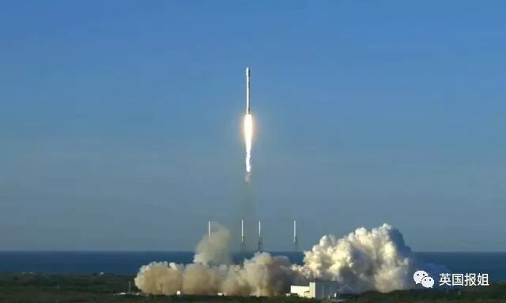

# 无标题

**链接地址:** http://mp.weixin.qq.com/s?__biz=MzIxNTkyMDQwNg==&mid=2247492277&idx=1&sn=9686fd450606404a9b23283e22057a5a&chksm=979258cca0e5d1da68b68266c0169beb456dde7b9546478ed6d6481e2e986a5defcc8f9bb580&mpshare=1&scene=2&srcid=05117IdIUuODr7fTjBjmWvLd#rd
**作者:** 英国报姐
**获取时间:** 2025/8/28 21:55:19
**图片数量:** 34

---

## 原始HTML内容

<section style="font-size: 15px;letter-spacing: 1px;padding-right: 2px;padding-left: 2px;box-sizing: border-box;"><section class="Powered-by-XIUMI V5" style="box-sizing: border-box;" powered-by="xiumi.us"><section class="" style="text-align: center;margin-top: 10px;margin-bottom: 10px;box-sizing: border-box;"><section class="" style="max-width: 100%;vertical-align: middle;display: inline-block;overflow: hidden !important;box-sizing: border-box;"></section></section></section><section class="Powered-by-XIUMI V5" style="box-sizing: border-box;" powered-by="xiumi.us"><section class="" style="box-sizing: border-box;"><section class="" style="box-sizing: border-box;">
 
</section></section></section><section class="Powered-by-XIUMI V5" style="box-sizing: border-box;" powered-by="xiumi.us"><section class="" style="box-sizing: border-box;"><section class="" style="box-sizing: border-box;">
几个世纪以来，人类对于宇宙的好奇从未消失过。我们一直迫切的想要知道，在这浩瀚无垠的夜空之中，我们是否是唯一的存在，是否还有其他孕育生命的星球，等等...
</section></section></section><section class="Powered-by-XIUMI V5" style="box-sizing: border-box;" powered-by="xiumi.us"><section class="" style="box-sizing: border-box;"><section class="" style="box-sizing: border-box;">
 
</section></section></section><section class="Powered-by-XIUMI V5" style="box-sizing: border-box;" powered-by="xiumi.us"><section class="" style="text-align: center;margin-top: 10px;margin-bottom: 10px;box-sizing: border-box;"><section class="" style="max-width: 100%;vertical-align: middle;display: inline-block;overflow: hidden !important;box-sizing: border-box;"></section></section></section><section class="Powered-by-XIUMI V5" style="box-sizing: border-box;" powered-by="xiumi.us"><section class="" style="box-sizing: border-box;"><section class="" style="box-sizing: border-box;">
（图源：guernseydonkey）

 

于是，为了解答我们心中的疑惑，为了探索未知的星空，它出生了。科学家们设计出了一台望远镜，计划将它送往太空，<strong style="box-sizing: border-box;">希望借助它的“眼睛”去发现能够支持生命体存在的类地行星。</strong>
</section></section></section><section class="Powered-by-XIUMI V5" style="box-sizing: border-box;" powered-by="xiumi.us"><section class="" style="box-sizing: border-box;"><section class="" style="box-sizing: border-box;">
 
</section></section></section><section class="Powered-by-XIUMI V5" style="box-sizing: border-box;" powered-by="xiumi.us"><section class="" style="text-align: center;margin-top: 10px;margin-bottom: 10px;box-sizing: border-box;"><section class="" style="max-width: 100%;vertical-align: middle;display: inline-block;overflow: hidden !important;box-sizing: border-box;"></section></section></section><section class="Powered-by-XIUMI V5" style="box-sizing: border-box;" powered-by="xiumi.us"><section class="" style="box-sizing: border-box;"><section class="" style="box-sizing: border-box;">
（图源：wiki）

 

人们还给这台望远镜起了十分好听的名字，开普勒。之所以叫这个名字，是为了纪念伟大的德国天文学家约翰内斯·开普勒。
</section></section></section><section class="Powered-by-XIUMI V5" style="box-sizing: border-box;" powered-by="xiumi.us"><section class="" style="box-sizing: border-box;"><section class="" style="box-sizing: border-box;">
 
</section></section></section><section class="Powered-by-XIUMI V5" style="box-sizing: border-box;" powered-by="xiumi.us"><section class="" style="text-align: center;margin-top: 10px;margin-bottom: 10px;box-sizing: border-box;"><section class="" style="max-width: 100%;vertical-align: middle;display: inline-block;overflow: hidden !important;box-sizing: border-box;"></section></section></section><section class="Powered-by-XIUMI V5" style="box-sizing: border-box;" powered-by="xiumi.us"><section class="" style="box-sizing: border-box;"><section class="" style="box-sizing: border-box;">
（图源：sapaviva）

 

上世纪80年代，NASA的科学家就构想出了开普勒任务，那个时候我们并不知道太阳系外存在着其他行星。但直到进入21世纪，开普勒的组装工作才开始进行...
</section></section></section><section class="Powered-by-XIUMI V5" style="box-sizing: border-box;" powered-by="xiumi.us"><section class="" style="box-sizing: border-box;"><section class="" style="box-sizing: border-box;">
 
</section></section></section><section class="Powered-by-XIUMI V5" style="box-sizing: border-box;" powered-by="xiumi.us"><section class="" style="text-align: center;margin-top: 10px;margin-bottom: 10px;box-sizing: border-box;"><section class="" style="max-width: 100%;vertical-align: middle;display: inline-block;overflow: hidden !important;box-sizing: border-box;"></section></section></section><section class="Powered-by-XIUMI V5" style="box-sizing: border-box;" powered-by="xiumi.us"><section class="" style="box-sizing: border-box;"><section class="" style="box-sizing: border-box;">
（图源：earthsky）

 

经过了几年的精心照料，科研人员在确保开普勒身体足够健康后，终于决定送它启程。

 

2009年3月7日，开普勒搭载着德尔塔2号运载火箭，承载着人类对外太空的好奇和希望，驶向了浩瀚无垠的宇宙。
</section></section></section><section class="Powered-by-XIUMI V5" style="box-sizing: border-box;" powered-by="xiumi.us"><section class="" style="box-sizing: border-box;"><section class="" style="box-sizing: border-box;">
 
</section></section></section><section class="Powered-by-XIUMI V5" style="box-sizing: border-box;" powered-by="xiumi.us"><section class="" style="text-align: center;margin-top: 10px;margin-bottom: 10px;box-sizing: border-box;"><section class="" style="max-width: 100%;vertical-align: middle;display: inline-block;overflow: hidden !important;box-sizing: border-box;"></section></section></section><section class="Powered-by-XIUMI V5" style="box-sizing: border-box;" powered-by="xiumi.us"><section class="" style="box-sizing: border-box;"><section class="" style="box-sizing: border-box;">
（图源：wiki）

 

从此，它一直陪伴在我们身旁，跟随着地球一同围绕着太阳运转。将自己面向天鹅座和天琴座所在的领域，通过监测上万颗恒星的亮度变化，以此来计算行星的各项数据。
</section></section></section><section class="Powered-by-XIUMI V5" style="box-sizing: border-box;" powered-by="xiumi.us"><section class="" style="box-sizing: border-box;"><section class="" style="box-sizing: border-box;">
 
</section></section></section><section class="Powered-by-XIUMI V5" style="box-sizing: border-box;" powered-by="xiumi.us"><section class="" style="text-align: center;margin-top: 10px;margin-bottom: 10px;box-sizing: border-box;"><section class="" style="max-width: 100%;vertical-align: middle;display: inline-block;overflow: hidden !important;box-sizing: border-box;"></section></section></section><section class="Powered-by-XIUMI V5" style="box-sizing: border-box;" powered-by="xiumi.us"><section class="" style="box-sizing: border-box;"><section class="" style="box-sizing: border-box;">
（图源：wiki）

 

开普勒继承了人类的求知欲，它就像一个孩子一样，对周围一切都充满了好奇。它总是努力地去放眼远方，尽可能地发现了解视线能够触及的一切。
</section></section></section><section class="Powered-by-XIUMI V5" style="box-sizing: border-box;" powered-by="xiumi.us"><section class="" style="box-sizing: border-box;"><section class="" style="box-sizing: border-box;">
 
</section></section></section><section class="Powered-by-XIUMI V5" style="box-sizing: border-box;" powered-by="xiumi.us"><section class="" style="text-align: center;margin-top: 10px;margin-bottom: 10px;box-sizing: border-box;"><section class="" style="max-width: 100%;vertical-align: middle;display: inline-block;overflow: hidden !important;box-sizing: border-box;"></section></section></section><section class="Powered-by-XIUMI V5" style="box-sizing: border-box;" powered-by="xiumi.us"><section class="" style="box-sizing: border-box;"><section class="" style="box-sizing: border-box;">
（图源：wiki）

 

之后，它会将自己看到的一切牢牢记下来，一五一十地向我们汇报，告诉大家自己都找到了什么，看到了什么，替人类记录下宇宙的美好。
</section></section></section><section class="Powered-by-XIUMI V5" style="box-sizing: border-box;" powered-by="xiumi.us"><section class="" style="box-sizing: border-box;"><section class="" style="box-sizing: border-box;">
 
</section></section></section><section class="Powered-by-XIUMI V5" style="box-sizing: border-box;" powered-by="xiumi.us"><section class="" style="text-align: center;margin-top: 10px;margin-bottom: 10px;box-sizing: border-box;"><section class="" style="max-width: 100%;vertical-align: middle;display: inline-block;overflow: hidden !important;box-sizing: border-box;"></section></section></section><section class="Powered-by-XIUMI V5" style="box-sizing: border-box;" powered-by="xiumi.us"><section class="" style="box-sizing: border-box;"><section class="" style="box-sizing: border-box;">
（图源：astronomy）

 

这么多年来，开普勒没有辜负人们的期待。在它的帮助下，科学家们陆续发现了成百上千颗存在于太阳系以外的行星，立下了赫赫战功...

 

在画家的笔下，开普勒发现的星球显得神秘而美丽。

 
</section></section></section><section class="Powered-by-XIUMI V5" style="box-sizing: border-box;" powered-by="xiumi.us"><section class="" style="margin-top: 10px;margin-bottom: 10px;text-align: center;box-sizing: border-box;"><section class="" style="display: inline-block;vertical-align: top;box-sizing: border-box;"><section style="width: 45px;height: 5px;margin-left: auto;line-height: 5px;background-color: rgb(186, 186, 186);box-sizing: border-box;"></section><section class="" style="margin-top: -3px;margin-bottom: -3px;transform: rotate(0deg);border-width: 1px;border-style: solid;border-color: rgb(0, 0, 0);padding-left: 8px;padding-right: 8px;box-sizing: border-box;">
KEPLER-7b
</section><section style="width: 45px;height: 5px;line-height: 5px;background-color: rgb(186, 186, 186);box-sizing: border-box;"></section></section></section></section><section class="Powered-by-XIUMI V5" style="box-sizing: border-box;" powered-by="xiumi.us"><section class="" style="text-align: center;margin-top: 10px;margin-bottom: 10px;box-sizing: border-box;"><section class="" style="max-width: 100%;vertical-align: middle;display: inline-block;overflow: hidden !important;box-sizing: border-box;"></section></section></section><section class="Powered-by-XIUMI V5" style="box-sizing: border-box;" powered-by="xiumi.us"><section class="" style="box-sizing: border-box;"><section class="" style="box-sizing: border-box;">
 
</section></section></section><section class="Powered-by-XIUMI V5" style="box-sizing: border-box;" powered-by="xiumi.us"><section class="" style="margin-top: 10px;margin-bottom: 10px;text-align: center;box-sizing: border-box;"><section class="" style="display: inline-block;vertical-align: top;box-sizing: border-box;"><section style="width: 45px;height: 5px;margin-left: auto;line-height: 5px;background-color: rgb(186, 186, 186);box-sizing: border-box;"></section><section class="" style="margin-top: -3px;margin-bottom: -3px;transform: rotate(0deg);border-width: 1px;border-style: solid;border-color: rgb(0, 0, 0);padding-left: 8px;padding-right: 8px;box-sizing: border-box;">
Kepler 9b和Kepler 9c 
</section><section style="width: 45px;height: 5px;line-height: 5px;background-color: rgb(186, 186, 186);box-sizing: border-box;"></section></section></section></section><section class="Powered-by-XIUMI V5" style="box-sizing: border-box;" powered-by="xiumi.us"><section class="" style="text-align: center;margin-top: 10px;margin-bottom: 10px;box-sizing: border-box;"><section class="" style="max-width: 100%;vertical-align: middle;display: inline-block;overflow: hidden !important;box-sizing: border-box;"></section></section></section><section class="Powered-by-XIUMI V5" style="box-sizing: border-box;" powered-by="xiumi.us"><section class="" style="box-sizing: border-box;"><section class="" style="box-sizing: border-box;">
（图源：NASA）

 
</section></section></section><section class="Powered-by-XIUMI V5" style="box-sizing: border-box;" powered-by="xiumi.us"><section class="" style="margin-top: 10px;margin-bottom: 10px;text-align: center;box-sizing: border-box;"><section class="" style="display: inline-block;vertical-align: top;box-sizing: border-box;"><section style="width: 45px;height: 5px;margin-left: auto;line-height: 5px;background-color: rgb(186, 186, 186);box-sizing: border-box;"></section><section class="" style="margin-top: -3px;margin-bottom: -3px;transform: rotate(0deg);border-width: 1px;border-style: solid;border-color: rgb(0, 0, 0);padding-left: 8px;padding-right: 8px;box-sizing: border-box;">
Kepler-10b
</section><section style="width: 45px;height: 5px;line-height: 5px;background-color: rgb(186, 186, 186);box-sizing: border-box;"></section></section></section></section><section class="Powered-by-XIUMI V5" style="box-sizing: border-box;" powered-by="xiumi.us"><section class="" style="text-align: center;margin-top: 10px;margin-bottom: 10px;box-sizing: border-box;"><section class="" style="max-width: 100%;vertical-align: middle;display: inline-block;overflow: hidden !important;box-sizing: border-box;"></section></section></section><section class="Powered-by-XIUMI V5" style="box-sizing: border-box;" powered-by="xiumi.us"><section class="" style="box-sizing: border-box;"><section class="" style="box-sizing: border-box;">
（图源：NASA）

 
</section></section></section><section class="Powered-by-XIUMI V5" style="box-sizing: border-box;" powered-by="xiumi.us"><section class="" style="margin-top: 10px;margin-bottom: 10px;text-align: center;box-sizing: border-box;"><section class="" style="display: inline-block;vertical-align: top;box-sizing: border-box;"><section style="width: 45px;height: 5px;margin-left: auto;line-height: 5px;background-color: rgb(186, 186, 186);box-sizing: border-box;"></section><section class="" style="margin-top: -3px;margin-bottom: -3px;transform: rotate(0deg);border-width: 1px;border-style: solid;border-color: rgb(0, 0, 0);padding-left: 8px;padding-right: 8px;box-sizing: border-box;">
Kepler-20e
</section><section style="width: 45px;height: 5px;line-height: 5px;background-color: rgb(186, 186, 186);box-sizing: border-box;"></section></section></section></section><section class="Powered-by-XIUMI V5" style="box-sizing: border-box;" powered-by="xiumi.us"><section class="" style="text-align: center;margin-top: 10px;margin-bottom: 10px;box-sizing: border-box;"><section class="" style="max-width: 100%;vertical-align: middle;display: inline-block;overflow: hidden !important;box-sizing: border-box;"></section></section></section><section class="Powered-by-XIUMI V5" style="box-sizing: border-box;" powered-by="xiumi.us"><section class="" style="box-sizing: border-box;"><section class="" style="box-sizing: border-box;">
 
</section></section></section><section class="Powered-by-XIUMI V5" style="box-sizing: border-box;" powered-by="xiumi.us"><section class="" style="box-sizing: border-box;"><section class="" style="box-sizing: border-box;">
 
</section></section></section><section class="Powered-by-XIUMI V5" style="box-sizing: border-box;" powered-by="xiumi.us"><section class="" style="margin-top: 10px;margin-bottom: 10px;padding-right: 3px;padding-left: 3px;text-align: center;overflow: hidden;box-sizing: border-box;"><section class="" style="height: 2.6em;box-sizing: border-box;"><section style="transform: rotate(-45deg);-webkit-transform: rotate(-45deg);-moz-transform: rotate(-45deg);-o-transform: rotate(-45deg);margin-top: -1em;box-sizing: border-box;"><section style="width: 2em;height: 2em;margin: auto;display: inline-block;box-sizing: border-box;"><section style="height: 100%;border-left: 0.2em solid rgb(62, 62, 62);border-bottom: 0.2em solid rgb(62, 62, 62);box-sizing: border-box;"></section></section></section></section></section></section><section class="Powered-by-XIUMI V5" style="box-sizing: border-box;" powered-by="xiumi.us"><section class="" style="box-sizing: border-box;"><section class="" style="box-sizing: border-box;">
 
</section></section></section><section class="Powered-by-XIUMI V5" style="box-sizing: border-box;" powered-by="xiumi.us"><section class="" style="box-sizing: border-box;"><section class="" style="box-sizing: border-box;">
 

不仅如此，在开普勒的帮助下，我们甚至寻找到了可能适宜居住的行星，从理论上证明了，<strong style="box-sizing: border-box;">宇宙之中还可能存在除了我们之外的其他生命...</strong>
</section></section></section><section class="Powered-by-XIUMI V5" style="box-sizing: border-box;" powered-by="xiumi.us"><section class="" style="box-sizing: border-box;"><section class="" style="box-sizing: border-box;">
 
</section></section></section><section class="Powered-by-XIUMI V5" style="box-sizing: border-box;" powered-by="xiumi.us"><section class="" style="text-align: center;margin-top: 10px;margin-bottom: 10px;box-sizing: border-box;"><section class="" style="max-width: 100%;vertical-align: middle;display: inline-block;overflow: hidden !important;box-sizing: border-box;"></section></section></section><section class="Powered-by-XIUMI V5" style="box-sizing: border-box;" powered-by="xiumi.us"><section class="" style="box-sizing: border-box;"><section class="" style="box-sizing: border-box;">
 

其中，也包括被称为“另一个地球”的Kepler-452b。
</section></section></section><section class="Powered-by-XIUMI V5" style="box-sizing: border-box;" powered-by="xiumi.us"><section class="" style="box-sizing: border-box;"><section class="" style="box-sizing: border-box;">
 
</section></section></section><section class="Powered-by-XIUMI V5" style="box-sizing: border-box;" powered-by="xiumi.us"><section class="" style="text-align: center;margin-top: 10px;margin-bottom: 10px;box-sizing: border-box;"><section class="" style="max-width: 100%;vertical-align: middle;display: inline-block;overflow: hidden !important;box-sizing: border-box;"></section></section></section><section class="Powered-by-XIUMI V5" style="box-sizing: border-box;" powered-by="xiumi.us"><section class="" style="box-sizing: border-box;"><section class="" style="box-sizing: border-box;">
（图源：printest） 

 
</section></section></section><section class="Powered-by-XIUMI V5" style="box-sizing: border-box;" powered-by="xiumi.us"><section class="" style="box-sizing: border-box;"><section class="" style="box-sizing: border-box;">
按照原定计划，开普勒任务的预期时间是三年半。在这段期间，开普勒出色地完成了自己的任务。在截止到今年3月确认的3700多颗系外行星中，有2649颗是开普勒发现的。
</section></section></section><section class="Powered-by-XIUMI V5" style="box-sizing: border-box;" powered-by="xiumi.us"><section class="" style="box-sizing: border-box;"><section class="" style="box-sizing: border-box;">
 
</section></section></section><section class="Powered-by-XIUMI V5" style="box-sizing: border-box;" powered-by="xiumi.us"><section class="" style="text-align: center;margin-top: 10px;margin-bottom: 10px;box-sizing: border-box;"><section class="" style="max-width: 100%;vertical-align: middle;display: inline-block;overflow: hidden !important;box-sizing: border-box;"></section></section></section><section class="Powered-by-XIUMI V5" style="box-sizing: border-box;" powered-by="xiumi.us"><section class="" style="box-sizing: border-box;"><section class="" style="box-sizing: border-box;">
（图源：popsci）

 

任务已经完成，开普勒却没有就此休息，只要燃料、相机和航天器可以继续使用，它就可以继续执行任务..

 

但即便身在太空，依然躲不过岁月的侵蚀，<strong style="box-sizing: border-box;">服役期间开普勒的相机部分已经出现了故障。</strong>
</section></section></section><section class="Powered-by-XIUMI V5" style="box-sizing: border-box;" powered-by="xiumi.us"><section class="" style="box-sizing: border-box;"><section class="" style="box-sizing: border-box;">
 
</section></section></section><section class="Powered-by-XIUMI V5" style="box-sizing: border-box;" powered-by="xiumi.us"><section class="" style="text-align: center;margin-top: 10px;margin-bottom: 10px;box-sizing: border-box;"><section class="" style="max-width: 100%;vertical-align: middle;display: inline-block;overflow: hidden !important;box-sizing: border-box;"></section></section></section><section class="Powered-by-XIUMI V5" style="box-sizing: border-box;" powered-by="xiumi.us"><section class="" style="box-sizing: border-box;"><section class="" style="box-sizing: border-box;">
（图源：astronomynow）

 

2013年，开普勒的身体终于撑不下去了，四个反应轮中有两个无法继续工作，<strong style="box-sizing: border-box;">这就意味着它再也没有办法将自己朝向正确的方向。</strong>
</section></section></section><section class="Powered-by-XIUMI V5" style="box-sizing: border-box;" powered-by="xiumi.us"><section class="" style="box-sizing: border-box;"><section class="" style="box-sizing: border-box;">
 
</section></section></section><section class="Powered-by-XIUMI V5" style="box-sizing: border-box;" powered-by="xiumi.us"><section class="" style="text-align: center;margin-top: 10px;margin-bottom: 10px;box-sizing: border-box;"><section class="" style="max-width: 100%;vertical-align: middle;display: inline-block;overflow: hidden !important;box-sizing: border-box;"></section></section></section><section class="Powered-by-XIUMI V5" style="box-sizing: border-box;" powered-by="xiumi.us"><section class="" style="box-sizing: border-box;"><section class="" style="box-sizing: border-box;">
（图源：spacenews）

 

年迈的老兵又患上了重病，此刻连站都站不直了，最初的开普勒计划在运行了四年以后，终于到了正式结束的这天。

 

任务结束了，但开普勒却没有停下自己的工作。

 

科学家们想到了一个天才的方案，<strong style="box-sizing: border-box;">利用太阳微弱的光压，帮助开普勒重新调整姿态，从而让它能够继续执行观察任务。</strong>
</section></section></section><section class="Powered-by-XIUMI V5" style="box-sizing: border-box;" powered-by="xiumi.us"><section class="" style="box-sizing: border-box;"><section class="" style="box-sizing: border-box;">
 
</section></section></section><section class="Powered-by-XIUMI V5" style="box-sizing: border-box;" powered-by="xiumi.us"><section class="" style="text-align: center;margin-top: 10px;margin-bottom: 10px;box-sizing: border-box;"><section class="" style="max-width: 100%;vertical-align: middle;display: inline-block;overflow: hidden !important;box-sizing: border-box;"></section></section></section><section class="Powered-by-XIUMI V5" style="box-sizing: border-box;" powered-by="xiumi.us"><section class="" style="box-sizing: border-box;"><section class="" style="box-sizing: border-box;">
（图源：thescienceexplorer）

 

唯一的区别是，这个方案下的开普勒无法再稳定地面向一个区域，因为阳光的角度会发生变化，所以每不到三个月它就要换一个方向，重新接受阳光...
</section></section></section><section class="Powered-by-XIUMI V5" style="box-sizing: border-box;" powered-by="xiumi.us"><section class="" style="box-sizing: border-box;"><section class="" style="box-sizing: border-box;">
 
</section></section></section><section class="Powered-by-XIUMI V5" style="box-sizing: border-box;" powered-by="xiumi.us"><section class="" style="text-align: center;margin-top: 10px;margin-bottom: 10px;box-sizing: border-box;"><section class="" style="max-width: 100%;vertical-align: middle;display: inline-block;overflow: hidden !important;box-sizing: border-box;"></section></section></section><section class="Powered-by-XIUMI V5" style="box-sizing: border-box;" powered-by="xiumi.us"><section class="" style="box-sizing: border-box;"><section class="" style="box-sizing: border-box;">
 

人们将这项新任务命名为K2，在这期间开普勒一如既往地努力观察着宇宙，向人类汇报自己所看到的一切，期间发现了许多新的系外行星，452b，这个第六个最像地球的行星，也是在这个时候被发现的...
</section></section></section><section class="Powered-by-XIUMI V5" style="box-sizing: border-box;" powered-by="xiumi.us"><section class="" style="box-sizing: border-box;"><section class="" style="box-sizing: border-box;">
 
</section></section></section><section class="Powered-by-XIUMI V5" style="box-sizing: border-box;" powered-by="xiumi.us"><section class="" style="text-align: center;margin-top: 10px;margin-bottom: 10px;box-sizing: border-box;"><section class="" style="max-width: 100%;vertical-align: middle;display: inline-block;overflow: hidden !important;box-sizing: border-box;"></section></section></section><section class="Powered-by-XIUMI V5" style="box-sizing: border-box;" powered-by="xiumi.us"><section class="" style="box-sizing: border-box;"><section class="" style="box-sizing: border-box;">
（图源：wiki）

 

然而K2任务有严重的副作用，带病工作对开普勒已经老迈的身体会造成严重的负担。<strong style="box-sizing: border-box;">调整望远镜方向，需要消耗大量的燃料。开普勒每进行一次调整，都会极大缩短自己的寿命。</strong>

 
</section></section></section><section class="Powered-by-XIUMI V5" style="box-sizing: border-box;" powered-by="xiumi.us"><section class="" style="text-align: center;margin-top: 10px;margin-bottom: 10px;box-sizing: border-box;"><section class="" style="max-width: 100%;vertical-align: middle;display: inline-block;overflow: hidden !important;box-sizing: border-box;"></section></section></section><section class="Powered-by-XIUMI V5" style="box-sizing: border-box;" powered-by="xiumi.us"><section class="" style="box-sizing: border-box;"><section class="" style="box-sizing: border-box;">
（图源：nasa）

 

一开始科学家们普遍认为，根据现在的燃料量，开普勒还可以进行10次调整。但是，开普勒远比他们想象的要坚强，在进行了第十次调整后，<strong style="box-sizing: border-box;">科学家们惊奇地发现，它还在继续运作，向地球汇报着数据...</strong>
</section></section></section><section class="Powered-by-XIUMI V5" style="box-sizing: border-box;" powered-by="xiumi.us"><section class="" style="box-sizing: border-box;"><section class="" style="box-sizing: border-box;">
 
</section></section></section><section class="Powered-by-XIUMI V5" style="box-sizing: border-box;" powered-by="xiumi.us"><section class="" style="text-align: center;margin-top: 10px;margin-bottom: 10px;box-sizing: border-box;"><section class="" style="max-width: 100%;vertical-align: middle;display: inline-block;overflow: hidden !important;box-sizing: border-box;"></section></section></section><section class="Powered-by-XIUMI V5" style="box-sizing: border-box;" powered-by="xiumi.us"><section class="" style="box-sizing: border-box;"><section class="" style="box-sizing: border-box;">
（图源：nasa）
</section></section></section><section class="Powered-by-XIUMI V5" style="box-sizing: border-box;" powered-by="xiumi.us"><section class="" style="box-sizing: border-box;"><section class="" style="box-sizing: border-box;">
 
</section></section></section><section class="Powered-by-XIUMI V5" style="box-sizing: border-box;" powered-by="xiumi.us"><section class="" style="box-sizing: border-box;"><section class="" style="box-sizing: border-box;">
 
</section></section></section><section class="Powered-by-XIUMI V5" style="box-sizing: border-box;" powered-by="xiumi.us"><section class="" style="margin-top: 10px;margin-bottom: 10px;padding-right: 3px;padding-left: 3px;text-align: center;overflow: hidden;box-sizing: border-box;"><section class="" style="height: 2.6em;box-sizing: border-box;"><section style="transform: rotate(-45deg);-webkit-transform: rotate(-45deg);-moz-transform: rotate(-45deg);-o-transform: rotate(-45deg);margin-top: -1em;box-sizing: border-box;"><section style="width: 2em;height: 2em;margin: auto;display: inline-block;box-sizing: border-box;"><section style="height: 100%;border-left: 0.2em solid rgb(62, 62, 62);border-bottom: 0.2em solid rgb(62, 62, 62);box-sizing: border-box;"></section></section></section></section></section></section><section class="Powered-by-XIUMI V5" style="box-sizing: border-box;" powered-by="xiumi.us"><section class="" style="box-sizing: border-box;"><section class="" style="box-sizing: border-box;">
 
</section></section></section><section class="Powered-by-XIUMI V5" style="box-sizing: border-box;" powered-by="xiumi.us"><section class="" style="box-sizing: border-box;"><section class="" style="box-sizing: border-box;">
 

昨天，5月9日，本来是开普勒汇报数据的日子。但是一向兢兢业业的老兵，这次却久久没有发回消息……

 

难道，是真的已经撑不下去了？

 

开普勒在外空服役9年，K2开始它已经完成了16次数据观测，<strong style="box-sizing: border-box;">人们知道他的燃料的确快到了完全耗尽的时刻。</strong>

<strong style="box-sizing: border-box;"> </strong>

科学家们焦虑地等待着希望它的天线能调整向地球，将它采集的数据传输回来。<strong style="box-sizing: border-box;">如果燃料耗尽，无法继续调整，它在这17次观测期间采集的数据就全都作废了……</strong>
</section></section></section><section class="Powered-by-XIUMI V5" style="box-sizing: border-box;" powered-by="xiumi.us"><section class="" style="box-sizing: border-box;"><section class="" style="box-sizing: border-box;">
 
</section></section></section><section class="Powered-by-XIUMI V5" style="box-sizing: border-box;" powered-by="xiumi.us"><section class="" style="text-align: center;margin-top: 10px;margin-bottom: 10px;box-sizing: border-box;"><section class="" style="max-width: 100%;vertical-align: middle;display: inline-block;overflow: hidden !important;box-sizing: border-box;"></section></section></section><section class="Powered-by-XIUMI V5" style="box-sizing: border-box;" powered-by="xiumi.us"><section class="" style="box-sizing: border-box;"><section class="" style="box-sizing: border-box;">
（图源：welt）

 

终于！在北京时间9日零点，一个让无数人惊讶甚至感动的消息传来：开普勒依旧没有让我们失望，它成功转过了身，像往常一样把自己看见的一切告诉了我们！地面成功接收到了它输送来的信号。

 

<strong style="box-sizing: border-box;">老兵，再一次证明它从不会让我们失望！</strong>
</section></section></section><section class="Powered-by-XIUMI V5" style="box-sizing: border-box;" powered-by="xiumi.us"><section class="" style="box-sizing: border-box;"><section class="" style="box-sizing: border-box;">
 
</section></section></section><section class="Powered-by-XIUMI V5" style="box-sizing: border-box;" powered-by="xiumi.us"><section class="" style="text-align: center;margin-top: 10px;margin-bottom: 10px;box-sizing: border-box;"><section class="" style="max-width: 100%;vertical-align: middle;display: inline-block;overflow: hidden !important;box-sizing: border-box;"></section></section></section><section class="Powered-by-XIUMI V5" style="box-sizing: border-box;" powered-by="xiumi.us"><section class="" style="box-sizing: border-box;"><section class="" style="box-sizing: border-box;">
 

这次之后，开普勒将会迎接它的第18次挑战，这可能也是它的最后一次。

 
</section></section></section><section class="Powered-by-XIUMI V5" style="box-sizing: border-box;" powered-by="xiumi.us"><section class="" style="box-sizing: border-box;"><section class="" style="box-sizing: border-box;">
也许在某一天，我们再也接不到它的消息...

 

不过，它的工作已经后继有人，就在上个月，<strong style="box-sizing: border-box;">开普勒的继任者“凌日系外行星巡天卫星”（TESS）成功发射升空。</strong>
</section></section></section><section class="Powered-by-XIUMI V5" style="box-sizing: border-box;" powered-by="xiumi.us"><section class="" style="box-sizing: border-box;"><section class="" style="box-sizing: border-box;">
 
</section></section></section><section class="Powered-by-XIUMI V5" style="box-sizing: border-box;" powered-by="xiumi.us"><section class="" style="text-align: center;margin-top: 10px;margin-bottom: 10px;box-sizing: border-box;"><section class="" style="max-width: 100%;vertical-align: middle;display: inline-block;overflow: hidden !important;box-sizing: border-box;"></section></section></section><section class="Powered-by-XIUMI V5" style="box-sizing: border-box;" powered-by="xiumi.us"><section class="" style="box-sizing: border-box;"><section class="" style="box-sizing: border-box;">
（图源：sci-news）

 

这个小家伙将承担起更重大的责任，<strong style="box-sizing: border-box;">不再停留于某一个方向，而是去环望整个星空，并且要比开普勒看得更远。</strong>此时，开普勒也终于可以放下自己的使命，安心休息了。
</section></section></section><section class="Powered-by-XIUMI V5" style="box-sizing: border-box;" powered-by="xiumi.us"><section class="" style="box-sizing: border-box;"><section class="" style="box-sizing: border-box;">
 
</section></section></section><section class="Powered-by-XIUMI V5" style="box-sizing: border-box;" powered-by="xiumi.us"><section class="" style="text-align: center;margin-top: 10px;margin-bottom: 10px;box-sizing: border-box;"><section class="" style="max-width: 100%;vertical-align: middle;display: inline-block;overflow: hidden !important;box-sizing: border-box;"></section></section></section><section class="Powered-by-XIUMI V5" style="box-sizing: border-box;" powered-by="xiumi.us"><section class="" style="box-sizing: border-box;"><section class="" style="box-sizing: border-box;">
（图源：tess）

 

与卡西尼不同的是，结束任务后的开普勒不会从高处坠落，也不会造成太空污染。<strong style="box-sizing: border-box;">它将会与繁星为伴，自由地飘荡在浩瀚的夜空之中...</strong>
</section></section></section><section class="Powered-by-XIUMI V5" style="box-sizing: border-box;" powered-by="xiumi.us"><section class="" style="box-sizing: border-box;"><section class="" style="box-sizing: border-box;">
 
</section></section></section><section class="Powered-by-XIUMI V5" style="box-sizing: border-box;" powered-by="xiumi.us"><section class="" style="text-align: center;margin-top: 10px;margin-bottom: 10px;box-sizing: border-box;"><section class="" style="max-width: 100%;vertical-align: middle;display: inline-block;overflow: hidden !important;box-sizing: border-box;"></section></section></section><section class="Powered-by-XIUMI V5" style="box-sizing: border-box;" powered-by="xiumi.us"><section class="" style="box-sizing: border-box;"><section class="" style="box-sizing: border-box;">
（图源：pexels）

 

在它生命的最后时刻，我想每个人都应该对它说声谢谢。因为它，我们才有机会看到外面的世界；因为它，我们才知道原来自己并不孤单。

 

<strong style="box-sizing: border-box;">开普勒，谢谢；开普勒，再见。</strong>

 
</section></section></section><section class="Powered-by-XIUMI V5" style="box-sizing: border-box;" powered-by="xiumi.us"><section class="" style="text-align: center;margin-top: 10px;margin-bottom: 10px;box-sizing: border-box;"><section class="" style="max-width: 100%;vertical-align: middle;display: inline-block;overflow: hidden !important;box-sizing: border-box;"></section></section></section><section class="Powered-by-XIUMI V5" style="box-sizing: border-box;" powered-by="xiumi.us"><section class="" style="box-sizing: border-box;"><section class="" style="box-sizing: border-box;">
 
</section></section></section><section class="Powered-by-XIUMI V5" style="box-sizing: border-box;" powered-by="xiumi.us"><section class="" style="margin-top: 10px;margin-bottom: 10px;box-sizing: border-box;"><section class="" style="display: inline-block;width: 100%;border-width: 1px;border-style: solid;border-color: rgb(255, 255, 255);padding: 10px;background-color: rgb(239, 239, 239);box-sizing: border-box;"><section class="Powered-by-XIUMI V5" style="box-sizing: border-box;" powered-by="xiumi.us"><section class="" style="box-sizing: border-box;"><section class="" style="color: rgb(160, 160, 160);font-size: 14px;box-sizing: border-box;">
source：

https://www.universetoday.com/138808/keplers-almost-fuel-itll-make-last-observation-months/

http://earthsky.org/space/kepler-tess-in-exoplanet-search

https://en.wikipedia.org/wiki/Kepler_(spacecraft)
</section></section></section></section></section></section><section class="Powered-by-XIUMI V5" style="box-sizing: border-box;" powered-by="xiumi.us"><section class="" powered-by="xiumi.us" style="max-width: 100%;box-sizing: border-box;"><section class="" style="margin-top: 10px;margin-bottom: 10px;max-width: 100%;box-sizing: border-box;text-align: center;font-size: 8px;word-wrap: break-word !important;"> </section><section class="" style="margin-top: 10px;margin-bottom: 10px;max-width: 100%;box-sizing: border-box;text-align: center;font-size: 8px;word-wrap: break-word !important;"> </section></section><section class="" powered-by="xiumi.us" style="max-width: 100%;box-sizing: border-box;"><section class="" style="max-width: 100%;box-sizing: border-box;word-wrap: break-word !important;"><section class="" style="max-width: 100%;box-sizing: border-box;font-size: 14px;text-align: center;color: rgb(160, 160, 160);word-wrap: break-word !important;">
没看够吧？点这试试！

 

</section></section></section>

</section></section>

---

## 纯文本内容

几个世纪以来，人类对于宇宙的好奇从未消失过。我们一直迫切的想要知道，在这浩瀚无垠的夜空之中，我们是否是唯一的存在，是否还有其他孕育生命的星球，等等...（图源：guernseydonkey）于是，为了解答我们心中的疑惑，为了探索未知的星空，它出生了。科学家们设计出了一台望远镜，计划将它送往太空，希望借助它的“眼睛”去发现能够支持生命体存在的类地行星。（图源：wiki）人们还给这台望远镜起了十分好听的名字，开普勒。之所以叫这个名字，是为了纪念伟大的德国天文学家约翰内斯·开普勒。（图源：sapaviva）上世纪80年代，NASA的科学家就构想出了开普勒任务，那个时候我们并不知道太阳系外存在着其他行星。但直到进入21世纪，开普勒的组装工作才开始进行...（图源：earthsky）经过了几年的精心照料，科研人员在确保开普勒身体足够健康后，终于决定送它启程。2009年3月7日，开普勒搭载着德尔塔2号运载火箭，承载着人类对外太空的好奇和希望，驶向了浩瀚无垠的宇宙。（图源：wiki）从此，它一直陪伴在我们身旁，跟随着地球一同围绕着太阳运转。将自己面向天鹅座和天琴座所在的领域，通过监测上万颗恒星的亮度变化，以此来计算行星的各项数据。（图源：wiki）开普勒继承了人类的求知欲，它就像一个孩子一样，对周围一切都充满了好奇。它总是努力地去放眼远方，尽可能地发现了解视线能够触及的一切。（图源：wiki）之后，它会将自己看到的一切牢牢记下来，一五一十地向我们汇报，告诉大家自己都找到了什么，看到了什么，替人类记录下宇宙的美好。（图源：astronomy）这么多年来，开普勒没有辜负人们的期待。在它的帮助下，科学家们陆续发现了成百上千颗存在于太阳系以外的行星，立下了赫赫战功...在画家的笔下，开普勒发现的星球显得神秘而美丽。KEPLER-7bKepler 9b和Kepler 9c（图源：NASA）Kepler-10b（图源：NASA）Kepler-20e不仅如此，在开普勒的帮助下，我们甚至寻找到了可能适宜居住的行星，从理论上证明了，宇宙之中还可能存在除了我们之外的其他生命...其中，也包括被称为“另一个地球”的Kepler-452b。（图源：printest）按照原定计划，开普勒任务的预期时间是三年半。在这段期间，开普勒出色地完成了自己的任务。在截止到今年3月确认的3700多颗系外行星中，有2649颗是开普勒发现的。（图源：popsci）任务已经完成，开普勒却没有就此休息，只要燃料、相机和航天器可以继续使用，它就可以继续执行任务..但即便身在太空，依然躲不过岁月的侵蚀，服役期间开普勒的相机部分已经出现了故障。（图源：astronomynow）2013年，开普勒的身体终于撑不下去了，四个反应轮中有两个无法继续工作，这就意味着它再也没有办法将自己朝向正确的方向。（图源：spacenews）年迈的老兵又患上了重病，此刻连站都站不直了，最初的开普勒计划在运行了四年以后，终于到了正式结束的这天。任务结束了，但开普勒却没有停下自己的工作。科学家们想到了一个天才的方案，利用太阳微弱的光压，帮助开普勒重新调整姿态，从而让它能够继续执行观察任务。（图源：thescienceexplorer）唯一的区别是，这个方案下的开普勒无法再稳定地面向一个区域，因为阳光的角度会发生变化，所以每不到三个月它就要换一个方向，重新接受阳光...人们将这项新任务命名为K2，在这期间开普勒一如既往地努力观察着宇宙，向人类汇报自己所看到的一切，期间发现了许多新的系外行星，452b，这个第六个最像地球的行星，也是在这个时候被发现的...（图源：wiki）然而K2任务有严重的副作用，带病工作对开普勒已经老迈的身体会造成严重的负担。调整望远镜方向，需要消耗大量的燃料。开普勒每进行一次调整，都会极大缩短自己的寿命。（图源：nasa）一开始科学家们普遍认为，根据现在的燃料量，开普勒还可以进行10次调整。但是，开普勒远比他们想象的要坚强，在进行了第十次调整后，科学家们惊奇地发现，它还在继续运作，向地球汇报着数据...（图源：nasa）昨天，5月9日，本来是开普勒汇报数据的日子。但是一向兢兢业业的老兵，这次却久久没有发回消息……难道，是真的已经撑不下去了？开普勒在外空服役9年，K2开始它已经完成了16次数据观测，人们知道他的燃料的确快到了完全耗尽的时刻。科学家们焦虑地等待着希望它的天线能调整向地球，将它采集的数据传输回来。如果燃料耗尽，无法继续调整，它在这17次观测期间采集的数据就全都作废了……（图源：welt）终于！在北京时间9日零点，一个让无数人惊讶甚至感动的消息传来：开普勒依旧没有让我们失望，它成功转过了身，像往常一样把自己看见的一切告诉了我们！地面成功接收到了它输送来的信号。老兵，再一次证明它从不会让我们失望！这次之后，开普勒将会迎接它的第18次挑战，这可能也是它的最后一次。也许在某一天，我们再也接不到它的消息...不过，它的工作已经后继有人，就在上个月，开普勒的继任者“凌日系外行星巡天卫星”（TESS）成功发射升空。（图源：sci-news）这个小家伙将承担起更重大的责任，不再停留于某一个方向，而是去环望整个星空，并且要比开普勒看得更远。此时，开普勒也终于可以放下自己的使命，安心休息了。（图源：tess）与卡西尼不同的是，结束任务后的开普勒不会从高处坠落，也不会造成太空污染。它将会与繁星为伴，自由地飘荡在浩瀚的夜空之中...（图源：pexels）在它生命的最后时刻，我想每个人都应该对它说声谢谢。因为它，我们才有机会看到外面的世界；因为它，我们才知道原来自己并不孤单。开普勒，谢谢；开普勒，再见。source：https://www.universetoday.com/138808/keplers-almost-fuel-itll-make-last-observation-months/http://earthsky.org/space/kepler-tess-in-exoplanet-searchhttps://en.wikipedia.org/wiki/Kepler_(spacecraft)没看够吧？点这试试！

---

## 图片列表

-  (原始链接: https://mmbiz.qpic.cn/mmbiz_jpg/VnKUHtWf7xwGaWNdaYI8hoicRAJE3JP6btSEFG5OtKWYZVgxP6mpDdasJSe7Ss3PkfubNRDmV6fKu9nJbUlQiaVw/640?wx_fmt=jpeg)
-  (原始链接: https://mmbiz.qpic.cn/mmbiz_jpg/VnKUHtWf7xwHkcVLpYpeokv1xyoRSONhpWacdrz2RmsoQX3awW6psVTxsEHaS5VtgpoEs8wMbBjNgiabic2MRufg/640?wx_fmt=jpeg)
-  (原始链接: https://mmbiz.qpic.cn/mmbiz_jpg/VnKUHtWf7xwHkcVLpYpeokv1xyoRSONhhf8aVK6Uuo12qwVkMorkiaTbZcbBU6Pl226lRQNBZCP3aBLIiaPmTwZg/640?wx_fmt=jpeg)
-  (原始链接: https://mmbiz.qpic.cn/mmbiz_jpg/VnKUHtWf7xwHkcVLpYpeokv1xyoRSONhba6zuicKpbFOaf99J3JMR4rsIWEDATXOfMCwo9QXGGOAjOGp44Z6ljw/640?wx_fmt=jpeg)
-  (原始链接: https://mmbiz.qpic.cn/mmbiz_jpg/VnKUHtWf7xwHkcVLpYpeokv1xyoRSONhahyE72lbLyuwUYybDBcOHU4ia7yBiabFyV8Y4YmtjbdwA9MzGB8amIrw/640?wx_fmt=jpeg)
-  (原始链接: https://mmbiz.qpic.cn/mmbiz_jpg/VnKUHtWf7xwHkcVLpYpeokv1xyoRSONh4CzOp7mIcu6RTrw3AJaQ6vz737pU9p8iaPlG6fKEH2vuZv5qvt5axGg/640?wx_fmt=jpeg)
-  (原始链接: https://mmbiz.qpic.cn/mmbiz_jpg/VnKUHtWf7xwHkcVLpYpeokv1xyoRSONhN6h8zs7ia2IPKiaXnOMVbic8xe1SVWNSG27Xiaeuoj3wjArK6xjkxwskXA/640?wx_fmt=jpeg)
-  (原始链接: https://mmbiz.qpic.cn/mmbiz_jpg/VnKUHtWf7xwHkcVLpYpeokv1xyoRSONhoEHXzx3NJCqMXaG0XpKmG7B51Rmy3pVjN5dcDrbrtxlGFfOl12WMmQ/640?wx_fmt=jpeg)
-  (原始链接: https://mmbiz.qpic.cn/mmbiz_jpg/VnKUHtWf7xwHkcVLpYpeokv1xyoRSONhbTcnhU9w1hT2U5fjc1Uyic7hMTLj1mvHpYwJpo5oVpPFKzecVmJ3Wicw/640?wx_fmt=jpeg)
-  (原始链接: https://mmbiz.qpic.cn/mmbiz_jpg/VnKUHtWf7xwHkcVLpYpeokv1xyoRSONhaia3IMbziamicWXv0zYKm4iahF0suFFYP0FciagL8YIFuZvO1LFjgWSmGOA/640?wx_fmt=jpeg)
-  (原始链接: https://mmbiz.qpic.cn/mmbiz_jpg/VnKUHtWf7xwHkcVLpYpeokv1xyoRSONhbVGwjj7wAYBq46AE2MYibvVxIh2MicobOOEYAX9ej2vwZJ1JlPQgiaJRQ/640?wx_fmt=jpeg)
-  (原始链接: https://mmbiz.qpic.cn/mmbiz_jpg/VnKUHtWf7xwHkcVLpYpeokv1xyoRSONh9iabNdfibTCajVUoghz8ytrCwrP8PrINnPdia78HLdEQFBkBXz7TpEVZA/640?wx_fmt=jpeg)
-  (原始链接: https://mmbiz.qpic.cn/mmbiz_jpg/VnKUHtWf7xwHkcVLpYpeokv1xyoRSONhDjMXZ45DGNVdYRsiabLXGhuTXlRAVXAGxGNf2V3iaJxv33w8voOibZPibg/640?wx_fmt=jpeg)
-  (原始链接: https://mmbiz.qpic.cn/mmbiz_jpg/VnKUHtWf7xwHkcVLpYpeokv1xyoRSONhWAZGQbspdzWF8KDSZV7MIU5N9NLBwNxC6LQL9ckZTVB22onGg1icWpw/640?wx_fmt=jpeg)
-  (原始链接: https://mmbiz.qpic.cn/mmbiz_jpg/VnKUHtWf7xwHkcVLpYpeokv1xyoRSONhzSwOTSx4YGYqPYKvhoGcoTkCQUINg0JUHMNUKkia44eXL6WAIB6aoRg/640?wx_fmt=jpeg)
-  (原始链接: https://mmbiz.qpic.cn/mmbiz_jpg/VnKUHtWf7xwHkcVLpYpeokv1xyoRSONhYEtru7zoiadAlcw6NwryAic4iaPayCAh0a4griaUP5TP8vxfJnH0zdDLuw/640?wx_fmt=jpeg)
-  (原始链接: https://mmbiz.qpic.cn/mmbiz_jpg/VnKUHtWf7xwHkcVLpYpeokv1xyoRSONhq9FpdW0icPIE58FrmvSF6IrMA4QqggmPkvwUHqziccblyH8AqwLxicv7Q/640?wx_fmt=jpeg)
-  (原始链接: https://mmbiz.qpic.cn/mmbiz_jpg/VnKUHtWf7xwHkcVLpYpeokv1xyoRSONhspedhFptwxgVH4yGYLeI7xd91bEn22dwpBoRs5J4znTMrTcyPZ6GWw/640?wx_fmt=jpeg)
-  (原始链接: https://mmbiz.qpic.cn/mmbiz_png/VnKUHtWf7xwHkcVLpYpeokv1xyoRSONhKh8WaO4V3OicVA4OsOtbXIhJfA1K0jLNLJeke5e9YBrKVbgzibmdtEIA/640?wx_fmt=png)
-  (原始链接: https://mmbiz.qpic.cn/mmbiz_jpg/VnKUHtWf7xwHkcVLpYpeokv1xyoRSONhmqMQVHrvFONVId9ngiaAJPia1FrbWibEfMNKnghVpiaSeAKCs0USs0aQfQ/640?wx_fmt=jpeg)
-  (原始链接: https://mmbiz.qpic.cn/mmbiz_jpg/VnKUHtWf7xwHkcVLpYpeokv1xyoRSONhcIsgM2wnaX5k2xGM7XzYHhQuhNlD2sXNfFRIQbcWibC9ZCh8gGdwHpw/640?wx_fmt=jpeg)
-  (原始链接: https://mmbiz.qpic.cn/mmbiz_jpg/VnKUHtWf7xwHkcVLpYpeokv1xyoRSONhPCSLeXHeBeL6b8HIwo0eAuGQM6IIvzMicCkffVQK6zkGKtspEA7JL6w/640?wx_fmt=jpeg)
-  (原始链接: https://mmbiz.qpic.cn/mmbiz_jpg/VnKUHtWf7xwHkcVLpYpeokv1xyoRSONhS2FICUeic2DwZdPszdeodFBavibB9Q1INzWfvdC9rRYK3hzaibn3tvSvA/640?wx_fmt=jpeg)
-  (原始链接: https://mmbiz.qpic.cn/mmbiz_jpg/VnKUHtWf7xwHkcVLpYpeokv1xyoRSONhFbfiah6dK9owCR6B9SdhrMPHib9eqiadh3Q1XDZyCrQ9pdk06O1nmHgicQ/640?wx_fmt=jpeg)
-  (原始链接: https://mmbiz.qpic.cn/mmbiz_jpg/VnKUHtWf7xwHkcVLpYpeokv1xyoRSONhQlUiaZ973q3iccJvOlHws80nZ9Pe5kJpNmNlFIJxpV2teJa1FTLSCq5g/640?wx_fmt=jpeg)
-  (原始链接: https://mmbiz.qpic.cn/mmbiz_jpg/VnKUHtWf7xwHkcVLpYpeokv1xyoRSONhnUytyPRKQLUyXnUoZFzk7KjbpicVWr3M9ibu8QTDfzCFx5RLJias26WvQ/640?wx_fmt=jpeg)
-  (原始链接: https://mmbiz.qpic.cn/mmbiz_jpg/VnKUHtWf7xwHkcVLpYpeokv1xyoRSONhA9VknhQic9Sc5QlTkeYcQPbp47QXWKLBPTclDtnJ0ZfS3s9vQeOtoOA/640?wx_fmt=jpeg)
-  (原始链接: https://mmbiz.qpic.cn/mmbiz_jpg/VnKUHtWf7xwHkcVLpYpeokv1xyoRSONhicB6aHVQT8R2gZt5XzKXS7sYQVgKv0P4XBTRtsWAdvVShhqwicpGQKbA/640?wx_fmt=jpeg)
-  (原始链接: https://mmbiz.qpic.cn/mmbiz_jpg/VnKUHtWf7xwHkcVLpYpeokv1xyoRSONh2aXEMVnB0h5Fd0Hh6iaiaR4Pa61d7y705STXZYsNG0F49PZbbrLFz6tg/640?wx_fmt=jpeg)
-  (原始链接: https://mmbiz.qpic.cn/mmbiz_gif/b1fpcQEVISzlMxZySGNEib93icDHMdNgHqZZ4EfqO77F9qoqm4NZXudGsFeHcu6WpFviamOVao4vNMNiaw6HBNVcPg/640?wx_fmt=gif)
-  (原始链接: https://mmbiz.qpic.cn/mmbiz_jpg/VnKUHtWf7xwHkcVLpYpeokv1xyoRSONhsibBakLka38dOcozLoic4FWCmKAw63OMLF1BrDILPLq3S4jdFMANbTiaA/640?wx_fmt=jpeg)
-  (原始链接: https://mmbiz.qpic.cn/mmbiz_jpg/VnKUHtWf7xw9qOhI4ROcgyibtyWCiaIhnxkkV0oDiccaAbg5iamia7mIFqWWuOdwlkicpPCsiafMfLyhyZaAAgJ05pGdg/640?wx_fmt=jpeg)
-  (原始链接: https://mmbiz.qpic.cn/mmbiz_jpg/VnKUHtWf7xxiciaicWYbWicvmtlfy4UAEXSia1ib5JEw9WxCqnLdll6Ec0JBrHp0BZyxpDibGpdEoVFZpEAaulrRIGkqg/640?wx_fmt=jpeg)
-  (原始链接: https://mmbiz.qpic.cn/mmbiz_jpg/VnKUHtWf7xwyicibNr6FibftOwoEjxrlJYng0fxFNLn8XgD6Yd9fR7kj9hXzez9rXiaibIKmXJTKRsZibEFdvFjmibxHg/640?wx_fmt=jpeg)
