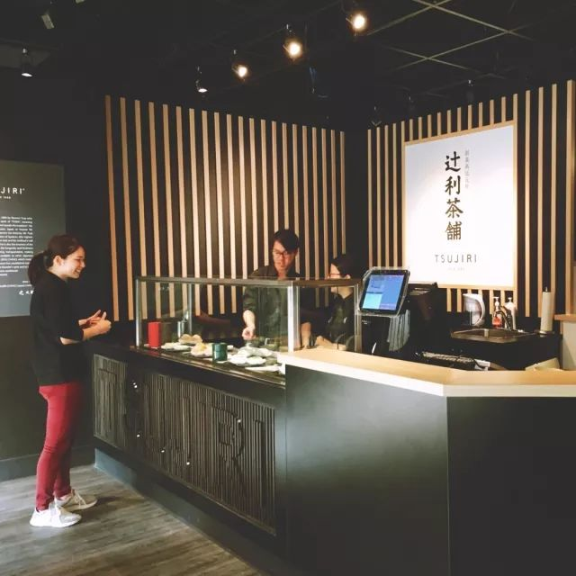

# 无标题

**链接地址:** http://mp.weixin.qq.com/s?__biz=MzI0MDQ0ODI0Ng==&mid=2247485784&idx=1&sn=5e635f801b1c2bedbd1769fc0129d9b4&chksm=e91beec1de6c67d73aad415c8dcd2500f43e4569313ba684ec39d9d5d0aeacbbc1e762b88e44&mpshare=1&scene=2&srcid=0516Bbrw6VRGFyHmLiAIxruq#rd
**作者:** 食悦
**获取时间:** 2025/8/28 21:54:06
**图片数量:** 61

---

## 原始HTML内容

<section style="box-sizing: border-box;"><section class="Powered-by-XIUMI V5" style="box-sizing: border-box;" powered-by="xiumi.us"><section class="" style="text-align: center;box-sizing: border-box;"><section class="" style="display: inline-block;width: 98%;vertical-align: top;box-shadow: rgba(177, 160, 254, 0.39) 2.82843px 2.82843px 4px;border-color: rgba(169, 169, 169, 0.53);border-width: 4px;border-radius: 4px;border-style: outset;box-sizing: border-box;"><section class="Powered-by-XIUMI V5" style="box-sizing: border-box;" powered-by="xiumi.us"><section class="" style="box-sizing: border-box;"><section class="" style="display: inline-block;vertical-align: bottom;width: 33.33%;box-sizing: border-box;"><section class="Powered-by-XIUMI V5" style="box-sizing: border-box;" powered-by="xiumi.us"><section class="" style="margin-right: 0%;margin-left: 0%;box-sizing: border-box;"><section class="" style="max-width: 100%;vertical-align: middle;display: inline-block;overflow: hidden !important;box-sizing: border-box;"></section></section></section><section class="Powered-by-XIUMI V5" style="box-sizing: border-box;" powered-by="xiumi.us"><section class="" style="margin-right: 0%;margin-left: 0%;box-sizing: border-box;"><section class="" style="max-width: 100%;vertical-align: middle;display: inline-block;overflow: hidden !important;box-sizing: border-box;"></section></section></section></section><section class="" style="display: inline-block;vertical-align: bottom;width: 33.33%;box-sizing: border-box;"><section class="Powered-by-XIUMI V5" style="box-sizing: border-box;" powered-by="xiumi.us"><section class="" style="box-sizing: border-box;"><section class="" style="font-size: 12px;color: rgb(114, 113, 113);box-sizing: border-box;">
<strong style="box-sizing: border-box;">倾</strong><strong style="box-sizing: border-box;">诚</strong><strong style="letter-spacing: 0px;box-sizing: border-box;">为您服务！</strong> 
</section></section></section><section class="Powered-by-XIUMI V5" style="box-sizing: border-box;" powered-by="xiumi.us"><section class="" style="box-sizing: border-box;"><section class="" style="display: inline-block;width: 100%;vertical-align: top;overflow-x: auto;overflow-y: hidden;box-sizing: border-box;-webkit-overflow-scrolling: touch;"><section style="width: 300%;min-width: 100%;max-width: 300% !important;box-sizing: border-box;"><section class="Powered-by-XIUMI V5" style="display: inline-block;width: 33.3333%;vertical-align: top;box-sizing: border-box;" powered-by="xiumi.us"><section class="" style="text-align: right;margin-right: 0%;margin-left: 0%;box-sizing: border-box;"><section class="" style="max-width: 100%;vertical-align: middle;display: inline-block;overflow: hidden !important;box-sizing: border-box;"></section></section></section><section class="Powered-by-XIUMI V5" style="display: inline-block;width: 33.3333%;vertical-align: top;box-sizing: border-box;" powered-by="xiumi.us"><section class="" style="margin-right: 0%;margin-left: 0%;box-sizing: border-box;"><section class="" style="max-width: 100%;vertical-align: middle;display: inline-block;overflow: hidden !important;box-sizing: border-box;"></section></section></section><section class="Powered-by-XIUMI V5" style="display: inline-block;width: 33.3333%;vertical-align: top;box-sizing: border-box;" powered-by="xiumi.us"><section class="" style="text-align: left;margin-right: 0%;margin-left: 0%;box-sizing: border-box;"><section class="" style="max-width: 100%;vertical-align: middle;display: inline-block;overflow: hidden !important;box-sizing: border-box;"></section></section></section></section></section></section></section><section class="Powered-by-XIUMI V5" style="box-sizing: border-box;" powered-by="xiumi.us"><section class="" style="margin-right: 0%;margin-left: 0%;box-sizing: border-box;"><section class="" style="max-width: 100%;vertical-align: middle;display: inline-block;overflow: hidden !important;box-sizing: border-box;"></section></section></section></section><section class="" style="display: inline-block;vertical-align: bottom;width: 33.33%;box-sizing: border-box;"><section class="Powered-by-XIUMI V5" style="box-sizing: border-box;" powered-by="xiumi.us"><section class="" style="margin-right: 0%;margin-left: 0%;box-sizing: border-box;"><section class="" style="max-width: 100%;vertical-align: middle;display: inline-block;box-shadow: rgb(0, 0, 0) 0px 0px 0px;border-width: 0px;overflow: hidden !important;box-sizing: border-box;"></section></section></section><section class="Powered-by-XIUMI V5" style="box-sizing: border-box;" powered-by="xiumi.us"><section class="" style="margin-right: 0%;margin-left: 0%;box-sizing: border-box;"><section class="" style="max-width: 100%;vertical-align: middle;display: inline-block;width: 80%;overflow: hidden !important;box-sizing: border-box;"></section></section></section><section class="Powered-by-XIUMI V5" style="box-sizing: border-box;" powered-by="xiumi.us"><section class="" style="margin-right: 0%;margin-left: 0%;box-sizing: border-box;"><section class="" style="display: inline-block;border-width: 2px;border-style: solid;border-color: rgba(0, 0, 0, 0);padding: 0.1em 0.3em;color: rgb(62, 62, 62);line-height: 1.5;letter-spacing: 0px;font-size: 10px;box-sizing: border-box;">
长按二维码

获得更多资讯
</section></section></section></section></section></section></section></section></section><section class="Powered-by-XIUMI V5" style="box-sizing: border-box;" powered-by="xiumi.us"><section class="" style="margin-top: 10px;margin-bottom: 10px;box-sizing: border-box;"><section class="" style="padding-top: 2px;padding-bottom: 2px;box-sizing: border-box;"><section style="height: 4px;transform: rotate(0deg);-webkit-transform: rotate(0deg);-moz-transform: rotate(0deg);-o-transform: rotate(0deg);float: left;margin-top: -3px;background-color: rgb(255, 255, 255);box-sizing: border-box;"><section style="width: 4px;height: 4px;border-radius: 100%;float: left;background-color: rgba(227, 170, 78, 0.94);box-sizing: border-box;"></section><section style="width: 4px;height: 4px;border-radius: 100%;margin-left: 0.5em;float: left;background-color: rgba(227, 170, 78, 0.94);box-sizing: border-box;"></section><section style="width: 4px;height: 4px;border-radius: 100%;margin-left: 0.5em;float: left;background-color: rgba(227, 170, 78, 0.94);box-sizing: border-box;"></section><section style="width: 4px;height: 4px;border-radius: 100%;margin-left: 0.5em;float: left;background-color: rgba(227, 170, 78, 0.94);box-sizing: border-box;"></section><section style="width: 4px;height: 4px;border-radius: 100%;margin-left: 0.5em;float: left;background-color: rgba(227, 170, 78, 0.94);box-sizing: border-box;"></section></section><section style="border-top: 1px solid rgba(227, 170, 78, 0.94);margin-top: -2px;border-right-color: rgba(227, 170, 78, 0.94);border-bottom-color: rgba(227, 170, 78, 0.94);border-left-color: rgba(227, 170, 78, 0.94);box-sizing: border-box;"></section><section class="" style="width: 100%;padding: 10px;box-sizing: border-box;"><section class="Powered-by-XIUMI V5" style="box-sizing: border-box;" powered-by="xiumi.us"><section class="" style="box-sizing: border-box;"><section class="" style="text-align: center;letter-spacing: 2px;line-height: 1;box-sizing: border-box;">
<strong style="box-sizing: border-box;">置顶广告专区</strong> 

<strong style="box-sizing: border-box;">金主大大的广告不仅可以看，还可以“玩”。</strong>

<strong style="box-sizing: border-box;">滑动箭头解锁更多信息哦~</strong>
</section></section></section></section><section style="width: 100%;text-align: right;box-sizing: border-box;"><section style="height: 4px;margin-top: -2px;float: right;transform: rotate(0deg);-webkit-transform: rotate(0deg);-moz-transform: rotate(0deg);-o-transform: rotate(0deg);background-color: rgb(255, 255, 255);box-sizing: border-box;"><section style="width: 4px;height: 4px;border-radius: 100%;float: left;background-color: rgba(227, 170, 78, 0.94);box-sizing: border-box;"></section><section style="width: 4px;height: 4px;border-radius: 100%;margin-left: 0.5em;float: left;background-color: rgba(227, 170, 78, 0.94);box-sizing: border-box;"></section><section style="width: 4px;height: 4px;border-radius: 100%;margin-left: 0.5em;float: left;background-color: rgba(227, 170, 78, 0.94);box-sizing: border-box;"></section><section style="width: 4px;height: 4px;border-radius: 100%;margin-left: 0.5em;float: left;background-color: rgba(227, 170, 78, 0.94);box-sizing: border-box;"></section><section style="width: 4px;height: 4px;border-radius: 100%;margin-left: 0.5em;float: left;background-color: rgba(227, 170, 78, 0.94);box-sizing: border-box;"></section></section><section style="clear: both;box-sizing: border-box;"></section><section style="border-top: 1px solid rgba(227, 170, 78, 0.94);margin-top: -2px;margin-bottom: 2px;border-right-color: rgba(227, 170, 78, 0.94);border-bottom-color: rgba(227, 170, 78, 0.94);border-left-color: rgba(227, 170, 78, 0.94);box-sizing: border-box;"></section></section></section></section></section><section class="Powered-by-XIUMI V5" style="box-sizing: border-box;" powered-by="xiumi.us"><section class="" style="box-sizing: border-box;"><section class="" style="box-sizing: border-box;">
 
</section></section></section><section class="Powered-by-XIUMI V5" style="box-sizing: border-box;" powered-by="xiumi.us"><section class="" style="box-sizing: border-box;"><section class="" style="font-size: 14px;color: rgb(156, 187, 158);box-sizing: border-box;">
<strong style="box-sizing: border-box;">○</strong>
</section></section></section><section class="Powered-by-XIUMI V5" style="box-sizing: border-box;" powered-by="xiumi.us"><section class="" style="box-sizing: border-box;"><section class="" style="font-size: 14px;color: rgb(156, 187, 158);box-sizing: border-box;">
<strong style="box-sizing: border-box;">○</strong>
</section></section></section><section class="Powered-by-XIUMI V5" style="box-sizing: border-box;" powered-by="xiumi.us"><section class="" style="box-sizing: border-box;"><section class="" style="box-sizing: border-box;">
 
</section></section></section><section class="Powered-by-XIUMI V5" style="box-sizing: border-box;" powered-by="xiumi.us"><section class="" style="text-align: center;font-size: 38px;box-sizing: border-box;"><section class="" style="box-sizing: border-box;display: inline-block;vertical-align: top;width: 3em;height: 3em;margin: auto;border-radius: 100%;border-width: 6px;border-style: solid;border-color: rgb(255, 255, 255);background-position: center center;background-repeat: no-repeat;background-size: cover;box-shadow: rgb(0, 0, 0) 0px 0px 0px;background-image: url(&quot;https://mmbiz.qpic.cn/mmbiz_jpg/XA8n2XaESnSTRwH1B7JDOfeS8DZ0hwG3C7QKEOUpMnByMGYxtZjbZvcuOszJSrRiau5FrOw1KzUHQCFiaJuWd0CA/640?wx_fmt=jpeg&quot;);"><section class="" style="width: 100%;height: 100%;overflow: hidden;box-sizing: border-box;"></section></section></section></section><section class="Powered-by-XIUMI V5" style="box-sizing: border-box;" powered-by="xiumi.us"><section class="" style="box-sizing: border-box;"><section class="" style="box-sizing: border-box;">
 
</section></section></section><section class="Powered-by-XIUMI V5" style="box-sizing: border-box;" powered-by="xiumi.us"><section class="" style="box-sizing: border-box;"><section class="" style="display: inline-block;vertical-align: top;width: 20%;box-sizing: border-box;"><section class="Powered-by-XIUMI V5" style="box-sizing: border-box;" powered-by="xiumi.us"><section class="" style="margin-top: 0.5em;margin-bottom: 0.5em;box-sizing: border-box;"><section class="" style="background-color: rgb(202, 198, 198);height: 1px;box-sizing: border-box;"></section></section></section><section class="Powered-by-XIUMI V5" style="box-sizing: border-box;" powered-by="xiumi.us"><section class="" style="margin-top: 0.5em;margin-bottom: 0.5em;box-sizing: border-box;"><section class="" style="background-color: rgb(202, 198, 198);height: 1px;box-sizing: border-box;"></section></section></section></section><section class="" style="display: inline-block;vertical-align: top;width: 59%;box-sizing: border-box;"><section class="Powered-by-XIUMI V5" style="box-sizing: border-box;" powered-by="xiumi.us"><section class="" style="margin-top: -10px;margin-right: 0%;margin-left: 0%;box-sizing: border-box;"><section class="" style="text-align: center;font-size: 14px;color: rgb(160, 160, 160);box-sizing: border-box;">
传统，品质，健康，创新 
</section></section></section><section class="Powered-by-XIUMI V5" style="box-sizing: border-box;" powered-by="xiumi.us"><section class="" style="box-sizing: border-box;"><section class="" style="text-align: center;font-size: 20px;color: rgb(133, 118, 106);letter-spacing: 2px;box-sizing: border-box;">
<strong style="box-sizing: border-box;">辻利茶铺&nbsp;</strong>
</section></section></section></section><section class="" style="display: inline-block;vertical-align: top;width: 20%;box-sizing: border-box;"><section class="Powered-by-XIUMI V5" style="box-sizing: border-box;" powered-by="xiumi.us"><section class="" style="margin-top: 0.5em;margin-bottom: 0.5em;box-sizing: border-box;"><section class="" style="background-color: rgb(202, 198, 198);height: 1px;box-sizing: border-box;"></section></section></section><section class="Powered-by-XIUMI V5" style="box-sizing: border-box;" powered-by="xiumi.us"><section class="" style="margin-top: 0.5em;margin-bottom: 0.5em;box-sizing: border-box;"><section class="" style="background-color: rgb(202, 198, 198);height: 1px;box-sizing: border-box;"></section></section></section></section></section></section><section class="Powered-by-XIUMI V5" style="box-sizing: border-box;" powered-by="xiumi.us"><section class="" style="box-sizing: border-box;"><section class="" style="box-sizing: border-box;">
 
</section></section></section><section class="Powered-by-XIUMI V5" style="box-sizing: border-box;" powered-by="xiumi.us"><section class="" style="margin-top: 10px;margin-bottom: 10px;text-align: center;box-sizing: border-box;"><section class="" style="width: 100%;text-align: left;background-color: rgba(62, 135, 33, 0.41);box-sizing: border-box;"><section style="display: inline-block;vertical-align: top;float: left;margin-top: -0.68em;transform: rotate(0deg);-webkit-transform: rotate(0deg);-moz-transform: rotate(0deg);-o-transform: rotate(0deg);box-sizing: border-box;"><section style="display: inline-block;vertical-align: top;border-right: 0.4em solid rgba(62, 135, 33, 0.89);border-bottom: 0.4em solid rgba(62, 135, 33, 0.89);max-width: 5% !important;border-top: 0.4em solid transparent !important;border-left: 0.4em solid transparent !important;box-sizing: border-box;"></section><section class="" style="display: inline-block;vertical-align: top;border-radius: 0px 0px 5px 5px;background-color: rgb(160, 217, 97);padding: 2px 5px;font-size: 18px;line-height: 1.2em;color: rgb(255, 255, 255);text-align: center;max-width: 90% !important;box-sizing: border-box;">
00
</section><section style="display: inline-block;vertical-align: top;border-bottom: 0.4em solid rgba(62, 135, 33, 0.89);border-left: 0.4em solid rgba(62, 135, 33, 0.89);max-width: 5% !important;border-right: 0.4em solid transparent !important;border-top: 0.4em solid transparent !important;box-sizing: border-box;"></section></section><section class="" style="display: inline-block;vertical-align: top;padding: 5px;line-height: 1.2em;color: rgb(255, 255, 255);text-align: center;box-sizing: border-box;">
<strong style="box-sizing: border-box;">你是我，282天以来的期待。</strong>
</section></section></section></section><section class="Powered-by-XIUMI V5" style="box-sizing: border-box;" powered-by="xiumi.us"><section class="" style="margin-top: 10px;margin-bottom: 10px;box-sizing: border-box;"><section class="" style="height: 1.4em;border-left: 1px solid rgb(46, 79, 25);margin-bottom: -0.9em;margin-left: 0.5em;box-sizing: border-box;"></section><section class="" style="width: 2.5em;border-top: 1px solid rgb(46, 79, 25);box-sizing: border-box;"></section><section class="" style="padding-right: 0.5em;padding-left: 0.5em;box-sizing: border-box;"><section class="" style="padding: 10px;box-shadow: rgb(0, 0, 0) 0px 0px 0px;box-sizing: border-box;"><section class="Powered-by-XIUMI V5" style="box-sizing: border-box;" powered-by="xiumi.us"><section class="" style="box-sizing: border-box;"><section class="" style="text-align: justify;font-size: 14px;color: rgba(62, 62, 62, 0.37);letter-spacing: 1.6px;box-sizing: border-box;">
这段日子以来食悦被关注者们问的最多的问题就是：

 

<strong style="box-sizing: border-box;">“辻利茶铺到底什么时候才开门啊！”</strong>

 

食悦和大家一样，对这家拥有158年历史文化的全球连锁茶甜品店充满了期待与好奇。一直不停地刷新着他们商家主页的画面。直到一个多星期以前收到一封来自辻利茶铺的邮件：

 

<strong style="box-sizing: border-box;">“食悦，我们要</strong>

<strong style="box-sizing: border-box;">在2018年5月16日正式开业了</strong>，

<strong style="box-sizing: border-box;">你来吗？”</strong>
</section></section></section><section class="Powered-by-XIUMI V5" style="box-sizing: border-box;" powered-by="xiumi.us"><section class="" style="box-sizing: border-box;"><section class="" style="box-sizing: border-box;">
 
</section></section></section><section class="Powered-by-XIUMI V5" style="box-sizing: border-box;" powered-by="xiumi.us"><section class="" style="text-align: center;margin-top: 0.5em;margin-bottom: 0.5em;padding-left: 0.5em;padding-right: 0.5em;box-sizing: border-box;"><section class="" style="box-sizing: border-box;width: 95%;border-width: 4px;border-style: solid;border-color: white;box-shadow: rgb(102, 102, 102) 3.53553px 3.53553px 8px;display: inline-block;height: auto !important;overflow: hidden !important;"></section></section></section><section class="Powered-by-XIUMI V5" style="box-sizing: border-box;" powered-by="xiumi.us"><section class="" style="box-sizing: border-box;"><section class="" style="text-align: justify;font-size: 14px;color: rgba(62, 62, 62, 0.37);letter-spacing: 1.6px;box-sizing: border-box;">
 

我发誓这是我今年收到最让我激动的邮件！整个人开心地从椅子上蹦了起来！自2017年8月7日得知辻利茶铺入驻埃德蒙顿的这个消息起，我们已经等待了超过<strong style="box-sizing: border-box;">280多天</strong>的时间！然而更让食悦激动的是，贴心的辻利茶铺为食悦和期待辻利茶铺已久的大家特别策划了一场活动，让你们在开业前就可以同食悦一同领略到这家甜品的魅力。

 

<strong style="box-sizing: border-box;">来自日本的高级抹茶拿铁滋味到底如何呢？</strong>

<strong style="box-sizing: border-box;">菜单上有什么特色甜品供大家选择呢？</strong>

<strong style="box-sizing: border-box;">又会有什么值得期待的新品呢？</strong>

 

相信你的好奇和期待远不止这么多。那就快跟着食悦一起去看看吧！
</section></section></section></section></section><section class="" style="width: 2.5em;margin-left: auto;box-sizing: border-box;"><section style="width: 2.5em;border-top: 1px solid rgb(46, 79, 25);box-sizing: border-box;"></section><section style="height: 1.4em;border-left: 1px solid rgb(46, 79, 25);margin-top: -0.9em;margin-left: 2em;box-sizing: border-box;"></section></section></section></section><section class="Powered-by-XIUMI V5" style="box-sizing: border-box;" powered-by="xiumi.us"><section class="" style="margin-top: 0.5em;margin-bottom: 0.5em;text-align: center;box-sizing: border-box;"> <section class="" style="padding: 0.5em;box-sizing: border-box;"><section class="Powered-by-XIUMI V5" style="box-sizing: border-box;" powered-by="xiumi.us"><section class="" style="box-sizing: border-box;"><section class="" style="color: rgb(42, 52, 58);font-size: 12px;box-sizing: border-box;">
本文非原创部分广告图片和信息均来自Tsujiri中国，Tsujiri国际官方网站，和官方内部宣传资料。未经许可请勿转载。
</section></section></section></section> </section></section><section class="Powered-by-XIUMI V5" style="box-sizing: border-box;" powered-by="xiumi.us"><section class="" style="margin-top: 10px;margin-bottom: 10px;text-align: center;box-sizing: border-box;"><section class="" style="width: 100%;text-align: left;background-color: rgba(62, 135, 33, 0.41);box-sizing: border-box;"><section style="display: inline-block;vertical-align: top;float: left;margin-top: -0.68em;transform: rotate(0deg);-webkit-transform: rotate(0deg);-moz-transform: rotate(0deg);-o-transform: rotate(0deg);box-sizing: border-box;"><section style="display: inline-block;vertical-align: top;border-right: 0.4em solid rgba(62, 135, 33, 0.89);border-bottom: 0.4em solid rgba(62, 135, 33, 0.89);max-width: 5% !important;border-top: 0.4em solid transparent !important;border-left: 0.4em solid transparent !important;box-sizing: border-box;"></section><section class="" style="display: inline-block;vertical-align: top;border-radius: 0px 0px 5px 5px;background-color: rgb(160, 217, 97);padding: 2px 5px;font-size: 18px;line-height: 1.2em;color: rgb(255, 255, 255);text-align: center;max-width: 90% !important;box-sizing: border-box;">
01
</section><section style="display: inline-block;vertical-align: top;border-bottom: 0.4em solid rgba(62, 135, 33, 0.89);border-left: 0.4em solid rgba(62, 135, 33, 0.89);max-width: 5% !important;border-right: 0.4em solid transparent !important;border-top: 0.4em solid transparent !important;box-sizing: border-box;"></section></section><section class="" style="display: inline-block;vertical-align: top;padding: 5px;line-height: 1.2em;color: rgb(255, 255, 255);text-align: center;box-sizing: border-box;">
<strong style="box-sizing: border-box;">158年的悠久历史是对传统的传承</strong>
</section></section></section></section><section class="Powered-by-XIUMI V5" style="box-sizing: border-box;" powered-by="xiumi.us"><section class="" style="text-align: center;margin-top: 0.5em;margin-bottom: 0.5em;padding-left: 0.5em;padding-right: 0.5em;box-sizing: border-box;"><section class="" style="box-sizing: border-box;width: 95%;border-width: 4px;border-style: solid;border-color: white;box-shadow: rgb(102, 102, 102) 3.53553px 3.53553px 8px;display: inline-block;height: auto !important;overflow: hidden !important;"></section></section></section><section class="Powered-by-XIUMI V5" style="box-sizing: border-box;" powered-by="xiumi.us"><section class="" style="box-sizing: border-box;"><section class="" style="text-align: center;font-size: 12px;color: rgba(62, 62, 62, 0.37);box-sizing: border-box;">
辻利右卫门伫立在日本京都平等院的门口的雕像
</section></section></section><section class="Powered-by-XIUMI V5" style="box-sizing: border-box;" powered-by="xiumi.us"><section class="" style="box-sizing: border-box;"><section class="" style="box-sizing: border-box;">
 
</section></section></section><section class="Powered-by-XIUMI V5" style="box-sizing: border-box;" powered-by="xiumi.us"><section class="" style="box-sizing: border-box;"><section class="" style="text-align: justify;font-size: 14px;color: rgba(62, 62, 62, 0.72);letter-spacing: 1.6px;padding-right: 10px;padding-left: 10px;box-sizing: border-box;">
“日本江户时代末期，即公元1860年，「辻利」由<strong style="box-sizing: border-box;">辻利右卫门</strong>在<strong style="box-sizing: border-box;">京都宇治</strong>创立。他改善了茶产业，推进和创新<strong style="box-sizing: border-box;">玉露</strong>茶的制作方法，将茶香与甘甜度提升到最高等级。同时，他还发明了可让茶叶的温度和湿度都能够完美储存的「<strong style="box-sizing: border-box;">茶柜</strong>」，不但让民众品尝到绿茶的真正原味，也把宇治茶发扬光大，流通至日本全国各地。辻利右卫门的努力被很多人认可，雕像如今仍伫立在日本京都的世界遗产级寺庙—平等院的门口。”
</section></section></section><section class="Powered-by-XIUMI V5" style="box-sizing: border-box;" powered-by="xiumi.us"><section class="" style="box-sizing: border-box;"><section class="" style="box-sizing: border-box;">
 
</section></section></section><section class="Powered-by-XIUMI V5" style="box-sizing: border-box;" powered-by="xiumi.us"><section class="" style="text-align: center;margin-top: 0.5em;margin-bottom: 0.5em;padding-left: 0.5em;padding-right: 0.5em;box-sizing: border-box;"><section class="" style="box-sizing: border-box;width: 95%;border-width: 4px;border-style: solid;border-color: white;box-shadow: rgb(102, 102, 102) 3.53553px 3.53553px 8px;display: inline-block;height: auto !important;overflow: hidden !important;"></section></section></section><section class="Powered-by-XIUMI V5" style="box-sizing: border-box;" powered-by="xiumi.us"><section class="" style="box-sizing: border-box;"><section class="" style="text-align: center;font-size: 12px;color: rgba(62, 62, 62, 0.37);box-sizing: border-box;">
可让茶叶的温度和湿度都能够完美储存的“茶柜”
</section></section></section><section class="Powered-by-XIUMI V5" style="box-sizing: border-box;" powered-by="xiumi.us"><section class="" style="box-sizing: border-box;"><section class="" style="box-sizing: border-box;">
 
</section></section></section><section class="Powered-by-XIUMI V5" style="box-sizing: border-box;" powered-by="xiumi.us"><section class="" style="box-sizing: border-box;"><section class="" style="text-align: justify;font-size: 14px;color: rgba(62, 62, 62, 0.72);letter-spacing: 1.6px;padding-right: 10px;padding-left: 10px;box-sizing: border-box;">
“辻利旨在传播日本茶道精神和茶道文化。茶道精神讲究“<strong style="box-sizing: border-box;">和敬清寂</strong>”，让人们通过一杯茶，一口甜点，给忙碌的生活带来一份内心的平和，唤起对生活的热情。辻利希望，能给忙碌的现代社会，带来一种<strong style="box-sizing: border-box;">高品质</strong>的生活方式。”
</section></section></section><section class="Powered-by-XIUMI V5" style="box-sizing: border-box;" powered-by="xiumi.us"><section class="" style="box-sizing: border-box;"><section class="" style="box-sizing: border-box;">
 
</section></section></section><section class="Powered-by-XIUMI V5" style="box-sizing: border-box;" powered-by="xiumi.us"><section class="" style="margin-top: 10px;margin-bottom: 10px;text-align: center;box-sizing: border-box;"><section class="" style="width: 100%;text-align: left;background-color: rgba(62, 135, 33, 0.41);box-sizing: border-box;"><section style="display: inline-block;vertical-align: top;float: left;margin-top: -0.68em;transform: rotate(0deg);-webkit-transform: rotate(0deg);-moz-transform: rotate(0deg);-o-transform: rotate(0deg);box-sizing: border-box;"><section style="display: inline-block;vertical-align: top;border-right: 0.4em solid rgba(62, 135, 33, 0.89);border-bottom: 0.4em solid rgba(62, 135, 33, 0.89);max-width: 5% !important;border-top: 0.4em solid transparent !important;border-left: 0.4em solid transparent !important;box-sizing: border-box;"></section><section class="" style="display: inline-block;vertical-align: top;border-radius: 0px 0px 5px 5px;background-color: rgb(160, 217, 97);padding: 2px 5px;font-size: 18px;line-height: 1.2em;color: rgb(255, 255, 255);text-align: center;max-width: 90% !important;box-sizing: border-box;">
02
</section><section style="display: inline-block;vertical-align: top;border-bottom: 0.4em solid rgba(62, 135, 33, 0.89);border-left: 0.4em solid rgba(62, 135, 33, 0.89);max-width: 5% !important;border-right: 0.4em solid transparent !important;border-top: 0.4em solid transparent !important;box-sizing: border-box;"></section></section><section class="" style="display: inline-block;vertical-align: top;padding: 5px;line-height: 1.2em;color: rgb(255, 255, 255);text-align: center;box-sizing: border-box;">
<strong style="box-sizing: border-box;">最顶级的“玉露茶”是对品质的坚持</strong>
</section></section></section></section><section class="Powered-by-XIUMI V5" style="box-sizing: border-box;" powered-by="xiumi.us"><section class="" style="text-align: center;margin-top: 0.5em;margin-bottom: 0.5em;padding-left: 0.5em;padding-right: 0.5em;box-sizing: border-box;"><section class="" style="box-sizing: border-box;width: 95%;border-width: 4px;border-style: solid;border-color: white;box-shadow: rgb(102, 102, 102) 3.53553px 3.53553px 8px;display: inline-block;height: auto !important;overflow: hidden !important;"></section></section></section><section class="Powered-by-XIUMI V5" style="box-sizing: border-box;" powered-by="xiumi.us"><section class="" style="box-sizing: border-box;"><section class="" style="text-align: center;font-size: 12px;color: rgba(62, 62, 62, 0.37);box-sizing: border-box;">
用稻草覆盖遮挡光线的茶株能较大限度的保留翠绿的色泽和甘甜的回味
</section></section></section><section class="Powered-by-XIUMI V5" style="box-sizing: border-box;" powered-by="xiumi.us"><section class="" style="box-sizing: border-box;"><section class="" style="box-sizing: border-box;">
 
</section></section></section><section class="Powered-by-XIUMI V5" style="box-sizing: border-box;" powered-by="xiumi.us"><section class="" style="box-sizing: border-box;"><section class="" style="text-align: justify;font-size: 14px;color: rgba(62, 62, 62, 0.72);letter-spacing: 1.6px;padding-right: 10px;padding-left: 10px;box-sizing: border-box;">
“158年来，辻利坚持着只提供最优质的抹茶。所有产品使用的抹茶粉，皆严选自京都宇治本店，自家茶庄生产的最<strong style="box-sizing: border-box;">顶级玉露茶</strong>，用传统的石臼细细研磨，带出最上乘的香气和味道。”
</section></section></section><section class="Powered-by-XIUMI V5" style="box-sizing: border-box;" powered-by="xiumi.us"><section class="" style="box-sizing: border-box;"><section class="" style="box-sizing: border-box;">
 
</section></section></section><section class="Powered-by-XIUMI V5" style="box-sizing: border-box;" powered-by="xiumi.us"><section class="" style="text-align: center;margin-top: 0.5em;margin-bottom: 0.5em;padding-left: 0.5em;padding-right: 0.5em;box-sizing: border-box;"><section class="" style="box-sizing: border-box;width: 95%;border-width: 4px;border-style: solid;border-color: white;box-shadow: rgb(102, 102, 102) 3.53553px 3.53553px 8px;display: inline-block;height: auto !important;overflow: hidden !important;"></section></section></section><section class="Powered-by-XIUMI V5" style="box-sizing: border-box;" powered-by="xiumi.us"><section class="" style="box-sizing: border-box;"><section class="" style="text-align: center;font-size: 12px;color: rgba(62, 62, 62, 0.37);box-sizing: border-box;">
使用传统石臼研磨的抹茶产量极低，所以十分珍贵
</section></section></section><section class="Powered-by-XIUMI V5" style="box-sizing: border-box;" powered-by="xiumi.us"><section class="" style="box-sizing: border-box;"><section class="" style="box-sizing: border-box;">
 
</section></section></section><section class="Powered-by-XIUMI V5" style="box-sizing: border-box;" powered-by="xiumi.us"><section class="" style="box-sizing: border-box;"><section class="" style="text-align: justify;font-size: 14px;color: rgba(62, 62, 62, 0.72);letter-spacing: 1.6px;padding-right: 10px;padding-left: 10px;box-sizing: border-box;">
“辻利到现在为止都秉持著传统作法，使用石臼将茶叶研磨成粉末。事实上一台石臼一天8小时的产量约是400g~500g抹茶粉，相当于<strong style="box-sizing: border-box;">1分钟只能产出1g</strong>。我们认为唯有使用自古沿袭至今的石臼研磨方法才可以生产出更优质的抹茶粉，使抹茶粉本身散发出的香气更香浓。”
</section></section></section><section class="Powered-by-XIUMI V5" style="box-sizing: border-box;" powered-by="xiumi.us"><section class="" style="box-sizing: border-box;"><section class="" style="box-sizing: border-box;">
 
</section></section></section><section class="Powered-by-XIUMI V5" style="box-sizing: border-box;" powered-by="xiumi.us"><section class="" style="margin-top: 10px;margin-bottom: 10px;text-align: center;box-sizing: border-box;"><section class="" style="width: 100%;text-align: left;background-color: rgba(62, 135, 33, 0.41);box-sizing: border-box;"><section style="display: inline-block;vertical-align: top;float: left;margin-top: -0.68em;transform: rotate(0deg);-webkit-transform: rotate(0deg);-moz-transform: rotate(0deg);-o-transform: rotate(0deg);box-sizing: border-box;"><section style="display: inline-block;vertical-align: top;border-right: 0.4em solid rgba(62, 135, 33, 0.89);border-bottom: 0.4em solid rgba(62, 135, 33, 0.89);max-width: 5% !important;border-top: 0.4em solid transparent !important;border-left: 0.4em solid transparent !important;box-sizing: border-box;"></section><section class="" style="display: inline-block;vertical-align: top;border-radius: 0px 0px 5px 5px;background-color: rgb(160, 217, 97);padding: 2px 5px;font-size: 18px;line-height: 1.2em;color: rgb(255, 255, 255);text-align: center;max-width: 90% !important;box-sizing: border-box;">
03
</section><section style="display: inline-block;vertical-align: top;border-bottom: 0.4em solid rgba(62, 135, 33, 0.89);border-left: 0.4em solid rgba(62, 135, 33, 0.89);max-width: 5% !important;border-right: 0.4em solid transparent !important;border-top: 0.4em solid transparent !important;box-sizing: border-box;"></section></section><section class="" style="display: inline-block;vertical-align: top;padding: 5px;line-height: 1.2em;color: rgb(255, 255, 255);text-align: center;box-sizing: border-box;">
<strong style="box-sizing: border-box;">健康，是世界饮食消费观的趋势</strong>
</section></section></section></section><section class="Powered-by-XIUMI V5" style="box-sizing: border-box;" powered-by="xiumi.us"><section class="" style="text-align: center;margin-top: 0.5em;margin-bottom: 0.5em;padding-left: 0.5em;padding-right: 0.5em;box-sizing: border-box;"><section class="" style="box-sizing: border-box;width: 95%;border-width: 4px;border-style: solid;border-color: white;box-shadow: rgb(102, 102, 102) 3.53553px 3.53553px 8px;display: inline-block;height: auto !important;overflow: hidden !important;"></section></section></section><section class="Powered-by-XIUMI V5" style="box-sizing: border-box;" powered-by="xiumi.us"><section class="" style="box-sizing: border-box;"><section class="" style="text-align: center;font-size: 12px;color: rgba(62, 62, 62, 0.37);box-sizing: border-box;">
抹茶为你的身体提供更优质健康的能量源泉
</section></section></section><section class="Powered-by-XIUMI V5" style="box-sizing: border-box;" powered-by="xiumi.us"><section class="" style="box-sizing: border-box;"><section class="" style="box-sizing: border-box;">
 
</section></section></section><section class="Powered-by-XIUMI V5" style="box-sizing: border-box;" powered-by="xiumi.us"><section class="" style="box-sizing: border-box;"><section class="" style="text-align: justify;font-size: 14px;color: rgba(62, 62, 62, 0.72);letter-spacing: 1.6px;padding-right: 10px;padding-left: 10px;box-sizing: border-box;">
“自古以来，抹茶就因它的舒缓效果和对健康的益处而闻名。”近些年抹茶更是以<strong style="box-sizing: border-box;">抗衰老</strong>和<strong style="box-sizing: border-box;">抗癌</strong>成分而享誉盛名。抹茶富含维他命A，C，E和贝塔胡萝卜素，是最好的抗氧化剂之一。另外富含儿茶素这种<strong style="box-sizing: border-box;">减肥流脂</strong>圣品的特点让你在享用抹茶食品的同时不用担心摄入过多的卡路里而产生体重的困扰。

 
</section></section></section><section class="Powered-by-XIUMI V5" style="box-sizing: border-box;" powered-by="xiumi.us"><section class="" style="margin-top: 10px;margin-bottom: 10px;text-align: center;box-sizing: border-box;"><section class="" style="width: 100%;text-align: left;background-color: rgba(62, 135, 33, 0.41);box-sizing: border-box;"><section style="display: inline-block;vertical-align: top;float: left;margin-top: -0.68em;transform: rotate(0deg);-webkit-transform: rotate(0deg);-moz-transform: rotate(0deg);-o-transform: rotate(0deg);box-sizing: border-box;"><section style="display: inline-block;vertical-align: top;border-right: 0.4em solid rgba(62, 135, 33, 0.89);border-bottom: 0.4em solid rgba(62, 135, 33, 0.89);max-width: 5% !important;border-top: 0.4em solid transparent !important;border-left: 0.4em solid transparent !important;box-sizing: border-box;"></section><section class="" style="display: inline-block;vertical-align: top;border-radius: 0px 0px 5px 5px;background-color: rgb(160, 217, 97);padding: 2px 5px;font-size: 18px;line-height: 1.2em;color: rgb(255, 255, 255);text-align: center;max-width: 90% !important;box-sizing: border-box;">
04
</section><section style="display: inline-block;vertical-align: top;border-bottom: 0.4em solid rgba(62, 135, 33, 0.89);border-left: 0.4em solid rgba(62, 135, 33, 0.89);max-width: 5% !important;border-right: 0.4em solid transparent !important;border-top: 0.4em solid transparent !important;box-sizing: border-box;"></section></section><section class="" style="display: inline-block;vertical-align: top;padding: 5px;line-height: 1.2em;color: rgb(255, 255, 255);text-align: center;box-sizing: border-box;">
<strong style="box-sizing: border-box;">勇敢跨出国门，为世界带来抹茶的清香</strong>
</section></section></section></section><section class="Powered-by-XIUMI V5" style="box-sizing: border-box;" powered-by="xiumi.us"><section class="" style="text-align: center;margin-top: 0.5em;margin-bottom: 0.5em;padding-left: 0.5em;padding-right: 0.5em;box-sizing: border-box;"><section class="" style="box-sizing: border-box;width: 95%;border-width: 4px;border-style: solid;border-color: white;box-shadow: rgb(102, 102, 102) 3.53553px 3.53553px 8px;display: inline-block;height: auto !important;overflow: hidden !important;"></section></section></section><section class="Powered-by-XIUMI V5" style="box-sizing: border-box;" powered-by="xiumi.us"><section class="" style="box-sizing: border-box;"><section class="" style="text-align: center;font-size: 12px;color: rgba(62, 62, 62, 0.37);box-sizing: border-box;">
位于安省的两家分店，是辻利进驻加拿大市场的第一步
</section></section></section><section class="Powered-by-XIUMI V5" style="box-sizing: border-box;" powered-by="xiumi.us"><section class="" style="box-sizing: border-box;"><section class="" style="box-sizing: border-box;">
 
</section></section></section><section class="Powered-by-XIUMI V5" style="box-sizing: border-box;" powered-by="xiumi.us"><section class="" style="box-sizing: border-box;"><section class="" style="text-align: justify;font-size: 14px;color: rgba(62, 62, 62, 0.72);letter-spacing: 1.6px;padding-right: 10px;padding-left: 10px;box-sizing: border-box;">
“在日本，辻利广为大众熟悉，不仅因为它浓厚的历史文化，也是因为它对茶文化的杰出贡献。为了让全球消费者，可以一同体验抹茶的魅力，辻利将抹茶与甜品及饮品结合，期望每位顾客能够找到自己喜爱的产品，从而真正体会日本茶文化，<strong style="box-sizing: border-box;">誓做世界钟爱的品牌</strong>。”
</section></section></section><section class="Powered-by-XIUMI V5" style="box-sizing: border-box;" powered-by="xiumi.us"><section class="" style="box-sizing: border-box;"><section class="" style="box-sizing: border-box;">
 
</section></section></section><section class="Powered-by-XIUMI V5" style="box-sizing: border-box;" powered-by="xiumi.us"><section class="" style="text-align: center;margin-top: 0.5em;margin-bottom: 0.5em;padding-left: 0.5em;padding-right: 0.5em;box-sizing: border-box;"><section class="" style="box-sizing: border-box;width: 95%;border-width: 4px;border-style: solid;border-color: white;box-shadow: rgb(102, 102, 102) 3.53553px 3.53553px 8px;display: inline-block;height: auto !important;overflow: hidden !important;"></section></section></section><section class="Powered-by-XIUMI V5" style="box-sizing: border-box;" powered-by="xiumi.us"><section class="" style="box-sizing: border-box;"><section class="" style="text-align: center;font-size: 12px;color: rgba(62, 62, 62, 0.37);box-sizing: border-box;">
位于Edmonton的Tsujiri新店！
</section></section></section><section class="Powered-by-XIUMI V5" style="box-sizing: border-box;" powered-by="xiumi.us"><section class="" style="box-sizing: border-box;"><section class="" style="box-sizing: border-box;">
 
</section></section></section><section class="Powered-by-XIUMI V5" style="box-sizing: border-box;" powered-by="xiumi.us"><section class="" style="box-sizing: border-box;"><section class="" style="text-align: justify;font-size: 14px;color: rgba(62, 62, 62, 0.72);letter-spacing: 1.6px;padding-right: 10px;padding-left: 10px;box-sizing: border-box;">
“2010年，辻利踏出第一步，在台湾开设了第一家海外门店。&nbsp; 2012年，辻利于新加坡开设门店。&nbsp; 2013年，辻利成功进驻中国上海。&nbsp; 2016年，辻利进驻加拿大多伦多与英国伦敦。”

<strong style="box-sizing: border-box;">2018年5月16日，辻利加拿大埃德蒙顿店正式开业！</strong>
</section></section></section><section class="Powered-by-XIUMI V5" style="box-sizing: border-box;" powered-by="xiumi.us"><section class="" style="box-sizing: border-box;"><section class="" style="box-sizing: border-box;">
 
</section></section></section><section class="Powered-by-XIUMI V5" style="box-sizing: border-box;" powered-by="xiumi.us"><section class="" style="text-align: center;margin: 10px 0%;box-sizing: border-box;"><section class="" style="display: inline-block;vertical-align: middle;width: 43%;padding-right: 10px;box-sizing: border-box;"><section class="Powered-by-XIUMI V5" style="box-sizing: border-box;" powered-by="xiumi.us"><section class="" style="margin-top: 10px;margin-bottom: 10px;text-align: right;font-size: 13px;box-sizing: border-box;"><section class="" style="display: inline-block;vertical-align: middle;padding: 5px;box-sizing: border-box;"><section style="display: inline-block;vertical-align: middle;width: 1.2em;height: 1.2em;border-width: 2px;border-style: solid;border-color: rgba(62, 135, 33, 0.89);transform: rotate(45deg);box-sizing: border-box;"></section><section style="display: inline-block;vertical-align: middle;width: 1.2em;height: 1.2em;border-width: 2px;border-style: solid;border-color: rgba(62, 135, 33, 0.89);margin-left: -0.5em;transform: rotate(45deg);box-sizing: border-box;"></section></section></section></section></section><section class="" style="display: inline-block;vertical-align: middle;width: 14%;box-sizing: border-box;"><section class="Powered-by-XIUMI V5" style="box-sizing: border-box;" powered-by="xiumi.us"><section class="" style="margin-top: 10px;margin-bottom: 10px;box-sizing: border-box;"><section class="" style="max-width: 100%;vertical-align: middle;display: inline-block;width: 100%;overflow: hidden !important;box-sizing: border-box;"></section></section></section></section><section class="" style="display: inline-block;vertical-align: middle;width: 43%;padding-left: 10px;box-sizing: border-box;"><section class="Powered-by-XIUMI V5" style="box-sizing: border-box;" powered-by="xiumi.us"><section class="" style="margin-top: 10px;margin-bottom: 10px;text-align: left;font-size: 13px;box-sizing: border-box;"><section class="" style="display: inline-block;vertical-align: middle;padding: 5px;box-sizing: border-box;"><section style="display: inline-block;vertical-align: middle;width: 1.2em;height: 1.2em;border-width: 2px;border-style: solid;border-color: rgba(62, 135, 33, 0.89);transform: rotate(45deg);box-sizing: border-box;"></section><section style="display: inline-block;vertical-align: middle;width: 1.2em;height: 1.2em;border-width: 2px;border-style: solid;border-color: rgba(62, 135, 33, 0.89);margin-left: -0.5em;transform: rotate(45deg);box-sizing: border-box;"></section></section></section></section></section></section></section><section class="Powered-by-XIUMI V5" style="box-sizing: border-box;" powered-by="xiumi.us"><section class="" style="box-sizing: border-box;"><section class="" style="box-sizing: border-box;">
 
</section></section></section><section class="Powered-by-XIUMI V5" style="box-sizing: border-box;" powered-by="xiumi.us"><section class="" style="margin: 10px 0%;box-sizing: border-box;"><section class="" style="display: inline-block;width: 100%;vertical-align: top;background-position: 166.738% 29.5052%;background-repeat: repeat;background-size: 101.825%;background-attachment: scroll;padding: 30px;box-shadow: rgb(0, 0, 0) 0px 0px 0px;background-image: url(&quot;https://mmbiz.qpic.cn/mmbiz_jpg/XA8n2XaESnSTRwH1B7JDOfeS8DZ0hwG3wpKyrwialFA1lkibJLxIvVUnzjSgibWSFxeIyxzj0riaGUS9u4oiaba0bJA/640?wx_fmt=jpeg&quot;);box-sizing: border-box;"><section class="Powered-by-XIUMI V5" style="box-sizing: border-box;" powered-by="xiumi.us"><section class="" style="box-sizing: border-box;"><section class="" style="display: inline-block;width: 100%;vertical-align: top;padding: 10px;border-width: 3px;border-radius: 0px;border-style: solid;border-color: rgb(255, 255, 255);background-color: rgba(62, 62, 62, 0.37);box-sizing: border-box;"><section class="Powered-by-XIUMI V5" style="box-sizing: border-box;" powered-by="xiumi.us"><section class="" style="box-sizing: border-box;"><section class="" style="text-align: center;box-sizing: border-box;">
<strong style="letter-spacing: 0px;color: rgb(255, 255, 255);box-sizing: border-box;">Tsujiri&nbsp;&nbsp;辻利茶铺</strong>

<strong style="letter-spacing: 0px;color: rgb(255, 255, 255);box-sizing: border-box;">埃德蒙顿店</strong>

<strong style="color: rgb(255, 255, 255);letter-spacing: 0px;box-sizing: border-box;"> </strong>

<strong style="box-sizing: border-box;">2018.05.14 开业试吃见面会全记录</strong>
</section></section></section></section></section></section></section></section></section><section class="Powered-by-XIUMI V5" style="box-sizing: border-box;" powered-by="xiumi.us"><section class="" style="box-sizing: border-box;"><section class="" style="box-sizing: border-box;">
 
</section></section></section><section class="Powered-by-XIUMI V5" style="box-sizing: border-box;" powered-by="xiumi.us"><section class="" style="margin: 10px 0%;text-align: center;box-sizing: border-box;"><section class="" style="display: inline-block;vertical-align: middle;box-sizing: border-box;"><section class="" style="max-width: 100%;display: inline-block;vertical-align: bottom;width: 6%;overflow: hidden !important;box-sizing: border-box;"></section><section class="" style="display: inline-block;vertical-align: bottom;padding-left: 5px;padding-right: 5px;line-height: 1.2em;margin-bottom: 2px;color: rgba(62, 135, 33, 0.89);letter-spacing: 2px;box-sizing: border-box;">
<strong style="box-sizing: border-box;">精彩Vlog不要错过哦！</strong>
</section><section class="" style="max-width: 100%;display: inline-block;vertical-align: bottom;width: 8%;overflow: hidden !important;box-sizing: border-box;"></section></section></section></section><section class="Powered-by-XIUMI V5" style="box-sizing: border-box;" powered-by="xiumi.us"><section class="" style="box-sizing: border-box;"><section class="" style="box-sizing: border-box;">
<iframe class="video_iframe" data-vidtype="2" allowfullscreen="" frameborder="0" data-ratio="1.7666666666666666" data-w="848" data-src="https://v.qq.com/iframe/preview.html?vid=s0654s0d8om&amp;width=500&amp;height=375&amp;auto=0"></iframe> 
</section></section></section><section class="Powered-by-XIUMI V5" style="box-sizing: border-box;" powered-by="xiumi.us"><section class="" style="box-sizing: border-box;"><section class="" style="box-sizing: border-box;">
 
</section></section></section><section class="Powered-by-XIUMI V5" style="box-sizing: border-box;" powered-by="xiumi.us"><section class="" style="text-align: center;margin-top: 0.5em;margin-bottom: 0.5em;padding-left: 0.5em;padding-right: 0.5em;box-sizing: border-box;"><section class="" style="box-sizing: border-box;width: 95%;border-width: 4px;border-style: solid;border-color: white;box-shadow: rgb(102, 102, 102) 3.53553px 3.53553px 8px;display: inline-block;height: auto !important;overflow: hidden !important;"></section></section></section><section class="Powered-by-XIUMI V5" style="box-sizing: border-box;" powered-by="xiumi.us"><section class="" style="box-sizing: border-box;"><section class="" style="text-align: center;font-size: 12px;color: rgba(62, 62, 62, 0.37);box-sizing: border-box;">
位于Capital Centre North Tower楼下的Tsujiri Edmonton
</section></section></section><section class="Powered-by-XIUMI V5" style="box-sizing: border-box;" powered-by="xiumi.us"><section class="" style="box-sizing: border-box;"><section class="" style="box-sizing: border-box;">
 
</section></section></section><section class="Powered-by-XIUMI V5" style="box-sizing: border-box;" powered-by="xiumi.us"><section class="" style="box-sizing: border-box;"><section class="" style="text-align: justify;font-size: 14px;color: rgba(62, 62, 62, 0.72);letter-spacing: 1.6px;padding-right: 10px;padding-left: 10px;box-sizing: border-box;">
2018年5月15日下午5：30，食悦带领着从参与我们活动的50+竞选者中脱颖而出的美食达人<strong style="box-sizing: border-box;">Vicky</strong>（Instagram @<strong style="box-sizing: border-box;">eatwithviki</strong>) 准时参加了位于10173 109 St NW的Tsujiri Tea House的开业前试吃活动。
</section></section></section><section class="Powered-by-XIUMI V5" style="box-sizing: border-box;" powered-by="xiumi.us"><section class="" style="box-sizing: border-box;"><section class="" style="box-sizing: border-box;">
 
</section></section></section><section class="Powered-by-XIUMI V5" style="box-sizing: border-box;" powered-by="xiumi.us"><section class="" style="text-align: center;margin-top: 0.5em;margin-bottom: 0.5em;padding-left: 0.5em;padding-right: 0.5em;box-sizing: border-box;"><section class="" style="box-sizing: border-box;width: 95%;border-width: 4px;border-style: solid;border-color: white;box-shadow: rgb(102, 102, 102) 3.53553px 3.53553px 8px;display: inline-block;height: auto !important;overflow: hidden !important;"></section></section></section><section class="Powered-by-XIUMI V5" style="box-sizing: border-box;" powered-by="xiumi.us"><section class="" style="box-sizing: border-box;"><section class="" style="text-align: center;font-size: 12px;color: rgba(62, 62, 62, 0.37);box-sizing: border-box;">
正对门口的柜台
</section></section></section><section class="Powered-by-XIUMI V5" style="box-sizing: border-box;" powered-by="xiumi.us"><section class="" style="box-sizing: border-box;"><section class="" style="box-sizing: border-box;">
 
</section></section></section><section class="Powered-by-XIUMI V5" style="box-sizing: border-box;" powered-by="xiumi.us"><section class="" style="box-sizing: border-box;"><section class="" style="text-align: justify;font-size: 14px;color: rgba(62, 62, 62, 0.72);letter-spacing: 1.6px;padding-right: 10px;padding-left: 10px;box-sizing: border-box;">
不得不说Tsujiri Edmonton<strong style="box-sizing: border-box;">比想象得大</strong>哦！而且食悦发现了一个贴心的设计——巨幅的菜单是贴在一进门点餐台边墙上的。这样可以方便大家排队的时候思考要点的东西。墙上竖条的设计很有<strong style="box-sizing: border-box;">日本传统特色</strong>，从内而外地舒散着辻利茶铺那特有的带有抹茶清香的悠久历史和文化
</section></section></section><section class="Powered-by-XIUMI V5" style="box-sizing: border-box;" powered-by="xiumi.us"><section class="" style="box-sizing: border-box;"><section class="" style="box-sizing: border-box;">
 
</section></section></section><section class="Powered-by-XIUMI V5" style="box-sizing: border-box;" powered-by="xiumi.us"><section class="" style="text-align: center;margin-top: 0.5em;margin-bottom: 0.5em;padding-left: 0.5em;padding-right: 0.5em;box-sizing: border-box;"><section class="" style="box-sizing: border-box;width: 95%;border-width: 4px;border-style: solid;border-color: white;box-shadow: rgb(102, 102, 102) 3.53553px 3.53553px 8px;display: inline-block;height: auto !important;overflow: hidden !important;"></section></section></section><section class="Powered-by-XIUMI V5" style="box-sizing: border-box;" powered-by="xiumi.us"><section class="" style="box-sizing: border-box;"><section class="" style="text-align: center;font-size: 12px;color: rgba(62, 62, 62, 0.37);box-sizing: border-box;">
Tsujiri Edmonton的饮品和甜品菜单
</section></section></section><section class="Powered-by-XIUMI V5" style="box-sizing: border-box;" powered-by="xiumi.us"><section class="" style="box-sizing: border-box;"><section class="" style="box-sizing: border-box;">
 
</section></section></section><section class="Powered-by-XIUMI V5" style="box-sizing: border-box;" powered-by="xiumi.us"><section class="" style="box-sizing: border-box;"><section class="" style="text-align: justify;font-size: 14px;color: rgba(62, 62, 62, 0.72);letter-spacing: 1.6px;padding-right: 10px;padding-left: 10px;box-sizing: border-box;">
菜单分为<strong style="box-sizing: border-box;">饮品</strong>和<strong style="box-sizing: border-box;">甜品</strong>两部分。其实Tsujiri家不止有抹茶产品哦！还有煎茶，玄米茶和柚子冰系列等等，都是非常值得尝试的。里面特色的“枫糖浆拿铁”是专门为加拿大的Tsujiri店调制的“<strong style="box-sizing: border-box;">加拿大限定品</strong>”哦！
</section></section></section><section class="Powered-by-XIUMI V5" style="box-sizing: border-box;" powered-by="xiumi.us"><section class="" style="box-sizing: border-box;"><section class="" style="box-sizing: border-box;">
 
</section></section></section><section class="Powered-by-XIUMI V5" style="box-sizing: border-box;" powered-by="xiumi.us"><section class="" style="text-align: center;margin-top: 0.5em;margin-bottom: 0.5em;padding-left: 0.5em;padding-right: 0.5em;box-sizing: border-box;"><section class="" style="box-sizing: border-box;width: 95%;border-width: 4px;border-style: solid;border-color: white;box-shadow: rgb(102, 102, 102) 3.53553px 3.53553px 8px;display: inline-block;height: auto !important;overflow: hidden !important;"></section></section></section><section class="Powered-by-XIUMI V5" style="box-sizing: border-box;" powered-by="xiumi.us"><section class="" style="box-sizing: border-box;"><section class="" style="text-align: center;font-size: 12px;color: rgba(62, 62, 62, 0.37);box-sizing: border-box;">
超高颜值的抹茶樱花圣代是卖的最好的产品之一
</section></section></section><section class="Powered-by-XIUMI V5" style="box-sizing: border-box;" powered-by="xiumi.us"><section class="" style="box-sizing: border-box;"><section class="" style="box-sizing: border-box;">
 
</section></section></section><section class="Powered-by-XIUMI V5" style="box-sizing: border-box;" powered-by="xiumi.us"><section class="" style="text-align: center;margin-top: 0.5em;margin-bottom: 0.5em;padding-left: 0.5em;padding-right: 0.5em;box-sizing: border-box;"><section class="" style="box-sizing: border-box;width: 95%;border-width: 4px;border-style: solid;border-color: white;box-shadow: rgb(102, 102, 102) 3.53553px 3.53553px 8px;display: inline-block;height: auto !important;overflow: hidden !important;"></section></section></section><section class="Powered-by-XIUMI V5" style="box-sizing: border-box;" powered-by="xiumi.us"><section class="" style="box-sizing: border-box;"><section class="" style="text-align: center;font-size: 12px;color: rgba(62, 62, 62, 0.37);box-sizing: border-box;">
门口柜台里的精致小甜品
</section></section></section><section class="Powered-by-XIUMI V5" style="box-sizing: border-box;" powered-by="xiumi.us"><section class="" style="box-sizing: border-box;"><section class="" style="box-sizing: border-box;">
 
</section></section></section><section class="Powered-by-XIUMI V5" style="box-sizing: border-box;" powered-by="xiumi.us"><section class="" style="box-sizing: border-box;"><section class="" style="text-align: justify;font-size: 14px;color: rgba(62, 62, 62, 0.72);letter-spacing: 1.6px;padding-right: 10px;padding-left: 10px;box-sizing: border-box;">
食悦一进门就惊喜地发现门口柜台里陈列着许多<strong style="box-sizing: border-box;">菜单上没有的小甜品</strong>！这些由甜品师Karen专门制作的小点心是会不断变化给顾客带来惊喜的！
</section></section></section><section class="Powered-by-XIUMI V5" style="box-sizing: border-box;" powered-by="xiumi.us"><section class="" style="box-sizing: border-box;"><section class="" style="box-sizing: border-box;">
 
</section></section></section><section class="Powered-by-XIUMI V5" style="box-sizing: border-box;" powered-by="xiumi.us"><section class="" style="text-align: center;margin-top: 0.5em;margin-bottom: 0.5em;padding-left: 0.5em;padding-right: 0.5em;box-sizing: border-box;"><section class="" style="box-sizing: border-box;width: 95%;border-width: 4px;border-style: solid;border-color: white;box-shadow: rgb(102, 102, 102) 3.53553px 3.53553px 8px;display: inline-block;height: auto !important;overflow: hidden !important;"></section></section></section><section class="Powered-by-XIUMI V5" style="box-sizing: border-box;" powered-by="xiumi.us"><section class="" style="box-sizing: border-box;"><section class="" style="text-align: center;font-size: 12px;color: rgba(62, 62, 62, 0.37);box-sizing: border-box;">
古香古色充满禅意的雅间

（所有打有viki水印的图片均由我们的幸运粉丝viki小姐拍摄）
</section></section></section><section class="Powered-by-XIUMI V5" style="box-sizing: border-box;" powered-by="xiumi.us"><section class="" style="box-sizing: border-box;"><section class="" style="box-sizing: border-box;">
 
</section></section></section><section class="Powered-by-XIUMI V5" style="box-sizing: border-box;" powered-by="xiumi.us"><section class="" style="box-sizing: border-box;"><section class="" style="text-align: justify;font-size: 14px;color: rgba(62, 62, 62, 0.72);letter-spacing: 1.6px;padding-right: 10px;padding-left: 10px;box-sizing: border-box;">
再往里面走，食悦惊奇地发现了一个古香古色的<strong style="box-sizing: border-box;">茶室</strong>。木制的茶柜渗透了历史文化的沉淀，放在墙上做装饰显得极其韵味悠长。昏暗的竹编吊灯充满了故事感，一眼望去禅意的氛围让人心神宁静。
</section></section></section><section class="Powered-by-XIUMI V5" style="box-sizing: border-box;" powered-by="xiumi.us"><section class="" style="box-sizing: border-box;"><section class="" style="box-sizing: border-box;">
 
</section></section></section><section class="Powered-by-XIUMI V5" style="box-sizing: border-box;" powered-by="xiumi.us"><section class="" style="text-align: center;margin-top: 0.5em;margin-bottom: 0.5em;padding-left: 0.5em;padding-right: 0.5em;box-sizing: border-box;"><section class="" style="box-sizing: border-box;width: 95%;border-width: 4px;border-style: solid;border-color: white;box-shadow: rgb(102, 102, 102) 3.53553px 3.53553px 8px;display: inline-block;height: auto !important;overflow: hidden !important;"></section></section></section><section class="Powered-by-XIUMI V5" style="box-sizing: border-box;" powered-by="xiumi.us"><section class="" style="box-sizing: border-box;"><section class="" style="text-align: center;font-size: 12px;color: rgba(62, 62, 62, 0.37);box-sizing: border-box;">
走廊上的宣传画
</section></section></section><section class="Powered-by-XIUMI V5" style="box-sizing: border-box;" powered-by="xiumi.us"><section class="" style="box-sizing: border-box;"><section class="" style="box-sizing: border-box;">
 
</section></section></section><section class="Powered-by-XIUMI V5" style="box-sizing: border-box;" powered-by="xiumi.us"><section class="" style="box-sizing: border-box;"><section class="" style="text-align: justify;font-size: 14px;color: rgba(62, 62, 62, 0.72);letter-spacing: 1.6px;padding-right: 10px;padding-left: 10px;box-sizing: border-box;">
Tsujiri把对传统文化的传承在潜移默化间渗透到每一个角落。这种对传统的恪守让每一个消费者对手中这珍贵的茶饮内心多添了几份敬重和珍视。想来抹茶文化还是从<strong style="box-sizing: border-box;">唐朝传入日本</strong>由他们传承发扬下来的。而抹茶文化在我国早已消失流逝，让食悦不由地感到惋惜。
</section></section></section><section class="Powered-by-XIUMI V5" style="box-sizing: border-box;" powered-by="xiumi.us"><section class="" style="box-sizing: border-box;"><section class="" style="box-sizing: border-box;">
 
</section></section></section><section class="Powered-by-XIUMI V5" style="box-sizing: border-box;" powered-by="xiumi.us"><section class="" style="text-align: center;margin-top: 0.5em;margin-bottom: 0.5em;padding-left: 0.5em;padding-right: 0.5em;box-sizing: border-box;"><section class="" style="box-sizing: border-box;width: 95%;border-width: 4px;border-style: solid;border-color: white;box-shadow: rgb(102, 102, 102) 3.53553px 3.53553px 8px;display: inline-block;height: auto !important;overflow: hidden !important;"></section></section></section><section class="Powered-by-XIUMI V5" style="box-sizing: border-box;" powered-by="xiumi.us"><section class="" style="box-sizing: border-box;"><section class="" style="text-align: center;font-size: 12px;color: rgba(62, 62, 62, 0.37);box-sizing: border-box;">
会讲英语，日语，普通话和法语四国语言的品牌管理Terry小哥哥为我们在认真地讲述着Tsujiri的历史和文化。
</section></section></section><section class="Powered-by-XIUMI V5" style="box-sizing: border-box;" powered-by="xiumi.us"><section class="" style="box-sizing: border-box;"><section class="" style="box-sizing: border-box;">
 
</section></section></section><section class="Powered-by-XIUMI V5" style="box-sizing: border-box;" powered-by="xiumi.us"><section class="" style="box-sizing: border-box;"><section class="" style="text-align: justify;font-size: 14px;color: rgba(62, 62, 62, 0.72);letter-spacing: 1.6px;padding-right: 10px;padding-left: 10px;box-sizing: border-box;">
这次活动，食悦也有幸遇见了之前在instagram上认识的各路美食界大V们。其中不乏粉丝3w+的美食达人。当各路人马集结齐备后，Terry小哥哥为我们认真地开始讲述起了Tsujiri的历史文化，品牌理念，产品特色等等内容。其实食悦为了准备这次推广，早就在活动前已经把这些内容读得滚瓜烂熟了。不过身临其境听到这样情真意切的传述，还是被品牌真诚的力量深深折服。
</section></section></section><section class="Powered-by-XIUMI V5" style="box-sizing: border-box;" powered-by="xiumi.us"><section class="" style="box-sizing: border-box;"><section class="" style="box-sizing: border-box;">
 
</section></section></section><section class="Powered-by-XIUMI V5" style="box-sizing: border-box;" powered-by="xiumi.us"><section class="" style="text-align: center;margin-top: 0.5em;margin-bottom: 0.5em;padding-left: 0.5em;padding-right: 0.5em;box-sizing: border-box;"><section class="" style="box-sizing: border-box;width: 95%;border-width: 4px;border-style: solid;border-color: white;box-shadow: rgb(102, 102, 102) 3.53553px 3.53553px 8px;display: inline-block;height: auto !important;overflow: hidden !important;"></section></section></section><section class="Powered-by-XIUMI V5" style="box-sizing: border-box;" powered-by="xiumi.us"><section class="" style="box-sizing: border-box;"><section class="" style="text-align: center;font-size: 12px;color: rgba(62, 62, 62, 0.37);box-sizing: border-box;">
石碾磨制的抹茶颗粒细腻，一打开清香扑鼻。
</section></section></section><section class="Powered-by-XIUMI V5" style="box-sizing: border-box;" powered-by="xiumi.us"><section class="" style="box-sizing: border-box;"><section class="" style="box-sizing: border-box;">
 
</section></section></section><section class="Powered-by-XIUMI V5" style="box-sizing: border-box;" powered-by="xiumi.us"><section class="" style="text-align: center;margin-top: 0.5em;margin-bottom: 0.5em;padding-left: 0.5em;padding-right: 0.5em;box-sizing: border-box;"><section class="" style="box-sizing: border-box;width: 95%;border-width: 4px;border-style: solid;border-color: white;box-shadow: rgb(102, 102, 102) 3.53553px 3.53553px 8px;display: inline-block;height: auto !important;overflow: hidden !important;"></section></section></section><section class="Powered-by-XIUMI V5" style="box-sizing: border-box;" powered-by="xiumi.us"><section class="" style="box-sizing: border-box;"><section class="" style="text-align: center;font-size: 12px;color: rgba(62, 62, 62, 0.37);box-sizing: border-box;">
茶道师为我们表演正宗的抹茶点茶工序
</section></section></section><section class="Powered-by-XIUMI V5" style="box-sizing: border-box;" powered-by="xiumi.us"><section class="" style="box-sizing: border-box;"><section class="" style="box-sizing: border-box;">
 
</section></section></section><section class="Powered-by-XIUMI V5" style="box-sizing: border-box;" powered-by="xiumi.us"><section class="" style="box-sizing: border-box;"><section class="" style="text-align: justify;font-size: 14px;color: rgba(62, 62, 62, 0.72);letter-spacing: 1.6px;padding-right: 10px;padding-left: 10px;box-sizing: border-box;">
观看茶道师<strong style="box-sizing: border-box;">点茶</strong>的步骤是一种享受，每一个动作都十分优美。轻重缓急的拿捏如同行云流水般流畅自然。“碧云引风吹不断,白花浮光凝碗面”，一碗点好的抹茶颜色碧绿，芳香扑鼻，泡沫丰厚，色浓味凝。视觉，嗅觉和味觉上都是极佳的享受。在场的各位网红们看得聚精会神，甚至都忘记了拍照录影。

 
</section></section></section><section class="Powered-by-XIUMI V5" style="box-sizing: border-box;" powered-by="xiumi.us"><section class="" style="text-align: center;margin-top: 0.5em;margin-bottom: 0.5em;padding-left: 0.5em;padding-right: 0.5em;box-sizing: border-box;"><section class="" style="box-sizing: border-box;width: 95%;border-width: 4px;border-style: solid;border-color: white;box-shadow: rgb(102, 102, 102) 3.53553px 3.53553px 8px;display: inline-block;height: auto !important;overflow: hidden !important;"></section></section></section><section class="Powered-by-XIUMI V5" style="box-sizing: border-box;" powered-by="xiumi.us"><section class="" style="box-sizing: border-box;"><section class="" style="text-align: center;font-size: 12px;color: rgba(62, 62, 62, 0.37);box-sizing: border-box;">
超有范儿得小哥哥在为我们制作抹茶拿铁
</section></section></section><section class="Powered-by-XIUMI V5" style="box-sizing: border-box;" powered-by="xiumi.us"><section class="" style="box-sizing: border-box;"><section class="" style="box-sizing: border-box;">
 
</section></section></section><section class="Powered-by-XIUMI V5" style="box-sizing: border-box;" powered-by="xiumi.us"><section class="" style="box-sizing: border-box;"><section class="" style="text-align: justify;font-size: 14px;color: rgba(62, 62, 62, 0.72);letter-spacing: 1.6px;padding-right: 10px;padding-left: 10px;box-sizing: border-box;">
观看完茶道就开始了自由点餐时间。这次福利活动是完全<strong style="box-sizing: border-box;">免费</strong>的。所以食悦不仅比大家<strong style="box-sizing: border-box;">早两天</strong>吃到了Tsujiri，还是免费吃。你们真得不用太羡慕我啊！哈哈哈。由于抹茶制品的制作方式和步骤比较繁琐，所以并不能像其他普通甜品一样刚下完单就能吃到嘴里。<strong style="box-sizing: border-box;">所以还请各位排队的小伙伴们耐心等待。</strong>这是对传统文化的保护和尊敬。
</section></section></section><section class="Powered-by-XIUMI V5" style="box-sizing: border-box;" powered-by="xiumi.us"><section class="" style="box-sizing: border-box;"><section class="" style="box-sizing: border-box;">
 
</section></section></section><section class="Powered-by-XIUMI V5" style="box-sizing: border-box;" powered-by="xiumi.us"><section class="" style="text-align: center;margin-top: 0.5em;margin-bottom: 0.5em;padding-left: 0.5em;padding-right: 0.5em;box-sizing: border-box;"><section class="" style="box-sizing: border-box;width: 95%;border-width: 4px;border-style: solid;border-color: white;box-shadow: rgb(102, 102, 102) 3.53553px 3.53553px 8px;display: inline-block;height: auto !important;overflow: hidden !important;"></section></section></section><section class="Powered-by-XIUMI V5" style="box-sizing: border-box;" powered-by="xiumi.us"><section class="" style="box-sizing: border-box;"><section class="" style="text-align: center;font-size: 12px;color: rgba(62, 62, 62, 0.37);box-sizing: border-box;">
抹茶拿铁和抹茶樱花圣代
</section></section></section><section class="Powered-by-XIUMI V5" style="box-sizing: border-box;" powered-by="xiumi.us"><section class="" style="box-sizing: border-box;"><section class="" style="box-sizing: border-box;">
 
</section></section></section><section class="Powered-by-XIUMI V5" style="box-sizing: border-box;" powered-by="xiumi.us"><section class="" style="box-sizing: border-box;"><section class="" style="text-align: center;font-size: 14px;color: rgba(62, 62, 62, 0.72);letter-spacing: 1.6px;padding-right: 10px;padding-left: 10px;box-sizing: border-box;">
因为，你的耐心等待绝对是值得的！！！下面就让食悦来为你们解答大家期待已久的四字问题“<strong style="box-sizing: border-box;">味道如何？</strong>”吧！
</section></section></section><section class="Powered-by-XIUMI V5" style="box-sizing: border-box;" powered-by="xiumi.us"><section class="" style="box-sizing: border-box;"><section class="" style="box-sizing: border-box;">
 
</section></section></section><section class="Powered-by-XIUMI V5" style="box-sizing: border-box;" powered-by="xiumi.us"><section class="" style="text-align: center;margin-top: 0.5em;margin-bottom: 0.5em;padding-left: 0.5em;padding-right: 0.5em;box-sizing: border-box;"><section class="" style="box-sizing: border-box;width: 95%;border-width: 4px;border-style: solid;border-color: white;box-shadow: rgb(102, 102, 102) 3.53553px 3.53553px 8px;display: inline-block;height: auto !important;overflow: hidden !important;"></section></section></section><section class="Powered-by-XIUMI V5" style="box-sizing: border-box;" powered-by="xiumi.us"><section class="" style="box-sizing: border-box;"><section class="" style="box-sizing: border-box;">
 
</section></section></section><section class="Powered-by-XIUMI V5" style="box-sizing: border-box;" powered-by="xiumi.us"><section class="" style="text-align: center;margin-top: 0.5em;margin-bottom: 0.5em;padding-left: 0.5em;padding-right: 0.5em;box-sizing: border-box;"><section class="" style="box-sizing: border-box;width: 95%;border-width: 4px;border-style: solid;border-color: white;box-shadow: rgb(102, 102, 102) 3.53553px 3.53553px 8px;display: inline-block;height: auto !important;overflow: hidden !important;"></section></section></section><section class="Powered-by-XIUMI V5" style="box-sizing: border-box;" powered-by="xiumi.us"><section class="" style="box-sizing: border-box;"><section class="" style="box-sizing: border-box;">
 
</section></section></section><section class="Powered-by-XIUMI V5" style="box-sizing: border-box;" powered-by="xiumi.us"><section class="" style="box-sizing: border-box;"><section class="" style="text-align: center;font-size: 14px;color: rgba(62, 62, 62, 0.72);letter-spacing: 1.6px;padding-right: 10px;padding-left: 10px;box-sizing: border-box;">
<strong style="box-sizing: border-box;">顺时针方向依次</strong>
</section></section></section><section class="Powered-by-XIUMI V5" style="box-sizing: border-box;" powered-by="xiumi.us"><section class="" style="margin-top: 10px;margin-bottom: 10px;transform: translate3d(10px, 0px, 0px);-webkit-transform: translate3d(10px, 0px, 0px);-moz-transform: translate3d(10px, 0px, 0px);-o-transform: translate3d(10px, 0px, 0px);box-sizing: border-box;"><section class="" style="display: inline-block;vertical-align: middle;box-sizing: border-box;"><section class="" style="display: inline-block;vertical-align: bottom;width: 1.6em;margin-right: -0.8em;box-shadow: rgb(0, 0, 0) 0px 0px 0px;overflow: hidden !important;box-sizing: border-box;"></section><section class="" style="border-radius: 5px;display: inline-block;vertical-align: bottom;border-color: rgb(223, 222, 247);border-bottom-style: dashed;border-bottom-width: 1px;padding-left: 1em;padding-right: 2px;line-height: 1.2em;font-size: 14px;color: rgba(62, 135, 33, 0.89);box-sizing: border-box;">
<strong style="box-sizing: border-box;">Iced Kinako Kuromistu Latte&nbsp;</strong>

<strong style="box-sizing: border-box;">冰·黑糖黄豆粉抹茶拿铁</strong>
</section></section></section></section><section class="Powered-by-XIUMI V5" style="box-sizing: border-box;" powered-by="xiumi.us"><section class="" style="box-sizing: border-box;"><section class="" style="text-align: justify;font-size: 14px;color: rgba(62, 62, 62, 0.72);letter-spacing: 1.6px;padding-right: 10px;padding-left: 10px;box-sizing: border-box;">
抹茶浓郁的茶香和牛奶的顺滑有层次的结合。入口苦涩但回味甘甜。现点的抹茶香味十分凝重，可以感受到极高纯度和优质的质感。将表面的黑糖充分搅拌以后会越喝越甜。不过黄豆粉的味道不是很突出，很难尝出来。
</section></section></section><section class="Powered-by-XIUMI V5" style="box-sizing: border-box;" powered-by="xiumi.us"><section class="" style="box-sizing: border-box;"><section class="" style="text-align: justify;font-size: 14px;color: rgba(62, 62, 62, 0.72);letter-spacing: 1.6px;padding-right: 10px;padding-left: 10px;box-sizing: border-box;">
 
</section></section></section><section class="Powered-by-XIUMI V5" style="box-sizing: border-box;" powered-by="xiumi.us"><section class="" style="margin-top: 10px;margin-bottom: 10px;transform: translate3d(10px, 0px, 0px);-webkit-transform: translate3d(10px, 0px, 0px);-moz-transform: translate3d(10px, 0px, 0px);-o-transform: translate3d(10px, 0px, 0px);box-sizing: border-box;"><section class="" style="display: inline-block;vertical-align: middle;box-sizing: border-box;"><section class="" style="display: inline-block;vertical-align: bottom;width: 1.6em;margin-right: -0.8em;box-shadow: rgb(0, 0, 0) 0px 0px 0px;overflow: hidden !important;box-sizing: border-box;"></section><section class="" style="border-radius: 5px;display: inline-block;vertical-align: bottom;border-color: rgb(223, 222, 247);border-bottom-style: dashed;border-bottom-width: 1px;padding-left: 1em;padding-right: 2px;line-height: 1.2em;font-size: 14px;color: rgba(62, 135, 33, 0.89);box-sizing: border-box;">
<strong style="box-sizing: border-box;">抹茶冰淇淋大福</strong>
</section></section></section></section><section class="Powered-by-XIUMI V5" style="box-sizing: border-box;" powered-by="xiumi.us"><section class="" style="box-sizing: border-box;"><section class="" style="text-align: justify;font-size: 14px;color: rgba(62, 62, 62, 0.72);letter-spacing: 1.6px;padding-right: 10px;padding-left: 10px;box-sizing: border-box;">
非常惊喜的一款甜品。表皮十分糯软。可能是因为我们拍照所用的时间过长，已经在空气中暴露太久而失去嚼劲。不过这入口即化的质感也十分讨巧。里面的内陷质地像冰淇淋和棉花糖的结合，丝滑绵密地缠绕在舌尖就像初恋的感觉，让人倍感宠爱十分留恋。
</section></section></section><section class="Powered-by-XIUMI V5" style="box-sizing: border-box;" powered-by="xiumi.us"><section class="" style="box-sizing: border-box;"><section class="" style="box-sizing: border-box;">
 
</section></section></section><section class="Powered-by-XIUMI V5" style="box-sizing: border-box;" powered-by="xiumi.us"><section class="" style="margin-top: 10px;margin-bottom: 10px;transform: translate3d(10px, 0px, 0px);-webkit-transform: translate3d(10px, 0px, 0px);-moz-transform: translate3d(10px, 0px, 0px);-o-transform: translate3d(10px, 0px, 0px);box-sizing: border-box;"><section class="" style="display: inline-block;vertical-align: middle;box-sizing: border-box;"><section class="" style="display: inline-block;vertical-align: bottom;width: 1.6em;margin-right: -0.8em;box-shadow: rgb(0, 0, 0) 0px 0px 0px;overflow: hidden !important;box-sizing: border-box;"></section><section class="" style="border-radius: 5px;display: inline-block;vertical-align: bottom;border-color: rgb(223, 222, 247);border-bottom-style: dashed;border-bottom-width: 1px;padding-left: 1em;padding-right: 2px;line-height: 1.2em;font-size: 14px;color: rgba(62, 135, 33, 0.89);box-sizing: border-box;">
<strong style="box-sizing: border-box;">抹茶泡芙</strong>
</section></section></section></section><section class="Powered-by-XIUMI V5" style="box-sizing: border-box;" powered-by="xiumi.us"><section class="" style="box-sizing: border-box;"><section class="" style="text-align: justify;font-size: 14px;color: rgba(62, 62, 62, 0.72);letter-spacing: 1.6px;padding-right: 10px;padding-left: 10px;box-sizing: border-box;">
内馅十分丰富的泡芙，就像熔岩蛋糕那样掰开馅料直接喷涌出来。馅料是非常浓郁细腻的抹茶奶油，酥皮是柔韧和酥脆的完美结合。同样也是被食悦放在冰箱外暴露太久导致口感打了折扣。有时候食悦真得是为了把美食的喜悦传递给大家而错失了食品最佳赏味的时段。
</section></section></section><section class="Powered-by-XIUMI V5" style="box-sizing: border-box;" powered-by="xiumi.us"><section class="" style="box-sizing: border-box;"><section class="" style="box-sizing: border-box;">
 
</section></section></section><section class="Powered-by-XIUMI V5" style="box-sizing: border-box;" powered-by="xiumi.us"><section class="" style="margin-top: 10px;margin-bottom: 10px;transform: translate3d(10px, 0px, 0px);-webkit-transform: translate3d(10px, 0px, 0px);-moz-transform: translate3d(10px, 0px, 0px);-o-transform: translate3d(10px, 0px, 0px);box-sizing: border-box;"><section class="" style="display: inline-block;vertical-align: middle;box-sizing: border-box;"><section class="" style="display: inline-block;vertical-align: bottom;width: 1.6em;margin-right: -0.8em;box-shadow: rgb(0, 0, 0) 0px 0px 0px;overflow: hidden !important;box-sizing: border-box;"></section><section class="" style="border-radius: 5px;display: inline-block;vertical-align: bottom;border-color: rgb(223, 222, 247);border-bottom-style: dashed;border-bottom-width: 1px;padding-left: 1em;padding-right: 2px;line-height: 1.2em;font-size: 14px;color: rgba(62, 135, 33, 0.89);box-sizing: border-box;">
<strong style="box-sizing: border-box;">Sakura Parfait</strong>

<strong style="box-sizing: border-box;">樱花抹茶圣代</strong>
</section></section></section></section><section class="Powered-by-XIUMI V5" style="box-sizing: border-box;" powered-by="xiumi.us"><section class="" style="box-sizing: border-box;"><section class="" style="text-align: justify;font-size: 14px;color: rgba(62, 62, 62, 0.72);letter-spacing: 1.6px;padding-right: 10px;padding-left: 10px;box-sizing: border-box;">
销售量最高的单品之一果然名不虚传。樱花饼干并不像想象中马卡龙那样外酥脆里松软，而是有点扎实的质感。极高浓度的抹茶冰淇淋是绝对的主角，插下去勺子直接陷在冰淇淋里拔不出来！真材实料太浓郁了！口感层次丰富。板栗，红豆沙，白色麻薯等配料各司其职，这样的搭配传递出和风甜品的特色与和谐。每一口即是新鲜的惊喜，又都是熟悉的温柔。
</section></section></section><section class="Powered-by-XIUMI V5" style="box-sizing: border-box;" powered-by="xiumi.us"><section class="" style="box-sizing: border-box;"><section class="" style="box-sizing: border-box;">
 
</section></section></section><section class="Powered-by-XIUMI V5" style="box-sizing: border-box;" powered-by="xiumi.us"><section class="" style="margin-top: 10px;margin-bottom: 10px;transform: translate3d(10px, 0px, 0px);-webkit-transform: translate3d(10px, 0px, 0px);-moz-transform: translate3d(10px, 0px, 0px);-o-transform: translate3d(10px, 0px, 0px);box-sizing: border-box;"><section class="" style="display: inline-block;vertical-align: middle;box-sizing: border-box;"><section class="" style="display: inline-block;vertical-align: bottom;width: 1.6em;margin-right: -0.8em;box-shadow: rgb(0, 0, 0) 0px 0px 0px;overflow: hidden !important;box-sizing: border-box;"></section><section class="" style="border-radius: 5px;display: inline-block;vertical-align: bottom;border-color: rgb(223, 222, 247);border-bottom-style: dashed;border-bottom-width: 1px;padding-left: 1em;padding-right: 2px;line-height: 1.2em;font-size: 14px;color: rgba(62, 135, 33, 0.89);box-sizing: border-box;">
<strong style="box-sizing: border-box;">柚子塔</strong>
</section></section></section></section><section class="Powered-by-XIUMI V5" style="box-sizing: border-box;" powered-by="xiumi.us"><section class="" style="box-sizing: border-box;"><section class="" style="text-align: justify;font-size: 14px;color: rgba(62, 62, 62, 0.72);letter-spacing: 1.6px;padding-right: 10px;padding-left: 10px;box-sizing: border-box;">
这是Terry小哥哥的最爱，也同样是食悦的最爱。不得不说酸甜清新的柚子和一点点浓郁苦涩的抹茶奶油的搭配是非常完美的。两种截然不同的味道同时在口中交织碰撞出一种巧妙的平衡。略坚硬的塔皮和极其柔嫩的内馅形成鲜明对比，对于不是很能吃甜的人来说也能轻易接受。
</section></section></section><section class="Powered-by-XIUMI V5" style="box-sizing: border-box;" powered-by="xiumi.us"><section class="" style="box-sizing: border-box;"><section class="" style="box-sizing: border-box;">
 
</section></section></section><section class="Powered-by-XIUMI V5" style="box-sizing: border-box;" powered-by="xiumi.us"><section class="" style="text-align: center;margin-top: 0.5em;margin-bottom: 0.5em;padding-left: 0.5em;padding-right: 0.5em;box-sizing: border-box;"><section class="" style="box-sizing: border-box;width: 95%;border-width: 4px;border-style: solid;border-color: white;box-shadow: rgb(102, 102, 102) 3.53553px 3.53553px 8px;display: inline-block;height: auto !important;overflow: hidden !important;"></section></section></section><section class="Powered-by-XIUMI V5" style="box-sizing: border-box;" powered-by="xiumi.us"><section class="" style="box-sizing: border-box;"><section class="" style="text-align: center;font-size: 12px;color: rgba(62, 62, 62, 0.37);box-sizing: border-box;">
美丽温柔的甜品师Karen小姐为食悦精心调整甜品的形状
</section></section></section><section class="Powered-by-XIUMI V5" style="box-sizing: border-box;" powered-by="xiumi.us"><section class="" style="box-sizing: border-box;"><section class="" style="box-sizing: border-box;">
 
</section></section></section><section class="Powered-by-XIUMI V5" style="box-sizing: border-box;" powered-by="xiumi.us"><section class="" style="box-sizing: border-box;"><section class="" style="text-align: justify;font-size: 14px;color: rgba(62, 62, 62, 0.72);letter-spacing: 1.6px;padding-right: 10px;padding-left: 10px;box-sizing: border-box;">
除了对于食物美妙口味的赞叹，食悦感受最深的一点就是Tsujiri的员工们对顾客<strong style="box-sizing: border-box;">无微不至的呵护</strong>。由于等饮品制作的时间比较长，我们先拿到的甜品已经有点塌掉了。甜品制作师Karen主动亲切地帮我们调整了甜品的形状，为了让我们拍照好看。诸如这样的贴心的小细节不胜枚举，还有请各位满怀期待的顾客们在今后的消费过程中慢慢体验感受。
</section></section></section><section class="Powered-by-XIUMI V5" style="box-sizing: border-box;" powered-by="xiumi.us"><section class="" style="box-sizing: border-box;"><section class="" style="box-sizing: border-box;">
 
</section></section></section><section class="Powered-by-XIUMI V5" style="box-sizing: border-box;" powered-by="xiumi.us"><section class="" style="text-align: center;margin-top: 10px;margin-right: 0%;margin-left: 0%;box-sizing: border-box;"><section class="" style="max-width: 100%;vertical-align: middle;display: inline-block;box-shadow: rgb(0, 0, 0) 0px 0px 0px;overflow: hidden !important;box-sizing: border-box;"></section></section></section><section class="Powered-by-XIUMI V5" style="box-sizing: border-box;" powered-by="xiumi.us"><section class="" style="box-sizing: border-box;"><section class="" style="box-sizing: border-box;">
 
</section></section></section><section class="Powered-by-XIUMI V5" style="box-sizing: border-box;" powered-by="xiumi.us"><section class="" style="margin-top: 10px;margin-bottom: 10px;text-align: center;box-sizing: border-box;"><section class="" style="display: inline-block;vertical-align: middle;box-sizing: border-box;"><section class="" style="max-width: 100%;display: inline-block;vertical-align: bottom;width: 8%;overflow: hidden !important;box-sizing: border-box;"></section><section class="tn-yzk-fuid-text-71096-1517891349303" style="display: inline-block;vertical-align: bottom;padding-left: 5px;padding-right: 5px;line-height: 1.2em;margin-bottom: 2px;font-size: 18px;color: rgba(62, 62, 62, 0.72);box-sizing: border-box;">
<strong style="box-sizing: border-box;">特约独家访谈时间</strong>
</section><section class="" style="max-width: 100%;display: inline-block;vertical-align: bottom;width: 8%;overflow: hidden !important;box-sizing: border-box;"></section></section></section></section><section class="Powered-by-XIUMI V5" style="box-sizing: border-box;" powered-by="xiumi.us"><section class="" style="text-align: center;margin-top: 0.5em;margin-bottom: 0.5em;padding-left: 0.5em;padding-right: 0.5em;box-sizing: border-box;"><section class="" style="box-sizing: border-box;width: 95%;border-width: 4px;border-style: solid;border-color: white;box-shadow: rgb(102, 102, 102) 3.53553px 3.53553px 8px;display: inline-block;height: auto !important;overflow: hidden !important;"></section></section></section><section class="Powered-by-XIUMI V5" style="box-sizing: border-box;" powered-by="xiumi.us"><section class="" style="box-sizing: border-box;"><section class="" style="box-sizing: border-box;">
 
</section></section></section><section class="Powered-by-XIUMI V5" style="box-sizing: border-box;" powered-by="xiumi.us"><section class="" style="box-sizing: border-box;"><section class="" style="text-align: justify;font-size: 14px;color: rgba(62, 62, 62, 0.72);letter-spacing: 1.6px;padding-right: 10px;padding-left: 10px;box-sizing: border-box;">
食悦特别为广大粉丝们争取了一个<strong style="box-sizing: border-box;">访谈</strong>的机会，就大家特别关心的几个问题像Tsujiri Edmonton的老板们和品牌管理顾问进行了采访。那么，就请大家来跟我们一起关注一下吧！
</section></section></section><section class="Powered-by-XIUMI V5" style="box-sizing: border-box;" powered-by="xiumi.us"><section class="" style="box-sizing: border-box;"><section class="" style="box-sizing: border-box;">
 
</section></section></section><section class="Powered-by-XIUMI V5" style="box-sizing: border-box;" powered-by="xiumi.us"><section class="" style="margin: 10px 0% 20px;box-sizing: border-box;"><section class="" style="display: inline-block;vertical-align: top;width: 30%;padding-right: 5px;box-sizing: border-box;"><section class="Powered-by-XIUMI V5" style="box-sizing: border-box;" powered-by="xiumi.us"><section class="" style="margin-right: 0%;margin-bottom: 10px;margin-left: 0%;text-align: right;box-sizing: border-box;"><section class="" style="display: inline-block;border-width: 2px;border-style: solid;border-color: rgb(160, 217, 97);padding: 0.1em 0.3em;color: rgb(62, 62, 62);font-size: 12px;background-color: rgb(160, 217, 97);box-sizing: border-box;">
<strong style="box-sizing: border-box;">Question1</strong>
</section></section></section><section class="Powered-by-XIUMI V5" style="box-sizing: border-box;" powered-by="xiumi.us"><section class="" style="text-align: right;font-size: 28px;overflow: hidden;margin-top: -20px;margin-right: 0%;margin-left: 0%;box-sizing: border-box;"><section class="" style="box-sizing: border-box;display: inline-block;vertical-align: top;width: 3em;height: 3em;margin-top: 0.62em;border-radius: 50% 0px 50% 50%;background-color: rgba(62, 135, 33, 0.41);"><section class="" style="width: 3em;height: 3em;border-radius: 100%;border-width: 6px;border-style: solid;border-color: rgba(62, 135, 33, 0.41);background-position: 70.7589% 18.1275%;background-repeat: no-repeat;background-size: 118.999%;box-shadow: rgba(255, 0, 0, 0) 0px 0px 0px;background-image: url(&quot;https://mmbiz.qpic.cn/mmbiz_png/XA8n2XaESnSTRwH1B7JDOfeS8DZ0hwG3PsvxnD8cnM3Gh1pKEUfwHUvWxrBIjxlK0faNW7HmwgV394Yzq5xw2w/640?wx_fmt=png&quot;);box-sizing: border-box;"><section class="" style="width: 100%;height: 100%;overflow: hidden;box-sizing: border-box;"></section></section></section></section></section></section><section class="" style="display: inline-block;vertical-align: top;width: 70%;border-style: dashed;border-width: 0px 0px 1px 1px;border-radius: 0px;border-color: rgb(62, 62, 62) rgb(62, 62, 62) rgb(160, 160, 160) rgb(160, 160, 160);padding-right: 10px;padding-bottom: 10px;padding-left: 10px;box-shadow: rgb(0, 0, 0) 0px 0px 0px;box-sizing: border-box;"><section class="Powered-by-XIUMI V5" style="box-sizing: border-box;" powered-by="xiumi.us"><section class="" style="box-sizing: border-box;"><section class="" style="color: rgba(62, 135, 33, 0.89);font-size: 14px;box-sizing: border-box;">
<strong style="box-sizing: border-box;">为什么让大家等了辣么久才开？</strong>
</section></section></section><section class="Powered-by-XIUMI V5" style="box-sizing: border-box;" powered-by="xiumi.us"><section class="" style="box-sizing: border-box;"><section class="" style="font-size: 14px;text-align: justify;color: rgba(62, 62, 62, 0.72);letter-spacing: 1px;box-sizing: border-box;">
<strong style="box-sizing: border-box;">Tsujiri：</strong>抱歉让大家久等了。开业时间确实是比计划地更长。期间要确保材料，技术到位和承包商的协调等等问题，耗费了一些时间，以力求做到最好。希望大家对我们的成果能感到满意。 
</section></section></section></section></section></section><section class="Powered-by-XIUMI V5" style="box-sizing: border-box;" powered-by="xiumi.us"><section class="" style="box-sizing: border-box;"><section class="" style="box-sizing: border-box;">
 
</section></section></section><section class="Powered-by-XIUMI V5" style="box-sizing: border-box;" powered-by="xiumi.us"><section class="" style="margin: 10px 0% 20px;box-sizing: border-box;"><section class="" style="display: inline-block;vertical-align: top;width: 70%;padding-right: 10px;padding-bottom: 10px;padding-left: 10px;border-right: 1px dotted rgb(160, 160, 160);border-top-right-radius: 0px;border-bottom: 1px dotted rgb(160, 160, 160);border-bottom-right-radius: 0px;box-sizing: border-box;"><section class="Powered-by-XIUMI V5" style="box-sizing: border-box;" powered-by="xiumi.us"><section class="" style="box-sizing: border-box;"><section class="" style="color: rgba(62, 135, 33, 0.89);font-size: 14px;box-sizing: border-box;">
<strong style="box-sizing: border-box;">为什么要选在这个地址开店呢？</strong>
</section></section></section><section class="Powered-by-XIUMI V5" style="box-sizing: border-box;" powered-by="xiumi.us"><section class="" style="box-sizing: border-box;"><section class="" style="font-size: 14px;text-align: justify;color: rgba(62, 62, 62, 0.72);letter-spacing: 1px;box-sizing: border-box;">
<strong style="box-sizing: border-box;">Tsujiri：</strong>这里是这个城市市区中非常活跃的一片区域，有很高的人口密度和活跃的消费者群体。我们也想参与进来成为这个城市充满朝气蓬勃向上的一部分。 
</section></section></section></section><section class="" style="display: inline-block;vertical-align: top;width: 30%;border-style: none;border-width: 0px 0px 1px 1px;border-radius: 0px;border-color: rgb(62, 62, 62) rgb(62, 62, 62) rgb(160, 160, 160) rgb(160, 160, 160);padding-bottom: 10px;padding-left: 5px;box-sizing: border-box;"><section class="Powered-by-XIUMI V5" style="box-sizing: border-box;" powered-by="xiumi.us"><section class="" style="margin-right: 0%;margin-bottom: 10px;margin-left: 0%;box-sizing: border-box;"><section class="" style="display: inline-block;border-width: 2px;border-style: solid;border-color: rgb(160, 217, 97);padding: 0.1em 0.3em;color: rgb(62, 62, 62);font-size: 12px;background-color: rgb(160, 217, 97);box-sizing: border-box;">
<strong style="box-sizing: border-box;">Question2</strong>
</section></section></section><section class="Powered-by-XIUMI V5" style="box-sizing: border-box;" powered-by="xiumi.us"><section class="" style="font-size: 28px;overflow: hidden;margin-top: -20px;margin-right: 0%;margin-left: 0%;box-sizing: border-box;"><section class="" style="box-sizing: border-box;display: inline-block;vertical-align: top;width: 3em;height: 3em;margin-top: 0.62em;border-radius: 0px 50% 50%;background-color: rgba(62, 135, 33, 0.41);"><section class="" style="width: 3em;height: 3em;border-radius: 100%;border-width: 6px;border-style: solid;border-color: rgba(62, 135, 33, 0.41);background-position: center center;background-repeat: no-repeat;background-size: cover;background-image: url(&quot;https://mmbiz.qpic.cn/mmbiz_png/XA8n2XaESnSTRwH1B7JDOfeS8DZ0hwG3MicCLCDOwLB5wFjWdfice0lyadxd0ennuWzsepKfvN1NZpSGQv91Dqrg/640?wx_fmt=png&quot;);box-sizing: border-box;"><section class="" style="width: 100%;height: 100%;overflow: hidden;box-sizing: border-box;"></section></section></section></section></section></section></section></section><section class="Powered-by-XIUMI V5" style="box-sizing: border-box;" powered-by="xiumi.us"><section class="" style="box-sizing: border-box;"><section class="" style="box-sizing: border-box;">
 
</section></section></section><section class="Powered-by-XIUMI V5" style="box-sizing: border-box;" powered-by="xiumi.us"><section class="" style="margin: 10px 0% 20px;box-sizing: border-box;"><section class="" style="display: inline-block;vertical-align: top;width: 30%;padding-right: 5px;box-sizing: border-box;"><section class="Powered-by-XIUMI V5" style="box-sizing: border-box;" powered-by="xiumi.us"><section class="" style="margin-right: 0%;margin-bottom: 10px;margin-left: 0%;text-align: right;box-sizing: border-box;"><section class="" style="display: inline-block;border-width: 2px;border-style: solid;border-color: rgb(160, 217, 97);padding: 0.1em 0.3em;background-color: rgb(160, 217, 97);color: rgb(62, 62, 62);font-size: 12px;box-sizing: border-box;">
<strong style="box-sizing: border-box;">Question3</strong>
</section></section></section><section class="Powered-by-XIUMI V5" style="box-sizing: border-box;" powered-by="xiumi.us"><section class="" style="text-align: right;font-size: 28px;overflow: hidden;margin-top: -20px;margin-right: 0%;margin-left: 0%;box-sizing: border-box;"><section class="" style="box-sizing: border-box;display: inline-block;vertical-align: top;width: 3em;height: 3em;margin-top: 0.62em;border-radius: 50% 0px 50% 50%;background-color: rgba(62, 135, 33, 0.41);"><section class="" style="width: 3em;height: 3em;border-radius: 100%;border-width: 6px;border-style: solid;border-color: rgba(62, 135, 33, 0.41);background-position: 0% 12.2969%;background-repeat: no-repeat;background-size: 100%;box-shadow: rgba(255, 0, 0, 0) 0px 0px 0px;background-image: url(&quot;https://mmbiz.qpic.cn/mmbiz_png/XA8n2XaESnSTRwH1B7JDOfeS8DZ0hwG3wuVcCsGZURjIpvkhdbjDekXcbFibLKDib8PmY65iaicnj2J5R0stmPkVHg/640?wx_fmt=png&quot;);box-sizing: border-box;"><section class="" style="width: 100%;height: 100%;overflow: hidden;box-sizing: border-box;"></section></section></section></section></section></section><section class="" style="display: inline-block;vertical-align: top;width: 70%;border-style: dashed;border-width: 0px 0px 1px 1px;border-radius: 0px;border-color: rgb(62, 62, 62) rgb(62, 62, 62) rgb(160, 160, 160) rgb(160, 160, 160);padding-right: 10px;padding-bottom: 10px;padding-left: 10px;box-shadow: rgb(0, 0, 0) 0px 0px 0px;box-sizing: border-box;"><section class="Powered-by-XIUMI V5" style="box-sizing: border-box;" powered-by="xiumi.us"><section class="" style="box-sizing: border-box;"><section class="" style="color: rgba(62, 135, 33, 0.89);font-size: 14px;box-sizing: border-box;">
<strong style="box-sizing: border-box;">面对如此激烈的市场竞争，你们认为Tsujiri有什么核心优势可以在竞争中脱颖而出呢？</strong>
</section></section></section><section class="Powered-by-XIUMI V5" style="box-sizing: border-box;" powered-by="xiumi.us"><section class="" style="box-sizing: border-box;"><section class="" style="text-align: justify;font-size: 14px;color: rgba(62, 62, 62, 0.72);letter-spacing: 1px;box-sizing: border-box;">
<strong style="box-sizing: border-box;">Tsujiri：</strong>Tsujiri的经营理念是将<strong style="box-sizing: border-box;">传统的文化</strong>，<strong style="box-sizing: border-box;">最优质的产品和最以人为本的服务</strong>带给我们的消费者们。我们希望能和其他的商家们一起努力，一起进步，为整个市场的繁荣做出自己的贡献。
</section></section></section></section></section></section><section class="Powered-by-XIUMI V5" style="box-sizing: border-box;" powered-by="xiumi.us"><section class="" style="box-sizing: border-box;"><section class="" style="box-sizing: border-box;">
 
</section></section></section><section class="Powered-by-XIUMI V5" style="box-sizing: border-box;" powered-by="xiumi.us"><section class="" style="margin: 10px 0% 20px;box-sizing: border-box;"><section class="" style="display: inline-block;vertical-align: top;width: 70%;padding-right: 10px;padding-bottom: 10px;padding-left: 10px;border-right: 1px dotted rgb(160, 160, 160);border-top-right-radius: 0px;border-bottom: 1px dotted rgb(160, 160, 160);border-bottom-right-radius: 0px;box-sizing: border-box;"><section class="Powered-by-XIUMI V5" style="box-sizing: border-box;" powered-by="xiumi.us"><section class="" style="box-sizing: border-box;"><section class="" style="color: rgba(62, 135, 33, 0.89);font-size: 14px;box-sizing: border-box;">
<strong style="box-sizing: border-box;">是否会将更多的新品逐渐加入菜单甚至开发爱城限定的商品呢？</strong>
</section></section></section><section class="Powered-by-XIUMI V5" style="box-sizing: border-box;" powered-by="xiumi.us"><section class="" style="box-sizing: border-box;"><section class="" style="text-align: justify;font-size: 14px;color: rgba(62, 62, 62, 0.72);letter-spacing: 1px;box-sizing: border-box;">
<strong style="box-sizing: border-box;">Tsujiri：</strong>我们会依据顾客们的反应对菜单做出相应的调整。当然如果大家反响积极的话，我们肯定会做这样的尝试的。请大家期待吧！ 
</section></section></section></section><section class="" style="display: inline-block;vertical-align: top;width: 30%;border-style: none;border-width: 0px 0px 1px 1px;border-radius: 0px;border-color: rgb(62, 62, 62) rgb(62, 62, 62) rgb(160, 160, 160) rgb(160, 160, 160);padding-bottom: 10px;padding-left: 5px;box-sizing: border-box;"><section class="Powered-by-XIUMI V5" style="box-sizing: border-box;" powered-by="xiumi.us"><section class="" style="margin-right: 0%;margin-bottom: 10px;margin-left: 0%;box-sizing: border-box;"><section class="" style="display: inline-block;border-width: 2px;border-style: solid;border-color: rgb(160, 217, 97);padding: 0.1em 0.3em;background-color: rgb(160, 217, 97);color: rgb(62, 62, 62);font-size: 12px;box-sizing: border-box;">
<strong style="box-sizing: border-box;">Question4</strong>
</section></section></section><section class="Powered-by-XIUMI V5" style="box-sizing: border-box;" powered-by="xiumi.us"><section class="" style="font-size: 28px;overflow: hidden;margin-top: -20px;margin-right: 0%;margin-left: 0%;box-sizing: border-box;"><section class="" style="box-sizing: border-box;display: inline-block;vertical-align: top;width: 3em;height: 3em;margin-top: 0.62em;border-radius: 0px 50% 50%;background-color: rgba(62, 135, 33, 0.41);"><section class="" style="width: 3em;height: 3em;border-radius: 100%;border-width: 6px;border-style: solid;border-color: rgba(62, 135, 33, 0.41);background-position: 0% 100%;background-repeat: no-repeat;background-size: 100%;background-image: url(&quot;https://mmbiz.qpic.cn/mmbiz_png/XA8n2XaESnSTRwH1B7JDOfeS8DZ0hwG3uLQe0DkcAJ8Pc4ES4wMpyicwhbmoo0CJ1u9ib6Egsq0FT4vUgtbEafbg/640?wx_fmt=png&quot;);box-sizing: border-box;"><section class="" style="width: 100%;height: 100%;overflow: hidden;box-sizing: border-box;"></section></section></section></section></section></section></section></section><section class="Powered-by-XIUMI V5" style="box-sizing: border-box;" powered-by="xiumi.us"><section class="" style="box-sizing: border-box;"><section class="" style="box-sizing: border-box;">
 
</section></section></section><section class="Powered-by-XIUMI V5" style="box-sizing: border-box;" powered-by="xiumi.us"><section class="" style="margin: 10px 0% 20px;box-sizing: border-box;"><section class="" style="display: inline-block;vertical-align: top;width: 30%;padding-right: 5px;box-sizing: border-box;"><section class="Powered-by-XIUMI V5" style="box-sizing: border-box;" powered-by="xiumi.us"><section class="" style="margin-right: 0%;margin-bottom: 10px;margin-left: 0%;text-align: right;box-sizing: border-box;"><section class="" style="display: inline-block;border-width: 2px;border-style: solid;border-color: rgb(160, 217, 97);padding: 0.1em 0.3em;background-color: rgb(160, 217, 97);color: rgb(62, 62, 62);font-size: 12px;box-sizing: border-box;">
<strong style="box-sizing: border-box;">Question5</strong>
</section></section></section><section class="Powered-by-XIUMI V5" style="box-sizing: border-box;" powered-by="xiumi.us"><section class="" style="text-align: right;font-size: 28px;overflow: hidden;margin-top: -20px;margin-right: 0%;margin-left: 0%;box-sizing: border-box;"><section class="" style="box-sizing: border-box;display: inline-block;vertical-align: top;width: 3em;height: 3em;margin-top: 0.62em;border-radius: 50% 0px 50% 50%;background-color: rgba(62, 135, 33, 0.41);"><section class="" style="width: 3em;height: 3em;border-radius: 100%;border-width: 6px;border-style: solid;border-color: rgba(62, 135, 33, 0.41);background-position: 0% 30.6763%;background-repeat: no-repeat;background-size: 100%;box-shadow: rgba(255, 0, 0, 0) 0px 0px 0px;background-image: url(&quot;https://mmbiz.qpic.cn/mmbiz_png/XA8n2XaESnSTRwH1B7JDOfeS8DZ0hwG32h4hOgZXSUbibhzmnmd2cA5LiamuFvY5hic4liazDkPPmTic9El6yIyBBEw/640?wx_fmt=png&quot;);box-sizing: border-box;"><section class="" style="width: 100%;height: 100%;overflow: hidden;box-sizing: border-box;"></section></section></section></section></section></section><section class="" style="display: inline-block;vertical-align: top;width: 70%;border-style: dashed;border-width: 0px 0px 1px 1px;border-radius: 0px;border-color: rgb(62, 62, 62) rgb(62, 62, 62) rgb(160, 160, 160) rgb(160, 160, 160);padding-right: 10px;padding-bottom: 10px;padding-left: 10px;box-shadow: rgb(0, 0, 0) 0px 0px 0px;box-sizing: border-box;"><section class="Powered-by-XIUMI V5" style="box-sizing: border-box;" powered-by="xiumi.us"><section class="" style="box-sizing: border-box;"><section class="" style="color: rgba(62, 135, 33, 0.89);font-size: 14px;box-sizing: border-box;">
<strong style="box-sizing: border-box;">大胆预测一下哪个产品会成为销量担当呢？</strong>
</section></section></section><section class="Powered-by-XIUMI V5" style="box-sizing: border-box;" powered-by="xiumi.us"><section class="" style="box-sizing: border-box;"><section class="" style="text-align: justify;font-size: 14px;color: rgba(62, 62, 62, 0.72);letter-spacing: 1px;box-sizing: border-box;">
<strong style="box-sizing: border-box;">Tsujiri：</strong>哈哈，这很难说。不过就像你所说的，樱花抹茶圣代应该会是卖的很好的一个吧。 
</section></section></section></section></section></section><section class="Powered-by-XIUMI V5" style="box-sizing: border-box;" powered-by="xiumi.us"><section class="" style="box-sizing: border-box;"><section class="" style="box-sizing: border-box;">
 
</section></section></section><section class="Powered-by-XIUMI V5" style="box-sizing: border-box;" powered-by="xiumi.us"><section class="" style="margin: 10px 0% 20px;box-sizing: border-box;"><section class="" style="display: inline-block;vertical-align: top;width: 70%;padding-right: 10px;padding-bottom: 10px;padding-left: 10px;border-right: 1px dotted rgb(160, 160, 160);border-top-right-radius: 0px;border-bottom: 1px dotted rgb(160, 160, 160);border-bottom-right-radius: 0px;box-sizing: border-box;"><section class="Powered-by-XIUMI V5" style="box-sizing: border-box;" powered-by="xiumi.us"><section class="" style="box-sizing: border-box;"><section class="" style="color: rgba(62, 135, 33, 0.89);font-size: 14px;box-sizing: border-box;">
<strong style="box-sizing: border-box;">会考虑在爱城或者卡尔加里开设新的分店吗？</strong>
</section></section></section><section class="Powered-by-XIUMI V5" style="box-sizing: border-box;" powered-by="xiumi.us"><section class="" style="box-sizing: border-box;"><section class="" style="text-align: justify;font-size: 14px;color: rgba(62, 62, 62, 0.72);letter-spacing: 1px;box-sizing: border-box;">
<strong style="box-sizing: border-box;">Tsujiri：</strong>我们会根据市场的反响去做出计划和安排。不过根据现在大家的期待程度和积极的反响，在卡尔加里开设分店是计划之中的事情啦。o(*￣▽￣*)ブ，卡尔加里的朋友们可以期待一下哦！ 
</section></section></section></section><section class="" style="display: inline-block;vertical-align: top;width: 30%;border-style: none;border-width: 0px 0px 1px 1px;border-radius: 0px;border-color: rgb(62, 62, 62) rgb(62, 62, 62) rgb(160, 160, 160) rgb(160, 160, 160);padding-bottom: 10px;padding-left: 5px;box-sizing: border-box;"><section class="Powered-by-XIUMI V5" style="box-sizing: border-box;" powered-by="xiumi.us"><section class="" style="margin-right: 0%;margin-bottom: 10px;margin-left: 0%;box-sizing: border-box;"><section class="" style="display: inline-block;border-width: 2px;border-style: solid;border-color: rgb(160, 217, 97);padding: 0.1em 0.3em;background-color: rgb(160, 217, 97);color: rgb(62, 62, 62);font-size: 12px;box-sizing: border-box;">
<strong style="box-sizing: border-box;">Question6</strong>
</section></section></section><section class="Powered-by-XIUMI V5" style="box-sizing: border-box;" powered-by="xiumi.us"><section class="" style="font-size: 28px;overflow: hidden;margin-top: -20px;margin-right: 0%;margin-left: 0%;box-sizing: border-box;"><section class="" style="box-sizing: border-box;display: inline-block;vertical-align: top;width: 3em;height: 3em;margin-top: 0.62em;border-radius: 0px 50% 50%;background-color: rgba(62, 135, 33, 0.41);"><section class="" style="width: 3em;height: 3em;border-radius: 100%;border-width: 6px;border-style: solid;border-color: rgba(62, 135, 33, 0.41);background-position: 0% 28.9196%;background-repeat: no-repeat;background-size: 100%;background-image: url(&quot;https://mmbiz.qpic.cn/mmbiz_png/XA8n2XaESnSTRwH1B7JDOfeS8DZ0hwG3WKE8zq7jnnJNKvFy5DQh4wPiclYPmln9bG3edoE8dxXgRCbzozFA4Ig/640?wx_fmt=png&quot;);box-sizing: border-box;"><section class="" style="width: 100%;height: 100%;overflow: hidden;box-sizing: border-box;"></section></section></section></section></section></section></section></section><section class="Powered-by-XIUMI V5" style="box-sizing: border-box;" powered-by="xiumi.us"><section class="" style="text-align: center;margin-top: 10px;margin-right: 0%;margin-left: 0%;box-sizing: border-box;"><section class="" style="max-width: 100%;vertical-align: middle;display: inline-block;box-shadow: rgb(0, 0, 0) 0px 0px 0px;overflow: hidden !important;box-sizing: border-box;"></section></section></section><section class="Powered-by-XIUMI V5" style="box-sizing: border-box;" powered-by="xiumi.us"><section class="" style="box-sizing: border-box;"><section class="" style="box-sizing: border-box;">
 
</section></section></section><section class="Powered-by-XIUMI V5" style="box-sizing: border-box;" powered-by="xiumi.us"><section class="" style="margin: 10px 0%;text-align: center;box-sizing: border-box;"><section class="" style="display: inline-block;vertical-align: middle;box-sizing: border-box;"><section class="" style="max-width: 100%;display: inline-block;vertical-align: bottom;width: 6%;overflow: hidden !important;box-sizing: border-box;"></section><section class="" style="display: inline-block;vertical-align: bottom;padding-left: 5px;padding-right: 5px;line-height: 1.2em;margin-bottom: 2px;color: rgba(62, 135, 33, 0.89);letter-spacing: 2px;box-sizing: border-box;">
<strong style="box-sizing: border-box;">总结</strong>
</section><section class="" style="max-width: 100%;display: inline-block;vertical-align: bottom;width: 8%;overflow: hidden !important;box-sizing: border-box;"></section></section></section></section><section class="Powered-by-XIUMI V5" style="box-sizing: border-box;" powered-by="xiumi.us"><section class="" style="text-align: center;margin-top: 0.5em;margin-bottom: 0.5em;padding-left: 0.5em;padding-right: 0.5em;box-sizing: border-box;"><section class="" style="box-sizing: border-box;width: 95%;border-width: 4px;border-style: solid;border-color: white;box-shadow: rgb(102, 102, 102) 3.53553px 3.53553px 8px;display: inline-block;height: auto !important;overflow: hidden !important;"></section></section></section><section class="Powered-by-XIUMI V5" style="box-sizing: border-box;" powered-by="xiumi.us"><section class="" style="box-sizing: border-box;"><section class="" style="box-sizing: border-box;">
 
</section></section></section><section class="Powered-by-XIUMI V5" style="box-sizing: border-box;" powered-by="xiumi.us"><section class="" style="box-sizing: border-box;"><section class="" style="text-align: justify;font-size: 14px;color: rgba(62, 62, 62, 0.72);letter-spacing: 1.6px;padding-right: 10px;padding-left: 10px;box-sizing: border-box;">
食悦十分荣幸收到Tsujiri Edmonton的邀请来参加这次的开业前的试吃活动。能够为粉丝们传递一手新鲜资讯来满足大家期待的目光让食悦十分开心。希望借以这次活动能为正在浏览这篇文章的你们提供想要了解到的关于Tsujiri的信息，为你们在选购Tsujiri玲琅满目的商品时提供方向（或是种更多的草）。5月16日的开业仪式在即，食悦会备上瓜子矿泉水小蒲扇小马扎充电宝和无线网络热点去看望排队的大家。这次因为被邀请的人数有限无法带上太多的小伙伴，不过敬请期待之后的新店开业活动，食悦一定会给大家带来跟多的试吃福利的！

 

希望Tsujiri的开业仪式和之后的营运都能够顺利，也希望大家可以在炎炎的夏日感受到这一抹来自日本茶文化的清凉。
</section></section></section><section class="Powered-by-XIUMI V5" style="box-sizing: border-box;" powered-by="xiumi.us"><section class="" style="box-sizing: border-box;"><section class="" style="box-sizing: border-box;">
 
</section></section></section><section class="Powered-by-XIUMI V5" style="box-sizing: border-box;" powered-by="xiumi.us"><section class="" style="text-align: center;margin-top: 0.5em;margin-bottom: 0.5em;padding-left: 0.5em;padding-right: 0.5em;box-sizing: border-box;"><section class="" style="box-sizing: border-box;width: 95%;border-width: 4px;border-style: solid;border-color: white;box-shadow: rgb(102, 102, 102) 3.53553px 3.53553px 8px;display: inline-block;height: auto !important;overflow: hidden !important;"></section></section></section><section class="Powered-by-XIUMI V5" style="box-sizing: border-box;" powered-by="xiumi.us"><section class="" style="box-sizing: border-box;"><section class="" style="font-size: 14px;color: rgba(62, 62, 62, 0.72);padding-right: 15px;padding-left: 15px;box-sizing: border-box;">
<strong style="box-sizing: border-box;">Tsujiri Japanese Tea House</strong>

📞&nbsp;(780) 757-5525

📍 10173 109 St NW, Edmonton, AB

🗓 尚未公布

🌐&nbsp;&nbsp;https://www.facebook.com/TSUJIRIAlberta/
</section></section></section><section class="Powered-by-XIUMI V5" style="box-sizing: border-box;" powered-by="xiumi.us"><section class="" style="box-sizing: border-box;"><section class="" style="box-sizing: border-box;">
 
</section></section></section><section class="Powered-by-XIUMI V5" style="box-sizing: border-box;" powered-by="xiumi.us"><section class="" style="text-align: center;margin-top: 10px;margin-bottom: 10px;box-sizing: border-box;"><section class="" style="max-width: 100%;vertical-align: middle;display: inline-block;overflow: hidden !important;box-sizing: border-box;"></section></section></section><section class="Powered-by-XIUMI V5" style="box-sizing: border-box;" powered-by="xiumi.us"><section class="" style="margin: 10px 0%;box-sizing: border-box;"><section class="" style="display: inline-block;width: 100%;vertical-align: top;background-position: 23.1141% 76.8233%;background-repeat: repeat;background-size: 101.825%;background-attachment: scroll;padding: 30px;border-width: 3px;border-radius: 0px;border-style: solid;border-color: rgb(0, 0, 0);background-image: url(&quot;https://mmbiz.qpic.cn/mmbiz_jpg/XA8n2XaESnSTRwH1B7JDOfeS8DZ0hwG3icp32t2yJFFXcM4sSwYx1u85qhVymiczkmVnmrTO5LibIjoJhia6KpBEjg/640?wx_fmt=jpeg&quot;);box-sizing: border-box;"><section class="Powered-by-XIUMI V5" style="box-sizing: border-box;" powered-by="xiumi.us"><section class="" style="box-sizing: border-box;"><section class="" style="display: inline-block;width: 100%;vertical-align: top;padding: 10px;border-width: 3px;border-radius: 0px;border-style: solid;border-color: rgb(255, 255, 255);background-color: rgba(62, 62, 62, 0.37);box-sizing: border-box;"><section class="Powered-by-XIUMI V5" style="box-sizing: border-box;" powered-by="xiumi.us"><section class="" style="box-sizing: border-box;"><section class="" style="text-align: center;color: rgb(255, 255, 255);box-sizing: border-box;">
<a href="http://mp.weixin.qq.com/s?__biz=MzI0MDQ0ODI0Ng==&amp;mid=2247485728&amp;idx=1&amp;sn=76f135a880482810e0fb37dab3b3f282&amp;chksm=e91beeb9de6c67afa229718acc0d6a1e965365d3fe67bb7bb6f48476c0ccde61125cfcab080b&amp;scene=21#wechat_redirect" target="_blank"><strong style="box-sizing: border-box;">春天来了添点绿，高颜值</strong></a>

<a href="http://mp.weixin.qq.com/s?__biz=MzI0MDQ0ODI0Ng==&amp;mid=2247485728&amp;idx=1&amp;sn=76f135a880482810e0fb37dab3b3f282&amp;chksm=e91beeb9de6c67afa229718acc0d6a1e965365d3fe67bb7bb6f48476c0ccde61125cfcab080b&amp;scene=21#wechat_redirect" target="_blank"><strong style="box-sizing: border-box;">“佛系”餐厅素食比肉好吃！</strong></a>
</section></section></section></section></section></section></section></section></section><section class="Powered-by-XIUMI V5" style="box-sizing: border-box;" powered-by="xiumi.us"><section class="" style="margin: 10px 0%;box-sizing: border-box;"><section class="" style="display: inline-block;width: 100%;vertical-align: top;background-position: 58.2739% 45.3315%;background-repeat: repeat;background-size: 137.6%;background-attachment: scroll;padding: 30px;border-width: 3px;border-radius: 0px;border-style: solid;border-color: rgb(0, 0, 0);background-image: url(&quot;https://mmbiz.qpic.cn/mmbiz_png/XA8n2XaESnSTRwH1B7JDOfeS8DZ0hwG3XKtDHbHIWbCkehbGjUx4sJn7pD9Xibaq8ygjaCceQvfKxJEmRAhbdlA/640?wx_fmt=png&quot;);box-sizing: border-box;"><section class="Powered-by-XIUMI V5" style="box-sizing: border-box;" powered-by="xiumi.us"><section class="" style="box-sizing: border-box;"><section class="" style="display: inline-block;width: 100%;vertical-align: top;padding: 10px;border-width: 3px;border-radius: 0px;border-style: solid;border-color: rgb(255, 255, 255);background-color: rgba(62, 62, 62, 0.37);box-sizing: border-box;"><section class="Powered-by-XIUMI V5" style="box-sizing: border-box;" powered-by="xiumi.us"><section class="" style="box-sizing: border-box;"><section class="" style="text-align: center;color: rgb(255, 255, 255);box-sizing: border-box;">
<a href="http://mp.weixin.qq.com/s?__biz=MzI0MDQ0ODI0Ng==&amp;mid=2247485681&amp;idx=1&amp;sn=2f6b0bd8cd6b20dce610b8236a0ceaa4&amp;chksm=e91bef68de6c667e25fed9b3c7dfa514694fab70e30d9df0c67089d5b6e9d8986cbf52b26dd3&amp;scene=21#wechat_redirect" target="_blank"><strong style="box-sizing: border-box;">樱花限定！让这些激萌的</strong></a>

<a href="http://mp.weixin.qq.com/s?__biz=MzI0MDQ0ODI0Ng==&amp;mid=2247485681&amp;idx=1&amp;sn=2f6b0bd8cd6b20dce610b8236a0ceaa4&amp;chksm=e91bef68de6c667e25fed9b3c7dfa514694fab70e30d9df0c67089d5b6e9d8986cbf52b26dd3&amp;scene=21#wechat_redirect" target="_blank"><strong style="box-sizing: border-box;">樱花美食满足你的少女心！</strong></a>
</section></section></section></section></section></section></section></section></section><section class="Powered-by-XIUMI V5" style="box-sizing: border-box;" powered-by="xiumi.us"><section class="" style="margin: 10px 0%;box-sizing: border-box;"><section class="" style="display: inline-block;width: 100%;vertical-align: top;background-position: 55.7299% 17.2436%;background-repeat: repeat;background-size: 101.825%;background-attachment: scroll;padding: 30px;border-width: 3px;border-radius: 0px;border-style: solid;border-color: rgb(0, 0, 0);background-image: url(&quot;https://mmbiz.qpic.cn/mmbiz_jpg/XA8n2XaESnSTRwH1B7JDOfeS8DZ0hwG3ZYvy72Uia7mcJPngOTicXwxFD66QtTX5NH9ickcTgsdDnkFWibWBgWR0tQ/640?wx_fmt=jpeg&quot;);box-sizing: border-box;"><section class="Powered-by-XIUMI V5" style="box-sizing: border-box;" powered-by="xiumi.us"><section class="" style="box-sizing: border-box;"><section class="" style="display: inline-block;width: 100%;vertical-align: top;padding: 10px;border-width: 3px;border-radius: 0px;border-style: solid;border-color: rgb(255, 255, 255);background-color: rgba(62, 62, 62, 0.37);box-sizing: border-box;"><section class="Powered-by-XIUMI V5" style="box-sizing: border-box;" powered-by="xiumi.us"><section class="" style="box-sizing: border-box;"><section class="" style="text-align: center;color: rgb(255, 255, 255);box-sizing: border-box;">
<a href="http://mp.weixin.qq.com/s?__biz=MzI0MDQ0ODI0Ng==&amp;mid=2247485632&amp;idx=1&amp;sn=423bcb1a99a3443e167b6328038aa4c6&amp;chksm=e91bef59de6c664f9d2ef91f4b9a7a19a2a9e1da71f66aa3ca01c54fe309b4026fcef214f27e&amp;scene=21#wechat_redirect" target="_blank"><strong style="box-sizing: border-box;">寿司，拉面，抹茶，铁板烧…</strong></a>

<a href="http://mp.weixin.qq.com/s?__biz=MzI0MDQ0ODI0Ng==&amp;mid=2247485632&amp;idx=1&amp;sn=423bcb1a99a3443e167b6328038aa4c6&amp;chksm=e91bef59de6c664f9d2ef91f4b9a7a19a2a9e1da71f66aa3ca01c54fe309b4026fcef214f27e&amp;scene=21#wechat_redirect" target="_blank"><strong style="box-sizing: border-box;">日本料理为什么风靡整个北美？</strong></a>
</section></section></section></section></section></section></section></section></section><section class="Powered-by-XIUMI V5" style="transform: rotateZ(180deg);-webkit-transform: rotateZ(180deg);-moz-transform: rotateZ(180deg);-o-transform: rotateZ(180deg);box-sizing: border-box;" powered-by="xiumi.us"><section class="" style="text-align: center;margin-top: 10px;margin-bottom: 10px;box-sizing: border-box;"><section class="" style="max-width: 100%;vertical-align: middle;display: inline-block;overflow: hidden !important;box-sizing: border-box;"></section></section></section><section class="Powered-by-XIUMI V5" style="box-sizing: border-box;" powered-by="xiumi.us"><section class="" style="margin: 10px 0%;box-sizing: border-box;"><section class="" style="display: inline-block;width: 100%;vertical-align: top;background-color: rgb(255, 255, 255);padding: 15px;border-color: rgb(204, 204, 204);border-width: 0px;border-radius: 0px;border-style: solid;box-sizing: border-box;"><section class="Powered-by-XIUMI V5" style="box-sizing: border-box;" powered-by="xiumi.us"><section class="" style="text-align: center;margin-right: 0%;margin-bottom: 10px;margin-left: 0%;box-sizing: border-box;"><section class="" style="max-width: 100%;vertical-align: middle;display: inline-block;box-shadow: rgb(0, 0, 0) 0px 0px 0px;overflow: hidden !important;box-sizing: border-box;"></section></section></section><section class="Powered-by-XIUMI V5" style="box-sizing: border-box;" powered-by="xiumi.us"><section class="" style="box-sizing: border-box;"><section class="" style="display: inline-block;vertical-align: middle;width: 35%;border-right: 1px solid rgb(62, 62, 62);border-top-right-radius: 0px;box-sizing: border-box;"><section class="Powered-by-XIUMI V5" style="box-sizing: border-box;" powered-by="xiumi.us"><section class="" style="text-align: center;margin-right: 0%;margin-left: 0%;box-sizing: border-box;"><section class="" style="max-width: 100%;vertical-align: middle;display: inline-block;border-width: 0px;overflow: hidden !important;box-sizing: border-box;"></section></section></section></section><section class="" style="display: inline-block;vertical-align: middle;width: 65%;box-shadow: rgb(0, 0, 0) 0px 0px 0px;padding-left: 5px;box-sizing: border-box;"><section class="Powered-by-XIUMI V5" style="box-sizing: border-box;" powered-by="xiumi.us"><section class="" style="box-sizing: border-box;"><section class="" style="text-align: justify;font-size: 12px;color: rgba(62, 62, 62, 0.72);box-sizing: border-box;">
“上帝让人必须吃饭才能生存。因此他用食欲促使人们开饭，并用吃饭带来的快乐作为给人类的奖赏。”
</section></section></section><section class="Powered-by-XIUMI V5" style="box-sizing: border-box;" powered-by="xiumi.us"><section class="" style="margin-top: 0.5em;margin-bottom: 0.5em;box-sizing: border-box;"><section class="" style="background-color: rgb(153, 166, 171);height: 1px;box-sizing: border-box;"></section></section></section><section class="Powered-by-XIUMI V5" style="box-sizing: border-box;" powered-by="xiumi.us"><section class="" style="box-sizing: border-box;"><section class="" style="text-align: center;color: rgba(62, 62, 62, 0.72);box-sizing: border-box;">
<strong style="box-sizing: border-box;">食悦 foodjoy </strong>
</section></section></section></section></section></section></section></section></section><section class="Powered-by-XIUMI V5" style="box-sizing: border-box;" powered-by="xiumi.us"><section class="" style="box-sizing: border-box;"><section class="" style="text-align: center;font-size: 14px;box-sizing: border-box;">
喜欢这篇文章？不要忘记 <strong style="box-sizing: border-box;">分享</strong> 给朋友们看哦！ 
</section></section></section></section>
 

---

## 纯文本内容

倾诚为您服务！长按二维码获得更多资讯置顶广告专区金主大大的广告不仅可以看，还可以“玩”。滑动箭头解锁更多信息哦~○○传统，品质，健康，创新辻利茶铺 00你是我，282天以来的期待。这段日子以来食悦被关注者们问的最多的问题就是：“辻利茶铺到底什么时候才开门啊！”食悦和大家一样，对这家拥有158年历史文化的全球连锁茶甜品店充满了期待与好奇。一直不停地刷新着他们商家主页的画面。直到一个多星期以前收到一封来自辻利茶铺的邮件：“食悦，我们要在2018年5月16日正式开业了，你来吗？”我发誓这是我今年收到最让我激动的邮件！整个人开心地从椅子上蹦了起来！自2017年8月7日得知辻利茶铺入驻埃德蒙顿的这个消息起，我们已经等待了超过280多天的时间！然而更让食悦激动的是，贴心的辻利茶铺为食悦和期待辻利茶铺已久的大家特别策划了一场活动，让你们在开业前就可以同食悦一同领略到这家甜品的魅力。来自日本的高级抹茶拿铁滋味到底如何呢？菜单上有什么特色甜品供大家选择呢？又会有什么值得期待的新品呢？相信你的好奇和期待远不止这么多。那就快跟着食悦一起去看看吧！ 本文非原创部分广告图片和信息均来自Tsujiri中国，Tsujiri国际官方网站，和官方内部宣传资料。未经许可请勿转载。 01158年的悠久历史是对传统的传承辻利右卫门伫立在日本京都平等院的门口的雕像“日本江户时代末期，即公元1860年，「辻利」由辻利右卫门在京都宇治创立。他改善了茶产业，推进和创新玉露茶的制作方法，将茶香与甘甜度提升到最高等级。同时，他还发明了可让茶叶的温度和湿度都能够完美储存的「茶柜」，不但让民众品尝到绿茶的真正原味，也把宇治茶发扬光大，流通至日本全国各地。辻利右卫门的努力被很多人认可，雕像如今仍伫立在日本京都的世界遗产级寺庙—平等院的门口。”可让茶叶的温度和湿度都能够完美储存的“茶柜”“辻利旨在传播日本茶道精神和茶道文化。茶道精神讲究“和敬清寂”，让人们通过一杯茶，一口甜点，给忙碌的生活带来一份内心的平和，唤起对生活的热情。辻利希望，能给忙碌的现代社会，带来一种高品质的生活方式。”02最顶级的“玉露茶”是对品质的坚持用稻草覆盖遮挡光线的茶株能较大限度的保留翠绿的色泽和甘甜的回味“158年来，辻利坚持着只提供最优质的抹茶。所有产品使用的抹茶粉，皆严选自京都宇治本店，自家茶庄生产的最顶级玉露茶，用传统的石臼细细研磨，带出最上乘的香气和味道。”使用传统石臼研磨的抹茶产量极低，所以十分珍贵“辻利到现在为止都秉持著传统作法，使用石臼将茶叶研磨成粉末。事实上一台石臼一天8小时的产量约是400g~500g抹茶粉，相当于1分钟只能产出1g。我们认为唯有使用自古沿袭至今的石臼研磨方法才可以生产出更优质的抹茶粉，使抹茶粉本身散发出的香气更香浓。”03健康，是世界饮食消费观的趋势抹茶为你的身体提供更优质健康的能量源泉“自古以来，抹茶就因它的舒缓效果和对健康的益处而闻名。”近些年抹茶更是以抗衰老和抗癌成分而享誉盛名。抹茶富含维他命A，C，E和贝塔胡萝卜素，是最好的抗氧化剂之一。另外富含儿茶素这种减肥流脂圣品的特点让你在享用抹茶食品的同时不用担心摄入过多的卡路里而产生体重的困扰。04勇敢跨出国门，为世界带来抹茶的清香位于安省的两家分店，是辻利进驻加拿大市场的第一步“在日本，辻利广为大众熟悉，不仅因为它浓厚的历史文化，也是因为它对茶文化的杰出贡献。为了让全球消费者，可以一同体验抹茶的魅力，辻利将抹茶与甜品及饮品结合，期望每位顾客能够找到自己喜爱的产品，从而真正体会日本茶文化，誓做世界钟爱的品牌。”位于Edmonton的Tsujiri新店！“2010年，辻利踏出第一步，在台湾开设了第一家海外门店。 2012年，辻利于新加坡开设门店。 2013年，辻利成功进驻中国上海。 2016年，辻利进驻加拿大多伦多与英国伦敦。”2018年5月16日，辻利加拿大埃德蒙顿店正式开业！Tsujiri  辻利茶铺埃德蒙顿店2018.05.14 开业试吃见面会全记录精彩Vlog不要错过哦！位于Capital Centre North Tower楼下的Tsujiri Edmonton2018年5月15日下午5：30，食悦带领着从参与我们活动的50+竞选者中脱颖而出的美食达人Vicky（Instagram @eatwithviki) 准时参加了位于10173 109 St NW的Tsujiri Tea House的开业前试吃活动。正对门口的柜台不得不说Tsujiri Edmonton比想象得大哦！而且食悦发现了一个贴心的设计——巨幅的菜单是贴在一进门点餐台边墙上的。这样可以方便大家排队的时候思考要点的东西。墙上竖条的设计很有日本传统特色，从内而外地舒散着辻利茶铺那特有的带有抹茶清香的悠久历史和文化Tsujiri Edmonton的饮品和甜品菜单菜单分为饮品和甜品两部分。其实Tsujiri家不止有抹茶产品哦！还有煎茶，玄米茶和柚子冰系列等等，都是非常值得尝试的。里面特色的“枫糖浆拿铁”是专门为加拿大的Tsujiri店调制的“加拿大限定品”哦！超高颜值的抹茶樱花圣代是卖的最好的产品之一门口柜台里的精致小甜品食悦一进门就惊喜地发现门口柜台里陈列着许多菜单上没有的小甜品！这些由甜品师Karen专门制作的小点心是会不断变化给顾客带来惊喜的！古香古色充满禅意的雅间（所有打有viki水印的图片均由我们的幸运粉丝viki小姐拍摄）再往里面走，食悦惊奇地发现了一个古香古色的茶室。木制的茶柜渗透了历史文化的沉淀，放在墙上做装饰显得极其韵味悠长。昏暗的竹编吊灯充满了故事感，一眼望去禅意的氛围让人心神宁静。走廊上的宣传画Tsujiri把对传统文化的传承在潜移默化间渗透到每一个角落。这种对传统的恪守让每一个消费者对手中这珍贵的茶饮内心多添了几份敬重和珍视。想来抹茶文化还是从唐朝传入日本由他们传承发扬下来的。而抹茶文化在我国早已消失流逝，让食悦不由地感到惋惜。会讲英语，日语，普通话和法语四国语言的品牌管理Terry小哥哥为我们在认真地讲述着Tsujiri的历史和文化。这次活动，食悦也有幸遇见了之前在instagram上认识的各路美食界大V们。其中不乏粉丝3w+的美食达人。当各路人马集结齐备后，Terry小哥哥为我们认真地开始讲述起了Tsujiri的历史文化，品牌理念，产品特色等等内容。其实食悦为了准备这次推广，早就在活动前已经把这些内容读得滚瓜烂熟了。不过身临其境听到这样情真意切的传述，还是被品牌真诚的力量深深折服。石碾磨制的抹茶颗粒细腻，一打开清香扑鼻。茶道师为我们表演正宗的抹茶点茶工序观看茶道师点茶的步骤是一种享受，每一个动作都十分优美。轻重缓急的拿捏如同行云流水般流畅自然。“碧云引风吹不断,白花浮光凝碗面”，一碗点好的抹茶颜色碧绿，芳香扑鼻，泡沫丰厚，色浓味凝。视觉，嗅觉和味觉上都是极佳的享受。在场的各位网红们看得聚精会神，甚至都忘记了拍照录影。超有范儿得小哥哥在为我们制作抹茶拿铁观看完茶道就开始了自由点餐时间。这次福利活动是完全免费的。所以食悦不仅比大家早两天吃到了Tsujiri，还是免费吃。你们真得不用太羡慕我啊！哈哈哈。由于抹茶制品的制作方式和步骤比较繁琐，所以并不能像其他普通甜品一样刚下完单就能吃到嘴里。所以还请各位排队的小伙伴们耐心等待。这是对传统文化的保护和尊敬。抹茶拿铁和抹茶樱花圣代因为，你的耐心等待绝对是值得的！！！下面就让食悦来为你们解答大家期待已久的四字问题“味道如何？”吧！顺时针方向依次Iced Kinako Kuromistu Latte 冰·黑糖黄豆粉抹茶拿铁抹茶浓郁的茶香和牛奶的顺滑有层次的结合。入口苦涩但回味甘甜。现点的抹茶香味十分凝重，可以感受到极高纯度和优质的质感。将表面的黑糖充分搅拌以后会越喝越甜。不过黄豆粉的味道不是很突出，很难尝出来。抹茶冰淇淋大福非常惊喜的一款甜品。表皮十分糯软。可能是因为我们拍照所用的时间过长，已经在空气中暴露太久而失去嚼劲。不过这入口即化的质感也十分讨巧。里面的内陷质地像冰淇淋和棉花糖的结合，丝滑绵密地缠绕在舌尖就像初恋的感觉，让人倍感宠爱十分留恋。抹茶泡芙内馅十分丰富的泡芙，就像熔岩蛋糕那样掰开馅料直接喷涌出来。馅料是非常浓郁细腻的抹茶奶油，酥皮是柔韧和酥脆的完美结合。同样也是被食悦放在冰箱外暴露太久导致口感打了折扣。有时候食悦真得是为了把美食的喜悦传递给大家而错失了食品最佳赏味的时段。Sakura Parfait樱花抹茶圣代销售量最高的单品之一果然名不虚传。樱花饼干并不像想象中马卡龙那样外酥脆里松软，而是有点扎实的质感。极高浓度的抹茶冰淇淋是绝对的主角，插下去勺子直接陷在冰淇淋里拔不出来！真材实料太浓郁了！口感层次丰富。板栗，红豆沙，白色麻薯等配料各司其职，这样的搭配传递出和风甜品的特色与和谐。每一口即是新鲜的惊喜，又都是熟悉的温柔。柚子塔这是Terry小哥哥的最爱，也同样是食悦的最爱。不得不说酸甜清新的柚子和一点点浓郁苦涩的抹茶奶油的搭配是非常完美的。两种截然不同的味道同时在口中交织碰撞出一种巧妙的平衡。略坚硬的塔皮和极其柔嫩的内馅形成鲜明对比，对于不是很能吃甜的人来说也能轻易接受。美丽温柔的甜品师Karen小姐为食悦精心调整甜品的形状除了对于食物美妙口味的赞叹，食悦感受最深的一点就是Tsujiri的员工们对顾客无微不至的呵护。由于等饮品制作的时间比较长，我们先拿到的甜品已经有点塌掉了。甜品制作师Karen主动亲切地帮我们调整了甜品的形状，为了让我们拍照好看。诸如这样的贴心的小细节不胜枚举，还有请各位满怀期待的顾客们在今后的消费过程中慢慢体验感受。特约独家访谈时间食悦特别为广大粉丝们争取了一个访谈的机会，就大家特别关心的几个问题像Tsujiri Edmonton的老板们和品牌管理顾问进行了采访。那么，就请大家来跟我们一起关注一下吧！Question1为什么让大家等了辣么久才开？Tsujiri：抱歉让大家久等了。开业时间确实是比计划地更长。期间要确保材料，技术到位和承包商的协调等等问题，耗费了一些时间，以力求做到最好。希望大家对我们的成果能感到满意。为什么要选在这个地址开店呢？Tsujiri：这里是这个城市市区中非常活跃的一片区域，有很高的人口密度和活跃的消费者群体。我们也想参与进来成为这个城市充满朝气蓬勃向上的一部分。Question2Question3面对如此激烈的市场竞争，你们认为Tsujiri有什么核心优势可以在竞争中脱颖而出呢？Tsujiri：Tsujiri的经营理念是将传统的文化，最优质的产品和最以人为本的服务带给我们的消费者们。我们希望能和其他的商家们一起努力，一起进步，为整个市场的繁荣做出自己的贡献。是否会将更多的新品逐渐加入菜单甚至开发爱城限定的商品呢？Tsujiri：我们会依据顾客们的反应对菜单做出相应的调整。当然如果大家反响积极的话，我们肯定会做这样的尝试的。请大家期待吧！Question4Question5大胆预测一下哪个产品会成为销量担当呢？Tsujiri：哈哈，这很难说。不过就像你所说的，樱花抹茶圣代应该会是卖的很好的一个吧。会考虑在爱城或者卡尔加里开设新的分店吗？Tsujiri：我们会根据市场的反响去做出计划和安排。不过根据现在大家的期待程度和积极的反响，在卡尔加里开设分店是计划之中的事情啦。o(*￣▽￣*)ブ，卡尔加里的朋友们可以期待一下哦！Question6总结食悦十分荣幸收到Tsujiri Edmonton的邀请来参加这次的开业前的试吃活动。能够为粉丝们传递一手新鲜资讯来满足大家期待的目光让食悦十分开心。希望借以这次活动能为正在浏览这篇文章的你们提供想要了解到的关于Tsujiri的信息，为你们在选购Tsujiri玲琅满目的商品时提供方向（或是种更多的草）。5月16日的开业仪式在即，食悦会备上瓜子矿泉水小蒲扇小马扎充电宝和无线网络热点去看望排队的大家。这次因为被邀请的人数有限无法带上太多的小伙伴，不过敬请期待之后的新店开业活动，食悦一定会给大家带来跟多的试吃福利的！希望Tsujiri的开业仪式和之后的营运都能够顺利，也希望大家可以在炎炎的夏日感受到这一抹来自日本茶文化的清凉。Tsujiri Japanese Tea House📞 (780) 757-5525📍 10173 109 St NW, Edmonton, AB🗓 尚未公布🌐  https://www.facebook.com/TSUJIRIAlberta/春天来了添点绿，高颜值“佛系”餐厅素食比肉好吃！樱花限定！让这些激萌的樱花美食满足你的少女心！寿司，拉面，抹茶，铁板烧…日本料理为什么风靡整个北美？“上帝让人必须吃饭才能生存。因此他用食欲促使人们开饭，并用吃饭带来的快乐作为给人类的奖赏。”食悦 foodjoy喜欢这篇文章？不要忘记 分享 给朋友们看哦！

---

## 图片列表

-  (原始链接: https://mmbiz.qpic.cn/mmbiz_gif/XA8n2XaESnSTRwH1B7JDOfeS8DZ0hwG3HPbZppszEI35qjl3JQ0ic5A71F7f0c001Ph9oW3ORbA7XAU9NTknnGA/640?wx_fmt=gif)
-  (原始链接: https://mmbiz.qpic.cn/mmbiz_png/XA8n2XaESnSTRwH1B7JDOfeS8DZ0hwG3IpTeavbmpCuNhMVBZmiapGVwaAwKnSX3NZf9SQ24qA1anTjzdav38Nw/640?wx_fmt=png)
-  (原始链接: https://mmbiz.qpic.cn/mmbiz_gif/XA8n2XaESnSTRwH1B7JDOfeS8DZ0hwG3KoSwKvXuD7PicUWMCByWrgxKUtaSfRCnXVRiad6U2hofktklWjnSqiaicw/640?wx_fmt=gif)
-  (原始链接: https://mmbiz.qpic.cn/mmbiz_png/XA8n2XaESnSTRwH1B7JDOfeS8DZ0hwG37xibtmGxialZf2FWUZpBlKakNLxHJVQb6fMfafWXWonzwmqxyX5DNbjQ/640?wx_fmt=gif)
-  (原始链接: https://mmbiz.qpic.cn/mmbiz_png/XA8n2XaESnSTRwH1B7JDOfeS8DZ0hwG3JDxS0ExwOvWNicxriaqyxY6Tb88riaPvd2glIDRB9z6snDibibOC5aBP9OA/640?wx_fmt=gif)
-  (原始链接: https://mmbiz.qpic.cn/mmbiz_jpg/XA8n2XaESnSTRwH1B7JDOfeS8DZ0hwG3Zb3FhXEFfjvEdFjEEVwQDsyEficXEynG0T1QqeDSAqZR7hHMWmY3d4w/640?wx_fmt=jpeg)
-  (原始链接: https://mmbiz.qpic.cn/mmbiz_png/XA8n2XaESnSTRwH1B7JDOfeS8DZ0hwG36jVSqYB2bzzOX84yNtpuVXt1pr6AFdwr7jYHqaQ5bBaV9SBVCkjNJg/640?wx_fmt=png)
-  (原始链接: https://mmbiz.qpic.cn/mmbiz_jpg/XA8n2XaESnSTRwH1B7JDOfeS8DZ0hwG3s2CQUAuciam5MhQPwZ2JnU7haZgZ3FA13rKf3LstThT9s270zZSkIhA/640?wx_fmt=jpeg)
-  (原始链接: https://mmbiz.qpic.cn/mmbiz_jpg/XA8n2XaESnSTRwH1B7JDOfeS8DZ0hwG3C7QKEOUpMnByMGYxtZjbZvcuOszJSrRiau5FrOw1KzUHQCFiaJuWd0CA/640?wx_fmt=jpeg)
-  (原始链接: https://mmbiz.qpic.cn/mmbiz_jpg/XA8n2XaESnSTRwH1B7JDOfeS8DZ0hwG3Zod6f5rZKxBrPHS4vtWibpMYRVlicMRVxg6KvSseq1UwIfwmy9z4O1Tw/640?wx_fmt=jpeg)
-  (原始链接: https://mmbiz.qpic.cn/mmbiz_png/XA8n2XaESnSTRwH1B7JDOfeS8DZ0hwG3MeeEXA7sasUf6oWicXzWhqF8reMaK9YicsXs9D2a8RWm9kRg6ubNL04g/640?wx_fmt=png)
-  (原始链接: https://mmbiz.qpic.cn/mmbiz_png/XA8n2XaESnSTRwH1B7JDOfeS8DZ0hwG3aia2o3icv58y47s2xLUp1WgoTkqUq5ZzVKSeXicCibNTgFSTb093b4nyuw/640?wx_fmt=png)
-  (原始链接: https://mmbiz.qpic.cn/mmbiz_jpg/XA8n2XaESnSTRwH1B7JDOfeS8DZ0hwG3bqiblqSMeXu1W2jB5IHk85NwTj2SzynmtcYFJsFXclGqxGuibUOgAPdg/640?wx_fmt=jpeg)
-  (原始链接: https://mmbiz.qpic.cn/mmbiz_jpg/XA8n2XaESnSTRwH1B7JDOfeS8DZ0hwG3R3Bbdxw0Xn0KKJAMO4geF30pu0a46HDmkibia1HD9f3PH0tAJsY4WYEQ/640?wx_fmt=jpeg)
-  (原始链接: https://mmbiz.qpic.cn/mmbiz_jpg/XA8n2XaESnSTRwH1B7JDOfeS8DZ0hwG3IkxThPySs5hThTYR1NGibbGbqxfJ1jNr3seT7hlHCmUCUIQUv3mArHQ/640?wx_fmt=jpeg)
-  (原始链接: https://mmbiz.qpic.cn/mmbiz_jpg/XA8n2XaESnSTRwH1B7JDOfeS8DZ0hwG3t4q1JFOIGNrCYvjCWv4XILzicqaPaJxyoJeVRDTY5HehGoge7voLaiaQ/640?wx_fmt=jpeg)
-  (原始链接: https://mmbiz.qpic.cn/mmbiz_png/XA8n2XaESnSTRwH1B7JDOfeS8DZ0hwG3l5XNAZU7l08mK8095de97Y8WUUiaDRYcugJgxhm0a7Lib6se8NAQAlrQ/640?wx_fmt=png)
-  (原始链接: https://mmbiz.qpic.cn/mmbiz_jpg/XA8n2XaESnSTRwH1B7JDOfeS8DZ0hwG3CYy6iaPGVY3PJp5dYORmlZnbbCpR0kyyP8T4ocpVFL0Vlu8AesAUcJg/640?wx_fmt=jpeg)
-  (原始链接: https://mmbiz.qpic.cn/mmbiz_jpg/XA8n2XaESnSTRwH1B7JDOfeS8DZ0hwG3HFHVggmk74x0ylsBxia6gVNen7R6zsdJRkBTt7SAGubrwiaLiamFHv9vQ/640?wx_fmt=jpeg)
-  (原始链接: https://mmbiz.qpic.cn/mmbiz_png/XA8n2XaESnSTRwH1B7JDOfeS8DZ0hwG3ibib42GR8ibTruSmuTjLLRKTdKe0fHibFgicj9ztjFuVXEW8CR0kqRnsU4g/640?wx_fmt=png)
-  (原始链接: https://mmbiz.qpic.cn/mmbiz_png/XA8n2XaESnSTRwH1B7JDOfeS8DZ0hwG3olEy1jQWuuh0qvib80WYNKWTzqulxapbDjFu7Rb03AyoKTgocQU5c1g/640?wx_fmt=png)
-  (原始链接: https://mmbiz.qpic.cn/mmbiz_png/XA8n2XaESnSTRwH1B7JDOfeS8DZ0hwG3olEy1jQWuuh0qvib80WYNKWTzqulxapbDjFu7Rb03AyoKTgocQU5c1g/640?wx_fmt=png)
-  (原始链接: https://mmbiz.qpic.cn/mmbiz_jpg/XA8n2XaESnSTRwH1B7JDOfeS8DZ0hwG3eNV0a9FquoRyYicKvk72MspswrgyY4l2ywe3sRPaQBPNeAavTwWfW2g/640?wx_fmt=jpeg)
-  (原始链接: https://mmbiz.qpic.cn/mmbiz_jpg/XA8n2XaESnSTRwH1B7JDOfeS8DZ0hwG3icxTblBMYkkIxJ9DoPhNAlKpXOicXMZ7qtG5ATfuDfibGg4u2lgHTJA7A/640?wx_fmt=jpeg)
-  (原始链接: https://mmbiz.qpic.cn/mmbiz_jpg/XA8n2XaESnSTRwH1B7JDOfeS8DZ0hwG3nAwLyrp5KNBLkiaZ9vD8PJR79GD13VwVvA2hOAIKTgN1HFLY8bRcx8Q/640?wx_fmt=jpeg)
-  (原始链接: https://mmbiz.qpic.cn/mmbiz_png/XA8n2XaESnSTRwH1B7JDOfeS8DZ0hwG3ZWQ9lSCjLOMbPjm5VYcsGpMYnlib6ZjvvACjtiaQ2ia7djo42Qzs4ibLtw/640?wx_fmt=png)
-  (原始链接: https://mmbiz.qpic.cn/mmbiz_jpg/XA8n2XaESnSTRwH1B7JDOfeS8DZ0hwG3gqjGuLxg2OzZYWZ3tlYsqeIsibibjGBkjogBnsk22oIsMzHQrWBIxduA/640?wx_fmt=jpeg)
-  (原始链接: https://mmbiz.qpic.cn/mmbiz_jpg/XA8n2XaESnSTRwH1B7JDOfeS8DZ0hwG3tz0GtpDKNwicFW8nu7TdW6nUXL1ZJKC3OjYFdMSicGFotlUgmLRS5v4A/640?wx_fmt=jpeg)
-  (原始链接: https://mmbiz.qpic.cn/mmbiz_jpg/XA8n2XaESnSTRwH1B7JDOfeS8DZ0hwG32jNicbnxgUGicqJ6DSDYeEQkUwaTV7nBI1KS1Isf8gApUQxs090gFtwQ/640?wx_fmt=jpeg)
-  (原始链接: https://mmbiz.qpic.cn/mmbiz_jpg/XA8n2XaESnSTRwH1B7JDOfeS8DZ0hwG33micPpm0KQWkibRKkw0icGicUn8YBKFVwkiawrToM1EPGcNeyCKZ4gq2lQQ/640?wx_fmt=jpeg)
-  (原始链接: https://mmbiz.qpic.cn/mmbiz_jpg/XA8n2XaESnSTRwH1B7JDOfeS8DZ0hwG3cicr0ia1mJV05kibRqnMibzwYksFuDejPYgIB1AbmsweEQKsic3miazbhSvA/640?wx_fmt=jpeg)
-  (原始链接: https://mmbiz.qpic.cn/mmbiz_jpg/XA8n2XaESnSTRwH1B7JDOfeS8DZ0hwG3iaOVRkFxh6dKfv1a6r6gEOHgsyicWtZCicVoxbSdEcDdJe32ia0BCjU2zA/640?wx_fmt=jpeg)
-  (原始链接: https://mmbiz.qpic.cn/mmbiz_jpg/XA8n2XaESnSTRwH1B7JDOfeS8DZ0hwG31Xx7KkkRN75Uy5ibTYqN3ygibGmOibOJdMLcFfDPTnX72utibJKmicwwFng/640?wx_fmt=jpeg)
-  (原始链接: https://mmbiz.qpic.cn/mmbiz_jpg/XA8n2XaESnSTRwH1B7JDOfeS8DZ0hwG37kib9O8xOueI1BPwbjrDfnEMRDo5j7G1xk1Caicc2Uk7PwAxuCGQoGCA/640?wx_fmt=jpeg)
-  (原始链接: https://mmbiz.qpic.cn/mmbiz_jpg/XA8n2XaESnSTRwH1B7JDOfeS8DZ0hwG3W5kLicpNYLyIX9AEHzuF5j2dBVJAPEZdPlEcLqEyDsUEse61Ujf5YWQ/640?wx_fmt=jpeg)
-  (原始链接: https://mmbiz.qpic.cn/mmbiz_jpg/XA8n2XaESnSTRwH1B7JDOfeS8DZ0hwG3htM5HNfMpcTgo2v7zqu1K6vw6W5HUQZAKF5C4ic75yosIPPnvwib9M0A/640?wx_fmt=jpeg)
-  (原始链接: https://mmbiz.qpic.cn/mmbiz_png/XA8n2XaESnSTRwH1B7JDOfeS8DZ0hwG3olEy1jQWuuh0qvib80WYNKWTzqulxapbDjFu7Rb03AyoKTgocQU5c1g/640?wx_fmt=png)
-  (原始链接: https://mmbiz.qpic.cn/mmbiz_png/XA8n2XaESnSTRwH1B7JDOfeS8DZ0hwG3olEy1jQWuuh0qvib80WYNKWTzqulxapbDjFu7Rb03AyoKTgocQU5c1g/640?wx_fmt=png)
-  (原始链接: https://mmbiz.qpic.cn/mmbiz_png/XA8n2XaESnSTRwH1B7JDOfeS8DZ0hwG3olEy1jQWuuh0qvib80WYNKWTzqulxapbDjFu7Rb03AyoKTgocQU5c1g/640?wx_fmt=png)
-  (原始链接: https://mmbiz.qpic.cn/mmbiz_png/XA8n2XaESnSTRwH1B7JDOfeS8DZ0hwG3olEy1jQWuuh0qvib80WYNKWTzqulxapbDjFu7Rb03AyoKTgocQU5c1g/640?wx_fmt=png)
-  (原始链接: https://mmbiz.qpic.cn/mmbiz_png/XA8n2XaESnSTRwH1B7JDOfeS8DZ0hwG3olEy1jQWuuh0qvib80WYNKWTzqulxapbDjFu7Rb03AyoKTgocQU5c1g/640?wx_fmt=png)
-  (原始链接: https://mmbiz.qpic.cn/mmbiz_jpg/XA8n2XaESnSTRwH1B7JDOfeS8DZ0hwG3CxNWUdHE6iaxVdpsicGbseeT8yaX35wcPoT6OCXiaQtic5SuOGfeKCkeyQ/640?wx_fmt=jpeg)
-  (原始链接: https://mmbiz.qpic.cn/mmbiz_gif/XA8n2XaESnSTRwH1B7JDOfeS8DZ0hwG3RS0J4ru1C2WoDINOf74oVmkgtrGpjsvXKTERBaD6ibQ8wSEY5gkwApQ/640?wx_fmt=gif)
-  (原始链接: https://mmbiz.qpic.cn/mmbiz_png/XA8n2XaESnSTRwH1B7JDOfeS8DZ0hwG3IygBYhHdAlibSrnAyGWuDicBLpjYoku61NJRbAJuf1bkXqYia0gUs55FQ/640?wx_fmt=png)
-  (原始链接: https://mmbiz.qpic.cn/mmbiz_png/XA8n2XaESnSTRwH1B7JDOfeS8DZ0hwG3qMfwG7ia1Kzc0JmVCW3GmAicyNicsibFGkJ5FSibBOna4y6e4jkMlGJialxg/640?wx_fmt=png)
-  (原始链接: https://mmbiz.qpic.cn/mmbiz_jpg/XA8n2XaESnSTRwH1B7JDOfeS8DZ0hwG35zUJ4UFkf8pfesiavBebWYMejkNGicxnr31BBvScq5XViaWxMISff6YKg/640?wx_fmt=jpeg)
-  (原始链接: https://mmbiz.qpic.cn/mmbiz_png/XA8n2XaESnSTRwH1B7JDOfeS8DZ0hwG3PsvxnD8cnM3Gh1pKEUfwHUvWxrBIjxlK0faNW7HmwgV394Yzq5xw2w/640?wx_fmt=png)
-  (原始链接: https://mmbiz.qpic.cn/mmbiz_png/XA8n2XaESnSTRwH1B7JDOfeS8DZ0hwG3MicCLCDOwLB5wFjWdfice0lyadxd0ennuWzsepKfvN1NZpSGQv91Dqrg/640?wx_fmt=png)
-  (原始链接: https://mmbiz.qpic.cn/mmbiz_png/XA8n2XaESnSTRwH1B7JDOfeS8DZ0hwG3wuVcCsGZURjIpvkhdbjDekXcbFibLKDib8PmY65iaicnj2J5R0stmPkVHg/640?wx_fmt=png)
-  (原始链接: https://mmbiz.qpic.cn/mmbiz_png/XA8n2XaESnSTRwH1B7JDOfeS8DZ0hwG3uLQe0DkcAJ8Pc4ES4wMpyicwhbmoo0CJ1u9ib6Egsq0FT4vUgtbEafbg/640?wx_fmt=png)
-  (原始链接: https://mmbiz.qpic.cn/mmbiz_png/XA8n2XaESnSTRwH1B7JDOfeS8DZ0hwG32h4hOgZXSUbibhzmnmd2cA5LiamuFvY5hic4liazDkPPmTic9El6yIyBBEw/640?wx_fmt=png)
-  (原始链接: https://mmbiz.qpic.cn/mmbiz_png/XA8n2XaESnSTRwH1B7JDOfeS8DZ0hwG3WKE8zq7jnnJNKvFy5DQh4wPiclYPmln9bG3edoE8dxXgRCbzozFA4Ig/640?wx_fmt=png)
-  (原始链接: https://mmbiz.qpic.cn/mmbiz_gif/XA8n2XaESnSTRwH1B7JDOfeS8DZ0hwG3RS0J4ru1C2WoDINOf74oVmkgtrGpjsvXKTERBaD6ibQ8wSEY5gkwApQ/640?wx_fmt=gif)
-  (原始链接: https://mmbiz.qpic.cn/mmbiz_png/XA8n2XaESnSTRwH1B7JDOfeS8DZ0hwG3olEy1jQWuuh0qvib80WYNKWTzqulxapbDjFu7Rb03AyoKTgocQU5c1g/640?wx_fmt=png)
-  (原始链接: https://mmbiz.qpic.cn/mmbiz_png/XA8n2XaESnSTRwH1B7JDOfeS8DZ0hwG3olEy1jQWuuh0qvib80WYNKWTzqulxapbDjFu7Rb03AyoKTgocQU5c1g/640?wx_fmt=png)
-  (原始链接: https://mmbiz.qpic.cn/mmbiz_jpg/XA8n2XaESnSTRwH1B7JDOfeS8DZ0hwG3KzkGWAJxUSA63yJnLjGKmtNqwH9mTGskGEoY8sEzeNAeviaarxz6xXQ/640?wx_fmt=jpeg)
-  (原始链接: https://mmbiz.qpic.cn/mmbiz_jpg/XA8n2XaESnSTRwH1B7JDOfeS8DZ0hwG3e7ib2KOhqkKLPU2cTqrKuSeFxCQDVUiaFcc2Z9ckyOgWA4EbowFXia5Hg/640?wx_fmt=jpeg)
-  (原始链接: https://mmbiz.qpic.cn/mmbiz_png/XA8n2XaESnSTRwH1B7JDOfeS8DZ0hwG3hFvJsblicarBGJtvqGAFvE3puRUha7nuRZ7I1159jibRpiaCHn7rq9nNg/640?wx_fmt=png)
-  (原始链接: https://mmbiz.qpic.cn/mmbiz_png/XA8n2XaESnSTRwH1B7JDOfeS8DZ0hwG3hFvJsblicarBGJtvqGAFvE3puRUha7nuRZ7I1159jibRpiaCHn7rq9nNg/640?wx_fmt=png)
-  (原始链接: https://mmbiz.qpic.cn/mmbiz_jpg/XA8n2XaESnSTRwH1B7JDOfeS8DZ0hwG32RWziagjDuhiaSm5ibWWbibLdqibjFQazxA0wXwx8b2AibWsUxGLcBoFibR1w/640?wx_fmt=jpeg)
-  (原始链接: https://mmbiz.qpic.cn/mmbiz_jpg/XA8n2XaESnSTRwH1B7JDOfeS8DZ0hwG30ZIwEkbtpBItdcemqT9Vbj9bAnajqukk9wS5Af8R5kmQu9f1XYriaIg/640?wx_fmt=jpeg)
