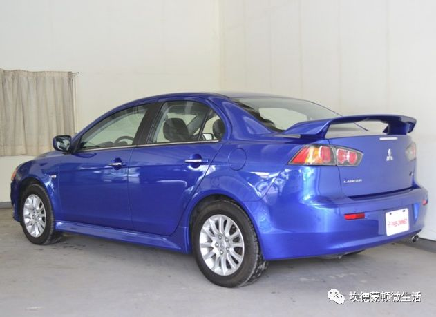

# 无标题

**链接地址:** http://mp.weixin.qq.com/s?__biz=MzI2NTE1ODgwOQ==&mid=2649604213&idx=1&sn=732e841e1fb743cae02f1f3f028c44a7&chksm=f2b8c983c5cf40951e62d73979f9426b5d4396a3f7063d59cbc1be48b856b932ebc0939ec35d&mpshare=1&scene=2&srcid=0526MQKVH9kkFAhMuWNjQawy#rd
**作者:** 埃德蒙顿微生活
**获取时间:** 2025/8/28 21:52:14
**图片数量:** 7

---

## 原始HTML内容

<section class="" style="max-width: 100%;box-sizing: border-box;color: rgb(51, 51, 51);"><section class="" powered-by="xiumi.us" style="max-width: 100%;box-sizing: border-box;word-wrap: break-word !important;"><section class="" style="max-width: 100%;box-sizing: border-box;text-align: center;word-wrap: break-word !important;"><section class="" style="max-width: 100%;box-sizing: border-box;vertical-align: middle;display: inline-block;word-wrap: break-word !important;overflow: hidden !important;"></section></section></section></section><section class="" style="padding-left: 5px;max-width: 100%;box-sizing: border-box;color: rgb(51, 51, 51);"><section class="" powered-by="xiumi.us" style="max-width: 100%;box-sizing: border-box;word-wrap: break-word !important;"><section class="" style="max-width: 100%;box-sizing: border-box;word-wrap: break-word !important;"><section class="" style="max-width: 100%;box-sizing: border-box;color: rgb(55, 55, 93);word-wrap: break-word !important;">
快点击“上方蓝字” 关注我们啦！
</section></section></section></section>

今日埃德蒙顿警方发布了全加拿大逮捕令！要求逮捕一名涉嫌去年11月在埃德蒙顿西北部<strong>肇事逃逸致人死亡</strong>年仅23岁的男子。该车祸发生在2017年11月5日的凌晨2点左右，事发地点在埃德蒙顿111 Ave和96 Street的交界处。

据报警方称，肇事者开的是一辆<strong>2012年的蓝色三菱Lancer</strong>，在十字路口撞击了一名骑着自行车的男子，并向着111Ave东方向匆忙逃离。

受害者为一名38岁的男性，车祸后送入医院，却在不久之后就<strong style="font-family: arial;font-size: 14.4px;white-space: normal;">不治身亡</strong>！

随后又目击者告知警方肇事者信息：

<strong>肇事司机Jiduo Luo</strong>

<strong>男性，<strong style="color: rgb(70, 70, 72);">23岁，</strong>来自厦门</strong>

<strong>身高1米7左右，体重60公斤左右</strong>

<strong> </strong>

消息一经报道有人声称：

<strong>“这个小孩在喝酒的时候我见过，很矮，感觉不到170cm”</strong>

<strong>“我看到图片就想起他来，因为他的眉间距非常宽，梳一个锅盖头”</strong>

<strong>“时常能在KTV见到他，相信很多人都见过”</strong>

<strong> </strong>

该名男子因下列罪行被通缉： 
<ul style="" class=" list-paddingleft-2"><li>
<strong>误杀</strong>
</li><li>
<strong>危险驾驶致人死亡</strong>
</li><li>
<strong>醉酒驾驶致人死亡，</strong>
</li><li>
<strong>事故后逃逸</strong>
</li><li>
<strong>危险驾驶</strong>
</li><li>
<strong>醉酒驾驶</strong>
</li><li>
<strong>未能出庭作证与并未出庭</strong>
</li></ul>
据报肇事者Luo在埃德蒙顿就读多所大专院校，警方认为他在肇事致人死亡逃逸后不久就离开加拿大，前往了中国。

现警方发布通缉令，通缉令范围为全加拿大，希望任何有线索的人都可以及时向警方汇报。

<strong style="color: rgb(255, 0, 0);font-family: 微软雅黑;font-size: 15px;letter-spacing: 0.544px;text-align: justify;text-indent: 2em;max-width: 100%;box-sizing: border-box !important;word-wrap: break-word !important;">警方联系电话</strong><strong style="color: rgb(255, 0, 0);font-family: 微软雅黑;font-size: 15px;letter-spacing: 0.544px;text-align: justify;text-indent: 2em;max-width: 100%;box-sizing: border-box !important;word-wrap: break-word !important;">：780-423-4567</strong>

<strong style="color: rgb(255, 0, 0);font-family: 微软雅黑;font-size: 15px;letter-spacing: 0.544px;text-align: justify;text-indent: 2em;max-width: 100%;box-sizing: border-box !important;word-wrap: break-word !important;">匿名举报请拨打Crime Stoppers</strong><strong style="color: rgb(255, 0, 0);font-family: 微软雅黑;font-size: 15px;letter-spacing: 0.544px;text-align: justify;text-indent: 2em;max-width: 100%;box-sizing: border-box !important;word-wrap: break-word !important;">热线：</strong>

<strong style="color: rgb(255, 0, 0);font-family: 微软雅黑;font-size: 15px;letter-spacing: 0.544px;text-align: justify;text-indent: 2em;max-width: 100%;box-sizing: border-box !important;word-wrap: break-word !important;">1-800-222-8477</strong>

<strong style="color: rgb(255, 0, 0);font-family: 微软雅黑;font-size: 15px;letter-spacing: 0.544px;text-align: justify;text-indent: 2em;max-width: 100%;box-sizing: border-box !important;word-wrap: break-word !important;"> </strong>

<strong>正值年少，青春就这样毁了！</strong>

<strong>希望肇事留学生能够意识到问题的严重性！早日绳之以法！</strong>

<strong> </strong>

来源：CTV News Edmonton

---

## 纯文本内容

快点击“上方蓝字” 关注我们啦！今日埃德蒙顿警方发布了全加拿大逮捕令！要求逮捕一名涉嫌去年11月在埃德蒙顿西北部肇事逃逸致人死亡年仅23岁的男子。该车祸发生在2017年11月5日的凌晨2点左右，事发地点在埃德蒙顿111 Ave和96 Street的交界处。据报警方称，肇事者开的是一辆2012年的蓝色三菱Lancer，在十字路口撞击了一名骑着自行车的男子，并向着111Ave东方向匆忙逃离。受害者为一名38岁的男性，车祸后送入医院，却在不久之后就不治身亡！随后又目击者告知警方肇事者信息：肇事司机Jiduo Luo男性，23岁，来自厦门身高1米7左右，体重60公斤左右消息一经报道有人声称：“这个小孩在喝酒的时候我见过，很矮，感觉不到170cm”“我看到图片就想起他来，因为他的眉间距非常宽，梳一个锅盖头”“时常能在KTV见到他，相信很多人都见过”该名男子因下列罪行被通缉：误杀危险驾驶致人死亡醉酒驾驶致人死亡，事故后逃逸危险驾驶醉酒驾驶未能出庭作证与并未出庭据报肇事者Luo在埃德蒙顿就读多所大专院校，警方认为他在肇事致人死亡逃逸后不久就离开加拿大，前往了中国。现警方发布通缉令，通缉令范围为全加拿大，希望任何有线索的人都可以及时向警方汇报。警方联系电话：780-423-4567匿名举报请拨打Crime Stoppers热线：1-800-222-8477正值年少，青春就这样毁了！希望肇事留学生能够意识到问题的严重性！早日绳之以法！来源：CTV News Edmonton

---

## 图片列表

-  (原始链接: https://mmbiz.qpic.cn/mmbiz_gif/D1nJqnhkPyJicwuw4HeSn9af0rObNSkEVRf57CJ0bp2Pw58h0DYlDDibv5CaTmweVFKY9hmm0RJxjuzB39koACiaw/640?wx_fmt=gif)
-  (原始链接: https://mmbiz.qpic.cn/mmbiz_jpg/D1nJqnhkPyLo3L0iawegpPefdoialIOMJsLYAWDKWZibActHTInqxOYIqm69LVFG0zLVDT3SI3PON4Sz2gvhHH80g/640?wx_fmt=jpeg)
-  (原始链接: https://mmbiz.qpic.cn/mmbiz/D1nJqnhkPyJBAmwKtY2uJUT28GmqMxicp03ds9iaY00XJmjsRxedibaMttb9UtjLsjlupWTW5MxOD8S6nUJZlgxdg/640?wx_fmt=other)
-  (原始链接: https://mmbiz.qpic.cn/mmbiz/D1nJqnhkPyJBAmwKtY2uJUT28GmqMxicp9sCz4aqpMHBws6qyzETts2iaiccwJZfYQMLZGUXicu1MbXH7mw5o5RC8g/640?wx_fmt=other)
-  (原始链接: https://mmbiz.qpic.cn/mmbiz/D1nJqnhkPyJBAmwKtY2uJUT28GmqMxicp83GDneH1aTof4pic2hpnY0EPtPsRqEpdkLywwTeS22hoVc0z94jusqQ/640?wx_fmt=other)
-  (原始链接: https://mmbiz.qpic.cn/mmbiz_jpg/D1nJqnhkPyJ6tecu0xA7X7BPSlkibxLg4VW9uz3vFLZ4pQrlI5MANOicPON1kuTYesunZ3zqwrEjIgHT2hKM9F0A/640?wx_fmt=jpeg)
-  (原始链接: https://mmbiz.qpic.cn/mmbiz_png/D1nJqnhkPyJ6tecu0xA7X7BPSlkibxLg452YP3a37SkXoSo2SjZic6FD0PoianvXRlLqhZjDZNsou5giaPibiccPicB1Q/640?wx_fmt=png)
