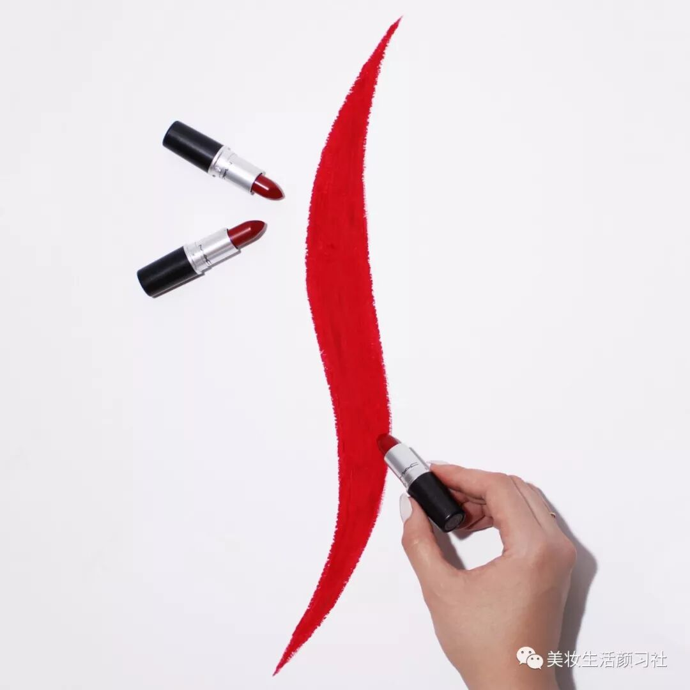
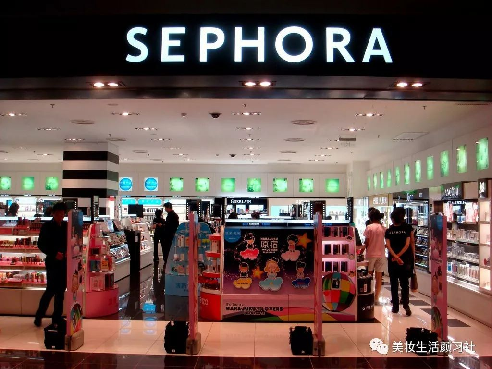
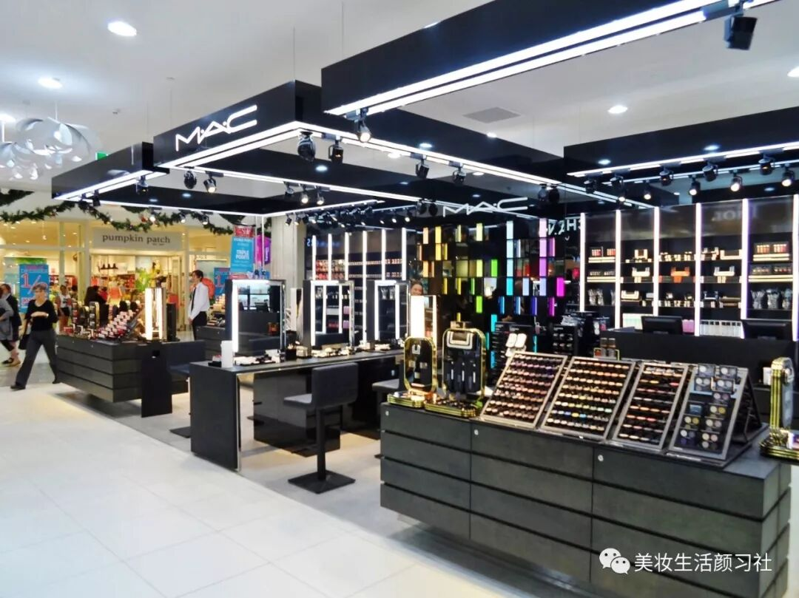

# 无标题

**链接地址:** http://mp.weixin.qq.com/s?__biz=MzAwOTYxMzU4NA==&mid=2650893711&idx=1&sn=ae7c1a3c94ce0250d6889db11713c530&chksm=80a935f0b7debce60950840206c66f7d7328565a328981fb27e90a827b5221abb2ccdf6ba35a&mpshare=1&scene=2&srcid=0601ZKJNY2uRMhHaPw7ze3eR#rd
**作者:** Nina Chen
**获取时间:** 2025/8/28 21:51:33
**图片数量:** 7

---

## 原始HTML内容

 

<section style="box-sizing: border-box;"><section class="Powered-by-XIUMI V5" style="box-sizing: border-box;" powered-by="xiumi.us"><section class="" style="margin-top: 10px;margin-bottom: 10px;padding-top: 1.3em;box-sizing: border-box;"><section class="" style="border-top: 2px solid rgb(241, 171, 168);border-bottom: 2px solid rgb(241, 171, 168);box-sizing: border-box;"><section class="" style="box-sizing: border-box;"><section class="Powered-by-XIUMI V5" style="box-sizing: border-box;" powered-by="xiumi.us"><section class="" style="margin-top: -16px;margin-left: 30%;margin-right: 30%;box-sizing: border-box;"><section class="" style="display: inline-block;box-sizing: border-box;"><section style="transform: rotate(45deg);-webkit-transform: rotate(45deg);-moz-transform: rotate(45deg);-o-transform: rotate(45deg);box-sizing: border-box;"><section style="width: 30px;height: 30px;border-left: 2px solid rgb(241, 171, 168);border-top: 2px solid rgb(241, 171, 168);background-color: rgb(255, 255, 255) !important;box-sizing: border-box;"><section style="width: 22px;height: 22px;margin: 2px;border-width: 2px;border-style: solid;border-color: rgb(241, 171, 168);box-sizing: border-box;"><section style="width: 16px;height: 16px;margin: 1px auto auto;border-width: 1px;border-style: solid;border-color: rgb(241, 171, 168);box-sizing: border-box;"><section style="width: 0px;margin: 1px auto auto;border-left: 12px solid rgb(241, 171, 168);border-bottom: 12px solid transparent !important;box-sizing: border-box;"></section></section></section></section></section></section></section></section><section class="Powered-by-XIUMI V5" style="box-sizing: border-box;" powered-by="xiumi.us"><section class="" style="box-sizing: border-box;"><section class="" style="text-align: center;font-size: 14px;letter-spacing: 2px;box-sizing: border-box;">
点击上方蓝字可<strong style="box-sizing: border-box;">订阅</strong>我们的更多精彩消息哦！
</section></section></section></section></section></section></section><section class="Powered-by-XIUMI V5" style="box-sizing: border-box;" powered-by="xiumi.us"><section class="" style="box-sizing: border-box;"><section class="" style="box-sizing: border-box;">

图片来源：newswire.ca 

 

加拿大的丝芙兰VIB客户们！你们有福气啦！1984年于多伦多成立的加拿大国民美妆品牌 <strong>MAC魅可</strong>&nbsp;终于扛不住外界的呼声加入了加拿大丝芙兰旗下啦！MAC的宗旨是“所有年龄，所有种族，所有性别。”，加入丝芙兰也是为了寻求更广泛，更多元化的客户群体。而长年以来丝芙兰也很头痛听到顾客进入店内直接询问：“MAC的柜台在哪？”正是这样的理念促成了双方这次一拍即合的合作。

 

图片来源：flickr

 

MAC每年推出的让人眼花缭乱的<strong>联名</strong>套组和季节<strong>限量</strong>单品都会在丝芙兰网购上架。除此之外MAC的经典畅销单品，比如子弹头口红，Omega鼻影神器，神奇妆前保湿喷雾，也都会一并在丝芙兰的网上商店进行销售。预计登陆时间为今年<strong>秋天</strong>，大家请耐心等待到时候的一波又一波疯狂宣传吧！

 

图片来源：wikimedia

 

这两个美妆届巨头的首次合作一定会擦出无比令人期待的火花！据悉MAC也会参加丝芙兰的<strong>积分</strong>程序和<strong>打折</strong>活动。想要囤货的亲们可以关注我们的微信公众号，我们会在第一时间给大家传递打折活动的讯息和种草必买单品！可千万不要错过呀！ 

 

文章信息来源：

https://www.inbrampton.com/big-changes-coming-for-huge-canadian-makeup-brand

 
</section></section></section><section class="Powered-by-XIUMI V5" style="box-sizing: border-box;" powered-by="xiumi.us"><section class="" style="margin-top: 10px;margin-bottom: 10px;text-align: center;box-sizing: border-box;"><section class="" style="width: 100%;height: 1.2em;display: inline-block;vertical-align: middle;line-height: 1em;background-color: rgb(241, 171, 168);box-sizing: border-box;"><section class="" style="height: 100%;display: inline-block;vertical-align: middle;padding-top: 2px;padding-right: 8px;padding-left: 8px;background-color: rgb(255, 255, 255);font-size: 18px;box-sizing: border-box;">
<strong style="box-sizing: border-box;">关注我们</strong>
</section></section></section></section><section class="Powered-by-XIUMI V5" style="box-sizing: border-box;" powered-by="xiumi.us"><section class="" style="margin: 10px 0%;text-align: center;box-sizing: border-box;"><section class="" style="display: inline-block;width: 96%;vertical-align: top;overflow: hidden;height: 125px;border-style: solid;border-width: 0px;border-radius: 5px;border-color: rgb(164, 197, 244);padding-right: 10px;padding-left: 10px;box-shadow: rgb(133, 134, 135) 0px 0px 2px;box-sizing: border-box;"><section class="Powered-by-XIUMI V5" style="box-sizing: border-box;" powered-by="xiumi.us"><section class="" style="box-sizing: border-box;"><section class="" style="display: inline-block;vertical-align: middle;width: 23%;box-shadow: rgb(0, 0, 0) 0px 0px 0px;border-color: rgba(62, 62, 62, 0.37);border-width: 0px;border-radius: 2px;border-style: solid;box-sizing: border-box;"><section class="Powered-by-XIUMI V5" style="box-sizing: border-box;" powered-by="xiumi.us"><section class="" style="margin-top: 10px;margin-bottom: 10px;font-size: 13px;box-sizing: border-box;"><section class="" style="width: 5em;height: 5em;display: inline-block;border-radius: 100%;transform: rotate(0deg);-webkit-transform: rotate(0deg);-moz-transform: rotate(0deg);-o-transform: rotate(0deg);padding: 3px;background-color: rgba(255, 255, 255, 0.91);box-sizing: border-box;"><section class="" style="width: 100%;height: 100%;border-radius: 100%;background-position: 58.9612% 81.25%;background-repeat: no-repeat;background-size: 129.409%;box-shadow: rgba(255, 255, 255, 0.91) 0px 0px 0px;background-image: url(&quot;https://mmbiz.qpic.cn/mmbiz_jpg/wjEAySwdfXZJOHtwcNicvR1g51CKFUyUIPOhNASWL65j8cxcI9cUbg7nnRrcKRIicR17ZrRFOwY6QOTic1WK8Kf9A/640?wx_fmt=jpeg&quot;);box-sizing: border-box;"><section class="" style="width: 100%;height: 100%;overflow: hidden;box-sizing: border-box;"></section></section></section></section></section><section class="Powered-by-XIUMI V5" style="box-sizing: border-box;" powered-by="xiumi.us"><section class="" style="box-sizing: border-box;"><section class="" style="font-size: 12px;color: rgb(255, 0, 0);box-sizing: border-box;">
<strong style="box-sizing: border-box;">点击关注 </strong>
</section></section></section></section><section class="" style="display: inline-block;vertical-align: middle;width: 76%;box-shadow: rgb(0, 0, 0) 0px 0px 0px;padding-right: 10px;padding-left: 10px;box-sizing: border-box;"><section class="Powered-by-XIUMI V5" style="box-sizing: border-box;" powered-by="xiumi.us"><section class="" style="box-sizing: border-box;"><section class="" style="letter-spacing: 2px;color: rgb(255, 0, 0);box-sizing: border-box;">
<strong style="box-sizing: border-box;">美妆生活颜习社</strong>
</section></section></section><section class="Powered-by-XIUMI V5" style="box-sizing: border-box;" powered-by="xiumi.us"><section class="" style="box-sizing: border-box;"><section class="tn-yzk-fuid-text-98718-1517277466565" style="text-align: justify;font-size: 12px;color: rgb(72, 72, 72);box-sizing: border-box;">
公众号ID：LadyYEG

吃喝玩乐埃德蒙顿旗下的美妆生活公众号。科学提升颜值，教你美颜护肤，同步修身养性，传递爱城女孩们最想知道的资讯！打造女神，我们可是专业的!
</section></section></section></section><section class="group-empty" style="display: inline-block;vertical-align: middle;width: 0%;box-shadow: rgb(0, 0, 0) 0px 0px 0px;border-color: rgb(113, 215, 0);border-width: 0px;border-radius: 0px;border-style: none;box-sizing: border-box;"></section></section></section><section class="Powered-by-XIUMI V5" style="box-sizing: border-box;" powered-by="xiumi.us"><section class="" style="box-sizing: border-box;"><section class="" style="text-align: left;box-sizing: border-box;">
 
</section></section></section><section class="Powered-by-XIUMI V5" style="box-sizing: border-box;" powered-by="xiumi.us"><section class="" style="box-sizing: border-box;"><section class="" style="text-align: left;box-sizing: border-box;">
 
</section></section></section><section class="Powered-by-XIUMI V5" style="box-sizing: border-box;" powered-by="xiumi.us"><section class="" style="box-sizing: border-box;"><section class="" style="text-align: left;box-sizing: border-box;">
 
</section></section></section><section class="Powered-by-XIUMI V5" style="box-sizing: border-box;" powered-by="xiumi.us"><section class="" style="box-sizing: border-box;"><section class="" style="text-align: left;box-sizing: border-box;">
 
</section></section></section></section><section class="" style="font-size: 0px;box-sizing: border-box;"> </section></section></section><section class="Powered-by-XIUMI V5" style="box-sizing: border-box;" powered-by="xiumi.us"><section class="" style="margin: 10px 0%;text-align: center;box-sizing: border-box;"><section class="" style="display: inline-block;width: 96%;vertical-align: top;overflow: hidden;height: 125px;border-style: solid;border-width: 0px;border-radius: 5px;border-color: rgb(164, 197, 244);padding-right: 10px;padding-left: 10px;box-shadow: rgb(133, 134, 135) 0px 0px 2px;box-sizing: border-box;"><section class="Powered-by-XIUMI V5" style="box-sizing: border-box;" powered-by="xiumi.us"><section class="" style="box-sizing: border-box;"><section class="" style="display: inline-block;vertical-align: middle;width: 23%;box-shadow: rgb(0, 0, 0) 0px 0px 0px;border-color: rgba(62, 62, 62, 0.37);border-width: 0px;border-radius: 2px;border-style: solid;box-sizing: border-box;"><section class="Powered-by-XIUMI V5" style="box-sizing: border-box;" powered-by="xiumi.us"><section class="" style="margin-top: 10px;margin-bottom: 10px;font-size: 13px;box-sizing: border-box;"><section class="" style="width: 5em;height: 5em;display: inline-block;border-radius: 100%;transform: rotate(0deg);-webkit-transform: rotate(0deg);-moz-transform: rotate(0deg);-o-transform: rotate(0deg);padding: 3px;background-color: rgba(255, 255, 255, 0.91);box-sizing: border-box;"><section class="" style="width: 100%;height: 100%;border-radius: 100%;background-position: center center;background-repeat: no-repeat;background-size: cover;box-shadow: rgba(255, 255, 255, 0.91) 0px 0px 0px;background-image: url(&quot;https://mmbiz.qpic.cn/mmbiz_png/wjEAySwdfXZJOHtwcNicvR1g51CKFUyUIH3rvrG5evGQRvSly5EFda2XLHotfAliagRDSCMibMgA0SRkAicoicRMKcw/640?wx_fmt=png&quot;);box-sizing: border-box;"><section class="" style="width: 100%;height: 100%;overflow: hidden;box-sizing: border-box;"></section></section></section></section></section><section class="Powered-by-XIUMI V5" style="box-sizing: border-box;" powered-by="xiumi.us"><section class="" style="box-sizing: border-box;"><section class="" style="font-size: 12px;color: rgb(255, 0, 0);box-sizing: border-box;">
<strong style="box-sizing: border-box;">点击关注 </strong>
</section></section></section></section><section class="" style="display: inline-block;vertical-align: middle;width: 76%;box-shadow: rgb(0, 0, 0) 0px 0px 0px;padding-right: 10px;padding-left: 10px;box-sizing: border-box;"><section class="Powered-by-XIUMI V5" style="box-sizing: border-box;" powered-by="xiumi.us"><section class="" style="box-sizing: border-box;"><section class="" style="font-size: 15px;letter-spacing: 2px;color: rgb(255, 0, 0);box-sizing: border-box;">
<strong style="box-sizing: border-box;">吃喝玩乐埃德蒙顿卡尔加里</strong>
</section></section></section><section class="Powered-by-XIUMI V5" style="box-sizing: border-box;" powered-by="xiumi.us"><section class="" style="box-sizing: border-box;"><section class="tn-yzk-fuid-text-98718-1517277466565" style="text-align: justify;font-size: 12px;color: rgb(72, 72, 72);box-sizing: border-box;">
服务号ID：CProOffice 

加拿大阿尔伯塔省吃喝玩乐微信服务号。即时发布阿省节日活动，吃喝玩乐购，生活咨询信息！粉丝福利，惊喜不断，阿省生活必备！
</section></section></section></section><section class="group-empty" style="display: inline-block;vertical-align: middle;width: 0%;box-shadow: rgb(0, 0, 0) 0px 0px 0px;border-color: rgb(113, 215, 0);border-width: 0px;border-radius: 0px;border-style: none;box-sizing: border-box;"></section></section></section><section class="Powered-by-XIUMI V5" style="box-sizing: border-box;" powered-by="xiumi.us"><section class="" style="box-sizing: border-box;"><section class="" style="text-align: left;box-sizing: border-box;">
 
</section></section></section><section class="Powered-by-XIUMI V5" style="box-sizing: border-box;" powered-by="xiumi.us"><section class="" style="box-sizing: border-box;"><section class="" style="text-align: left;box-sizing: border-box;">
 
</section></section></section><section class="Powered-by-XIUMI V5" style="box-sizing: border-box;" powered-by="xiumi.us"><section class="" style="box-sizing: border-box;"><section class="" style="text-align: left;box-sizing: border-box;">
 
</section></section></section><section class="Powered-by-XIUMI V5" style="box-sizing: border-box;" powered-by="xiumi.us"><section class="" style="box-sizing: border-box;"><section class="" style="text-align: left;box-sizing: border-box;">
 
</section></section></section></section><section class="" style="font-size: 0px;box-sizing: border-box;"> </section></section></section><section class="Powered-by-XIUMI V5" style="box-sizing: border-box;" powered-by="xiumi.us"><section class="" style="margin-top: 1em;margin-bottom: 1em;text-align: center;box-sizing: border-box;"><section class="" style="margin-bottom: -1.85em;box-sizing: border-box;"><section style="height: 0.3em;margin-top: 0.3em;background-color: rgb(241, 171, 168);box-sizing: border-box;"></section><section style="height: 0.3em;margin-top: 0.3em;background-color: rgb(241, 171, 168);box-sizing: border-box;"></section><section style="height: 0.3em;margin-top: 0.3em;background-color: rgb(241, 171, 168);box-sizing: border-box;"></section></section><section class="" style="display: inline-block;vertical-align: bottom;line-height: 2.3em;background-color: rgba(246, 226, 224, 0.75);padding-left: 15px;padding-right: 15px;font-size: 14px;box-sizing: border-box;min-height: 2.3em !important;">
<strong style="box-sizing: border-box;">喜欢这篇文章？记得“分享”给朋友看哦！</strong>
</section></section></section></section>
 

 

---

## 纯文本内容

点击上方蓝字可订阅我们的更多精彩消息哦！图片来源：newswire.ca加拿大的丝芙兰VIB客户们！你们有福气啦！1984年于多伦多成立的加拿大国民美妆品牌 MAC魅可 终于扛不住外界的呼声加入了加拿大丝芙兰旗下啦！MAC的宗旨是“所有年龄，所有种族，所有性别。”，加入丝芙兰也是为了寻求更广泛，更多元化的客户群体。而长年以来丝芙兰也很头痛听到顾客进入店内直接询问：“MAC的柜台在哪？”正是这样的理念促成了双方这次一拍即合的合作。图片来源：flickrMAC每年推出的让人眼花缭乱的联名套组和季节限量单品都会在丝芙兰网购上架。除此之外MAC的经典畅销单品，比如子弹头口红，Omega鼻影神器，神奇妆前保湿喷雾，也都会一并在丝芙兰的网上商店进行销售。预计登陆时间为今年秋天，大家请耐心等待到时候的一波又一波疯狂宣传吧！图片来源：wikimedia这两个美妆届巨头的首次合作一定会擦出无比令人期待的火花！据悉MAC也会参加丝芙兰的积分程序和打折活动。想要囤货的亲们可以关注我们的微信公众号，我们会在第一时间给大家传递打折活动的讯息和种草必买单品！可千万不要错过呀！文章信息来源：https://www.inbrampton.com/big-changes-coming-for-huge-canadian-makeup-brand关注我们点击关注美妆生活颜习社公众号ID：LadyYEG吃喝玩乐埃德蒙顿旗下的美妆生活公众号。科学提升颜值，教你美颜护肤，同步修身养性，传递爱城女孩们最想知道的资讯！打造女神，我们可是专业的! 点击关注吃喝玩乐埃德蒙顿卡尔加里服务号ID：CProOffice加拿大阿尔伯塔省吃喝玩乐微信服务号。即时发布阿省节日活动，吃喝玩乐购，生活咨询信息！粉丝福利，惊喜不断，阿省生活必备！ 喜欢这篇文章？记得“分享”给朋友看哦！

---

## 图片列表

-  (原始链接: https://mmbiz.qpic.cn/mmbiz_jpg/wjEAySwdfXZJOHtwcNicvR1g51CKFUyUIa6lwkefjOibUib45CgSxJ3zv2VktDy5udcJpiatLtoFennoKbNbbCKVGw/640?wx_fmt=jpeg)
-  (原始链接: https://mmbiz.qpic.cn/mmbiz_jpg/wjEAySwdfXZJOHtwcNicvR1g51CKFUyUIHvA8P51NPTHPfSlWExn15ylp1Z8YO4CQicZ8kLM5eNXQmrpGfBr5kxQ/640?wx_fmt=jpeg)
-  (原始链接: https://mmbiz.qpic.cn/mmbiz_jpg/wjEAySwdfXZJOHtwcNicvR1g51CKFUyUI33K0YFgjqlPAlnGib587yaXqmK30HFFDm1z5jgcXtdIgestnl0loJkw/640?wx_fmt=jpeg)
-  (原始链接: https://mmbiz.qpic.cn/mmbiz_jpg/wjEAySwdfXZJOHtwcNicvR1g51CKFUyUIPOhNASWL65j8cxcI9cUbg7nnRrcKRIicR17ZrRFOwY6QOTic1WK8Kf9A/640?wx_fmt=jpeg)
-  (原始链接: https://mmbiz.qpic.cn/mmbiz_jpg/wjEAySwdfXZJOHtwcNicvR1g51CKFUyUIpz1SeBKZyoMRdicOJ6iaDbUMicouCLOemicZNdfwNE2Y4Pl26jXEU7YgRg/640?wx_fmt=jpeg)
-  (原始链接: https://mmbiz.qpic.cn/mmbiz_png/wjEAySwdfXZJOHtwcNicvR1g51CKFUyUIH3rvrG5evGQRvSly5EFda2XLHotfAliagRDSCMibMgA0SRkAicoicRMKcw/640?wx_fmt=png)
-  (原始链接: https://mmbiz.qpic.cn/mmbiz_jpg/wjEAySwdfXZJOHtwcNicvR1g51CKFUyUIiaxLWYVkUg7AkUFicI6MH9rzOAa41nRM56H4MMcxPbjaibA3PZ8lX8X3Q/640?wx_fmt=jpeg)
