# 无标题

**链接地址:** http://mp.weixin.qq.com/s?__biz=MzAxOTMxNTUxNw==&mid=2651182004&idx=1&sn=7ec84113c6f45b6d8897229f9b9a87ed&chksm=80399de6b74e14f09e425e7e6ba89c416892c488d4e84e41c5c0c48ca28e21fef44248dfbc70&mpshare=1&scene=2&srcid=0622SPtBoxAAP4S6vluzEE3a#rd
**作者:** Feloni
**获取时间:** 2025/8/28 21:50:28
**图片数量:** 21

---

## 原始HTML内容

<section class="xmteditor" style="display:none;" data-tools="新媒体管家" data-label="powered by xmt.cn"></section>

 

 

 
<section class="xmt-style-block" data-style-type="5" data-tools="新媒体排版" data-id="818369">
<strong>我家</strong>是东北的，平时早餐会买一套煎饼果子，也叫鸡蛋饼。可以加鸡排、香肠、牛板筋、金针菇、土豆丝以及海带，总之五颜六色姹紫嫣红，仿佛置身2019年春晚舞台。要是全加，手里无疑捧着一颗核弹，富得流铀。

</section>
 

<strong style="color: rgb(136, 136, 136);">△<em>&nbsp;这张饼分别卷着鸡排、油条、生菜、金针菇、花生米，营养多到缺氧&nbsp;</em></strong>

 
<section class="xmt-style-block" data-style-type="5" data-tools="新媒体排版" data-id="818369">
直到昨天，我和一天津朋友谈到这些，他面色凝重，<strong>“太香的煎饼因为料太多，但亲爱的那并不是煎饼果子。”</strong>接着咽了下口水，<strong>“世上只有一种煎饼果子，那就是天津煎饼果子。”</strong>最后他抬起头，目光如炬，咬肌比张杰还厉害，斩钉截铁挤出6个字，<strong>“全他妈的异端”</strong>。

他说话的神情，像极了传教士，声色俱茂到日出日落又日出，好像天津的煎饼果子是这世上最甜美的快乐，最忧伤的果实；天津，无疑就是流着奶和蜜的迦南美地；而津门以外的煎饼果子，都是虚空，都是捕风。

为什么一提煎饼果子，天津人就陷入了沉思和张狂？为什么煎饼果子在天津成了一种信仰？为什么一向乐呵的天津人竟为了一套煎饼严肃起来，敢同全国争高下？个中复杂，容我喝一口纯悦慢慢讲。
</section>
 

 

 
<section class="xmt-style-block" data-style-type="5" data-tools="新媒体排版" data-id="818369">
在很多南方人眼里，煎饼都是一样的。其实不然，里面门道多着呢，主要有四大门派：

<strong>山东是开天辟地派</strong>，古法制作，大葱加持，而且什么都可以加，蔬菜鸡蛋，肉类海鲜，咸菜辣酱。面饼说求求你，我撑不住了，山东人说你必须撑住，这是我们山东煎饼的使命！

好勤恳的山东人，好实在的杂粮饼！吃出了一家团圆，吃出了万邦来华，还吃出了一个新中国，淮海渡江孟良崮是不是山东人打的？别不承认，大声喊出那六个字：厉害了，大山东！
</section>
 

<strong style="white-space: normal;color: rgb(136, 136, 136);">△<em>&nbsp;这饼大得卷只鸡都没问题</em></strong>

 
<section class="xmt-style-block" data-style-type="5" data-tools="新媒体排版" data-id="818369">
<strong>北京是维新派</strong>，在天津的基础上做了很多改良。首先用的是白面，口感比绿豆面更细腻，成本也更低，照顾了广大务工人员的钱袋子；其次，里面可以加榨菜鸡柳海带丝，沿海内地一起抓，北京的煎饼光芒照四方；最后，酱料丰富，豆瓣酱，甜面酱，番茄酱，香菜，照顾全国，大局意识很强。

<strong>东北煎饼，没什么好说的，山东煎饼plus</strong>。白山黑水给了它野蛮生长的力量，首先是料足，一张饼能卷住整个象牙山的农产品。一生只爱一个人，一天只吃一套煎饼果子，没别的意思，就是撑的。
</section>
 

 
<section class="xmt-style-block" data-style-type="5" data-tools="新媒体排版" data-id="818369">
其次，创新力度很强。大连的煎饼果子，连咸鸭蛋都能往里加，质细而油多，浸润整张饼，好吃得一比吊糟。汪曾祺要活着没准放喉高歌，<strong>“我们一起去大连吧，你说好吗”</strong>。
</section>
 

 
<section class="xmt-style-block" data-style-type="5" data-tools="新媒体排版" data-id="818369">
<strong>天津煎饼，打下这四个字，我的手都是颤抖的</strong>，因为太神圣太牛逼了，煎饼界的耶路撒冷，我为你哭泣。<strong>如果说毕达哥拉斯赋予哲学意义，那天津人就给了煎饼果子灵魂。</strong>

说几点不一样的，首先，天津煎饼必须用绿豆面，绿豆面不像白面那样有筋性，很容易摊坏，特别考验手艺；其次，只能抹甜面酱、酱豆腐和辣子，只能加果子和果篦儿，里脊？那是夹在烧饼里的；最后，摊、打、翻、放、折、撒，讲究又快又匀，一气呵成，握在手里直烫手，用郭德纲的话说，
<blockquote>
<em><strong>“一口下去，绝了。这边吃，那边枪毙你爸爸都不心疼。”</strong></em>
</blockquote></section>
 

<strong style="white-space: normal;color: rgb(136, 136, 136);">△<em>&nbsp;</em></strong><strong style="white-space: normal;color: rgb(136, 136, 136);"><em>摊饼充满禅意，讲究又快又匀；面皮上的小洞，则由鸡蛋填满，浑然天成</em></strong>

 
<section class="xmt-style-block" data-style-type="5" data-tools="新媒体排版" data-id="818369">
这四位号称煎饼四君子。明面上你中有我，我中有你，大家众志成城，共抗城管。私下里，谁也看不惯谁，当然了，主要是这仨被天津看不惯，<strong>“叫煎饼果子，你们也配？”</strong>
</section>
 

 

<section class="xmt-style-block" data-style-type="5" data-tools="新媒体排版" data-id="818369">
别看平时，天津人不像京沪那么炸乎，但唯独煎饼果子，可以打破天津人沉默的德性，确立牢不可破的边界。<strong>总之，不能跨雷池一步，不然就是对原教旨煎饼的亵渎。</strong>

所以，当煎饼果子飞出津门大地，一路展翅翱翔，从干净清爽的邻家男孩，变成了染黄毛、抹粉底、穿豆豆鞋的社会人后，外人看来那是流行的味道，是自由的芬芳。但在天津人眼里，不过是一只花里胡哨的野鸡。
</section>
 

<strong style="white-space: normal;color: rgb(136, 136, 136);">△<em>&nbsp;</em></strong><strong style="white-space: normal;color: rgb(136, 136, 136);"><em>巴西球星帕托来津效力之余还不忘偷师学艺</em></strong>

 
<section class="xmt-style-block" data-style-type="5" data-tools="新媒体排版" data-id="818369">
要让天津人吃咸鸭蛋煎饼果子，那无疑是在亚文化的边缘试探，坚硬，畸形，辣眼睛，必须拍照上传，动员兄弟姐妹一起谴责。这种谴责分2种：单兵谴责和大兵团谴责。

单兵谴责就像我同事，天津人，马场道123号毕业后就在陆家嘴打拼。生活中，他从不正视上海的煎饼果子摊，经常说，<strong>“你说介玩意有嘛好吃的？不三不四的，家里边随便找个人摊都比介强！”</strong>正义凛然，让人梦回1999年，冯巩在路边招呼我吃大饼卷果子。

就算吃煎饼，也必须亲自指挥。<strong>“鸡蛋打好了再放葱啊”</strong>，<strong>“哎哎哎，谁让你放榨菜了”</strong>，<strong>“你这酱怎么给我刷油条上了”</strong>，进击的工匠精神，小脑袋大智慧，撒路斯提乌斯的圣光照耀吉利大厦。

大兵团谴责，顾名思义，就是抱团狙击。煎饼的江湖腥风血雨，通常是天津以一敌三，主要是谴责北京煎饼。当然了，全国人民都知道北京爷们不好惹，为了稳操胜券，天津爷们得团结起来一致对外。
</section>
 

 
<section class="xmt-style-block" data-style-type="5" data-tools="新媒体排版" data-id="818369">
今年3月，天津市餐饮行业协会煎饼果子分会正式成立。三大要求八项规范，不为别的，就是要从严治饼——
<blockquote>
<em><strong>“要用绿豆或是小米为原材料制作成的面糊…摊饼的直径在38cm至45cm之间”。</strong></em>
</blockquote>
当我第一次看到这些文字时，还以为是哪个米其林餐厅佳肴的工艺标准。
</section>
 

<strong style="white-space: normal;color: rgb(136, 136, 136);">△<em>&nbsp;</em></strong><strong style="white-space: normal;color: rgb(136, 136, 136);"><em>纽约有一家煎</em></strong><strong style="white-space: normal;color: rgb(136, 136, 136);"><em>饼果子铺异常</em></strong><strong style="white-space: normal;color: rgb(136, 136, 136);"><em>火爆，老板是一美国人，黑人弟兄不再gangsta，摊饼的手法也是一流。</em></strong>

 
<section class="xmt-style-block" data-style-type="5" data-tools="新媒体排版" data-id="818369">
可能有人要问，别的地方也没见天津这么积极啊，人才落户还把服务器搞瘫了，为啥光对煎饼果子这么上心？

这个你有所不知，<strong>在天津，煎饼果子可不止食物这么简单，它是一串文化密码。</strong>可以没有人才，也可以没有企业，但一定得有煎饼，这是刻在骨子里的坚持。
</section>
 

 

<section class="xmt-style-block" data-style-type="5" data-tools="新媒体排版" data-id="818369">
解开这串密码，得分三步走。

<strong>第一步是味觉</strong>，理由很简单，要是不好吃还坚持个屁。煎饼的焦香、馃箅的脆香，酱料的甜咸辣香，全是食料该有的样子，味正。前几年有个新闻，有人用千岛酱抹煎饼，这简直在挑战天津人的底线。

这几年，大家的日子越过越好，也越来越会吃，各种花样并一块，恨不得一张嘴把维生素ABCDE都给补全了。这种情况下，只有天津人不忘初心继续前行。

</section>
 

 
<section class="xmt-style-block" data-style-type="5" data-tools="新媒体排版" data-id="818369">
初心是什么？是历史传承，是完美复刻1920s的煎饼果子，段祺瑞吃的煎饼啥样，我们就吃啥样，顺便来一碗浆子。煎饼果子就是煎饼果子，多一根里脊，多一份培根，多一块榨菜，多一粒花生，都不算煎饼果子。

这几年，天津相继流行过白吉馍、鸡蛋灌饼、花糕，但<strong>只有煎饼果子一路坚挺，把这些外来物种一一干趴下，丰碑永存。</strong>
</section>
 

<strong style="color: rgb(136, 136, 136);white-space: normal;">△<em>&nbsp;【天津老乡车祸成植物人 对煎饼</em></strong><strong style="color: rgb(136, 136, 136);white-space: normal;"><em>果子的</em></strong><strong style="color: rgb(136, 136, 136);white-space: normal;"><em>爱将他唤醒】</em></strong>

 
<section class="xmt-style-block" data-style-type="5" data-tools="新媒体排版" data-id="818369">
<strong>第二步是爱</strong>。天津学子在外地吃到一套正宗的煎饼果子，得沉默，得颤抖，得尖叫，恨不得立即来一段说唱，<strong>“哟哟，煎饼果子就是好，富强民主公正文明，面饼果子也要分明，甜辣酱和生葱放一起会有希望，这样它才能给我追梦的力量！”</strong>

唱着唱着，天津学子不争气地流下了眼泪，吧嗒吧嗒，眼泪掉在热乎乎的煎饼上，扑通扑通，心脏好像就要跳出胸膛。煎饼果子，家的方向，折成一对的面饼，是我走过的岁月，碧绿的生葱就像海河的浪花，敲打着我额头。

还是待在天津吧，有煎饼果子大哥照着，安心过我们的小日子。长江以南的市场让给山东人和东北人好了，反正真理攥在咱手里，不怕。但北京，一定要跟它斗争到底。
</section>
 

<strong style="color: rgb(136, 136, 136);white-space: normal;">△<em>&nbsp;京津两地的煎饼之争已经蔓延到了美国</em></strong>

 
<section class="xmt-style-block" data-style-type="5" data-tools="新媒体排版" data-id="818369">
<strong>第三步是智慧</strong>。当天津人谈论煎饼果子的时候，他们在谈论什么？吃？天真。它早已超越味觉，超越爱，超越尘世间的一切，成为智慧。

爱煎饼果子就是爱智慧，这种至高的真理是无法用正经语言表达出来的，只能用笑话的形式助产。<strong>马三立、赵丽蓉、郭德纲、冯巩，语言迷狂的背后，其实是煎饼果子的力比多在发作。</strong>
</section>
 

<strong>△<em>&nbsp;朋克装束の马三立</em></strong>

 
<section class="xmt-style-block" data-style-type="5" data-tools="新媒体排版" data-id="818369">
难道高唱我们不一样的煎饼果子就是所谓的异端吗，经历全国不同地方魔改过的煎饼果子到底和所谓正宗的比好不好吃，或许这永远不会有个答案。

我觉得无论你改良成什么样，只要人们爱吃，并记住你，就一点儿毛病没有。文化这东西本来就是走出去，变个样，留存下来，再走出去当中循环的。

煎饼果子记载着天津的兴衰与荣辱，记载着天津独特的城市性格。无论是老一辈儿的天津人还是现在文化融合大背景下的年轻人，他们在潜意识中都会维护这个从天津卫走出去的文化。

所以在我探究煎饼果子的过程中，我仿佛明白了为什么天津人如此在煎饼果子上偏执。

<strong>比起情怀，我想更多的是他们对于天津卫这座老城的归属感。</strong>

</section>
 

---

## 纯文本内容

我家是东北的，平时早餐会买一套煎饼果子，也叫鸡蛋饼。可以加鸡排、香肠、牛板筋、金针菇、土豆丝以及海带，总之五颜六色姹紫嫣红，仿佛置身2019年春晚舞台。要是全加，手里无疑捧着一颗核弹，富得流铀。△ 这张饼分别卷着鸡排、油条、生菜、金针菇、花生米，营养多到缺氧 直到昨天，我和一天津朋友谈到这些，他面色凝重，“太香的煎饼因为料太多，但亲爱的那并不是煎饼果子。”接着咽了下口水，“世上只有一种煎饼果子，那就是天津煎饼果子。”最后他抬起头，目光如炬，咬肌比张杰还厉害，斩钉截铁挤出6个字，“全他妈的异端”。他说话的神情，像极了传教士，声色俱茂到日出日落又日出，好像天津的煎饼果子是这世上最甜美的快乐，最忧伤的果实；天津，无疑就是流着奶和蜜的迦南美地；而津门以外的煎饼果子，都是虚空，都是捕风。为什么一提煎饼果子，天津人就陷入了沉思和张狂？为什么煎饼果子在天津成了一种信仰？为什么一向乐呵的天津人竟为了一套煎饼严肃起来，敢同全国争高下？个中复杂，容我喝一口纯悦慢慢讲。在很多南方人眼里，煎饼都是一样的。其实不然，里面门道多着呢，主要有四大门派：山东是开天辟地派，古法制作，大葱加持，而且什么都可以加，蔬菜鸡蛋，肉类海鲜，咸菜辣酱。面饼说求求你，我撑不住了，山东人说你必须撑住，这是我们山东煎饼的使命！好勤恳的山东人，好实在的杂粮饼！吃出了一家团圆，吃出了万邦来华，还吃出了一个新中国，淮海渡江孟良崮是不是山东人打的？别不承认，大声喊出那六个字：厉害了，大山东！△ 这饼大得卷只鸡都没问题北京是维新派，在天津的基础上做了很多改良。首先用的是白面，口感比绿豆面更细腻，成本也更低，照顾了广大务工人员的钱袋子；其次，里面可以加榨菜鸡柳海带丝，沿海内地一起抓，北京的煎饼光芒照四方；最后，酱料丰富，豆瓣酱，甜面酱，番茄酱，香菜，照顾全国，大局意识很强。东北煎饼，没什么好说的，山东煎饼plus。白山黑水给了它野蛮生长的力量，首先是料足，一张饼能卷住整个象牙山的农产品。一生只爱一个人，一天只吃一套煎饼果子，没别的意思，就是撑的。其次，创新力度很强。大连的煎饼果子，连咸鸭蛋都能往里加，质细而油多，浸润整张饼，好吃得一比吊糟。汪曾祺要活着没准放喉高歌，“我们一起去大连吧，你说好吗”。天津煎饼，打下这四个字，我的手都是颤抖的，因为太神圣太牛逼了，煎饼界的耶路撒冷，我为你哭泣。如果说毕达哥拉斯赋予哲学意义，那天津人就给了煎饼果子灵魂。说几点不一样的，首先，天津煎饼必须用绿豆面，绿豆面不像白面那样有筋性，很容易摊坏，特别考验手艺；其次，只能抹甜面酱、酱豆腐和辣子，只能加果子和果篦儿，里脊？那是夹在烧饼里的；最后，摊、打、翻、放、折、撒，讲究又快又匀，一气呵成，握在手里直烫手，用郭德纲的话说，“一口下去，绝了。这边吃，那边枪毙你爸爸都不心疼。”△ 摊饼充满禅意，讲究又快又匀；面皮上的小洞，则由鸡蛋填满，浑然天成这四位号称煎饼四君子。明面上你中有我，我中有你，大家众志成城，共抗城管。私下里，谁也看不惯谁，当然了，主要是这仨被天津看不惯，“叫煎饼果子，你们也配？”别看平时，天津人不像京沪那么炸乎，但唯独煎饼果子，可以打破天津人沉默的德性，确立牢不可破的边界。总之，不能跨雷池一步，不然就是对原教旨煎饼的亵渎。所以，当煎饼果子飞出津门大地，一路展翅翱翔，从干净清爽的邻家男孩，变成了染黄毛、抹粉底、穿豆豆鞋的社会人后，外人看来那是流行的味道，是自由的芬芳。但在天津人眼里，不过是一只花里胡哨的野鸡。△ 巴西球星帕托来津效力之余还不忘偷师学艺要让天津人吃咸鸭蛋煎饼果子，那无疑是在亚文化的边缘试探，坚硬，畸形，辣眼睛，必须拍照上传，动员兄弟姐妹一起谴责。这种谴责分2种：单兵谴责和大兵团谴责。单兵谴责就像我同事，天津人，马场道123号毕业后就在陆家嘴打拼。生活中，他从不正视上海的煎饼果子摊，经常说，“你说介玩意有嘛好吃的？不三不四的，家里边随便找个人摊都比介强！”正义凛然，让人梦回1999年，冯巩在路边招呼我吃大饼卷果子。就算吃煎饼，也必须亲自指挥。“鸡蛋打好了再放葱啊”，“哎哎哎，谁让你放榨菜了”，“你这酱怎么给我刷油条上了”，进击的工匠精神，小脑袋大智慧，撒路斯提乌斯的圣光照耀吉利大厦。大兵团谴责，顾名思义，就是抱团狙击。煎饼的江湖腥风血雨，通常是天津以一敌三，主要是谴责北京煎饼。当然了，全国人民都知道北京爷们不好惹，为了稳操胜券，天津爷们得团结起来一致对外。今年3月，天津市餐饮行业协会煎饼果子分会正式成立。三大要求八项规范，不为别的，就是要从严治饼——“要用绿豆或是小米为原材料制作成的面糊…摊饼的直径在38cm至45cm之间”。当我第一次看到这些文字时，还以为是哪个米其林餐厅佳肴的工艺标准。△ 纽约有一家煎饼果子铺异常火爆，老板是一美国人，黑人弟兄不再gangsta，摊饼的手法也是一流。可能有人要问，别的地方也没见天津这么积极啊，人才落户还把服务器搞瘫了，为啥光对煎饼果子这么上心？这个你有所不知，在天津，煎饼果子可不止食物这么简单，它是一串文化密码。可以没有人才，也可以没有企业，但一定得有煎饼，这是刻在骨子里的坚持。解开这串密码，得分三步走。第一步是味觉，理由很简单，要是不好吃还坚持个屁。煎饼的焦香、馃箅的脆香，酱料的甜咸辣香，全是食料该有的样子，味正。前几年有个新闻，有人用千岛酱抹煎饼，这简直在挑战天津人的底线。这几年，大家的日子越过越好，也越来越会吃，各种花样并一块，恨不得一张嘴把维生素ABCDE都给补全了。这种情况下，只有天津人不忘初心继续前行。初心是什么？是历史传承，是完美复刻1920s的煎饼果子，段祺瑞吃的煎饼啥样，我们就吃啥样，顺便来一碗浆子。煎饼果子就是煎饼果子，多一根里脊，多一份培根，多一块榨菜，多一粒花生，都不算煎饼果子。这几年，天津相继流行过白吉馍、鸡蛋灌饼、花糕，但只有煎饼果子一路坚挺，把这些外来物种一一干趴下，丰碑永存。△ 【天津老乡车祸成植物人 对煎饼果子的爱将他唤醒】第二步是爱。天津学子在外地吃到一套正宗的煎饼果子，得沉默，得颤抖，得尖叫，恨不得立即来一段说唱，“哟哟，煎饼果子就是好，富强民主公正文明，面饼果子也要分明，甜辣酱和生葱放一起会有希望，这样它才能给我追梦的力量！”唱着唱着，天津学子不争气地流下了眼泪，吧嗒吧嗒，眼泪掉在热乎乎的煎饼上，扑通扑通，心脏好像就要跳出胸膛。煎饼果子，家的方向，折成一对的面饼，是我走过的岁月，碧绿的生葱就像海河的浪花，敲打着我额头。还是待在天津吧，有煎饼果子大哥照着，安心过我们的小日子。长江以南的市场让给山东人和东北人好了，反正真理攥在咱手里，不怕。但北京，一定要跟它斗争到底。△ 京津两地的煎饼之争已经蔓延到了美国第三步是智慧。当天津人谈论煎饼果子的时候，他们在谈论什么？吃？天真。它早已超越味觉，超越爱，超越尘世间的一切，成为智慧。爱煎饼果子就是爱智慧，这种至高的真理是无法用正经语言表达出来的，只能用笑话的形式助产。马三立、赵丽蓉、郭德纲、冯巩，语言迷狂的背后，其实是煎饼果子的力比多在发作。△ 朋克装束の马三立难道高唱我们不一样的煎饼果子就是所谓的异端吗，经历全国不同地方魔改过的煎饼果子到底和所谓正宗的比好不好吃，或许这永远不会有个答案。我觉得无论你改良成什么样，只要人们爱吃，并记住你，就一点儿毛病没有。文化这东西本来就是走出去，变个样，留存下来，再走出去当中循环的。煎饼果子记载着天津的兴衰与荣辱，记载着天津独特的城市性格。无论是老一辈儿的天津人还是现在文化融合大背景下的年轻人，他们在潜意识中都会维护这个从天津卫走出去的文化。所以在我探究煎饼果子的过程中，我仿佛明白了为什么天津人如此在煎饼果子上偏执。比起情怀，我想更多的是他们对于天津卫这座老城的归属感。

---

## 图片列表

-  (原始链接: https://mmbiz.qpic.cn/mmbiz_jpg/JdxichibS5icWEicCBibYh0kOJvXJzllMU74icspQJrhJueql096hDet7iaNCUuhaVbKJaW2Rr6Dm1dt7vYIstkMhu7tg/640?wx_fmt=jpeg)
- 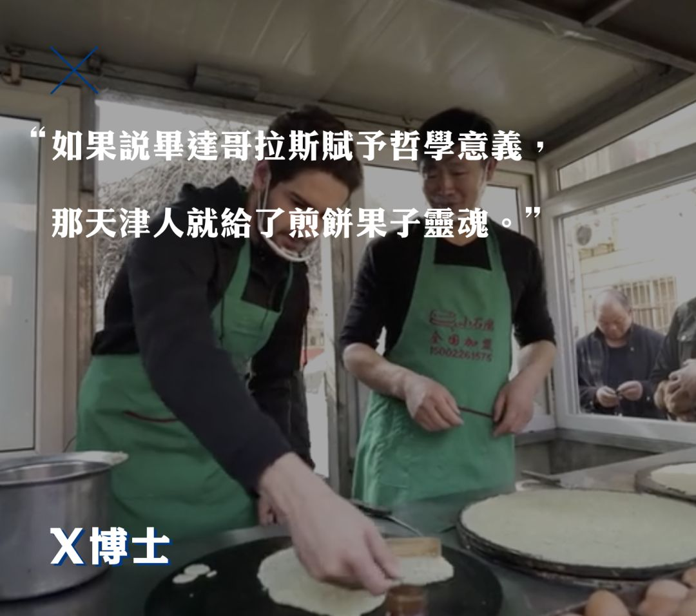 (原始链接: https://mmbiz.qpic.cn/mmbiz_png/JdxichibS5icWHDfmODdnIXiauSA661JfwxEqkEeq7Fjczhqb6U7uu8t0oRiaYEN0UvVw5nfn1UZbsDB6goGkbp7dFg/640?wx_fmt=png)
-  (原始链接: https://mmbiz.qpic.cn/mmbiz_jpg/JdxichibS5icWHDfmODdnIXiauSA661JfwxEibBjMsFPicK9BPC9mPj5EBPRp1TR6LXHNWH63lYfJBwhtP0y7aiaAAAqA/640?wx_fmt=jpeg)
- 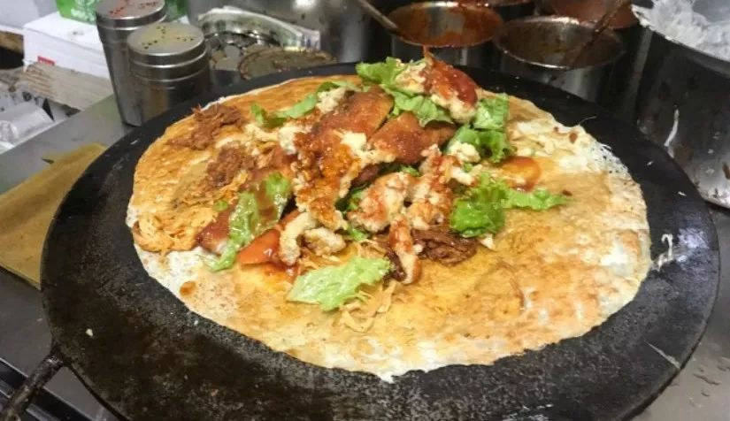 (原始链接: https://mmbiz.qpic.cn/mmbiz_jpg/JdxichibS5icWHDfmODdnIXiauSA661JfwxEp7LOA3W6ZvgXvvO6oXjyMsJlAoibr4vIUIErbc2Z4GNLllZOq1pr7Tw/640?wx_fmt=jpeg)
-  (原始链接: https://mmbiz.qpic.cn/mmbiz_png/JdxichibS5icWHDfmODdnIXiauSA661JfwxEUJDK6ibMClECVPibiaTA0cMAWaTq8moBqybkfgeQCmoNKPZHSgXkaCwNw/640?wx_fmt=png)
- 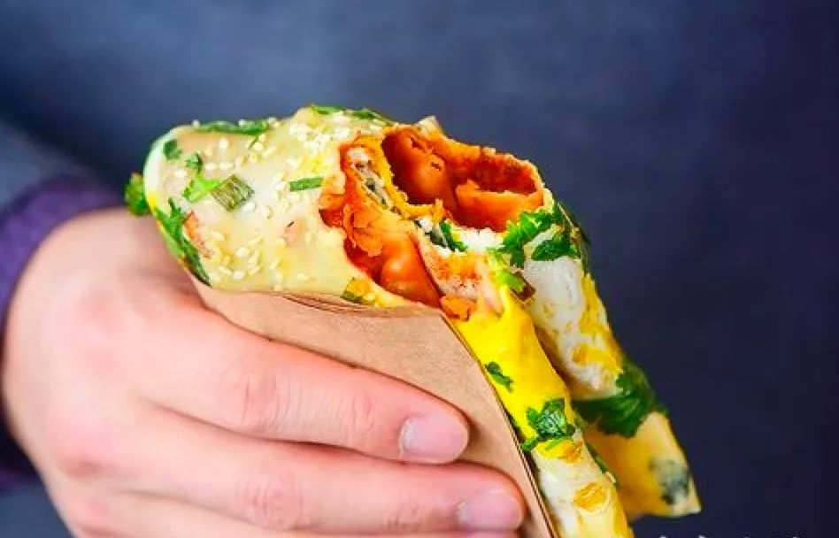 (原始链接: https://mmbiz.qpic.cn/mmbiz_jpg/JdxichibS5icWHDfmODdnIXiauSA661JfwxEmYic9Av99Yy52mpa94sUZPmpgolsSTU4AZic6pqKUdDW2GYicpice5fsgQ/640?wx_fmt=jpeg)
- 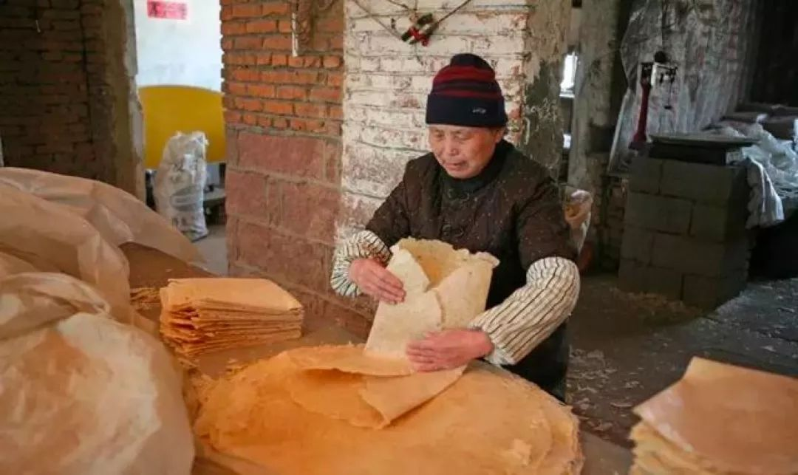 (原始链接: https://mmbiz.qpic.cn/mmbiz_jpg/JdxichibS5icWHDfmODdnIXiauSA661JfwxEflibOicLlCBwIb0lGG0CVBNyz4tZSbX0OH5wAC2wYxuKrscF4zgRNCJQ/640?wx_fmt=jpeg)
-  (原始链接: https://mmbiz.qpic.cn/mmbiz_jpg/JdxichibS5icWHDfmODdnIXiauSA661JfwxEOIamRQCuRibjz3nHIxdsWmK2NQab832jfB7Q71RoXoicjqsibhiaCNovlg/640?wx_fmt=jpeg)
- 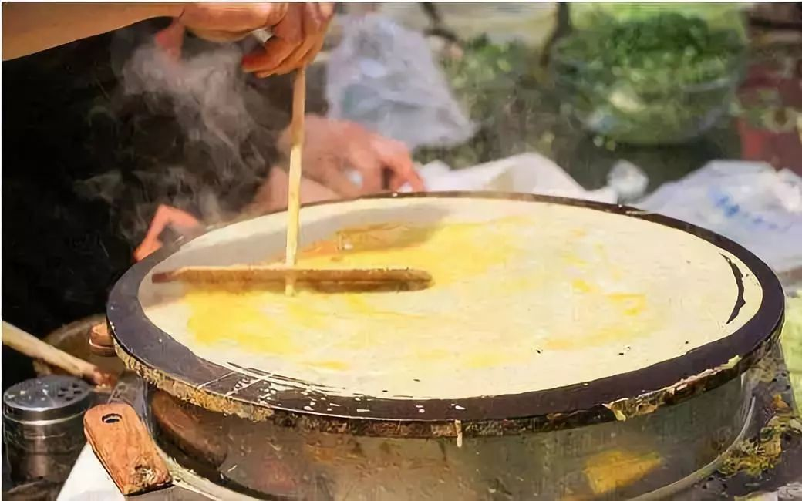 (原始链接: https://mmbiz.qpic.cn/mmbiz_jpg/JdxichibS5icWHDfmODdnIXiauSA661JfwxEkxkvwSic4TraGQDqrXWkibRvib7BVLD4VCEOuRVkbTggiaVpGkANtjp61A/640?wx_fmt=jpeg)
-  (原始链接: https://mmbiz.qpic.cn/mmbiz_png/JdxichibS5icWHDfmODdnIXiauSA661JfwxE2hibk1ibpd6tHMJmpoQMJ41wiaDn4yDdGIPbLg9bZGUjkAvv2JgBGCF3w/640?wx_fmt=png)
- 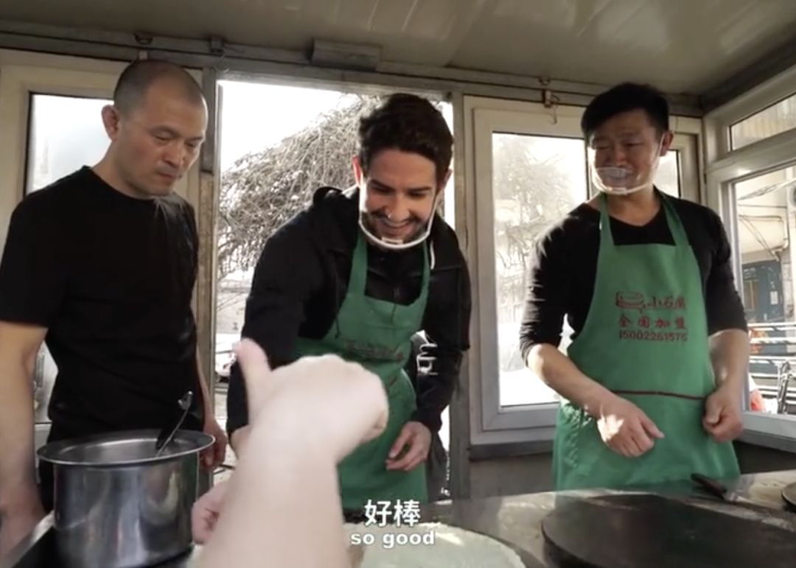 (原始链接: https://mmbiz.qpic.cn/mmbiz_png/JdxichibS5icWHDfmODdnIXiauSA661JfwxEbBt9lnJibA2UfGqItQkEUbx4Z7bdPec4FtsmCgTXbsp2rrlIsbhX7Dw/640?wx_fmt=png)
- 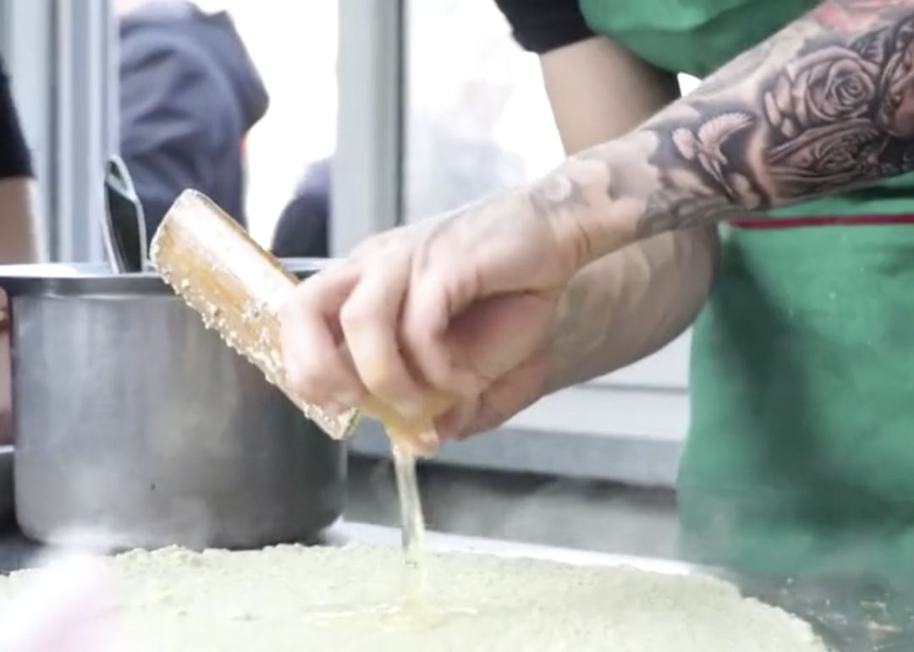 (原始链接: https://mmbiz.qpic.cn/mmbiz_png/JdxichibS5icWHDfmODdnIXiauSA661JfwxEA9neblZ0y3OcgRFicfXicRcMwib9J34ZxOLoClGQ4UqiaibQnDFHibbYegzg/640?wx_fmt=png)
- 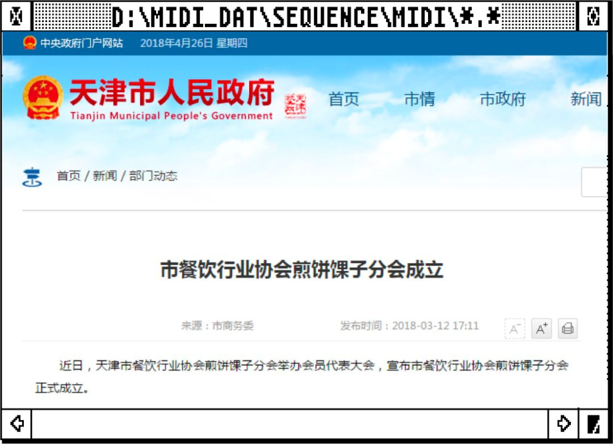 (原始链接: https://mmbiz.qpic.cn/mmbiz_png/JdxichibS5icWHDfmODdnIXiauSA661JfwxEaJqUBHSdJNzzBKjgQc3moJggDCiaz0LD2gPylBicBms3SaFbdpcYeqUg/640?wx_fmt=png)
- 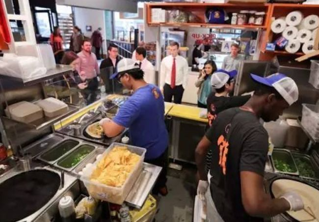 (原始链接: https://mmbiz.qpic.cn/mmbiz_png/JdxichibS5icWHDfmODdnIXiauSA661JfwxEAI6R58sSJZeZT85R4XE8euonyI4oIc86ArmWBrtB8AlIG9cwZmHcfQ/640?wx_fmt=png)
-  (原始链接: https://mmbiz.qpic.cn/mmbiz_png/JdxichibS5icWHDfmODdnIXiauSA661JfwxE0nGsDrKtIoYehGZHV5ia6icFjqvq0drJgDiasickVjwyxzMXeFefb6xFeg/640?wx_fmt=png)
- 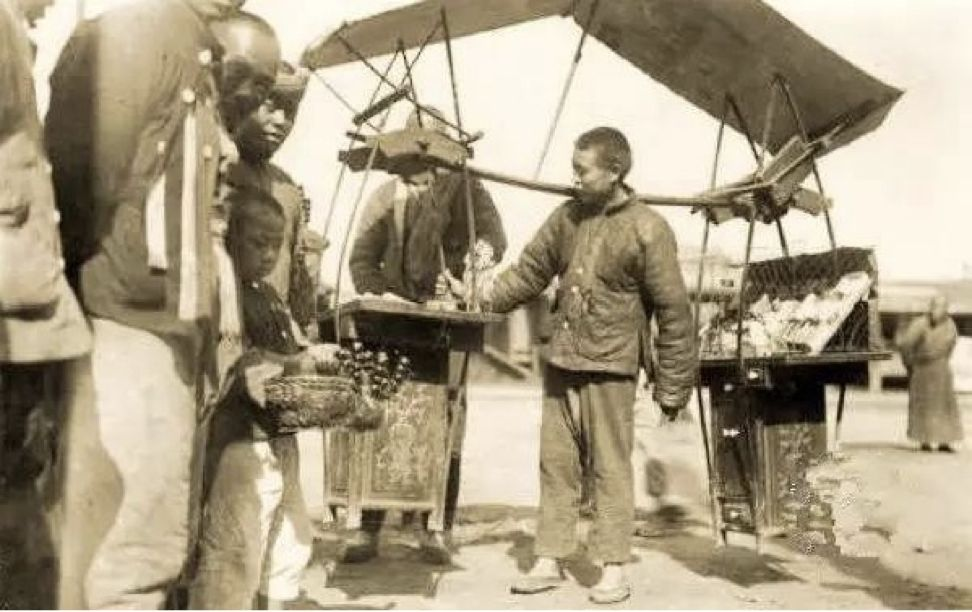 (原始链接: https://mmbiz.qpic.cn/mmbiz_png/JdxichibS5icWHDfmODdnIXiauSA661JfwxENTr0eoZic31lleRTbErfzD3y2nudAa9m3leCRJQsnkiaNGDibZF1qJN6A/640?wx_fmt=png)
- 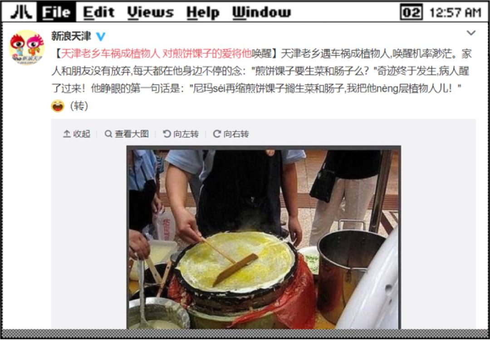 (原始链接: https://mmbiz.qpic.cn/mmbiz_png/JdxichibS5icWHDfmODdnIXiauSA661JfwxEAxR1qceCw8k2MO0wROFMvR3fx58dia2m72PJTlV228t49iaE4U2mwlibQ/640?wx_fmt=png)
- 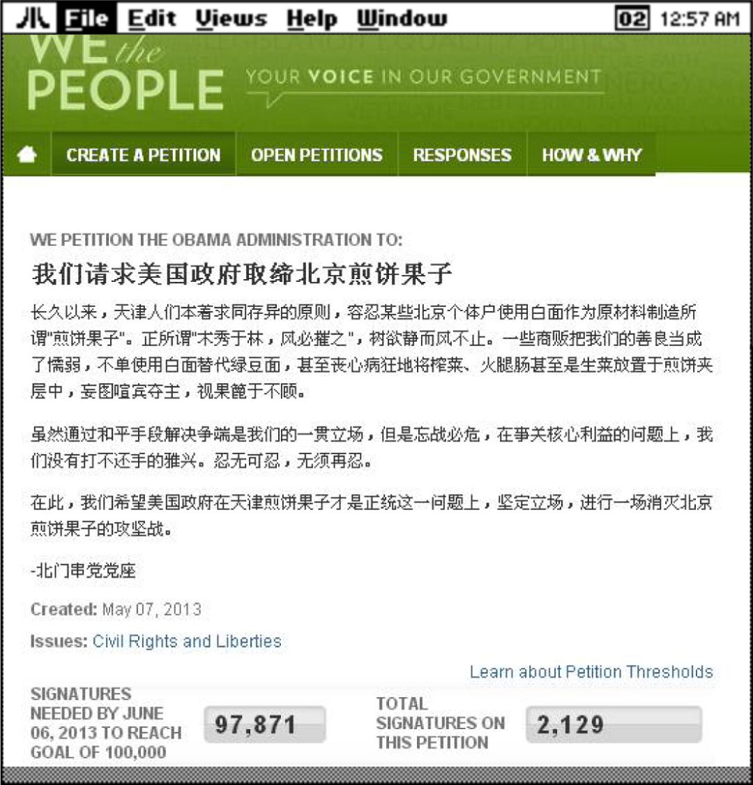 (原始链接: https://mmbiz.qpic.cn/mmbiz_png/JdxichibS5icWHDfmODdnIXiauSA661JfwxEwjoEPHn7ay2DMyQEg4P8S2r3wdyTJ68vfLbcAaxxS20vMIcGoCJatA/640?wx_fmt=png)
-  (原始链接: https://mmbiz.qpic.cn/mmbiz_png/JdxichibS5icWHDfmODdnIXiauSA661JfwxENawxB6MFP0ic3LPicRRhJxaibIuVsS4tIZG043zGZGRRg7BEcUDwamb4w/640?wx_fmt=png)
- 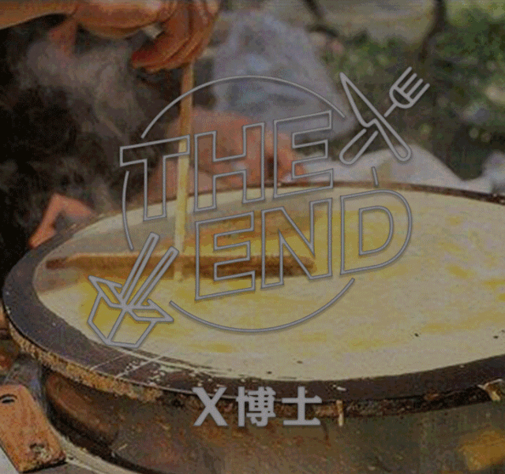 (原始链接: https://mmbiz.qpic.cn/mmbiz_gif/JdxichibS5icWHDfmODdnIXiauSA661JfwxEFVUKmG4oQQGUbraMxwuW5K9iamriaa42PKarmZjUHWFnHVoY0Kpfp31w/640?wx_fmt=gif)
-  (原始链接: https://mmbiz.qpic.cn/mmbiz_jpg/JdxichibS5icWEPjr3HR9BBFaibHBicaVufuzroTYBHOxYyD36PTmmLYwHH3qu1P4Ej0gm0IjIFKf8xXJicOgF2oV4Lw/640?wx_fmt=jpeg)
