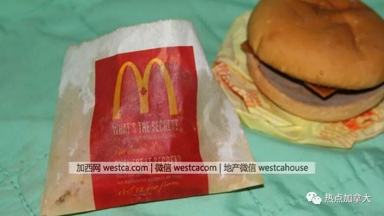
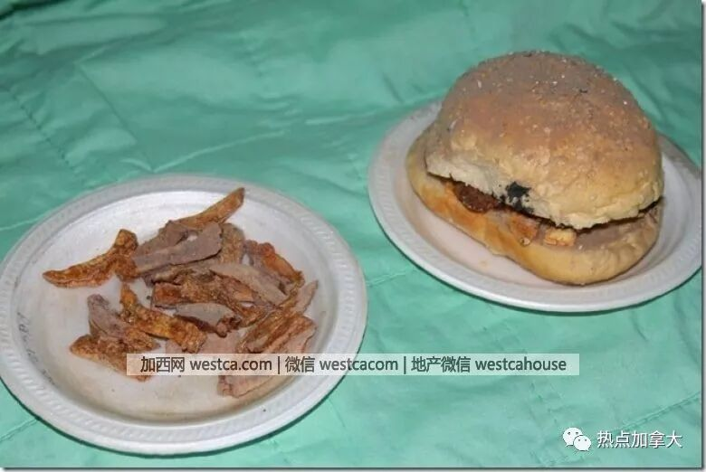

# 无标题

**链接地址:** http://mp.weixin.qq.com/s?__biz=MzI5NDMzNzM3OQ==&mid=2247487268&idx=8&sn=b24d0b5511decd90dcf960e5dea9f4a1&chksm=ec652128db12a83e570d25fad5ce9d1faa710d6ac4e585c1f28dbec3b171958cc01b731b41c1&mpshare=1&scene=2&srcid=0710LlpZVc5I2hAsk3i8tH4k#rd
**作者:** 
**获取时间:** 2025/8/28 21:48:11
**图片数量:** 15

---

## 原始HTML内容

<section class="" style="max-width: 100%;color: rgb(51, 51, 51);">&nbsp;<section class="" ng-click="onClick($event)" ng-model="eo.text" ng-style=" {
  'font-size'   : eo.fontSize,
  'font-family' : eo.fontFamily,
  'font-style'  : eo.fontStyle,
  'color'       : (eo.color || theme.majorColor),
} " placeholder="{ 点击编辑 }" stop-propagation="click mousedown mouseup" tn-edit-content="true" tn-page-editable="text0" tn-page-editable-type="ed-type-text" ui-on-drop="block($event)" style="margin-top: 0.7em;margin-left: -0.4em;padding: 1em;max-width: 100%;border-radius: 1em;width: 510.25px;color: inherit;font-family: inherit;font-size: 1em;display: inline-block;background-color: rgb(250, 200, 255);box-sizing: border-box !important;word-wrap: break-word !important;">&nbsp;&nbsp;&nbsp;吃喝玩乐卡尔加里YYC&nbsp;最近要大送豪礼，包括苹果 iPhone X！</section></section>
 
<section class="" style="max-width: 100%;color: rgb(51, 51, 51);"><section class="" ng-click="onClick($event)" ng-model="eo.text" ng-style=" {
  'font-size'   : eo.fontSize,
  'font-family' : eo.fontFamily,
  'font-style'  : eo.fontStyle,
  'color'       : (eo.color || theme.majorColor),
} " placeholder="{ 点击编辑 }" stop-propagation="click mousedown mouseup" tn-edit-content="true" tn-page-editable="text0" tn-page-editable-type="ed-type-text" ui-on-drop="block($event)" style="margin-top: 0.7em;margin-right: -0.4em;padding: 1em;max-width: 100%;border-radius: 1em;width: 510.25px;color: inherit;font-family: inherit;font-size: 1em;display: inline-block;background-color: rgb(188, 227, 249);box-sizing: border-box !important;word-wrap: break-word !important;">没错没错，记得『点击蓝字加关注』哟！机会随时到来！</section>&nbsp;&nbsp;</section><section class="" style="margin-top: 0.8em;margin-bottom: 0.5em;max-width: 100%;color: rgb(51, 51, 51);">
 
</section><section style="max-width: 100%;color: rgb(51, 51, 51);">真心实意，为您推荐！</section>
 

 

你能想到六年前买的汉堡放到今天是什么样吗?  

安省一名男子将六年前买来的一份麦当劳汉堡薯条，挂在网上竞拍，令人惊叹的是，如今这汉堡薯条看起来仍然没什么变化。  据CBC报道，男子Dave Alexander来自安省的一个小镇Staffa。2012年6月7日，Alexander让女儿到麦当劳买了一份套餐，吉士汉堡和薯条，原封不动地放了六年。  Alexander表示，他听说快餐店的汉堡能保存几年不会腐烂，于是就想亲自试试这个“传言”。  六年过去了，Alexander说，这汉堡薯条看起来还和刚买回来的时候差不多。尤其薯条，还和买回来的那天早上看起来没什么两样。汉堡肉的颜色深了一些，面包虽然已经硬得跟石头一样，但颜色看起来还很新鲜。  　　 (Dave Alexander/EBay)  同时，Alexander将自己做的薯条和汉堡也一起做了实验。他五年前做的汉堡薯条，现在和麦当劳的完全不一样了。  他说，自己做的芝士汉堡外观看起来差很多了，薯条发灰像一根根的小木炭，汉堡也呈现灰暗色泽。    Alexander决定在eBay上出售这份薯条汉堡，起价为29.99元。他声称，它们看起来完全能卖得出去。 

但是，日前eBay网站因为他违反条款和协议而将这款产品撤下。  “我惊呆了，”Alexander说，“我无法理解这些人在想什么”。  Alexander说，eBay网站通知他，在没有到期日的情况下出售食品违反了他们的政策。  该网站的食品政策规定，所售出的任何食品必须要有“明确标明过期或按日期使用”，安全储存，并且“不得以任何方式改变或更改”。  一个6年的汉堡？eBay你开玩笑吧，这还需要一个有效期？  为什么别人家的汉堡包可以放这么多年没有坏？是否放了防腐剂？  对于外界的质疑，麦当劳总部全球媒体负责人Bridget Coffing在接受记者采访时表示，麦当劳的食品都是当天新鲜出炉的。在不知道实验产品储藏的具体环境下，麦当劳不可能对这些“指责”做出详细的解释。  同时，Bridget Coffing称，麦当劳汉堡中在制作的时候，只是加了盐、胡椒粉，绝对没有添加剂。而制作汉堡包和薯条的材料也都和消费者平时在商店买的没什么两样。  那到底是什么原因呢？ 

加拿大食品科学家Dr. Keith Warriner最近公开解释了这个问题。  食物里面都有我们看不见的微生物，如果有它们，那就该出现腐烂、发霉的现象。  微生物的生存和繁殖需要俩必备条件：营养和水。而麦当劳套餐中几乎所有食物的含水量都特别低：薯条、鸡块、汉堡肉饼都是高温油炸的，水分早就炸光了，而汉堡面包也几乎没水分。 

 

在一般的室内环境中，这些食物中本来很少的水分还在持续流失，因此微生物根本没法生长，食物就不会腐烂。  不管怎样，油炸快餐食品总是没有那么健康，大家还是尽量少吃为好！ 

 
<ul class=" list-paddingleft-2" style="list-style-type: circle;"></ul>
文章来源：热点加拿大

 

欢迎大家添加&nbsp;神通广大&nbsp;吃喝玩乐&nbsp;服务微信&nbsp;为好友！

相互照应，十分必要！

扫码即可！

 

 

 
<section style="max-width: 100%;color: rgb(51, 51, 51);">真诚为您推荐！</section><section class="" data-style="white-space: normal; text-align: left;font-size: 14px;line-height: 1.5em; color: rgb(12, 12, 12);" style="max-width: 100%;color: rgb(51, 51, 51);"><section style="margin-top: -1.2em;max-width: 100%;box-sizing: border-box;color: rgb(166, 166, 166);text-align: center;border-width: initial;border-style: none;border-color: initial;line-height: 1.4;word-wrap: break-word !important;"> </section><section class="" data-style="white-space: normal; text-align: left;font-size: 14px;line-height: 1.5em; color: rgb(12, 12, 12);" style="padding: 16px 16px 10px;max-width: 100%;box-sizing: border-box;font-size: 1em;line-height: 1.4;word-wrap: break-word !important;">
<strong style="max-width: 100%;color: rgb(62, 62, 62);font-size: 18px;text-align: justify;box-sizing: border-box !important;word-wrap: break-word !important;"><strong style="max-width: 100%;box-sizing: border-box !important;word-wrap: break-word !important;"><strong style="max-width: 100%;box-sizing: border-box !important;word-wrap: break-word !important;"><strong style="max-width: 100%;box-sizing: border-box !important;word-wrap: break-word !important;"></strong></strong></strong></strong>

<strong style="max-width: 100%;font-size: 18px;text-align: justify;box-sizing: border-box !important;word-wrap: break-word !important;"><strong style="max-width: 100%;box-sizing: border-box !important;word-wrap: break-word !important;"><strong style="max-width: 100%;box-sizing: border-box !important;word-wrap: break-word !important;"><strong style="max-width: 100%;box-sizing: border-box !important;word-wrap: break-word !important;"></strong></strong></strong></strong> 

 

<strong style="max-width: 100%;font-size: 18px;text-align: justify;box-sizing: border-box !important;word-wrap: break-word !important;"><strong style="max-width: 100%;box-sizing: border-box !important;word-wrap: break-word !important;"><strong style="max-width: 100%;box-sizing: border-box !important;word-wrap: break-word !important;"><strong style="max-width: 100%;box-sizing: border-box !important;word-wrap: break-word !important;"></strong></strong></strong></strong>

<strong style="max-width: 100%;font-size: 18px;text-align: justify;box-sizing: border-box !important;word-wrap: break-word !important;"><strong style="max-width: 100%;box-sizing: border-box !important;word-wrap: break-word !important;"><strong style="max-width: 100%;box-sizing: border-box !important;word-wrap: break-word !important;"><strong style="max-width: 100%;box-sizing: border-box !important;word-wrap: break-word !important;"></strong></strong></strong></strong> 

 

</section></section>
 

---

## 纯文本内容

吃喝玩乐卡尔加里YYC 最近要大送豪礼，包括苹果 iPhone X！没错没错，记得『点击蓝字加关注』哟！机会随时到来！  真心实意，为您推荐！你能想到六年前买的汉堡放到今天是什么样吗?安省一名男子将六年前买来的一份麦当劳汉堡薯条，挂在网上竞拍，令人惊叹的是，如今这汉堡薯条看起来仍然没什么变化。据CBC报道，男子Dave Alexander来自安省的一个小镇Staffa。2012年6月7日，Alexander让女儿到麦当劳买了一份套餐，吉士汉堡和薯条，原封不动地放了六年。Alexander表示，他听说快餐店的汉堡能保存几年不会腐烂，于是就想亲自试试这个“传言”。六年过去了，Alexander说，这汉堡薯条看起来还和刚买回来的时候差不多。尤其薯条，还和买回来的那天早上看起来没什么两样。汉堡肉的颜色深了一些，面包虽然已经硬得跟石头一样，但颜色看起来还很新鲜。　　(Dave Alexander/EBay)同时，Alexander将自己做的薯条和汉堡也一起做了实验。他五年前做的汉堡薯条，现在和麦当劳的完全不一样了。他说，自己做的芝士汉堡外观看起来差很多了，薯条发灰像一根根的小木炭，汉堡也呈现灰暗色泽。Alexander决定在eBay上出售这份薯条汉堡，起价为29.99元。他声称，它们看起来完全能卖得出去。但是，日前eBay网站因为他违反条款和协议而将这款产品撤下。“我惊呆了，”Alexander说，“我无法理解这些人在想什么”。Alexander说，eBay网站通知他，在没有到期日的情况下出售食品违反了他们的政策。该网站的食品政策规定，所售出的任何食品必须要有“明确标明过期或按日期使用”，安全储存，并且“不得以任何方式改变或更改”。一个6年的汉堡？eBay你开玩笑吧，这还需要一个有效期？为什么别人家的汉堡包可以放这么多年没有坏？是否放了防腐剂？对于外界的质疑，麦当劳总部全球媒体负责人Bridget Coffing在接受记者采访时表示，麦当劳的食品都是当天新鲜出炉的。在不知道实验产品储藏的具体环境下，麦当劳不可能对这些“指责”做出详细的解释。同时，Bridget Coffing称，麦当劳汉堡中在制作的时候，只是加了盐、胡椒粉，绝对没有添加剂。而制作汉堡包和薯条的材料也都和消费者平时在商店买的没什么两样。那到底是什么原因呢？加拿大食品科学家Dr. Keith Warriner最近公开解释了这个问题。食物里面都有我们看不见的微生物，如果有它们，那就该出现腐烂、发霉的现象。微生物的生存和繁殖需要俩必备条件：营养和水。而麦当劳套餐中几乎所有食物的含水量都特别低：薯条、鸡块、汉堡肉饼都是高温油炸的，水分早就炸光了，而汉堡面包也几乎没水分。在一般的室内环境中，这些食物中本来很少的水分还在持续流失，因此微生物根本没法生长，食物就不会腐烂。不管怎样，油炸快餐食品总是没有那么健康，大家还是尽量少吃为好！文章来源：热点加拿大欢迎大家添加 神通广大 吃喝玩乐 服务微信 为好友！相互照应，十分必要！扫码即可！真诚为您推荐！

---

## 图片列表

-  (原始链接: https://mmbiz.qpic.cn/mmbiz/MVPvEL7Qg0EXNGDDXjhn7BQlLVZfE4a72NDhuKJZheaZoX3JcYZ8wicrltbzurnAx8Urww68iaiaaC541u0miaUGqg/640?)
-  (原始链接: https://mmbiz.qpic.cn/mmbiz/MVPvEL7Qg0EXNGDDXjhn7BQlLVZfE4a7eyibPmHcP5XBsBl0KZPM0LQibDWticwHV1SSxz8Ha4rjtk93ZD4sTPSsg/640?)
-  (原始链接: https://mmbiz.qpic.cn/mmbiz_jpg/E5oZzDjj1krg70S5dqqia8wpBmp0u7ibWvurxxBrwHU6YUHpdrKOPJ2thhiaQAWncywSIyP6RaAFxH9WzMUvUFkbA/640?wx_fmt=jpeg)
-  (原始链接: http://mmbiz.qpic.cn/mmbiz_jpg/E5oZzDjj1kqcmzibGGbOTonJ7caYsjiaSTtMq1U3Kw5VOLtUgTSNvWXFuQqic1rM7AwibhPM0ZM41RO6DtAmU1WM3w/640?wx_fmt=jpeg)
-  (原始链接: https://mmbiz.qpic.cn/mmbiz_jpg/E5oZzDjj1koIN1Y38icljFMX6zwK8pw7b53PvUZlk9gXsIh45VRRWgBJXibBqiaeeJJv68NkFKuicodbcqOWCXUHicw/640?wx_fmt=jpeg)
-  (原始链接: https://mmbiz.qpic.cn/mmbiz_png/E5oZzDjj1korznwXHmfQ7aYIaG0UJMDRhykrwCMh7dttU2MfsKwBQ3VbBbfUujjQeR6KFxbyiaUlJDPafL6fcwQ/640?wx_fmt=png)
-  (原始链接: https://mmbiz.qpic.cn/mmbiz_jpg/slk6rPuPpflBPfbA1xCmEc0XNu52tHCmxyeuHSG2Eib6WXJWTfJyaXia1po53sMTphbEPrvnAdBpWJ8Xtic51Bl4g/640?wx_fmt=jpeg)
-  (原始链接: https://mmbiz.qpic.cn/mmbiz_jpg/slk6rPuPpflBPfbA1xCmEc0XNu52tHCmeUEwGqicguuwmemV14X97XvwjTaibGURruayhxJJgMvv9hSlJgXY8YNw/640?wx_fmt=jpeg)
-  (原始链接: https://mmbiz.qpic.cn/mmbiz_jpg/mZIpZ2dRo6Z5Lg6L4yBuvZf7QibxfKVYiaibWZ0TgYUSaib6Kt9bF0BhOS7r5v3zCAdNJ6PubAKsoohqPxVjIFWX9w/640?wx_fmt=jpeg)
-  (原始链接: https://mmbiz.qpic.cn/mmbiz_jpg/E5oZzDjj1kqmyBd2wXyJpdlTKRQv5yEo8q6MibdN8KaEpc8HasuicnnICaTm5SyBmFzYHh7Ypj7IianbCxEfHk2lg/640?wx_fmt=jpeg)
-  (原始链接: https://mmbiz.qpic.cn/mmbiz_jpg/E5oZzDjj1kqOCLqCN2NbQAMUbagjVS03xgLrw0N6XMoBSZS1ykNxrwfWZiaj5dHXZWqFdCfVurm8R3oSF82FJqQ/640?wx_fmt=jpeg)
-  (原始链接: https://mmbiz.qpic.cn/mmbiz_jpg/E5oZzDjj1koNJW9uUHaESKwdYBXwmKW1qj69v3qOjy7szM8OibukgwicGibjP2x1Xeqic9bKbg2a2f2qRBSzicsX20w/640?wx_fmt=jpeg)
-  (原始链接: https://mmbiz.qpic.cn/mmbiz_jpg/E5oZzDjj1koNJW9uUHaESKwdYBXwmKW1N0JZ1iaAG5IJ84TC3KQzv1rNHdaiaic9ZibfOCBUL1yhIWnK0ScaWEibQ4A/640?wx_fmt=jpeg)
-  (原始链接: https://mmbiz.qpic.cn/mmbiz_jpg/E5oZzDjj1krFNNmqiaVW3RVdTIANicfJ6BibMoyEmfm5Bscqn3NFAArz5lafNH1OTexHamNNp51ibcpFJqJKHjhiahw/640?wx_fmt=jpeg)
-  (原始链接: http://mmbiz.qpic.cn/mmbiz/E5oZzDjj1kqdHwQ2zpsHXPvFpF81yEia17OibFaAfyBwQYD1iakM7T1PlagpPx6bCbw4qeARbPEgmqPsmYtLv46cQ/640?wx_fmt=jpeg)
