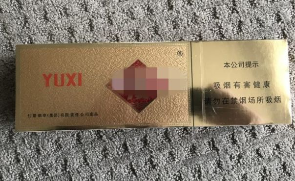
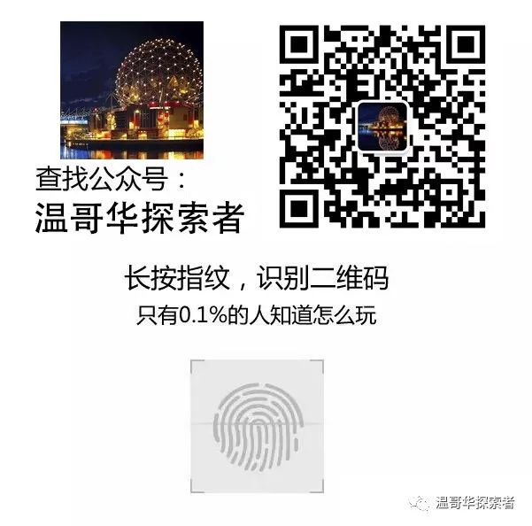

# 无标题

**链接地址:** http://mp.weixin.qq.com/s?__biz=MzI3NDkxMzg2NA==&mid=2247484012&idx=1&sn=81a301cd79f2550b8e77ea826823153d&chksm=eb0d8d4bdc7a045d32714962cafa7aa133b7a2551f997243a41809fcb071b4535da4607ac6a7&mpshare=1&scene=2&srcid=07168iPDhGNNAFPQBsqJeDhk#rd
**作者:** 
**获取时间:** 2025/8/28 21:47:09
**图片数量:** 4

---

## 原始HTML内容

 

一个CBC新闻部的调查报道说，BC省大温地区存在一个非法但红火的香烟倒卖市场。

 

在本地的几个华人网站上可以找到许多转卖玉溪、中华和红双喜牌香烟的广告。据大温灭罪热线的不完全统计，仅去年一年就有超过三百万支香烟被倒卖。

 

 

这些香烟来自机场的免税商店。

 

加拿大海关规定每人可带一条免税香烟入境。

 

在从亚洲抵达温哥华国际机场的旅客当中，有些人把免税烟放到网上转卖。弗雷泽大学“全球烟草控制研究项目”的研究员方女士（Jennifer Fang）说，这是一种很赚钱的买卖。

 

免税烟转卖广告：”机场免税店烟金玉溪二条，每条95加币。“

 

她在接受CBC记者采访时举例说，一条玉溪牌香烟在中国机场的免税店里的价格相当于30加元。而记者从网上的广告了解到，一条玉溪牌香烟在大温可以卖到90加元。

 

方女士有一次在机场遇到一个司机。

 

那人提出，她可以付50加元车资，也可以给一条烟。她说，可以肯定的是，他收一条烟代替50加元不会亏的。

 

她介绍说，中国烟的焦油含量高，味道比较冲，许多烟民喜欢，但是本地买不到。因此网上倒卖烟的销路很好。烟贩很快就可以建立起一个顾客网，连广告都不用登了。

 

一旦定罪可被判处200到25000加元罚款，甚至最高两年的刑期

 

倒卖免税烟是违法行为。但是，一方面警方调查起来需要投入大量人力，另一方面，这属于“没有受害者的犯罪活动”，公众懒得举报，警察也不重视。

 

过去五年中，仅有49起倒卖香烟案被提交到BC省公诉部门，其中45起提出了正式指控。

 

大温灭罪热线负责人艾尼斯（Linda Annis）对香烟倒卖市场如此兴旺感到担忧。她说，免税烟倒卖活跃了地下经济，而且犯罪团伙有可能涉足其中。

 

BC省财政部在一份声明中说，该部门有专人负责调查涉及烟草产品的违法活动和逃税行为。转卖和购买免税烟的人可被罚款200到25000加元，甚至可能被判处最高两年的监禁。

 

文章来源：加拿大家园

 

---

## 纯文本内容

一个CBC新闻部的调查报道说，BC省大温地区存在一个非法但红火的香烟倒卖市场。在本地的几个华人网站上可以找到许多转卖玉溪、中华和红双喜牌香烟的广告。据大温灭罪热线的不完全统计，仅去年一年就有超过三百万支香烟被倒卖。这些香烟来自机场的免税商店。加拿大海关规定每人可带一条免税香烟入境。在从亚洲抵达温哥华国际机场的旅客当中，有些人把免税烟放到网上转卖。弗雷泽大学“全球烟草控制研究项目”的研究员方女士（Jennifer Fang）说，这是一种很赚钱的买卖。免税烟转卖广告：”机场免税店烟金玉溪二条，每条95加币。“她在接受CBC记者采访时举例说，一条玉溪牌香烟在中国机场的免税店里的价格相当于30加元。而记者从网上的广告了解到，一条玉溪牌香烟在大温可以卖到90加元。方女士有一次在机场遇到一个司机。那人提出，她可以付50加元车资，也可以给一条烟。她说，可以肯定的是，他收一条烟代替50加元不会亏的。她介绍说，中国烟的焦油含量高，味道比较冲，许多烟民喜欢，但是本地买不到。因此网上倒卖烟的销路很好。烟贩很快就可以建立起一个顾客网，连广告都不用登了。一旦定罪可被判处200到25000加元罚款，甚至最高两年的刑期倒卖免税烟是违法行为。但是，一方面警方调查起来需要投入大量人力，另一方面，这属于“没有受害者的犯罪活动”，公众懒得举报，警察也不重视。过去五年中，仅有49起倒卖香烟案被提交到BC省公诉部门，其中45起提出了正式指控。大温灭罪热线负责人艾尼斯（Linda Annis）对香烟倒卖市场如此兴旺感到担忧。她说，免税烟倒卖活跃了地下经济，而且犯罪团伙有可能涉足其中。BC省财政部在一份声明中说，该部门有专人负责调查涉及烟草产品的违法活动和逃税行为。转卖和购买免税烟的人可被罚款200到25000加元，甚至可能被判处最高两年的监禁。文章来源：加拿大家园

---

## 图片列表

-  (原始链接: https://mmbiz.qpic.cn/mmbiz_png/9pibRS8lY4GCiaiauRKtiax5oLoJZkEUYqgU7QiacWMESh2MDC2XYNPeAtibRTPpxHQ8xldI6b5V8yqIzicv2D5Wialicyw/640?wx_fmt=png)
-  (原始链接: https://mmbiz.qpic.cn/mmbiz_png/fmEGSORPyK3As4Or0vIuNpuah7YQ5eUkmQqCTqubCz19dWzzZ005bSTYym1UibehBVsLe47qM1GBXjnYy58D7uw/640?wx_fmt=png)
-  (原始链接: https://mmbiz.qpic.cn/mmbiz_png/fmEGSORPyK3As4Or0vIuNpuah7YQ5eUkXgbygkpu94zlgC3XN3axD1z5jdNSE42omKxWTELbYPCQh3Z9AZpmlA/640?wx_fmt=png)
-  (原始链接: https://mmbiz.qpic.cn/mmbiz_jpg/9pibRS8lY4GDsR6x8vwBw8n44uEibuOiaCaibNpiczZGS8iaCrYa16LNz2uxYysSZRDUibxPMQwO2kaY6iazYUI59NdKIg/640?wx_fmt=jpeg)
