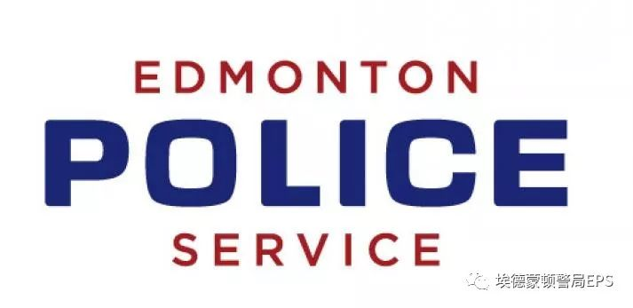
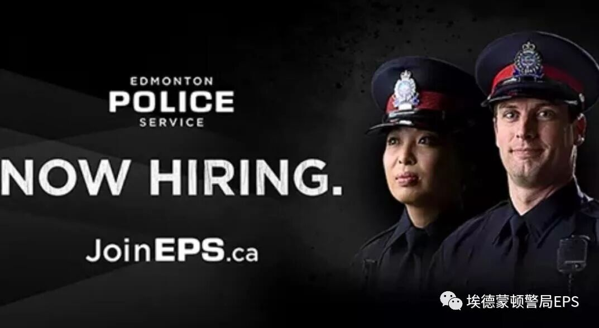
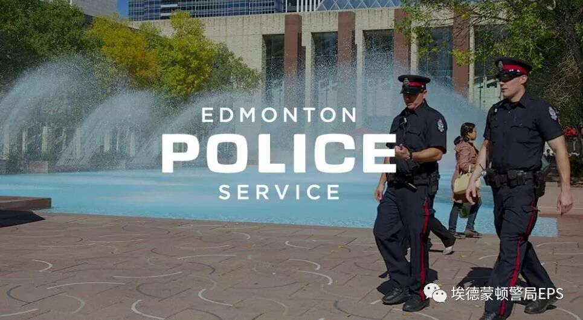
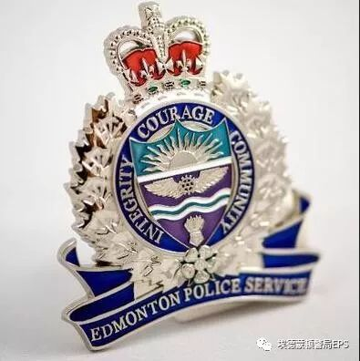
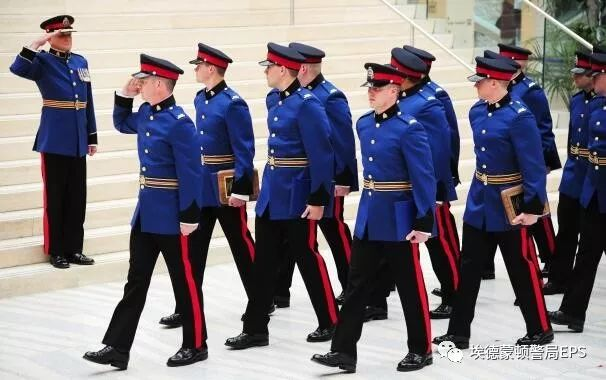

# 无标题

**链接地址:** http://mp.weixin.qq.com/s?__biz=MzU0MzQ5MTYyNA==&mid=2247483706&idx=1&sn=67ae2ff49655bfafb4c27cd9508fa63b&chksm=fb0bd27dcc7c5b6bccf5f4179c920eb066a88efbfc3c477514690305c3f2735aa0180a5cd44d&mpshare=1&scene=2&srcid=0723m8i08e0DMCW1ByzXxOfL#rd
**作者:** 吃喝玩乐埃德蒙顿
**获取时间:** 2025/8/28 21:44:43
**图片数量:** 7

---

## 原始HTML内容

 

 

大家好： 

欢迎大家关注&nbsp;埃德蒙顿警察局&nbsp;官方微信公众号

 

 

埃德蒙顿警察局 Edmonton Police Services&nbsp;

将于7月26日中午举办招聘信息分享会

我们欢迎所有华裔的朋友们积极参加。

 

详情如下：

日期：2018年7月26日

时间：下午 6：00 - 8：00

地点：EPS Continuing Education Centre, 10173 - 97 Street, Edmonton 

 

作为埃德蒙顿社区居民，您有没有想过加入警队？

 

很多人有此想法但却不知道有什么要求。在我们的警局招聘分享会上，我们将给您全部的答案，欢迎您的到来，以下是我们在分享会中会提到的部分主题：

 
<ul class=" list-paddingleft-2" style="margin-left: 30px;margin-right: 8px;"><li>
为何加入&nbsp;埃德蒙顿警察部门 EPS;
</li><li>
加入埃德蒙顿警察部门 EPS&nbsp;的福利及对未来的发展；
</li><li>
加入&nbsp;埃德蒙顿警察部门 EPS&nbsp;的要求;
</li><li>
如何注册，审批过程是如何的？;&nbsp;
</li><li>
如何成为一个合格的埃德蒙顿警察部门的警员.

 
</li></ul>
当然，现场也将会为大家解答所有问题.

<strong style="max-width: 100%;box-sizing: border-box !important;overflow-wrap: break-word !important;">报名注册</strong>请左下角的<strong style="max-width: 100%;box-sizing: border-box !important;overflow-wrap: break-word !important;">“原文链接”</strong>进行报名！

若您想获得更加详细的信息。 欢迎访问我们的官网：http://www.joineps.ca/

或者致电 780-421-2233&nbsp;或&nbsp;toll-free 1-866-777-0815.

 

 

 

 

<strong>埃德蒙顿警察局</strong>

 

<strong>关于EPS</strong>

&nbsp;

埃德蒙顿是一个快速发展且充满活力的城市，现已拥有超过一百万的人口。为了跟上这一节奏，市里的主要警察机构——埃德蒙顿警察局（EPS）也在同步成长中。现如今的EPS，比以往受过更好的培训与教育，也更加多样化。我们很自豪能拥有这样一支敬业、积极以及高效的队伍！

 

我们是一个鼓励创造、积极探索、在各方面都融会贯通的警察组织。我们的技术支持和硬件设备使得警官们以及各部门支持人员在解决问题和处理日常职责时能够更好地发挥和配合。

 

EPS大约有2500名员工（包括宣誓和非宣誓的）致力于确保埃德蒙顿的安全。EPS拥有1780多名警察，为埃德蒙顿居民提供全天候的安全保障。

 

 

 

<strong>我们的使命宣言</strong>

<strong> </strong>

通过卓越的预防，干预和抑制犯罪和紊乱来提高公共安全。

 

我们的使命宣言不仅仅是一个口号，更是EPS中每个决策的衡量标准。该使命宣言对每名警官如何向公众提供服务都会产生实际的影响。

 

 

<strong>我们的愿景</strong>

<strong> </strong>

使埃德蒙顿成为加拿大最安全的主要城市，并使埃德蒙顿警察局成为警务领域的佼佼者。&nbsp;

 

 

<strong>我们的核心价值观</strong>

<strong> </strong>

诚信 - 始终以正确的理由去做正确的事情。  责任 - 对我们自己的决策和行动负责。  尊重 - 对待他人如同希望别人如何对待自己。  创新 - 追求卓越和创造力。  勇气–就算面对最大的挑战也要保持力量。

 

社区 - 尊重我们致力于保护与服务的多元化社区。

 

 

 
<h1><strong>为何选择EPS</strong></h1>
 

当你选择警察作为你的职业的那一刻，就相当于告诉了全世界你已准备好要捍卫正义，说明了你已准备好每天拯救生命，保护无辜者，并且每时每刻都维护正义。埃德蒙顿的警察不只是维持和平，在每个日日夜夜的班次里，他们帮助创建着一个更光明的城市与更安全的未来。  对你而言，警察不仅仅是一项工作而已——它更代表着你自己。因此，来加入EPS吧！尽你所能，发挥你的长处，相信自己能成为最好的警察之一。立即申请。

 

 
<h2><strong>我们是领导者</strong></h2>
<strong> </strong>

EPS是国际公认的创新警务领导者。来自世界各地的代理商都前来访问埃德蒙顿，来了解我们在社区警务方面的举措，并亲身体验让我们成为警务领导者的方方面面。在执法、计算机通信技术、设备与培训方面，EPS都走在最前沿。  作为符合阿尔伯塔省警务标准要求的合格组织，EPS自然在其设备与其他服务都有着超高的标准。虽然所有阿尔伯塔省警察机构都必须遵守这些标准，但EPS在这些方面都是超前与领先的，这使我们的组织脱颖而出成为了一个领导者。这也是EPS成为一个令人自豪与光荣的大家庭的其中一个因素。 &nbsp;

&nbsp;

&nbsp;
<section class="" powered-by="xiumi.us" style="max-width: 100%;color: rgb(51, 51, 51);"><section style="margin-top: 10px;margin-bottom: 10px;max-width: 100%;box-sizing: border-box;text-align: center;overflow-wrap: break-word !important;"><section style="max-width: 100%;box-sizing: border-box;vertical-align: middle;display: inline-block;box-shadow: rgb(0, 0, 0) 0px 0px 0px;overflow-wrap: break-word !important;overflow: hidden !important;"></section></section></section><section class="" powered-by="xiumi.us" style="max-width: 100%;color: rgb(51, 51, 51);"><section style="max-width: 100%;box-sizing: border-box;overflow-wrap: break-word !important;"><section style="max-width: 100%;box-sizing: border-box;text-align: center;font-size: 14px;color: rgb(160, 160, 160);overflow-wrap: break-word !important;">
Edmonton Police Service 微信公众号

由

吃喝玩乐埃德蒙顿 Edmonton Explorer 营运管理
</section></section></section>
 

---

## 纯文本内容

大家好：欢迎大家关注 埃德蒙顿警察局 官方微信公众号埃德蒙顿警察局 Edmonton Police Services 将于7月26日中午举办招聘信息分享会我们欢迎所有华裔的朋友们积极参加。详情如下：日期：2018年7月26日时间：下午 6：00 - 8：00地点：EPS Continuing Education Centre, 10173 - 97 Street, Edmonton作为埃德蒙顿社区居民，您有没有想过加入警队？很多人有此想法但却不知道有什么要求。在我们的警局招聘分享会上，我们将给您全部的答案，欢迎您的到来，以下是我们在分享会中会提到的部分主题：为何加入 埃德蒙顿警察部门 EPS;加入埃德蒙顿警察部门 EPS 的福利及对未来的发展；加入 埃德蒙顿警察部门 EPS 的要求;如何注册，审批过程是如何的？; 如何成为一个合格的埃德蒙顿警察部门的警员.当然，现场也将会为大家解答所有问题.报名注册请左下角的“原文链接”进行报名！若您想获得更加详细的信息。欢迎访问我们的官网：http://www.joineps.ca/或者致电 780-421-2233 或 toll-free 1-866-777-0815.埃德蒙顿警察局关于EPS 埃德蒙顿是一个快速发展且充满活力的城市，现已拥有超过一百万的人口。为了跟上这一节奏，市里的主要警察机构——埃德蒙顿警察局（EPS）也在同步成长中。现如今的EPS，比以往受过更好的培训与教育，也更加多样化。我们很自豪能拥有这样一支敬业、积极以及高效的队伍！我们是一个鼓励创造、积极探索、在各方面都融会贯通的警察组织。我们的技术支持和硬件设备使得警官们以及各部门支持人员在解决问题和处理日常职责时能够更好地发挥和配合。EPS大约有2500名员工（包括宣誓和非宣誓的）致力于确保埃德蒙顿的安全。EPS拥有1780多名警察，为埃德蒙顿居民提供全天候的安全保障。我们的使命宣言通过卓越的预防，干预和抑制犯罪和紊乱来提高公共安全。我们的使命宣言不仅仅是一个口号，更是EPS中每个决策的衡量标准。该使命宣言对每名警官如何向公众提供服务都会产生实际的影响。我们的愿景使埃德蒙顿成为加拿大最安全的主要城市，并使埃德蒙顿警察局成为警务领域的佼佼者。 我们的核心价值观诚信 - 始终以正确的理由去做正确的事情。责任 - 对我们自己的决策和行动负责。尊重 - 对待他人如同希望别人如何对待自己。创新 - 追求卓越和创造力。勇气–就算面对最大的挑战也要保持力量。社区 - 尊重我们致力于保护与服务的多元化社区。为何选择EPS当你选择警察作为你的职业的那一刻，就相当于告诉了全世界你已准备好要捍卫正义，说明了你已准备好每天拯救生命，保护无辜者，并且每时每刻都维护正义。埃德蒙顿的警察不只是维持和平，在每个日日夜夜的班次里，他们帮助创建着一个更光明的城市与更安全的未来。对你而言，警察不仅仅是一项工作而已——它更代表着你自己。因此，来加入EPS吧！尽你所能，发挥你的长处，相信自己能成为最好的警察之一。立即申请。我们是领导者EPS是国际公认的创新警务领导者。来自世界各地的代理商都前来访问埃德蒙顿，来了解我们在社区警务方面的举措，并亲身体验让我们成为警务领导者的方方面面。在执法、计算机通信技术、设备与培训方面，EPS都走在最前沿。作为符合阿尔伯塔省警务标准要求的合格组织，EPS自然在其设备与其他服务都有着超高的标准。虽然所有阿尔伯塔省警察机构都必须遵守这些标准，但EPS在这些方面都是超前与领先的，这使我们的组织脱颖而出成为了一个领导者。这也是EPS成为一个令人自豪与光荣的大家庭的其中一个因素。    Edmonton Police Service 微信公众号由吃喝玩乐埃德蒙顿 Edmonton Explorer 营运管理

---

## 图片列表

-  (原始链接: https://mmbiz.qpic.cn/mmbiz_gif/LOvcwibiaHQ8FSK7Yksn7U1hxgfrQYbTBCEnp9F5rntiak3cKK8yRCiaLyWLMmqBhgp6bic92YQEDtobPpOLRMVD0ww/640?wx_fmt=gif)
-  (原始链接: https://mmbiz.qpic.cn/mmbiz_jpg/LOvcwibiaHQ8EyQaRQv6GTdK02eakFUI1j3Iagbecn9OYRhhOF1mU6Hk61ydpa8CQL8yViaI6h1iazNLuYjxq48tGg/640?wx_fmt=jpeg)
-  (原始链接: https://mmbiz.qpic.cn/mmbiz_jpg/LOvcwibiaHQ8EhqApNzcU5vMic7UVmxJOFKmibOxt5c4DtxfrzAyzCsFw90lNWgNQYF5D0TcCVd6XtUCiajoAVcfQAA/640?wx_fmt=jpeg)
-  (原始链接: https://mmbiz.qpic.cn/mmbiz_jpg/LOvcwibiaHQ8HwYADuPUicfJtcnl0icN1C2znuX7w7zibqRKfqoqaDGuE2vtYgwRm2FPJomlHBZBV33DQJZp35BUwFA/640?wx_fmt=jpeg)
-  (原始链接: https://mmbiz.qpic.cn/mmbiz_jpg/LOvcwibiaHQ8HwYADuPUicfJtcnl0icN1C2ztPnPXwFIBW4IaO8Vc7BiaCXwzlxYbYUzysic6SmMLsTN7YNJPn15lHgQ/640?wx_fmt=jpeg)
-  (原始链接: https://mmbiz.qpic.cn/mmbiz_jpg/LOvcwibiaHQ8HwYADuPUicfJtcnl0icN1C2z4KsoHgpVicF1Km5ykcWiaQnbXST3A9ZuiadYuO0YN8XXeMJbiaO8MibRgnQ/640?wx_fmt=jpeg)
-  (原始链接: https://mmbiz.qpic.cn/mmbiz_png/PMSb9pENrhbAkNBhJWTFxMbOcsx8Ficza8YQefJbjKe0moiajvuJfwZXzoSOpjoX9ibcvjFhrhfzqOGvNr6mNVK6Q/640?wx_fmt=png)
