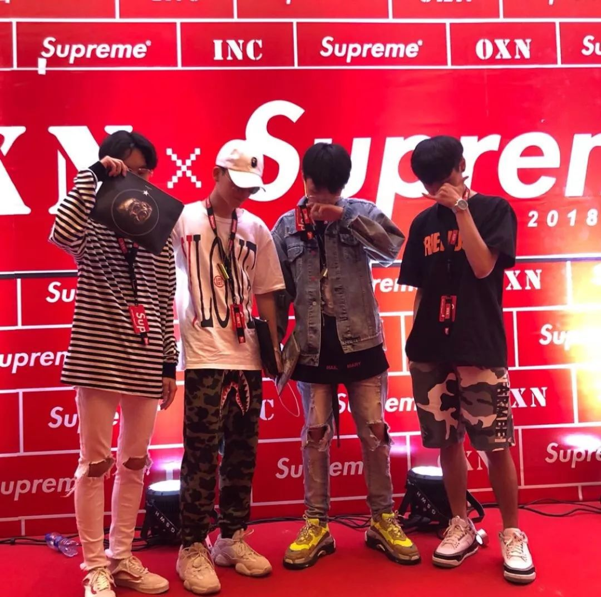

# 无标题

**链接地址:** http://mp.weixin.qq.com/s?__biz=MzI2ODE5NjExNw==&mid=2652605539&idx=1&sn=f0a4794cb2a2791b2e5bf83256d24e99&chksm=f11c6c19c66be50f6a1d3f1efc567637175239ce89cb00abe70a7b83f1a4c89fa7cc7609350a&mpshare=1&scene=2&srcid=0711sQHRZqcAJeOzRozMXc1R#rd
**作者:** Swaggy$
**获取时间:** 2025/8/28 21:44:21
**图片数量:** 23

---

## 原始HTML内容

<section class="xmteditor" style="display:none;" data-tools="新媒体管家" data-label="powered by xmt.cn"></section>

 

<strong></strong>

图片来自Highsnobiety

<strong></strong><strong></strong> 

<strong>来到了夜店</strong>

<strong>仿佛看到了行走的淘宝首页推荐</strong>

<strong> </strong><strong></strong>
<h1 style="white-space: normal;color: rgb(51, 51, 51);">
</h1>
 

你见过午夜12点的工体吗？

 

工体三里屯这地，号称“代表全国夜店生活的最高水平”，初来乍到的北漂和久仰其大名的外地人，都对这里的夜店和潮人充满好奇：究竟啥消费水平啊？天天泡吧，家里都有矿吗？

 

今天就由蝉市的驻京办特派员<strong>Swaggy$</strong>，带大家去走一走，我们的目标是：

 

没有蛀牙<strong>工体三里一条街，看完这篇就是爹。</strong>

 

👇👇👇

 

 

晚上12点的工体比早高峰的时候还堵，这里充斥着昼伏夜出的潮人，他们看似一样，但是来这里的目的却各不相同，有Raver、有泡妹的、有钓凯子的、有炫富装逼的、有买醉的、还有打发时间的。

 

而我，一名小编，就是你们说的月薪3k，却教你们月薪3w的人该怎么买衣服的那种。从上学开始已经来到北京八年了，还开着外地车牌，住在东五环，所以高峰时期的三里屯并不属于我（高峰限行），我更喜欢晚上的三里屯，自由自在。但我却是个社交恐惧症患者，去夜店是不可能的，这辈子不可能去夜店的。

 

而今天为了大家可以装作经常去夜店的样子，我决定克服心理困难，随之背负着全村的希望，前往工体一探究竟.........在早上十点钟，愣是敲开了夜店的大门。

 

 
<table width="677" data-sort="sortDisabled"><tbody><tr><td width="735" align="center" valign="middle" style="border-color: rgb(255, 255, 255);word-break: break-all;background-color: rgb(242, 242, 242);">
<strong style="letter-spacing: 0.544px;text-align: justify;"><strong style="text-align: -webkit-center;"> </strong></strong><strong style="letter-spacing: 0.544px;text-align: justify;"><strong style="text-align: -webkit-center;"></strong></strong>

<strong>Sensation&amp;GLOBAL</strong>

<strong style="letter-spacing: 0.544px;text-align: justify;"><strong style="text-align: -webkit-center;"> </strong></strong><strong style="letter-spacing: 0.544px;text-align: justify;"><strong style="text-align: -webkit-center;"></strong></strong>
</td></tr></tbody></table>

 

 

五道口华清嘉园，这个令无数创业者神伤的地方，同时也是宇宙的中心，周围铺满了各种学校，随着人人网的没落，面对无法坐在电脑前就完成“上同学，找人人”的现状，夜晚无处宣泄在学习之余多余冲动的学生们，自然来到了这里，成为了新的据点。

 

楼下S蹦跶两下，楼上Steps喝点东西，亦或者在门口花坛边上坐坐，等待行情落到自己身上。在大学周边，那自然是学生居多。

 

<strong>当人提到五道口的时候，不自觉的都要加上穷学生三个字，这听起来很残酷，但却很真实。</strong>

<strong> </strong>

 

在这里基本都是街头风格的装束，Anti Social Social Club、Supreme、OFF-WHITE、VLONE、YEEZY。

 

<strong>你去旁边7-11买包烟的功夫，都能看见9个穿OFF-WHITE的傻帽。</strong>

 

 

当然在五道口的23：00到凌晨5：00的时间段，方圆2km里内，不管你穿什么都会被打上穿假货的标签。

 

 

当然不止这些，还有一些莫名其妙的国潮，看上去似曾相识，但又好像哪里不对劲.

 

<strong>正所谓：“你有你的Supreme，我有我的Superme，不是很贵，但是很像，安排！”</strong>

 

 

很多怀着公主病和少女梦的女学生，都结伴来到这里找真爱，作为男孩来说其实你在五道口穿什么并不重要，因为不管穿什么，在认识的人眼里都当你穿假货，在不认识的人眼里都当你穿潮牌，无伤大雅。

 

<strong>在这里长得高比穿的贵有用多了。</strong>

 

而一觉醒来，女孩往往得到的答案是：“我想了想我现在的状态还不适合谈恋爱，哎。其实我很喜欢你，我以为你是那个她，不料只是上帝的玩笑，你我皆是命运的提线木偶，我们爱过，也只能是爱过了。”

 

<strong>凭借着这几句网络言情小说读后感，五道口的男孩子才避免了被人打死的命运，女孩子怀穿着惋惜之情，下楼把昨晚的房费交了。</strong>

 

 

<table width="677" data-sort="sortDisabled"><tbody><tr><td width="735" align="center" valign="middle" style="border-color: rgb(255, 255, 255);word-break: break-all;background-color: rgb(242, 242, 242);">
<strong style="letter-spacing: 0.544px;text-align: justify;"><strong style="text-align: -webkit-center;"> </strong></strong><strong style="letter-spacing: 0.544px;text-align: justify;"><strong style="text-align: -webkit-center;"></strong></strong>

<strong>MIX&amp;VICS</strong>

<strong style="letter-spacing: 0.544px;text-align: justify;"><strong style="text-align: -webkit-center;"> </strong></strong><strong style="letter-spacing: 0.544px;text-align: justify;"><strong style="text-align: -webkit-center;"></strong></strong>
</td></tr></tbody></table>
在坐的95后可能不知道，早在2010年初期，MIX&amp;VICS可是工体黄金双枪，当时流行着一句话“北京求姻缘最灵的寺庙是哪？蜜克寺和威克寺。” 

 

 

夜店这种东西三十年河东三十年河西，如今的MIX&amp;VICS里面的服务员穿着假TB，围在中年大叔的旁边，塞点小费手舞足蹈，大叔在上面尬舞，酒保在下面鼓掌，场面好不和谐。

 

要想在这里当大哥，穿衣搭配首先就不能落下，潮牌？那是孩子穿的。

 

在这就是范思哲美杜莎，安普里奥阿玛尼；立领polo来一个，运动只能EA7；要账钱包夹一侧，抽烟必须软中华；提臀紧身小脚裤，尖头皮鞋亚瑟士。

 

<strong>没点这装备，酒保进去都不带正眼瞧你的。</strong>

<strong> </strong>

舞台上并没有DJ，而是COSPLAY DJ的黑哥哥，在上面放着前年B榜的流行歌曲，置身其中常常能勾起回忆，心中浮现几个字：“北京申奥成功了 ！”

 

 

而来到这里的不是为了看中年大叔尬舞取乐的，就是各种外国屌丝，还有2000块的小姐姐。

 

如今如果你还去MIX&amp;VICS蹦迪的话，怕是工体卖花的老阿姨也能看出了你窘迫的现状，不再给你推销破气球和玫瑰花，眼中或多或少的充斥着一种小伙子“来跟我干吧”的慈爱目光。

 

 
<table width="677" data-sort="sortDisabled"><tbody><tr><td width="735" align="center" valign="middle" style="border-color: rgb(255, 255, 255);word-break: break-all;background-color: rgb(242, 242, 242);">
<strong style="letter-spacing: 0.544px;text-align: justify;"><strong style="text-align: -webkit-center;"> </strong></strong><strong style="letter-spacing: 0.544px;text-align: justify;"><strong style="text-align: -webkit-center;"></strong></strong>

<strong>13&amp;E&amp;OT</strong>

<strong> </strong>
</td></tr></tbody></table>
现在要说北京夜店三巨头肯定就是13、E和OT了，开始是E和13分庭抗礼，后来半路杀出个OT，全部人都跑OT去了，OT就像詹姆斯势头强劲联盟第一人，13好像韦德，曾经的王者随着时间推移竞技状态下滑，而E正像博士，直接退役了（装修半年）。 

 

 

你要说为啥差不多的夜店大家还跟风去OT呢？这很简单，就像你家楼下本来开了个麦当劳，你吃的也蛮爽的，但是后来开了一家蟹堡王，蟹老板顺便还叫来了海绵宝宝和派大星坐镇，麦当劳还是原来的麦当劳，但是来吃美味蟹黄堡才是走在朋友圈最前线的事情。

 

<strong>到底是麦当劳好吃还是美味蟹黄堡好吃，根本没人在乎。</strong>

 

 

但是总的来说这里的人可是要比五道口的牛逼多了，富二代、假富二代、真网红、假网红、网红脸、蹭卡选手、raver、明星、Rapper应有尽有。

 

<strong>就连在这里穿假货的也比五道口的假货高端，</strong>才不会穿什么ASSC、VLONE、NOAH之流，当然是Balenciaga、Gucci、Burberry、Rick Owens、Thom Browne起步了。

 

 

<strong>你穿个Stussy正品，还没人家假货卖的贵呢，你咋跟人家打招呼？</strong>

 

 

要想在这里撩妹，没别的！衣服得贵、头得铁，五道口的傻姑娘这里可没有，这里都是小机灵鬼，今晚给你的角色就是一个富二代，不要想接下来半个月怎么过，这样你就离成功不远了。

 

<strong>在这里一定要保证自己有一种“工体三里一条街，打听打听谁是爹”的自信。</strong>

 

很多朋友不禁要问了，这些地方消费这么高，我朋友圈里有的女性朋友也没这么有钱啊，咋天天的还能去这些地方消费呢？是爱吗？是责任吗？

 

 

平日里和销售搞好关系，签个酒开个卡女人来了男人才会来。平时玩一玩再组个群，到了周末有男性来开卡，再叫几个姑娘来坐一坐，简直是免费陪酒女，而这部分女孩来了也是钓凯子的，互利互助。

 

殊不知根本不会有一个脑子正常的男人在这种地方找真爱。

 

<strong>在这里你只能喝到最假的酒，泡脸最假的妹。</strong>

 

 

<table width="677" data-sort="sortDisabled"><tbody><tr><td width="735" align="center" valign="middle" style="border-color: rgb(255, 255, 255);word-break: break-all;background-color: rgb(242, 242, 242);">
<strong style="letter-spacing: 0.544px;text-align: justify;"><strong style="text-align: -webkit-center;"> </strong></strong><strong style="letter-spacing: 0.544px;text-align: justify;"><strong style="text-align: -webkit-center;"></strong></strong>

<strong>Play House</strong>

<strong> </strong>
</td></tr></tbody></table>
这里更像一个美式酒吧，里面有打台球的地方、有喝酒的地方、有蹦迪的地方还有扔飞镖抓娃娃的地方，和名字还真是交相呼应。 

 

 

这里是鼓楼Rapper的工体聚集地，普通人来到这里可能会发现新世界，感觉全世界奇奇怪怪的人都在这里。

 

在这里梳个脏辫，穿个工装裤，穿个Supreme、C2h4之类的Rapper最爱，实在买不起也没关系，把爷爷的大短袖翻出来，最好别看出是什么牌子的，不用很新但要很大，带俩链子，戴上口罩进门甭管有事没事，见人就说："Hey，Wuz Up man?""I’
m gucci."保证你混的如鱼得水。

 

 

这里没什么别的，就是能睡到你认识的Rapper而已。 

 

 

<table width="677" data-sort="sortDisabled"><tbody><tr><td width="735" align="center" valign="middle" style="border-color: rgb(255, 255, 255);word-break: break-all;background-color: rgb(242, 242, 242);">
<strong style="letter-spacing: 0.544px;text-align: justify;"><strong style="text-align: -webkit-center;"> </strong></strong><strong style="letter-spacing: 0.544px;text-align: justify;"><strong style="text-align: -webkit-center;"></strong></strong>

<strong>天堂超市</strong>

<strong> </strong>
</td></tr></tbody></table>
这里是五道口穷学生的东边据点，当然这里还是北京现代演艺XX学院的后花园，<strong>当然也是全北京Loser的喝酒圣地。</strong> 

 

这里看似是个喝酒的酒吧，没有蹦迪，没有DJ，甚至这里连服务员都没有，想喝什么自己去拿，但其实这里的门道也不少。

 

 

来这里的男孩喝酒是假，搭讪是真，去上厕所的人，上厕所是假，寻找猎物是真，更有甚者还玩起了拼桌大法。

 

 

几个男的兵分两路，一人独占一个酒桌，在高峰期一桌难求的情况下，会主动邀约女性前来拼桌，从而达到无形搭讪，最为致命的目的。

 

卖花的老阿姨也最喜欢挑这种傻嗨下手，卖两朵花，卖个气球让他哄哄女孩子开心，面对着刚搭讪的女孩又不好意思拒绝，只能忍痛花80块买个X宝两块钱的破气球，<strong>被钉在三里屯的耻辱柱上。</strong>

 

<strong>要不说天堂是全北京Loser的喝酒圣地呢。</strong>

 

互相眼中的对方

▼

 

<strong>“中国戏精千千万，工体三里占一半。”</strong>

 

在你们城市的夜店又有什么样的神奇景象，亦或者是你在夜店也吃过什么样的套路呢?

 

请在留言板开始你的表演！

 

 

撰稿|Swaggy$ 图片|nice&amp;ins&amp;朋友圈
<h1 style="white-space: normal;color: rgb(51, 51, 51);letter-spacing: 0.544px;text-align: justify;widows: 1;line-height: 22.7273px;font-family: Arial;">
微博|cicadahood蝉市集&nbsp;Instagram|cicadahood
</h1><h1 style="white-space: normal;color: rgb(51, 51, 51);letter-spacing: 0.544px;text-align: justify;widows: 1;line-height: 22.7273px;font-family: Arial;">
文章转载，请后台回复「转载」
</h1>
 

 

<strong>PS/</strong>

蝉市商店携手蝉市微博带来<strong>两重福利</strong>！ 

 

🎁<strong>福利一</strong>

<strong>蝉市 T 恤打折一周</strong>

 

7.7~7.14，Heritage Collection 系列 T 恤全场九折还包邮。平均每件省下约 50 RMB，数量有限，先买先得。

 

点击下图，即可进入小程序下单

 

 

🎁<strong>福利二</strong>

<strong><strong>转发微博赢千元大奖</strong></strong>

 

微博关注@Cicadahood蝉市，并收藏淘宝店铺 Cicadahood，转发相应微博并点赞，微博评论告诉蝉爷你喜欢的T恤颜色码数，结果7月16号将在微博抽奖平台抽取公布。

 

复制这段信息<strong style="color: rgb(51, 51, 51);white-space: normal;">€4vge0zzhR4j€</strong>，打开淘宝进入蝉市商店

 

 
<h1 style="white-space: normal;color: rgb(51, 51, 51);">

 
</h1>

 

猛戳阅读原文，直达蝉市商店~

---

## 纯文本内容

图片来自Highsnobiety来到了夜店仿佛看到了行走的淘宝首页推荐你见过午夜12点的工体吗？工体三里屯这地，号称“代表全国夜店生活的最高水平”，初来乍到的北漂和久仰其大名的外地人，都对这里的夜店和潮人充满好奇：究竟啥消费水平啊？天天泡吧，家里都有矿吗？今天就由蝉市的驻京办特派员Swaggy$，带大家去走一走，我们的目标是：没有蛀牙工体三里一条街，看完这篇就是爹。👇👇👇晚上12点的工体比早高峰的时候还堵，这里充斥着昼伏夜出的潮人，他们看似一样，但是来这里的目的却各不相同，有Raver、有泡妹的、有钓凯子的、有炫富装逼的、有买醉的、还有打发时间的。而我，一名小编，就是你们说的月薪3k，却教你们月薪3w的人该怎么买衣服的那种。从上学开始已经来到北京八年了，还开着外地车牌，住在东五环，所以高峰时期的三里屯并不属于我（高峰限行），我更喜欢晚上的三里屯，自由自在。但我却是个社交恐惧症患者，去夜店是不可能的，这辈子不可能去夜店的。而今天为了大家可以装作经常去夜店的样子，我决定克服心理困难，随之背负着全村的希望，前往工体一探究竟.........在早上十点钟，愣是敲开了夜店的大门。Sensation&GLOBAL五道口华清嘉园，这个令无数创业者神伤的地方，同时也是宇宙的中心，周围铺满了各种学校，随着人人网的没落，面对无法坐在电脑前就完成“上同学，找人人”的现状，夜晚无处宣泄在学习之余多余冲动的学生们，自然来到了这里，成为了新的据点。楼下S蹦跶两下，楼上Steps喝点东西，亦或者在门口花坛边上坐坐，等待行情落到自己身上。在大学周边，那自然是学生居多。当人提到五道口的时候，不自觉的都要加上穷学生三个字，这听起来很残酷，但却很真实。在这里基本都是街头风格的装束，Anti Social Social Club、Supreme、OFF-WHITE、VLONE、YEEZY。你去旁边7-11买包烟的功夫，都能看见9个穿OFF-WHITE的傻帽。当然在五道口的23：00到凌晨5：00的时间段，方圆2km里内，不管你穿什么都会被打上穿假货的标签。当然不止这些，还有一些莫名其妙的国潮，看上去似曾相识，但又好像哪里不对劲.正所谓：“你有你的Supreme，我有我的Superme，不是很贵，但是很像，安排！”很多怀着公主病和少女梦的女学生，都结伴来到这里找真爱，作为男孩来说其实你在五道口穿什么并不重要，因为不管穿什么，在认识的人眼里都当你穿假货，在不认识的人眼里都当你穿潮牌，无伤大雅。在这里长得高比穿的贵有用多了。而一觉醒来，女孩往往得到的答案是：“我想了想我现在的状态还不适合谈恋爱，哎。其实我很喜欢你，我以为你是那个她，不料只是上帝的玩笑，你我皆是命运的提线木偶，我们爱过，也只能是爱过了。”凭借着这几句网络言情小说读后感，五道口的男孩子才避免了被人打死的命运，女孩子怀穿着惋惜之情，下楼把昨晚的房费交了。MIX&VICS在坐的95后可能不知道，早在2010年初期，MIX&VICS可是工体黄金双枪，当时流行着一句话“北京求姻缘最灵的寺庙是哪？蜜克寺和威克寺。”夜店这种东西三十年河东三十年河西，如今的MIX&VICS里面的服务员穿着假TB，围在中年大叔的旁边，塞点小费手舞足蹈，大叔在上面尬舞，酒保在下面鼓掌，场面好不和谐。要想在这里当大哥，穿衣搭配首先就不能落下，潮牌？那是孩子穿的。在这就是范思哲美杜莎，安普里奥阿玛尼；立领polo来一个，运动只能EA7；要账钱包夹一侧，抽烟必须软中华；提臀紧身小脚裤，尖头皮鞋亚瑟士。没点这装备，酒保进去都不带正眼瞧你的。舞台上并没有DJ，而是COSPLAY DJ的黑哥哥，在上面放着前年B榜的流行歌曲，置身其中常常能勾起回忆，心中浮现几个字：“北京申奥成功了 ！”而来到这里的不是为了看中年大叔尬舞取乐的，就是各种外国屌丝，还有2000块的小姐姐。如今如果你还去MIX&VICS蹦迪的话，怕是工体卖花的老阿姨也能看出了你窘迫的现状，不再给你推销破气球和玫瑰花，眼中或多或少的充斥着一种小伙子“来跟我干吧”的慈爱目光。13&E&OT现在要说北京夜店三巨头肯定就是13、E和OT了，开始是E和13分庭抗礼，后来半路杀出个OT，全部人都跑OT去了，OT就像詹姆斯势头强劲联盟第一人，13好像韦德，曾经的王者随着时间推移竞技状态下滑，而E正像博士，直接退役了（装修半年）。你要说为啥差不多的夜店大家还跟风去OT呢？这很简单，就像你家楼下本来开了个麦当劳，你吃的也蛮爽的，但是后来开了一家蟹堡王，蟹老板顺便还叫来了海绵宝宝和派大星坐镇，麦当劳还是原来的麦当劳，但是来吃美味蟹黄堡才是走在朋友圈最前线的事情。到底是麦当劳好吃还是美味蟹黄堡好吃，根本没人在乎。但是总的来说这里的人可是要比五道口的牛逼多了，富二代、假富二代、真网红、假网红、网红脸、蹭卡选手、raver、明星、Rapper应有尽有。就连在这里穿假货的也比五道口的假货高端，才不会穿什么ASSC、VLONE、NOAH之流，当然是Balenciaga、Gucci、Burberry、Rick Owens、Thom Browne起步了。你穿个Stussy正品，还没人家假货卖的贵呢，你咋跟人家打招呼？要想在这里撩妹，没别的！衣服得贵、头得铁，五道口的傻姑娘这里可没有，这里都是小机灵鬼，今晚给你的角色就是一个富二代，不要想接下来半个月怎么过，这样你就离成功不远了。在这里一定要保证自己有一种“工体三里一条街，打听打听谁是爹”的自信。很多朋友不禁要问了，这些地方消费这么高，我朋友圈里有的女性朋友也没这么有钱啊，咋天天的还能去这些地方消费呢？是爱吗？是责任吗？平日里和销售搞好关系，签个酒开个卡女人来了男人才会来。平时玩一玩再组个群，到了周末有男性来开卡，再叫几个姑娘来坐一坐，简直是免费陪酒女，而这部分女孩来了也是钓凯子的，互利互助。殊不知根本不会有一个脑子正常的男人在这种地方找真爱。在这里你只能喝到最假的酒，泡脸最假的妹。Play House这里更像一个美式酒吧，里面有打台球的地方、有喝酒的地方、有蹦迪的地方还有扔飞镖抓娃娃的地方，和名字还真是交相呼应。这里是鼓楼Rapper的工体聚集地，普通人来到这里可能会发现新世界，感觉全世界奇奇怪怪的人都在这里。在这里梳个脏辫，穿个工装裤，穿个Supreme、C2h4之类的Rapper最爱，实在买不起也没关系，把爷爷的大短袖翻出来，最好别看出是什么牌子的，不用很新但要很大，带俩链子，戴上口罩进门甭管有事没事，见人就说："Hey，Wuz Up man?""I’
m gucci."保证你混的如鱼得水。这里没什么别的，就是能睡到你认识的Rapper而已。天堂超市这里是五道口穷学生的东边据点，当然这里还是北京现代演艺XX学院的后花园，当然也是全北京Loser的喝酒圣地。这里看似是个喝酒的酒吧，没有蹦迪，没有DJ，甚至这里连服务员都没有，想喝什么自己去拿，但其实这里的门道也不少。来这里的男孩喝酒是假，搭讪是真，去上厕所的人，上厕所是假，寻找猎物是真，更有甚者还玩起了拼桌大法。几个男的兵分两路，一人独占一个酒桌，在高峰期一桌难求的情况下，会主动邀约女性前来拼桌，从而达到无形搭讪，最为致命的目的。卖花的老阿姨也最喜欢挑这种傻嗨下手，卖两朵花，卖个气球让他哄哄女孩子开心，面对着刚搭讪的女孩又不好意思拒绝，只能忍痛花80块买个X宝两块钱的破气球，被钉在三里屯的耻辱柱上。要不说天堂是全北京Loser的喝酒圣地呢。互相眼中的对方▼“中国戏精千千万，工体三里占一半。”在你们城市的夜店又有什么样的神奇景象，亦或者是你在夜店也吃过什么样的套路呢?请在留言板开始你的表演！撰稿|Swaggy$ 图片|nice&ins&朋友圈微博|cicadahood蝉市集 Instagram|cicadahood文章转载，请后台回复「转载」PS/蝉市商店携手蝉市微博带来两重福利！🎁福利一蝉市 T 恤打折一周7.7~7.14，Heritage Collection 系列 T 恤全场九折还包邮。平均每件省下约 50 RMB，数量有限，先买先得。点击下图，即可进入小程序下单🎁福利二转发微博赢千元大奖微博关注@Cicadahood蝉市，并收藏淘宝店铺 Cicadahood，转发相应微博并点赞，微博评论告诉蝉爷你喜欢的T恤颜色码数，结果7月16号将在微博抽奖平台抽取公布。复制这段信息€4vge0zzhR4j€，打开淘宝进入蝉市商店猛戳阅读原文，直达蝉市商店~

---

## 图片列表

-  (原始链接: https://mmbiz.qpic.cn/mmbiz_gif/ViaqFmqQCfzDJnNTQAmHcFEanqCav9qO1biamgbmnEgpzf997a7AaIXWcK26N0E3H5ddbv0MDvicURt890icO7CLNA/640)
-  (原始链接: https://mmbiz.qpic.cn/mmbiz_jpg/ViaqFmqQCfzBib1puPCDGyxhAJ9oLQBpSrqJYTyKrHmJtdiaoichrTnKiaSROgMoO3e3mUic5FUhPdRKrKKY5ThTKENQ/640?wx_fmt=jpeg)
-  (原始链接: https://mmbiz.qpic.cn/mmbiz_png/ViaqFmqQCfzCib3GJiajEQqxLHYGxklDNbjPku7iadSWf0w0n4icg1hM0Gm8SxOqgia9DDaWYf160enRHNpETotPHwxg/640)
-  (原始链接: https://mmbiz.qpic.cn/mmbiz_jpg/qo2IlgibKfWIknJ9oicvtficOmU82TJiaV0dUXD5qphqvTyibqy7dgyhjB2zDYLaORZg5uHByAn6keayNlPMOxtOKicg/640?)
-  (原始链接: https://mmbiz.qpic.cn/mmbiz_jpg/ViaqFmqQCfzCib3GJiajEQqxLHYGxklDNbjSMRtuRrxS505tEF2luYhiaiaHmmicWcEo04PwzZvbXPtqNnoZmmicJM9kA/640)
-  (原始链接: https://mmbiz.qpic.cn/mmbiz_jpg/s58EJWQl4NOGNFFexTEIjNbzsictU0JQI7J3zhAgOkVics4If7CnXcxJOicTULK3EM32Sibhnz0mqib8mDiaVicvl10mw/640)
-  (原始链接: https://mmbiz.qpic.cn/mmbiz_jpg/qo2IlgibKfWJS935WTEoNI8TDjlgrl4lLrBo7PzjzkkUJSc3SUgr2ZE00E6pdOvSCkYBdzROs1OoBekKf7J6LcQ/640)
-  (原始链接: https://mmbiz.qpic.cn/mmbiz_jpg/ViaqFmqQCfzCib3GJiajEQqxLHYGxklDNbjUsKj27Cj43gBdyPcqCguMyT0ckESdUeEc2TBzPt2F2xkIyYzMC2fxg/640)
-  (原始链接: https://mmbiz.qpic.cn/mmbiz_jpg/ViaqFmqQCfzCib3GJiajEQqxLHYGxklDNbjqjvIcJrBYytV1jnKdYIFJkiakhcR4PGu8MVede8lYuO0HSghQqXFcibQ/640)
-  (原始链接: https://mmbiz.qpic.cn/mmbiz_png/ViaqFmqQCfzCib3GJiajEQqxLHYGxklDNbj03NSQcx9ChzOvxxkgm3RoKM07opXlrLPnWZu1zEUPZKCnGUVib1Odjg/640)
-  (原始链接: https://mmbiz.qpic.cn/mmbiz_jpg/ViaqFmqQCfzCib3GJiajEQqxLHYGxklDNbjZxX3K7GllmlSxQaHYSg1rTtTiby3Dy0muY5kQEVgKCvaXadQHicw4c3g/640)
-  (原始链接: https://mmbiz.qpic.cn/mmbiz_jpg/ViaqFmqQCfzCib3GJiajEQqxLHYGxklDNbjX1DlY4kFiba6dClHw7x7cCtHD58kaYGJ6m3MjGBnrShPCmQFZRnNKoA/640)
-  (原始链接: https://mmbiz.qpic.cn/mmbiz_jpg/qo2IlgibKfWIknJ9oicvtficOmU82TJiaV0dyME0FFKiaaPTnRHBUgeqJibwXbOXic9ANIehuNQEw8onib8KUHbFRiaZ4OA/640?)
-  (原始链接: https://mmbiz.qpic.cn/mmbiz_jpg/qo2IlgibKfWJS935WTEoNI8TDjlgrl4lLIQ275ibgc2lUJoX0oLboLlRDTv9E0oXmUfm3R2f748iaiaLo5uMm3ZicCQ/640)
-  (原始链接: https://mmbiz.qpic.cn/mmbiz_jpg/ViaqFmqQCfzCib3GJiajEQqxLHYGxklDNbjatbUFaeOcgRGoDtfOjIHwme9fNXckqYXv790IsMoia5XxFLMjDuVFwA/640)
-  (原始链接: https://mmbiz.qpic.cn/mmbiz_jpg/ViaqFmqQCfzCib3GJiajEQqxLHYGxklDNbjSF38IyujEmz9JbmULjdX75ENYYR8eRdia3ZmBAyYsOJNjX7HKH2tSqA/640)
-  (原始链接: https://mmbiz.qpic.cn/mmbiz_jpg/ViaqFmqQCfzCib3GJiajEQqxLHYGxklDNbjibzicNST4vjcsj0Bp0G2mErmrrTrGqKIoeMibr0AbextP5nBrOLZZgfdA/640)
-  (原始链接: https://mmbiz.qpic.cn/mmbiz_jpg/ViaqFmqQCfzCib3GJiajEQqxLHYGxklDNbjIraOdXpic5nWUFmwMUB4dD0ibGSiazv12BC8goKOuubeicaToyj5SOBu6g/640)
-  (原始链接: https://mmbiz.qpic.cn/mmbiz_png/ViaqFmqQCfzCib3GJiajEQqxLHYGxklDNbj4UbxywxfXmtXEF5dRbcGFvEc439FyXI6Q93nOYlL9PRXCwic8Jdo5lQ/640)
-  (原始链接: https://mmbiz.qpic.cn/mmbiz_jpg/ViaqFmqQCfzBib1puPCDGyxhAJ9oLQBpSrHE5jGvlWt5Y7q2bHylvh2HUZ7Qiac4z4VVIDpLr37dUZH4ESkdUjBTQ/640?wx_fmt=jpeg)
-  (原始链接: https://mmbiz.qpic.cn/mmbiz_png/ViaqFmqQCfzCtra9icRicTIYcwZJHcrYTa1y0CvlWR5zZKicHegxMmCH3knK5BaiazXMgwRDzceUU06phzd6HK2jsBQ/640?wx_fmt=png)
-  (原始链接: https://mmbiz.qpic.cn/mmbiz_jpg/ViaqFmqQCfzCtra9icRicTIYcwZJHcrYTa1j0A7Y6PUZtWCwBIWMuEu2L07MavlfzKNZMCBLQ2FT6Qhfhsic4gic2ew/640?wx_fmt=jpeg)
-  (原始链接: https://mmbiz.qpic.cn/mmbiz_jpg/ViaqFmqQCfzCJQrYBHfQftOlgRV8gvwBiazUtbzhaTSZrfgk0GVVYWsEtgPcwcrTlLutmHzwkiaIV9b4ER3tOC4fQ/640)
