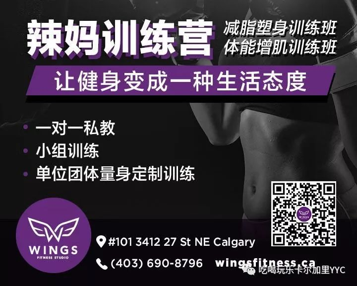

# 无标题

**链接地址:** http://mp.weixin.qq.com/s?__biz=MzI5NDMzNzM3OQ==&mid=2247487444&idx=7&sn=c1633bc3a6c73a18c03c5d811e853dbb&chksm=ec6521d8db12a8cee362c17d9d967ac3d64885241300149aa0db6e3fc766fea88d97378c7a00&mpshare=1&scene=2&srcid=0724AUww7zLDJbJolLuzGynb#rd
**作者:** 
**获取时间:** 2025/8/28 21:44:30
**图片数量:** 17

---

## 原始HTML内容

<section class="" style="max-width: 100%;color: rgb(51, 51, 51);">&nbsp;<section class="" ng-click="onClick($event)" ng-model="eo.text" ng-style=" {
  'font-size'   : eo.fontSize,
  'font-family' : eo.fontFamily,
  'font-style'  : eo.fontStyle,
  'color'       : (eo.color || theme.majorColor),
} " placeholder="{ 点击编辑 }" stop-propagation="click mousedown mouseup" tn-edit-content="true" tn-page-editable="text0" tn-page-editable-type="ed-type-text" ui-on-drop="block($event)" style="margin-top: 0.7em;margin-left: -0.4em;padding: 1em;max-width: 100%;border-radius: 1em;width: 510.25px;color: inherit;font-family: inherit;font-size: 1em;display: inline-block;background-color: rgb(250, 200, 255);box-sizing: border-box !important;word-wrap: break-word !important;">&nbsp;&nbsp;&nbsp;吃喝玩乐卡尔加里YYC&nbsp;最近要大送豪礼，包括苹果 iPhone X！</section></section>
 
<section class="" style="max-width: 100%;color: rgb(51, 51, 51);"><section class="" ng-click="onClick($event)" ng-model="eo.text" ng-style=" {
  'font-size'   : eo.fontSize,
  'font-family' : eo.fontFamily,
  'font-style'  : eo.fontStyle,
  'color'       : (eo.color || theme.majorColor),
} " placeholder="{ 点击编辑 }" stop-propagation="click mousedown mouseup" tn-edit-content="true" tn-page-editable="text0" tn-page-editable-type="ed-type-text" ui-on-drop="block($event)" style="margin-top: 0.7em;margin-right: -0.4em;padding: 1em;max-width: 100%;border-radius: 1em;width: 510.25px;color: inherit;font-family: inherit;font-size: 1em;display: inline-block;background-color: rgb(188, 227, 249);box-sizing: border-box !important;word-wrap: break-word !important;">没错没错，记得『点击蓝字加关注』哟！机会随时到来！</section>&nbsp;&nbsp;</section><section class="" style="margin-top: 0.8em;margin-bottom: 0.5em;max-width: 100%;color: rgb(51, 51, 51);">
 
</section><section style="max-width: 100%;color: rgb(51, 51, 51);">真心实意，为您推荐！</section>
 

 

<strong style="max-width: 100%;box-sizing: border-box !important;word-wrap: break-word !important;overflow-wrap: break-word !important;">移民找专业工作难，这在加拿大是个老话题了。</strong>

 

但是32岁的电力工程师莫斯塔法.阿纳卡凭借他四年投递1000多份简历而一无所获的记录和一段视频带来的大反转结局，不仅吸引了《La Presse》和Radio-Canada等媒体的注意，还在魁北克省议会重新引发了关于移民就业的辩论。

 

 

任何一个想在魁省（或加拿大其他省份）继续干本行的移民工程师都不可能比阿纳卡更努力了。

 

<strong style="max-width: 100%;box-sizing: border-box !important;word-wrap: break-word !important;overflow-wrap: break-word !important;">需要会法语？他去学了法语，尽管有口音，但是工作和日常交流完全没问题。</strong>

 

<strong style="max-width: 100%;box-sizing: border-box !important;word-wrap: break-word !important;overflow-wrap: break-word !important;">外国学历需要通过认证？他一落地就忙着办手续，让自己的埃及工程硕士学位获得了认证。</strong>

 

<strong style="max-width: 100%;box-sizing: border-box !important;word-wrap: break-word !important;overflow-wrap: break-word !important;">需要获得魁省工程师学会的从业许可？他通过了资格考试，得到了这份宝贵的证书。</strong>

 

<strong style="max-width: 100%;box-sizing: border-box !important;word-wrap: break-word !important;overflow-wrap: break-word !important;">外国学历不被雇主看好？他又去念了一个硕士，本地的。</strong>

 

他甚至有一个把他视如己出、在市政府里做景观规划建筑师的准岳母。但即使加上她的人脉和鼎力相助，阿纳卡还是找不到一个愿意雇他的公司。

 

 

<strong style="max-width: 100%;box-sizing: border-box !important;word-wrap: break-word !important;overflow-wrap: break-word !important;">最大的障碍（至少雇主们这样说）是他没有本地工作经验。</strong>

 

这似乎是一个无解的困局。

 

为了获得本地工作经验，他很愿意放弃工程师资格，从技术员干起，但是他被告知硕士学历对技术员职位来说太高了。

 

他也想过自己开业，但是这需要有工程师证书，而他获得的是初级工程师证书。要去掉＂初级＂二字… … 你猜对了，必须有本地工作经验。

 

找不到专业工作，阿纳卡只能在咖啡馆打工维生。（Mostafa Annaka/Youtube）

 

在他定居的蒙特利尔市，和他处于同样境地的移民很多。他说，光是在他认识的人里，就有一个在停车场上班的前大学教授，一个在餐馆帮厨的前牙医，还有一个已经决定改行的化学专家。

 

就这样，从2013年底获得从业许可到现在，阿纳卡一直都在餐馆或咖啡馆这样的地方打零工。

 

三年前，他和一个名叫蕾切尔的本地姑娘相爱了。也许是爱情，以及蕾切尔的家人对他的接纳，使他在无数次碰壁之后仍然没有放弃希望、离开魁北克省。

 

头一个想到拍视频的是蕾切尔的母亲杜迪尔。

 

她此前还建议过阿纳卡改名字（也就是人们通常说的＂洗白简历＂），甚至愿意收养他，如果这能让雇主更容易接受他的话。

 

阿纳卡不愿意改名，一开始对拍视频也有些抵触。他不想让人觉得他是在控诉谁。但是他实在也没有别的更好的办法，那就试试吧。

 

 

视频发到网上以后，在二十四小时之内点击量就超过了9万。

 

最早报道阿纳卡经历的《新闻报》记者Rima Elkouri收到两百多份来自读者的电邮。

 

她说，写专栏这么多年，她从未见过读者如此被她的故事打动。写信的读者中有几个公司高管，他们说，今后会用不一样的眼光去审核求职者简历。

 

阿纳卡本人也收到许多留言。绝大部分是鼓励。杜迪尔高兴之余也松了一口气。

 

她说，此前她已经做好思想准备，可能会有人说＂滚回你的国家去＂之类的话。现在这个结果，让她觉得和自己的同胞＂和解了＂。

 

最让阿纳卡兴奋的，是终于有一家公司愿意要他了。

 

上个星期，他寄出了十份简历加视频，得到的唯一面试邀请来自魁省三河市圣阿芒建筑公司。该公司的老板之一佩雷德斯说，他被阿纳卡的锲而不舍所打动，后者的学历资历也很适合公司的要求。 

 

面试后，阿纳卡被录用了。

 

星期一，他在咖啡馆上完了最后一天班。下个星期一，他就要去三河市的一个建筑工地上班了。

 

他在接受Radio-Canada采访时说，他现在有一种对其他移民的责任感。他希望本地企业对移民求职者多一点信任，向新移民提供实习。

 

<strong style="max-width: 100%;box-sizing: border-box !important;word-wrap: break-word !important;overflow-wrap: break-word !important;">正如他的视频结尾字幕的呼吁：＂给移民一个机会，给我一个机会。＂</strong>

 

 

文章来源：人在加途那些事儿

 

欢迎大家添加&nbsp;神通广大&nbsp;吃喝玩乐&nbsp;服务微信&nbsp;为好友！

相互照应，十分必要！

扫码即可！

 

 

 
<section style="max-width: 100%;color: rgb(51, 51, 51);">真诚为您推荐！</section><section class="" data-style="white-space: normal; text-align: left;font-size: 14px;line-height: 1.5em; color: rgb(12, 12, 12);" style="max-width: 100%;color: rgb(51, 51, 51);"><section style="margin-top: -1.2em;max-width: 100%;box-sizing: border-box;color: rgb(166, 166, 166);text-align: center;border-width: initial;border-style: none;border-color: initial;line-height: 1.4;word-wrap: break-word !important;"> </section><section class="" data-style="white-space: normal; text-align: left;font-size: 14px;line-height: 1.5em; color: rgb(12, 12, 12);" style="padding: 16px 16px 10px;max-width: 100%;box-sizing: border-box;font-size: 1em;line-height: 1.4;word-wrap: break-word !important;">
<strong style="max-width: 100%;color: rgb(62, 62, 62);font-size: 18px;text-align: justify;box-sizing: border-box !important;word-wrap: break-word !important;"><strong style="max-width: 100%;box-sizing: border-box !important;word-wrap: break-word !important;"><strong style="max-width: 100%;box-sizing: border-box !important;word-wrap: break-word !important;"><strong style="max-width: 100%;box-sizing: border-box !important;word-wrap: break-word !important;"></strong></strong></strong></strong>

<strong style="max-width: 100%;font-size: 18px;text-align: justify;box-sizing: border-box !important;word-wrap: break-word !important;"><strong style="max-width: 100%;box-sizing: border-box !important;word-wrap: break-word !important;"><strong style="max-width: 100%;box-sizing: border-box !important;word-wrap: break-word !important;"><strong style="max-width: 100%;box-sizing: border-box !important;word-wrap: break-word !important;"></strong></strong></strong></strong> 

 

<strong style="max-width: 100%;font-size: 18px;text-align: justify;box-sizing: border-box !important;word-wrap: break-word !important;"><strong style="max-width: 100%;box-sizing: border-box !important;word-wrap: break-word !important;"><strong style="max-width: 100%;box-sizing: border-box !important;word-wrap: break-word !important;"><strong style="max-width: 100%;box-sizing: border-box !important;word-wrap: break-word !important;"></strong></strong></strong></strong>

<strong style="max-width: 100%;font-size: 18px;text-align: justify;box-sizing: border-box !important;word-wrap: break-word !important;"><strong style="max-width: 100%;box-sizing: border-box !important;word-wrap: break-word !important;"><strong style="max-width: 100%;box-sizing: border-box !important;word-wrap: break-word !important;"><strong style="max-width: 100%;box-sizing: border-box !important;word-wrap: break-word !important;"></strong></strong></strong></strong> 

 

</section></section>
 

---

## 纯文本内容

吃喝玩乐卡尔加里YYC 最近要大送豪礼，包括苹果 iPhone X！没错没错，记得『点击蓝字加关注』哟！机会随时到来！  真心实意，为您推荐！移民找专业工作难，这在加拿大是个老话题了。但是32岁的电力工程师莫斯塔法.阿纳卡凭借他四年投递1000多份简历而一无所获的记录和一段视频带来的大反转结局，不仅吸引了《La Presse》和Radio-Canada等媒体的注意，还在魁北克省议会重新引发了关于移民就业的辩论。任何一个想在魁省（或加拿大其他省份）继续干本行的移民工程师都不可能比阿纳卡更努力了。需要会法语？他去学了法语，尽管有口音，但是工作和日常交流完全没问题。外国学历需要通过认证？他一落地就忙着办手续，让自己的埃及工程硕士学位获得了认证。需要获得魁省工程师学会的从业许可？他通过了资格考试，得到了这份宝贵的证书。外国学历不被雇主看好？他又去念了一个硕士，本地的。他甚至有一个把他视如己出、在市政府里做景观规划建筑师的准岳母。但即使加上她的人脉和鼎力相助，阿纳卡还是找不到一个愿意雇他的公司。最大的障碍（至少雇主们这样说）是他没有本地工作经验。这似乎是一个无解的困局。为了获得本地工作经验，他很愿意放弃工程师资格，从技术员干起，但是他被告知硕士学历对技术员职位来说太高了。他也想过自己开业，但是这需要有工程师证书，而他获得的是初级工程师证书。要去掉＂初级＂二字… … 你猜对了，必须有本地工作经验。找不到专业工作，阿纳卡只能在咖啡馆打工维生。（Mostafa Annaka/Youtube）在他定居的蒙特利尔市，和他处于同样境地的移民很多。他说，光是在他认识的人里，就有一个在停车场上班的前大学教授，一个在餐馆帮厨的前牙医，还有一个已经决定改行的化学专家。就这样，从2013年底获得从业许可到现在，阿纳卡一直都在餐馆或咖啡馆这样的地方打零工。三年前，他和一个名叫蕾切尔的本地姑娘相爱了。也许是爱情，以及蕾切尔的家人对他的接纳，使他在无数次碰壁之后仍然没有放弃希望、离开魁北克省。头一个想到拍视频的是蕾切尔的母亲杜迪尔。她此前还建议过阿纳卡改名字（也就是人们通常说的＂洗白简历＂），甚至愿意收养他，如果这能让雇主更容易接受他的话。阿纳卡不愿意改名，一开始对拍视频也有些抵触。他不想让人觉得他是在控诉谁。但是他实在也没有别的更好的办法，那就试试吧。视频发到网上以后，在二十四小时之内点击量就超过了9万。最早报道阿纳卡经历的《新闻报》记者Rima Elkouri收到两百多份来自读者的电邮。她说，写专栏这么多年，她从未见过读者如此被她的故事打动。写信的读者中有几个公司高管，他们说，今后会用不一样的眼光去审核求职者简历。阿纳卡本人也收到许多留言。绝大部分是鼓励。杜迪尔高兴之余也松了一口气。她说，此前她已经做好思想准备，可能会有人说＂滚回你的国家去＂之类的话。现在这个结果，让她觉得和自己的同胞＂和解了＂。最让阿纳卡兴奋的，是终于有一家公司愿意要他了。上个星期，他寄出了十份简历加视频，得到的唯一面试邀请来自魁省三河市圣阿芒建筑公司。该公司的老板之一佩雷德斯说，他被阿纳卡的锲而不舍所打动，后者的学历资历也很适合公司的要求。面试后，阿纳卡被录用了。星期一，他在咖啡馆上完了最后一天班。下个星期一，他就要去三河市的一个建筑工地上班了。他在接受Radio-Canada采访时说，他现在有一种对其他移民的责任感。他希望本地企业对移民求职者多一点信任，向新移民提供实习。正如他的视频结尾字幕的呼吁：＂给移民一个机会，给我一个机会。＂文章来源：人在加途那些事儿欢迎大家添加 神通广大 吃喝玩乐 服务微信 为好友！相互照应，十分必要！扫码即可！真诚为您推荐！

---

## 图片列表

-  (原始链接: https://mmbiz.qpic.cn/mmbiz/MVPvEL7Qg0EXNGDDXjhn7BQlLVZfE4a72NDhuKJZheaZoX3JcYZ8wicrltbzurnAx8Urww68iaiaaC541u0miaUGqg/640?)
-  (原始链接: https://mmbiz.qpic.cn/mmbiz/MVPvEL7Qg0EXNGDDXjhn7BQlLVZfE4a7eyibPmHcP5XBsBl0KZPM0LQibDWticwHV1SSxz8Ha4rjtk93ZD4sTPSsg/640?)
-  (原始链接: https://mmbiz.qpic.cn/mmbiz_jpg/E5oZzDjj1krg70S5dqqia8wpBmp0u7ibWvurxxBrwHU6YUHpdrKOPJ2thhiaQAWncywSIyP6RaAFxH9WzMUvUFkbA/640?wx_fmt=jpeg)
-  (原始链接: http://mmbiz.qpic.cn/mmbiz_jpg/E5oZzDjj1kqcmzibGGbOTonJ7caYsjiaSTtMq1U3Kw5VOLtUgTSNvWXFuQqic1rM7AwibhPM0ZM41RO6DtAmU1WM3w/640?wx_fmt=jpeg)
-  (原始链接: https://mmbiz.qpic.cn/mmbiz_jpg/E5oZzDjj1koIN1Y38icljFMX6zwK8pw7b53PvUZlk9gXsIh45VRRWgBJXibBqiaeeJJv68NkFKuicodbcqOWCXUHicw/640?wx_fmt=jpeg)
-  (原始链接: https://mmbiz.qpic.cn/mmbiz_png/E5oZzDjj1korznwXHmfQ7aYIaG0UJMDRhykrwCMh7dttU2MfsKwBQ3VbBbfUujjQeR6KFxbyiaUlJDPafL6fcwQ/640?wx_fmt=png)
-  (原始链接: https://mmbiz.qpic.cn/mmbiz_png/fmEGSORPyK0ovkabhmFicx1LgzaehST8EfpcoNUaHJJULZuU3JH68h4N5RgwzoDp70icg7FTyuAHGPDb01MXfWLQ/640?wx_fmt=png)
-  (原始链接: https://mmbiz.qpic.cn/mmbiz_png/fmEGSORPyK0ovkabhmFicx1LgzaehST8EePIg43st2lvjfUZYy8niavd5TgIiafiaq6zmFxOia0gtiaq1QTE8Gpaneqw/640?wx_fmt=png)
-  (原始链接: https://mmbiz.qpic.cn/mmbiz_png/fmEGSORPyK0ovkabhmFicx1LgzaehST8EknImP5PfeJR8rJAKCiaSl3MrcKV14QnNNEicThrbuh6iafDicb6zG81uAA/640?wx_fmt=png)
-  (原始链接: https://mmbiz.qpic.cn/mmbiz_png/fmEGSORPyK0ovkabhmFicx1LgzaehST8Ev7vm5ID8cNMys5TEcGz9FG1iaKat7Op0AOvwVwBmYUruLjkKnBu4I5A/640?wx_fmt=png)
-  (原始链接: https://mmbiz.qpic.cn/mmbiz_jpg/mZIpZ2dRo6Z5Lg6L4yBuvZf7QibxfKVYiaibWZ0TgYUSaib6Kt9bF0BhOS7r5v3zCAdNJ6PubAKsoohqPxVjIFWX9w/640?wx_fmt=jpeg)
-  (原始链接: https://mmbiz.qpic.cn/mmbiz_jpg/E5oZzDjj1kqmyBd2wXyJpdlTKRQv5yEo8q6MibdN8KaEpc8HasuicnnICaTm5SyBmFzYHh7Ypj7IianbCxEfHk2lg/640?wx_fmt=jpeg)
-  (原始链接: https://mmbiz.qpic.cn/mmbiz_jpg/E5oZzDjj1kqOCLqCN2NbQAMUbagjVS03xgLrw0N6XMoBSZS1ykNxrwfWZiaj5dHXZWqFdCfVurm8R3oSF82FJqQ/640?wx_fmt=jpeg)
-  (原始链接: https://mmbiz.qpic.cn/mmbiz_jpg/E5oZzDjj1koNJW9uUHaESKwdYBXwmKW1qj69v3qOjy7szM8OibukgwicGibjP2x1Xeqic9bKbg2a2f2qRBSzicsX20w/640?wx_fmt=jpeg)
-  (原始链接: https://mmbiz.qpic.cn/mmbiz_jpg/E5oZzDjj1koNJW9uUHaESKwdYBXwmKW1N0JZ1iaAG5IJ84TC3KQzv1rNHdaiaic9ZibfOCBUL1yhIWnK0ScaWEibQ4A/640?wx_fmt=jpeg)
-  (原始链接: https://mmbiz.qpic.cn/mmbiz_jpg/E5oZzDjj1krFNNmqiaVW3RVdTIANicfJ6BibMoyEmfm5Bscqn3NFAArz5lafNH1OTexHamNNp51ibcpFJqJKHjhiahw/640?wx_fmt=jpeg)
-  (原始链接: http://mmbiz.qpic.cn/mmbiz/E5oZzDjj1kqdHwQ2zpsHXPvFpF81yEia17OibFaAfyBwQYD1iakM7T1PlagpPx6bCbw4qeARbPEgmqPsmYtLv46cQ/640?wx_fmt=jpeg)
