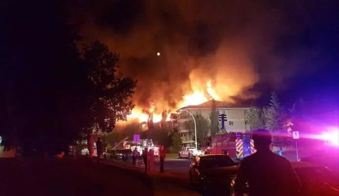
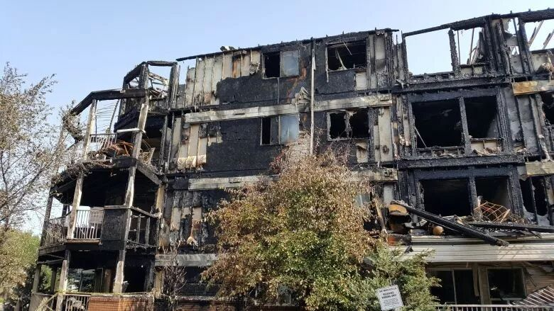
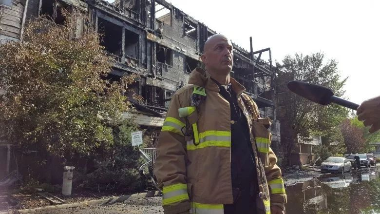
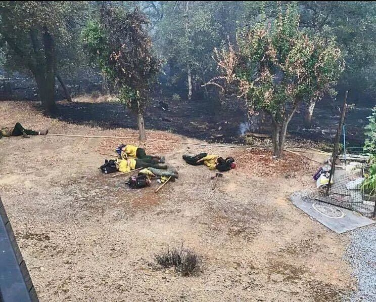
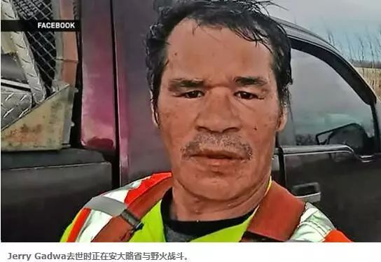
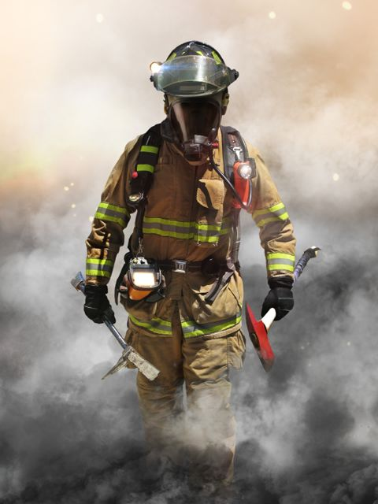

# 无标题

**链接地址:** http://mp.weixin.qq.com/s?__biz=MzI2NTE1ODgwOQ==&mid=2649604619&idx=1&sn=9507d120c46b2eb815ea08641ff7ed81&chksm=f2b8cbfdc5cf42eb37660675a85a503431b9f055f78f5e709fdb2259dd9fdd862a6222425db3&mpshare=1&scene=2&srcid=0731FvJyoxNjqQpV1UYbr3Qv#rd
**作者:** Nina Chen
**获取时间:** 2025/8/28 21:42:55
**图片数量:** 18

---

## 原始HTML内容

<section style=" max-width: 100%;box-sizing: border-box;color: rgb(51, 51, 51); ; ; ; ; ; ; ; ; ; ; ; ; ; ; ; ; "><section class="" powered-by="xiumi.us" style="max-width: 100%;box-sizing: border-box;overflow-wrap: break-word !important;"><section style="margin-top: 10px;margin-bottom: 10px;max-width: 100%;box-sizing: border-box;text-align: center;overflow-wrap: break-word !important;"><section style="max-width: 100%;box-sizing: border-box;width: 47.375px;vertical-align: middle;display: inline-block;overflow-wrap: break-word !important;"></section></section></section></section><section style=" padding-left: 10px;max-width: 100%;box-sizing: border-box;color: rgb(51, 51, 51); ; ; ; ; ; ; ; ; ; ; ; ; ; ; ; ; "><section class="" powered-by="xiumi.us" style="max-width: 100%;box-sizing: border-box;overflow-wrap: break-word !important;"><section style="margin-top: 20px;max-width: 100%;box-sizing: border-box;overflow-wrap: break-word !important;"><section style="max-width: 100%;box-sizing: border-box;text-align: center;font-size: 14px;overflow-wrap: break-word !important;">
请点击上方蓝色字体关注wo们哟~
</section></section></section></section>
 

 
<section style="box-sizing: border-box;"><section class="Powered-by-XIUMI V5" style="  box-sizing: border-box; " powered-by="xiumi.us"><section class="" style=" text-align: center;margin-top: 10px;margin-bottom: 10px; box-sizing: border-box; "><section class="" style="max-width: 100%;vertical-align: middle;display: inline-block;box-sizing: border-box;"></section></section></section><section class="Powered-by-XIUMI V5" style="  box-sizing: border-box; " powered-by="xiumi.us"><section class="" style="  box-sizing: border-box; "><section class="" style="letter-spacing: 0px;box-sizing: border-box;">
埃德蒙顿消防救援局（EFRS）周一（今天）表示，上周日早晨一场大火迫使数十人不得不离开他们的家园。周日<strong style="box-sizing: border-box;">凌晨1:45</strong>左右，埃德蒙顿市消防部门接到紧急报警电话称<strong style="box-sizing: border-box;">Blue Quill</strong>南埃德蒙顿附近的27 Avenue和115 Street附近的Monticello公寓楼突然燃起了大火。消防队在接到报警电话大约<strong style="box-sizing: border-box;">五分钟</strong>后到达现场展开救援工作，但滔天的火光瞬间将大楼吞噬，将黑夜映照成了白昼。
</section></section></section><section class="Powered-by-XIUMI V5" style="  box-sizing: border-box; " powered-by="xiumi.us"><section class="" style=" text-align: center;margin-top: 10px;margin-bottom: 10px; box-sizing: border-box; "><section class="" style="max-width: 100%;vertical-align: middle;display: inline-block;box-sizing: border-box;"></section></section></section><section class="Powered-by-XIUMI V5" style="  box-sizing: border-box; " powered-by="xiumi.us"><section class="" style="  box-sizing: border-box; "><section class="" style="box-sizing: border-box;">
在这次火灾中，多达<strong style="box-sizing: border-box;">90户</strong>的所有居民都被命令离开事发地点并被带到附近的学校里暂时避难，直到获得临时的住宿安置。在周一的媒体发布会上，一位发言人表示阿尔伯塔省红十字会正在帮助约<strong style="box-sizing: border-box;">30人</strong>提供紧急食品，衣物和住宿。根据报道有一人被送往医院。但目前没有关于此次事件的伤亡消息。
</section></section></section><section class="Powered-by-XIUMI V5" style="  box-sizing: border-box; " powered-by="xiumi.us"><section class="" style=" text-align: center;margin-top: 10px;margin-bottom: 10px; box-sizing: border-box; "><section class="" style="max-width: 100%;vertical-align: middle;display: inline-block;box-sizing: border-box;"></section></section></section><section class="Powered-by-XIUMI V5" style="  box-sizing: border-box; " powered-by="xiumi.us"><section class="" style="  box-sizing: border-box; "><section class="" style="box-sizing: border-box;">
消防队员在凌晨<strong style="box-sizing: border-box;">5:30</strong>之前控制了火势。根据消防调查人员的追踪，火灾发生在四楼的一间套房内。据估计，这次火灾引起的原因是一颗处理不当的<strong style="box-sizing: border-box;">香烟烟头</strong>。一名居民承认他在火灾的当晚在阳台上吸烟时不小心将未完全熄灭的烟头投进盆栽植物的花盆泥土中。此次火灾造成了总计<strong style="box-sizing: border-box;">1400万加币</strong>的直接经济损失，是埃德蒙顿2018年截至至今的第<strong style="box-sizing: border-box;">54场火灾</strong>。
</section></section></section><section class="Powered-by-XIUMI V5" style="  box-sizing: border-box; " powered-by="xiumi.us"><section class="" style=" text-align: center;margin-top: 10px;margin-bottom: 10px; box-sizing: border-box; "><section class="" style="max-width: 100%;vertical-align: middle;display: inline-block;box-sizing: border-box;"></section></section></section><section class="Powered-by-XIUMI V5" style="box-sizing: border-box;" powered-by="xiumi.us"><section class="" style="  box-sizing: border-box; "><section class="" style="text-align: justify;box-sizing: border-box;">
这个看似无心的疏忽给社会和人民造成了难以统计的损失与伤害。每年在铺天盖地的防火宣传下依然有些人不遵守法规从而酿成无法挽回的大祸。

 

但幸好，我们拥有这群可爱的人！

这群让这个埃德蒙顿为止感动的人！ 

让人民的生命和财产免于受到进一步的损害！ 

奋斗在救灾一线，用自己的生命去换取他人生命的安全！ 
</section></section></section><section class="Powered-by-XIUMI V5" style="  box-sizing: border-box; " powered-by="xiumi.us"><section class="" style=" text-align: center;margin-top: 10px;margin-bottom: 10px; box-sizing: border-box; "><section class="" style="max-width: 100%;vertical-align: middle;display: inline-block;box-sizing: border-box;"></section></section></section><section class="Powered-by-XIUMI V5" style="box-sizing: border-box;" powered-by="xiumi.us"><section class="" style="  box-sizing: border-box; "><section class="" style="text-align: justify;box-sizing: border-box;">
根据Shelbie Malin发送在Twitter上的信息，一位Blue Quill的居民在她的Facebook页面分享到：一队消防战士在火灾得到控制以后由于体力不支，倒在地上就睡着了。让人看了十分心疼。

 

这些用自己的生命安全去换取人民的生命安全的战士们，在数小时与火焰的搏斗中成功控制了火势！耗尽了自己的体力！

但此刻最应该受到拥戴的他们，

却连一个舒服的床位都没有！

甚至来不及喝上一口水。 

 

因为他们不知道，在多久的将来，又会有另一场火灾等着他们去扑灭。他们需要时刻准备着于火焰的搏斗，丝毫不敢松懈。
</section></section></section><section class="Powered-by-XIUMI V5" style="  box-sizing: border-box; " powered-by="xiumi.us"><section class="" style=" text-align: center;margin-top: 10px;margin-bottom: 10px; box-sizing: border-box; "><section class="" style="max-width: 100%;vertical-align: middle;display: inline-block;box-sizing: border-box;"></section></section></section><section class="Powered-by-XIUMI V5" style="box-sizing: border-box;" powered-by="xiumi.us"><section class="" style="  box-sizing: border-box; "><section class="" style="text-align: justify;box-sizing: border-box;">
就在三天前的7月27号，阿尔伯塔省Kehewin Cree First Nation的居民Jerry Gadwa在帮助安大略省Red Lake镇附近山林大火的消防工作中不幸逝世。
</section></section></section><section class="Powered-by-XIUMI V5" style="  box-sizing: border-box; " powered-by="xiumi.us"><section class="" style=" margin: 10px 0%; box-sizing: border-box; "><section class="" style="display: inline-block;width: 100%;vertical-align: top;letter-spacing: 0px;background-color: rgb(0, 0, 26);box-sizing: border-box;"><section class="Powered-by-XIUMI V5" style="  box-sizing: border-box; " powered-by="xiumi.us"><section class="" style=" text-align: center;margin-right: 0%;margin-bottom: 10px;margin-left: 0%; box-sizing: border-box; "><section class="" style="max-width: 100%;vertical-align: middle;display: inline-block;width: 100%;box-sizing: border-box;"></section></section></section><section class="Powered-by-XIUMI V5" style="  box-sizing: border-box; " powered-by="xiumi.us"><section class="" style=" margin-top: -40px;margin-right: 0%;margin-left: 0%; box-sizing: border-box; "><section class="" style="display: inline-block;width: 100%;vertical-align: top;padding: 15px;box-sizing: border-box;"><section class="Powered-by-XIUMI V5" style="box-sizing: border-box;" powered-by="xiumi.us"><section class="" style="  box-sizing: border-box; "><section class="" style="color: rgb(255, 255, 255);box-sizing: border-box;">
生命无常，明天和意外永远不 知道哪个会先来，愿逝者安息，生者珍惜。
</section></section></section><section class="Powered-by-XIUMI V5" style="  box-sizing: border-box; " powered-by="xiumi.us"><section class="" style=" margin-top: 10px;margin-right: 0%;margin-left: 0%; box-sizing: border-box; "><section class="" style="display: inline-block;vertical-align: bottom;width: 38.2%;padding-right: 10px;padding-left: 10px;box-sizing: border-box;"><section class="Powered-by-XIUMI V5" style="  box-sizing: border-box; " powered-by="xiumi.us"><section class="" style=" text-align: center;margin-right: 0%;margin-left: 0%; box-sizing: border-box; "><section class="" style="max-width: 100%;vertical-align: middle;display: inline-block;box-sizing: border-box;"></section></section></section></section><section class="" style="display: inline-block;vertical-align: bottom;width: 61.8%;box-sizing: border-box;"><section class="Powered-by-XIUMI V5" style="box-sizing: border-box;" powered-by="xiumi.us"><section class="" style="  box-sizing: border-box; "><section class="" style="text-align: center;color: rgb(255, 255, 255);font-size: 28px;box-sizing: border-box;">
Jerry Gadwa
</section></section></section><section class="Powered-by-XIUMI V5" style="box-sizing: border-box;" powered-by="xiumi.us"><section class="" style="  box-sizing: border-box; "><section class="" style="text-align: center;color: rgb(255, 255, 255);box-sizing: border-box;">
2018-07-27
</section></section></section><section class="Powered-by-XIUMI V5" style="box-sizing: border-box;" powered-by="xiumi.us"><section class="" style="  box-sizing: border-box; "><section class="" style="box-sizing: border-box;">
 
</section></section></section></section></section></section></section></section></section></section></section></section><section class="Powered-by-XIUMI V5" style="box-sizing: border-box;" powered-by="xiumi.us"><section class="" style="  box-sizing: border-box; "><section class="" style="text-align: justify;box-sizing: border-box;">
然而这样一个个令人伤痛的消息依然无法唤醒一些人的防火意识。消防员一直是和平年代最危险的战士，每年因公牺牲的消防员居所有兵种之首。除了救火之外，爆炸抢险、营救跳楼轻生者等危险系数极高的事件也在他们的出警范围内。

 

“你们是消防兵，每一分钟，就意味着生命”

“他们义无反顾的选择了牺牲自己这条最难走的路”

“从选择的那天开始，我们就必须至死守护，终身不悔”
</section></section></section><section class="Powered-by-XIUMI V5" style="  box-sizing: border-box; " powered-by="xiumi.us"><section class="" style=" text-align: center;margin-top: 10px;margin-bottom: 10px; box-sizing: border-box; "><section class="" style="max-width: 100%;vertical-align: middle;display: inline-block;box-sizing: border-box;"></section></section></section><section class="Powered-by-XIUMI V5" style="box-sizing: border-box;" powered-by="xiumi.us"><section class="" style="  box-sizing: border-box; "><section class="" style="box-sizing: border-box;">
每一次奔赴火灾现场，

都意味着可能是最后一次。

但他们依然毫不迟疑，冲锋在前！

 

在此，请允许我代表埃德蒙顿全体华人，像英勇拼搏在抗灾救火一线的消防战士们说一句：“你们辛苦了！”

 

感谢你们默默无闻的付出！

为埃德蒙顿的市民们创造出一个更安全的生活环境。

 

向你们，致敬！

 
</section></section></section><section class="Powered-by-XIUMI V5" style="  box-sizing: border-box; " powered-by="xiumi.us"><section class="" style=" text-align: right;margin-top: 10px;margin-right: 0%;margin-left: 0%; box-sizing: border-box; "><section class="" style="max-width: 100%;vertical-align: middle;display: inline-block;width: 100%;box-sizing: border-box;"></section></section></section><section class="Powered-by-XIUMI V5" style="box-sizing: border-box;" powered-by="xiumi.us"><section class="" style="  box-sizing: border-box; "><section class="" style="box-sizing: border-box;">
<strong style="box-sizing: border-box;">- END -</strong> 
</section></section></section><section class="Powered-by-XIUMI V5" style="box-sizing: border-box;" powered-by="xiumi.us"><section class="" style="  box-sizing: border-box; "><section class="" style="box-sizing: border-box;">
 
</section></section></section><section class="Powered-by-XIUMI V5" style="  box-sizing: border-box; " powered-by="xiumi.us"><section class="" style="  box-sizing: border-box; "><section class="" style="box-sizing: border-box;">
文章信息来源：Global News, CBC News, Twitter
</section></section></section></section>
 
<section class="" powered-by="xiumi.us" style=" max-width: 100%;box-sizing: border-box;color: rgb(51, 51, 51); ; ; ; ; ; ; ; ; ; ; ; ; ; ; ; ; "><section class="" style="margin-top: 0.5em;margin-bottom: 0.5em;max-width: 100%;box-sizing: border-box;overflow-wrap: break-word !important;"><section class="" style="max-width: 100%;box-sizing: border-box;background-color: rgb(160, 160, 160);height: 1px;overflow-wrap: break-word !important;"> </section></section></section><section class="" powered-by="xiumi.us" style=" max-width: 100%;box-sizing: border-box;color: rgb(51, 51, 51); ; ; ; ; ; ; ; ; ; ; ; ; ; ; ; ; "><section class="" style="max-width: 100%;box-sizing: border-box;overflow-wrap: break-word !important;"><section class="" style="max-width: 100%;box-sizing: border-box;font-size: 15px;line-height: 1.75;letter-spacing: 1px;overflow-wrap: break-word !important;">
 
</section></section></section><section class="" powered-by="xiumi.us" style=" max-width: 100%;box-sizing: border-box;color: rgb(51, 51, 51); ; ; ; ; ; ; ; ; ; ; ; ; ; ; ; ; "> </section>
 
<section class="" powered-by="xiumi.us" style=" max-width: 100%;box-sizing: border-box;color: rgb(51, 51, 51); ; ; ; ; ; ; ; ; ; ; ; ; ; ; ; ; "><section class="" style="margin-top: 40px;margin-bottom: 10px;max-width: 100%;box-sizing: border-box;overflow-wrap: break-word !important;"><section class="" style="padding: 10px;max-width: 100%;box-sizing: border-box;display: inline-block;width: 677px;border-width: 5px;border-style: double;border-color: rgb(247, 202, 201);border-radius: 2px;overflow-wrap: break-word !important;"><section class="" powered-by="xiumi.us" style="max-width: 100%;box-sizing: border-box;overflow-wrap: break-word !important;"><section class="" style="margin-top: -50px;max-width: 100%;box-sizing: border-box;transform: translate3d(20px, 0px, 0px);font-size: 11px;overflow-wrap: break-word !important;"><section class="" style="max-width: 100%;box-sizing: border-box;width: 7em;height: 7em;display: inline-block;vertical-align: bottom;border-radius: 100%;border-width: 4px;border-style: double;border-color: rgb(247, 202, 201);background-position: 44.1595% 45.455%;background-repeat: no-repeat;background-size: 137.143%;background-image: url(&quot;https://mmbiz.qpic.cn/mmbiz_jpg/D1nJqnhkPyJRiafSDlfM9XBdn8Pnndf1amAYn4s4BZH8A0fst7dW5hWfiaPWJDuUEKtKVeILMMpNkqgYZuLmQicJA/640?wx_fmt=jpeg&quot;);overflow-wrap: break-word !important;"><section class="" style="max-width: 100%;box-sizing: border-box;width: 69px;height: 69px;overflow: hidden;overflow-wrap: break-word !important;"></section></section></section></section><section class="" powered-by="xiumi.us" style="max-width: 100%;box-sizing: border-box;overflow-wrap: break-word !important;"><section class="" style="margin-top: -30px;margin-bottom: 30px;max-width: 100%;box-sizing: border-box;overflow-wrap: break-word !important;text-align: center;"><section class="" style="padding-right: 15px;padding-left: 15px;max-width: 100%;box-sizing: border-box;display: inline-block;vertical-align: top;width: 399.844px;overflow-wrap: break-word !important;"><section class="" powered-by="xiumi.us" style="max-width: 100%;box-sizing: border-box;overflow-wrap: break-word !important;"><section class="" style="margin-top: 40px;max-width: 100%;box-sizing: border-box;overflow-wrap: break-word !important;"><section class="" style="max-width: 100%;box-sizing: border-box;color: rgb(160, 160, 160);font-size: 14px;overflow-wrap: break-word !important;">
<strong style="max-width: 100%;box-sizing: border-box;overflow-wrap: break-word !important;">埃德蒙顿微生活</strong>

<strong style="max-width: 100%;box-sizing: border-box;overflow-wrap: break-word !important;">Life-of-Edmonton</strong>

&nbsp;爱埃德蒙顿的孩纸

&nbsp;都在这里~
</section></section></section></section><section class="" style="max-width: 100%;box-sizing: border-box;display: inline-block;vertical-align: top;width: 247.141px;overflow-wrap: break-word !important;"><section class="" powered-by="xiumi.us" style="max-width: 100%;box-sizing: border-box;overflow-wrap: break-word !important;"><section class="" style="margin-top: 10px;margin-bottom: 10px;max-width: 100%;box-sizing: border-box;text-align: center;overflow-wrap: break-word !important;"><section class="" style="max-width: 100%;box-sizing: border-box;vertical-align: middle;display: inline-block;width: 247.141px;overflow-wrap: break-word !important;overflow: hidden !important;"></section></section></section></section></section></section><section class="" powered-by="xiumi.us" style="max-width: 100%;box-sizing: border-box;overflow-wrap: break-word !important;"><section class="" style="margin-top: -30px;max-width: 100%;box-sizing: border-box;overflow-wrap: break-word !important;text-align: center;"><section class="" style="padding-right: 15px;padding-left: 15px;max-width: 100%;box-sizing: border-box;display: inline-block;vertical-align: top;width: 399.844px;overflow-wrap: break-word !important;"><section class="" powered-by="xiumi.us" style="max-width: 100%;box-sizing: border-box;overflow-wrap: break-word !important;"><section class="" style="max-width: 100%;box-sizing: border-box;transform: translate3d(5px, 0px, 0px);overflow-wrap: break-word !important;"><section class="" style="max-width: 100%;box-sizing: border-box;color: rgb(160, 160, 160);font-size: 14px;overflow-wrap: break-word !important;">
风里雨里 这里等你
</section></section></section></section><section class="" style="max-width: 100%;box-sizing: border-box;display: inline-block;vertical-align: top;width: 247.141px;overflow-wrap: break-word !important;"><section class="" powered-by="xiumi.us" style="max-width: 100%;box-sizing: border-box;overflow-wrap: break-word !important;"><section class="" style="max-width: 100%;box-sizing: border-box;transform: translate3d(10px, 0px, 0px);overflow-wrap: break-word !important;"><section class="" style="max-width: 100%;box-sizing: border-box;color: rgb(160, 160, 160);font-size: 14px;overflow-wrap: break-word !important;">
长按二维码关注
</section></section></section></section></section></section></section></section></section><section class="" powered-by="xiumi.us" style=" max-width: 100%;box-sizing: border-box;color: rgb(51, 51, 51); ; ; ; ; ; ; ; ; ; ; ; ; ; ; ; ; "><section class="" style="margin-top: 10px;margin-bottom: 10px;padding-right: 3px;padding-left: 3px;max-width: 100%;box-sizing: border-box;overflow-wrap: break-word !important;"><section class="" style="margin-top: 1.15em;max-width: 100%;box-sizing: border-box;display: inline-block;width: 671px;vertical-align: top;overflow-wrap: break-word !important;"><section style="max-width: 100%;box-sizing: border-box;width: 671px;overflow-wrap: break-word !important;"><section style="margin-top: -3px;max-width: 100%;box-sizing: border-box;width: 6px;height: 6px;border-radius: 100%;float: left;background-color: rgba(255, 255, 255, 0);overflow-wrap: break-word !important;"></section><section style="max-width: 100%;box-sizing: border-box;border-top: 1px solid rgb(174, 173, 173);width: 670.328px;overflow-wrap: break-word !important;"></section></section><section style="margin-top: -1.1em;max-width: 100%;box-sizing: border-box;text-align: right;overflow-wrap: break-word !important;"><section class="" style="padding: 3px 10px;max-width: 100%;box-sizing: border-box;display: inline-block;vertical-align: top;text-align: left;color: rgba(255, 175, 37, 0);overflow-wrap: break-word !important;">
请输入标题 &nbsp; &nbsp; bcdef
</section></section></section></section></section><section class="" powered-by="xiumi.us" style=" max-width: 100%;box-sizing: border-box;color: rgb(51, 51, 51); ; ; ; ; ; ; ; ; ; ; ; ; ; ; ; ; "><section class="" style="max-width: 100%;box-sizing: border-box;overflow-wrap: break-word !important;"><section class="" style="max-width: 100%;box-sizing: border-box;text-align: right;font-size: 14px;color: rgb(174, 173, 173);line-height: 1.7;overflow-wrap: break-word !important;">
埃德蒙顿微生活是“吃喝玩乐埃德蒙顿”旗下，为埃德蒙顿地区的居民提供每日最新的吃喝玩乐、工作学习、商业投资的媒体平台 。

关心埃德蒙顿民生，关注埃德蒙顿的发展。

我们的目标是以最新、最快、最及时的方式 报道埃德蒙顿的新鲜事 。

 
</section></section></section><section class="" powered-by="xiumi.us" style=" max-width: 100%;box-sizing: border-box;color: rgb(51, 51, 51); ; ; ; ; ; ; ; ; ; ; ; ; ; ; ; ; "><section class="" style="margin-top: -10px;padding-right: 3px;padding-left: 3px;max-width: 100%;box-sizing: border-box;overflow-wrap: break-word !important;"><section class="" style="margin-top: 0.95em;margin-bottom: -0.65em;max-width: 100%;box-sizing: border-box;display: inline-block;width: 671px;vertical-align: top;overflow-wrap: break-word !important;"><section style="max-width: 100%;box-sizing: border-box;width: 671px;overflow-wrap: break-word !important;"><section style="max-width: 100%;box-sizing: border-box;border-top: 1px solid rgb(174, 173, 173);width: 670.328px;float: left;overflow-wrap: break-word !important;"></section><section style="margin-top: -3px;max-width: 100%;box-sizing: border-box;width: 6px;height: 6px;border-radius: 100%;float: right;overflow-wrap: break-word !important;"></section></section><section class="" style="margin-top: -1em;padding: 3px 10px;max-width: 100%;box-sizing: border-box;display: inline-block;vertical-align: top;color: transparent;font-size: 14px;overflow-wrap: break-word !important;">
请输入标题 &nbsp; &nbsp; abcdefg
</section></section></section></section><section class="" powered-by="xiumi.us" style=" max-width: 100%;box-sizing: border-box;color: rgb(51, 51, 51); ; ; ; ; ; ; ; ; ; ; ; ; ; ; ; ; "><section class="" style="max-width: 100%;box-sizing: border-box;overflow-wrap: break-word !important;"><section class="" style="max-width: 100%;box-sizing: border-box;text-align: center;font-size: 13px;color: rgb(123, 150, 105);line-height: 2;overflow-wrap: break-word !important;">
 
<section class="" style="max-width: 100%;box-sizing: border-box;color: rgb(51, 51, 51);overflow-wrap: break-word !important;"><section class="" style="margin-right: 3px;padding-right: 6px;padding-left: 6px;max-width: 100%;box-sizing: border-box;display: inline-block;vertical-align: top;border-radius: 3px 3px 0px 0px;background-color: rgb(135, 198, 197);color: rgb(255, 255, 255);overflow-wrap: break-word !important;">
往期精选
</section></section><section class="" powered-by="xiumi.us" style="max-width: 100%;box-sizing: border-box;color: rgb(51, 51, 51);overflow-wrap: break-word !important;"><section class="" style="margin-top: 10px;margin-bottom: 10px;max-width: 100%;box-sizing: border-box;overflow-wrap: break-word !important;"><section class="" style="margin-top: -2px;max-width: 100%;box-sizing: border-box;width: 677px;font-size: 0px;overflow-wrap: break-word !important;"><section style="margin-right: -6px;max-width: 100%;box-sizing: border-box;display: inline-block;vertical-align: top;width: 677px;border-bottom: 2px solid rgb(135, 198, 197);overflow-wrap: break-word !important;"></section><section style="margin-top: -2px;max-width: 100%;box-sizing: border-box;display: inline-block;vertical-align: top;width: 6px;height: 6px;border-radius: 50%;background-color: rgb(135, 198, 197);overflow-wrap: break-word !important;"></section></section></section></section><section class="" powered-by="xiumi.us" style="max-width: 100%;box-sizing: border-box;color: rgb(51, 51, 51);overflow-wrap: break-word !important;"><section class="" style="margin-top: 10px;margin-bottom: 10px;max-width: 100%;box-sizing: border-box;overflow-wrap: break-word !important;"><section class="" style="padding: 30px;max-width: 100%;box-sizing: border-box;display: inline-block;width: 677px;vertical-align: top;background-image: url(&quot;https://mmbiz.qpic.cn/mmbiz_jpg/D1nJqnhkPyKicVcUjHQDrCoGtFf7JduKTI51P554icxBDRVibxWdvib8uN4tw8kFVn1wLibCZQ4Bia46rolnJ68tw8NQ/640?wx_fmt=jpeg&quot;);background-position: -82.1054% 59.5119%;background-repeat: repeat;background-size: 100.637%;background-attachment: scroll;overflow-wrap: break-word !important;"><section class="" powered-by="xiumi.us" style="max-width: 100%;box-sizing: border-box;overflow-wrap: break-word !important;"><section class="" style="max-width: 100%;box-sizing: border-box;overflow-wrap: break-word !important;"><section class="" style="padding: 10px;max-width: 100%;box-sizing: border-box;display: inline-block;width: 617px;vertical-align: top;background-color: rgba(115, 215, 218, 0.37);border-width: 0px;border-radius: 0px;border-style: none;border-color: rgb(62, 62, 62);overflow-wrap: break-word !important;"><section class="" powered-by="xiumi.us" style="max-width: 100%;box-sizing: border-box;overflow-wrap: break-word !important;"><section class="" style="max-width: 100%;box-sizing: border-box;overflow-wrap: break-word !important;"><section class="" style="max-width: 100%;box-sizing: border-box;color: rgb(255, 255, 255);overflow-wrap: break-word !important;">
<a href="http://mp.weixin.qq.com/s?__biz=MzI2NTE1ODgwOQ==&amp;mid=2649604299&amp;idx=1&amp;sn=1f37f8fdbfdb14cdb708486a41fe72e9&amp;chksm=f2b8c93dc5cf402b14c901b7bdbd3b8961fd24593ecff80bfa5a2cbf66bfb8e0c3e31ca3220a&amp;scene=21#wechat_redirect" target="_blank" style="color: rgb(255, 255, 255);text-decoration: underline;-webkit-tap-highlight-color: rgba(0, 0, 0, 0);max-width: 100%;box-sizing: border-box !important;overflow-wrap: break-word !important;"><strong style="max-width: 100%;box-sizing: border-box !important;overflow-wrap: break-word !important;">埃德蒙顿周边最美露营地推荐</strong></a>
</section></section></section></section></section></section></section></section></section><section class="" powered-by="xiumi.us" style="max-width: 100%;box-sizing: border-box;color: rgb(51, 51, 51);overflow-wrap: break-word !important;"><section class="" style="margin-top: 10px;margin-bottom: 10px;max-width: 100%;box-sizing: border-box;overflow-wrap: break-word !important;"><section class="" style="padding: 30px;max-width: 100%;box-sizing: border-box;display: inline-block;width: 677px;vertical-align: top;background-image: url(&quot;https://mmbiz.qpic.cn/mmbiz_jpg/D1nJqnhkPyKicVcUjHQDrCoGtFf7JduKTn7jIIuqh1OOFVibiadqfpY6ibzsfSgqdQ7Zk8UHutsH1VoThluFunY7jA/640?wx_fmt=jpeg&quot;);background-position: 55.6015% 57.6974%;background-repeat: repeat;background-size: 100.637%;background-attachment: scroll;overflow-wrap: break-word !important;"><section class="" powered-by="xiumi.us" style="max-width: 100%;box-sizing: border-box;overflow-wrap: break-word !important;"><section class="" style="max-width: 100%;box-sizing: border-box;overflow-wrap: break-word !important;"><section class="" style="padding: 10px;max-width: 100%;box-sizing: border-box;display: inline-block;width: 617px;vertical-align: top;background-color: rgba(115, 215, 218, 0.37);border-width: 0px;border-radius: 0px;border-style: none;border-color: rgb(62, 62, 62);overflow-wrap: break-word !important;"><section class="" powered-by="xiumi.us" style="max-width: 100%;box-sizing: border-box;overflow-wrap: break-word !important;"><section class="" style="max-width: 100%;box-sizing: border-box;overflow-wrap: break-word !important;"><section class="" style="max-width: 100%;box-sizing: border-box;color: rgb(255, 255, 255);overflow-wrap: break-word !important;">
<a href="http://mp.weixin.qq.com/s?__biz=MzI2NTE1ODgwOQ==&amp;mid=2649604426&amp;idx=1&amp;sn=5ac39e127bf9d7fe25f5db0c4adfe620&amp;chksm=f2b8c8bcc5cf41aa0c262204a04e2d7020a12db7b41cb5b2a205521e1a38ea1d2853b8ea97fb&amp;scene=21#wechat_redirect" target="_blank" style="color: rgb(255, 255, 255);text-decoration: underline;-webkit-tap-highlight-color: rgba(0, 0, 0, 0);max-width: 100%;box-sizing: border-box !important;overflow-wrap: break-word !important;"><strong style="max-width: 100%;box-sizing: border-box !important;overflow-wrap: break-word !important;">埃德蒙顿最值得去Hiking Trail一览</strong></a>
</section></section></section></section></section></section></section></section></section><section style="max-width: 100%;box-sizing: border-box;color: rgb(51, 51, 51);overflow-wrap: break-word !important;"><section class="" powered-by="xiumi.us" style="max-width: 100%;box-sizing: border-box;overflow-wrap: break-word !important;"><section class="" style="margin-top: 10px;margin-bottom: 10px;max-width: 100%;box-sizing: border-box;overflow-wrap: break-word !important;"><section class="" style="padding: 30px;max-width: 100%;box-sizing: border-box;display: inline-block;width: 677px;vertical-align: top;background-position: 9.6992% 63.2492%;background-repeat: repeat;background-size: 100.637%;background-attachment: scroll;background-image: url(&quot;https://mmbiz.qpic.cn/mmbiz_jpg/D1nJqnhkPyLpVtnm2bVz9uK2l7zL93wzLHIdxZvDdSetyFic5rB1h772MwricbN1AHIF55NfVOvWnTib05MvYex5Q/640?wx_fmt=jpeg&quot;);overflow-wrap: break-word !important;"><section class="" powered-by="xiumi.us" style="max-width: 100%;box-sizing: border-box;overflow-wrap: break-word !important;"><section class="" style="max-width: 100%;box-sizing: border-box;overflow-wrap: break-word !important;"><section class="" style="padding: 10px;max-width: 100%;box-sizing: border-box;display: inline-block;width: 617px;vertical-align: top;background-color: rgba(115, 215, 218, 0.37);border-width: 0px;border-radius: 0px;border-style: none;border-color: rgb(62, 62, 62);overflow-wrap: break-word !important;"><section class="" powered-by="xiumi.us" style="max-width: 100%;box-sizing: border-box;overflow-wrap: break-word !important;"><section class="" style="max-width: 100%;box-sizing: border-box;overflow-wrap: break-word !important;"><section class="" style="max-width: 100%;box-sizing: border-box;color: rgb(255, 255, 255);overflow-wrap: break-word !important;">
<strong style="max-width: 100%;box-sizing: border-box !important;overflow-wrap: break-word !important;"><a href="http://mp.weixin.qq.com/s?__biz=MzI2NTE1ODgwOQ==&amp;mid=2649604455&amp;idx=1&amp;sn=2dcb46a6e34118d67104f086fc7c0f7b&amp;chksm=f2b8c891c5cf418771cbdd8634999b88a8b46025dc9bf0f7cd5e9720523ba19141b59e904eff&amp;scene=21#wechat_redirect" target="_blank" style="color: rgb(255, 255, 255);-webkit-tap-highlight-color: rgba(0, 0, 0, 0);max-width: 100%;box-sizing: border-box !important;overflow-wrap: break-word !important;">埃德蒙顿夏日活动特辑（一</a>）</strong>
</section></section></section></section></section></section></section></section></section></section><section style="max-width: 100%;box-sizing: border-box;color: rgb(51, 51, 51);overflow-wrap: break-word !important;"><section class="" powered-by="xiumi.us" style="max-width: 100%;box-sizing: border-box;overflow-wrap: break-word !important;"><section class="" style="margin-top: 10px;margin-bottom: 10px;max-width: 100%;box-sizing: border-box;overflow-wrap: break-word !important;"><section class="" style="padding: 30px;max-width: 100%;box-sizing: border-box;display: inline-block;width: 677px;vertical-align: top;background-position: -36.2029% 25.1424%;background-repeat: repeat;background-size: 100.637%;background-attachment: scroll;background-image: url(&quot;https://mmbiz.qpic.cn/mmbiz_jpg/D1nJqnhkPyLKjicic9OqrHXSx8MnMT02tPY83XGDAAqBP7MCibxlb1fW0Z1ibs6aJ0PkCYDtUUgGYeSQlB8o5WEdVg/640?wx_fmt=jpeg&quot;);overflow-wrap: break-word !important;"><section class="" powered-by="xiumi.us" style="max-width: 100%;box-sizing: border-box;overflow-wrap: break-word !important;"><section class="" style="max-width: 100%;box-sizing: border-box;overflow-wrap: break-word !important;"><section class="" style="padding: 10px;max-width: 100%;box-sizing: border-box;display: inline-block;width: 617px;vertical-align: top;background-color: rgba(115, 215, 218, 0.37);border-width: 0px;border-radius: 0px;border-style: none;border-color: rgb(62, 62, 62);overflow-wrap: break-word !important;"><section class="" powered-by="xiumi.us" style="max-width: 100%;box-sizing: border-box;overflow-wrap: break-word !important;"><section class="" style="max-width: 100%;box-sizing: border-box;overflow-wrap: break-word !important;"><section class="" style="max-width: 100%;box-sizing: border-box;color: rgb(255, 255, 255);overflow-wrap: break-word !important;">
<a href="http://mp.weixin.qq.com/s?__biz=MzI2NTE1ODgwOQ==&amp;mid=2649604494&amp;idx=1&amp;sn=9b0c9f4cddc39702fe861ff8c775aae6&amp;chksm=f2b8c878c5cf416e5d5548b6a96ebdc8ae23fb9104ccca60da52f750fb782e54234f3519786f&amp;scene=21#wechat_redirect" target="_blank" style="color: rgb(255, 255, 255);text-decoration: underline;-webkit-tap-highlight-color: rgba(0, 0, 0, 0);max-width: 100%;box-sizing: border-box !important;overflow-wrap: break-word !important;"><strong style="max-width: 100%;box-sizing: border-box;overflow-wrap: break-word !important;">埃德蒙顿2018露天电影大盘点</strong></a>
</section></section></section></section></section></section></section></section></section></section></section></section></section>
 

---

## 纯文本内容

请点击上方蓝色字体关注wo们哟~埃德蒙顿消防救援局（EFRS）周一（今天）表示，上周日早晨一场大火迫使数十人不得不离开他们的家园。周日凌晨1:45左右，埃德蒙顿市消防部门接到紧急报警电话称Blue Quill南埃德蒙顿附近的27 Avenue和115 Street附近的Monticello公寓楼突然燃起了大火。消防队在接到报警电话大约五分钟后到达现场展开救援工作，但滔天的火光瞬间将大楼吞噬，将黑夜映照成了白昼。在这次火灾中，多达90户的所有居民都被命令离开事发地点并被带到附近的学校里暂时避难，直到获得临时的住宿安置。在周一的媒体发布会上，一位发言人表示阿尔伯塔省红十字会正在帮助约30人提供紧急食品，衣物和住宿。根据报道有一人被送往医院。但目前没有关于此次事件的伤亡消息。消防队员在凌晨5:30之前控制了火势。根据消防调查人员的追踪，火灾发生在四楼的一间套房内。据估计，这次火灾引起的原因是一颗处理不当的香烟烟头。一名居民承认他在火灾的当晚在阳台上吸烟时不小心将未完全熄灭的烟头投进盆栽植物的花盆泥土中。此次火灾造成了总计1400万加币的直接经济损失，是埃德蒙顿2018年截至至今的第54场火灾。这个看似无心的疏忽给社会和人民造成了难以统计的损失与伤害。每年在铺天盖地的防火宣传下依然有些人不遵守法规从而酿成无法挽回的大祸。但幸好，我们拥有这群可爱的人！这群让这个埃德蒙顿为止感动的人！让人民的生命和财产免于受到进一步的损害！奋斗在救灾一线，用自己的生命去换取他人生命的安全！根据Shelbie Malin发送在Twitter上的信息，一位Blue Quill的居民在她的Facebook页面分享到：一队消防战士在火灾得到控制以后由于体力不支，倒在地上就睡着了。让人看了十分心疼。这些用自己的生命安全去换取人民的生命安全的战士们，在数小时与火焰的搏斗中成功控制了火势！耗尽了自己的体力！但此刻最应该受到拥戴的他们，却连一个舒服的床位都没有！甚至来不及喝上一口水。因为他们不知道，在多久的将来，又会有另一场火灾等着他们去扑灭。他们需要时刻准备着于火焰的搏斗，丝毫不敢松懈。就在三天前的7月27号，阿尔伯塔省Kehewin Cree First Nation的居民Jerry Gadwa在帮助安大略省Red Lake镇附近山林大火的消防工作中不幸逝世。生命无常，明天和意外永远不 知道哪个会先来，愿逝者安息，生者珍惜。Jerry Gadwa2018-07-27然而这样一个个令人伤痛的消息依然无法唤醒一些人的防火意识。消防员一直是和平年代最危险的战士，每年因公牺牲的消防员居所有兵种之首。除了救火之外，爆炸抢险、营救跳楼轻生者等危险系数极高的事件也在他们的出警范围内。“你们是消防兵，每一分钟，就意味着生命”“他们义无反顾的选择了牺牲自己这条最难走的路”“从选择的那天开始，我们就必须至死守护，终身不悔”每一次奔赴火灾现场，都意味着可能是最后一次。但他们依然毫不迟疑，冲锋在前！在此，请允许我代表埃德蒙顿全体华人，像英勇拼搏在抗灾救火一线的消防战士们说一句：“你们辛苦了！”感谢你们默默无闻的付出！为埃德蒙顿的市民们创造出一个更安全的生活环境。向你们，致敬！- END -文章信息来源：Global News, CBC News, Twitter埃德蒙顿微生活Life-of-Edmonton 爱埃德蒙顿的孩纸 都在这里~风里雨里 这里等你长按二维码关注请输入标题     bcdef埃德蒙顿微生活是“吃喝玩乐埃德蒙顿”旗下，为埃德蒙顿地区的居民提供每日最新的吃喝玩乐、工作学习、商业投资的媒体平台 。关心埃德蒙顿民生，关注埃德蒙顿的发展。我们的目标是以最新、最快、最及时的方式 报道埃德蒙顿的新鲜事 。请输入标题     abcdefg往期精选埃德蒙顿周边最美露营地推荐埃德蒙顿最值得去Hiking Trail一览埃德蒙顿夏日活动特辑（一）埃德蒙顿2018露天电影大盘点

---

## 图片列表

-  (原始链接: https://mmbiz.qpic.cn/mmbiz_gif/tFTvGOckV9UgvvAtaEnVbGIx6kDf4ia5fR3kYLmwrU0h5wtPu3R5SEicVeXMB7G6vXqyib6x6KOvDqeRDG5L04X2A/640?wx_fmt=gif)
-  (原始链接: https://mmbiz.qpic.cn/mmbiz_jpg/mZIpZ2dRo6ZVoJhUecmkegkWqzRmL9rPG0o5dC4A2b2rmKExo9cF7qY7zZ8iapWicrE102u46qXAgBN661mHscUQ/640?wx_fmt=jpeg)
-  (原始链接: https://mmbiz.qpic.cn/mmbiz_jpg/D1nJqnhkPyJT4U32Y548Hw5aBlviccaDpkfNVYF9uRyc8DkjQYVxHibVjQqeC0eFuWFl7ndQqvSrQu6yx3XXefhg/640?wx_fmt=jpeg)
-  (原始链接: https://mmbiz.qpic.cn/mmbiz_jpg/D1nJqnhkPyJMnbYWl1jibuWOJhwEH9ALftJic1p4AOTYRM288ia0RibgNzECAWsU2VghE4oe7ibX1P86O43YhlJ9BZg/640?wx_fmt=jpeg)
-  (原始链接: https://mmbiz.qpic.cn/mmbiz_jpg/mZIpZ2dRo6bEGJj3ZeL7Xib1XedXSCvicUVee9QebibGnDy0Y1boHullFBNgiav980nlGWyCuuaZ6lSlcxQEnuXm5A/640?wx_fmt=jpeg)
-  (原始链接: https://mmbiz.qpic.cn/mmbiz_jpg/D1nJqnhkPyIzGAnGZDsnMBEd39f2os0cbKO9ticVia41W7mELtCiaia7hVxmJg27zib2YGuleHjLfa0OibXN0h559URQ/640?wx_fmt=jpeg)
-  (原始链接: https://mmbiz.qpic.cn/mmbiz_jpg/D1nJqnhkPyIzGAnGZDsnMBEd39f2os0cLIBtQibfsheYGQ75CO0sWATXicxeibXARViaxs03Fl6UV8rETHPwUKpMcw/640?wx_fmt=jpeg)
-  (原始链接: https://mmbiz.qpic.cn/mmbiz_jpg/D1nJqnhkPyIzGAnGZDsnMBEd39f2os0ccFtxLfmedUiagRHzsS1ozxs8jmEfjE54OK3UN66qFaVwYJzibeS1eLAQ/640?wx_fmt=jpeg)
-  (原始链接: https://mmbiz.qpic.cn/mmbiz_jpg/D1nJqnhkPyIzGAnGZDsnMBEd39f2os0c9MOWjfUITeXWYDbA8vZfr1qw6YPacJC1PTQmYYFAU78Q131MZNVtibg/640?wx_fmt=jpeg)
-  (原始链接: https://mmbiz.qpic.cn/mmbiz_jpg/D1nJqnhkPyIzGAnGZDsnMBEd39f2os0ckNZaCRQM3VZPv2iaJ0PiboDD32AkUG9icWtibxEeO3Amg0e7PalUDu1MaA/640?wx_fmt=jpeg)
-  (原始链接: https://mmbiz.qpic.cn/mmbiz_jpg/D1nJqnhkPyIzGAnGZDsnMBEd39f2os0cnabiaiavtQ4cHJXErGOib9smyURFedibHiabtibsmiaaL7rGiaQuQ3PDcn087A/640?wx_fmt=jpeg)
-  (原始链接: https://mmbiz.qpic.cn/mmbiz_gif/D1nJqnhkPyIzGAnGZDsnMBEd39f2os0cbQKPAchiazRMoEsIfSlLMdwcd0kw2mScy97iahuVqicwsVnnm90AQRxRw/640?wx_fmt=gif)
-  (原始链接: https://mmbiz.qpic.cn/mmbiz_gif/D1nJqnhkPyIzGAnGZDsnMBEd39f2os0cxbp2Nj7dOSz1ibYyVUq3RefvQYlXlDeqhFzPzg8Mn1qKFrsrBURYl5w/640?wx_fmt=gif)
-  (原始链接: https://mmbiz.qpic.cn/mmbiz_png/D1nJqnhkPyIzGAnGZDsnMBEd39f2os0cvrdLlYEwR9fDGuO2AxM4OqwSu6zgORibCxOuHjrFdicandicibWYkOA1lA/640?wx_fmt=png)
-  (原始链接: https://mmbiz.qpic.cn/mmbiz_png/D1nJqnhkPyIzGAnGZDsnMBEd39f2os0cicPyeMnhxI8sjnOed29vYqHmibZy2ibYicVdVcjRaG7JMib20nzpNlx05sA/640?wx_fmt=png)
-  (原始链接: https://mmbiz.qpic.cn/mmbiz_jpg/D1nJqnhkPyJRiafSDlfM9XBdn8Pnndf1amAYn4s4BZH8A0fst7dW5hWfiaPWJDuUEKtKVeILMMpNkqgYZuLmQicJA/640?wx_fmt=jpeg)
-  (原始链接: https://mmbiz.qpic.cn/mmbiz_png/D1nJqnhkPyJRiafSDlfM9XBdn8Pnndf1ac0VWQYWT51iapxu3kZm8xOxXL1ibfHBUjsLECAKacoRR59Z1HFp0ia27g/640?wx_fmt=png)
-  (原始链接: https://mmbiz.qpic.cn/mmbiz_png/zRPvtPY61ybKSAM3GvUdhqIZVZLBmD6fmHdINssUJOKntLrBHas2UTJ57evicEmkwnzwcibajibwF4PcdDSOsIZew/640?)
