# 无标题

**链接地址:** http://mp.weixin.qq.com/s?__biz=MzI5NDMzNzM3OQ==&mid=2247487639&idx=6&sn=41170547da36dd5cb5ebaed5adbe4b29&chksm=ec653e9bdb12b78d7a930a218268329b49327683ac4764a290d79f2ecf89c5a217a615123bb9&mpshare=1&scene=2&srcid=0810g1exvGbEjpj8Ayu9tRQb#rd
**作者:** 
**获取时间:** 2025/8/28 21:41:43
**图片数量:** 27

---

## 原始HTML内容

<section class="" style="max-width: 100%;color: rgb(51, 51, 51);">&nbsp;<section class="" ng-click="onClick($event)" ng-model="eo.text" ng-style=" {
  'font-size'   : eo.fontSize,
  'font-family' : eo.fontFamily,
  'font-style'  : eo.fontStyle,
  'color'       : (eo.color || theme.majorColor),
} " placeholder="{ 点击编辑 }" stop-propagation="click mousedown mouseup" tn-edit-content="true" tn-page-editable="text0" tn-page-editable-type="ed-type-text" ui-on-drop="block($event)" style="margin-top: 0.7em;margin-left: -0.4em;padding: 1em;max-width: 100%;border-radius: 1em;width: 510.25px;color: inherit;font-family: inherit;font-size: 1em;display: inline-block;background-color: rgb(250, 200, 255);box-sizing: border-box !important;word-wrap: break-word !important;">&nbsp;&nbsp;&nbsp;吃喝玩乐卡尔加里YYC&nbsp;最近要大送豪礼，包括苹果 iPhone X！</section></section>
 
<section class="" style="max-width: 100%;color: rgb(51, 51, 51);"><section class="" ng-click="onClick($event)" ng-model="eo.text" ng-style=" {
  'font-size'   : eo.fontSize,
  'font-family' : eo.fontFamily,
  'font-style'  : eo.fontStyle,
  'color'       : (eo.color || theme.majorColor),
} " placeholder="{ 点击编辑 }" stop-propagation="click mousedown mouseup" tn-edit-content="true" tn-page-editable="text0" tn-page-editable-type="ed-type-text" ui-on-drop="block($event)" style="margin-top: 0.7em;margin-right: -0.4em;padding: 1em;max-width: 100%;border-radius: 1em;width: 510.25px;color: inherit;font-family: inherit;font-size: 1em;display: inline-block;background-color: rgb(188, 227, 249);box-sizing: border-box !important;word-wrap: break-word !important;">没错没错，记得『点击蓝字加关注』哟！机会随时到来！</section>&nbsp;&nbsp;</section><section class="" style="margin-top: 0.8em;margin-bottom: 0.5em;max-width: 100%;color: rgb(51, 51, 51);">
 
</section><section style="max-width: 100%;color: rgb(51, 51, 51);">真心实意，为您推荐！</section><section style="max-width: 100%;color: rgb(51, 51, 51);"> </section>

 

来源：带你游遍英国 ID：weloveuk

 
<section class="" data-tools="135编辑器" data-id="90196" style="max-width: 100%;color: rgb(62, 62, 62);"><section style="max-width: 100%;box-sizing: border-box !important;word-wrap: break-word !important;">
当年美式快餐店最初准备打入亚洲市场时，曾经在调查研究中发现了这么一个问题：

 

<strong style="max-width: 100%;box-sizing: border-box !important;word-wrap: break-word !important;">东亚地区的消费者更倾向于传统饮食文化，以快速提供餐食为特色的美式快餐店似乎难以在此立足，</strong>

 

于是后来，这些餐饮巨头在亚洲实施了有别于欧美市场的运作模式，主动把快餐店打造为供顾客休闲的空间，

 

在当时新兴的这种空间消费策略下，美式快餐店如愿地迅速占领了亚洲市场...

 

 

作为这类快餐店其中之一的麦当劳在后来又发现：亚洲人在其店里消费的不仅是食物，更重视的是消费干净整洁又舒适的空间，因此亚洲消费者在店里的逗留时间普遍比欧美的长， 

 

当时，得知这一现象的麦当劳选择借此创造出良好的公众形象，他们采取的策略是：

 

不仅不会驱赶那些店内消费很少（甚至是没有消费）而且占用时间很长的人士，还尽量为这些顾客提供私人空间，

 

<strong style="max-width: 100%;box-sizing: border-box !important;word-wrap: break-word !important;">长此以往，东亚的一些露宿者们开始把24小时营业还不会赶人的麦当劳当作长期的寄宿地，于是便慢慢形成了一种独特的人群，也就是媒体所称的——“McRefugees”（麦难民）...</strong>

 

 

所谓的麦难民，他们一般在凌晨时分左右陆续进入麦当劳，

 

 

他们有的会随身带上一些可以盖在身上防寒的衣物，以及能放在桌上趴靠的“枕头”， 

 

 

有的则直接靠在座椅上，

 

 

或者以双手为枕，趴在桌上休息，

 

 

由于太过疲倦，就连随身携带的贵重物品可能也毫不设防，

 

 

这样的人群逐渐出现在日本，韩国以及新加坡等地方，而且人数越来越多，

 

但要论“麦难民”现象泛滥的地区，香港地区绝对是排在前列中的一个，

 

根据国际青少年商会（JCI）的调查显示：<strong style="max-width: 100%;box-sizing: border-box !important;word-wrap: break-word !important;">在今年6月至7月期间共有334名“麦难民”在香港各家麦当劳中寄宿，相较于2013年的57名有了大幅度的增长！ </strong>

 

无家可归者的数量在短短五年时间内增加了如此之多，主要还是得归责于香港的经济适用房过少、租金过高以及不够完善的社会福利系统，

 

其中失业及就业不足是影响人们支付租金能力的两大因素：就业岗位的不稳定性导致了他们无法获得稳定的薪资，这就意味着他们难以承诺按时支付租金，

 

一名香港“麦难民”Kong Ho-man表示：<strong style="max-width: 100%;box-sizing: border-box !important;word-wrap: break-word !important;">“有时候是因为我无法提供地址证明，所以无法获得稳定的工作。”</strong>

<strong style="max-width: 100%;box-sizing: border-box !important;word-wrap: break-word !important;"> </strong>

<strong style="max-width: 100%;box-sizing: border-box !important;word-wrap: break-word !important;">没有稳定的工作便几乎无法支付房租，没有住址证明又难以获得稳定的工作，这就变成了一个可怕的恶性循环...</strong>

 

 

香港一位60岁的“麦难民”梁炳泉表示：<strong style="max-width: 100%;box-sizing: border-box !important;word-wrap: break-word !important;">“我现在每月赚到的钱只够吃饭，甚至有时候不够钱我每天只能吃一顿，房子根本想都不敢想， </strong>

<strong style="max-width: 100%;box-sizing: border-box !important;word-wrap: break-word !important;"> </strong>

<strong style="max-width: 100%;box-sizing: border-box !important;word-wrap: break-word !important;">不是我不想有更稳定更好的工作，而是我在年龄和健康方面已经没那个条件了。”</strong>

<strong style="max-width: 100%;box-sizing: border-box !important;word-wrap: break-word !important;"> </strong>

根据政府数据透露，香港的贫穷率直到去年11月时已经达到19.9％，创下了自2009年来的新高...

 

 

一些“麦难民”在申请社会救助福利房屋，经过面临漫长的等待后却仍然无果，

 

香港深水埗的Sam就是其中一位：<strong style="max-width: 100%;box-sizing: border-box !important;word-wrap: break-word !important;">“政府说我们需要等待三年，但到现在我已经等了四五年了。”</strong>

 

无家可归者们可以获得的最佳帮助是申请全面的社会保障援助（CSSA），但这也至少需要309天的时间进行处理...

 

 

曾在2015年10月时，一名50-60岁的女性“麦难民”被发现死于九龙湾坪石村的麦当劳内， 

 

由于麦当劳的员工不会轻易打扰顾客们的休息，周围的顾客也不会太过注意陌生人的情况，

 

所以直到24小时后她才被发现死亡，由麦当劳员工报警通知警方过来处理...

 

对此麦当劳方面在事后发表了声明：<strong style="max-width: 100%;box-sizing: border-box !important;word-wrap: break-word !important;">“我们欢迎各界人士随时访问我们的餐厅，之后也会更加关注店里顾客的状况。”</strong>

<strong style="max-width: 100%;box-sizing: border-box !important;word-wrap: break-word !important;"> </strong>

这位“麦难民”的死亡也引起了政府及救助机构的重视，但无奈香港的社会经济适用房分配现状依然难以改变... 

 

 

 

要说的是，

 

这些“麦难民”里，有很大一部分是有着全职或兼职工作的，甚至有一部分还是租住着房子的，并不算真正意义上的“难民”，

 

但他们之所以会寄宿于麦当劳，是因为除了房租之外，他们还要考虑电费及交通费用等支出...

 

根据对香港“麦难民”的采访及调查发现，有一位男性是因为他的公共住房没有能让空气对流的窗口，到了夏天过于闷热却又负担不起昂贵的电费，因此寄宿在了麦当劳，

 

还有一位“麦难民”吴先生则表示自己是因为噪音而寄宿于麦当劳：

 

<strong style="max-width: 100%;box-sizing: border-box !important;word-wrap: break-word !important;">“我的家就在马路对面，但由于我的邻居非常吵，过去五年我都无法安然入睡，</strong>

<strong style="max-width: 100%;box-sizing: border-box !important;word-wrap: break-word !important;"> </strong>

<strong style="max-width: 100%;box-sizing: border-box !important;word-wrap: break-word !important;">在被折磨了这么多年后，即使我现在睡五个小时左右也会被头疼疼醒。</strong>

<strong style="max-width: 100%;box-sizing: border-box !important;word-wrap: break-word !important;"> </strong>

<strong style="max-width: 100%;box-sizing: border-box !important;word-wrap: break-word !important;">最开始的时候我试过用耳塞来阻挡噪音，但后来因为把它们推进耳道太深导致感染发炎了，</strong>

<strong style="max-width: 100%;box-sizing: border-box !important;word-wrap: break-word !important;"> </strong>

<strong style="max-width: 100%;box-sizing: border-box !important;word-wrap: break-word !important;">现在终于找到了麦当劳这个暂时的寄宿点，真的是谢天谢地了。”</strong>

<strong style="max-width: 100%;box-sizing: border-box !important;word-wrap: break-word !important;"> </strong>

<strong style="max-width: 100%;box-sizing: border-box !important;word-wrap: break-word !important;"></strong> 

除此之外，还有一些民众成为“麦难民”的理由更为让人心疼， 

 

一位年轻的建筑工人由于和家里人关系不好，寄宿于麦当劳，

 

另一名55岁的女性则是因为害怕家中经常虐待她的丈夫，所以选择了对于她来说更加“安全”的麦当劳，

 

还有一位没有孩子的老年妇女是因为在丈夫去世后孤独难耐，选择在麦当劳与其他“麦难民”一起度过漫漫长夜...

 

一位调查“麦难民”的人员表示：<strong style="max-width: 100%;box-sizing: border-box !important;word-wrap: break-word !important;">“我们发现这些人们不仅是因为没有钱，而且他们的灵魂与生命更为空虚。” </strong>

 

 

其实在新加坡，也有着类似的“麦难民”现象， 

 

当地一位50岁的“麦难民”Raymond Tan是一名保安，他每月能赚取1000新币（折合5008元人民币）的薪资，而且还能收取他租出去的一套两个房间的房子租金1000新币，

 

<strong style="max-width: 100%;box-sizing: border-box !important;word-wrap: break-word !important;">但他需要用这些钱照顾远在菲律宾的老婆孩子，而且他之前因为高血压而入院，几天的住院费就让他的医疗费用达到了6000新币（折合30050元人民币）！</strong>

 

<strong style="max-width: 100%;box-sizing: border-box !important;word-wrap: break-word !important;">如此高昂的费用让他根本不敢轻易使用薪资租房，但又租出去的房屋租金以供养妻子与孩子的生活，因此他只得成为了“麦难民”...</strong>

 

 

<strong style="max-width: 100%;box-sizing: border-box !important;word-wrap: break-word !important;">Raymond Tan感叹道：“新加坡是一个‘令人窒息’的国家。</strong>

<strong style="max-width: 100%;box-sizing: border-box !important;word-wrap: break-word !important;"> </strong>

<strong style="max-width: 100%;box-sizing: border-box !important;word-wrap: break-word !important;">我们可以死，但千万不能生病。”</strong>

 

 

 

在五光十色的不夜城市下，

 

还有很多人在为最基本的生存和睡眠作斗争着...

 

 

 

 

来源：带你游遍英国 ID：weloveuk

ref：

https://www.todayonline.com/singapore/double-income-security-guard-mcrefugee 

http://uk.businessinsider.com/13-pictures-of-chinas-mcrefugees-the-homeless-people-who-live-in-mcdonalds-2015-11/#images-like-this-have-become-too-common-in-hong-kong-china-and-japan-thanks-to-soaring-property-and-rental-prices-scores-of-newly-homeless-people-are-being-forced-to-find-sanctuary-in-mcdonalds-1
</section></section>
 

文章来源：温哥华华人资讯

 

欢迎大家添加&nbsp;神通广大&nbsp;吃喝玩乐&nbsp;服务微信&nbsp;为好友！

相互照应，十分必要！

扫码即可！

 

 

 

 

 
<section style="max-width: 100%;box-sizing: border-box !important;word-wrap: break-word !important;">真诚为您推荐！</section><section class="" data-style="white-space: normal; text-align: left;font-size: 14px;line-height: 1.5em; color: rgb(12, 12, 12);" style="max-width: 100%;box-sizing: border-box !important;word-wrap: break-word !important;"><section style="margin-top: -1.2em;max-width: 100%;box-sizing: border-box;color: rgb(166, 166, 166);text-align: center;border-width: initial;border-style: none;border-color: initial;line-height: 1.4;word-wrap: break-word !important;"> </section><section class="" data-style="white-space: normal; text-align: left;font-size: 14px;line-height: 1.5em; color: rgb(12, 12, 12);" style="padding: 16px 16px 10px;max-width: 100%;box-sizing: border-box;font-size: 1em;line-height: 1.4;word-wrap: break-word !important;">
<strong style="max-width: 100%;color: rgb(62, 62, 62);font-size: 18px;text-align: justify;box-sizing: border-box !important;word-wrap: break-word !important;"><strong style="max-width: 100%;box-sizing: border-box !important;word-wrap: break-word !important;"><strong style="max-width: 100%;box-sizing: border-box !important;word-wrap: break-word !important;"><strong style="max-width: 100%;box-sizing: border-box !important;word-wrap: break-word !important;"></strong></strong></strong></strong>

<strong style="max-width: 100%;font-size: 18px;text-align: justify;box-sizing: border-box !important;word-wrap: break-word !important;"><strong style="max-width: 100%;box-sizing: border-box !important;word-wrap: break-word !important;"><strong style="max-width: 100%;box-sizing: border-box !important;word-wrap: break-word !important;"><strong style="max-width: 100%;box-sizing: border-box !important;word-wrap: break-word !important;"></strong></strong></strong></strong> 

 

<strong style="max-width: 100%;font-size: 18px;text-align: justify;box-sizing: border-box !important;word-wrap: break-word !important;"><strong style="max-width: 100%;box-sizing: border-box !important;word-wrap: break-word !important;"><strong style="max-width: 100%;box-sizing: border-box !important;word-wrap: break-word !important;"><strong style="max-width: 100%;box-sizing: border-box !important;word-wrap: break-word !important;"></strong></strong></strong></strong>

<strong style="max-width: 100%;font-size: 18px;text-align: justify;box-sizing: border-box !important;word-wrap: break-word !important;"><strong style="max-width: 100%;box-sizing: border-box !important;word-wrap: break-word !important;"><strong style="max-width: 100%;box-sizing: border-box !important;word-wrap: break-word !important;"><strong style="max-width: 100%;box-sizing: border-box !important;word-wrap: break-word !important;"></strong></strong></strong></strong> 

 

</section></section>
 

 

 

 

 

---

## 纯文本内容

吃喝玩乐卡尔加里YYC 最近要大送豪礼，包括苹果 iPhone X！没错没错，记得『点击蓝字加关注』哟！机会随时到来！  真心实意，为您推荐！来源：带你游遍英国 ID：weloveuk当年美式快餐店最初准备打入亚洲市场时，曾经在调查研究中发现了这么一个问题：东亚地区的消费者更倾向于传统饮食文化，以快速提供餐食为特色的美式快餐店似乎难以在此立足，于是后来，这些餐饮巨头在亚洲实施了有别于欧美市场的运作模式，主动把快餐店打造为供顾客休闲的空间，在当时新兴的这种空间消费策略下，美式快餐店如愿地迅速占领了亚洲市场...作为这类快餐店其中之一的麦当劳在后来又发现：亚洲人在其店里消费的不仅是食物，更重视的是消费干净整洁又舒适的空间，因此亚洲消费者在店里的逗留时间普遍比欧美的长，当时，得知这一现象的麦当劳选择借此创造出良好的公众形象，他们采取的策略是：不仅不会驱赶那些店内消费很少（甚至是没有消费）而且占用时间很长的人士，还尽量为这些顾客提供私人空间，长此以往，东亚的一些露宿者们开始把24小时营业还不会赶人的麦当劳当作长期的寄宿地，于是便慢慢形成了一种独特的人群，也就是媒体所称的——“McRefugees”（麦难民）...所谓的麦难民，他们一般在凌晨时分左右陆续进入麦当劳，他们有的会随身带上一些可以盖在身上防寒的衣物，以及能放在桌上趴靠的“枕头”，有的则直接靠在座椅上，或者以双手为枕，趴在桌上休息，由于太过疲倦，就连随身携带的贵重物品可能也毫不设防，这样的人群逐渐出现在日本，韩国以及新加坡等地方，而且人数越来越多，但要论“麦难民”现象泛滥的地区，香港地区绝对是排在前列中的一个，根据国际青少年商会（JCI）的调查显示：在今年6月至7月期间共有334名“麦难民”在香港各家麦当劳中寄宿，相较于2013年的57名有了大幅度的增长！无家可归者的数量在短短五年时间内增加了如此之多，主要还是得归责于香港的经济适用房过少、租金过高以及不够完善的社会福利系统，其中失业及就业不足是影响人们支付租金能力的两大因素：就业岗位的不稳定性导致了他们无法获得稳定的薪资，这就意味着他们难以承诺按时支付租金，一名香港“麦难民”Kong Ho-man表示：“有时候是因为我无法提供地址证明，所以无法获得稳定的工作。”没有稳定的工作便几乎无法支付房租，没有住址证明又难以获得稳定的工作，这就变成了一个可怕的恶性循环...香港一位60岁的“麦难民”梁炳泉表示：“我现在每月赚到的钱只够吃饭，甚至有时候不够钱我每天只能吃一顿，房子根本想都不敢想，不是我不想有更稳定更好的工作，而是我在年龄和健康方面已经没那个条件了。”根据政府数据透露，香港的贫穷率直到去年11月时已经达到19.9％，创下了自2009年来的新高...一些“麦难民”在申请社会救助福利房屋，经过面临漫长的等待后却仍然无果，香港深水埗的Sam就是其中一位：“政府说我们需要等待三年，但到现在我已经等了四五年了。”无家可归者们可以获得的最佳帮助是申请全面的社会保障援助（CSSA），但这也至少需要309天的时间进行处理...曾在2015年10月时，一名50-60岁的女性“麦难民”被发现死于九龙湾坪石村的麦当劳内，由于麦当劳的员工不会轻易打扰顾客们的休息，周围的顾客也不会太过注意陌生人的情况，所以直到24小时后她才被发现死亡，由麦当劳员工报警通知警方过来处理...对此麦当劳方面在事后发表了声明：“我们欢迎各界人士随时访问我们的餐厅，之后也会更加关注店里顾客的状况。”这位“麦难民”的死亡也引起了政府及救助机构的重视，但无奈香港的社会经济适用房分配现状依然难以改变...要说的是，这些“麦难民”里，有很大一部分是有着全职或兼职工作的，甚至有一部分还是租住着房子的，并不算真正意义上的“难民”，但他们之所以会寄宿于麦当劳，是因为除了房租之外，他们还要考虑电费及交通费用等支出...根据对香港“麦难民”的采访及调查发现，有一位男性是因为他的公共住房没有能让空气对流的窗口，到了夏天过于闷热却又负担不起昂贵的电费，因此寄宿在了麦当劳，还有一位“麦难民”吴先生则表示自己是因为噪音而寄宿于麦当劳：“我的家就在马路对面，但由于我的邻居非常吵，过去五年我都无法安然入睡，在被折磨了这么多年后，即使我现在睡五个小时左右也会被头疼疼醒。最开始的时候我试过用耳塞来阻挡噪音，但后来因为把它们推进耳道太深导致感染发炎了，现在终于找到了麦当劳这个暂时的寄宿点，真的是谢天谢地了。”除此之外，还有一些民众成为“麦难民”的理由更为让人心疼，一位年轻的建筑工人由于和家里人关系不好，寄宿于麦当劳，另一名55岁的女性则是因为害怕家中经常虐待她的丈夫，所以选择了对于她来说更加“安全”的麦当劳，还有一位没有孩子的老年妇女是因为在丈夫去世后孤独难耐，选择在麦当劳与其他“麦难民”一起度过漫漫长夜...一位调查“麦难民”的人员表示：“我们发现这些人们不仅是因为没有钱，而且他们的灵魂与生命更为空虚。”其实在新加坡，也有着类似的“麦难民”现象，当地一位50岁的“麦难民”Raymond Tan是一名保安，他每月能赚取1000新币（折合5008元人民币）的薪资，而且还能收取他租出去的一套两个房间的房子租金1000新币，但他需要用这些钱照顾远在菲律宾的老婆孩子，而且他之前因为高血压而入院，几天的住院费就让他的医疗费用达到了6000新币（折合30050元人民币）！如此高昂的费用让他根本不敢轻易使用薪资租房，但又租出去的房屋租金以供养妻子与孩子的生活，因此他只得成为了“麦难民”...Raymond Tan感叹道：“新加坡是一个‘令人窒息’的国家。我们可以死，但千万不能生病。”在五光十色的不夜城市下，还有很多人在为最基本的生存和睡眠作斗争着...来源：带你游遍英国 ID：weloveukref：https://www.todayonline.com/singapore/double-income-security-guard-mcrefugeehttp://uk.businessinsider.com/13-pictures-of-chinas-mcrefugees-the-homeless-people-who-live-in-mcdonalds-2015-11/#images-like-this-have-become-too-common-in-hong-kong-china-and-japan-thanks-to-soaring-property-and-rental-prices-scores-of-newly-homeless-people-are-being-forced-to-find-sanctuary-in-mcdonalds-1文章来源：温哥华华人资讯欢迎大家添加 神通广大 吃喝玩乐 服务微信 为好友！相互照应，十分必要！扫码即可！真诚为您推荐！

---

## 图片列表

-  (原始链接: https://mmbiz.qpic.cn/mmbiz/MVPvEL7Qg0EXNGDDXjhn7BQlLVZfE4a72NDhuKJZheaZoX3JcYZ8wicrltbzurnAx8Urww68iaiaaC541u0miaUGqg/640?)
-  (原始链接: https://mmbiz.qpic.cn/mmbiz/MVPvEL7Qg0EXNGDDXjhn7BQlLVZfE4a7eyibPmHcP5XBsBl0KZPM0LQibDWticwHV1SSxz8Ha4rjtk93ZD4sTPSsg/640?)
-  (原始链接: https://mmbiz.qpic.cn/mmbiz_jpg/E5oZzDjj1krUQpM9bj5FdOK0iarqXud4mIKoW6C1kXSpOayiaq1XfqH0dOt23X9s4d8FkYtGk0OqCrx3URk3zXiaQ/640?wx_fmt=jpeg)
-  (原始链接: https://mmbiz.qpic.cn/mmbiz_jpg/E5oZzDjj1krg70S5dqqia8wpBmp0u7ibWvurxxBrwHU6YUHpdrKOPJ2thhiaQAWncywSIyP6RaAFxH9WzMUvUFkbA/640?wx_fmt=jpeg)
-  (原始链接: https://mmbiz.qpic.cn/mmbiz_jpg/E5oZzDjj1koIN1Y38icljFMX6zwK8pw7b53PvUZlk9gXsIh45VRRWgBJXibBqiaeeJJv68NkFKuicodbcqOWCXUHicw/640?wx_fmt=jpeg)
-  (原始链接: https://mmbiz.qpic.cn/mmbiz_png/E5oZzDjj1korznwXHmfQ7aYIaG0UJMDRhykrwCMh7dttU2MfsKwBQ3VbBbfUujjQeR6KFxbyiaUlJDPafL6fcwQ/640?wx_fmt=png)
-  (原始链接: https://mmbiz.qpic.cn/mmbiz_jpg/hgkF61lC79AWVibCF9qBDlDMADXJQrN1oJrPL87a7kJygic8iaVktXhkmClIHykWrib1ibJE5Qdsic8BBB1iaKSUW5SPw/640?wx_fmt=jpeg)
- 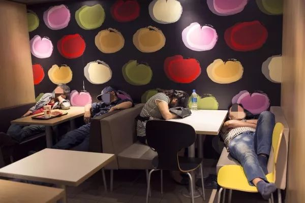 (原始链接: https://mmbiz.qpic.cn/mmbiz_jpg/hgkF61lC79AWVibCF9qBDlDMADXJQrN1oNiaDQma54Gyz4FnkslBDho1QibtufY4hKSEfj4YAn8w5Meverj7Itia6A/640?wx_fmt=jpeg)
- 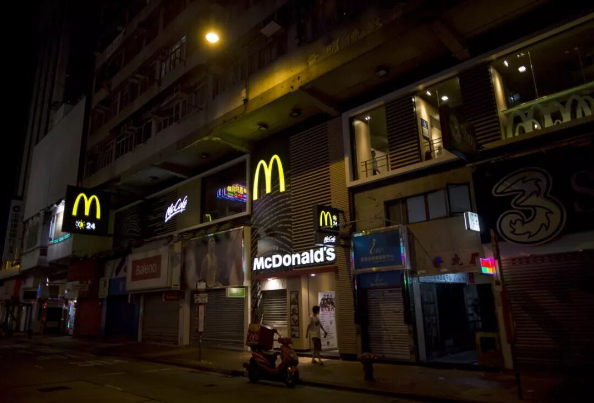 (原始链接: https://mmbiz.qpic.cn/mmbiz_jpg/hgkF61lC79AWVibCF9qBDlDMADXJQrN1oDwgjG9xXfpMjLJOJ3OCBTNUqml2bicwltQtR2nol2rOpLXtC4lRfh9A/640?wx_fmt=jpeg)
- 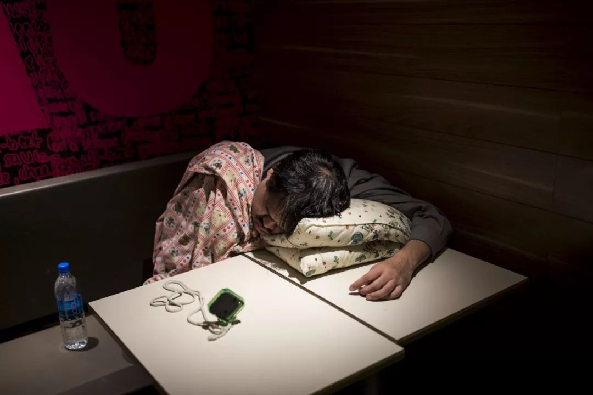 (原始链接: https://mmbiz.qpic.cn/mmbiz_jpg/hgkF61lC79AWVibCF9qBDlDMADXJQrN1ojgUJkcYuKCSOPTrrEibh3kj0YIxMM0PSdNTHMWMvYNR1T4qk4M96feg/640?wx_fmt=jpeg)
- 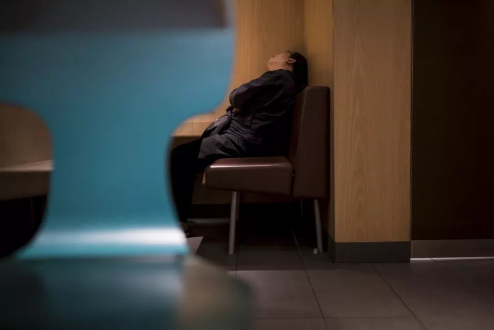 (原始链接: https://mmbiz.qpic.cn/mmbiz_jpg/hgkF61lC79AWVibCF9qBDlDMADXJQrN1oicBIAicibtt9pXSVfgaeJqDpicj5ic14Y3n1zgIyNpTLAjrIYwlkhUGn0IQ/640?wx_fmt=jpeg)
- 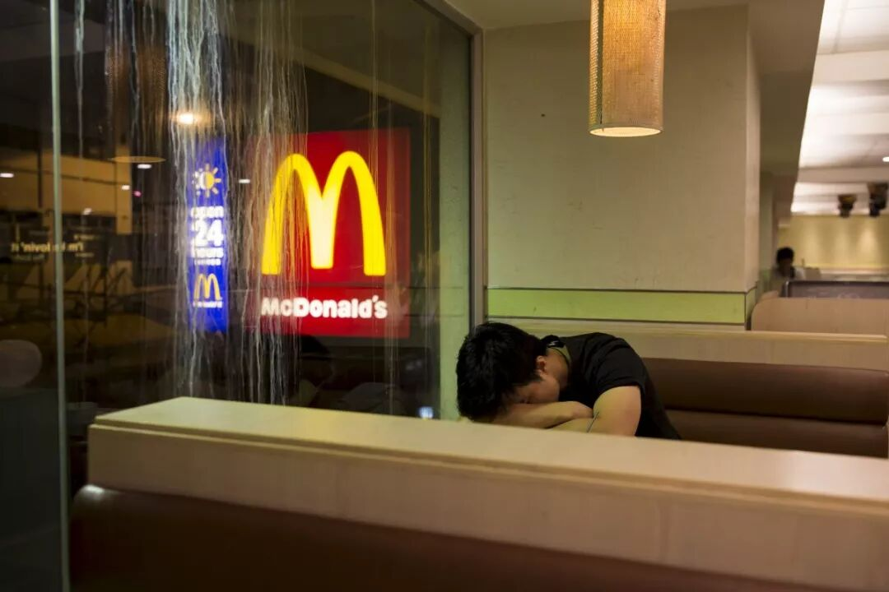 (原始链接: https://mmbiz.qpic.cn/mmbiz_jpg/hgkF61lC79AWVibCF9qBDlDMADXJQrN1oFO9JeGmAL6dXEuojUPMvdrtpPmiaiaR5YcrtkKOHvt3GMicUPRWqs1wnA/640?wx_fmt=jpeg)
- 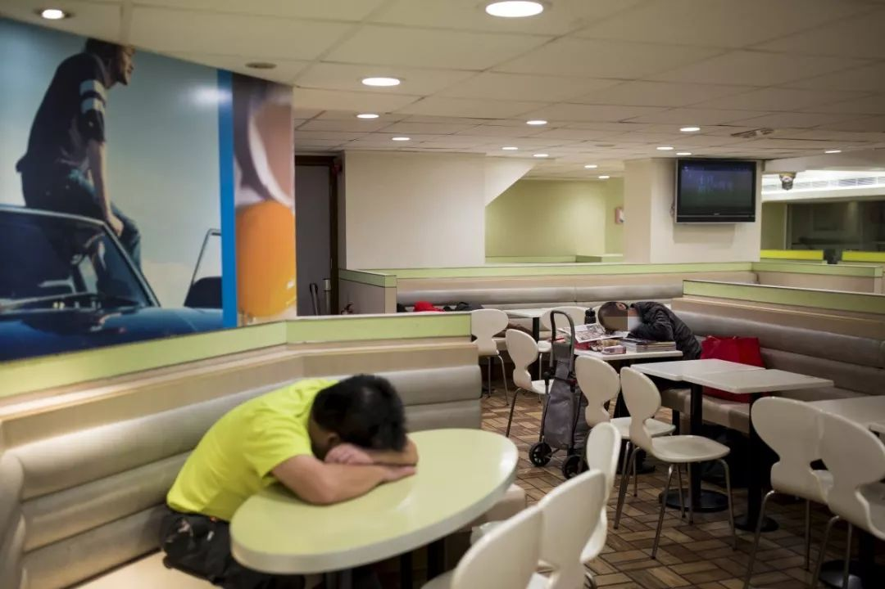 (原始链接: https://mmbiz.qpic.cn/mmbiz_jpg/hgkF61lC79AWVibCF9qBDlDMADXJQrN1oaYNNYw1PBNABmJa7jeQKGLjycicmZOsCib2v43o3J9JMwqfic0L6zgYXw/640?wx_fmt=jpeg)
- 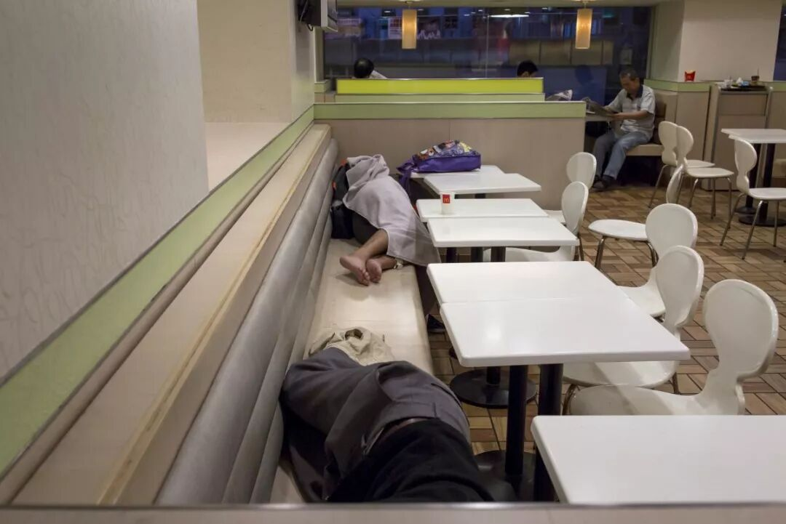 (原始链接: https://mmbiz.qpic.cn/mmbiz_jpg/hgkF61lC79AWVibCF9qBDlDMADXJQrN1ogf2vnicKlibVqIBuRuoJSOpUFuWOyYHZ0ks3sUsXuxv1tmLOtohDdf6A/640?wx_fmt=jpeg)
- 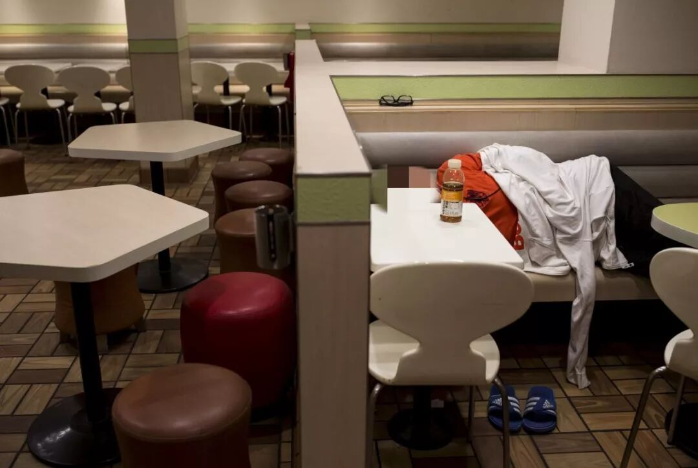 (原始链接: https://mmbiz.qpic.cn/mmbiz_jpg/hgkF61lC79AWVibCF9qBDlDMADXJQrN1oJAph7gbejUPnP6v7C3fZ3qpLRP4aHdEbEicPwJQ6YuuYJpIlVGc99WQ/640?wx_fmt=jpeg)
- 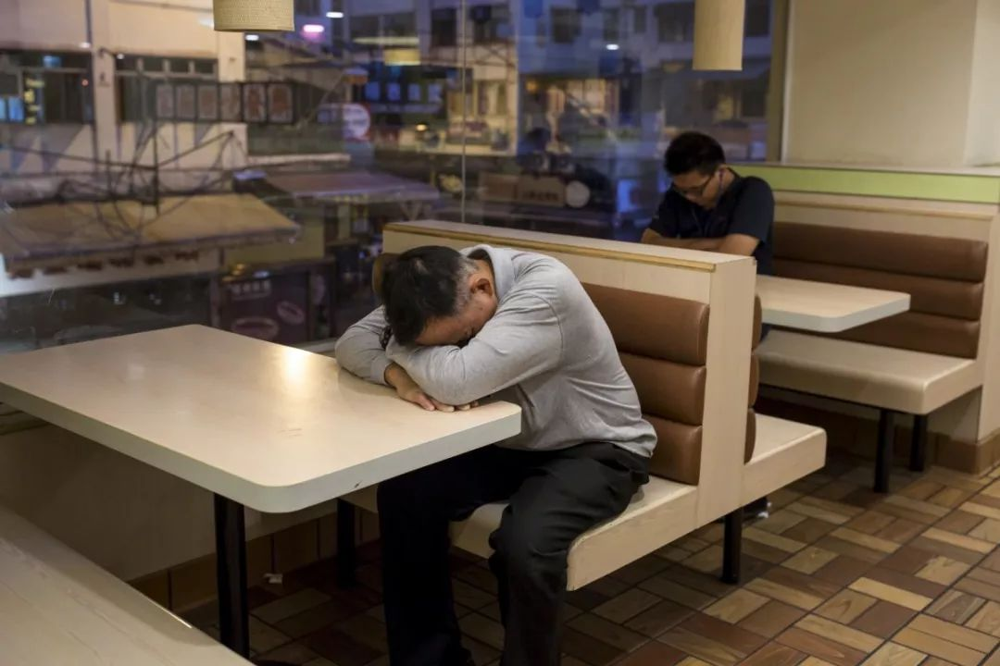 (原始链接: https://mmbiz.qpic.cn/mmbiz_jpg/hgkF61lC79AWVibCF9qBDlDMADXJQrN1oWENkYWJCsVEVpXM4bBFClY5Led6x5vZ1NU4Lq7J8nQ7eT3ibibg8U0GA/640?wx_fmt=jpeg)
-  (原始链接: https://mmbiz.qpic.cn/mmbiz_jpg/hgkF61lC79AWVibCF9qBDlDMADXJQrN1own0cSzDKpdoLn6duAgmzw2rjPLO5WlpvKHIfSBFicicppMjS4iakawWUg/640?wx_fmt=jpeg)
- 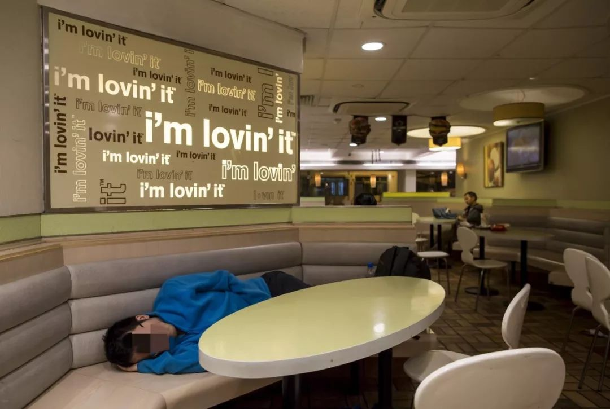 (原始链接: https://mmbiz.qpic.cn/mmbiz_jpg/hgkF61lC79AWVibCF9qBDlDMADXJQrN1ozE7Ce5kWYnNcpUgDRhWIibC0YCibfh2dbWVeIXUOIBfQOWjGPrfdJ8uQ/640?wx_fmt=jpeg)
-  (原始链接: https://mmbiz.qpic.cn/mmbiz_jpg/hgkF61lC79AWVibCF9qBDlDMADXJQrN1oOwwqZIxSzoZLzGnXB5bllgiavKyxv1Z9tdNjDvaPIicBZ9uJVsbI4epg/640?wx_fmt=jpeg)
- 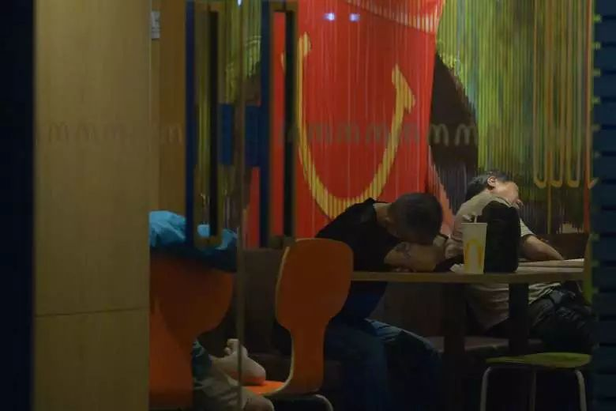 (原始链接: https://mmbiz.qpic.cn/mmbiz_jpg/hgkF61lC79AWVibCF9qBDlDMADXJQrN1oCTAbVuibQPwLBeIQ4SibdYfz9zGYkhkD33rYYLkzO7qBW5I81ndmpy7g/640?wx_fmt=jpeg)
-  (原始链接: https://mmbiz.qpic.cn/mmbiz_jpg/mZIpZ2dRo6Z5Lg6L4yBuvZf7QibxfKVYiaibWZ0TgYUSaib6Kt9bF0BhOS7r5v3zCAdNJ6PubAKsoohqPxVjIFWX9w/640?wx_fmt=jpeg)
-  (原始链接: https://mmbiz.qpic.cn/mmbiz_jpg/E5oZzDjj1kqmyBd2wXyJpdlTKRQv5yEo8q6MibdN8KaEpc8HasuicnnICaTm5SyBmFzYHh7Ypj7IianbCxEfHk2lg/640?wx_fmt=jpeg)
-  (原始链接: https://mmbiz.qpic.cn/mmbiz_jpg/E5oZzDjj1kqOCLqCN2NbQAMUbagjVS03xgLrw0N6XMoBSZS1ykNxrwfWZiaj5dHXZWqFdCfVurm8R3oSF82FJqQ/640?wx_fmt=jpeg)
-  (原始链接: https://mmbiz.qpic.cn/mmbiz_jpg/E5oZzDjj1koNJW9uUHaESKwdYBXwmKW1qj69v3qOjy7szM8OibukgwicGibjP2x1Xeqic9bKbg2a2f2qRBSzicsX20w/640?wx_fmt=jpeg)
-  (原始链接: https://mmbiz.qpic.cn/mmbiz_jpg/E5oZzDjj1koNJW9uUHaESKwdYBXwmKW1N0JZ1iaAG5IJ84TC3KQzv1rNHdaiaic9ZibfOCBUL1yhIWnK0ScaWEibQ4A/640?wx_fmt=jpeg)
-  (原始链接: https://mmbiz.qpic.cn/mmbiz_jpg/E5oZzDjj1krFNNmqiaVW3RVdTIANicfJ6BibMoyEmfm5Bscqn3NFAArz5lafNH1OTexHamNNp51ibcpFJqJKHjhiahw/640?wx_fmt=jpeg)
-  (原始链接: http://mmbiz.qpic.cn/mmbiz/E5oZzDjj1kqdHwQ2zpsHXPvFpF81yEia17OibFaAfyBwQYD1iakM7T1PlagpPx6bCbw4qeARbPEgmqPsmYtLv46cQ/640?wx_fmt=jpeg)
