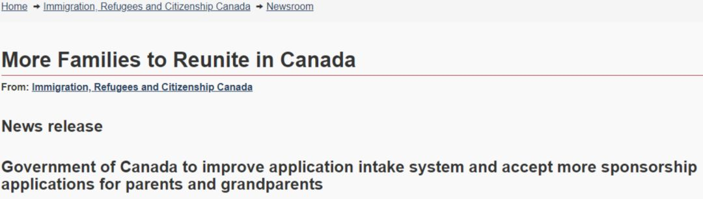
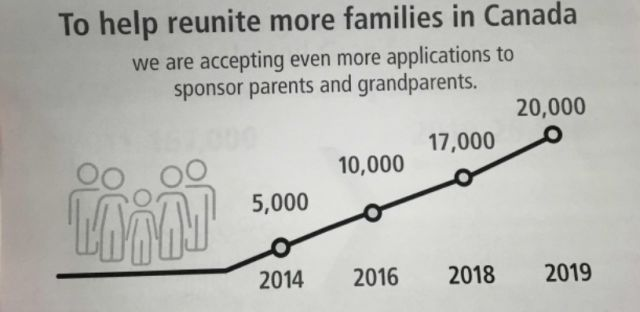
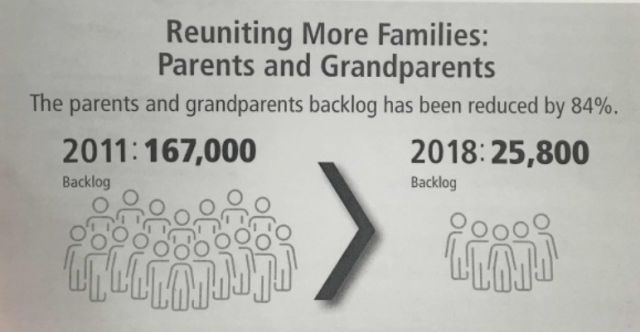
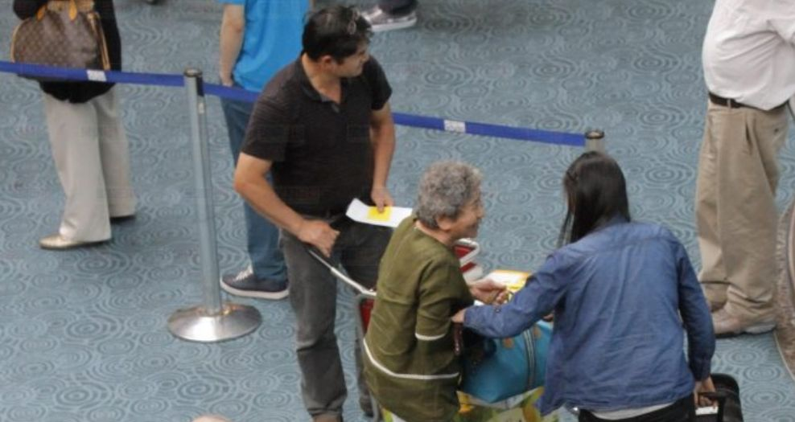
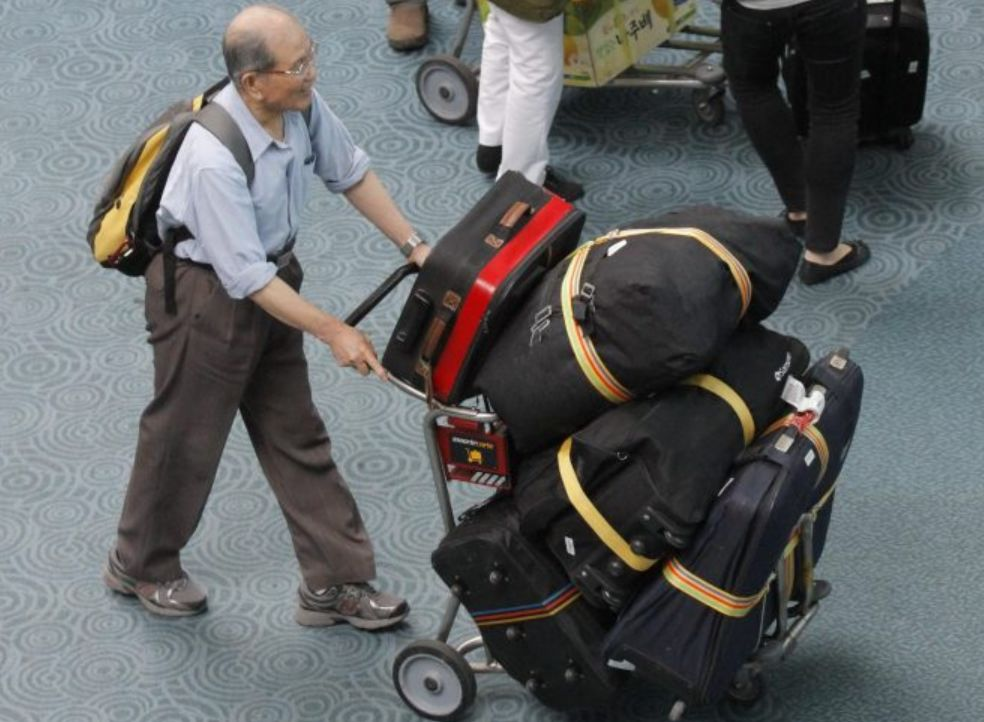

# 无标题

**链接地址:** http://mp.weixin.qq.com/s?__biz=MzA3MTY5MDA0NQ==&mid=2650994974&idx=1&sn=2ba842416ac251e6a162a133c4e0db39&chksm=84dfeb4cb3a8625a34c016c5c23e03516a5b50feecc7d6dea5b2659f753fe89fe35e7441f3ce&mpshare=1&scene=2&srcid=0821D0tXVxbzuldaxYDNpYjO#rd
**作者:** 
**获取时间:** 2025/8/28 21:37:18
**图片数量:** 14

---

## 原始HTML内容

<strong style="max-width: 100%;widows: 1;font-size: 18px;font-family: 微软雅黑;text-indent: 32px;box-sizing: border-box !important;overflow-wrap: break-word !important;"></strong> 

--- 我是一个神奇的广告---

<strong style="max-width: 100%;box-sizing: border-box !important;overflow-wrap: break-word !important;"><strong style="max-width: 100%;box-sizing: border-box !important;overflow-wrap: break-word !important;"><strong style="max-width: 100%;color: rgb(51, 51, 51);letter-spacing: 0.544px;font-family: -apple-system-font, BlinkMacSystemFont, Arial, sans-serif;font-size: 16px;box-sizing: border-box !important;overflow-wrap: break-word !important;"><strong style="max-width: 100%;box-sizing: border-box !important;overflow-wrap: break-word !important;"><strong style="max-width: 100%;box-sizing: border-box !important;overflow-wrap: break-word !important;"><strong style="max-width: 100%;font-family: Verdana, Geneva, sans-serif;letter-spacing: 0.544px;box-sizing: border-box !important;overflow-wrap: break-word !important;"></strong></strong></strong></strong></strong></strong>

<strong style="max-width: 100%;box-sizing: border-box !important;overflow-wrap: break-word !important;"><strong style="max-width: 100%;box-sizing: border-box !important;overflow-wrap: break-word !important;"><strong style="max-width: 100%;color: rgb(51, 51, 51);letter-spacing: 0.544px;font-family: -apple-system-font, BlinkMacSystemFont, Arial, sans-serif;font-size: 16px;box-sizing: border-box !important;overflow-wrap: break-word !important;"><strong style="max-width: 100%;box-sizing: border-box !important;overflow-wrap: break-word !important;"><strong style="max-width: 100%;box-sizing: border-box !important;overflow-wrap: break-word !important;"><strong style="max-width: 100%;font-family: Verdana, Geneva, sans-serif;letter-spacing: 0.544px;box-sizing: border-box !important;overflow-wrap: break-word !important;"></strong></strong></strong></strong></strong></strong>

 

 

加拿大移民部今天宣布，明年和后年将增加团聚移民申请名额，从今年的 17,000增加至2019年的20,500，到2020再增加至21,000。移民部也将对团聚移民申请方式进行重大改变，即今年仍然以随机抽签的方式接收团聚移民，明年开始，则按接到申请表的先后次序来审批。 

 

 移民部表示，从2014年以来，移民部接收团聚移民的名额不断增加：其中2014年为5,000；2016年为10,000；2018年增至17,000。  

<ignore_js_op style="max-width: 100%;overflow-wrap: break-word;color: rgb(68, 68, 68);box-sizing: border-box !important;">&nbsp;</ignore_js_op>移民部发言人Mathieu Genest表示，移民部也将对团聚移民申请的办法作出重大改变：从2019年开始，取消现行的抽签办法，按接到申请表的先后顺序进行审理。这位发言人说，这样做是为了让申请程序更为公平与合理。  CBC的报道说，其实自由党政府就是随机抽签办法的始作俑者，最初也说是为了确保公平，一改保守党过去先来后到的“排队”方法，从2017年开始采取随机抽签的申请模式。但随机抽的办法实施之后就饱受批评，被申请者批评为没人性，不人道，残忍，以及不可思议等等。

 

 2017年有 95,000多人参与随机抽签，竞争区区 10,000个名额。因此到4月25日抽签结果出炉，结果中签率只有10%。更让人不解的是，这10,000个中签的申请人并没有如期按规定递交申请表，结果导致9月6日再抽签。

 

在CBC通过信息自由法获得的数百页信件中，大量团聚移民的赞助者对自由党这个存在严重缺陷的计划表达了愤怒，认为这个计划没有经过公众咨询，漏洞百出，缺乏透明性和公平合理性。  移民部还在今天的新闻发布会上说，近年来，通过各方面的努力，移民部在处理积压的申请方面取得相当大进展，大幅缩短了团聚移民申请审批的等待时间。  移民部发布的数字称，2011年积压的团聚移民申请数量高达167,000件，但到2018年，已经减少至25,800件，在此期间共计减少积压个案84%。  

在发布会现场，有媒体提问表示，目前的处理周期为20-24个月。对此，代表自由党移民部的国会议员张海盈 （Selma Zahid）表示，政府将竭尽全力尽快处理所有的申请。张海盈同时表示，目前的自由党已将团聚移民配额由2014年的5000个，提升到了2019年的20000个。在五年内拥有4倍的提升意义巨大。

 

 张海盈表示，团聚移民将会帮助加拿大移民更好地融入社会。并用自己的亲身经历举例：自己1999年来加拿大，用于需要照顾年幼的子女迟迟无法上班参加工作。直到自家的长辈前来帮助自己照看孩子，张海盈才有机会与真正的“进入”加拿大社会。  “这些团聚移民过来的申请者们间接地为加拿大的经济做出了贡献”，张海盈在发布会中表示。 

<ignore_js_op style="max-width: 100%;overflow-wrap: break-word;color: rgb(68, 68, 68);box-sizing: border-box !important;">&nbsp;</ignore_js_op>（资料图：国会议员张海盈与加拿大总理杜鲁多）  另外，有记者提出关于海外出生的第二代加拿大人（Second Generation Canadian）无法从海外出生的父辈继承国籍的问题。张海盈在回答这一问题时表示，目前自由党政府已经意识到了问题的存在，并会在随后的国会会议中提出。但是，这一问题是否能够得以解决，目前还没有确定的时间点。

 

 

<strong style="max-width: 100%;box-sizing: border-box !important;overflow-wrap: break-word !important;">关于明年申请流程的部分划重点</strong>

<strong style="max-width: 100%;box-sizing: border-box !important;overflow-wrap: break-word !important;"> </strong>

2019年，与往年一样，申请表格将在年初在线提供，因此符合条件的潜在担保人可以让移民部知道申请者担保父母或祖父母来加拿大的意愿。接着，根据移民部收到担保人申请意向表的顺序来决定申请资格，而不是随机抽取。这个过程将持续到2019年所有申请名额完成为止。

 

<strong style="max-width: 100%;box-sizing: border-box !important;overflow-wrap: break-word !important;">申请资质不变</strong>

 

胡辛今天没有提到申请人资质的变化，如果沿用现在的，担保人仍然需要满足以下基本条件：

 

<em style="max-width: 100%;box-sizing: border-box !important;overflow-wrap: break-word !important;">连续三年满足最低收入标准</em>

<em style="max-width: 100%;box-sizing: border-box !important;overflow-wrap: break-word !important;">如果担保人已婚或同居，夫妻两人的收入要达到一定要求</em>

<em style="max-width: 100%;box-sizing: border-box !important;overflow-wrap: break-word !important;">担保人必须保证在经济上支持被担保人20年的生活（魁省的要求是10年）</em>

<strong style="max-width: 100%;box-sizing: border-box !important;overflow-wrap: break-word !important;"> </strong>

<strong style="max-width: 100%;box-sizing: border-box !important;overflow-wrap: break-word !important;">目前还不知道明年正式递交团聚移民的时间，胡辛表示，有关系统改进的更多细节将于今年秋季公布。</strong>

  

--- 我是一个神奇的广告---

<strong style="max-width: 100%;font-variant-numeric: normal;font-variant-east-asian: normal;letter-spacing: 0.544px;widows: 1;font-family: -apple-system-font, BlinkMacSystemFont, Arial, sans-serif;font-size: 16px;box-sizing: border-box !important;overflow-wrap: break-word !important;"><strong style="max-width: 100%;box-sizing: border-box !important;overflow-wrap: break-word !important;"><strong style="max-width: 100%;color: rgb(51, 51, 51);box-sizing: border-box !important;overflow-wrap: break-word !important;"><strong style="max-width: 100%;font-family: Verdana, Geneva, sans-serif;letter-spacing: 0.544px;box-sizing: border-box !important;overflow-wrap: break-word !important;"></strong></strong></strong></strong>

---

## 纯文本内容

--- 我是一个神奇的广告---加拿大移民部今天宣布，明年和后年将增加团聚移民申请名额，从今年的 17,000增加至2019年的20,500，到2020再增加至21,000。移民部也将对团聚移民申请方式进行重大改变，即今年仍然以随机抽签的方式接收团聚移民，明年开始，则按接到申请表的先后次序来审批。移民部表示，从2014年以来，移民部接收团聚移民的名额不断增加：其中2014年为5,000；2016年为10,000；2018年增至17,000。 移民部发言人Mathieu Genest表示，移民部也将对团聚移民申请的办法作出重大改变：从2019年开始，取消现行的抽签办法，按接到申请表的先后顺序进行审理。这位发言人说，这样做是为了让申请程序更为公平与合理。CBC的报道说，其实自由党政府就是随机抽签办法的始作俑者，最初也说是为了确保公平，一改保守党过去先来后到的“排队”方法，从2017年开始采取随机抽签的申请模式。但随机抽的办法实施之后就饱受批评，被申请者批评为没人性，不人道，残忍，以及不可思议等等。2017年有 95,000多人参与随机抽签，竞争区区 10,000个名额。因此到4月25日抽签结果出炉，结果中签率只有10%。更让人不解的是，这10,000个中签的申请人并没有如期按规定递交申请表，结果导致9月6日再抽签。在CBC通过信息自由法获得的数百页信件中，大量团聚移民的赞助者对自由党这个存在严重缺陷的计划表达了愤怒，认为这个计划没有经过公众咨询，漏洞百出，缺乏透明性和公平合理性。移民部还在今天的新闻发布会上说，近年来，通过各方面的努力，移民部在处理积压的申请方面取得相当大进展，大幅缩短了团聚移民申请审批的等待时间。移民部发布的数字称，2011年积压的团聚移民申请数量高达167,000件，但到2018年，已经减少至25,800件，在此期间共计减少积压个案84%。在发布会现场，有媒体提问表示，目前的处理周期为20-24个月。对此，代表自由党移民部的国会议员张海盈 （Selma Zahid）表示，政府将竭尽全力尽快处理所有的申请。张海盈同时表示，目前的自由党已将团聚移民配额由2014年的5000个，提升到了2019年的20000个。在五年内拥有4倍的提升意义巨大。张海盈表示，团聚移民将会帮助加拿大移民更好地融入社会。并用自己的亲身经历举例：自己1999年来加拿大，用于需要照顾年幼的子女迟迟无法上班参加工作。直到自家的长辈前来帮助自己照看孩子，张海盈才有机会与真正的“进入”加拿大社会。“这些团聚移民过来的申请者们间接地为加拿大的经济做出了贡献”，张海盈在发布会中表示。 （资料图：国会议员张海盈与加拿大总理杜鲁多）另外，有记者提出关于海外出生的第二代加拿大人（Second Generation Canadian）无法从海外出生的父辈继承国籍的问题。张海盈在回答这一问题时表示，目前自由党政府已经意识到了问题的存在，并会在随后的国会会议中提出。但是，这一问题是否能够得以解决，目前还没有确定的时间点。关于明年申请流程的部分划重点2019年，与往年一样，申请表格将在年初在线提供，因此符合条件的潜在担保人可以让移民部知道申请者担保父母或祖父母来加拿大的意愿。接着，根据移民部收到担保人申请意向表的顺序来决定申请资格，而不是随机抽取。这个过程将持续到2019年所有申请名额完成为止。申请资质不变胡辛今天没有提到申请人资质的变化，如果沿用现在的，担保人仍然需要满足以下基本条件：连续三年满足最低收入标准如果担保人已婚或同居，夫妻两人的收入要达到一定要求担保人必须保证在经济上支持被担保人20年的生活（魁省的要求是10年）目前还不知道明年正式递交团聚移民的时间，胡辛表示，有关系统改进的更多细节将于今年秋季公布。--- 我是一个神奇的广告---

---

## 图片列表

-  (原始链接: https://mmbiz.qpic.cn/mmbiz_jpg/2YV0b1NsQNI92amOUOZhWPiaAHEsb5qB3nKtUyGibH0GMd9q3VtlsykHklico5eSDAgUp8aEkg2RwWDtlLcT9lkWw/640?wx_fmt=jpeg)
-  (原始链接: https://mmbiz.qpic.cn/mmbiz_jpg/x0ccYC4cialFPGXzTD8Zv8kIiaD9JfnwsNEqwRZujTIay7mqx8tVYotKRAou1CZgI8EfP54kDeuq1aqpvczOpOqA/640?wx_fmt=jpeg)
-  (原始链接: https://mmbiz.qpic.cn/mmbiz_jpg/x0ccYC4cialGz0eS3TrzG5vRheFkjDGs0kicELv5iaPJhkRmGfKEkVoNJNDADZIScibzTPtJiaV8m6H9E4qic5cTXSvw/640?wx_fmt=jpeg)
-  (原始链接: https://mmbiz.qpic.cn/mmbiz_jpg/x0ccYC4cialGATV55Ykrs9eYHZa4VOVENSpLZ1hWIRSssW3pvyUJKdG7bRahXOEdicpFVtJUeuO7zgvpHpQ971yw/640?wx_fmt=jpeg)
-  (原始链接: https://mmbiz.qpic.cn/mmbiz_jpg/D1nJqnhkPyLo3L0iawegpPefdoialIOMJsLYAWDKWZibActHTInqxOYIqm69LVFG0zLVDT3SI3PON4Sz2gvhHH80g/640?wx_fmt=jpeg)
-  (原始链接: https://mmbiz.qpic.cn/mmbiz_png/ydG8L0teC7GnchoJ3INftbqhoXDgxf2cOyJMMqpY0Rkdzp7tKM4QBOkdnkbOJGnTdZZ8sj6USJGGbUCCibf8SYw/640?wx_fmt=png)
-  (原始链接: https://mmbiz.qpic.cn/mmbiz_png/k2zOml6Jq7YYC0BLm8DaIcXzL2DfVoX6UianlHGTgEg3icbKo6twDSeaBmmL6w0OABibJ3EAphfnwQzuqJfHFiciagg/640?wx_fmt=png)
-  (原始链接: https://mmbiz.qpic.cn/mmbiz_png/ydG8L0teC7GnchoJ3INftbqhoXDgxf2c0DwEd4YsTicevjRnfAnib5J8XgAeO1d1hTvCQVjhp3tblKiaWQBjfpfLg/640?wx_fmt=png)
-  (原始链接: https://mmbiz.qpic.cn/mmbiz_png/k2zOml6Jq7YYC0BLm8DaIcXzL2DfVoX6AO1bj4PwV4o2dWdIywASsrYXia91ZObstSu7biaFzdnicU8gvPD1cQGlw/640?wx_fmt=png)
-  (原始链接: https://mmbiz.qpic.cn/mmbiz_png/ydG8L0teC7GnchoJ3INftbqhoXDgxf2cOmIfRlcFoucNGDVpaJOib3IXOq2TES5CzcP2iag3ejQxXfkVE0MHnW5g/640?wx_fmt=png)
-  (原始链接: https://mmbiz.qpic.cn/mmbiz_jpg/k2zOml6Jq7YYC0BLm8DaIcXzL2DfVoX6uEYQe1oJXNQmFOu1CBuxI6CYTkTPAgaDnUTXXJrPEjdDG9tZJO54RA/640?wx_fmt=jpeg)
-  (原始链接: https://mmbiz.qpic.cn/mmbiz_png/ydG8L0teC7GnchoJ3INftbqhoXDgxf2ck72AdOqriaXylfYls9mszMyfXuVC8DF81RWOHZQJfBKIPxzYwmcRvNQ/640?wx_fmt=png)
-  (原始链接: https://mmbiz.qpic.cn/mmbiz_jpg/x0ccYC4cialGATV55Ykrs9eYHZa4VOVENVySpLicBoKeAElMjj9Czrc9ibpLYPZia04pE3FzOdJH56qtTU4teyCic4Q/640?wx_fmt=jpeg)
-  (原始链接: https://mmbiz.qpic.cn/mmbiz_jpg/D1nJqnhkPyLo3L0iawegpPefdoialIOMJsLYAWDKWZibActHTInqxOYIqm69LVFG0zLVDT3SI3PON4Sz2gvhHH80g/640?wx_fmt=jpeg)
