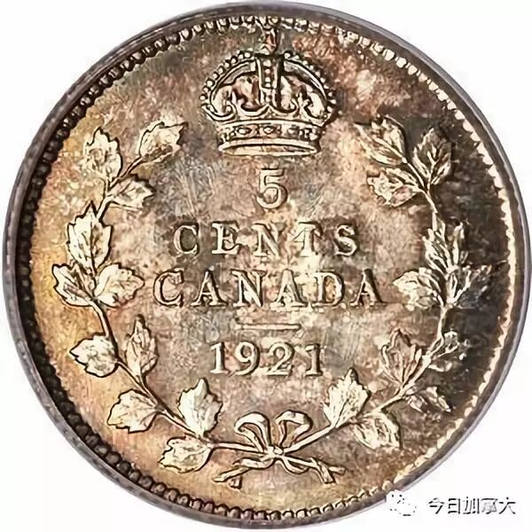

# 无标题

**链接地址:** http://mp.weixin.qq.com/s?__biz=MzI2NTE1ODgwOQ==&mid=2649604932&idx=1&sn=99157d86f450e7b6fb91aca6497535ce&chksm=f2b8cab2c5cf43a404e75008268f85f3fab064bbe130c2a79f758207136e9cbca95547bb38de&mpshare=1&scene=2&srcid=0911GLWhfRbR12vBiEnY5rlE#rd
**作者:** 枫雅哲
**获取时间:** 2025/8/28 21:33:12
**图片数量:** 21

---

## 原始HTML内容

<section style="box-sizing: border-box;"><section class="V5" style="box-sizing: border-box;" powered-by="xiumi.us"><section style="margin-right: 0%;margin-left: 0%;box-sizing: border-box;"><section style="display: inline-block;vertical-align: middle;width: 80%;box-sizing: border-box;"><section class="V5" style="box-sizing: border-box;" powered-by="xiumi.us"><section style="margin-top: 10px;margin-bottom: 10px;text-align: center;box-sizing: border-box;"><section style="display: inline-block;box-sizing: border-box;"><section style="max-width: 100%;font-size: 0px;padding-bottom: 3px;box-sizing: border-box;"><section style="display: inline-block;vertical-align: middle;box-sizing: border-box;"><section style="width: 5px;height: 1px;background-color: rgb(217, 217, 217);box-sizing: border-box;"></section><section style="width: 1px;height: 5px;margin-top: -3px;margin-right: auto;margin-left: auto;background-color: rgb(217, 217, 217);box-sizing: border-box;"></section></section><section style="margin-top: -1px;margin-right: -5px;margin-left: -5px;width: 100%;display: inline-block;vertical-align: middle;padding-right: 8px;padding-left: 8px;box-sizing: border-box;"><section style="width: 100%;height: 1px;background-color: rgb(217, 217, 217);box-sizing: border-box;"></section></section><section style="display: inline-block;vertical-align: middle;box-sizing: border-box;"><section style="width: 5px;height: 1px;background-color: rgb(217, 217, 217);box-sizing: border-box;"></section><section style="width: 1px;height: 5px;margin-top: -3px;margin-right: auto;margin-left: auto;background-color: rgb(217, 217, 217);box-sizing: border-box;"></section></section></section><section style="padding-left: 15px;padding-right: 15px;color: rgb(161, 161, 161);font-size: 14px;box-sizing: border-box;">
点击上方<strong style="box-sizing: border-box;">蓝字</strong>关注我们哟~
</section><section style="max-width: 100%;font-size: 0px;box-sizing: border-box;"><section style="display: inline-block;vertical-align: middle;box-sizing: border-box;"><section style="width: 5px;height: 1px;background-color: rgb(217, 217, 217);box-sizing: border-box;"></section><section style="width: 1px;height: 5px;margin-top: -3px;margin-right: auto;margin-left: auto;background-color: rgb(217, 217, 217);box-sizing: border-box;"></section></section><section style="margin-top: -1px;margin-right: -5px;margin-left: -5px;width: 100%;display: inline-block;vertical-align: middle;padding-right: 8px;padding-left: 8px;box-sizing: border-box;"><section style="width: 100%;height: 1px;background-color: rgb(217, 217, 217);box-sizing: border-box;"></section></section><section style="display: inline-block;vertical-align: middle;box-sizing: border-box;"><section style="width: 5px;height: 1px;background-color: rgb(217, 217, 217);box-sizing: border-box;"></section><section style="width: 1px;height: 5px;margin-top: -3px;margin-right: auto;margin-left: auto;background-color: rgb(217, 217, 217);box-sizing: border-box;"></section></section></section></section></section></section></section><section style="display: inline-block;vertical-align: middle;width: 20%;box-sizing: border-box;"><section class="V5" style="box-sizing: border-box;" powered-by="xiumi.us"><section style="text-align: center;margin: -10px 0% 10px;box-sizing: border-box;"><section style="max-width: 100%;vertical-align: middle;display: inline-block;width: 100%;box-sizing: border-box;"></section></section></section></section></section></section><section class="V5" style="box-sizing: border-box;" powered-by="xiumi.us"><section style="box-sizing: border-box;"><section style="box-sizing: border-box;">
 
</section></section></section><section class="V5" style="box-sizing: border-box;" powered-by="xiumi.us"><section style="margin: 10px 0%;box-sizing: border-box;"><section style="display: inline-block;width: 100%;vertical-align: top;box-sizing: border-box;"><section class="V5" style="box-sizing: border-box;" powered-by="xiumi.us"><section style="box-sizing: border-box;"><section style="display: inline-block;vertical-align: bottom;width: 75%;padding-right: 10px;box-sizing: border-box;"><section class="V5" style="box-sizing: border-box;" powered-by="xiumi.us"><section style="margin: 10px 0% 3px;box-sizing: border-box;"><section style="display: inline-block;vertical-align: middle;box-sizing: border-box;"><section style="display: inline-block;vertical-align: bottom;padding-left: 5px;padding-right: 5px;line-height: 1.2em;margin-bottom: 2px;color: rgba(80, 182, 201, 0.72);box-sizing: border-box;">
<strong style="box-sizing: border-box;">仔细看下图，有惊喜！</strong>
</section><section style="max-width: 100%;display: inline-block;vertical-align: bottom;width: 1.6em;box-sizing: border-box;"></section></section></section></section></section><section style="display: inline-block;vertical-align: bottom;width: 25%;box-sizing: border-box;"><section class="V5" style="box-sizing: border-box;" powered-by="xiumi.us"><section style="margin-right: 0%;margin-bottom: 3px;margin-left: 0%;text-align: right;box-sizing: border-box;"><section style="display: inline-block;border-bottom: 0.15em solid rgba(80, 182, 201, 0.72);padding-bottom: 3px;box-sizing: border-box;"><section style="display: inline-block;padding: 3px;border-bottom: 0.15em solid rgba(80, 182, 201, 0.72);font-size: 12px;line-height: 1.4;color: rgb(255, 143, 47);box-sizing: border-box;">
<strong style="box-sizing: border-box;">金主大大</strong>
</section></section></section></section></section></section></section><section class="V5" style="box-sizing: border-box;" powered-by="xiumi.us"><section style="margin-right: 0%;margin-left: 0%;box-sizing: border-box;"><section style="background-color: rgba(80, 182, 201, 0.72);height: 2px;box-sizing: border-box;"></section></section></section></section></section></section><section class="V5" style="box-sizing: border-box;" powered-by="xiumi.us"><section style="box-sizing: border-box;"><section style="box-sizing: border-box;">

</section></section></section><section class="V5" style="box-sizing: border-box;" powered-by="xiumi.us"><section style="text-align: center;margin-top: 10px;margin-bottom: 10px;box-sizing: border-box;"><section style="max-width: 100%;vertical-align: middle;display: inline-block;box-sizing: border-box;"><svg xmlns="http://www.w3.org/2000/svg" x="0px" y="0px" viewBox="0 0 902.1 38.2" style="vertical-align: middle;max-width: 100%;box-sizing: border-box;" width="902.1"><g style="box-sizing: border-box;"><path style="box-sizing: border-box;" d="M18.4,1.4c0.9-1.9,2.4-1.9,3.4,0l3.4,6.9c0.9,1.9,3.4,3.7,5.4,4l7.6,1.1c2.1,0.3,2.5,1.7,1,3.2   l-5.5,5.4c-1.5,1.5-2.4,4.3-2.1,6.4l1.3,7.6c0.4,2.1-0.9,2.9-2.7,2l-6.8-3.6c-1.8-1-4.9-1-6.7,0l-6.8,3.6c-1.9,1-3.1,0.1-2.7-2   l1.3-7.6c0.4-2.1-0.6-4.9-2.1-6.4l-5.5-5.4c-1.5-1.5-1-2.9,1-3.2l7.6-1.1c2.1-0.3,4.5-2.1,5.4-4L18.4,1.4z" fill="rgb(178, 243, 230)"></path><path style="box-sizing: border-box;" d="M90.6,5.4c0.7-1.4,1.9-1.4,2.6,0l2.6,5.3c0.7,1.4,2.6,2.8,4.2,3.1l5.9,0.9c1.6,0.2,2,1.3,0.8,2.5   l-4.2,4.1c-1.2,1.1-1.9,3.3-1.6,4.9l1,5.8c0.3,1.6-0.7,2.3-2.1,1.5l-5.2-2.8c-1.4-0.8-3.8-0.8-5.2,0L84,33.6   c-1.4,0.8-2.4,0.1-2.1-1.5l1-5.8c0.3-1.6-0.5-3.8-1.6-4.9l-4.2-4.1c-1.2-1.1-0.8-2.2,0.8-2.5l5.9-0.9c1.6-0.2,3.5-1.6,4.2-3.1   L90.6,5.4z" fill="rgb(190, 204, 246)"></path><path style="box-sizing: border-box;" d="M162.6,7.5c0.6-1.2,1.6-1.2,2.2,0l2.2,4.5c0.6,1.2,2.2,2.4,3.6,2.6l5,0.7c1.4,0.2,1.7,1.1,0.7,2.1   l-3.6,3.5c-1,1-1.6,2.9-1.4,4.2l0.9,5c0.2,1.4-0.6,1.9-1.8,1.3l-4.5-2.4c-1.2-0.6-3.2-0.6-4.4,0l-4.5,2.4c-1.2,0.6-2,0.1-1.8-1.3   l0.9-5c0.2-1.4-0.4-3.3-1.4-4.2l-3.6-3.5c-1-1-0.7-1.9,0.7-2.1l5-0.7c1.4-0.2,3-1.4,3.6-2.6L162.6,7.5z" fill="rgb(150, 208, 240)"></path><path style="box-sizing: border-box;" d="M60.1,19.1c0,2.3-1.9,4.2-4.2,4.2c-2.3,0-4.2-1.9-4.2-4.2s1.9-4.2,4.2-4.2   C58.3,14.9,60.1,16.8,60.1,19.1z" fill="rgb(218, 240, 224)"></path><path style="box-sizing: border-box;" d="M203.8,19.1c0,2.3-1.9,4.2-4.2,4.2c-2.3,0-4.2-1.9-4.2-4.2s1.9-4.2,4.2-4.2   C201.9,14.9,203.8,16.8,203.8,19.1z" fill="rgb(218, 240, 224)"></path><path style="box-sizing: border-box;" d="M130.9,19.1c0,1.7-1.4,3.1-3.1,3.1c-1.7,0-3.1-1.4-3.1-3.1c0-1.7,1.4-3.1,3.1-3.1   C129.5,16.1,130.9,17.4,130.9,19.1z" fill="rgb(218, 240, 224)"></path><path style="box-sizing: border-box;" d="M233.9,1.4c0.9-1.9,2.4-1.9,3.4,0l3.4,6.9c0.9,1.9,3.4,3.7,5.4,4l7.6,1.1c2.1,0.3,2.5,1.7,1,3.2   l-5.5,5.4c-1.5,1.5-2.4,4.3-2.1,6.4l1.3,7.6c0.4,2.1-0.9,2.9-2.7,2l-6.8-3.6c-1.8-1-4.9-1-6.7,0l-6.8,3.6c-1.9,1-3.1,0.1-2.7-2   l1.3-7.6c0.4-2.1-0.6-4.9-2.1-6.4l-5.5-5.4c-1.5-1.5-1-2.9,1-3.2l7.6-1.1c2.1-0.3,4.5-2.1,5.4-4L233.9,1.4z" fill="rgb(178, 243, 230)"></path><path style="box-sizing: border-box;" d="M306.1,5.4c0.7-1.4,1.9-1.4,2.6,0l2.6,5.3c0.7,1.4,2.6,2.8,4.2,3.1l5.9,0.9c1.6,0.2,2,1.3,0.8,2.5   l-4.2,4.1c-1.2,1.1-1.9,3.3-1.6,4.9l1,5.8c0.3,1.6-0.7,2.3-2.1,1.5l-5.2-2.8c-1.4-0.8-3.8-0.8-5.2,0l-5.2,2.8   c-1.4,0.8-2.4,0.1-2.1-1.5l1-5.8c0.3-1.6-0.4-3.8-1.6-4.9l-4.2-4.1c-1.2-1.1-0.8-2.2,0.8-2.5l5.9-0.9c1.6-0.2,3.5-1.6,4.2-3.1   L306.1,5.4z" fill="rgb(190, 204, 246)"></path><path style="box-sizing: border-box;" d="M378.1,7.5c0.6-1.2,1.6-1.2,2.2,0l2.2,4.5c0.6,1.2,2.2,2.4,3.6,2.6l5,0.7c1.4,0.2,1.7,1.1,0.7,2.1   l-3.6,3.5c-1,1-1.6,2.9-1.4,4.2l0.9,5c0.2,1.4-0.6,1.9-1.8,1.3l-4.5-2.4c-1.2-0.6-3.2-0.6-4.4,0l-4.5,2.4c-1.2,0.6-2,0.1-1.8-1.3   l0.9-5c0.2-1.4-0.4-3.3-1.4-4.2l-3.6-3.5c-1-1-0.7-1.9,0.7-2.1l5-0.7c1.4-0.2,3-1.4,3.6-2.6L378.1,7.5z" fill="rgb(150, 208, 240)"></path><path style="box-sizing: border-box;" d="M275.7,19.1c0,2.3-1.9,4.2-4.2,4.2c-2.3,0-4.2-1.9-4.2-4.2s1.9-4.2,4.2-4.2   C273.8,14.9,275.7,16.8,275.7,19.1z" fill="rgb(218, 240, 224)"></path><path style="box-sizing: border-box;" d="M419.3,19.1c0,2.3-1.9,4.2-4.2,4.2c-2.3,0-4.2-1.9-4.2-4.2s1.9-4.2,4.2-4.2   C417.5,14.9,419.3,16.8,419.3,19.1z" fill="rgb(218, 240, 224)"></path><path style="box-sizing: border-box;" d="M346.4,19.1c0,1.7-1.4,3.1-3.1,3.1c-1.7,0-3.1-1.4-3.1-3.1c0-1.7,1.4-3.1,3.1-3.1   C345,16.1,346.4,17.4,346.4,19.1z" fill="rgb(218, 240, 224)"></path><path style="box-sizing: border-box;" d="M449.4,1.4c0.9-1.9,2.4-1.9,3.4,0l3.4,6.9c0.9,1.9,3.4,3.7,5.4,4l7.6,1.1c2.1,0.3,2.5,1.7,1,3.2   l-5.5,5.4c-1.5,1.5-2.4,4.3-2.1,6.4l1.3,7.6c0.4,2.1-0.9,2.9-2.7,2l-6.8-3.6c-1.8-1-4.9-1-6.7,0l-6.8,3.6c-1.9,1-3.1,0.1-2.7-2   l1.3-7.6c0.4-2.1-0.6-4.9-2.1-6.4l-5.5-5.4c-1.5-1.5-1-2.9,1-3.2l7.6-1.1c2.1-0.3,4.5-2.1,5.4-4L449.4,1.4z" fill="rgb(178, 243, 230)"></path><path style="box-sizing: border-box;" d="M521.6,5.4c0.7-1.4,1.9-1.4,2.6,0l2.6,5.3c0.7,1.4,2.6,2.8,4.2,3.1l5.9,0.9c1.6,0.2,2,1.3,0.8,2.5   l-4.2,4.1c-1.2,1.1-1.9,3.3-1.6,4.9l1,5.8c0.3,1.6-0.7,2.3-2.1,1.5l-5.2-2.8c-1.4-0.8-3.8-0.8-5.2,0l-5.2,2.8   c-1.4,0.8-2.4,0.1-2.1-1.5l1-5.8c0.3-1.6-0.5-3.8-1.6-4.9l-4.2-4.1c-1.2-1.1-0.8-2.2,0.8-2.5l5.9-0.9c1.6-0.2,3.5-1.6,4.2-3.1   L521.6,5.4z" fill="rgb(190, 204, 246)"></path><path style="box-sizing: border-box;" d="M593.6,7.5c0.6-1.2,1.6-1.2,2.2,0l2.2,4.5c0.6,1.2,2.2,2.4,3.6,2.6l5,0.7c1.4,0.2,1.7,1.1,0.7,2.1   l-3.6,3.5c-1,1-1.6,2.9-1.4,4.2l0.9,5c0.2,1.4-0.6,1.9-1.8,1.3l-4.5-2.4c-1.2-0.6-3.2-0.6-4.4,0l-4.5,2.4c-1.2,0.6-2,0.1-1.8-1.3   l0.9-5c0.2-1.4-0.4-3.3-1.4-4.2l-3.6-3.5c-1-1-0.7-1.9,0.7-2.1l5-0.7c1.4-0.2,3-1.4,3.6-2.6L593.6,7.5z" fill="rgb(150, 208, 240)"></path><path style="box-sizing: border-box;" d="M491.2,19.1c0,2.3-1.9,4.2-4.2,4.2c-2.3,0-4.2-1.9-4.2-4.2s1.9-4.2,4.2-4.2   C489.3,14.9,491.2,16.8,491.2,19.1z" fill="rgb(218, 240, 224)"></path><path style="box-sizing: border-box;" d="M634.9,19.1c0,2.3-1.9,4.2-4.2,4.2c-2.3,0-4.2-1.9-4.2-4.2s1.9-4.2,4.2-4.2   C633,14.9,634.9,16.8,634.9,19.1z" fill="rgb(218, 240, 224)"></path><path style="box-sizing: border-box;" d="M561.9,19.1c0,1.7-1.4,3.1-3.1,3.1c-1.7,0-3.1-1.4-3.1-3.1c0-1.7,1.4-3.1,3.1-3.1   C560.5,16.1,561.9,17.4,561.9,19.1z" fill="rgb(218, 240, 224)"></path><path style="box-sizing: border-box;" d="M664.9,1.4c0.9-1.9,2.4-1.9,3.4,0l3.4,6.9c0.9,1.9,3.4,3.7,5.4,4l7.6,1.1c2.1,0.3,2.5,1.7,1,3.2   l-5.5,5.4c-1.5,1.5-2.4,4.3-2.1,6.4l1.3,7.6c0.4,2.1-0.9,2.9-2.7,2l-6.8-3.6c-1.8-1-4.9-1-6.7,0l-6.8,3.6c-1.9,1-3.1,0.1-2.7-2   l1.3-7.6c0.4-2.1-0.6-4.9-2.1-6.4l-5.5-5.4c-1.5-1.5-1-2.9,1-3.2l7.6-1.1c2.1-0.3,4.5-2.1,5.4-4L664.9,1.4z" fill="rgb(178, 243, 230)"></path><path style="box-sizing: border-box;" d="M737.1,5.4c0.7-1.4,1.9-1.4,2.6,0l2.6,5.3c0.7,1.4,2.6,2.8,4.2,3.1l5.9,0.9c1.6,0.2,2,1.3,0.8,2.5   l-4.2,4.1c-1.2,1.1-1.9,3.3-1.6,4.9l1,5.8c0.3,1.6-0.7,2.3-2.1,1.5l-5.2-2.8c-1.4-0.8-3.8-0.8-5.2,0l-5.2,2.8   c-1.4,0.8-2.4,0.1-2.1-1.5l1-5.8c0.3-1.6-0.5-3.8-1.6-4.9l-4.2-4.1c-1.2-1.1-0.8-2.2,0.8-2.5l5.9-0.9c1.6-0.2,3.5-1.6,4.2-3.1   L737.1,5.4z" fill="rgb(190, 204, 246)"></path><path style="box-sizing: border-box;" d="M809.2,7.5c0.6-1.2,1.6-1.2,2.2,0l2.2,4.5c0.6,1.2,2.2,2.4,3.6,2.6l5,0.7c1.4,0.2,1.7,1.1,0.7,2.1   l-3.6,3.5c-1,1-1.6,2.9-1.4,4.2l0.9,5c0.2,1.4-0.6,1.9-1.8,1.3l-4.5-2.4c-1.2-0.6-3.2-0.6-4.4,0l-4.5,2.4c-1.2,0.6-2,0.1-1.8-1.3   l0.9-5c0.2-1.4-0.4-3.3-1.4-4.2l-3.6-3.5c-1-1-0.7-1.9,0.7-2.1l5-0.7c1.4-0.2,3-1.4,3.6-2.6L809.2,7.5z" fill="rgb(150, 208, 240)"></path><path style="box-sizing: border-box;" d="M706.7,19.1c0,2.3-1.9,4.2-4.2,4.2c-2.3,0-4.2-1.9-4.2-4.2s1.9-4.2,4.2-4.2   C704.8,14.9,706.7,16.8,706.7,19.1z" fill="rgb(218, 240, 224)"></path><path style="box-sizing: border-box;" d="M850.4,19.1c0,2.3-1.9,4.2-4.2,4.2c-2.3,0-4.2-1.9-4.2-4.2s1.9-4.2,4.2-4.2   C848.5,14.9,850.4,16.8,850.4,19.1z" fill="rgb(218, 240, 224)"></path><path style="box-sizing: border-box;" d="M777.4,19.1c0,1.7-1.4,3.1-3.1,3.1c-1.7,0-3.1-1.4-3.1-3.1c0-1.7,1.4-3.1,3.1-3.1   C776,16.1,777.4,17.4,777.4,19.1z" fill="rgb(218, 240, 224)"></path><path style="box-sizing: border-box;" d="M880.4,1.4c0.9-1.9,2.4-1.9,3.4,0l3.4,6.9c0.9,1.9,3.4,3.7,5.4,4l7.6,1.1c2.1,0.3,2.5,1.7,1,3.2   l-5.5,5.4c-1.5,1.5-2.4,4.3-2.1,6.4l1.3,7.6c0.4,2.1-0.9,2.9-2.7,2l-6.8-3.6c-1.8-1-4.9-1-6.7,0l-6.8,3.6c-1.8,1-3.1,0.1-2.7-2   l1.3-7.6c0.4-2.1-0.6-4.9-2.1-6.4l-5.5-5.4c-1.5-1.5-1-2.9,1-3.2l7.6-1.1c2.1-0.3,4.5-2.1,5.4-4L880.4,1.4z" fill="rgb(178, 243, 230)"></path></g></svg></section></section></section><section class="V5" style="box-sizing: border-box;" powered-by="xiumi.us"><section style="box-sizing: border-box;"><section style="text-align: center;box-sizing: border-box;"><section data-role="outer" label="Powered by 135editor.com" style="max-width: 100%;font-family: -apple-system-font, BlinkMacSystemFont, &quot;Helvetica Neue&quot;, &quot;PingFang SC&quot;, &quot;Hiragino Sans GB&quot;, &quot;Microsoft YaHei UI&quot;, &quot;Microsoft YaHei&quot;, Arial, sans-serif;letter-spacing: 0.544px;text-align: justify;white-space: normal;font-size: 16px;color: rgb(62, 62, 62);background-color: rgb(255, 255, 255);box-sizing: border-box !important;word-wrap: break-word !important;"><section data-role="outer" label="Powered by 135editor.com" style="max-width: 100%;box-sizing: border-box !important;word-wrap: break-word !important;"><section data-role="outer" label="Powered by 135editor.com" style="max-width: 100%;box-sizing: border-box !important;word-wrap: break-word !important;"><section class="" data-tools="135编辑器" data-id="86054" style="max-width: 100%;box-sizing: border-box !important;word-wrap: break-word !important;"><section class="" style="max-width: 100%;box-sizing: border-box !important;word-wrap: break-word !important;"><section class="" style="max-width: 100%;box-sizing: border-box !important;word-wrap: break-word !important;"><section data-role="outer" label="Powered by 135editor.com" style="max-width: 100%;box-sizing: border-box !important;word-wrap: break-word !important;"><section class="" data-tools="135编辑器" data-id="88968" style="max-width: 100%;box-sizing: border-box;border-width: 0px;border-style: none;border-color: initial;word-wrap: break-word !important;"><section class="" style="margin: 10px auto;max-width: 100%;box-sizing: border-box !important;word-wrap: break-word !important;"><section class="" style="max-width: 100%;box-sizing: border-box;border-style: solid;-webkit-border-image: url(&quot;https://mmbiz.qpic.cn/mmbiz_png/yqVAqoZvDibGibibibfDTjHKtJ98MicOURia5TibicsiaWPicKXBhK0IgVV8NzcPdAickP0euz7hZS2oXHzdDtzia01EwUKjiaw/640?wx_fmt=png&quot;) 135 200 fill;border-width: 20px 30px;word-wrap: break-word !important;">
通常来说，硬币的价值很低：甚至有时在路上，我们都可以捡到一些小额面值的硬币。但有些硬币，却比人们想象的要值钱多了。
</section></section></section></section></section></section></section></section></section></section>
&nbsp;&nbsp;&nbsp;&nbsp;&nbsp;&nbsp;&nbsp;现如今，这枚一分钱硬币的价值超过40万加元。这块硬币叫做“无可争议的加拿大国王硬币”（the undisputed King of Canadian Pennies）。

这枚硬币要追溯到爱德华国王_八世&nbsp; 在1936年的突然逊位，并把王位产让给乔治六世，也就是当今伊丽莎白二世的父亲。正是因为如此突然的变故，使得RCM措手不及，因为他们并没有为下一年，1937年，以新国王的侧面雕像准备铸造用的模具。仓促之间，他们最后决定在1937年，以1936年的模具小规模的生产一些，在年份下带一突起小点的钱币，以示与1936年的区别。

据史可究，仅有三种面值的钱币带有此小点，分别是25 cents，10 cents以及1 cent。其中，1936点一分是最最稀有的，已知存世只有3枚。其在最近2010年的一次拍卖会上，拍出了四十万加币!。

目前，在公开交易的记录中，只有三枚当年生产的硬币，这三枚硬币当中的其中一枚在2010年被拍卖，价值超过40万加元。

回家的时候，赶紧翻看一下家里的零钱袋吧，没准在不经意间，就能够发现那些价值超过面值的绝版与错版硬币。比如下面这些！

<strong style="max-width: 100%;box-sizing: border-box !important;word-wrap: break-word !important;">加拿大流通硬币史上“最贵的十枚硬币”</strong>

<strong style="max-width: 100%;box-sizing: border-box !important;word-wrap: break-word !important;">No.1 1911年 Silver Dollar (已知存世量 2枚)</strong>

&nbsp;&nbsp;&nbsp;&nbsp;&nbsp;&nbsp;&nbsp;1911年一刀银币绝对是所有加国流通硬币里的冠上明珠，可望而不可及。长久以来，其一直保持着世界最贵钱币的名号。据史可究，RCM当时总共只铸造了三枚，其中两枚为银质，一枚为铜质。银质和铜质的各一枚现在都已成为位于首都渥太华的加国钱币博物馆馆藏，现存仅一枚流落人间。

而在2003年的一次拍卖会上，这仅存的一枚拍出了一百万加币的历史天价!

<strong style="max-width: 100%;box-sizing: border-box !important;word-wrap: break-word !important;">No.2 1936年 Dot 1 Cent (已知存世量 3枚)</strong>

 

就是前文的那一枚了。

 

<strong style="max-width: 100%;box-sizing: border-box !important;word-wrap: break-word !important;">No. 31936年 Dot 10 Cents (已知存世量 5枚)</strong>

&nbsp;&nbsp;&nbsp;&nbsp;&nbsp;&nbsp;&nbsp;上面提到的“点币”的故事，在此就不再重复了。1936年点10分其实也同样稀有珍贵。在最近2010年的一次拍卖会上，拍出了超过十八万加币!

<strong style="max-width: 100%;box-sizing: border-box !important;word-wrap: break-word !important;">No. 4 1969年 大年份铸刻 10 Cents (已知存世量 16枚)</strong>

&nbsp;&nbsp;&nbsp;&nbsp;&nbsp;&nbsp;&nbsp;1969年的十分币中，在铸造的年份数字“1969”上，出现为数极少的大年份铸刻别类。其中一些不时地出现在各大拍卖会场上。根据品相，他们的价格基本都在一万到两万五加币之间。

<strong style="max-width: 100%;box-sizing: border-box !important;word-wrap: break-word !important;">No. 5 1916年C 大英帝国沙弗林金币(已知存世量 少于50枚)</strong>

&nbsp;&nbsp;&nbsp;&nbsp;&nbsp;&nbsp;&nbsp;据史可究，沙弗林金币其实是由RCM于1908 - 1919年，为大英帝国铸造的一镑金币。而其中1916年C又是最为稀少且珍贵的。

根据品相，他们的拍卖价基本都在一万五到五万加币之间。

<strong style="max-width: 100%;box-sizing: border-box !important;word-wrap: break-word !important;">No. 6 1921年 50 Cents 银币 (已知存世量 少于75枚)</strong>

&nbsp;&nbsp;&nbsp;&nbsp;&nbsp;&nbsp;&nbsp;被誉为“加拿大流通币国王”的1912年五十分币，又是一个经典的稀有币例子。据资料记载，当年的原始铸造量为二十万六千三百九十八枚，可是因为当时对50分硬币的需求较低，大部分都被回炉熔化了。也因此，只有非常稀少的一部分得以存活至今，而且据说留下来的很大一部分都来自于specimen sets，以及给1921年时参观RCM的游客的business strikes。

根据品相，他们的拍卖价基本都在四万到二十万加币之间。

<strong style="max-width: 100%;box-sizing: border-box !important;word-wrap: break-word !important;">No. 7 1906年 小皇冠 25 Cents(已知存世量 少于100枚)</strong>

&nbsp;&nbsp;&nbsp;&nbsp;&nbsp;&nbsp;&nbsp;1906年铸造的“小皇冠”二十五分币应该是加拿大最稀少的一枚quarter了。据说当时只有一个“小皇冠”的模具铸造了不多于100枚，之后模具就被“大皇冠”所取代了。大部分已知存世的品相都极差，流通百年后基本都磨损严重得难以分辨了。仅有非常稀少的一部分品相勉强能算VG以上。

根据品相，最差级别的也可拍出上千加币;而品相较佳，能达到AU或者Mint State的，拍卖价甚至能达到五万加币以上。

<strong style="max-width: 100%;box-sizing: border-box !important;word-wrap: break-word !important;">No. 8 1921年 5 Cents(已知存世量 少于400枚)</strong>

如果把1912年五十分币称作“加拿大流通币的国王”，那么1921年的五分币则是当之无愧的“王子”了。在1921年，RCM正准备为接下来的1922年推出用镍铸造的新五分币。在此筹备阶段，RCM回炉熔化了他们所有的五分银币库存，而其中几乎所有均为1921年。情况也基本与1921年五十分币类似，只有非常稀少的一部分得以存活至今，很大一部分都来自于specimen sets，以及给1921年时参观RCM的游客的business strikes。 

根据品相，他们的拍卖价基本都在四千到十万加币之间。

<strong style="max-width: 100%;box-sizing: border-box !important;word-wrap: break-word !important;">No. 9 1948年 Silver Dollar(传说存世量 少于1000枚</strong><strong style="max-width: 100%;text-indent: 2em;box-sizing: border-box !important;word-wrap: break-word !important;">)</strong>

1948年一刀银币一直被誉为“King of Canadian Silver Dollars”。它的史载铸造量为一万八千七百八十枚，但实际只有很少一本分得以存活。就像1936年的“点币”一样，1948年相对极少的铸造量，也与英国皇室有关。 <strong style="max-width: 100%;text-indent: 2em;box-sizing: border-box !important;word-wrap: break-word !important;"></strong>

大英帝国殖民史上的一个重大事件为1947年印度独立。所以在1948年以前，加拿大流通币的正面都雕刻有君主的雕像，以及用拉丁文标注其名字与君位，其中描述君位的一句话里包含了“印度皇帝”的称谓。正是因为1947年印度的独立，这个称谓必须在1948年铸币的模具里删去。可是因为时间仓促，待RCM收到修改后的新模具时，他们只来得及铸造很少量的1948年银币了。

根据品相，这一年的银币拍卖价基本都在一千到两万加币之间。

<strong style="max-width: 100%;box-sizing: border-box !important;word-wrap: break-word !important;">No. 10 1947年 小枫叶 Silver Dollar (传说存世量 少于1000枚)</strong>

&nbsp;&nbsp;&nbsp;&nbsp;&nbsp;&nbsp;&nbsp;1947年一刀银币其实有很多个版本，除了普通版外还包括“尖7”和“钝7”，双印“HP”等等，其中又以”小枫叶“版本最为稀缺。

这一年的版本之所以繁多，也跟上面提到的1948年英国皇室故事有关。当其时RCM正等待修改后的新模具到来时，为应对需求，他们继续用1947年的旧模具。情况与1936年”点币“类似，为了区分与1948年实铸币的区别，他们在1947的年份右边加上一个非常细小的枫叶作为标记，暗示其虽标记为1947，但实际为1948年铸造。

它的史载铸造量为两万一千一百三十五枚，也算是较稀少的一刀银币。根据品相，其拍卖价基本都在三百到一万加币之间。

来源：钱币交流小站枫雅哲
</section></section></section><section class="V5" style="box-sizing: border-box;" powered-by="xiumi.us"><section style="margin: 10px 0%;box-sizing: border-box;"><section style="display: inline-block;vertical-align: top;width: 50%;box-sizing: border-box;"><section class="V5" style="box-sizing: border-box;" powered-by="xiumi.us"><section style="text-align: right;margin-right: 0%;margin-bottom: -10px;margin-left: 0%;box-sizing: border-box;"><section style="display: inline-block;min-width: 10%;max-width: 100%;vertical-align: top;padding-right: 20px;box-sizing: border-box;"><section class="V5" style="box-sizing: border-box;" powered-by="xiumi.us"><section style="margin-right: 0%;margin-left: 0%;box-sizing: border-box;"><section style="text-align: center;color: rgb(138, 206, 191);box-sizing: border-box;">
<strong style="box-sizing: border-box;">特约</strong> 
</section></section></section></section></section></section><section class="V5" style="box-sizing: border-box;" powered-by="xiumi.us"><section style="margin-top: -10px;margin-right: 0%;margin-left: 0%;text-align: right;transform: translate3d(9px, 0px, 0px);box-sizing: border-box;"><section style="display: inline-block;vertical-align: top;background-color: rgb(255, 255, 255);box-sizing: border-box;"><section style="display: inline-block;vertical-align: bottom;margin-bottom: 11px;width: 5px;border-right: 1px solid rgb(79, 118, 120);border-left: 1px solid rgb(79, 118, 120);height: 8px;transform-origin: center bottom 0px;-webkit-transform-origin: center bottom 0px;-moz-transform-origin: center bottom 0px;-o-transform-origin: center bottom 0px;transform: skew(-30deg);-webkit-transform: skew(-30deg);-moz-transform: skew(-30deg);-o-transform: skew(-30deg);border-top-color: rgb(79, 118, 120);border-bottom-color: rgb(79, 118, 120);box-sizing: border-box;"></section><section style="display: inline-block;vertical-align: top;padding-left: 10px;box-sizing: border-box;">
 
</section></section><section style="height: 12px;margin-top: -12px;border-top: 1px solid rgb(79, 118, 120);box-sizing: border-box;"></section></section></section></section><section style="display: inline-block;vertical-align: top;width: 50%;box-sizing: border-box;"><section class="V5" style="box-sizing: border-box;" powered-by="xiumi.us"><section style="margin-right: 0%;margin-left: 0%;box-sizing: border-box;"><section style="display: inline-block;vertical-align: top;background-color: rgb(255, 255, 255);box-sizing: border-box;"><section style="display: inline-block;vertical-align: top;padding-right: 5px;box-sizing: border-box;">
 
</section><section style="margin-right: 4px;margin-bottom: 4px;display: inline-block;vertical-align: bottom;width: 5px;border-right: 1px solid rgb(79, 118, 120);border-left: 1px solid rgb(79, 118, 120);height: 8px;transform-origin: center bottom 0px;-webkit-transform-origin: center bottom 0px;-moz-transform-origin: center bottom 0px;-o-transform-origin: center bottom 0px;transform: skew(-30deg);-webkit-transform: skew(-30deg);-moz-transform: skew(-30deg);-o-transform: skew(-30deg);border-top-color: rgb(79, 118, 120);border-bottom-color: rgb(79, 118, 120);box-sizing: border-box;"></section></section><section style="height: 12px;margin-top: -12px;border-top: 1px solid rgb(79, 118, 120);box-sizing: border-box;"></section></section></section><section class="V5" style="box-sizing: border-box;" powered-by="xiumi.us"><section style="margin-top: -10px;margin-right: 0%;margin-left: 0%;box-sizing: border-box;"><section style="display: inline-block;min-width: 10%;max-width: 100%;vertical-align: top;padding-left: 20px;box-sizing: border-box;"><section class="V5" style="box-sizing: border-box;" powered-by="xiumi.us"><section style="box-sizing: border-box;"><section style="color: rgb(138, 206, 191);box-sizing: border-box;">
<strong style="box-sizing: border-box;">赞助</strong>
</section></section></section></section></section></section></section></section></section><section class="V5" style="box-sizing: border-box;" powered-by="xiumi.us"><section style="box-sizing: border-box;"><section style="box-sizing: border-box;">

</section></section></section><section class="V5" style="box-sizing: border-box;" powered-by="xiumi.us"><section style="margin-top: 0.5em;margin-bottom: 0.5em;box-sizing: border-box;"> <section style="display: inline-block;height: 1px;width: 75%;margin-top: 15px;vertical-align: top;background: url(&quot;https://mmbiz.qpic.cn/mmbiz_png/D1nJqnhkPyKFn74jmUNdq7EGo9LeV2b9K5vicVib4JTmMibLIFicBzTelztXhADhNSibetQcLSibggt0rTXMbB11wAVw/640?wx_fmt=png&quot;) repeat-x rgba(80, 182, 201, 0.72);box-sizing: border-box;"></section></section></section><section class="V5" style="box-sizing: border-box;" powered-by="xiumi.us"><section style="box-sizing: border-box;"><section style="box-sizing: border-box;">
 
</section></section></section><section class="V5" style="box-sizing: border-box;" powered-by="xiumi.us"><section style="margin: 40px 0% 10px;text-align: center;box-sizing: border-box;"><section style="display: inline-block;width: 90%;border-width: 1px;border-style: dotted;border-color: rgba(80, 182, 201, 0.72);padding: 10px;border-radius: 0px;box-sizing: border-box;"><section class="V5" style="box-sizing: border-box;" powered-by="xiumi.us"><section style="transform: translate3d(20px, 0px, 0px);text-align: left;font-size: 11px;margin-top: -55px;margin-right: 0%;margin-left: 0%;box-sizing: border-box;"><section style="box-sizing: border-box;width: 7em;height: 7em;display: inline-block;vertical-align: bottom;border-radius: 100%;border-width: 5px;border-style: none;border-color: rgba(80, 182, 201, 0.72);background-position: center center;background-repeat: no-repeat;background-size: cover;background-image: url(&quot;https://mmbiz.qpic.cn/mmbiz_jpg/D1nJqnhkPyKFn74jmUNdq7EGo9LeV2b9QZMPKUgr71Bial6dAl0Ricsc8PSQOE1hebZOI1icKv4Lmm1GSSa1dL3sA/640?wx_fmt=jpeg&quot;);"><section style="width: 100%;height: 100%;overflow: hidden;box-sizing: border-box;"></section></section></section></section><section class="V5" style="box-sizing: border-box;" powered-by="xiumi.us"><section style="box-sizing: border-box;"><section class="group-empty" style="display: inline-block;vertical-align: top;width: 38.2%;box-sizing: border-box;"></section><section style="display: inline-block;vertical-align: top;width: 61.8%;box-sizing: border-box;"><section class="V5" style="box-sizing: border-box;" powered-by="xiumi.us"><section style="margin-right: 0%;margin-left: 0%;box-sizing: border-box;"><section style="font-size: 18px;color: rgb(67, 103, 117);line-height: 1.6;letter-spacing: 1px;box-sizing: border-box;">
<strong style="box-sizing: border-box;">埃德蒙顿微生活</strong>
</section></section></section><section class="V5" style="box-sizing: border-box;" powered-by="xiumi.us"><section style="margin-top: 0.5em;margin-bottom: 0.5em;box-sizing: border-box;"><section style="background-color: rgba(80, 182, 201, 0.72);height: 1px;box-sizing: border-box;"></section></section></section></section></section></section><section class="V5" style="box-sizing: border-box;" powered-by="xiumi.us"><section style="box-sizing: border-box;"><section style="text-align: justify;font-size: 14px;color: rgba(62, 62, 62, 0.72);letter-spacing: 2px;box-sizing: border-box;">
<strong style="box-sizing: border-box;">关心埃德蒙顿民生，</strong>

<strong style="box-sizing: border-box;">关注埃德蒙顿的发展。</strong>

 

埃德蒙顿微生活是“吃喝玩乐埃德蒙顿”旗下，为埃德蒙顿地区的居民提供每日最新的吃喝玩乐、工作学习、商业投资的媒体平台 。
</section></section></section><section class="V5" style="box-sizing: border-box;" powered-by="xiumi.us"><section style="box-sizing: border-box;"><section style="text-align: left;box-sizing: border-box;">
 
</section></section></section><section class="V5" style="box-sizing: border-box;" powered-by="xiumi.us"><section style="box-sizing: border-box;"><section style="display: inline-block;vertical-align: middle;width: 61.8%;box-sizing: border-box;"><section class="V5" style="box-sizing: border-box;" powered-by="xiumi.us"><section style="box-sizing: border-box;"><section style="text-align: justify;font-size: 12px;color: rgba(62, 62, 62, 0.37);line-height: 1.9;letter-spacing: 0px;box-sizing: border-box;">
我们的目标是以最新、最快、最及时的方式 报道埃德蒙顿的新鲜事 。 
</section></section></section></section><section style="display: inline-block;vertical-align: middle;width: 38.2%;box-sizing: border-box;"><section class="V5" style="box-sizing: border-box;" powered-by="xiumi.us"><section style="margin-right: 0%;margin-left: 0%;box-sizing: border-box;"><section style="max-width: 100%;vertical-align: middle;display: inline-block;width: 70%;box-sizing: border-box;"></section></section></section></section></section></section></section></section></section></section>
 

---

## 纯文本内容

点击上方蓝字关注我们哟~仔细看下图，有惊喜！金主大大通常来说，硬币的价值很低：甚至有时在路上，我们都可以捡到一些小额面值的硬币。但有些硬币，却比人们想象的要值钱多了。       现如今，这枚一分钱硬币的价值超过40万加元。这块硬币叫做“无可争议的加拿大国王硬币”（the undisputed King of Canadian Pennies）。这枚硬币要追溯到爱德华国王_八世  在1936年的突然逊位，并把王位产让给乔治六世，也就是当今伊丽莎白二世的父亲。正是因为如此突然的变故，使得RCM措手不及，因为他们并没有为下一年，1937年，以新国王的侧面雕像准备铸造用的模具。仓促之间，他们最后决定在1937年，以1936年的模具小规模的生产一些，在年份下带一突起小点的钱币，以示与1936年的区别。据史可究，仅有三种面值的钱币带有此小点，分别是25 cents，10 cents以及1 cent。其中，1936点一分是最最稀有的，已知存世只有3枚。其在最近2010年的一次拍卖会上，拍出了四十万加币!。目前，在公开交易的记录中，只有三枚当年生产的硬币，这三枚硬币当中的其中一枚在2010年被拍卖，价值超过40万加元。回家的时候，赶紧翻看一下家里的零钱袋吧，没准在不经意间，就能够发现那些价值超过面值的绝版与错版硬币。比如下面这些！加拿大流通硬币史上“最贵的十枚硬币”No.1 1911年 Silver Dollar (已知存世量 2枚)       1911年一刀银币绝对是所有加国流通硬币里的冠上明珠，可望而不可及。长久以来，其一直保持着世界最贵钱币的名号。据史可究，RCM当时总共只铸造了三枚，其中两枚为银质，一枚为铜质。银质和铜质的各一枚现在都已成为位于首都渥太华的加国钱币博物馆馆藏，现存仅一枚流落人间。而在2003年的一次拍卖会上，这仅存的一枚拍出了一百万加币的历史天价!No.2 1936年 Dot 1 Cent (已知存世量 3枚)就是前文的那一枚了。No. 31936年 Dot 10 Cents (已知存世量 5枚)       上面提到的“点币”的故事，在此就不再重复了。1936年点10分其实也同样稀有珍贵。在最近2010年的一次拍卖会上，拍出了超过十八万加币!No. 4 1969年 大年份铸刻 10 Cents (已知存世量 16枚)       1969年的十分币中，在铸造的年份数字“1969”上，出现为数极少的大年份铸刻别类。其中一些不时地出现在各大拍卖会场上。根据品相，他们的价格基本都在一万到两万五加币之间。No. 5 1916年C 大英帝国沙弗林金币(已知存世量 少于50枚)       据史可究，沙弗林金币其实是由RCM于1908 - 1919年，为大英帝国铸造的一镑金币。而其中1916年C又是最为稀少且珍贵的。根据品相，他们的拍卖价基本都在一万五到五万加币之间。No. 6 1921年 50 Cents 银币 (已知存世量 少于75枚)       被誉为“加拿大流通币国王”的1912年五十分币，又是一个经典的稀有币例子。据资料记载，当年的原始铸造量为二十万六千三百九十八枚，可是因为当时对50分硬币的需求较低，大部分都被回炉熔化了。也因此，只有非常稀少的一部分得以存活至今，而且据说留下来的很大一部分都来自于specimen sets，以及给1921年时参观RCM的游客的business strikes。根据品相，他们的拍卖价基本都在四万到二十万加币之间。No. 7 1906年 小皇冠 25 Cents(已知存世量 少于100枚)       1906年铸造的“小皇冠”二十五分币应该是加拿大最稀少的一枚quarter了。据说当时只有一个“小皇冠”的模具铸造了不多于100枚，之后模具就被“大皇冠”所取代了。大部分已知存世的品相都极差，流通百年后基本都磨损严重得难以分辨了。仅有非常稀少的一部分品相勉强能算VG以上。根据品相，最差级别的也可拍出上千加币;而品相较佳，能达到AU或者Mint State的，拍卖价甚至能达到五万加币以上。No. 8 1921年 5 Cents(已知存世量 少于400枚)如果把1912年五十分币称作“加拿大流通币的国王”，那么1921年的五分币则是当之无愧的“王子”了。在1921年，RCM正准备为接下来的1922年推出用镍铸造的新五分币。在此筹备阶段，RCM回炉熔化了他们所有的五分银币库存，而其中几乎所有均为1921年。情况也基本与1921年五十分币类似，只有非常稀少的一部分得以存活至今，很大一部分都来自于specimen sets，以及给1921年时参观RCM的游客的business strikes。根据品相，他们的拍卖价基本都在四千到十万加币之间。No. 9 1948年 Silver Dollar(传说存世量 少于1000枚)1948年一刀银币一直被誉为“King of Canadian Silver Dollars”。它的史载铸造量为一万八千七百八十枚，但实际只有很少一本分得以存活。就像1936年的“点币”一样，1948年相对极少的铸造量，也与英国皇室有关。大英帝国殖民史上的一个重大事件为1947年印度独立。所以在1948年以前，加拿大流通币的正面都雕刻有君主的雕像，以及用拉丁文标注其名字与君位，其中描述君位的一句话里包含了“印度皇帝”的称谓。正是因为1947年印度的独立，这个称谓必须在1948年铸币的模具里删去。可是因为时间仓促，待RCM收到修改后的新模具时，他们只来得及铸造很少量的1948年银币了。根据品相，这一年的银币拍卖价基本都在一千到两万加币之间。No. 10 1947年 小枫叶 Silver Dollar (传说存世量 少于1000枚)       1947年一刀银币其实有很多个版本，除了普通版外还包括“尖7”和“钝7”，双印“HP”等等，其中又以”小枫叶“版本最为稀缺。这一年的版本之所以繁多，也跟上面提到的1948年英国皇室故事有关。当其时RCM正等待修改后的新模具到来时，为应对需求，他们继续用1947年的旧模具。情况与1936年”点币“类似，为了区分与1948年实铸币的区别，他们在1947的年份右边加上一个非常细小的枫叶作为标记，暗示其虽标记为1947，但实际为1948年铸造。它的史载铸造量为两万一千一百三十五枚，也算是较稀少的一刀银币。根据品相，其拍卖价基本都在三百到一万加币之间。来源：钱币交流小站枫雅哲特约赞助 埃德蒙顿微生活关心埃德蒙顿民生，关注埃德蒙顿的发展。埃德蒙顿微生活是“吃喝玩乐埃德蒙顿”旗下，为埃德蒙顿地区的居民提供每日最新的吃喝玩乐、工作学习、商业投资的媒体平台 。我们的目标是以最新、最快、最及时的方式 报道埃德蒙顿的新鲜事 。

---

## 图片列表

-  (原始链接: https://mmbiz.qpic.cn/mmbiz_gif/D1nJqnhkPyKFn74jmUNdq7EGo9LeV2b9V5vmZlTD95SnT0Df7ibNOIiaVV7fYyoXwGCuKQ9YsGDNM96RvUlkQMicg/640?wx_fmt=gif)
-  (原始链接: https://mmbiz.qpic.cn/mmbiz_gif/D1nJqnhkPyKFn74jmUNdq7EGo9LeV2b9weAeUNedZSIiaKDEOKcoxIrwxHy5ibIe1fOgv0bTmYHU5icVeQL84Rj0g/640?wx_fmt=gif)
-  (原始链接: https://mmbiz.qpic.cn/mmbiz_jpg/mZIpZ2dRo6ZVoJhUecmkegkWqzRmL9rPG0o5dC4A2b2rmKExo9cF7qY7zZ8iapWicrE102u46qXAgBN661mHscUQ/640?wx_fmt=jpeg)
-  (原始链接: https://mmbiz.qpic.cn/mmbiz_jpg/D1nJqnhkPyJT4U32Y548Hw5aBlviccaDpkfNVYF9uRyc8DkjQYVxHibVjQqeC0eFuWFl7ndQqvSrQu6yx3XXefhg/640?wx_fmt=jpeg)
-  (原始链接: https://mmbiz.qpic.cn/mmbiz_jpg/D1nJqnhkPyJMnbYWl1jibuWOJhwEH9ALftJic1p4AOTYRM288ia0RibgNzECAWsU2VghE4oe7ibX1P86O43YhlJ9BZg/640?wx_fmt=jpeg)
-  (原始链接: https://mmbiz.qpic.cn/mmbiz_jpg/mZIpZ2dRo6bEGJj3ZeL7Xib1XedXSCvicUVee9QebibGnDy0Y1boHullFBNgiav980nlGWyCuuaZ6lSlcxQEnuXm5A/640?wx_fmt=jpeg)
-  (原始链接: https://mmbiz.qpic.cn/mmbiz_jpg/bDSxNITwETyK9qxPLtH0ARjicfwoPWj2eao3sxcVAiamGicOot68YgND8M9nic3pqwRDQc2n4T8MiavAfmNek3Eibib2Q/640?wx_fmt=jpeg)
-  (原始链接: https://mmbiz.qpic.cn/mmbiz_jpg/bDSxNITwETyK9qxPLtH0ARjicfwoPWj2eRKpo5IWRYwlcJT5Bgq8TWLZWbRjjkuxM14jsohdckiandJpboghs8mA/640?wx_fmt=jpeg)
-  (原始链接: https://mmbiz.qpic.cn/mmbiz_jpg/bDSxNITwETyK9qxPLtH0ARjicfwoPWj2eao3sxcVAiamGicOot68YgND8M9nic3pqwRDQc2n4T8MiavAfmNek3Eibib2Q/640?wx_fmt=jpeg)
-  (原始链接: https://mmbiz.qpic.cn/mmbiz_jpg/bDSxNITwETyK9qxPLtH0ARjicfwoPWj2eySicSmQbXJQWpxh3PT89A3xTbvm3qUv0mLl5Z0dVcpQXxHrNDOmh96A/640?wx_fmt=jpeg)
-  (原始链接: https://mmbiz.qpic.cn/mmbiz_jpg/bDSxNITwETyK9qxPLtH0ARjicfwoPWj2e1OgedyvFhyvXdh6KwicAVZUQHpb87l2hOwSCrmdQpkVpvwDPfE2PfLg/640?wx_fmt=jpeg)
-  (原始链接: https://mmbiz.qpic.cn/mmbiz_jpg/bDSxNITwETyK9qxPLtH0ARjicfwoPWj2eiaM2BZObZCLZXK6vicaaRBcAsRsKUiajBz3jAyUo5AbN6uXBcRqCHHR3g/640?wx_fmt=jpeg)
-  (原始链接: https://mmbiz.qpic.cn/mmbiz_jpg/bDSxNITwETyK9qxPLtH0ARjicfwoPWj2eXNwnnHicLIy1F2ibb1PSCB6sMceiafSeMzj3iauE1uqpqvnRPT9LSjAebg/640?wx_fmt=jpeg)
-  (原始链接: https://mmbiz.qpic.cn/mmbiz_jpg/bDSxNITwETyK9qxPLtH0ARjicfwoPWj2eGgqs9ibB0GI7Gr8lcY11MBZv04KTNF81ghiayITjVHcrK4BHBKcoiaecg/640?wx_fmt=jpeg)
-  (原始链接: https://mmbiz.qpic.cn/mmbiz_jpg/bDSxNITwETyK9qxPLtH0ARjicfwoPWj2eOS5GXxPLbRMaGc3IKTiczkfB8UgXOxrj9tAzyVumP21IzO48GABQw2Q/640?wx_fmt=jpeg)
-  (原始链接: https://mmbiz.qpic.cn/mmbiz_jpg/bDSxNITwETyK9qxPLtH0ARjicfwoPWj2ejErNUmuCZibibAyYZNwQFqM5RicHL33eVvSOMGUXJqTVUHtP0Fswk2lIg/640?wx_fmt=jpeg)
-  (原始链接: https://mmbiz.qpic.cn/mmbiz_jpg/bDSxNITwETyK9qxPLtH0ARjicfwoPWj2eI0R6YDibibIianSAxsAVuc3QxAlQZt8UZRMw7Ml49T96OATxibpQtric2CQ/640?wx_fmt=jpeg)
-  (原始链接: https://mmbiz.qpic.cn/mmbiz_jpg/D1nJqnhkPyLo3L0iawegpPefdoialIOMJsLYAWDKWZibActHTInqxOYIqm69LVFG0zLVDT3SI3PON4Sz2gvhHH80g/640?wx_fmt=jpeg)
-  (原始链接: https://mmbiz.qpic.cn/mmbiz_png/D1nJqnhkPyKFn74jmUNdq7EGo9LeV2b96enYDphTEsnHbYAiajdrYmT1MN9y2mxgIS5FWViatZibLQJ3WPqGEUqmw/640?wx_fmt=png)
-  (原始链接: https://mmbiz.qpic.cn/mmbiz_jpg/D1nJqnhkPyKFn74jmUNdq7EGo9LeV2b9QZMPKUgr71Bial6dAl0Ricsc8PSQOE1hebZOI1icKv4Lmm1GSSa1dL3sA/640?wx_fmt=jpeg)
-  (原始链接: https://mmbiz.qpic.cn/mmbiz_jpg/D1nJqnhkPyKFn74jmUNdq7EGo9LeV2b9a8gnIwvacZSVPMTVMicuDD8Qvxj0ria080yQyMf1oLM6q1ahtp0VwCjg/640?wx_fmt=jpeg)
