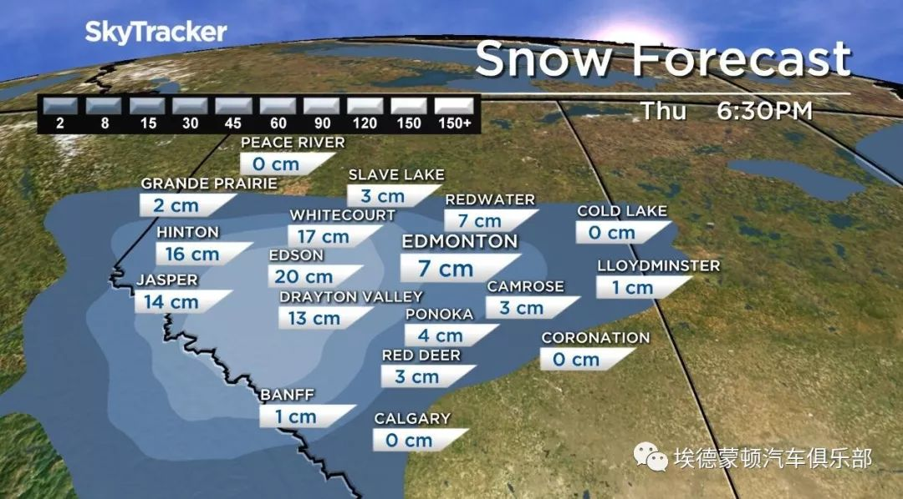
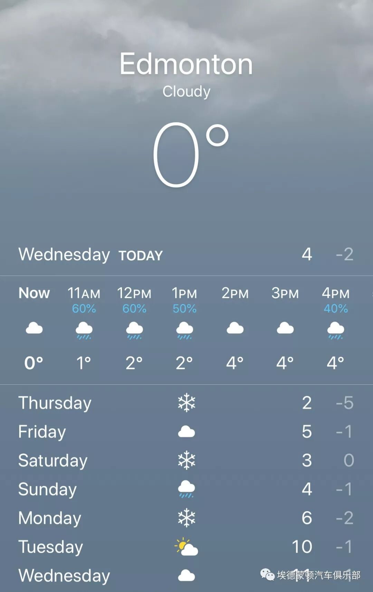
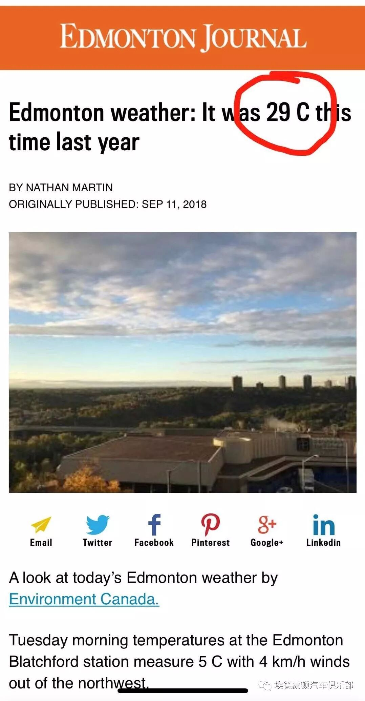
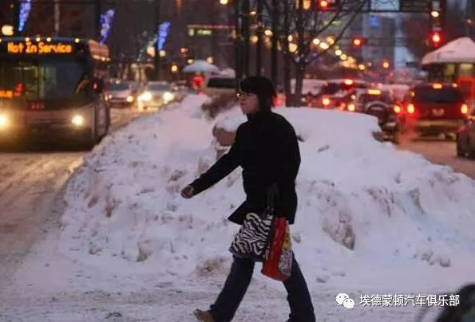
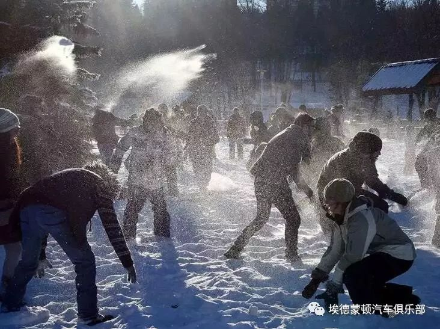
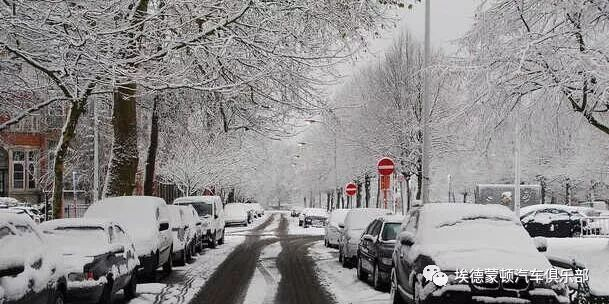
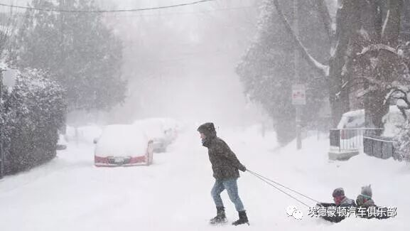
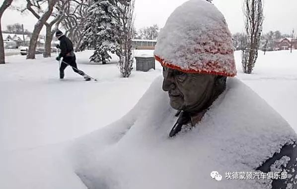
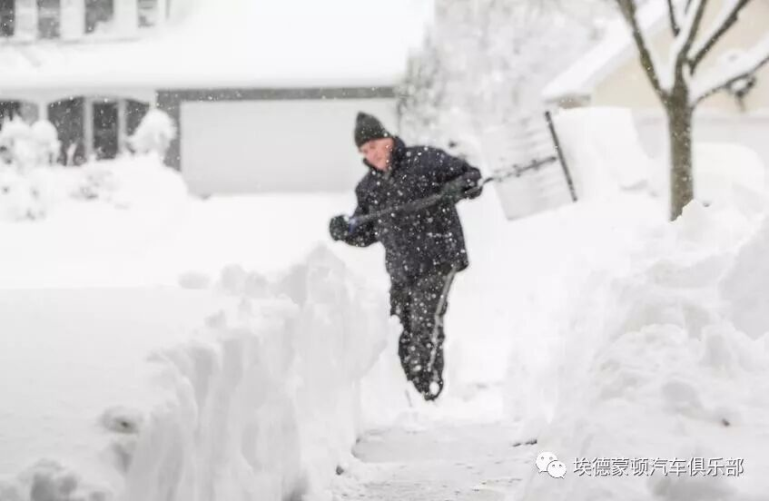

# 无标题

**链接地址:** http://mp.weixin.qq.com/s?__biz=MzAxNzU3ODAwOQ==&mid=2649218244&idx=1&sn=d907ae9e5dcf07d35fcd5e570ee564f9&chksm=83f01db2b48794a46a1c9d187d5fa041b2b02414fbb8223edeca09a115b5335836955c06d4b2&mpshare=1&scene=2&srcid=0913dhuLQJL9ItQCukBP7eSl#rd
**作者:** 
**获取时间:** 2025/8/28 21:31:54
**图片数量:** 15

---

## 原始HTML内容

 

 

突发！突发！

加拿大环境局给艾伯塔省发出下雪警告！

艾伯塔省北部将于周四，周五和周六迎来入冬后第一场大雪！

 

大伙切勿激动！

这还不是喜迎！是泪迎！

这秋天还没来，就冬天了？！

 

 

 

根据环境局的信息

艾伯塔省北部和西北部将会迎来大降雪

部分地区将会迎来15CM - 20CM的降雪

局部地区甚至会更大

 

而咱们埃德蒙顿呢？！

哼哼！

 

当然十分幸运的也在下雪的区域内！

周四开始一直到周六

埃德蒙顿

将会迎来5CM-10CM的降雪

局部地区将会有15CM的降雪

 

 

 

更残忍的是...

我们看了一下新闻...

去年的同一天

我们埃德蒙顿的气温是29°C...

热热热...

 

而今年的同一天...

1°C....

大鹅秋裤全翻出来了...

 

 

 

有勇气的你请看完下面的图...

祝大家爱城冬季愉快！

 

 

 

 

 

---

## 纯文本内容

突发！突发！加拿大环境局给艾伯塔省发出下雪警告！艾伯塔省北部将于周四，周五和周六迎来入冬后第一场大雪！大伙切勿激动！这还不是喜迎！是泪迎！这秋天还没来，就冬天了？！根据环境局的信息艾伯塔省北部和西北部将会迎来大降雪部分地区将会迎来15CM - 20CM的降雪局部地区甚至会更大而咱们埃德蒙顿呢？！哼哼！当然十分幸运的也在下雪的区域内！周四开始一直到周六埃德蒙顿将会迎来5CM-10CM的降雪局部地区将会有15CM的降雪更残忍的是...我们看了一下新闻...去年的同一天我们埃德蒙顿的气温是29°C...热热热...而今年的同一天...1°C....大鹅秋裤全翻出来了...有勇气的你请看完下面的图...祝大家爱城冬季愉快！

---

## 图片列表

-  (原始链接: https://mmbiz.qpic.cn/mmbiz_gif/R5ibD61GBodqexNpVP67bPQgSycASPWgaQribKCicLtGMCDBQKFA2jxeck8cPt9wpXYiaSiayf9sWrhXPhTaxicdVbicQ/640?wx_fmt=gif)
-  (原始链接: https://mmbiz.qpic.cn/mmbiz_jpg/x0ccYC4cialHlicaaMK7gicFLGxvNH3JfjZQQc31GDUDiaI0sZpDm1dx2VP7o5LksXUmqEDuibicZibT3H2fTTrleZwmg/640?wx_fmt=jpeg)
-  (原始链接: https://mmbiz.qpic.cn/mmbiz_jpg/x0ccYC4cialGOgLHakWwIZro9CpaTFia4X394jggCTn1BpP0u1MPaxOgEsVztypjfWY3s5TQubp6GKt8uOccMicuA/640?wx_fmt=jpeg)
-  (原始链接: https://mmbiz.qpic.cn/mmbiz_jpg/R5ibD61GBodqzaVfIukNwvngqrBHdgPiacPy6w76Vh41dqhLPqgxK6Q95XXQA1RTibZibUaSiccnEBdrWYB1DQ1EIyQ/640?wx_fmt=jpeg)
-  (原始链接: https://mmbiz.qpic.cn/mmbiz_jpg/R5ibD61GBodqzaVfIukNwvngqrBHdgPiac7buIK8fWUlQsA4T8WNdibCW6j2U5Pk0fgHe3QvWMynoaO6n17LlWdDA/640?wx_fmt=jpeg)
-  (原始链接: https://mmbiz.qpic.cn/mmbiz_jpg/R5ibD61GBodqzaVfIukNwvngqrBHdgPiacJITNMomiampgMTAkmESIXWCa5tcrgqOXY72b1JnibHRDPBxFbBkpho4Q/640?wx_fmt=jpeg)
-  (原始链接: https://mmbiz.qpic.cn/mmbiz_jpg/R5ibD61GBodqzaVfIukNwvngqrBHdgPiacbHY1jib6hyon778EaCf7NALV0PpoQFohZVqXjhfwegOGVUgBqib8IL8g/640?wx_fmt=jpeg)
-  (原始链接: https://mmbiz.qpic.cn/mmbiz_jpg/R5ibD61GBodqzaVfIukNwvngqrBHdgPiacb8yzGlwvaUtSzu82goIZamHj6icaZobiaT6VSaIEKpIurYLOEkklRapw/640?wx_fmt=jpeg)
-  (原始链接: https://mmbiz.qpic.cn/mmbiz_jpg/R5ibD61GBodqzaVfIukNwvngqrBHdgPiaceNJpF6yTGbMOvDu3Ncuk7bAic2NzLp4c7Zhe5vcJyibSXNwWyS4Z5DqA/640?wx_fmt=jpeg)
-  (原始链接: https://mmbiz.qpic.cn/mmbiz_jpg/R5ibD61GBodqzaVfIukNwvngqrBHdgPiac8aENBLEBOmnfBiclfIHibZQiciagP6pbYqK7laHK3tUG60ia27nlBJ7icdVg/640?wx_fmt=jpeg)
-  (原始链接: https://mmbiz.qpic.cn/mmbiz_jpg/R5ibD61GBodqzaVfIukNwvngqrBHdgPiacLAZDnjibhXUoJsPWia5rfW7qxowARyEWROXy42E4jafKuvfES5ib8wyoQ/640?wx_fmt=jpeg)
-  (原始链接: https://mmbiz.qpic.cn/mmbiz_jpg/R5ibD61GBodqzaVfIukNwvngqrBHdgPiacMJBaZQQG75ZZyy1t4yyazXKBIgprGsnAK3iavQlIxR4pxkocnPyQWYg/640?wx_fmt=jpeg)
-  (原始链接: https://mmbiz.qpic.cn/mmbiz_jpg/R5ibD61GBodqzaVfIukNwvngqrBHdgPiacnogqS0MWJ4CuDBKiaDBq2bvmnn9KQTicUmkPicoTcYNhEVgIE7MQQpPdg/640?wx_fmt=jpeg)
-  (原始链接: https://mmbiz.qpic.cn/mmbiz_jpg/x0ccYC4cialEa9dibkBblRQHN9xzp4RBdg4Z6lezZ1xtbPUiaVLE0DOicsvUl2ZRTeY6nSCtnty6u2r5dG6UJ0DeoA/640?wx_fmt=jpeg)
-  (原始链接: https://mmbiz.qpic.cn/mmbiz_jpg/x0ccYC4cialGqKX6446zH9Rq2sy0XObyOqzsKeiaTEEc9wc6pxj3ibzq8jhM7nueHzG70AcG3QX42jKiaHdn6fDyjw/640?wx_fmt=jpeg)
