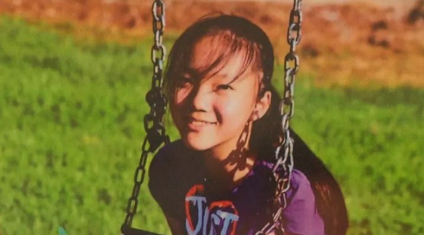
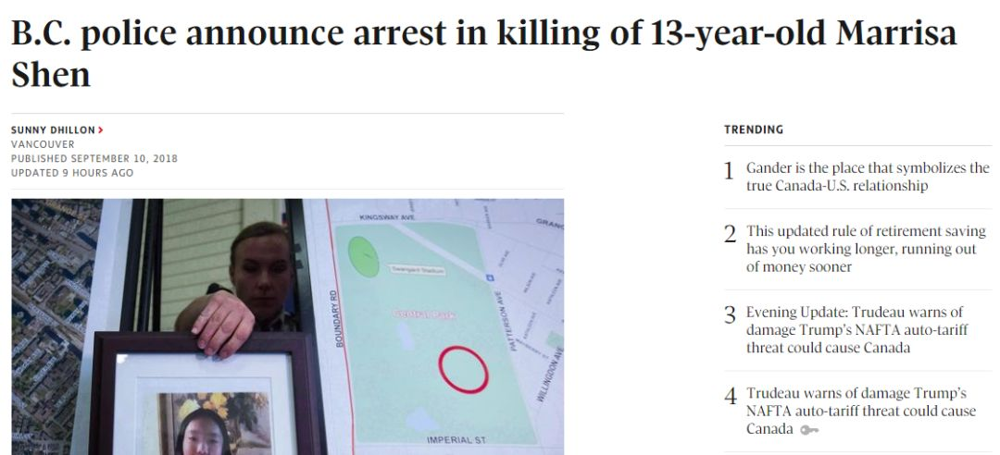
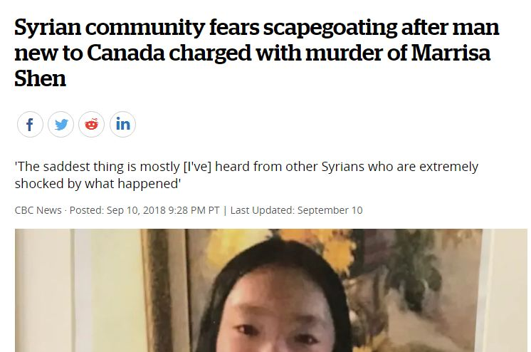
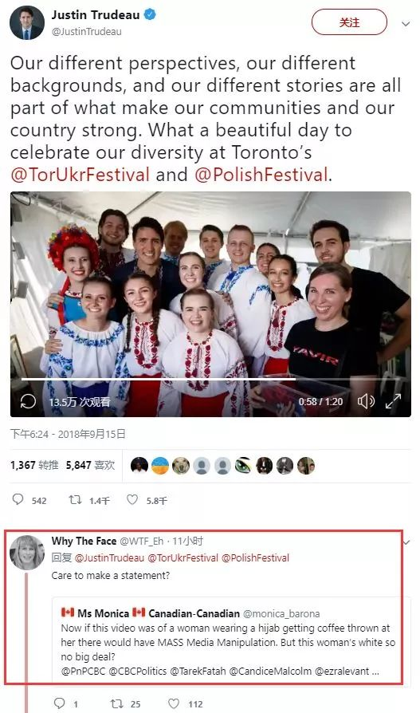
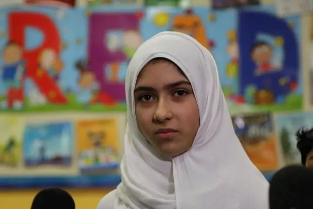

# 无标题

**链接地址:** http://mp.weixin.qq.com/s?__biz=MzI2NTE1ODgwOQ==&mid=2649605018&idx=1&sn=b9b7e3535a732649bf1957d9974e6428&chksm=f2b8ca6cc5cf437a34bcd474647b969e31e315b47cabc2686786c93b1981e165ace5742ea196&mpshare=1&scene=2&srcid=0920JsrbEyeUwJzLMOIoqUay#rd
**作者:** 
**获取时间:** 2025/8/28 21:29:32
**图片数量:** 29

---

## 原始HTML内容

<section style="box-sizing: border-box;"><section class="V5" style="box-sizing: border-box;" powered-by="xiumi.us"><section style="margin-right: 0%;margin-left: 0%;box-sizing: border-box;"><section style="display: inline-block;vertical-align: middle;width: 80%;box-sizing: border-box;"><section class="V5" style="box-sizing: border-box;" powered-by="xiumi.us"><section style="margin-top: 10px;margin-bottom: 10px;text-align: center;box-sizing: border-box;"><section style="display: inline-block;box-sizing: border-box;"><section style="max-width: 100%;font-size: 0px;padding-bottom: 3px;box-sizing: border-box;"><section style="display: inline-block;vertical-align: middle;box-sizing: border-box;"><section style="width: 5px;height: 1px;background-color: rgb(217, 217, 217);box-sizing: border-box;"></section><section style="width: 1px;height: 5px;margin-top: -3px;margin-right: auto;margin-left: auto;background-color: rgb(217, 217, 217);box-sizing: border-box;"></section></section><section style="margin-top: -1px;margin-right: -5px;margin-left: -5px;width: 100%;display: inline-block;vertical-align: middle;padding-right: 8px;padding-left: 8px;box-sizing: border-box;"><section style="width: 100%;height: 1px;background-color: rgb(217, 217, 217);box-sizing: border-box;"></section></section><section style="display: inline-block;vertical-align: middle;box-sizing: border-box;"><section style="width: 5px;height: 1px;background-color: rgb(217, 217, 217);box-sizing: border-box;"></section><section style="width: 1px;height: 5px;margin-top: -3px;margin-right: auto;margin-left: auto;background-color: rgb(217, 217, 217);box-sizing: border-box;"></section></section></section><section style="padding-left: 15px;padding-right: 15px;color: rgb(161, 161, 161);font-size: 14px;box-sizing: border-box;">
点击上方<strong style="box-sizing: border-box;">蓝字</strong>关注我们哟~
</section><section style="max-width: 100%;font-size: 0px;box-sizing: border-box;"><section style="display: inline-block;vertical-align: middle;box-sizing: border-box;"><section style="width: 5px;height: 1px;background-color: rgb(217, 217, 217);box-sizing: border-box;"></section><section style="width: 1px;height: 5px;margin-top: -3px;margin-right: auto;margin-left: auto;background-color: rgb(217, 217, 217);box-sizing: border-box;"></section></section><section style="margin-top: -1px;margin-right: -5px;margin-left: -5px;width: 100%;display: inline-block;vertical-align: middle;padding-right: 8px;padding-left: 8px;box-sizing: border-box;"><section style="width: 100%;height: 1px;background-color: rgb(217, 217, 217);box-sizing: border-box;"></section></section><section style="display: inline-block;vertical-align: middle;box-sizing: border-box;"><section style="width: 5px;height: 1px;background-color: rgb(217, 217, 217);box-sizing: border-box;"></section><section style="width: 1px;height: 5px;margin-top: -3px;margin-right: auto;margin-left: auto;background-color: rgb(217, 217, 217);box-sizing: border-box;"></section></section></section></section></section></section></section><section style="display: inline-block;vertical-align: middle;width: 20%;box-sizing: border-box;"><section class="V5" style="box-sizing: border-box;" powered-by="xiumi.us"><section style="text-align: center;margin: -10px 0% 10px;box-sizing: border-box;"><section style="max-width: 100%;vertical-align: middle;display: inline-block;width: 100%;box-sizing: border-box;"></section></section></section></section></section></section><section class="V5" style="box-sizing: border-box;" powered-by="xiumi.us"><section style="margin: 10px 0%;box-sizing: border-box;"><section style="display: inline-block;width: 100%;vertical-align: top;box-sizing: border-box;"><section class="V5" style="box-sizing: border-box;" powered-by="xiumi.us"><section style="box-sizing: border-box;"><section style="display: inline-block;vertical-align: bottom;width: 75%;padding-right: 10px;box-sizing: border-box;"><section class="V5" style="box-sizing: border-box;" powered-by="xiumi.us"><section style="margin: 10px 0% 3px;box-sizing: border-box;"><section style="display: inline-block;vertical-align: middle;box-sizing: border-box;"><section style="display: inline-block;vertical-align: bottom;padding-left: 5px;padding-right: 5px;line-height: 1.2em;margin-bottom: 2px;color: rgba(80, 182, 201, 0.72);box-sizing: border-box;">
<strong style="box-sizing: border-box;">仔细看下图，有惊喜！</strong>
</section><section style="max-width: 100%;display: inline-block;vertical-align: bottom;width: 1.6em;box-sizing: border-box;"></section></section></section></section></section><section style="display: inline-block;vertical-align: bottom;width: 25%;box-sizing: border-box;"><section class="V5" style="box-sizing: border-box;" powered-by="xiumi.us"><section style="margin-right: 0%;margin-bottom: 3px;margin-left: 0%;text-align: right;box-sizing: border-box;"><section style="display: inline-block;border-bottom: 0.15em solid rgba(80, 182, 201, 0.72);padding-bottom: 3px;box-sizing: border-box;"><section style="display: inline-block;padding: 3px;border-bottom: 0.15em solid rgba(80, 182, 201, 0.72);font-size: 12px;line-height: 1.4;color: rgb(255, 143, 47);box-sizing: border-box;">
<strong style="box-sizing: border-box;">金主大大</strong>
</section></section></section></section></section></section></section><section class="V5" style="box-sizing: border-box;" powered-by="xiumi.us"><section style="margin-right: 0%;margin-left: 0%;box-sizing: border-box;"><section style="background-color: rgba(80, 182, 201, 0.72);height: 2px;box-sizing: border-box;"></section></section></section></section></section></section><section class="V5" style="box-sizing: border-box;" powered-by="xiumi.us"><section style="box-sizing: border-box;"><section style="box-sizing: border-box;">

</section></section></section><section class="V5" style="box-sizing: border-box;" powered-by="xiumi.us"><section style="text-align: center;margin-top: 10px;margin-bottom: 10px;box-sizing: border-box;"><section style="max-width: 100%;vertical-align: middle;display: inline-block;box-sizing: border-box;"><svg xmlns="http://www.w3.org/2000/svg" x="0px" y="0px" viewBox="0 0 902.1 38.2" style="vertical-align: middle;max-width: 100%;box-sizing: border-box;" width="902.1"><g style="box-sizing: border-box;"><path style="box-sizing: border-box;" d="M18.4,1.4c0.9-1.9,2.4-1.9,3.4,0l3.4,6.9c0.9,1.9,3.4,3.7,5.4,4l7.6,1.1c2.1,0.3,2.5,1.7,1,3.2   l-5.5,5.4c-1.5,1.5-2.4,4.3-2.1,6.4l1.3,7.6c0.4,2.1-0.9,2.9-2.7,2l-6.8-3.6c-1.8-1-4.9-1-6.7,0l-6.8,3.6c-1.9,1-3.1,0.1-2.7-2   l1.3-7.6c0.4-2.1-0.6-4.9-2.1-6.4l-5.5-5.4c-1.5-1.5-1-2.9,1-3.2l7.6-1.1c2.1-0.3,4.5-2.1,5.4-4L18.4,1.4z" fill="rgb(178, 243, 230)"></path><path style="box-sizing: border-box;" d="M90.6,5.4c0.7-1.4,1.9-1.4,2.6,0l2.6,5.3c0.7,1.4,2.6,2.8,4.2,3.1l5.9,0.9c1.6,0.2,2,1.3,0.8,2.5   l-4.2,4.1c-1.2,1.1-1.9,3.3-1.6,4.9l1,5.8c0.3,1.6-0.7,2.3-2.1,1.5l-5.2-2.8c-1.4-0.8-3.8-0.8-5.2,0L84,33.6   c-1.4,0.8-2.4,0.1-2.1-1.5l1-5.8c0.3-1.6-0.5-3.8-1.6-4.9l-4.2-4.1c-1.2-1.1-0.8-2.2,0.8-2.5l5.9-0.9c1.6-0.2,3.5-1.6,4.2-3.1   L90.6,5.4z" fill="rgb(190, 204, 246)"></path><path style="box-sizing: border-box;" d="M162.6,7.5c0.6-1.2,1.6-1.2,2.2,0l2.2,4.5c0.6,1.2,2.2,2.4,3.6,2.6l5,0.7c1.4,0.2,1.7,1.1,0.7,2.1   l-3.6,3.5c-1,1-1.6,2.9-1.4,4.2l0.9,5c0.2,1.4-0.6,1.9-1.8,1.3l-4.5-2.4c-1.2-0.6-3.2-0.6-4.4,0l-4.5,2.4c-1.2,0.6-2,0.1-1.8-1.3   l0.9-5c0.2-1.4-0.4-3.3-1.4-4.2l-3.6-3.5c-1-1-0.7-1.9,0.7-2.1l5-0.7c1.4-0.2,3-1.4,3.6-2.6L162.6,7.5z" fill="rgb(150, 208, 240)"></path><path style="box-sizing: border-box;" d="M60.1,19.1c0,2.3-1.9,4.2-4.2,4.2c-2.3,0-4.2-1.9-4.2-4.2s1.9-4.2,4.2-4.2   C58.3,14.9,60.1,16.8,60.1,19.1z" fill="rgb(218, 240, 224)"></path><path style="box-sizing: border-box;" d="M203.8,19.1c0,2.3-1.9,4.2-4.2,4.2c-2.3,0-4.2-1.9-4.2-4.2s1.9-4.2,4.2-4.2   C201.9,14.9,203.8,16.8,203.8,19.1z" fill="rgb(218, 240, 224)"></path><path style="box-sizing: border-box;" d="M130.9,19.1c0,1.7-1.4,3.1-3.1,3.1c-1.7,0-3.1-1.4-3.1-3.1c0-1.7,1.4-3.1,3.1-3.1   C129.5,16.1,130.9,17.4,130.9,19.1z" fill="rgb(218, 240, 224)"></path><path style="box-sizing: border-box;" d="M233.9,1.4c0.9-1.9,2.4-1.9,3.4,0l3.4,6.9c0.9,1.9,3.4,3.7,5.4,4l7.6,1.1c2.1,0.3,2.5,1.7,1,3.2   l-5.5,5.4c-1.5,1.5-2.4,4.3-2.1,6.4l1.3,7.6c0.4,2.1-0.9,2.9-2.7,2l-6.8-3.6c-1.8-1-4.9-1-6.7,0l-6.8,3.6c-1.9,1-3.1,0.1-2.7-2   l1.3-7.6c0.4-2.1-0.6-4.9-2.1-6.4l-5.5-5.4c-1.5-1.5-1-2.9,1-3.2l7.6-1.1c2.1-0.3,4.5-2.1,5.4-4L233.9,1.4z" fill="rgb(178, 243, 230)"></path><path style="box-sizing: border-box;" d="M306.1,5.4c0.7-1.4,1.9-1.4,2.6,0l2.6,5.3c0.7,1.4,2.6,2.8,4.2,3.1l5.9,0.9c1.6,0.2,2,1.3,0.8,2.5   l-4.2,4.1c-1.2,1.1-1.9,3.3-1.6,4.9l1,5.8c0.3,1.6-0.7,2.3-2.1,1.5l-5.2-2.8c-1.4-0.8-3.8-0.8-5.2,0l-5.2,2.8   c-1.4,0.8-2.4,0.1-2.1-1.5l1-5.8c0.3-1.6-0.4-3.8-1.6-4.9l-4.2-4.1c-1.2-1.1-0.8-2.2,0.8-2.5l5.9-0.9c1.6-0.2,3.5-1.6,4.2-3.1   L306.1,5.4z" fill="rgb(190, 204, 246)"></path><path style="box-sizing: border-box;" d="M378.1,7.5c0.6-1.2,1.6-1.2,2.2,0l2.2,4.5c0.6,1.2,2.2,2.4,3.6,2.6l5,0.7c1.4,0.2,1.7,1.1,0.7,2.1   l-3.6,3.5c-1,1-1.6,2.9-1.4,4.2l0.9,5c0.2,1.4-0.6,1.9-1.8,1.3l-4.5-2.4c-1.2-0.6-3.2-0.6-4.4,0l-4.5,2.4c-1.2,0.6-2,0.1-1.8-1.3   l0.9-5c0.2-1.4-0.4-3.3-1.4-4.2l-3.6-3.5c-1-1-0.7-1.9,0.7-2.1l5-0.7c1.4-0.2,3-1.4,3.6-2.6L378.1,7.5z" fill="rgb(150, 208, 240)"></path><path style="box-sizing: border-box;" d="M275.7,19.1c0,2.3-1.9,4.2-4.2,4.2c-2.3,0-4.2-1.9-4.2-4.2s1.9-4.2,4.2-4.2   C273.8,14.9,275.7,16.8,275.7,19.1z" fill="rgb(218, 240, 224)"></path><path style="box-sizing: border-box;" d="M419.3,19.1c0,2.3-1.9,4.2-4.2,4.2c-2.3,0-4.2-1.9-4.2-4.2s1.9-4.2,4.2-4.2   C417.5,14.9,419.3,16.8,419.3,19.1z" fill="rgb(218, 240, 224)"></path><path style="box-sizing: border-box;" d="M346.4,19.1c0,1.7-1.4,3.1-3.1,3.1c-1.7,0-3.1-1.4-3.1-3.1c0-1.7,1.4-3.1,3.1-3.1   C345,16.1,346.4,17.4,346.4,19.1z" fill="rgb(218, 240, 224)"></path><path style="box-sizing: border-box;" d="M449.4,1.4c0.9-1.9,2.4-1.9,3.4,0l3.4,6.9c0.9,1.9,3.4,3.7,5.4,4l7.6,1.1c2.1,0.3,2.5,1.7,1,3.2   l-5.5,5.4c-1.5,1.5-2.4,4.3-2.1,6.4l1.3,7.6c0.4,2.1-0.9,2.9-2.7,2l-6.8-3.6c-1.8-1-4.9-1-6.7,0l-6.8,3.6c-1.9,1-3.1,0.1-2.7-2   l1.3-7.6c0.4-2.1-0.6-4.9-2.1-6.4l-5.5-5.4c-1.5-1.5-1-2.9,1-3.2l7.6-1.1c2.1-0.3,4.5-2.1,5.4-4L449.4,1.4z" fill="rgb(178, 243, 230)"></path><path style="box-sizing: border-box;" d="M521.6,5.4c0.7-1.4,1.9-1.4,2.6,0l2.6,5.3c0.7,1.4,2.6,2.8,4.2,3.1l5.9,0.9c1.6,0.2,2,1.3,0.8,2.5   l-4.2,4.1c-1.2,1.1-1.9,3.3-1.6,4.9l1,5.8c0.3,1.6-0.7,2.3-2.1,1.5l-5.2-2.8c-1.4-0.8-3.8-0.8-5.2,0l-5.2,2.8   c-1.4,0.8-2.4,0.1-2.1-1.5l1-5.8c0.3-1.6-0.5-3.8-1.6-4.9l-4.2-4.1c-1.2-1.1-0.8-2.2,0.8-2.5l5.9-0.9c1.6-0.2,3.5-1.6,4.2-3.1   L521.6,5.4z" fill="rgb(190, 204, 246)"></path><path style="box-sizing: border-box;" d="M593.6,7.5c0.6-1.2,1.6-1.2,2.2,0l2.2,4.5c0.6,1.2,2.2,2.4,3.6,2.6l5,0.7c1.4,0.2,1.7,1.1,0.7,2.1   l-3.6,3.5c-1,1-1.6,2.9-1.4,4.2l0.9,5c0.2,1.4-0.6,1.9-1.8,1.3l-4.5-2.4c-1.2-0.6-3.2-0.6-4.4,0l-4.5,2.4c-1.2,0.6-2,0.1-1.8-1.3   l0.9-5c0.2-1.4-0.4-3.3-1.4-4.2l-3.6-3.5c-1-1-0.7-1.9,0.7-2.1l5-0.7c1.4-0.2,3-1.4,3.6-2.6L593.6,7.5z" fill="rgb(150, 208, 240)"></path><path style="box-sizing: border-box;" d="M491.2,19.1c0,2.3-1.9,4.2-4.2,4.2c-2.3,0-4.2-1.9-4.2-4.2s1.9-4.2,4.2-4.2   C489.3,14.9,491.2,16.8,491.2,19.1z" fill="rgb(218, 240, 224)"></path><path style="box-sizing: border-box;" d="M634.9,19.1c0,2.3-1.9,4.2-4.2,4.2c-2.3,0-4.2-1.9-4.2-4.2s1.9-4.2,4.2-4.2   C633,14.9,634.9,16.8,634.9,19.1z" fill="rgb(218, 240, 224)"></path><path style="box-sizing: border-box;" d="M561.9,19.1c0,1.7-1.4,3.1-3.1,3.1c-1.7,0-3.1-1.4-3.1-3.1c0-1.7,1.4-3.1,3.1-3.1   C560.5,16.1,561.9,17.4,561.9,19.1z" fill="rgb(218, 240, 224)"></path><path style="box-sizing: border-box;" d="M664.9,1.4c0.9-1.9,2.4-1.9,3.4,0l3.4,6.9c0.9,1.9,3.4,3.7,5.4,4l7.6,1.1c2.1,0.3,2.5,1.7,1,3.2   l-5.5,5.4c-1.5,1.5-2.4,4.3-2.1,6.4l1.3,7.6c0.4,2.1-0.9,2.9-2.7,2l-6.8-3.6c-1.8-1-4.9-1-6.7,0l-6.8,3.6c-1.9,1-3.1,0.1-2.7-2   l1.3-7.6c0.4-2.1-0.6-4.9-2.1-6.4l-5.5-5.4c-1.5-1.5-1-2.9,1-3.2l7.6-1.1c2.1-0.3,4.5-2.1,5.4-4L664.9,1.4z" fill="rgb(178, 243, 230)"></path><path style="box-sizing: border-box;" d="M737.1,5.4c0.7-1.4,1.9-1.4,2.6,0l2.6,5.3c0.7,1.4,2.6,2.8,4.2,3.1l5.9,0.9c1.6,0.2,2,1.3,0.8,2.5   l-4.2,4.1c-1.2,1.1-1.9,3.3-1.6,4.9l1,5.8c0.3,1.6-0.7,2.3-2.1,1.5l-5.2-2.8c-1.4-0.8-3.8-0.8-5.2,0l-5.2,2.8   c-1.4,0.8-2.4,0.1-2.1-1.5l1-5.8c0.3-1.6-0.5-3.8-1.6-4.9l-4.2-4.1c-1.2-1.1-0.8-2.2,0.8-2.5l5.9-0.9c1.6-0.2,3.5-1.6,4.2-3.1   L737.1,5.4z" fill="rgb(190, 204, 246)"></path><path style="box-sizing: border-box;" d="M809.2,7.5c0.6-1.2,1.6-1.2,2.2,0l2.2,4.5c0.6,1.2,2.2,2.4,3.6,2.6l5,0.7c1.4,0.2,1.7,1.1,0.7,2.1   l-3.6,3.5c-1,1-1.6,2.9-1.4,4.2l0.9,5c0.2,1.4-0.6,1.9-1.8,1.3l-4.5-2.4c-1.2-0.6-3.2-0.6-4.4,0l-4.5,2.4c-1.2,0.6-2,0.1-1.8-1.3   l0.9-5c0.2-1.4-0.4-3.3-1.4-4.2l-3.6-3.5c-1-1-0.7-1.9,0.7-2.1l5-0.7c1.4-0.2,3-1.4,3.6-2.6L809.2,7.5z" fill="rgb(150, 208, 240)"></path><path style="box-sizing: border-box;" d="M706.7,19.1c0,2.3-1.9,4.2-4.2,4.2c-2.3,0-4.2-1.9-4.2-4.2s1.9-4.2,4.2-4.2   C704.8,14.9,706.7,16.8,706.7,19.1z" fill="rgb(218, 240, 224)"></path><path style="box-sizing: border-box;" d="M850.4,19.1c0,2.3-1.9,4.2-4.2,4.2c-2.3,0-4.2-1.9-4.2-4.2s1.9-4.2,4.2-4.2   C848.5,14.9,850.4,16.8,850.4,19.1z" fill="rgb(218, 240, 224)"></path><path style="box-sizing: border-box;" d="M777.4,19.1c0,1.7-1.4,3.1-3.1,3.1c-1.7,0-3.1-1.4-3.1-3.1c0-1.7,1.4-3.1,3.1-3.1   C776,16.1,777.4,17.4,777.4,19.1z" fill="rgb(218, 240, 224)"></path><path style="box-sizing: border-box;" d="M880.4,1.4c0.9-1.9,2.4-1.9,3.4,0l3.4,6.9c0.9,1.9,3.4,3.7,5.4,4l7.6,1.1c2.1,0.3,2.5,1.7,1,3.2   l-5.5,5.4c-1.5,1.5-2.4,4.3-2.1,6.4l1.3,7.6c0.4,2.1-0.9,2.9-2.7,2l-6.8-3.6c-1.8-1-4.9-1-6.7,0l-6.8,3.6c-1.8,1-3.1,0.1-2.7-2   l1.3-7.6c0.4-2.1-0.6-4.9-2.1-6.4l-5.5-5.4c-1.5-1.5-1-2.9,1-3.2l7.6-1.1c2.1-0.3,4.5-2.1,5.4-4L880.4,1.4z" fill="rgb(178, 243, 230)"></path></g></svg></section></section></section><section class="V5" style="box-sizing: border-box;" powered-by="xiumi.us"><section style="box-sizing: border-box;"><section style="text-align: center;box-sizing: border-box;">
<strong>申小雨案件回顾</strong>

 

 

在过去的一周内加国华人圈最受关注的案件莫过于<strong>申小雨凶杀案</strong>：13岁的华裔女孩申小雨被残忍杀害，凶手叙利亚难民Ibrahim Ali被捕，并被控告<strong>一级谋杀</strong>的罪名。

 

这位犯罪嫌疑人受加国一个社区慈善团体资助，17个月前以难民的身份进入加拿大，登陆加国<strong>仅4个月</strong>后就杀害了无辜的小雨。

 

 

这个现代“<strong>农夫与蛇</strong>”的故事终于激起了民愤！特别是一贯对难民引进政策持强烈反对态度的华人群体：这些年加拿大不断收集移民政策，将华人的移民道路渐渐<strong>堵死</strong>，却将移民政策像这些引起社会不安和骚乱的难民不断<strong>倾斜</strong>……

 

就在整个加拿大社会为之哗然，为这位13岁却惨遭毒手的孩子而默哀落泪并强烈谴责丧心病狂的犯罪者的同时，无数加拿大人，同时也在急切地需要一个<strong>答案</strong>：

 

 

那个今年年初，在警方的调查还没出来之前，就<strong>猴急</strong>发推特为穆斯林女孩头巾案站台，口口声声说“剪头巾”这件事<strong>“极其严重”</strong>（Extremely Seriously），各种慰问的加拿总理<strong>去哪了</strong>？

 

 

申小雨案件的调查是加国重案组<strong>有史以来最大</strong>范围和规模的调查走访，涉及600多次采访取证，收集超过1000小时的监控摄像，询问了2000多名有可能的证人。

 

这样的大案要案，按理说媒体应该抢着头版头条做完整详细的特别报道。然而令人震撼的是：各大主流媒体对于此事都是<strong>遮遮掩掩欲说还休</strong>。不仅少有提及嫌犯是叙利亚难民的身份，反而刻意的突出其是刚来加拿大，没有犯罪记录的信息。

 

 

更令人心寒的是，加拿大总理特鲁多面对一片指责却保持<strong>沉默不语</strong>。

 

 

<strong>无尽的沉默，换来的是漠然的嗤笑</strong>

 

 

在逮捕嫌犯后几天，特鲁多对此充耳不闻。9月15日早晨特鲁多还在多伦多出席了一个庆祝乌克兰节的活动，活动全程脸上洋溢着热情的笑容，与在场人员亲切互动！

 

就如同全加上下民众对于申小雨案件的责问<strong>不存在</strong>一般。他甚至没有对申小雨的被害表现出一丝的怜悯和安慰之情。

 

 

在庆祝活动现场，一位名叫Faith J.Goldy的女士<strong>多次大声</strong>质问特鲁多，对于申小雨案件有什么看法，特鲁多<strong>刻意回避</strong>，转头与其他民众握手，对此问题不做任何回应。

 

经历了漫长的沉默，终于在近日，顶不住舆论压力的加拿大总理杜鲁多接受《麦考林杂志》（Maclean's）记者专访时，首度对此案做出了回应：

 

 

当记者问道：“有些人说过，如果不是因为2015年大选时（你的）那些有关接收叙利亚难民的政策，他们或者他（凶手）就不会出现在这里。”

 

对于这个问题，杜鲁多的答复是：

 
<blockquote>
<strong>“我不是其中（那些人）之一”</strong>（i 'm not one of them）。
</blockquote>
 

 

一个轻松地<strong>甩锅</strong>，是以为加拿大民众<strong>集体失忆</strong>了么？

 

更让人气愤的是：在华人族群铺天盖地的<strong>口诛笔伐</strong>下，这位加拿大总理似乎连维持<strong>表面工程</strong>地做个样子都难以办到。

 

全程都是令人尴尬，冠冕堂皇，避重就轻的<strong>官腔</strong>回复。这个最爱说“我的心与你同在”的总理，在回答这个问题时却没有表现出对于申小雨被害案件的丝毫怜悯。更令人不解和愤懑的是，在视频的<strong>00:27</strong>处开始，他时不时都会笑，甚至还<strong>笑出了声</strong>！

<strong style="max-width: 100%;box-sizing: border-box !important;word-wrap: break-word !important;"> </strong>

 

 

就在整个加拿大都为这位小女孩的死感到心碎的同时，这个倡导难民接纳计划的杜鲁多，却在<strong>笑</strong>。

 

敢问一声总理，可曾听过申小雨下葬时，申小雨妈妈在亲友的搀扶下，追随着女儿的棺材，发出<strong>撕心裂肺的哭喊</strong>？

 

 

《麦考林杂志》的这条视频下也是一片骂声。让这个被华人社区热议的事件发酵上升到<strong>举国震怒</strong>的重大新闻，成为国际舆论的谴责对象。

 

甚至一些民众认为，这位同样极力推行大麻合法化的总理，是不是已经<strong>被毒品搞坏了脑袋</strong>？

 

一个为头巾被扯掉而哭的人，却对一位小姑娘被谋杀一事没有一滴眼泪。

 

他的所作所为，真让加拿大人感到<strong>羞愧难堪</strong>。

 

<strong>难道这就是我们选出的好总统？</strong>

 

 

<strong>截然不同的回应，你的心到底与谁同在？</strong>

 

 

我们的总理真就是这样一位<strong>冷血冷心</strong>之人吗？不，也分<strong>场合</strong>。

 

就在不久前的今年1月12日，一名居住在多伦多的11岁穆斯林女孩声称自己被“<strong>亚裔男子</strong>”追着剪掉了头发。 

 

她的遭遇引起了全国关注，总统特鲁多、安省省长和多伦多市长都纷纷表示安慰。

 

在这个节骨眼上，无论难民给加拿大造成了多大的危害，在对待难民问题上给予宽容和安抚已经成为一种“<strong>政治正确</strong>”。

 

 

受害的穆斯林小女孩得到了各大主流媒体的采访，在镜头前扭捏作态地哭诉自己的遭遇。

 

然而不久后传来的消息令人<strong>大跌眼镜</strong>：多伦多警方发出通报称小女孩根本没有被骚扰，<strong>整件事都是假的</strong>。所谓的袭击，全部都是小女孩<strong>编造</strong>的。

 

而当此事揭发时，政团和媒体的态度又是什么呢？——<strong>她还小，请社会原谅她。</strong>

 

更离谱的是她从没有因诬告向华人社区道歉。特鲁多也没有。甚至到今天为止，他还没有改正或撤回他的公开声明。

 

一个11岁的难民小女孩编造的谎言，可以把整个加拿大<strong>耍得团团转</strong>；而13华人小女孩的被凶残地杀害却只能换来总理和媒体的<strong>漠视和遮盖</strong>。在这个事件上政府和媒体对于叙利亚难民和亚裔截然不同的态度，让亚裔民众对这个国家政府的对于人种人权的保护，<strong style="text-align: left;font-family: &quot;Helvetica Neue&quot;, Helvetica, &quot;Hiragino Sans GB&quot;, &quot;Microsoft YaHei&quot;, Arial, sans-serif;">失望到了极点</strong>！

 

 

<strong>你忘记了，但我们不会！</strong>

 

 

这个在新闻采访上对难民问题含糊其辞，着急甩锅，想将责任撇得干干净净地总理，似乎已经<strong>忘记</strong>自己说过的话：

 

<strong>“如果任何难民对加拿大国民造成了伤害，我将以我的个人名义来负责。”</strong>

 

在难民造成的桩桩命案，民众恐慌等社会问题上，你，特鲁多的个人名义，根本<strong>不值一提</strong>。

 

你并没有真正解决难民问题的办法。你所做的只是假装用廉价的<strong>圣母心</strong>粉饰自己心系民众的善良的政治人物形象。而当遇到任何难民引起的骚动时，你除了站上台面表示<strong>虚伪的同情</strong>，并不会真正采取任何措施去抑制此类事件再次发生。你只能任由这个国家被由你亲手接纳引进的难民<strong>破坏殆尽</strong>！

 

 
<strong>我们要的不光是道歉</strong> 

 

这位口口声声说是为民众着想的好总理，一年中只有一天关心加拿大华人社区－<strong>选举日</strong>。而其它时间，他忽视这个社区－或者责难他们那些他们没有犯下的罪行！

 

<strong>而这样的漠视，必须停止！</strong>

 

 

悲愤交加的加国华人自发组织了<strong>用华语书写联名请愿信</strong>：请每一位有社会责任感和廉耻心的华人，都在这篇联名信中签署自己属于中国人的姓氏！

 

地址：

https://www.therebel.media/justin_trudeau_must_apologize_to_the_chinese_canadian_community?from=timeline&amp;isappinstalled=0

或点击文章下方“<strong>阅读原文</strong>”按钮进行签名。

 

请签名要求特鲁多向华人社区道歉，因为他错误地谴责华人犯了他并没有犯的罪，因为他对国家安全如此<strong>掉以轻心</strong>，因为他对这起谋杀对华人社区造成的痛苦<strong>视而不见</strong>！

 

让巨大的<strong>社会舆论压力</strong>让这位虚伪的总理意识到：将华人当作<strong>二等公民</strong>是怎样的一件错误！ 

 

 

<strong>明年就大选了，手握投票权的华人们，是时候去行使握在你手上至高无上的权利！这一次我们选择不沉默。不要以为是别人的女儿，跟自己无关；这次是别人的女儿，下次可能就是自己的孩子！不要以为是小概率事件，发生在自己家的时候就成为100%的沉重打击！</strong>

 

"现在，作为一个加拿大人，我对自已上次大选投了特鲁多一票而感到万分羞愧。请放心，特鲁多先生，这一次，我一定会<strong>纠正我的错误</strong>。"

 文章综合编辑信息来源：加拿大家园，卡尔加里微生活，加国无忧。

 

<strong>本文特不设转载保护，望各大华人公众号在注明来源的前提下积极进行转载宣传。</strong>

 

- END -

 
</section></section></section><section class="V5" style="box-sizing: border-box;" powered-by="xiumi.us"><section style="margin: 10px 0%;box-sizing: border-box;"><section style="display: inline-block;vertical-align: top;width: 50%;box-sizing: border-box;"><section class="V5" style="box-sizing: border-box;" powered-by="xiumi.us"><section style="text-align: right;margin-right: 0%;margin-bottom: -10px;margin-left: 0%;box-sizing: border-box;"><section style="display: inline-block;min-width: 10%;max-width: 100%;vertical-align: top;padding-right: 20px;box-sizing: border-box;"><section class="V5" style="box-sizing: border-box;" powered-by="xiumi.us"><section style="margin-right: 0%;margin-left: 0%;box-sizing: border-box;"><section style="text-align: center;color: rgb(138, 206, 191);box-sizing: border-box;">
<strong style="box-sizing: border-box;">特约</strong> 
</section></section></section></section></section></section><section class="V5" style="box-sizing: border-box;" powered-by="xiumi.us"><section style="margin-top: -10px;margin-right: 0%;margin-left: 0%;text-align: right;transform: translate3d(9px, 0px, 0px);box-sizing: border-box;"><section style="display: inline-block;vertical-align: top;background-color: rgb(255, 255, 255);box-sizing: border-box;"><section style="display: inline-block;vertical-align: bottom;margin-bottom: 11px;width: 5px;border-right: 1px solid rgb(79, 118, 120);border-left: 1px solid rgb(79, 118, 120);height: 8px;transform-origin: center bottom 0px;-webkit-transform-origin: center bottom 0px;-moz-transform-origin: center bottom 0px;-o-transform-origin: center bottom 0px;transform: skew(-30deg);-webkit-transform: skew(-30deg);-moz-transform: skew(-30deg);-o-transform: skew(-30deg);border-top-color: rgb(79, 118, 120);border-bottom-color: rgb(79, 118, 120);box-sizing: border-box;"></section><section style="display: inline-block;vertical-align: top;padding-left: 10px;box-sizing: border-box;">
 
</section></section><section style="height: 12px;margin-top: -12px;border-top: 1px solid rgb(79, 118, 120);box-sizing: border-box;"></section></section></section></section><section style="display: inline-block;vertical-align: top;width: 50%;box-sizing: border-box;"><section class="V5" style="box-sizing: border-box;" powered-by="xiumi.us"><section style="margin-right: 0%;margin-left: 0%;box-sizing: border-box;"><section style="display: inline-block;vertical-align: top;background-color: rgb(255, 255, 255);box-sizing: border-box;"><section style="display: inline-block;vertical-align: top;padding-right: 5px;box-sizing: border-box;">
 
</section><section style="margin-right: 4px;margin-bottom: 4px;display: inline-block;vertical-align: bottom;width: 5px;border-right: 1px solid rgb(79, 118, 120);border-left: 1px solid rgb(79, 118, 120);height: 8px;transform-origin: center bottom 0px;-webkit-transform-origin: center bottom 0px;-moz-transform-origin: center bottom 0px;-o-transform-origin: center bottom 0px;transform: skew(-30deg);-webkit-transform: skew(-30deg);-moz-transform: skew(-30deg);-o-transform: skew(-30deg);border-top-color: rgb(79, 118, 120);border-bottom-color: rgb(79, 118, 120);box-sizing: border-box;"></section></section><section style="height: 12px;margin-top: -12px;border-top: 1px solid rgb(79, 118, 120);box-sizing: border-box;"></section></section></section><section class="V5" style="box-sizing: border-box;" powered-by="xiumi.us"><section style="margin-top: -10px;margin-right: 0%;margin-left: 0%;box-sizing: border-box;"><section style="display: inline-block;min-width: 10%;max-width: 100%;vertical-align: top;padding-left: 20px;box-sizing: border-box;"><section class="V5" style="box-sizing: border-box;" powered-by="xiumi.us"><section style="box-sizing: border-box;"><section style="color: rgb(138, 206, 191);box-sizing: border-box;">
<strong style="box-sizing: border-box;">赞助</strong>
</section></section></section></section></section></section></section></section></section><section class="V5" style="box-sizing: border-box;" powered-by="xiumi.us"><section style="box-sizing: border-box;"><section style="box-sizing: border-box;">

</section></section></section><section class="V5" style="box-sizing: border-box;" powered-by="xiumi.us"><section style="margin-top: 0.5em;margin-bottom: 0.5em;box-sizing: border-box;"> <section style="display: inline-block;height: 1px;width: 75%;margin-top: 15px;vertical-align: top;background: url(&quot;https://mmbiz.qpic.cn/mmbiz_png/D1nJqnhkPyLuxr5fhuM0ibz0I8qVghgvy5OQvrIVKKEbgZE38iczB8eo9gCE7VnxCUbo9DdKmlOYn5SSTgbhsyHQ/640?wx_fmt=png&quot;) repeat-x rgba(80, 182, 201, 0.72);box-sizing: border-box;"></section></section></section><section class="V5" style="box-sizing: border-box;" powered-by="xiumi.us"><section style="text-align: center;box-sizing: border-box;"> </section></section><section class="V5" style="box-sizing: border-box;" powered-by="xiumi.us"><section style="margin: 40px 0% 10px;text-align: center;box-sizing: border-box;"><section style="display: inline-block;width: 90%;border-width: 1px;border-style: dotted;border-color: rgba(80, 182, 201, 0.72);padding: 10px;border-radius: 0px;box-sizing: border-box;"><section class="V5" style="box-sizing: border-box;" powered-by="xiumi.us"><section style="transform: translate3d(20px, 0px, 0px);text-align: left;font-size: 11px;margin-top: -55px;margin-right: 0%;margin-left: 0%;box-sizing: border-box;"><section style="box-sizing: border-box;width: 7em;height: 7em;display: inline-block;vertical-align: bottom;border-radius: 100%;border-width: 5px;border-style: none;border-color: rgba(80, 182, 201, 0.72);background-position: center center;background-repeat: no-repeat;background-size: cover;background-image: url(&quot;https://mmbiz.qpic.cn/mmbiz_jpg/D1nJqnhkPyLuxr5fhuM0ibz0I8qVghgvyqmiaTt0I3IicBTQgTNz4pHPqo3XbJI4cVTXSpkjdX6UJe9KPJiazQtSZw/640?wx_fmt=jpeg&quot;);"><section style="width: 100%;height: 100%;overflow: hidden;box-sizing: border-box;"></section></section></section></section><section class="V5" style="box-sizing: border-box;" powered-by="xiumi.us"><section style="box-sizing: border-box;"><section class="group-empty" style="display: inline-block;vertical-align: top;width: 38.2%;box-sizing: border-box;"></section><section style="display: inline-block;vertical-align: top;width: 61.8%;box-sizing: border-box;"><section class="V5" style="box-sizing: border-box;" powered-by="xiumi.us"><section style="margin-right: 0%;margin-left: 0%;box-sizing: border-box;"><section style="font-size: 18px;color: rgb(67, 103, 117);line-height: 1.6;letter-spacing: 1px;box-sizing: border-box;">
<strong style="box-sizing: border-box;">埃德蒙顿微生活</strong>
</section></section></section><section class="V5" style="box-sizing: border-box;" powered-by="xiumi.us"><section style="margin-top: 0.5em;margin-bottom: 0.5em;box-sizing: border-box;"><section style="background-color: rgba(80, 182, 201, 0.72);height: 1px;box-sizing: border-box;"></section></section></section></section></section></section><section class="V5" style="box-sizing: border-box;" powered-by="xiumi.us"><section style="box-sizing: border-box;"><section style="text-align: justify;font-size: 14px;color: rgba(62, 62, 62, 0.72);letter-spacing: 2px;box-sizing: border-box;">
<strong style="box-sizing: border-box;">关心埃德蒙顿民生，</strong>

<strong style="box-sizing: border-box;">关注埃德蒙顿的发展。</strong>

 

埃德蒙顿微生活是“吃喝玩乐埃德蒙顿”旗下，为埃德蒙顿地区的居民提供每日最新的吃喝玩乐、工作学习、商业投资的媒体平台 。
</section></section></section><section class="V5" style="box-sizing: border-box;" powered-by="xiumi.us"><section style="box-sizing: border-box;"><section style="text-align: left;box-sizing: border-box;">
 
</section></section></section><section class="V5" style="box-sizing: border-box;" powered-by="xiumi.us"><section style="box-sizing: border-box;"><section style="display: inline-block;vertical-align: middle;width: 61.8%;box-sizing: border-box;"><section class="V5" style="box-sizing: border-box;" powered-by="xiumi.us"><section style="box-sizing: border-box;"><section style="text-align: justify;font-size: 12px;color: rgba(62, 62, 62, 0.37);line-height: 1.9;letter-spacing: 0px;box-sizing: border-box;">
我们的目标是以最新、最快、最及时的方式 报道埃德蒙顿的新鲜事 。 
</section></section></section></section><section style="display: inline-block;vertical-align: middle;width: 38.2%;box-sizing: border-box;"><section class="V5" style="box-sizing: border-box;" powered-by="xiumi.us"><section style="margin-right: 0%;margin-left: 0%;box-sizing: border-box;"><section style="max-width: 100%;vertical-align: middle;display: inline-block;width: 70%;box-sizing: border-box;"></section></section></section></section></section></section></section></section></section></section>
 

---

## 纯文本内容

点击上方蓝字关注我们哟~仔细看下图，有惊喜！金主大大申小雨案件回顾在过去的一周内加国华人圈最受关注的案件莫过于申小雨凶杀案：13岁的华裔女孩申小雨被残忍杀害，凶手叙利亚难民Ibrahim Ali被捕，并被控告一级谋杀的罪名。这位犯罪嫌疑人受加国一个社区慈善团体资助，17个月前以难民的身份进入加拿大，登陆加国仅4个月后就杀害了无辜的小雨。这个现代“农夫与蛇”的故事终于激起了民愤！特别是一贯对难民引进政策持强烈反对态度的华人群体：这些年加拿大不断收集移民政策，将华人的移民道路渐渐堵死，却将移民政策像这些引起社会不安和骚乱的难民不断倾斜……就在整个加拿大社会为之哗然，为这位13岁却惨遭毒手的孩子而默哀落泪并强烈谴责丧心病狂的犯罪者的同时，无数加拿大人，同时也在急切地需要一个答案：那个今年年初，在警方的调查还没出来之前，就猴急发推特为穆斯林女孩头巾案站台，口口声声说“剪头巾”这件事“极其严重”（Extremely Seriously），各种慰问的加拿总理去哪了？申小雨案件的调查是加国重案组有史以来最大范围和规模的调查走访，涉及600多次采访取证，收集超过1000小时的监控摄像，询问了2000多名有可能的证人。这样的大案要案，按理说媒体应该抢着头版头条做完整详细的特别报道。然而令人震撼的是：各大主流媒体对于此事都是遮遮掩掩欲说还休。不仅少有提及嫌犯是叙利亚难民的身份，反而刻意的突出其是刚来加拿大，没有犯罪记录的信息。更令人心寒的是，加拿大总理特鲁多面对一片指责却保持沉默不语。无尽的沉默，换来的是漠然的嗤笑在逮捕嫌犯后几天，特鲁多对此充耳不闻。9月15日早晨特鲁多还在多伦多出席了一个庆祝乌克兰节的活动，活动全程脸上洋溢着热情的笑容，与在场人员亲切互动！就如同全加上下民众对于申小雨案件的责问不存在一般。他甚至没有对申小雨的被害表现出一丝的怜悯和安慰之情。在庆祝活动现场，一位名叫Faith J.Goldy的女士多次大声质问特鲁多，对于申小雨案件有什么看法，特鲁多刻意回避，转头与其他民众握手，对此问题不做任何回应。经历了漫长的沉默，终于在近日，顶不住舆论压力的加拿大总理杜鲁多接受《麦考林杂志》（Maclean's）记者专访时，首度对此案做出了回应：当记者问道：“有些人说过，如果不是因为2015年大选时（你的）那些有关接收叙利亚难民的政策，他们或者他（凶手）就不会出现在这里。”对于这个问题，杜鲁多的答复是：“我不是其中（那些人）之一”（i 'm not one of them）。一个轻松地甩锅，是以为加拿大民众集体失忆了么？更让人气愤的是：在华人族群铺天盖地的口诛笔伐下，这位加拿大总理似乎连维持表面工程地做个样子都难以办到。全程都是令人尴尬，冠冕堂皇，避重就轻的官腔回复。这个最爱说“我的心与你同在”的总理，在回答这个问题时却没有表现出对于申小雨被害案件的丝毫怜悯。更令人不解和愤懑的是，在视频的00:27处开始，他时不时都会笑，甚至还笑出了声！就在整个加拿大都为这位小女孩的死感到心碎的同时，这个倡导难民接纳计划的杜鲁多，却在笑。敢问一声总理，可曾听过申小雨下葬时，申小雨妈妈在亲友的搀扶下，追随着女儿的棺材，发出撕心裂肺的哭喊？《麦考林杂志》的这条视频下也是一片骂声。让这个被华人社区热议的事件发酵上升到举国震怒的重大新闻，成为国际舆论的谴责对象。甚至一些民众认为，这位同样极力推行大麻合法化的总理，是不是已经被毒品搞坏了脑袋？一个为头巾被扯掉而哭的人，却对一位小姑娘被谋杀一事没有一滴眼泪。他的所作所为，真让加拿大人感到羞愧难堪。难道这就是我们选出的好总统？截然不同的回应，你的心到底与谁同在？我们的总理真就是这样一位冷血冷心之人吗？不，也分场合。就在不久前的今年1月12日，一名居住在多伦多的11岁穆斯林女孩声称自己被“亚裔男子”追着剪掉了头发。她的遭遇引起了全国关注，总统特鲁多、安省省长和多伦多市长都纷纷表示安慰。在这个节骨眼上，无论难民给加拿大造成了多大的危害，在对待难民问题上给予宽容和安抚已经成为一种“政治正确”。受害的穆斯林小女孩得到了各大主流媒体的采访，在镜头前扭捏作态地哭诉自己的遭遇。然而不久后传来的消息令人大跌眼镜：多伦多警方发出通报称小女孩根本没有被骚扰，整件事都是假的。所谓的袭击，全部都是小女孩编造的。而当此事揭发时，政团和媒体的态度又是什么呢？——她还小，请社会原谅她。更离谱的是她从没有因诬告向华人社区道歉。特鲁多也没有。甚至到今天为止，他还没有改正或撤回他的公开声明。一个11岁的难民小女孩编造的谎言，可以把整个加拿大耍得团团转；而13华人小女孩的被凶残地杀害却只能换来总理和媒体的漠视和遮盖。在这个事件上政府和媒体对于叙利亚难民和亚裔截然不同的态度，让亚裔民众对这个国家政府的对于人种人权的保护，失望到了极点！你忘记了，但我们不会！这个在新闻采访上对难民问题含糊其辞，着急甩锅，想将责任撇得干干净净地总理，似乎已经忘记自己说过的话：“如果任何难民对加拿大国民造成了伤害，我将以我的个人名义来负责。”在难民造成的桩桩命案，民众恐慌等社会问题上，你，特鲁多的个人名义，根本不值一提。你并没有真正解决难民问题的办法。你所做的只是假装用廉价的圣母心粉饰自己心系民众的善良的政治人物形象。而当遇到任何难民引起的骚动时，你除了站上台面表示虚伪的同情，并不会真正采取任何措施去抑制此类事件再次发生。你只能任由这个国家被由你亲手接纳引进的难民破坏殆尽！我们要的不光是道歉这位口口声声说是为民众着想的好总理，一年中只有一天关心加拿大华人社区－选举日。而其它时间，他忽视这个社区－或者责难他们那些他们没有犯下的罪行！而这样的漠视，必须停止！悲愤交加的加国华人自发组织了用华语书写联名请愿信：请每一位有社会责任感和廉耻心的华人，都在这篇联名信中签署自己属于中国人的姓氏！地址：https://www.therebel.media/justin_trudeau_must_apologize_to_the_chinese_canadian_community?from=timeline&isappinstalled=0或点击文章下方“阅读原文”按钮进行签名。请签名要求特鲁多向华人社区道歉，因为他错误地谴责华人犯了他并没有犯的罪，因为他对国家安全如此掉以轻心，因为他对这起谋杀对华人社区造成的痛苦视而不见！让巨大的社会舆论压力让这位虚伪的总理意识到：将华人当作二等公民是怎样的一件错误！明年就大选了，手握投票权的华人们，是时候去行使握在你手上至高无上的权利！这一次我们选择不沉默。不要以为是别人的女儿，跟自己无关；这次是别人的女儿，下次可能就是自己的孩子！不要以为是小概率事件，发生在自己家的时候就成为100%的沉重打击！"现在，作为一个加拿大人，我对自已上次大选投了特鲁多一票而感到万分羞愧。请放心，特鲁多先生，这一次，我一定会纠正我的错误。"文章综合编辑信息来源：加拿大家园，卡尔加里微生活，加国无忧。本文特不设转载保护，望各大华人公众号在注明来源的前提下积极进行转载宣传。- END -特约赞助 埃德蒙顿微生活关心埃德蒙顿民生，关注埃德蒙顿的发展。埃德蒙顿微生活是“吃喝玩乐埃德蒙顿”旗下，为埃德蒙顿地区的居民提供每日最新的吃喝玩乐、工作学习、商业投资的媒体平台 。我们的目标是以最新、最快、最及时的方式 报道埃德蒙顿的新鲜事 。

---

## 图片列表

-  (原始链接: https://mmbiz.qpic.cn/mmbiz_gif/D1nJqnhkPyLuxr5fhuM0ibz0I8qVghgvy6icRggHUNiaibOicb9WCvzK6vgeXn6fEziciccfQV8U3HOrIARftoTyZ3zXg/640?wx_fmt=gif)
-  (原始链接: https://mmbiz.qpic.cn/mmbiz_gif/D1nJqnhkPyLuxr5fhuM0ibz0I8qVghgvyFfPQhKkxqS6YMWCLmhJA3miaIIsGPYOJ9ibZFQJPvOgpTea00c6Lf7BQ/640?wx_fmt=gif)
-  (原始链接: https://mmbiz.qpic.cn/mmbiz_jpg/mZIpZ2dRo6ZVoJhUecmkegkWqzRmL9rPG0o5dC4A2b2rmKExo9cF7qY7zZ8iapWicrE102u46qXAgBN661mHscUQ/640?wx_fmt=jpeg)
-  (原始链接: https://mmbiz.qpic.cn/mmbiz_jpg/D1nJqnhkPyJT4U32Y548Hw5aBlviccaDpkfNVYF9uRyc8DkjQYVxHibVjQqeC0eFuWFl7ndQqvSrQu6yx3XXefhg/640?wx_fmt=jpeg)
-  (原始链接: https://mmbiz.qpic.cn/mmbiz_jpg/D1nJqnhkPyJMnbYWl1jibuWOJhwEH9ALftJic1p4AOTYRM288ia0RibgNzECAWsU2VghE4oe7ibX1P86O43YhlJ9BZg/640?wx_fmt=jpeg)
-  (原始链接: https://mmbiz.qpic.cn/mmbiz_jpg/mZIpZ2dRo6bEGJj3ZeL7Xib1XedXSCvicUVee9QebibGnDy0Y1boHullFBNgiav980nlGWyCuuaZ6lSlcxQEnuXm5A/640?wx_fmt=jpeg)
-  (原始链接: http://mmbiz.qpic.cn/mmbiz_png/n1aDVMaGh4JMD0dGQmEbiaVBicujQ8qVNM7oZ47Psicd2MG0UuDLLHEQbhL7xEsC6qPqLn8km1cOxxX2FzJgsLKIA/640?wx_fmt=png)
-  (原始链接: https://mmbiz.qpic.cn/mmbiz_jpg/3LxMQLD9XuJX4BYId8RfVmayjf3YGnlrgcvx87vBMWIiaQr7AibdSSAJFOqxYIcKe4GDnicyJ3Pcx6vjLCvXdDTSQ/640?wx_fmt=jpeg)
-  (原始链接: https://mmbiz.qpic.cn/mmbiz_png/bV0g0874ZpcyicOBbxxAOz0kTY6mqSzfXCVicK9BSRQiboPibW1M7L9jZgMEYVJS8cz1H2XDy9aCKnbNsPCcaPe9Ng/640?wx_fmt=png)
-  (原始链接: https://mmbiz.qpic.cn/mmbiz_png/L5GmQ5Uh1kqmaWMIpuUZtzzNknpoj0Ggztbic54m9S0BWpwzm1dYJibTPhBH6bd3QfCVZFhIzhk37C0I7BWHkLHw/640?wx_fmt=png)
-  (原始链接: https://mmbiz.qpic.cn/mmbiz_png/L5GmQ5Uh1kqmaWMIpuUZtzzNknpoj0GgJZ1MxTWT2riaXaSFLMP2y0RBDjyrNq3xFicrF4hAJmsQ4LM0zcGYDclA/640?wx_fmt=png)
-  (原始链接: https://mmbiz.qpic.cn/mmbiz_png/kRXMiae96WTCJr8slIibs9mJWuKCcppqtzpvZnGAwZMuOPPFoLv9ibq1WOETDHGowRRibzroqZSoNsa1fxInysHDSQ/640?wx_fmt=png)
-  (原始链接: https://mmbiz.qpic.cn/mmbiz_jpg/3LxMQLD9XuJX4BYId8RfVmayjf3YGnlrI6trrM2swsZQqibwH5tEVCEyH6IMrSgsOLfEEia1UbY0f5qpqcCptJ6A/640?wx_fmt=jpeg)
-  (原始链接: https://mmbiz.qpic.cn/mmbiz_jpg/bV0g0874ZpcyicOBbxxAOz0kTY6mqSzfX5qH7079H9UgQRicUmaFHoEY4KuedOj1GAZBHOK91zcwy8fyQa7xoIOg/640?wx_fmt=jpeg)
-  (原始链接: https://mmbiz.qpic.cn/mmbiz_png/bV0g0874ZpcyicOBbxxAOz0kTY6mqSzfXAGpFibB8lOk0KQQ9tOO65Im4Q99YKNIhboZ6H6m0ZYOkzD5cmaNLuhw/640?wx_fmt=png)
-  (原始链接: https://mmbiz.qpic.cn/mmbiz_gif/bV0g0874ZpcyicOBbxxAOz0kTY6mqSzfXfD23eXPmMiaF58bF0lYOjSRc2ibkNLMmdiaoIuoLn8LL2OQKL4lJCovgQ/640?wx_fmt=gif)
-  (原始链接: https://mmbiz.qpic.cn/mmbiz_png/wbBfrFqAYvv3ARZl7Cv9UvcehZ8kFstXbHia7bsiaKhuQrpyEtAQbthVko1yaMSI71rLxSNpuKdkKiae3hAWq8U0A/640?wx_fmt=png)
-  (原始链接: https://mmbiz.qpic.cn/mmbiz_png/wbBfrFqAYvv3ARZl7Cv9UvcehZ8kFstXsDp9V8ourf4sGVdBMKyQY7Tia5zbu5NsSQKWZ83x2fq1hKB2NiaicNUnw/640?wx_fmt=png)
-  (原始链接: https://mmbiz.qpic.cn/mmbiz_png/wbBfrFqAYvv3ARZl7Cv9UvcehZ8kFstXFbdHu6KwzAkoia1QhIt4QhJGugSlKus7lTgl2pjGFg4x5MibuEKv5okw/640?wx_fmt=png)
-  (原始链接: https://mmbiz.qpic.cn/mmbiz_jpg/3LxMQLD9XuI1zE8wMqRyxmhWvqUcoWso2mHJf0UOMZEJ9PT4iap49KEVRHFjKPGK5uy3d6ekTd5ib1Z20GZFqyjg/640?wx_fmt=jpeg)
-  (原始链接: https://mmbiz.qpic.cn/mmbiz_jpg/3LxMQLD9XuJX4BYId8RfVmayjf3YGnlrQniag3xj3OqxKRx8Q9TMloRiaZsvOiavd9hO34ictQmJdQ6dL6Ll5PsoJw/640?wx_fmt=jpeg)
-  (原始链接: https://mmbiz.qpic.cn/mmbiz_jpg/3LxMQLD9XuI1zE8wMqRyxmhWvqUcoWso8LAQ3YuYYBSq4SWgSibOFmzvbIsubOyS2WOJj1GdPzxRCJTzG4N5HxQ/640?wx_fmt=jpeg)
-  (原始链接: https://mmbiz.qpic.cn/mmbiz_jpg/3LxMQLD9XuJX4BYId8RfVmayjf3YGnlrg26kzaQuNd4ibqPvRXS88kh38vj75L1dty8TTBb1r2GBeMr8dU9h6Sg/640?wx_fmt=jpeg)
-  (原始链接: https://mmbiz.qpic.cn/mmbiz_png/D1nJqnhkPyLuxr5fhuM0ibz0I8qVghgvyCtT8wicxAVLSWiaW4KgEOlLuPmYHVwO02m2tKZbynNytLAkQ4CJuu8yA/640?wx_fmt=png)
-  (原始链接: https://mmbiz.qpic.cn/mmbiz_jpg/3LxMQLD9XuJX4BYId8RfVmayjf3YGnlrpKIQZxvXXGvWcWW1247R5Rhf8qibzWsfNb9Vs94ZgxFALDowtAasWVw/640?wx_fmt=jpeg)
-  (原始链接: https://mmbiz.qpic.cn/mmbiz_jpg/D1nJqnhkPyLo3L0iawegpPefdoialIOMJsLYAWDKWZibActHTInqxOYIqm69LVFG0zLVDT3SI3PON4Sz2gvhHH80g/640?wx_fmt=jpeg)
-  (原始链接: https://mmbiz.qpic.cn/mmbiz_png/D1nJqnhkPyLuxr5fhuM0ibz0I8qVghgvylFvM6gydxZcaf9DO0j2umGJGbPZBvSAqXTd3Avic8AwExGrNqTO36hw/640?wx_fmt=png)
-  (原始链接: https://mmbiz.qpic.cn/mmbiz_jpg/D1nJqnhkPyLuxr5fhuM0ibz0I8qVghgvyqmiaTt0I3IicBTQgTNz4pHPqo3XbJI4cVTXSpkjdX6UJe9KPJiazQtSZw/640?wx_fmt=jpeg)
-  (原始链接: https://mmbiz.qpic.cn/mmbiz_jpg/D1nJqnhkPyLuxr5fhuM0ibz0I8qVghgvycvHzrqxNRk8WpSrmSicSKAyK25yqicDo3O3QHu4eIUE6A2gSD4dribowQ/640?wx_fmt=jpeg)
