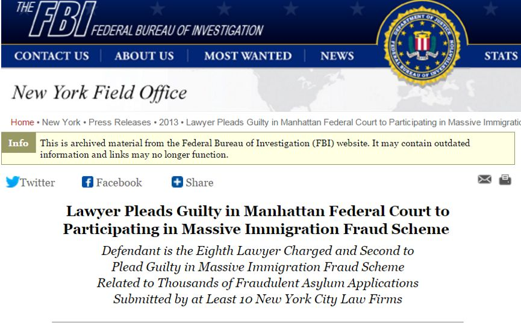
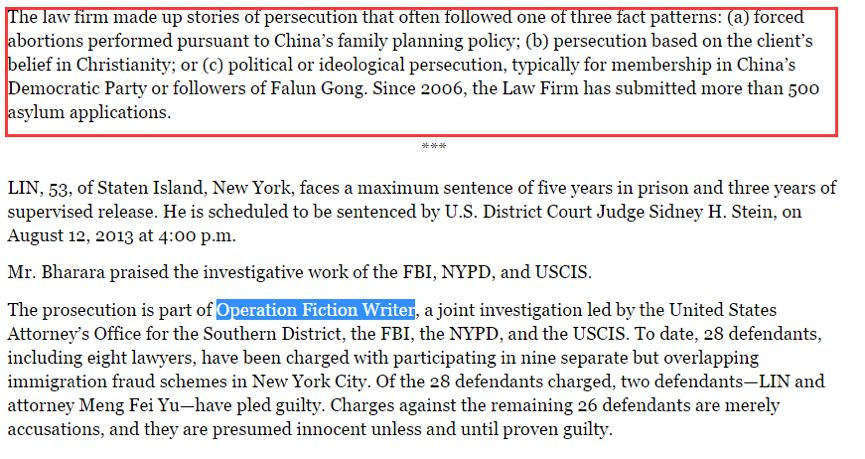
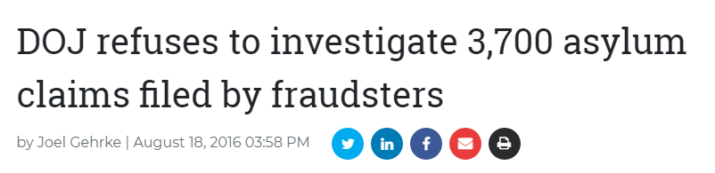
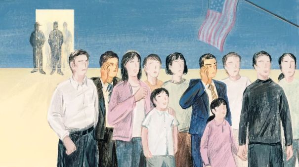
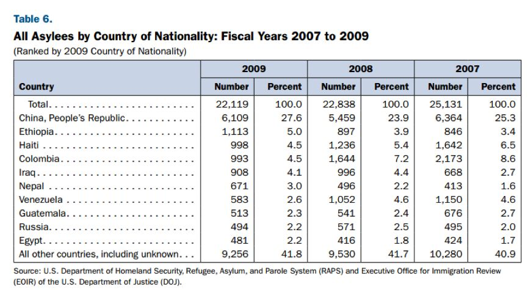
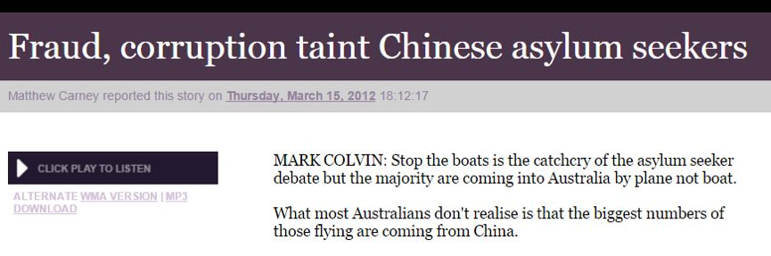

# 无标题

**链接地址:** http://mp.weixin.qq.com/s?__biz=MzI5NDMzNzM3OQ==&mid=2247488184&idx=1&sn=3c11fab1769db8aca65d56a3ddd10379&chksm=ec653cb4db12b5a287238566793b7da5c648bee70f8b1d062455deef27df9ea876274fd038fe&mpshare=1&scene=2&srcid=1001EaAqLBm3QH7grOw0SPa6#rd
**作者:** 
**获取时间:** 2025/8/28 21:25:32
**图片数量:** 23

---

## 原始HTML内容

<section class="" style="max-width: 100%;color: rgb(51, 51, 51);font-family: -apple-system-font, BlinkMacSystemFont, &quot;Helvetica Neue&quot;, &quot;PingFang SC&quot;, &quot;Hiragino Sans GB&quot;, &quot;Microsoft YaHei UI&quot;, &quot;Microsoft YaHei&quot;, Arial, sans-serif;font-size: 17px;letter-spacing: 0.544px;text-align: justify;white-space: normal;background-color: rgb(255, 255, 255);box-sizing: border-box !important;word-wrap: break-word !important;overflow-wrap: break-word !important;">&nbsp;<section class="" ng-click="onClick($event)" ng-model="eo.text" ng-style=" {
  'font-size'   : eo.fontSize,
  'font-family' : eo.fontFamily,
  'font-style'  : eo.fontStyle,
  'color'       : (eo.color || theme.majorColor),
} " placeholder="{ 点击编辑 }" stop-propagation="click mousedown mouseup" tn-edit-content="true" tn-page-editable="text0" tn-page-editable-type="ed-type-text" ui-on-drop="block($event)" style="margin-top: 0.7em;margin-left: -0.4em;padding: 1em;max-width: 100%;border-radius: 1em;width: 510.25px;color: inherit;font-family: inherit;font-size: 1em;display: inline-block;background-color: rgb(250, 200, 255);box-sizing: border-box !important;word-wrap: break-word !important;overflow-wrap: break-word !important;">&nbsp;&nbsp;&nbsp;吃喝玩乐卡尔加里YYC&nbsp;最近要大送豪礼，包括苹果 iPhone X！</section></section>
 
<section class="" style="max-width: 100%;color: rgb(51, 51, 51);font-family: -apple-system-font, BlinkMacSystemFont, &quot;Helvetica Neue&quot;, &quot;PingFang SC&quot;, &quot;Hiragino Sans GB&quot;, &quot;Microsoft YaHei UI&quot;, &quot;Microsoft YaHei&quot;, Arial, sans-serif;font-size: 17px;letter-spacing: 0.544px;text-align: justify;white-space: normal;background-color: rgb(255, 255, 255);box-sizing: border-box !important;word-wrap: break-word !important;overflow-wrap: break-word !important;"><section class="" ng-click="onClick($event)" ng-model="eo.text" ng-style=" {
  'font-size'   : eo.fontSize,
  'font-family' : eo.fontFamily,
  'font-style'  : eo.fontStyle,
  'color'       : (eo.color || theme.majorColor),
} " placeholder="{ 点击编辑 }" stop-propagation="click mousedown mouseup" tn-edit-content="true" tn-page-editable="text0" tn-page-editable-type="ed-type-text" ui-on-drop="block($event)" style="margin-top: 0.7em;margin-right: -0.4em;padding: 1em;max-width: 100%;border-radius: 1em;width: 510.25px;color: inherit;font-family: inherit;font-size: 1em;display: inline-block;background-color: rgb(188, 227, 249);box-sizing: border-box !important;word-wrap: break-word !important;overflow-wrap: break-word !important;">没错没错，记得『点击蓝字加关注』哟！机会随时到来！</section>&nbsp;&nbsp;</section><section class="" style="margin-top: 0.8em;margin-bottom: 0.5em;max-width: 100%;color: rgb(51, 51, 51);font-family: -apple-system-font, BlinkMacSystemFont, &quot;Helvetica Neue&quot;, &quot;PingFang SC&quot;, &quot;Hiragino Sans GB&quot;, &quot;Microsoft YaHei UI&quot;, &quot;Microsoft YaHei&quot;, Arial, sans-serif;font-size: 17px;letter-spacing: 0.544px;text-align: justify;white-space: normal;background-color: rgb(255, 255, 255);box-sizing: border-box !important;word-wrap: break-word !important;overflow-wrap: break-word !important;">
 
</section><section style="max-width: 100%;color: rgb(51, 51, 51);font-family: -apple-system-font, BlinkMacSystemFont, &quot;Helvetica Neue&quot;, &quot;PingFang SC&quot;, &quot;Hiragino Sans GB&quot;, &quot;Microsoft YaHei UI&quot;, &quot;Microsoft YaHei&quot;, Arial, sans-serif;font-size: 17px;letter-spacing: 0.544px;white-space: normal;text-align: center;background-color: rgb(255, 255, 255);box-sizing: border-box !important;word-wrap: break-word !important;overflow-wrap: break-word !important;"><strong style="max-width: 100%;box-sizing: border-box !important;word-wrap: break-word !important;overflow-wrap: break-word !important;">真心实意，为您推荐！</strong></section>
 

 

<strong style="max-width: 100%;box-sizing: border-box !important;word-wrap: break-word !important;">美国已经动手，加拿大何时行动？！</strong> 

 

几年前被美国政府准予庇护身份的超过1.35万名移民，如今可能会面临被驱逐的命运，而他们中的大多数是中国人。

 

 

说起在美帝以避难名义想获取身份，最出名的可能就是她了。<strong style="max-width: 100%;box-sizing: border-box !important;word-wrap: break-word !important;">不过遗憾的事，美帝并不认同你们那种漏洞百出的理由。</strong>

 

 

据NPR新闻报道，随着特朗普政府更为严格的边境行政令的出台，希望跨境到美国避难的难民不断遭到拒绝。

 

严格限制移民入境的司法部长赛申斯（Jeff Sessions）、美国公民和移民服务局（USCIS）、联邦移民及海关执法局（ICE）和移民评论办公室（Executive Office for Immigration Review，EOIR）目前正在考虑剥夺几年前获得庇护的移民的身份。

 

目前移民部门的官员们正在对这些移民进行全面审查。

 

 

据联邦机构称，这一举动与2012年针对避难申请流程开展的调查有关。

 

在那项调查中，联邦检察官在纽约围捕了移民律师、律师助手和翻译人员共30人，这些人曾帮助移民骗取在曼哈顿唐人街和皇后区法拉盛（Flushing）滞留的避难身份。

 

<strong style="max-width: 100%;box-sizing: border-box !important;word-wrap: break-word !important;">此案被称作“小说家”行动（Operation Fiction Writer）。</strong>

 

据称，在“小说家”行动中被定罪的人员曾帮助3700多名移民获得避难身份，其中大多数为中国人。

他们被控诉炮制遭到迫害的样板故事，培训客户背下这些虚构的细节并将这些转述给负责庇护工作的官员，以及捏造文件以支持虚假的庇护申请。

 

诉讼结束后的这些年来，移民部门的官员一直在复审这些避难申请案件，以确定哪些人是通过撒谎申请了庇护，而这些人应该被驱逐出境。

 

USCIS在一份声明文件中确认了移民局官员正在复审几年前“小说家”行动涉及的3500起避难案件，并表示，他们也正在复审这些案件中涉及到的1万多名家庭成员的避难申请，这些人曾被准予“从属避难身份”。

 

 

因此，按此计算，2012年12月之前通过申请的超过1.35万的移民皆有可能失去自己的庇护身份。2012年诉讼被宣布之时，奥巴马政府决定不对任何此案中的客户实施刑事制裁。

 

 

而如今，<strong style="max-width: 100%;box-sizing: border-box !important;word-wrap: break-word !important;">“USCIS、ICE首席法律顾问办公室和EOIR正在复审这些案件，以保证我们国家难民体系的诚实，保证最初的避难准予是通过合法途径获得的。”</strong>USCIS发言人缇翠柯（Katherine Tichacek）在声明文件中表示。

 

因客户的律师曾被控诉避难欺诈而复审这些客户，对于移民官员来说并不常见。移民律师们表示，他们从未见过相关部门的官员如此系统性地重审旧的避难案件，规模之大堪称ICE历史之最。

 

 

很难说这其中有多少由被诉律师经手的案件是虚假的。对每一起案例进行查验皆需要对几年前所发生的事情进行确认，这在其他国家是需要通过其他司法体系来完成的。

 

 

缇翠柯解释称，在复审过程中，当发现可能存在欺诈的旧避难案件时，ICE的律师会向EOIR提出重新审理此案的动议。

 

如果动议被移民法官批准，那么涉案难民就会被传讯。之后法官会重新确定这名难民的身份，做出重新准予或终结其庇护的决定。

 

 

对于此次突发的大规模遣返，尔湾史密斯律师事务所资深律师刘莉莎表示，<strong style="max-width: 100%;box-sizing: border-box !important;word-wrap: break-word !important;">“之前没有看到这么大规模的系统审查旧庇护案件的情况。其实在奥巴马时期曾经发现问题，不过并没有大规模翻查起诉。”</strong>

 

根据英文报道中介绍的情况，刘莉莎认为这次应该是<strong style="max-width: 100%;box-sizing: border-box !important;word-wrap: break-word !important;">有针对性目标的一次行动，而不是常规性地全部翻查。</strong>

 

<strong style="max-width: 100%;box-sizing: border-box !important;word-wrap: break-word !important;">“从报道中看，是有相关人员报案，涉及2012年期间的一些律师事务所的经手的案例。”</strong>

<strong style="max-width: 100%;box-sizing: border-box !important;word-wrap: break-word !important;"> </strong>

 

根据英文媒体报道，今年以来，由于联邦司法部颁布了更严格的审查指南，大量出现在美国边境上的庇护身份申请者均被拒绝。

 

与此同时，联邦公民与移民服务局、移民与海关执法局，以及移民审查行政办公室也在考虑剥夺那些已在多年前即获得了庇护身份的移民的在美庇护权。

 

文章来源：加拿大家园

 
<section style="max-width: 100%;color: rgb(51, 51, 51);font-family: -apple-system-font, BlinkMacSystemFont, &quot;Helvetica Neue&quot;, &quot;PingFang SC&quot;, &quot;Hiragino Sans GB&quot;, &quot;Microsoft YaHei UI&quot;, &quot;Microsoft YaHei&quot;, Arial, sans-serif;font-size: 17px;letter-spacing: 0.544px;white-space: normal;text-align: center;background-color: rgb(255, 255, 255);box-sizing: border-box !important;word-wrap: break-word !important;overflow-wrap: break-word !important;">真诚为您推荐！</section><section class="" data-style="white-space: normal; text-align: left;font-size: 14px;line-height: 1.5em; color: rgb(12, 12, 12);" style="max-width: 100%;color: rgb(51, 51, 51);font-family: -apple-system-font, BlinkMacSystemFont, &quot;Helvetica Neue&quot;, &quot;PingFang SC&quot;, &quot;Hiragino Sans GB&quot;, &quot;Microsoft YaHei UI&quot;, &quot;Microsoft YaHei&quot;, Arial, sans-serif;font-size: 17px;letter-spacing: 0.544px;text-align: justify;white-space: normal;background-color: rgb(255, 255, 255);box-sizing: border-box !important;word-wrap: break-word !important;overflow-wrap: break-word !important;"><section style="margin-top: -1.2em;max-width: 100%;box-sizing: border-box;color: rgb(166, 166, 166);text-align: center;border-width: initial;border-style: none;border-color: initial;line-height: 1.4;word-wrap: break-word !important;overflow-wrap: break-word !important;"> </section><section class="" data-style="white-space: normal; text-align: left;font-size: 14px;line-height: 1.5em; color: rgb(12, 12, 12);" style="padding: 16px 16px 10px;max-width: 100%;box-sizing: border-box;font-size: 1em;line-height: 1.4;word-wrap: break-word !important;overflow-wrap: break-word !important;">
<strong style="max-width: 100%;letter-spacing: 0.544px;color: rgb(62, 62, 62);font-size: 18px;text-align: justify;box-sizing: border-box !important;word-wrap: break-word !important;overflow-wrap: break-word !important;"><strong style="max-width: 100%;box-sizing: border-box !important;word-wrap: break-word !important;overflow-wrap: break-word !important;"><strong style="max-width: 100%;box-sizing: border-box !important;word-wrap: break-word !important;overflow-wrap: break-word !important;"><strong style="max-width: 100%;box-sizing: border-box !important;word-wrap: break-word !important;overflow-wrap: break-word !important;"></strong></strong></strong></strong>
</section></section>

  

 

<a href="http://mp.weixin.qq.com/s?__biz=MzI5NDMzNzM3OQ==&amp;mid=2247488024&amp;idx=1&amp;sn=9fe4efa2d03617ceb4dc3cd119b4b6a7&amp;chksm=ec653c14db12b5024c7df46a3a74e1bd546d13ef3aaf9afef7ecbf9535b16da3c212e114bb28&amp;scene=21#wechat_redirect" target="_blank" style="color: rgb(87, 107, 149);text-decoration: underline;-webkit-tap-highlight-color: rgba(0, 0, 0, 0);max-width: 100%;font-size: 14px;box-sizing: border-box !important;word-wrap: break-word !important;overflow-wrap: break-word !important;">【惊爆】铤而走险，她帮130个中国学生假结婚移民后被抓后...“最容易移民”的道路其实是死路。</a> 

 

<a href="http://mp.weixin.qq.com/s?__biz=MzI5NDMzNzM3OQ==&amp;mid=2247488149&amp;idx=1&amp;sn=771ca740bf8576702e0625c86878f840&amp;chksm=ec653c99db12b58f47eec2d442a9219ea8faed54f4232389cdacae740d14b6134aabb189d5bf&amp;scene=21#wechat_redirect" target="_blank" style="color: rgb(87, 107, 149);text-decoration: underline;-webkit-tap-highlight-color: rgba(0, 0, 0, 0);max-width: 100%;font-size: 14px;box-sizing: border-box !important;word-wrap: break-word !important;overflow-wrap: break-word !important;">【注意】中国驻卡尔加里总领馆又发布重要安全注意事项！计划出行的华人朋友万万当心！</a> 

 

<a href="http://mp.weixin.qq.com/s?__biz=MzI5NDMzNzM3OQ==&amp;mid=2247488137&amp;idx=2&amp;sn=fc7c1c389df465ceea0c0bc83f6f0d5c&amp;chksm=ec653c85db12b593728c0e6ac926351fd617fb2184cbc7cf3671944bda346ff0491ad8a5be39&amp;scene=21#wechat_redirect" target="_blank" style="color: rgb(87, 107, 149);text-decoration: underline;-webkit-tap-highlight-color: rgba(0, 0, 0, 0);max-width: 100%;font-size: 14px;box-sizing: border-box !important;word-wrap: break-word !important;overflow-wrap: break-word !important;">【惊爆】加拿大奶茶要消失？超市里一半零食也要下架？都是因为这条新法案！</a> 

 

<a href="http://mp.weixin.qq.com/s?__biz=MzI5NDMzNzM3OQ==&amp;mid=2247488125&amp;idx=1&amp;sn=8a1043441dec0cb95e48901fce50cdf5&amp;chksm=ec653c71db12b567bb9d44434467499246de267c0a899e54c5658afe3c154079f5841a6e4778&amp;scene=21#wechat_redirect" target="_blank" style="color: rgb(87, 107, 149);text-decoration: underline;-webkit-tap-highlight-color: rgba(0, 0, 0, 0);max-width: 100%;font-size: 14px;box-sizing: border-box !important;word-wrap: break-word !important;overflow-wrap: break-word !important;">【重磅喜讯】联邦政府修改管道路线及码头位置，油管扩建工程有望重启！</a> 

 

<a href="http://mp.weixin.qq.com/s?__biz=MzI5NDMzNzM3OQ==&amp;mid=2247488024&amp;idx=4&amp;sn=c3152856d557c5a51e0ee7e0c55d18e5&amp;chksm=ec653c14db12b5025a5ca1831886ba6e1b08e7ebad0c9a5710cf5c9aca90adbbfa1938e4f257&amp;scene=21#wechat_redirect" target="_blank" style="color: rgb(87, 107, 149);text-decoration: underline;-webkit-tap-highlight-color: rgba(0, 0, 0, 0);max-width: 100%;font-size: 14px;box-sizing: border-box !important;word-wrap: break-word !important;overflow-wrap: break-word !important;">【天啊】Tim Hortons又出事！这款我们天天吃的甜品或致癌？我可是天天都在吃啊！</a> 

 

<a href="http://mp.weixin.qq.com/s?__biz=MzI5NDMzNzM3OQ==&amp;mid=2247487979&amp;idx=1&amp;sn=1fe190fe32bb6bdc1857deeaa83d430e&amp;chksm=ec653fe7db12b6f14aed3e9e9b01c486638108bc08e0590953767630141596e2ed0c338243b7&amp;scene=21#wechat_redirect" target="_blank" style="color: rgb(87, 107, 149);text-decoration: underline;-webkit-tap-highlight-color: rgba(0, 0, 0, 0);max-width: 100%;font-size: 14px;box-sizing: border-box !important;word-wrap: break-word !important;overflow-wrap: break-word !important;">【突发】抓住了！震惊华人圈的 加拿大 13岁中国少女被杀害案侦破！嫌疑凶手是叙难民！刚登陆三个月！！！！</a> 

 

<a href="http://mp.weixin.qq.com/s?__biz=MzI5NDMzNzM3OQ==&amp;mid=2247487967&amp;idx=1&amp;sn=440c1d06b20a9e044188dd386701aa81&amp;chksm=ec653fd3db12b6c534c92a55d48a4c7184430cdb1e63136f843220ff98cd846c8528ecc713fe&amp;scene=21#wechat_redirect" target="_blank" style="color: rgb(87, 107, 149);-webkit-tap-highlight-color: rgba(0, 0, 0, 0);max-width: 100%;box-sizing: border-box !important;word-wrap: break-word !important;">【跪了】做啥不好！中国大妈又上头条了！这次更猛！居民楼里开妓院！！</a> 

 

<a href="http://mp.weixin.qq.com/s?__biz=MzI5NDMzNzM3OQ==&amp;mid=2247487967&amp;idx=2&amp;sn=f7cc47dab9bca1eaee2a94bd358271f3&amp;chksm=ec653fd3db12b6c50961695083fa204a8c5125fa30687626b1212e18aecd764c63fcf8a2057d&amp;scene=21#wechat_redirect" target="_blank" style="color: rgb(87, 107, 149);text-decoration: underline;-webkit-tap-highlight-color: rgba(0, 0, 0, 0);max-width: 100%;font-size: 14px;box-sizing: border-box !important;word-wrap: break-word !important;">【笑疯了】全国各省同学眼中的中国地图，太形象太扎心了...受不了了，哈哈哈哈哈哈哈哈哈</a>

 

<a href="http://mp.weixin.qq.com/s?__biz=MzI5NDMzNzM3OQ==&amp;mid=2247487959&amp;idx=2&amp;sn=0fb4b23f6dbbc7393cb4dbdc5f33c039&amp;chksm=ec653fdbdb12b6cdec996edbfc4ecfc539557d2eccae40709e4431992d9710c885b33a8dcda7&amp;scene=21#wechat_redirect" target="_blank" style="color: rgb(87, 107, 149);text-decoration: underline;-webkit-tap-highlight-color: rgba(0, 0, 0, 0);max-width: 100%;font-size: 14px;box-sizing: border-box !important;word-wrap: break-word !important;">【突发】沃尔玛爆发非典型肺炎！紧急关闭！已有7人确诊！致死率极高！华人当心！！</a>

 

<a href="http://mp.weixin.qq.com/s?__biz=MzI5NDMzNzM3OQ==&amp;mid=2247487930&amp;idx=1&amp;sn=fd4bf262c47d5985bae445443783339a&amp;chksm=ec653fb6db12b6a07b8f47b1d2ac058b9a5ab85eab94e2822ebc6550fe1372f3a2ce398b2fa2&amp;scene=21#wechat_redirect" target="_blank" style="color: rgb(87, 107, 149);-webkit-tap-highlight-color: rgba(0, 0, 0, 0);max-width: 100%;box-sizing: border-box !important;word-wrap: break-word !important;overflow-wrap: break-word !important;">【突发】加拿大重磅通过！＂加英澳新＂移民1国等于获得3国身份？！中国土豪狂欢！这4国护照值钱了！全球移民潮即将来临！</a>

 

<a href="http://mp.weixin.qq.com/s?__biz=MzI5NDMzNzM3OQ==&amp;mid=2247487930&amp;idx=3&amp;sn=21b6f48ca64a0022d3189579f83792a7&amp;chksm=ec653fb6db12b6a03d812045b32e80e88c5d987fe9368654b6af00558ffc9a1050d8c84a1b05&amp;scene=21#wechat_redirect" target="_blank" style="color: rgb(87, 107, 149);text-decoration: underline;-webkit-tap-highlight-color: rgba(0, 0, 0, 0);max-width: 100%;font-size: 14px;box-sizing: border-box !important;word-wrap: break-word !important;overflow-wrap: break-word !important;">【重磅福利】加拿大留学生居然有这么多福利！拿着学生卡，疯狂折扣随你拿！太赞了！</a> 

 

<a href="http://mp.weixin.qq.com/s?__biz=MzI5NDMzNzM3OQ==&amp;mid=2247487919&amp;idx=1&amp;sn=e4c8113767dba1d01e47f23a8d0bce84&amp;chksm=ec653fa3db12b6b50b15412b14b4284845946e2ad2c52031b541975ea5a7cfdfed52ad8ee40a&amp;scene=21#wechat_redirect" target="_blank" style="color: rgb(87, 107, 149);-webkit-tap-highlight-color: rgba(0, 0, 0, 0);max-width: 100%;box-sizing: border-box !important;word-wrap: break-word !important;overflow-wrap: break-word !important;">【突发】加国经济危机号角吹响！美加关系彻底闹掰！贸易战争将给加拿大带来毁灭性的灾难！</a>

 

 

欢迎大家添加&nbsp;神通广大&nbsp;吃喝玩乐&nbsp;服务微信&nbsp;为好友！

相互照应，十分必要！

扫码即可！

 

 
<section style="max-width: 100%;color: rgb(51, 51, 51);font-family: -apple-system-font, BlinkMacSystemFont, &quot;Helvetica Neue&quot;, &quot;PingFang SC&quot;, &quot;Hiragino Sans GB&quot;, &quot;Microsoft YaHei UI&quot;, &quot;Microsoft YaHei&quot;, Arial, sans-serif;font-size: 17px;letter-spacing: 0.544px;white-space: normal;text-align: center;background-color: rgb(255, 255, 255);box-sizing: border-box !important;word-wrap: break-word !important;overflow-wrap: break-word !important;"> </section><section class="" data-style="white-space: normal; text-align: left;font-size: 14px;line-height: 1.5em; color: rgb(12, 12, 12);" style="max-width: 100%;color: rgb(51, 51, 51);font-family: -apple-system-font, BlinkMacSystemFont, &quot;Helvetica Neue&quot;, &quot;PingFang SC&quot;, &quot;Hiragino Sans GB&quot;, &quot;Microsoft YaHei UI&quot;, &quot;Microsoft YaHei&quot;, Arial, sans-serif;font-size: 17px;letter-spacing: 0.544px;text-align: justify;white-space: normal;background-color: rgb(255, 255, 255);box-sizing: border-box !important;word-wrap: break-word !important;overflow-wrap: break-word !important;"><section class="" data-style="white-space: normal; text-align: left;font-size: 14px;line-height: 1.5em; color: rgb(12, 12, 12);" style="padding: 16px 16px 10px;max-width: 100%;box-sizing: border-box;font-size: 1em;line-height: 1.4;word-wrap: break-word !important;overflow-wrap: break-word !important;">
 

<strong style="max-width: 100%;font-size: 18px;text-align: justify;box-sizing: border-box !important;word-wrap: break-word !important;overflow-wrap: break-word !important;"><strong style="max-width: 100%;box-sizing: border-box !important;word-wrap: break-word !important;overflow-wrap: break-word !important;"><strong style="max-width: 100%;box-sizing: border-box !important;word-wrap: break-word !important;overflow-wrap: break-word !important;"><strong style="max-width: 100%;box-sizing: border-box !important;word-wrap: break-word !important;overflow-wrap: break-word !important;"></strong></strong></strong></strong> 

 

</section></section>
 

---

## 纯文本内容

吃喝玩乐卡尔加里YYC 最近要大送豪礼，包括苹果 iPhone X！没错没错，记得『点击蓝字加关注』哟！机会随时到来！  真心实意，为您推荐！美国已经动手，加拿大何时行动？！几年前被美国政府准予庇护身份的超过1.35万名移民，如今可能会面临被驱逐的命运，而他们中的大多数是中国人。说起在美帝以避难名义想获取身份，最出名的可能就是她了。不过遗憾的事，美帝并不认同你们那种漏洞百出的理由。据NPR新闻报道，随着特朗普政府更为严格的边境行政令的出台，希望跨境到美国避难的难民不断遭到拒绝。严格限制移民入境的司法部长赛申斯（Jeff Sessions）、美国公民和移民服务局（USCIS）、联邦移民及海关执法局（ICE）和移民评论办公室（Executive Office for Immigration Review，EOIR）目前正在考虑剥夺几年前获得庇护的移民的身份。目前移民部门的官员们正在对这些移民进行全面审查。据联邦机构称，这一举动与2012年针对避难申请流程开展的调查有关。在那项调查中，联邦检察官在纽约围捕了移民律师、律师助手和翻译人员共30人，这些人曾帮助移民骗取在曼哈顿唐人街和皇后区法拉盛（Flushing）滞留的避难身份。此案被称作“小说家”行动（Operation Fiction Writer）。据称，在“小说家”行动中被定罪的人员曾帮助3700多名移民获得避难身份，其中大多数为中国人。他们被控诉炮制遭到迫害的样板故事，培训客户背下这些虚构的细节并将这些转述给负责庇护工作的官员，以及捏造文件以支持虚假的庇护申请。诉讼结束后的这些年来，移民部门的官员一直在复审这些避难申请案件，以确定哪些人是通过撒谎申请了庇护，而这些人应该被驱逐出境。USCIS在一份声明文件中确认了移民局官员正在复审几年前“小说家”行动涉及的3500起避难案件，并表示，他们也正在复审这些案件中涉及到的1万多名家庭成员的避难申请，这些人曾被准予“从属避难身份”。因此，按此计算，2012年12月之前通过申请的超过1.35万的移民皆有可能失去自己的庇护身份。2012年诉讼被宣布之时，奥巴马政府决定不对任何此案中的客户实施刑事制裁。而如今，“USCIS、ICE首席法律顾问办公室和EOIR正在复审这些案件，以保证我们国家难民体系的诚实，保证最初的避难准予是通过合法途径获得的。”USCIS发言人缇翠柯（Katherine Tichacek）在声明文件中表示。因客户的律师曾被控诉避难欺诈而复审这些客户，对于移民官员来说并不常见。移民律师们表示，他们从未见过相关部门的官员如此系统性地重审旧的避难案件，规模之大堪称ICE历史之最。很难说这其中有多少由被诉律师经手的案件是虚假的。对每一起案例进行查验皆需要对几年前所发生的事情进行确认，这在其他国家是需要通过其他司法体系来完成的。缇翠柯解释称，在复审过程中，当发现可能存在欺诈的旧避难案件时，ICE的律师会向EOIR提出重新审理此案的动议。如果动议被移民法官批准，那么涉案难民就会被传讯。之后法官会重新确定这名难民的身份，做出重新准予或终结其庇护的决定。对于此次突发的大规模遣返，尔湾史密斯律师事务所资深律师刘莉莎表示，“之前没有看到这么大规模的系统审查旧庇护案件的情况。其实在奥巴马时期曾经发现问题，不过并没有大规模翻查起诉。”根据英文报道中介绍的情况，刘莉莎认为这次应该是有针对性目标的一次行动，而不是常规性地全部翻查。“从报道中看，是有相关人员报案，涉及2012年期间的一些律师事务所的经手的案例。”根据英文媒体报道，今年以来，由于联邦司法部颁布了更严格的审查指南，大量出现在美国边境上的庇护身份申请者均被拒绝。与此同时，联邦公民与移民服务局、移民与海关执法局，以及移民审查行政办公室也在考虑剥夺那些已在多年前即获得了庇护身份的移民的在美庇护权。文章来源：加拿大家园真诚为您推荐！【惊爆】铤而走险，她帮130个中国学生假结婚移民后被抓后...“最容易移民”的道路其实是死路。【注意】中国驻卡尔加里总领馆又发布重要安全注意事项！计划出行的华人朋友万万当心！【惊爆】加拿大奶茶要消失？超市里一半零食也要下架？都是因为这条新法案！【重磅喜讯】联邦政府修改管道路线及码头位置，油管扩建工程有望重启！【天啊】Tim Hortons又出事！这款我们天天吃的甜品或致癌？我可是天天都在吃啊！【突发】抓住了！震惊华人圈的 加拿大 13岁中国少女被杀害案侦破！嫌疑凶手是叙难民！刚登陆三个月！！！！【跪了】做啥不好！中国大妈又上头条了！这次更猛！居民楼里开妓院！！【笑疯了】全国各省同学眼中的中国地图，太形象太扎心了...受不了了，哈哈哈哈哈哈哈哈哈【突发】沃尔玛爆发非典型肺炎！紧急关闭！已有7人确诊！致死率极高！华人当心！！【突发】加拿大重磅通过！＂加英澳新＂移民1国等于获得3国身份？！中国土豪狂欢！这4国护照值钱了！全球移民潮即将来临！【重磅福利】加拿大留学生居然有这么多福利！拿着学生卡，疯狂折扣随你拿！太赞了！【突发】加国经济危机号角吹响！美加关系彻底闹掰！贸易战争将给加拿大带来毁灭性的灾难！欢迎大家添加 神通广大 吃喝玩乐 服务微信 为好友！相互照应，十分必要！扫码即可！

---

## 图片列表

-  (原始链接: https://mmbiz.qpic.cn/mmbiz/MVPvEL7Qg0EXNGDDXjhn7BQlLVZfE4a72NDhuKJZheaZoX3JcYZ8wicrltbzurnAx8Urww68iaiaaC541u0miaUGqg/640?)
-  (原始链接: https://mmbiz.qpic.cn/mmbiz/MVPvEL7Qg0EXNGDDXjhn7BQlLVZfE4a7eyibPmHcP5XBsBl0KZPM0LQibDWticwHV1SSxz8Ha4rjtk93ZD4sTPSsg/640?)
-  (原始链接: https://mmbiz.qpic.cn/mmbiz_jpg/E5oZzDjj1krg70S5dqqia8wpBmp0u7ibWvurxxBrwHU6YUHpdrKOPJ2thhiaQAWncywSIyP6RaAFxH9WzMUvUFkbA/640?wx_fmt=jpeg)
-  (原始链接: http://mmbiz.qpic.cn/mmbiz_jpg/E5oZzDjj1kqcmzibGGbOTonJ7caYsjiaSTtMq1U3Kw5VOLtUgTSNvWXFuQqic1rM7AwibhPM0ZM41RO6DtAmU1WM3w/640?wx_fmt=jpeg)
-  (原始链接: https://mmbiz.qpic.cn/mmbiz_jpg/E5oZzDjj1koIN1Y38icljFMX6zwK8pw7b53PvUZlk9gXsIh45VRRWgBJXibBqiaeeJJv68NkFKuicodbcqOWCXUHicw/640?wx_fmt=jpeg)
-  (原始链接: https://mmbiz.qpic.cn/mmbiz_png/ictbg3TUyiaTX3kbXLes2U0mWibVkwTKLQkWLuMJkWpvHNIK75IFbicHb1s8MZ2xaicvq96vxoPpa028VSnuK2wqYUw/640?wx_fmt=png)
-  (原始链接: https://mmbiz.qpic.cn/mmbiz_jpg/fmEGSORPyK2RVR0PKh95vvf2icgxJqV51MibYovpWBQ8KK7ZPicic8zygUODU3TzM1Dev5jBAsLF1zwnLlyNCVPLCA/640?wx_fmt=jpeg)
-  (原始链接: https://mmbiz.qpic.cn/mmbiz_png/wlCrBZoK8HHukUp4NyibvC73Knz2gWnQHJYI1JXJQyKuOicQibLjsp2lcLzonC1hwGPMIj4LjGdTgc0JszcjUU5tA/640?wx_fmt=png)
-  (原始链接: https://mmbiz.qpic.cn/mmbiz_png/wlCrBZoK8HHukUp4NyibvC73Knz2gWnQHxPxDOjVv0GtA0MXWWFVNIa12xxmOSXqRav4icBMHzCzTibWLLsolN5TA/640?wx_fmt=png)
-  (原始链接: https://mmbiz.qpic.cn/mmbiz_png/ictbg3TUyiaTX3kbXLes2U0mWibVkwTKLQkaXyUoQm6XQ2wjW83jQiabm9MibqNW7ypXJV2axshn4MbnpUZ6FVkM1HA/640?wx_fmt=png)
-  (原始链接: https://mmbiz.qpic.cn/mmbiz_png/ictbg3TUyiaTX3kbXLes2U0mWibVkwTKLQk2RJ21onBN9SashgoFhHJ3gJOyUW0HgLGPoGeMn8oWzrWoaHgbianZMQ/640?wx_fmt=png)
-  (原始链接: https://mmbiz.qpic.cn/mmbiz_png/wlCrBZoK8HHukUp4NyibvC73Knz2gWnQHKOvVYNqmfVt0d2BNYM0MicRXb8cxObL7b9AG8faKoicsS592pBePicHBg/640?wx_fmt=png)
-  (原始链接: https://mmbiz.qpic.cn/mmbiz_png/ictbg3TUyiaTX3kbXLes2U0mWibVkwTKLQkhgKicxO48Ga6jEfwSnSR46ibWOcY96cvzkuCAuSbq8zs6HiadcecnBNQg/640?wx_fmt=png)
-  (原始链接: https://mmbiz.qpic.cn/mmbiz_png/ictbg3TUyiaTX3kbXLes2U0mWibVkwTKLQkJ5lcricJHQBSzlTuZohWZxGwaUOzZeSypazCHqNJCxqiaDmdOKofxzNA/640?wx_fmt=png)
-  (原始链接: https://mmbiz.qpic.cn/mmbiz_png/wlCrBZoK8HHukUp4NyibvC73Knz2gWnQH8su2WLty3hdnkiaQuXPcZvFKicjDwgzFUfiahd4xPiah6db0CoxDtuSgjw/640?wx_fmt=png)
-  (原始链接: https://mmbiz.qpic.cn/mmbiz_png/wlCrBZoK8HHukUp4NyibvC73Knz2gWnQHWqh1arGAhI6eVIaOkOhl2x7vkgOqMpoibVHQfY2yLcVBXtn59LzIF7A/640?wx_fmt=png)
-  (原始链接: https://mmbiz.qpic.cn/mmbiz_png/wlCrBZoK8HHukUp4NyibvC73Knz2gWnQHJYI1JXJQyKuOicQibLjsp2lcLzonC1hwGPMIj4LjGdTgc0JszcjUU5tA/640?wx_fmt=png)
-  (原始链接: https://mmbiz.qpic.cn/mmbiz_jpg/E5oZzDjj1kqmyBd2wXyJpdlTKRQv5yEo8q6MibdN8KaEpc8HasuicnnICaTm5SyBmFzYHh7Ypj7IianbCxEfHk2lg/640?wx_fmt=jpeg)
-  (原始链接: https://mmbiz.qpic.cn/mmbiz_jpg/E5oZzDjj1koNJW9uUHaESKwdYBXwmKW1N0JZ1iaAG5IJ84TC3KQzv1rNHdaiaic9ZibfOCBUL1yhIWnK0ScaWEibQ4A/640?wx_fmt=jpeg)
-  (原始链接: https://mmbiz.qpic.cn/mmbiz_jpg/E5oZzDjj1krFNNmqiaVW3RVdTIANicfJ6BibMoyEmfm5Bscqn3NFAArz5lafNH1OTexHamNNp51ibcpFJqJKHjhiahw/640?wx_fmt=jpeg)
-  (原始链接: https://mmbiz.qpic.cn/mmbiz_jpg/x0ccYC4cialEibxCT1YzGLaDtQjvicaY5qDKcdMic1icnDfVPyFrBq3hPRvota5lrI733ET0DNZRYLpsV5FjGcKlSHg/640?wx_fmt=jpeg)
-  (原始链接: https://mmbiz.qpic.cn/mmbiz_jpg/mZIpZ2dRo6Z5Lg6L4yBuvZf7QibxfKVYiaibWZ0TgYUSaib6Kt9bF0BhOS7r5v3zCAdNJ6PubAKsoohqPxVjIFWX9w/640?wx_fmt=jpeg)
-  (原始链接: http://mmbiz.qpic.cn/mmbiz/E5oZzDjj1kqdHwQ2zpsHXPvFpF81yEia17OibFaAfyBwQYD1iakM7T1PlagpPx6bCbw4qeARbPEgmqPsmYtLv46cQ/640?wx_fmt=jpeg)
