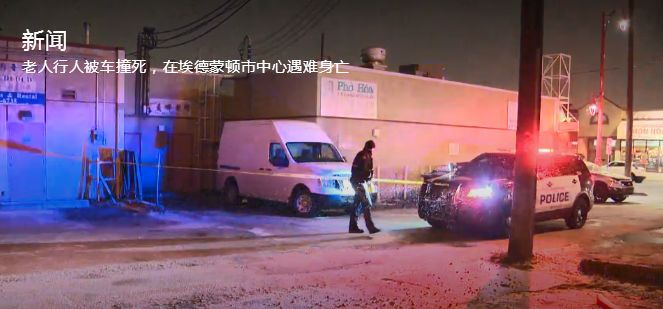
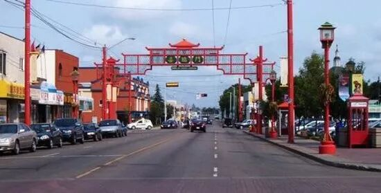
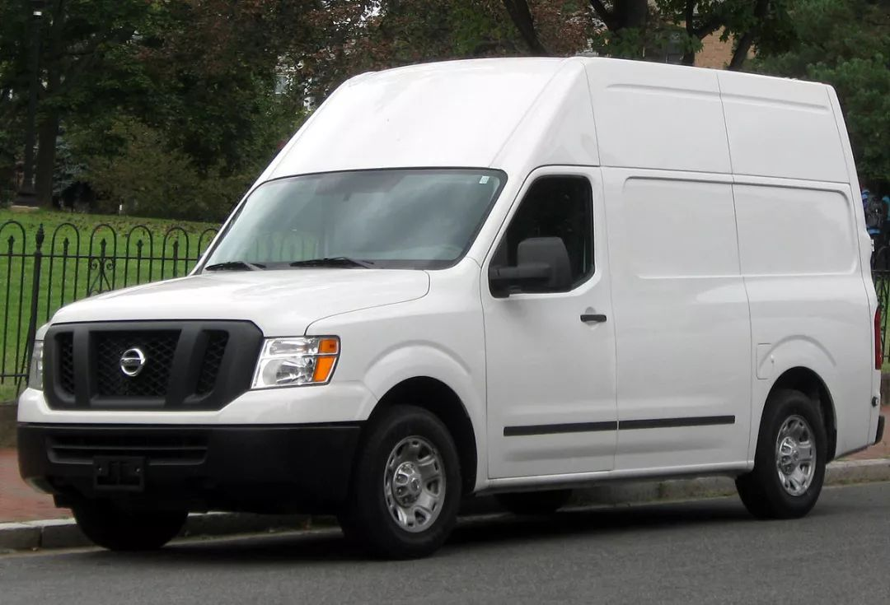

# 无标题

**链接地址:** http://mp.weixin.qq.com/s?__biz=MzAxNzU3ODAwOQ==&mid=2649218477&idx=1&sn=56f2329ce04bc681cb0d4e2d5abbba2e&chksm=83f01cdbb48795cdfd121bd79529ff0e8d4b7afa6261348b8b3995f285a339e77ca6335e7029&mpshare=1&scene=2&srcid=1106tSh2hyYRKqyjtbQTw2yS#rd
**作者:** 爱城车哥
**获取时间:** 2025/8/28 21:10:57
**图片数量:** 8

---

## 原始HTML内容

 

 

 

 

2018年11月4日星期天晚上，埃德蒙顿的天空中飘洒着漫天的鹅毛大雪。这样雪天路滑的天气本就是事故多发的时节，但在埃德蒙顿唐人街发生的一起车祸却尤为让人感到心寒愤怒：

一名88岁的华人老年男性在唐人街遭遇车辆撞击后被送往医院，因伤势过重在医院不幸被宣告死亡。然而让人更难过的是，驾驶车辆的肇事司机，居然在车祸发生后连停都没有停下来，而是令人震怒地选择了直接逃逸……

 

周日下午5点45分左右，一名年迈的行人被一辆车撞倒，埃德蒙顿警察接到报警来到了事故发生的106A大道和97街的区域。

警方称，行人是被一辆白色的2013日产NV2500的货运车撞倒，当时行人正从97街东侧的一条无标记的人行横道穿越到西侧。而当时这辆货运车正在97街向南行驶。

目击者告诉警方，面包车没有撞击后在现场停下来，而是选择直接继续行使从97街逃逸。

这名88岁的老人被救护车紧急送往医院，但不久后因伤势过重在医院被宣布死亡。

 

警方后来在97街和106大道地区找到了这辆被遗弃的运货车。警方官员说，事发当时有一些司机在97街向北行驶，他们看到行人过马路时停了下来，但肇事司机没有。警方正在与这些司机交流沟通，以获取肇事司机的线索。

任何目睹到撞击事故现场的人都请通过手机联系警方780-423-4567或＃377。匿名信息可以拨打电话1-800-222-8477或网上提交给Crime Stoppers&nbsp;。信息提交网站：https://www.p3tips.com/tipform.aspx?ID=250#

 

希望通过这篇文章能够唤起肇事司机的良知，尽快投案自首去。也呼吁现场目击者能够勇敢地站出来，像警方提供更多可靠信息。

希望我们公众平台可以通过这些努力，凝聚埃德蒙顿华人社区坚实强大的力量，帮助警察搜集更多有效信息，尽快破案，让逝者的家人能够从悲痛中得以慰藉。

爱屯的冬天固然寒冻入髓，可洁白的大雪掩不去事实的真相。望肇事罪犯可以受到法律的严惩，也望老人的在天之灵可以安息。

---

## 纯文本内容

2018年11月4日星期天晚上，埃德蒙顿的天空中飘洒着漫天的鹅毛大雪。这样雪天路滑的天气本就是事故多发的时节，但在埃德蒙顿唐人街发生的一起车祸却尤为让人感到心寒愤怒：一名88岁的华人老年男性在唐人街遭遇车辆撞击后被送往医院，因伤势过重在医院不幸被宣告死亡。然而让人更难过的是，驾驶车辆的肇事司机，居然在车祸发生后连停都没有停下来，而是令人震怒地选择了直接逃逸……周日下午5点45分左右，一名年迈的行人被一辆车撞倒，埃德蒙顿警察接到报警来到了事故发生的106A大道和97街的区域。警方称，行人是被一辆白色的2013日产NV2500的货运车撞倒，当时行人正从97街东侧的一条无标记的人行横道穿越到西侧。而当时这辆货运车正在97街向南行驶。目击者告诉警方，面包车没有撞击后在现场停下来，而是选择直接继续行使从97街逃逸。这名88岁的老人被救护车紧急送往医院，但不久后因伤势过重在医院被宣布死亡。警方后来在97街和106大道地区找到了这辆被遗弃的运货车。警方官员说，事发当时有一些司机在97街向北行驶，他们看到行人过马路时停了下来，但肇事司机没有。警方正在与这些司机交流沟通，以获取肇事司机的线索。任何目睹到撞击事故现场的人都请通过手机联系警方780-423-4567或＃377。匿名信息可以拨打电话1-800-222-8477或网上提交给Crime Stoppers 。信息提交网站：https://www.p3tips.com/tipform.aspx?ID=250#希望通过这篇文章能够唤起肇事司机的良知，尽快投案自首去。也呼吁现场目击者能够勇敢地站出来，像警方提供更多可靠信息。希望我们公众平台可以通过这些努力，凝聚埃德蒙顿华人社区坚实强大的力量，帮助警察搜集更多有效信息，尽快破案，让逝者的家人能够从悲痛中得以慰藉。爱屯的冬天固然寒冻入髓，可洁白的大雪掩不去事实的真相。望肇事罪犯可以受到法律的严惩，也望老人的在天之灵可以安息。

---

## 图片列表

-  (原始链接: https://mmbiz.qpic.cn/mmbiz_gif/R5ibD61GBodqexNpVP67bPQgSycASPWgaQribKCicLtGMCDBQKFA2jxeck8cPt9wpXYiaSiayf9sWrhXPhTaxicdVbicQ/640?wx_fmt=gif)
-  (原始链接: https://mmbiz.qpic.cn/mmbiz_jpg/x0ccYC4cialHlvcACwvZpicmXrfnkqU3aJZM098tXSVXqxmJotPRqhlGSkocRib59Gs0uA1l2uWveh6Ivmf1BwrOw/640?wx_fmt=jpeg)
-  (原始链接: https://mmbiz.qpic.cn/mmbiz_jpg/x0ccYC4cialGOgLHakWwIZro9CpaTFia4X394jggCTn1BpP0u1MPaxOgEsVztypjfWY3s5TQubp6GKt8uOccMicuA/640?wx_fmt=jpeg)
-  (原始链接: https://mmbiz.qpic.cn/mmbiz_png/D1nJqnhkPyLjia6fqVAaqbIAnwicuicUicH0g23gPrWnDXctt6w4OnonmE6USRwJoiaicO56icuiaVbQezeEEic6ZYSHSdA/640?wx_fmt=png)
-  (原始链接: https://mmbiz.qpic.cn/mmbiz_jpg/D1nJqnhkPyLjia6fqVAaqbIAnwicuicUicH0bBlgG5TtPZVFda2XucTVrKd62MNMFuqRc8zpWKRhUW8Kv2MpMiaE5VQ/640?wx_fmt=jpeg)
-  (原始链接: https://mmbiz.qpic.cn/mmbiz_jpg/D1nJqnhkPyLjia6fqVAaqbIAnwicuicUicH0ia5YNiaTxuF6SCXG6qRz4xbEdnIyOKQAzoqekKQzXqK3Iibv6FD04CYUQ/640?wx_fmt=jpeg)
-  (原始链接: https://mmbiz.qpic.cn/mmbiz_png/D1nJqnhkPyLjia6fqVAaqbIAnwicuicUicH0Y2R59CKfj9G9l72NEFkRDEicNZxHxx3F6E3na7dpS3lnpp1B7dtfedA/640?wx_fmt=png)
-  (原始链接: https://mmbiz.qpic.cn/mmbiz_jpg/x0ccYC4cialFCfpibXMFpTKtGGDXIHLa3lqOOqj97ZXiaw5Gy9AHkfDrfUHInxDUfCJO69LmKZualZnKHaf3mwbfQ/640?wx_fmt=jpeg)
