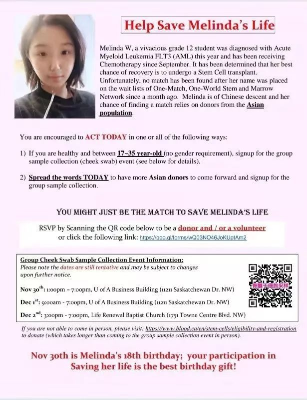
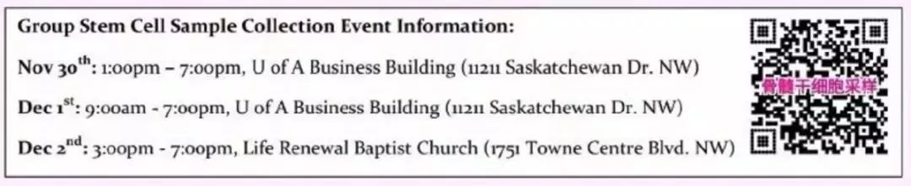
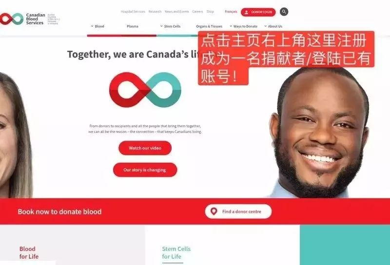
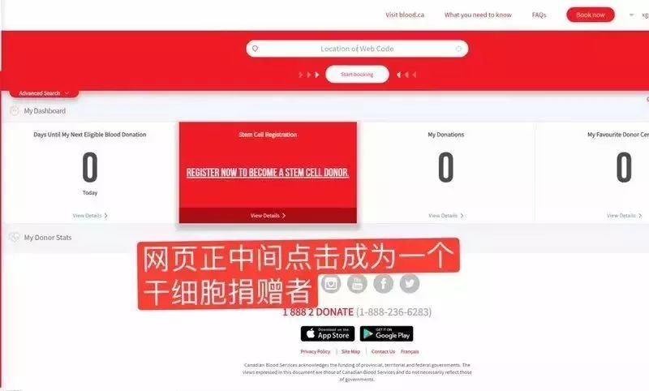
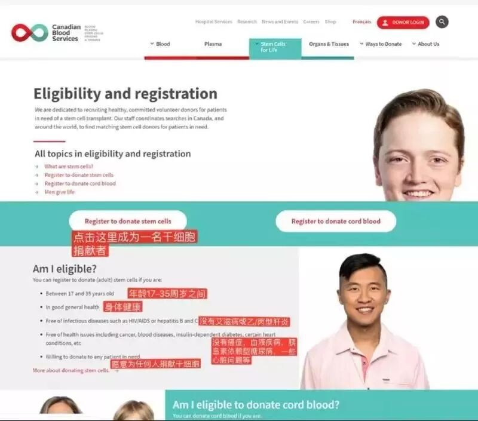
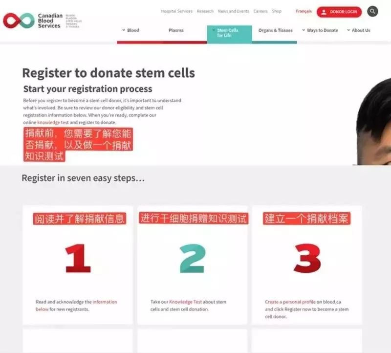
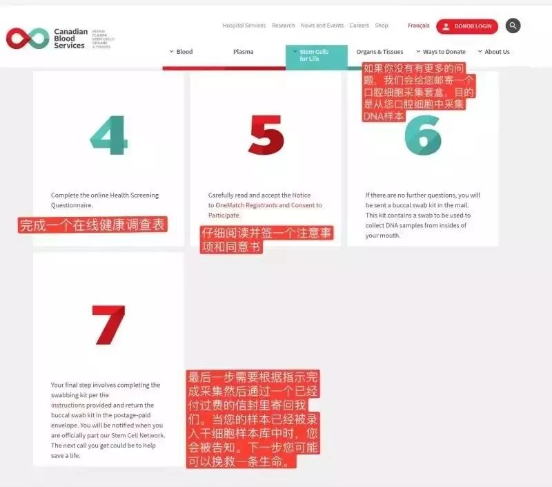

# 无标题

**链接地址:** http://mp.weixin.qq.com/s?__biz=MzI2NTE1ODgwOQ==&mid=2649605447&idx=1&sn=b7633b5ba06da4696be437f53ce90146&chksm=f2b8ccb1c5cf45a755e18f06a56c0d63179009403c6f2d484b60bcd6e8e9c9cb5e62ad5b872f&mpshare=1&scene=2&srcid=#rd
**作者:** 欢迎转发
**获取时间:** 2025/8/28 21:06:23
**图片数量:** 24

---

## 原始HTML内容

<section style="box-sizing: border-box;"><section class="V5" style="box-sizing: border-box;" powered-by="xiumi.us"><section style="margin-right: 0%;margin-left: 0%;box-sizing: border-box;"><section style="display: inline-block;vertical-align: middle;width: 80%;box-sizing: border-box;"><section class="V5" style="box-sizing: border-box;" powered-by="xiumi.us"><section style="margin-top: 10px;margin-bottom: 10px;text-align: center;box-sizing: border-box;"><section style="display: inline-block;box-sizing: border-box;"><section style="max-width: 100%;font-size: 0px;padding-bottom: 3px;box-sizing: border-box;"><section style="display: inline-block;vertical-align: middle;box-sizing: border-box;"><section style="width: 5px;height: 1px;background-color: rgb(217, 217, 217);box-sizing: border-box;"></section><section style="width: 1px;height: 5px;margin-top: -3px;margin-right: auto;margin-left: auto;background-color: rgb(217, 217, 217);box-sizing: border-box;"></section></section><section style="margin-top: -1px;margin-right: -5px;margin-left: -5px;width: 100%;display: inline-block;vertical-align: middle;padding-right: 8px;padding-left: 8px;box-sizing: border-box;"><section style="width: 100%;height: 1px;background-color: rgb(217, 217, 217);box-sizing: border-box;"></section></section><section style="display: inline-block;vertical-align: middle;box-sizing: border-box;"><section style="width: 5px;height: 1px;background-color: rgb(217, 217, 217);box-sizing: border-box;"></section><section style="width: 1px;height: 5px;margin-top: -3px;margin-right: auto;margin-left: auto;background-color: rgb(217, 217, 217);box-sizing: border-box;"></section></section></section><section style="padding-left: 15px;padding-right: 15px;color: rgb(161, 161, 161);font-size: 14px;box-sizing: border-box;">
点击上方<strong style="box-sizing: border-box;">蓝字</strong>关注我们哟~
</section><section style="max-width: 100%;font-size: 0px;box-sizing: border-box;"><section style="display: inline-block;vertical-align: middle;box-sizing: border-box;"><section style="width: 5px;height: 1px;background-color: rgb(217, 217, 217);box-sizing: border-box;"></section><section style="width: 1px;height: 5px;margin-top: -3px;margin-right: auto;margin-left: auto;background-color: rgb(217, 217, 217);box-sizing: border-box;"></section></section><section style="margin-top: -1px;margin-right: -5px;margin-left: -5px;width: 100%;display: inline-block;vertical-align: middle;padding-right: 8px;padding-left: 8px;box-sizing: border-box;"><section style="width: 100%;height: 1px;background-color: rgb(217, 217, 217);box-sizing: border-box;"></section></section><section style="display: inline-block;vertical-align: middle;box-sizing: border-box;"><section style="width: 5px;height: 1px;background-color: rgb(217, 217, 217);box-sizing: border-box;"></section><section style="width: 1px;height: 5px;margin-top: -3px;margin-right: auto;margin-left: auto;background-color: rgb(217, 217, 217);box-sizing: border-box;"></section></section></section></section></section></section></section><section style="display: inline-block;vertical-align: middle;width: 20%;box-sizing: border-box;"><section class="V5" style="box-sizing: border-box;" powered-by="xiumi.us"><section style="text-align: center;margin: -10px 0% 10px;box-sizing: border-box;"><section style="max-width: 100%;vertical-align: middle;display: inline-block;width: 100%;box-sizing: border-box;"></section></section></section></section></section></section><section class="V5" style="box-sizing: border-box;" powered-by="xiumi.us"><section style="margin: 10px 0%;box-sizing: border-box;"><section style="display: inline-block;width: 100%;vertical-align: top;box-sizing: border-box;"><section class="V5" style="box-sizing: border-box;" powered-by="xiumi.us"><section style="box-sizing: border-box;"><section style="display: inline-block;vertical-align: bottom;width: 75%;padding-right: 10px;box-sizing: border-box;"><section class="V5" style="box-sizing: border-box;" powered-by="xiumi.us"><section style="margin: 10px 0% 3px;box-sizing: border-box;"><section style="display: inline-block;vertical-align: middle;box-sizing: border-box;"><section style="display: inline-block;vertical-align: bottom;padding-left: 5px;padding-right: 5px;line-height: 1.2em;margin-bottom: 2px;color: rgba(80, 182, 201, 0.72);box-sizing: border-box;">
 
</section></section></section></section></section></section></section></section></section></section><section class="V5" style="box-sizing: border-box;" powered-by="xiumi.us"><section style="box-sizing: border-box;"><section class="V5" style="box-sizing: border-box;" powered-by="xiumi.us"><section style="text-align: center;margin: 10px 0%;box-sizing: border-box;"><section style="display: inline-block;width: 230px;height: 100px;vertical-align: top;overflow: hidden;background-position: 50% 50%;background-repeat: no-repeat;background-size: contain;background-attachment: scroll;background-image: url(&quot;https://mmbiz.qpic.cn/mmbiz_gif/D1nJqnhkPyJI6w0ZicMVtYmn1ibjkIv5d0x1icCluic2yQbbUxOTLLiaujA0zVqiaicP1ULAUCsib6zkBMbwBx3klNt3rQ/640?wx_fmt=gif&quot;);box-sizing: border-box;"><section class="V5" style="box-sizing: border-box;" powered-by="xiumi.us"><section style="margin-top: 23px;margin-right: 0%;margin-left: 0%;box-sizing: border-box;"><section style="color: rgb(255, 255, 255);box-sizing: border-box;">
<strong style="box-sizing: border-box;">爱城</strong>

<strong style="box-sizing: border-box;">有爱</strong>
</section></section></section></section></section></section><section class="V5" style="box-sizing: border-box;" powered-by="xiumi.us"><section style="margin: 20px 0%;box-sizing: border-box;"><section style="text-align: justify;font-size: 14px;color: rgb(158, 158, 158);letter-spacing: 2px;padding-right: 15px;padding-left: 15px;box-sizing: border-box;">
相信大家对于白血病和干细胞移植都并不陌生，这 个似乎只会发生在电视剧情节中的疾病其实<strong style="box-sizing: border-box;">离我们并不遥远</strong>。前几个月本公众号曾经报道过25岁亚裔男子阮比利罹患淋巴瘤并呼吁全城志愿者捐献干细胞样本的事，没想到相似的灾难在几个月后便降临到埃德蒙顿市另一位<strong style="box-sizing: border-box;">年仅17岁的花季华裔少女Melinda的身上</strong>。
</section></section></section><section class="V5" style="box-sizing: border-box;" powered-by="xiumi.us"><section style="text-align: center;margin-top: 10px;margin-bottom: 10px;box-sizing: border-box;"><section style="max-width: 100%;vertical-align: middle;display: inline-block;box-sizing: border-box;"></section></section></section><section class="V5" style="box-sizing: border-box;" powered-by="xiumi.us"><section style="box-sizing: border-box;"><section style="box-sizing: border-box;">
 
</section></section></section><section class="V5" style="box-sizing: border-box;" powered-by="xiumi.us"><section style="margin-top: 10px;margin-bottom: 10px;text-align: center;box-sizing: border-box;"><section style="display: inline-block;vertical-align: middle;box-sizing: border-box;"><section style="max-width: 100%;display: inline-block;vertical-align: bottom;width: 8%;box-sizing: border-box;"></section><section class="tn-yzk-fuid-text-71096-1517891349303" style="display: inline-block;vertical-align: bottom;padding-left: 5px;padding-right: 5px;line-height: 1.2em;margin-bottom: 2px;font-size: 18px;color: rgb(255, 54, 113);box-sizing: border-box;">
<strong style="box-sizing: border-box;">不要让遗憾延续</strong>
</section><section style="max-width: 100%;display: inline-block;vertical-align: bottom;width: 8%;box-sizing: border-box;"></section></section></section></section><section class="V5" style="box-sizing: border-box;" powered-by="xiumi.us"><section style="margin: 20px 0%;box-sizing: border-box;"><section style="text-align: justify;font-size: 14px;color: rgb(158, 158, 158);letter-spacing: 2px;padding-right: 15px;padding-left: 15px;box-sizing: border-box;">
这位名叫Melinda刚刚就读中学12年级的17岁花季中国少女，不幸被确诊为白血病，而在12月上旬或之前找到一个匹配的亚裔骨髓干细胞源是她<strong style="box-sizing: border-box;">唯一的生存机会</strong>。

 

但令人遗憾的是：到目前为止整个北美地区的骨髓库中都没有找到匹配的捐献人员，希望大家能够<strong style="box-sizing: border-box;">尽举手之劳</strong>，尽快登记成为干细胞捐献者并提供样本以供匹配。
</section></section></section><section class="V5" style="box-sizing: border-box;" powered-by="xiumi.us"><section style="box-sizing: border-box;"><section style="box-sizing: border-box;">
 
</section></section></section><section class="V5" style="box-sizing: border-box;" powered-by="xiumi.us"><section style="margin-top: 10px;margin-bottom: 10px;text-align: center;box-sizing: border-box;"><section style="display: inline-block;vertical-align: middle;box-sizing: border-box;"><section style="max-width: 100%;display: inline-block;vertical-align: bottom;width: 8%;box-sizing: border-box;"></section><section class="tn-yzk-fuid-text-71096-1517891349303" style="display: inline-block;vertical-align: bottom;padding-left: 5px;padding-right: 5px;line-height: 1.2em;margin-bottom: 2px;font-size: 18px;color: rgb(255, 54, 113);box-sizing: border-box;">
<strong style="box-sizing: border-box;">口腔采样并不疼痛</strong>
</section><section style="max-width: 100%;display: inline-block;vertical-align: bottom;width: 8%;box-sizing: border-box;"></section></section></section></section><section class="V5" style="box-sizing: border-box;" powered-by="xiumi.us"><section style="margin: 20px 0%;box-sizing: border-box;"><section style="text-align: justify;font-size: 14px;color: rgb(158, 158, 158);letter-spacing: 2px;padding-right: 15px;padding-left: 15px;box-sizing: border-box;">
本次组织的集体采样只是<strong style="box-sizing: border-box;">口腔细胞采样</strong>（轻轻刮不疼的）采样配对后才是下一步，因为配对成功几率很低 所以咱们需要更多人参与采样！ 

 

配对成功后会告知捐赠者方式和可能的副作用，捐赠者同意后才进行下一步的骨髓移植。

 

骨髓移植有 两种方法，一种是骨髓穿刺，另一种是外周采血。<strong style="box-sizing: border-box;">Melinda的情况只需要外周采血</strong>，和普通献血一样，采集的血液会通过一个机器分离出需要的细胞，其他的血液会输回供体，供体在采血前五天需要打皮下针，促进细胞生长的针剂。
</section></section></section><section class="V5" style="box-sizing: border-box;" powered-by="xiumi.us"><section style="box-sizing: border-box;"><section style="box-sizing: border-box;">
 
</section></section></section><section class="V5" style="box-sizing: border-box;" powered-by="xiumi.us"><section style="margin-top: 10px;margin-bottom: 10px;text-align: center;box-sizing: border-box;"><section style="display: inline-block;vertical-align: middle;box-sizing: border-box;"><section style="max-width: 100%;display: inline-block;vertical-align: bottom;width: 8%;box-sizing: border-box;"></section><section class="tn-yzk-fuid-text-71096-1517891349303" style="display: inline-block;vertical-align: bottom;padding-left: 5px;padding-right: 5px;line-height: 1.2em;margin-bottom: 2px;font-size: 18px;color: rgb(255, 54, 113);box-sizing: border-box;">
<strong style="box-sizing: border-box;">举手之劳，挽救生命！</strong>
</section><section style="max-width: 100%;display: inline-block;vertical-align: bottom;width: 8%;box-sizing: border-box;"></section></section></section></section><section class="V5" style="box-sizing: border-box;" powered-by="xiumi.us"><section style="margin: 20px 0%;box-sizing: border-box;"><section style="text-align: justify;font-size: 14px;color: rgb(158, 158, 158);letter-spacing: 2px;padding-right: 15px;padding-left: 15px;box-sizing: border-box;">
我们希望<strong style="box-sizing: border-box;">17-35适龄的亚裔同胞</strong>们在11月30到12月2号期间都去试一试。初筛只是口腔swab,义工们辛勤张罗的集体采样也非常方便。很简单的一个动作，说不定就<strong style="box-sizing: border-box;">成为姑娘18岁生日礼物</strong>。

 

<strong style="box-sizing: border-box;">越早移植生存几率越大，样本检测可能只是举手之劳，但对她来说却是生的希望。</strong>
</section></section></section><section class="V5" style="box-sizing: border-box;" powered-by="xiumi.us"><section style="box-sizing: border-box;"><section style="box-sizing: border-box;">
 
</section></section></section><section class="V5" style="box-sizing: border-box;" powered-by="xiumi.us"><section style="margin-top: 10px;margin-bottom: 10px;text-align: center;box-sizing: border-box;"><section style="display: inline-block;vertical-align: middle;box-sizing: border-box;"><section style="max-width: 100%;display: inline-block;vertical-align: bottom;width: 8%;box-sizing: border-box;"></section><section class="tn-yzk-fuid-text-71096-1517891349303" style="display: inline-block;vertical-align: bottom;padding-left: 5px;padding-right: 5px;line-height: 1.2em;margin-bottom: 2px;font-size: 18px;color: rgb(255, 54, 113);box-sizing: border-box;">
<strong style="box-sizing: border-box;">集体采样</strong>
</section><section style="max-width: 100%;display: inline-block;vertical-align: bottom;width: 8%;box-sizing: border-box;"></section></section></section></section><section class="V5" style="box-sizing: border-box;" powered-by="xiumi.us"><section style="margin: 20px 0%;box-sizing: border-box;"><section style="text-align: center;font-size: 14px;color: rgb(204, 1, 1);letter-spacing: 2px;padding-right: 15px;padding-left: 15px;box-sizing: border-box;">
<strong style="box-sizing: border-box;">现场采样时间地点</strong>
</section></section></section><section class="V5" style="box-sizing: border-box;" powered-by="xiumi.us"><section style="text-align: center;margin-top: 10px;margin-bottom: 10px;box-sizing: border-box;"><section style="max-width: 100%;vertical-align: middle;display: inline-block;box-sizing: border-box;"></section></section></section><section class="V5" style="box-sizing: border-box;" powered-by="xiumi.us"><section style="margin: 20px 0%;box-sizing: border-box;"><section style="text-align: justify;font-size: 14px;color: rgb(158, 158, 158);letter-spacing: 2px;padding-right: 15px;padding-left: 15px;box-sizing: border-box;">
注意：日期可能有所变动，请大家保持关注。

 

现场采样会有专业人士在场指导帮助，请大家扫描图片中的二维码预约采样，或是参与采集现场的志愿者活动。
</section></section></section><section class="V5" style="box-sizing: border-box;" powered-by="xiumi.us"><section style="box-sizing: border-box;"><section style="box-sizing: border-box;">
 
</section></section></section><section class="V5" style="box-sizing: border-box;" powered-by="xiumi.us"><section style="margin-top: 10px;margin-bottom: 10px;text-align: center;box-sizing: border-box;"><section style="display: inline-block;vertical-align: middle;box-sizing: border-box;"><section style="max-width: 100%;display: inline-block;vertical-align: bottom;width: 8%;box-sizing: border-box;"></section><section class="tn-yzk-fuid-text-71096-1517891349303" style="display: inline-block;vertical-align: bottom;padding-left: 5px;padding-right: 5px;line-height: 1.2em;margin-bottom: 2px;font-size: 18px;color: rgb(255, 54, 113);box-sizing: border-box;">
<strong style="box-sizing: border-box;">不要让遗憾延续</strong>
</section><section style="max-width: 100%;display: inline-block;vertical-align: bottom;width: 8%;box-sizing: border-box;"></section></section></section></section><section class="V5" style="box-sizing: border-box;" powered-by="xiumi.us"><section style="margin: 20px 0%;box-sizing: border-box;"><section style="text-align: justify;font-size: 14px;color: rgb(158, 158, 158);letter-spacing: 2px;padding-right: 15px;padding-left: 15px;box-sizing: border-box;">
如果你不方便到达现场进行采样，也可以在家中完成这一善举。点击加拿大血液服务中心网站，注册成为一名骨髓捐献者，只需要5个简单的步骤：

</section></section></section><section class="V5" style="box-sizing: border-box;" powered-by="xiumi.us"><section style="margin: 10px 0%;box-sizing: border-box;"><section style="display: inline-block;width: 100%;vertical-align: top;box-sizing: border-box;"><section class="V5" style="box-sizing: border-box;" powered-by="xiumi.us"><section style="margin-top: 10px;margin-right: 0%;margin-left: 0%;text-align: center;line-height: 0.8;box-sizing: border-box;"><section style="width: 0px;display: inline-block;border-top: 0.8em solid rgb(171, 211, 224);border-left: 0.7em solid transparent !important;border-right: 0.7em solid transparent !important;box-sizing: border-box;"></section></section></section><section class="V5" style="box-sizing: border-box;" powered-by="xiumi.us"><section style="margin-right: 0%;margin-bottom: 10px;margin-left: 0%;text-align: center;line-height: 0.8;font-size: 8px;box-sizing: border-box;"><section style="width: 0px;display: inline-block;border-top: 0.8em solid rgb(255, 239, 183);border-left: 0.7em solid transparent !important;border-right: 0.7em solid transparent !important;box-sizing: border-box;"></section></section></section></section></section></section><section class="V5" style="box-sizing: border-box;" powered-by="xiumi.us"><section style="text-align: center;margin-top: 10px;margin-bottom: 10px;box-sizing: border-box;"><section style="max-width: 100%;vertical-align: middle;display: inline-block;box-sizing: border-box;"></section></section></section><section class="V5" style="box-sizing: border-box;" powered-by="xiumi.us"><section style="margin: 10px 0%;box-sizing: border-box;"><section style="display: inline-block;width: 100%;vertical-align: top;box-sizing: border-box;"><section class="V5" style="box-sizing: border-box;" powered-by="xiumi.us"><section style="margin-top: 10px;margin-right: 0%;margin-left: 0%;text-align: center;line-height: 0.8;box-sizing: border-box;"><section style="width: 0px;display: inline-block;border-top: 0.8em solid rgb(171, 211, 224);border-left: 0.7em solid transparent !important;border-right: 0.7em solid transparent !important;box-sizing: border-box;"></section></section></section><section class="V5" style="box-sizing: border-box;" powered-by="xiumi.us"><section style="margin-right: 0%;margin-bottom: 10px;margin-left: 0%;text-align: center;line-height: 0.8;font-size: 8px;box-sizing: border-box;"><section style="width: 0px;display: inline-block;border-top: 0.8em solid rgb(255, 239, 183);border-left: 0.7em solid transparent !important;border-right: 0.7em solid transparent !important;box-sizing: border-box;"></section></section></section></section></section></section><section class="V5" style="box-sizing: border-box;" powered-by="xiumi.us"><section style="text-align: center;margin-top: 10px;margin-bottom: 10px;box-sizing: border-box;"><section style="max-width: 100%;vertical-align: middle;display: inline-block;box-sizing: border-box;"></section></section></section><section class="V5" style="box-sizing: border-box;" powered-by="xiumi.us"><section style="margin: 10px 0%;box-sizing: border-box;"><section style="display: inline-block;width: 100%;vertical-align: top;box-sizing: border-box;"><section class="V5" style="box-sizing: border-box;" powered-by="xiumi.us"><section style="margin-top: 10px;margin-right: 0%;margin-left: 0%;text-align: center;line-height: 0.8;box-sizing: border-box;"><section style="width: 0px;display: inline-block;border-top: 0.8em solid rgb(171, 211, 224);border-left: 0.7em solid transparent !important;border-right: 0.7em solid transparent !important;box-sizing: border-box;"></section></section></section><section class="V5" style="box-sizing: border-box;" powered-by="xiumi.us"><section style="margin-right: 0%;margin-bottom: 10px;margin-left: 0%;text-align: center;line-height: 0.8;font-size: 8px;box-sizing: border-box;"><section style="width: 0px;display: inline-block;border-top: 0.8em solid rgb(255, 239, 183);border-left: 0.7em solid transparent !important;border-right: 0.7em solid transparent !important;box-sizing: border-box;"></section></section></section></section></section></section><section class="V5" style="box-sizing: border-box;" powered-by="xiumi.us"><section style="text-align: center;margin-top: 10px;margin-bottom: 10px;box-sizing: border-box;"><section style="max-width: 100%;vertical-align: middle;display: inline-block;box-sizing: border-box;"></section></section></section><section class="V5" style="box-sizing: border-box;" powered-by="xiumi.us"><section style="text-align: center;margin-top: 10px;margin-bottom: 10px;box-sizing: border-box;"><section style="max-width: 100%;vertical-align: middle;display: inline-block;box-sizing: border-box;"></section></section></section><section class="V5" style="box-sizing: border-box;" powered-by="xiumi.us"><section style="margin: 20px 0%;box-sizing: border-box;"><section style="text-align: justify;font-size: 14px;color: rgb(158, 158, 158);letter-spacing: 2px;padding-right: 15px;padding-left: 15px;box-sizing: border-box;">
<strong style="box-sizing: border-box;">请大家注意</strong>：配型样本采集并不需要抽血，只是采集口腔细胞，对身体<strong style="box-sizing: border-box;">不会造成任何伤害</strong>。配型成功进入捐献流程后会有专业人士指导并采集干细胞血液。采集干细胞血液的流程和献血非常相似，在采集时会有微小的疼痛，但<strong style="box-sizing: border-box;">对身体几乎没有影响</strong>。
</section></section></section><section class="V5" style="box-sizing: border-box;" powered-by="xiumi.us"><section style="box-sizing: border-box;"><section style="box-sizing: border-box;">
 
</section></section></section><section class="V5" style="box-sizing: border-box;" powered-by="xiumi.us"><section style="margin-top: 10px;margin-bottom: 10px;text-align: center;box-sizing: border-box;"><section style="display: inline-block;vertical-align: middle;box-sizing: border-box;"><section style="max-width: 100%;display: inline-block;vertical-align: bottom;width: 8%;box-sizing: border-box;"></section><section class="tn-yzk-fuid-text-71096-1517891349303" style="display: inline-block;vertical-align: bottom;padding-left: 5px;padding-right: 5px;line-height: 1.2em;margin-bottom: 2px;font-size: 18px;color: rgb(255, 54, 113);box-sizing: border-box;">
<strong style="box-sizing: border-box;">义工招募中</strong>
</section><section style="max-width: 100%;display: inline-block;vertical-align: bottom;width: 8%;box-sizing: border-box;"></section></section></section></section><section class="V5" style="box-sizing: border-box;" powered-by="xiumi.us"><section style="margin: 20px 0%;box-sizing: border-box;"><section style="text-align: justify;font-size: 14px;color: rgb(158, 158, 158);letter-spacing: 2px;padding-right: 15px;padding-left: 15px;box-sizing: border-box;">
就算你的细胞采样和Melinda的不匹配，我们同样可以从更多地方帮助她！请坚信<strong style="box-sizing: border-box;">我们的善心和爱不会浪费</strong>！

 

<strong style="box-sizing: border-box;">Melinda救助小组</strong>

<strong style="box-sizing: border-box;">大量义工招募中！</strong>

 

<strong style="box-sizing: border-box;">义工群有3个组</strong>：

•采样组：负责口腔取样

•交通组：在LRT接人，交通引导等

•协调组：需要候补支持每个小组

 

<strong style="box-sizing: border-box;">分4个shift（暂定）</strong>

&nbsp;11月30日下午1点到7点 大学

&nbsp;12月1日上午9点到1点 大学

&nbsp;12月1日下午1点到7点 大学

&nbsp;12月2日下午3点到7点 西南教会

具体地点义工群公布

 

<strong style="box-sizing: border-box;">请大家复制链接到浏览器或者点击文章左下方阅读原文进行报名：</strong>

https://goo.gl/forms/AThC6a1mq7sWXTD53

 
</section></section></section><section class="V5" style="box-sizing: border-box;" powered-by="xiumi.us"><section style="margin: 10px 0%;box-sizing: border-box;"><section style="display: inline-block;width: 100%;vertical-align: top;box-sizing: border-box;"><section class="V5" style="box-sizing: border-box;" powered-by="xiumi.us"><section style="box-sizing: border-box;"><section style="display: inline-block;vertical-align: bottom;width: 75%;padding-right: 10px;box-sizing: border-box;"><section class="V5" style="box-sizing: border-box;" powered-by="xiumi.us"><section style="margin: 10px 0% 3px;box-sizing: border-box;"><section style="display: inline-block;vertical-align: middle;box-sizing: border-box;"><section style="display: inline-block;vertical-align: bottom;padding-left: 5px;padding-right: 5px;line-height: 1.2em;margin-bottom: 2px;color: rgb(158, 158, 158);box-sizing: border-box;">
<strong style="box-sizing: border-box;">病魔无情，爱城有爱</strong>
</section><section style="max-width: 100%;display: inline-block;vertical-align: bottom;width: 1.6em;box-sizing: border-box;"></section></section></section></section></section><section class="group-empty" style="display: inline-block;vertical-align: bottom;width: 25%;box-sizing: border-box;"></section></section></section><section class="V5" style="box-sizing: border-box;" powered-by="xiumi.us"><section style="margin-right: 0%;margin-left: 0%;box-sizing: border-box;"><section style="background-color: rgb(249, 110, 87);height: 2px;box-sizing: border-box;"></section></section></section></section></section></section><section class="V5" style="box-sizing: border-box;" powered-by="xiumi.us"><section style="margin: 20px 0%;box-sizing: border-box;"><section style="text-align: justify;font-size: 14px;color: rgb(158, 158, 158);letter-spacing: 2px;padding-right: 15px;padding-left: 15px;box-sizing: border-box;">
希望看到这篇文章的爱城朋友们能够踊跃行动起来，用举手之劳挽救这个年轻的生命。17岁是一个美好的得如同花朵一般的年龄，不应该躺在病床上接受病痛的折磨。希望各位能够团结起来，为这位少女开启一个全新的人生，去探索美好生命无限的可能性。

 

普通人也可以很伟大，一点点爱，终将汇集成为强大的力量去改变一个人的人生。病魔无情，爱城有爱。让我们把这一份爱心传递下去，让我们通过这一善行去挽救这位少女甚至无数人的生命！
</section></section></section><section class="V5" style="box-sizing: border-box;" powered-by="xiumi.us"><section style="text-align: center;margin-top: 10px;margin-bottom: 10px;box-sizing: border-box;"><section style="max-width: 100%;vertical-align: middle;display: inline-block;width: 25%;box-sizing: border-box;"></section></section></section><section class="V5" style="box-sizing: border-box;" powered-by="xiumi.us"><section style="margin: 20px 0%;box-sizing: border-box;"><section style="text-align: center;font-size: 14px;color: rgb(158, 158, 158);letter-spacing: 2px;padding-right: 15px;padding-left: 15px;box-sizing: border-box;">
特此感谢

部分文章信息和图片来源：CSSA张瀚元
</section></section></section></section><section style="text-align: center;box-sizing: border-box;"> </section></section><section class="V5" style="box-sizing: border-box;" powered-by="xiumi.us"><section style="box-sizing: border-box;"><section style="box-sizing: border-box;">
 
</section></section></section><section class="V5" style="box-sizing: border-box;" powered-by="xiumi.us"><section style="margin: 40px 0% 10px;text-align: center;box-sizing: border-box;"><section style="display: inline-block;width: 90%;border-width: 1px;border-style: dotted;border-color: rgba(80, 182, 201, 0.72);padding: 10px;border-radius: 0px;box-sizing: border-box;"><section class="V5" style="box-sizing: border-box;" powered-by="xiumi.us"><section style="transform: translate3d(20px, 0px, 0px);text-align: left;font-size: 11px;margin-top: -55px;margin-right: 0%;margin-left: 0%;box-sizing: border-box;"><section style="box-sizing: border-box;width: 7em;height: 7em;display: inline-block;vertical-align: bottom;border-radius: 100%;border-width: 5px;border-style: none;border-color: rgba(80, 182, 201, 0.72);background-position: center center;background-repeat: no-repeat;background-size: cover;background-image: url(&quot;https://mmbiz.qpic.cn/mmbiz_jpg/D1nJqnhkPyJI6w0ZicMVtYmn1ibjkIv5d0Xxq9D0xxB0p308TFfuGM8e0jQmKgsd0aPe9a45iaCq620BnanhoIyOQ/640?wx_fmt=jpeg&quot;);"><section style="width: 100%;height: 100%;overflow: hidden;box-sizing: border-box;"></section></section></section></section><section class="V5" style="box-sizing: border-box;" powered-by="xiumi.us"><section style="box-sizing: border-box;"><section class="group-empty" style="display: inline-block;vertical-align: top;width: 38.2%;box-sizing: border-box;"></section><section style="display: inline-block;vertical-align: top;width: 61.8%;box-sizing: border-box;"><section class="V5" style="box-sizing: border-box;" powered-by="xiumi.us"><section style="margin-right: 0%;margin-left: 0%;box-sizing: border-box;"><section style="font-size: 18px;color: rgb(67, 103, 117);line-height: 1.6;letter-spacing: 1px;box-sizing: border-box;">
<strong style="box-sizing: border-box;">埃德蒙顿微生活</strong>
</section></section></section><section class="V5" style="box-sizing: border-box;" powered-by="xiumi.us"><section style="margin-top: 0.5em;margin-bottom: 0.5em;box-sizing: border-box;"><section style="background-color: rgba(80, 182, 201, 0.72);height: 1px;box-sizing: border-box;"></section></section></section></section></section></section><section class="V5" style="box-sizing: border-box;" powered-by="xiumi.us"><section style="box-sizing: border-box;"><section style="text-align: justify;font-size: 14px;color: rgba(62, 62, 62, 0.72);letter-spacing: 2px;box-sizing: border-box;">
<strong style="box-sizing: border-box;">关心埃德蒙顿民生，</strong>

<strong style="box-sizing: border-box;">关注埃德蒙顿的发展。</strong>

 

埃德蒙顿微生活是“吃喝玩乐埃德蒙顿”旗下，为埃德蒙顿地区的居民提供每日最新的吃喝玩乐、工作学习、商业投资的媒体平台 。
</section></section></section><section class="V5" style="box-sizing: border-box;" powered-by="xiumi.us"><section style="box-sizing: border-box;"><section style="text-align: left;box-sizing: border-box;">
 
</section></section></section><section class="V5" style="box-sizing: border-box;" powered-by="xiumi.us"><section style="box-sizing: border-box;"><section style="display: inline-block;vertical-align: middle;width: 61.8%;box-sizing: border-box;"><section class="V5" style="box-sizing: border-box;" powered-by="xiumi.us"><section style="box-sizing: border-box;"><section style="text-align: justify;font-size: 12px;color: rgba(62, 62, 62, 0.37);line-height: 1.9;letter-spacing: 0px;box-sizing: border-box;">
我们的目标是以最新、最快、最及时的方式 报道埃德蒙顿的新鲜事 。 
</section></section></section></section><section style="display: inline-block;vertical-align: middle;width: 38.2%;box-sizing: border-box;"><section class="V5" style="box-sizing: border-box;" powered-by="xiumi.us"><section style="margin-right: 0%;margin-left: 0%;box-sizing: border-box;"><section style="max-width: 100%;vertical-align: middle;display: inline-block;width: 70%;box-sizing: border-box;"></section></section></section></section></section></section></section></section></section></section>
 

---

## 纯文本内容

点击上方蓝字关注我们哟~爱城有爱相信大家对于白血病和干细胞移植都并不陌生，这 个似乎只会发生在电视剧情节中的疾病其实离我们并不遥远。前几个月本公众号曾经报道过25岁亚裔男子阮比利罹患淋巴瘤并呼吁全城志愿者捐献干细胞样本的事，没想到相似的灾难在几个月后便降临到埃德蒙顿市另一位年仅17岁的花季华裔少女Melinda的身上。不要让遗憾延续这位名叫Melinda刚刚就读中学12年级的17岁花季中国少女，不幸被确诊为白血病，而在12月上旬或之前找到一个匹配的亚裔骨髓干细胞源是她唯一的生存机会。但令人遗憾的是：到目前为止整个北美地区的骨髓库中都没有找到匹配的捐献人员，希望大家能够尽举手之劳，尽快登记成为干细胞捐献者并提供样本以供匹配。口腔采样并不疼痛本次组织的集体采样只是口腔细胞采样（轻轻刮不疼的）采样配对后才是下一步，因为配对成功几率很低 所以咱们需要更多人参与采样！配对成功后会告知捐赠者方式和可能的副作用，捐赠者同意后才进行下一步的骨髓移植。骨髓移植有 两种方法，一种是骨髓穿刺，另一种是外周采血。Melinda的情况只需要外周采血，和普通献血一样，采集的血液会通过一个机器分离出需要的细胞，其他的血液会输回供体，供体在采血前五天需要打皮下针，促进细胞生长的针剂。举手之劳，挽救生命！我们希望17-35适龄的亚裔同胞们在11月30到12月2号期间都去试一试。初筛只是口腔swab,义工们辛勤张罗的集体采样也非常方便。很简单的一个动作，说不定就成为姑娘18岁生日礼物。越早移植生存几率越大，样本检测可能只是举手之劳，但对她来说却是生的希望。集体采样现场采样时间地点注意：日期可能有所变动，请大家保持关注。现场采样会有专业人士在场指导帮助，请大家扫描图片中的二维码预约采样，或是参与采集现场的志愿者活动。不要让遗憾延续如果你不方便到达现场进行采样，也可以在家中完成这一善举。点击加拿大血液服务中心网站，注册成为一名骨髓捐献者，只需要5个简单的步骤：请大家注意：配型样本采集并不需要抽血，只是采集口腔细胞，对身体不会造成任何伤害。配型成功进入捐献流程后会有专业人士指导并采集干细胞血液。采集干细胞血液的流程和献血非常相似，在采集时会有微小的疼痛，但对身体几乎没有影响。义工招募中就算你的细胞采样和Melinda的不匹配，我们同样可以从更多地方帮助她！请坚信我们的善心和爱不会浪费！Melinda救助小组大量义工招募中！义工群有3个组：•采样组：负责口腔取样•交通组：在LRT接人，交通引导等•协调组：需要候补支持每个小组分4个shift（暂定） 11月30日下午1点到7点 大学 12月1日上午9点到1点 大学 12月1日下午1点到7点 大学 12月2日下午3点到7点 西南教会具体地点义工群公布请大家复制链接到浏览器或者点击文章左下方阅读原文进行报名：https://goo.gl/forms/AThC6a1mq7sWXTD53病魔无情，爱城有爱希望看到这篇文章的爱城朋友们能够踊跃行动起来，用举手之劳挽救这个年轻的生命。17岁是一个美好的得如同花朵一般的年龄，不应该躺在病床上接受病痛的折磨。希望各位能够团结起来，为这位少女开启一个全新的人生，去探索美好生命无限的可能性。普通人也可以很伟大，一点点爱，终将汇集成为强大的力量去改变一个人的人生。病魔无情，爱城有爱。让我们把这一份爱心传递下去，让我们通过这一善行去挽救这位少女甚至无数人的生命！特此感谢部分文章信息和图片来源：CSSA张瀚元埃德蒙顿微生活关心埃德蒙顿民生，关注埃德蒙顿的发展。埃德蒙顿微生活是“吃喝玩乐埃德蒙顿”旗下，为埃德蒙顿地区的居民提供每日最新的吃喝玩乐、工作学习、商业投资的媒体平台 。我们的目标是以最新、最快、最及时的方式 报道埃德蒙顿的新鲜事 。

---

## 图片列表

-  (原始链接: https://mmbiz.qpic.cn/mmbiz_gif/D1nJqnhkPyJI6w0ZicMVtYmn1ibjkIv5d0iaMicXaNS91mFPYWG8nKp6YEWrDOzoxS6atsnFIT4NqibdA3H6FfeUmrA/640?wx_fmt=gif)
-  (原始链接: https://mmbiz.qpic.cn/mmbiz_jpg/D1nJqnhkPyJI6w0ZicMVtYmn1ibjkIv5d0aRU3O9xCmS59B7SUDpgYDNDBoic65XyEjaG3YsGhliciaXEPQA4LCISEA/640?wx_fmt=jpeg)
-  (原始链接: https://mmbiz.qpic.cn/mmbiz_png/D1nJqnhkPyJI6w0ZicMVtYmn1ibjkIv5d0KRVpLzYaknwbwynSrcoH7UWl4KzsZfNVicMaVicIcntayCtmJRDGVfYg/640?wx_fmt=png)
-  (原始链接: https://mmbiz.qpic.cn/mmbiz_png/D1nJqnhkPyJI6w0ZicMVtYmn1ibjkIv5d0mp9MmCmwUG9nTVib3aiaxeLrDvxTwuicqIe7ZIfibwRID4D6Cwic8pBDp3A/640?wx_fmt=png)
-  (原始链接: https://mmbiz.qpic.cn/mmbiz_png/D1nJqnhkPyJI6w0ZicMVtYmn1ibjkIv5d0KRVpLzYaknwbwynSrcoH7UWl4KzsZfNVicMaVicIcntayCtmJRDGVfYg/640?wx_fmt=png)
-  (原始链接: https://mmbiz.qpic.cn/mmbiz_png/D1nJqnhkPyJI6w0ZicMVtYmn1ibjkIv5d0mp9MmCmwUG9nTVib3aiaxeLrDvxTwuicqIe7ZIfibwRID4D6Cwic8pBDp3A/640?wx_fmt=png)
-  (原始链接: https://mmbiz.qpic.cn/mmbiz_png/D1nJqnhkPyJI6w0ZicMVtYmn1ibjkIv5d0KRVpLzYaknwbwynSrcoH7UWl4KzsZfNVicMaVicIcntayCtmJRDGVfYg/640?wx_fmt=png)
-  (原始链接: https://mmbiz.qpic.cn/mmbiz_png/D1nJqnhkPyJI6w0ZicMVtYmn1ibjkIv5d0mp9MmCmwUG9nTVib3aiaxeLrDvxTwuicqIe7ZIfibwRID4D6Cwic8pBDp3A/640?wx_fmt=png)
-  (原始链接: https://mmbiz.qpic.cn/mmbiz_png/D1nJqnhkPyJI6w0ZicMVtYmn1ibjkIv5d0KRVpLzYaknwbwynSrcoH7UWl4KzsZfNVicMaVicIcntayCtmJRDGVfYg/640?wx_fmt=png)
-  (原始链接: https://mmbiz.qpic.cn/mmbiz_png/D1nJqnhkPyJI6w0ZicMVtYmn1ibjkIv5d0mp9MmCmwUG9nTVib3aiaxeLrDvxTwuicqIe7ZIfibwRID4D6Cwic8pBDp3A/640?wx_fmt=png)
-  (原始链接: https://mmbiz.qpic.cn/mmbiz_jpg/D1nJqnhkPyJI6w0ZicMVtYmn1ibjkIv5d0pYkibEHrUc71GF1VnrzslovhwGmiaB0qDRcpwJIPxGLp6vwXrQwrzjzQ/640?wx_fmt=jpeg)
-  (原始链接: https://mmbiz.qpic.cn/mmbiz_png/D1nJqnhkPyJI6w0ZicMVtYmn1ibjkIv5d0KRVpLzYaknwbwynSrcoH7UWl4KzsZfNVicMaVicIcntayCtmJRDGVfYg/640?wx_fmt=png)
-  (原始链接: https://mmbiz.qpic.cn/mmbiz_png/D1nJqnhkPyJI6w0ZicMVtYmn1ibjkIv5d0mp9MmCmwUG9nTVib3aiaxeLrDvxTwuicqIe7ZIfibwRID4D6Cwic8pBDp3A/640?wx_fmt=png)
-  (原始链接: https://mmbiz.qpic.cn/mmbiz_jpg/D1nJqnhkPyJI6w0ZicMVtYmn1ibjkIv5d09GBrGgSJagsu77AcXcXmlSibiaNgWwvXwQ33vVNSNffgBiaVWWZPj3ib5Q/640?wx_fmt=jpeg)
-  (原始链接: https://mmbiz.qpic.cn/mmbiz_jpg/D1nJqnhkPyJI6w0ZicMVtYmn1ibjkIv5d05KnadPn205jB7hJk50xaLtaK39vRo9xhc3kewIM9DdSe8uGDIUUfnw/640?wx_fmt=jpeg)
-  (原始链接: https://mmbiz.qpic.cn/mmbiz_jpg/D1nJqnhkPyJI6w0ZicMVtYmn1ibjkIv5d0QJfGWGib42jedajA3kLItVchptbB5MBHcUbhus95mpbom00T0E0G5cQ/640?wx_fmt=jpeg)
-  (原始链接: https://mmbiz.qpic.cn/mmbiz_jpg/D1nJqnhkPyJI6w0ZicMVtYmn1ibjkIv5d0EEbYyLelrdwZ2jAmH901yeHZtHMLeInMbBKly8ulZjzmy95dvMTweg/640?wx_fmt=jpeg)
-  (原始链接: https://mmbiz.qpic.cn/mmbiz_jpg/D1nJqnhkPyJI6w0ZicMVtYmn1ibjkIv5d0yZ3yFMXDFYoGIib2c4cicFMFvBPZWUs8PD1vQYibDBNHeBNKA8giaBPXCg/640?wx_fmt=jpeg)
-  (原始链接: https://mmbiz.qpic.cn/mmbiz_png/D1nJqnhkPyJI6w0ZicMVtYmn1ibjkIv5d0KRVpLzYaknwbwynSrcoH7UWl4KzsZfNVicMaVicIcntayCtmJRDGVfYg/640?wx_fmt=png)
-  (原始链接: https://mmbiz.qpic.cn/mmbiz_png/D1nJqnhkPyJI6w0ZicMVtYmn1ibjkIv5d0mp9MmCmwUG9nTVib3aiaxeLrDvxTwuicqIe7ZIfibwRID4D6Cwic8pBDp3A/640?wx_fmt=png)
-  (原始链接: https://mmbiz.qpic.cn/mmbiz_gif/D1nJqnhkPyJI6w0ZicMVtYmn1ibjkIv5d0QCqjwYUicj3UCADlpWDSq5qqrea6pGrIvxYgx6PIjKF9ucuFjeqvfFA/640?wx_fmt=gif)
-  (原始链接: https://mmbiz.qpic.cn/mmbiz_gif/D1nJqnhkPyJI6w0ZicMVtYmn1ibjkIv5d0dfoAgGZH0kDagEboPYuj2EB1enBZqF1BzBCI1PP0yc5WSFf1fwbrWA/640?wx_fmt=gif)
-  (原始链接: https://mmbiz.qpic.cn/mmbiz_jpg/D1nJqnhkPyJI6w0ZicMVtYmn1ibjkIv5d0Xxq9D0xxB0p308TFfuGM8e0jQmKgsd0aPe9a45iaCq620BnanhoIyOQ/640?wx_fmt=jpeg)
-  (原始链接: https://mmbiz.qpic.cn/mmbiz_jpg/D1nJqnhkPyJI6w0ZicMVtYmn1ibjkIv5d0Nt3rhNmWSZYUj5icxlFRtkF29EibhlcKOuhz7GfdN8Ijiaf9238TMa7lg/640?wx_fmt=jpeg)
