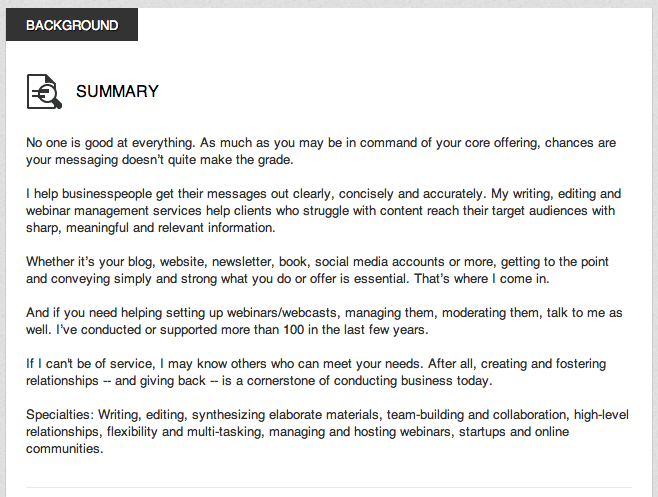
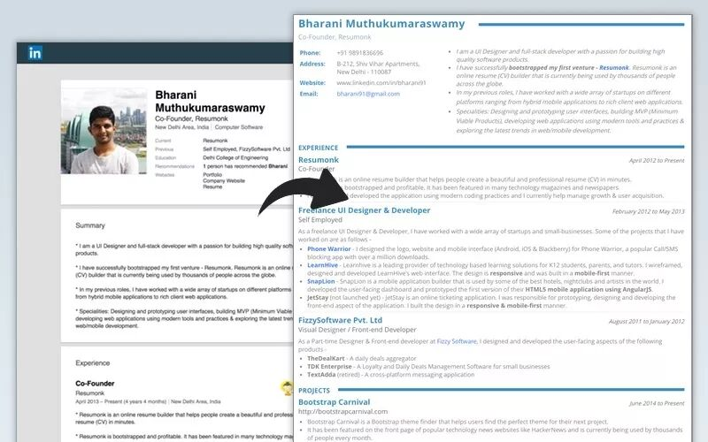
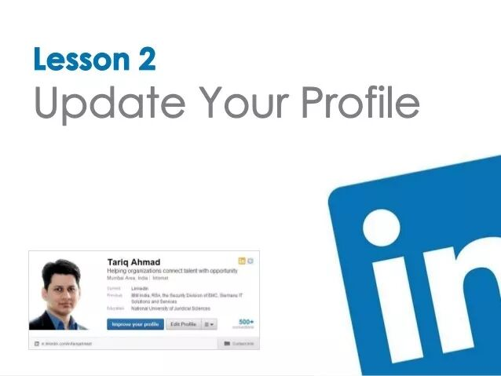
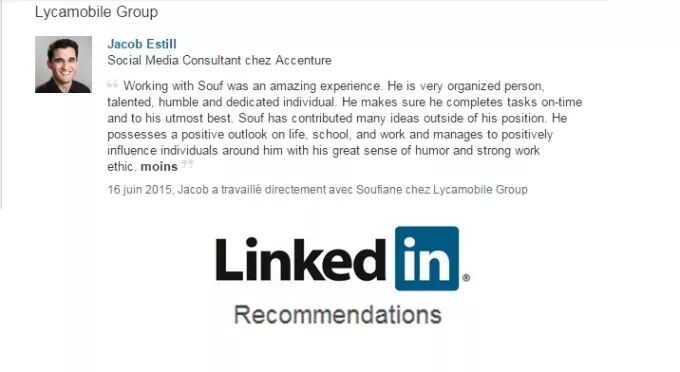
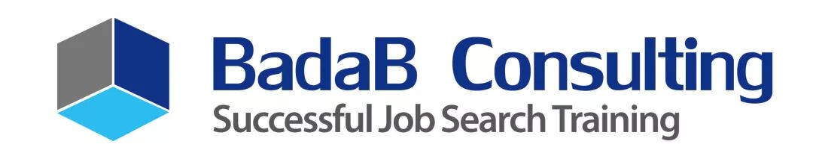

# 无标题

**链接地址:** http://mp.weixin.qq.com/s?__biz=MzI4NDYyNjAwNw==&mid=2247483868&idx=1&sn=234a8d704664ab64402ebe01160197b7&chksm=ebf9dce4dc8e55f2d55c474a0bb5ec0ef1bf9434d43cfe5a9eed0ed276291049f365d4a11d8c&mpshare=1&scene=2&srcid=1121EZr1wX9C4LEiQySe0UrT#rd
**作者:** 关注我们
**获取时间:** 2025/8/28 21:05:40
**图片数量:** 20

---

## 原始HTML内容

<section style="box-sizing: border-box;"><section class="V5" style="box-sizing: border-box;" powered-by="xiumi.us"><section style="text-align: center;margin: 10px 0%;box-sizing: border-box;"><section style="display: inline-block;vertical-align: middle;width: 20%;box-sizing: border-box;"><section class="V5" style="box-sizing: border-box;" powered-by="xiumi.us"><section style="margin-top: 0.5em;margin-bottom: 0.5em;box-sizing: border-box;"><section style="border-top: 1px dashed rgba(76, 186, 238, 0.82);box-sizing: border-box;"></section></section></section></section><section style="display: inline-block;vertical-align: middle;width: 20%;box-sizing: border-box;"><section class="V5" style="box-sizing: border-box;" powered-by="xiumi.us"><section style="margin-right: 0%;margin-left: 0%;font-size: 11px;box-sizing: border-box;"><section style="display: inline-block;padding-right: 0.2em;padding-top: 0.5em;box-sizing: border-box;"><section style="display: inline-block;vertical-align: top;width: 3em;height: 3em;border-width: 1px;border-style: solid;border-color: rgb(39, 165, 224);padding: 3px;border-radius: 100%;box-sizing: border-box;"><section style="width: 100%;height: 100%;border-radius: 100%;background-color: rgb(39, 165, 224);color: rgb(255, 255, 255);font-size: 20px;line-height: 1.4;box-sizing: border-box;">
序
</section></section><section style="display: inline-block;vertical-align: top;width: 6px;height: 6px;border-radius: 100%;margin-left: -0.5em;background-color: rgb(39, 165, 224);box-sizing: border-box;"></section><section style="display: inline-block;vertical-align: top;width: 3px;height: 3px;border-radius: 100%;margin-top: -0.22em;margin-left: 0.1em;background-color: rgb(39, 165, 224);box-sizing: border-box;"></section></section></section></section></section><section style="display: inline-block;vertical-align: middle;width: 20%;box-sizing: border-box;"><section class="V5" style="box-sizing: border-box;" powered-by="xiumi.us"><section style="margin-top: 0.5em;margin-bottom: 0.5em;box-sizing: border-box;"><section style="border-top: 1px dashed rgba(76, 186, 238, 0.82);box-sizing: border-box;"></section></section></section></section></section></section><section class="V5" style="box-sizing: border-box;" powered-by="xiumi.us"><section style="box-sizing: border-box;"><section style="box-sizing: border-box;">
 
</section></section></section><section class="V5" style="box-sizing: border-box;" powered-by="xiumi.us"><section style="margin: 10px 0%;box-sizing: border-box;"><section style="display: inline-block;vertical-align: middle;width: 40%;padding-right: 5px;box-sizing: border-box;"><section class="V5" style="box-sizing: border-box;" powered-by="xiumi.us"><section style="text-align: center;margin-top: 10px;margin-bottom: 10px;box-sizing: border-box;"><section style="max-width: 100%;vertical-align: middle;display: inline-block;box-sizing: border-box;"></section></section></section></section><section style="display: inline-block;vertical-align: middle;width: 60%;padding-left: 5px;box-sizing: border-box;"><section class="V5" style="box-sizing: border-box;" powered-by="xiumi.us"><section style="margin: 10px 0%;text-align: center;box-sizing: border-box;"><section style="width: 75px;height: 3px;float: right;background-color: rgb(162, 204, 239);box-sizing: border-box;"></section><section style="border-top: 1px none rgb(162, 204, 239);border-bottom: 1px none rgb(162, 204, 239);padding: 10px;border-top-left-radius: 0px;border-bottom-right-radius: 0px;box-sizing: border-box;"><section class="V5" style="box-sizing: border-box;" powered-by="xiumi.us"><section style="box-sizing: border-box;"><section style="text-align: justify;font-size: 13px;line-height: 1.8;color: rgba(51, 51, 51, 0.61);letter-spacing: 1.5px;padding-right: 10px;padding-left: 10px;box-sizing: border-box;">
在北美求职的小伙伴们一定对LinkedIn这个<strong style="box-sizing: border-box;">商业社交服务网站</strong>不会感到陌生，然而如何创建一个简洁美观又吸引人的个人主页，并以此获得更优质的社交人脉和工作机会却<strong style="box-sizing: border-box;">不是一件简单的事情</strong>。
</section></section></section></section><section style="width: 75px;height: 3px;margin-top: -3px;background-color: rgb(162, 204, 239);box-sizing: border-box;"></section></section></section></section></section></section><section class="V5" style="box-sizing: border-box;" powered-by="xiumi.us"><section style="box-sizing: border-box;"><section style="box-sizing: border-box;">
 
</section></section></section><section class="V5" style="box-sizing: border-box;" powered-by="xiumi.us"><section style="margin-right: 0%;margin-bottom: 10px;margin-left: 0%;box-sizing: border-box;"><section style="display: inline-block;vertical-align: top;width: 50%;padding-right: 5px;box-sizing: border-box;"><section class="V5" style="box-sizing: border-box;" powered-by="xiumi.us"><section style="margin: 10px 0%;text-align: center;box-sizing: border-box;"><section style="width: 2.25em;height: 2.25em;border-top: 5px solid rgb(162, 204, 239);border-left: 5px solid rgb(162, 204, 239);transform: rotate(0deg);-webkit-transform: rotate(0deg);-moz-transform: rotate(0deg);-o-transform: rotate(0deg);box-sizing: border-box;"></section><section style="margin-top: -2.25em;box-sizing: border-box;"><section style="padding-top: 10px;padding-bottom: 10px;padding-left: 10px;background-color: rgba(255, 255, 255, 0);box-sizing: border-box;"><section class="V5" style="box-sizing: border-box;" powered-by="xiumi.us"><section style="margin-right: 0%;margin-left: 0%;box-sizing: border-box;"><section style="max-width: 100%;vertical-align: middle;display: inline-block;box-sizing: border-box;"></section></section></section></section></section></section></section></section><section style="display: inline-block;vertical-align: top;width: 50%;padding-left: 5px;box-sizing: border-box;"><section class="V5" style="box-sizing: border-box;" powered-by="xiumi.us"><section style="margin: 10px 0%;text-align: center;box-sizing: border-box;"><section style="margin-bottom: -2.25em;box-sizing: border-box;"><section style="padding-top: 10px;padding-right: 10px;padding-bottom: 10px;background-color: rgba(255, 255, 255, 0);box-sizing: border-box;"><section class="V5" style="box-sizing: border-box;" powered-by="xiumi.us"><section style="margin-right: 0%;margin-left: 0%;box-sizing: border-box;"><section style="max-width: 100%;vertical-align: middle;display: inline-block;box-sizing: border-box;"></section></section></section></section></section><section style="width: 2.25em;height: 2.25em;margin-left: auto;border-bottom: 5px solid rgb(162, 204, 239);border-right: 5px solid rgb(162, 204, 239);transform: rotate(0deg);-webkit-transform: rotate(0deg);-moz-transform: rotate(0deg);-o-transform: rotate(0deg);box-sizing: border-box;"></section></section></section></section></section></section><section class="V5" style="box-sizing: border-box;" powered-by="xiumi.us"><section style="box-sizing: border-box;"><section style="box-sizing: border-box;">
 
</section></section></section><section class="V5" style="box-sizing: border-box;" powered-by="xiumi.us"><section style="margin: 10px 0%;box-sizing: border-box;"><section style="display: inline-block;vertical-align: middle;width: 15%;box-sizing: border-box;"><section class="V5" style="box-sizing: border-box;" powered-by="xiumi.us"><section style="text-align: center;margin-right: 0%;margin-left: 0%;box-sizing: border-box;"><section style="display: inline-block;min-width: 10%;max-width: 100%;vertical-align: top;background-color: rgb(162, 204, 239);padding: 5px 3px;box-shadow: rgb(0, 0, 0) 0px 0px 0px;box-sizing: border-box;"><section class="V5" style="box-sizing: border-box;" powered-by="xiumi.us"><section style="margin-right: 0%;margin-left: 0%;box-sizing: border-box;"><section style="width: 2em;border-width: 2px;border-style: solid;border-color: rgb(162, 204, 239);display: inline-block;overflow: hidden;box-sizing: border-box;"><section style="background-color: rgb(161, 204, 239);color: rgb(23, 51, 123);box-sizing: border-box;">
<strong style="box-sizing: border-box;">领</strong>
</section><section style="width: 0px;border-width: 0.5em 1em;border-style: solid;border-color: rgb(162, 204, 239) rgb(255, 255, 255) rgb(255, 255, 255) rgb(162, 204, 239);box-sizing: border-box;"></section><section style="background-color: rgb(255, 255, 255);color: rgb(23, 51, 123);box-sizing: border-box;">
<strong style="box-sizing: border-box;">英</strong>
</section></section></section></section></section></section></section></section><section style="display: inline-block;vertical-align: middle;width: 85%;padding-right: 5px;padding-left: 5px;box-sizing: border-box;"><section class="V5" style="box-sizing: border-box;" powered-by="xiumi.us"><section style="box-sizing: border-box;"><section style="text-align: justify;font-size: 13px;line-height: 1.8;color: rgba(51, 51, 51, 0.61);letter-spacing: 1.5px;padding-right: 10px;padding-left: 10px;box-sizing: border-box;">
虽然很多朋友都明白需要建立一个展现自己工作能力和经验的LinkedIn个人主页，但却<strong style="box-sizing: border-box;">不知道如何下手</strong>：该添加怎样的内容？又该如何发展个人关系网？

 

LinkedIn真得能帮我找到工作吗？答案是：可以。但<strong style="box-sizing: border-box;">前提是你要会用</strong>。这篇文章将传授你几个我们精心总结的<strong style="box-sizing: border-box;">LinkedIn使用小诀窍</strong>，想拿优质Offer的小伙伴们赶紧get起来吧！
</section></section></section></section></section></section><section class="V5" style="box-sizing: border-box;" powered-by="xiumi.us"><section style="text-align: center;box-sizing: border-box;"><section style="max-width: 100%;display: inline-block;width: 100%;box-sizing: border-box;"></section></section></section><section class="V5" style="box-sizing: border-box;" powered-by="xiumi.us"><section style="box-sizing: border-box;"><section style="box-sizing: border-box;">
 
</section></section></section><section class="V5" style="box-sizing: border-box;" powered-by="xiumi.us"><section style="margin: 10px 0%;box-sizing: border-box;"><section style="display: inline-block;vertical-align: top;width: 16%;box-sizing: border-box;"><section class="V5" style="box-sizing: border-box;" powered-by="xiumi.us"><section style="margin-right: 0%;margin-left: 0%;text-align: center;font-size: 12px;box-sizing: border-box;"><section style="display: inline-block;vertical-align: top;box-sizing: border-box;"><section style="border-width: 3px;border-style: solid;border-color: rgb(149, 216, 247);display: inline-block;vertical-align: middle;border-radius: 100%;background-color: rgb(255, 255, 255);width: 3em;height: 3em;line-height: 2.6em;color: rgb(23, 51, 123);margin-right: -1px;box-sizing: border-box;">
<strong style="box-sizing: border-box;">01</strong>
</section><section style="width: 0px;display: inline-block;vertical-align: middle;border-left: 8px solid rgb(149, 216, 247);border-top: 5px solid transparent;border-bottom: 5px solid transparent;box-sizing: border-box;"></section></section></section></section></section><section style="display: inline-block;vertical-align: top;width: 80%;background-color: rgb(189, 221, 244);padding: 5px 10px;box-sizing: border-box;"><section class="V5" style="box-sizing: border-box;" powered-by="xiumi.us"><section style="box-sizing: border-box;"><section style="letter-spacing: 2px;box-sizing: border-box;">
<strong style="box-sizing: border-box;">微笑，是你最好的名片。</strong> 
</section></section></section></section></section></section><section class="V5" style="box-sizing: border-box;" powered-by="xiumi.us"><section style="margin: 20px 0%;text-align: center;box-sizing: border-box;"><section style="display: inline-block;width: 95%;vertical-align: top;border-right: 0px none rgb(62, 62, 62);border-top-right-radius: 0px;box-shadow: rgb(187, 222, 251) 0px 0px 15px;border-left: 0px none rgb(62, 62, 62);border-bottom-left-radius: 0px;padding: 5px;box-sizing: border-box;"><section class="V5" style="box-sizing: border-box;" powered-by="xiumi.us"><section style="margin-right: 0%;margin-left: 0%;box-sizing: border-box;"><section style="display: inline-block;width: 100%;vertical-align: top;border-right: 0px none rgb(62, 62, 62);border-top-right-radius: 0px;box-shadow: rgb(187, 222, 251) 0px 0px 15px inset;border-left: 0px none rgb(62, 62, 62);border-bottom-left-radius: 0px;padding: 10px;box-sizing: border-box;"><section class="V5" style="box-sizing: border-box;" powered-by="xiumi.us"><section style="margin-right: 0%;margin-left: 0%;box-sizing: border-box;"><section style="max-width: 100%;vertical-align: middle;display: inline-block;box-shadow: rgb(0, 0, 0) 0px 0px 0px;box-sizing: border-box;"></section></section></section></section></section></section></section></section></section><section class="V5" style="box-sizing: border-box;" powered-by="xiumi.us"><section style="margin: 20px 0%;box-sizing: border-box;"><section style="display: inline-block;vertical-align: middle;width: 15%;box-sizing: border-box;"><section class="V5" style="box-sizing: border-box;" powered-by="xiumi.us"><section style="text-align: center;margin-right: 0%;margin-left: 0%;box-sizing: border-box;"><section style="display: inline-block;min-width: 10%;max-width: 100%;vertical-align: top;background-color: rgb(162, 204, 239);padding: 5px 3px;box-shadow: rgb(0, 0, 0) 0px 0px 0px;box-sizing: border-box;"><section class="V5" style="box-sizing: border-box;" powered-by="xiumi.us"><section style="margin-right: 0%;margin-left: 0%;box-sizing: border-box;"><section style="width: 2em;border-width: 2px;border-style: solid;border-color: rgb(162, 204, 239);display: inline-block;overflow: hidden;box-sizing: border-box;"><section style="background-color: rgb(161, 204, 239);color: rgb(23, 51, 123);box-sizing: border-box;">
<strong style="box-sizing: border-box;">看</strong>
</section><section style="width: 0px;border-width: 0.5em 1em;border-style: solid;border-color: rgb(162, 204, 239) rgb(255, 255, 255) rgb(255, 255, 255) rgb(162, 204, 239);box-sizing: border-box;"></section><section style="background-color: rgb(255, 255, 255);color: rgb(23, 51, 123);box-sizing: border-box;">
<strong style="box-sizing: border-box;">脸</strong>
</section></section></section></section></section></section></section></section><section style="display: inline-block;vertical-align: middle;width: 85%;padding-right: 5px;padding-left: 5px;box-sizing: border-box;"><section class="V5" style="box-sizing: border-box;" powered-by="xiumi.us"><section style="box-sizing: border-box;"><section style="text-align: justify;font-size: 13px;line-height: 1.8;color: rgba(51, 51, 51, 0.61);letter-spacing: 1.5px;padding-right: 10px;padding-left: 10px;box-sizing: border-box;">
俗话说得好，人靠衣装马靠鞍。在这个看脸的时代，LinkedIn上的头像千万马虎不得。毕竟大头照会留给他人最直观的第一印象。这个人靠谱与否，你的头像会告诉别人。
</section></section></section></section></section></section><section class="V5" style="box-sizing: border-box;" powered-by="xiumi.us"><section style="margin: 20px 0%;text-align: center;box-sizing: border-box;"><section style="display: inline-block;width: 95%;vertical-align: top;border-right: 0px none rgb(62, 62, 62);border-top-right-radius: 0px;box-shadow: rgb(187, 222, 251) 0px 0px 15px;border-left: 0px none rgb(62, 62, 62);border-bottom-left-radius: 0px;padding: 5px;box-sizing: border-box;"><section class="V5" style="box-sizing: border-box;" powered-by="xiumi.us"><section style="margin-right: 0%;margin-left: 0%;box-sizing: border-box;"><section style="display: inline-block;width: 100%;vertical-align: top;border-right: 0px none rgb(62, 62, 62);border-top-right-radius: 0px;box-shadow: rgb(187, 222, 251) 0px 0px 15px inset;border-left: 0px none rgb(62, 62, 62);border-bottom-left-radius: 0px;padding: 10px;box-sizing: border-box;"><section class="V5" style="box-sizing: border-box;" powered-by="xiumi.us"><section style="margin-right: 0%;margin-left: 0%;box-sizing: border-box;"><section style="max-width: 100%;vertical-align: middle;display: inline-block;box-shadow: rgb(0, 0, 0) 0px 0px 0px;box-sizing: border-box;"></section></section></section></section></section></section></section></section></section><section class="V5" style="box-sizing: border-box;" powered-by="xiumi.us"><section style="margin: 20px 0%;box-sizing: border-box;"><section style="text-align: justify;letter-spacing: 1.5px;color: rgba(51, 51, 51, 0.61);padding-right: 20px;padding-left: 20px;box-sizing: border-box;">
那么怎样的头像照片算得上“好”呢？首先不能是像素低下的生活照自拍，也不能是表情僵硬的证件照。最好穿上你的<strong style="box-sizing: border-box;">正式</strong><strong style="box-sizing: border-box;">工作装</strong>找<strong style="box-sizing: border-box;">专业的摄影师</strong>在光线良好的地方拍摄，然后露出你最自信的微笑吧！这样的照片通常在照相馆<strong style="box-sizing: border-box;">几十刀</strong>就可以搞定，千万不要图省事省钱放败形象的照片上去哦！一张好的头像会提高<strong style="box-sizing: border-box;">高达7倍</strong>的主页<strong style="box-sizing: border-box;">点击率</strong>呢！ 
</section></section></section><section class="V5" style="box-sizing: border-box;" powered-by="xiumi.us"><section style="box-sizing: border-box;"><section style="box-sizing: border-box;">
（本章节图片来源于知乎） 

 
</section></section></section><section class="V5" style="box-sizing: border-box;" powered-by="xiumi.us"><section style="margin: 10px 0%;box-sizing: border-box;"><section style="display: inline-block;vertical-align: top;width: 16%;box-sizing: border-box;"><section class="V5" style="box-sizing: border-box;" powered-by="xiumi.us"><section style="margin-right: 0%;margin-left: 0%;text-align: center;font-size: 12px;box-sizing: border-box;"><section style="display: inline-block;vertical-align: top;box-sizing: border-box;"><section style="border-width: 3px;border-style: solid;border-color: rgb(149, 216, 247);display: inline-block;vertical-align: middle;border-radius: 100%;background-color: rgb(255, 255, 255);width: 3em;height: 3em;line-height: 2.6em;color: rgb(23, 51, 123);margin-right: -1px;box-sizing: border-box;">
<strong style="box-sizing: border-box;">02</strong>
</section><section style="width: 0px;display: inline-block;vertical-align: middle;border-left: 8px solid rgb(149, 216, 247);border-top: 5px solid transparent;border-bottom: 5px solid transparent;box-sizing: border-box;"></section></section></section></section></section><section style="display: inline-block;vertical-align: top;width: 80%;background-color: rgb(189, 221, 244);padding: 5px 10px;box-sizing: border-box;"><section class="V5" style="box-sizing: border-box;" powered-by="xiumi.us"><section style="box-sizing: border-box;"><section style="letter-spacing: 2px;box-sizing: border-box;">
<strong style="box-sizing: border-box;">个人描述，一定要认真写！</strong> 
</section></section></section></section></section></section><section class="V5" style="box-sizing: border-box;" powered-by="xiumi.us"><section style="margin: 20px 0%;text-align: center;box-sizing: border-box;"><section style="display: inline-block;width: 95%;vertical-align: top;border-right: 0px none rgb(62, 62, 62);border-top-right-radius: 0px;box-shadow: rgb(187, 222, 251) 0px 0px 15px;border-left: 0px none rgb(62, 62, 62);border-bottom-left-radius: 0px;padding: 5px;box-sizing: border-box;"><section class="V5" style="box-sizing: border-box;" powered-by="xiumi.us"><section style="margin-right: 0%;margin-left: 0%;box-sizing: border-box;"><section style="display: inline-block;width: 100%;vertical-align: top;border-right: 0px none rgb(62, 62, 62);border-top-right-radius: 0px;box-shadow: rgb(187, 222, 251) 0px 0px 15px inset;border-left: 0px none rgb(62, 62, 62);border-bottom-left-radius: 0px;padding: 10px;box-sizing: border-box;"><section class="V5" style="box-sizing: border-box;" powered-by="xiumi.us"><section style="margin-right: 0%;margin-left: 0%;box-sizing: border-box;"><section style="max-width: 100%;vertical-align: middle;display: inline-block;box-shadow: rgb(0, 0, 0) 0px 0px 0px;box-sizing: border-box;"></section></section></section></section></section></section></section></section></section><section class="V5" style="box-sizing: border-box;" powered-by="xiumi.us"><section style="margin: 20px 0%;box-sizing: border-box;"><section style="display: inline-block;vertical-align: middle;width: 15%;box-sizing: border-box;"><section class="V5" style="box-sizing: border-box;" powered-by="xiumi.us"><section style="text-align: center;margin-right: 0%;margin-left: 0%;box-sizing: border-box;"><section style="display: inline-block;min-width: 10%;max-width: 100%;vertical-align: top;background-color: rgb(162, 204, 239);padding: 5px 3px;box-shadow: rgb(0, 0, 0) 0px 0px 0px;box-sizing: border-box;"><section class="V5" style="box-sizing: border-box;" powered-by="xiumi.us"><section style="margin-right: 0%;margin-left: 0%;box-sizing: border-box;"><section style="width: 2em;border-width: 2px;border-style: solid;border-color: rgb(162, 204, 239);display: inline-block;overflow: hidden;box-sizing: border-box;"><section style="background-color: rgb(161, 204, 239);color: rgb(23, 51, 123);box-sizing: border-box;">
<strong style="box-sizing: border-box;">个</strong>
</section><section style="width: 0px;border-width: 0.5em 1em;border-style: solid;border-color: rgb(162, 204, 239) rgb(255, 255, 255) rgb(255, 255, 255) rgb(162, 204, 239);box-sizing: border-box;"></section><section style="background-color: rgb(255, 255, 255);color: rgb(23, 51, 123);box-sizing: border-box;">
<strong style="box-sizing: border-box;">性</strong>
</section></section></section></section></section></section></section></section><section style="display: inline-block;vertical-align: middle;width: 85%;padding-right: 5px;padding-left: 5px;box-sizing: border-box;"><section class="V5" style="box-sizing: border-box;" powered-by="xiumi.us"><section style="box-sizing: border-box;"><section style="text-align: justify;font-size: 13px;line-height: 1.8;color: rgba(51, 51, 51, 0.61);letter-spacing: 1.5px;padding-right: 10px;padding-left: 10px;box-sizing: border-box;">
很多小伙伴不知道个人介绍这个栏目该写什么，就留着空白什么也不写。其实这段短短的个人简介才是别人<strong style="box-sizing: border-box;">最高效率了解你</strong>也是最能展现你<strong style="box-sizing: border-box;">个人魅力</strong>和个性的地方。
</section></section></section></section></section></section><section class="V5" style="box-sizing: border-box;" powered-by="xiumi.us"><section style="margin: 20px 0%;box-sizing: border-box;"><section style="text-align: justify;letter-spacing: 1.5px;color: rgba(51, 51, 51, 0.61);padding-right: 20px;padding-left: 20px;box-sizing: border-box;">
其实这个部分撰写起来并没有太多的规则，但大体来说其用意就是为了引起他人对你的兴趣。你可以谈谈你对<strong style="box-sizing: border-box;">工作的激情和职业的规划</strong>，但切记不要太长像一本书一样让人读不下去，也不要写得太深奥让人觉得你难以亲近。你可以严肃地<strong style="box-sizing: border-box;">拽拽你的技能</strong>，也可以<strong style="box-sizing: border-box;">幽默地谈谈对从事职业的心得</strong>，但，不能有错别字！
</section></section></section><section class="V5" style="box-sizing: border-box;" powered-by="xiumi.us"><section style="box-sizing: border-box;"><section style="box-sizing: border-box;">
 
</section></section></section><section class="V5" style="box-sizing: border-box;" powered-by="xiumi.us"><section style="margin: 10px 0%;box-sizing: border-box;"><section style="display: inline-block;vertical-align: top;width: 16%;box-sizing: border-box;"><section class="V5" style="box-sizing: border-box;" powered-by="xiumi.us"><section style="margin-right: 0%;margin-left: 0%;text-align: center;font-size: 12px;box-sizing: border-box;"><section style="display: inline-block;vertical-align: top;box-sizing: border-box;"><section style="border-width: 3px;border-style: solid;border-color: rgb(149, 216, 247);display: inline-block;vertical-align: middle;border-radius: 100%;background-color: rgb(255, 255, 255);width: 3em;height: 3em;line-height: 2.6em;color: rgb(23, 51, 123);margin-right: -1px;box-sizing: border-box;">
<strong style="box-sizing: border-box;">03</strong>
</section><section style="width: 0px;display: inline-block;vertical-align: middle;border-left: 8px solid rgb(149, 216, 247);border-top: 5px solid transparent;border-bottom: 5px solid transparent;box-sizing: border-box;"></section></section></section></section></section><section style="display: inline-block;vertical-align: top;width: 80%;background-color: rgb(189, 221, 244);padding: 5px 10px;box-sizing: border-box;"><section class="V5" style="box-sizing: border-box;" powered-by="xiumi.us"><section style="box-sizing: border-box;"><section style="letter-spacing: 2px;box-sizing: border-box;">
<strong style="box-sizing: border-box;">尽可能的包装你的简历</strong> 
</section></section></section></section></section></section><section class="V5" style="box-sizing: border-box;" powered-by="xiumi.us"><section style="margin: 20px 0%;text-align: center;box-sizing: border-box;"><section style="display: inline-block;width: 95%;vertical-align: top;border-right: 0px none rgb(62, 62, 62);border-top-right-radius: 0px;box-shadow: rgb(187, 222, 251) 0px 0px 15px;border-left: 0px none rgb(62, 62, 62);border-bottom-left-radius: 0px;padding: 5px;box-sizing: border-box;"><section class="V5" style="box-sizing: border-box;" powered-by="xiumi.us"><section style="margin-right: 0%;margin-left: 0%;box-sizing: border-box;"><section style="display: inline-block;width: 100%;vertical-align: top;border-right: 0px none rgb(62, 62, 62);border-top-right-radius: 0px;box-shadow: rgb(187, 222, 251) 0px 0px 15px inset;border-left: 0px none rgb(62, 62, 62);border-bottom-left-radius: 0px;padding: 10px;box-sizing: border-box;"><section class="V5" style="box-sizing: border-box;" powered-by="xiumi.us"><section style="margin-right: 0%;margin-left: 0%;box-sizing: border-box;"><section style="max-width: 100%;vertical-align: middle;display: inline-block;box-shadow: rgb(0, 0, 0) 0px 0px 0px;box-sizing: border-box;"></section></section></section></section></section></section></section></section></section><section class="V5" style="box-sizing: border-box;" powered-by="xiumi.us"><section style="margin: 20px 0%;box-sizing: border-box;"><section style="display: inline-block;vertical-align: middle;width: 15%;box-sizing: border-box;"><section class="V5" style="box-sizing: border-box;" powered-by="xiumi.us"><section style="text-align: center;margin-right: 0%;margin-left: 0%;box-sizing: border-box;"><section style="display: inline-block;min-width: 10%;max-width: 100%;vertical-align: top;background-color: rgb(162, 204, 239);padding: 5px 3px;box-shadow: rgb(0, 0, 0) 0px 0px 0px;box-sizing: border-box;"><section class="V5" style="box-sizing: border-box;" powered-by="xiumi.us"><section style="margin-right: 0%;margin-left: 0%;box-sizing: border-box;"><section style="width: 2em;border-width: 2px;border-style: solid;border-color: rgb(162, 204, 239);display: inline-block;overflow: hidden;box-sizing: border-box;"><section style="background-color: rgb(161, 204, 239);color: rgb(23, 51, 123);box-sizing: border-box;">
<strong style="box-sizing: border-box;">包</strong>
</section><section style="width: 0px;border-width: 0.5em 1em;border-style: solid;border-color: rgb(162, 204, 239) rgb(255, 255, 255) rgb(255, 255, 255) rgb(162, 204, 239);box-sizing: border-box;"></section><section style="background-color: rgb(255, 255, 255);color: rgb(23, 51, 123);box-sizing: border-box;">
<strong style="box-sizing: border-box;">装</strong>
</section></section></section></section></section></section></section></section><section style="display: inline-block;vertical-align: middle;width: 85%;padding-right: 5px;padding-left: 5px;box-sizing: border-box;"><section class="V5" style="box-sizing: border-box;" powered-by="xiumi.us"><section style="box-sizing: border-box;"><section style="text-align: justify;font-size: 13px;line-height: 1.8;color: rgba(51, 51, 51, 0.61);letter-spacing: 1.5px;padding-right: 10px;padding-left: 10px;box-sizing: border-box;">
LiknedIn自带的简历模版十分简洁美观，但你需要一个包装精美的简历内容才可以将其效用发挥到最大！什么样的内容又以怎样的方式书写？请一定要找专业人士帮忙！
</section></section></section></section></section></section><section class="V5" style="box-sizing: border-box;" powered-by="xiumi.us"><section style="margin: 20px 0%;box-sizing: border-box;"><section style="text-align: justify;letter-spacing: 1.5px;color: rgba(51, 51, 51, 0.61);padding-right: 20px;padding-left: 20px;box-sizing: border-box;">
简历是展示个人经历和技能的最佳载体，也是公司HR随便溜一眼就会下结论要不要面谈你的媒介。大家对于如何写简历的技巧应该不会太陌生，LinkedIn的好处在于可以<strong style="box-sizing: border-box;">完整地将你的个人经历和技能都充分展</strong>示在你的个人主页上而不受篇幅限制。但撰写的时候还是应该注意文字要<strong style="box-sizing: border-box;">简明扼要，言简意赅</strong>，让人可以轻松抓到你的<strong style="box-sizing: border-box;">闪光点</strong>。
</section></section></section><section class="V5" style="box-sizing: border-box;" powered-by="xiumi.us"><section style="box-sizing: border-box;"><section style="box-sizing: border-box;">
 
</section></section></section><section class="V5" style="box-sizing: border-box;" powered-by="xiumi.us"><section style="margin: 10px 0%;box-sizing: border-box;"><section style="display: inline-block;vertical-align: top;width: 16%;box-sizing: border-box;"><section class="V5" style="box-sizing: border-box;" powered-by="xiumi.us"><section style="margin-right: 0%;margin-left: 0%;text-align: center;font-size: 12px;box-sizing: border-box;"><section style="display: inline-block;vertical-align: top;box-sizing: border-box;"><section style="border-width: 3px;border-style: solid;border-color: rgb(149, 216, 247);display: inline-block;vertical-align: middle;border-radius: 100%;background-color: rgb(255, 255, 255);width: 3em;height: 3em;line-height: 2.6em;color: rgb(23, 51, 123);margin-right: -1px;box-sizing: border-box;">
<strong style="box-sizing: border-box;">04</strong>
</section><section style="width: 0px;display: inline-block;vertical-align: middle;border-left: 8px solid rgb(149, 216, 247);border-top: 5px solid transparent;border-bottom: 5px solid transparent;box-sizing: border-box;"></section></section></section></section></section><section style="display: inline-block;vertical-align: top;width: 80%;background-color: rgb(189, 221, 244);padding: 5px 10px;box-sizing: border-box;"><section class="V5" style="box-sizing: border-box;" powered-by="xiumi.us"><section style="box-sizing: border-box;"><section style="letter-spacing: 2px;font-size: 14px;box-sizing: border-box;">
<strong style="box-sizing: border-box;">Networking，才是社交网的关键。</strong> 
</section></section></section></section></section></section><section class="V5" style="box-sizing: border-box;" powered-by="xiumi.us"><section style="margin: 20px 0%;text-align: center;box-sizing: border-box;"><section style="display: inline-block;width: 95%;vertical-align: top;border-right: 0px none rgb(62, 62, 62);border-top-right-radius: 0px;box-shadow: rgb(187, 222, 251) 0px 0px 15px;border-left: 0px none rgb(62, 62, 62);border-bottom-left-radius: 0px;padding: 5px;box-sizing: border-box;"><section class="V5" style="box-sizing: border-box;" powered-by="xiumi.us"><section style="margin-right: 0%;margin-left: 0%;box-sizing: border-box;"><section style="display: inline-block;width: 100%;vertical-align: top;border-right: 0px none rgb(62, 62, 62);border-top-right-radius: 0px;box-shadow: rgb(187, 222, 251) 0px 0px 15px inset;border-left: 0px none rgb(62, 62, 62);border-bottom-left-radius: 0px;padding: 10px;box-sizing: border-box;"><section class="V5" style="box-sizing: border-box;" powered-by="xiumi.us"><section style="margin-right: 0%;margin-left: 0%;box-sizing: border-box;"><section style="max-width: 100%;vertical-align: middle;display: inline-block;box-shadow: rgb(0, 0, 0) 0px 0px 0px;box-sizing: border-box;"></section></section></section></section></section></section></section></section></section><section class="V5" style="box-sizing: border-box;" powered-by="xiumi.us"><section style="margin: 20px 0%;box-sizing: border-box;"><section style="display: inline-block;vertical-align: middle;width: 15%;box-sizing: border-box;"><section class="V5" style="box-sizing: border-box;" powered-by="xiumi.us"><section style="text-align: center;margin-right: 0%;margin-left: 0%;box-sizing: border-box;"><section style="display: inline-block;min-width: 10%;max-width: 100%;vertical-align: top;background-color: rgb(162, 204, 239);padding: 5px 3px;box-shadow: rgb(0, 0, 0) 0px 0px 0px;box-sizing: border-box;"><section class="V5" style="box-sizing: border-box;" powered-by="xiumi.us"><section style="margin-right: 0%;margin-left: 0%;box-sizing: border-box;"><section style="width: 2em;border-width: 2px;border-style: solid;border-color: rgb(162, 204, 239);display: inline-block;overflow: hidden;box-sizing: border-box;"><section style="background-color: rgb(161, 204, 239);color: rgb(23, 51, 123);box-sizing: border-box;">
<strong style="box-sizing: border-box;">社</strong>
</section><section style="width: 0px;border-width: 0.5em 1em;border-style: solid;border-color: rgb(162, 204, 239) rgb(255, 255, 255) rgb(255, 255, 255) rgb(162, 204, 239);box-sizing: border-box;"></section><section style="background-color: rgb(255, 255, 255);color: rgb(23, 51, 123);box-sizing: border-box;">
<strong style="box-sizing: border-box;">交</strong>
</section></section></section></section></section></section></section></section><section style="display: inline-block;vertical-align: middle;width: 85%;padding-right: 5px;padding-left: 5px;box-sizing: border-box;"><section class="V5" style="box-sizing: border-box;" powered-by="xiumi.us"><section style="box-sizing: border-box;"><section style="text-align: justify;font-size: 13px;line-height: 1.8;color: rgba(51, 51, 51, 0.61);letter-spacing: 1.5px;padding-right: 10px;padding-left: 10px;box-sizing: border-box;">
LinkedIn的正确使用方式可不是建立完你的个人主页就完事儿啦！作为社交网站，它的<strong style="box-sizing: border-box;">精髓在于社交</strong>——让更多人发现认可你的能力，从而<strong style="box-sizing: border-box;">获取更广泛的人脉</strong>！
</section></section></section></section></section></section><section class="V5" style="box-sizing: border-box;" powered-by="xiumi.us"><section style="margin: 20px 0%;text-align: center;box-sizing: border-box;"><section style="display: inline-block;width: 95%;vertical-align: top;border-right: 0px none rgb(62, 62, 62);border-top-right-radius: 0px;box-shadow: rgb(187, 222, 251) 0px 0px 15px;border-left: 0px none rgb(62, 62, 62);border-bottom-left-radius: 0px;padding: 5px;box-sizing: border-box;"><section class="V5" style="box-sizing: border-box;" powered-by="xiumi.us"><section style="margin-right: 0%;margin-left: 0%;box-sizing: border-box;"><section style="display: inline-block;width: 100%;vertical-align: top;border-right: 0px none rgb(62, 62, 62);border-top-right-radius: 0px;box-shadow: rgb(187, 222, 251) 0px 0px 15px inset;border-left: 0px none rgb(62, 62, 62);border-bottom-left-radius: 0px;padding: 10px;box-sizing: border-box;"><section class="V5" style="box-sizing: border-box;" powered-by="xiumi.us"><section style="margin-right: 0%;margin-left: 0%;box-sizing: border-box;"><section style="max-width: 100%;vertical-align: middle;display: inline-block;box-shadow: rgb(0, 0, 0) 0px 0px 0px;box-sizing: border-box;"></section></section></section></section></section></section></section></section></section><section class="V5" style="box-sizing: border-box;" powered-by="xiumi.us"><section style="margin: 20px 0%;box-sizing: border-box;"><section style="text-align: justify;letter-spacing: 1.5px;color: rgba(51, 51, 51, 0.61);padding-right: 20px;padding-left: 20px;box-sizing: border-box;">
很多人误以为LinkedIn只是需要找工作的时候上去搜搜职位posting的信息类网站，殊不知LinkedIn的正确打开方式是一个社交网站。你可以在上面搜索关键词<strong style="box-sizing: border-box;">查找志同道合的朋友</strong>，也可以<strong style="box-sizing: border-box;">抱抱大神的大腿</strong>，<strong style="box-sizing: border-box;">跪求大佬的提携</strong>。具体怎么操作还是通过LinkedIn添加联系人然后约他们出来喝杯咖啡聊聊天，可以<strong style="box-sizing: border-box;">飞速地拓展自己的交际圈</strong>儿，变成更自信的社交专家。
</section></section></section><section class="V5" style="box-sizing: border-box;" powered-by="xiumi.us"><section style="box-sizing: border-box;"><section style="box-sizing: border-box;">
 
</section></section></section><section class="V5" style="box-sizing: border-box;" powered-by="xiumi.us"><section style="margin: 10px 0%;box-sizing: border-box;"><section style="display: inline-block;vertical-align: top;width: 16%;box-sizing: border-box;"><section class="V5" style="box-sizing: border-box;" powered-by="xiumi.us"><section style="margin-right: 0%;margin-left: 0%;text-align: center;font-size: 12px;box-sizing: border-box;"><section style="display: inline-block;vertical-align: top;box-sizing: border-box;"><section style="border-width: 3px;border-style: solid;border-color: rgb(149, 216, 247);display: inline-block;vertical-align: middle;border-radius: 100%;background-color: rgb(255, 255, 255);width: 3em;height: 3em;line-height: 2.6em;color: rgb(23, 51, 123);margin-right: -1px;box-sizing: border-box;">
<strong style="box-sizing: border-box;">05</strong>
</section><section style="width: 0px;display: inline-block;vertical-align: middle;border-left: 8px solid rgb(149, 216, 247);border-top: 5px solid transparent;border-bottom: 5px solid transparent;box-sizing: border-box;"></section></section></section></section></section><section style="display: inline-block;vertical-align: top;width: 80%;background-color: rgb(189, 221, 244);padding: 5px 10px;box-sizing: border-box;"><section class="V5" style="box-sizing: border-box;" powered-by="xiumi.us"><section style="box-sizing: border-box;"><section style="letter-spacing: 2px;box-sizing: border-box;">
<strong style="box-sizing: border-box;">Double Check, Triple Check!</strong>
</section></section></section></section></section></section><section class="V5" style="box-sizing: border-box;" powered-by="xiumi.us"><section style="margin: 20px 0%;text-align: center;box-sizing: border-box;"><section style="display: inline-block;width: 95%;vertical-align: top;border-right: 0px none rgb(62, 62, 62);border-top-right-radius: 0px;box-shadow: rgb(187, 222, 251) 0px 0px 15px;border-left: 0px none rgb(62, 62, 62);border-bottom-left-radius: 0px;padding: 5px;box-sizing: border-box;"><section class="V5" style="box-sizing: border-box;" powered-by="xiumi.us"><section style="margin-right: 0%;margin-left: 0%;box-sizing: border-box;"><section style="display: inline-block;width: 100%;vertical-align: top;border-right: 0px none rgb(62, 62, 62);border-top-right-radius: 0px;box-shadow: rgb(187, 222, 251) 0px 0px 15px inset;border-left: 0px none rgb(62, 62, 62);border-bottom-left-radius: 0px;padding: 10px;box-sizing: border-box;"><section class="V5" style="box-sizing: border-box;" powered-by="xiumi.us"><section style="margin-right: 0%;margin-left: 0%;box-sizing: border-box;"><section style="max-width: 100%;vertical-align: middle;display: inline-block;box-shadow: rgb(0, 0, 0) 0px 0px 0px;box-sizing: border-box;"></section></section></section></section></section></section></section></section></section><section class="V5" style="box-sizing: border-box;" powered-by="xiumi.us"><section style="margin: 20px 0%;box-sizing: border-box;"><section style="display: inline-block;vertical-align: middle;width: 15%;box-sizing: border-box;"><section class="V5" style="box-sizing: border-box;" powered-by="xiumi.us"><section style="text-align: center;margin-right: 0%;margin-left: 0%;box-sizing: border-box;"><section style="display: inline-block;min-width: 10%;max-width: 100%;vertical-align: top;background-color: rgb(162, 204, 239);padding: 5px 3px;box-shadow: rgb(0, 0, 0) 0px 0px 0px;box-sizing: border-box;"><section class="V5" style="box-sizing: border-box;" powered-by="xiumi.us"><section style="margin-right: 0%;margin-left: 0%;box-sizing: border-box;"><section style="width: 2em;border-width: 2px;border-style: solid;border-color: rgb(162, 204, 239);display: inline-block;overflow: hidden;box-sizing: border-box;"><section style="background-color: rgb(161, 204, 239);color: rgb(23, 51, 123);box-sizing: border-box;">
<strong style="box-sizing: border-box;">检</strong>
</section><section style="width: 0px;border-width: 0.5em 1em;border-style: solid;border-color: rgb(162, 204, 239) rgb(255, 255, 255) rgb(255, 255, 255) rgb(162, 204, 239);box-sizing: border-box;"></section><section style="background-color: rgb(255, 255, 255);color: rgb(23, 51, 123);box-sizing: border-box;">
<strong style="box-sizing: border-box;">查</strong>
</section></section></section></section></section></section></section></section><section style="display: inline-block;vertical-align: middle;width: 85%;padding-right: 5px;padding-left: 5px;box-sizing: border-box;"><section class="V5" style="box-sizing: border-box;" powered-by="xiumi.us"><section style="box-sizing: border-box;"><section style="text-align: justify;font-size: 13px;line-height: 1.8;color: rgba(51, 51, 51, 0.61);letter-spacing: 1.5px;padding-right: 10px;padding-left: 10px;box-sizing: border-box;">
虽说LinkedIn的个人主页不像你的简历那么正式，但如果出现<strong style="box-sizing: border-box;">拼写或者语法错误</strong>，还是难免会给他人留下这个人工作不严谨的印象，一定要在发送前<strong style="box-sizing: border-box;">多检查几遍</strong>。
</section></section></section></section></section></section><section class="V5" style="box-sizing: border-box;" powered-by="xiumi.us"><section style="margin: 20px 0%;box-sizing: border-box;"><section style="text-align: justify;letter-spacing: 1.5px;color: rgba(51, 51, 51, 0.61);padding-right: 20px;padding-left: 20px;box-sizing: border-box;">
现在用于检查拼写和语法的插件很多，甚至一般的Word文档或者邮箱编辑器都会<strong style="box-sizing: border-box;">自带更正功能</strong>。不妨在这样的编辑器里将文本编辑好再复制粘贴到LinkedIn上可以<strong style="box-sizing: border-box;">大大减少错误的概率</strong>。另外也可以使用一些类似<strong style="box-sizing: border-box;">Grammarly</strong>这样的网站去辅助你检查。如果对自己的英语书写实在没有信心，还可以求助身边英语母语的朋友或者<strong style="box-sizing: border-box;">专业的简历修改机构</strong>。
</section></section></section><section class="V5" style="box-sizing: border-box;" powered-by="xiumi.us"><section style="box-sizing: border-box;"><section style="box-sizing: border-box;">
 
</section></section></section><section class="V5" style="box-sizing: border-box;" powered-by="xiumi.us"><section style="margin: 10px 0%;box-sizing: border-box;"><section style="display: inline-block;vertical-align: top;width: 16%;box-sizing: border-box;"><section class="V5" style="box-sizing: border-box;" powered-by="xiumi.us"><section style="margin-right: 0%;margin-left: 0%;text-align: center;font-size: 12px;box-sizing: border-box;"><section style="display: inline-block;vertical-align: top;box-sizing: border-box;"><section style="border-width: 3px;border-style: solid;border-color: rgb(149, 216, 247);display: inline-block;vertical-align: middle;border-radius: 100%;background-color: rgb(255, 255, 255);width: 3em;height: 3em;line-height: 2.6em;color: rgb(23, 51, 123);margin-right: -1px;box-sizing: border-box;">
<strong style="box-sizing: border-box;">06</strong>
</section><section style="width: 0px;display: inline-block;vertical-align: middle;border-left: 8px solid rgb(149, 216, 247);border-top: 5px solid transparent;border-bottom: 5px solid transparent;box-sizing: border-box;"></section></section></section></section></section><section style="display: inline-block;vertical-align: top;width: 80%;background-color: rgb(189, 221, 244);padding: 5px 10px;box-sizing: border-box;"><section class="V5" style="box-sizing: border-box;" powered-by="xiumi.us"><section style="box-sizing: border-box;"><section style="letter-spacing: 2px;box-sizing: border-box;">
<strong style="box-sizing: border-box;">认证他人的职业技能</strong>
</section></section></section></section></section></section><section class="V5" style="box-sizing: border-box;" powered-by="xiumi.us"><section style="margin: 20px 0%;text-align: center;box-sizing: border-box;"><section style="display: inline-block;width: 95%;vertical-align: top;border-right: 0px none rgb(62, 62, 62);border-top-right-radius: 0px;box-shadow: rgb(187, 222, 251) 0px 0px 15px;border-left: 0px none rgb(62, 62, 62);border-bottom-left-radius: 0px;padding: 5px;box-sizing: border-box;"><section class="V5" style="box-sizing: border-box;" powered-by="xiumi.us"><section style="margin-right: 0%;margin-left: 0%;box-sizing: border-box;"><section style="display: inline-block;width: 100%;vertical-align: top;border-right: 0px none rgb(62, 62, 62);border-top-right-radius: 0px;box-shadow: rgb(187, 222, 251) 0px 0px 15px inset;border-left: 0px none rgb(62, 62, 62);border-bottom-left-radius: 0px;padding: 10px;box-sizing: border-box;"><section class="V5" style="box-sizing: border-box;" powered-by="xiumi.us"><section style="margin-right: 0%;margin-left: 0%;box-sizing: border-box;"><section style="max-width: 100%;vertical-align: middle;display: inline-block;box-shadow: rgb(0, 0, 0) 0px 0px 0px;box-sizing: border-box;"></section></section></section></section></section></section></section></section></section><section class="V5" style="box-sizing: border-box;" powered-by="xiumi.us"><section style="margin: 20px 0%;box-sizing: border-box;"><section style="display: inline-block;vertical-align: middle;width: 15%;box-sizing: border-box;"><section class="V5" style="box-sizing: border-box;" powered-by="xiumi.us"><section style="text-align: center;margin-right: 0%;margin-left: 0%;box-sizing: border-box;"><section style="display: inline-block;min-width: 10%;max-width: 100%;vertical-align: top;background-color: rgb(162, 204, 239);padding: 5px 3px;box-shadow: rgb(0, 0, 0) 0px 0px 0px;box-sizing: border-box;"><section class="V5" style="box-sizing: border-box;" powered-by="xiumi.us"><section style="margin-right: 0%;margin-left: 0%;box-sizing: border-box;"><section style="width: 2em;border-width: 2px;border-style: solid;border-color: rgb(162, 204, 239);display: inline-block;overflow: hidden;box-sizing: border-box;"><section style="background-color: rgb(161, 204, 239);color: rgb(23, 51, 123);box-sizing: border-box;">
<strong style="box-sizing: border-box;">技</strong>
</section><section style="width: 0px;border-width: 0.5em 1em;border-style: solid;border-color: rgb(162, 204, 239) rgb(255, 255, 255) rgb(255, 255, 255) rgb(162, 204, 239);box-sizing: border-box;"></section><section style="background-color: rgb(255, 255, 255);color: rgb(23, 51, 123);box-sizing: border-box;">
<strong style="box-sizing: border-box;">能</strong>
</section></section></section></section></section></section></section></section><section style="display: inline-block;vertical-align: middle;width: 85%;padding-right: 5px;padding-left: 5px;box-sizing: border-box;"><section class="V5" style="box-sizing: border-box;" powered-by="xiumi.us"><section style="box-sizing: border-box;"><section style="text-align: justify;font-size: 13px;line-height: 1.8;color: rgba(51, 51, 51, 0.61);letter-spacing: 1.5px;padding-right: 10px;padding-left: 10px;box-sizing: border-box;">
很多人都会倾向于在自己的主页上添加职业技能以<strong style="box-sizing: border-box;">凸显自己的闪光点</strong>，但是你知道你的技能是可以受到他人的认可的吗？这样可以让你的页面看起来<strong style="box-sizing: border-box;">更专业更具有说服力</strong>。
</section></section></section></section></section></section><section class="V5" style="box-sizing: border-box;" powered-by="xiumi.us"><section style="margin: 20px 0%;box-sizing: border-box;"><section style="text-align: justify;letter-spacing: 1.5px;color: rgba(51, 51, 51, 0.61);padding-right: 20px;padding-left: 20px;box-sizing: border-box;">
Endorsment这个功能的开通允许用户在他人的主页上对<strong style="box-sizing: border-box;">添加的职业技能进行认证</strong>，同时也可以像其他用户推荐你认为符合他能力设定的技能。一个被多人认可的技能在求职市场上是<strong style="box-sizing: border-box;">有绝对说服力</strong>的，可以让浏览页面的人一下就<strong style="box-sizing: border-box;">get到这个人的特长</strong>所在。所以请和好友们共同互动起来为他的技能进行认证吧！
</section></section></section><section class="V5" style="box-sizing: border-box;" powered-by="xiumi.us"><section style="box-sizing: border-box;"><section style="box-sizing: border-box;">
 
</section></section></section><section class="V5" style="box-sizing: border-box;" powered-by="xiumi.us"><section style="margin: 10px 0%;box-sizing: border-box;"><section style="display: inline-block;vertical-align: top;width: 16%;box-sizing: border-box;"><section class="V5" style="box-sizing: border-box;" powered-by="xiumi.us"><section style="margin-right: 0%;margin-left: 0%;text-align: center;font-size: 12px;box-sizing: border-box;"><section style="display: inline-block;vertical-align: top;box-sizing: border-box;"><section style="border-width: 3px;border-style: solid;border-color: rgb(149, 216, 247);display: inline-block;vertical-align: middle;border-radius: 100%;background-color: rgb(255, 255, 255);width: 3em;height: 3em;line-height: 2.6em;color: rgb(23, 51, 123);margin-right: -1px;box-sizing: border-box;">
<strong style="box-sizing: border-box;">07</strong>
</section><section style="width: 0px;display: inline-block;vertical-align: middle;border-left: 8px solid rgb(149, 216, 247);border-top: 5px solid transparent;border-bottom: 5px solid transparent;box-sizing: border-box;"></section></section></section></section></section><section style="display: inline-block;vertical-align: top;width: 80%;background-color: rgb(189, 221, 244);padding: 5px 10px;box-sizing: border-box;"><section class="V5" style="box-sizing: border-box;" powered-by="xiumi.us"><section style="box-sizing: border-box;"><section style="letter-spacing: 2px;box-sizing: border-box;">
<strong style="box-sizing: border-box;">加入群组，获取更多信息。</strong>
</section></section></section></section></section></section><section class="V5" style="box-sizing: border-box;" powered-by="xiumi.us"><section style="margin: 20px 0%;text-align: center;box-sizing: border-box;"><section style="display: inline-block;width: 95%;vertical-align: top;border-right: 0px none rgb(62, 62, 62);border-top-right-radius: 0px;box-shadow: rgb(187, 222, 251) 0px 0px 15px;border-left: 0px none rgb(62, 62, 62);border-bottom-left-radius: 0px;padding: 5px;box-sizing: border-box;"><section class="V5" style="box-sizing: border-box;" powered-by="xiumi.us"><section style="margin-right: 0%;margin-left: 0%;box-sizing: border-box;"><section style="display: inline-block;width: 100%;vertical-align: top;border-right: 0px none rgb(62, 62, 62);border-top-right-radius: 0px;box-shadow: rgb(187, 222, 251) 0px 0px 15px inset;border-left: 0px none rgb(62, 62, 62);border-bottom-left-radius: 0px;padding: 10px;box-sizing: border-box;"><section class="V5" style="box-sizing: border-box;" powered-by="xiumi.us"><section style="margin-right: 0%;margin-left: 0%;box-sizing: border-box;"><section style="max-width: 100%;vertical-align: middle;display: inline-block;box-shadow: rgb(0, 0, 0) 0px 0px 0px;box-sizing: border-box;"></section></section></section></section></section></section></section></section></section><section class="V5" style="box-sizing: border-box;" powered-by="xiumi.us"><section style="margin: 20px 0%;box-sizing: border-box;"><section style="display: inline-block;vertical-align: middle;width: 15%;box-sizing: border-box;"><section class="V5" style="box-sizing: border-box;" powered-by="xiumi.us"><section style="text-align: center;margin-right: 0%;margin-left: 0%;box-sizing: border-box;"><section style="display: inline-block;min-width: 10%;max-width: 100%;vertical-align: top;background-color: rgb(162, 204, 239);padding: 5px 3px;box-shadow: rgb(0, 0, 0) 0px 0px 0px;box-sizing: border-box;"><section class="V5" style="box-sizing: border-box;" powered-by="xiumi.us"><section style="margin-right: 0%;margin-left: 0%;box-sizing: border-box;"><section style="width: 2em;border-width: 2px;border-style: solid;border-color: rgb(162, 204, 239);display: inline-block;overflow: hidden;box-sizing: border-box;"><section style="background-color: rgb(161, 204, 239);color: rgb(23, 51, 123);box-sizing: border-box;">
<strong style="box-sizing: border-box;">社</strong>
</section><section style="width: 0px;border-width: 0.5em 1em;border-style: solid;border-color: rgb(162, 204, 239) rgb(255, 255, 255) rgb(255, 255, 255) rgb(162, 204, 239);box-sizing: border-box;"></section><section style="background-color: rgb(255, 255, 255);color: rgb(23, 51, 123);box-sizing: border-box;">
<strong style="box-sizing: border-box;">群</strong>
</section></section></section></section></section></section></section></section><section style="display: inline-block;vertical-align: middle;width: 85%;padding-right: 5px;padding-left: 5px;box-sizing: border-box;"><section class="V5" style="box-sizing: border-box;" powered-by="xiumi.us"><section style="box-sizing: border-box;"><section style="text-align: justify;font-size: 13px;line-height: 1.8;color: rgba(51, 51, 51, 0.61);letter-spacing: 1.5px;padding-right: 10px;padding-left: 10px;box-sizing: border-box;">
就像现实生活一样，北美的职场文化也讲究<strong style="box-sizing: border-box;">“混圈子”</strong>，这样的圈子从线上线下都会存在，如果你是一个<strong style="box-sizing: border-box;">有点害羞</strong>的人，不妨从线上群组开始入手学习交流的文化吧！
</section></section></section></section></section></section><section class="V5" style="box-sizing: border-box;" powered-by="xiumi.us"><section style="margin: 20px 0%;box-sizing: border-box;"><section style="text-align: justify;letter-spacing: 1.5px;color: rgba(51, 51, 51, 0.61);padding-right: 20px;padding-left: 20px;box-sizing: border-box;">
加入LinkedIn的群组是很多用户的选择，因为群组可以轻易地让你联系到属于你的<strong style="box-sizing: border-box;">商业社交圈儿</strong>人士，在里面更有效地进行社交扩展自己的人脉，也可以迅速为你提供关于职业技能和商业机会的信息，锁定你的<strong style="box-sizing: border-box;">潜在客户群体</strong>。在群组中活跃的参与讨论和活动，可以让你更快地<strong style="box-sizing: border-box;">融入本地的办公文化氛围</strong>，也同时提高你在商业社交中的自信心。
</section></section></section><section class="V5" style="box-sizing: border-box;" powered-by="xiumi.us"><section style="box-sizing: border-box;"><section style="box-sizing: border-box;">
 
</section></section></section><section class="V5" style="box-sizing: border-box;" powered-by="xiumi.us"><section style="margin: 10px 0%;box-sizing: border-box;"><section style="display: inline-block;vertical-align: top;width: 16%;box-sizing: border-box;"><section class="V5" style="box-sizing: border-box;" powered-by="xiumi.us"><section style="margin-right: 0%;margin-left: 0%;text-align: center;font-size: 12px;box-sizing: border-box;"><section style="display: inline-block;vertical-align: top;box-sizing: border-box;"><section style="border-width: 3px;border-style: solid;border-color: rgb(149, 216, 247);display: inline-block;vertical-align: middle;border-radius: 100%;background-color: rgb(255, 255, 255);width: 3em;height: 3em;line-height: 2.6em;color: rgb(23, 51, 123);margin-right: -1px;box-sizing: border-box;">
<strong style="box-sizing: border-box;">08</strong>
</section><section style="width: 0px;display: inline-block;vertical-align: middle;border-left: 8px solid rgb(149, 216, 247);border-top: 5px solid transparent;border-bottom: 5px solid transparent;box-sizing: border-box;"></section></section></section></section></section><section style="display: inline-block;vertical-align: top;width: 80%;background-color: rgb(189, 221, 244);padding: 5px 10px;box-sizing: border-box;"><section class="V5" style="box-sizing: border-box;" powered-by="xiumi.us"><section style="box-sizing: border-box;"><section style="letter-spacing: 2px;font-size: 14px;color: rgb(23, 51, 123);box-sizing: border-box;">
<strong style="box-sizing: border-box;">及时更新，就像更新你的朋友圈那样！</strong>
</section></section></section></section></section></section><section class="V5" style="box-sizing: border-box;" powered-by="xiumi.us"><section style="margin: 20px 0%;text-align: center;box-sizing: border-box;"><section style="display: inline-block;width: 95%;vertical-align: top;border-right: 0px none rgb(62, 62, 62);border-top-right-radius: 0px;box-shadow: rgb(187, 222, 251) 0px 0px 15px;border-left: 0px none rgb(62, 62, 62);border-bottom-left-radius: 0px;padding: 5px;box-sizing: border-box;"><section class="V5" style="box-sizing: border-box;" powered-by="xiumi.us"><section style="margin-right: 0%;margin-left: 0%;box-sizing: border-box;"><section style="display: inline-block;width: 100%;vertical-align: top;border-right: 0px none rgb(62, 62, 62);border-top-right-radius: 0px;box-shadow: rgb(187, 222, 251) 0px 0px 15px inset;border-left: 0px none rgb(62, 62, 62);border-bottom-left-radius: 0px;padding: 10px;box-sizing: border-box;"><section class="V5" style="box-sizing: border-box;" powered-by="xiumi.us"><section style="margin-right: 0%;margin-left: 0%;box-sizing: border-box;"><section style="max-width: 100%;vertical-align: middle;display: inline-block;box-shadow: rgb(0, 0, 0) 0px 0px 0px;box-sizing: border-box;"></section></section></section></section></section></section></section></section></section><section class="V5" style="box-sizing: border-box;" powered-by="xiumi.us"><section style="margin: 20px 0%;box-sizing: border-box;"><section style="display: inline-block;vertical-align: middle;width: 15%;box-sizing: border-box;"><section class="V5" style="box-sizing: border-box;" powered-by="xiumi.us"><section style="text-align: center;margin-right: 0%;margin-left: 0%;box-sizing: border-box;"><section style="display: inline-block;min-width: 10%;max-width: 100%;vertical-align: top;background-color: rgb(162, 204, 239);padding: 5px 3px;box-shadow: rgb(0, 0, 0) 0px 0px 0px;box-sizing: border-box;"><section class="V5" style="box-sizing: border-box;" powered-by="xiumi.us"><section style="margin-right: 0%;margin-left: 0%;box-sizing: border-box;"><section style="width: 2em;border-width: 2px;border-style: solid;border-color: rgb(162, 204, 239);display: inline-block;overflow: hidden;box-sizing: border-box;"><section style="background-color: rgb(161, 204, 239);color: rgb(23, 51, 123);box-sizing: border-box;">
<strong style="box-sizing: border-box;">更</strong>
</section><section style="width: 0px;border-width: 0.5em 1em;border-style: solid;border-color: rgb(162, 204, 239) rgb(255, 255, 255) rgb(255, 255, 255) rgb(162, 204, 239);box-sizing: border-box;"></section><section style="background-color: rgb(255, 255, 255);color: rgb(23, 51, 123);box-sizing: border-box;">
<strong style="box-sizing: border-box;">新</strong>
</section></section></section></section></section></section></section></section><section style="display: inline-block;vertical-align: middle;width: 85%;padding-right: 5px;padding-left: 5px;box-sizing: border-box;"><section class="V5" style="box-sizing: border-box;" powered-by="xiumi.us"><section style="box-sizing: border-box;"><section style="text-align: justify;font-size: 13px;line-height: 1.8;color: rgba(51, 51, 51, 0.61);letter-spacing: 1.5px;padding-right: 10px;padding-left: 10px;box-sizing: border-box;">
LinkedIn主页的维护可不是一个一劳永逸的事情，它需要你不断的更新你的状态，和圈子内的人社交才可以提升你的页面价值，为你的事业创造更多的机遇。
</section></section></section></section></section></section><section class="V5" style="box-sizing: border-box;" powered-by="xiumi.us"><section style="margin: 20px 0%;box-sizing: border-box;"><section style="text-align: justify;letter-spacing: 1.5px;color: rgba(51, 51, 51, 0.61);padding-right: 20px;padding-left: 20px;box-sizing: border-box;">
及时更新你的LinkedIn主页可以让你的联系人更好的<strong style="box-sizing: border-box;">跟进你的工作进展</strong>。适当地更新和职业发展相关的信息和照片不仅可以展示你对工作的积极热情，也可以制造更多和<strong style="box-sizing: border-box;">圈内好友互动的话题</strong>。一个内容丰富多样又全面的主页总是更能够引起HR或者企业主的兴趣和关注，而一个长久不更新又死气沉沉的主页可能会让你<strong style="box-sizing: border-box;">和心仪的工作机会失之交臂。</strong>
</section></section></section><section class="V5" style="box-sizing: border-box;" powered-by="xiumi.us"><section style="box-sizing: border-box;"><section style="box-sizing: border-box;">
 
</section></section></section><section class="V5" style="box-sizing: border-box;" powered-by="xiumi.us"><section style="margin: 10px 0%;box-sizing: border-box;"><section style="display: inline-block;vertical-align: top;width: 16%;box-sizing: border-box;"><section class="V5" style="box-sizing: border-box;" powered-by="xiumi.us"><section style="margin-right: 0%;margin-left: 0%;text-align: center;font-size: 12px;box-sizing: border-box;"><section style="display: inline-block;vertical-align: top;box-sizing: border-box;"><section style="border-width: 3px;border-style: solid;border-color: rgb(149, 216, 247);display: inline-block;vertical-align: middle;border-radius: 100%;background-color: rgb(255, 255, 255);width: 3em;height: 3em;line-height: 2.6em;color: rgb(23, 51, 123);margin-right: -1px;box-sizing: border-box;">
<strong style="box-sizing: border-box;">09</strong>
</section><section style="width: 0px;display: inline-block;vertical-align: middle;border-left: 8px solid rgb(149, 216, 247);border-top: 5px solid transparent;border-bottom: 5px solid transparent;box-sizing: border-box;"></section></section></section></section></section><section style="display: inline-block;vertical-align: top;width: 80%;background-color: rgb(189, 221, 244);padding: 5px 10px;box-sizing: border-box;"><section class="V5" style="box-sizing: border-box;" powered-by="xiumi.us"><section style="box-sizing: border-box;"><section style="letter-spacing: 2px;box-sizing: border-box;">
<strong style="box-sizing: border-box;">推荐信！是时候抱大腿啦！</strong>
</section></section></section></section></section></section><section class="V5" style="box-sizing: border-box;" powered-by="xiumi.us"><section style="margin: 20px 0%;text-align: center;box-sizing: border-box;"><section style="display: inline-block;width: 95%;vertical-align: top;border-right: 0px none rgb(62, 62, 62);border-top-right-radius: 0px;box-shadow: rgb(187, 222, 251) 0px 0px 15px;border-left: 0px none rgb(62, 62, 62);border-bottom-left-radius: 0px;padding: 5px;box-sizing: border-box;"><section class="V5" style="box-sizing: border-box;" powered-by="xiumi.us"><section style="margin-right: 0%;margin-left: 0%;box-sizing: border-box;"><section style="display: inline-block;width: 100%;vertical-align: top;border-right: 0px none rgb(62, 62, 62);border-top-right-radius: 0px;box-shadow: rgb(187, 222, 251) 0px 0px 15px inset;border-left: 0px none rgb(62, 62, 62);border-bottom-left-radius: 0px;padding: 10px;box-sizing: border-box;"><section class="V5" style="box-sizing: border-box;" powered-by="xiumi.us"><section style="margin-right: 0%;margin-left: 0%;box-sizing: border-box;"><section style="max-width: 100%;vertical-align: middle;display: inline-block;box-shadow: rgb(0, 0, 0) 0px 0px 0px;box-sizing: border-box;"></section></section></section></section></section></section></section></section></section><section class="V5" style="box-sizing: border-box;" powered-by="xiumi.us"><section style="margin: 20px 0%;box-sizing: border-box;"><section style="display: inline-block;vertical-align: middle;width: 15%;box-sizing: border-box;"><section class="V5" style="box-sizing: border-box;" powered-by="xiumi.us"><section style="text-align: center;margin-right: 0%;margin-left: 0%;box-sizing: border-box;"><section style="display: inline-block;min-width: 10%;max-width: 100%;vertical-align: top;background-color: rgb(162, 204, 239);padding: 5px 3px;box-shadow: rgb(0, 0, 0) 0px 0px 0px;box-sizing: border-box;"><section class="V5" style="box-sizing: border-box;" powered-by="xiumi.us"><section style="margin-right: 0%;margin-left: 0%;box-sizing: border-box;"><section style="width: 2em;border-width: 2px;border-style: solid;border-color: rgb(162, 204, 239);display: inline-block;overflow: hidden;box-sizing: border-box;"><section style="background-color: rgb(161, 204, 239);color: rgb(23, 51, 123);box-sizing: border-box;">
<strong style="box-sizing: border-box;">推</strong>
</section><section style="width: 0px;border-width: 0.5em 1em;border-style: solid;border-color: rgb(162, 204, 239) rgb(255, 255, 255) rgb(255, 255, 255) rgb(162, 204, 239);box-sizing: border-box;"></section><section style="background-color: rgb(255, 255, 255);color: rgb(23, 51, 123);box-sizing: border-box;">
<strong style="box-sizing: border-box;">荐</strong>
</section></section></section></section></section></section></section></section><section style="display: inline-block;vertical-align: middle;width: 85%;padding-right: 5px;padding-left: 5px;box-sizing: border-box;"><section class="V5" style="box-sizing: border-box;" powered-by="xiumi.us"><section style="box-sizing: border-box;"><section style="text-align: justify;font-size: 13px;line-height: 1.8;color: rgba(51, 51, 51, 0.61);letter-spacing: 1.5px;padding-right: 10px;padding-left: 10px;box-sizing: border-box;">
在北美申请过学校的你们应该明白，推荐信是多么重要的一个存在。对于工作亦然。如果能收到业界大佬<strong style="box-sizing: border-box;">言语真挚的推荐信</strong>，会让你的<strong style="box-sizing: border-box;">求职之路如虎添翼</strong>。
</section></section></section></section></section></section><section class="V5" style="box-sizing: border-box;" powered-by="xiumi.us"><section style="margin: 20px 0%;box-sizing: border-box;"><section style="text-align: justify;letter-spacing: 1.5px;color: rgba(51, 51, 51, 0.61);padding-right: 20px;padding-left: 20px;box-sizing: border-box;">
来自高职位权威人士或是朝夕相处同事的推荐信对于你的求职之路的帮助是将会是<strong style="box-sizing: border-box;">十分显著</strong>的，但是很多人不知道在LinkedIn也是可以请求他人帮你撰写推荐信并显示在你的主页上的。<strong style="box-sizing: border-box;">不要不好意思</strong>，你可以在编辑简历的页面发送推荐信请求给你的联系人，如果你平时的<strong style="box-sizing: border-box;">表现优异又和联系人有不错的交际</strong>，收获一封诚意十足的推荐信并不是什么难事。
</section></section></section><section class="V5" style="box-sizing: border-box;" powered-by="xiumi.us"><section style="box-sizing: border-box;"><section style="box-sizing: border-box;">
 
</section></section></section><section class="V5" style="box-sizing: border-box;" powered-by="xiumi.us"><section style="margin: 10px 0%;box-sizing: border-box;"><section style="display: inline-block;vertical-align: top;width: 16%;box-sizing: border-box;"><section class="V5" style="box-sizing: border-box;" powered-by="xiumi.us"><section style="margin-right: 0%;margin-left: 0%;text-align: center;font-size: 12px;box-sizing: border-box;"><section style="display: inline-block;vertical-align: top;box-sizing: border-box;"><section style="border-width: 3px;border-style: solid;border-color: rgb(149, 216, 247);display: inline-block;vertical-align: middle;border-radius: 100%;background-color: rgb(255, 255, 255);width: 3em;height: 3em;line-height: 2.6em;color: rgb(23, 51, 123);margin-right: -1px;box-sizing: border-box;">
<strong style="box-sizing: border-box;">10</strong>
</section><section style="width: 0px;display: inline-block;vertical-align: middle;border-left: 8px solid rgb(149, 216, 247);border-top: 5px solid transparent;border-bottom: 5px solid transparent;box-sizing: border-box;"></section></section></section></section></section><section style="display: inline-block;vertical-align: top;width: 80%;background-color: rgb(189, 221, 244);padding: 5px 10px;box-sizing: border-box;"><section class="V5" style="box-sizing: border-box;" powered-by="xiumi.us"><section style="box-sizing: border-box;"><section style="letter-spacing: 2px;box-sizing: border-box;">
<strong style="box-sizing: border-box;">不懂就要问！——咨询专业人士</strong>
</section></section></section></section></section></section><section class="V5" style="box-sizing: border-box;" powered-by="xiumi.us"><section style="margin: 20px 0%;text-align: center;box-sizing: border-box;"><section style="display: inline-block;width: 95%;vertical-align: top;border-right: 0px none rgb(62, 62, 62);border-top-right-radius: 0px;box-shadow: rgb(187, 222, 251) 0px 0px 15px;border-left: 0px none rgb(62, 62, 62);border-bottom-left-radius: 0px;padding: 5px;box-sizing: border-box;"><section class="V5" style="box-sizing: border-box;" powered-by="xiumi.us"><section style="margin-right: 0%;margin-left: 0%;box-sizing: border-box;"><section style="display: inline-block;width: 100%;vertical-align: top;border-right: 0px none rgb(62, 62, 62);border-top-right-radius: 0px;box-shadow: rgb(187, 222, 251) 0px 0px 15px inset;border-left: 0px none rgb(62, 62, 62);border-bottom-left-radius: 0px;padding: 10px;box-sizing: border-box;"><section class="V5" style="box-sizing: border-box;" powered-by="xiumi.us"><section style="margin-right: 0%;margin-left: 0%;box-sizing: border-box;"><section style="max-width: 100%;vertical-align: middle;display: inline-block;box-shadow: rgb(0, 0, 0) 0px 0px 0px;box-sizing: border-box;"></section></section></section></section></section></section></section></section></section><section class="V5" style="box-sizing: border-box;" powered-by="xiumi.us"><section style="margin: 20px 0%;box-sizing: border-box;"><section style="display: inline-block;vertical-align: middle;width: 15%;box-sizing: border-box;"><section class="V5" style="box-sizing: border-box;" powered-by="xiumi.us"><section style="text-align: center;margin-right: 0%;margin-left: 0%;box-sizing: border-box;"><section style="display: inline-block;min-width: 10%;max-width: 100%;vertical-align: top;background-color: rgb(162, 204, 239);padding: 5px 3px;box-shadow: rgb(0, 0, 0) 0px 0px 0px;box-sizing: border-box;"><section class="V5" style="box-sizing: border-box;" powered-by="xiumi.us"><section style="margin-right: 0%;margin-left: 0%;box-sizing: border-box;"><section style="width: 2em;border-width: 2px;border-style: solid;border-color: rgb(162, 204, 239);display: inline-block;overflow: hidden;box-sizing: border-box;"><section style="background-color: rgb(161, 204, 239);color: rgb(23, 51, 123);box-sizing: border-box;">
<strong style="box-sizing: border-box;">咨</strong>
</section><section style="width: 0px;border-width: 0.5em 1em;border-style: solid;border-color: rgb(162, 204, 239) rgb(255, 255, 255) rgb(255, 255, 255) rgb(162, 204, 239);box-sizing: border-box;"></section><section style="background-color: rgb(255, 255, 255);color: rgb(23, 51, 123);box-sizing: border-box;">
<strong style="box-sizing: border-box;">询</strong>
</section></section></section></section></section></section></section></section><section style="display: inline-block;vertical-align: middle;width: 85%;padding-right: 5px;padding-left: 5px;box-sizing: border-box;"><section class="V5" style="box-sizing: border-box;" powered-by="xiumi.us"><section style="box-sizing: border-box;"><section style="text-align: justify;font-size: 13px;line-height: 1.8;color: rgba(51, 51, 51, 0.61);letter-spacing: 1.5px;padding-right: 10px;padding-left: 10px;box-sizing: border-box;">
讲了这么多的“套路”，相信大家对于如何使用LinkedIn这个强大的商业社交网站<strong style="box-sizing: border-box;">心中都有了谱</strong>。然而细节操作摸索起来还是<strong style="box-sizing: border-box;">问题重重</strong>，怎么办？不如，就找靠谱专业人士咨询一下吧！
</section></section></section></section></section></section><section class="V5" style="box-sizing: border-box;" powered-by="xiumi.us"><section style="margin: 20px 0%;box-sizing: border-box;"><section style="font-size: 15px;box-sizing: border-box;">
<strong style="box-sizing: border-box;">你需要的是——BadaB资深人力资源顾问！</strong>
</section></section></section><section class="V5" style="box-sizing: border-box;" powered-by="xiumi.us"><section style="margin: 20px 0%;box-sizing: border-box;"><section style="text-align: justify;font-size: 13px;color: rgba(51, 51, 51, 0.61);letter-spacing: 2px;padding-right: 20px;padding-left: 20px;box-sizing: border-box;">
我们将从你个人事业愿景、优势特长、专业技能、成长经历、职业价值观、地域因素、行业因素、公司因素、职业发展远景等各种情况进行综合考量, 为你建议最适合的职业发展方向，并为实现这一目标做出行之有效的计划。
</section></section></section><section class="V5" style="box-sizing: border-box;" powered-by="xiumi.us"><section style="margin: 20px 0%;box-sizing: border-box;"><section style="text-align: justify;font-size: 14px;color: rgba(51, 51, 51, 0.61);letter-spacing: 2px;padding-right: 20px;padding-left: 20px;box-sizing: border-box;">
<strong style="box-sizing: border-box;">资深人力资源顾问Ada Tai</strong>

 

将为你所有的问题量身定做解决方案！
</section></section></section><section class="V5" style="box-sizing: border-box;" powered-by="xiumi.us"><section style="text-align: center;margin: 10px 0%;box-sizing: border-box;"><section style="display: inline-block;width: 90%;vertical-align: top;border-style: solid;border-width: 2px;border-radius: 0px;border-color: rgb(23, 51, 123);letter-spacing: 0px;padding: 10px;box-sizing: border-box;"><section class="V5" style="box-sizing: border-box;" powered-by="xiumi.us"><section style="box-sizing: border-box;"><section style="display: inline-block;vertical-align: middle;width: 40%;box-sizing: border-box;"><section class="V5" style="box-sizing: border-box;" powered-by="xiumi.us"><section style="margin-right: 0%;margin-left: 0%;box-sizing: border-box;"><section style="max-width: 100%;vertical-align: middle;display: inline-block;border-width: 0px;width: 100%;box-sizing: border-box;"></section></section></section></section><section style="display: inline-block;vertical-align: middle;width: 60%;padding-left: 10px;box-sizing: border-box;"><section class="V5" style="box-sizing: border-box;" powered-by="xiumi.us"><section style="margin-right: 0%;margin-bottom: 5px;margin-left: 0%;box-sizing: border-box;"><section style="display: inline-block;border-width: 2px;border-style: solid;border-color: rgb(23, 51, 123);padding: 0.1em 0.3em;background-color: rgb(23, 51, 123);color: rgb(255, 255, 255);font-size: 12px;box-sizing: border-box;">
<strong style="box-sizing: border-box;">Ada&nbsp; Tai</strong>
</section></section></section><section class="V5" style="box-sizing: border-box;" powered-by="xiumi.us"><section style="margin-right: 0%;margin-left: 0%;box-sizing: border-box;"><section style="font-size: 13px;box-sizing: border-box;">
<strong style="box-sizing: border-box;">MBA, CPHR, C.Mgr.</strong>
</section></section></section><section class="V5" style="box-sizing: border-box;" powered-by="xiumi.us"><section style="box-sizing: border-box;"><section style="display: inline-block;width: 10%;vertical-align: middle;border-width: 0px;box-sizing: border-box;"><section class="V5" style="box-sizing: border-box;" powered-by="xiumi.us"><section style="margin: 5px 0%;text-align: left;font-size: 0px;box-sizing: border-box;"><section style="padding: 4px;display: inline-block;background-color: rgb(23, 51, 123);box-sizing: border-box;"><section style="border-color: rgba(255, 255, 255, 0);width: 1.6em;height: 1.6em;border-style: solid;border-width: 1px;text-align: center;line-height: 1.5em;color: rgb(255, 255, 255);box-sizing: border-box;">
 
</section></section></section></section></section><section style="display: inline-block;vertical-align: middle;width: 90%;box-sizing: border-box;"><section class="V5" style="box-sizing: border-box;" powered-by="xiumi.us"><section style="box-sizing: border-box;"><section style="text-align: justify;font-size: 12px;box-sizing: border-box;">
修改简历与求职信
</section></section></section></section></section></section><section class="V5" style="box-sizing: border-box;" powered-by="xiumi.us"><section style="box-sizing: border-box;"><section style="display: inline-block;vertical-align: middle;width: 10%;box-sizing: border-box;"><section class="V5" style="box-sizing: border-box;" powered-by="xiumi.us"><section style="margin: 5px 0%;text-align: left;font-size: 0px;box-sizing: border-box;"><section style="padding: 4px;display: inline-block;background-color: rgb(23, 51, 123);box-sizing: border-box;"><section style="border-color: rgba(255, 255, 255, 0);width: 1.6em;height: 1.6em;border-style: solid;border-width: 1px;text-align: center;line-height: 1.5em;color: rgb(255, 255, 255);box-sizing: border-box;">
 
</section></section></section></section></section><section style="display: inline-block;vertical-align: middle;width: 90%;box-sizing: border-box;"><section class="V5" style="box-sizing: border-box;" powered-by="xiumi.us"><section style="box-sizing: border-box;"><section style="text-align: justify;font-size: 12px;box-sizing: border-box;">
培训面试
</section></section></section></section></section></section><section class="V5" style="box-sizing: border-box;" powered-by="xiumi.us"><section style="box-sizing: border-box;"><section style="display: inline-block;vertical-align: middle;width: 10%;border-width: 0px;box-sizing: border-box;"><section class="V5" style="box-sizing: border-box;" powered-by="xiumi.us"><section style="margin: 5px 0%;text-align: left;font-size: 0px;box-sizing: border-box;"><section style="padding: 4px;display: inline-block;background-color: rgb(23, 51, 123);box-sizing: border-box;"><section style="border-color: rgba(255, 255, 255, 0);width: 1.6em;height: 1.6em;border-style: solid;border-width: 1px;text-align: center;line-height: 1.5em;color: rgb(255, 255, 255);box-sizing: border-box;">
 
</section></section></section></section></section><section style="display: inline-block;vertical-align: middle;width: 90%;box-sizing: border-box;"><section class="V5" style="box-sizing: border-box;" powered-by="xiumi.us"><section style="box-sizing: border-box;"><section style="text-align: justify;font-size: 12px;box-sizing: border-box;">
建立LinkedIn Profile
</section></section></section></section></section></section><section class="V5" style="box-sizing: border-box;" powered-by="xiumi.us"><section style="box-sizing: border-box;"><section style="display: inline-block;vertical-align: middle;width: 10%;box-sizing: border-box;"><section class="V5" style="box-sizing: border-box;" powered-by="xiumi.us"><section style="margin: 5px 0%;text-align: left;font-size: 0px;box-sizing: border-box;"><section style="padding: 4px;display: inline-block;background-color: rgb(23, 51, 123);box-sizing: border-box;"><section style="border-color: rgba(255, 255, 255, 0);width: 1.6em;height: 1.6em;border-style: solid;border-width: 1px;text-align: center;line-height: 1.5em;color: rgb(255, 255, 255);box-sizing: border-box;">
 
</section></section></section></section></section><section style="display: inline-block;vertical-align: middle;width: 90%;box-sizing: border-box;"><section class="V5" style="box-sizing: border-box;" powered-by="xiumi.us"><section style="box-sizing: border-box;"><section style="text-align: justify;font-size: 12px;box-sizing: border-box;">
职业评估与规划、社交培训
</section></section></section></section></section></section><section class="V5" style="box-sizing: border-box;" powered-by="xiumi.us"><section style="box-sizing: border-box;"><section style="display: inline-block;vertical-align: middle;width: 10%;box-sizing: border-box;"><section class="V5" style="box-sizing: border-box;" powered-by="xiumi.us"><section style="margin: 5px 0%;text-align: left;font-size: 0px;box-sizing: border-box;"><section style="padding: 4px;display: inline-block;background-color: rgb(23, 51, 123);box-sizing: border-box;"><section style="border-color: rgba(255, 255, 255, 0);width: 1.6em;height: 1.6em;border-style: solid;border-width: 1px;text-align: center;line-height: 1.5em;color: rgb(255, 255, 255);box-sizing: border-box;">
 
</section></section></section></section></section><section style="display: inline-block;vertical-align: middle;width: 90%;box-sizing: border-box;"><section class="V5" style="box-sizing: border-box;" powered-by="xiumi.us"><section style="box-sizing: border-box;"><section style="text-align: justify;font-size: 12px;box-sizing: border-box;">
求职、职场文化等多种讲座
</section></section></section></section></section></section></section></section></section></section></section></section><section class="V5" style="box-sizing: border-box;" powered-by="xiumi.us"><section style="margin: 20px 0%;box-sizing: border-box;"><section style="text-align: justify;letter-spacing: 1.5px;font-size: 13px;color: rgba(51, 51, 51, 0.61);padding-right: 20px;padding-left: 20px;box-sizing: border-box;">
毕业于埃尔伯塔大学工商管理硕士学位,并拥有加拿大“注册人力资源管理师” 及“注册企业管理师”资格证，10年来Ada一直在不同的领域从事人力资源的管理工作，包括大型企业、高科技产业、准政府、非营利组织、高等教育、商务管理等领域。

 

她熟知人力资源管理过程，特别是对人才的招聘、培训、职业规划、新员工的指引等方面有独到的见解。她有多年于企业招聘人才、培训学生与专业人士如何成功的获取工作，及指导他们如何应对工作场合中棘手的问题的经验。更将心理学融入到人力资源管理之中，为人才应聘最适合自己的岗位提供最有效的建议和帮助。
</section></section></section><section class="V5" style="box-sizing: border-box;" powered-by="xiumi.us"><section style="margin: 10px 0%;text-align: center;box-sizing: border-box;"><section style="display: inline-block;width: 95%;vertical-align: top;border-right: 0px none rgb(62, 62, 62);border-top-right-radius: 0px;box-shadow: rgb(187, 222, 251) 0px 0px 15px;border-left: 0px none rgb(62, 62, 62);border-bottom-left-radius: 0px;padding: 5px;box-sizing: border-box;"><section class="V5" style="box-sizing: border-box;" powered-by="xiumi.us"><section style="margin-right: 0%;margin-left: 0%;box-sizing: border-box;"><section style="display: inline-block;width: 100%;vertical-align: top;border-right: 0px none rgb(62, 62, 62);border-top-right-radius: 0px;box-shadow: rgb(187, 222, 251) 0px 0px 15px inset;border-left: 0px none rgb(62, 62, 62);border-bottom-left-radius: 0px;padding: 10px;box-sizing: border-box;"><section class="V5" style="box-sizing: border-box;" powered-by="xiumi.us"><section style="margin-right: 0%;margin-left: 0%;box-sizing: border-box;"><section style="max-width: 100%;vertical-align: middle;display: inline-block;box-shadow: rgb(0, 0, 0) 0px 0px 0px;box-sizing: border-box;"></section></section></section></section></section></section></section></section></section><section class="V5" style="box-sizing: border-box;" powered-by="xiumi.us"><section style="margin: 20px 0%;box-sizing: border-box;"><section style="text-align: justify;letter-spacing: 1.5px;color: rgba(51, 51, 51, 0.61);padding-right: 20px;padding-left: 20px;box-sizing: border-box;">
BadaB的服务包括但不仅限于一对一咨询，修改和更新简历，Cover Letter，面试培训，以及<strong style="box-sizing: border-box;">帮你打造一个出色的LinkedIn Profile</strong>等等。

 

如果你对我们的业务感兴趣，不妨<strong style="box-sizing: border-box;">联系我们</strong>获取更多信息！
</section></section></section><section class="V5" style="box-sizing: border-box;" powered-by="xiumi.us"><section style="margin: 10px 0%;text-align: center;box-sizing: border-box;"><section style="width: 2.25em;height: 2.25em;margin-left: auto;border-top: 5px solid rgb(23, 51, 123);border-right: 5px solid rgb(23, 51, 123);transform: rotate(0deg);-webkit-transform: rotate(0deg);-moz-transform: rotate(0deg);-o-transform: rotate(0deg);box-sizing: border-box;"></section><section style="margin-top: -2.25em;box-sizing: border-box;"><section style="padding: 10px;background-color: rgb(255, 255, 255);border-style: solid;border-width: 5px;border-radius: 0px;border-color: rgb(39, 165, 224);box-shadow: rgb(0, 0, 0) 0px 0px 0px;box-sizing: border-box;"><section class="V5" style="box-sizing: border-box;" powered-by="xiumi.us"><section style="box-sizing: border-box;"><section style="text-align: justify;line-height: 1.8;color: rgb(97, 97, 97);font-size: 13px;box-sizing: border-box;">
<strong style="box-sizing: border-box;">Email</strong><strong style="box-sizing: border-box;">: adatai2015@gmail.com </strong>

<strong style="box-sizing: border-box;">Website:</strong><strong style="box-sizing: border-box;"> www.badab101.com</strong>

<strong style="box-sizing: border-box;">LinkedIn: </strong><strong style="box-sizing: border-box;">http://ca.linkedin.com/in/adatai</strong>

<strong style="box-sizing: border-box;">Facebook: </strong><strong style="box-sizing: border-box;">https://www.facebook.com/badabconsulting</strong>

<strong style="box-sizing: border-box;">Weibo:&nbsp;</strong><strong style="box-sizing: border-box;">BadaB_Consulting</strong>

<strong style="box-sizing: border-box;">Weixin: </strong><strong style="box-sizing: border-box;">badab101</strong>
</section></section></section></section></section></section></section><section class="V5" style="box-sizing: border-box;" powered-by="xiumi.us"><section style="box-sizing: border-box;"><section style="text-align: justify;font-size: 14px;color: rgba(51, 51, 51, 0.61);letter-spacing: 2px;padding-right: 20px;padding-left: 20px;box-sizing: border-box;">
 
</section></section></section><section class="V5" style="box-sizing: border-box;" powered-by="xiumi.us"><section style="text-align: center;margin: 30px 0% 10px;box-sizing: border-box;"><section style="display: inline-block;width: 95%;vertical-align: top;box-shadow: rgb(185, 185, 185) 1.41421px 1.41421px 6px;padding: 5px;box-sizing: border-box;"><section class="V5" style="box-sizing: border-box;" powered-by="xiumi.us"><section style="margin: -20px 0% 5px;box-sizing: border-box;"><section style="max-width: 100%;vertical-align: middle;display: inline-block;box-shadow: rgb(0, 0, 0) 0px 0px 0px;box-sizing: border-box;"></section></section></section><section class="V5" style="box-sizing: border-box;" powered-by="xiumi.us"><section style="margin: 10px 0%;box-sizing: border-box;"><section style="display: inline-block;vertical-align: middle;width: 38%;box-shadow: rgb(0, 0, 0) 0px 0px 0px;padding-left: 10px;box-sizing: border-box;"><section class="V5" style="box-sizing: border-box;" powered-by="xiumi.us"><section style="margin-right: 0%;margin-left: 0%;box-sizing: border-box;"><section style="max-width: 100%;vertical-align: middle;display: inline-block;box-shadow: rgb(0, 0, 0) 0px 0px 0px;border-style: solid;border-width: 2px;border-radius: 0px;border-color: rgb(62, 62, 62);box-sizing: border-box;"></section></section></section></section><section style="display: inline-block;vertical-align: middle;width: 61.8%;box-sizing: border-box;"><section class="V5" style="box-sizing: border-box;" powered-by="xiumi.us"><section style="box-sizing: border-box;"><section class="tn-yzk-fuid-text-90804-1531294310026" style="font-size: 14px;color: rgba(51, 51, 51, 0.61);box-sizing: border-box;">
<strong style="box-sizing: border-box;">BadaB</strong>

<strong style="box-sizing: border-box;">bright future ahead!</strong>

微信公众号：<strong style="box-sizing: border-box;">badab101</strong>
</section></section></section><section class="V5" style="box-sizing: border-box;" powered-by="xiumi.us"><section style="margin: 10px 0%;box-sizing: border-box;"><section style="display: inline-block;box-shadow: rgb(183, 28, 28) 0px 0px 0px inset;border-style: solid;border-width: 1px;border-radius: 5px;border-color: rgb(66, 66, 66);padding: 5px;background-color: rgba(76, 186, 238, 0.82);box-sizing: border-box;"><section class="V5" style="box-sizing: border-box;" powered-by="xiumi.us"><section style="box-sizing: border-box;"><section class="tn-yzk-fuid-text-87776-1531294313353" style="text-align: left;color: rgb(255, 255, 255);padding-right: 8px;padding-left: 8px;font-size: 14px;box-sizing: border-box;">
<strong style="box-sizing: border-box;">长按二维码关注我们</strong>
</section></section></section></section></section></section></section></section></section></section></section></section><section class="V5" style="box-sizing: border-box;" powered-by="xiumi.us"><section style="margin: 20px 0%;box-sizing: border-box;"><section style="text-align: justify;font-size: 14px;color: rgba(51, 51, 51, 0.61);letter-spacing: 2px;padding-right: 20px;padding-left: 20px;box-sizing: border-box;">
<strong style="box-sizing: border-box;">好的工作机会不等人！</strong>

在你犹豫的片刻之间，

或许你心仪的Offer已经被发<strong style="box-sizing: border-box;">到了别人的手里</strong>！

如果你需要我们，

就请尽快<strong style="box-sizing: border-box;">联系我们</strong>吧！
</section></section></section><section class="V5" style="box-sizing: border-box;" powered-by="xiumi.us"><section style="box-sizing: border-box;"><section style="box-sizing: border-box;">
 
</section></section></section><section class="V5" style="box-sizing: border-box;" powered-by="xiumi.us"><section style="box-sizing: border-box;"><section style="box-sizing: border-box;">
<strong style="box-sizing: border-box;">- END -</strong> 
</section></section></section></section>
 

---

## 纯文本内容

序在北美求职的小伙伴们一定对LinkedIn这个商业社交服务网站不会感到陌生，然而如何创建一个简洁美观又吸引人的个人主页，并以此获得更优质的社交人脉和工作机会却不是一件简单的事情。领英虽然很多朋友都明白需要建立一个展现自己工作能力和经验的LinkedIn个人主页，但却不知道如何下手：该添加怎样的内容？又该如何发展个人关系网？LinkedIn真得能帮我找到工作吗？答案是：可以。但前提是你要会用。这篇文章将传授你几个我们精心总结的LinkedIn使用小诀窍，想拿优质Offer的小伙伴们赶紧get起来吧！01微笑，是你最好的名片。看脸俗话说得好，人靠衣装马靠鞍。在这个看脸的时代，LinkedIn上的头像千万马虎不得。毕竟大头照会留给他人最直观的第一印象。这个人靠谱与否，你的头像会告诉别人。那么怎样的头像照片算得上“好”呢？首先不能是像素低下的生活照自拍，也不能是表情僵硬的证件照。最好穿上你的正式工作装找专业的摄影师在光线良好的地方拍摄，然后露出你最自信的微笑吧！这样的照片通常在照相馆几十刀就可以搞定，千万不要图省事省钱放败形象的照片上去哦！一张好的头像会提高高达7倍的主页点击率呢！（本章节图片来源于知乎）02个人描述，一定要认真写！个性很多小伙伴不知道个人介绍这个栏目该写什么，就留着空白什么也不写。其实这段短短的个人简介才是别人最高效率了解你也是最能展现你个人魅力和个性的地方。其实这个部分撰写起来并没有太多的规则，但大体来说其用意就是为了引起他人对你的兴趣。你可以谈谈你对工作的激情和职业的规划，但切记不要太长像一本书一样让人读不下去，也不要写得太深奥让人觉得你难以亲近。你可以严肃地拽拽你的技能，也可以幽默地谈谈对从事职业的心得，但，不能有错别字！03尽可能的包装你的简历包装LiknedIn自带的简历模版十分简洁美观，但你需要一个包装精美的简历内容才可以将其效用发挥到最大！什么样的内容又以怎样的方式书写？请一定要找专业人士帮忙！简历是展示个人经历和技能的最佳载体，也是公司HR随便溜一眼就会下结论要不要面谈你的媒介。大家对于如何写简历的技巧应该不会太陌生，LinkedIn的好处在于可以完整地将你的个人经历和技能都充分展示在你的个人主页上而不受篇幅限制。但撰写的时候还是应该注意文字要简明扼要，言简意赅，让人可以轻松抓到你的闪光点。04Networking，才是社交网的关键。社交LinkedIn的正确使用方式可不是建立完你的个人主页就完事儿啦！作为社交网站，它的精髓在于社交——让更多人发现认可你的能力，从而获取更广泛的人脉！很多人误以为LinkedIn只是需要找工作的时候上去搜搜职位posting的信息类网站，殊不知LinkedIn的正确打开方式是一个社交网站。你可以在上面搜索关键词查找志同道合的朋友，也可以抱抱大神的大腿，跪求大佬的提携。具体怎么操作还是通过LinkedIn添加联系人然后约他们出来喝杯咖啡聊聊天，可以飞速地拓展自己的交际圈儿，变成更自信的社交专家。05Double Check, Triple Check!检查虽说LinkedIn的个人主页不像你的简历那么正式，但如果出现拼写或者语法错误，还是难免会给他人留下这个人工作不严谨的印象，一定要在发送前多检查几遍。现在用于检查拼写和语法的插件很多，甚至一般的Word文档或者邮箱编辑器都会自带更正功能。不妨在这样的编辑器里将文本编辑好再复制粘贴到LinkedIn上可以大大减少错误的概率。另外也可以使用一些类似Grammarly这样的网站去辅助你检查。如果对自己的英语书写实在没有信心，还可以求助身边英语母语的朋友或者专业的简历修改机构。06认证他人的职业技能技能很多人都会倾向于在自己的主页上添加职业技能以凸显自己的闪光点，但是你知道你的技能是可以受到他人的认可的吗？这样可以让你的页面看起来更专业更具有说服力。Endorsment这个功能的开通允许用户在他人的主页上对添加的职业技能进行认证，同时也可以像其他用户推荐你认为符合他能力设定的技能。一个被多人认可的技能在求职市场上是有绝对说服力的，可以让浏览页面的人一下就get到这个人的特长所在。所以请和好友们共同互动起来为他的技能进行认证吧！07加入群组，获取更多信息。社群就像现实生活一样，北美的职场文化也讲究“混圈子”，这样的圈子从线上线下都会存在，如果你是一个有点害羞的人，不妨从线上群组开始入手学习交流的文化吧！加入LinkedIn的群组是很多用户的选择，因为群组可以轻易地让你联系到属于你的商业社交圈儿人士，在里面更有效地进行社交扩展自己的人脉，也可以迅速为你提供关于职业技能和商业机会的信息，锁定你的潜在客户群体。在群组中活跃的参与讨论和活动，可以让你更快地融入本地的办公文化氛围，也同时提高你在商业社交中的自信心。08及时更新，就像更新你的朋友圈那样！更新LinkedIn主页的维护可不是一个一劳永逸的事情，它需要你不断的更新你的状态，和圈子内的人社交才可以提升你的页面价值，为你的事业创造更多的机遇。及时更新你的LinkedIn主页可以让你的联系人更好的跟进你的工作进展。适当地更新和职业发展相关的信息和照片不仅可以展示你对工作的积极热情，也可以制造更多和圈内好友互动的话题。一个内容丰富多样又全面的主页总是更能够引起HR或者企业主的兴趣和关注，而一个长久不更新又死气沉沉的主页可能会让你和心仪的工作机会失之交臂。09推荐信！是时候抱大腿啦！推荐在北美申请过学校的你们应该明白，推荐信是多么重要的一个存在。对于工作亦然。如果能收到业界大佬言语真挚的推荐信，会让你的求职之路如虎添翼。来自高职位权威人士或是朝夕相处同事的推荐信对于你的求职之路的帮助是将会是十分显著的，但是很多人不知道在LinkedIn也是可以请求他人帮你撰写推荐信并显示在你的主页上的。不要不好意思，你可以在编辑简历的页面发送推荐信请求给你的联系人，如果你平时的表现优异又和联系人有不错的交际，收获一封诚意十足的推荐信并不是什么难事。10不懂就要问！——咨询专业人士咨询讲了这么多的“套路”，相信大家对于如何使用LinkedIn这个强大的商业社交网站心中都有了谱。然而细节操作摸索起来还是问题重重，怎么办？不如，就找靠谱专业人士咨询一下吧！你需要的是——BadaB资深人力资源顾问！我们将从你个人事业愿景、优势特长、专业技能、成长经历、职业价值观、地域因素、行业因素、公司因素、职业发展远景等各种情况进行综合考量, 为你建议最适合的职业发展方向，并为实现这一目标做出行之有效的计划。资深人力资源顾问Ada Tai将为你所有的问题量身定做解决方案！Ada  TaiMBA, CPHR, C.Mgr.修改简历与求职信培训面试建立LinkedIn Profile职业评估与规划、社交培训求职、职场文化等多种讲座毕业于埃尔伯塔大学工商管理硕士学位,并拥有加拿大“注册人力资源管理师” 及“注册企业管理师”资格证，10年来Ada一直在不同的领域从事人力资源的管理工作，包括大型企业、高科技产业、准政府、非营利组织、高等教育、商务管理等领域。她熟知人力资源管理过程，特别是对人才的招聘、培训、职业规划、新员工的指引等方面有独到的见解。她有多年于企业招聘人才、培训学生与专业人士如何成功的获取工作，及指导他们如何应对工作场合中棘手的问题的经验。更将心理学融入到人力资源管理之中，为人才应聘最适合自己的岗位提供最有效的建议和帮助。BadaB的服务包括但不仅限于一对一咨询，修改和更新简历，Cover Letter，面试培训，以及帮你打造一个出色的LinkedIn Profile等等。如果你对我们的业务感兴趣，不妨联系我们获取更多信息！Email: adatai2015@gmail.comWebsite: www.badab101.comLinkedIn: http://ca.linkedin.com/in/adataiFacebook: https://www.facebook.com/badabconsultingWeibo: BadaB_ConsultingWeixin: badab101BadaBbright future ahead!微信公众号：badab101长按二维码关注我们好的工作机会不等人！在你犹豫的片刻之间，或许你心仪的Offer已经被发到了别人的手里！如果你需要我们，就请尽快联系我们吧！- END -

---

## 图片列表

-  (原始链接: https://mmbiz.qpic.cn/mmbiz_png/cY0qSDjdkFcuztYs0pEHICNnFrGrnSNWJD53WutqCQYLSwib6gu0qYd4JNHDNKdC1icAud1xySpT8wVwrEeNtAxQ/640?wx_fmt=png)
-  (原始链接: https://mmbiz.qpic.cn/mmbiz_png/cY0qSDjdkFcuztYs0pEHICNnFrGrnSNWlrhy1S1L556iar8WtYEVu327s15O2raHdZddmEIE4AYFibjibic8VCbmxg/640?wx_fmt=png)
-  (原始链接: https://mmbiz.qpic.cn/mmbiz_jpg/cY0qSDjdkFcuztYs0pEHICNnFrGrnSNWR6qHpXD3WIHsuiaroYhBGK0cUdxNnibcU8K0kVnf6BB3D28chT0TxQ9A/640?wx_fmt=jpeg)
-  (原始链接: https://mmbiz.qpic.cn/mmbiz_jpg/cY0qSDjdkFcuztYs0pEHICNnFrGrnSNWicG50rOhvgapWTgByaWDnCtBCqQ82FM3trCAqONqXoMrvX0RiamHCXnQ/640?wx_fmt=jpeg)
-  (原始链接: https://mmbiz.qpic.cn/mmbiz_jpg/cY0qSDjdkFcuztYs0pEHICNnFrGrnSNWQsJr0YeEPDWjKHrb6hAlX7eEicMlKUVOQyPJolpLKqAgiaflLIDn0sng/640?wx_fmt=jpeg)
-  (原始链接: https://mmbiz.qpic.cn/mmbiz_jpg/cY0qSDjdkFcuztYs0pEHICNnFrGrnSNWQ8Nr4uebicfZdra9ojmNj9SILuhSbPTAyXNnnnwtE5VaYkwhBPrqq6g/640?wx_fmt=jpeg)
-  (原始链接: https://mmbiz.qpic.cn/mmbiz_png/cY0qSDjdkFcuztYs0pEHICNnFrGrnSNWib9lX9l8y6aicJ1PbbVHv6POYBca9Y3aCxTS4taRqKHcb19Lsf5ia3FUA/640?wx_fmt=png)
-  (原始链接: https://mmbiz.qpic.cn/mmbiz_jpg/cY0qSDjdkFcuztYs0pEHICNnFrGrnSNWDwmUrQRa5BHVibxWGzumB93FJdiaw0g6efYvKcEaynj43qbURlTFjWoA/640?wx_fmt=jpeg)
-  (原始链接: https://mmbiz.qpic.cn/mmbiz_jpg/cY0qSDjdkFcuztYs0pEHICNnFrGrnSNWrgQaAB73eM9HF5jl8eWHpLoIIrtKcnt5ZHG5v9OpSQ2DjLHCjttVvQ/640?wx_fmt=jpeg)
-  (原始链接: https://mmbiz.qpic.cn/mmbiz_png/cY0qSDjdkFcuztYs0pEHICNnFrGrnSNWOA6uSuC2ciaS0ApZicu1vBmiazm1xWkrIcm2oOmCnrW0icGzlqVRTPyrsg/640?wx_fmt=png)
-  (原始链接: https://mmbiz.qpic.cn/mmbiz_jpg/cY0qSDjdkFcuztYs0pEHICNnFrGrnSNWSRHK5atHWVZUYf94XaRicryfSiahj9Fbw69h8lkL35HCe4fq5hWlX6nA/640?wx_fmt=jpeg)
-  (原始链接: https://mmbiz.qpic.cn/mmbiz_jpg/cY0qSDjdkFcuztYs0pEHICNnFrGrnSNWiaNicKH4QgOeDT5K4uKuZX2R2RoQfcJl46Qib5wdP7LwWsCbryuzW1TsQ/640?wx_fmt=jpeg)
-  (原始链接: https://mmbiz.qpic.cn/mmbiz_jpg/cY0qSDjdkFcuztYs0pEHICNnFrGrnSNWZNicXiciaVb0COeQDVFP2ibk0f4EnoticTNgkrEI75ELjIWiajL4XzvCtVlw/640?wx_fmt=jpeg)
-  (原始链接: https://mmbiz.qpic.cn/mmbiz_jpg/cY0qSDjdkFcuztYs0pEHICNnFrGrnSNWEoL6VkLX0PNB8yfco2DTiaiauY6BvsrhXM9LFVTvSPs4pdlApvicT1NdA/640?wx_fmt=jpeg)
-  (原始链接: https://mmbiz.qpic.cn/mmbiz_jpg/cY0qSDjdkFcuztYs0pEHICNnFrGrnSNWXiaw4YqrC0s80fpl8sNNMpqu9icod7OpXk9BG88wTE8dAFWUIKkHjicjQ/640?wx_fmt=jpeg)
-  (原始链接: https://mmbiz.qpic.cn/mmbiz_jpg/cY0qSDjdkFcuztYs0pEHICNnFrGrnSNWgWdobYUk7K8kQ74lWC1feTU9ySb94RlKqlwAvxcBalXPTP5QINeyvQ/640?wx_fmt=jpeg)
-  (原始链接: https://mmbiz.qpic.cn/mmbiz_jpg/cY0qSDjdkFcuztYs0pEHICNnFrGrnSNWFEa8aFzpcZfM1gBoR9cczkMxRfrwbpbeEbW0H8y4rJ0AIfXqDbYRaw/640?wx_fmt=jpeg)
-  (原始链接: https://mmbiz.qpic.cn/mmbiz_jpg/cY0qSDjdkFcuztYs0pEHICNnFrGrnSNW4ULR57lSgxpCj1NXkGxibKa0bKHFB4gjyexhcI6IVlRjMYzmicESWr2g/640?wx_fmt=jpeg)
-  (原始链接: https://mmbiz.qpic.cn/mmbiz_png/cY0qSDjdkFcuztYs0pEHICNnFrGrnSNWFgFVYicrHHwib9HOArIt4SIokmx207GvRzWACDxCib9nh6wiayqvQJYjCQ/640?wx_fmt=png)
-  (原始链接: https://mmbiz.qpic.cn/mmbiz_png/cY0qSDjdkFcuztYs0pEHICNnFrGrnSNWHyhE9vkPWmHoiaPib2wNTHZJODoiaL0VOx0WO52eX8KDZ0UnogMpe7IAw/640?wx_fmt=png)
