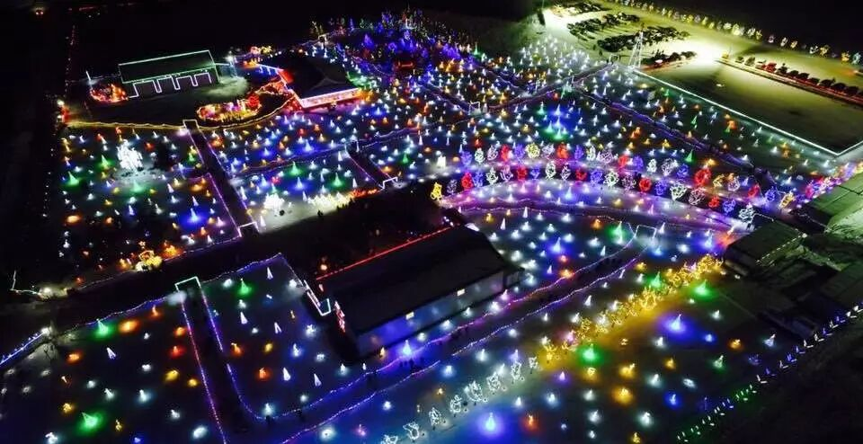
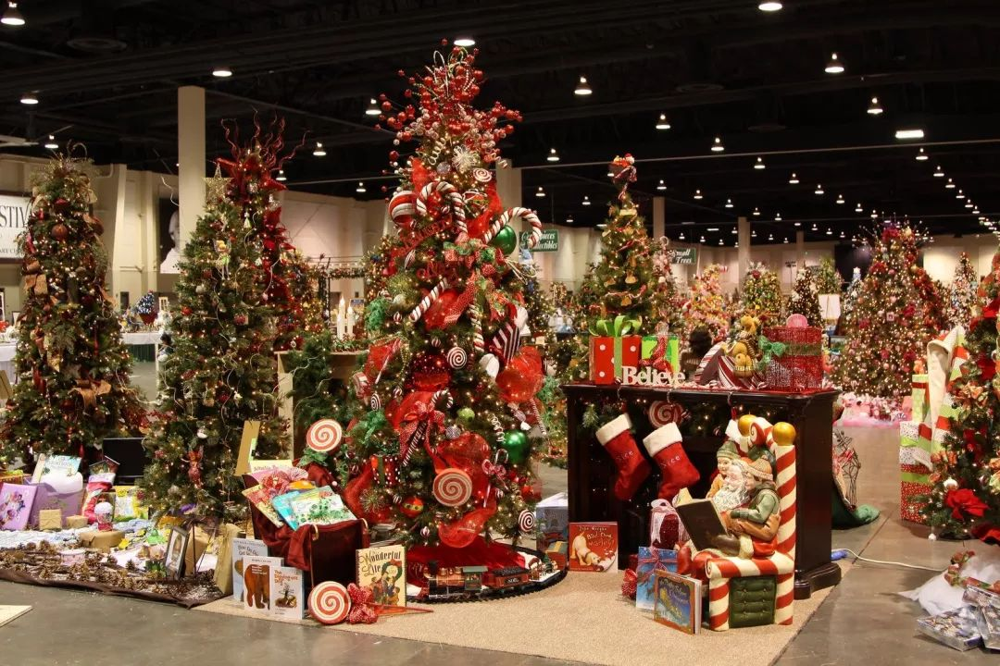
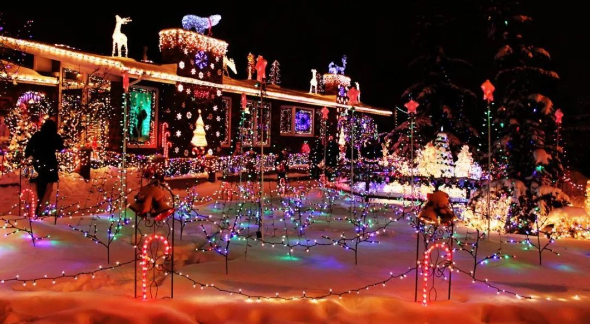
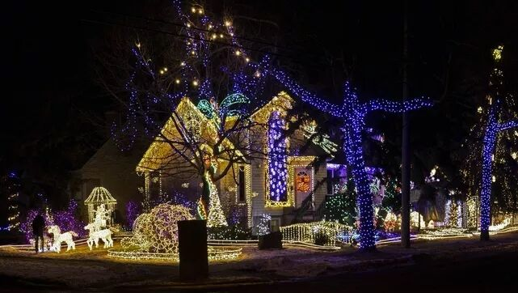
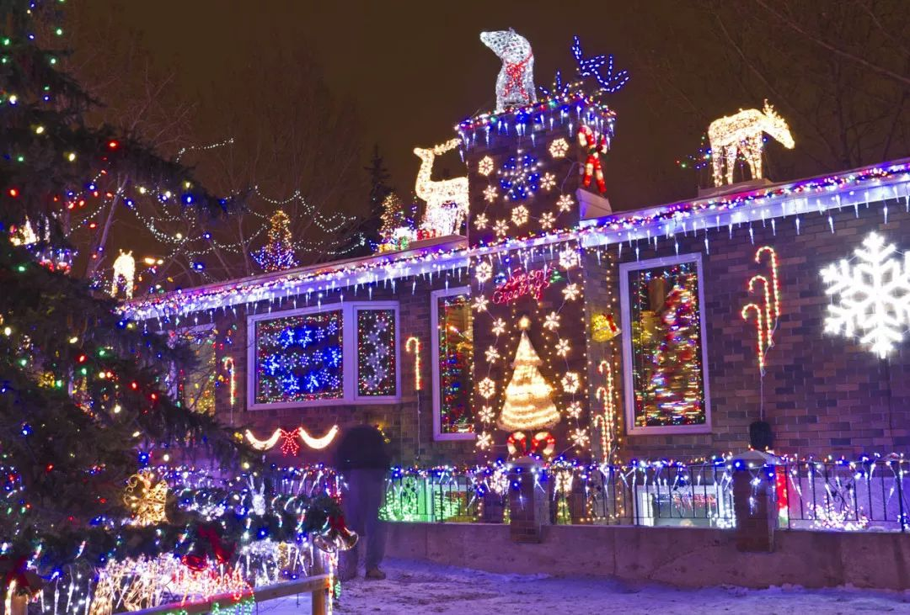
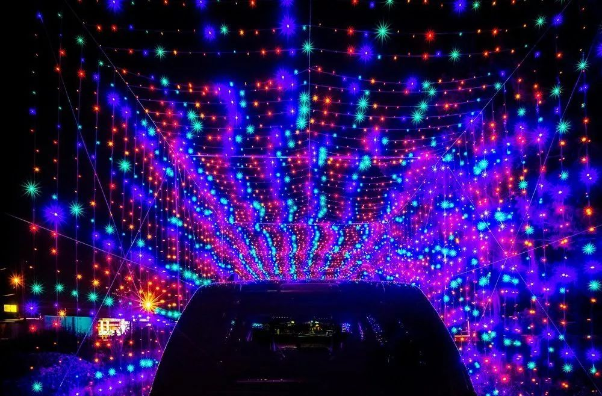

# 无标题

**链接地址:** http://mp.weixin.qq.com/s?__biz=MzI2NTE1ODgwOQ==&mid=2649605499&idx=1&sn=d94dd7d14517afd8facc0555caccaeae&chksm=f2b8cc8dc5cf459b0b08609c7d5b6a7d4745d02e97c0ba3d08183a44b2f0f3e4175429874390&mpshare=1&scene=2&srcid=#rd
**作者:** 雪糊
**获取时间:** 2025/8/28 21:04:16
**图片数量:** 36

---

## 原始HTML内容

<section style="box-sizing: border-box;"><section class="V5" style="box-sizing: border-box;" powered-by="xiumi.us"><section style="margin-right: 0%;margin-left: 0%;box-sizing: border-box;"><section style="display: inline-block;vertical-align: middle;width: 80%;box-sizing: border-box;"><section class="V5" style="box-sizing: border-box;" powered-by="xiumi.us"><section style="margin-top: 10px;margin-bottom: 10px;text-align: center;box-sizing: border-box;"><section style="display: inline-block;box-sizing: border-box;"><section style="max-width: 100%;font-size: 0px;padding-bottom: 3px;box-sizing: border-box;"><section style="display: inline-block;vertical-align: middle;box-sizing: border-box;"><section style="width: 5px;height: 1px;background-color: rgb(217, 217, 217);box-sizing: border-box;"></section><section style="width: 1px;height: 5px;margin-top: -3px;margin-right: auto;margin-left: auto;background-color: rgb(217, 217, 217);box-sizing: border-box;"></section></section><section style="margin-top: -1px;margin-right: -5px;margin-left: -5px;width: 100%;display: inline-block;vertical-align: middle;padding-right: 8px;padding-left: 8px;box-sizing: border-box;"><section style="width: 100%;height: 1px;background-color: rgb(217, 217, 217);box-sizing: border-box;"></section></section><section style="display: inline-block;vertical-align: middle;box-sizing: border-box;"><section style="width: 5px;height: 1px;background-color: rgb(217, 217, 217);box-sizing: border-box;"></section><section style="width: 1px;height: 5px;margin-top: -3px;margin-right: auto;margin-left: auto;background-color: rgb(217, 217, 217);box-sizing: border-box;"></section></section></section><section style="padding-left: 15px;padding-right: 15px;color: rgb(161, 161, 161);font-size: 14px;box-sizing: border-box;">
点击上方<strong style="box-sizing: border-box;">蓝字</strong>关注我们哟~
</section><section style="max-width: 100%;font-size: 0px;box-sizing: border-box;"><section style="display: inline-block;vertical-align: middle;box-sizing: border-box;"><section style="width: 5px;height: 1px;background-color: rgb(217, 217, 217);box-sizing: border-box;"></section><section style="width: 1px;height: 5px;margin-top: -3px;margin-right: auto;margin-left: auto;background-color: rgb(217, 217, 217);box-sizing: border-box;"></section></section><section style="margin-top: -1px;margin-right: -5px;margin-left: -5px;width: 100%;display: inline-block;vertical-align: middle;padding-right: 8px;padding-left: 8px;box-sizing: border-box;"><section style="width: 100%;height: 1px;background-color: rgb(217, 217, 217);box-sizing: border-box;"></section></section><section style="display: inline-block;vertical-align: middle;box-sizing: border-box;"><section style="width: 5px;height: 1px;background-color: rgb(217, 217, 217);box-sizing: border-box;"></section><section style="width: 1px;height: 5px;margin-top: -3px;margin-right: auto;margin-left: auto;background-color: rgb(217, 217, 217);box-sizing: border-box;"></section></section></section></section></section></section></section><section style="display: inline-block;vertical-align: middle;width: 20%;box-sizing: border-box;"><section class="V5" style="box-sizing: border-box;" powered-by="xiumi.us"><section style="text-align: center;margin: -10px 0% 10px;box-sizing: border-box;"><section style="max-width: 100%;vertical-align: middle;display: inline-block;width: 100%;box-sizing: border-box;"></section></section></section></section></section></section><section class="V5" style="box-sizing: border-box;" powered-by="xiumi.us"><section style="margin: 10px 0%;box-sizing: border-box;"><section style="display: inline-block;width: 100%;vertical-align: top;box-sizing: border-box;"><section class="V5" style="box-sizing: border-box;" powered-by="xiumi.us"><section style="box-sizing: border-box;"><section style="display: inline-block;vertical-align: bottom;width: 75%;padding-right: 10px;box-sizing: border-box;"><section class="V5" style="box-sizing: border-box;" powered-by="xiumi.us"><section style="margin: 10px 0% 3px;box-sizing: border-box;"><section style="display: inline-block;vertical-align: middle;box-sizing: border-box;"><section style="display: inline-block;vertical-align: bottom;padding-left: 5px;padding-right: 5px;line-height: 1.2em;margin-bottom: 2px;color: rgba(80, 182, 201, 0.72);box-sizing: border-box;">
<strong style="box-sizing: border-box;">仔细看下图，有惊喜！</strong>
</section><section style="max-width: 100%;display: inline-block;vertical-align: bottom;width: 1.6em;box-sizing: border-box;"></section></section></section></section></section><section style="display: inline-block;vertical-align: bottom;width: 25%;box-sizing: border-box;"><section class="V5" style="box-sizing: border-box;" powered-by="xiumi.us"><section style="margin-right: 0%;margin-bottom: 3px;margin-left: 0%;text-align: right;box-sizing: border-box;"><section style="display: inline-block;border-bottom: 0.15em solid rgba(80, 182, 201, 0.72);padding-bottom: 3px;box-sizing: border-box;"><section style="display: inline-block;padding: 3px;border-bottom: 0.15em solid rgba(80, 182, 201, 0.72);font-size: 12px;line-height: 1.4;color: rgb(255, 143, 47);box-sizing: border-box;">
<strong style="box-sizing: border-box;">金主大大</strong>
</section></section></section></section></section></section></section><section class="V5" style="box-sizing: border-box;" powered-by="xiumi.us"><section style="margin-right: 0%;margin-left: 0%;box-sizing: border-box;"><section style="background-color: rgba(80, 182, 201, 0.72);height: 2px;box-sizing: border-box;"></section></section></section></section></section></section><section class="V5" style="box-sizing: border-box;" powered-by="xiumi.us"><section style="text-align: center;margin-top: 10px;margin-bottom: 10px;box-sizing: border-box;"><section style="max-width: 100%;vertical-align: middle;display: inline-block;box-sizing: border-box;"></section></section></section><section class="V5" style="box-sizing: border-box;" powered-by="xiumi.us"><section style="text-align: center;margin-top: 10px;margin-bottom: 10px;box-sizing: border-box;"><section style="max-width: 100%;vertical-align: middle;display: inline-block;box-sizing: border-box;"></section></section></section><section class="V5" style="box-sizing: border-box;" powered-by="xiumi.us"><section style="text-align: center;margin-top: 10px;margin-bottom: 10px;box-sizing: border-box;"><section style="max-width: 100%;vertical-align: middle;display: inline-block;box-sizing: border-box;"></section></section><section style="box-sizing: border-box;"><section class="V5" style="box-sizing: border-box;" powered-by="xiumi.us"><section style="margin: 10px 0%;box-sizing: border-box;"><section style="display: inline-block;width: 100%;vertical-align: top;background-image: url(&quot;https://mmbiz.qpic.cn/mmbiz_jpg/D1nJqnhkPyKbkusvgNSdJAxNdTIfiaESQAqCddzYViaGx1k1U9LMbQfsciafBaiccK7aickURNm4GicJxs2w1DD20lLQ/640?wx_fmt=jpeg&quot;);background-position: 59.5403% 30.0504%;background-repeat: repeat;background-size: 45.7304%;background-attachment: scroll;border-style: dashed;border-width: 0px;border-radius: 0px;border-color: rgb(197, 36, 36);box-sizing: border-box;"><section class="V5" style="box-sizing: border-box;" powered-by="xiumi.us"><section style="margin-top: 10px;margin-right: 0%;margin-left: 0%;box-sizing: border-box;"><section style="display: inline-block;width: 100%;vertical-align: top;background-color: rgb(239, 241, 236);padding-right: 10px;padding-bottom: 10px;padding-left: 10px;border-width: 0px;box-sizing: border-box;"><section class="V5" style="box-sizing: border-box;" powered-by="xiumi.us"><section style="margin-right: 0%;margin-bottom: 20px;margin-left: 0%;box-sizing: border-box;"><section style="display: inline-block;vertical-align: top;width: 50%;box-sizing: border-box;"><section class="V5" style="box-sizing: border-box;" powered-by="xiumi.us"><section style="box-sizing: border-box;"><section style="display: inline-block;vertical-align: top;width: 50%;box-sizing: border-box;"><section class="V5" style="box-sizing: border-box;" powered-by="xiumi.us"><section style="margin-right: 0%;margin-left: 0%;text-align: center;font-size: 13px;box-sizing: border-box;"><section style="display: inline-block;vertical-align: top;box-sizing: border-box;"><section class="V5" style="box-sizing: border-box;" powered-by="xiumi.us"><section style="box-sizing: border-box;"><section style="width: 5px;height: 5px;margin: auto;border-radius: 100px;background-color: rgb(252, 78, 84);box-sizing: border-box;"></section><section style="width: 2px;height: 1.2em;margin: auto;background-color: rgb(252, 78, 84);box-sizing: border-box;"></section></section></section><section class="V5" style="box-sizing: border-box;" powered-by="xiumi.us"><section style="font-size: 12px;box-sizing: border-box;"><section style="width: 7px;height: 7px;margin: auto;border-width: 2px;border-style: solid;border-color: rgb(252, 78, 84);border-radius: 100%;box-sizing: border-box;"></section><section style="width: 1em;height: 0.5em;margin: -3px auto -2px;border-top-left-radius: 0.3em;border-top-right-radius: 0.3em;background-color: rgb(55, 182, 71);box-sizing: border-box;"></section><section style="width: 2em;height: 2em;margin: auto;border-radius: 100%;line-height: 2em;background-color: rgb(55, 182, 71);font-size: 16px;color: rgb(255, 255, 255);box-sizing: border-box;"><section style="box-sizing: border-box;">圣</section></section></section></section></section><section style="display: inline-block;vertical-align: top;box-sizing: border-box;"><section class="V5" style="box-sizing: border-box;" powered-by="xiumi.us"><section style="box-sizing: border-box;"><section style="width: 5px;height: 5px;margin: auto;border-radius: 100px;background-color: rgb(252, 78, 84);box-sizing: border-box;"></section><section style="width: 2px;height: 1.2em;margin: auto;background-color: rgb(252, 78, 84);box-sizing: border-box;"></section></section></section><section class="V5" style="box-sizing: border-box;" powered-by="xiumi.us"><section style="box-sizing: border-box;"><section style="width: 5px;height: 5px;margin: auto;border-radius: 100px;background-color: rgb(252, 78, 84);box-sizing: border-box;"></section><section style="width: 2px;height: 1.2em;margin: auto;background-color: rgb(252, 78, 84);box-sizing: border-box;"></section></section></section><section class="V5" style="box-sizing: border-box;" powered-by="xiumi.us"><section style="font-size: 12px;box-sizing: border-box;"><section style="width: 7px;height: 7px;margin: auto;border-width: 2px;border-style: solid;border-color: rgb(252, 78, 84);border-radius: 100%;box-sizing: border-box;"></section><section style="width: 1em;height: 0.5em;margin: -3px auto -2px;border-top-left-radius: 0.3em;border-top-right-radius: 0.3em;background-color: rgb(154, 203, 59);box-sizing: border-box;"></section><section style="width: 2em;height: 2em;margin: auto;border-radius: 100%;line-height: 2em;background-color: rgb(154, 203, 59);font-size: 16px;color: rgb(255, 255, 255);box-sizing: border-box;"><section style="box-sizing: border-box;">诞</section></section></section></section></section></section></section></section><section style="display: inline-block;vertical-align: top;width: 50%;box-sizing: border-box;"><section class="V5" style="box-sizing: border-box;" powered-by="xiumi.us"><section style="margin-right: 0%;margin-left: 0%;font-size: 13px;box-sizing: border-box;"><section style="display: inline-block;vertical-align: top;box-sizing: border-box;"><section class="V5" style="box-sizing: border-box;" powered-by="xiumi.us"><section style="box-sizing: border-box;"><section style="width: 5px;height: 5px;margin: auto;border-radius: 100px;background-color: rgb(252, 78, 84);box-sizing: border-box;"></section><section style="width: 2px;height: 1.2em;margin: auto;background-color: rgb(252, 78, 84);box-sizing: border-box;"></section></section></section><section class="V5" style="box-sizing: border-box;" powered-by="xiumi.us"><section style="box-sizing: border-box;"><section style="width: 5px;height: 5px;margin: auto;border-radius: 100px;background-color: rgb(252, 78, 84);box-sizing: border-box;"></section><section style="width: 2px;height: 1.2em;margin: auto;background-color: rgb(252, 78, 84);box-sizing: border-box;"></section></section></section><section class="V5" style="box-sizing: border-box;" powered-by="xiumi.us"><section style="font-size: 12px;box-sizing: border-box;"><section style="width: 7px;height: 7px;margin: auto;border-width: 2px;border-style: solid;border-color: rgb(252, 78, 84);border-radius: 100%;box-sizing: border-box;"></section><section style="width: 1em;height: 0.5em;margin: -3px auto -2px;border-top-left-radius: 0.3em;border-top-right-radius: 0.3em;background-color: rgb(154, 203, 59);box-sizing: border-box;"></section><section style="width: 2em;height: 2em;margin: auto;border-radius: 100%;line-height: 2em;background-color: rgb(154, 203, 59);font-size: 16px;text-align: center;color: rgb(255, 255, 255);box-sizing: border-box;"><section style="box-sizing: border-box;">快</section></section></section></section></section><section style="display: inline-block;vertical-align: top;box-sizing: border-box;"><section class="V5" style="box-sizing: border-box;" powered-by="xiumi.us"><section style="box-sizing: border-box;"><section style="width: 5px;height: 5px;margin: auto;border-radius: 100px;background-color: rgb(252, 78, 84);box-sizing: border-box;"></section><section style="width: 2px;height: 1.2em;margin: auto;background-color: rgb(252, 78, 84);box-sizing: border-box;"></section></section></section><section class="V5" style="box-sizing: border-box;" powered-by="xiumi.us"><section style="font-size: 12px;box-sizing: border-box;"><section style="width: 7px;height: 7px;margin: auto;border-width: 2px;border-style: solid;border-color: rgb(252, 78, 84);border-radius: 100%;box-sizing: border-box;"></section><section style="width: 1em;height: 0.5em;margin: -3px auto -2px;border-top-left-radius: 0.3em;border-top-right-radius: 0.3em;background-color: rgb(55, 182, 71);box-sizing: border-box;"></section><section style="width: 2em;height: 2em;margin: auto;border-radius: 100%;line-height: 2em;background-color: rgb(55, 182, 71);font-size: 16px;text-align: center;color: rgb(255, 255, 255);box-sizing: border-box;"><section style="box-sizing: border-box;">乐</section></section></section></section></section></section></section></section></section></section></section><section style="display: inline-block;vertical-align: top;width: 50%;box-sizing: border-box;"><section class="V5" style="box-sizing: border-box;" powered-by="xiumi.us"><section style="text-align: center;margin-right: 0%;margin-left: 0%;box-sizing: border-box;"><section style="max-width: 100%;vertical-align: middle;display: inline-block;box-sizing: border-box;"></section></section></section></section></section></section><section class="V5" style="box-sizing: border-box;" powered-by="xiumi.us"><section style="margin-top: 10px;margin-bottom: 10px;box-sizing: border-box;"><section style="width: 100%;box-sizing: border-box;"><section style="float: left;padding-right: 3px;line-height: 1;box-sizing: border-box;"><section class="V5" style="box-sizing: border-box;" powered-by="xiumi.us"><section style="box-sizing: border-box;"><section style="font-size: 45px;box-sizing: border-box;">
埃
</section></section></section></section><section style="clear: right;box-sizing: border-box;min-height: 4.5em !important;"><section class="V5" style="box-sizing: border-box;" powered-by="xiumi.us"><section style="margin-right: 0%;margin-bottom: -10px;margin-left: 0%;box-sizing: border-box;"><section style="font-size: 14px;color: rgb(102, 103, 103);letter-spacing: 2px;box-sizing: border-box;">
德蒙顿的冬天漫长且寒冷，很多人都说这里的冬天<strong style="box-sizing: border-box;">很无聊</strong>，除了待在家里玩游戏追剧似乎找不到其他好的活动方式。其实埃德蒙顿的<strong style="box-sizing: border-box;">冬天可以很好玩</strong>，只要你找对了正确的打开方式！比如，和我们一起去看这<strong style="box-sizing: border-box;">浪漫闪亮的圣诞灯展</strong>！
</section></section></section></section></section></section></section></section></section></section></section></section></section><section class="V5" style="box-sizing: border-box;" powered-by="xiumi.us"><section style="margin: 10px 0%;box-sizing: border-box;"><section style="display: inline-block;width: 100%;vertical-align: top;background-image: url(&quot;https://mmbiz.qpic.cn/mmbiz_jpg/D1nJqnhkPyKbkusvgNSdJAxNdTIfiaESQAqCddzYViaGx1k1U9LMbQfsciafBaiccK7aickURNm4GicJxs2w1DD20lLQ/640?wx_fmt=jpeg&quot;);background-position: 59.5403% 30.0504%;background-repeat: repeat;background-size: 45.7304%;background-attachment: scroll;border-style: dashed;border-width: 0px;border-radius: 0px;border-color: rgb(197, 36, 36);box-sizing: border-box;"><section class="V5" style="box-sizing: border-box;" powered-by="xiumi.us"><section style="margin: -10px 0% 10px;box-sizing: border-box;"><section style="display: inline-block;width: 100%;vertical-align: top;background-color: rgb(239, 241, 236);padding: 10px;box-sizing: border-box;"><section class="V5" style="box-sizing: border-box;" powered-by="xiumi.us"><section style="margin: 10px 0%;text-align: center;box-sizing: border-box;"><section style="margin-bottom: -2.25em;box-sizing: border-box;"><section style="padding: 5px;background-color: rgb(212, 51, 33);border-style: solid;border-width: 5px;border-radius: 0px;border-color: rgb(212, 51, 33);box-sizing: border-box;"><section class="V5" style="box-sizing: border-box;" powered-by="xiumi.us"><section style="margin-right: 0%;margin-left: 0%;box-sizing: border-box;"><section style="max-width: 100%;vertical-align: middle;display: inline-block;width: 100%;border-width: 0px;box-sizing: border-box;"></section></section></section></section></section><section style="width: 2.25em;height: 2.25em;margin-left: auto;border-bottom: 5px solid rgb(8, 132, 48);border-right: 5px solid rgb(8, 132, 48);transform: rotate(0deg);-webkit-transform: rotate(0deg);-moz-transform: rotate(0deg);-o-transform: rotate(0deg);box-sizing: border-box;"></section></section></section><section class="V5" style="box-sizing: border-box;" powered-by="xiumi.us"><section style="margin-top: 0.5em;margin-bottom: 0.5em;box-sizing: border-box;"><section style="border-top: 1px dashed rgb(159, 186, 96);box-sizing: border-box;"></section></section></section><section class="V5" style="box-sizing: border-box;" powered-by="xiumi.us"><section style="margin-top: 0.5em;margin-bottom: 0.5em;box-sizing: border-box;"><section style="float: right;width: 35%;padding-left: 10px;box-sizing: border-box;"><section class="V5" style="box-sizing: border-box;" powered-by="xiumi.us"><section style="box-sizing: border-box;"><section style="max-width: 100%;vertical-align: middle;display: inline-block;box-sizing: border-box;"></section></section></section></section><section style="box-sizing: border-box;"><section class="V5" style="box-sizing: border-box;" powered-by="xiumi.us"><section style="margin-top: 20px;margin-right: 0%;margin-left: 0%;box-sizing: border-box;"><section style="text-align: justify;font-size: 14px;color: rgb(102, 103, 103);letter-spacing: 2px;box-sizing: border-box;">
小编今天特意为大家精挑细选出<strong style="box-sizing: border-box;">十个</strong>最值得光临观赏的埃德蒙顿圣诞灯展，希望可以为大家制定一个<strong style="box-sizing: border-box;">周全又愉快的圣诞赏灯路线</strong>。在这里埃德蒙顿微生活全体员工预祝大家2018圣诞快乐！在新的一年能够健康幸福，享受在<strong style="box-sizing: border-box;">埃德蒙顿愉快生活的每一天</strong>！
</section></section></section></section></section></section></section></section></section></section></section></section><section class="V5" style="box-sizing: border-box;" powered-by="xiumi.us"><section style="margin: 20px 0%;box-sizing: border-box;"><section style="box-sizing: border-box;"><section style="float: left;box-sizing: border-box;"><section style="width: 0.6em;height: 0.6em;border-radius: 100%;background-color: rgb(249, 110, 87);box-sizing: border-box;"></section> </section><section style="float: right;box-sizing: border-box;"><section style="float: right;width: 0.6em;margin-left: -0.3em;height: 0.6em;border-radius: 100%;background-color: rgb(249, 110, 87);box-sizing: border-box;"></section> </section></section><section style="width: 100%;margin-top: -30px;padding: 10px 15px;display: inline-block;box-sizing: border-box;"><section class="V5" style="box-sizing: border-box;" powered-by="xiumi.us"><section style="text-align: center;box-sizing: border-box;"><section style="display: inline-block;vertical-align: middle;width: 15%;box-sizing: border-box;"><section class="V5" style="box-sizing: border-box;" powered-by="xiumi.us"><section style="text-align: right;margin: 10px 0%;transform: translate3d(12px, 0px, 0px);-webkit-transform: translate3d(12px, 0px, 0px);-moz-transform: translate3d(12px, 0px, 0px);-o-transform: translate3d(12px, 0px, 0px);box-sizing: border-box;"><section style="max-width: 100%;vertical-align: middle;display: inline-block;box-sizing: border-box;"><svg xmlns="http://www.w3.org/2000/svg" x="0px" y="0px" viewBox="0 0 80 83" style="vertical-align: middle;max-width: 100%;box-sizing: border-box;" width="80"><g style="box-sizing: border-box;"><g style="box-sizing: border-box;"><path style="fill-rule: evenodd;clip-rule: evenodd;box-sizing: border-box;" d="M65,82.7c-4.5,0-8.8-2-11.8-5.4c-2.1-2.3-3.3-5.1-3.8-7.9    c-2.8-0.6-5.4-2-7.4-4.3c-4.8-5.4-4.5-13.7,0.8-18.5c2.3-2.1,5.3-3.3,8.5-3.3c0.7,0,1.4,0.1,2.1,0.2c0.7-2.3,1.9-4.3,3.7-5.9    c2.4-2.2,5.5-3.4,8.8-3.4c3.9,0,7.6,1.7,10.2,4.6c4.4,5,4.7,12.3,0.8,17.5c-0.2,0.3-0.4,0.5-0.7,0.7c5.5,6.5,5.1,16.2-1.1,21.9    C72.3,81.3,68.7,82.7,65,82.7z" fill="rgb(255, 255, 255)"></path><path style="fill-rule: evenodd;clip-rule: evenodd;box-sizing: border-box;" d="M33.7,83c-1,0-2-0.4-2.8-1.1c-1.8-1.6-3.2-2.2-3.8-2.2    c-0.1,0-0.2,0-0.6,0.4c-0.8,1-2,1.6-3.2,1.6c-0.1,0-0.1,0-0.2,0c-1.3-0.1-2.5-0.8-3.3-1.9c-1.9-2.9-3.4-3.3-4.7-3.3    c-0.2,0-0.3,0-0.5,0c-0.1,0-0.2,0-0.3,0c-1.8,0-3.4-1.2-3.9-3c-0.5-1.9,0.4-3.9,2.1-4.7l0.5-0.3c0.7-0.3,2-1,2.3-1.4l0,0    c0,0,0-0.3-0.2-0.9c-0.5-1.5-0.1-3.1,1-4.2c0.8-0.8,1.8-1.2,2.9-1.2c0.5,0,0.9,0.1,1.4,0.2c1,0.4,1.6,0.4,2,0.4    c0.4,0,1.4,0,2.1-3.1c0.3-1.4,1.3-2.5,2.6-3c0.4-0.2,0.9-0.2,1.4-0.2c0.9,0,1.8,0.3,2.5,0.9c2.5,1.9,3.8,2.3,4.4,2.3    c0.2,0,0.7,0,1.5-0.9c0.3-0.3,0.6-0.6,1-0.8c-0.9-0.3-1.7-1-2.2-1.9c-1.4-2.5-3.7-3.7-6.9-3.7c-2.2,0-4.6,0.5-7.1,1.6    c-0.5,0.2-1,0.3-1.5,0.3c-0.8,0-1.6-0.2-2.3-0.7c-1.1-0.8-1.8-2-1.8-3.4c0-2.3-0.3-5.3-1.9-6.9c-1-1-2.6-1.5-4.8-1.5    c-0.3,0-0.6,0-0.9,0c-0.1,0-0.2,0-0.2,0c-1.4,0-2.8-0.8-3.5-2c-0.8-1.3-0.7-3,0.1-4.3c1.6-2.5,1.1-3.6-3-7.2l-0.7-0.6    c-1.5-1.3-1.8-3.5-0.7-5.2c0.8-1.2,2.1-1.9,3.5-1.9c0.5,0,1,0.1,1.5,0.3c1.2,0.5,2.3,0.7,3.4,0.7c2.3,0,4.6-1.1,7-3.4    c0.8-0.7,1.8-1.1,2.8-1.1c0.3,0,0.6,0,0.8,0.1c1.3,0.3,2.4,1.2,2.9,2.4c0.8,1.8,1.9,2.6,3.7,2.6c1.7,0,3.8-0.6,6.2-1.8    c0.6-0.3,1.2-0.4,1.8-0.4c1.5,0,2.9,0.8,3.6,2.2c0.2,0.4,0.4,0.7,0.6,1.1c1.1-1.3,1.7-2.6,1.7-3.4c0-0.2,0-0.7-0.9-1.5    c-1-0.9-1.5-2.2-1.3-3.5c0.2-1.3,0.9-2.5,2.1-3.1c3.7-2.1,4.2-4.2,4.1-6.2c-0.1-2,1.2-3.7,3.2-4.2C47.5,0,47.8,0,48.2,0    c1.6,0,3.1,0.9,3.7,2.5l0.3,0.7c1.2,2.8,1.7,3.6,2.5,3.6c0.2,0,0.5,0,0.9-0.1c0.3-0.1,0.7-0.1,1-0.1c1.2,0,2.3,0.5,3.1,1.4    c1,1.1,1.3,2.8,0.7,4.2c-0.5,1.2-0.9,2.8-0.4,3.9c0.6,1.3,2.5,2.1,4,2.6c1.3,0.4,2.3,1.5,2.6,2.8c0.4,1.3,0.1,2.7-0.8,3.7    c-4.4,5.1-2.1,7.7-1.1,8.8c1,1.1,1.3,2.6,0.9,3.9c-0.4,1.4-1.5,2.4-2.9,2.8c-3.6,0.9-5.2,2.6-5.5,3.8c-0.4,1.7-1.8,2.9-3.4,3.1    c-0.2,0-0.4,0-0.5,0c-0.6,0-1.1-0.1-1.7-0.4c-0.7,1.1-1.8,1.8-3.1,2c-3.4,0.3-4.6,3.5-4.9,4.9c-0.3,1.1-1,2.1-2,2.6    c1.2,0.4,2.1,1.4,2.5,2.5c0.8,2.4,1.8,3.7,3.1,4c1.6,0.3,2.9,1.6,3.2,3.3c0.1,0.3,0.1,0.6,0.1,0.9c0.4,1.1,0.4,2.3-0.2,3.3    c-0.4,0.8-1,1.4-1.8,1.9c-1.3,1.1-1.2,1.6-1.1,1.9c0.2,1.3-0.2,2.7-1.2,3.7c-0.8,0.7-1.8,1.1-2.8,1.1c-0.3,0-0.6,0-0.9-0.1    c-0.5-0.1-1-0.2-1.4-0.2c-1.1,0-2,0.4-4,2.7C36.1,82.5,35.1,83,34,83C33.9,83,33.8,83,33.7,83z" fill="rgb(255, 255, 255)"></path><path style="fill-rule: evenodd;clip-rule: evenodd;box-sizing: border-box;" d="M69.7,44c-0.3,0.5-0.1,1.3,0.6,1.8c0.7,0.4,1.5,0.3,1.8-0.2    c0.3-0.5,0.1-1.3-0.6-1.8C70.8,43.4,70,43.5,69.7,44L69.7,44z M59.7,40.5c3.8-3.4,9.7-3,13.2,0.9c3.1,3.6,3.3,8.8,0.6,12.3    c-3.3-2.7-7.5-3.6-11.3-2.8c-0.4-0.9-1-1.7-1.7-2.5c-1-1.2-2.3-2.1-3.7-2.7C57.3,43.8,58.2,42,59.7,40.5L59.7,40.5z M45.4,49.6    c-3.6,3.3-3.8,9-0.5,12.8c1.5,1.7,3.5,2.7,5.6,3c-0.1-3.8,1.3-7.7,4.2-10.3c1.4-1.2,2.9-2.1,4.5-2.7c-0.4-0.7-0.8-1.3-1.3-1.9    C54.6,46.7,49,46.3,45.4,49.6L45.4,49.6z M65.3,71.6c-0.3,0.5-0.1,1.3,0.6,1.8c0.6,0.5,1.4,0.4,1.8-0.2c0.3-0.5,0.1-1.3-0.6-1.8    C66.4,71,65.6,71.1,65.3,71.6L65.3,71.6z M56.8,58.2c4.6-4.2,11.8-3.7,16.1,1.2c4.3,4.8,4,12.2-0.6,16.4    c-4.6,4.2-11.8,3.7-16.1-1.2C51.9,69.8,52.2,62.4,56.8,58.2z" fill="rgb(237, 26, 59)"></path><path style="fill-rule: evenodd;clip-rule: evenodd;box-sizing: border-box;" d="M48.2,4.1c1.4,3.2,2.9,7.8,8.4,6.5c-2,5.1-1,9.5,6.1,11.9    c-3.7,4.3-5.3,9.4-1,14.2c-4.8,1.2-7.8,3.9-8.5,6.9c-2.3-4.2-4.6-16.1-4-26.5c-1.1,8,0.8,24.7,2.2,25.6c-2.3-1.2-2.2-3.8-4.3-4.4    c1.3,2.1,0.9,3.5,2.4,5.2c-0.5-2-20.1-11.2-30.2-13.2C32.2,33.7,43.9,40.5,48,45.1c-4.6,0.4-7.5,3.9-8.5,7.9    c-4-7.2-12.4-6.7-19.2-4c0.1-9.7-4.9-12.8-11.9-12.4c4-6.3-1.1-10.1-4.4-13.1c4.6,1.8,9.3,1.5,14.7-3.5c2.6,5.8,8.4,6.3,15.5,2.8    c2.5,4.9,5,8.2,10,9.3c-0.6-2.1-2.1-3.9-4-6c4.4-4.4,5.4-8.8,1.8-12.2C46.9,11.4,48.3,7.9,48.2,4.1L48.2,4.1z M14.5,72.6    c3.2-0.2,6.2,0.9,8.9,5.1c2.5-3.2,6.3-2.4,10.3,1.3c2.7-3.1,5-4.7,9.4-3.8c-0.5-2.7,1.1-4.8,3.3-6.4C45.9,70,33,71.3,26.3,70.5    c8.8,0.3,16.6-1.3,19.9-3.4c-2.6-0.5-4.7-2.5-6.1-6.7c-3.6,3.8-7.5,2-11.5-1c-1.4,6.2-5,7.2-9.4,5.6C20.8,69.8,17,71.3,14.5,72.6z" fill="rgb(92, 164, 70)"></path></g></g></svg></section></section></section></section><section style="display: inline-block;vertical-align: middle;width: 60%;padding: 5px;background-color: rgb(237, 26, 59);box-sizing: border-box;"><section class="V5" style="box-sizing: border-box;" powered-by="xiumi.us"><section style="box-sizing: border-box;"><section style="display: inline-block;width: 100%;vertical-align: top;border-color: rgb(255, 255, 255);border-width: 1px;border-radius: 0px;border-style: dashed;padding: 5px 10px;box-sizing: border-box;"><section class="V5" style="box-sizing: border-box;" powered-by="xiumi.us"><section style="box-sizing: border-box;"><section style="color: rgb(255, 255, 255);font-size: 14px;box-sizing: border-box;">
<strong style="box-sizing: border-box;">Country Christmas Lights</strong>
</section></section></section></section></section></section></section><section style="display: inline-block;vertical-align: middle;width: 15%;box-sizing: border-box;"><section class="V5" style="box-sizing: border-box;" powered-by="xiumi.us"><section style="text-align: left;margin-top: 10px;margin-bottom: 10px;transform: translate3d(-12px, 0px, 0px);-webkit-transform: translate3d(-12px, 0px, 0px);-moz-transform: translate3d(-12px, 0px, 0px);-o-transform: translate3d(-12px, 0px, 0px);box-sizing: border-box;"><section style="max-width: 100%;vertical-align: middle;display: inline-block;box-sizing: border-box;"><svg xmlns="http://www.w3.org/2000/svg" x="0px" y="0px" viewBox="0 0 80 83" style="vertical-align: middle;max-width: 100%;box-sizing: border-box;" width="80"><g style="box-sizing: border-box;"><g style="box-sizing: border-box;"><path style="fill-rule: evenodd;clip-rule: evenodd;box-sizing: border-box;" d="M15.2,82.7c4.4,0,8.7-2,11.7-5.4c2.1-2.3,3.3-5.1,3.8-7.9    c2.8-0.6,5.4-2,7.4-4.3c4.8-5.4,4.4-13.7-0.8-18.5c-2.3-2.1-5.3-3.3-8.4-3.3c-0.7,0-1.4,0.1-2.1,0.2c-0.7-2.3-1.9-4.3-3.7-5.9    c-2.4-2.2-5.5-3.4-8.7-3.4c-3.9,0-7.6,1.7-10.1,4.6c-4.4,5-4.7,12.3-0.8,17.5c0.2,0.3,0.4,0.5,0.7,0.7c-5.5,6.5-5.1,16.2,1.1,21.9    C7.9,81.3,11.5,82.7,15.2,82.7z" fill="rgb(255, 255, 255)"></path><path style="fill-rule: evenodd;clip-rule: evenodd;box-sizing: border-box;" d="M46.2,83c1,0,2-0.4,2.7-1.1c1.8-1.6,3.1-2.2,3.7-2.2    c0.1,0,0.2,0,0.6,0.4c0.8,1,2,1.6,3.2,1.6c0.1,0,0.1,0,0.2,0c1.3-0.1,2.5-0.8,3.2-1.9c1.8-2.9,3.4-3.3,4.7-3.3c0.2,0,0.3,0,0.5,0    c0.1,0,0.2,0,0.3,0c1.8,0,3.4-1.2,3.9-3c0.5-1.9-0.4-3.9-2.1-4.7l-0.5-0.3c-0.7-0.3-2-1-2.3-1.4l0,0c0,0,0-0.3,0.2-0.9    c0.5-1.5,0.1-3.1-1-4.2c-0.8-0.8-1.8-1.2-2.8-1.2c-0.5,0-0.9,0.1-1.4,0.2c-1,0.4-1.6,0.4-2,0.4c-0.4,0-1.4,0-2.1-3.1    c-0.3-1.4-1.3-2.5-2.6-3c-0.4-0.2-0.9-0.2-1.4-0.2c-0.9,0-1.8,0.3-2.5,0.9c-2.5,1.9-3.7,2.3-4.4,2.3c-0.2,0-0.7,0-1.5-0.9    c-0.3-0.3-0.6-0.6-1-0.8c0.9-0.3,1.7-1,2.2-1.9c1.4-2.5,3.6-3.7,6.9-3.7c2.1,0,4.6,0.5,7.1,1.6c0.5,0.2,1,0.3,1.5,0.3    c0.8,0,1.6-0.2,2.3-0.7c1.1-0.8,1.8-2,1.8-3.4c0-2.3,0.3-5.3,1.8-6.9c1-1,2.6-1.5,4.8-1.5c0.3,0,0.6,0,0.9,0c0.1,0,0.1,0,0.2,0    c1.4,0,2.8-0.8,3.5-2c0.8-1.3,0.7-3-0.1-4.3c-1.5-2.5-1.1-3.6,3-7.2l0.7-0.6c1.4-1.3,1.8-3.5,0.7-5.2c-0.8-1.2-2.1-1.9-3.5-1.9    c-0.5,0-1,0.1-1.5,0.3c-1.2,0.5-2.3,0.7-3.4,0.7c-2.3,0-4.5-1.1-7-3.4c-0.8-0.7-1.7-1.1-2.8-1.1c-0.3,0-0.6,0-0.8,0.1    c-1.3,0.3-2.4,1.2-2.9,2.4c-0.8,1.8-1.9,2.6-3.7,2.6c-1.7,0-3.8-0.6-6.1-1.8c-0.6-0.3-1.2-0.4-1.8-0.4c-1.5,0-2.9,0.8-3.6,2.2    c-0.2,0.4-0.4,0.7-0.6,1.1c-1.1-1.3-1.7-2.6-1.6-3.4c0-0.2,0-0.7,0.9-1.5c1-0.9,1.4-2.2,1.3-3.5c-0.2-1.3-0.9-2.5-2.1-3.1    c-3.7-2.1-4.1-4.2-4-6.2c0.1-2-1.2-3.7-3.1-4.2C32.5,0,32.2,0,31.9,0c-1.6,0-3.1,0.9-3.7,2.5l-0.3,0.7c-1.2,2.8-1.7,3.6-2.5,3.6    c-0.2,0-0.5,0-0.9-0.1c-0.3-0.1-0.7-0.1-1-0.1c-1.1,0-2.3,0.5-3,1.4c-1,1.1-1.3,2.8-0.7,4.2c0.5,1.2,0.9,2.8,0.4,3.9    c-0.6,1.3-2.5,2.1-4,2.6c-1.3,0.4-2.3,1.5-2.6,2.8c-0.4,1.3-0.1,2.7,0.8,3.7c4.3,5.1,2.1,7.7,1.1,8.8c-1,1.1-1.3,2.6-0.8,3.9    c0.4,1.4,1.5,2.4,2.9,2.8c3.5,0.9,5.1,2.6,5.4,3.8c0.4,1.7,1.7,2.9,3.4,3.1c0.2,0,0.4,0,0.5,0c0.6,0,1.1-0.1,1.6-0.4    c0.7,1.1,1.8,1.8,3.1,2c3.4,0.3,4.5,3.5,4.9,4.9c0.3,1.1,1,2.1,2,2.6c-1.2,0.4-2.1,1.4-2.5,2.5c-0.8,2.4-1.8,3.7-3,4    c-1.6,0.3-2.9,1.6-3.2,3.3c-0.1,0.3-0.1,0.6-0.1,0.9c-0.4,1.1-0.4,2.3,0.2,3.3c0.4,0.8,1,1.4,1.8,1.9c1.3,1.1,1.2,1.6,1.1,1.9    c-0.2,1.3,0.2,2.7,1.2,3.7c0.8,0.7,1.8,1.1,2.8,1.1c0.3,0,0.6,0,0.9-0.1c0.5-0.1,1-0.2,1.4-0.2c1.1,0,2,0.4,4,2.7    c0.7,0.8,1.7,1.3,2.8,1.4C46.1,83,46.1,83,46.2,83z" fill="rgb(255, 255, 255)"></path><path style="fill-rule: evenodd;clip-rule: evenodd;box-sizing: border-box;" d="M10.5,44c0.3,0.5,0.1,1.3-0.6,1.8c-0.7,0.4-1.5,0.3-1.8-0.2    c-0.3-0.5-0.1-1.3,0.6-1.8C9.4,43.4,10.2,43.5,10.5,44L10.5,44z M20.4,40.5c-3.7-3.4-9.6-3-13.1,0.9C4.2,45,4,50.2,6.7,53.8    c3.2-2.7,7.4-3.6,11.2-2.8c0.4-0.9,1-1.7,1.6-2.5c1-1.2,2.3-2.1,3.6-2.7C22.9,43.8,21.9,42,20.4,40.5L20.4,40.5z M34.6,49.6    c3.6,3.3,3.8,9,0.5,12.8c-1.5,1.7-3.5,2.7-5.5,3c0.1-3.8-1.3-7.7-4.2-10.3c-1.4-1.2-2.9-2.1-4.5-2.7c0.4-0.7,0.8-1.3,1.3-1.9    C25.5,46.7,31,46.3,34.6,49.6L34.6,49.6z M14.9,71.6c0.3,0.5,0.1,1.3-0.6,1.8c-0.6,0.5-1.4,0.4-1.8-0.2c-0.3-0.5-0.1-1.3,0.6-1.8    C13.7,71,14.6,71.1,14.9,71.6L14.9,71.6z M23.3,58.2c-4.6-4.2-11.7-3.7-16,1.2c-4.3,4.8-4,12.2,0.6,16.4c4.6,4.2,11.7,3.7,16-1.2    C28.1,69.8,27.9,62.4,23.3,58.2z" fill="rgb(237, 26, 59)"></path><path style="fill-rule: evenodd;clip-rule: evenodd;box-sizing: border-box;" d="M31.9,4.1c-1.4,3.2-2.9,7.8-8.4,6.5c2,5.1,1,9.5-6.1,11.9    c3.6,4.3,5.2,9.4,1,14.2c4.8,1.2,7.7,3.9,8.4,6.9c2.2-4.2,4.6-16.1,4-26.5c1.1,8-0.8,24.7-2.1,25.6c2.3-1.2,2.2-3.8,4.3-4.4    c-1.3,2.1-0.9,3.5-2.3,5.2c0.5-2,19.9-11.2,30-13.2C47.7,33.7,36.1,40.5,32,45.1c4.6,0.4,7.5,3.9,8.5,7.9c4-7.2,12.3-6.7,19.1-4    c-0.1-9.7,4.9-12.8,11.8-12.4c-3.9-6.3,1.1-10.1,4.3-13.1c-4.5,1.8-9.3,1.5-14.6-3.5c-2.5,5.8-8.3,6.3-15.4,2.8    c-2.5,4.9-4.9,8.2-9.9,9.3c0.6-2.1,2.1-3.9,4-6c-4.3-4.4-5.4-8.8-1.8-12.2C33.2,11.4,31.7,7.9,31.9,4.1L31.9,4.1z M65.3,72.6    c-3.2-0.2-6.2,0.9-8.8,5.1c-2.5-3.2-6.3-2.4-10.3,1.3c-2.7-3.1-5-4.7-9.3-3.8c0.5-2.7-1.1-4.8-3.3-6.4c0.6,1.2,13.4,2.5,20.1,1.8    c-8.7,0.3-16.5-1.3-19.8-3.4c2.6-0.5,4.7-2.5,6.1-6.7c3.6,3.8,7.5,2,11.4-1c1.4,6.2,5,7.2,9.4,5.6C59.1,69.8,62.8,71.3,65.3,72.6z" fill="rgb(92, 164, 70)"></path></g></g></svg></section></section></section></section></section></section><section class="V5" style="box-sizing: border-box;" powered-by="xiumi.us"><section style="margin-top: 10px;margin-bottom: 10px;box-sizing: border-box;"><section style="display: inline-block;width: 100%;border-width: 0px;border-style: none;border-color: rgb(192, 200, 209);padding: 10px;box-shadow: rgb(0, 0, 0) 0px 0px 0px;border-radius: 0px;box-sizing: border-box;"><section class="V5" style="box-sizing: border-box;" powered-by="xiumi.us"><section style="box-sizing: border-box;"><section style="text-align: center;color: rgba(126, 15, 15, 0.51);font-size: 14px;letter-spacing: 2px;box-sizing: border-box;">
<strong style="box-sizing: border-box;">埃德蒙顿地区最豪华灯展！</strong>
</section></section></section></section></section></section><section class="V5" style="box-sizing: border-box;" powered-by="xiumi.us"><section style="margin: 10px 0%;text-align: center;box-sizing: border-box;"><section style="margin-bottom: -2.25em;box-sizing: border-box;"><section style="padding: 5px;background-color: rgb(212, 51, 33);border-style: solid;border-width: 5px;border-radius: 0px;border-color: rgb(212, 51, 33);box-sizing: border-box;"><section class="V5" style="box-sizing: border-box;" powered-by="xiumi.us"><section style="margin-right: 0%;margin-left: 0%;box-sizing: border-box;"><section style="max-width: 100%;vertical-align: middle;display: inline-block;width: 100%;border-width: 0px;box-sizing: border-box;"></section></section></section></section></section><section style="width: 2.25em;height: 2.25em;margin-left: auto;border-bottom: 5px solid rgb(8, 132, 48);border-right: 5px solid rgb(8, 132, 48);transform: rotate(0deg);-webkit-transform: rotate(0deg);-moz-transform: rotate(0deg);-o-transform: rotate(0deg);box-sizing: border-box;"></section></section></section><section class="V5" style="box-sizing: border-box;" powered-by="xiumi.us"><section style="margin-top: 10px;margin-bottom: 10px;box-sizing: border-box;"><section style="display: inline-block;width: 100%;border-width: 0px;border-style: none;border-color: rgb(192, 200, 209);padding: 10px;box-shadow: rgb(0, 0, 0) 0px 0px 0px;border-radius: 0px;box-sizing: border-box;"><section class="V5" style="box-sizing: border-box;" powered-by="xiumi.us"><section style="box-sizing: border-box;"><section style="color: rgba(126, 15, 15, 0.51);font-size: 14px;letter-spacing: 2px;box-sizing: border-box;">
<strong style="box-sizing: border-box;">📍 Leduc （具体地址请查阅链接）</strong>

<strong style="box-sizing: border-box;">⏰ Nov 30 - Dec 30, 2018</strong>

<strong style="box-sizing: border-box;">🎫 Free</strong>

<strong style="box-sizing: border-box;">https://www.todocanada.ca/city/edmonton/event/country-christmas-lights-leduc/</strong>
</section></section></section></section></section></section><section class="V5" style="box-sizing: border-box;" powered-by="xiumi.us"><section style="margin: 10px 0%;text-align: center;box-sizing: border-box;"><section style="margin-bottom: -2.25em;box-sizing: border-box;"><section style="padding: 5px;background-color: rgb(212, 51, 33);border-style: solid;border-width: 5px;border-radius: 0px;border-color: rgb(212, 51, 33);box-sizing: border-box;"><section class="V5" style="box-sizing: border-box;" powered-by="xiumi.us"><section style="margin-right: 0%;margin-left: 0%;box-sizing: border-box;"><section style="max-width: 100%;vertical-align: middle;display: inline-block;width: 100%;border-width: 0px;box-sizing: border-box;"></section></section></section></section></section><section style="width: 2.25em;height: 2.25em;margin-left: auto;border-bottom: 5px solid rgb(8, 132, 48);border-right: 5px solid rgb(8, 132, 48);transform: rotate(0deg);-webkit-transform: rotate(0deg);-moz-transform: rotate(0deg);-o-transform: rotate(0deg);box-sizing: border-box;"></section></section></section><section class="V5" style="box-sizing: border-box;" powered-by="xiumi.us"><section style="box-sizing: border-box;"><section style="box-sizing: border-box;">
 
</section></section></section><section class="V5" style="box-sizing: border-box;" powered-by="xiumi.us"><section style="text-align: center;box-sizing: border-box;"><section style="display: inline-block;vertical-align: middle;width: 15%;box-sizing: border-box;"><section class="V5" style="box-sizing: border-box;" powered-by="xiumi.us"><section style="text-align: right;margin: 10px 0%;transform: translate3d(12px, 0px, 0px);-webkit-transform: translate3d(12px, 0px, 0px);-moz-transform: translate3d(12px, 0px, 0px);-o-transform: translate3d(12px, 0px, 0px);box-sizing: border-box;"><section style="max-width: 100%;vertical-align: middle;display: inline-block;box-sizing: border-box;"><svg xmlns="http://www.w3.org/2000/svg" x="0px" y="0px" viewBox="0 0 80 83" style="vertical-align: middle;max-width: 100%;box-sizing: border-box;" width="80"><g style="box-sizing: border-box;"><g style="box-sizing: border-box;"><path style="fill-rule: evenodd;clip-rule: evenodd;box-sizing: border-box;" d="M65,82.7c-4.5,0-8.8-2-11.8-5.4c-2.1-2.3-3.3-5.1-3.8-7.9    c-2.8-0.6-5.4-2-7.4-4.3c-4.8-5.4-4.5-13.7,0.8-18.5c2.3-2.1,5.3-3.3,8.5-3.3c0.7,0,1.4,0.1,2.1,0.2c0.7-2.3,1.9-4.3,3.7-5.9    c2.4-2.2,5.5-3.4,8.8-3.4c3.9,0,7.6,1.7,10.2,4.6c4.4,5,4.7,12.3,0.8,17.5c-0.2,0.3-0.4,0.5-0.7,0.7c5.5,6.5,5.1,16.2-1.1,21.9    C72.3,81.3,68.7,82.7,65,82.7z" fill="rgb(255, 255, 255)"></path><path style="fill-rule: evenodd;clip-rule: evenodd;box-sizing: border-box;" d="M33.7,83c-1,0-2-0.4-2.8-1.1c-1.8-1.6-3.2-2.2-3.8-2.2    c-0.1,0-0.2,0-0.6,0.4c-0.8,1-2,1.6-3.2,1.6c-0.1,0-0.1,0-0.2,0c-1.3-0.1-2.5-0.8-3.3-1.9c-1.9-2.9-3.4-3.3-4.7-3.3    c-0.2,0-0.3,0-0.5,0c-0.1,0-0.2,0-0.3,0c-1.8,0-3.4-1.2-3.9-3c-0.5-1.9,0.4-3.9,2.1-4.7l0.5-0.3c0.7-0.3,2-1,2.3-1.4l0,0    c0,0,0-0.3-0.2-0.9c-0.5-1.5-0.1-3.1,1-4.2c0.8-0.8,1.8-1.2,2.9-1.2c0.5,0,0.9,0.1,1.4,0.2c1,0.4,1.6,0.4,2,0.4    c0.4,0,1.4,0,2.1-3.1c0.3-1.4,1.3-2.5,2.6-3c0.4-0.2,0.9-0.2,1.4-0.2c0.9,0,1.8,0.3,2.5,0.9c2.5,1.9,3.8,2.3,4.4,2.3    c0.2,0,0.7,0,1.5-0.9c0.3-0.3,0.6-0.6,1-0.8c-0.9-0.3-1.7-1-2.2-1.9c-1.4-2.5-3.7-3.7-6.9-3.7c-2.2,0-4.6,0.5-7.1,1.6    c-0.5,0.2-1,0.3-1.5,0.3c-0.8,0-1.6-0.2-2.3-0.7c-1.1-0.8-1.8-2-1.8-3.4c0-2.3-0.3-5.3-1.9-6.9c-1-1-2.6-1.5-4.8-1.5    c-0.3,0-0.6,0-0.9,0c-0.1,0-0.2,0-0.2,0c-1.4,0-2.8-0.8-3.5-2c-0.8-1.3-0.7-3,0.1-4.3c1.6-2.5,1.1-3.6-3-7.2l-0.7-0.6    c-1.5-1.3-1.8-3.5-0.7-5.2c0.8-1.2,2.1-1.9,3.5-1.9c0.5,0,1,0.1,1.5,0.3c1.2,0.5,2.3,0.7,3.4,0.7c2.3,0,4.6-1.1,7-3.4    c0.8-0.7,1.8-1.1,2.8-1.1c0.3,0,0.6,0,0.8,0.1c1.3,0.3,2.4,1.2,2.9,2.4c0.8,1.8,1.9,2.6,3.7,2.6c1.7,0,3.8-0.6,6.2-1.8    c0.6-0.3,1.2-0.4,1.8-0.4c1.5,0,2.9,0.8,3.6,2.2c0.2,0.4,0.4,0.7,0.6,1.1c1.1-1.3,1.7-2.6,1.7-3.4c0-0.2,0-0.7-0.9-1.5    c-1-0.9-1.5-2.2-1.3-3.5c0.2-1.3,0.9-2.5,2.1-3.1c3.7-2.1,4.2-4.2,4.1-6.2c-0.1-2,1.2-3.7,3.2-4.2C47.5,0,47.8,0,48.2,0    c1.6,0,3.1,0.9,3.7,2.5l0.3,0.7c1.2,2.8,1.7,3.6,2.5,3.6c0.2,0,0.5,0,0.9-0.1c0.3-0.1,0.7-0.1,1-0.1c1.2,0,2.3,0.5,3.1,1.4    c1,1.1,1.3,2.8,0.7,4.2c-0.5,1.2-0.9,2.8-0.4,3.9c0.6,1.3,2.5,2.1,4,2.6c1.3,0.4,2.3,1.5,2.6,2.8c0.4,1.3,0.1,2.7-0.8,3.7    c-4.4,5.1-2.1,7.7-1.1,8.8c1,1.1,1.3,2.6,0.9,3.9c-0.4,1.4-1.5,2.4-2.9,2.8c-3.6,0.9-5.2,2.6-5.5,3.8c-0.4,1.7-1.8,2.9-3.4,3.1    c-0.2,0-0.4,0-0.5,0c-0.6,0-1.1-0.1-1.7-0.4c-0.7,1.1-1.8,1.8-3.1,2c-3.4,0.3-4.6,3.5-4.9,4.9c-0.3,1.1-1,2.1-2,2.6    c1.2,0.4,2.1,1.4,2.5,2.5c0.8,2.4,1.8,3.7,3.1,4c1.6,0.3,2.9,1.6,3.2,3.3c0.1,0.3,0.1,0.6,0.1,0.9c0.4,1.1,0.4,2.3-0.2,3.3    c-0.4,0.8-1,1.4-1.8,1.9c-1.3,1.1-1.2,1.6-1.1,1.9c0.2,1.3-0.2,2.7-1.2,3.7c-0.8,0.7-1.8,1.1-2.8,1.1c-0.3,0-0.6,0-0.9-0.1    c-0.5-0.1-1-0.2-1.4-0.2c-1.1,0-2,0.4-4,2.7C36.1,82.5,35.1,83,34,83C33.9,83,33.8,83,33.7,83z" fill="rgb(255, 255, 255)"></path><path style="fill-rule: evenodd;clip-rule: evenodd;box-sizing: border-box;" d="M69.7,44c-0.3,0.5-0.1,1.3,0.6,1.8c0.7,0.4,1.5,0.3,1.8-0.2    c0.3-0.5,0.1-1.3-0.6-1.8C70.8,43.4,70,43.5,69.7,44L69.7,44z M59.7,40.5c3.8-3.4,9.7-3,13.2,0.9c3.1,3.6,3.3,8.8,0.6,12.3    c-3.3-2.7-7.5-3.6-11.3-2.8c-0.4-0.9-1-1.7-1.7-2.5c-1-1.2-2.3-2.1-3.7-2.7C57.3,43.8,58.2,42,59.7,40.5L59.7,40.5z M45.4,49.6    c-3.6,3.3-3.8,9-0.5,12.8c1.5,1.7,3.5,2.7,5.6,3c-0.1-3.8,1.3-7.7,4.2-10.3c1.4-1.2,2.9-2.1,4.5-2.7c-0.4-0.7-0.8-1.3-1.3-1.9    C54.6,46.7,49,46.3,45.4,49.6L45.4,49.6z M65.3,71.6c-0.3,0.5-0.1,1.3,0.6,1.8c0.6,0.5,1.4,0.4,1.8-0.2c0.3-0.5,0.1-1.3-0.6-1.8    C66.4,71,65.6,71.1,65.3,71.6L65.3,71.6z M56.8,58.2c4.6-4.2,11.8-3.7,16.1,1.2c4.3,4.8,4,12.2-0.6,16.4    c-4.6,4.2-11.8,3.7-16.1-1.2C51.9,69.8,52.2,62.4,56.8,58.2z" fill="rgb(237, 26, 59)"></path><path style="fill-rule: evenodd;clip-rule: evenodd;box-sizing: border-box;" d="M48.2,4.1c1.4,3.2,2.9,7.8,8.4,6.5c-2,5.1-1,9.5,6.1,11.9    c-3.7,4.3-5.3,9.4-1,14.2c-4.8,1.2-7.8,3.9-8.5,6.9c-2.3-4.2-4.6-16.1-4-26.5c-1.1,8,0.8,24.7,2.2,25.6c-2.3-1.2-2.2-3.8-4.3-4.4    c1.3,2.1,0.9,3.5,2.4,5.2c-0.5-2-20.1-11.2-30.2-13.2C32.2,33.7,43.9,40.5,48,45.1c-4.6,0.4-7.5,3.9-8.5,7.9    c-4-7.2-12.4-6.7-19.2-4c0.1-9.7-4.9-12.8-11.9-12.4c4-6.3-1.1-10.1-4.4-13.1c4.6,1.8,9.3,1.5,14.7-3.5c2.6,5.8,8.4,6.3,15.5,2.8    c2.5,4.9,5,8.2,10,9.3c-0.6-2.1-2.1-3.9-4-6c4.4-4.4,5.4-8.8,1.8-12.2C46.9,11.4,48.3,7.9,48.2,4.1L48.2,4.1z M14.5,72.6    c3.2-0.2,6.2,0.9,8.9,5.1c2.5-3.2,6.3-2.4,10.3,1.3c2.7-3.1,5-4.7,9.4-3.8c-0.5-2.7,1.1-4.8,3.3-6.4C45.9,70,33,71.3,26.3,70.5    c8.8,0.3,16.6-1.3,19.9-3.4c-2.6-0.5-4.7-2.5-6.1-6.7c-3.6,3.8-7.5,2-11.5-1c-1.4,6.2-5,7.2-9.4,5.6C20.8,69.8,17,71.3,14.5,72.6z" fill="rgb(92, 164, 70)"></path></g></g></svg></section></section></section></section><section style="display: inline-block;vertical-align: middle;width: 60%;padding: 5px;background-color: rgb(237, 26, 59);box-sizing: border-box;"><section class="V5" style="box-sizing: border-box;" powered-by="xiumi.us"><section style="box-sizing: border-box;"><section style="display: inline-block;width: 100%;vertical-align: top;border-color: rgb(255, 255, 255);border-width: 1px;border-radius: 0px;border-style: dashed;padding: 5px 10px;box-sizing: border-box;"><section class="V5" style="box-sizing: border-box;" powered-by="xiumi.us"><section style="box-sizing: border-box;"><section style="color: rgb(255, 255, 255);font-size: 14px;box-sizing: border-box;">
<strong style="box-sizing: border-box;">Canadian PC Train</strong>
</section></section></section></section></section></section></section><section style="display: inline-block;vertical-align: middle;width: 15%;box-sizing: border-box;"><section class="V5" style="box-sizing: border-box;" powered-by="xiumi.us"><section style="text-align: left;margin-top: 10px;margin-bottom: 10px;transform: translate3d(-12px, 0px, 0px);-webkit-transform: translate3d(-12px, 0px, 0px);-moz-transform: translate3d(-12px, 0px, 0px);-o-transform: translate3d(-12px, 0px, 0px);box-sizing: border-box;"><section style="max-width: 100%;vertical-align: middle;display: inline-block;box-sizing: border-box;"><svg xmlns="http://www.w3.org/2000/svg" x="0px" y="0px" viewBox="0 0 80 83" style="vertical-align: middle;max-width: 100%;box-sizing: border-box;" width="80"><g style="box-sizing: border-box;"><g style="box-sizing: border-box;"><path style="fill-rule: evenodd;clip-rule: evenodd;box-sizing: border-box;" d="M15.2,82.7c4.4,0,8.7-2,11.7-5.4c2.1-2.3,3.3-5.1,3.8-7.9    c2.8-0.6,5.4-2,7.4-4.3c4.8-5.4,4.4-13.7-0.8-18.5c-2.3-2.1-5.3-3.3-8.4-3.3c-0.7,0-1.4,0.1-2.1,0.2c-0.7-2.3-1.9-4.3-3.7-5.9    c-2.4-2.2-5.5-3.4-8.7-3.4c-3.9,0-7.6,1.7-10.1,4.6c-4.4,5-4.7,12.3-0.8,17.5c0.2,0.3,0.4,0.5,0.7,0.7c-5.5,6.5-5.1,16.2,1.1,21.9    C7.9,81.3,11.5,82.7,15.2,82.7z" fill="rgb(255, 255, 255)"></path><path style="fill-rule: evenodd;clip-rule: evenodd;box-sizing: border-box;" d="M46.2,83c1,0,2-0.4,2.7-1.1c1.8-1.6,3.1-2.2,3.7-2.2    c0.1,0,0.2,0,0.6,0.4c0.8,1,2,1.6,3.2,1.6c0.1,0,0.1,0,0.2,0c1.3-0.1,2.5-0.8,3.2-1.9c1.8-2.9,3.4-3.3,4.7-3.3c0.2,0,0.3,0,0.5,0    c0.1,0,0.2,0,0.3,0c1.8,0,3.4-1.2,3.9-3c0.5-1.9-0.4-3.9-2.1-4.7l-0.5-0.3c-0.7-0.3-2-1-2.3-1.4l0,0c0,0,0-0.3,0.2-0.9    c0.5-1.5,0.1-3.1-1-4.2c-0.8-0.8-1.8-1.2-2.8-1.2c-0.5,0-0.9,0.1-1.4,0.2c-1,0.4-1.6,0.4-2,0.4c-0.4,0-1.4,0-2.1-3.1    c-0.3-1.4-1.3-2.5-2.6-3c-0.4-0.2-0.9-0.2-1.4-0.2c-0.9,0-1.8,0.3-2.5,0.9c-2.5,1.9-3.7,2.3-4.4,2.3c-0.2,0-0.7,0-1.5-0.9    c-0.3-0.3-0.6-0.6-1-0.8c0.9-0.3,1.7-1,2.2-1.9c1.4-2.5,3.6-3.7,6.9-3.7c2.1,0,4.6,0.5,7.1,1.6c0.5,0.2,1,0.3,1.5,0.3    c0.8,0,1.6-0.2,2.3-0.7c1.1-0.8,1.8-2,1.8-3.4c0-2.3,0.3-5.3,1.8-6.9c1-1,2.6-1.5,4.8-1.5c0.3,0,0.6,0,0.9,0c0.1,0,0.1,0,0.2,0    c1.4,0,2.8-0.8,3.5-2c0.8-1.3,0.7-3-0.1-4.3c-1.5-2.5-1.1-3.6,3-7.2l0.7-0.6c1.4-1.3,1.8-3.5,0.7-5.2c-0.8-1.2-2.1-1.9-3.5-1.9    c-0.5,0-1,0.1-1.5,0.3c-1.2,0.5-2.3,0.7-3.4,0.7c-2.3,0-4.5-1.1-7-3.4c-0.8-0.7-1.7-1.1-2.8-1.1c-0.3,0-0.6,0-0.8,0.1    c-1.3,0.3-2.4,1.2-2.9,2.4c-0.8,1.8-1.9,2.6-3.7,2.6c-1.7,0-3.8-0.6-6.1-1.8c-0.6-0.3-1.2-0.4-1.8-0.4c-1.5,0-2.9,0.8-3.6,2.2    c-0.2,0.4-0.4,0.7-0.6,1.1c-1.1-1.3-1.7-2.6-1.6-3.4c0-0.2,0-0.7,0.9-1.5c1-0.9,1.4-2.2,1.3-3.5c-0.2-1.3-0.9-2.5-2.1-3.1    c-3.7-2.1-4.1-4.2-4-6.2c0.1-2-1.2-3.7-3.1-4.2C32.5,0,32.2,0,31.9,0c-1.6,0-3.1,0.9-3.7,2.5l-0.3,0.7c-1.2,2.8-1.7,3.6-2.5,3.6    c-0.2,0-0.5,0-0.9-0.1c-0.3-0.1-0.7-0.1-1-0.1c-1.1,0-2.3,0.5-3,1.4c-1,1.1-1.3,2.8-0.7,4.2c0.5,1.2,0.9,2.8,0.4,3.9    c-0.6,1.3-2.5,2.1-4,2.6c-1.3,0.4-2.3,1.5-2.6,2.8c-0.4,1.3-0.1,2.7,0.8,3.7c4.3,5.1,2.1,7.7,1.1,8.8c-1,1.1-1.3,2.6-0.8,3.9    c0.4,1.4,1.5,2.4,2.9,2.8c3.5,0.9,5.1,2.6,5.4,3.8c0.4,1.7,1.7,2.9,3.4,3.1c0.2,0,0.4,0,0.5,0c0.6,0,1.1-0.1,1.6-0.4    c0.7,1.1,1.8,1.8,3.1,2c3.4,0.3,4.5,3.5,4.9,4.9c0.3,1.1,1,2.1,2,2.6c-1.2,0.4-2.1,1.4-2.5,2.5c-0.8,2.4-1.8,3.7-3,4    c-1.6,0.3-2.9,1.6-3.2,3.3c-0.1,0.3-0.1,0.6-0.1,0.9c-0.4,1.1-0.4,2.3,0.2,3.3c0.4,0.8,1,1.4,1.8,1.9c1.3,1.1,1.2,1.6,1.1,1.9    c-0.2,1.3,0.2,2.7,1.2,3.7c0.8,0.7,1.8,1.1,2.8,1.1c0.3,0,0.6,0,0.9-0.1c0.5-0.1,1-0.2,1.4-0.2c1.1,0,2,0.4,4,2.7    c0.7,0.8,1.7,1.3,2.8,1.4C46.1,83,46.1,83,46.2,83z" fill="rgb(255, 255, 255)"></path><path style="fill-rule: evenodd;clip-rule: evenodd;box-sizing: border-box;" d="M10.5,44c0.3,0.5,0.1,1.3-0.6,1.8c-0.7,0.4-1.5,0.3-1.8-0.2    c-0.3-0.5-0.1-1.3,0.6-1.8C9.4,43.4,10.2,43.5,10.5,44L10.5,44z M20.4,40.5c-3.7-3.4-9.6-3-13.1,0.9C4.2,45,4,50.2,6.7,53.8    c3.2-2.7,7.4-3.6,11.2-2.8c0.4-0.9,1-1.7,1.6-2.5c1-1.2,2.3-2.1,3.6-2.7C22.9,43.8,21.9,42,20.4,40.5L20.4,40.5z M34.6,49.6    c3.6,3.3,3.8,9,0.5,12.8c-1.5,1.7-3.5,2.7-5.5,3c0.1-3.8-1.3-7.7-4.2-10.3c-1.4-1.2-2.9-2.1-4.5-2.7c0.4-0.7,0.8-1.3,1.3-1.9    C25.5,46.7,31,46.3,34.6,49.6L34.6,49.6z M14.9,71.6c0.3,0.5,0.1,1.3-0.6,1.8c-0.6,0.5-1.4,0.4-1.8-0.2c-0.3-0.5-0.1-1.3,0.6-1.8    C13.7,71,14.6,71.1,14.9,71.6L14.9,71.6z M23.3,58.2c-4.6-4.2-11.7-3.7-16,1.2c-4.3,4.8-4,12.2,0.6,16.4c4.6,4.2,11.7,3.7,16-1.2    C28.1,69.8,27.9,62.4,23.3,58.2z" fill="rgb(237, 26, 59)"></path><path style="fill-rule: evenodd;clip-rule: evenodd;box-sizing: border-box;" d="M31.9,4.1c-1.4,3.2-2.9,7.8-8.4,6.5c2,5.1,1,9.5-6.1,11.9    c3.6,4.3,5.2,9.4,1,14.2c4.8,1.2,7.7,3.9,8.4,6.9c2.2-4.2,4.6-16.1,4-26.5c1.1,8-0.8,24.7-2.1,25.6c2.3-1.2,2.2-3.8,4.3-4.4    c-1.3,2.1-0.9,3.5-2.3,5.2c0.5-2,19.9-11.2,30-13.2C47.7,33.7,36.1,40.5,32,45.1c4.6,0.4,7.5,3.9,8.5,7.9c4-7.2,12.3-6.7,19.1-4    c-0.1-9.7,4.9-12.8,11.8-12.4c-3.9-6.3,1.1-10.1,4.3-13.1c-4.5,1.8-9.3,1.5-14.6-3.5c-2.5,5.8-8.3,6.3-15.4,2.8    c-2.5,4.9-4.9,8.2-9.9,9.3c0.6-2.1,2.1-3.9,4-6c-4.3-4.4-5.4-8.8-1.8-12.2C33.2,11.4,31.7,7.9,31.9,4.1L31.9,4.1z M65.3,72.6    c-3.2-0.2-6.2,0.9-8.8,5.1c-2.5-3.2-6.3-2.4-10.3,1.3c-2.7-3.1-5-4.7-9.3-3.8c0.5-2.7-1.1-4.8-3.3-6.4c0.6,1.2,13.4,2.5,20.1,1.8    c-8.7,0.3-16.5-1.3-19.8-3.4c2.6-0.5,4.7-2.5,6.1-6.7c3.6,3.8,7.5,2,11.4-1c1.4,6.2,5,7.2,9.4,5.6C59.1,69.8,62.8,71.3,65.3,72.6z" fill="rgb(92, 164, 70)"></path></g></g></svg></section></section></section></section></section></section><section class="V5" style="box-sizing: border-box;" powered-by="xiumi.us"><section style="margin-top: 10px;margin-bottom: 10px;box-sizing: border-box;"><section style="display: inline-block;width: 100%;border-width: 0px;border-style: none;border-color: rgb(192, 200, 209);padding: 10px;box-shadow: rgb(0, 0, 0) 0px 0px 0px;border-radius: 0px;box-sizing: border-box;"><section class="V5" style="box-sizing: border-box;" powered-by="xiumi.us"><section style="box-sizing: border-box;"><section style="text-align: center;color: rgba(126, 15, 15, 0.51);font-size: 14px;letter-spacing: 2px;box-sizing: border-box;">
<strong style="box-sizing: border-box;">横跨加拿大的圣诞小火车！</strong>
</section></section></section></section></section></section><section class="V5" style="box-sizing: border-box;" powered-by="xiumi.us"><section style="margin: 10px 0%;text-align: center;box-sizing: border-box;"><section style="margin-bottom: -2.25em;box-sizing: border-box;"><section style="padding: 5px;background-color: rgb(212, 51, 33);border-style: solid;border-width: 5px;border-radius: 0px;border-color: rgb(212, 51, 33);box-sizing: border-box;"><section class="V5" style="box-sizing: border-box;" powered-by="xiumi.us"><section style="margin-right: 0%;margin-left: 0%;box-sizing: border-box;"><section style="max-width: 100%;vertical-align: middle;display: inline-block;width: 100%;border-width: 0px;box-sizing: border-box;"></section></section></section></section></section><section style="width: 2.25em;height: 2.25em;margin-left: auto;border-bottom: 5px solid rgb(8, 132, 48);border-right: 5px solid rgb(8, 132, 48);transform: rotate(0deg);-webkit-transform: rotate(0deg);-moz-transform: rotate(0deg);-o-transform: rotate(0deg);box-sizing: border-box;"></section></section></section><section class="V5" style="box-sizing: border-box;" powered-by="xiumi.us"><section style="margin-top: 10px;margin-bottom: 10px;box-sizing: border-box;"><section style="display: inline-block;width: 100%;border-width: 0px;border-style: none;border-color: rgb(192, 200, 209);padding: 10px;box-shadow: rgb(0, 0, 0) 0px 0px 0px;border-radius: 0px;box-sizing: border-box;"><section class="V5" style="box-sizing: border-box;" powered-by="xiumi.us"><section style="box-sizing: border-box;"><section style="color: rgba(126, 15, 15, 0.51);font-size: 14px;letter-spacing: 2px;box-sizing: border-box;">
<strong style="box-sizing: border-box;">📍Edmonton CP Station, 7935 Gateway Blvd</strong>

<strong style="box-sizing: border-box;">⏰ Dec 10, 2018 7:45 PM - 8:45 PM</strong>

<strong style="box-sizing: border-box;">🎫 Free</strong>

<strong style="box-sizing: border-box;">https://www.todocanada.ca/city/edmonton/event/canadian-pacific-holiday-train4/</strong>
</section></section></section></section></section></section><section class="V5" style="box-sizing: border-box;" powered-by="xiumi.us"><section style="margin: 10px 0%;text-align: center;box-sizing: border-box;"><section style="margin-bottom: -2.25em;box-sizing: border-box;"><section style="padding: 5px;background-color: rgb(212, 51, 33);border-style: solid;border-width: 5px;border-radius: 0px;border-color: rgb(212, 51, 33);box-sizing: border-box;"><section class="V5" style="box-sizing: border-box;" powered-by="xiumi.us"><section style="margin-right: 0%;margin-left: 0%;box-sizing: border-box;"><section style="max-width: 100%;vertical-align: middle;display: inline-block;width: 100%;border-width: 0px;box-sizing: border-box;"></section></section></section></section></section><section style="width: 2.25em;height: 2.25em;margin-left: auto;border-bottom: 5px solid rgb(8, 132, 48);border-right: 5px solid rgb(8, 132, 48);transform: rotate(0deg);-webkit-transform: rotate(0deg);-moz-transform: rotate(0deg);-o-transform: rotate(0deg);box-sizing: border-box;"></section></section></section><section class="V5" style="box-sizing: border-box;" powered-by="xiumi.us"><section style="box-sizing: border-box;"><section style="box-sizing: border-box;">
 
</section></section></section><section class="V5" style="box-sizing: border-box;" powered-by="xiumi.us"><section style="text-align: center;box-sizing: border-box;"><section style="display: inline-block;vertical-align: middle;width: 15%;box-sizing: border-box;"><section class="V5" style="box-sizing: border-box;" powered-by="xiumi.us"><section style="text-align: right;margin: 10px 0%;transform: translate3d(12px, 0px, 0px);-webkit-transform: translate3d(12px, 0px, 0px);-moz-transform: translate3d(12px, 0px, 0px);-o-transform: translate3d(12px, 0px, 0px);box-sizing: border-box;"><section style="max-width: 100%;vertical-align: middle;display: inline-block;box-sizing: border-box;"><svg xmlns="http://www.w3.org/2000/svg" x="0px" y="0px" viewBox="0 0 80 83" style="vertical-align: middle;max-width: 100%;box-sizing: border-box;" width="80"><g style="box-sizing: border-box;"><g style="box-sizing: border-box;"><path style="fill-rule: evenodd;clip-rule: evenodd;box-sizing: border-box;" d="M65,82.7c-4.5,0-8.8-2-11.8-5.4c-2.1-2.3-3.3-5.1-3.8-7.9    c-2.8-0.6-5.4-2-7.4-4.3c-4.8-5.4-4.5-13.7,0.8-18.5c2.3-2.1,5.3-3.3,8.5-3.3c0.7,0,1.4,0.1,2.1,0.2c0.7-2.3,1.9-4.3,3.7-5.9    c2.4-2.2,5.5-3.4,8.8-3.4c3.9,0,7.6,1.7,10.2,4.6c4.4,5,4.7,12.3,0.8,17.5c-0.2,0.3-0.4,0.5-0.7,0.7c5.5,6.5,5.1,16.2-1.1,21.9    C72.3,81.3,68.7,82.7,65,82.7z" fill="rgb(255, 255, 255)"></path><path style="fill-rule: evenodd;clip-rule: evenodd;box-sizing: border-box;" d="M33.7,83c-1,0-2-0.4-2.8-1.1c-1.8-1.6-3.2-2.2-3.8-2.2    c-0.1,0-0.2,0-0.6,0.4c-0.8,1-2,1.6-3.2,1.6c-0.1,0-0.1,0-0.2,0c-1.3-0.1-2.5-0.8-3.3-1.9c-1.9-2.9-3.4-3.3-4.7-3.3    c-0.2,0-0.3,0-0.5,0c-0.1,0-0.2,0-0.3,0c-1.8,0-3.4-1.2-3.9-3c-0.5-1.9,0.4-3.9,2.1-4.7l0.5-0.3c0.7-0.3,2-1,2.3-1.4l0,0    c0,0,0-0.3-0.2-0.9c-0.5-1.5-0.1-3.1,1-4.2c0.8-0.8,1.8-1.2,2.9-1.2c0.5,0,0.9,0.1,1.4,0.2c1,0.4,1.6,0.4,2,0.4    c0.4,0,1.4,0,2.1-3.1c0.3-1.4,1.3-2.5,2.6-3c0.4-0.2,0.9-0.2,1.4-0.2c0.9,0,1.8,0.3,2.5,0.9c2.5,1.9,3.8,2.3,4.4,2.3    c0.2,0,0.7,0,1.5-0.9c0.3-0.3,0.6-0.6,1-0.8c-0.9-0.3-1.7-1-2.2-1.9c-1.4-2.5-3.7-3.7-6.9-3.7c-2.2,0-4.6,0.5-7.1,1.6    c-0.5,0.2-1,0.3-1.5,0.3c-0.8,0-1.6-0.2-2.3-0.7c-1.1-0.8-1.8-2-1.8-3.4c0-2.3-0.3-5.3-1.9-6.9c-1-1-2.6-1.5-4.8-1.5    c-0.3,0-0.6,0-0.9,0c-0.1,0-0.2,0-0.2,0c-1.4,0-2.8-0.8-3.5-2c-0.8-1.3-0.7-3,0.1-4.3c1.6-2.5,1.1-3.6-3-7.2l-0.7-0.6    c-1.5-1.3-1.8-3.5-0.7-5.2c0.8-1.2,2.1-1.9,3.5-1.9c0.5,0,1,0.1,1.5,0.3c1.2,0.5,2.3,0.7,3.4,0.7c2.3,0,4.6-1.1,7-3.4    c0.8-0.7,1.8-1.1,2.8-1.1c0.3,0,0.6,0,0.8,0.1c1.3,0.3,2.4,1.2,2.9,2.4c0.8,1.8,1.9,2.6,3.7,2.6c1.7,0,3.8-0.6,6.2-1.8    c0.6-0.3,1.2-0.4,1.8-0.4c1.5,0,2.9,0.8,3.6,2.2c0.2,0.4,0.4,0.7,0.6,1.1c1.1-1.3,1.7-2.6,1.7-3.4c0-0.2,0-0.7-0.9-1.5    c-1-0.9-1.5-2.2-1.3-3.5c0.2-1.3,0.9-2.5,2.1-3.1c3.7-2.1,4.2-4.2,4.1-6.2c-0.1-2,1.2-3.7,3.2-4.2C47.5,0,47.8,0,48.2,0    c1.6,0,3.1,0.9,3.7,2.5l0.3,0.7c1.2,2.8,1.7,3.6,2.5,3.6c0.2,0,0.5,0,0.9-0.1c0.3-0.1,0.7-0.1,1-0.1c1.2,0,2.3,0.5,3.1,1.4    c1,1.1,1.3,2.8,0.7,4.2c-0.5,1.2-0.9,2.8-0.4,3.9c0.6,1.3,2.5,2.1,4,2.6c1.3,0.4,2.3,1.5,2.6,2.8c0.4,1.3,0.1,2.7-0.8,3.7    c-4.4,5.1-2.1,7.7-1.1,8.8c1,1.1,1.3,2.6,0.9,3.9c-0.4,1.4-1.5,2.4-2.9,2.8c-3.6,0.9-5.2,2.6-5.5,3.8c-0.4,1.7-1.8,2.9-3.4,3.1    c-0.2,0-0.4,0-0.5,0c-0.6,0-1.1-0.1-1.7-0.4c-0.7,1.1-1.8,1.8-3.1,2c-3.4,0.3-4.6,3.5-4.9,4.9c-0.3,1.1-1,2.1-2,2.6    c1.2,0.4,2.1,1.4,2.5,2.5c0.8,2.4,1.8,3.7,3.1,4c1.6,0.3,2.9,1.6,3.2,3.3c0.1,0.3,0.1,0.6,0.1,0.9c0.4,1.1,0.4,2.3-0.2,3.3    c-0.4,0.8-1,1.4-1.8,1.9c-1.3,1.1-1.2,1.6-1.1,1.9c0.2,1.3-0.2,2.7-1.2,3.7c-0.8,0.7-1.8,1.1-2.8,1.1c-0.3,0-0.6,0-0.9-0.1    c-0.5-0.1-1-0.2-1.4-0.2c-1.1,0-2,0.4-4,2.7C36.1,82.5,35.1,83,34,83C33.9,83,33.8,83,33.7,83z" fill="rgb(255, 255, 255)"></path><path style="fill-rule: evenodd;clip-rule: evenodd;box-sizing: border-box;" d="M69.7,44c-0.3,0.5-0.1,1.3,0.6,1.8c0.7,0.4,1.5,0.3,1.8-0.2    c0.3-0.5,0.1-1.3-0.6-1.8C70.8,43.4,70,43.5,69.7,44L69.7,44z M59.7,40.5c3.8-3.4,9.7-3,13.2,0.9c3.1,3.6,3.3,8.8,0.6,12.3    c-3.3-2.7-7.5-3.6-11.3-2.8c-0.4-0.9-1-1.7-1.7-2.5c-1-1.2-2.3-2.1-3.7-2.7C57.3,43.8,58.2,42,59.7,40.5L59.7,40.5z M45.4,49.6    c-3.6,3.3-3.8,9-0.5,12.8c1.5,1.7,3.5,2.7,5.6,3c-0.1-3.8,1.3-7.7,4.2-10.3c1.4-1.2,2.9-2.1,4.5-2.7c-0.4-0.7-0.8-1.3-1.3-1.9    C54.6,46.7,49,46.3,45.4,49.6L45.4,49.6z M65.3,71.6c-0.3,0.5-0.1,1.3,0.6,1.8c0.6,0.5,1.4,0.4,1.8-0.2c0.3-0.5,0.1-1.3-0.6-1.8    C66.4,71,65.6,71.1,65.3,71.6L65.3,71.6z M56.8,58.2c4.6-4.2,11.8-3.7,16.1,1.2c4.3,4.8,4,12.2-0.6,16.4    c-4.6,4.2-11.8,3.7-16.1-1.2C51.9,69.8,52.2,62.4,56.8,58.2z" fill="rgb(237, 26, 59)"></path><path style="fill-rule: evenodd;clip-rule: evenodd;box-sizing: border-box;" d="M48.2,4.1c1.4,3.2,2.9,7.8,8.4,6.5c-2,5.1-1,9.5,6.1,11.9    c-3.7,4.3-5.3,9.4-1,14.2c-4.8,1.2-7.8,3.9-8.5,6.9c-2.3-4.2-4.6-16.1-4-26.5c-1.1,8,0.8,24.7,2.2,25.6c-2.3-1.2-2.2-3.8-4.3-4.4    c1.3,2.1,0.9,3.5,2.4,5.2c-0.5-2-20.1-11.2-30.2-13.2C32.2,33.7,43.9,40.5,48,45.1c-4.6,0.4-7.5,3.9-8.5,7.9    c-4-7.2-12.4-6.7-19.2-4c0.1-9.7-4.9-12.8-11.9-12.4c4-6.3-1.1-10.1-4.4-13.1c4.6,1.8,9.3,1.5,14.7-3.5c2.6,5.8,8.4,6.3,15.5,2.8    c2.5,4.9,5,8.2,10,9.3c-0.6-2.1-2.1-3.9-4-6c4.4-4.4,5.4-8.8,1.8-12.2C46.9,11.4,48.3,7.9,48.2,4.1L48.2,4.1z M14.5,72.6    c3.2-0.2,6.2,0.9,8.9,5.1c2.5-3.2,6.3-2.4,10.3,1.3c2.7-3.1,5-4.7,9.4-3.8c-0.5-2.7,1.1-4.8,3.3-6.4C45.9,70,33,71.3,26.3,70.5    c8.8,0.3,16.6-1.3,19.9-3.4c-2.6-0.5-4.7-2.5-6.1-6.7c-3.6,3.8-7.5,2-11.5-1c-1.4,6.2-5,7.2-9.4,5.6C20.8,69.8,17,71.3,14.5,72.6z" fill="rgb(92, 164, 70)"></path></g></g></svg></section></section></section></section><section style="display: inline-block;vertical-align: middle;width: 60%;padding: 5px;background-color: rgb(237, 26, 59);box-sizing: border-box;"><section class="V5" style="box-sizing: border-box;" powered-by="xiumi.us"><section style="box-sizing: border-box;"><section style="display: inline-block;width: 100%;vertical-align: top;border-color: rgb(255, 255, 255);border-width: 1px;border-radius: 0px;border-style: dashed;padding: 5px 10px;box-sizing: border-box;"><section class="V5" style="box-sizing: border-box;" powered-by="xiumi.us"><section style="box-sizing: border-box;"><section style="color: rgb(255, 255, 255);font-size: 14px;box-sizing: border-box;">
<strong style="box-sizing: border-box;">The Festival of Trees</strong>
</section></section></section></section></section></section></section><section style="display: inline-block;vertical-align: middle;width: 15%;box-sizing: border-box;"><section class="V5" style="box-sizing: border-box;" powered-by="xiumi.us"><section style="text-align: left;margin-top: 10px;margin-bottom: 10px;transform: translate3d(-12px, 0px, 0px);-webkit-transform: translate3d(-12px, 0px, 0px);-moz-transform: translate3d(-12px, 0px, 0px);-o-transform: translate3d(-12px, 0px, 0px);box-sizing: border-box;"><section style="max-width: 100%;vertical-align: middle;display: inline-block;box-sizing: border-box;"><svg xmlns="http://www.w3.org/2000/svg" x="0px" y="0px" viewBox="0 0 80 83" style="vertical-align: middle;max-width: 100%;box-sizing: border-box;" width="80"><g style="box-sizing: border-box;"><g style="box-sizing: border-box;"><path style="fill-rule: evenodd;clip-rule: evenodd;box-sizing: border-box;" d="M15.2,82.7c4.4,0,8.7-2,11.7-5.4c2.1-2.3,3.3-5.1,3.8-7.9    c2.8-0.6,5.4-2,7.4-4.3c4.8-5.4,4.4-13.7-0.8-18.5c-2.3-2.1-5.3-3.3-8.4-3.3c-0.7,0-1.4,0.1-2.1,0.2c-0.7-2.3-1.9-4.3-3.7-5.9    c-2.4-2.2-5.5-3.4-8.7-3.4c-3.9,0-7.6,1.7-10.1,4.6c-4.4,5-4.7,12.3-0.8,17.5c0.2,0.3,0.4,0.5,0.7,0.7c-5.5,6.5-5.1,16.2,1.1,21.9    C7.9,81.3,11.5,82.7,15.2,82.7z" fill="rgb(255, 255, 255)"></path><path style="fill-rule: evenodd;clip-rule: evenodd;box-sizing: border-box;" d="M46.2,83c1,0,2-0.4,2.7-1.1c1.8-1.6,3.1-2.2,3.7-2.2    c0.1,0,0.2,0,0.6,0.4c0.8,1,2,1.6,3.2,1.6c0.1,0,0.1,0,0.2,0c1.3-0.1,2.5-0.8,3.2-1.9c1.8-2.9,3.4-3.3,4.7-3.3c0.2,0,0.3,0,0.5,0    c0.1,0,0.2,0,0.3,0c1.8,0,3.4-1.2,3.9-3c0.5-1.9-0.4-3.9-2.1-4.7l-0.5-0.3c-0.7-0.3-2-1-2.3-1.4l0,0c0,0,0-0.3,0.2-0.9    c0.5-1.5,0.1-3.1-1-4.2c-0.8-0.8-1.8-1.2-2.8-1.2c-0.5,0-0.9,0.1-1.4,0.2c-1,0.4-1.6,0.4-2,0.4c-0.4,0-1.4,0-2.1-3.1    c-0.3-1.4-1.3-2.5-2.6-3c-0.4-0.2-0.9-0.2-1.4-0.2c-0.9,0-1.8,0.3-2.5,0.9c-2.5,1.9-3.7,2.3-4.4,2.3c-0.2,0-0.7,0-1.5-0.9    c-0.3-0.3-0.6-0.6-1-0.8c0.9-0.3,1.7-1,2.2-1.9c1.4-2.5,3.6-3.7,6.9-3.7c2.1,0,4.6,0.5,7.1,1.6c0.5,0.2,1,0.3,1.5,0.3    c0.8,0,1.6-0.2,2.3-0.7c1.1-0.8,1.8-2,1.8-3.4c0-2.3,0.3-5.3,1.8-6.9c1-1,2.6-1.5,4.8-1.5c0.3,0,0.6,0,0.9,0c0.1,0,0.1,0,0.2,0    c1.4,0,2.8-0.8,3.5-2c0.8-1.3,0.7-3-0.1-4.3c-1.5-2.5-1.1-3.6,3-7.2l0.7-0.6c1.4-1.3,1.8-3.5,0.7-5.2c-0.8-1.2-2.1-1.9-3.5-1.9    c-0.5,0-1,0.1-1.5,0.3c-1.2,0.5-2.3,0.7-3.4,0.7c-2.3,0-4.5-1.1-7-3.4c-0.8-0.7-1.7-1.1-2.8-1.1c-0.3,0-0.6,0-0.8,0.1    c-1.3,0.3-2.4,1.2-2.9,2.4c-0.8,1.8-1.9,2.6-3.7,2.6c-1.7,0-3.8-0.6-6.1-1.8c-0.6-0.3-1.2-0.4-1.8-0.4c-1.5,0-2.9,0.8-3.6,2.2    c-0.2,0.4-0.4,0.7-0.6,1.1c-1.1-1.3-1.7-2.6-1.6-3.4c0-0.2,0-0.7,0.9-1.5c1-0.9,1.4-2.2,1.3-3.5c-0.2-1.3-0.9-2.5-2.1-3.1    c-3.7-2.1-4.1-4.2-4-6.2c0.1-2-1.2-3.7-3.1-4.2C32.5,0,32.2,0,31.9,0c-1.6,0-3.1,0.9-3.7,2.5l-0.3,0.7c-1.2,2.8-1.7,3.6-2.5,3.6    c-0.2,0-0.5,0-0.9-0.1c-0.3-0.1-0.7-0.1-1-0.1c-1.1,0-2.3,0.5-3,1.4c-1,1.1-1.3,2.8-0.7,4.2c0.5,1.2,0.9,2.8,0.4,3.9    c-0.6,1.3-2.5,2.1-4,2.6c-1.3,0.4-2.3,1.5-2.6,2.8c-0.4,1.3-0.1,2.7,0.8,3.7c4.3,5.1,2.1,7.7,1.1,8.8c-1,1.1-1.3,2.6-0.8,3.9    c0.4,1.4,1.5,2.4,2.9,2.8c3.5,0.9,5.1,2.6,5.4,3.8c0.4,1.7,1.7,2.9,3.4,3.1c0.2,0,0.4,0,0.5,0c0.6,0,1.1-0.1,1.6-0.4    c0.7,1.1,1.8,1.8,3.1,2c3.4,0.3,4.5,3.5,4.9,4.9c0.3,1.1,1,2.1,2,2.6c-1.2,0.4-2.1,1.4-2.5,2.5c-0.8,2.4-1.8,3.7-3,4    c-1.6,0.3-2.9,1.6-3.2,3.3c-0.1,0.3-0.1,0.6-0.1,0.9c-0.4,1.1-0.4,2.3,0.2,3.3c0.4,0.8,1,1.4,1.8,1.9c1.3,1.1,1.2,1.6,1.1,1.9    c-0.2,1.3,0.2,2.7,1.2,3.7c0.8,0.7,1.8,1.1,2.8,1.1c0.3,0,0.6,0,0.9-0.1c0.5-0.1,1-0.2,1.4-0.2c1.1,0,2,0.4,4,2.7    c0.7,0.8,1.7,1.3,2.8,1.4C46.1,83,46.1,83,46.2,83z" fill="rgb(255, 255, 255)"></path><path style="fill-rule: evenodd;clip-rule: evenodd;box-sizing: border-box;" d="M10.5,44c0.3,0.5,0.1,1.3-0.6,1.8c-0.7,0.4-1.5,0.3-1.8-0.2    c-0.3-0.5-0.1-1.3,0.6-1.8C9.4,43.4,10.2,43.5,10.5,44L10.5,44z M20.4,40.5c-3.7-3.4-9.6-3-13.1,0.9C4.2,45,4,50.2,6.7,53.8    c3.2-2.7,7.4-3.6,11.2-2.8c0.4-0.9,1-1.7,1.6-2.5c1-1.2,2.3-2.1,3.6-2.7C22.9,43.8,21.9,42,20.4,40.5L20.4,40.5z M34.6,49.6    c3.6,3.3,3.8,9,0.5,12.8c-1.5,1.7-3.5,2.7-5.5,3c0.1-3.8-1.3-7.7-4.2-10.3c-1.4-1.2-2.9-2.1-4.5-2.7c0.4-0.7,0.8-1.3,1.3-1.9    C25.5,46.7,31,46.3,34.6,49.6L34.6,49.6z M14.9,71.6c0.3,0.5,0.1,1.3-0.6,1.8c-0.6,0.5-1.4,0.4-1.8-0.2c-0.3-0.5-0.1-1.3,0.6-1.8    C13.7,71,14.6,71.1,14.9,71.6L14.9,71.6z M23.3,58.2c-4.6-4.2-11.7-3.7-16,1.2c-4.3,4.8-4,12.2,0.6,16.4c4.6,4.2,11.7,3.7,16-1.2    C28.1,69.8,27.9,62.4,23.3,58.2z" fill="rgb(237, 26, 59)"></path><path style="fill-rule: evenodd;clip-rule: evenodd;box-sizing: border-box;" d="M31.9,4.1c-1.4,3.2-2.9,7.8-8.4,6.5c2,5.1,1,9.5-6.1,11.9    c3.6,4.3,5.2,9.4,1,14.2c4.8,1.2,7.7,3.9,8.4,6.9c2.2-4.2,4.6-16.1,4-26.5c1.1,8-0.8,24.7-2.1,25.6c2.3-1.2,2.2-3.8,4.3-4.4    c-1.3,2.1-0.9,3.5-2.3,5.2c0.5-2,19.9-11.2,30-13.2C47.7,33.7,36.1,40.5,32,45.1c4.6,0.4,7.5,3.9,8.5,7.9c4-7.2,12.3-6.7,19.1-4    c-0.1-9.7,4.9-12.8,11.8-12.4c-3.9-6.3,1.1-10.1,4.3-13.1c-4.5,1.8-9.3,1.5-14.6-3.5c-2.5,5.8-8.3,6.3-15.4,2.8    c-2.5,4.9-4.9,8.2-9.9,9.3c0.6-2.1,2.1-3.9,4-6c-4.3-4.4-5.4-8.8-1.8-12.2C33.2,11.4,31.7,7.9,31.9,4.1L31.9,4.1z M65.3,72.6    c-3.2-0.2-6.2,0.9-8.8,5.1c-2.5-3.2-6.3-2.4-10.3,1.3c-2.7-3.1-5-4.7-9.3-3.8c0.5-2.7-1.1-4.8-3.3-6.4c0.6,1.2,13.4,2.5,20.1,1.8    c-8.7,0.3-16.5-1.3-19.8-3.4c2.6-0.5,4.7-2.5,6.1-6.7c3.6,3.8,7.5,2,11.4-1c1.4,6.2,5,7.2,9.4,5.6C59.1,69.8,62.8,71.3,65.3,72.6z" fill="rgb(92, 164, 70)"></path></g></g></svg></section></section></section></section></section></section><section class="V5" style="box-sizing: border-box;" powered-by="xiumi.us"><section style="margin-top: 10px;margin-bottom: 10px;box-sizing: border-box;"><section style="display: inline-block;width: 100%;border-width: 0px;border-style: none;border-color: rgb(192, 200, 209);padding: 10px;box-shadow: rgb(0, 0, 0) 0px 0px 0px;border-radius: 0px;box-sizing: border-box;"><section class="V5" style="box-sizing: border-box;" powered-by="xiumi.us"><section style="box-sizing: border-box;"><section style="text-align: center;color: rgba(126, 15, 15, 0.51);font-size: 14px;letter-spacing: 2px;box-sizing: border-box;">
<strong style="box-sizing: border-box;">由阿尔伯塔大学筹办！</strong>
</section></section></section></section></section></section><section class="V5" style="box-sizing: border-box;" powered-by="xiumi.us"><section style="margin: 10px 0%;text-align: center;box-sizing: border-box;"><section style="margin-bottom: -2.25em;box-sizing: border-box;"><section style="padding: 5px;background-color: rgb(212, 51, 33);border-style: solid;border-width: 5px;border-radius: 0px;border-color: rgb(212, 51, 33);box-sizing: border-box;"><section class="V5" style="box-sizing: border-box;" powered-by="xiumi.us"><section style="margin-right: 0%;margin-left: 0%;box-sizing: border-box;"><section style="max-width: 100%;vertical-align: middle;display: inline-block;width: 100%;border-width: 0px;box-sizing: border-box;"></section></section></section></section></section><section style="width: 2.25em;height: 2.25em;margin-left: auto;border-bottom: 5px solid rgb(8, 132, 48);border-right: 5px solid rgb(8, 132, 48);transform: rotate(0deg);-webkit-transform: rotate(0deg);-moz-transform: rotate(0deg);-o-transform: rotate(0deg);box-sizing: border-box;"></section></section></section><section class="V5" style="box-sizing: border-box;" powered-by="xiumi.us"><section style="margin-top: 10px;margin-bottom: 10px;box-sizing: border-box;"><section style="display: inline-block;width: 100%;border-width: 0px;border-style: none;border-color: rgb(192, 200, 209);padding: 10px;box-shadow: rgb(0, 0, 0) 0px 0px 0px;border-radius: 0px;box-sizing: border-box;"><section class="V5" style="box-sizing: border-box;" powered-by="xiumi.us"><section style="box-sizing: border-box;"><section style="color: rgba(126, 15, 15, 0.51);font-size: 14px;letter-spacing: 2px;box-sizing: border-box;">
<strong style="box-sizing: border-box;">📍 Shaw Conference Centre, 9797 Jasper Ave. NW</strong>

<strong style="box-sizing: border-box;">⏰ Nov 28 - Dec 2, 2018</strong>

<strong style="box-sizing: border-box;">🎫 10$</strong>

<strong style="box-sizing: border-box;">https://www.todocanada.ca/city/edmonton/event/festival-trees-edmonton/</strong>
</section></section></section></section></section></section><section class="V5" style="box-sizing: border-box;" powered-by="xiumi.us"><section style="margin: 10px 0%;text-align: center;box-sizing: border-box;"><section style="margin-bottom: -2.25em;box-sizing: border-box;"><section style="padding: 5px;background-color: rgb(212, 51, 33);border-style: solid;border-width: 5px;border-radius: 0px;border-color: rgb(212, 51, 33);box-sizing: border-box;"><section class="V5" style="box-sizing: border-box;" powered-by="xiumi.us"><section style="margin-right: 0%;margin-left: 0%;box-sizing: border-box;"><section style="max-width: 100%;vertical-align: middle;display: inline-block;width: 100%;border-width: 0px;box-sizing: border-box;"></section></section></section></section></section><section style="width: 2.25em;height: 2.25em;margin-left: auto;border-bottom: 5px solid rgb(8, 132, 48);border-right: 5px solid rgb(8, 132, 48);transform: rotate(0deg);-webkit-transform: rotate(0deg);-moz-transform: rotate(0deg);-o-transform: rotate(0deg);box-sizing: border-box;"></section></section></section><section class="V5" style="box-sizing: border-box;" powered-by="xiumi.us"><section style="box-sizing: border-box;"><section style="box-sizing: border-box;">
 
</section></section></section><section class="V5" style="box-sizing: border-box;" powered-by="xiumi.us"><section style="text-align: center;box-sizing: border-box;"><section style="display: inline-block;vertical-align: middle;width: 15%;box-sizing: border-box;"><section class="V5" style="box-sizing: border-box;" powered-by="xiumi.us"><section style="text-align: right;margin: 10px 0%;transform: translate3d(12px, 0px, 0px);-webkit-transform: translate3d(12px, 0px, 0px);-moz-transform: translate3d(12px, 0px, 0px);-o-transform: translate3d(12px, 0px, 0px);box-sizing: border-box;"><section style="max-width: 100%;vertical-align: middle;display: inline-block;box-sizing: border-box;"><svg xmlns="http://www.w3.org/2000/svg" x="0px" y="0px" viewBox="0 0 80 83" style="vertical-align: middle;max-width: 100%;box-sizing: border-box;" width="80"><g style="box-sizing: border-box;"><g style="box-sizing: border-box;"><path style="fill-rule: evenodd;clip-rule: evenodd;box-sizing: border-box;" d="M65,82.7c-4.5,0-8.8-2-11.8-5.4c-2.1-2.3-3.3-5.1-3.8-7.9    c-2.8-0.6-5.4-2-7.4-4.3c-4.8-5.4-4.5-13.7,0.8-18.5c2.3-2.1,5.3-3.3,8.5-3.3c0.7,0,1.4,0.1,2.1,0.2c0.7-2.3,1.9-4.3,3.7-5.9    c2.4-2.2,5.5-3.4,8.8-3.4c3.9,0,7.6,1.7,10.2,4.6c4.4,5,4.7,12.3,0.8,17.5c-0.2,0.3-0.4,0.5-0.7,0.7c5.5,6.5,5.1,16.2-1.1,21.9    C72.3,81.3,68.7,82.7,65,82.7z" fill="rgb(255, 255, 255)"></path><path style="fill-rule: evenodd;clip-rule: evenodd;box-sizing: border-box;" d="M33.7,83c-1,0-2-0.4-2.8-1.1c-1.8-1.6-3.2-2.2-3.8-2.2    c-0.1,0-0.2,0-0.6,0.4c-0.8,1-2,1.6-3.2,1.6c-0.1,0-0.1,0-0.2,0c-1.3-0.1-2.5-0.8-3.3-1.9c-1.9-2.9-3.4-3.3-4.7-3.3    c-0.2,0-0.3,0-0.5,0c-0.1,0-0.2,0-0.3,0c-1.8,0-3.4-1.2-3.9-3c-0.5-1.9,0.4-3.9,2.1-4.7l0.5-0.3c0.7-0.3,2-1,2.3-1.4l0,0    c0,0,0-0.3-0.2-0.9c-0.5-1.5-0.1-3.1,1-4.2c0.8-0.8,1.8-1.2,2.9-1.2c0.5,0,0.9,0.1,1.4,0.2c1,0.4,1.6,0.4,2,0.4    c0.4,0,1.4,0,2.1-3.1c0.3-1.4,1.3-2.5,2.6-3c0.4-0.2,0.9-0.2,1.4-0.2c0.9,0,1.8,0.3,2.5,0.9c2.5,1.9,3.8,2.3,4.4,2.3    c0.2,0,0.7,0,1.5-0.9c0.3-0.3,0.6-0.6,1-0.8c-0.9-0.3-1.7-1-2.2-1.9c-1.4-2.5-3.7-3.7-6.9-3.7c-2.2,0-4.6,0.5-7.1,1.6    c-0.5,0.2-1,0.3-1.5,0.3c-0.8,0-1.6-0.2-2.3-0.7c-1.1-0.8-1.8-2-1.8-3.4c0-2.3-0.3-5.3-1.9-6.9c-1-1-2.6-1.5-4.8-1.5    c-0.3,0-0.6,0-0.9,0c-0.1,0-0.2,0-0.2,0c-1.4,0-2.8-0.8-3.5-2c-0.8-1.3-0.7-3,0.1-4.3c1.6-2.5,1.1-3.6-3-7.2l-0.7-0.6    c-1.5-1.3-1.8-3.5-0.7-5.2c0.8-1.2,2.1-1.9,3.5-1.9c0.5,0,1,0.1,1.5,0.3c1.2,0.5,2.3,0.7,3.4,0.7c2.3,0,4.6-1.1,7-3.4    c0.8-0.7,1.8-1.1,2.8-1.1c0.3,0,0.6,0,0.8,0.1c1.3,0.3,2.4,1.2,2.9,2.4c0.8,1.8,1.9,2.6,3.7,2.6c1.7,0,3.8-0.6,6.2-1.8    c0.6-0.3,1.2-0.4,1.8-0.4c1.5,0,2.9,0.8,3.6,2.2c0.2,0.4,0.4,0.7,0.6,1.1c1.1-1.3,1.7-2.6,1.7-3.4c0-0.2,0-0.7-0.9-1.5    c-1-0.9-1.5-2.2-1.3-3.5c0.2-1.3,0.9-2.5,2.1-3.1c3.7-2.1,4.2-4.2,4.1-6.2c-0.1-2,1.2-3.7,3.2-4.2C47.5,0,47.8,0,48.2,0    c1.6,0,3.1,0.9,3.7,2.5l0.3,0.7c1.2,2.8,1.7,3.6,2.5,3.6c0.2,0,0.5,0,0.9-0.1c0.3-0.1,0.7-0.1,1-0.1c1.2,0,2.3,0.5,3.1,1.4    c1,1.1,1.3,2.8,0.7,4.2c-0.5,1.2-0.9,2.8-0.4,3.9c0.6,1.3,2.5,2.1,4,2.6c1.3,0.4,2.3,1.5,2.6,2.8c0.4,1.3,0.1,2.7-0.8,3.7    c-4.4,5.1-2.1,7.7-1.1,8.8c1,1.1,1.3,2.6,0.9,3.9c-0.4,1.4-1.5,2.4-2.9,2.8c-3.6,0.9-5.2,2.6-5.5,3.8c-0.4,1.7-1.8,2.9-3.4,3.1    c-0.2,0-0.4,0-0.5,0c-0.6,0-1.1-0.1-1.7-0.4c-0.7,1.1-1.8,1.8-3.1,2c-3.4,0.3-4.6,3.5-4.9,4.9c-0.3,1.1-1,2.1-2,2.6    c1.2,0.4,2.1,1.4,2.5,2.5c0.8,2.4,1.8,3.7,3.1,4c1.6,0.3,2.9,1.6,3.2,3.3c0.1,0.3,0.1,0.6,0.1,0.9c0.4,1.1,0.4,2.3-0.2,3.3    c-0.4,0.8-1,1.4-1.8,1.9c-1.3,1.1-1.2,1.6-1.1,1.9c0.2,1.3-0.2,2.7-1.2,3.7c-0.8,0.7-1.8,1.1-2.8,1.1c-0.3,0-0.6,0-0.9-0.1    c-0.5-0.1-1-0.2-1.4-0.2c-1.1,0-2,0.4-4,2.7C36.1,82.5,35.1,83,34,83C33.9,83,33.8,83,33.7,83z" fill="rgb(255, 255, 255)"></path><path style="fill-rule: evenodd;clip-rule: evenodd;box-sizing: border-box;" d="M69.7,44c-0.3,0.5-0.1,1.3,0.6,1.8c0.7,0.4,1.5,0.3,1.8-0.2    c0.3-0.5,0.1-1.3-0.6-1.8C70.8,43.4,70,43.5,69.7,44L69.7,44z M59.7,40.5c3.8-3.4,9.7-3,13.2,0.9c3.1,3.6,3.3,8.8,0.6,12.3    c-3.3-2.7-7.5-3.6-11.3-2.8c-0.4-0.9-1-1.7-1.7-2.5c-1-1.2-2.3-2.1-3.7-2.7C57.3,43.8,58.2,42,59.7,40.5L59.7,40.5z M45.4,49.6    c-3.6,3.3-3.8,9-0.5,12.8c1.5,1.7,3.5,2.7,5.6,3c-0.1-3.8,1.3-7.7,4.2-10.3c1.4-1.2,2.9-2.1,4.5-2.7c-0.4-0.7-0.8-1.3-1.3-1.9    C54.6,46.7,49,46.3,45.4,49.6L45.4,49.6z M65.3,71.6c-0.3,0.5-0.1,1.3,0.6,1.8c0.6,0.5,1.4,0.4,1.8-0.2c0.3-0.5,0.1-1.3-0.6-1.8    C66.4,71,65.6,71.1,65.3,71.6L65.3,71.6z M56.8,58.2c4.6-4.2,11.8-3.7,16.1,1.2c4.3,4.8,4,12.2-0.6,16.4    c-4.6,4.2-11.8,3.7-16.1-1.2C51.9,69.8,52.2,62.4,56.8,58.2z" fill="rgb(237, 26, 59)"></path><path style="fill-rule: evenodd;clip-rule: evenodd;box-sizing: border-box;" d="M48.2,4.1c1.4,3.2,2.9,7.8,8.4,6.5c-2,5.1-1,9.5,6.1,11.9    c-3.7,4.3-5.3,9.4-1,14.2c-4.8,1.2-7.8,3.9-8.5,6.9c-2.3-4.2-4.6-16.1-4-26.5c-1.1,8,0.8,24.7,2.2,25.6c-2.3-1.2-2.2-3.8-4.3-4.4    c1.3,2.1,0.9,3.5,2.4,5.2c-0.5-2-20.1-11.2-30.2-13.2C32.2,33.7,43.9,40.5,48,45.1c-4.6,0.4-7.5,3.9-8.5,7.9    c-4-7.2-12.4-6.7-19.2-4c0.1-9.7-4.9-12.8-11.9-12.4c4-6.3-1.1-10.1-4.4-13.1c4.6,1.8,9.3,1.5,14.7-3.5c2.6,5.8,8.4,6.3,15.5,2.8    c2.5,4.9,5,8.2,10,9.3c-0.6-2.1-2.1-3.9-4-6c4.4-4.4,5.4-8.8,1.8-12.2C46.9,11.4,48.3,7.9,48.2,4.1L48.2,4.1z M14.5,72.6    c3.2-0.2,6.2,0.9,8.9,5.1c2.5-3.2,6.3-2.4,10.3,1.3c2.7-3.1,5-4.7,9.4-3.8c-0.5-2.7,1.1-4.8,3.3-6.4C45.9,70,33,71.3,26.3,70.5    c8.8,0.3,16.6-1.3,19.9-3.4c-2.6-0.5-4.7-2.5-6.1-6.7c-3.6,3.8-7.5,2-11.5-1c-1.4,6.2-5,7.2-9.4,5.6C20.8,69.8,17,71.3,14.5,72.6z" fill="rgb(92, 164, 70)"></path></g></g></svg></section></section></section></section><section style="display: inline-block;vertical-align: middle;width: 60%;padding: 5px;background-color: rgb(237, 26, 59);box-sizing: border-box;"><section class="V5" style="box-sizing: border-box;" powered-by="xiumi.us"><section style="box-sizing: border-box;"><section style="display: inline-block;width: 100%;vertical-align: top;border-color: rgb(255, 255, 255);border-width: 1px;border-radius: 0px;border-style: dashed;padding: 5px 10px;box-sizing: border-box;"><section class="V5" style="box-sizing: border-box;" powered-by="xiumi.us"><section style="box-sizing: border-box;"><section style="color: rgb(255, 255, 255);font-size: 14px;box-sizing: border-box;">
<strong style="box-sizing: border-box;">Celebrate the Season</strong>
</section></section></section></section></section></section></section><section style="display: inline-block;vertical-align: middle;width: 15%;box-sizing: border-box;"><section class="V5" style="box-sizing: border-box;" powered-by="xiumi.us"><section style="text-align: left;margin-top: 10px;margin-bottom: 10px;transform: translate3d(-12px, 0px, 0px);-webkit-transform: translate3d(-12px, 0px, 0px);-moz-transform: translate3d(-12px, 0px, 0px);-o-transform: translate3d(-12px, 0px, 0px);box-sizing: border-box;"><section style="max-width: 100%;vertical-align: middle;display: inline-block;box-sizing: border-box;"><svg xmlns="http://www.w3.org/2000/svg" x="0px" y="0px" viewBox="0 0 80 83" style="vertical-align: middle;max-width: 100%;box-sizing: border-box;" width="80"><g style="box-sizing: border-box;"><g style="box-sizing: border-box;"><path style="fill-rule: evenodd;clip-rule: evenodd;box-sizing: border-box;" d="M15.2,82.7c4.4,0,8.7-2,11.7-5.4c2.1-2.3,3.3-5.1,3.8-7.9    c2.8-0.6,5.4-2,7.4-4.3c4.8-5.4,4.4-13.7-0.8-18.5c-2.3-2.1-5.3-3.3-8.4-3.3c-0.7,0-1.4,0.1-2.1,0.2c-0.7-2.3-1.9-4.3-3.7-5.9    c-2.4-2.2-5.5-3.4-8.7-3.4c-3.9,0-7.6,1.7-10.1,4.6c-4.4,5-4.7,12.3-0.8,17.5c0.2,0.3,0.4,0.5,0.7,0.7c-5.5,6.5-5.1,16.2,1.1,21.9    C7.9,81.3,11.5,82.7,15.2,82.7z" fill="rgb(255, 255, 255)"></path><path style="fill-rule: evenodd;clip-rule: evenodd;box-sizing: border-box;" d="M46.2,83c1,0,2-0.4,2.7-1.1c1.8-1.6,3.1-2.2,3.7-2.2    c0.1,0,0.2,0,0.6,0.4c0.8,1,2,1.6,3.2,1.6c0.1,0,0.1,0,0.2,0c1.3-0.1,2.5-0.8,3.2-1.9c1.8-2.9,3.4-3.3,4.7-3.3c0.2,0,0.3,0,0.5,0    c0.1,0,0.2,0,0.3,0c1.8,0,3.4-1.2,3.9-3c0.5-1.9-0.4-3.9-2.1-4.7l-0.5-0.3c-0.7-0.3-2-1-2.3-1.4l0,0c0,0,0-0.3,0.2-0.9    c0.5-1.5,0.1-3.1-1-4.2c-0.8-0.8-1.8-1.2-2.8-1.2c-0.5,0-0.9,0.1-1.4,0.2c-1,0.4-1.6,0.4-2,0.4c-0.4,0-1.4,0-2.1-3.1    c-0.3-1.4-1.3-2.5-2.6-3c-0.4-0.2-0.9-0.2-1.4-0.2c-0.9,0-1.8,0.3-2.5,0.9c-2.5,1.9-3.7,2.3-4.4,2.3c-0.2,0-0.7,0-1.5-0.9    c-0.3-0.3-0.6-0.6-1-0.8c0.9-0.3,1.7-1,2.2-1.9c1.4-2.5,3.6-3.7,6.9-3.7c2.1,0,4.6,0.5,7.1,1.6c0.5,0.2,1,0.3,1.5,0.3    c0.8,0,1.6-0.2,2.3-0.7c1.1-0.8,1.8-2,1.8-3.4c0-2.3,0.3-5.3,1.8-6.9c1-1,2.6-1.5,4.8-1.5c0.3,0,0.6,0,0.9,0c0.1,0,0.1,0,0.2,0    c1.4,0,2.8-0.8,3.5-2c0.8-1.3,0.7-3-0.1-4.3c-1.5-2.5-1.1-3.6,3-7.2l0.7-0.6c1.4-1.3,1.8-3.5,0.7-5.2c-0.8-1.2-2.1-1.9-3.5-1.9    c-0.5,0-1,0.1-1.5,0.3c-1.2,0.5-2.3,0.7-3.4,0.7c-2.3,0-4.5-1.1-7-3.4c-0.8-0.7-1.7-1.1-2.8-1.1c-0.3,0-0.6,0-0.8,0.1    c-1.3,0.3-2.4,1.2-2.9,2.4c-0.8,1.8-1.9,2.6-3.7,2.6c-1.7,0-3.8-0.6-6.1-1.8c-0.6-0.3-1.2-0.4-1.8-0.4c-1.5,0-2.9,0.8-3.6,2.2    c-0.2,0.4-0.4,0.7-0.6,1.1c-1.1-1.3-1.7-2.6-1.6-3.4c0-0.2,0-0.7,0.9-1.5c1-0.9,1.4-2.2,1.3-3.5c-0.2-1.3-0.9-2.5-2.1-3.1    c-3.7-2.1-4.1-4.2-4-6.2c0.1-2-1.2-3.7-3.1-4.2C32.5,0,32.2,0,31.9,0c-1.6,0-3.1,0.9-3.7,2.5l-0.3,0.7c-1.2,2.8-1.7,3.6-2.5,3.6    c-0.2,0-0.5,0-0.9-0.1c-0.3-0.1-0.7-0.1-1-0.1c-1.1,0-2.3,0.5-3,1.4c-1,1.1-1.3,2.8-0.7,4.2c0.5,1.2,0.9,2.8,0.4,3.9    c-0.6,1.3-2.5,2.1-4,2.6c-1.3,0.4-2.3,1.5-2.6,2.8c-0.4,1.3-0.1,2.7,0.8,3.7c4.3,5.1,2.1,7.7,1.1,8.8c-1,1.1-1.3,2.6-0.8,3.9    c0.4,1.4,1.5,2.4,2.9,2.8c3.5,0.9,5.1,2.6,5.4,3.8c0.4,1.7,1.7,2.9,3.4,3.1c0.2,0,0.4,0,0.5,0c0.6,0,1.1-0.1,1.6-0.4    c0.7,1.1,1.8,1.8,3.1,2c3.4,0.3,4.5,3.5,4.9,4.9c0.3,1.1,1,2.1,2,2.6c-1.2,0.4-2.1,1.4-2.5,2.5c-0.8,2.4-1.8,3.7-3,4    c-1.6,0.3-2.9,1.6-3.2,3.3c-0.1,0.3-0.1,0.6-0.1,0.9c-0.4,1.1-0.4,2.3,0.2,3.3c0.4,0.8,1,1.4,1.8,1.9c1.3,1.1,1.2,1.6,1.1,1.9    c-0.2,1.3,0.2,2.7,1.2,3.7c0.8,0.7,1.8,1.1,2.8,1.1c0.3,0,0.6,0,0.9-0.1c0.5-0.1,1-0.2,1.4-0.2c1.1,0,2,0.4,4,2.7    c0.7,0.8,1.7,1.3,2.8,1.4C46.1,83,46.1,83,46.2,83z" fill="rgb(255, 255, 255)"></path><path style="fill-rule: evenodd;clip-rule: evenodd;box-sizing: border-box;" d="M10.5,44c0.3,0.5,0.1,1.3-0.6,1.8c-0.7,0.4-1.5,0.3-1.8-0.2    c-0.3-0.5-0.1-1.3,0.6-1.8C9.4,43.4,10.2,43.5,10.5,44L10.5,44z M20.4,40.5c-3.7-3.4-9.6-3-13.1,0.9C4.2,45,4,50.2,6.7,53.8    c3.2-2.7,7.4-3.6,11.2-2.8c0.4-0.9,1-1.7,1.6-2.5c1-1.2,2.3-2.1,3.6-2.7C22.9,43.8,21.9,42,20.4,40.5L20.4,40.5z M34.6,49.6    c3.6,3.3,3.8,9,0.5,12.8c-1.5,1.7-3.5,2.7-5.5,3c0.1-3.8-1.3-7.7-4.2-10.3c-1.4-1.2-2.9-2.1-4.5-2.7c0.4-0.7,0.8-1.3,1.3-1.9    C25.5,46.7,31,46.3,34.6,49.6L34.6,49.6z M14.9,71.6c0.3,0.5,0.1,1.3-0.6,1.8c-0.6,0.5-1.4,0.4-1.8-0.2c-0.3-0.5-0.1-1.3,0.6-1.8    C13.7,71,14.6,71.1,14.9,71.6L14.9,71.6z M23.3,58.2c-4.6-4.2-11.7-3.7-16,1.2c-4.3,4.8-4,12.2,0.6,16.4c4.6,4.2,11.7,3.7,16-1.2    C28.1,69.8,27.9,62.4,23.3,58.2z" fill="rgb(237, 26, 59)"></path><path style="fill-rule: evenodd;clip-rule: evenodd;box-sizing: border-box;" d="M31.9,4.1c-1.4,3.2-2.9,7.8-8.4,6.5c2,5.1,1,9.5-6.1,11.9    c3.6,4.3,5.2,9.4,1,14.2c4.8,1.2,7.7,3.9,8.4,6.9c2.2-4.2,4.6-16.1,4-26.5c1.1,8-0.8,24.7-2.1,25.6c2.3-1.2,2.2-3.8,4.3-4.4    c-1.3,2.1-0.9,3.5-2.3,5.2c0.5-2,19.9-11.2,30-13.2C47.7,33.7,36.1,40.5,32,45.1c4.6,0.4,7.5,3.9,8.5,7.9c4-7.2,12.3-6.7,19.1-4    c-0.1-9.7,4.9-12.8,11.8-12.4c-3.9-6.3,1.1-10.1,4.3-13.1c-4.5,1.8-9.3,1.5-14.6-3.5c-2.5,5.8-8.3,6.3-15.4,2.8    c-2.5,4.9-4.9,8.2-9.9,9.3c0.6-2.1,2.1-3.9,4-6c-4.3-4.4-5.4-8.8-1.8-12.2C33.2,11.4,31.7,7.9,31.9,4.1L31.9,4.1z M65.3,72.6    c-3.2-0.2-6.2,0.9-8.8,5.1c-2.5-3.2-6.3-2.4-10.3,1.3c-2.7-3.1-5-4.7-9.3-3.8c0.5-2.7-1.1-4.8-3.3-6.4c0.6,1.2,13.4,2.5,20.1,1.8    c-8.7,0.3-16.5-1.3-19.8-3.4c2.6-0.5,4.7-2.5,6.1-6.7c3.6,3.8,7.5,2,11.4-1c1.4,6.2,5,7.2,9.4,5.6C59.1,69.8,62.8,71.3,65.3,72.6z" fill="rgb(92, 164, 70)"></path></g></g></svg></section></section></section></section></section></section><section class="V5" style="box-sizing: border-box;" powered-by="xiumi.us"><section style="margin-top: 10px;margin-bottom: 10px;box-sizing: border-box;"><section style="display: inline-block;width: 100%;border-width: 0px;border-style: none;border-color: rgb(192, 200, 209);padding: 10px;box-shadow: rgb(0, 0, 0) 0px 0px 0px;border-radius: 0px;box-sizing: border-box;"><section class="V5" style="box-sizing: border-box;" powered-by="xiumi.us"><section style="box-sizing: border-box;"><section style="text-align: center;color: rgba(126, 15, 15, 0.51);font-size: 14px;letter-spacing: 2px;box-sizing: border-box;">
<strong style="box-sizing: border-box;">市中心最浪漫的灯火！</strong>
</section></section></section></section></section></section><section class="V5" style="box-sizing: border-box;" powered-by="xiumi.us"><section style="margin: 10px 0%;text-align: center;box-sizing: border-box;"><section style="margin-bottom: -2.25em;box-sizing: border-box;"><section style="padding: 5px;background-color: rgb(212, 51, 33);border-style: solid;border-width: 5px;border-radius: 0px;border-color: rgb(212, 51, 33);box-sizing: border-box;"><section class="V5" style="box-sizing: border-box;" powered-by="xiumi.us"><section style="margin-right: 0%;margin-left: 0%;box-sizing: border-box;"><section style="max-width: 100%;vertical-align: middle;display: inline-block;width: 100%;border-width: 0px;box-sizing: border-box;"></section></section></section></section></section><section style="width: 2.25em;height: 2.25em;margin-left: auto;border-bottom: 5px solid rgb(8, 132, 48);border-right: 5px solid rgb(8, 132, 48);transform: rotate(0deg);-webkit-transform: rotate(0deg);-moz-transform: rotate(0deg);-o-transform: rotate(0deg);box-sizing: border-box;"></section></section></section><section class="V5" style="box-sizing: border-box;" powered-by="xiumi.us"><section style="margin-top: 10px;margin-bottom: 10px;box-sizing: border-box;"><section style="display: inline-block;width: 100%;border-width: 0px;border-style: none;border-color: rgb(192, 200, 209);padding: 10px;box-shadow: rgb(0, 0, 0) 0px 0px 0px;border-radius: 0px;box-sizing: border-box;"><section class="V5" style="box-sizing: border-box;" powered-by="xiumi.us"><section style="box-sizing: border-box;"><section style="color: rgba(126, 15, 15, 0.51);font-size: 14px;letter-spacing: 2px;box-sizing: border-box;">
<strong style="box-sizing: border-box;">📍 Albert Legislature, 10800 97 Ave. NW</strong>

<strong style="box-sizing: border-box;">⏰ Dec 5 2018 - March 2019</strong>

<strong style="box-sizing: border-box;">🎫 Free</strong>

<strong style="box-sizing: border-box;">https://www.todocanada.ca/city/edmonton/event/celebrate-season-alberta-legislature/</strong>
</section></section></section></section></section></section><section class="V5" style="box-sizing: border-box;" powered-by="xiumi.us"><section style="margin: 10px 0%;text-align: center;box-sizing: border-box;"><section style="margin-bottom: -2.25em;box-sizing: border-box;"><section style="padding: 5px;background-color: rgb(212, 51, 33);border-style: solid;border-width: 5px;border-radius: 0px;border-color: rgb(212, 51, 33);box-sizing: border-box;"><section class="V5" style="box-sizing: border-box;" powered-by="xiumi.us"><section style="margin-right: 0%;margin-left: 0%;box-sizing: border-box;"><section style="max-width: 100%;vertical-align: middle;display: inline-block;width: 100%;border-width: 0px;box-sizing: border-box;"></section></section></section></section></section><section style="width: 2.25em;height: 2.25em;margin-left: auto;border-bottom: 5px solid rgb(8, 132, 48);border-right: 5px solid rgb(8, 132, 48);transform: rotate(0deg);-webkit-transform: rotate(0deg);-moz-transform: rotate(0deg);-o-transform: rotate(0deg);box-sizing: border-box;"></section></section></section><section class="V5" style="box-sizing: border-box;" powered-by="xiumi.us"><section style="box-sizing: border-box;"><section style="box-sizing: border-box;">
 
</section></section></section><section class="V5" style="box-sizing: border-box;" powered-by="xiumi.us"><section style="text-align: center;box-sizing: border-box;"><section style="display: inline-block;vertical-align: middle;width: 15%;box-sizing: border-box;"><section class="V5" style="box-sizing: border-box;" powered-by="xiumi.us"><section style="text-align: right;margin: 10px 0%;transform: translate3d(12px, 0px, 0px);-webkit-transform: translate3d(12px, 0px, 0px);-moz-transform: translate3d(12px, 0px, 0px);-o-transform: translate3d(12px, 0px, 0px);box-sizing: border-box;"><section style="max-width: 100%;vertical-align: middle;display: inline-block;box-sizing: border-box;"><svg xmlns="http://www.w3.org/2000/svg" x="0px" y="0px" viewBox="0 0 80 83" style="vertical-align: middle;max-width: 100%;box-sizing: border-box;" width="80"><g style="box-sizing: border-box;"><g style="box-sizing: border-box;"><path style="fill-rule: evenodd;clip-rule: evenodd;box-sizing: border-box;" d="M65,82.7c-4.5,0-8.8-2-11.8-5.4c-2.1-2.3-3.3-5.1-3.8-7.9    c-2.8-0.6-5.4-2-7.4-4.3c-4.8-5.4-4.5-13.7,0.8-18.5c2.3-2.1,5.3-3.3,8.5-3.3c0.7,0,1.4,0.1,2.1,0.2c0.7-2.3,1.9-4.3,3.7-5.9    c2.4-2.2,5.5-3.4,8.8-3.4c3.9,0,7.6,1.7,10.2,4.6c4.4,5,4.7,12.3,0.8,17.5c-0.2,0.3-0.4,0.5-0.7,0.7c5.5,6.5,5.1,16.2-1.1,21.9    C72.3,81.3,68.7,82.7,65,82.7z" fill="rgb(255, 255, 255)"></path><path style="fill-rule: evenodd;clip-rule: evenodd;box-sizing: border-box;" d="M33.7,83c-1,0-2-0.4-2.8-1.1c-1.8-1.6-3.2-2.2-3.8-2.2    c-0.1,0-0.2,0-0.6,0.4c-0.8,1-2,1.6-3.2,1.6c-0.1,0-0.1,0-0.2,0c-1.3-0.1-2.5-0.8-3.3-1.9c-1.9-2.9-3.4-3.3-4.7-3.3    c-0.2,0-0.3,0-0.5,0c-0.1,0-0.2,0-0.3,0c-1.8,0-3.4-1.2-3.9-3c-0.5-1.9,0.4-3.9,2.1-4.7l0.5-0.3c0.7-0.3,2-1,2.3-1.4l0,0    c0,0,0-0.3-0.2-0.9c-0.5-1.5-0.1-3.1,1-4.2c0.8-0.8,1.8-1.2,2.9-1.2c0.5,0,0.9,0.1,1.4,0.2c1,0.4,1.6,0.4,2,0.4    c0.4,0,1.4,0,2.1-3.1c0.3-1.4,1.3-2.5,2.6-3c0.4-0.2,0.9-0.2,1.4-0.2c0.9,0,1.8,0.3,2.5,0.9c2.5,1.9,3.8,2.3,4.4,2.3    c0.2,0,0.7,0,1.5-0.9c0.3-0.3,0.6-0.6,1-0.8c-0.9-0.3-1.7-1-2.2-1.9c-1.4-2.5-3.7-3.7-6.9-3.7c-2.2,0-4.6,0.5-7.1,1.6    c-0.5,0.2-1,0.3-1.5,0.3c-0.8,0-1.6-0.2-2.3-0.7c-1.1-0.8-1.8-2-1.8-3.4c0-2.3-0.3-5.3-1.9-6.9c-1-1-2.6-1.5-4.8-1.5    c-0.3,0-0.6,0-0.9,0c-0.1,0-0.2,0-0.2,0c-1.4,0-2.8-0.8-3.5-2c-0.8-1.3-0.7-3,0.1-4.3c1.6-2.5,1.1-3.6-3-7.2l-0.7-0.6    c-1.5-1.3-1.8-3.5-0.7-5.2c0.8-1.2,2.1-1.9,3.5-1.9c0.5,0,1,0.1,1.5,0.3c1.2,0.5,2.3,0.7,3.4,0.7c2.3,0,4.6-1.1,7-3.4    c0.8-0.7,1.8-1.1,2.8-1.1c0.3,0,0.6,0,0.8,0.1c1.3,0.3,2.4,1.2,2.9,2.4c0.8,1.8,1.9,2.6,3.7,2.6c1.7,0,3.8-0.6,6.2-1.8    c0.6-0.3,1.2-0.4,1.8-0.4c1.5,0,2.9,0.8,3.6,2.2c0.2,0.4,0.4,0.7,0.6,1.1c1.1-1.3,1.7-2.6,1.7-3.4c0-0.2,0-0.7-0.9-1.5    c-1-0.9-1.5-2.2-1.3-3.5c0.2-1.3,0.9-2.5,2.1-3.1c3.7-2.1,4.2-4.2,4.1-6.2c-0.1-2,1.2-3.7,3.2-4.2C47.5,0,47.8,0,48.2,0    c1.6,0,3.1,0.9,3.7,2.5l0.3,0.7c1.2,2.8,1.7,3.6,2.5,3.6c0.2,0,0.5,0,0.9-0.1c0.3-0.1,0.7-0.1,1-0.1c1.2,0,2.3,0.5,3.1,1.4    c1,1.1,1.3,2.8,0.7,4.2c-0.5,1.2-0.9,2.8-0.4,3.9c0.6,1.3,2.5,2.1,4,2.6c1.3,0.4,2.3,1.5,2.6,2.8c0.4,1.3,0.1,2.7-0.8,3.7    c-4.4,5.1-2.1,7.7-1.1,8.8c1,1.1,1.3,2.6,0.9,3.9c-0.4,1.4-1.5,2.4-2.9,2.8c-3.6,0.9-5.2,2.6-5.5,3.8c-0.4,1.7-1.8,2.9-3.4,3.1    c-0.2,0-0.4,0-0.5,0c-0.6,0-1.1-0.1-1.7-0.4c-0.7,1.1-1.8,1.8-3.1,2c-3.4,0.3-4.6,3.5-4.9,4.9c-0.3,1.1-1,2.1-2,2.6    c1.2,0.4,2.1,1.4,2.5,2.5c0.8,2.4,1.8,3.7,3.1,4c1.6,0.3,2.9,1.6,3.2,3.3c0.1,0.3,0.1,0.6,0.1,0.9c0.4,1.1,0.4,2.3-0.2,3.3    c-0.4,0.8-1,1.4-1.8,1.9c-1.3,1.1-1.2,1.6-1.1,1.9c0.2,1.3-0.2,2.7-1.2,3.7c-0.8,0.7-1.8,1.1-2.8,1.1c-0.3,0-0.6,0-0.9-0.1    c-0.5-0.1-1-0.2-1.4-0.2c-1.1,0-2,0.4-4,2.7C36.1,82.5,35.1,83,34,83C33.9,83,33.8,83,33.7,83z" fill="rgb(255, 255, 255)"></path><path style="fill-rule: evenodd;clip-rule: evenodd;box-sizing: border-box;" d="M69.7,44c-0.3,0.5-0.1,1.3,0.6,1.8c0.7,0.4,1.5,0.3,1.8-0.2    c0.3-0.5,0.1-1.3-0.6-1.8C70.8,43.4,70,43.5,69.7,44L69.7,44z M59.7,40.5c3.8-3.4,9.7-3,13.2,0.9c3.1,3.6,3.3,8.8,0.6,12.3    c-3.3-2.7-7.5-3.6-11.3-2.8c-0.4-0.9-1-1.7-1.7-2.5c-1-1.2-2.3-2.1-3.7-2.7C57.3,43.8,58.2,42,59.7,40.5L59.7,40.5z M45.4,49.6    c-3.6,3.3-3.8,9-0.5,12.8c1.5,1.7,3.5,2.7,5.6,3c-0.1-3.8,1.3-7.7,4.2-10.3c1.4-1.2,2.9-2.1,4.5-2.7c-0.4-0.7-0.8-1.3-1.3-1.9    C54.6,46.7,49,46.3,45.4,49.6L45.4,49.6z M65.3,71.6c-0.3,0.5-0.1,1.3,0.6,1.8c0.6,0.5,1.4,0.4,1.8-0.2c0.3-0.5,0.1-1.3-0.6-1.8    C66.4,71,65.6,71.1,65.3,71.6L65.3,71.6z M56.8,58.2c4.6-4.2,11.8-3.7,16.1,1.2c4.3,4.8,4,12.2-0.6,16.4    c-4.6,4.2-11.8,3.7-16.1-1.2C51.9,69.8,52.2,62.4,56.8,58.2z" fill="rgb(237, 26, 59)"></path><path style="fill-rule: evenodd;clip-rule: evenodd;box-sizing: border-box;" d="M48.2,4.1c1.4,3.2,2.9,7.8,8.4,6.5c-2,5.1-1,9.5,6.1,11.9    c-3.7,4.3-5.3,9.4-1,14.2c-4.8,1.2-7.8,3.9-8.5,6.9c-2.3-4.2-4.6-16.1-4-26.5c-1.1,8,0.8,24.7,2.2,25.6c-2.3-1.2-2.2-3.8-4.3-4.4    c1.3,2.1,0.9,3.5,2.4,5.2c-0.5-2-20.1-11.2-30.2-13.2C32.2,33.7,43.9,40.5,48,45.1c-4.6,0.4-7.5,3.9-8.5,7.9    c-4-7.2-12.4-6.7-19.2-4c0.1-9.7-4.9-12.8-11.9-12.4c4-6.3-1.1-10.1-4.4-13.1c4.6,1.8,9.3,1.5,14.7-3.5c2.6,5.8,8.4,6.3,15.5,2.8    c2.5,4.9,5,8.2,10,9.3c-0.6-2.1-2.1-3.9-4-6c4.4-4.4,5.4-8.8,1.8-12.2C46.9,11.4,48.3,7.9,48.2,4.1L48.2,4.1z M14.5,72.6    c3.2-0.2,6.2,0.9,8.9,5.1c2.5-3.2,6.3-2.4,10.3,1.3c2.7-3.1,5-4.7,9.4-3.8c-0.5-2.7,1.1-4.8,3.3-6.4C45.9,70,33,71.3,26.3,70.5    c8.8,0.3,16.6-1.3,19.9-3.4c-2.6-0.5-4.7-2.5-6.1-6.7c-3.6,3.8-7.5,2-11.5-1c-1.4,6.2-5,7.2-9.4,5.6C20.8,69.8,17,71.3,14.5,72.6z" fill="rgb(92, 164, 70)"></path></g></g></svg></section></section></section></section><section style="display: inline-block;vertical-align: middle;width: 60%;padding: 5px;background-color: rgb(237, 26, 59);box-sizing: border-box;"><section class="V5" style="box-sizing: border-box;" powered-by="xiumi.us"><section style="box-sizing: border-box;"><section style="display: inline-block;width: 100%;vertical-align: top;border-color: rgb(255, 255, 255);border-width: 1px;border-radius: 0px;border-style: dashed;padding: 5px 10px;box-sizing: border-box;"><section class="V5" style="box-sizing: border-box;" powered-by="xiumi.us"><section style="box-sizing: border-box;"><section style="color: rgb(255, 255, 255);font-size: 14px;box-sizing: border-box;">
<strong style="box-sizing: border-box;">Zoominescence</strong>
</section></section></section></section></section></section></section><section style="display: inline-block;vertical-align: middle;width: 15%;box-sizing: border-box;"><section class="V5" style="box-sizing: border-box;" powered-by="xiumi.us"><section style="text-align: left;margin-top: 10px;margin-bottom: 10px;transform: translate3d(-12px, 0px, 0px);-webkit-transform: translate3d(-12px, 0px, 0px);-moz-transform: translate3d(-12px, 0px, 0px);-o-transform: translate3d(-12px, 0px, 0px);box-sizing: border-box;"><section style="max-width: 100%;vertical-align: middle;display: inline-block;box-sizing: border-box;"><svg xmlns="http://www.w3.org/2000/svg" x="0px" y="0px" viewBox="0 0 80 83" style="vertical-align: middle;max-width: 100%;box-sizing: border-box;" width="80"><g style="box-sizing: border-box;"><g style="box-sizing: border-box;"><path style="fill-rule: evenodd;clip-rule: evenodd;box-sizing: border-box;" d="M15.2,82.7c4.4,0,8.7-2,11.7-5.4c2.1-2.3,3.3-5.1,3.8-7.9    c2.8-0.6,5.4-2,7.4-4.3c4.8-5.4,4.4-13.7-0.8-18.5c-2.3-2.1-5.3-3.3-8.4-3.3c-0.7,0-1.4,0.1-2.1,0.2c-0.7-2.3-1.9-4.3-3.7-5.9    c-2.4-2.2-5.5-3.4-8.7-3.4c-3.9,0-7.6,1.7-10.1,4.6c-4.4,5-4.7,12.3-0.8,17.5c0.2,0.3,0.4,0.5,0.7,0.7c-5.5,6.5-5.1,16.2,1.1,21.9    C7.9,81.3,11.5,82.7,15.2,82.7z" fill="rgb(255, 255, 255)"></path><path style="fill-rule: evenodd;clip-rule: evenodd;box-sizing: border-box;" d="M46.2,83c1,0,2-0.4,2.7-1.1c1.8-1.6,3.1-2.2,3.7-2.2    c0.1,0,0.2,0,0.6,0.4c0.8,1,2,1.6,3.2,1.6c0.1,0,0.1,0,0.2,0c1.3-0.1,2.5-0.8,3.2-1.9c1.8-2.9,3.4-3.3,4.7-3.3c0.2,0,0.3,0,0.5,0    c0.1,0,0.2,0,0.3,0c1.8,0,3.4-1.2,3.9-3c0.5-1.9-0.4-3.9-2.1-4.7l-0.5-0.3c-0.7-0.3-2-1-2.3-1.4l0,0c0,0,0-0.3,0.2-0.9    c0.5-1.5,0.1-3.1-1-4.2c-0.8-0.8-1.8-1.2-2.8-1.2c-0.5,0-0.9,0.1-1.4,0.2c-1,0.4-1.6,0.4-2,0.4c-0.4,0-1.4,0-2.1-3.1    c-0.3-1.4-1.3-2.5-2.6-3c-0.4-0.2-0.9-0.2-1.4-0.2c-0.9,0-1.8,0.3-2.5,0.9c-2.5,1.9-3.7,2.3-4.4,2.3c-0.2,0-0.7,0-1.5-0.9    c-0.3-0.3-0.6-0.6-1-0.8c0.9-0.3,1.7-1,2.2-1.9c1.4-2.5,3.6-3.7,6.9-3.7c2.1,0,4.6,0.5,7.1,1.6c0.5,0.2,1,0.3,1.5,0.3    c0.8,0,1.6-0.2,2.3-0.7c1.1-0.8,1.8-2,1.8-3.4c0-2.3,0.3-5.3,1.8-6.9c1-1,2.6-1.5,4.8-1.5c0.3,0,0.6,0,0.9,0c0.1,0,0.1,0,0.2,0    c1.4,0,2.8-0.8,3.5-2c0.8-1.3,0.7-3-0.1-4.3c-1.5-2.5-1.1-3.6,3-7.2l0.7-0.6c1.4-1.3,1.8-3.5,0.7-5.2c-0.8-1.2-2.1-1.9-3.5-1.9    c-0.5,0-1,0.1-1.5,0.3c-1.2,0.5-2.3,0.7-3.4,0.7c-2.3,0-4.5-1.1-7-3.4c-0.8-0.7-1.7-1.1-2.8-1.1c-0.3,0-0.6,0-0.8,0.1    c-1.3,0.3-2.4,1.2-2.9,2.4c-0.8,1.8-1.9,2.6-3.7,2.6c-1.7,0-3.8-0.6-6.1-1.8c-0.6-0.3-1.2-0.4-1.8-0.4c-1.5,0-2.9,0.8-3.6,2.2    c-0.2,0.4-0.4,0.7-0.6,1.1c-1.1-1.3-1.7-2.6-1.6-3.4c0-0.2,0-0.7,0.9-1.5c1-0.9,1.4-2.2,1.3-3.5c-0.2-1.3-0.9-2.5-2.1-3.1    c-3.7-2.1-4.1-4.2-4-6.2c0.1-2-1.2-3.7-3.1-4.2C32.5,0,32.2,0,31.9,0c-1.6,0-3.1,0.9-3.7,2.5l-0.3,0.7c-1.2,2.8-1.7,3.6-2.5,3.6    c-0.2,0-0.5,0-0.9-0.1c-0.3-0.1-0.7-0.1-1-0.1c-1.1,0-2.3,0.5-3,1.4c-1,1.1-1.3,2.8-0.7,4.2c0.5,1.2,0.9,2.8,0.4,3.9    c-0.6,1.3-2.5,2.1-4,2.6c-1.3,0.4-2.3,1.5-2.6,2.8c-0.4,1.3-0.1,2.7,0.8,3.7c4.3,5.1,2.1,7.7,1.1,8.8c-1,1.1-1.3,2.6-0.8,3.9    c0.4,1.4,1.5,2.4,2.9,2.8c3.5,0.9,5.1,2.6,5.4,3.8c0.4,1.7,1.7,2.9,3.4,3.1c0.2,0,0.4,0,0.5,0c0.6,0,1.1-0.1,1.6-0.4    c0.7,1.1,1.8,1.8,3.1,2c3.4,0.3,4.5,3.5,4.9,4.9c0.3,1.1,1,2.1,2,2.6c-1.2,0.4-2.1,1.4-2.5,2.5c-0.8,2.4-1.8,3.7-3,4    c-1.6,0.3-2.9,1.6-3.2,3.3c-0.1,0.3-0.1,0.6-0.1,0.9c-0.4,1.1-0.4,2.3,0.2,3.3c0.4,0.8,1,1.4,1.8,1.9c1.3,1.1,1.2,1.6,1.1,1.9    c-0.2,1.3,0.2,2.7,1.2,3.7c0.8,0.7,1.8,1.1,2.8,1.1c0.3,0,0.6,0,0.9-0.1c0.5-0.1,1-0.2,1.4-0.2c1.1,0,2,0.4,4,2.7    c0.7,0.8,1.7,1.3,2.8,1.4C46.1,83,46.1,83,46.2,83z" fill="rgb(255, 255, 255)"></path><path style="fill-rule: evenodd;clip-rule: evenodd;box-sizing: border-box;" d="M10.5,44c0.3,0.5,0.1,1.3-0.6,1.8c-0.7,0.4-1.5,0.3-1.8-0.2    c-0.3-0.5-0.1-1.3,0.6-1.8C9.4,43.4,10.2,43.5,10.5,44L10.5,44z M20.4,40.5c-3.7-3.4-9.6-3-13.1,0.9C4.2,45,4,50.2,6.7,53.8    c3.2-2.7,7.4-3.6,11.2-2.8c0.4-0.9,1-1.7,1.6-2.5c1-1.2,2.3-2.1,3.6-2.7C22.9,43.8,21.9,42,20.4,40.5L20.4,40.5z M34.6,49.6    c3.6,3.3,3.8,9,0.5,12.8c-1.5,1.7-3.5,2.7-5.5,3c0.1-3.8-1.3-7.7-4.2-10.3c-1.4-1.2-2.9-2.1-4.5-2.7c0.4-0.7,0.8-1.3,1.3-1.9    C25.5,46.7,31,46.3,34.6,49.6L34.6,49.6z M14.9,71.6c0.3,0.5,0.1,1.3-0.6,1.8c-0.6,0.5-1.4,0.4-1.8-0.2c-0.3-0.5-0.1-1.3,0.6-1.8    C13.7,71,14.6,71.1,14.9,71.6L14.9,71.6z M23.3,58.2c-4.6-4.2-11.7-3.7-16,1.2c-4.3,4.8-4,12.2,0.6,16.4c4.6,4.2,11.7,3.7,16-1.2    C28.1,69.8,27.9,62.4,23.3,58.2z" fill="rgb(237, 26, 59)"></path><path style="fill-rule: evenodd;clip-rule: evenodd;box-sizing: border-box;" d="M31.9,4.1c-1.4,3.2-2.9,7.8-8.4,6.5c2,5.1,1,9.5-6.1,11.9    c3.6,4.3,5.2,9.4,1,14.2c4.8,1.2,7.7,3.9,8.4,6.9c2.2-4.2,4.6-16.1,4-26.5c1.1,8-0.8,24.7-2.1,25.6c2.3-1.2,2.2-3.8,4.3-4.4    c-1.3,2.1-0.9,3.5-2.3,5.2c0.5-2,19.9-11.2,30-13.2C47.7,33.7,36.1,40.5,32,45.1c4.6,0.4,7.5,3.9,8.5,7.9c4-7.2,12.3-6.7,19.1-4    c-0.1-9.7,4.9-12.8,11.8-12.4c-3.9-6.3,1.1-10.1,4.3-13.1c-4.5,1.8-9.3,1.5-14.6-3.5c-2.5,5.8-8.3,6.3-15.4,2.8    c-2.5,4.9-4.9,8.2-9.9,9.3c0.6-2.1,2.1-3.9,4-6c-4.3-4.4-5.4-8.8-1.8-12.2C33.2,11.4,31.7,7.9,31.9,4.1L31.9,4.1z M65.3,72.6    c-3.2-0.2-6.2,0.9-8.8,5.1c-2.5-3.2-6.3-2.4-10.3,1.3c-2.7-3.1-5-4.7-9.3-3.8c0.5-2.7-1.1-4.8-3.3-6.4c0.6,1.2,13.4,2.5,20.1,1.8    c-8.7,0.3-16.5-1.3-19.8-3.4c2.6-0.5,4.7-2.5,6.1-6.7c3.6,3.8,7.5,2,11.4-1c1.4,6.2,5,7.2,9.4,5.6C59.1,69.8,62.8,71.3,65.3,72.6z" fill="rgb(92, 164, 70)"></path></g></g></svg></section></section></section></section></section></section><section class="V5" style="box-sizing: border-box;" powered-by="xiumi.us"><section style="margin-top: 10px;margin-bottom: 10px;box-sizing: border-box;"><section style="display: inline-block;width: 100%;border-width: 0px;border-style: none;border-color: rgb(192, 200, 209);padding: 10px;box-shadow: rgb(0, 0, 0) 0px 0px 0px;border-radius: 0px;box-sizing: border-box;"><section class="V5" style="box-sizing: border-box;" powered-by="xiumi.us"><section style="box-sizing: border-box;"><section style="text-align: center;color: rgba(126, 15, 15, 0.51);font-size: 14px;letter-spacing: 2px;box-sizing: border-box;">
<strong style="box-sizing: border-box;">和动物园的动物们一起欢度圣诞吧！</strong>
</section></section></section></section></section></section><section class="V5" style="box-sizing: border-box;" powered-by="xiumi.us"><section style="margin: 10px 0%;text-align: center;box-sizing: border-box;"><section style="margin-bottom: -2.25em;box-sizing: border-box;"><section style="padding: 5px;background-color: rgb(212, 51, 33);border-style: solid;border-width: 5px;border-radius: 0px;border-color: rgb(212, 51, 33);box-sizing: border-box;"><section class="V5" style="box-sizing: border-box;" powered-by="xiumi.us"><section style="margin-right: 0%;margin-left: 0%;box-sizing: border-box;"><section style="max-width: 100%;vertical-align: middle;display: inline-block;width: 100%;border-width: 0px;box-sizing: border-box;"></section></section></section></section></section><section style="width: 2.25em;height: 2.25em;margin-left: auto;border-bottom: 5px solid rgb(8, 132, 48);border-right: 5px solid rgb(8, 132, 48);transform: rotate(0deg);-webkit-transform: rotate(0deg);-moz-transform: rotate(0deg);-o-transform: rotate(0deg);box-sizing: border-box;"></section></section></section><section class="V5" style="box-sizing: border-box;" powered-by="xiumi.us"><section style="margin-top: 10px;margin-bottom: 10px;box-sizing: border-box;"><section style="display: inline-block;width: 100%;border-width: 0px;border-style: none;border-color: rgb(192, 200, 209);padding: 10px;box-shadow: rgb(0, 0, 0) 0px 0px 0px;border-radius: 0px;box-sizing: border-box;"><section class="V5" style="box-sizing: border-box;" powered-by="xiumi.us"><section style="box-sizing: border-box;"><section style="color: rgba(126, 15, 15, 0.51);font-size: 14px;letter-spacing: 2px;box-sizing: border-box;">
<strong style="box-sizing: border-box;">📍 Edmonton Vally Zoo, 13315 Buena Vista Road</strong>

<strong style="box-sizing: border-box;">⏰ Dec 1 - Dec 30, 2018</strong>

<strong style="box-sizing: border-box;">🎫 8.5$</strong>

<strong style="box-sizing: border-box;">https://www.todocanada.ca/city/edmonton/event/zoominescence-festival-light/</strong>
</section></section></section></section></section></section><section class="V5" style="box-sizing: border-box;" powered-by="xiumi.us"><section style="margin: 10px 0%;text-align: center;box-sizing: border-box;"><section style="margin-bottom: -2.25em;box-sizing: border-box;"><section style="padding: 5px;background-color: rgb(212, 51, 33);border-style: solid;border-width: 5px;border-radius: 0px;border-color: rgb(212, 51, 33);box-sizing: border-box;"><section class="V5" style="box-sizing: border-box;" powered-by="xiumi.us"><section style="margin-right: 0%;margin-left: 0%;box-sizing: border-box;"><section style="max-width: 100%;vertical-align: middle;display: inline-block;width: 100%;border-width: 0px;box-sizing: border-box;"></section></section></section></section></section><section style="width: 2.25em;height: 2.25em;margin-left: auto;border-bottom: 5px solid rgb(8, 132, 48);border-right: 5px solid rgb(8, 132, 48);transform: rotate(0deg);-webkit-transform: rotate(0deg);-moz-transform: rotate(0deg);-o-transform: rotate(0deg);box-sizing: border-box;"></section></section></section><section class="V5" style="box-sizing: border-box;" powered-by="xiumi.us"><section style="box-sizing: border-box;"><section style="box-sizing: border-box;">
 
</section></section></section><section class="V5" style="box-sizing: border-box;" powered-by="xiumi.us"><section style="text-align: center;box-sizing: border-box;"><section style="display: inline-block;vertical-align: middle;width: 15%;box-sizing: border-box;"><section class="V5" style="box-sizing: border-box;" powered-by="xiumi.us"><section style="text-align: right;margin: 10px 0%;transform: translate3d(12px, 0px, 0px);-webkit-transform: translate3d(12px, 0px, 0px);-moz-transform: translate3d(12px, 0px, 0px);-o-transform: translate3d(12px, 0px, 0px);box-sizing: border-box;"><section style="max-width: 100%;vertical-align: middle;display: inline-block;box-sizing: border-box;"><svg xmlns="http://www.w3.org/2000/svg" x="0px" y="0px" viewBox="0 0 80 83" style="vertical-align: middle;max-width: 100%;box-sizing: border-box;" width="80"><g style="box-sizing: border-box;"><g style="box-sizing: border-box;"><path style="fill-rule: evenodd;clip-rule: evenodd;box-sizing: border-box;" d="M65,82.7c-4.5,0-8.8-2-11.8-5.4c-2.1-2.3-3.3-5.1-3.8-7.9    c-2.8-0.6-5.4-2-7.4-4.3c-4.8-5.4-4.5-13.7,0.8-18.5c2.3-2.1,5.3-3.3,8.5-3.3c0.7,0,1.4,0.1,2.1,0.2c0.7-2.3,1.9-4.3,3.7-5.9    c2.4-2.2,5.5-3.4,8.8-3.4c3.9,0,7.6,1.7,10.2,4.6c4.4,5,4.7,12.3,0.8,17.5c-0.2,0.3-0.4,0.5-0.7,0.7c5.5,6.5,5.1,16.2-1.1,21.9    C72.3,81.3,68.7,82.7,65,82.7z" fill="rgb(255, 255, 255)"></path><path style="fill-rule: evenodd;clip-rule: evenodd;box-sizing: border-box;" d="M33.7,83c-1,0-2-0.4-2.8-1.1c-1.8-1.6-3.2-2.2-3.8-2.2    c-0.1,0-0.2,0-0.6,0.4c-0.8,1-2,1.6-3.2,1.6c-0.1,0-0.1,0-0.2,0c-1.3-0.1-2.5-0.8-3.3-1.9c-1.9-2.9-3.4-3.3-4.7-3.3    c-0.2,0-0.3,0-0.5,0c-0.1,0-0.2,0-0.3,0c-1.8,0-3.4-1.2-3.9-3c-0.5-1.9,0.4-3.9,2.1-4.7l0.5-0.3c0.7-0.3,2-1,2.3-1.4l0,0    c0,0,0-0.3-0.2-0.9c-0.5-1.5-0.1-3.1,1-4.2c0.8-0.8,1.8-1.2,2.9-1.2c0.5,0,0.9,0.1,1.4,0.2c1,0.4,1.6,0.4,2,0.4    c0.4,0,1.4,0,2.1-3.1c0.3-1.4,1.3-2.5,2.6-3c0.4-0.2,0.9-0.2,1.4-0.2c0.9,0,1.8,0.3,2.5,0.9c2.5,1.9,3.8,2.3,4.4,2.3    c0.2,0,0.7,0,1.5-0.9c0.3-0.3,0.6-0.6,1-0.8c-0.9-0.3-1.7-1-2.2-1.9c-1.4-2.5-3.7-3.7-6.9-3.7c-2.2,0-4.6,0.5-7.1,1.6    c-0.5,0.2-1,0.3-1.5,0.3c-0.8,0-1.6-0.2-2.3-0.7c-1.1-0.8-1.8-2-1.8-3.4c0-2.3-0.3-5.3-1.9-6.9c-1-1-2.6-1.5-4.8-1.5    c-0.3,0-0.6,0-0.9,0c-0.1,0-0.2,0-0.2,0c-1.4,0-2.8-0.8-3.5-2c-0.8-1.3-0.7-3,0.1-4.3c1.6-2.5,1.1-3.6-3-7.2l-0.7-0.6    c-1.5-1.3-1.8-3.5-0.7-5.2c0.8-1.2,2.1-1.9,3.5-1.9c0.5,0,1,0.1,1.5,0.3c1.2,0.5,2.3,0.7,3.4,0.7c2.3,0,4.6-1.1,7-3.4    c0.8-0.7,1.8-1.1,2.8-1.1c0.3,0,0.6,0,0.8,0.1c1.3,0.3,2.4,1.2,2.9,2.4c0.8,1.8,1.9,2.6,3.7,2.6c1.7,0,3.8-0.6,6.2-1.8    c0.6-0.3,1.2-0.4,1.8-0.4c1.5,0,2.9,0.8,3.6,2.2c0.2,0.4,0.4,0.7,0.6,1.1c1.1-1.3,1.7-2.6,1.7-3.4c0-0.2,0-0.7-0.9-1.5    c-1-0.9-1.5-2.2-1.3-3.5c0.2-1.3,0.9-2.5,2.1-3.1c3.7-2.1,4.2-4.2,4.1-6.2c-0.1-2,1.2-3.7,3.2-4.2C47.5,0,47.8,0,48.2,0    c1.6,0,3.1,0.9,3.7,2.5l0.3,0.7c1.2,2.8,1.7,3.6,2.5,3.6c0.2,0,0.5,0,0.9-0.1c0.3-0.1,0.7-0.1,1-0.1c1.2,0,2.3,0.5,3.1,1.4    c1,1.1,1.3,2.8,0.7,4.2c-0.5,1.2-0.9,2.8-0.4,3.9c0.6,1.3,2.5,2.1,4,2.6c1.3,0.4,2.3,1.5,2.6,2.8c0.4,1.3,0.1,2.7-0.8,3.7    c-4.4,5.1-2.1,7.7-1.1,8.8c1,1.1,1.3,2.6,0.9,3.9c-0.4,1.4-1.5,2.4-2.9,2.8c-3.6,0.9-5.2,2.6-5.5,3.8c-0.4,1.7-1.8,2.9-3.4,3.1    c-0.2,0-0.4,0-0.5,0c-0.6,0-1.1-0.1-1.7-0.4c-0.7,1.1-1.8,1.8-3.1,2c-3.4,0.3-4.6,3.5-4.9,4.9c-0.3,1.1-1,2.1-2,2.6    c1.2,0.4,2.1,1.4,2.5,2.5c0.8,2.4,1.8,3.7,3.1,4c1.6,0.3,2.9,1.6,3.2,3.3c0.1,0.3,0.1,0.6,0.1,0.9c0.4,1.1,0.4,2.3-0.2,3.3    c-0.4,0.8-1,1.4-1.8,1.9c-1.3,1.1-1.2,1.6-1.1,1.9c0.2,1.3-0.2,2.7-1.2,3.7c-0.8,0.7-1.8,1.1-2.8,1.1c-0.3,0-0.6,0-0.9-0.1    c-0.5-0.1-1-0.2-1.4-0.2c-1.1,0-2,0.4-4,2.7C36.1,82.5,35.1,83,34,83C33.9,83,33.8,83,33.7,83z" fill="rgb(255, 255, 255)"></path><path style="fill-rule: evenodd;clip-rule: evenodd;box-sizing: border-box;" d="M69.7,44c-0.3,0.5-0.1,1.3,0.6,1.8c0.7,0.4,1.5,0.3,1.8-0.2    c0.3-0.5,0.1-1.3-0.6-1.8C70.8,43.4,70,43.5,69.7,44L69.7,44z M59.7,40.5c3.8-3.4,9.7-3,13.2,0.9c3.1,3.6,3.3,8.8,0.6,12.3    c-3.3-2.7-7.5-3.6-11.3-2.8c-0.4-0.9-1-1.7-1.7-2.5c-1-1.2-2.3-2.1-3.7-2.7C57.3,43.8,58.2,42,59.7,40.5L59.7,40.5z M45.4,49.6    c-3.6,3.3-3.8,9-0.5,12.8c1.5,1.7,3.5,2.7,5.6,3c-0.1-3.8,1.3-7.7,4.2-10.3c1.4-1.2,2.9-2.1,4.5-2.7c-0.4-0.7-0.8-1.3-1.3-1.9    C54.6,46.7,49,46.3,45.4,49.6L45.4,49.6z M65.3,71.6c-0.3,0.5-0.1,1.3,0.6,1.8c0.6,0.5,1.4,0.4,1.8-0.2c0.3-0.5,0.1-1.3-0.6-1.8    C66.4,71,65.6,71.1,65.3,71.6L65.3,71.6z M56.8,58.2c4.6-4.2,11.8-3.7,16.1,1.2c4.3,4.8,4,12.2-0.6,16.4    c-4.6,4.2-11.8,3.7-16.1-1.2C51.9,69.8,52.2,62.4,56.8,58.2z" fill="rgb(237, 26, 59)"></path><path style="fill-rule: evenodd;clip-rule: evenodd;box-sizing: border-box;" d="M48.2,4.1c1.4,3.2,2.9,7.8,8.4,6.5c-2,5.1-1,9.5,6.1,11.9    c-3.7,4.3-5.3,9.4-1,14.2c-4.8,1.2-7.8,3.9-8.5,6.9c-2.3-4.2-4.6-16.1-4-26.5c-1.1,8,0.8,24.7,2.2,25.6c-2.3-1.2-2.2-3.8-4.3-4.4    c1.3,2.1,0.9,3.5,2.4,5.2c-0.5-2-20.1-11.2-30.2-13.2C32.2,33.7,43.9,40.5,48,45.1c-4.6,0.4-7.5,3.9-8.5,7.9    c-4-7.2-12.4-6.7-19.2-4c0.1-9.7-4.9-12.8-11.9-12.4c4-6.3-1.1-10.1-4.4-13.1c4.6,1.8,9.3,1.5,14.7-3.5c2.6,5.8,8.4,6.3,15.5,2.8    c2.5,4.9,5,8.2,10,9.3c-0.6-2.1-2.1-3.9-4-6c4.4-4.4,5.4-8.8,1.8-12.2C46.9,11.4,48.3,7.9,48.2,4.1L48.2,4.1z M14.5,72.6    c3.2-0.2,6.2,0.9,8.9,5.1c2.5-3.2,6.3-2.4,10.3,1.3c2.7-3.1,5-4.7,9.4-3.8c-0.5-2.7,1.1-4.8,3.3-6.4C45.9,70,33,71.3,26.3,70.5    c8.8,0.3,16.6-1.3,19.9-3.4c-2.6-0.5-4.7-2.5-6.1-6.7c-3.6,3.8-7.5,2-11.5-1c-1.4,6.2-5,7.2-9.4,5.6C20.8,69.8,17,71.3,14.5,72.6z" fill="rgb(92, 164, 70)"></path></g></g></svg></section></section></section></section><section style="display: inline-block;vertical-align: middle;width: 60%;padding: 5px;background-color: rgb(237, 26, 59);box-sizing: border-box;"><section class="V5" style="box-sizing: border-box;" powered-by="xiumi.us"><section style="box-sizing: border-box;"><section style="display: inline-block;width: 100%;vertical-align: top;border-color: rgb(255, 255, 255);border-width: 1px;border-radius: 0px;border-style: dashed;padding: 5px 10px;box-sizing: border-box;"><section class="V5" style="box-sizing: border-box;" powered-by="xiumi.us"><section style="box-sizing: border-box;"><section style="color: rgb(255, 255, 255);font-size: 14px;box-sizing: border-box;">
<strong style="box-sizing: border-box;">Luminaria</strong>
</section></section></section></section></section></section></section><section style="display: inline-block;vertical-align: middle;width: 15%;box-sizing: border-box;"><section class="V5" style="box-sizing: border-box;" powered-by="xiumi.us"><section style="text-align: left;margin-top: 10px;margin-bottom: 10px;transform: translate3d(-12px, 0px, 0px);-webkit-transform: translate3d(-12px, 0px, 0px);-moz-transform: translate3d(-12px, 0px, 0px);-o-transform: translate3d(-12px, 0px, 0px);box-sizing: border-box;"><section style="max-width: 100%;vertical-align: middle;display: inline-block;box-sizing: border-box;"><svg xmlns="http://www.w3.org/2000/svg" x="0px" y="0px" viewBox="0 0 80 83" style="vertical-align: middle;max-width: 100%;box-sizing: border-box;" width="80"><g style="box-sizing: border-box;"><g style="box-sizing: border-box;"><path style="fill-rule: evenodd;clip-rule: evenodd;box-sizing: border-box;" d="M15.2,82.7c4.4,0,8.7-2,11.7-5.4c2.1-2.3,3.3-5.1,3.8-7.9    c2.8-0.6,5.4-2,7.4-4.3c4.8-5.4,4.4-13.7-0.8-18.5c-2.3-2.1-5.3-3.3-8.4-3.3c-0.7,0-1.4,0.1-2.1,0.2c-0.7-2.3-1.9-4.3-3.7-5.9    c-2.4-2.2-5.5-3.4-8.7-3.4c-3.9,0-7.6,1.7-10.1,4.6c-4.4,5-4.7,12.3-0.8,17.5c0.2,0.3,0.4,0.5,0.7,0.7c-5.5,6.5-5.1,16.2,1.1,21.9    C7.9,81.3,11.5,82.7,15.2,82.7z" fill="rgb(255, 255, 255)"></path><path style="fill-rule: evenodd;clip-rule: evenodd;box-sizing: border-box;" d="M46.2,83c1,0,2-0.4,2.7-1.1c1.8-1.6,3.1-2.2,3.7-2.2    c0.1,0,0.2,0,0.6,0.4c0.8,1,2,1.6,3.2,1.6c0.1,0,0.1,0,0.2,0c1.3-0.1,2.5-0.8,3.2-1.9c1.8-2.9,3.4-3.3,4.7-3.3c0.2,0,0.3,0,0.5,0    c0.1,0,0.2,0,0.3,0c1.8,0,3.4-1.2,3.9-3c0.5-1.9-0.4-3.9-2.1-4.7l-0.5-0.3c-0.7-0.3-2-1-2.3-1.4l0,0c0,0,0-0.3,0.2-0.9    c0.5-1.5,0.1-3.1-1-4.2c-0.8-0.8-1.8-1.2-2.8-1.2c-0.5,0-0.9,0.1-1.4,0.2c-1,0.4-1.6,0.4-2,0.4c-0.4,0-1.4,0-2.1-3.1    c-0.3-1.4-1.3-2.5-2.6-3c-0.4-0.2-0.9-0.2-1.4-0.2c-0.9,0-1.8,0.3-2.5,0.9c-2.5,1.9-3.7,2.3-4.4,2.3c-0.2,0-0.7,0-1.5-0.9    c-0.3-0.3-0.6-0.6-1-0.8c0.9-0.3,1.7-1,2.2-1.9c1.4-2.5,3.6-3.7,6.9-3.7c2.1,0,4.6,0.5,7.1,1.6c0.5,0.2,1,0.3,1.5,0.3    c0.8,0,1.6-0.2,2.3-0.7c1.1-0.8,1.8-2,1.8-3.4c0-2.3,0.3-5.3,1.8-6.9c1-1,2.6-1.5,4.8-1.5c0.3,0,0.6,0,0.9,0c0.1,0,0.1,0,0.2,0    c1.4,0,2.8-0.8,3.5-2c0.8-1.3,0.7-3-0.1-4.3c-1.5-2.5-1.1-3.6,3-7.2l0.7-0.6c1.4-1.3,1.8-3.5,0.7-5.2c-0.8-1.2-2.1-1.9-3.5-1.9    c-0.5,0-1,0.1-1.5,0.3c-1.2,0.5-2.3,0.7-3.4,0.7c-2.3,0-4.5-1.1-7-3.4c-0.8-0.7-1.7-1.1-2.8-1.1c-0.3,0-0.6,0-0.8,0.1    c-1.3,0.3-2.4,1.2-2.9,2.4c-0.8,1.8-1.9,2.6-3.7,2.6c-1.7,0-3.8-0.6-6.1-1.8c-0.6-0.3-1.2-0.4-1.8-0.4c-1.5,0-2.9,0.8-3.6,2.2    c-0.2,0.4-0.4,0.7-0.6,1.1c-1.1-1.3-1.7-2.6-1.6-3.4c0-0.2,0-0.7,0.9-1.5c1-0.9,1.4-2.2,1.3-3.5c-0.2-1.3-0.9-2.5-2.1-3.1    c-3.7-2.1-4.1-4.2-4-6.2c0.1-2-1.2-3.7-3.1-4.2C32.5,0,32.2,0,31.9,0c-1.6,0-3.1,0.9-3.7,2.5l-0.3,0.7c-1.2,2.8-1.7,3.6-2.5,3.6    c-0.2,0-0.5,0-0.9-0.1c-0.3-0.1-0.7-0.1-1-0.1c-1.1,0-2.3,0.5-3,1.4c-1,1.1-1.3,2.8-0.7,4.2c0.5,1.2,0.9,2.8,0.4,3.9    c-0.6,1.3-2.5,2.1-4,2.6c-1.3,0.4-2.3,1.5-2.6,2.8c-0.4,1.3-0.1,2.7,0.8,3.7c4.3,5.1,2.1,7.7,1.1,8.8c-1,1.1-1.3,2.6-0.8,3.9    c0.4,1.4,1.5,2.4,2.9,2.8c3.5,0.9,5.1,2.6,5.4,3.8c0.4,1.7,1.7,2.9,3.4,3.1c0.2,0,0.4,0,0.5,0c0.6,0,1.1-0.1,1.6-0.4    c0.7,1.1,1.8,1.8,3.1,2c3.4,0.3,4.5,3.5,4.9,4.9c0.3,1.1,1,2.1,2,2.6c-1.2,0.4-2.1,1.4-2.5,2.5c-0.8,2.4-1.8,3.7-3,4    c-1.6,0.3-2.9,1.6-3.2,3.3c-0.1,0.3-0.1,0.6-0.1,0.9c-0.4,1.1-0.4,2.3,0.2,3.3c0.4,0.8,1,1.4,1.8,1.9c1.3,1.1,1.2,1.6,1.1,1.9    c-0.2,1.3,0.2,2.7,1.2,3.7c0.8,0.7,1.8,1.1,2.8,1.1c0.3,0,0.6,0,0.9-0.1c0.5-0.1,1-0.2,1.4-0.2c1.1,0,2,0.4,4,2.7    c0.7,0.8,1.7,1.3,2.8,1.4C46.1,83,46.1,83,46.2,83z" fill="rgb(255, 255, 255)"></path><path style="fill-rule: evenodd;clip-rule: evenodd;box-sizing: border-box;" d="M10.5,44c0.3,0.5,0.1,1.3-0.6,1.8c-0.7,0.4-1.5,0.3-1.8-0.2    c-0.3-0.5-0.1-1.3,0.6-1.8C9.4,43.4,10.2,43.5,10.5,44L10.5,44z M20.4,40.5c-3.7-3.4-9.6-3-13.1,0.9C4.2,45,4,50.2,6.7,53.8    c3.2-2.7,7.4-3.6,11.2-2.8c0.4-0.9,1-1.7,1.6-2.5c1-1.2,2.3-2.1,3.6-2.7C22.9,43.8,21.9,42,20.4,40.5L20.4,40.5z M34.6,49.6    c3.6,3.3,3.8,9,0.5,12.8c-1.5,1.7-3.5,2.7-5.5,3c0.1-3.8-1.3-7.7-4.2-10.3c-1.4-1.2-2.9-2.1-4.5-2.7c0.4-0.7,0.8-1.3,1.3-1.9    C25.5,46.7,31,46.3,34.6,49.6L34.6,49.6z M14.9,71.6c0.3,0.5,0.1,1.3-0.6,1.8c-0.6,0.5-1.4,0.4-1.8-0.2c-0.3-0.5-0.1-1.3,0.6-1.8    C13.7,71,14.6,71.1,14.9,71.6L14.9,71.6z M23.3,58.2c-4.6-4.2-11.7-3.7-16,1.2c-4.3,4.8-4,12.2,0.6,16.4c4.6,4.2,11.7,3.7,16-1.2    C28.1,69.8,27.9,62.4,23.3,58.2z" fill="rgb(237, 26, 59)"></path><path style="fill-rule: evenodd;clip-rule: evenodd;box-sizing: border-box;" d="M31.9,4.1c-1.4,3.2-2.9,7.8-8.4,6.5c2,5.1,1,9.5-6.1,11.9    c3.6,4.3,5.2,9.4,1,14.2c4.8,1.2,7.7,3.9,8.4,6.9c2.2-4.2,4.6-16.1,4-26.5c1.1,8-0.8,24.7-2.1,25.6c2.3-1.2,2.2-3.8,4.3-4.4    c-1.3,2.1-0.9,3.5-2.3,5.2c0.5-2,19.9-11.2,30-13.2C47.7,33.7,36.1,40.5,32,45.1c4.6,0.4,7.5,3.9,8.5,7.9c4-7.2,12.3-6.7,19.1-4    c-0.1-9.7,4.9-12.8,11.8-12.4c-3.9-6.3,1.1-10.1,4.3-13.1c-4.5,1.8-9.3,1.5-14.6-3.5c-2.5,5.8-8.3,6.3-15.4,2.8    c-2.5,4.9-4.9,8.2-9.9,9.3c0.6-2.1,2.1-3.9,4-6c-4.3-4.4-5.4-8.8-1.8-12.2C33.2,11.4,31.7,7.9,31.9,4.1L31.9,4.1z M65.3,72.6    c-3.2-0.2-6.2,0.9-8.8,5.1c-2.5-3.2-6.3-2.4-10.3,1.3c-2.7-3.1-5-4.7-9.3-3.8c0.5-2.7-1.1-4.8-3.3-6.4c0.6,1.2,13.4,2.5,20.1,1.8    c-8.7,0.3-16.5-1.3-19.8-3.4c2.6-0.5,4.7-2.5,6.1-6.7c3.6,3.8,7.5,2,11.4-1c1.4,6.2,5,7.2,9.4,5.6C59.1,69.8,62.8,71.3,65.3,72.6z" fill="rgb(92, 164, 70)"></path></g></g></svg></section></section></section></section></section></section><section class="V5" style="box-sizing: border-box;" powered-by="xiumi.us"><section style="margin-top: 10px;margin-bottom: 10px;box-sizing: border-box;"><section style="display: inline-block;width: 100%;border-width: 0px;border-style: none;border-color: rgb(192, 200, 209);padding: 10px;box-shadow: rgb(0, 0, 0) 0px 0px 0px;border-radius: 0px;box-sizing: border-box;"><section class="V5" style="box-sizing: border-box;" powered-by="xiumi.us"><section style="box-sizing: border-box;"><section style="text-align: center;color: rgba(126, 15, 15, 0.51);font-size: 14px;letter-spacing: 2px;box-sizing: border-box;">
<strong style="box-sizing: border-box;">小清新日式花园的烟火</strong>
</section></section></section></section></section></section><section class="V5" style="box-sizing: border-box;" powered-by="xiumi.us"><section style="margin: 10px 0%;text-align: center;box-sizing: border-box;"><section style="margin-bottom: -2.25em;box-sizing: border-box;"><section style="padding: 5px;background-color: rgb(212, 51, 33);border-style: solid;border-width: 5px;border-radius: 0px;border-color: rgb(212, 51, 33);box-sizing: border-box;"><section class="V5" style="box-sizing: border-box;" powered-by="xiumi.us"><section style="margin-right: 0%;margin-left: 0%;box-sizing: border-box;"><section style="max-width: 100%;vertical-align: middle;display: inline-block;width: 100%;border-width: 0px;box-sizing: border-box;"></section></section></section></section></section><section style="width: 2.25em;height: 2.25em;margin-left: auto;border-bottom: 5px solid rgb(8, 132, 48);border-right: 5px solid rgb(8, 132, 48);transform: rotate(0deg);-webkit-transform: rotate(0deg);-moz-transform: rotate(0deg);-o-transform: rotate(0deg);box-sizing: border-box;"></section></section></section><section class="V5" style="box-sizing: border-box;" powered-by="xiumi.us"><section style="margin-top: 10px;margin-bottom: 10px;box-sizing: border-box;"><section style="display: inline-block;width: 100%;border-width: 0px;border-style: none;border-color: rgb(192, 200, 209);padding: 10px;box-shadow: rgb(0, 0, 0) 0px 0px 0px;border-radius: 0px;box-sizing: border-box;"><section class="V5" style="box-sizing: border-box;" powered-by="xiumi.us"><section style="box-sizing: border-box;"><section style="color: rgba(126, 15, 15, 0.51);font-size: 14px;letter-spacing: 2px;box-sizing: border-box;">
<strong style="box-sizing: border-box;">📍 Kurimoto Garden, Devonian Botanical Garden, 51227 Hwy 60</strong>

<strong style="box-sizing: border-box;">⏰ Nov 30 - Dec 30, 2018</strong>

<strong style="box-sizing: border-box;">🎫 15$</strong>

<strong style="box-sizing: border-box;">https://www.todocanada.ca/city/edmonton/event/luminaria/</strong>
</section></section></section></section></section></section><section class="V5" style="box-sizing: border-box;" powered-by="xiumi.us"><section style="margin: 10px 0%;text-align: center;box-sizing: border-box;"><section style="margin-bottom: -2.25em;box-sizing: border-box;"><section style="padding: 5px;background-color: rgb(212, 51, 33);border-style: solid;border-width: 5px;border-radius: 0px;border-color: rgb(212, 51, 33);box-sizing: border-box;"><section class="V5" style="box-sizing: border-box;" powered-by="xiumi.us"><section style="margin-right: 0%;margin-left: 0%;box-sizing: border-box;"><section style="max-width: 100%;vertical-align: middle;display: inline-block;width: 100%;border-width: 0px;box-sizing: border-box;"></section></section></section></section></section><section style="width: 2.25em;height: 2.25em;margin-left: auto;border-bottom: 5px solid rgb(8, 132, 48);border-right: 5px solid rgb(8, 132, 48);transform: rotate(0deg);-webkit-transform: rotate(0deg);-moz-transform: rotate(0deg);-o-transform: rotate(0deg);box-sizing: border-box;"></section></section></section><section class="V5" style="box-sizing: border-box;" powered-by="xiumi.us"><section style="box-sizing: border-box;"><section style="box-sizing: border-box;">
 
</section></section></section><section class="V5" style="box-sizing: border-box;" powered-by="xiumi.us"><section style="text-align: center;box-sizing: border-box;"><section style="display: inline-block;vertical-align: middle;width: 15%;box-sizing: border-box;"><section class="V5" style="box-sizing: border-box;" powered-by="xiumi.us"><section style="text-align: right;margin: 10px 0%;transform: translate3d(12px, 0px, 0px);-webkit-transform: translate3d(12px, 0px, 0px);-moz-transform: translate3d(12px, 0px, 0px);-o-transform: translate3d(12px, 0px, 0px);box-sizing: border-box;"><section style="max-width: 100%;vertical-align: middle;display: inline-block;box-sizing: border-box;"><svg xmlns="http://www.w3.org/2000/svg" x="0px" y="0px" viewBox="0 0 80 83" style="vertical-align: middle;max-width: 100%;box-sizing: border-box;" width="80"><g style="box-sizing: border-box;"><g style="box-sizing: border-box;"><path style="fill-rule: evenodd;clip-rule: evenodd;box-sizing: border-box;" d="M65,82.7c-4.5,0-8.8-2-11.8-5.4c-2.1-2.3-3.3-5.1-3.8-7.9    c-2.8-0.6-5.4-2-7.4-4.3c-4.8-5.4-4.5-13.7,0.8-18.5c2.3-2.1,5.3-3.3,8.5-3.3c0.7,0,1.4,0.1,2.1,0.2c0.7-2.3,1.9-4.3,3.7-5.9    c2.4-2.2,5.5-3.4,8.8-3.4c3.9,0,7.6,1.7,10.2,4.6c4.4,5,4.7,12.3,0.8,17.5c-0.2,0.3-0.4,0.5-0.7,0.7c5.5,6.5,5.1,16.2-1.1,21.9    C72.3,81.3,68.7,82.7,65,82.7z" fill="rgb(255, 255, 255)"></path><path style="fill-rule: evenodd;clip-rule: evenodd;box-sizing: border-box;" d="M33.7,83c-1,0-2-0.4-2.8-1.1c-1.8-1.6-3.2-2.2-3.8-2.2    c-0.1,0-0.2,0-0.6,0.4c-0.8,1-2,1.6-3.2,1.6c-0.1,0-0.1,0-0.2,0c-1.3-0.1-2.5-0.8-3.3-1.9c-1.9-2.9-3.4-3.3-4.7-3.3    c-0.2,0-0.3,0-0.5,0c-0.1,0-0.2,0-0.3,0c-1.8,0-3.4-1.2-3.9-3c-0.5-1.9,0.4-3.9,2.1-4.7l0.5-0.3c0.7-0.3,2-1,2.3-1.4l0,0    c0,0,0-0.3-0.2-0.9c-0.5-1.5-0.1-3.1,1-4.2c0.8-0.8,1.8-1.2,2.9-1.2c0.5,0,0.9,0.1,1.4,0.2c1,0.4,1.6,0.4,2,0.4    c0.4,0,1.4,0,2.1-3.1c0.3-1.4,1.3-2.5,2.6-3c0.4-0.2,0.9-0.2,1.4-0.2c0.9,0,1.8,0.3,2.5,0.9c2.5,1.9,3.8,2.3,4.4,2.3    c0.2,0,0.7,0,1.5-0.9c0.3-0.3,0.6-0.6,1-0.8c-0.9-0.3-1.7-1-2.2-1.9c-1.4-2.5-3.7-3.7-6.9-3.7c-2.2,0-4.6,0.5-7.1,1.6    c-0.5,0.2-1,0.3-1.5,0.3c-0.8,0-1.6-0.2-2.3-0.7c-1.1-0.8-1.8-2-1.8-3.4c0-2.3-0.3-5.3-1.9-6.9c-1-1-2.6-1.5-4.8-1.5    c-0.3,0-0.6,0-0.9,0c-0.1,0-0.2,0-0.2,0c-1.4,0-2.8-0.8-3.5-2c-0.8-1.3-0.7-3,0.1-4.3c1.6-2.5,1.1-3.6-3-7.2l-0.7-0.6    c-1.5-1.3-1.8-3.5-0.7-5.2c0.8-1.2,2.1-1.9,3.5-1.9c0.5,0,1,0.1,1.5,0.3c1.2,0.5,2.3,0.7,3.4,0.7c2.3,0,4.6-1.1,7-3.4    c0.8-0.7,1.8-1.1,2.8-1.1c0.3,0,0.6,0,0.8,0.1c1.3,0.3,2.4,1.2,2.9,2.4c0.8,1.8,1.9,2.6,3.7,2.6c1.7,0,3.8-0.6,6.2-1.8    c0.6-0.3,1.2-0.4,1.8-0.4c1.5,0,2.9,0.8,3.6,2.2c0.2,0.4,0.4,0.7,0.6,1.1c1.1-1.3,1.7-2.6,1.7-3.4c0-0.2,0-0.7-0.9-1.5    c-1-0.9-1.5-2.2-1.3-3.5c0.2-1.3,0.9-2.5,2.1-3.1c3.7-2.1,4.2-4.2,4.1-6.2c-0.1-2,1.2-3.7,3.2-4.2C47.5,0,47.8,0,48.2,0    c1.6,0,3.1,0.9,3.7,2.5l0.3,0.7c1.2,2.8,1.7,3.6,2.5,3.6c0.2,0,0.5,0,0.9-0.1c0.3-0.1,0.7-0.1,1-0.1c1.2,0,2.3,0.5,3.1,1.4    c1,1.1,1.3,2.8,0.7,4.2c-0.5,1.2-0.9,2.8-0.4,3.9c0.6,1.3,2.5,2.1,4,2.6c1.3,0.4,2.3,1.5,2.6,2.8c0.4,1.3,0.1,2.7-0.8,3.7    c-4.4,5.1-2.1,7.7-1.1,8.8c1,1.1,1.3,2.6,0.9,3.9c-0.4,1.4-1.5,2.4-2.9,2.8c-3.6,0.9-5.2,2.6-5.5,3.8c-0.4,1.7-1.8,2.9-3.4,3.1    c-0.2,0-0.4,0-0.5,0c-0.6,0-1.1-0.1-1.7-0.4c-0.7,1.1-1.8,1.8-3.1,2c-3.4,0.3-4.6,3.5-4.9,4.9c-0.3,1.1-1,2.1-2,2.6    c1.2,0.4,2.1,1.4,2.5,2.5c0.8,2.4,1.8,3.7,3.1,4c1.6,0.3,2.9,1.6,3.2,3.3c0.1,0.3,0.1,0.6,0.1,0.9c0.4,1.1,0.4,2.3-0.2,3.3    c-0.4,0.8-1,1.4-1.8,1.9c-1.3,1.1-1.2,1.6-1.1,1.9c0.2,1.3-0.2,2.7-1.2,3.7c-0.8,0.7-1.8,1.1-2.8,1.1c-0.3,0-0.6,0-0.9-0.1    c-0.5-0.1-1-0.2-1.4-0.2c-1.1,0-2,0.4-4,2.7C36.1,82.5,35.1,83,34,83C33.9,83,33.8,83,33.7,83z" fill="rgb(255, 255, 255)"></path><path style="fill-rule: evenodd;clip-rule: evenodd;box-sizing: border-box;" d="M69.7,44c-0.3,0.5-0.1,1.3,0.6,1.8c0.7,0.4,1.5,0.3,1.8-0.2    c0.3-0.5,0.1-1.3-0.6-1.8C70.8,43.4,70,43.5,69.7,44L69.7,44z M59.7,40.5c3.8-3.4,9.7-3,13.2,0.9c3.1,3.6,3.3,8.8,0.6,12.3    c-3.3-2.7-7.5-3.6-11.3-2.8c-0.4-0.9-1-1.7-1.7-2.5c-1-1.2-2.3-2.1-3.7-2.7C57.3,43.8,58.2,42,59.7,40.5L59.7,40.5z M45.4,49.6    c-3.6,3.3-3.8,9-0.5,12.8c1.5,1.7,3.5,2.7,5.6,3c-0.1-3.8,1.3-7.7,4.2-10.3c1.4-1.2,2.9-2.1,4.5-2.7c-0.4-0.7-0.8-1.3-1.3-1.9    C54.6,46.7,49,46.3,45.4,49.6L45.4,49.6z M65.3,71.6c-0.3,0.5-0.1,1.3,0.6,1.8c0.6,0.5,1.4,0.4,1.8-0.2c0.3-0.5,0.1-1.3-0.6-1.8    C66.4,71,65.6,71.1,65.3,71.6L65.3,71.6z M56.8,58.2c4.6-4.2,11.8-3.7,16.1,1.2c4.3,4.8,4,12.2-0.6,16.4    c-4.6,4.2-11.8,3.7-16.1-1.2C51.9,69.8,52.2,62.4,56.8,58.2z" fill="rgb(237, 26, 59)"></path><path style="fill-rule: evenodd;clip-rule: evenodd;box-sizing: border-box;" d="M48.2,4.1c1.4,3.2,2.9,7.8,8.4,6.5c-2,5.1-1,9.5,6.1,11.9    c-3.7,4.3-5.3,9.4-1,14.2c-4.8,1.2-7.8,3.9-8.5,6.9c-2.3-4.2-4.6-16.1-4-26.5c-1.1,8,0.8,24.7,2.2,25.6c-2.3-1.2-2.2-3.8-4.3-4.4    c1.3,2.1,0.9,3.5,2.4,5.2c-0.5-2-20.1-11.2-30.2-13.2C32.2,33.7,43.9,40.5,48,45.1c-4.6,0.4-7.5,3.9-8.5,7.9    c-4-7.2-12.4-6.7-19.2-4c0.1-9.7-4.9-12.8-11.9-12.4c4-6.3-1.1-10.1-4.4-13.1c4.6,1.8,9.3,1.5,14.7-3.5c2.6,5.8,8.4,6.3,15.5,2.8    c2.5,4.9,5,8.2,10,9.3c-0.6-2.1-2.1-3.9-4-6c4.4-4.4,5.4-8.8,1.8-12.2C46.9,11.4,48.3,7.9,48.2,4.1L48.2,4.1z M14.5,72.6    c3.2-0.2,6.2,0.9,8.9,5.1c2.5-3.2,6.3-2.4,10.3,1.3c2.7-3.1,5-4.7,9.4-3.8c-0.5-2.7,1.1-4.8,3.3-6.4C45.9,70,33,71.3,26.3,70.5    c8.8,0.3,16.6-1.3,19.9-3.4c-2.6-0.5-4.7-2.5-6.1-6.7c-3.6,3.8-7.5,2-11.5-1c-1.4,6.2-5,7.2-9.4,5.6C20.8,69.8,17,71.3,14.5,72.6z" fill="rgb(92, 164, 70)"></path></g></g></svg></section></section></section></section><section style="display: inline-block;vertical-align: middle;width: 60%;padding: 5px;background-color: rgb(237, 26, 59);box-sizing: border-box;"><section class="V5" style="box-sizing: border-box;" powered-by="xiumi.us"><section style="box-sizing: border-box;"><section style="display: inline-block;width: 100%;vertical-align: top;border-color: rgb(255, 255, 255);border-width: 1px;border-radius: 0px;border-style: dashed;padding: 5px 10px;box-sizing: border-box;"><section class="V5" style="box-sizing: border-box;" powered-by="xiumi.us"><section style="box-sizing: border-box;"><section style="color: rgb(255, 255, 255);font-size: 14px;box-sizing: border-box;">
<strong style="box-sizing: border-box;">Candy Cane Lane</strong>
</section></section></section></section></section></section></section><section style="display: inline-block;vertical-align: middle;width: 15%;box-sizing: border-box;"><section class="V5" style="box-sizing: border-box;" powered-by="xiumi.us"><section style="text-align: left;margin-top: 10px;margin-bottom: 10px;transform: translate3d(-12px, 0px, 0px);-webkit-transform: translate3d(-12px, 0px, 0px);-moz-transform: translate3d(-12px, 0px, 0px);-o-transform: translate3d(-12px, 0px, 0px);box-sizing: border-box;"><section style="max-width: 100%;vertical-align: middle;display: inline-block;box-sizing: border-box;"><svg xmlns="http://www.w3.org/2000/svg" x="0px" y="0px" viewBox="0 0 80 83" style="vertical-align: middle;max-width: 100%;box-sizing: border-box;" width="80"><g style="box-sizing: border-box;"><g style="box-sizing: border-box;"><path style="fill-rule: evenodd;clip-rule: evenodd;box-sizing: border-box;" d="M15.2,82.7c4.4,0,8.7-2,11.7-5.4c2.1-2.3,3.3-5.1,3.8-7.9    c2.8-0.6,5.4-2,7.4-4.3c4.8-5.4,4.4-13.7-0.8-18.5c-2.3-2.1-5.3-3.3-8.4-3.3c-0.7,0-1.4,0.1-2.1,0.2c-0.7-2.3-1.9-4.3-3.7-5.9    c-2.4-2.2-5.5-3.4-8.7-3.4c-3.9,0-7.6,1.7-10.1,4.6c-4.4,5-4.7,12.3-0.8,17.5c0.2,0.3,0.4,0.5,0.7,0.7c-5.5,6.5-5.1,16.2,1.1,21.9    C7.9,81.3,11.5,82.7,15.2,82.7z" fill="rgb(255, 255, 255)"></path><path style="fill-rule: evenodd;clip-rule: evenodd;box-sizing: border-box;" d="M46.2,83c1,0,2-0.4,2.7-1.1c1.8-1.6,3.1-2.2,3.7-2.2    c0.1,0,0.2,0,0.6,0.4c0.8,1,2,1.6,3.2,1.6c0.1,0,0.1,0,0.2,0c1.3-0.1,2.5-0.8,3.2-1.9c1.8-2.9,3.4-3.3,4.7-3.3c0.2,0,0.3,0,0.5,0    c0.1,0,0.2,0,0.3,0c1.8,0,3.4-1.2,3.9-3c0.5-1.9-0.4-3.9-2.1-4.7l-0.5-0.3c-0.7-0.3-2-1-2.3-1.4l0,0c0,0,0-0.3,0.2-0.9    c0.5-1.5,0.1-3.1-1-4.2c-0.8-0.8-1.8-1.2-2.8-1.2c-0.5,0-0.9,0.1-1.4,0.2c-1,0.4-1.6,0.4-2,0.4c-0.4,0-1.4,0-2.1-3.1    c-0.3-1.4-1.3-2.5-2.6-3c-0.4-0.2-0.9-0.2-1.4-0.2c-0.9,0-1.8,0.3-2.5,0.9c-2.5,1.9-3.7,2.3-4.4,2.3c-0.2,0-0.7,0-1.5-0.9    c-0.3-0.3-0.6-0.6-1-0.8c0.9-0.3,1.7-1,2.2-1.9c1.4-2.5,3.6-3.7,6.9-3.7c2.1,0,4.6,0.5,7.1,1.6c0.5,0.2,1,0.3,1.5,0.3    c0.8,0,1.6-0.2,2.3-0.7c1.1-0.8,1.8-2,1.8-3.4c0-2.3,0.3-5.3,1.8-6.9c1-1,2.6-1.5,4.8-1.5c0.3,0,0.6,0,0.9,0c0.1,0,0.1,0,0.2,0    c1.4,0,2.8-0.8,3.5-2c0.8-1.3,0.7-3-0.1-4.3c-1.5-2.5-1.1-3.6,3-7.2l0.7-0.6c1.4-1.3,1.8-3.5,0.7-5.2c-0.8-1.2-2.1-1.9-3.5-1.9    c-0.5,0-1,0.1-1.5,0.3c-1.2,0.5-2.3,0.7-3.4,0.7c-2.3,0-4.5-1.1-7-3.4c-0.8-0.7-1.7-1.1-2.8-1.1c-0.3,0-0.6,0-0.8,0.1    c-1.3,0.3-2.4,1.2-2.9,2.4c-0.8,1.8-1.9,2.6-3.7,2.6c-1.7,0-3.8-0.6-6.1-1.8c-0.6-0.3-1.2-0.4-1.8-0.4c-1.5,0-2.9,0.8-3.6,2.2    c-0.2,0.4-0.4,0.7-0.6,1.1c-1.1-1.3-1.7-2.6-1.6-3.4c0-0.2,0-0.7,0.9-1.5c1-0.9,1.4-2.2,1.3-3.5c-0.2-1.3-0.9-2.5-2.1-3.1    c-3.7-2.1-4.1-4.2-4-6.2c0.1-2-1.2-3.7-3.1-4.2C32.5,0,32.2,0,31.9,0c-1.6,0-3.1,0.9-3.7,2.5l-0.3,0.7c-1.2,2.8-1.7,3.6-2.5,3.6    c-0.2,0-0.5,0-0.9-0.1c-0.3-0.1-0.7-0.1-1-0.1c-1.1,0-2.3,0.5-3,1.4c-1,1.1-1.3,2.8-0.7,4.2c0.5,1.2,0.9,2.8,0.4,3.9    c-0.6,1.3-2.5,2.1-4,2.6c-1.3,0.4-2.3,1.5-2.6,2.8c-0.4,1.3-0.1,2.7,0.8,3.7c4.3,5.1,2.1,7.7,1.1,8.8c-1,1.1-1.3,2.6-0.8,3.9    c0.4,1.4,1.5,2.4,2.9,2.8c3.5,0.9,5.1,2.6,5.4,3.8c0.4,1.7,1.7,2.9,3.4,3.1c0.2,0,0.4,0,0.5,0c0.6,0,1.1-0.1,1.6-0.4    c0.7,1.1,1.8,1.8,3.1,2c3.4,0.3,4.5,3.5,4.9,4.9c0.3,1.1,1,2.1,2,2.6c-1.2,0.4-2.1,1.4-2.5,2.5c-0.8,2.4-1.8,3.7-3,4    c-1.6,0.3-2.9,1.6-3.2,3.3c-0.1,0.3-0.1,0.6-0.1,0.9c-0.4,1.1-0.4,2.3,0.2,3.3c0.4,0.8,1,1.4,1.8,1.9c1.3,1.1,1.2,1.6,1.1,1.9    c-0.2,1.3,0.2,2.7,1.2,3.7c0.8,0.7,1.8,1.1,2.8,1.1c0.3,0,0.6,0,0.9-0.1c0.5-0.1,1-0.2,1.4-0.2c1.1,0,2,0.4,4,2.7    c0.7,0.8,1.7,1.3,2.8,1.4C46.1,83,46.1,83,46.2,83z" fill="rgb(255, 255, 255)"></path><path style="fill-rule: evenodd;clip-rule: evenodd;box-sizing: border-box;" d="M10.5,44c0.3,0.5,0.1,1.3-0.6,1.8c-0.7,0.4-1.5,0.3-1.8-0.2    c-0.3-0.5-0.1-1.3,0.6-1.8C9.4,43.4,10.2,43.5,10.5,44L10.5,44z M20.4,40.5c-3.7-3.4-9.6-3-13.1,0.9C4.2,45,4,50.2,6.7,53.8    c3.2-2.7,7.4-3.6,11.2-2.8c0.4-0.9,1-1.7,1.6-2.5c1-1.2,2.3-2.1,3.6-2.7C22.9,43.8,21.9,42,20.4,40.5L20.4,40.5z M34.6,49.6    c3.6,3.3,3.8,9,0.5,12.8c-1.5,1.7-3.5,2.7-5.5,3c0.1-3.8-1.3-7.7-4.2-10.3c-1.4-1.2-2.9-2.1-4.5-2.7c0.4-0.7,0.8-1.3,1.3-1.9    C25.5,46.7,31,46.3,34.6,49.6L34.6,49.6z M14.9,71.6c0.3,0.5,0.1,1.3-0.6,1.8c-0.6,0.5-1.4,0.4-1.8-0.2c-0.3-0.5-0.1-1.3,0.6-1.8    C13.7,71,14.6,71.1,14.9,71.6L14.9,71.6z M23.3,58.2c-4.6-4.2-11.7-3.7-16,1.2c-4.3,4.8-4,12.2,0.6,16.4c4.6,4.2,11.7,3.7,16-1.2    C28.1,69.8,27.9,62.4,23.3,58.2z" fill="rgb(237, 26, 59)"></path><path style="fill-rule: evenodd;clip-rule: evenodd;box-sizing: border-box;" d="M31.9,4.1c-1.4,3.2-2.9,7.8-8.4,6.5c2,5.1,1,9.5-6.1,11.9    c3.6,4.3,5.2,9.4,1,14.2c4.8,1.2,7.7,3.9,8.4,6.9c2.2-4.2,4.6-16.1,4-26.5c1.1,8-0.8,24.7-2.1,25.6c2.3-1.2,2.2-3.8,4.3-4.4    c-1.3,2.1-0.9,3.5-2.3,5.2c0.5-2,19.9-11.2,30-13.2C47.7,33.7,36.1,40.5,32,45.1c4.6,0.4,7.5,3.9,8.5,7.9c4-7.2,12.3-6.7,19.1-4    c-0.1-9.7,4.9-12.8,11.8-12.4c-3.9-6.3,1.1-10.1,4.3-13.1c-4.5,1.8-9.3,1.5-14.6-3.5c-2.5,5.8-8.3,6.3-15.4,2.8    c-2.5,4.9-4.9,8.2-9.9,9.3c0.6-2.1,2.1-3.9,4-6c-4.3-4.4-5.4-8.8-1.8-12.2C33.2,11.4,31.7,7.9,31.9,4.1L31.9,4.1z M65.3,72.6    c-3.2-0.2-6.2,0.9-8.8,5.1c-2.5-3.2-6.3-2.4-10.3,1.3c-2.7-3.1-5-4.7-9.3-3.8c0.5-2.7-1.1-4.8-3.3-6.4c0.6,1.2,13.4,2.5,20.1,1.8    c-8.7,0.3-16.5-1.3-19.8-3.4c2.6-0.5,4.7-2.5,6.1-6.7c3.6,3.8,7.5,2,11.4-1c1.4,6.2,5,7.2,9.4,5.6C59.1,69.8,62.8,71.3,65.3,72.6z" fill="rgb(92, 164, 70)"></path></g></g></svg></section></section></section></section></section></section><section class="V5" style="box-sizing: border-box;" powered-by="xiumi.us"><section style="margin-top: 10px;margin-bottom: 10px;box-sizing: border-box;"><section style="display: inline-block;width: 100%;border-width: 0px;border-style: none;border-color: rgb(192, 200, 209);padding: 10px;box-shadow: rgb(0, 0, 0) 0px 0px 0px;border-radius: 0px;box-sizing: border-box;"><section class="V5" style="box-sizing: border-box;" powered-by="xiumi.us"><section style="box-sizing: border-box;"><section style="text-align: center;color: rgba(126, 15, 15, 0.51);font-size: 14px;letter-spacing: 2px;box-sizing: border-box;">
<strong style="box-sizing: border-box;">一起跨入童话的王国吧！</strong>
</section></section></section></section></section></section><section class="V5" style="box-sizing: border-box;" powered-by="xiumi.us"><section style="margin: 10px 0%;text-align: center;box-sizing: border-box;"><section style="margin-bottom: -2.25em;box-sizing: border-box;"><section style="padding: 5px;background-color: rgb(212, 51, 33);border-style: solid;border-width: 5px;border-radius: 0px;border-color: rgb(212, 51, 33);box-sizing: border-box;"><section class="V5" style="box-sizing: border-box;" powered-by="xiumi.us"><section style="margin-right: 0%;margin-left: 0%;box-sizing: border-box;"><section style="max-width: 100%;vertical-align: middle;display: inline-block;width: 100%;border-width: 0px;box-sizing: border-box;"></section></section></section></section></section><section style="width: 2.25em;height: 2.25em;margin-left: auto;border-bottom: 5px solid rgb(8, 132, 48);border-right: 5px solid rgb(8, 132, 48);transform: rotate(0deg);-webkit-transform: rotate(0deg);-moz-transform: rotate(0deg);-o-transform: rotate(0deg);box-sizing: border-box;"></section></section></section><section class="V5" style="box-sizing: border-box;" powered-by="xiumi.us"><section style="margin-top: 10px;margin-bottom: 10px;box-sizing: border-box;"><section style="display: inline-block;width: 100%;border-width: 0px;border-style: none;border-color: rgb(192, 200, 209);padding: 10px;box-shadow: rgb(0, 0, 0) 0px 0px 0px;border-radius: 0px;box-sizing: border-box;"><section class="V5" style="box-sizing: border-box;" powered-by="xiumi.us"><section style="box-sizing: border-box;"><section style="color: rgba(126, 15, 15, 0.51);font-size: 14px;letter-spacing: 2px;box-sizing: border-box;">
<strong style="box-sizing: border-box;">📍 9915 148 St.</strong>

<strong style="box-sizing: border-box;">⏰ Nov 7 - Dec 31, 2018</strong>

<strong style="box-sizing: border-box;">🎫 Free</strong>

<strong style="box-sizing: border-box;">https://www.todocanada.ca/city/edmonton/event/candy-cane-lane/</strong>
</section></section></section></section></section></section><section class="V5" style="box-sizing: border-box;" powered-by="xiumi.us"><section style="margin: 10px 0%;text-align: center;box-sizing: border-box;"><section style="margin-bottom: -2.25em;box-sizing: border-box;"><section style="padding: 5px;background-color: rgb(212, 51, 33);border-style: solid;border-width: 5px;border-radius: 0px;border-color: rgb(212, 51, 33);box-sizing: border-box;"><section class="V5" style="box-sizing: border-box;" powered-by="xiumi.us"><section style="margin-right: 0%;margin-left: 0%;box-sizing: border-box;"><section style="max-width: 100%;vertical-align: middle;display: inline-block;width: 100%;border-width: 0px;box-sizing: border-box;"></section></section></section></section></section><section style="width: 2.25em;height: 2.25em;margin-left: auto;border-bottom: 5px solid rgb(8, 132, 48);border-right: 5px solid rgb(8, 132, 48);transform: rotate(0deg);-webkit-transform: rotate(0deg);-moz-transform: rotate(0deg);-o-transform: rotate(0deg);box-sizing: border-box;"></section></section></section><section class="V5" style="box-sizing: border-box;" powered-by="xiumi.us"><section style="box-sizing: border-box;"><section style="box-sizing: border-box;">
 
</section></section></section><section class="V5" style="box-sizing: border-box;" powered-by="xiumi.us"><section style="text-align: center;box-sizing: border-box;"><section style="display: inline-block;vertical-align: middle;width: 15%;box-sizing: border-box;"><section class="V5" style="box-sizing: border-box;" powered-by="xiumi.us"><section style="text-align: right;margin: 10px 0%;transform: translate3d(12px, 0px, 0px);-webkit-transform: translate3d(12px, 0px, 0px);-moz-transform: translate3d(12px, 0px, 0px);-o-transform: translate3d(12px, 0px, 0px);box-sizing: border-box;"><section style="max-width: 100%;vertical-align: middle;display: inline-block;box-sizing: border-box;"><svg xmlns="http://www.w3.org/2000/svg" x="0px" y="0px" viewBox="0 0 80 83" style="vertical-align: middle;max-width: 100%;box-sizing: border-box;" width="80"><g style="box-sizing: border-box;"><g style="box-sizing: border-box;"><path style="fill-rule: evenodd;clip-rule: evenodd;box-sizing: border-box;" d="M65,82.7c-4.5,0-8.8-2-11.8-5.4c-2.1-2.3-3.3-5.1-3.8-7.9    c-2.8-0.6-5.4-2-7.4-4.3c-4.8-5.4-4.5-13.7,0.8-18.5c2.3-2.1,5.3-3.3,8.5-3.3c0.7,0,1.4,0.1,2.1,0.2c0.7-2.3,1.9-4.3,3.7-5.9    c2.4-2.2,5.5-3.4,8.8-3.4c3.9,0,7.6,1.7,10.2,4.6c4.4,5,4.7,12.3,0.8,17.5c-0.2,0.3-0.4,0.5-0.7,0.7c5.5,6.5,5.1,16.2-1.1,21.9    C72.3,81.3,68.7,82.7,65,82.7z" fill="rgb(255, 255, 255)"></path><path style="fill-rule: evenodd;clip-rule: evenodd;box-sizing: border-box;" d="M33.7,83c-1,0-2-0.4-2.8-1.1c-1.8-1.6-3.2-2.2-3.8-2.2    c-0.1,0-0.2,0-0.6,0.4c-0.8,1-2,1.6-3.2,1.6c-0.1,0-0.1,0-0.2,0c-1.3-0.1-2.5-0.8-3.3-1.9c-1.9-2.9-3.4-3.3-4.7-3.3    c-0.2,0-0.3,0-0.5,0c-0.1,0-0.2,0-0.3,0c-1.8,0-3.4-1.2-3.9-3c-0.5-1.9,0.4-3.9,2.1-4.7l0.5-0.3c0.7-0.3,2-1,2.3-1.4l0,0    c0,0,0-0.3-0.2-0.9c-0.5-1.5-0.1-3.1,1-4.2c0.8-0.8,1.8-1.2,2.9-1.2c0.5,0,0.9,0.1,1.4,0.2c1,0.4,1.6,0.4,2,0.4    c0.4,0,1.4,0,2.1-3.1c0.3-1.4,1.3-2.5,2.6-3c0.4-0.2,0.9-0.2,1.4-0.2c0.9,0,1.8,0.3,2.5,0.9c2.5,1.9,3.8,2.3,4.4,2.3    c0.2,0,0.7,0,1.5-0.9c0.3-0.3,0.6-0.6,1-0.8c-0.9-0.3-1.7-1-2.2-1.9c-1.4-2.5-3.7-3.7-6.9-3.7c-2.2,0-4.6,0.5-7.1,1.6    c-0.5,0.2-1,0.3-1.5,0.3c-0.8,0-1.6-0.2-2.3-0.7c-1.1-0.8-1.8-2-1.8-3.4c0-2.3-0.3-5.3-1.9-6.9c-1-1-2.6-1.5-4.8-1.5    c-0.3,0-0.6,0-0.9,0c-0.1,0-0.2,0-0.2,0c-1.4,0-2.8-0.8-3.5-2c-0.8-1.3-0.7-3,0.1-4.3c1.6-2.5,1.1-3.6-3-7.2l-0.7-0.6    c-1.5-1.3-1.8-3.5-0.7-5.2c0.8-1.2,2.1-1.9,3.5-1.9c0.5,0,1,0.1,1.5,0.3c1.2,0.5,2.3,0.7,3.4,0.7c2.3,0,4.6-1.1,7-3.4    c0.8-0.7,1.8-1.1,2.8-1.1c0.3,0,0.6,0,0.8,0.1c1.3,0.3,2.4,1.2,2.9,2.4c0.8,1.8,1.9,2.6,3.7,2.6c1.7,0,3.8-0.6,6.2-1.8    c0.6-0.3,1.2-0.4,1.8-0.4c1.5,0,2.9,0.8,3.6,2.2c0.2,0.4,0.4,0.7,0.6,1.1c1.1-1.3,1.7-2.6,1.7-3.4c0-0.2,0-0.7-0.9-1.5    c-1-0.9-1.5-2.2-1.3-3.5c0.2-1.3,0.9-2.5,2.1-3.1c3.7-2.1,4.2-4.2,4.1-6.2c-0.1-2,1.2-3.7,3.2-4.2C47.5,0,47.8,0,48.2,0    c1.6,0,3.1,0.9,3.7,2.5l0.3,0.7c1.2,2.8,1.7,3.6,2.5,3.6c0.2,0,0.5,0,0.9-0.1c0.3-0.1,0.7-0.1,1-0.1c1.2,0,2.3,0.5,3.1,1.4    c1,1.1,1.3,2.8,0.7,4.2c-0.5,1.2-0.9,2.8-0.4,3.9c0.6,1.3,2.5,2.1,4,2.6c1.3,0.4,2.3,1.5,2.6,2.8c0.4,1.3,0.1,2.7-0.8,3.7    c-4.4,5.1-2.1,7.7-1.1,8.8c1,1.1,1.3,2.6,0.9,3.9c-0.4,1.4-1.5,2.4-2.9,2.8c-3.6,0.9-5.2,2.6-5.5,3.8c-0.4,1.7-1.8,2.9-3.4,3.1    c-0.2,0-0.4,0-0.5,0c-0.6,0-1.1-0.1-1.7-0.4c-0.7,1.1-1.8,1.8-3.1,2c-3.4,0.3-4.6,3.5-4.9,4.9c-0.3,1.1-1,2.1-2,2.6    c1.2,0.4,2.1,1.4,2.5,2.5c0.8,2.4,1.8,3.7,3.1,4c1.6,0.3,2.9,1.6,3.2,3.3c0.1,0.3,0.1,0.6,0.1,0.9c0.4,1.1,0.4,2.3-0.2,3.3    c-0.4,0.8-1,1.4-1.8,1.9c-1.3,1.1-1.2,1.6-1.1,1.9c0.2,1.3-0.2,2.7-1.2,3.7c-0.8,0.7-1.8,1.1-2.8,1.1c-0.3,0-0.6,0-0.9-0.1    c-0.5-0.1-1-0.2-1.4-0.2c-1.1,0-2,0.4-4,2.7C36.1,82.5,35.1,83,34,83C33.9,83,33.8,83,33.7,83z" fill="rgb(255, 255, 255)"></path><path style="fill-rule: evenodd;clip-rule: evenodd;box-sizing: border-box;" d="M69.7,44c-0.3,0.5-0.1,1.3,0.6,1.8c0.7,0.4,1.5,0.3,1.8-0.2    c0.3-0.5,0.1-1.3-0.6-1.8C70.8,43.4,70,43.5,69.7,44L69.7,44z M59.7,40.5c3.8-3.4,9.7-3,13.2,0.9c3.1,3.6,3.3,8.8,0.6,12.3    c-3.3-2.7-7.5-3.6-11.3-2.8c-0.4-0.9-1-1.7-1.7-2.5c-1-1.2-2.3-2.1-3.7-2.7C57.3,43.8,58.2,42,59.7,40.5L59.7,40.5z M45.4,49.6    c-3.6,3.3-3.8,9-0.5,12.8c1.5,1.7,3.5,2.7,5.6,3c-0.1-3.8,1.3-7.7,4.2-10.3c1.4-1.2,2.9-2.1,4.5-2.7c-0.4-0.7-0.8-1.3-1.3-1.9    C54.6,46.7,49,46.3,45.4,49.6L45.4,49.6z M65.3,71.6c-0.3,0.5-0.1,1.3,0.6,1.8c0.6,0.5,1.4,0.4,1.8-0.2c0.3-0.5,0.1-1.3-0.6-1.8    C66.4,71,65.6,71.1,65.3,71.6L65.3,71.6z M56.8,58.2c4.6-4.2,11.8-3.7,16.1,1.2c4.3,4.8,4,12.2-0.6,16.4    c-4.6,4.2-11.8,3.7-16.1-1.2C51.9,69.8,52.2,62.4,56.8,58.2z" fill="rgb(237, 26, 59)"></path><path style="fill-rule: evenodd;clip-rule: evenodd;box-sizing: border-box;" d="M48.2,4.1c1.4,3.2,2.9,7.8,8.4,6.5c-2,5.1-1,9.5,6.1,11.9    c-3.7,4.3-5.3,9.4-1,14.2c-4.8,1.2-7.8,3.9-8.5,6.9c-2.3-4.2-4.6-16.1-4-26.5c-1.1,8,0.8,24.7,2.2,25.6c-2.3-1.2-2.2-3.8-4.3-4.4    c1.3,2.1,0.9,3.5,2.4,5.2c-0.5-2-20.1-11.2-30.2-13.2C32.2,33.7,43.9,40.5,48,45.1c-4.6,0.4-7.5,3.9-8.5,7.9    c-4-7.2-12.4-6.7-19.2-4c0.1-9.7-4.9-12.8-11.9-12.4c4-6.3-1.1-10.1-4.4-13.1c4.6,1.8,9.3,1.5,14.7-3.5c2.6,5.8,8.4,6.3,15.5,2.8    c2.5,4.9,5,8.2,10,9.3c-0.6-2.1-2.1-3.9-4-6c4.4-4.4,5.4-8.8,1.8-12.2C46.9,11.4,48.3,7.9,48.2,4.1L48.2,4.1z M14.5,72.6    c3.2-0.2,6.2,0.9,8.9,5.1c2.5-3.2,6.3-2.4,10.3,1.3c2.7-3.1,5-4.7,9.4-3.8c-0.5-2.7,1.1-4.8,3.3-6.4C45.9,70,33,71.3,26.3,70.5    c8.8,0.3,16.6-1.3,19.9-3.4c-2.6-0.5-4.7-2.5-6.1-6.7c-3.6,3.8-7.5,2-11.5-1c-1.4,6.2-5,7.2-9.4,5.6C20.8,69.8,17,71.3,14.5,72.6z" fill="rgb(92, 164, 70)"></path></g></g></svg></section></section></section></section><section style="display: inline-block;vertical-align: middle;width: 60%;padding: 5px;background-color: rgb(237, 26, 59);box-sizing: border-box;"><section class="V5" style="box-sizing: border-box;" powered-by="xiumi.us"><section style="box-sizing: border-box;"><section style="display: inline-block;width: 100%;vertical-align: top;border-color: rgb(255, 255, 255);border-width: 1px;border-radius: 0px;border-style: dashed;padding: 5px 10px;box-sizing: border-box;"><section class="V5" style="box-sizing: border-box;" powered-by="xiumi.us"><section style="box-sizing: border-box;"><section style="color: rgb(255, 255, 255);font-size: 14px;box-sizing: border-box;">
<strong style="box-sizing: border-box;">ETS Crhsitmas Tour</strong>
</section></section></section></section></section></section></section><section style="display: inline-block;vertical-align: middle;width: 15%;box-sizing: border-box;"><section class="V5" style="box-sizing: border-box;" powered-by="xiumi.us"><section style="text-align: left;margin-top: 10px;margin-bottom: 10px;transform: translate3d(-12px, 0px, 0px);-webkit-transform: translate3d(-12px, 0px, 0px);-moz-transform: translate3d(-12px, 0px, 0px);-o-transform: translate3d(-12px, 0px, 0px);box-sizing: border-box;"><section style="max-width: 100%;vertical-align: middle;display: inline-block;box-sizing: border-box;"><svg xmlns="http://www.w3.org/2000/svg" x="0px" y="0px" viewBox="0 0 80 83" style="vertical-align: middle;max-width: 100%;box-sizing: border-box;" width="80"><g style="box-sizing: border-box;"><g style="box-sizing: border-box;"><path style="fill-rule: evenodd;clip-rule: evenodd;box-sizing: border-box;" d="M15.2,82.7c4.4,0,8.7-2,11.7-5.4c2.1-2.3,3.3-5.1,3.8-7.9    c2.8-0.6,5.4-2,7.4-4.3c4.8-5.4,4.4-13.7-0.8-18.5c-2.3-2.1-5.3-3.3-8.4-3.3c-0.7,0-1.4,0.1-2.1,0.2c-0.7-2.3-1.9-4.3-3.7-5.9    c-2.4-2.2-5.5-3.4-8.7-3.4c-3.9,0-7.6,1.7-10.1,4.6c-4.4,5-4.7,12.3-0.8,17.5c0.2,0.3,0.4,0.5,0.7,0.7c-5.5,6.5-5.1,16.2,1.1,21.9    C7.9,81.3,11.5,82.7,15.2,82.7z" fill="rgb(255, 255, 255)"></path><path style="fill-rule: evenodd;clip-rule: evenodd;box-sizing: border-box;" d="M46.2,83c1,0,2-0.4,2.7-1.1c1.8-1.6,3.1-2.2,3.7-2.2    c0.1,0,0.2,0,0.6,0.4c0.8,1,2,1.6,3.2,1.6c0.1,0,0.1,0,0.2,0c1.3-0.1,2.5-0.8,3.2-1.9c1.8-2.9,3.4-3.3,4.7-3.3c0.2,0,0.3,0,0.5,0    c0.1,0,0.2,0,0.3,0c1.8,0,3.4-1.2,3.9-3c0.5-1.9-0.4-3.9-2.1-4.7l-0.5-0.3c-0.7-0.3-2-1-2.3-1.4l0,0c0,0,0-0.3,0.2-0.9    c0.5-1.5,0.1-3.1-1-4.2c-0.8-0.8-1.8-1.2-2.8-1.2c-0.5,0-0.9,0.1-1.4,0.2c-1,0.4-1.6,0.4-2,0.4c-0.4,0-1.4,0-2.1-3.1    c-0.3-1.4-1.3-2.5-2.6-3c-0.4-0.2-0.9-0.2-1.4-0.2c-0.9,0-1.8,0.3-2.5,0.9c-2.5,1.9-3.7,2.3-4.4,2.3c-0.2,0-0.7,0-1.5-0.9    c-0.3-0.3-0.6-0.6-1-0.8c0.9-0.3,1.7-1,2.2-1.9c1.4-2.5,3.6-3.7,6.9-3.7c2.1,0,4.6,0.5,7.1,1.6c0.5,0.2,1,0.3,1.5,0.3    c0.8,0,1.6-0.2,2.3-0.7c1.1-0.8,1.8-2,1.8-3.4c0-2.3,0.3-5.3,1.8-6.9c1-1,2.6-1.5,4.8-1.5c0.3,0,0.6,0,0.9,0c0.1,0,0.1,0,0.2,0    c1.4,0,2.8-0.8,3.5-2c0.8-1.3,0.7-3-0.1-4.3c-1.5-2.5-1.1-3.6,3-7.2l0.7-0.6c1.4-1.3,1.8-3.5,0.7-5.2c-0.8-1.2-2.1-1.9-3.5-1.9    c-0.5,0-1,0.1-1.5,0.3c-1.2,0.5-2.3,0.7-3.4,0.7c-2.3,0-4.5-1.1-7-3.4c-0.8-0.7-1.7-1.1-2.8-1.1c-0.3,0-0.6,0-0.8,0.1    c-1.3,0.3-2.4,1.2-2.9,2.4c-0.8,1.8-1.9,2.6-3.7,2.6c-1.7,0-3.8-0.6-6.1-1.8c-0.6-0.3-1.2-0.4-1.8-0.4c-1.5,0-2.9,0.8-3.6,2.2    c-0.2,0.4-0.4,0.7-0.6,1.1c-1.1-1.3-1.7-2.6-1.6-3.4c0-0.2,0-0.7,0.9-1.5c1-0.9,1.4-2.2,1.3-3.5c-0.2-1.3-0.9-2.5-2.1-3.1    c-3.7-2.1-4.1-4.2-4-6.2c0.1-2-1.2-3.7-3.1-4.2C32.5,0,32.2,0,31.9,0c-1.6,0-3.1,0.9-3.7,2.5l-0.3,0.7c-1.2,2.8-1.7,3.6-2.5,3.6    c-0.2,0-0.5,0-0.9-0.1c-0.3-0.1-0.7-0.1-1-0.1c-1.1,0-2.3,0.5-3,1.4c-1,1.1-1.3,2.8-0.7,4.2c0.5,1.2,0.9,2.8,0.4,3.9    c-0.6,1.3-2.5,2.1-4,2.6c-1.3,0.4-2.3,1.5-2.6,2.8c-0.4,1.3-0.1,2.7,0.8,3.7c4.3,5.1,2.1,7.7,1.1,8.8c-1,1.1-1.3,2.6-0.8,3.9    c0.4,1.4,1.5,2.4,2.9,2.8c3.5,0.9,5.1,2.6,5.4,3.8c0.4,1.7,1.7,2.9,3.4,3.1c0.2,0,0.4,0,0.5,0c0.6,0,1.1-0.1,1.6-0.4    c0.7,1.1,1.8,1.8,3.1,2c3.4,0.3,4.5,3.5,4.9,4.9c0.3,1.1,1,2.1,2,2.6c-1.2,0.4-2.1,1.4-2.5,2.5c-0.8,2.4-1.8,3.7-3,4    c-1.6,0.3-2.9,1.6-3.2,3.3c-0.1,0.3-0.1,0.6-0.1,0.9c-0.4,1.1-0.4,2.3,0.2,3.3c0.4,0.8,1,1.4,1.8,1.9c1.3,1.1,1.2,1.6,1.1,1.9    c-0.2,1.3,0.2,2.7,1.2,3.7c0.8,0.7,1.8,1.1,2.8,1.1c0.3,0,0.6,0,0.9-0.1c0.5-0.1,1-0.2,1.4-0.2c1.1,0,2,0.4,4,2.7    c0.7,0.8,1.7,1.3,2.8,1.4C46.1,83,46.1,83,46.2,83z" fill="rgb(255, 255, 255)"></path><path style="fill-rule: evenodd;clip-rule: evenodd;box-sizing: border-box;" d="M10.5,44c0.3,0.5,0.1,1.3-0.6,1.8c-0.7,0.4-1.5,0.3-1.8-0.2    c-0.3-0.5-0.1-1.3,0.6-1.8C9.4,43.4,10.2,43.5,10.5,44L10.5,44z M20.4,40.5c-3.7-3.4-9.6-3-13.1,0.9C4.2,45,4,50.2,6.7,53.8    c3.2-2.7,7.4-3.6,11.2-2.8c0.4-0.9,1-1.7,1.6-2.5c1-1.2,2.3-2.1,3.6-2.7C22.9,43.8,21.9,42,20.4,40.5L20.4,40.5z M34.6,49.6    c3.6,3.3,3.8,9,0.5,12.8c-1.5,1.7-3.5,2.7-5.5,3c0.1-3.8-1.3-7.7-4.2-10.3c-1.4-1.2-2.9-2.1-4.5-2.7c0.4-0.7,0.8-1.3,1.3-1.9    C25.5,46.7,31,46.3,34.6,49.6L34.6,49.6z M14.9,71.6c0.3,0.5,0.1,1.3-0.6,1.8c-0.6,0.5-1.4,0.4-1.8-0.2c-0.3-0.5-0.1-1.3,0.6-1.8    C13.7,71,14.6,71.1,14.9,71.6L14.9,71.6z M23.3,58.2c-4.6-4.2-11.7-3.7-16,1.2c-4.3,4.8-4,12.2,0.6,16.4c4.6,4.2,11.7,3.7,16-1.2    C28.1,69.8,27.9,62.4,23.3,58.2z" fill="rgb(237, 26, 59)"></path><path style="fill-rule: evenodd;clip-rule: evenodd;box-sizing: border-box;" d="M31.9,4.1c-1.4,3.2-2.9,7.8-8.4,6.5c2,5.1,1,9.5-6.1,11.9    c3.6,4.3,5.2,9.4,1,14.2c4.8,1.2,7.7,3.9,8.4,6.9c2.2-4.2,4.6-16.1,4-26.5c1.1,8-0.8,24.7-2.1,25.6c2.3-1.2,2.2-3.8,4.3-4.4    c-1.3,2.1-0.9,3.5-2.3,5.2c0.5-2,19.9-11.2,30-13.2C47.7,33.7,36.1,40.5,32,45.1c4.6,0.4,7.5,3.9,8.5,7.9c4-7.2,12.3-6.7,19.1-4    c-0.1-9.7,4.9-12.8,11.8-12.4c-3.9-6.3,1.1-10.1,4.3-13.1c-4.5,1.8-9.3,1.5-14.6-3.5c-2.5,5.8-8.3,6.3-15.4,2.8    c-2.5,4.9-4.9,8.2-9.9,9.3c0.6-2.1,2.1-3.9,4-6c-4.3-4.4-5.4-8.8-1.8-12.2C33.2,11.4,31.7,7.9,31.9,4.1L31.9,4.1z M65.3,72.6    c-3.2-0.2-6.2,0.9-8.8,5.1c-2.5-3.2-6.3-2.4-10.3,1.3c-2.7-3.1-5-4.7-9.3-3.8c0.5-2.7-1.1-4.8-3.3-6.4c0.6,1.2,13.4,2.5,20.1,1.8    c-8.7,0.3-16.5-1.3-19.8-3.4c2.6-0.5,4.7-2.5,6.1-6.7c3.6,3.8,7.5,2,11.4-1c1.4,6.2,5,7.2,9.4,5.6C59.1,69.8,62.8,71.3,65.3,72.6z" fill="rgb(92, 164, 70)"></path></g></g></svg></section></section></section></section></section></section><section class="V5" style="box-sizing: border-box;" powered-by="xiumi.us"><section style="margin-top: 10px;margin-bottom: 10px;box-sizing: border-box;"><section style="display: inline-block;width: 100%;border-width: 0px;border-style: none;border-color: rgb(192, 200, 209);padding: 10px;box-shadow: rgb(0, 0, 0) 0px 0px 0px;border-radius: 0px;box-sizing: border-box;"><section class="V5" style="box-sizing: border-box;" powered-by="xiumi.us"><section style="box-sizing: border-box;"><section style="text-align: center;color: rgba(126, 15, 15, 0.51);font-size: 14px;letter-spacing: 2px;box-sizing: border-box;">
<strong style="box-sizing: border-box;">将几个活动攒到一起观赏吧！</strong>
</section></section></section></section></section></section><section class="V5" style="box-sizing: border-box;" powered-by="xiumi.us"><section style="margin: 10px 0%;text-align: center;box-sizing: border-box;"><section style="margin-bottom: -2.25em;box-sizing: border-box;"><section style="padding: 5px;background-color: rgb(212, 51, 33);border-style: solid;border-width: 5px;border-radius: 0px;border-color: rgb(212, 51, 33);box-sizing: border-box;"><section class="V5" style="box-sizing: border-box;" powered-by="xiumi.us"><section style="margin-right: 0%;margin-left: 0%;box-sizing: border-box;"><section style="max-width: 100%;vertical-align: middle;display: inline-block;width: 100%;border-width: 0px;box-sizing: border-box;"></section></section></section></section></section><section style="width: 2.25em;height: 2.25em;margin-left: auto;border-bottom: 5px solid rgb(8, 132, 48);border-right: 5px solid rgb(8, 132, 48);transform: rotate(0deg);-webkit-transform: rotate(0deg);-moz-transform: rotate(0deg);-o-transform: rotate(0deg);box-sizing: border-box;"></section></section></section><section class="V5" style="box-sizing: border-box;" powered-by="xiumi.us"><section style="margin-top: 10px;margin-bottom: 10px;box-sizing: border-box;"><section style="display: inline-block;width: 100%;border-width: 0px;border-style: none;border-color: rgb(192, 200, 209);padding: 10px;box-shadow: rgb(0, 0, 0) 0px 0px 0px;border-radius: 0px;box-sizing: border-box;"><section class="V5" style="box-sizing: border-box;" powered-by="xiumi.us"><section style="box-sizing: border-box;"><section style="color: rgba(126, 15, 15, 0.51);font-size: 14px;letter-spacing: 2px;box-sizing: border-box;">
<strong style="box-sizing: border-box;">📍 99 St. 103A Ave. Bus stop 1123， 循环发车</strong>

<strong style="box-sizing: border-box;">⏰ Dec 14 - 16, 2018</strong>

<strong style="box-sizing: border-box;">🎫 5$</strong>

<strong style="box-sizing: border-box;">https://www.todocanada.ca/city/edmonton/event/ets-christmas-light-tours/</strong>
</section></section></section></section></section></section><section class="V5" style="box-sizing: border-box;" powered-by="xiumi.us"><section style="margin: 10px 0%;text-align: center;box-sizing: border-box;"><section style="margin-bottom: -2.25em;box-sizing: border-box;"><section style="padding: 5px;background-color: rgb(212, 51, 33);border-style: solid;border-width: 5px;border-radius: 0px;border-color: rgb(212, 51, 33);box-sizing: border-box;"><section class="V5" style="box-sizing: border-box;" powered-by="xiumi.us"><section style="margin-right: 0%;margin-left: 0%;box-sizing: border-box;"><section style="max-width: 100%;vertical-align: middle;display: inline-block;width: 100%;border-width: 0px;box-sizing: border-box;"></section></section></section></section></section><section style="width: 2.25em;height: 2.25em;margin-left: auto;border-bottom: 5px solid rgb(8, 132, 48);border-right: 5px solid rgb(8, 132, 48);transform: rotate(0deg);-webkit-transform: rotate(0deg);-moz-transform: rotate(0deg);-o-transform: rotate(0deg);box-sizing: border-box;"></section></section></section><section class="V5" style="box-sizing: border-box;" powered-by="xiumi.us"><section style="box-sizing: border-box;"><section style="box-sizing: border-box;">
 
</section></section></section><section class="V5" style="box-sizing: border-box;" powered-by="xiumi.us"><section style="text-align: center;box-sizing: border-box;"><section style="display: inline-block;vertical-align: middle;width: 15%;box-sizing: border-box;"><section class="V5" style="box-sizing: border-box;" powered-by="xiumi.us"><section style="text-align: right;margin: 10px 0%;transform: translate3d(12px, 0px, 0px);-webkit-transform: translate3d(12px, 0px, 0px);-moz-transform: translate3d(12px, 0px, 0px);-o-transform: translate3d(12px, 0px, 0px);box-sizing: border-box;"><section style="max-width: 100%;vertical-align: middle;display: inline-block;box-sizing: border-box;"><svg xmlns="http://www.w3.org/2000/svg" x="0px" y="0px" viewBox="0 0 80 83" style="vertical-align: middle;max-width: 100%;box-sizing: border-box;" width="80"><g style="box-sizing: border-box;"><g style="box-sizing: border-box;"><path style="fill-rule: evenodd;clip-rule: evenodd;box-sizing: border-box;" d="M65,82.7c-4.5,0-8.8-2-11.8-5.4c-2.1-2.3-3.3-5.1-3.8-7.9    c-2.8-0.6-5.4-2-7.4-4.3c-4.8-5.4-4.5-13.7,0.8-18.5c2.3-2.1,5.3-3.3,8.5-3.3c0.7,0,1.4,0.1,2.1,0.2c0.7-2.3,1.9-4.3,3.7-5.9    c2.4-2.2,5.5-3.4,8.8-3.4c3.9,0,7.6,1.7,10.2,4.6c4.4,5,4.7,12.3,0.8,17.5c-0.2,0.3-0.4,0.5-0.7,0.7c5.5,6.5,5.1,16.2-1.1,21.9    C72.3,81.3,68.7,82.7,65,82.7z" fill="rgb(255, 255, 255)"></path><path style="fill-rule: evenodd;clip-rule: evenodd;box-sizing: border-box;" d="M33.7,83c-1,0-2-0.4-2.8-1.1c-1.8-1.6-3.2-2.2-3.8-2.2    c-0.1,0-0.2,0-0.6,0.4c-0.8,1-2,1.6-3.2,1.6c-0.1,0-0.1,0-0.2,0c-1.3-0.1-2.5-0.8-3.3-1.9c-1.9-2.9-3.4-3.3-4.7-3.3    c-0.2,0-0.3,0-0.5,0c-0.1,0-0.2,0-0.3,0c-1.8,0-3.4-1.2-3.9-3c-0.5-1.9,0.4-3.9,2.1-4.7l0.5-0.3c0.7-0.3,2-1,2.3-1.4l0,0    c0,0,0-0.3-0.2-0.9c-0.5-1.5-0.1-3.1,1-4.2c0.8-0.8,1.8-1.2,2.9-1.2c0.5,0,0.9,0.1,1.4,0.2c1,0.4,1.6,0.4,2,0.4    c0.4,0,1.4,0,2.1-3.1c0.3-1.4,1.3-2.5,2.6-3c0.4-0.2,0.9-0.2,1.4-0.2c0.9,0,1.8,0.3,2.5,0.9c2.5,1.9,3.8,2.3,4.4,2.3    c0.2,0,0.7,0,1.5-0.9c0.3-0.3,0.6-0.6,1-0.8c-0.9-0.3-1.7-1-2.2-1.9c-1.4-2.5-3.7-3.7-6.9-3.7c-2.2,0-4.6,0.5-7.1,1.6    c-0.5,0.2-1,0.3-1.5,0.3c-0.8,0-1.6-0.2-2.3-0.7c-1.1-0.8-1.8-2-1.8-3.4c0-2.3-0.3-5.3-1.9-6.9c-1-1-2.6-1.5-4.8-1.5    c-0.3,0-0.6,0-0.9,0c-0.1,0-0.2,0-0.2,0c-1.4,0-2.8-0.8-3.5-2c-0.8-1.3-0.7-3,0.1-4.3c1.6-2.5,1.1-3.6-3-7.2l-0.7-0.6    c-1.5-1.3-1.8-3.5-0.7-5.2c0.8-1.2,2.1-1.9,3.5-1.9c0.5,0,1,0.1,1.5,0.3c1.2,0.5,2.3,0.7,3.4,0.7c2.3,0,4.6-1.1,7-3.4    c0.8-0.7,1.8-1.1,2.8-1.1c0.3,0,0.6,0,0.8,0.1c1.3,0.3,2.4,1.2,2.9,2.4c0.8,1.8,1.9,2.6,3.7,2.6c1.7,0,3.8-0.6,6.2-1.8    c0.6-0.3,1.2-0.4,1.8-0.4c1.5,0,2.9,0.8,3.6,2.2c0.2,0.4,0.4,0.7,0.6,1.1c1.1-1.3,1.7-2.6,1.7-3.4c0-0.2,0-0.7-0.9-1.5    c-1-0.9-1.5-2.2-1.3-3.5c0.2-1.3,0.9-2.5,2.1-3.1c3.7-2.1,4.2-4.2,4.1-6.2c-0.1-2,1.2-3.7,3.2-4.2C47.5,0,47.8,0,48.2,0    c1.6,0,3.1,0.9,3.7,2.5l0.3,0.7c1.2,2.8,1.7,3.6,2.5,3.6c0.2,0,0.5,0,0.9-0.1c0.3-0.1,0.7-0.1,1-0.1c1.2,0,2.3,0.5,3.1,1.4    c1,1.1,1.3,2.8,0.7,4.2c-0.5,1.2-0.9,2.8-0.4,3.9c0.6,1.3,2.5,2.1,4,2.6c1.3,0.4,2.3,1.5,2.6,2.8c0.4,1.3,0.1,2.7-0.8,3.7    c-4.4,5.1-2.1,7.7-1.1,8.8c1,1.1,1.3,2.6,0.9,3.9c-0.4,1.4-1.5,2.4-2.9,2.8c-3.6,0.9-5.2,2.6-5.5,3.8c-0.4,1.7-1.8,2.9-3.4,3.1    c-0.2,0-0.4,0-0.5,0c-0.6,0-1.1-0.1-1.7-0.4c-0.7,1.1-1.8,1.8-3.1,2c-3.4,0.3-4.6,3.5-4.9,4.9c-0.3,1.1-1,2.1-2,2.6    c1.2,0.4,2.1,1.4,2.5,2.5c0.8,2.4,1.8,3.7,3.1,4c1.6,0.3,2.9,1.6,3.2,3.3c0.1,0.3,0.1,0.6,0.1,0.9c0.4,1.1,0.4,2.3-0.2,3.3    c-0.4,0.8-1,1.4-1.8,1.9c-1.3,1.1-1.2,1.6-1.1,1.9c0.2,1.3-0.2,2.7-1.2,3.7c-0.8,0.7-1.8,1.1-2.8,1.1c-0.3,0-0.6,0-0.9-0.1    c-0.5-0.1-1-0.2-1.4-0.2c-1.1,0-2,0.4-4,2.7C36.1,82.5,35.1,83,34,83C33.9,83,33.8,83,33.7,83z" fill="rgb(255, 255, 255)"></path><path style="fill-rule: evenodd;clip-rule: evenodd;box-sizing: border-box;" d="M69.7,44c-0.3,0.5-0.1,1.3,0.6,1.8c0.7,0.4,1.5,0.3,1.8-0.2    c0.3-0.5,0.1-1.3-0.6-1.8C70.8,43.4,70,43.5,69.7,44L69.7,44z M59.7,40.5c3.8-3.4,9.7-3,13.2,0.9c3.1,3.6,3.3,8.8,0.6,12.3    c-3.3-2.7-7.5-3.6-11.3-2.8c-0.4-0.9-1-1.7-1.7-2.5c-1-1.2-2.3-2.1-3.7-2.7C57.3,43.8,58.2,42,59.7,40.5L59.7,40.5z M45.4,49.6    c-3.6,3.3-3.8,9-0.5,12.8c1.5,1.7,3.5,2.7,5.6,3c-0.1-3.8,1.3-7.7,4.2-10.3c1.4-1.2,2.9-2.1,4.5-2.7c-0.4-0.7-0.8-1.3-1.3-1.9    C54.6,46.7,49,46.3,45.4,49.6L45.4,49.6z M65.3,71.6c-0.3,0.5-0.1,1.3,0.6,1.8c0.6,0.5,1.4,0.4,1.8-0.2c0.3-0.5,0.1-1.3-0.6-1.8    C66.4,71,65.6,71.1,65.3,71.6L65.3,71.6z M56.8,58.2c4.6-4.2,11.8-3.7,16.1,1.2c4.3,4.8,4,12.2-0.6,16.4    c-4.6,4.2-11.8,3.7-16.1-1.2C51.9,69.8,52.2,62.4,56.8,58.2z" fill="rgb(237, 26, 59)"></path><path style="fill-rule: evenodd;clip-rule: evenodd;box-sizing: border-box;" d="M48.2,4.1c1.4,3.2,2.9,7.8,8.4,6.5c-2,5.1-1,9.5,6.1,11.9    c-3.7,4.3-5.3,9.4-1,14.2c-4.8,1.2-7.8,3.9-8.5,6.9c-2.3-4.2-4.6-16.1-4-26.5c-1.1,8,0.8,24.7,2.2,25.6c-2.3-1.2-2.2-3.8-4.3-4.4    c1.3,2.1,0.9,3.5,2.4,5.2c-0.5-2-20.1-11.2-30.2-13.2C32.2,33.7,43.9,40.5,48,45.1c-4.6,0.4-7.5,3.9-8.5,7.9    c-4-7.2-12.4-6.7-19.2-4c0.1-9.7-4.9-12.8-11.9-12.4c4-6.3-1.1-10.1-4.4-13.1c4.6,1.8,9.3,1.5,14.7-3.5c2.6,5.8,8.4,6.3,15.5,2.8    c2.5,4.9,5,8.2,10,9.3c-0.6-2.1-2.1-3.9-4-6c4.4-4.4,5.4-8.8,1.8-12.2C46.9,11.4,48.3,7.9,48.2,4.1L48.2,4.1z M14.5,72.6    c3.2-0.2,6.2,0.9,8.9,5.1c2.5-3.2,6.3-2.4,10.3,1.3c2.7-3.1,5-4.7,9.4-3.8c-0.5-2.7,1.1-4.8,3.3-6.4C45.9,70,33,71.3,26.3,70.5    c8.8,0.3,16.6-1.3,19.9-3.4c-2.6-0.5-4.7-2.5-6.1-6.7c-3.6,3.8-7.5,2-11.5-1c-1.4,6.2-5,7.2-9.4,5.6C20.8,69.8,17,71.3,14.5,72.6z" fill="rgb(92, 164, 70)"></path></g></g></svg></section></section></section></section><section style="display: inline-block;vertical-align: middle;width: 60%;padding: 5px;background-color: rgb(237, 26, 59);box-sizing: border-box;"><section class="V5" style="box-sizing: border-box;" powered-by="xiumi.us"><section style="box-sizing: border-box;"><section style="display: inline-block;width: 100%;vertical-align: top;border-color: rgb(255, 255, 255);border-width: 1px;border-radius: 0px;border-style: dashed;padding: 5px 10px;box-sizing: border-box;"><section class="V5" style="box-sizing: border-box;" powered-by="xiumi.us"><section style="box-sizing: border-box;"><section style="color: rgb(255, 255, 255);font-size: 14px;box-sizing: border-box;">
<strong style="box-sizing: border-box;">The Magic of Lights</strong>
</section></section></section></section></section></section></section><section style="display: inline-block;vertical-align: middle;width: 15%;box-sizing: border-box;"><section class="V5" style="box-sizing: border-box;" powered-by="xiumi.us"><section style="text-align: left;margin-top: 10px;margin-bottom: 10px;transform: translate3d(-12px, 0px, 0px);-webkit-transform: translate3d(-12px, 0px, 0px);-moz-transform: translate3d(-12px, 0px, 0px);-o-transform: translate3d(-12px, 0px, 0px);box-sizing: border-box;"><section style="max-width: 100%;vertical-align: middle;display: inline-block;box-sizing: border-box;"><svg xmlns="http://www.w3.org/2000/svg" x="0px" y="0px" viewBox="0 0 80 83" style="vertical-align: middle;max-width: 100%;box-sizing: border-box;" width="80"><g style="box-sizing: border-box;"><g style="box-sizing: border-box;"><path style="fill-rule: evenodd;clip-rule: evenodd;box-sizing: border-box;" d="M15.2,82.7c4.4,0,8.7-2,11.7-5.4c2.1-2.3,3.3-5.1,3.8-7.9    c2.8-0.6,5.4-2,7.4-4.3c4.8-5.4,4.4-13.7-0.8-18.5c-2.3-2.1-5.3-3.3-8.4-3.3c-0.7,0-1.4,0.1-2.1,0.2c-0.7-2.3-1.9-4.3-3.7-5.9    c-2.4-2.2-5.5-3.4-8.7-3.4c-3.9,0-7.6,1.7-10.1,4.6c-4.4,5-4.7,12.3-0.8,17.5c0.2,0.3,0.4,0.5,0.7,0.7c-5.5,6.5-5.1,16.2,1.1,21.9    C7.9,81.3,11.5,82.7,15.2,82.7z" fill="rgb(255, 255, 255)"></path><path style="fill-rule: evenodd;clip-rule: evenodd;box-sizing: border-box;" d="M46.2,83c1,0,2-0.4,2.7-1.1c1.8-1.6,3.1-2.2,3.7-2.2    c0.1,0,0.2,0,0.6,0.4c0.8,1,2,1.6,3.2,1.6c0.1,0,0.1,0,0.2,0c1.3-0.1,2.5-0.8,3.2-1.9c1.8-2.9,3.4-3.3,4.7-3.3c0.2,0,0.3,0,0.5,0    c0.1,0,0.2,0,0.3,0c1.8,0,3.4-1.2,3.9-3c0.5-1.9-0.4-3.9-2.1-4.7l-0.5-0.3c-0.7-0.3-2-1-2.3-1.4l0,0c0,0,0-0.3,0.2-0.9    c0.5-1.5,0.1-3.1-1-4.2c-0.8-0.8-1.8-1.2-2.8-1.2c-0.5,0-0.9,0.1-1.4,0.2c-1,0.4-1.6,0.4-2,0.4c-0.4,0-1.4,0-2.1-3.1    c-0.3-1.4-1.3-2.5-2.6-3c-0.4-0.2-0.9-0.2-1.4-0.2c-0.9,0-1.8,0.3-2.5,0.9c-2.5,1.9-3.7,2.3-4.4,2.3c-0.2,0-0.7,0-1.5-0.9    c-0.3-0.3-0.6-0.6-1-0.8c0.9-0.3,1.7-1,2.2-1.9c1.4-2.5,3.6-3.7,6.9-3.7c2.1,0,4.6,0.5,7.1,1.6c0.5,0.2,1,0.3,1.5,0.3    c0.8,0,1.6-0.2,2.3-0.7c1.1-0.8,1.8-2,1.8-3.4c0-2.3,0.3-5.3,1.8-6.9c1-1,2.6-1.5,4.8-1.5c0.3,0,0.6,0,0.9,0c0.1,0,0.1,0,0.2,0    c1.4,0,2.8-0.8,3.5-2c0.8-1.3,0.7-3-0.1-4.3c-1.5-2.5-1.1-3.6,3-7.2l0.7-0.6c1.4-1.3,1.8-3.5,0.7-5.2c-0.8-1.2-2.1-1.9-3.5-1.9    c-0.5,0-1,0.1-1.5,0.3c-1.2,0.5-2.3,0.7-3.4,0.7c-2.3,0-4.5-1.1-7-3.4c-0.8-0.7-1.7-1.1-2.8-1.1c-0.3,0-0.6,0-0.8,0.1    c-1.3,0.3-2.4,1.2-2.9,2.4c-0.8,1.8-1.9,2.6-3.7,2.6c-1.7,0-3.8-0.6-6.1-1.8c-0.6-0.3-1.2-0.4-1.8-0.4c-1.5,0-2.9,0.8-3.6,2.2    c-0.2,0.4-0.4,0.7-0.6,1.1c-1.1-1.3-1.7-2.6-1.6-3.4c0-0.2,0-0.7,0.9-1.5c1-0.9,1.4-2.2,1.3-3.5c-0.2-1.3-0.9-2.5-2.1-3.1    c-3.7-2.1-4.1-4.2-4-6.2c0.1-2-1.2-3.7-3.1-4.2C32.5,0,32.2,0,31.9,0c-1.6,0-3.1,0.9-3.7,2.5l-0.3,0.7c-1.2,2.8-1.7,3.6-2.5,3.6    c-0.2,0-0.5,0-0.9-0.1c-0.3-0.1-0.7-0.1-1-0.1c-1.1,0-2.3,0.5-3,1.4c-1,1.1-1.3,2.8-0.7,4.2c0.5,1.2,0.9,2.8,0.4,3.9    c-0.6,1.3-2.5,2.1-4,2.6c-1.3,0.4-2.3,1.5-2.6,2.8c-0.4,1.3-0.1,2.7,0.8,3.7c4.3,5.1,2.1,7.7,1.1,8.8c-1,1.1-1.3,2.6-0.8,3.9    c0.4,1.4,1.5,2.4,2.9,2.8c3.5,0.9,5.1,2.6,5.4,3.8c0.4,1.7,1.7,2.9,3.4,3.1c0.2,0,0.4,0,0.5,0c0.6,0,1.1-0.1,1.6-0.4    c0.7,1.1,1.8,1.8,3.1,2c3.4,0.3,4.5,3.5,4.9,4.9c0.3,1.1,1,2.1,2,2.6c-1.2,0.4-2.1,1.4-2.5,2.5c-0.8,2.4-1.8,3.7-3,4    c-1.6,0.3-2.9,1.6-3.2,3.3c-0.1,0.3-0.1,0.6-0.1,0.9c-0.4,1.1-0.4,2.3,0.2,3.3c0.4,0.8,1,1.4,1.8,1.9c1.3,1.1,1.2,1.6,1.1,1.9    c-0.2,1.3,0.2,2.7,1.2,3.7c0.8,0.7,1.8,1.1,2.8,1.1c0.3,0,0.6,0,0.9-0.1c0.5-0.1,1-0.2,1.4-0.2c1.1,0,2,0.4,4,2.7    c0.7,0.8,1.7,1.3,2.8,1.4C46.1,83,46.1,83,46.2,83z" fill="rgb(255, 255, 255)"></path><path style="fill-rule: evenodd;clip-rule: evenodd;box-sizing: border-box;" d="M10.5,44c0.3,0.5,0.1,1.3-0.6,1.8c-0.7,0.4-1.5,0.3-1.8-0.2    c-0.3-0.5-0.1-1.3,0.6-1.8C9.4,43.4,10.2,43.5,10.5,44L10.5,44z M20.4,40.5c-3.7-3.4-9.6-3-13.1,0.9C4.2,45,4,50.2,6.7,53.8    c3.2-2.7,7.4-3.6,11.2-2.8c0.4-0.9,1-1.7,1.6-2.5c1-1.2,2.3-2.1,3.6-2.7C22.9,43.8,21.9,42,20.4,40.5L20.4,40.5z M34.6,49.6    c3.6,3.3,3.8,9,0.5,12.8c-1.5,1.7-3.5,2.7-5.5,3c0.1-3.8-1.3-7.7-4.2-10.3c-1.4-1.2-2.9-2.1-4.5-2.7c0.4-0.7,0.8-1.3,1.3-1.9    C25.5,46.7,31,46.3,34.6,49.6L34.6,49.6z M14.9,71.6c0.3,0.5,0.1,1.3-0.6,1.8c-0.6,0.5-1.4,0.4-1.8-0.2c-0.3-0.5-0.1-1.3,0.6-1.8    C13.7,71,14.6,71.1,14.9,71.6L14.9,71.6z M23.3,58.2c-4.6-4.2-11.7-3.7-16,1.2c-4.3,4.8-4,12.2,0.6,16.4c4.6,4.2,11.7,3.7,16-1.2    C28.1,69.8,27.9,62.4,23.3,58.2z" fill="rgb(237, 26, 59)"></path><path style="fill-rule: evenodd;clip-rule: evenodd;box-sizing: border-box;" d="M31.9,4.1c-1.4,3.2-2.9,7.8-8.4,6.5c2,5.1,1,9.5-6.1,11.9    c3.6,4.3,5.2,9.4,1,14.2c4.8,1.2,7.7,3.9,8.4,6.9c2.2-4.2,4.6-16.1,4-26.5c1.1,8-0.8,24.7-2.1,25.6c2.3-1.2,2.2-3.8,4.3-4.4    c-1.3,2.1-0.9,3.5-2.3,5.2c0.5-2,19.9-11.2,30-13.2C47.7,33.7,36.1,40.5,32,45.1c4.6,0.4,7.5,3.9,8.5,7.9c4-7.2,12.3-6.7,19.1-4    c-0.1-9.7,4.9-12.8,11.8-12.4c-3.9-6.3,1.1-10.1,4.3-13.1c-4.5,1.8-9.3,1.5-14.6-3.5c-2.5,5.8-8.3,6.3-15.4,2.8    c-2.5,4.9-4.9,8.2-9.9,9.3c0.6-2.1,2.1-3.9,4-6c-4.3-4.4-5.4-8.8-1.8-12.2C33.2,11.4,31.7,7.9,31.9,4.1L31.9,4.1z M65.3,72.6    c-3.2-0.2-6.2,0.9-8.8,5.1c-2.5-3.2-6.3-2.4-10.3,1.3c-2.7-3.1-5-4.7-9.3-3.8c0.5-2.7-1.1-4.8-3.3-6.4c0.6,1.2,13.4,2.5,20.1,1.8    c-8.7,0.3-16.5-1.3-19.8-3.4c2.6-0.5,4.7-2.5,6.1-6.7c3.6,3.8,7.5,2,11.4-1c1.4,6.2,5,7.2,9.4,5.6C59.1,69.8,62.8,71.3,65.3,72.6z" fill="rgb(92, 164, 70)"></path></g></g></svg></section></section></section></section></section></section><section class="V5" style="box-sizing: border-box;" powered-by="xiumi.us"><section style="margin-top: 10px;margin-bottom: 10px;box-sizing: border-box;"><section style="display: inline-block;width: 100%;border-width: 0px;border-style: none;border-color: rgb(192, 200, 209);padding: 10px;box-shadow: rgb(0, 0, 0) 0px 0px 0px;border-radius: 0px;box-sizing: border-box;"><section class="V5" style="box-sizing: border-box;" powered-by="xiumi.us"><section style="box-sizing: border-box;"><section style="text-align: center;color: rgba(126, 15, 15, 0.51);font-size: 14px;letter-spacing: 2px;box-sizing: border-box;">
<strong style="box-sizing: border-box;">在2公里长的星河中穿梭</strong>
</section></section></section></section></section></section><section class="V5" style="box-sizing: border-box;" powered-by="xiumi.us"><section style="margin: 10px 0%;text-align: center;box-sizing: border-box;"><section style="margin-bottom: -2.25em;box-sizing: border-box;"><section style="padding: 5px;background-color: rgb(212, 51, 33);border-style: solid;border-width: 5px;border-radius: 0px;border-color: rgb(212, 51, 33);box-sizing: border-box;"><section class="V5" style="box-sizing: border-box;" powered-by="xiumi.us"><section style="margin-right: 0%;margin-left: 0%;box-sizing: border-box;"><section style="max-width: 100%;vertical-align: middle;display: inline-block;width: 100%;border-width: 0px;box-sizing: border-box;"></section></section></section></section></section><section style="width: 2.25em;height: 2.25em;margin-left: auto;border-bottom: 5px solid rgb(8, 132, 48);border-right: 5px solid rgb(8, 132, 48);transform: rotate(0deg);-webkit-transform: rotate(0deg);-moz-transform: rotate(0deg);-o-transform: rotate(0deg);box-sizing: border-box;"></section></section></section><section class="V5" style="box-sizing: border-box;" powered-by="xiumi.us"><section style="margin-top: 10px;margin-bottom: 10px;box-sizing: border-box;"><section style="display: inline-block;width: 100%;border-width: 0px;border-style: none;border-color: rgb(192, 200, 209);padding: 10px;box-shadow: rgb(0, 0, 0) 0px 0px 0px;border-radius: 0px;box-sizing: border-box;"><section class="V5" style="box-sizing: border-box;" powered-by="xiumi.us"><section style="box-sizing: border-box;"><section style="color: rgba(126, 15, 15, 0.51);font-size: 14px;letter-spacing: 2px;box-sizing: border-box;">
<strong style="box-sizing: border-box;">📍 Castrol Raceway, Hwy 19, Nisku</strong>

<strong style="box-sizing: border-box;">⏰ Nov 16 2018 - Jan 5 2019</strong>

<strong style="box-sizing: border-box;">🎫 Free</strong>
</section></section></section></section></section></section><section class="V5" style="box-sizing: border-box;" powered-by="xiumi.us"><section style="margin: 10px 0%;text-align: center;box-sizing: border-box;"><section style="margin-bottom: -2.25em;box-sizing: border-box;"><section style="padding: 5px;background-color: rgb(212, 51, 33);border-style: solid;border-width: 5px;border-radius: 0px;border-color: rgb(212, 51, 33);box-sizing: border-box;"><section class="V5" style="box-sizing: border-box;" powered-by="xiumi.us"><section style="margin-right: 0%;margin-left: 0%;box-sizing: border-box;"><section style="max-width: 100%;vertical-align: middle;display: inline-block;width: 100%;border-width: 0px;box-sizing: border-box;"></section></section></section></section></section><section style="width: 2.25em;height: 2.25em;margin-left: auto;border-bottom: 5px solid rgb(8, 132, 48);border-right: 5px solid rgb(8, 132, 48);transform: rotate(0deg);-webkit-transform: rotate(0deg);-moz-transform: rotate(0deg);-o-transform: rotate(0deg);box-sizing: border-box;"></section></section></section><section class="V5" style="box-sizing: border-box;" powered-by="xiumi.us"><section style="box-sizing: border-box;"><section style="box-sizing: border-box;">
 
</section></section></section><section class="V5" style="box-sizing: border-box;" powered-by="xiumi.us"><section style="text-align: center;box-sizing: border-box;"><section style="display: inline-block;vertical-align: middle;width: 15%;box-sizing: border-box;"><section class="V5" style="box-sizing: border-box;" powered-by="xiumi.us"><section style="text-align: right;margin: 10px 0%;transform: translate3d(12px, 0px, 0px);-webkit-transform: translate3d(12px, 0px, 0px);-moz-transform: translate3d(12px, 0px, 0px);-o-transform: translate3d(12px, 0px, 0px);box-sizing: border-box;"><section style="max-width: 100%;vertical-align: middle;display: inline-block;box-sizing: border-box;"><svg xmlns="http://www.w3.org/2000/svg" x="0px" y="0px" viewBox="0 0 80 83" style="vertical-align: middle;max-width: 100%;box-sizing: border-box;" width="80"><g style="box-sizing: border-box;"><g style="box-sizing: border-box;"><path style="fill-rule: evenodd;clip-rule: evenodd;box-sizing: border-box;" d="M65,82.7c-4.5,0-8.8-2-11.8-5.4c-2.1-2.3-3.3-5.1-3.8-7.9    c-2.8-0.6-5.4-2-7.4-4.3c-4.8-5.4-4.5-13.7,0.8-18.5c2.3-2.1,5.3-3.3,8.5-3.3c0.7,0,1.4,0.1,2.1,0.2c0.7-2.3,1.9-4.3,3.7-5.9    c2.4-2.2,5.5-3.4,8.8-3.4c3.9,0,7.6,1.7,10.2,4.6c4.4,5,4.7,12.3,0.8,17.5c-0.2,0.3-0.4,0.5-0.7,0.7c5.5,6.5,5.1,16.2-1.1,21.9    C72.3,81.3,68.7,82.7,65,82.7z" fill="rgb(255, 255, 255)"></path><path style="fill-rule: evenodd;clip-rule: evenodd;box-sizing: border-box;" d="M33.7,83c-1,0-2-0.4-2.8-1.1c-1.8-1.6-3.2-2.2-3.8-2.2    c-0.1,0-0.2,0-0.6,0.4c-0.8,1-2,1.6-3.2,1.6c-0.1,0-0.1,0-0.2,0c-1.3-0.1-2.5-0.8-3.3-1.9c-1.9-2.9-3.4-3.3-4.7-3.3    c-0.2,0-0.3,0-0.5,0c-0.1,0-0.2,0-0.3,0c-1.8,0-3.4-1.2-3.9-3c-0.5-1.9,0.4-3.9,2.1-4.7l0.5-0.3c0.7-0.3,2-1,2.3-1.4l0,0    c0,0,0-0.3-0.2-0.9c-0.5-1.5-0.1-3.1,1-4.2c0.8-0.8,1.8-1.2,2.9-1.2c0.5,0,0.9,0.1,1.4,0.2c1,0.4,1.6,0.4,2,0.4    c0.4,0,1.4,0,2.1-3.1c0.3-1.4,1.3-2.5,2.6-3c0.4-0.2,0.9-0.2,1.4-0.2c0.9,0,1.8,0.3,2.5,0.9c2.5,1.9,3.8,2.3,4.4,2.3    c0.2,0,0.7,0,1.5-0.9c0.3-0.3,0.6-0.6,1-0.8c-0.9-0.3-1.7-1-2.2-1.9c-1.4-2.5-3.7-3.7-6.9-3.7c-2.2,0-4.6,0.5-7.1,1.6    c-0.5,0.2-1,0.3-1.5,0.3c-0.8,0-1.6-0.2-2.3-0.7c-1.1-0.8-1.8-2-1.8-3.4c0-2.3-0.3-5.3-1.9-6.9c-1-1-2.6-1.5-4.8-1.5    c-0.3,0-0.6,0-0.9,0c-0.1,0-0.2,0-0.2,0c-1.4,0-2.8-0.8-3.5-2c-0.8-1.3-0.7-3,0.1-4.3c1.6-2.5,1.1-3.6-3-7.2l-0.7-0.6    c-1.5-1.3-1.8-3.5-0.7-5.2c0.8-1.2,2.1-1.9,3.5-1.9c0.5,0,1,0.1,1.5,0.3c1.2,0.5,2.3,0.7,3.4,0.7c2.3,0,4.6-1.1,7-3.4    c0.8-0.7,1.8-1.1,2.8-1.1c0.3,0,0.6,0,0.8,0.1c1.3,0.3,2.4,1.2,2.9,2.4c0.8,1.8,1.9,2.6,3.7,2.6c1.7,0,3.8-0.6,6.2-1.8    c0.6-0.3,1.2-0.4,1.8-0.4c1.5,0,2.9,0.8,3.6,2.2c0.2,0.4,0.4,0.7,0.6,1.1c1.1-1.3,1.7-2.6,1.7-3.4c0-0.2,0-0.7-0.9-1.5    c-1-0.9-1.5-2.2-1.3-3.5c0.2-1.3,0.9-2.5,2.1-3.1c3.7-2.1,4.2-4.2,4.1-6.2c-0.1-2,1.2-3.7,3.2-4.2C47.5,0,47.8,0,48.2,0    c1.6,0,3.1,0.9,3.7,2.5l0.3,0.7c1.2,2.8,1.7,3.6,2.5,3.6c0.2,0,0.5,0,0.9-0.1c0.3-0.1,0.7-0.1,1-0.1c1.2,0,2.3,0.5,3.1,1.4    c1,1.1,1.3,2.8,0.7,4.2c-0.5,1.2-0.9,2.8-0.4,3.9c0.6,1.3,2.5,2.1,4,2.6c1.3,0.4,2.3,1.5,2.6,2.8c0.4,1.3,0.1,2.7-0.8,3.7    c-4.4,5.1-2.1,7.7-1.1,8.8c1,1.1,1.3,2.6,0.9,3.9c-0.4,1.4-1.5,2.4-2.9,2.8c-3.6,0.9-5.2,2.6-5.5,3.8c-0.4,1.7-1.8,2.9-3.4,3.1    c-0.2,0-0.4,0-0.5,0c-0.6,0-1.1-0.1-1.7-0.4c-0.7,1.1-1.8,1.8-3.1,2c-3.4,0.3-4.6,3.5-4.9,4.9c-0.3,1.1-1,2.1-2,2.6    c1.2,0.4,2.1,1.4,2.5,2.5c0.8,2.4,1.8,3.7,3.1,4c1.6,0.3,2.9,1.6,3.2,3.3c0.1,0.3,0.1,0.6,0.1,0.9c0.4,1.1,0.4,2.3-0.2,3.3    c-0.4,0.8-1,1.4-1.8,1.9c-1.3,1.1-1.2,1.6-1.1,1.9c0.2,1.3-0.2,2.7-1.2,3.7c-0.8,0.7-1.8,1.1-2.8,1.1c-0.3,0-0.6,0-0.9-0.1    c-0.5-0.1-1-0.2-1.4-0.2c-1.1,0-2,0.4-4,2.7C36.1,82.5,35.1,83,34,83C33.9,83,33.8,83,33.7,83z" fill="rgb(255, 255, 255)"></path><path style="fill-rule: evenodd;clip-rule: evenodd;box-sizing: border-box;" d="M69.7,44c-0.3,0.5-0.1,1.3,0.6,1.8c0.7,0.4,1.5,0.3,1.8-0.2    c0.3-0.5,0.1-1.3-0.6-1.8C70.8,43.4,70,43.5,69.7,44L69.7,44z M59.7,40.5c3.8-3.4,9.7-3,13.2,0.9c3.1,3.6,3.3,8.8,0.6,12.3    c-3.3-2.7-7.5-3.6-11.3-2.8c-0.4-0.9-1-1.7-1.7-2.5c-1-1.2-2.3-2.1-3.7-2.7C57.3,43.8,58.2,42,59.7,40.5L59.7,40.5z M45.4,49.6    c-3.6,3.3-3.8,9-0.5,12.8c1.5,1.7,3.5,2.7,5.6,3c-0.1-3.8,1.3-7.7,4.2-10.3c1.4-1.2,2.9-2.1,4.5-2.7c-0.4-0.7-0.8-1.3-1.3-1.9    C54.6,46.7,49,46.3,45.4,49.6L45.4,49.6z M65.3,71.6c-0.3,0.5-0.1,1.3,0.6,1.8c0.6,0.5,1.4,0.4,1.8-0.2c0.3-0.5,0.1-1.3-0.6-1.8    C66.4,71,65.6,71.1,65.3,71.6L65.3,71.6z M56.8,58.2c4.6-4.2,11.8-3.7,16.1,1.2c4.3,4.8,4,12.2-0.6,16.4    c-4.6,4.2-11.8,3.7-16.1-1.2C51.9,69.8,52.2,62.4,56.8,58.2z" fill="rgb(237, 26, 59)"></path><path style="fill-rule: evenodd;clip-rule: evenodd;box-sizing: border-box;" d="M48.2,4.1c1.4,3.2,2.9,7.8,8.4,6.5c-2,5.1-1,9.5,6.1,11.9    c-3.7,4.3-5.3,9.4-1,14.2c-4.8,1.2-7.8,3.9-8.5,6.9c-2.3-4.2-4.6-16.1-4-26.5c-1.1,8,0.8,24.7,2.2,25.6c-2.3-1.2-2.2-3.8-4.3-4.4    c1.3,2.1,0.9,3.5,2.4,5.2c-0.5-2-20.1-11.2-30.2-13.2C32.2,33.7,43.9,40.5,48,45.1c-4.6,0.4-7.5,3.9-8.5,7.9    c-4-7.2-12.4-6.7-19.2-4c0.1-9.7-4.9-12.8-11.9-12.4c4-6.3-1.1-10.1-4.4-13.1c4.6,1.8,9.3,1.5,14.7-3.5c2.6,5.8,8.4,6.3,15.5,2.8    c2.5,4.9,5,8.2,10,9.3c-0.6-2.1-2.1-3.9-4-6c4.4-4.4,5.4-8.8,1.8-12.2C46.9,11.4,48.3,7.9,48.2,4.1L48.2,4.1z M14.5,72.6    c3.2-0.2,6.2,0.9,8.9,5.1c2.5-3.2,6.3-2.4,10.3,1.3c2.7-3.1,5-4.7,9.4-3.8c-0.5-2.7,1.1-4.8,3.3-6.4C45.9,70,33,71.3,26.3,70.5    c8.8,0.3,16.6-1.3,19.9-3.4c-2.6-0.5-4.7-2.5-6.1-6.7c-3.6,3.8-7.5,2-11.5-1c-1.4,6.2-5,7.2-9.4,5.6C20.8,69.8,17,71.3,14.5,72.6z" fill="rgb(92, 164, 70)"></path></g></g></svg></section></section></section></section><section style="display: inline-block;vertical-align: middle;width: 60%;padding: 5px;background-color: rgb(237, 26, 59);box-sizing: border-box;"><section class="V5" style="box-sizing: border-box;" powered-by="xiumi.us"><section style="box-sizing: border-box;"><section style="display: inline-block;width: 100%;vertical-align: top;border-color: rgb(255, 255, 255);border-width: 1px;border-radius: 0px;border-style: dashed;padding: 5px 10px;box-sizing: border-box;"><section class="V5" style="box-sizing: border-box;" powered-by="xiumi.us"><section style="box-sizing: border-box;"><section style="color: rgb(255, 255, 255);font-size: 14px;box-sizing: border-box;">
<strong style="box-sizing: border-box;">Edmonton Ice Castle</strong>
</section></section></section></section></section></section></section><section style="display: inline-block;vertical-align: middle;width: 15%;box-sizing: border-box;"><section class="V5" style="box-sizing: border-box;" powered-by="xiumi.us"><section style="text-align: left;margin-top: 10px;margin-bottom: 10px;transform: translate3d(-12px, 0px, 0px);-webkit-transform: translate3d(-12px, 0px, 0px);-moz-transform: translate3d(-12px, 0px, 0px);-o-transform: translate3d(-12px, 0px, 0px);box-sizing: border-box;"><section style="max-width: 100%;vertical-align: middle;display: inline-block;box-sizing: border-box;"><svg xmlns="http://www.w3.org/2000/svg" x="0px" y="0px" viewBox="0 0 80 83" style="vertical-align: middle;max-width: 100%;box-sizing: border-box;" width="80"><g style="box-sizing: border-box;"><g style="box-sizing: border-box;"><path style="fill-rule: evenodd;clip-rule: evenodd;box-sizing: border-box;" d="M15.2,82.7c4.4,0,8.7-2,11.7-5.4c2.1-2.3,3.3-5.1,3.8-7.9    c2.8-0.6,5.4-2,7.4-4.3c4.8-5.4,4.4-13.7-0.8-18.5c-2.3-2.1-5.3-3.3-8.4-3.3c-0.7,0-1.4,0.1-2.1,0.2c-0.7-2.3-1.9-4.3-3.7-5.9    c-2.4-2.2-5.5-3.4-8.7-3.4c-3.9,0-7.6,1.7-10.1,4.6c-4.4,5-4.7,12.3-0.8,17.5c0.2,0.3,0.4,0.5,0.7,0.7c-5.5,6.5-5.1,16.2,1.1,21.9    C7.9,81.3,11.5,82.7,15.2,82.7z" fill="rgb(255, 255, 255)"></path><path style="fill-rule: evenodd;clip-rule: evenodd;box-sizing: border-box;" d="M46.2,83c1,0,2-0.4,2.7-1.1c1.8-1.6,3.1-2.2,3.7-2.2    c0.1,0,0.2,0,0.6,0.4c0.8,1,2,1.6,3.2,1.6c0.1,0,0.1,0,0.2,0c1.3-0.1,2.5-0.8,3.2-1.9c1.8-2.9,3.4-3.3,4.7-3.3c0.2,0,0.3,0,0.5,0    c0.1,0,0.2,0,0.3,0c1.8,0,3.4-1.2,3.9-3c0.5-1.9-0.4-3.9-2.1-4.7l-0.5-0.3c-0.7-0.3-2-1-2.3-1.4l0,0c0,0,0-0.3,0.2-0.9    c0.5-1.5,0.1-3.1-1-4.2c-0.8-0.8-1.8-1.2-2.8-1.2c-0.5,0-0.9,0.1-1.4,0.2c-1,0.4-1.6,0.4-2,0.4c-0.4,0-1.4,0-2.1-3.1    c-0.3-1.4-1.3-2.5-2.6-3c-0.4-0.2-0.9-0.2-1.4-0.2c-0.9,0-1.8,0.3-2.5,0.9c-2.5,1.9-3.7,2.3-4.4,2.3c-0.2,0-0.7,0-1.5-0.9    c-0.3-0.3-0.6-0.6-1-0.8c0.9-0.3,1.7-1,2.2-1.9c1.4-2.5,3.6-3.7,6.9-3.7c2.1,0,4.6,0.5,7.1,1.6c0.5,0.2,1,0.3,1.5,0.3    c0.8,0,1.6-0.2,2.3-0.7c1.1-0.8,1.8-2,1.8-3.4c0-2.3,0.3-5.3,1.8-6.9c1-1,2.6-1.5,4.8-1.5c0.3,0,0.6,0,0.9,0c0.1,0,0.1,0,0.2,0    c1.4,0,2.8-0.8,3.5-2c0.8-1.3,0.7-3-0.1-4.3c-1.5-2.5-1.1-3.6,3-7.2l0.7-0.6c1.4-1.3,1.8-3.5,0.7-5.2c-0.8-1.2-2.1-1.9-3.5-1.9    c-0.5,0-1,0.1-1.5,0.3c-1.2,0.5-2.3,0.7-3.4,0.7c-2.3,0-4.5-1.1-7-3.4c-0.8-0.7-1.7-1.1-2.8-1.1c-0.3,0-0.6,0-0.8,0.1    c-1.3,0.3-2.4,1.2-2.9,2.4c-0.8,1.8-1.9,2.6-3.7,2.6c-1.7,0-3.8-0.6-6.1-1.8c-0.6-0.3-1.2-0.4-1.8-0.4c-1.5,0-2.9,0.8-3.6,2.2    c-0.2,0.4-0.4,0.7-0.6,1.1c-1.1-1.3-1.7-2.6-1.6-3.4c0-0.2,0-0.7,0.9-1.5c1-0.9,1.4-2.2,1.3-3.5c-0.2-1.3-0.9-2.5-2.1-3.1    c-3.7-2.1-4.1-4.2-4-6.2c0.1-2-1.2-3.7-3.1-4.2C32.5,0,32.2,0,31.9,0c-1.6,0-3.1,0.9-3.7,2.5l-0.3,0.7c-1.2,2.8-1.7,3.6-2.5,3.6    c-0.2,0-0.5,0-0.9-0.1c-0.3-0.1-0.7-0.1-1-0.1c-1.1,0-2.3,0.5-3,1.4c-1,1.1-1.3,2.8-0.7,4.2c0.5,1.2,0.9,2.8,0.4,3.9    c-0.6,1.3-2.5,2.1-4,2.6c-1.3,0.4-2.3,1.5-2.6,2.8c-0.4,1.3-0.1,2.7,0.8,3.7c4.3,5.1,2.1,7.7,1.1,8.8c-1,1.1-1.3,2.6-0.8,3.9    c0.4,1.4,1.5,2.4,2.9,2.8c3.5,0.9,5.1,2.6,5.4,3.8c0.4,1.7,1.7,2.9,3.4,3.1c0.2,0,0.4,0,0.5,0c0.6,0,1.1-0.1,1.6-0.4    c0.7,1.1,1.8,1.8,3.1,2c3.4,0.3,4.5,3.5,4.9,4.9c0.3,1.1,1,2.1,2,2.6c-1.2,0.4-2.1,1.4-2.5,2.5c-0.8,2.4-1.8,3.7-3,4    c-1.6,0.3-2.9,1.6-3.2,3.3c-0.1,0.3-0.1,0.6-0.1,0.9c-0.4,1.1-0.4,2.3,0.2,3.3c0.4,0.8,1,1.4,1.8,1.9c1.3,1.1,1.2,1.6,1.1,1.9    c-0.2,1.3,0.2,2.7,1.2,3.7c0.8,0.7,1.8,1.1,2.8,1.1c0.3,0,0.6,0,0.9-0.1c0.5-0.1,1-0.2,1.4-0.2c1.1,0,2,0.4,4,2.7    c0.7,0.8,1.7,1.3,2.8,1.4C46.1,83,46.1,83,46.2,83z" fill="rgb(255, 255, 255)"></path><path style="fill-rule: evenodd;clip-rule: evenodd;box-sizing: border-box;" d="M10.5,44c0.3,0.5,0.1,1.3-0.6,1.8c-0.7,0.4-1.5,0.3-1.8-0.2    c-0.3-0.5-0.1-1.3,0.6-1.8C9.4,43.4,10.2,43.5,10.5,44L10.5,44z M20.4,40.5c-3.7-3.4-9.6-3-13.1,0.9C4.2,45,4,50.2,6.7,53.8    c3.2-2.7,7.4-3.6,11.2-2.8c0.4-0.9,1-1.7,1.6-2.5c1-1.2,2.3-2.1,3.6-2.7C22.9,43.8,21.9,42,20.4,40.5L20.4,40.5z M34.6,49.6    c3.6,3.3,3.8,9,0.5,12.8c-1.5,1.7-3.5,2.7-5.5,3c0.1-3.8-1.3-7.7-4.2-10.3c-1.4-1.2-2.9-2.1-4.5-2.7c0.4-0.7,0.8-1.3,1.3-1.9    C25.5,46.7,31,46.3,34.6,49.6L34.6,49.6z M14.9,71.6c0.3,0.5,0.1,1.3-0.6,1.8c-0.6,0.5-1.4,0.4-1.8-0.2c-0.3-0.5-0.1-1.3,0.6-1.8    C13.7,71,14.6,71.1,14.9,71.6L14.9,71.6z M23.3,58.2c-4.6-4.2-11.7-3.7-16,1.2c-4.3,4.8-4,12.2,0.6,16.4c4.6,4.2,11.7,3.7,16-1.2    C28.1,69.8,27.9,62.4,23.3,58.2z" fill="rgb(237, 26, 59)"></path><path style="fill-rule: evenodd;clip-rule: evenodd;box-sizing: border-box;" d="M31.9,4.1c-1.4,3.2-2.9,7.8-8.4,6.5c2,5.1,1,9.5-6.1,11.9    c3.6,4.3,5.2,9.4,1,14.2c4.8,1.2,7.7,3.9,8.4,6.9c2.2-4.2,4.6-16.1,4-26.5c1.1,8-0.8,24.7-2.1,25.6c2.3-1.2,2.2-3.8,4.3-4.4    c-1.3,2.1-0.9,3.5-2.3,5.2c0.5-2,19.9-11.2,30-13.2C47.7,33.7,36.1,40.5,32,45.1c4.6,0.4,7.5,3.9,8.5,7.9c4-7.2,12.3-6.7,19.1-4    c-0.1-9.7,4.9-12.8,11.8-12.4c-3.9-6.3,1.1-10.1,4.3-13.1c-4.5,1.8-9.3,1.5-14.6-3.5c-2.5,5.8-8.3,6.3-15.4,2.8    c-2.5,4.9-4.9,8.2-9.9,9.3c0.6-2.1,2.1-3.9,4-6c-4.3-4.4-5.4-8.8-1.8-12.2C33.2,11.4,31.7,7.9,31.9,4.1L31.9,4.1z M65.3,72.6    c-3.2-0.2-6.2,0.9-8.8,5.1c-2.5-3.2-6.3-2.4-10.3,1.3c-2.7-3.1-5-4.7-9.3-3.8c0.5-2.7-1.1-4.8-3.3-6.4c0.6,1.2,13.4,2.5,20.1,1.8    c-8.7,0.3-16.5-1.3-19.8-3.4c2.6-0.5,4.7-2.5,6.1-6.7c3.6,3.8,7.5,2,11.4-1c1.4,6.2,5,7.2,9.4,5.6C59.1,69.8,62.8,71.3,65.3,72.6z" fill="rgb(92, 164, 70)"></path></g></g></svg></section></section></section></section></section></section><section class="V5" style="box-sizing: border-box;" powered-by="xiumi.us"><section style="margin-top: 10px;margin-bottom: 10px;box-sizing: border-box;"><section style="display: inline-block;width: 100%;border-width: 0px;border-style: none;border-color: rgb(192, 200, 209);padding: 10px;box-shadow: rgb(0, 0, 0) 0px 0px 0px;border-radius: 0px;box-sizing: border-box;"><section class="V5" style="box-sizing: border-box;" powered-by="xiumi.us"><section style="box-sizing: border-box;"><section style="text-align: center;color: rgba(126, 15, 15, 0.51);font-size: 14px;letter-spacing: 2px;box-sizing: border-box;">
<strong style="box-sizing: border-box;">瑰丽神秘的冷酷仙境</strong>
</section></section></section></section></section></section><section class="V5" style="box-sizing: border-box;" powered-by="xiumi.us"><section style="margin: 10px 0%;text-align: center;box-sizing: border-box;"><section style="margin-bottom: -2.25em;box-sizing: border-box;"><section style="padding: 5px;background-color: rgb(212, 51, 33);border-style: solid;border-width: 5px;border-radius: 0px;border-color: rgb(212, 51, 33);box-sizing: border-box;"><section class="V5" style="box-sizing: border-box;" powered-by="xiumi.us"><section style="margin-right: 0%;margin-left: 0%;box-sizing: border-box;"><section style="max-width: 100%;vertical-align: middle;display: inline-block;width: 100%;border-width: 0px;box-sizing: border-box;"></section></section></section></section></section><section style="width: 2.25em;height: 2.25em;margin-left: auto;border-bottom: 5px solid rgb(8, 132, 48);border-right: 5px solid rgb(8, 132, 48);transform: rotate(0deg);-webkit-transform: rotate(0deg);-moz-transform: rotate(0deg);-o-transform: rotate(0deg);box-sizing: border-box;"></section></section></section><section class="V5" style="box-sizing: border-box;" powered-by="xiumi.us"><section style="margin-top: 10px;margin-bottom: 10px;box-sizing: border-box;"><section style="display: inline-block;width: 100%;border-width: 0px;border-style: none;border-color: rgb(192, 200, 209);padding: 10px;box-shadow: rgb(0, 0, 0) 0px 0px 0px;border-radius: 0px;box-sizing: border-box;"><section class="V5" style="box-sizing: border-box;" powered-by="xiumi.us"><section style="box-sizing: border-box;"><section style="color: rgba(126, 15, 15, 0.51);font-size: 14px;letter-spacing: 2px;box-sizing: border-box;">
<strong style="box-sizing: border-box;">📍&nbsp;</strong><strong style="box-sizing: border-box;">Hawrelak Park,&nbsp;</strong><strong style="box-sizing: border-box;">9330 Groat Rd NW</strong>

<strong style="box-sizing: border-box;">⏰ Late Dec, 2018</strong>

<strong style="box-sizing: border-box;">🎫 13.95$</strong>

<strong style="box-sizing: border-box;">https://icecastles.com/edmonton/</strong>
</section></section></section></section></section></section><section class="V5" style="box-sizing: border-box;" powered-by="xiumi.us"><section style="margin: 10px 0%;text-align: center;box-sizing: border-box;"><section style="margin-bottom: -2.25em;box-sizing: border-box;"><section style="padding: 5px;background-color: rgb(212, 51, 33);border-style: solid;border-width: 5px;border-radius: 0px;border-color: rgb(212, 51, 33);box-sizing: border-box;"><section class="V5" style="box-sizing: border-box;" powered-by="xiumi.us"><section style="margin-right: 0%;margin-left: 0%;box-sizing: border-box;"><section style="max-width: 100%;vertical-align: middle;display: inline-block;width: 100%;border-width: 0px;box-sizing: border-box;"></section></section></section></section></section><section style="width: 2.25em;height: 2.25em;margin-left: auto;border-bottom: 5px solid rgb(8, 132, 48);border-right: 5px solid rgb(8, 132, 48);transform: rotate(0deg);-webkit-transform: rotate(0deg);-moz-transform: rotate(0deg);-o-transform: rotate(0deg);box-sizing: border-box;"></section></section></section><section class="V5" style="box-sizing: border-box;" powered-by="xiumi.us"><section style="box-sizing: border-box;"><section style="box-sizing: border-box;">
 
</section></section></section><section class="V5" style="box-sizing: border-box;" powered-by="xiumi.us"><section style="text-align: center;margin-top: 10px;margin-bottom: 10px;box-sizing: border-box;"><section style="max-width: 100%;vertical-align: middle;display: inline-block;width: 70%;box-sizing: border-box;"><svg xmlns="http://www.w3.org/2000/svg" x="0px" y="0px" viewBox="0 0 688 163.6" style="vertical-align: middle;max-width: 100%;box-sizing: border-box;" width="100%"><path style="fill-rule: evenodd;clip-rule: evenodd;box-sizing: border-box;" d="M613.3,48.2c-0.2,0.4-0.4,0.8-0.6,1.3c-0.5,0-0.9,0.1-1.3,0.6  c-1.1,1.4,0.2,2.2,0.2,2.2s0,0.1,0.1,0.2c-0.8,3-1.8,2.2-3.6,2.4c-1.9,0.2-3.1,3.3-1.4,4.5c0.6,0.3,0.7,1.8,2.3,2  c0,0-1.4,0.8-1.5,1.8c-0.1,1,0.3,1.5,0.3,1.5s-2.1,0.9-3.1,2.8c-1,1.9,0.3,3.5,0.3,3.5l0.3-0.7c0,0,0.4,1.4-0.7,2.9  c-1.1,1.5-2,3.6-2,3.6c0.9,0.4,1.1-0.7,2-0.7c0,0-1.2,0.9-2.2,4.2c-1.1,3.3,0.2,4.4,0.2,4.4s0.4-1.5,1.5-2.3  c1.2-0.8,4.1-0.5,4.1-0.5s-2.7,3.2-4.9,8.4c-2.2,5.2-13.7,1.2-18.3,1.3c-0.7-1-0.9-3.2-5.7-2.6c-2,0.2-3.2,1.6-3.9,3.3  c-1.8-0.4-4.2-0.7-6-0.3c-3.6,0.7-6.1,3.9-6.7,7.3c-0.3,1.5,0.2,2.7,1,3.5c-2.4,1.1-5.9,2.5-9.7,2.9c-1.6,0.2-3.6,0.2-5.8,0.1  c-3.2-3.8-8.8-6.5-16.5-5c-4.1,0.8-7.2,2.7-9.4,5.3c-8.7,0.6-34.9,1.7-59.7-3.1c-0.7-4.2-1.6-7.2-1.6-7.2s3.2-0.8,5.6,0.6  c2.4,1.4,2.8,1.4,2.8,1.4l-0.4-1c0,0,0.6-1.2,3,0.8c2.4,2,3.2,2,3.2,2s-2.2-6.6-7.5-8.5c-5.4-2-7.6,0.1-10.7-1.2  c-3.1-1.3-17.1-2.3-25.7-1.6c-16.4,1.4-22.9,3.3-34.7-3.7c-1.9-1.1-5.4-3.4-5.4-3.4h1c0,0-2.6-3.4-8.1-4.8  c-5.6-1.4-9.3-5.2-14.3-9.3c-5-4.2-9.5-7-9.5-7s4.2,1,6.8,1c2.6,0,5.4-2.6,0.6-4.2c-4.8-1.6-9.5,0.2-12.5,0.6  c-1.7,0.2-3.6,0.8-4.8,1.1c-0.2-0.6-0.3-1.2,0.1-1.9c0.7-1.6,3.1-3.7,6.7-6.3c2.2-1.6,5.7-4.6,7.8-7.8c5.4-8.5,1.4-17.9-2-18.9  c-3.4-1-6.4,3.8-1.4,6c5,2.2,3.6,8.5,0.2,9.9c-1.9,0.8-3.4-1.1-4.2-3c-0.6-1.5-2.4-3.2-4.1-1.3c-2.5,2.7,1,3.4,3.6,6  c2.6,2.6-1.2,5.8-3.8,5.8c-2.6,0-4-6-7-4c-3,2,0.4,3.8,3,5.8c2.6,2,1,6.8-2.6,7.9c-3.6,1.2-1.2-4-3.4-4.6c-2.2-0.6-1.6,2-2.8,2.8  c-1.2,0.8-2.4-1-2.6-3.4c-0.2-2.4-4.2-1.4-2.6,3.2c1.4,4.2,9.2,3,11,5.7c-3.9,1.9-11.4,5.5-16.5,7.8c-7.1,3.2-6.5,1.6-5.8,5.5  c0.6,3.9-0.6,6.2,3.9,6.2s4.9-1.6,10.4-0.3c5.5,1.3,5.5,2.3,11,0.3c5.5-1.9,7.5,2.9,8.7,8.1c0.7,3,1.9,7.3,3.2,10.5  c-10,0.4-21.9,0.2-34.6-1.2c-9.5-1.1-17.4-2.4-23.9-3.8c-0.7-3.9-1.5-6.6-1.5-6.6s3.2-0.8,5.6,0.6c2.4,1.4,2.8,1.4,2.8,1.4l-0.4-1  c0,0,0.6-1.2,3,0.8c2.4,2,3.2,2,3.2,2s-2.2-6.6-7.5-8.5c-5.4-2-7.6,0.1-10.7-1.2c-3.1-1.3-17.1-2.3-25.7-1.6  c-16.4,1.4-22.9,3.3-34.7-3.7c-1.9-1.1-5.4-3.4-5.4-3.4h1c0,0-2.6-3.4-8.1-4.8c-5.6-1.4-9.3-5.2-14.3-9.3c-5-4.2-9.5-7-9.5-7  s4.2,1,6.8,1c2.6,0,5.4-2.6,0.6-4.2c-4.8-1.6-9.5,0.2-12.5,0.6c-1.7,0.2-3.6,0.8-4.8,1.1c-0.2-0.6-0.3-1.2,0.1-1.9  c0.7-1.6,3.1-3.7,6.7-6.3c2.2-1.6,5.7-4.6,7.8-7.8c5.4-8.5,1.4-17.9-2-18.9c-3.4-1-6.4,3.8-1.4,6c5,2.2,3.6,8.5,0.2,9.9  c-1.9,0.8-3.4-1.1-4.2-3c-0.6-1.5-2.4-3.2-4.1-1.3c-2.5,2.7,1,3.4,3.6,6c2.6,2.6-1.2,5.8-3.8,5.8c-2.6,0-4-6-7-4c-3,2,0.4,3.8,3,5.8  c2.6,2,1,6.8-2.6,7.9c-3.6,1.2-1.2-4-3.4-4.6c-2.2-0.6-1.6,2-2.8,2.8c-1.2,0.8-2.4-1-2.6-3.4c-0.2-2.4-4.2-1.4-2.6,3.2  c1.4,4.2,9.2,3,11,5.7c-3.9,1.9-11.4,5.5-16.5,7.8c-7.1,3.2-6.5,1.6-5.8,5.5c0.6,3.9-0.6,6.2,3.9,6.2c4.5,0,4.9-1.6,10.4-0.3  c5.5,1.3,5.5,2.3,11,0.3c5.5-1.9,7.4,2.9,8.7,8.1c0.4,1.6,0.9,3.5,1.5,5.4c-11.5,0.6-27,0.5-43.8-1.9c-6-0.8-11.3-1.8-16.1-2.7  c-0.7-4.7-1.8-8.2-1.8-8.2s3.2-0.8,5.6,0.6c2.4,1.4,2.8,1.4,2.8,1.4l-0.4-1c0,0,0.6-1.2,3,0.8c2.4,2,3.2,2,3.2,2s-2.2-6.6-7.5-8.5  c-5.4-2-7.6,0.1-10.7-1.2c-3.1-1.3-17.1-2.3-25.7-1.6C91.4,66,85,67.8,73.1,60.9c-1.9-1.1-5.4-3.4-5.4-3.4h1c0,0-2.6-3.4-8.1-4.8  c-5.6-1.4-9.3-5.2-14.3-9.3c-5-4.2-9.5-7-9.5-7s4.2,1,6.8,1c2.6,0,5.4-2.6,0.6-4.2c-4.8-1.6-9.5,0.2-12.5,0.6  c-1.7,0.2-3.6,0.8-4.8,1.1c-0.2-0.6-0.3-1.2,0.1-1.9c0.7-1.6,3.1-3.7,6.7-6.3c2.2-1.6,5.7-4.6,7.8-7.8c5.4-8.5,1.4-17.9-2-18.9  c-3.4-1-6.4,3.8-1.4,6c5,2.2,3.6,8.5,0.2,9.9c-1.9,0.8-3.4-1.1-4.2-3c-0.6-1.5-2.4-3.2-4.1-1.3c-2.5,2.7,1,3.4,3.6,6  c2.6,2.6-1.2,5.8-3.8,5.8c-2.6,0-4-6-7-4c-3,2,0.4,3.8,3,5.8c2.6,2,1,6.8-2.6,7.9c-3.6,1.2-1.2-4-3.4-4.6c-2.2-0.6-1.6,2-2.8,2.8  c-1.2,0.8-2.4-1-2.6-3.4c-0.2-2.4-4.2-1.4-2.6,3.2c1.4,4.2,9.2,3,11,5.7c-3.9,1.9-11.4,5.5-16.5,7.8c-7.1,3.2-6.5,1.6-5.8,5.5  C1,54-0.3,56.3,4.3,56.3s4.9-1.6,10.4-0.3c5.5,1.3,5.5,2.3,11,0.3c5.5-1.9,7.4,2.9,8.7,8.1c1.3,5.2,3.9,14.3,5.8,15.2  c1.9,1,3.9,4.9,3.9,4.9l1.3-2.9c0,0,0.3,4.2,2.3,7.1c1.9,2.9,1.9,3.2,1.9,3.2s1.8-1-6.3,0.6c-8.1,1.6-14.3,1-12.3,7.4  c1.9,6.5,0.6,16.2,5.5,19.8c4.9,3.6,6.4,4.2,6.4,4.2l-0.4-1.2l1,0.2c0,0,0-0.1,0-0.2c0.4,0.3,1.1,0.6,1.9,1c2.4,1.2,3.6,1.4,3.6,1.4  s0.2-2.2-1.4-5.4c-0.8-1.6-2.5-2.6-4-3.1c-0.1-0.3-0.3-0.6-0.5-0.9c-1.6-2.6-2-2.6-2-2.6l1.6,0.2c0,0,0.8,0.6-2-3.6  c-2.8-4.2-6.4-10.1,0-9.3c6.4,0.8,24.2,3.8,24.2,1.8c0-2-1.6-7.1,6.8-5c7.6,2,22.2,0.9,30.4-3.4c6.8-3.5,13.4-2.3,15.7-0.6  c7.1,5.2,1.2,4.8,12.9,11.8c11.7,7,10.1,5.2,14.1,16.9c4,11.7,9.9,13.3,9.9,13.3l3.8,1.4l-0.6-1.8c0.2,0.2,1,0.8,2.9,1.7  c2.4,1.2,3.6,1.4,3.6,1.4s0.2-2.2-1.4-5.4c-0.8-1.7-2.6-2.6-4.1-3.2c-0.2-0.4-0.4-0.7-0.8-1.1c-1.4-1.4-2.4-2.6-2.4-2.6l1.6,0.4  c0,0-0.8-2.2-4-5c-3.2-2.8-3-1-4.8-8.1c-1.8-7.1,0.4-11.5-7.7-12.3c-8.1-0.8-1.4-4-1-12.2c0.1-1.7,0-3.3-0.1-4.9  c5.9,1.1,12.2,2.2,18.9,2.9c15.2,1.7,30.1,1.9,41.6,1.6c1.1,3.3,2.3,6.2,3.4,6.7c1.9,1,3.9,4.9,3.9,4.9l1.3-2.9c0,0,0.3,4.2,2.3,7.1  c1.9,2.9,1.9,3.2,1.9,3.2s1.8-1-6.3,0.6c-8.1,1.6-14.3,1-12.3,7.4c1.9,6.5,0.6,16.2,5.5,19.8c4.9,3.6,6.4,4.2,6.4,4.2l-0.4-1.2  l1,0.2c0,0,0-0.1,0-0.2c0.4,0.3,1.1,0.6,1.9,1c2.4,1.2,3.6,1.4,3.6,1.4s0.2-2.2-1.4-5.4c-0.8-1.6-2.5-2.6-4-3.1  c-0.1-0.3-0.3-0.6-0.5-0.9c-1.6-2.6-2-2.6-2-2.6l1.6,0.2c0,0,0.8,0.6-2-3.6c-2.8-4.2-6.4-10.1,0-9.3c6.4,0.8,24.2,3.8,24.2,1.8  c0-2-1.6-7.1,6.8-5c7.6,2,22.2,0.9,30.4-3.4c6.8-3.5,13.4-2.3,15.7-0.6c7.1,5.2,1.2,4.8,12.9,11.8c11.7,7,10.1,5.2,14.1,16.9  c4,11.7,9.9,13.3,9.9,13.3l3.8,1.4l-0.6-1.8c0.2,0.2,1,0.8,2.9,1.7c2.4,1.2,3.6,1.4,3.6,1.4s0.2-2.2-1.4-5.4  c-0.8-1.7-2.6-2.6-4.1-3.2c-0.2-0.4-0.4-0.7-0.8-1.1c-1.4-1.4-2.4-2.6-2.4-2.6l1.6,0.4c0,0-0.8-2.2-4-5c-3.2-2.8-3-1-4.8-8.1  c-1.8-7.1,0.4-11.5-7.7-12.3c-8.1-0.8-1.4-4-1-12.2c0.1-2.2,0-4.3-0.2-6.3c7.9,1.6,17,3,26.7,3.8c11.5,0.9,22.7,1,32.5,0.8  c0.5,0.9,1,1.6,1.4,1.8c1.9,1,3.9,4.9,3.9,4.9l1.3-2.9c0,0,0.3,4.2,2.3,7.1c1.9,2.9,1.9,3.2,1.9,3.2s1.8-1-6.3,0.6  c-8.1,1.6-14.3,1-12.3,7.4c1.9,6.5,0.6,16.2,5.5,19.8c4.9,3.6,6.4,4.2,6.4,4.2l-0.4-1.2l1,0.2c0,0,0-0.1,0-0.2  c0.4,0.3,1.1,0.6,1.9,1c2.4,1.2,3.6,1.4,3.6,1.4s0.2-2.2-1.4-5.4c-0.8-1.6-2.5-2.6-4-3.1c-0.1-0.3-0.3-0.6-0.5-0.9  c-1.6-2.6-2-2.6-2-2.6l1.6,0.2c0,0,0.8,0.6-2-3.6c-2.8-4.2-6.4-10.1,0-9.3c6.4,0.8,24.2,3.8,24.2,1.8c0-2-1.6-7.1,6.8-5  c7.6,2,22.2,0.9,30.4-3.4c6.8-3.5,13.4-2.3,15.7-0.6c7.1,5.2,1.2,4.8,12.9,11.8c11.7,7,10.1,5.2,14.1,16.9s9.9,13.3,9.9,13.3  l3.8,1.4l-0.6-1.8c0.2,0.2,1,0.8,2.9,1.7c2.4,1.2,3.6,1.4,3.6,1.4s0.2-2.2-1.4-5.4c-0.8-1.7-2.6-2.6-4.1-3.2  c-0.2-0.4-0.4-0.7-0.8-1.1c-1.4-1.4-2.4-2.6-2.4-2.6l1.6,0.4c0,0-0.8-2.2-4-5c-3.2-2.8-3-1-4.8-8.1c-1.8-7.1,0.4-11.5-7.7-12.3  c-8.1-0.8-1.4-4-1-12.2c0.1-2.2,0-4.3-0.2-6.4c11.1,1.9,21.4,3.2,28,3.4c13.9,0.4,23.8,0.3,29.1,0.2c-4,7.9-2.4,19.7,3.2,29.6  c2.8,4.9,4.7,10.7,10.4,15.3c-5.3,0.2-12.7,0-18.5-2.1c-10.5-3.8,3.8-9.1-7.2-8.6c-11,0.5-10.5,15.7,10,17.2  c15.7,1.1,31.7,1.4,38.3,1.4c6.6,0.9,14.6,1.3,24.4,1.1c46.2-0.9,55.1-2.3,55.1-2.3l17.9-61.9c6.8-4.4,15.2-3.3,17.9-2.8  c0.5,1.5,0.7,4-1.4,8c-3.5,6.7-3,12.1,1.8,14.6c4.8,2.5,7.9,4.3,7.9,4.3l-0.4-1.7c0,0-10.7-5-10.2-9.7c0.5-4.7,2.8-6.7,3.1-10.8  c0.1-1,0.1-1.8,0.2-2.5c0.4,1.7,1.3,5.8,0.7,8.9c-0.7,3.9,1,6.4,2.8,7.6c1.8,1.3,2.5,1.3,2.5,1.3l0.1-1.6c0,0-4.4-1.3-4.4-5  s0.6-4.6,0.1-7.2c-0.2-0.8-0.4-1.8-0.6-2.7c0.3,0.5,0.6,0.9,1,1.4c2.5,3.4,4.6,4.2,4.6,4.2s0.6-1.3,1.5-1.6c0.9-0.3,1-1.8,0.9-3.3  c-0.1-1.5,2.4-1.4,3.5-2.1c1.1-0.7,1.7-2.3,1-4.1c-0.7-1.8,0-1.6,1.1-3c1.1-1.4-0.3-3.2-0.3-3.2s-3.7-1.1-7.3-1.3  c-2.9-0.2-4.9,0.1-5.6,0.3c-1.6-2.2-13.7-17.5-34.5-8.1c-0.1,0.1-0.3,0.1-0.4,0.2c-0.5-3-1.8-5.8-1.8-5.8c3.4-2.1,3.3-5.2,2.2-7.2  c-1.2-2-5-2.9-5-2.9l0.3-1.6c1.8,0.4,2.7-0.3,3.7-1.6c1.2-1.6,1.6-4.5-0.4-7.9c0.1-3.2,0.4-7.2,1.6-7.3c2-0.2,2.5,2.6,2.5,2.6  s-1.6,3.1,1.5,4.8c3,1.7,6.4-2.4,5.5-4c-1-1.6-3.9-2.9-3.9-2.9c0.2-5.3-2.4-9.2-7.3-10.5c-3.6-1-6-0.1-8.9,1.1  c-6,2.5-10.3,4.6-11.7,5.2c-3.7,0.1-5.4,3.1-5.7,5C611.6,47.8,612.8,48.1,613.3,48.2L613.3,48.2z M565.6,104.1  c0.7,0.3,1.4,0.5,2,0.4c1.9-0.2,2.4-2,2.4-2s2.5,0.9,5,1.1c0.1,2.7,0.6,5.6,2.7,6.1c3.4,0.7,5.9-1.2,5.9-1.2s4.3,0.4,9.9,0.7  l-0.3,2.4c-2.4,0.6-5.6,1.6-9.8,3.5c-6.4,2.8-7.6,9.2-7.7,13.7c-2.7,0.2-5.8,0.3-9.5,0.1c-21.1-1.4-29.5-7.4-29.5-7.4  s6.9,3.4,12.6-2.5c2.5-2.6,2.6-7,0.5-10.8c2.4,0,4.6-0.1,6.6-0.6C560.9,106.7,563.8,105.3,565.6,104.1L565.6,104.1z M156.4,130.1  L156.4,130.1C156.3,130.1,156.3,130,156.4,130.1L156.4,130.1z M480.1,154.1L480.1,154.1C479.9,154,479.9,154,480.1,154.1  L480.1,154.1z M319.9,145.2L319.9,145.2C319.8,145.2,319.8,145.2,319.9,145.2z" fill="rgb(237,26,59)"></path></svg></section></section></section><section class="V5" style="box-sizing: border-box;" powered-by="xiumi.us"><section style="box-sizing: border-box;"><section style="box-sizing: border-box;">
 
</section></section></section><section class="V5" style="box-sizing: border-box;" powered-by="xiumi.us"><section style="margin-top: 10px;margin-bottom: 10px;box-sizing: border-box;"><section style="display: inline-block;width: 100%;border-width: 0px;border-style: none;border-color: rgb(192, 200, 209);padding: 10px;box-shadow: rgb(0, 0, 0) 0px 0px 0px;border-radius: 0px;box-sizing: border-box;"><section class="V5" style="box-sizing: border-box;" powered-by="xiumi.us"><section style="box-sizing: border-box;"><section style="color: rgba(126, 15, 15, 0.51);font-size: 14px;letter-spacing: 2px;text-align: center;box-sizing: border-box;">
<strong style="box-sizing: border-box;">最后嘱咐大家一句</strong>

<strong style="box-sizing: border-box;">出行注意安全，</strong>

<strong style="box-sizing: border-box;">享受美好圣诞假期！</strong>

<strong style="box-sizing: border-box;">圣诞快乐！！！</strong>
</section></section></section></section></section></section><section class="V5" style="box-sizing: border-box;" powered-by="xiumi.us"><section style="box-sizing: border-box;"><section style="box-sizing: border-box;">
 
</section></section></section></section><section style="margin-top: -25px;box-sizing: border-box;"><section style="float: left;box-sizing: border-box;"> <section style="width: 0.6em;height: 0.6em;border-radius: 100%;background-color: rgb(249, 110, 87);box-sizing: border-box;"></section></section><section style="float: right;box-sizing: border-box;"> <section style="width: 0.6em;height: 0.6em;margin-top: -0.7em;margin-left: 1.2em;border-radius: 100%;background-color: rgb(249, 110, 87);box-sizing: border-box;"></section></section></section></section></section><section class="V5" style="box-sizing: border-box;" powered-by="xiumi.us"><section style="box-sizing: border-box;"><section style="box-sizing: border-box;">
<strong style="box-sizing: border-box;">- 更多精彩内容，敬请关注我们 -&nbsp;</strong>
</section></section></section></section></section><section class="V5" style="box-sizing: border-box;" powered-by="xiumi.us"><section style="text-align: center;box-sizing: border-box;"><section style="max-width: 100%;display: inline-block;width: 100%;box-shadow: rgb(0, 0, 0) 0px 0px 0px;box-sizing: border-box;"></section></section></section><section class="V5" style="box-sizing: border-box;" powered-by="xiumi.us"><section style="margin-top: 8px;margin-right: 0%;margin-left: 0%;box-sizing: border-box;"><section style="display: inline-block;vertical-align: middle;width: 36%;padding-right: 10px;border-right: 0px solid rgb(62, 62, 62);border-top-right-radius: 0px;box-shadow: rgb(0, 0, 0) 0px 0px 0px;box-sizing: border-box;"><section class="V5" style="box-sizing: border-box;" powered-by="xiumi.us"><section style="text-align: right;font-size: 24px;box-sizing: border-box;"><section style="box-sizing: border-box;display: inline-block;vertical-align: bottom;margin-right: auto;margin-bottom: 0.2em;margin-left: auto;width: 3em;height: 3em;border-radius: 100%;background-position: 50.909% 0%;background-repeat: no-repeat;background-size: 176.389%;box-shadow: rgb(102, 102, 102) 3.53553px 3.53553px 5px;background-image: url(&quot;https://mmbiz.qpic.cn/mmbiz_gif/D1nJqnhkPyKbkusvgNSdJAxNdTIfiaESQmeQsKPSxyibNyLotgibaJXj2WS1V6HlVSCKKPyTyQMMVMRVQyGsY6qHA/640?wx_fmt=gif&quot;);"></section></section></section></section><section style="display: inline-block;vertical-align: middle;width: 50%;padding-left: 10px;border-left: 1px solid rgb(100, 124, 107);border-bottom-left-radius: 0px;box-sizing: border-box;"><section class="V5" style="box-sizing: border-box;" powered-by="xiumi.us"><section style="box-sizing: border-box;"><section style="font-size: 14px;color: rgba(62, 62, 62, 0.72);box-sizing: border-box;">
<strong style="box-sizing: border-box;">作者：Nina Chen</strong>

商业合作/广告投放

微信号: haoxue_nina
</section></section></section></section></section></section><section class="V5" style="box-sizing: border-box;" powered-by="xiumi.us"><section style="text-align: center;box-sizing: border-box;"><section style="max-width: 100%;display: inline-block;width: 100%;box-sizing: border-box;"></section></section></section><section class="V5" style="box-sizing: border-box;" powered-by="xiumi.us"><section style="box-sizing: border-box;"><section style="box-sizing: border-box;">
 
</section></section></section><section class="V5" style="box-sizing: border-box;" powered-by="xiumi.us"><section style="box-sizing: border-box;"><section style="box-sizing: border-box;">
 
</section></section></section><section class="V5" style="box-sizing: border-box;" powered-by="xiumi.us"><section style="margin: 40px 0% 10px;text-align: center;box-sizing: border-box;"><section style="display: inline-block;width: 90%;border-width: 1px;border-style: dotted;border-color: rgba(80, 182, 201, 0.72);padding: 10px;border-radius: 0px;box-sizing: border-box;"><section class="V5" style="box-sizing: border-box;" powered-by="xiumi.us"><section style="transform: translate3d(20px, 0px, 0px);text-align: left;font-size: 11px;margin-top: -55px;margin-right: 0%;margin-left: 0%;box-sizing: border-box;"><section style="box-sizing: border-box;width: 7em;height: 7em;display: inline-block;vertical-align: bottom;border-radius: 100%;border-width: 5px;border-style: none;border-color: rgba(80, 182, 201, 0.72);background-position: center center;background-repeat: no-repeat;background-size: cover;background-image: url(&quot;https://mmbiz.qpic.cn/mmbiz_jpg/D1nJqnhkPyKbkusvgNSdJAxNdTIfiaESQX9EibWuaN46XqJiaZI3UHM2pZ7SpF97B4D51mhFYictNzTgRh79K84ojg/640?wx_fmt=jpeg&quot;);"><section style="width: 100%;height: 100%;overflow: hidden;box-sizing: border-box;"></section></section></section></section><section class="V5" style="box-sizing: border-box;" powered-by="xiumi.us"><section style="box-sizing: border-box;"><section style="display: inline-block;vertical-align: top;width: 61.8%;box-sizing: border-box;"><section class="V5" style="box-sizing: border-box;" powered-by="xiumi.us"><section style="margin-right: 0%;margin-left: 0%;box-sizing: border-box;"><section style="font-size: 18px;color: rgb(67, 103, 117);line-height: 1.6;letter-spacing: 1px;box-sizing: border-box;">
<strong style="box-sizing: border-box;">埃德蒙顿微生活</strong>
</section></section></section><section class="V5" style="box-sizing: border-box;" powered-by="xiumi.us"><section style="margin-top: 0.5em;margin-bottom: 0.5em;box-sizing: border-box;"><section style="background-color: rgba(80, 182, 201, 0.72);height: 1px;box-sizing: border-box;"></section></section></section></section></section></section><section class="V5" style="box-sizing: border-box;" powered-by="xiumi.us"><section style="box-sizing: border-box;"><section style="text-align: justify;font-size: 14px;color: rgba(62, 62, 62, 0.72);letter-spacing: 2px;box-sizing: border-box;">
<strong style="box-sizing: border-box;">关心埃德蒙顿民生，</strong>

<strong style="box-sizing: border-box;">关注埃德蒙顿的发展。</strong>

 

埃德蒙顿微生活是“吃喝玩乐埃德蒙顿”旗下，为埃德蒙顿地区的居民提供每日最新的吃喝玩乐、工作学习、商业投资的媒体平台 。
</section></section></section><section class="V5" style="box-sizing: border-box;" powered-by="xiumi.us"><section style="box-sizing: border-box;"><section style="text-align: left;box-sizing: border-box;">
 
</section></section></section><section class="V5" style="box-sizing: border-box;" powered-by="xiumi.us"><section style="box-sizing: border-box;"><section style="display: inline-block;vertical-align: middle;width: 61.8%;box-sizing: border-box;"><section class="V5" style="box-sizing: border-box;" powered-by="xiumi.us"><section style="box-sizing: border-box;"><section style="text-align: justify;font-size: 12px;color: rgba(62, 62, 62, 0.37);line-height: 1.9;letter-spacing: 0px;box-sizing: border-box;">
我们的目标是以最新、最快、最及时的方式 报道埃德蒙顿的新鲜事 。 
</section></section></section></section><section style="display: inline-block;vertical-align: middle;width: 38.2%;box-sizing: border-box;"><section class="V5" style="box-sizing: border-box;" powered-by="xiumi.us"><section style="margin-right: 0%;margin-left: 0%;box-sizing: border-box;"><section style="max-width: 100%;vertical-align: middle;display: inline-block;width: 70%;box-sizing: border-box;"></section></section></section></section></section></section></section></section></section></section>
 

---

## 纯文本内容

点击上方蓝字关注我们哟~仔细看下图，有惊喜！金主大大圣诞快乐埃德蒙顿的冬天漫长且寒冷，很多人都说这里的冬天很无聊，除了待在家里玩游戏追剧似乎找不到其他好的活动方式。其实埃德蒙顿的冬天可以很好玩，只要你找对了正确的打开方式！比如，和我们一起去看这浪漫闪亮的圣诞灯展！小编今天特意为大家精挑细选出十个最值得光临观赏的埃德蒙顿圣诞灯展，希望可以为大家制定一个周全又愉快的圣诞赏灯路线。在这里埃德蒙顿微生活全体员工预祝大家2018圣诞快乐！在新的一年能够健康幸福，享受在埃德蒙顿愉快生活的每一天！  Country Christmas Lights埃德蒙顿地区最豪华灯展！📍 Leduc （具体地址请查阅链接）⏰ Nov 30 - Dec 30, 2018🎫 Freehttps://www.todocanada.ca/city/edmonton/event/country-christmas-lights-leduc/Canadian PC Train横跨加拿大的圣诞小火车！📍Edmonton CP Station, 7935 Gateway Blvd⏰ Dec 10, 2018 7:45 PM - 8:45 PM🎫 Freehttps://www.todocanada.ca/city/edmonton/event/canadian-pacific-holiday-train4/The Festival of Trees由阿尔伯塔大学筹办！📍 Shaw Conference Centre, 9797 Jasper Ave. NW⏰ Nov 28 - Dec 2, 2018🎫 10$https://www.todocanada.ca/city/edmonton/event/festival-trees-edmonton/Celebrate the Season市中心最浪漫的灯火！📍 Albert Legislature, 10800 97 Ave. NW⏰ Dec 5 2018 - March 2019🎫 Freehttps://www.todocanada.ca/city/edmonton/event/celebrate-season-alberta-legislature/Zoominescence和动物园的动物们一起欢度圣诞吧！📍 Edmonton Vally Zoo, 13315 Buena Vista Road⏰ Dec 1 - Dec 30, 2018🎫 8.5$https://www.todocanada.ca/city/edmonton/event/zoominescence-festival-light/Luminaria小清新日式花园的烟火📍 Kurimoto Garden, Devonian Botanical Garden, 51227 Hwy 60⏰ Nov 30 - Dec 30, 2018🎫 15$https://www.todocanada.ca/city/edmonton/event/luminaria/Candy Cane Lane一起跨入童话的王国吧！📍 9915 148 St.⏰ Nov 7 - Dec 31, 2018🎫 Freehttps://www.todocanada.ca/city/edmonton/event/candy-cane-lane/ETS Crhsitmas Tour将几个活动攒到一起观赏吧！📍 99 St. 103A Ave. Bus stop 1123， 循环发车⏰ Dec 14 - 16, 2018🎫 5$https://www.todocanada.ca/city/edmonton/event/ets-christmas-light-tours/The Magic of Lights在2公里长的星河中穿梭📍 Castrol Raceway, Hwy 19, Nisku⏰ Nov 16 2018 - Jan 5 2019🎫 FreeEdmonton Ice Castle瑰丽神秘的冷酷仙境📍 Hawrelak Park, 9330 Groat Rd NW⏰ Late Dec, 2018🎫 13.95$https://icecastles.com/edmonton/最后嘱咐大家一句出行注意安全，享受美好圣诞假期！圣诞快乐！！！  - 更多精彩内容，敬请关注我们 - 作者：Nina Chen商业合作/广告投放微信号: haoxue_nina埃德蒙顿微生活关心埃德蒙顿民生，关注埃德蒙顿的发展。埃德蒙顿微生活是“吃喝玩乐埃德蒙顿”旗下，为埃德蒙顿地区的居民提供每日最新的吃喝玩乐、工作学习、商业投资的媒体平台 。我们的目标是以最新、最快、最及时的方式 报道埃德蒙顿的新鲜事 。

---

## 图片列表

-  (原始链接: https://mmbiz.qpic.cn/mmbiz_gif/D1nJqnhkPyKbkusvgNSdJAxNdTIfiaESQJOLCG8tf0XBn0JaTbN0wRXvQNhCMn05rJawXCIPcZuUN0rRicfVQwlg/640?wx_fmt=gif)
-  (原始链接: https://mmbiz.qpic.cn/mmbiz_gif/D1nJqnhkPyKbkusvgNSdJAxNdTIfiaESQOdJUu2HM3UzgqU3TOByyibttDGdOGI6NyJQ6cw5f286nao0Rr7UpCSg/640?wx_fmt=gif)
-  (原始链接: https://mmbiz.qpic.cn/mmbiz_jpg/D1nJqnhkPyKbkusvgNSdJAxNdTIfiaESQXrZZY0HiatXxtOOAwcaVgFjscIVCyyCQiavvSVh3LNXESR1lQnZlSInw/640?wx_fmt=jpeg)
-  (原始链接: https://mmbiz.qpic.cn/mmbiz_jpg/D1nJqnhkPyKbkusvgNSdJAxNdTIfiaESQj8EYCTExVH3om12jQSCFQeHSjLgYhDpn75WmzX2UYV7dLAZaAmWBRQ/640?wx_fmt=jpeg)
-  (原始链接: https://mmbiz.qpic.cn/mmbiz_jpg/D1nJqnhkPyKbkusvgNSdJAxNdTIfiaESQoSMYBTN43fU2Q3TdtXgvZnV5Z3qaicobPSmQXZjCu82jYLj0ickDhG5g/640?wx_fmt=jpeg)
-  (原始链接: https://mmbiz.qpic.cn/mmbiz_png/D1nJqnhkPyKbkusvgNSdJAxNdTIfiaESQehzL0n9yjMhRqahWtiaXOS8R9s0IY0380uaXVoK3j3q88VqsjhfhfcQ/640?wx_fmt=png)
-  (原始链接: https://mmbiz.qpic.cn/mmbiz_jpg/D1nJqnhkPyKbkusvgNSdJAxNdTIfiaESQfkZric3cIvtMSYBvcXVlxxG0MtyP95SC8TGZGsAWELtZGmxtf160F1g/640?wx_fmt=jpeg)
-  (原始链接: https://mmbiz.qpic.cn/mmbiz_png/D1nJqnhkPyKbkusvgNSdJAxNdTIfiaESQUxrl8pC92Rm4d7jsic8LJvTlACmjD4PYybHOV4uM9FCz7CM79f9dvvA/640?wx_fmt=png)
-  (原始链接: https://mmbiz.qpic.cn/mmbiz_png/D1nJqnhkPyKbkusvgNSdJAxNdTIfiaESQBuuiboialNFDmFicHiaB5h4OTFQxXE7NrMNnGj1LjKKvib91jOUZE2mo91g/640?wx_fmt=png)
-  (原始链接: https://mmbiz.qpic.cn/mmbiz_png/D1nJqnhkPyKbkusvgNSdJAxNdTIfiaESQfpzpSj9QrXWYT0XgbqkS8yj14X4PqbIRBkOlrPSk5R7kCBtYRxVhBQ/640?wx_fmt=png)
-  (原始链接: https://mmbiz.qpic.cn/mmbiz_jpg/D1nJqnhkPyKbkusvgNSdJAxNdTIfiaESQkKXufQjRSzlaZEJ2S8K9pTYORicy5fR9niaco9MYq4UHJdU5xrDEGEzA/640?wx_fmt=jpeg)
-  (原始链接: https://mmbiz.qpic.cn/mmbiz_jpg/D1nJqnhkPyKbkusvgNSdJAxNdTIfiaESQ1iaKy8tyiaoUNoaJN7Uyb8NV75NlYAozj9ye1HLwghufzc9uzJ8YHLoA/640?wx_fmt=jpeg)
-  (原始链接: https://mmbiz.qpic.cn/mmbiz_jpg/D1nJqnhkPyKbkusvgNSdJAxNdTIfiaESQVMEyibMmoQ5hD6rvYre8meN5bOFDWiaDOZqiad98hKOCoHvAALtpBVKPg/640?wx_fmt=jpeg)
-  (原始链接: https://mmbiz.qpic.cn/mmbiz_jpg/D1nJqnhkPyKbkusvgNSdJAxNdTIfiaESQEfzticqX4HFW0aFMARBU0uE77M6WoQpxzRquX9BI1siauqT5zyNPnHRQ/640?wx_fmt=jpeg)
-  (原始链接: https://mmbiz.qpic.cn/mmbiz_jpg/D1nJqnhkPyKbkusvgNSdJAxNdTIfiaESQtfWVIx8aiaMenMBzUbs1WicQ8vPwy00JJYedoibHpj4ibvtA0GA7jHEl0w/640?wx_fmt=jpeg)
-  (原始链接: https://mmbiz.qpic.cn/mmbiz_jpg/D1nJqnhkPyKbkusvgNSdJAxNdTIfiaESQUk6bE4j5nExF8VT9iahib10DvRD8eBibIHjzOx8sEk6pfxW8iaGGaYvtwA/640?wx_fmt=jpeg)
-  (原始链接: https://mmbiz.qpic.cn/mmbiz_jpg/D1nJqnhkPyKbkusvgNSdJAxNdTIfiaESQia3PEdHU0gic9JAuUiclEYZNciaGQftCYRQsfwmRG2swWbSDG0G2dM068A/640?wx_fmt=jpeg)
-  (原始链接: https://mmbiz.qpic.cn/mmbiz_jpg/D1nJqnhkPyKbkusvgNSdJAxNdTIfiaESQBT4woL1JO5hpjIzzD3iaBibyx0hqTDH7D35Xcs366icCrUYIOYYxcC3Mw/640?wx_fmt=jpeg)
-  (原始链接: https://mmbiz.qpic.cn/mmbiz_jpg/D1nJqnhkPyKbkusvgNSdJAxNdTIfiaESQLrlnG7DQ8yoFibvs1SibxFXknz7Bm2H7cgiaEkXSibkGlIn86uqXAVWDsg/640?wx_fmt=jpeg)
-  (原始链接: https://mmbiz.qpic.cn/mmbiz_jpg/D1nJqnhkPyKbkusvgNSdJAxNdTIfiaESQPfhiaIsunjjw2gduTD06ZsHA0xhicQr8CnwRCAXIFpToicvbBDaT2eEWQ/640?wx_fmt=jpeg)
-  (原始链接: https://mmbiz.qpic.cn/mmbiz_jpg/D1nJqnhkPyKbkusvgNSdJAxNdTIfiaESQFvcbFzp1vThK3yqwqoJV1MqMOG6FYr2Cz1DN8LD4Mnib9B9icAxyXuRg/640?wx_fmt=jpeg)
-  (原始链接: https://mmbiz.qpic.cn/mmbiz_jpg/D1nJqnhkPyKbkusvgNSdJAxNdTIfiaESQhtARdiaAnkwoZB7lJT6L13ZQ0YTJrOIicZjPK8AvIbrm9DotZVQ6gia5w/640?wx_fmt=jpeg)
-  (原始链接: https://mmbiz.qpic.cn/mmbiz_jpg/D1nJqnhkPyKbkusvgNSdJAxNdTIfiaESQBov32kw4PSR7X0H4GCP91wiakCQwdNmQ6g0LfU2LFxtYzhkTn8t74qg/640?wx_fmt=jpeg)
-  (原始链接: https://mmbiz.qpic.cn/mmbiz_jpg/D1nJqnhkPyKbkusvgNSdJAxNdTIfiaESQmZgmDezTAbdZzt2iaoJsYiagRmTztIgBMpnPhHmDKgtxkHCLqIH2Ok2w/640?wx_fmt=jpeg)
-  (原始链接: https://mmbiz.qpic.cn/mmbiz_jpg/D1nJqnhkPyKbkusvgNSdJAxNdTIfiaESQSdUUx7vYrjL4wvL8SSJTx6wQKAlNLkgBbWibQnVcl0wLTpykntwiaGSg/640?wx_fmt=jpeg)
-  (原始链接: https://mmbiz.qpic.cn/mmbiz_jpg/D1nJqnhkPyKbkusvgNSdJAxNdTIfiaESQXjfgBVwQT7DgTgpZicWX0iaWHibl0XjMc87gicrlwdfdhF1tusXgB56f7w/640?wx_fmt=jpeg)
-  (原始链接: https://mmbiz.qpic.cn/mmbiz_jpg/D1nJqnhkPyKbkusvgNSdJAxNdTIfiaESQDSwb8rxtT1YOLvZziamsWaExYqJodnJQ1LmbFHAP897QxvDa6AonN0Q/640?wx_fmt=jpeg)
-  (原始链接: https://mmbiz.qpic.cn/mmbiz_jpg/D1nJqnhkPyKbkusvgNSdJAxNdTIfiaESQWvnac2rpK0XbIyrwTQ5YGJl2phGicMy43dZGWdDsrcgqq2jicmjL1B2Q/640?wx_fmt=jpeg)
-  (原始链接: https://mmbiz.qpic.cn/mmbiz_jpg/D1nJqnhkPyKbkusvgNSdJAxNdTIfiaESQ0qwsAxWY5QwxthABWbSqV8nDml4Afs04WgwVNafRNvIPmoZLP5AwrQ/640?wx_fmt=jpeg)
-  (原始链接: https://mmbiz.qpic.cn/mmbiz_jpg/D1nJqnhkPyKbkusvgNSdJAxNdTIfiaESQCRtX6yHEblewPzTGLYrwd6J0XnBE3yqMF91X5ocIicSLDIiahf98ibZfQ/640?wx_fmt=jpeg)
-  (原始链接: https://mmbiz.qpic.cn/mmbiz_png/D1nJqnhkPyKbkusvgNSdJAxNdTIfiaESQuicLHunRGRKZvgc2JXjPIKaZ7tl7OmAWl1ibWjAs5EwudjxicMZYltqDg/640?wx_fmt=png)
-  (原始链接: https://mmbiz.qpic.cn/mmbiz_png/D1nJqnhkPyKbkusvgNSdJAxNdTIfiaESQQ1hhXIicb3R39xqmmhAkDWfVrXM5LhaVHoLia0zVPnTibDwtC2BfmpPzA/640?wx_fmt=png)
-  (原始链接: https://mmbiz.qpic.cn/mmbiz_jpg/D1nJqnhkPyKbkusvgNSdJAxNdTIfiaESQFGBgibT9KB0EwEMibXzHpOt19F1Yt0tEWkIhziaPZ2wSH7EutvA8qawibA/640?wx_fmt=jpeg)
-  (原始链接: https://mmbiz.qpic.cn/mmbiz_jpg/D1nJqnhkPyKbkusvgNSdJAxNdTIfiaESQFGBgibT9KB0EwEMibXzHpOt19F1Yt0tEWkIhziaPZ2wSH7EutvA8qawibA/640?wx_fmt=jpeg)
-  (原始链接: https://mmbiz.qpic.cn/mmbiz_jpg/D1nJqnhkPyKbkusvgNSdJAxNdTIfiaESQX9EibWuaN46XqJiaZI3UHM2pZ7SpF97B4D51mhFYictNzTgRh79K84ojg/640?wx_fmt=jpeg)
-  (原始链接: https://mmbiz.qpic.cn/mmbiz_jpg/D1nJqnhkPyKbkusvgNSdJAxNdTIfiaESQZl1w3tufLvL5s4jzqKukb8Hunia7HLchmIWbNVLRicib8NickaAUx1sTYg/640?wx_fmt=jpeg)
