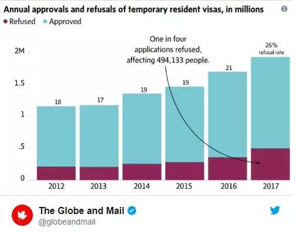
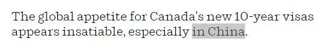
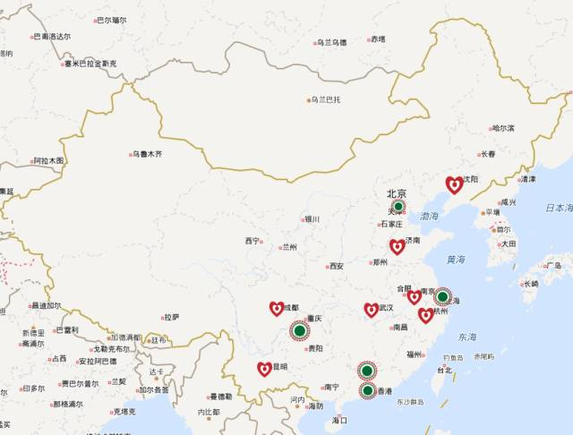
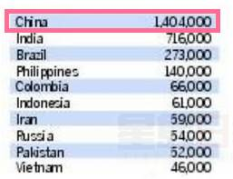
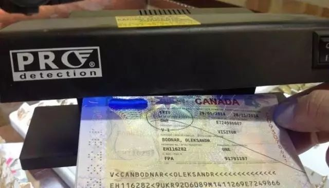

# 无标题

**链接地址:** http://mp.weixin.qq.com/s?__biz=MzI2NTE1ODgwOQ==&mid=2649605503&idx=1&sn=760e6396f6fdcb931eb443d8a821dcdc&chksm=f2b8cc89c5cf459f648df15af9c0bccd7c9bbb9d3376097b3d79346ac3a8a982b6deb36404a8&mpshare=1&scene=2&srcid=#rd
**作者:** 
**获取时间:** 2025/8/28 21:03:35
**图片数量:** 21

---

## 原始HTML内容

<section style="box-sizing: border-box;"><section class="V5" style="box-sizing: border-box;" powered-by="xiumi.us"><section style="margin-right: 0%;margin-left: 0%;box-sizing: border-box;"><section style="display: inline-block;vertical-align: middle;width: 80%;box-sizing: border-box;"><section class="V5" style="box-sizing: border-box;" powered-by="xiumi.us"><section style="margin-top: 10px;margin-bottom: 10px;text-align: center;box-sizing: border-box;"><section style="display: inline-block;box-sizing: border-box;"><section style="max-width: 100%;font-size: 0px;padding-bottom: 3px;box-sizing: border-box;"><section style="display: inline-block;vertical-align: middle;box-sizing: border-box;"><section style="width: 5px;height: 1px;background-color: rgb(217, 217, 217);box-sizing: border-box;"></section><section style="width: 1px;height: 5px;margin-top: -3px;margin-right: auto;margin-left: auto;background-color: rgb(217, 217, 217);box-sizing: border-box;"></section></section><section style="margin-top: -1px;margin-right: -5px;margin-left: -5px;width: 100%;display: inline-block;vertical-align: middle;padding-right: 8px;padding-left: 8px;box-sizing: border-box;"><section style="width: 100%;height: 1px;background-color: rgb(217, 217, 217);box-sizing: border-box;"></section></section><section style="display: inline-block;vertical-align: middle;box-sizing: border-box;"><section style="width: 5px;height: 1px;background-color: rgb(217, 217, 217);box-sizing: border-box;"></section><section style="width: 1px;height: 5px;margin-top: -3px;margin-right: auto;margin-left: auto;background-color: rgb(217, 217, 217);box-sizing: border-box;"></section></section></section><section style="padding-left: 15px;padding-right: 15px;color: rgb(161, 161, 161);font-size: 14px;box-sizing: border-box;">
点击上方<strong style="box-sizing: border-box;">蓝字</strong>关注我们哟~
</section><section style="max-width: 100%;font-size: 0px;box-sizing: border-box;"><section style="display: inline-block;vertical-align: middle;box-sizing: border-box;"><section style="width: 5px;height: 1px;background-color: rgb(217, 217, 217);box-sizing: border-box;"></section><section style="width: 1px;height: 5px;margin-top: -3px;margin-right: auto;margin-left: auto;background-color: rgb(217, 217, 217);box-sizing: border-box;"></section></section><section style="margin-top: -1px;margin-right: -5px;margin-left: -5px;width: 100%;display: inline-block;vertical-align: middle;padding-right: 8px;padding-left: 8px;box-sizing: border-box;"><section style="width: 100%;height: 1px;background-color: rgb(217, 217, 217);box-sizing: border-box;"></section></section><section style="display: inline-block;vertical-align: middle;box-sizing: border-box;"><section style="width: 5px;height: 1px;background-color: rgb(217, 217, 217);box-sizing: border-box;"></section><section style="width: 1px;height: 5px;margin-top: -3px;margin-right: auto;margin-left: auto;background-color: rgb(217, 217, 217);box-sizing: border-box;"></section></section></section></section></section></section></section><section style="display: inline-block;vertical-align: middle;width: 20%;box-sizing: border-box;"><section class="V5" style="box-sizing: border-box;" powered-by="xiumi.us"><section style="text-align: center;margin: -10px 0% 10px;box-sizing: border-box;"><section style="max-width: 100%;vertical-align: middle;display: inline-block;width: 100%;box-sizing: border-box;"></section></section></section></section></section></section><section class="V5" style="box-sizing: border-box;" powered-by="xiumi.us"><section style="margin: 10px 0%;box-sizing: border-box;"><section style="display: inline-block;width: 100%;vertical-align: top;box-sizing: border-box;"><section class="V5" style="box-sizing: border-box;" powered-by="xiumi.us"><section style="box-sizing: border-box;"><section style="display: inline-block;vertical-align: bottom;width: 75%;padding-right: 10px;box-sizing: border-box;"><section class="V5" style="box-sizing: border-box;" powered-by="xiumi.us"><section style="margin: 10px 0% 3px;box-sizing: border-box;"><section style="display: inline-block;vertical-align: middle;box-sizing: border-box;"><section style="display: inline-block;vertical-align: bottom;padding-left: 5px;padding-right: 5px;line-height: 1.2em;margin-bottom: 2px;color: rgba(80, 182, 201, 0.72);box-sizing: border-box;">
<strong style="box-sizing: border-box;">仔细看下图，有惊喜！</strong>
</section><section style="max-width: 100%;display: inline-block;vertical-align: bottom;width: 1.6em;box-sizing: border-box;"></section></section></section></section></section><section style="display: inline-block;vertical-align: bottom;width: 25%;box-sizing: border-box;"><section class="V5" style="box-sizing: border-box;" powered-by="xiumi.us"><section style="margin-right: 0%;margin-bottom: 3px;margin-left: 0%;text-align: right;box-sizing: border-box;"><section style="display: inline-block;border-bottom: 0.15em solid rgba(80, 182, 201, 0.72);padding-bottom: 3px;box-sizing: border-box;"><section style="display: inline-block;padding: 3px;border-bottom: 0.15em solid rgba(80, 182, 201, 0.72);font-size: 12px;line-height: 1.4;color: rgb(255, 143, 47);box-sizing: border-box;">
<strong style="box-sizing: border-box;">金主大大</strong>
</section></section></section></section></section></section></section><section class="V5" style="box-sizing: border-box;" powered-by="xiumi.us"><section style="margin-right: 0%;margin-left: 0%;box-sizing: border-box;"><section style="background-color: rgba(80, 182, 201, 0.72);height: 2px;box-sizing: border-box;"></section></section></section></section></section></section><section class="V5" style="box-sizing: border-box;" powered-by="xiumi.us"><section style="text-align: center;margin-top: 10px;margin-bottom: 10px;box-sizing: border-box;"><section style="max-width: 100%;vertical-align: middle;display: inline-block;box-sizing: border-box;"></section></section></section><section class="V5" style="box-sizing: border-box;" powered-by="xiumi.us"><section style="text-align: center;margin-top: 10px;margin-bottom: 10px;box-sizing: border-box;"><section style="max-width: 100%;vertical-align: middle;display: inline-block;box-sizing: border-box;"></section></section></section><section class="V5" style="box-sizing: border-box;" powered-by="xiumi.us"><section style="text-align: center;margin-top: 10px;margin-bottom: 10px;box-sizing: border-box;"><section style="max-width: 100%;vertical-align: middle;display: inline-block;box-sizing: border-box;"></section></section></section><section class="V5" style="box-sizing: border-box;" powered-by="xiumi.us"><section style="text-align: center;margin-top: 10px;margin-bottom: 10px;box-sizing: border-box;"><section style="max-width: 100%;vertical-align: middle;display: inline-block;box-sizing: border-box;"><svg xmlns="http://www.w3.org/2000/svg" x="0px" y="0px" viewBox="0 0 902.1 38.2" style="vertical-align: middle;max-width: 100%;box-sizing: border-box;" width="902.1"><g style="box-sizing: border-box;"><path style="box-sizing: border-box;" d="M18.4,1.4c0.9-1.9,2.4-1.9,3.4,0l3.4,6.9c0.9,1.9,3.4,3.7,5.4,4l7.6,1.1c2.1,0.3,2.5,1.7,1,3.2   l-5.5,5.4c-1.5,1.5-2.4,4.3-2.1,6.4l1.3,7.6c0.4,2.1-0.9,2.9-2.7,2l-6.8-3.6c-1.8-1-4.9-1-6.7,0l-6.8,3.6c-1.9,1-3.1,0.1-2.7-2   l1.3-7.6c0.4-2.1-0.6-4.9-2.1-6.4l-5.5-5.4c-1.5-1.5-1-2.9,1-3.2l7.6-1.1c2.1-0.3,4.5-2.1,5.4-4L18.4,1.4z" fill="rgb(178, 243, 230)"></path><path style="box-sizing: border-box;" d="M90.6,5.4c0.7-1.4,1.9-1.4,2.6,0l2.6,5.3c0.7,1.4,2.6,2.8,4.2,3.1l5.9,0.9c1.6,0.2,2,1.3,0.8,2.5   l-4.2,4.1c-1.2,1.1-1.9,3.3-1.6,4.9l1,5.8c0.3,1.6-0.7,2.3-2.1,1.5l-5.2-2.8c-1.4-0.8-3.8-0.8-5.2,0L84,33.6   c-1.4,0.8-2.4,0.1-2.1-1.5l1-5.8c0.3-1.6-0.5-3.8-1.6-4.9l-4.2-4.1c-1.2-1.1-0.8-2.2,0.8-2.5l5.9-0.9c1.6-0.2,3.5-1.6,4.2-3.1   L90.6,5.4z" fill="rgb(190, 204, 246)"></path><path style="box-sizing: border-box;" d="M162.6,7.5c0.6-1.2,1.6-1.2,2.2,0l2.2,4.5c0.6,1.2,2.2,2.4,3.6,2.6l5,0.7c1.4,0.2,1.7,1.1,0.7,2.1   l-3.6,3.5c-1,1-1.6,2.9-1.4,4.2l0.9,5c0.2,1.4-0.6,1.9-1.8,1.3l-4.5-2.4c-1.2-0.6-3.2-0.6-4.4,0l-4.5,2.4c-1.2,0.6-2,0.1-1.8-1.3   l0.9-5c0.2-1.4-0.4-3.3-1.4-4.2l-3.6-3.5c-1-1-0.7-1.9,0.7-2.1l5-0.7c1.4-0.2,3-1.4,3.6-2.6L162.6,7.5z" fill="rgb(150, 208, 240)"></path><path style="box-sizing: border-box;" d="M60.1,19.1c0,2.3-1.9,4.2-4.2,4.2c-2.3,0-4.2-1.9-4.2-4.2s1.9-4.2,4.2-4.2   C58.3,14.9,60.1,16.8,60.1,19.1z" fill="rgb(218, 240, 224)"></path><path style="box-sizing: border-box;" d="M203.8,19.1c0,2.3-1.9,4.2-4.2,4.2c-2.3,0-4.2-1.9-4.2-4.2s1.9-4.2,4.2-4.2   C201.9,14.9,203.8,16.8,203.8,19.1z" fill="rgb(218, 240, 224)"></path><path style="box-sizing: border-box;" d="M130.9,19.1c0,1.7-1.4,3.1-3.1,3.1c-1.7,0-3.1-1.4-3.1-3.1c0-1.7,1.4-3.1,3.1-3.1   C129.5,16.1,130.9,17.4,130.9,19.1z" fill="rgb(218, 240, 224)"></path><path style="box-sizing: border-box;" d="M233.9,1.4c0.9-1.9,2.4-1.9,3.4,0l3.4,6.9c0.9,1.9,3.4,3.7,5.4,4l7.6,1.1c2.1,0.3,2.5,1.7,1,3.2   l-5.5,5.4c-1.5,1.5-2.4,4.3-2.1,6.4l1.3,7.6c0.4,2.1-0.9,2.9-2.7,2l-6.8-3.6c-1.8-1-4.9-1-6.7,0l-6.8,3.6c-1.9,1-3.1,0.1-2.7-2   l1.3-7.6c0.4-2.1-0.6-4.9-2.1-6.4l-5.5-5.4c-1.5-1.5-1-2.9,1-3.2l7.6-1.1c2.1-0.3,4.5-2.1,5.4-4L233.9,1.4z" fill="rgb(178, 243, 230)"></path><path style="box-sizing: border-box;" d="M306.1,5.4c0.7-1.4,1.9-1.4,2.6,0l2.6,5.3c0.7,1.4,2.6,2.8,4.2,3.1l5.9,0.9c1.6,0.2,2,1.3,0.8,2.5   l-4.2,4.1c-1.2,1.1-1.9,3.3-1.6,4.9l1,5.8c0.3,1.6-0.7,2.3-2.1,1.5l-5.2-2.8c-1.4-0.8-3.8-0.8-5.2,0l-5.2,2.8   c-1.4,0.8-2.4,0.1-2.1-1.5l1-5.8c0.3-1.6-0.4-3.8-1.6-4.9l-4.2-4.1c-1.2-1.1-0.8-2.2,0.8-2.5l5.9-0.9c1.6-0.2,3.5-1.6,4.2-3.1   L306.1,5.4z" fill="rgb(190, 204, 246)"></path><path style="box-sizing: border-box;" d="M378.1,7.5c0.6-1.2,1.6-1.2,2.2,0l2.2,4.5c0.6,1.2,2.2,2.4,3.6,2.6l5,0.7c1.4,0.2,1.7,1.1,0.7,2.1   l-3.6,3.5c-1,1-1.6,2.9-1.4,4.2l0.9,5c0.2,1.4-0.6,1.9-1.8,1.3l-4.5-2.4c-1.2-0.6-3.2-0.6-4.4,0l-4.5,2.4c-1.2,0.6-2,0.1-1.8-1.3   l0.9-5c0.2-1.4-0.4-3.3-1.4-4.2l-3.6-3.5c-1-1-0.7-1.9,0.7-2.1l5-0.7c1.4-0.2,3-1.4,3.6-2.6L378.1,7.5z" fill="rgb(150, 208, 240)"></path><path style="box-sizing: border-box;" d="M275.7,19.1c0,2.3-1.9,4.2-4.2,4.2c-2.3,0-4.2-1.9-4.2-4.2s1.9-4.2,4.2-4.2   C273.8,14.9,275.7,16.8,275.7,19.1z" fill="rgb(218, 240, 224)"></path><path style="box-sizing: border-box;" d="M419.3,19.1c0,2.3-1.9,4.2-4.2,4.2c-2.3,0-4.2-1.9-4.2-4.2s1.9-4.2,4.2-4.2   C417.5,14.9,419.3,16.8,419.3,19.1z" fill="rgb(218, 240, 224)"></path><path style="box-sizing: border-box;" d="M346.4,19.1c0,1.7-1.4,3.1-3.1,3.1c-1.7,0-3.1-1.4-3.1-3.1c0-1.7,1.4-3.1,3.1-3.1   C345,16.1,346.4,17.4,346.4,19.1z" fill="rgb(218, 240, 224)"></path><path style="box-sizing: border-box;" d="M449.4,1.4c0.9-1.9,2.4-1.9,3.4,0l3.4,6.9c0.9,1.9,3.4,3.7,5.4,4l7.6,1.1c2.1,0.3,2.5,1.7,1,3.2   l-5.5,5.4c-1.5,1.5-2.4,4.3-2.1,6.4l1.3,7.6c0.4,2.1-0.9,2.9-2.7,2l-6.8-3.6c-1.8-1-4.9-1-6.7,0l-6.8,3.6c-1.9,1-3.1,0.1-2.7-2   l1.3-7.6c0.4-2.1-0.6-4.9-2.1-6.4l-5.5-5.4c-1.5-1.5-1-2.9,1-3.2l7.6-1.1c2.1-0.3,4.5-2.1,5.4-4L449.4,1.4z" fill="rgb(178, 243, 230)"></path><path style="box-sizing: border-box;" d="M521.6,5.4c0.7-1.4,1.9-1.4,2.6,0l2.6,5.3c0.7,1.4,2.6,2.8,4.2,3.1l5.9,0.9c1.6,0.2,2,1.3,0.8,2.5   l-4.2,4.1c-1.2,1.1-1.9,3.3-1.6,4.9l1,5.8c0.3,1.6-0.7,2.3-2.1,1.5l-5.2-2.8c-1.4-0.8-3.8-0.8-5.2,0l-5.2,2.8   c-1.4,0.8-2.4,0.1-2.1-1.5l1-5.8c0.3-1.6-0.5-3.8-1.6-4.9l-4.2-4.1c-1.2-1.1-0.8-2.2,0.8-2.5l5.9-0.9c1.6-0.2,3.5-1.6,4.2-3.1   L521.6,5.4z" fill="rgb(190, 204, 246)"></path><path style="box-sizing: border-box;" d="M593.6,7.5c0.6-1.2,1.6-1.2,2.2,0l2.2,4.5c0.6,1.2,2.2,2.4,3.6,2.6l5,0.7c1.4,0.2,1.7,1.1,0.7,2.1   l-3.6,3.5c-1,1-1.6,2.9-1.4,4.2l0.9,5c0.2,1.4-0.6,1.9-1.8,1.3l-4.5-2.4c-1.2-0.6-3.2-0.6-4.4,0l-4.5,2.4c-1.2,0.6-2,0.1-1.8-1.3   l0.9-5c0.2-1.4-0.4-3.3-1.4-4.2l-3.6-3.5c-1-1-0.7-1.9,0.7-2.1l5-0.7c1.4-0.2,3-1.4,3.6-2.6L593.6,7.5z" fill="rgb(150, 208, 240)"></path><path style="box-sizing: border-box;" d="M491.2,19.1c0,2.3-1.9,4.2-4.2,4.2c-2.3,0-4.2-1.9-4.2-4.2s1.9-4.2,4.2-4.2   C489.3,14.9,491.2,16.8,491.2,19.1z" fill="rgb(218, 240, 224)"></path><path style="box-sizing: border-box;" d="M634.9,19.1c0,2.3-1.9,4.2-4.2,4.2c-2.3,0-4.2-1.9-4.2-4.2s1.9-4.2,4.2-4.2   C633,14.9,634.9,16.8,634.9,19.1z" fill="rgb(218, 240, 224)"></path><path style="box-sizing: border-box;" d="M561.9,19.1c0,1.7-1.4,3.1-3.1,3.1c-1.7,0-3.1-1.4-3.1-3.1c0-1.7,1.4-3.1,3.1-3.1   C560.5,16.1,561.9,17.4,561.9,19.1z" fill="rgb(218, 240, 224)"></path><path style="box-sizing: border-box;" d="M664.9,1.4c0.9-1.9,2.4-1.9,3.4,0l3.4,6.9c0.9,1.9,3.4,3.7,5.4,4l7.6,1.1c2.1,0.3,2.5,1.7,1,3.2   l-5.5,5.4c-1.5,1.5-2.4,4.3-2.1,6.4l1.3,7.6c0.4,2.1-0.9,2.9-2.7,2l-6.8-3.6c-1.8-1-4.9-1-6.7,0l-6.8,3.6c-1.9,1-3.1,0.1-2.7-2   l1.3-7.6c0.4-2.1-0.6-4.9-2.1-6.4l-5.5-5.4c-1.5-1.5-1-2.9,1-3.2l7.6-1.1c2.1-0.3,4.5-2.1,5.4-4L664.9,1.4z" fill="rgb(178, 243, 230)"></path><path style="box-sizing: border-box;" d="M737.1,5.4c0.7-1.4,1.9-1.4,2.6,0l2.6,5.3c0.7,1.4,2.6,2.8,4.2,3.1l5.9,0.9c1.6,0.2,2,1.3,0.8,2.5   l-4.2,4.1c-1.2,1.1-1.9,3.3-1.6,4.9l1,5.8c0.3,1.6-0.7,2.3-2.1,1.5l-5.2-2.8c-1.4-0.8-3.8-0.8-5.2,0l-5.2,2.8   c-1.4,0.8-2.4,0.1-2.1-1.5l1-5.8c0.3-1.6-0.5-3.8-1.6-4.9l-4.2-4.1c-1.2-1.1-0.8-2.2,0.8-2.5l5.9-0.9c1.6-0.2,3.5-1.6,4.2-3.1   L737.1,5.4z" fill="rgb(190, 204, 246)"></path><path style="box-sizing: border-box;" d="M809.2,7.5c0.6-1.2,1.6-1.2,2.2,0l2.2,4.5c0.6,1.2,2.2,2.4,3.6,2.6l5,0.7c1.4,0.2,1.7,1.1,0.7,2.1   l-3.6,3.5c-1,1-1.6,2.9-1.4,4.2l0.9,5c0.2,1.4-0.6,1.9-1.8,1.3l-4.5-2.4c-1.2-0.6-3.2-0.6-4.4,0l-4.5,2.4c-1.2,0.6-2,0.1-1.8-1.3   l0.9-5c0.2-1.4-0.4-3.3-1.4-4.2l-3.6-3.5c-1-1-0.7-1.9,0.7-2.1l5-0.7c1.4-0.2,3-1.4,3.6-2.6L809.2,7.5z" fill="rgb(150, 208, 240)"></path><path style="box-sizing: border-box;" d="M706.7,19.1c0,2.3-1.9,4.2-4.2,4.2c-2.3,0-4.2-1.9-4.2-4.2s1.9-4.2,4.2-4.2   C704.8,14.9,706.7,16.8,706.7,19.1z" fill="rgb(218, 240, 224)"></path><path style="box-sizing: border-box;" d="M850.4,19.1c0,2.3-1.9,4.2-4.2,4.2c-2.3,0-4.2-1.9-4.2-4.2s1.9-4.2,4.2-4.2   C848.5,14.9,850.4,16.8,850.4,19.1z" fill="rgb(218, 240, 224)"></path><path style="box-sizing: border-box;" d="M777.4,19.1c0,1.7-1.4,3.1-3.1,3.1c-1.7,0-3.1-1.4-3.1-3.1c0-1.7,1.4-3.1,3.1-3.1   C776,16.1,777.4,17.4,777.4,19.1z" fill="rgb(218, 240, 224)"></path><path style="box-sizing: border-box;" d="M880.4,1.4c0.9-1.9,2.4-1.9,3.4,0l3.4,6.9c0.9,1.9,3.4,3.7,5.4,4l7.6,1.1c2.1,0.3,2.5,1.7,1,3.2   l-5.5,5.4c-1.5,1.5-2.4,4.3-2.1,6.4l1.3,7.6c0.4,2.1-0.9,2.9-2.7,2l-6.8-3.6c-1.8-1-4.9-1-6.7,0l-6.8,3.6c-1.8,1-3.1,0.1-2.7-2   l1.3-7.6c0.4-2.1-0.6-4.9-2.1-6.4l-5.5-5.4c-1.5-1.5-1-2.9,1-3.2l7.6-1.1c2.1-0.3,4.5-2.1,5.4-4L880.4,1.4z" fill="rgb(178, 243, 230)"></path></g></svg></section></section></section><section class="V5" style="box-sizing: border-box;" powered-by="xiumi.us"><section style="box-sizing: border-box;"><section style="text-align: center;box-sizing: border-box;">
<strong style="max-width: 100%;box-sizing: border-box !important;word-wrap: break-word !important;">很多人都知道加拿大的签证难拿？！</strong>（包括10年签或留学签）<strong style="max-width: 100%;box-sizing: border-box !important;word-wrap: break-word !important;">但你知道竟然难到什么程度吗？</strong>

 

一份刚刚披露的加拿大移民局官方数据让所有人目瞪口呆~~

 

截止到今年上半年，不包括学生签证的话，加拿大在拒签率已经飙升到接近<strong style="max-width: 100%;box-sizing: border-box !important;word-wrap: break-word !important;">30%</strong>。

 

什么概念？<strong style="max-width: 100%;box-sizing: border-box !important;word-wrap: break-word !important;">也就是说3个人里面就有一个申请加拿大签证的人会被拒签！</strong>

 

不过，这可能不是最惨的。

 

<strong style="max-width: 100%;box-sizing: border-box !important;word-wrap: break-word !important;">有消息称，加拿大政府或将考虑取消＂十年签证＂?！</strong>

<strong style="max-width: 100%;box-sizing: border-box !important;word-wrap: break-word !important;"></strong>

<strong style="max-width: 100%;box-sizing: border-box !important;word-wrap: break-word !important;">小编也做了一次吃瓜群众，这究竟是咋回事呢？</strong>

 

众所周知，从2011年7月开始，加拿大推出了10年多次往返签证，办理成功后就可以在10年内自由往返加拿大。

 

2014年2月6日起，所有赴加普通签证＂<strong style="max-width: 100%;box-sizing: border-box !important;word-wrap: break-word !important;">升级＂</strong>为多次往返签证，允许游客在最长<strong style="max-width: 100%;box-sizing: border-box !important;word-wrap: break-word !important;">10年</strong>内多次往返加拿大。

 

2015年3月，中国和加拿大就互发有效期最长为10年的签证也<strong style="max-width: 100%;box-sizing: border-box !important;word-wrap: break-word !important;">达成了一致。</strong>

 

<strong style="max-width: 100%;box-sizing: border-box !important;word-wrap: break-word !important;">全球申请加拿大十年签证的人越来越多，尤其是来自中国的居民。</strong>

 

据温哥华太阳报报道，迄今为止已有<strong style="max-width: 100%;box-sizing: border-box !important;word-wrap: break-word !important;">300万人</strong>获得了10年多次往返签证，其中<strong style="max-width: 100%;box-sizing: border-box !important;word-wrap: break-word !important;">50%都发给了中国人。</strong>

 

新闻报道

 

10年签证利大于弊还是弊大于利，始终众说纷纭，<strong style="max-width: 100%;box-sizing: border-box !important;word-wrap: break-word !important;">甚至有人向加拿大政府建议修改或者取消这项政策。</strong>

 

报道中特别提到了<strong style="max-width: 100%;box-sizing: border-box !important;word-wrap: break-word !important;">中国人对10年签证的强烈需求：</strong>

今年，特鲁多政府在中国开设了<strong style="max-width: 100%;box-sizing: border-box !important;word-wrap: break-word !important;">7个新的签证中心</strong>，以满足越来越多的中国人前往加拿大的需求。

 

加上原来的北京、香港、上海、广州和重庆，中国的加拿大签证中心达到了12个，已经覆盖了人口最密集的地区：

 

 

移民部长表示，增设更多的签证中心是为了吸引更多游客来加旅游、吸引留学生来加深造以及吸引更多劳动者来加就业。

 

<strong style="max-width: 100%;box-sizing: border-box !important;word-wrap: break-word !important;"></strong>

 

据媒体统计数据，获得加拿大10年签证的中国人有<strong style="max-width: 100%;box-sizing: border-box !important;word-wrap: break-word !important;">140万多</strong>，远远超过其他国家：

 

10年签证允许中国人在10年内多次访问加拿大，每次停留时间可以达到<strong style="max-width: 100%;box-sizing: border-box !important;word-wrap: break-word !important;">6个月之久。</strong>

 

据了解，中国已经成为继英国、美国之后加拿大第三大游客来源地。

 

今年BC省的中国游客尤其多，比起去年有很大的增长。而去年大陆游客的数量也比前年增长了<strong style="max-width: 100%;box-sizing: border-box !important;word-wrap: break-word !important;">23%之多。</strong>

 

 

加拿大统计局的数字显示，10年签证的流行极大增长了一些国家的旅游人数。

 

在加拿大全国范围的旅游者共有610000人，其中有312000人选择前来BC省旅游。

 

加拿大政府统计数据表明，来自中国大陆的访客每年在加拿大花掉<strong style="max-width: 100%;box-sizing: border-box !important;word-wrap: break-word !important;">10亿加元。</strong>
<section style="max-width: 100%;box-sizing: border-box;font-family: -apple-system-font, BlinkMacSystemFont, &quot;Helvetica Neue&quot;, &quot;PingFang SC&quot;, &quot;Hiragino Sans GB&quot;, &quot;Microsoft YaHei UI&quot;, &quot;Microsoft YaHei&quot;, Arial, sans-serif;letter-spacing: 0.544px;text-align: justify;white-space: normal;color: rgb(62, 62, 62);font-size: 16px;background-color: rgb(255, 255, 255);word-wrap: break-word !important;"><section class="" powered-by="xiumi.us" style="max-width: 100%;box-sizing: border-box;word-wrap: break-word !important;"><section class="" style="margin-top: 0.5em;margin-bottom: 0.5em;max-width: 100%;box-sizing: border-box;word-wrap: break-word !important;"><section class="" style="max-width: 100%;box-sizing: border-box;border-top: 3px dashed rgb(180, 74, 74);word-wrap: break-word !important;"></section></section></section></section>
 

George Lee是本拿比的一名移民律师，他出生在中国。 

 

他表示大温地区的宾馆、零售商店和餐馆都在招聘更多的可以说普通话的员工，因为来自中国的顾客越来越多。

 

<strong style="max-width: 100%;box-sizing: border-box !important;word-wrap: break-word !important;">＂为了提高客户满意度，他们还让员工提供温水、温热的可乐，迎合中国人的习惯。＂</strong>

 

10年签证不仅极大地促进了加拿大旅游业的发展，也给那些“太空人家庭”更长的团聚时间。

 
<section style="max-width: 100%;box-sizing: border-box;font-family: -apple-system-font, BlinkMacSystemFont, &quot;Helvetica Neue&quot;, &quot;PingFang SC&quot;, &quot;Hiragino Sans GB&quot;, &quot;Microsoft YaHei UI&quot;, &quot;Microsoft YaHei&quot;, Arial, sans-serif;letter-spacing: 0.544px;text-align: justify;white-space: normal;color: rgb(62, 62, 62);font-size: 16px;background-color: rgb(255, 255, 255);word-wrap: break-word !important;"><section class="" powered-by="xiumi.us" style="max-width: 100%;box-sizing: border-box;word-wrap: break-word !important;"><section class="" style="margin-top: 10px;margin-bottom: 10px;max-width: 100%;box-sizing: border-box;text-align: center;word-wrap: break-word !important;"><section class="" style="padding: 10px;max-width: 100%;box-sizing: border-box;display: inline-block;width: 603px;border-width: 1px;border-style: solid;border-color: rgb(192, 200, 209);background-color: rgb(239, 239, 239);word-wrap: break-word !important;"><section class="" powered-by="xiumi.us" style="max-width: 100%;box-sizing: border-box;word-wrap: break-word !important;"><section class="" style="max-width: 100%;box-sizing: border-box;word-wrap: break-word !important;"><section class="" style="max-width: 100%;box-sizing: border-box;text-align: left;word-wrap: break-word !important;">
太空人家庭也被称为候鸟家庭。为了下一代接受更好的教育，

 

越来越多华裔家庭选择了另一种生活方式：父亲（或母亲）在国内工作，母亲（或父亲）带着子女到国外读书。

 

一家人每逢节假日坐飞机才能团聚，就像候鸟一样，跨越很长的时间和距离。
</section></section></section></section></section></section></section>
 

移民律师Sam Hyman表示，10年签证不仅促进了中国、印度、巴西和其他国家的人来旅游，还帮助了距离遥远的人们在加拿大团聚。 

 

<strong style="max-width: 100%;box-sizing: border-box !important;word-wrap: break-word !important;">有了10年签证，永久居民身份都不是必要的了~ 反正靠签证就可以在加拿大呆上很长的时间。</strong>

 

移民律师George Lee表示，富有的中国人不断在BC省买地、买宾馆、买房子，尤其是在大温地区和温哥华岛。

 

<strong style="max-width: 100%;box-sizing: border-box !important;word-wrap: break-word !important;">＂温哥华已经成为地球村，而有些人不喜欢这种趋势。他们觉得受到了侵犯，但是最终大家还是会习惯的。＂</strong>

 
<section style="max-width: 100%;box-sizing: border-box;font-family: -apple-system-font, BlinkMacSystemFont, &quot;Helvetica Neue&quot;, &quot;PingFang SC&quot;, &quot;Hiragino Sans GB&quot;, &quot;Microsoft YaHei UI&quot;, &quot;Microsoft YaHei&quot;, Arial, sans-serif;letter-spacing: 0.544px;text-align: justify;white-space: normal;color: rgb(62, 62, 62);font-size: 16px;background-color: rgb(255, 255, 255);word-wrap: break-word !important;"><section class="" powered-by="xiumi.us" style="max-width: 100%;box-sizing: border-box;word-wrap: break-word !important;"><section class="" style="margin-top: 10px;margin-bottom: 10px;max-width: 100%;box-sizing: border-box;text-align: center;word-wrap: break-word !important;"><section class="" style="max-width: 100%;box-sizing: border-box;display: inline-block;word-wrap: break-word !important;"><section style="padding-bottom: 3px;max-width: 100%;box-sizing: border-box;font-size: 0px;word-wrap: break-word !important;"><section style="max-width: 100%;box-sizing: border-box;display: inline-block;vertical-align: middle;word-wrap: break-word !important;"><section style="max-width: 100%;box-sizing: border-box;width: 5px;height: 1px;background-color: rgb(180, 74, 74);word-wrap: break-word !important;"></section><section style="margin-top: -3px;margin-right: auto;margin-left: auto;max-width: 100%;box-sizing: border-box;width: 1px;height: 5px;background-color: rgb(180, 74, 74);word-wrap: break-word !important;"></section></section><section style="margin-top: -1px;margin-right: -5px;margin-left: -5px;padding-right: 8px;padding-left: 8px;max-width: 100%;box-sizing: border-box;width: 175.797px;display: inline-block;vertical-align: middle;word-wrap: break-word !important;"><section style="max-width: 100%;box-sizing: border-box;width: 159.797px;height: 1px;background-color: rgb(180, 74, 74);word-wrap: break-word !important;"></section></section><section style="max-width: 100%;box-sizing: border-box;display: inline-block;vertical-align: middle;word-wrap: break-word !important;"><section style="max-width: 100%;box-sizing: border-box;width: 5px;height: 1px;background-color: rgb(180, 74, 74);word-wrap: break-word !important;"></section><section style="margin-top: -3px;margin-right: auto;margin-left: auto;max-width: 100%;box-sizing: border-box;width: 1px;height: 5px;background-color: rgb(180, 74, 74);word-wrap: break-word !important;"></section></section></section><section class="" style="padding-right: 15px;padding-left: 15px;max-width: 100%;box-sizing: border-box;color: rgb(180, 74, 74);word-wrap: break-word !important;">
<strong style="max-width: 100%;box-sizing: border-box;word-wrap: break-word !important;">10年签证帮助逃税？</strong>
</section><section style="max-width: 100%;box-sizing: border-box;font-size: 0px;word-wrap: break-word !important;"><section style="max-width: 100%;box-sizing: border-box;display: inline-block;vertical-align: middle;word-wrap: break-word !important;"><section style="max-width: 100%;box-sizing: border-box;width: 5px;height: 1px;background-color: rgb(180, 74, 74);word-wrap: break-word !important;"></section><section style="margin-top: -3px;margin-right: auto;margin-left: auto;max-width: 100%;box-sizing: border-box;width: 1px;height: 5px;background-color: rgb(180, 74, 74);word-wrap: break-word !important;"></section></section><section style="margin-top: -1px;margin-right: -5px;margin-left: -5px;padding-right: 8px;padding-left: 8px;max-width: 100%;box-sizing: border-box;width: 175.797px;display: inline-block;vertical-align: middle;word-wrap: break-word !important;"><section style="max-width: 100%;box-sizing: border-box;width: 159.797px;height: 1px;background-color: rgb(180, 74, 74);word-wrap: break-word !important;"></section></section><section style="max-width: 100%;box-sizing: border-box;display: inline-block;vertical-align: middle;word-wrap: break-word !important;"><section style="max-width: 100%;box-sizing: border-box;width: 5px;height: 1px;background-color: rgb(180, 74, 74);word-wrap: break-word !important;"></section><section style="margin-top: -3px;margin-right: auto;margin-left: auto;max-width: 100%;box-sizing: border-box;width: 1px;height: 5px;background-color: rgb(180, 74, 74);word-wrap: break-word !important;"></section></section></section></section></section></section></section>
 

<strong style="max-width: 100%;box-sizing: border-box !important;word-wrap: break-word !important;">10年签证容易被人利用，</strong><strong style="max-width: 100%;box-sizing: border-box !important;word-wrap: break-word !important;">用来炒房和避税</strong>。Hyman表示这就是10年签的最大的坏处。

 

<strong style="max-width: 100%;box-sizing: border-box !important;word-wrap: break-word !important;">＂富有的外国居民利用在加国的亲人买房，又因为自己不是加拿大人而逃避税收。＂</strong>

 

 

通常他们先作为主申请人让全家申请永久居民身份，之后自己再放弃这个身份。

 

加拿大的税收系统漏洞允许外国居民＂<strong style="max-width: 100%;box-sizing: border-box !important;word-wrap: break-word !important;">转移没有上限的财产＂</strong>给自己的配偶，孩子和其他家人。

 

 

这样，负责挣钱的（通常是父亲）在外国挣到钱，转移给在加拿大获得了枫叶卡的亲人。

 

这些钱不必缴税，用来买房既能逃避外国买家税，又能逃避个人所得税。

 

同时因为有10年签证，父亲也能和家人有很长的团聚时间，不影响家庭和谐。

 
<section style="max-width: 100%;box-sizing: border-box;font-family: -apple-system-font, BlinkMacSystemFont, &quot;Helvetica Neue&quot;, &quot;PingFang SC&quot;, &quot;Hiragino Sans GB&quot;, &quot;Microsoft YaHei UI&quot;, &quot;Microsoft YaHei&quot;, Arial, sans-serif;letter-spacing: 0.544px;text-align: justify;white-space: normal;color: rgb(62, 62, 62);font-size: 16px;background-color: rgb(255, 255, 255);word-wrap: break-word !important;"><section class="" powered-by="xiumi.us" style="max-width: 100%;box-sizing: border-box;word-wrap: break-word !important;"><section class="" style="margin-top: 10px;margin-bottom: 10px;max-width: 100%;box-sizing: border-box;text-align: center;word-wrap: break-word !important;"><section class="" style="max-width: 100%;box-sizing: border-box;display: inline-block;word-wrap: break-word !important;"><section style="padding-bottom: 3px;max-width: 100%;box-sizing: border-box;font-size: 0px;word-wrap: break-word !important;"><section style="max-width: 100%;box-sizing: border-box;display: inline-block;vertical-align: middle;word-wrap: break-word !important;"><section style="max-width: 100%;box-sizing: border-box;width: 5px;height: 1px;background-color: rgb(180, 74, 74);word-wrap: break-word !important;"></section><section style="margin-top: -3px;margin-right: auto;margin-left: auto;max-width: 100%;box-sizing: border-box;width: 1px;height: 5px;background-color: rgb(180, 74, 74);word-wrap: break-word !important;"></section></section><section style="margin-top: -1px;margin-right: -5px;margin-left: -5px;padding-right: 8px;padding-left: 8px;max-width: 100%;box-sizing: border-box;width: 159.797px;display: inline-block;vertical-align: middle;word-wrap: break-word !important;"><section style="max-width: 100%;box-sizing: border-box;width: 143.797px;height: 1px;background-color: rgb(180, 74, 74);word-wrap: break-word !important;"></section></section><section style="max-width: 100%;box-sizing: border-box;display: inline-block;vertical-align: middle;word-wrap: break-word !important;"><section style="max-width: 100%;box-sizing: border-box;width: 5px;height: 1px;background-color: rgb(180, 74, 74);word-wrap: break-word !important;"></section><section style="margin-top: -3px;margin-right: auto;margin-left: auto;max-width: 100%;box-sizing: border-box;width: 1px;height: 5px;background-color: rgb(180, 74, 74);word-wrap: break-word !important;"></section></section></section><section class="" style="padding-right: 15px;padding-left: 15px;max-width: 100%;box-sizing: border-box;color: rgb(180, 74, 74);word-wrap: break-word !important;">
<strong style="max-width: 100%;box-sizing: border-box;word-wrap: break-word !important;">10年签证推高房价</strong>
</section><section style="max-width: 100%;box-sizing: border-box;font-size: 0px;word-wrap: break-word !important;"><section style="max-width: 100%;box-sizing: border-box;display: inline-block;vertical-align: middle;word-wrap: break-word !important;"><section style="max-width: 100%;box-sizing: border-box;width: 5px;height: 1px;background-color: rgb(180, 74, 74);word-wrap: break-word !important;"></section><section style="margin-top: -3px;margin-right: auto;margin-left: auto;max-width: 100%;box-sizing: border-box;width: 1px;height: 5px;background-color: rgb(180, 74, 74);word-wrap: break-word !important;"></section></section><section style="margin-top: -1px;margin-right: -5px;margin-left: -5px;padding-right: 8px;padding-left: 8px;max-width: 100%;box-sizing: border-box;width: 159.797px;display: inline-block;vertical-align: middle;word-wrap: break-word !important;"><section style="max-width: 100%;box-sizing: border-box;width: 143.797px;height: 1px;background-color: rgb(180, 74, 74);word-wrap: break-word !important;"></section></section><section style="max-width: 100%;box-sizing: border-box;display: inline-block;vertical-align: middle;word-wrap: break-word !important;"><section style="max-width: 100%;box-sizing: border-box;width: 5px;height: 1px;background-color: rgb(180, 74, 74);word-wrap: break-word !important;"></section><section style="margin-top: -3px;margin-right: auto;margin-left: auto;max-width: 100%;box-sizing: border-box;width: 1px;height: 5px;background-color: rgb(180, 74, 74);word-wrap: break-word !important;"></section></section></section></section></section></section></section>
 

除了避税，律师指出10年签证可能是造成<strong style="max-width: 100%;box-sizing: border-box !important;word-wrap: break-word !important;">买房热潮</strong>的原因之一。

 

在加的家庭成员利用家中的外国人（通常是父亲）在其他国家赚的钱来投资房地产。这种情况在大温地区尤其常见。

 

这些人在<strong style="max-width: 100%;box-sizing: border-box !important;word-wrap: break-word !important;">各地投资房产，炒高了楼价</strong>，影响本地居民的生活质量。

<strong style="max-width: 100%;box-sizing: border-box !important;word-wrap: break-word !important;">George Lee说：</strong>

 

“I often travel to China, where I see the great pride many take in investing their money&nbsp;in Canada--particularly by taking advantage of 10-year visas to buy real estate”

 

<strong style="max-width: 100%;box-sizing: border-box !important;word-wrap: break-word !important;">＂我经常去中国旅游，很多人都得意地表示自己在加拿大投资买了房。我猜是因为10年签证，有效期很长给了他们方便。＂</strong>

 

＂还有些人把财产转移给在加国的亲人，然后放弃自己的永久居民身份，再申请10年有效签证。＂

 

 

负责挣钱的人拿着十年多次往返签证，一次可以在加拿大停留半年。由于不是加拿大的税务居民，就不需要向加拿大税务局申报收入。

 

同时，他的家庭成员却可以享受纳税人补贴的加拿大教育体系、健保体系和社会服务。

 

<strong style="max-width: 100%;box-sizing: border-box !important;word-wrap: break-word !important;">＂这些人家里没有一个缴税，却享受了所有的福利。＂</strong>

 

近两年来有超过21000人放弃永久居民身份，其中中国人和印度人占多数，呈现上升趋势。

 

 

至于为什么要放弃枫叶卡而选择十年签证，原因就一言难尽了。

 

移民律师Hyman希望政府弥补税务政策的漏洞，避免外国人随意放弃自己的永久居民身份。

 

文章来源：加拿大家园

 
</section></section></section><section class="V5" style="box-sizing: border-box;" powered-by="xiumi.us"><section style="box-sizing: border-box;"><section style="box-sizing: border-box;">
 
</section></section></section><section class="V5" style="box-sizing: border-box;" powered-by="xiumi.us"><section style="margin: 40px 0% 10px;text-align: center;box-sizing: border-box;"><section style="display: inline-block;width: 90%;border-width: 1px;border-style: dotted;border-color: rgba(80, 182, 201, 0.72);padding: 10px;border-radius: 0px;box-sizing: border-box;"><section class="V5" style="box-sizing: border-box;" powered-by="xiumi.us"><section style="transform: translate3d(20px, 0px, 0px);text-align: left;font-size: 11px;margin-top: -55px;margin-right: 0%;margin-left: 0%;box-sizing: border-box;"><section style="box-sizing: border-box;width: 7em;height: 7em;display: inline-block;vertical-align: bottom;border-radius: 100%;border-width: 5px;border-style: none;border-color: rgba(80, 182, 201, 0.72);background-position: center center;background-repeat: no-repeat;background-size: cover;background-image: url(&quot;https://mmbiz.qpic.cn/mmbiz_jpg/D1nJqnhkPyIevbZHUUhX5vDxoSnRP5IXAZaEiaFX2G5oSUjibtQI4sUaV92icque8Jaia11DjUYWxR8ow5pm8TneCQ/640?wx_fmt=jpeg&quot;);"><section style="width: 100%;height: 100%;overflow: hidden;box-sizing: border-box;"></section></section></section></section><section class="V5" style="box-sizing: border-box;" powered-by="xiumi.us"><section style="box-sizing: border-box;"><section style="display: inline-block;vertical-align: top;width: 61.8%;box-sizing: border-box;"><section class="V5" style="box-sizing: border-box;" powered-by="xiumi.us"><section style="margin-right: 0%;margin-left: 0%;box-sizing: border-box;"><section style="font-size: 18px;color: rgb(67, 103, 117);line-height: 1.6;letter-spacing: 1px;box-sizing: border-box;">
<strong style="box-sizing: border-box;">埃德蒙顿微生活</strong>
</section></section></section><section class="V5" style="box-sizing: border-box;" powered-by="xiumi.us"><section style="margin-top: 0.5em;margin-bottom: 0.5em;box-sizing: border-box;"><section style="background-color: rgba(80, 182, 201, 0.72);height: 1px;box-sizing: border-box;"></section></section></section></section></section></section><section class="V5" style="box-sizing: border-box;" powered-by="xiumi.us"><section style="box-sizing: border-box;"><section style="text-align: justify;font-size: 14px;color: rgba(62, 62, 62, 0.72);letter-spacing: 2px;box-sizing: border-box;">
<strong style="box-sizing: border-box;">关心埃德蒙顿民生，</strong>

<strong style="box-sizing: border-box;">关注埃德蒙顿的发展。</strong>

 

埃德蒙顿微生活是“吃喝玩乐埃德蒙顿”旗下，为埃德蒙顿地区的居民提供每日最新的吃喝玩乐、工作学习、商业投资的媒体平台 。
</section></section></section><section class="V5" style="box-sizing: border-box;" powered-by="xiumi.us"><section style="box-sizing: border-box;"><section style="text-align: left;box-sizing: border-box;">
 
</section></section></section><section class="V5" style="box-sizing: border-box;" powered-by="xiumi.us"><section style="box-sizing: border-box;"><section style="display: inline-block;vertical-align: middle;width: 61.8%;box-sizing: border-box;"><section class="V5" style="box-sizing: border-box;" powered-by="xiumi.us"><section style="box-sizing: border-box;"><section style="text-align: justify;font-size: 12px;color: rgba(62, 62, 62, 0.37);line-height: 1.9;letter-spacing: 0px;box-sizing: border-box;">
我们的目标是以最新、最快、最及时的方式 报道埃德蒙顿的新鲜事 。 
</section></section></section></section><section style="display: inline-block;vertical-align: middle;width: 38.2%;box-sizing: border-box;"><section class="V5" style="box-sizing: border-box;" powered-by="xiumi.us"><section style="margin-right: 0%;margin-left: 0%;box-sizing: border-box;"><section style="max-width: 100%;vertical-align: middle;display: inline-block;width: 70%;box-sizing: border-box;"></section></section></section></section></section></section></section></section></section></section>
 

---

## 纯文本内容

点击上方蓝字关注我们哟~仔细看下图，有惊喜！金主大大很多人都知道加拿大的签证难拿？！（包括10年签或留学签）但你知道竟然难到什么程度吗？一份刚刚披露的加拿大移民局官方数据让所有人目瞪口呆~~截止到今年上半年，不包括学生签证的话，加拿大在拒签率已经飙升到接近30%。什么概念？也就是说3个人里面就有一个申请加拿大签证的人会被拒签！不过，这可能不是最惨的。有消息称，加拿大政府或将考虑取消＂十年签证＂?！小编也做了一次吃瓜群众，这究竟是咋回事呢？众所周知，从2011年7月开始，加拿大推出了10年多次往返签证，办理成功后就可以在10年内自由往返加拿大。2014年2月6日起，所有赴加普通签证＂升级＂为多次往返签证，允许游客在最长10年内多次往返加拿大。2015年3月，中国和加拿大就互发有效期最长为10年的签证也达成了一致。全球申请加拿大十年签证的人越来越多，尤其是来自中国的居民。据温哥华太阳报报道，迄今为止已有300万人获得了10年多次往返签证，其中50%都发给了中国人。新闻报道10年签证利大于弊还是弊大于利，始终众说纷纭，甚至有人向加拿大政府建议修改或者取消这项政策。报道中特别提到了中国人对10年签证的强烈需求：今年，特鲁多政府在中国开设了7个新的签证中心，以满足越来越多的中国人前往加拿大的需求。加上原来的北京、香港、上海、广州和重庆，中国的加拿大签证中心达到了12个，已经覆盖了人口最密集的地区：移民部长表示，增设更多的签证中心是为了吸引更多游客来加旅游、吸引留学生来加深造以及吸引更多劳动者来加就业。据媒体统计数据，获得加拿大10年签证的中国人有140万多，远远超过其他国家：10年签证允许中国人在10年内多次访问加拿大，每次停留时间可以达到6个月之久。据了解，中国已经成为继英国、美国之后加拿大第三大游客来源地。今年BC省的中国游客尤其多，比起去年有很大的增长。而去年大陆游客的数量也比前年增长了23%之多。加拿大统计局的数字显示，10年签证的流行极大增长了一些国家的旅游人数。在加拿大全国范围的旅游者共有610000人，其中有312000人选择前来BC省旅游。加拿大政府统计数据表明，来自中国大陆的访客每年在加拿大花掉10亿加元。George Lee是本拿比的一名移民律师，他出生在中国。他表示大温地区的宾馆、零售商店和餐馆都在招聘更多的可以说普通话的员工，因为来自中国的顾客越来越多。＂为了提高客户满意度，他们还让员工提供温水、温热的可乐，迎合中国人的习惯。＂10年签证不仅极大地促进了加拿大旅游业的发展，也给那些“太空人家庭”更长的团聚时间。太空人家庭也被称为候鸟家庭。为了下一代接受更好的教育，越来越多华裔家庭选择了另一种生活方式：父亲（或母亲）在国内工作，母亲（或父亲）带着子女到国外读书。一家人每逢节假日坐飞机才能团聚，就像候鸟一样，跨越很长的时间和距离。移民律师Sam Hyman表示，10年签证不仅促进了中国、印度、巴西和其他国家的人来旅游，还帮助了距离遥远的人们在加拿大团聚。有了10年签证，永久居民身份都不是必要的了~ 反正靠签证就可以在加拿大呆上很长的时间。移民律师George Lee表示，富有的中国人不断在BC省买地、买宾馆、买房子，尤其是在大温地区和温哥华岛。＂温哥华已经成为地球村，而有些人不喜欢这种趋势。他们觉得受到了侵犯，但是最终大家还是会习惯的。＂10年签证帮助逃税？10年签证容易被人利用，用来炒房和避税。Hyman表示这就是10年签的最大的坏处。＂富有的外国居民利用在加国的亲人买房，又因为自己不是加拿大人而逃避税收。＂通常他们先作为主申请人让全家申请永久居民身份，之后自己再放弃这个身份。加拿大的税收系统漏洞允许外国居民＂转移没有上限的财产＂给自己的配偶，孩子和其他家人。这样，负责挣钱的（通常是父亲）在外国挣到钱，转移给在加拿大获得了枫叶卡的亲人。这些钱不必缴税，用来买房既能逃避外国买家税，又能逃避个人所得税。同时因为有10年签证，父亲也能和家人有很长的团聚时间，不影响家庭和谐。10年签证推高房价除了避税，律师指出10年签证可能是造成买房热潮的原因之一。在加的家庭成员利用家中的外国人（通常是父亲）在其他国家赚的钱来投资房地产。这种情况在大温地区尤其常见。这些人在各地投资房产，炒高了楼价，影响本地居民的生活质量。George Lee说：“I often travel to China, where I see the great pride many take in investing their money in Canada--particularly by taking advantage of 10-year visas to buy real estate”＂我经常去中国旅游，很多人都得意地表示自己在加拿大投资买了房。我猜是因为10年签证，有效期很长给了他们方便。＂＂还有些人把财产转移给在加国的亲人，然后放弃自己的永久居民身份，再申请10年有效签证。＂负责挣钱的人拿着十年多次往返签证，一次可以在加拿大停留半年。由于不是加拿大的税务居民，就不需要向加拿大税务局申报收入。同时，他的家庭成员却可以享受纳税人补贴的加拿大教育体系、健保体系和社会服务。＂这些人家里没有一个缴税，却享受了所有的福利。＂近两年来有超过21000人放弃永久居民身份，其中中国人和印度人占多数，呈现上升趋势。至于为什么要放弃枫叶卡而选择十年签证，原因就一言难尽了。移民律师Hyman希望政府弥补税务政策的漏洞，避免外国人随意放弃自己的永久居民身份。文章来源：加拿大家园埃德蒙顿微生活关心埃德蒙顿民生，关注埃德蒙顿的发展。埃德蒙顿微生活是“吃喝玩乐埃德蒙顿”旗下，为埃德蒙顿地区的居民提供每日最新的吃喝玩乐、工作学习、商业投资的媒体平台 。我们的目标是以最新、最快、最及时的方式 报道埃德蒙顿的新鲜事 。

---

## 图片列表

-  (原始链接: https://mmbiz.qpic.cn/mmbiz_gif/D1nJqnhkPyIevbZHUUhX5vDxoSnRP5IXoQ0kpTnJPQNDjbdgbzLib9Fk6sfrpgEG4OOY2Q5peuiakYEeyPFPmcJw/640?wx_fmt=gif)
-  (原始链接: https://mmbiz.qpic.cn/mmbiz_gif/D1nJqnhkPyIevbZHUUhX5vDxoSnRP5IXJcgxJ2E0j9C2FyVRByvz2l1WasWicxYDpFVL3FoiaicVP2LgM8N8xxsPQ/640?wx_fmt=gif)
-  (原始链接: https://mmbiz.qpic.cn/mmbiz_jpg/D1nJqnhkPyIevbZHUUhX5vDxoSnRP5IXG7EXmib2Hiaviad4HGic2tx8LJKfPwqKHtjJ6FbxGfgEicuceEjW3tbzJ3g/640?wx_fmt=jpeg)
-  (原始链接: https://mmbiz.qpic.cn/mmbiz_jpg/D1nJqnhkPyIevbZHUUhX5vDxoSnRP5IXTs8NRwSBuFmfCtQ5icjjsyY8qYsw7LDGo8ziaxNrUc00Qoqt7uUCe6uA/640?wx_fmt=jpeg)
-  (原始链接: https://mmbiz.qpic.cn/mmbiz_jpg/D1nJqnhkPyIevbZHUUhX5vDxoSnRP5IXicWEOWzM3AjqIyJdZ1XzVeFpBYsUDibiaFwfibjEg0hNDmP4TCEiaPDZqLw/640?wx_fmt=jpeg)
-  (原始链接: https://mmbiz.qpic.cn/mmbiz_png/fmEGSORPyK0fSs0WUI4kYnicc8Uuku4SSnfKHFp0TUNDLcOrjXplAkX2icENiaBibAfbQcictBLTRSqaA9dY4nWWVYg/640?wx_fmt=png)
-  (原始链接: https://mmbiz.qpic.cn/mmbiz_jpg/fmEGSORPyK2JhkjFbefYtn4V5KDDlPjKbibg9Fb3TMODAWHbx5C8cxeKYTtcjqY5IzuTfiadrvO8ANxlib7A8wghw/640?wx_fmt=jpeg)
-  (原始链接: http://mmbiz.qpic.cn/mmbiz_jpg/kRXMiae96WTDIvTobMibC6ITJiaACtzNAia14666SdmicThfvbLnMSVAqpUwUxJP5fUSgGMxiad7gJC3vpiabLSyGCCbg/640.jpeg?)
-  (原始链接: http://mmbiz.qpic.cn/mmbiz_jpg/3LxMQLD9XuKjibqiaZHy8FyOWRWbDtvtiafA1IzvWU3HdxlFd0bWEwBxXEpX7OueYiaAgIQubyaRE6m0qyb9wMsuIA/640.jpeg?)
-  (原始链接: https://mmbiz.qpic.cn/mmbiz_jpg/3LxMQLD9XuKjibqiaZHy8FyOWRWbDtvtiafXtn3vfKUicbN6uOlxv2lBBUU8kSn5O0K02zqeE5kricibFSibqBts8FWtw/640?wx_fmt=jpeg)
-  (原始链接: http://mmbiz.qpic.cn/mmbiz_png/3LxMQLD9XuJWRvW6T7XXbBCz9fToG6w6peIZV9ZukjhiaxqlMuaQG1kpQtN1hx4s2phNqELArxbaP86T8BI0KLg/640?wx_fmt=png)
-  (原始链接: http://mmbiz.qpic.cn/mmbiz_jpg/3LxMQLD9XuJWRvW6T7XXbBCz9fToG6w6Dq2ib21UrlibMmicLS3ADFbzutC1IqUqt2NPHZ1EMJ7nYSj6gAUruXjDA/640?wx_fmt=jpeg)
-  (原始链接: https://mmbiz.qpic.cn/mmbiz_png/3LxMQLD9XuKjibqiaZHy8FyOWRWbDtvtiaf5etx70IBJTVgfKhBghRjaic3y4MYXgcqfhjkGpW4o9YaticyBeGrbLPA/640?wx_fmt=png)
-  (原始链接: http://mmbiz.qpic.cn/mmbiz_jpg/3LxMQLD9XuKtAjfJJjIOGe10wn9h61clskwldfvVReZet9zMYYrSgVpjN9b4E8AzJGtRzrtXxXLoHTS6WYsdVw/640?wx_fmt=jpeg)
-  (原始链接: https://mmbiz.qpic.cn/mmbiz_jpg/3LxMQLD9XuKjibqiaZHy8FyOWRWbDtvtiaf5VZeibgJMKVvqSGvMAzb7J1lPgmxWllM15u9dnalgaDApX96S9z5U4g/640?wx_fmt=jpeg)
-  (原始链接: https://mmbiz.qpic.cn/mmbiz_jpg/3LxMQLD9XuKjibqiaZHy8FyOWRWbDtvtiafgpNicXiaMo0OtbWPVhjjhFC3iarcV9oia2bia26GGR8ZkXrdGrWiaFz3kKDg/640?wx_fmt=jpeg)
-  (原始链接: https://mmbiz.qpic.cn/mmbiz_jpg/3LxMQLD9XuKjibqiaZHy8FyOWRWbDtvtiafwP6MQ26qe8Dzca5XiaYibqCslqRXiaic1ibGIB1KYejNsFnVgLTdAbd1icyQ/640?wx_fmt=jpeg)
-  (原始链接: https://mmbiz.qpic.cn/mmbiz_jpg/3LxMQLD9XuKjibqiaZHy8FyOWRWbDtvtiaf45GfiaePOCDkZRqtXU7ds2WYOnvZQf0wlljFVn4FWL7me4y1t48Q5qg/640?wx_fmt=jpeg)
-  (原始链接: https://mmbiz.qpic.cn/mmbiz_jpg/3LxMQLD9XuKjibqiaZHy8FyOWRWbDtvtiafMlo2VMozQ7tJPPUCIFkeMn8WiaD2RPQsFAZOOaIJXGIsWS5KscGpjoA/640?wx_fmt=jpeg)
-  (原始链接: https://mmbiz.qpic.cn/mmbiz_jpg/D1nJqnhkPyIevbZHUUhX5vDxoSnRP5IXAZaEiaFX2G5oSUjibtQI4sUaV92icque8Jaia11DjUYWxR8ow5pm8TneCQ/640?wx_fmt=jpeg)
-  (原始链接: https://mmbiz.qpic.cn/mmbiz_jpg/D1nJqnhkPyIevbZHUUhX5vDxoSnRP5IXicG03WOhpvaVFXBawVuOIx1y1j8HC7YiaEiaFsxHwhBy4oNuBmMSDWNnQ/640?wx_fmt=jpeg)
