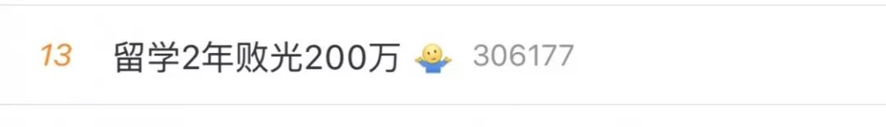
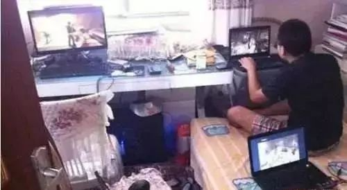
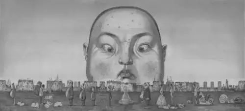

# 无标题

**链接地址:** http://mp.weixin.qq.com/s?__biz=MzI2NTE1ODgwOQ==&mid=2649605660&idx=2&sn=234ad0e8974f1f6d00fc92d7a0b0d704&chksm=f2b8cfeac5cf46fc3ded9af32f4fdb706d0f6ff0a130a8338af7c358933bb4c5c0d2a76858f6&mpshare=1&scene=2&srcid=#rd
**作者:** 
**获取时间:** 2025/8/28 20:58:26
**图片数量:** 13

---

## 原始HTML内容

<section style="box-sizing: border-box;"><section class="V5" style="box-sizing: border-box;" powered-by="xiumi.us"><section style="margin-right: 0%;margin-left: 0%;box-sizing: border-box;"><section style="display: inline-block;vertical-align: middle;width: 80%;box-sizing: border-box;"><section class="V5" style="box-sizing: border-box;" powered-by="xiumi.us"><section style="margin-top: 10px;margin-bottom: 10px;text-align: center;box-sizing: border-box;"><section style="display: inline-block;box-sizing: border-box;"><section style="max-width: 100%;font-size: 0px;padding-bottom: 3px;box-sizing: border-box;"><section style="display: inline-block;vertical-align: middle;box-sizing: border-box;"><section style="width: 5px;height: 1px;background-color: rgb(217, 217, 217);box-sizing: border-box;"></section><section style="width: 1px;height: 5px;margin-top: -3px;margin-right: auto;margin-left: auto;background-color: rgb(217, 217, 217);box-sizing: border-box;"></section></section><section style="margin-top: -1px;margin-right: -5px;margin-left: -5px;width: 100%;display: inline-block;vertical-align: middle;padding-right: 8px;padding-left: 8px;box-sizing: border-box;"><section style="width: 100%;height: 1px;background-color: rgb(217, 217, 217);box-sizing: border-box;"></section></section><section style="display: inline-block;vertical-align: middle;box-sizing: border-box;"><section style="width: 5px;height: 1px;background-color: rgb(217, 217, 217);box-sizing: border-box;"></section><section style="width: 1px;height: 5px;margin-top: -3px;margin-right: auto;margin-left: auto;background-color: rgb(217, 217, 217);box-sizing: border-box;"></section></section></section><section style="padding-left: 15px;padding-right: 15px;color: rgb(161, 161, 161);font-size: 14px;box-sizing: border-box;">
点击上方<strong style="box-sizing: border-box;">蓝字</strong>关注我们哟~
</section><section style="max-width: 100%;font-size: 0px;box-sizing: border-box;"><section style="display: inline-block;vertical-align: middle;box-sizing: border-box;"><section style="width: 5px;height: 1px;background-color: rgb(217, 217, 217);box-sizing: border-box;"></section><section style="width: 1px;height: 5px;margin-top: -3px;margin-right: auto;margin-left: auto;background-color: rgb(217, 217, 217);box-sizing: border-box;"></section></section><section style="margin-top: -1px;margin-right: -5px;margin-left: -5px;width: 100%;display: inline-block;vertical-align: middle;padding-right: 8px;padding-left: 8px;box-sizing: border-box;"><section style="width: 100%;height: 1px;background-color: rgb(217, 217, 217);box-sizing: border-box;"></section></section><section style="display: inline-block;vertical-align: middle;box-sizing: border-box;"><section style="width: 5px;height: 1px;background-color: rgb(217, 217, 217);box-sizing: border-box;"></section><section style="width: 1px;height: 5px;margin-top: -3px;margin-right: auto;margin-left: auto;background-color: rgb(217, 217, 217);box-sizing: border-box;"></section></section></section></section></section></section></section><section style="display: inline-block;vertical-align: middle;width: 20%;box-sizing: border-box;"><section class="V5" style="box-sizing: border-box;" powered-by="xiumi.us"><section style="text-align: center;margin: -10px 0% 10px;box-sizing: border-box;"><section style="max-width: 100%;vertical-align: middle;display: inline-block;width: 100%;box-sizing: border-box;"></section></section></section></section></section></section><section class="V5" style="box-sizing: border-box;" powered-by="xiumi.us"><section style="margin: 10px 0%;box-sizing: border-box;"><section style="display: inline-block;width: 100%;vertical-align: top;box-sizing: border-box;"><section class="V5" style="box-sizing: border-box;" powered-by="xiumi.us"><section style="box-sizing: border-box;"><section style="display: inline-block;vertical-align: bottom;width: 75%;padding-right: 10px;box-sizing: border-box;"><section class="V5" style="box-sizing: border-box;" powered-by="xiumi.us"><section style="margin: 10px 0% 3px;box-sizing: border-box;"><section style="display: inline-block;vertical-align: middle;box-sizing: border-box;"><section style="display: inline-block;vertical-align: bottom;padding-left: 5px;padding-right: 5px;line-height: 1.2em;margin-bottom: 2px;color: rgba(80, 182, 201, 0.72);box-sizing: border-box;">
<strong style="box-sizing: border-box;">仔细看下图，有惊喜！</strong>
</section><section style="max-width: 100%;display: inline-block;vertical-align: bottom;width: 1.6em;box-sizing: border-box;"></section></section></section></section></section><section style="display: inline-block;vertical-align: bottom;width: 25%;box-sizing: border-box;"><section class="V5" style="box-sizing: border-box;" powered-by="xiumi.us"><section style="margin-right: 0%;margin-bottom: 3px;margin-left: 0%;text-align: right;box-sizing: border-box;"><section style="display: inline-block;border-bottom: 0.15em solid rgba(80, 182, 201, 0.72);padding-bottom: 3px;box-sizing: border-box;"><section style="display: inline-block;padding: 3px;border-bottom: 0.15em solid rgba(80, 182, 201, 0.72);font-size: 12px;line-height: 1.4;color: rgb(255, 143, 47);box-sizing: border-box;">
<strong style="box-sizing: border-box;">金主大大</strong>
</section></section></section></section></section></section></section><section class="V5" style="box-sizing: border-box;" powered-by="xiumi.us"><section style="margin-right: 0%;margin-left: 0%;box-sizing: border-box;"><section style="background-color: rgba(80, 182, 201, 0.72);height: 2px;box-sizing: border-box;"></section></section></section></section></section></section><section class="V5" style="box-sizing: border-box;" powered-by="xiumi.us"><section style="box-sizing: border-box;"><section class="V5" style="box-sizing: border-box;" powered-by="xiumi.us"><section style="text-align: center;margin-top: 10px;margin-bottom: 10px;box-sizing: border-box;"><section style="max-width: 100%;vertical-align: middle;display: inline-block;box-sizing: border-box;"></section></section></section><section class="V5" style="box-sizing: border-box;" powered-by="xiumi.us"><section style="text-align: center;margin-top: 10px;margin-bottom: 10px;box-sizing: border-box;"><section style="max-width: 100%;vertical-align: middle;display: inline-block;box-sizing: border-box;"></section></section></section><section class="V5" style="box-sizing: border-box;" powered-by="xiumi.us"><section style="text-align: center;margin-top: 10px;margin-bottom: 10px;box-sizing: border-box;"><section style="max-width: 100%;vertical-align: middle;display: inline-block;box-sizing: border-box;"></section></section></section><section class="V5" style="box-sizing: border-box;" powered-by="xiumi.us"><section style="text-align: center;margin-top: 10px;margin-bottom: 10px;box-sizing: border-box;"><section style="max-width: 100%;vertical-align: middle;display: inline-block;box-sizing: border-box;"></section></section></section></section></section><section class="V5" style="box-sizing: border-box;" powered-by="xiumi.us"><section style="text-align: center;margin-top: 10px;margin-bottom: 10px;box-sizing: border-box;"><section style="max-width: 100%;vertical-align: middle;display: inline-block;box-sizing: border-box;"><svg xmlns="http://www.w3.org/2000/svg" x="0px" y="0px" viewBox="0 0 902.1 38.2" style="vertical-align: middle;max-width: 100%;box-sizing: border-box;" width="902.1"><g style="box-sizing: border-box;"><path style="box-sizing: border-box;" d="M18.4,1.4c0.9-1.9,2.4-1.9,3.4,0l3.4,6.9c0.9,1.9,3.4,3.7,5.4,4l7.6,1.1c2.1,0.3,2.5,1.7,1,3.2   l-5.5,5.4c-1.5,1.5-2.4,4.3-2.1,6.4l1.3,7.6c0.4,2.1-0.9,2.9-2.7,2l-6.8-3.6c-1.8-1-4.9-1-6.7,0l-6.8,3.6c-1.9,1-3.1,0.1-2.7-2   l1.3-7.6c0.4-2.1-0.6-4.9-2.1-6.4l-5.5-5.4c-1.5-1.5-1-2.9,1-3.2l7.6-1.1c2.1-0.3,4.5-2.1,5.4-4L18.4,1.4z" fill="rgb(178, 243, 230)"></path><path style="box-sizing: border-box;" d="M90.6,5.4c0.7-1.4,1.9-1.4,2.6,0l2.6,5.3c0.7,1.4,2.6,2.8,4.2,3.1l5.9,0.9c1.6,0.2,2,1.3,0.8,2.5   l-4.2,4.1c-1.2,1.1-1.9,3.3-1.6,4.9l1,5.8c0.3,1.6-0.7,2.3-2.1,1.5l-5.2-2.8c-1.4-0.8-3.8-0.8-5.2,0L84,33.6   c-1.4,0.8-2.4,0.1-2.1-1.5l1-5.8c0.3-1.6-0.5-3.8-1.6-4.9l-4.2-4.1c-1.2-1.1-0.8-2.2,0.8-2.5l5.9-0.9c1.6-0.2,3.5-1.6,4.2-3.1   L90.6,5.4z" fill="rgb(190, 204, 246)"></path><path style="box-sizing: border-box;" d="M162.6,7.5c0.6-1.2,1.6-1.2,2.2,0l2.2,4.5c0.6,1.2,2.2,2.4,3.6,2.6l5,0.7c1.4,0.2,1.7,1.1,0.7,2.1   l-3.6,3.5c-1,1-1.6,2.9-1.4,4.2l0.9,5c0.2,1.4-0.6,1.9-1.8,1.3l-4.5-2.4c-1.2-0.6-3.2-0.6-4.4,0l-4.5,2.4c-1.2,0.6-2,0.1-1.8-1.3   l0.9-5c0.2-1.4-0.4-3.3-1.4-4.2l-3.6-3.5c-1-1-0.7-1.9,0.7-2.1l5-0.7c1.4-0.2,3-1.4,3.6-2.6L162.6,7.5z" fill="rgb(150, 208, 240)"></path><path style="box-sizing: border-box;" d="M60.1,19.1c0,2.3-1.9,4.2-4.2,4.2c-2.3,0-4.2-1.9-4.2-4.2s1.9-4.2,4.2-4.2   C58.3,14.9,60.1,16.8,60.1,19.1z" fill="rgb(218, 240, 224)"></path><path style="box-sizing: border-box;" d="M203.8,19.1c0,2.3-1.9,4.2-4.2,4.2c-2.3,0-4.2-1.9-4.2-4.2s1.9-4.2,4.2-4.2   C201.9,14.9,203.8,16.8,203.8,19.1z" fill="rgb(218, 240, 224)"></path><path style="box-sizing: border-box;" d="M130.9,19.1c0,1.7-1.4,3.1-3.1,3.1c-1.7,0-3.1-1.4-3.1-3.1c0-1.7,1.4-3.1,3.1-3.1   C129.5,16.1,130.9,17.4,130.9,19.1z" fill="rgb(218, 240, 224)"></path><path style="box-sizing: border-box;" d="M233.9,1.4c0.9-1.9,2.4-1.9,3.4,0l3.4,6.9c0.9,1.9,3.4,3.7,5.4,4l7.6,1.1c2.1,0.3,2.5,1.7,1,3.2   l-5.5,5.4c-1.5,1.5-2.4,4.3-2.1,6.4l1.3,7.6c0.4,2.1-0.9,2.9-2.7,2l-6.8-3.6c-1.8-1-4.9-1-6.7,0l-6.8,3.6c-1.9,1-3.1,0.1-2.7-2   l1.3-7.6c0.4-2.1-0.6-4.9-2.1-6.4l-5.5-5.4c-1.5-1.5-1-2.9,1-3.2l7.6-1.1c2.1-0.3,4.5-2.1,5.4-4L233.9,1.4z" fill="rgb(178, 243, 230)"></path><path style="box-sizing: border-box;" d="M306.1,5.4c0.7-1.4,1.9-1.4,2.6,0l2.6,5.3c0.7,1.4,2.6,2.8,4.2,3.1l5.9,0.9c1.6,0.2,2,1.3,0.8,2.5   l-4.2,4.1c-1.2,1.1-1.9,3.3-1.6,4.9l1,5.8c0.3,1.6-0.7,2.3-2.1,1.5l-5.2-2.8c-1.4-0.8-3.8-0.8-5.2,0l-5.2,2.8   c-1.4,0.8-2.4,0.1-2.1-1.5l1-5.8c0.3-1.6-0.4-3.8-1.6-4.9l-4.2-4.1c-1.2-1.1-0.8-2.2,0.8-2.5l5.9-0.9c1.6-0.2,3.5-1.6,4.2-3.1   L306.1,5.4z" fill="rgb(190, 204, 246)"></path><path style="box-sizing: border-box;" d="M378.1,7.5c0.6-1.2,1.6-1.2,2.2,0l2.2,4.5c0.6,1.2,2.2,2.4,3.6,2.6l5,0.7c1.4,0.2,1.7,1.1,0.7,2.1   l-3.6,3.5c-1,1-1.6,2.9-1.4,4.2l0.9,5c0.2,1.4-0.6,1.9-1.8,1.3l-4.5-2.4c-1.2-0.6-3.2-0.6-4.4,0l-4.5,2.4c-1.2,0.6-2,0.1-1.8-1.3   l0.9-5c0.2-1.4-0.4-3.3-1.4-4.2l-3.6-3.5c-1-1-0.7-1.9,0.7-2.1l5-0.7c1.4-0.2,3-1.4,3.6-2.6L378.1,7.5z" fill="rgb(150, 208, 240)"></path><path style="box-sizing: border-box;" d="M275.7,19.1c0,2.3-1.9,4.2-4.2,4.2c-2.3,0-4.2-1.9-4.2-4.2s1.9-4.2,4.2-4.2   C273.8,14.9,275.7,16.8,275.7,19.1z" fill="rgb(218, 240, 224)"></path><path style="box-sizing: border-box;" d="M419.3,19.1c0,2.3-1.9,4.2-4.2,4.2c-2.3,0-4.2-1.9-4.2-4.2s1.9-4.2,4.2-4.2   C417.5,14.9,419.3,16.8,419.3,19.1z" fill="rgb(218, 240, 224)"></path><path style="box-sizing: border-box;" d="M346.4,19.1c0,1.7-1.4,3.1-3.1,3.1c-1.7,0-3.1-1.4-3.1-3.1c0-1.7,1.4-3.1,3.1-3.1   C345,16.1,346.4,17.4,346.4,19.1z" fill="rgb(218, 240, 224)"></path><path style="box-sizing: border-box;" d="M449.4,1.4c0.9-1.9,2.4-1.9,3.4,0l3.4,6.9c0.9,1.9,3.4,3.7,5.4,4l7.6,1.1c2.1,0.3,2.5,1.7,1,3.2   l-5.5,5.4c-1.5,1.5-2.4,4.3-2.1,6.4l1.3,7.6c0.4,2.1-0.9,2.9-2.7,2l-6.8-3.6c-1.8-1-4.9-1-6.7,0l-6.8,3.6c-1.9,1-3.1,0.1-2.7-2   l1.3-7.6c0.4-2.1-0.6-4.9-2.1-6.4l-5.5-5.4c-1.5-1.5-1-2.9,1-3.2l7.6-1.1c2.1-0.3,4.5-2.1,5.4-4L449.4,1.4z" fill="rgb(178, 243, 230)"></path><path style="box-sizing: border-box;" d="M521.6,5.4c0.7-1.4,1.9-1.4,2.6,0l2.6,5.3c0.7,1.4,2.6,2.8,4.2,3.1l5.9,0.9c1.6,0.2,2,1.3,0.8,2.5   l-4.2,4.1c-1.2,1.1-1.9,3.3-1.6,4.9l1,5.8c0.3,1.6-0.7,2.3-2.1,1.5l-5.2-2.8c-1.4-0.8-3.8-0.8-5.2,0l-5.2,2.8   c-1.4,0.8-2.4,0.1-2.1-1.5l1-5.8c0.3-1.6-0.5-3.8-1.6-4.9l-4.2-4.1c-1.2-1.1-0.8-2.2,0.8-2.5l5.9-0.9c1.6-0.2,3.5-1.6,4.2-3.1   L521.6,5.4z" fill="rgb(190, 204, 246)"></path><path style="box-sizing: border-box;" d="M593.6,7.5c0.6-1.2,1.6-1.2,2.2,0l2.2,4.5c0.6,1.2,2.2,2.4,3.6,2.6l5,0.7c1.4,0.2,1.7,1.1,0.7,2.1   l-3.6,3.5c-1,1-1.6,2.9-1.4,4.2l0.9,5c0.2,1.4-0.6,1.9-1.8,1.3l-4.5-2.4c-1.2-0.6-3.2-0.6-4.4,0l-4.5,2.4c-1.2,0.6-2,0.1-1.8-1.3   l0.9-5c0.2-1.4-0.4-3.3-1.4-4.2l-3.6-3.5c-1-1-0.7-1.9,0.7-2.1l5-0.7c1.4-0.2,3-1.4,3.6-2.6L593.6,7.5z" fill="rgb(150, 208, 240)"></path><path style="box-sizing: border-box;" d="M491.2,19.1c0,2.3-1.9,4.2-4.2,4.2c-2.3,0-4.2-1.9-4.2-4.2s1.9-4.2,4.2-4.2   C489.3,14.9,491.2,16.8,491.2,19.1z" fill="rgb(218, 240, 224)"></path><path style="box-sizing: border-box;" d="M634.9,19.1c0,2.3-1.9,4.2-4.2,4.2c-2.3,0-4.2-1.9-4.2-4.2s1.9-4.2,4.2-4.2   C633,14.9,634.9,16.8,634.9,19.1z" fill="rgb(218, 240, 224)"></path><path style="box-sizing: border-box;" d="M561.9,19.1c0,1.7-1.4,3.1-3.1,3.1c-1.7,0-3.1-1.4-3.1-3.1c0-1.7,1.4-3.1,3.1-3.1   C560.5,16.1,561.9,17.4,561.9,19.1z" fill="rgb(218, 240, 224)"></path><path style="box-sizing: border-box;" d="M664.9,1.4c0.9-1.9,2.4-1.9,3.4,0l3.4,6.9c0.9,1.9,3.4,3.7,5.4,4l7.6,1.1c2.1,0.3,2.5,1.7,1,3.2   l-5.5,5.4c-1.5,1.5-2.4,4.3-2.1,6.4l1.3,7.6c0.4,2.1-0.9,2.9-2.7,2l-6.8-3.6c-1.8-1-4.9-1-6.7,0l-6.8,3.6c-1.9,1-3.1,0.1-2.7-2   l1.3-7.6c0.4-2.1-0.6-4.9-2.1-6.4l-5.5-5.4c-1.5-1.5-1-2.9,1-3.2l7.6-1.1c2.1-0.3,4.5-2.1,5.4-4L664.9,1.4z" fill="rgb(178, 243, 230)"></path><path style="box-sizing: border-box;" d="M737.1,5.4c0.7-1.4,1.9-1.4,2.6,0l2.6,5.3c0.7,1.4,2.6,2.8,4.2,3.1l5.9,0.9c1.6,0.2,2,1.3,0.8,2.5   l-4.2,4.1c-1.2,1.1-1.9,3.3-1.6,4.9l1,5.8c0.3,1.6-0.7,2.3-2.1,1.5l-5.2-2.8c-1.4-0.8-3.8-0.8-5.2,0l-5.2,2.8   c-1.4,0.8-2.4,0.1-2.1-1.5l1-5.8c0.3-1.6-0.5-3.8-1.6-4.9l-4.2-4.1c-1.2-1.1-0.8-2.2,0.8-2.5l5.9-0.9c1.6-0.2,3.5-1.6,4.2-3.1   L737.1,5.4z" fill="rgb(190, 204, 246)"></path><path style="box-sizing: border-box;" d="M809.2,7.5c0.6-1.2,1.6-1.2,2.2,0l2.2,4.5c0.6,1.2,2.2,2.4,3.6,2.6l5,0.7c1.4,0.2,1.7,1.1,0.7,2.1   l-3.6,3.5c-1,1-1.6,2.9-1.4,4.2l0.9,5c0.2,1.4-0.6,1.9-1.8,1.3l-4.5-2.4c-1.2-0.6-3.2-0.6-4.4,0l-4.5,2.4c-1.2,0.6-2,0.1-1.8-1.3   l0.9-5c0.2-1.4-0.4-3.3-1.4-4.2l-3.6-3.5c-1-1-0.7-1.9,0.7-2.1l5-0.7c1.4-0.2,3-1.4,3.6-2.6L809.2,7.5z" fill="rgb(150, 208, 240)"></path><path style="box-sizing: border-box;" d="M706.7,19.1c0,2.3-1.9,4.2-4.2,4.2c-2.3,0-4.2-1.9-4.2-4.2s1.9-4.2,4.2-4.2   C704.8,14.9,706.7,16.8,706.7,19.1z" fill="rgb(218, 240, 224)"></path><path style="box-sizing: border-box;" d="M850.4,19.1c0,2.3-1.9,4.2-4.2,4.2c-2.3,0-4.2-1.9-4.2-4.2s1.9-4.2,4.2-4.2   C848.5,14.9,850.4,16.8,850.4,19.1z" fill="rgb(218, 240, 224)"></path><path style="box-sizing: border-box;" d="M777.4,19.1c0,1.7-1.4,3.1-3.1,3.1c-1.7,0-3.1-1.4-3.1-3.1c0-1.7,1.4-3.1,3.1-3.1   C776,16.1,777.4,17.4,777.4,19.1z" fill="rgb(218, 240, 224)"></path><path style="box-sizing: border-box;" d="M880.4,1.4c0.9-1.9,2.4-1.9,3.4,0l3.4,6.9c0.9,1.9,3.4,3.7,5.4,4l7.6,1.1c2.1,0.3,2.5,1.7,1,3.2   l-5.5,5.4c-1.5,1.5-2.4,4.3-2.1,6.4l1.3,7.6c0.4,2.1-0.9,2.9-2.7,2l-6.8-3.6c-1.8-1-4.9-1-6.7,0l-6.8,3.6c-1.8,1-3.1,0.1-2.7-2   l1.3-7.6c0.4-2.1-0.6-4.9-2.1-6.4l-5.5-5.4c-1.5-1.5-1-2.9,1-3.2l7.6-1.1c2.1-0.3,4.5-2.1,5.4-4L880.4,1.4z" fill="rgb(178, 243, 230)"></path></g></svg></section></section></section><section class="V5" style="box-sizing: border-box;" powered-by="xiumi.us"><section style="box-sizing: border-box;"><section style="text-align: center;box-sizing: border-box;">
来源：多伦多华人圈&nbsp;&nbsp;&nbsp;微信号：gtalife

 

今天，留学生又上热搜了： 

 

出国留学，用两年的时间败光了<strong style="max-width: 100%;box-sizing: border-box !important;overflow-wrap: break-word !important;">200万元</strong>，最终却连预科都没能毕业。

 

回国后，到大专院校求学，两个月不到就弃学回家，整天与游戏为伴......

 

与家人仅剩的交流就是：要钱！吃饭都要靠奶奶一口一口来喂。

 

<strong style="max-width: 100%;box-sizing: border-box !important;overflow-wrap: break-word !important;">22岁的他，逆生长为一个“巨婴”，成了所有留学生的反面教材！</strong>

从意气风发的学子，到眼前这个22岁却怎么也长不大的“孩子”，一家人都无法接受。

 

<strong style="max-width: 100%;caret-color: red;box-sizing: border-box !important;overflow-wrap: break-word !important;">长不大的“小孩”背后，</strong><strong style="max-width: 100%;font-family: Optima-Regular, PingFangTC-light;letter-spacing: 0.544px;caret-color: red;box-sizing: border-box !important;overflow-wrap: break-word !important;">都有个过分溺爱的家庭作支撑</strong>

 

现年22岁的男孩晨宇（化名）18岁时被父母送到新西兰留学，希望先读预科进而读本科，没想到两年的时间里晨宇不仅连预科毕业证都没拿下来，<strong style="max-width: 100%;box-sizing: border-box !important;overflow-wrap: break-word !important;">学费和各项花费加起来至少花了200万。</strong>

 

父母无奈之下决定让孩子回国调整，送到一所专科学校就读，然而上学不到两个月，晨宇就因为与同学发生矛盾执意回家，从此开始了“宅在家打游戏”、“靠父母给钱奶奶喂饭”的生活。

孩子变成这样了，父母都在干什么呢？

 

晨宇是个单亲家庭长大的孩子，他的妈妈是一位事业有成的女强人，父亲是一位国企工作人员。

 

在2006年春天晨宇的父母离婚，晨宇从此之后就跟随着父亲一起生活。

 

晨宇的父母分开之后，两人很快都开始了各自的新生活。母亲事业心极强，因此更无暇照顾自己的儿子。

 

奶奶得知自己家里的“独苗”跟着后妈一起生活，担心受到委屈，就把孙子接了过来和自己一起住。

晨宇是奶奶的命根子，觉得父母的离婚给孙子造成了莫大的委屈，从此以后她决心要把最好的都留给孙子，来弥补孙子所受的一切。

 

奶奶对晨宇照顾的无微不至，父母也对晨宇有求必应。 

 

凡是晨宇想要的，不管是父亲、母亲、还是奶奶，都是无条件满足。

 

<strong style="max-width: 100%;box-sizing: border-box !important;overflow-wrap: break-word !important;">惯子如杀子，用钱关心</strong>

 

有一次奶奶因为老寒腿卧床休息，但看到自己5岁的外孙女因为饿了吃了一片晨宇的面包片，二话没说起身冒着大雪就出去又买了三袋。

 

奶奶的观点则是：<strong style="max-width: 100%;box-sizing: border-box !important;overflow-wrap: break-word !important;">“孙子的东西，谁也不能碰”</strong>。

 

都说“惯子如杀子”这份过分的关爱，并没有让晨宇变得阳光快乐，反而让他越来越孤僻。

其实晨宇这样的征兆完全可以很早纠正，避免悲剧。

 

老师曾经因为晨宇的表现联系过父母双方，但是没有人对此重视。

 

晨宇在学校里并没有什么朋友，成绩一直出于中下游。

 

2014年，晨宇在哈尔滨一所私立高中读高二，晨宇的妈妈分析了儿子的成绩，提议让儿子出国读书。

 

晨宇妈妈将晨宇送到新西兰读预科，希望他在新西兰继续读大学。然而，晨宇在国外的发展与妈妈的设想相差甚远：依然没有朋友，几乎不与人交流，玩游戏是他打发时间的主要途径。

在经济方面，晨宇更是毫不懂得量入为出，身处国外，一不顺心就回家，<strong style="max-width: 100%;box-sizing: border-box !important;overflow-wrap: break-word !important;">光是花在机票路费上的钱，就是10多万元。</strong>

 

昂贵的学费和生活费，让晨宇两年最少花费了200万元。

 

全家人都在咬紧牙关，满足晨宇的需求，最终换来的结果却是一事无成，甚至最后连毕业证都没拿到。

 

更糟糕的是，在国外，晨宇的性格变得更加孤僻，疑似患上了抑郁症。

 

2016年7月，父母决定让晨宇放弃留学生活，回家进行调整。

 

然而晨宇回家之后，终日把自己关在屋子里，天天猫在卧室里上网玩游戏。<strong style="max-width: 100%;box-sizing: border-box !important;overflow-wrap: break-word !important;">吃饭都是奶奶送到跟前，甚至一口一口喂。</strong>

2017年9月父母把晨宇到一所专科院校就读，希望他能学到一技之长。

 

然而，上学还不到两个月，晨宇就与同学发生矛盾，执意回家，再次开启宅在家里玩网游的生活。

 

打开了母子俩的聊天记录，里面除了转账记录其他信息寥寥无几。对晨宇而言，基本上没有“钱”的概念。他玩游戏因为电脑配置不够导致不能过关，会立即给妈妈发微信：“给我1万元，换电脑。”

 

1年多过去了，画面还定格在晨宇玩游戏，奶奶不厌其烦地喂饭。

 

现在，晨宇的妈妈虽然挣着高薪，过着金领的生活，但是，儿子却成了她最大的心病。

 

 

<strong style="max-width: 100%;box-sizing: border-box !important;overflow-wrap: break-word !important;">父母包办一切，</strong><strong style="max-width: 100%;font-family: Optima-Regular, PingFangTC-light;letter-spacing: 0.544px;box-sizing: border-box !important;overflow-wrap: break-word !important;">是孩子沦为“巨婴”的根源</strong>

 

其实这是中国式家庭的一个经典侧影：

 

有无数的家庭，就是这么教育孩子的 。他们凡事亲力亲为，觉得无限制的爱才是对孩子好，对于孩子唯一的要求，就是学习好。

 

这样的教育模式之下，造就了中国家庭无数的“巨婴”。

 

所谓“巨婴”，常被用来指没有顺利长大的成年人。心理学家武志红在《巨婴国》里提出了“巨婴”的概念：

 

一个婴儿由于家庭环境的畸形，导致其在适龄的时候没能发展出与之相对应的处理人际关系的能力。于是这个孩子会一直维持在婴儿的反应和行为模式上。

每个无法独立的巨婴，后面都站着包办一切的父母。父母给孩子无限制的爱，同时也是在限制孩子的发展。

 

晨宇的未来尚不知，但是他的经历应该给更多的父母敲响警钟，无论婚姻状况如何，无论事业多忙，无论生活多囧，对孩子的陪伴都不可或缺，而这并不是一味的宠溺！

 

请记住这句话：

 

<strong style="max-width: 100%;font-family: Optima-Regular, PingFangTC-light;color: rgb(51, 51, 51);font-size: 16px;letter-spacing: 0.544px;box-sizing: border-box !important;overflow-wrap: break-word !important;">真正成熟的亲情，</strong><strong style="max-width: 100%;font-family: Optima-Regular, PingFangTC-light;color: rgb(51, 51, 51);font-size: 16px;letter-spacing: 0.544px;caret-color: red;box-sizing: border-box !important;overflow-wrap: break-word !important;">应该是一场渐行渐远的目送！</strong>

 

（部分材料综合整理源自：新晚报）
</section></section></section><section class="V5" style="box-sizing: border-box;" powered-by="xiumi.us"><section style="text-align: center;box-sizing: border-box;"><section style="max-width: 100%;display: inline-block;width: 100%;box-sizing: border-box;"></section></section></section><section class="V5" style="box-sizing: border-box;" powered-by="xiumi.us"><section style="box-sizing: border-box;"><section style="box-sizing: border-box;">
 
</section></section></section><section class="V5" style="box-sizing: border-box;" powered-by="xiumi.us"><section style="margin: 40px 0% 10px;text-align: center;box-sizing: border-box;"><section style="display: inline-block;width: 90%;border-width: 1px;border-style: dotted;border-color: rgba(80, 182, 201, 0.72);padding: 10px;border-radius: 0px;box-sizing: border-box;"><section class="V5" style="box-sizing: border-box;" powered-by="xiumi.us"><section style="transform: translate3d(20px, 0px, 0px);text-align: left;font-size: 11px;margin-top: -55px;margin-right: 0%;margin-left: 0%;box-sizing: border-box;"><section style="width: 100%;height: 100%;overflow: hidden;line-height: 0;box-sizing: border-box;"></section></section></section><section class="V5" style="box-sizing: border-box;" powered-by="xiumi.us"><section style="box-sizing: border-box;"><section class="group-empty" style="display: inline-block;vertical-align: top;width: 38.2%;box-sizing: border-box;height: 1px;"></section><section style="display: inline-block;vertical-align: top;width: 61.8%;box-sizing: border-box;"><section class="V5" style="box-sizing: border-box;" powered-by="xiumi.us"><section style="margin-right: 0%;margin-left: 0%;box-sizing: border-box;"><section style="font-size: 18px;color: rgb(67, 103, 117);line-height: 1.6;letter-spacing: 1px;box-sizing: border-box;">
<strong style="box-sizing: border-box;">埃德蒙顿微生活</strong>
</section></section></section><section class="V5" style="box-sizing: border-box;" powered-by="xiumi.us"><section style="margin-top: 0.5em;margin-bottom: 0.5em;box-sizing: border-box;"><section style="background-color: rgba(80, 182, 201, 0.72);height: 1px;box-sizing: border-box;"></section></section></section></section></section></section><section class="V5" style="box-sizing: border-box;" powered-by="xiumi.us"><section style="box-sizing: border-box;"><section style="text-align: justify;font-size: 14px;color: rgba(62, 62, 62, 0.72);letter-spacing: 2px;box-sizing: border-box;">
<strong style="box-sizing: border-box;">关心埃德蒙顿民生，</strong>

<strong style="box-sizing: border-box;">关注埃德蒙顿的发展。</strong>

 

埃德蒙顿微生活是“吃喝玩乐埃德蒙顿”旗下，为埃德蒙顿地区的居民提供每日最新的吃喝玩乐、工作学习、商业投资的媒体平台 。
</section></section></section><section class="V5" style="box-sizing: border-box;" powered-by="xiumi.us"><section style="box-sizing: border-box;"><section style="text-align: left;box-sizing: border-box;">
 
</section></section></section><section class="V5" style="box-sizing: border-box;" powered-by="xiumi.us"><section style="box-sizing: border-box;"><section style="display: inline-block;vertical-align: middle;width: 61.8%;box-sizing: border-box;"><section class="V5" style="box-sizing: border-box;" powered-by="xiumi.us"><section style="box-sizing: border-box;"><section style="text-align: justify;font-size: 12px;color: rgba(62, 62, 62, 0.37);line-height: 1.9;letter-spacing: 0px;box-sizing: border-box;">
我们的目标是以最新、最快、最及时的方式 报道埃德蒙顿的新鲜事 。 
</section></section></section></section><section style="display: inline-block;vertical-align: middle;width: 38.2%;box-sizing: border-box;"><section class="V5" style="box-sizing: border-box;" powered-by="xiumi.us"><section style="margin-right: 0%;margin-left: 0%;box-sizing: border-box;"><section style="max-width: 100%;vertical-align: middle;display: inline-block;width: 70%;box-sizing: border-box;"></section></section></section></section></section></section></section></section></section></section>
 

---

## 纯文本内容

点击上方蓝字关注我们哟~仔细看下图，有惊喜！金主大大来源：多伦多华人圈   微信号：gtalife今天，留学生又上热搜了：出国留学，用两年的时间败光了200万元，最终却连预科都没能毕业。回国后，到大专院校求学，两个月不到就弃学回家，整天与游戏为伴......与家人仅剩的交流就是：要钱！吃饭都要靠奶奶一口一口来喂。22岁的他，逆生长为一个“巨婴”，成了所有留学生的反面教材！从意气风发的学子，到眼前这个22岁却怎么也长不大的“孩子”，一家人都无法接受。长不大的“小孩”背后，都有个过分溺爱的家庭作支撑现年22岁的男孩晨宇（化名）18岁时被父母送到新西兰留学，希望先读预科进而读本科，没想到两年的时间里晨宇不仅连预科毕业证都没拿下来，学费和各项花费加起来至少花了200万。父母无奈之下决定让孩子回国调整，送到一所专科学校就读，然而上学不到两个月，晨宇就因为与同学发生矛盾执意回家，从此开始了“宅在家打游戏”、“靠父母给钱奶奶喂饭”的生活。孩子变成这样了，父母都在干什么呢？晨宇是个单亲家庭长大的孩子，他的妈妈是一位事业有成的女强人，父亲是一位国企工作人员。在2006年春天晨宇的父母离婚，晨宇从此之后就跟随着父亲一起生活。晨宇的父母分开之后，两人很快都开始了各自的新生活。母亲事业心极强，因此更无暇照顾自己的儿子。奶奶得知自己家里的“独苗”跟着后妈一起生活，担心受到委屈，就把孙子接了过来和自己一起住。晨宇是奶奶的命根子，觉得父母的离婚给孙子造成了莫大的委屈，从此以后她决心要把最好的都留给孙子，来弥补孙子所受的一切。奶奶对晨宇照顾的无微不至，父母也对晨宇有求必应。凡是晨宇想要的，不管是父亲、母亲、还是奶奶，都是无条件满足。惯子如杀子，用钱关心有一次奶奶因为老寒腿卧床休息，但看到自己5岁的外孙女因为饿了吃了一片晨宇的面包片，二话没说起身冒着大雪就出去又买了三袋。奶奶的观点则是：“孙子的东西，谁也不能碰”。都说“惯子如杀子”这份过分的关爱，并没有让晨宇变得阳光快乐，反而让他越来越孤僻。其实晨宇这样的征兆完全可以很早纠正，避免悲剧。老师曾经因为晨宇的表现联系过父母双方，但是没有人对此重视。晨宇在学校里并没有什么朋友，成绩一直出于中下游。2014年，晨宇在哈尔滨一所私立高中读高二，晨宇的妈妈分析了儿子的成绩，提议让儿子出国读书。晨宇妈妈将晨宇送到新西兰读预科，希望他在新西兰继续读大学。然而，晨宇在国外的发展与妈妈的设想相差甚远：依然没有朋友，几乎不与人交流，玩游戏是他打发时间的主要途径。在经济方面，晨宇更是毫不懂得量入为出，身处国外，一不顺心就回家，光是花在机票路费上的钱，就是10多万元。昂贵的学费和生活费，让晨宇两年最少花费了200万元。全家人都在咬紧牙关，满足晨宇的需求，最终换来的结果却是一事无成，甚至最后连毕业证都没拿到。更糟糕的是，在国外，晨宇的性格变得更加孤僻，疑似患上了抑郁症。2016年7月，父母决定让晨宇放弃留学生活，回家进行调整。然而晨宇回家之后，终日把自己关在屋子里，天天猫在卧室里上网玩游戏。吃饭都是奶奶送到跟前，甚至一口一口喂。2017年9月父母把晨宇到一所专科院校就读，希望他能学到一技之长。然而，上学还不到两个月，晨宇就与同学发生矛盾，执意回家，再次开启宅在家里玩网游的生活。打开了母子俩的聊天记录，里面除了转账记录其他信息寥寥无几。对晨宇而言，基本上没有“钱”的概念。他玩游戏因为电脑配置不够导致不能过关，会立即给妈妈发微信：“给我1万元，换电脑。”1年多过去了，画面还定格在晨宇玩游戏，奶奶不厌其烦地喂饭。现在，晨宇的妈妈虽然挣着高薪，过着金领的生活，但是，儿子却成了她最大的心病。父母包办一切，是孩子沦为“巨婴”的根源其实这是中国式家庭的一个经典侧影：有无数的家庭，就是这么教育孩子的 。他们凡事亲力亲为，觉得无限制的爱才是对孩子好，对于孩子唯一的要求，就是学习好。这样的教育模式之下，造就了中国家庭无数的“巨婴”。所谓“巨婴”，常被用来指没有顺利长大的成年人。心理学家武志红在《巨婴国》里提出了“巨婴”的概念：一个婴儿由于家庭环境的畸形，导致其在适龄的时候没能发展出与之相对应的处理人际关系的能力。于是这个孩子会一直维持在婴儿的反应和行为模式上。每个无法独立的巨婴，后面都站着包办一切的父母。父母给孩子无限制的爱，同时也是在限制孩子的发展。晨宇的未来尚不知，但是他的经历应该给更多的父母敲响警钟，无论婚姻状况如何，无论事业多忙，无论生活多囧，对孩子的陪伴都不可或缺，而这并不是一味的宠溺！请记住这句话：真正成熟的亲情，应该是一场渐行渐远的目送！（部分材料综合整理源自：新晚报）埃德蒙顿微生活关心埃德蒙顿民生，关注埃德蒙顿的发展。埃德蒙顿微生活是“吃喝玩乐埃德蒙顿”旗下，为埃德蒙顿地区的居民提供每日最新的吃喝玩乐、工作学习、商业投资的媒体平台 。我们的目标是以最新、最快、最及时的方式 报道埃德蒙顿的新鲜事 。

---

## 图片列表

-  (原始链接: https://mmbiz.qpic.cn/mmbiz_jpg/D1nJqnhkPyLRqXqlsPdUpK96ibMPUcCyzu2vH9szWicFWuNpiaIF6ZfbOrrI6ibhfINHeOXWgbDd2L57GbtGkXOV1w/640?wx_fmt=jpeg)
-  (原始链接: https://mmbiz.qpic.cn/mmbiz_jpg/D1nJqnhkPyLRqXqlsPdUpK96ibMPUcCyzjqxQsEInk3hgAXvmBeFGiaR1UPVwvl30cics1q26WbblHUQuVd3pcgpw/640?wx_fmt=jpeg)
-  (原始链接: https://mmbiz.qpic.cn/mmbiz_jpg/D1nJqnhkPyLRqXqlsPdUpK96ibMPUcCyziaVAUgSDZWcXBIPGQ4rSSZAAKy3vib4o79FvBDjwMibpjaSTJ3tHFctOA/640?wx_fmt=jpeg)
-  (原始链接: https://mmbiz.qpic.cn/mmbiz_jpg/D1nJqnhkPyLRqXqlsPdUpK96ibMPUcCyzUQQYlvAIkMSfCo8rP0NbP0KKcODvxiaWSjN2Pv7qPcBXqrmFf8MwcCg/640?wx_fmt=jpeg)
-  (原始链接: https://mmbiz.qpic.cn/mmbiz_jpg/B7iayeDB7KibS5WS8iamxib47CsdibkrouK5YP2daXaZqicxqDBbLGSicwjssiaUIh2Y7UnfsP3pyOia7pIaRvcSLy7q5yw/640?)
-  (原始链接: https://mmbiz.qpic.cn/mmbiz_jpg/R98Lzxiafyhy1lNiaBcSPYtPb3QJsnmpGibN14ejwG45EPicatmSS5AUrxLHtPP41FBbsw5XPjY5dVOqpecgdwnuCQ/640?wx_fmt=jpeg)
-  (原始链接: https://mmbiz.qpic.cn/mmbiz_jpg/AR1JNfgEY39yLlm1dZuE4TboK2oEqxkIeCnJOMicNeNMMR1OAORJlRSmNsEgsNkXsGAVBicRNWuicn5CSlaQAA3ng/640?wx_fmt=jpeg)
-  (原始链接: https://mmbiz.qpic.cn/mmbiz_png/AR1JNfgEY39yLlm1dZuE4TboK2oEqxkI2t3txE9FWvgPf2ibdSq8fpXx6ElicDibCibJqVibPtUEhbBwqlFns2pyDibw/640?wx_fmt=png)
-  (原始链接: https://mmbiz.qpic.cn/mmbiz_jpg/RiacFDBX14xBhNbbIt48TK3mjEPhBuFHDNLlsDMepfSO6UdQsibfK8icNtvTsTEuYAPnic8P7nz8xib3kibBsoPxMkAQ/640?wx_fmt=jpeg)
-  (原始链接: https://mmbiz.qpic.cn/mmbiz_jpg/AR1JNfgEY39yLlm1dZuE4TboK2oEqxkIVl3Y6I3zCPg2r6hcf9RA2mwsoeoR329iapx9nd7Ck6XALdtdiahZ0Opg/640?wx_fmt=jpeg)
-  (原始链接: https://mmbiz.qpic.cn/mmbiz_jpg/AR1JNfgEY39yLlm1dZuE4TboK2oEqxkILibuJoSCyGYavSbkZVHMCJgwpdCQgIdTzuf4icGxaX2ELrKGzn8RVDcg/640?wx_fmt=jpeg)
-  (原始链接: https://mmbiz.qpic.cn/mmbiz_jpg/AR1JNfgEY39yLlm1dZuE4TboK2oEqxkI25lPmwdIRKwdu98AljSxTNDD18P6wqmnxshezgmElvKxslIpBzswFw/640?wx_fmt=jpeg)
-  (原始链接: https://mmbiz.qpic.cn/mmbiz_jpg/B7iayeDB7KibS5WS8iamxib47CsdibkrouK5YwTIf9MAuicKT5ErsucXknng9cicqmQb3C3iaqwLict76UsWo4UuXEQbbuA/640?)
