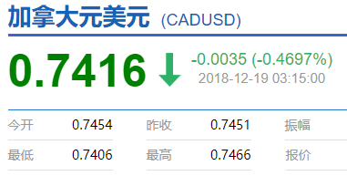
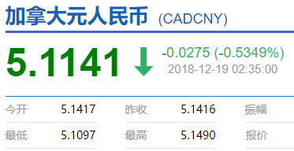

# 无标题

**链接地址:** http://mp.weixin.qq.com/s?__biz=MzI2NTE1ODgwOQ==&mid=2649605680&idx=2&sn=aeb171ec2dbca1c1d63780226258e90b&chksm=f2b8cfc6c5cf46d0efb6718d0fad82916a2bb6ae71411c2cb0e09eb9f4af704864780a358572&mpshare=1&scene=2&srcid=#rd
**作者:** 
**获取时间:** 2025/8/28 20:57:57
**图片数量:** 20

---

## 原始HTML内容

<section style="box-sizing: border-box;"><section class="V5" style="box-sizing: border-box;" powered-by="xiumi.us"><section style="margin-right: 0%;margin-left: 0%;box-sizing: border-box;"><section style="display: inline-block;vertical-align: middle;width: 80%;box-sizing: border-box;"><section class="V5" style="box-sizing: border-box;" powered-by="xiumi.us"><section style="margin-top: 10px;margin-bottom: 10px;text-align: center;box-sizing: border-box;"><section style="display: inline-block;box-sizing: border-box;"><section style="max-width: 100%;font-size: 0px;padding-bottom: 3px;box-sizing: border-box;"><section style="display: inline-block;vertical-align: middle;box-sizing: border-box;"><section style="width: 5px;height: 1px;background-color: rgb(217, 217, 217);box-sizing: border-box;"></section><section style="width: 1px;height: 5px;margin-top: -3px;margin-right: auto;margin-left: auto;background-color: rgb(217, 217, 217);box-sizing: border-box;"></section></section><section style="margin-top: -1px;margin-right: -5px;margin-left: -5px;width: 100%;display: inline-block;vertical-align: middle;padding-right: 8px;padding-left: 8px;box-sizing: border-box;"><section style="width: 100%;height: 1px;background-color: rgb(217, 217, 217);box-sizing: border-box;"></section></section><section style="display: inline-block;vertical-align: middle;box-sizing: border-box;"><section style="width: 5px;height: 1px;background-color: rgb(217, 217, 217);box-sizing: border-box;"></section><section style="width: 1px;height: 5px;margin-top: -3px;margin-right: auto;margin-left: auto;background-color: rgb(217, 217, 217);box-sizing: border-box;"></section></section></section><section style="padding-left: 15px;padding-right: 15px;color: rgb(161, 161, 161);font-size: 14px;box-sizing: border-box;">
点击上方<strong style="box-sizing: border-box;">蓝字</strong>关注我们哟~
</section><section style="max-width: 100%;font-size: 0px;box-sizing: border-box;"><section style="display: inline-block;vertical-align: middle;box-sizing: border-box;"><section style="width: 5px;height: 1px;background-color: rgb(217, 217, 217);box-sizing: border-box;"></section><section style="width: 1px;height: 5px;margin-top: -3px;margin-right: auto;margin-left: auto;background-color: rgb(217, 217, 217);box-sizing: border-box;"></section></section><section style="margin-top: -1px;margin-right: -5px;margin-left: -5px;width: 100%;display: inline-block;vertical-align: middle;padding-right: 8px;padding-left: 8px;box-sizing: border-box;"><section style="width: 100%;height: 1px;background-color: rgb(217, 217, 217);box-sizing: border-box;"></section></section><section style="display: inline-block;vertical-align: middle;box-sizing: border-box;"><section style="width: 5px;height: 1px;background-color: rgb(217, 217, 217);box-sizing: border-box;"></section><section style="width: 1px;height: 5px;margin-top: -3px;margin-right: auto;margin-left: auto;background-color: rgb(217, 217, 217);box-sizing: border-box;"></section></section></section></section></section></section></section><section style="display: inline-block;vertical-align: middle;width: 20%;box-sizing: border-box;"><section class="V5" style="box-sizing: border-box;" powered-by="xiumi.us"><section style="text-align: center;margin: -10px 0% 10px;box-sizing: border-box;"><section style="max-width: 100%;vertical-align: middle;display: inline-block;width: 100%;box-sizing: border-box;"></section></section></section></section></section></section><section class="V5" style="box-sizing: border-box;" powered-by="xiumi.us"><section style="margin: 10px 0%;box-sizing: border-box;"><section style="display: inline-block;width: 100%;vertical-align: top;box-sizing: border-box;"><section class="V5" style="box-sizing: border-box;" powered-by="xiumi.us"><section style="box-sizing: border-box;"><section style="display: inline-block;vertical-align: bottom;width: 75%;padding-right: 10px;box-sizing: border-box;"><section class="V5" style="box-sizing: border-box;" powered-by="xiumi.us"><section style="margin: 10px 0% 3px;box-sizing: border-box;"><section style="display: inline-block;vertical-align: middle;box-sizing: border-box;"><section style="display: inline-block;vertical-align: bottom;padding-left: 5px;padding-right: 5px;line-height: 1.2em;margin-bottom: 2px;color: rgba(80, 182, 201, 0.72);box-sizing: border-box;">
<strong style="box-sizing: border-box;">仔细看下图，有惊喜！</strong>
</section><section style="max-width: 100%;display: inline-block;vertical-align: bottom;width: 1.6em;box-sizing: border-box;"></section></section></section></section></section><section style="display: inline-block;vertical-align: bottom;width: 25%;box-sizing: border-box;"><section class="V5" style="box-sizing: border-box;" powered-by="xiumi.us"><section style="margin-right: 0%;margin-bottom: 3px;margin-left: 0%;text-align: right;box-sizing: border-box;"><section style="display: inline-block;border-bottom: 0.15em solid rgba(80, 182, 201, 0.72);padding-bottom: 3px;box-sizing: border-box;"><section style="display: inline-block;padding: 3px;border-bottom: 0.15em solid rgba(80, 182, 201, 0.72);font-size: 12px;line-height: 1.4;color: rgb(255, 143, 47);box-sizing: border-box;">
<strong style="box-sizing: border-box;">金主大大</strong>
</section></section></section></section></section></section></section><section class="V5" style="box-sizing: border-box;" powered-by="xiumi.us"><section style="margin-right: 0%;margin-left: 0%;box-sizing: border-box;"><section style="background-color: rgba(80, 182, 201, 0.72);height: 2px;box-sizing: border-box;"></section></section></section></section></section></section><section class="V5" style="box-sizing: border-box;" powered-by="xiumi.us"><section style="text-align: center;margin-top: 10px;margin-bottom: 10px;box-sizing: border-box;"><section style="max-width: 100%;vertical-align: middle;display: inline-block;box-sizing: border-box;"></section></section></section><section class="V5" style="box-sizing: border-box;" powered-by="xiumi.us"><section style="text-align: center;margin-top: 10px;margin-bottom: 10px;box-sizing: border-box;"><section style="max-width: 100%;vertical-align: middle;display: inline-block;box-sizing: border-box;"></section></section></section><section class="V5" style="box-sizing: border-box;" powered-by="xiumi.us"><section style="text-align: center;margin-top: 10px;margin-bottom: 10px;box-sizing: border-box;"><section style="max-width: 100%;vertical-align: middle;display: inline-block;box-sizing: border-box;"></section></section></section><section class="V5" style="box-sizing: border-box;" powered-by="xiumi.us"><section style="text-align: center;margin-top: 10px;margin-bottom: 10px;box-sizing: border-box;"><section style="max-width: 100%;vertical-align: middle;display: inline-block;box-sizing: border-box;"></section></section></section><section class="V5" style="box-sizing: border-box;" powered-by="xiumi.us"><section style="text-align: center;margin-top: 10px;margin-bottom: 10px;box-sizing: border-box;"><section style="max-width: 100%;vertical-align: middle;display: inline-block;box-sizing: border-box;"><svg xmlns="http://www.w3.org/2000/svg" x="0px" y="0px" viewBox="0 0 902.1 38.2" style="vertical-align: middle;max-width: 100%;box-sizing: border-box;" width="902.1"><g style="box-sizing: border-box;"><path style="box-sizing: border-box;" d="M18.4,1.4c0.9-1.9,2.4-1.9,3.4,0l3.4,6.9c0.9,1.9,3.4,3.7,5.4,4l7.6,1.1c2.1,0.3,2.5,1.7,1,3.2   l-5.5,5.4c-1.5,1.5-2.4,4.3-2.1,6.4l1.3,7.6c0.4,2.1-0.9,2.9-2.7,2l-6.8-3.6c-1.8-1-4.9-1-6.7,0l-6.8,3.6c-1.9,1-3.1,0.1-2.7-2   l1.3-7.6c0.4-2.1-0.6-4.9-2.1-6.4l-5.5-5.4c-1.5-1.5-1-2.9,1-3.2l7.6-1.1c2.1-0.3,4.5-2.1,5.4-4L18.4,1.4z" fill="rgb(178, 243, 230)"></path><path style="box-sizing: border-box;" d="M90.6,5.4c0.7-1.4,1.9-1.4,2.6,0l2.6,5.3c0.7,1.4,2.6,2.8,4.2,3.1l5.9,0.9c1.6,0.2,2,1.3,0.8,2.5   l-4.2,4.1c-1.2,1.1-1.9,3.3-1.6,4.9l1,5.8c0.3,1.6-0.7,2.3-2.1,1.5l-5.2-2.8c-1.4-0.8-3.8-0.8-5.2,0L84,33.6   c-1.4,0.8-2.4,0.1-2.1-1.5l1-5.8c0.3-1.6-0.5-3.8-1.6-4.9l-4.2-4.1c-1.2-1.1-0.8-2.2,0.8-2.5l5.9-0.9c1.6-0.2,3.5-1.6,4.2-3.1   L90.6,5.4z" fill="rgb(190, 204, 246)"></path><path style="box-sizing: border-box;" d="M162.6,7.5c0.6-1.2,1.6-1.2,2.2,0l2.2,4.5c0.6,1.2,2.2,2.4,3.6,2.6l5,0.7c1.4,0.2,1.7,1.1,0.7,2.1   l-3.6,3.5c-1,1-1.6,2.9-1.4,4.2l0.9,5c0.2,1.4-0.6,1.9-1.8,1.3l-4.5-2.4c-1.2-0.6-3.2-0.6-4.4,0l-4.5,2.4c-1.2,0.6-2,0.1-1.8-1.3   l0.9-5c0.2-1.4-0.4-3.3-1.4-4.2l-3.6-3.5c-1-1-0.7-1.9,0.7-2.1l5-0.7c1.4-0.2,3-1.4,3.6-2.6L162.6,7.5z" fill="rgb(150, 208, 240)"></path><path style="box-sizing: border-box;" d="M60.1,19.1c0,2.3-1.9,4.2-4.2,4.2c-2.3,0-4.2-1.9-4.2-4.2s1.9-4.2,4.2-4.2   C58.3,14.9,60.1,16.8,60.1,19.1z" fill="rgb(218, 240, 224)"></path><path style="box-sizing: border-box;" d="M203.8,19.1c0,2.3-1.9,4.2-4.2,4.2c-2.3,0-4.2-1.9-4.2-4.2s1.9-4.2,4.2-4.2   C201.9,14.9,203.8,16.8,203.8,19.1z" fill="rgb(218, 240, 224)"></path><path style="box-sizing: border-box;" d="M130.9,19.1c0,1.7-1.4,3.1-3.1,3.1c-1.7,0-3.1-1.4-3.1-3.1c0-1.7,1.4-3.1,3.1-3.1   C129.5,16.1,130.9,17.4,130.9,19.1z" fill="rgb(218, 240, 224)"></path><path style="box-sizing: border-box;" d="M233.9,1.4c0.9-1.9,2.4-1.9,3.4,0l3.4,6.9c0.9,1.9,3.4,3.7,5.4,4l7.6,1.1c2.1,0.3,2.5,1.7,1,3.2   l-5.5,5.4c-1.5,1.5-2.4,4.3-2.1,6.4l1.3,7.6c0.4,2.1-0.9,2.9-2.7,2l-6.8-3.6c-1.8-1-4.9-1-6.7,0l-6.8,3.6c-1.9,1-3.1,0.1-2.7-2   l1.3-7.6c0.4-2.1-0.6-4.9-2.1-6.4l-5.5-5.4c-1.5-1.5-1-2.9,1-3.2l7.6-1.1c2.1-0.3,4.5-2.1,5.4-4L233.9,1.4z" fill="rgb(178, 243, 230)"></path><path style="box-sizing: border-box;" d="M306.1,5.4c0.7-1.4,1.9-1.4,2.6,0l2.6,5.3c0.7,1.4,2.6,2.8,4.2,3.1l5.9,0.9c1.6,0.2,2,1.3,0.8,2.5   l-4.2,4.1c-1.2,1.1-1.9,3.3-1.6,4.9l1,5.8c0.3,1.6-0.7,2.3-2.1,1.5l-5.2-2.8c-1.4-0.8-3.8-0.8-5.2,0l-5.2,2.8   c-1.4,0.8-2.4,0.1-2.1-1.5l1-5.8c0.3-1.6-0.4-3.8-1.6-4.9l-4.2-4.1c-1.2-1.1-0.8-2.2,0.8-2.5l5.9-0.9c1.6-0.2,3.5-1.6,4.2-3.1   L306.1,5.4z" fill="rgb(190, 204, 246)"></path><path style="box-sizing: border-box;" d="M378.1,7.5c0.6-1.2,1.6-1.2,2.2,0l2.2,4.5c0.6,1.2,2.2,2.4,3.6,2.6l5,0.7c1.4,0.2,1.7,1.1,0.7,2.1   l-3.6,3.5c-1,1-1.6,2.9-1.4,4.2l0.9,5c0.2,1.4-0.6,1.9-1.8,1.3l-4.5-2.4c-1.2-0.6-3.2-0.6-4.4,0l-4.5,2.4c-1.2,0.6-2,0.1-1.8-1.3   l0.9-5c0.2-1.4-0.4-3.3-1.4-4.2l-3.6-3.5c-1-1-0.7-1.9,0.7-2.1l5-0.7c1.4-0.2,3-1.4,3.6-2.6L378.1,7.5z" fill="rgb(150, 208, 240)"></path><path style="box-sizing: border-box;" d="M275.7,19.1c0,2.3-1.9,4.2-4.2,4.2c-2.3,0-4.2-1.9-4.2-4.2s1.9-4.2,4.2-4.2   C273.8,14.9,275.7,16.8,275.7,19.1z" fill="rgb(218, 240, 224)"></path><path style="box-sizing: border-box;" d="M419.3,19.1c0,2.3-1.9,4.2-4.2,4.2c-2.3,0-4.2-1.9-4.2-4.2s1.9-4.2,4.2-4.2   C417.5,14.9,419.3,16.8,419.3,19.1z" fill="rgb(218, 240, 224)"></path><path style="box-sizing: border-box;" d="M346.4,19.1c0,1.7-1.4,3.1-3.1,3.1c-1.7,0-3.1-1.4-3.1-3.1c0-1.7,1.4-3.1,3.1-3.1   C345,16.1,346.4,17.4,346.4,19.1z" fill="rgb(218, 240, 224)"></path><path style="box-sizing: border-box;" d="M449.4,1.4c0.9-1.9,2.4-1.9,3.4,0l3.4,6.9c0.9,1.9,3.4,3.7,5.4,4l7.6,1.1c2.1,0.3,2.5,1.7,1,3.2   l-5.5,5.4c-1.5,1.5-2.4,4.3-2.1,6.4l1.3,7.6c0.4,2.1-0.9,2.9-2.7,2l-6.8-3.6c-1.8-1-4.9-1-6.7,0l-6.8,3.6c-1.9,1-3.1,0.1-2.7-2   l1.3-7.6c0.4-2.1-0.6-4.9-2.1-6.4l-5.5-5.4c-1.5-1.5-1-2.9,1-3.2l7.6-1.1c2.1-0.3,4.5-2.1,5.4-4L449.4,1.4z" fill="rgb(178, 243, 230)"></path><path style="box-sizing: border-box;" d="M521.6,5.4c0.7-1.4,1.9-1.4,2.6,0l2.6,5.3c0.7,1.4,2.6,2.8,4.2,3.1l5.9,0.9c1.6,0.2,2,1.3,0.8,2.5   l-4.2,4.1c-1.2,1.1-1.9,3.3-1.6,4.9l1,5.8c0.3,1.6-0.7,2.3-2.1,1.5l-5.2-2.8c-1.4-0.8-3.8-0.8-5.2,0l-5.2,2.8   c-1.4,0.8-2.4,0.1-2.1-1.5l1-5.8c0.3-1.6-0.5-3.8-1.6-4.9l-4.2-4.1c-1.2-1.1-0.8-2.2,0.8-2.5l5.9-0.9c1.6-0.2,3.5-1.6,4.2-3.1   L521.6,5.4z" fill="rgb(190, 204, 246)"></path><path style="box-sizing: border-box;" d="M593.6,7.5c0.6-1.2,1.6-1.2,2.2,0l2.2,4.5c0.6,1.2,2.2,2.4,3.6,2.6l5,0.7c1.4,0.2,1.7,1.1,0.7,2.1   l-3.6,3.5c-1,1-1.6,2.9-1.4,4.2l0.9,5c0.2,1.4-0.6,1.9-1.8,1.3l-4.5-2.4c-1.2-0.6-3.2-0.6-4.4,0l-4.5,2.4c-1.2,0.6-2,0.1-1.8-1.3   l0.9-5c0.2-1.4-0.4-3.3-1.4-4.2l-3.6-3.5c-1-1-0.7-1.9,0.7-2.1l5-0.7c1.4-0.2,3-1.4,3.6-2.6L593.6,7.5z" fill="rgb(150, 208, 240)"></path><path style="box-sizing: border-box;" d="M491.2,19.1c0,2.3-1.9,4.2-4.2,4.2c-2.3,0-4.2-1.9-4.2-4.2s1.9-4.2,4.2-4.2   C489.3,14.9,491.2,16.8,491.2,19.1z" fill="rgb(218, 240, 224)"></path><path style="box-sizing: border-box;" d="M634.9,19.1c0,2.3-1.9,4.2-4.2,4.2c-2.3,0-4.2-1.9-4.2-4.2s1.9-4.2,4.2-4.2   C633,14.9,634.9,16.8,634.9,19.1z" fill="rgb(218, 240, 224)"></path><path style="box-sizing: border-box;" d="M561.9,19.1c0,1.7-1.4,3.1-3.1,3.1c-1.7,0-3.1-1.4-3.1-3.1c0-1.7,1.4-3.1,3.1-3.1   C560.5,16.1,561.9,17.4,561.9,19.1z" fill="rgb(218, 240, 224)"></path><path style="box-sizing: border-box;" d="M664.9,1.4c0.9-1.9,2.4-1.9,3.4,0l3.4,6.9c0.9,1.9,3.4,3.7,5.4,4l7.6,1.1c2.1,0.3,2.5,1.7,1,3.2   l-5.5,5.4c-1.5,1.5-2.4,4.3-2.1,6.4l1.3,7.6c0.4,2.1-0.9,2.9-2.7,2l-6.8-3.6c-1.8-1-4.9-1-6.7,0l-6.8,3.6c-1.9,1-3.1,0.1-2.7-2   l1.3-7.6c0.4-2.1-0.6-4.9-2.1-6.4l-5.5-5.4c-1.5-1.5-1-2.9,1-3.2l7.6-1.1c2.1-0.3,4.5-2.1,5.4-4L664.9,1.4z" fill="rgb(178, 243, 230)"></path><path style="box-sizing: border-box;" d="M737.1,5.4c0.7-1.4,1.9-1.4,2.6,0l2.6,5.3c0.7,1.4,2.6,2.8,4.2,3.1l5.9,0.9c1.6,0.2,2,1.3,0.8,2.5   l-4.2,4.1c-1.2,1.1-1.9,3.3-1.6,4.9l1,5.8c0.3,1.6-0.7,2.3-2.1,1.5l-5.2-2.8c-1.4-0.8-3.8-0.8-5.2,0l-5.2,2.8   c-1.4,0.8-2.4,0.1-2.1-1.5l1-5.8c0.3-1.6-0.5-3.8-1.6-4.9l-4.2-4.1c-1.2-1.1-0.8-2.2,0.8-2.5l5.9-0.9c1.6-0.2,3.5-1.6,4.2-3.1   L737.1,5.4z" fill="rgb(190, 204, 246)"></path><path style="box-sizing: border-box;" d="M809.2,7.5c0.6-1.2,1.6-1.2,2.2,0l2.2,4.5c0.6,1.2,2.2,2.4,3.6,2.6l5,0.7c1.4,0.2,1.7,1.1,0.7,2.1   l-3.6,3.5c-1,1-1.6,2.9-1.4,4.2l0.9,5c0.2,1.4-0.6,1.9-1.8,1.3l-4.5-2.4c-1.2-0.6-3.2-0.6-4.4,0l-4.5,2.4c-1.2,0.6-2,0.1-1.8-1.3   l0.9-5c0.2-1.4-0.4-3.3-1.4-4.2l-3.6-3.5c-1-1-0.7-1.9,0.7-2.1l5-0.7c1.4-0.2,3-1.4,3.6-2.6L809.2,7.5z" fill="rgb(150, 208, 240)"></path><path style="box-sizing: border-box;" d="M706.7,19.1c0,2.3-1.9,4.2-4.2,4.2c-2.3,0-4.2-1.9-4.2-4.2s1.9-4.2,4.2-4.2   C704.8,14.9,706.7,16.8,706.7,19.1z" fill="rgb(218, 240, 224)"></path><path style="box-sizing: border-box;" d="M850.4,19.1c0,2.3-1.9,4.2-4.2,4.2c-2.3,0-4.2-1.9-4.2-4.2s1.9-4.2,4.2-4.2   C848.5,14.9,850.4,16.8,850.4,19.1z" fill="rgb(218, 240, 224)"></path><path style="box-sizing: border-box;" d="M777.4,19.1c0,1.7-1.4,3.1-3.1,3.1c-1.7,0-3.1-1.4-3.1-3.1c0-1.7,1.4-3.1,3.1-3.1   C776,16.1,777.4,17.4,777.4,19.1z" fill="rgb(218, 240, 224)"></path><path style="box-sizing: border-box;" d="M880.4,1.4c0.9-1.9,2.4-1.9,3.4,0l3.4,6.9c0.9,1.9,3.4,3.7,5.4,4l7.6,1.1c2.1,0.3,2.5,1.7,1,3.2   l-5.5,5.4c-1.5,1.5-2.4,4.3-2.1,6.4l1.3,7.6c0.4,2.1-0.9,2.9-2.7,2l-6.8-3.6c-1.8-1-4.9-1-6.7,0l-6.8,3.6c-1.8,1-3.1,0.1-2.7-2   l1.3-7.6c0.4-2.1-0.6-4.9-2.1-6.4l-5.5-5.4c-1.5-1.5-1-2.9,1-3.2l7.6-1.1c2.1-0.3,4.5-2.1,5.4-4L880.4,1.4z" fill="rgb(178, 243, 230)"></path></g></svg></section></section></section><section class="V5" style="box-sizing: border-box;" powered-by="xiumi.us"><section style="box-sizing: border-box;"><section style="text-align: center;box-sizing: border-box;">
一转眼，加元的严冬又来了。 

 

　　自从本月初加拿大央行宣布放缓加息步伐之后，加元汇率就又站上了跳水高台。分析人士指出，中短期来看，加元兑美元及人民币汇率仍面临着大跌的风险。

 

 

　　12月6日，加拿大央行行长宣布维持利率不变的话音刚落，加元兑美元汇率就暴跌近百点，当天收盘时跌至<strong style="max-width: 100%;box-sizing: border-box !important;overflow-wrap: break-word !important;">0.745美元</strong>的低位，创出了一年半的新低。

 

　　可短短的十多天之后再看，那时居然还是加元汇率的高点啊！

 

 

　　看看今天的加元兑美元汇率，简直感觉欲哭无泪啊～

 

 

　　兑人民币汇率更加惨不忍睹，8月还曾经飙到5.32左右的高点，转眼，这是又要破5的节奏啊～

 

　　2018年，加拿大的日子真是不好过！

 

 

　　先是川普翻脸如翻书，把贸易战第一枪直接打在了了自己的老邻居、盟友加拿大身上。

 

　　6月的G7峰会，川普更是直接手撕特鲁多，发推公开叫骂小土豆是个“伪君子”和“孬种”。之后白宫重量级高官更是口出狂言，诅咒特鲁多要“<strong style="margin-right: auto;margin-left: auto;max-width: 100%;font-family: 微软雅黑, Arial, Helvetica, sans-serif;box-sizing: border-box !important;overflow-wrap: break-word !important;">下地狱</strong>”。

 

 

　　好不容易等到10月，美、加、墨三国达成了一份新的三边贸易协定《美墨加协议》 （USMCA）。

 

　　本以为好日子总算应该来了，结果接下来又是噩耗连连。

 

 

<strong style="max-width: 100%;box-sizing: border-box !important;overflow-wrap: break-word !important;">　　80%的城市房价都在跌，大温楼市销量几近腰斩</strong>

 

　　加拿大国家银行(NationalBank)上个月公布的最新房价指数显示，它所调查的26个大中城市中，只有5个城市还处于峰值，其它占比80%的21个城市，包括<strong style="max-width: 100%;box-sizing: border-box !important;overflow-wrap: break-word !important;">温哥华、多伦多、维多利亚等，房价指数均已从高峰值回落</strong>。

　12月4日，大温地产局（REBGV）发布的最新数据显示，11月大温各类住宅销售总量仅为1608套，较去年同期暴<strong style="max-width: 100%;box-sizing: border-box !important;overflow-wrap: break-word !important;">跌42.5%</strong>，<strong style="max-width: 100%;box-sizing: border-box !important;overflow-wrap: break-word !important;">几近腰斩</strong>。

 

　　1608套的数字与10月相比也下跌了18.2%，更低于10年平均数字的34.7%，是<strong style="margin-right: auto;margin-left: auto;max-width: 100%;box-sizing: border-box !important;overflow-wrap: break-word !important;">自2008年金融危机以来销量最低的11月</strong>。

 

 

<strong style="max-width: 100%;box-sizing: border-box !important;overflow-wrap: break-word !important;">　　债台高筑：温哥华、多伦多人每赚一块欠债两块</strong>

 

　　加拿大统计局上周五（12月14日）公布的数据显示，今年第三季度加拿大人的家庭信贷市场债务和税后收入的比例比第二季度再度升高，达到177.5%。

 

　　这意味着加拿大人每拥有100加元的可支配收入，就有将近178加元的债务。信贷市场债务包括信用卡债务，房贷和其他贷款。

 

 

　　大城市的负债水平更加恐怖，温哥华居民的债务和收入比的平均高达<strong style="max-width: 100%;box-sizing: border-box !important;overflow-wrap: break-word !important;">242%</strong>；在多伦多，这一数字也飙升到<strong style="max-width: 100%;box-sizing: border-box !important;overflow-wrap: break-word !important;">208%</strong>。

 

　　压力山大啊。

<strong style="max-width: 100%;box-sizing: border-box !important;overflow-wrap: break-word !important;">　原油再度重挫，油价从86美元跌到60以下</strong>

 

　　坏消息一个接着一个。这一轮原油价格上涨的时候，加拿大因为油砂矿成本高和油管运输问题就没赚到什么钱。

 

　　11月开始，国际油价屡次下跌7%，8%，6%，从<strong style="max-width: 100%;box-sizing: border-box !important;overflow-wrap: break-word !important;">86美元的高位下跌到目前的不到60美元（布油）</strong>，创造了<strong style="max-width: 100%;box-sizing: border-box !important;overflow-wrap: break-word !important;">油价34年来最快下跌速度</strong>。

 

 

　　石油业的损失无疑将加大GDP的下行压力，而对于号称“油元”的加元汇率来说，走势除了向下也别无选择。

 

<strong style="max-width: 100%;box-sizing: border-box !important;overflow-wrap: break-word !important;">　　股市跳水，加元跌起来没商量</strong>

 

　　在近期美国股市连续暴跌的情况下，加拿大股市也是跌声一片，已创出近两年的新低。

 

　　加元对美元的汇率也随之进一步下跌。

 

　　FXTechstrategy的分析师Mohammed Isah的最新撰文指出，在经过连续4周的收盘上涨行情之后，预计接下来美元兑加元汇率仍将进一步保持中期上涨势头。

 

　　预计美元兑加元汇率很有可能突破1.3550，甚至<strong style="max-width: 100%;box-sizing: border-box !important;overflow-wrap: break-word !important;">逼近1.365大关</strong>。

 

　　加拿大多伦多道明银行(TD)周二(12月18日)发布的报告也指出，对加元的短期表现进一步看空。

 

 

　　雪上加霜的是，因为孟晚舟事件，原来似乎不错的加中关系一下子下降到冰点。

 

　　据CBC报道，此前计划来加拿大投资设厂的中国知名汽车制造厂商已暂停原计划，来加拿大旅游的中国游客也纷纷更改了行期。

 

　　加拿大鹅更是率先躺枪，股价一度下跌20%。

 

 

　　2018年就要结束了，只希望春光不远，好消息能一个接一个地前来。

 

　　至于加元汇率兑人民币又要重回4时代这样的事情，还是不要发生的好～

文章来源：温哥华港湾
</section></section></section><section class="V5" style="box-sizing: border-box;" powered-by="xiumi.us"><section style="text-align: center;box-sizing: border-box;"> </section></section><section class="V5" style="box-sizing: border-box;" powered-by="xiumi.us"><section style="box-sizing: border-box;"><section style="box-sizing: border-box;">
 
</section></section></section><section class="V5" style="box-sizing: border-box;" powered-by="xiumi.us"><section style="box-sizing: border-box;"><section style="box-sizing: border-box;">
 
</section></section></section><section class="V5" style="box-sizing: border-box;" powered-by="xiumi.us"><section style="margin: 40px 0% 10px;text-align: center;box-sizing: border-box;"><section style="display: inline-block;width: 90%;border-width: 1px;border-style: dotted;border-color: rgba(80, 182, 201, 0.72);padding: 10px;border-radius: 0px;box-sizing: border-box;"><section class="V5" style="box-sizing: border-box;" powered-by="xiumi.us"><section style="transform: translate3d(20px, 0px, 0px);text-align: left;font-size: 11px;margin-top: -55px;margin-right: 0%;margin-left: 0%;box-sizing: border-box;"><section style="box-sizing: border-box;width: 7em;height: 7em;display: inline-block;vertical-align: bottom;border-radius: 100%;border-width: 5px;border-style: none;border-color: rgba(80, 182, 201, 0.72);background-position: center center;background-repeat: no-repeat;background-size: cover;background-image: url(&quot;https://mmbiz.qpic.cn/mmbiz_jpg/D1nJqnhkPyIxA1OLrLia93Wv6gqmKYe4OIs1icvqRnmxyNuicdrFSiba8S05zlOP1UrLKE44uCyicw42tQ4rv0ibAiapQ/640?wx_fmt=jpeg&quot;);"><section style="width: 100%;height: 100%;overflow: hidden;line-height: 0;box-sizing: border-box;"></section></section></section></section><section class="V5" style="box-sizing: border-box;" powered-by="xiumi.us"><section style="box-sizing: border-box;"><section class="group-empty" style="display: inline-block;vertical-align: top;width: 38.2%;box-sizing: border-box;height: 1px;"></section><section style="display: inline-block;vertical-align: top;width: 61.8%;box-sizing: border-box;"><section class="V5" style="box-sizing: border-box;" powered-by="xiumi.us"><section style="margin-right: 0%;margin-left: 0%;box-sizing: border-box;"><section style="font-size: 18px;color: rgb(67, 103, 117);line-height: 1.6;letter-spacing: 1px;box-sizing: border-box;">
<strong style="box-sizing: border-box;">埃德蒙顿微生活</strong>
</section></section></section><section class="V5" style="box-sizing: border-box;" powered-by="xiumi.us"><section style="margin-top: 0.5em;margin-bottom: 0.5em;box-sizing: border-box;"><section style="background-color: rgba(80, 182, 201, 0.72);height: 1px;box-sizing: border-box;"></section></section></section></section></section></section><section class="V5" style="box-sizing: border-box;" powered-by="xiumi.us"><section style="box-sizing: border-box;"><section style="text-align: justify;font-size: 14px;color: rgba(62, 62, 62, 0.72);letter-spacing: 2px;box-sizing: border-box;">
<strong style="box-sizing: border-box;">关心埃德蒙顿民生，</strong>

<strong style="box-sizing: border-box;">关注埃德蒙顿的发展。</strong>

 

埃德蒙顿微生活是“吃喝玩乐埃德蒙顿”旗下，为埃德蒙顿地区的居民提供每日最新的吃喝玩乐、工作学习、商业投资的媒体平台 。
</section></section></section><section class="V5" style="box-sizing: border-box;" powered-by="xiumi.us"><section style="box-sizing: border-box;"><section style="text-align: left;box-sizing: border-box;">
 
</section></section></section><section class="V5" style="box-sizing: border-box;" powered-by="xiumi.us"><section style="box-sizing: border-box;"><section style="display: inline-block;vertical-align: middle;width: 61.8%;box-sizing: border-box;"><section class="V5" style="box-sizing: border-box;" powered-by="xiumi.us"><section style="box-sizing: border-box;"><section style="text-align: justify;font-size: 12px;color: rgba(62, 62, 62, 0.37);line-height: 1.9;letter-spacing: 0px;box-sizing: border-box;">
我们的目标是以最新、最快、最及时的方式 报道埃德蒙顿的新鲜事 。 
</section></section></section></section><section style="display: inline-block;vertical-align: middle;width: 38.2%;box-sizing: border-box;"><section class="V5" style="box-sizing: border-box;" powered-by="xiumi.us"><section style="margin-right: 0%;margin-left: 0%;box-sizing: border-box;"><section style="max-width: 100%;vertical-align: middle;display: inline-block;width: 70%;box-sizing: border-box;"></section></section></section></section></section></section></section></section></section></section>
 

---

## 纯文本内容

点击上方蓝字关注我们哟~仔细看下图，有惊喜！金主大大一转眼，加元的严冬又来了。　　自从本月初加拿大央行宣布放缓加息步伐之后，加元汇率就又站上了跳水高台。分析人士指出，中短期来看，加元兑美元及人民币汇率仍面临着大跌的风险。　　12月6日，加拿大央行行长宣布维持利率不变的话音刚落，加元兑美元汇率就暴跌近百点，当天收盘时跌至0.745美元的低位，创出了一年半的新低。　　可短短的十多天之后再看，那时居然还是加元汇率的高点啊！　　看看今天的加元兑美元汇率，简直感觉欲哭无泪啊～　　兑人民币汇率更加惨不忍睹，8月还曾经飙到5.32左右的高点，转眼，这是又要破5的节奏啊～　　2018年，加拿大的日子真是不好过！　　先是川普翻脸如翻书，把贸易战第一枪直接打在了了自己的老邻居、盟友加拿大身上。　　6月的G7峰会，川普更是直接手撕特鲁多，发推公开叫骂小土豆是个“伪君子”和“孬种”。之后白宫重量级高官更是口出狂言，诅咒特鲁多要“下地狱”。　　好不容易等到10月，美、加、墨三国达成了一份新的三边贸易协定《美墨加协议》 （USMCA）。　　本以为好日子总算应该来了，结果接下来又是噩耗连连。　　80%的城市房价都在跌，大温楼市销量几近腰斩　　加拿大国家银行(NationalBank)上个月公布的最新房价指数显示，它所调查的26个大中城市中，只有5个城市还处于峰值，其它占比80%的21个城市，包括温哥华、多伦多、维多利亚等，房价指数均已从高峰值回落。　12月4日，大温地产局（REBGV）发布的最新数据显示，11月大温各类住宅销售总量仅为1608套，较去年同期暴跌42.5%，几近腰斩。　　1608套的数字与10月相比也下跌了18.2%，更低于10年平均数字的34.7%，是自2008年金融危机以来销量最低的11月。　　债台高筑：温哥华、多伦多人每赚一块欠债两块　　加拿大统计局上周五（12月14日）公布的数据显示，今年第三季度加拿大人的家庭信贷市场债务和税后收入的比例比第二季度再度升高，达到177.5%。　　这意味着加拿大人每拥有100加元的可支配收入，就有将近178加元的债务。信贷市场债务包括信用卡债务，房贷和其他贷款。　　大城市的负债水平更加恐怖，温哥华居民的债务和收入比的平均高达242%；在多伦多，这一数字也飙升到208%。　　压力山大啊。　原油再度重挫，油价从86美元跌到60以下　　坏消息一个接着一个。这一轮原油价格上涨的时候，加拿大因为油砂矿成本高和油管运输问题就没赚到什么钱。　　11月开始，国际油价屡次下跌7%，8%，6%，从86美元的高位下跌到目前的不到60美元（布油），创造了油价34年来最快下跌速度。　　石油业的损失无疑将加大GDP的下行压力，而对于号称“油元”的加元汇率来说，走势除了向下也别无选择。　　股市跳水，加元跌起来没商量　　在近期美国股市连续暴跌的情况下，加拿大股市也是跌声一片，已创出近两年的新低。　　加元对美元的汇率也随之进一步下跌。　　FXTechstrategy的分析师Mohammed Isah的最新撰文指出，在经过连续4周的收盘上涨行情之后，预计接下来美元兑加元汇率仍将进一步保持中期上涨势头。　　预计美元兑加元汇率很有可能突破1.3550，甚至逼近1.365大关。　　加拿大多伦多道明银行(TD)周二(12月18日)发布的报告也指出，对加元的短期表现进一步看空。　　雪上加霜的是，因为孟晚舟事件，原来似乎不错的加中关系一下子下降到冰点。　　据CBC报道，此前计划来加拿大投资设厂的中国知名汽车制造厂商已暂停原计划，来加拿大旅游的中国游客也纷纷更改了行期。　　加拿大鹅更是率先躺枪，股价一度下跌20%。　　2018年就要结束了，只希望春光不远，好消息能一个接一个地前来。　　至于加元汇率兑人民币又要重回4时代这样的事情，还是不要发生的好～文章来源：温哥华港湾埃德蒙顿微生活关心埃德蒙顿民生，关注埃德蒙顿的发展。埃德蒙顿微生活是“吃喝玩乐埃德蒙顿”旗下，为埃德蒙顿地区的居民提供每日最新的吃喝玩乐、工作学习、商业投资的媒体平台 。我们的目标是以最新、最快、最及时的方式 报道埃德蒙顿的新鲜事 。

---

## 图片列表

-  (原始链接: https://mmbiz.qpic.cn/mmbiz_gif/D1nJqnhkPyIxA1OLrLia93Wv6gqmKYe4OVAqlvJAWgkUppV92NkWB7b0VPxUHRqOzDxVv7RiaAw63hGvjkWfiadag/640?wx_fmt=gif)
-  (原始链接: https://mmbiz.qpic.cn/mmbiz_gif/D1nJqnhkPyIxA1OLrLia93Wv6gqmKYe4O3xUs2dqml3Zpab41C4BJDpsptSTiaZtHZ30lFh51ZLSD5gjbvkpRQhQ/640?wx_fmt=gif)
-  (原始链接: https://mmbiz.qpic.cn/mmbiz_jpg/D1nJqnhkPyIxA1OLrLia93Wv6gqmKYe4ORr5DFnOqYJR4nDewafxE6JFmjFiaicgxJib1gwcpzicibeXGU8WoV5Xk5Nw/640?wx_fmt=jpeg)
-  (原始链接: https://mmbiz.qpic.cn/mmbiz_jpg/D1nJqnhkPyIxA1OLrLia93Wv6gqmKYe4OoExok0URpmticO3ic1g98osAwF4KbiaUMJX4ibCspqqVZzAh7vnaoZSCCg/640?wx_fmt=jpeg)
-  (原始链接: https://mmbiz.qpic.cn/mmbiz_jpg/D1nJqnhkPyIxA1OLrLia93Wv6gqmKYe4ONEicNcSPYuOfQFYfGHxO6awOicGROCibYTiaicszdsF61kCrX0RnrUcZPDA/640?wx_fmt=jpeg)
-  (原始链接: https://mmbiz.qpic.cn/mmbiz_jpg/D1nJqnhkPyIxA1OLrLia93Wv6gqmKYe4OT9qic4fRQfJufhBAJTicIIrEMXqhwj3UlEUbjtyibpW2bMMKzQ0RiaQfFA/640?wx_fmt=jpeg)
-  (原始链接: https://mmbiz.qpic.cn/mmbiz/kRXMiae96WTBkC2VnsNpwF7icQYP9DZBkzadNIfBmOkEy3URBO1rFgnc2Pe5GUPVdjKQicJVbEhB6FhvTCAbvQ1AQ/640?wx_fmt=jpeg)
-  (原始链接: https://mmbiz.qpic.cn/mmbiz_png/kRXMiae96WTAG7YTFmBMJOwJvjibQNWxvo3ohhISMvPrsSe20HgERInPptQFRMr08ZAy4n4x76cabtQFxMYEDXIQ/640?wx_fmt=png)
-  (原始链接: https://mmbiz.qpic.cn/mmbiz_png/kRXMiae96WTAG7YTFmBMJOwJvjibQNWxvoNY20oah1xU5IpXyn1bgdZ5757u77TxbiasVu7EZa7FPuBLDvalDuTqg/640?wx_fmt=png)
-  (原始链接: https://mmbiz.qpic.cn/mmbiz_gif/kRXMiae96WTCL1bib5uzlib4wF8762TwHN29ZJfgMjSQbzrwYWxS0ONQFlQZicSeCSU6uw64ia0yVOk6ZCDWYpk2ITA/640?wx_fmt=gif)
-  (原始链接: https://mmbiz.qpic.cn/mmbiz_png/kRXMiae96WTDlqicRAZFseh65OQOcVicI4bBIkKiczBS8hfDvdoCsKQ4hdP5ibZNmHmvOFuNexgbLJxG43ajKXmzepQ/640?wx_fmt=png)
-  (原始链接: https://mmbiz.qpic.cn/mmbiz_jpg/kRXMiae96WTAG7YTFmBMJOwJvjibQNWxvoHMdyPNfI5Hib7bUjUCicrXBbNDe3OLAGQBQ0kTANbZu4y5QT9y7WtH2g/640?wx_fmt=jpeg)
-  (原始链接: https://mmbiz.qpic.cn/mmbiz_jpg/kRXMiae96WTAG7YTFmBMJOwJvjibQNWxvoud4rzD11S7IrqSCF0bBAiapl8GMIibszicsWu96jL6SSRC51TJeOUDjOg/640?wx_fmt=jpeg)
-  (原始链接: https://mmbiz.qpic.cn/mmbiz_jpg/kRXMiae96WTAG7YTFmBMJOwJvjibQNWxvoAqqGRPFkzDibDYzl0vibakBd7n96jfJ7jlK4TY0fW3hAibO2BaXukOcmA/640?wx_fmt=jpeg)
-  (原始链接: https://mmbiz.qpic.cn/mmbiz_jpg/kRXMiae96WTAG7YTFmBMJOwJvjibQNWxvoOztXwyM0PDFONGy0KVmnjpIiaADVAUYqt4gCzjaeqfHMdfaQaGicZ76g/640?wx_fmt=jpeg)
-  (原始链接: https://mmbiz.qpic.cn/mmbiz_jpg/kRXMiae96WTCL1bib5uzlib4wF8762TwHN2BWgoYtqVog392SmQGelictBhpv1VUb5iaiagz1iblwDUxsWYYrqnd4kP0A/640?wx_fmt=jpeg)
-  (原始链接: https://mmbiz.qpic.cn/mmbiz_png/kRXMiae96WTAG7YTFmBMJOwJvjibQNWxvoOJjGTN7NbWtoCpUuv8yfhibMA2Izu8LamreWBTFH9xomCI6kiajM9nlw/640?wx_fmt=png)
-  (原始链接: https://mmbiz.qpic.cn/mmbiz_jpg/kRXMiae96WTAG7YTFmBMJOwJvjibQNWxvos4IoEibiccrUDgp5B8w9q63eIQt3gTT3spLCwaPtMG4Zshp6zvCJw2Tg/640?wx_fmt=jpeg)
-  (原始链接: https://mmbiz.qpic.cn/mmbiz_jpg/D1nJqnhkPyIxA1OLrLia93Wv6gqmKYe4OIs1icvqRnmxyNuicdrFSiba8S05zlOP1UrLKE44uCyicw42tQ4rv0ibAiapQ/640?wx_fmt=jpeg)
-  (原始链接: https://mmbiz.qpic.cn/mmbiz_jpg/D1nJqnhkPyIxA1OLrLia93Wv6gqmKYe4OAdEgR8ydI856znCnMPKngVibmmE7ic5MTY9zibicQ0lxl678hXTKvDzyow/640?wx_fmt=jpeg)
