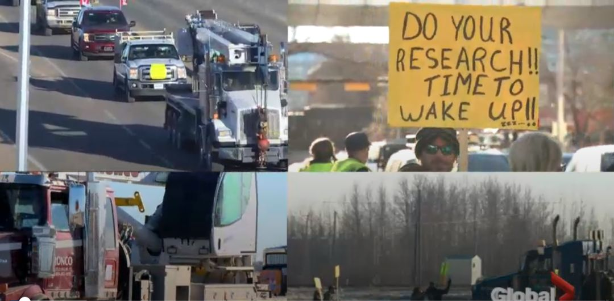

# 无标题

**链接地址:** http://mp.weixin.qq.com/s?__biz=MzI2NTE1ODgwOQ==&mid=2649605710&idx=1&sn=17ee6948269ff42fb3398c007fa3f33e&chksm=f2b8cfb8c5cf46ae3f276f47ec20efb31d795d0e69d6df0bce2f9259f034a8203474c82e965e&mpshare=1&scene=2&srcid=#rd
**作者:** 副局长
**获取时间:** 2025/8/28 20:56:54
**图片数量:** 15

---

## 原始HTML内容

<section style="box-sizing: border-box;"><section class="V5" style="box-sizing: border-box;" powered-by="xiumi.us"><section style="margin-right: 0%;margin-left: 0%;box-sizing: border-box;"><section style="display: inline-block;vertical-align: middle;width: 80%;box-sizing: border-box;"><section class="V5" style="box-sizing: border-box;" powered-by="xiumi.us"><section style="margin-top: 10px;margin-bottom: 10px;text-align: center;box-sizing: border-box;"><section style="display: inline-block;box-sizing: border-box;"><section style="max-width: 100%;font-size: 0px;padding-bottom: 3px;box-sizing: border-box;"><section style="display: inline-block;vertical-align: middle;box-sizing: border-box;"><section style="width: 5px;height: 1px;background-color: rgb(217, 217, 217);box-sizing: border-box;"></section><section style="width: 1px;height: 5px;margin-top: -3px;margin-right: auto;margin-left: auto;background-color: rgb(217, 217, 217);box-sizing: border-box;"></section></section><section style="margin-top: -1px;margin-right: -5px;margin-left: -5px;width: 100%;display: inline-block;vertical-align: middle;padding-right: 8px;padding-left: 8px;box-sizing: border-box;"><section style="width: 100%;height: 1px;background-color: rgb(217, 217, 217);box-sizing: border-box;"></section></section><section style="display: inline-block;vertical-align: middle;box-sizing: border-box;"><section style="width: 5px;height: 1px;background-color: rgb(217, 217, 217);box-sizing: border-box;"></section><section style="width: 1px;height: 5px;margin-top: -3px;margin-right: auto;margin-left: auto;background-color: rgb(217, 217, 217);box-sizing: border-box;"></section></section></section><section style="padding-left: 15px;padding-right: 15px;color: rgb(161, 161, 161);font-size: 14px;box-sizing: border-box;">
点击上方<strong style="box-sizing: border-box;">蓝字</strong>关注我们哟~
</section><section style="max-width: 100%;font-size: 0px;box-sizing: border-box;"><section style="display: inline-block;vertical-align: middle;box-sizing: border-box;"><section style="width: 5px;height: 1px;background-color: rgb(217, 217, 217);box-sizing: border-box;"></section><section style="width: 1px;height: 5px;margin-top: -3px;margin-right: auto;margin-left: auto;background-color: rgb(217, 217, 217);box-sizing: border-box;"></section></section><section style="margin-top: -1px;margin-right: -5px;margin-left: -5px;width: 100%;display: inline-block;vertical-align: middle;padding-right: 8px;padding-left: 8px;box-sizing: border-box;"><section style="width: 100%;height: 1px;background-color: rgb(217, 217, 217);box-sizing: border-box;"></section></section><section style="display: inline-block;vertical-align: middle;box-sizing: border-box;"><section style="width: 5px;height: 1px;background-color: rgb(217, 217, 217);box-sizing: border-box;"></section><section style="width: 1px;height: 5px;margin-top: -3px;margin-right: auto;margin-left: auto;background-color: rgb(217, 217, 217);box-sizing: border-box;"></section></section></section></section></section></section></section><section style="display: inline-block;vertical-align: middle;width: 20%;box-sizing: border-box;"><section class="V5" style="box-sizing: border-box;" powered-by="xiumi.us"><section style="text-align: center;margin: -10px 0% 10px;box-sizing: border-box;"><section style="max-width: 100%;vertical-align: middle;display: inline-block;width: 100%;box-sizing: border-box;"></section></section></section></section></section></section><section class="V5" style="box-sizing: border-box;" powered-by="xiumi.us"><section style="margin: 10px 0%;box-sizing: border-box;"><section style="display: inline-block;width: 100%;vertical-align: top;box-sizing: border-box;"><section class="V5" style="box-sizing: border-box;" powered-by="xiumi.us"><section style="box-sizing: border-box;"><section style="display: inline-block;vertical-align: bottom;width: 75%;padding-right: 10px;box-sizing: border-box;"><section class="V5" style="box-sizing: border-box;" powered-by="xiumi.us"><section style="margin: 10px 0% 3px;box-sizing: border-box;"><section style="display: inline-block;vertical-align: middle;box-sizing: border-box;"><section style="display: inline-block;vertical-align: bottom;padding-left: 5px;padding-right: 5px;line-height: 1.2em;margin-bottom: 2px;color: rgba(80, 182, 201, 0.72);box-sizing: border-box;">
<strong style="box-sizing: border-box;">仔细看下图，有惊喜！</strong>
</section><section style="max-width: 100%;display: inline-block;vertical-align: bottom;width: 1.6em;box-sizing: border-box;"></section></section></section></section></section><section style="display: inline-block;vertical-align: bottom;width: 25%;box-sizing: border-box;"><section class="V5" style="box-sizing: border-box;" powered-by="xiumi.us"><section style="margin-right: 0%;margin-bottom: 3px;margin-left: 0%;text-align: right;box-sizing: border-box;"><section style="display: inline-block;border-bottom: 0.15em solid rgba(80, 182, 201, 0.72);padding-bottom: 3px;box-sizing: border-box;"><section style="display: inline-block;padding: 3px;border-bottom: 0.15em solid rgba(80, 182, 201, 0.72);font-size: 12px;line-height: 1.4;color: rgb(255, 143, 47);box-sizing: border-box;">
<strong style="box-sizing: border-box;">金主大大</strong>
</section></section></section></section></section></section></section><section class="V5" style="box-sizing: border-box;" powered-by="xiumi.us"><section style="margin-right: 0%;margin-left: 0%;box-sizing: border-box;"><section style="background-color: rgba(80, 182, 201, 0.72);height: 2px;box-sizing: border-box;"></section></section></section></section></section></section><section class="V5" style="box-sizing: border-box;" powered-by="xiumi.us"><section style="text-align: center;margin-top: 10px;margin-bottom: 10px;box-sizing: border-box;"><section style="max-width: 100%;vertical-align: middle;display: inline-block;box-sizing: border-box;"></section></section></section><section class="V5" style="box-sizing: border-box;" powered-by="xiumi.us"><section style="text-align: center;margin-top: 10px;margin-bottom: 10px;box-sizing: border-box;"><section style="max-width: 100%;vertical-align: middle;display: inline-block;box-sizing: border-box;"></section></section></section><section class="V5" style="box-sizing: border-box;" powered-by="xiumi.us"><section style="text-align: center;margin-top: 10px;margin-bottom: 10px;box-sizing: border-box;"><section style="max-width: 100%;vertical-align: middle;display: inline-block;box-sizing: border-box;"></section></section></section><section class="V5" style="box-sizing: border-box;" powered-by="xiumi.us"><section style="text-align: center;margin-top: 10px;margin-bottom: 10px;box-sizing: border-box;"><section style="max-width: 100%;vertical-align: middle;display: inline-block;box-sizing: border-box;"></section></section></section><section class="V5" style="box-sizing: border-box;" powered-by="xiumi.us"><section style="text-align: center;margin-top: 10px;margin-bottom: 10px;box-sizing: border-box;"><section style="max-width: 100%;vertical-align: middle;display: inline-block;box-sizing: border-box;"><svg xmlns="http://www.w3.org/2000/svg" x="0px" y="0px" viewBox="0 0 902.1 38.2" style="vertical-align: middle;max-width: 100%;box-sizing: border-box;" width="902.1"><g style="box-sizing: border-box;"><path style="box-sizing: border-box;" d="M18.4,1.4c0.9-1.9,2.4-1.9,3.4,0l3.4,6.9c0.9,1.9,3.4,3.7,5.4,4l7.6,1.1c2.1,0.3,2.5,1.7,1,3.2   l-5.5,5.4c-1.5,1.5-2.4,4.3-2.1,6.4l1.3,7.6c0.4,2.1-0.9,2.9-2.7,2l-6.8-3.6c-1.8-1-4.9-1-6.7,0l-6.8,3.6c-1.9,1-3.1,0.1-2.7-2   l1.3-7.6c0.4-2.1-0.6-4.9-2.1-6.4l-5.5-5.4c-1.5-1.5-1-2.9,1-3.2l7.6-1.1c2.1-0.3,4.5-2.1,5.4-4L18.4,1.4z" fill="rgb(178, 243, 230)"></path><path style="box-sizing: border-box;" d="M90.6,5.4c0.7-1.4,1.9-1.4,2.6,0l2.6,5.3c0.7,1.4,2.6,2.8,4.2,3.1l5.9,0.9c1.6,0.2,2,1.3,0.8,2.5   l-4.2,4.1c-1.2,1.1-1.9,3.3-1.6,4.9l1,5.8c0.3,1.6-0.7,2.3-2.1,1.5l-5.2-2.8c-1.4-0.8-3.8-0.8-5.2,0L84,33.6   c-1.4,0.8-2.4,0.1-2.1-1.5l1-5.8c0.3-1.6-0.5-3.8-1.6-4.9l-4.2-4.1c-1.2-1.1-0.8-2.2,0.8-2.5l5.9-0.9c1.6-0.2,3.5-1.6,4.2-3.1   L90.6,5.4z" fill="rgb(190, 204, 246)"></path><path style="box-sizing: border-box;" d="M162.6,7.5c0.6-1.2,1.6-1.2,2.2,0l2.2,4.5c0.6,1.2,2.2,2.4,3.6,2.6l5,0.7c1.4,0.2,1.7,1.1,0.7,2.1   l-3.6,3.5c-1,1-1.6,2.9-1.4,4.2l0.9,5c0.2,1.4-0.6,1.9-1.8,1.3l-4.5-2.4c-1.2-0.6-3.2-0.6-4.4,0l-4.5,2.4c-1.2,0.6-2,0.1-1.8-1.3   l0.9-5c0.2-1.4-0.4-3.3-1.4-4.2l-3.6-3.5c-1-1-0.7-1.9,0.7-2.1l5-0.7c1.4-0.2,3-1.4,3.6-2.6L162.6,7.5z" fill="rgb(150, 208, 240)"></path><path style="box-sizing: border-box;" d="M60.1,19.1c0,2.3-1.9,4.2-4.2,4.2c-2.3,0-4.2-1.9-4.2-4.2s1.9-4.2,4.2-4.2   C58.3,14.9,60.1,16.8,60.1,19.1z" fill="rgb(218, 240, 224)"></path><path style="box-sizing: border-box;" d="M203.8,19.1c0,2.3-1.9,4.2-4.2,4.2c-2.3,0-4.2-1.9-4.2-4.2s1.9-4.2,4.2-4.2   C201.9,14.9,203.8,16.8,203.8,19.1z" fill="rgb(218, 240, 224)"></path><path style="box-sizing: border-box;" d="M130.9,19.1c0,1.7-1.4,3.1-3.1,3.1c-1.7,0-3.1-1.4-3.1-3.1c0-1.7,1.4-3.1,3.1-3.1   C129.5,16.1,130.9,17.4,130.9,19.1z" fill="rgb(218, 240, 224)"></path><path style="box-sizing: border-box;" d="M233.9,1.4c0.9-1.9,2.4-1.9,3.4,0l3.4,6.9c0.9,1.9,3.4,3.7,5.4,4l7.6,1.1c2.1,0.3,2.5,1.7,1,3.2   l-5.5,5.4c-1.5,1.5-2.4,4.3-2.1,6.4l1.3,7.6c0.4,2.1-0.9,2.9-2.7,2l-6.8-3.6c-1.8-1-4.9-1-6.7,0l-6.8,3.6c-1.9,1-3.1,0.1-2.7-2   l1.3-7.6c0.4-2.1-0.6-4.9-2.1-6.4l-5.5-5.4c-1.5-1.5-1-2.9,1-3.2l7.6-1.1c2.1-0.3,4.5-2.1,5.4-4L233.9,1.4z" fill="rgb(178, 243, 230)"></path><path style="box-sizing: border-box;" d="M306.1,5.4c0.7-1.4,1.9-1.4,2.6,0l2.6,5.3c0.7,1.4,2.6,2.8,4.2,3.1l5.9,0.9c1.6,0.2,2,1.3,0.8,2.5   l-4.2,4.1c-1.2,1.1-1.9,3.3-1.6,4.9l1,5.8c0.3,1.6-0.7,2.3-2.1,1.5l-5.2-2.8c-1.4-0.8-3.8-0.8-5.2,0l-5.2,2.8   c-1.4,0.8-2.4,0.1-2.1-1.5l1-5.8c0.3-1.6-0.4-3.8-1.6-4.9l-4.2-4.1c-1.2-1.1-0.8-2.2,0.8-2.5l5.9-0.9c1.6-0.2,3.5-1.6,4.2-3.1   L306.1,5.4z" fill="rgb(190, 204, 246)"></path><path style="box-sizing: border-box;" d="M378.1,7.5c0.6-1.2,1.6-1.2,2.2,0l2.2,4.5c0.6,1.2,2.2,2.4,3.6,2.6l5,0.7c1.4,0.2,1.7,1.1,0.7,2.1   l-3.6,3.5c-1,1-1.6,2.9-1.4,4.2l0.9,5c0.2,1.4-0.6,1.9-1.8,1.3l-4.5-2.4c-1.2-0.6-3.2-0.6-4.4,0l-4.5,2.4c-1.2,0.6-2,0.1-1.8-1.3   l0.9-5c0.2-1.4-0.4-3.3-1.4-4.2l-3.6-3.5c-1-1-0.7-1.9,0.7-2.1l5-0.7c1.4-0.2,3-1.4,3.6-2.6L378.1,7.5z" fill="rgb(150, 208, 240)"></path><path style="box-sizing: border-box;" d="M275.7,19.1c0,2.3-1.9,4.2-4.2,4.2c-2.3,0-4.2-1.9-4.2-4.2s1.9-4.2,4.2-4.2   C273.8,14.9,275.7,16.8,275.7,19.1z" fill="rgb(218, 240, 224)"></path><path style="box-sizing: border-box;" d="M419.3,19.1c0,2.3-1.9,4.2-4.2,4.2c-2.3,0-4.2-1.9-4.2-4.2s1.9-4.2,4.2-4.2   C417.5,14.9,419.3,16.8,419.3,19.1z" fill="rgb(218, 240, 224)"></path><path style="box-sizing: border-box;" d="M346.4,19.1c0,1.7-1.4,3.1-3.1,3.1c-1.7,0-3.1-1.4-3.1-3.1c0-1.7,1.4-3.1,3.1-3.1   C345,16.1,346.4,17.4,346.4,19.1z" fill="rgb(218, 240, 224)"></path><path style="box-sizing: border-box;" d="M449.4,1.4c0.9-1.9,2.4-1.9,3.4,0l3.4,6.9c0.9,1.9,3.4,3.7,5.4,4l7.6,1.1c2.1,0.3,2.5,1.7,1,3.2   l-5.5,5.4c-1.5,1.5-2.4,4.3-2.1,6.4l1.3,7.6c0.4,2.1-0.9,2.9-2.7,2l-6.8-3.6c-1.8-1-4.9-1-6.7,0l-6.8,3.6c-1.9,1-3.1,0.1-2.7-2   l1.3-7.6c0.4-2.1-0.6-4.9-2.1-6.4l-5.5-5.4c-1.5-1.5-1-2.9,1-3.2l7.6-1.1c2.1-0.3,4.5-2.1,5.4-4L449.4,1.4z" fill="rgb(178, 243, 230)"></path><path style="box-sizing: border-box;" d="M521.6,5.4c0.7-1.4,1.9-1.4,2.6,0l2.6,5.3c0.7,1.4,2.6,2.8,4.2,3.1l5.9,0.9c1.6,0.2,2,1.3,0.8,2.5   l-4.2,4.1c-1.2,1.1-1.9,3.3-1.6,4.9l1,5.8c0.3,1.6-0.7,2.3-2.1,1.5l-5.2-2.8c-1.4-0.8-3.8-0.8-5.2,0l-5.2,2.8   c-1.4,0.8-2.4,0.1-2.1-1.5l1-5.8c0.3-1.6-0.5-3.8-1.6-4.9l-4.2-4.1c-1.2-1.1-0.8-2.2,0.8-2.5l5.9-0.9c1.6-0.2,3.5-1.6,4.2-3.1   L521.6,5.4z" fill="rgb(190, 204, 246)"></path><path style="box-sizing: border-box;" d="M593.6,7.5c0.6-1.2,1.6-1.2,2.2,0l2.2,4.5c0.6,1.2,2.2,2.4,3.6,2.6l5,0.7c1.4,0.2,1.7,1.1,0.7,2.1   l-3.6,3.5c-1,1-1.6,2.9-1.4,4.2l0.9,5c0.2,1.4-0.6,1.9-1.8,1.3l-4.5-2.4c-1.2-0.6-3.2-0.6-4.4,0l-4.5,2.4c-1.2,0.6-2,0.1-1.8-1.3   l0.9-5c0.2-1.4-0.4-3.3-1.4-4.2l-3.6-3.5c-1-1-0.7-1.9,0.7-2.1l5-0.7c1.4-0.2,3-1.4,3.6-2.6L593.6,7.5z" fill="rgb(150, 208, 240)"></path><path style="box-sizing: border-box;" d="M491.2,19.1c0,2.3-1.9,4.2-4.2,4.2c-2.3,0-4.2-1.9-4.2-4.2s1.9-4.2,4.2-4.2   C489.3,14.9,491.2,16.8,491.2,19.1z" fill="rgb(218, 240, 224)"></path><path style="box-sizing: border-box;" d="M634.9,19.1c0,2.3-1.9,4.2-4.2,4.2c-2.3,0-4.2-1.9-4.2-4.2s1.9-4.2,4.2-4.2   C633,14.9,634.9,16.8,634.9,19.1z" fill="rgb(218, 240, 224)"></path><path style="box-sizing: border-box;" d="M561.9,19.1c0,1.7-1.4,3.1-3.1,3.1c-1.7,0-3.1-1.4-3.1-3.1c0-1.7,1.4-3.1,3.1-3.1   C560.5,16.1,561.9,17.4,561.9,19.1z" fill="rgb(218, 240, 224)"></path><path style="box-sizing: border-box;" d="M664.9,1.4c0.9-1.9,2.4-1.9,3.4,0l3.4,6.9c0.9,1.9,3.4,3.7,5.4,4l7.6,1.1c2.1,0.3,2.5,1.7,1,3.2   l-5.5,5.4c-1.5,1.5-2.4,4.3-2.1,6.4l1.3,7.6c0.4,2.1-0.9,2.9-2.7,2l-6.8-3.6c-1.8-1-4.9-1-6.7,0l-6.8,3.6c-1.9,1-3.1,0.1-2.7-2   l1.3-7.6c0.4-2.1-0.6-4.9-2.1-6.4l-5.5-5.4c-1.5-1.5-1-2.9,1-3.2l7.6-1.1c2.1-0.3,4.5-2.1,5.4-4L664.9,1.4z" fill="rgb(178, 243, 230)"></path><path style="box-sizing: border-box;" d="M737.1,5.4c0.7-1.4,1.9-1.4,2.6,0l2.6,5.3c0.7,1.4,2.6,2.8,4.2,3.1l5.9,0.9c1.6,0.2,2,1.3,0.8,2.5   l-4.2,4.1c-1.2,1.1-1.9,3.3-1.6,4.9l1,5.8c0.3,1.6-0.7,2.3-2.1,1.5l-5.2-2.8c-1.4-0.8-3.8-0.8-5.2,0l-5.2,2.8   c-1.4,0.8-2.4,0.1-2.1-1.5l1-5.8c0.3-1.6-0.5-3.8-1.6-4.9l-4.2-4.1c-1.2-1.1-0.8-2.2,0.8-2.5l5.9-0.9c1.6-0.2,3.5-1.6,4.2-3.1   L737.1,5.4z" fill="rgb(190, 204, 246)"></path><path style="box-sizing: border-box;" d="M809.2,7.5c0.6-1.2,1.6-1.2,2.2,0l2.2,4.5c0.6,1.2,2.2,2.4,3.6,2.6l5,0.7c1.4,0.2,1.7,1.1,0.7,2.1   l-3.6,3.5c-1,1-1.6,2.9-1.4,4.2l0.9,5c0.2,1.4-0.6,1.9-1.8,1.3l-4.5-2.4c-1.2-0.6-3.2-0.6-4.4,0l-4.5,2.4c-1.2,0.6-2,0.1-1.8-1.3   l0.9-5c0.2-1.4-0.4-3.3-1.4-4.2l-3.6-3.5c-1-1-0.7-1.9,0.7-2.1l5-0.7c1.4-0.2,3-1.4,3.6-2.6L809.2,7.5z" fill="rgb(150, 208, 240)"></path><path style="box-sizing: border-box;" d="M706.7,19.1c0,2.3-1.9,4.2-4.2,4.2c-2.3,0-4.2-1.9-4.2-4.2s1.9-4.2,4.2-4.2   C704.8,14.9,706.7,16.8,706.7,19.1z" fill="rgb(218, 240, 224)"></path><path style="box-sizing: border-box;" d="M850.4,19.1c0,2.3-1.9,4.2-4.2,4.2c-2.3,0-4.2-1.9-4.2-4.2s1.9-4.2,4.2-4.2   C848.5,14.9,850.4,16.8,850.4,19.1z" fill="rgb(218, 240, 224)"></path><path style="box-sizing: border-box;" d="M777.4,19.1c0,1.7-1.4,3.1-3.1,3.1c-1.7,0-3.1-1.4-3.1-3.1c0-1.7,1.4-3.1,3.1-3.1   C776,16.1,777.4,17.4,777.4,19.1z" fill="rgb(218, 240, 224)"></path><path style="box-sizing: border-box;" d="M880.4,1.4c0.9-1.9,2.4-1.9,3.4,0l3.4,6.9c0.9,1.9,3.4,3.7,5.4,4l7.6,1.1c2.1,0.3,2.5,1.7,1,3.2   l-5.5,5.4c-1.5,1.5-2.4,4.3-2.1,6.4l1.3,7.6c0.4,2.1-0.9,2.9-2.7,2l-6.8-3.6c-1.8-1-4.9-1-6.7,0l-6.8,3.6c-1.8,1-3.1,0.1-2.7-2   l1.3-7.6c0.4-2.1-0.6-4.9-2.1-6.4l-5.5-5.4c-1.5-1.5-1-2.9,1-3.2l7.6-1.1c2.1-0.3,4.5-2.1,5.4-4L880.4,1.4z" fill="rgb(178, 243, 230)"></path></g></svg></section></section></section><section class="V5" style="box-sizing: border-box;" powered-by="xiumi.us"><section style="box-sizing: border-box;"><section style="text-align: center;box-sizing: border-box;">
想必大家对最近的法国<strong>“黄衫军”</strong>革命新闻有所耳闻。

 

由于油价上涨，已经有超过10万法国人上街游行，共造成近300人受伤、名胜古迹、街道商户损失惨重。这是法国1968年以来最严重的街头暴力活动。<strong>“黄背心”是法国民众骚乱的标志</strong>。

 

这场“革命”目前也在加拿大展开了。原因是加拿大即将签署的<strong>《全球移民协议》</strong>，以及油价走低，工人失业，物价飙高等<strong>众多综合问题</strong>引发很多民众不满。

 

阿尔伯塔省便是这样一个集合各种严重问题尤为尖锐的省份。于是在昨天，本周六早上，<strong>超过一百名黄色背心</strong>集会和车队占领了位于该省省会<strong>埃德蒙顿市的省立法机关</strong>。 

 

 

无独有偶。这次有组织有预谋的抗议活动同时在<strong>阿省的主要五大城市同时开展</strong>——在埃德蒙顿，卡尔加里，布鲁克斯，埃德森和梅迪辛哈特的抗议活动中，人们穿着黄色背心，驾驶着车队，抗议联合国移民协议，挣扎中的石油工业，管道延误和特鲁多政府。

 

<strong>这已经不是埃德蒙顿市第一次爆发黄背心革命</strong>。

 

 

<strong>埃德蒙顿</strong>

 

上周末，温斯顿丘吉尔广场的抗议活动也导致了一场战斗，警方至少制服了两名情绪激荡的抗议者，并努力使抗议者的情绪稳定下来。

 

 

关于上次暴动的信息请浏览我们上周末推送的文章：

 

<a href="http://mp.weixin.qq.com/s?__biz=MzI2NTE1ODgwOQ==&amp;mid=2649605660&amp;idx=1&amp;sn=224e9fe20f3dc78537189cb00678a8b8&amp;chksm=f2b8cfeac5cf46fc93eeda88939494949e777a6993671945df8f848b40597bc290581c1dc323&amp;scene=21#wechat_redirect" target="_blank" data-linktype="2">【突发】爱城暴动了！黄马甲席卷加拿大！4大城市掀起游行！碳税，难民，生活成本，总有一条能激怒你！</a> 

 

由于黄色背心发言人向人群表达了他们对政府的暴怒，抗议者集体齐声高呼<strong>“特鲁多下台！”</strong>

石油和天然气工人迈克威普夫像记者抱怨道“我们在最高法院当选的[代表]，在联邦政府和省级选举产生的职位上，除了拿一个可观的薪水之外什么也没做。”

 

然而从现场发回的照片可以看出，抗议的事态已经升级。从简单的示威游行已经上升到<strong>暴力性质的殴打</strong>。一些主张和平的社会人士对这样的情况<strong>表示忧心</strong>。在现场参与活动的Derek Horneland提到了<strong>暴力升级真对部分难民移民</strong>的可能性。
<blockquote style="box-sizing: border-box;margin: 1em 40px 1em 10px;font-variant-numeric: normal;font-variant-east-asian: normal;font-stretch: normal;font-size: 1.33em;line-height: 29.6191px;font-family: proxima-nova, Helvetica, Arial, sans-serif;border-left-color: rgb(225, 28, 46);padding-top: 8px;padding-bottom: 8px;padding-left: 26px;letter-spacing: 0.45px;white-space: normal;background-color: rgb(255, 255, 255);">
“自从黄色背心运动开始以来，我的一些移民到这里的朋友已经受到<strong>死亡威胁</strong>，”Horneland说。
</blockquote>
抗议者们对难民移民产生了很多因社会背景和所处利益阶层而产生的仇恨。对<strong>城市经济衰败和石油产业萎缩的的挫败感</strong>被错误地转嫁到了移民身上，从而且变得非常<strong>易怒且暴力</strong>。

 

<strong>卡尔加里</strong>

<strong> </strong>

 

星期六在卡尔加里市政大楼外面，约有100名穿着黄色安全背心的抗议者在标语上写着“魁北克滚出”，“建造管道”和“联合国是一个骗局”。

Vern Sparkes就是其中之一，他们对联合国移民协议没有公投表示不满，称其为<strong>“全球性回收”</strong>。Sparkes还批评总理，称他“正在签署买卖[加拿大]的主权。”

该协议是一个<strong>无法律约束力的合作框架</strong>，“重申各国决定其国家移民政策的主权权利。”这意味着政府不会通过签署协议来签署设计移民政策的权利。

这让生活在加拿大的<strong>民众缺乏社会安全感</strong>，恐慌自己的社区会被大量外来人口侵占而造成文化错位。

 

<strong>埃德森</strong>

 

约有<strong>1000人参加</strong>了埃德森的声势浩大的抗议集会和卡车车队支持管道建设，并希望以此引起联邦政府的注意力。

John Goodwin参加了这个活动，意在引起了<strong>对失业影响人群的关注</strong>。
<blockquote style="box-sizing: border-box;margin: 1em 40px 1em 10px;font-variant-numeric: normal;font-variant-east-asian: normal;font-stretch: normal;font-size: 1.33em;line-height: 29.6191px;font-family: proxima-nova, Helvetica, Arial, sans-serif;border-left-color: rgb(225, 28, 46);padding-top: 8px;padding-bottom: 8px;padding-left: 26px;letter-spacing: 0.45px;white-space: normal;background-color: rgb(255, 255, 255);">
“令人沮丧的是我们：失去了家园，失去原有的生活方式，有些人甚至失去了家庭，”他说。“他们没有工作，他们需要工作。这条管道需要开始建造才能让人们重新开始工作。“
</blockquote>
Yellowhead议员吉姆埃格林斯基说，他驾驶着的车辆上张贴着标志和旗帜，一次<strong>来表明他对石油工人的支持</strong>。

他说：“我们正试图说明一点，渥太华现在已经<strong>注意到了艾伯塔省的困境</strong>。”&nbsp;“我虽然不相信他们，但我们需要组织这些活动，而且我相信全省正在组织的这些集会正在说明一点，我认为人们会听到我们，特别是在加拿大东部！”

 

<strong>抗议还会继续！直到政府重视起来！</strong>

 

虽然“黄马甲运动”已在加拿大多个城市“生根发芽”，加拿大媒体也强调说这些“黄马甲”在“激烈程度”上远比不上法国的“黄马甲”，而且也没有出现类似法国的“打砸抢”等暴力情况，<strong>抗议者们都还比较克制</strong>。　

 

但加拿大媒体也指出，与法国相同的是，不论是支持保守主义还是支持左翼自由主义，加拿大的“黄马甲”们都对加拿大的现状感到不满，并认为<strong>只有让特鲁多政府下台才是“出路”</strong>。

 

<strong>希望法国的今天不会是加拿大的明天！</strong>

<strong> </strong>

<strong>- 更多精彩内容，欢迎关注我们 -</strong>
</section></section></section><section class="V5" style="box-sizing: border-box;" powered-by="xiumi.us"><section style="box-sizing: border-box;"><section style="box-sizing: border-box;">
 
</section></section></section><section class="V5" style="box-sizing: border-box;" powered-by="xiumi.us"><section style="box-sizing: border-box;"><section style="box-sizing: border-box;">
 
</section></section></section><section class="V5" style="box-sizing: border-box;" powered-by="xiumi.us"><section style="margin: 40px 0% 10px;text-align: center;box-sizing: border-box;"><section style="display: inline-block;width: 90%;border-width: 1px;border-style: dotted;border-color: rgba(80, 182, 201, 0.72);padding: 10px;border-radius: 0px;box-sizing: border-box;"><section class="V5" style="box-sizing: border-box;" powered-by="xiumi.us"><section style="transform: translate3d(20px, 0px, 0px);text-align: left;font-size: 11px;margin-top: -55px;margin-right: 0%;margin-left: 0%;box-sizing: border-box;"><section style="box-sizing: border-box;width: 7em;height: 7em;display: inline-block;vertical-align: bottom;border-radius: 100%;border-width: 5px;border-style: none;border-color: rgba(80, 182, 201, 0.72);background-position: center center;background-repeat: no-repeat;background-size: cover;background-image: url(&quot;https://mmbiz.qpic.cn/mmbiz_jpg/D1nJqnhkPyJlicqXlhom8Br9agllSSO0ojz0BNbiaFP6L1LOEvJAsWOkDicVSHpXLpyeZHCTdFgzCz5ePPJ3hQs8g/640?wx_fmt=jpeg&quot;);"><section style="width: 100%;height: 100%;overflow: hidden;line-height: 0;box-sizing: border-box;"></section></section></section></section><section class="V5" style="box-sizing: border-box;" powered-by="xiumi.us"><section style="box-sizing: border-box;"><section class="group-empty" style="display: inline-block;vertical-align: top;width: 38.2%;box-sizing: border-box;height: 1px;"></section><section style="display: inline-block;vertical-align: top;width: 61.8%;box-sizing: border-box;"><section class="V5" style="box-sizing: border-box;" powered-by="xiumi.us"><section style="margin-right: 0%;margin-left: 0%;box-sizing: border-box;"><section style="font-size: 18px;color: rgb(67, 103, 117);line-height: 1.6;letter-spacing: 1px;box-sizing: border-box;">
<strong style="box-sizing: border-box;">埃德蒙顿微生活</strong>
</section></section></section><section class="V5" style="box-sizing: border-box;" powered-by="xiumi.us"><section style="margin-top: 0.5em;margin-bottom: 0.5em;box-sizing: border-box;"><section style="background-color: rgba(80, 182, 201, 0.72);height: 1px;box-sizing: border-box;"></section></section></section></section></section></section><section class="V5" style="box-sizing: border-box;" powered-by="xiumi.us"><section style="box-sizing: border-box;"><section style="text-align: justify;font-size: 14px;color: rgba(62, 62, 62, 0.72);letter-spacing: 2px;box-sizing: border-box;">
<strong style="box-sizing: border-box;">关心埃德蒙顿民生，</strong>

<strong style="box-sizing: border-box;">关注埃德蒙顿的发展。</strong>

 

埃德蒙顿微生活是“吃喝玩乐埃德蒙顿”旗下，为埃德蒙顿地区的居民提供每日最新的吃喝玩乐、工作学习、商业投资的媒体平台 。
</section></section></section><section class="V5" style="box-sizing: border-box;" powered-by="xiumi.us"><section style="box-sizing: border-box;"><section style="text-align: left;box-sizing: border-box;">
 
</section></section></section><section class="V5" style="box-sizing: border-box;" powered-by="xiumi.us"><section style="box-sizing: border-box;"><section style="display: inline-block;vertical-align: middle;width: 61.8%;box-sizing: border-box;"><section class="V5" style="box-sizing: border-box;" powered-by="xiumi.us"><section style="box-sizing: border-box;"><section style="text-align: justify;font-size: 12px;color: rgba(62, 62, 62, 0.37);line-height: 1.9;letter-spacing: 0px;box-sizing: border-box;">
我们的目标是以最新、最快、最及时的方式 报道埃德蒙顿的新鲜事 。 
</section></section></section></section><section style="display: inline-block;vertical-align: middle;width: 38.2%;box-sizing: border-box;"><section class="V5" style="box-sizing: border-box;" powered-by="xiumi.us"><section style="margin-right: 0%;margin-left: 0%;box-sizing: border-box;"><section style="max-width: 100%;vertical-align: middle;display: inline-block;width: 70%;box-sizing: border-box;"></section></section></section></section></section></section></section></section></section></section>
 

---

## 纯文本内容

点击上方蓝字关注我们哟~仔细看下图，有惊喜！金主大大想必大家对最近的法国“黄衫军”革命新闻有所耳闻。由于油价上涨，已经有超过10万法国人上街游行，共造成近300人受伤、名胜古迹、街道商户损失惨重。这是法国1968年以来最严重的街头暴力活动。“黄背心”是法国民众骚乱的标志。这场“革命”目前也在加拿大展开了。原因是加拿大即将签署的《全球移民协议》，以及油价走低，工人失业，物价飙高等众多综合问题引发很多民众不满。阿尔伯塔省便是这样一个集合各种严重问题尤为尖锐的省份。于是在昨天，本周六早上，超过一百名黄色背心集会和车队占领了位于该省省会埃德蒙顿市的省立法机关。无独有偶。这次有组织有预谋的抗议活动同时在阿省的主要五大城市同时开展——在埃德蒙顿，卡尔加里，布鲁克斯，埃德森和梅迪辛哈特的抗议活动中，人们穿着黄色背心，驾驶着车队，抗议联合国移民协议，挣扎中的石油工业，管道延误和特鲁多政府。这已经不是埃德蒙顿市第一次爆发黄背心革命。埃德蒙顿上周末，温斯顿丘吉尔广场的抗议活动也导致了一场战斗，警方至少制服了两名情绪激荡的抗议者，并努力使抗议者的情绪稳定下来。关于上次暴动的信息请浏览我们上周末推送的文章：【突发】爱城暴动了！黄马甲席卷加拿大！4大城市掀起游行！碳税，难民，生活成本，总有一条能激怒你！由于黄色背心发言人向人群表达了他们对政府的暴怒，抗议者集体齐声高呼“特鲁多下台！”石油和天然气工人迈克威普夫像记者抱怨道“我们在最高法院当选的[代表]，在联邦政府和省级选举产生的职位上，除了拿一个可观的薪水之外什么也没做。”然而从现场发回的照片可以看出，抗议的事态已经升级。从简单的示威游行已经上升到暴力性质的殴打。一些主张和平的社会人士对这样的情况表示忧心。在现场参与活动的Derek Horneland提到了暴力升级真对部分难民移民的可能性。“自从黄色背心运动开始以来，我的一些移民到这里的朋友已经受到死亡威胁，”Horneland说。抗议者们对难民移民产生了很多因社会背景和所处利益阶层而产生的仇恨。对城市经济衰败和石油产业萎缩的的挫败感被错误地转嫁到了移民身上，从而且变得非常易怒且暴力。卡尔加里星期六在卡尔加里市政大楼外面，约有100名穿着黄色安全背心的抗议者在标语上写着“魁北克滚出”，“建造管道”和“联合国是一个骗局”。Vern Sparkes就是其中之一，他们对联合国移民协议没有公投表示不满，称其为“全球性回收”。Sparkes还批评总理，称他“正在签署买卖[加拿大]的主权。”该协议是一个无法律约束力的合作框架，“重申各国决定其国家移民政策的主权权利。”这意味着政府不会通过签署协议来签署设计移民政策的权利。这让生活在加拿大的民众缺乏社会安全感，恐慌自己的社区会被大量外来人口侵占而造成文化错位。埃德森约有1000人参加了埃德森的声势浩大的抗议集会和卡车车队支持管道建设，并希望以此引起联邦政府的注意力。John Goodwin参加了这个活动，意在引起了对失业影响人群的关注。“令人沮丧的是我们：失去了家园，失去原有的生活方式，有些人甚至失去了家庭，”他说。“他们没有工作，他们需要工作。这条管道需要开始建造才能让人们重新开始工作。“Yellowhead议员吉姆埃格林斯基说，他驾驶着的车辆上张贴着标志和旗帜，一次来表明他对石油工人的支持。他说：“我们正试图说明一点，渥太华现在已经注意到了艾伯塔省的困境。” “我虽然不相信他们，但我们需要组织这些活动，而且我相信全省正在组织的这些集会正在说明一点，我认为人们会听到我们，特别是在加拿大东部！”抗议还会继续！直到政府重视起来！虽然“黄马甲运动”已在加拿大多个城市“生根发芽”，加拿大媒体也强调说这些“黄马甲”在“激烈程度”上远比不上法国的“黄马甲”，而且也没有出现类似法国的“打砸抢”等暴力情况，抗议者们都还比较克制。　但加拿大媒体也指出，与法国相同的是，不论是支持保守主义还是支持左翼自由主义，加拿大的“黄马甲”们都对加拿大的现状感到不满，并认为只有让特鲁多政府下台才是“出路”。希望法国的今天不会是加拿大的明天！- 更多精彩内容，欢迎关注我们 -埃德蒙顿微生活关心埃德蒙顿民生，关注埃德蒙顿的发展。埃德蒙顿微生活是“吃喝玩乐埃德蒙顿”旗下，为埃德蒙顿地区的居民提供每日最新的吃喝玩乐、工作学习、商业投资的媒体平台 。我们的目标是以最新、最快、最及时的方式 报道埃德蒙顿的新鲜事 。

---

## 图片列表

-  (原始链接: https://mmbiz.qpic.cn/mmbiz_gif/D1nJqnhkPyJlicqXlhom8Br9agllSSO0oou4TIyWpdgfaMSZSEHsqCQX7GrKTkCicN3Dz1yMJR8UvhJLKx81DibOQ/640?wx_fmt=gif)
-  (原始链接: https://mmbiz.qpic.cn/mmbiz_gif/D1nJqnhkPyJlicqXlhom8Br9agllSSO0ocnw0btKjsibHfuicGTCfUdy44ibichk6yALricLN4Ur1zgQUVE3Suf2GrQg/640?wx_fmt=gif)
-  (原始链接: https://mmbiz.qpic.cn/mmbiz_jpg/D1nJqnhkPyJlicqXlhom8Br9agllSSO0obCtSvTd7GXEAI4SX6mOhJ60BHMtscib9iaz8Fe5ficib0bOUTjEV5WnJ6w/640?wx_fmt=jpeg)
-  (原始链接: https://mmbiz.qpic.cn/mmbiz_jpg/D1nJqnhkPyJlicqXlhom8Br9agllSSO0oWCB6ntRSlC45PVctQav01bb49gkDCI2zoEwdfXqXfpnD8AFeMEUMQQ/640?wx_fmt=jpeg)
-  (原始链接: https://mmbiz.qpic.cn/mmbiz_jpg/D1nJqnhkPyJlicqXlhom8Br9agllSSO0oicZichbqofp7NxWCicKJc3k9J8I85RY9ibMMlV88YSU0icXUVGxnfUibqZAg/640?wx_fmt=jpeg)
-  (原始链接: https://mmbiz.qpic.cn/mmbiz_jpg/D1nJqnhkPyJlicqXlhom8Br9agllSSO0oS1RJoBje3rXLbZUSyeHuYM9LVoI6fwAIVrdkMKRtmtlG7za1nibjtjg/640?wx_fmt=jpeg)
-  (原始链接: https://mmbiz.qpic.cn/mmbiz_jpg/kRXMiae96WTC2srm4QT9ALtbwya9QRYEgSt4A0ZQ0kfUQmVN4hP1KFqxFBZGIfWYic42zmCWfbdNP3ibibfWVsa0bw/640?wx_fmt=jpeg)
-  (原始链接: https://mmbiz.qpic.cn/mmbiz_png/D1nJqnhkPyJlicqXlhom8Br9agllSSO0o759t7sjZ9Dygw6Omes2pu2Xhf3282Vx71pvWfTILtt1P3DhV4oMiavQ/640?wx_fmt=png)
-  (原始链接: https://mmbiz.qpic.cn/mmbiz_png/D1nJqnhkPyJlicqXlhom8Br9agllSSO0oYicMeiaw6aRkALGvEic7JCaok9hgBrQ6e9X29SecthWl6Do3AGS7k2YDA/640?wx_fmt=png)
-  (原始链接: https://mmbiz.qpic.cn/mmbiz_png/D1nJqnhkPyJlicqXlhom8Br9agllSSO0oNvBnwJEDtlFJibNv7HoalIjAwDuIScx7IiaacyFMYt6GYnZpZwcBpZcQ/640?wx_fmt=png)
-  (原始链接: https://mmbiz.qpic.cn/mmbiz_png/D1nJqnhkPyJlicqXlhom8Br9agllSSO0odNXBZ3VuCoTkX15CTZru1rODIJPFC9LYs3l0icEt2ibkwiaACVspI44AQ/640?wx_fmt=png)
-  (原始链接: https://mmbiz.qpic.cn/mmbiz_png/D1nJqnhkPyJlicqXlhom8Br9agllSSO0owKyicia1qIPIvazXWats9OJfgGWbzZJtHDn43Uibvt5zmXjuYmoS9J6nw/640?wx_fmt=png)
-  (原始链接: https://mmbiz.qpic.cn/mmbiz_png/D1nJqnhkPyJlicqXlhom8Br9agllSSO0oW727uHiaWGYNg8UgeK2zCLicwu8F2yams1JGHp65MP5ay4wzf5xaDZdg/640?wx_fmt=png)
-  (原始链接: https://mmbiz.qpic.cn/mmbiz_jpg/D1nJqnhkPyJlicqXlhom8Br9agllSSO0ojz0BNbiaFP6L1LOEvJAsWOkDicVSHpXLpyeZHCTdFgzCz5ePPJ3hQs8g/640?wx_fmt=jpeg)
-  (原始链接: https://mmbiz.qpic.cn/mmbiz_jpg/D1nJqnhkPyJlicqXlhom8Br9agllSSO0oCT5uWGn3sArgkzU734GKbwKqqtP5w1I7fsYn2ibl5TauZHlDBJOa8jw/640?wx_fmt=jpeg)
